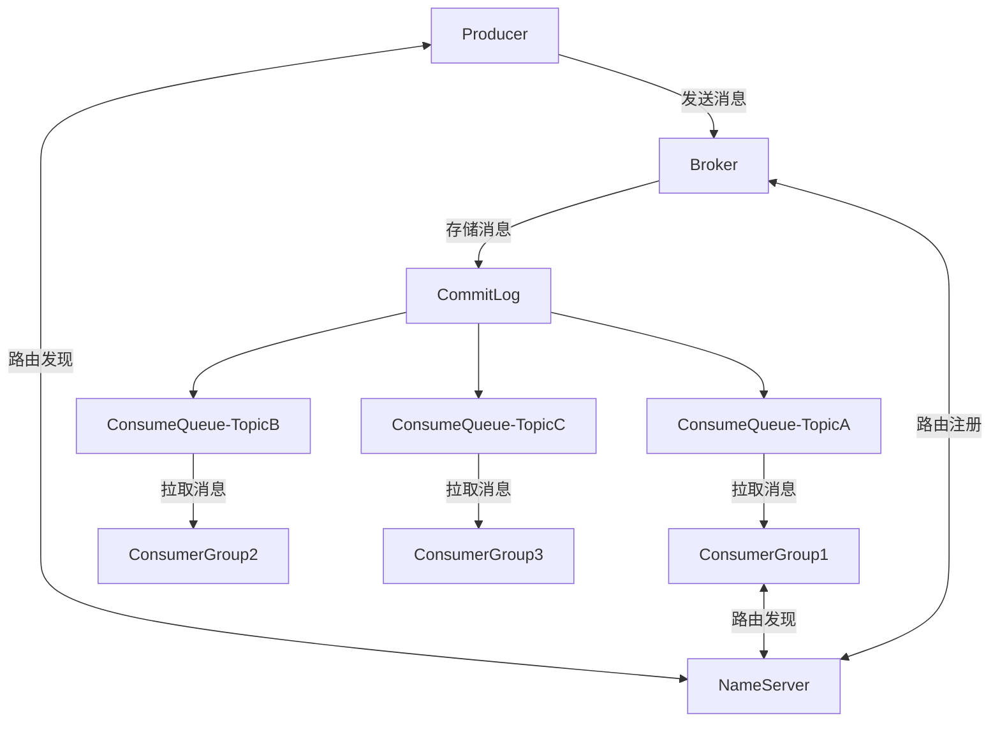
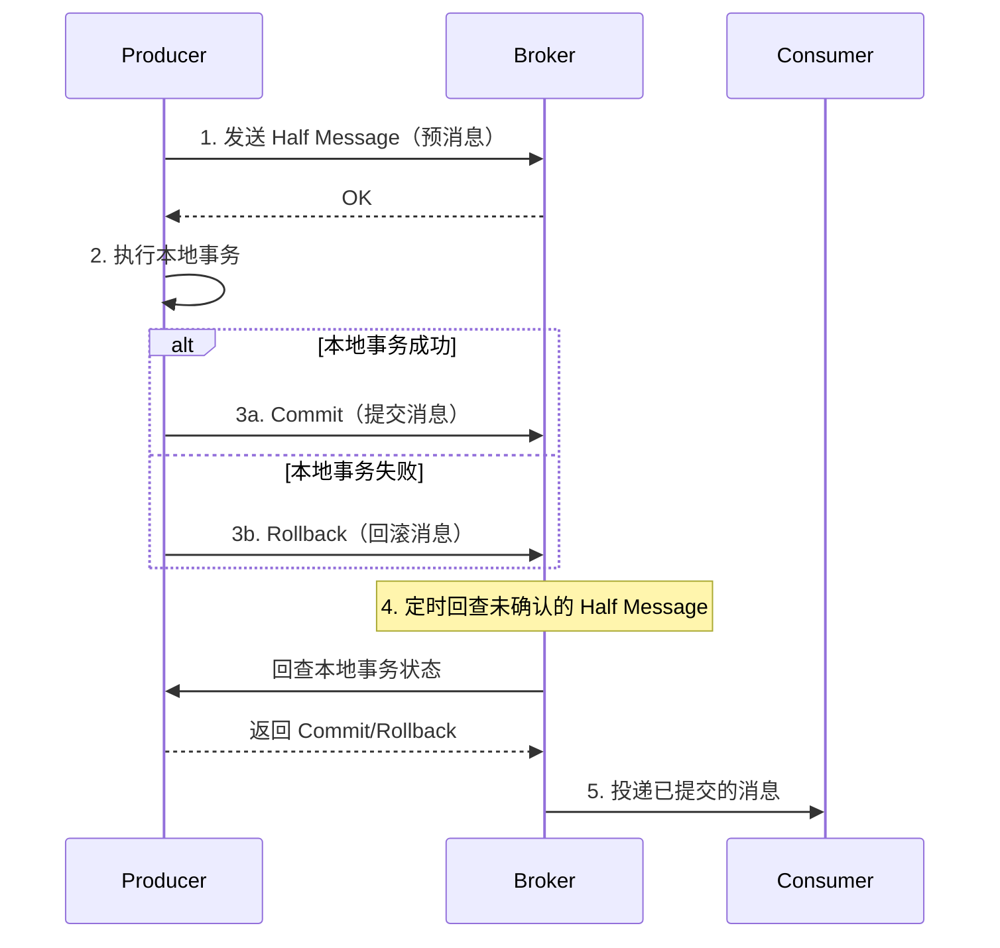
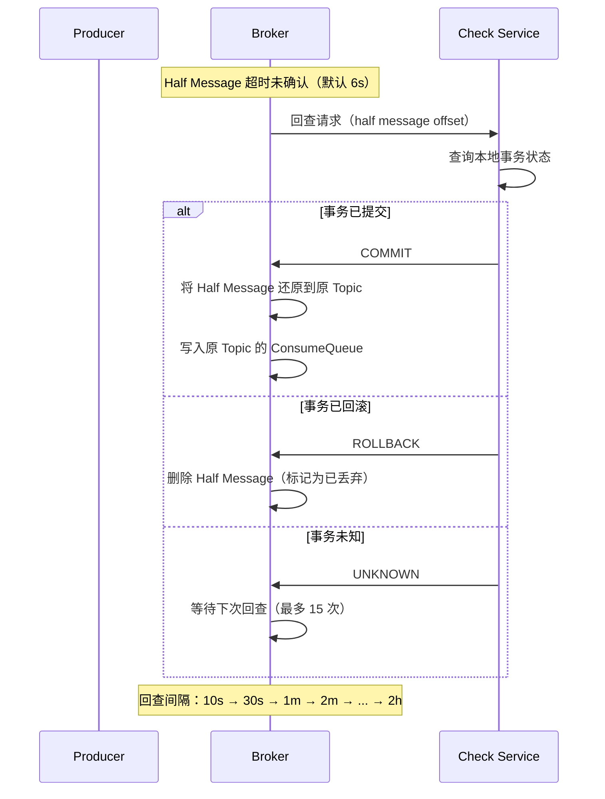
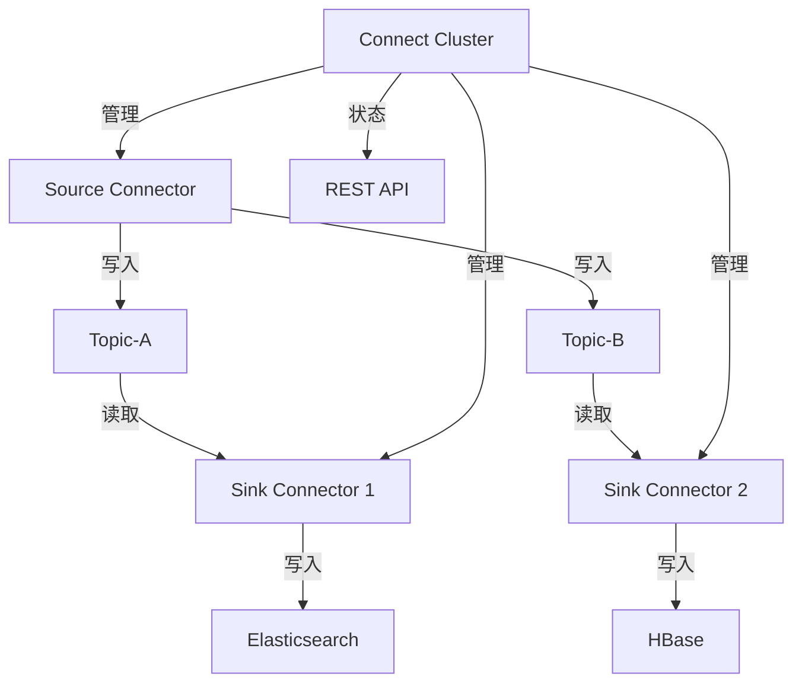

# RocketMQ

> **核心认知**：RocketMQ 是阿里巴巴开源的分布式消息中间件，以高吞吐、低延迟、高可靠著称。它在 Kafka 的基础上增加了事务消息、定时消息、消息过滤、消息轨迹等企业级特性，是金融级消息场景的首选。

## 要解决的问题

| 问题 | 传统 MQ 的痛点 | RocketMQ 的解法 |
|------|---------------|-----------------|
| 事务消息 | 本地事务与消息发送无法原子性 | 两阶段消息（Half Message） |
| 定时消息 | 不支持精确时间投递 | 原生支持定时/延时消息 |
| 消息过滤 | 消费者收到全部消息，带宽浪费 | Tag/SQL92 表达式过滤 |
| 顺序消息 | 分区级别有序，跨分区无序 | MessageGroup 确保有序 |
| 消息回溯 | 消息消费后无法重新消费 | 按时间戳回溯任意时间点 |
| 消息轨迹 | 消息链路不可追踪 | 内置消息轨迹查询 |

## 架构设计

### 核心组件



### 消息存储模型

```
CommitLog（顺序写）：
  ├── 所有 Topic 的消息追加写入同一个文件
  ├── 单文件 1GB，顺序写性能极高
  └── 异步构建 ConsumeQueue 索引

ConsumeQueue（逻辑队列）：
  ├── 按 Topic + Queue 组织
  ├── 每条记录：offset(8B) + size(4B) + tagHash(8B)
  └── 消费者按 tag 过滤后读取 CommitLog

IndexFile（索引文件）：
  ├── 按消息 Key 建立哈希索引
  └── 支持按 Key 精确查询消息
```

## 核心特性详解

### 1. 事务消息



### 2. 定时/延时消息

| 延时级别 | 延时时间 | 延时级别 | 延时时间 |
|----------|----------|----------|----------|
| 1 | 1s | 6 | 60s |
| 2 | 5s | 7 | 120s |
| 3 | 10s | 8 | 180s |
| 4 | 30s | 9 | 240s |
| 5 | 30s | 10 | 300s |

### 3. 消息过滤

```
# Tag 过滤（性能最优）
consumer.subscribe("TopicA", "Tag1 || Tag2");  // 只消费 Tag1 或 Tag2

# SQL92 过滤（灵活但有性能开销）
consumer.subscribe("TopicA",
    MessageSelector.bySql("amount > 1000 AND region = 'SH'"));

# 过滤在 Broker 端执行，减少网络传输
```

### 4. 顺序消息

```
# 全局有序：单 Queue（牺牲吞吐）
全局有序 = 所有消息进同一个 Queue

# 分区有序：MessageGroup（推荐）
分区有序 = 同一 MessageGroup 的消息进同一个 Queue
  ├── 同一订单的消息 → 同一 Queue → 有序消费
  ├── 不同订单的消息 → 不同 Queue → 并行消费
  └── 吞吐与有序的平衡
```

### 5. 消息轨迹

```
消息全链路追踪：
  Producer → Broker → Consumer

关键信息：
  ├── 消息 ID / Key
  ├── 发送时间 / 消费时间
  ├── 发送状态（成功/失败/超时）
  ├── Broker 地址
  ├── 消费者地址
  └── 消费重试次数
```

## 高可用设计

### 主从同步机制

```
同步复制（SYNC_MASTER）：
  Producer → Master → Slave（同步写入）→ 返回 ACK
  优点：数据强一致
  缺点：写入延迟增加

异步复制（ASYNC_MASTER）：
  Producer → Master → 返回 ACK
  Master → Slave（异步复制）
  优点：写入性能高
  缺点：Master 故障可能丢少量数据

刷盘策略：
  ├── 同步刷盘：消息写入磁盘后返回 ACK（可靠但慢）
  └── 异步刷盘：消息写入 PageCache 即返回 ACK（快但有风险）
```

### 集群部署模式

| 模式 | Master 数量 | Slave 数量 | 适用场景 |
|------|------------|------------|----------|
| 2m-2s | 2 | 2 | 生产推荐 |
| 2m-1s-2d | 2 | 1 | 兼顾成本和可靠 |
| DLedger | 3 | 0 | Raft 自动选主 |
| 3m-3s | 3 | 3 | 金融级高可靠 |

## 性能对比

| 指标 | RocketMQ | Kafka | RabbitMQ |
|------|----------|-------|----------|
| 单机吞吐 | 百万级/s | 百万级/s | 万级/s |
| 延迟 | 毫秒级 | 毫秒级 | 微秒级 |
| 事务消息 | 支持 | 支持（0.11+） | 不支持 |
| 定时消息 | 原生支持 | 不支持 | 插件支持 |
| 消息过滤 | Tag/SQL92 | 不支持 | Routing Key |
| 消息回溯 | 支持 | 支持 | 不支持 |
| 消息轨迹 | 内置 | 不支持 | 不支持 |
| 顺序消息 | MessageGroup | Partition Key | 队列级有序 |

## 与 Kafka 的选型决策

```
选型路径：
  ├── 需要事务消息？ → RocketMQ
  ├── 需要定时消息？ → RocketMQ
  ├── 需要消息过滤？ → RocketMQ
  ├── 需要消息轨迹？ → RocketMQ
  ├── 流处理场景？ → Kafka
  ├── 日志采集场景？ → Kafka
  ├── 超高吞吐（>百万/s）？ → Kafka
  └── 金融级可靠性？ → RocketMQ
```

## 常见陷阱

| 陷阱 | 后果 | 正确做法 |
|------|------|----------|
| Queue 数量设太多 | 内存和文件句柄膨胀 | 根据消费者数量合理设置 |
| 消费失败不重试 | 消息丢失 | 配置重试次数和死信队列 |
| 不设消费超时 | 消息堆积 | 设置合理的消费超时时间 |
| 忽略 Broker 刷盘策略 | 故障时丢消息 | 根据可靠性要求选择刷盘方式 |
| 消息 Key 设计不合理 | 无法快速定位消息 | 使用业务唯一 ID 作为 Key |

## 事务消息内部机制

### Half Message 存储原理

```
Half Message 存储流程：
  1. Producer 发送 Half Message 到 Broker
  2. Broker 将消息写入 HALF_TOPIC（内部 Topic）
  3. Broker 不投递该消息（不进入 ConsumeQueue）
  4. 返回发送成功 ACK 给 Producer

Half Message 数据结构：
  ├── 原始 Topic + QueueId（备份，用于后续还原）
  ├── 消息 Body
  ├── 消息 Properties
  └── TRAN_MSG = true（标记为半消息）

存储位置：
  COMMITLOG → HALF_TOPIC 对应的 ConsumeQueue
  （与普通消息共用 CommitLog，通过 Topic 区分）
```

### 回查机制（Transaction Check）



### 回查配置参数

| 参数 | 默认值 | 说明 |
|------|--------|------|
| transactionTimeout | 6000ms | 本地事务执行超时 |
| transactionCheckInterval | 60000ms | 回查检查间隔 |
| transactionCheckMax | 15 | 最大回查次数 |

## 定时消息实现细节

### 定时消息存储架构

```
定时消息投递流程：
  1. Producer 发送定时消息（setDelayTimeLevel）
  2. Broker 写入 DELAY_TOPIC_n（延迟级别对应的内部 Topic）
  3. ScheduleMessageService 定时扫描
  4. 到期后将消息投递到原 Topic 的 ConsumeQueue

定时消息存储：
  ├── DELAY_TOPIC_1 → 1s 延迟消息
  ├── DELAY_TOPIC_2 → 5s 延迟消息
  ├── ...
  └── DELAY_TOPIC_18 → 2h 延迟消息

每个 DELAY_TOPIC 有独立的 ConsumeQueue
ScheduleMessageService 每 10ms 扫描一次
```

### 精确时间戳定时消息（5.0+）

```
RocketMQ 5.0+ 支持精确到毫秒的定时消息：

Properties:
  DELIVER_TIME_MS = 1700000000000

实现原理：
  1. Broker 根据 DELIVER_TIME_MS 计算到期时间
  2. 消息写入延迟时间轮（Timing Wheel）
  3. 时间轮精度：1ms
  4. 到期后自动投递到原 Topic

时间轮数据结构：
  ├── 轮大小：2^16 ms（65536ms ≈ 65s）
  ├── 槽数：65536
  ├── 每个槽：链表存储到期消息
  └── 过期消息自动转移到下一个轮次
```

## 消息过滤 SQL 语法

### SQL92 过滤表达式

```sql
-- 基本比较
amount > 1000
amount >= 500 AND amount <= 1000

-- 字符串匹配
region = 'SH'
region IN ('SH', 'BJ', 'GZ')
region LIKE 'east%'

-- 逻辑运算
amount > 1000 AND region = 'SH'
amount > 1000 OR priority = 'HIGH'
NOT (region = 'TEST')

-- NULL 判断
region IS NOT NULL
region IS NULL

-- 数学运算
amount > 100 * 10
(amount - 100) * 2 > 500

-- 支持的属性类型
  INT, LONG, FLOAT, DOUBLE, STRING, BOOLEAN, DATETIME
```

### Tag 过滤 vs SQL 过滤对比

| 维度 | Tag 过滤 | SQL 过滤 |
|------|----------|----------|
| 性能 | 高（Broker 端 BloomFilter） | 中（Broker 端解析执行） |
| 灵活度 | 低（仅支持 Tag 精确匹配） | 高（支持复杂表达式） |
| 网络开销 | 低 | 中（需传输属性） |
| 实现 | consumer.subscribe("topic", "TagA") | MessageSelector.bySql() |
| 推荐 | 大部分场景 | 复杂过滤需求 |

## RocketMQ Connect

### Kafka Connect 兼容特性

```
RocketMQ Connect 特性：
  ├── Source Connector：从外部系统导入数据到 RocketMQ
  │   ├── MySQL Connector
  │   ├── PostgreSQL Connector
  │   ├── MongoDB Connector
  │   └── 自定义 Connector
  ├── Sink Connector：从 RocketMQ 导出数据到外部系统
  │   ├── Elasticsearch Connector
  │   ├── HBase Connector
  │   ├── MySQL Connector
  │   └── 自定义 Connector
  ├── Distributed Mode：分布式部署，自动负载均衡
  ├── Single Mode：单机调试模式
  └── REST API：RESTful 管理接口
```

### Connect 架构



### 配置示例

```json
// Source Connector 配置
{
  "name": "mysql-source",
  "config": {
    "connector.class": "org.apache.rocketmq.connect.mysql.MySQLSourceConnector",
    "hostname": "mysql-host",
    "port": 3306,
    "database": "mydb",
    "table": "orders",
    "topic": "mysql-orders",
    "user": "root",
    "password": "****"
  }
}

// Sink Connector 配置
{
  "name": "es-sink",
  "config": {
    "connector.class": "org.apache.rocketmq.connect.es.ElasticsearchSinkConnector",
    "topics": "mysql-orders",
    "connection.url": "http://es-host:9200",
    "index.name.pattern": "orders-{YYYY.MM.dd}"
  }
}
```

## RocketMQ Dashboard / 监控

### Dashboard 功能模块

| 模块 | 功能 | 关键指标 |
|------|------|----------|
| Cluster | 集群状态概览 | Broker 数量、主从状态、Topic 数 |
| Topic | Topic 管理 | 消息量、消费延迟、队列分布 |
| Consumer | 消费者组管理 | 消费 TPS、延迟、在线客户端 |
| Producer | 生产者监控 | 发送 TPS、失败率、延迟 |
| Message | 消息查询 | 按 Key/MsgId/时间查询 |
| Dashboard | 实时面板 | QPS、延迟、消费进度 |

### Prometheus + Grafana 监控

```yaml
# rocketmq-exporter 配置
# 下载 rocketmq-exporter 启动后暴露 :5557/metrics

# Grafana Dashboard 关键 Panel
# 1. Broker 写入 TPS / 读取 TPS
# 2. Consumer Group 消费延迟（commitLogOffset - consumerOffset）
# 3. 消息堆积量
# 4. Broker 内存使用 / GC 频率
# 5. 网络吞吐量

# 告警规则示例
groups:
  - name: rocketmq
    rules:
      - alert: RocketMQ_ConsumerLag
        expr: rocketmq_consumer_lag > 100000
        for: 5m
        labels:
          severity: warning
        annotations:
          summary: "Consumer lag high: {{ $labels.group }}"

      - alert: RocketMQ_BrokerDown
        expr: rocketmq_broker_online == 0
        for: 1m
        labels:
          severity: critical
        annotations:
          summary: "Broker offline: {{ $labels.broker }}"
```

## RocketMQ vs Kafka 金融场景对比

| 维度 | RocketMQ | Kafka |
|------|----------|-------|
| 事务消息 | 原生支持（Half Message） | 支持（0.11+，但实现不同） |
| 消息可靠性 | 同步刷盘 + 同步复制 = 双保险 | ISR 机制 + acks=all |
| 定时消息 | 原生支持（18 级 + 精确时间） | 不支持（需自行实现） |
| 消息过滤 | Tag + SQL92 | 不支持（需下游过滤） |
| 消息轨迹 | 内置 | 不支持 |
| 消息回溯 | 支持 | 支持 |
| 金融级部署 | 3m-3s 强一致模式 | 多副本 + 严格 ISR |
| 运维工具 | RocketMQ Console | Kafka Manager / AKHQ |
| 社区生态 | 阿里主导，国内生态好 | Apache 主导，全球生态好 |

### 金融场景推荐配置

```properties
# RocketMQ 金融级配置
brokerRole=SYNC_MASTER          # 同步复制
flushDiskType=SYNC_FLUSH        # 同步刷盘
minInsyncReplicas=2             # 最少 2 个同步副本
defaultTimeout=3000             # 发送超时 3s
retryTimesWhenSendFailed=3      # 重试 3 次
enablePropertyFilter=true       # 支持 SQL 过滤
```

## 顺序消息最佳实践

### 订单场景顺序消息

```
订单状态流转顺序：
  CREATED → PAID → SHIPPED → DELIVERED → COMPLETED

顺序保证方案：
  ├── Producer 端
  │   ├── 使用 MessageGroup = orderId
  │   ├── 同一 orderId 的消息进同一 Queue
  │   └── 使用 MessageQueueSelector 选择 Queue
  ├── Broker 端
  │   └── 同一 MessageGroup 写入同一 Queue
  └── Consumer 端
      ├── 单线程消费（保证顺序）
      ├── 或使用 MessageListenerOrderly（自动锁 Queue）
      └── 消费失败暂停当前 Queue，不跳过
```

### 顺序消息实现代码

```java
// Producer 端
SendResult sendResult = producer.send(msg, (mqs, msg1, arg) -> {
    String orderId = (String) arg;
    int index = orderId.hashCode() % mqs.size();
    return mqs.get(index);
}, "order-123");

// Consumer 端（顺序消费）
consumer.registerMessageListener(new MessageListenerOrderly() {
    @Override
    public ConsumeOrderlyStatus consumeMessage(List<MessageExt> msgs,
                                                ConsumeOrderlyContext context) {
        for (MessageExt msg : msgs) {
            processOrder(msg);
        }
        return ConsumeOrderlyStatus.SUCCESS;
    }
});
```

## 死信队列处理

### 死信消息流程

```
消费失败 → 重试 → 超过最大重试次数 → 死信队列

重试策略：
  ├── 第 1-3 次：立即重试
  ├── 第 4-10 次：间隔 10s 重试
  ├── 第 11-16 次：间隔 30s 重试
  └── 超过 16 次：进入死信队列

死信队列命名：%DLQ%ConsumerGroup@N
  ├── %DLQ%：死信前缀
  ├── ConsumerGroup：消费者组名
  └── @N：Queue 编号
```

### 死信队列消费

```java
// 死信队列消费者
consumer.subscribe("%DLQ%order-consumer-group", "*");
consumer.registerMessageListener((MessageListenerConcurrently) (msgs, context) -> {
    for (MessageExt msg : msgs) {
        // 记录死信消息
        log.error("Dead letter message: msgId={}, body={}",
            msg.getMsgId(), new String(msg.getBody()));

        // 发送告警
        alertService.sendDeadLetterAlert(msg);

        // 存入数据库备查
        deadLetterService.save(msg);

        // 尝试重新处理或人工介入
    }
    return ConsumeConcurrentlyStatus.CONSUME_SUCCESS;
});
```

## 消息轨迹架构

### 消息轨迹数据模型

```json
{
  "traceId": "trace-001",
  "msgId": "msg-abc-123",
  "topic": "order-topic",
  "tags": ["created"],
  "keys": ["order-123"],
  "producers": [
    {
      "timestamp": 1700000000,
      "host": "producer-1:10.0.0.1",
      "sendStatus": "SEND_OK",
      "costTime": 15
    }
  ],
  "brokers": [
    {
      "timestamp": 1700000000,
      "brokerName": "broker-a",
      "queueId": 3,
      "storeOffset": 123456,
      "commitLogOffset": 789012
    }
  ],
  "consumers": [
    {
      "timestamp": 1700000001,
      "host": "consumer-1:10.0.0.2",
      "consumerGroup": "order-consumer",
      "costTime": 5,
      "status": "CONSUME_SUCCESS"
    }
  ]
}
```

### 消息轨迹查询 API

```http
# 按 MsgId 查询
GET /message/trace?msgId=msg-abc-123

# 按 Key 查询
GET /message/trace?key=order-123&beginTime=2024-01-01&endTime=2024-01-02

# 按时间范围查询
GET /message/trace?topic=order-topic&beginTime=2024-01-01T00:00:00&endTime=2024-01-01T01:00:00
```

## 与其他板块的关系

| 关联板块 | 关系描述 |
|----------|----------|
| **微服务架构** | RocketMQ 是微服务异步解耦的核心组件 |
| **分布式事务** | 事务消息实现本地事务与消息的原子性 |
| **事件驱动** | RocketMQ 是事件驱动架构的消息基础设施 |
| **数据同步** | Cana/Maxwell 等 CDC 工具可通过 MQ 同步数据 |
| **监控体系** | RocketMQ Console + Prometheus 提供运维监控 |

## 一句话总结

RocketMQ 是阿里巴巴开源的分布式消息中间件，以事务消息、定时消息、消息过滤等企业级特性见长，是金融级可靠消息场景的首选方案。

---

## 参考资料

- [Apache RocketMQ 官方文档](https://rocketmq.apache.org/docs/)
- [RocketMQ GitHub](https://github.com/apache/rocketmq)
- [RocketMQ 事务消息设计](https://rocketmq.apache.org/docs/featureBehavior/04transactionmessage)
- [RocketMQ vs Kafka 选型](https://www.confluent.io/blog/kafka-vs-rabbitmq/)
