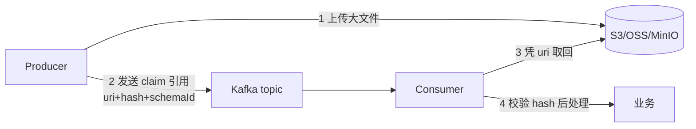
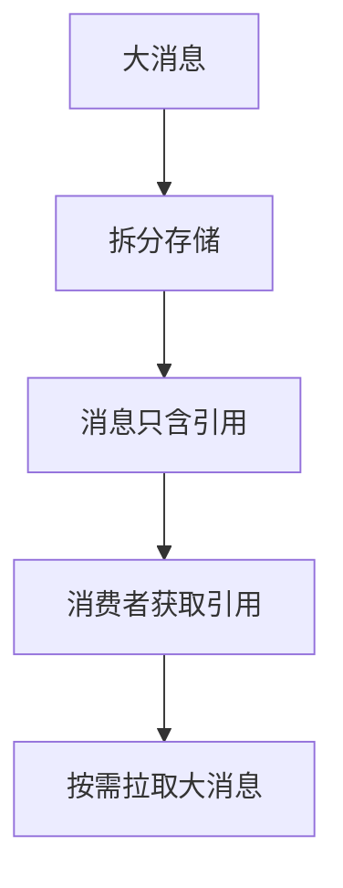
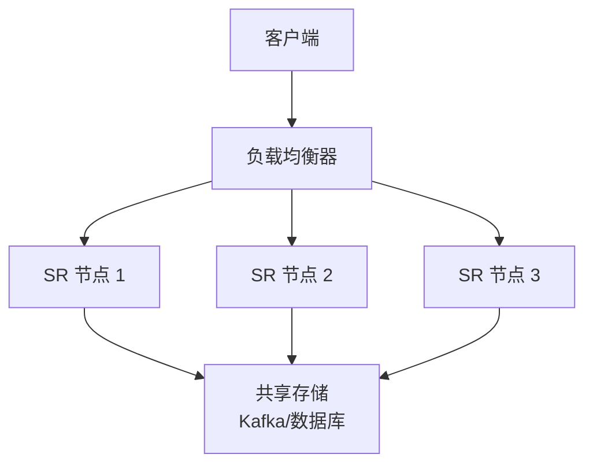
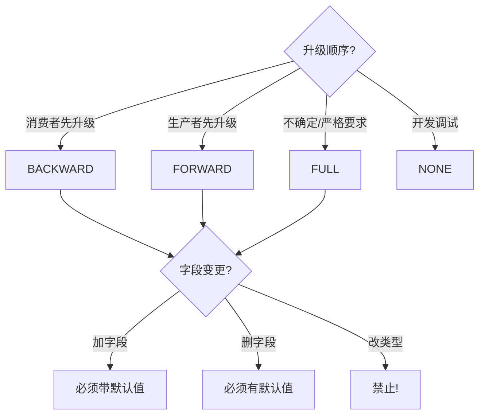

# Schema Registry 与消息序列化深入（Avro 原理 / 兼容性实战 / Serde 集成 / 消息治理体系）

> Schema Registry 是 **消息 Schema 管理中心**：统一管理 Kafka 消息的 Schema（Avro/Protobuf/JSON Schema）+ 版本演进校验 + 客户端自动编解码。本篇深入拆解：Avro 序列化原理、兼容性策略实战、Serde 集成细节、消息治理体系。

---

## 一、要解决的问题

| 痛点 | 说明 |
|------|------|
| 契约漂移 | 生产者/消费者各自定义消息结构，字段变更后解析失败 |
| 版本混乱 | 消息格式升级后老消费者崩、新老混跑无法兼容 |
| 编解码重复 | 每个客户端都要写序列化代码，浪费且易错 |
| JSON 低效 | 文本协议体积大、无 Schema 校验、类型弱 |
| 治理缺失 | 谁改了消息、改成什么样、谁在用——无法审计 |

> 核心认知：**Schema Registry = 「消息的 Git + 契约中心」**——Schema 集中注册、版本化、兼容性校验，客户端拿到 ID 自动解析，消息只传二进制。

---

## 二、核心原理

### 2.1 架构与数据流

```
生产者：定义 Schema（Avro/Protobuf/JSON）
  → 注册到 Schema Registry（获取 schemaId）
  → 序列化时：magic byte + schemaId + 二进制数据 → 发 Kafka

Schema Registry（集中式 Schema 仓库）
  ├── 存储 Schema（版本化，向后/向前/完全兼容策略）
  ├── 兼容性校验（注册新版本时自动检查）
  └── REST API（注册/查询/版本管理）

消费者：反序列化时读 magic byte → 取 schemaId
  → 从 Registry 拉取/缓存 Schema → 解码数据
  → 老消费者读新数据（兼容性保证）
```

**消息格式**：`[0x00 | schemaId(4B) | payload]`——客户端只传 ID，Schema 在注册中心，消息体最小化。

### 2.2 注册流程细节

```
1. 生产者序列化第一个消息
2. Serializer 检查本地缓存 → 无
3. 带 Schema 请求注册（POST /subjects/{subject}/versions）
4. Registry 校验兼容性（按策略）→ 通过则分配 version + schemaId
5. Serializer 缓存 (Schema → schemaId)
6. 消息格式：[0x00][schemaId 4字节][Avro 二进制 payload]
```

**Subject 命名**：`<topic>-value` / `<topic>-key`（约定），一个 Topic 的 Key/Value 各一个 Subject。

### 2.3 三种 Schema 格式对比

| 格式 | 特点 | 适用 |
|------|------|------|
| Avro | 自带 Schema + 二进制紧凑 + 兼容性语义最完善（Kafka 生态默认） | Kafka/数据湖 |
| Protobuf | 二进制高效 + 跨语言生态强 | 微服务 RPC 消息 |
| JSON Schema | 人类可读 + 文本体积大 | 简单/调试场景 |

---

## 三、Avro 序列化原理（深入）

### 3.1 Avro 二进制编码

```
Avro = Schema 驱动（Schema 随数据/注册中心，数据无自描述头）

整数编码（可变长 ZigZag）：
  值 → ZigZag 变换（负数映射正数）→ 每 7 位一组，低位在前
  小整数只占 1 字节（大部分场景省空间）

字符串：长度（varint）+ UTF-8 字节
数组/Map：长度前缀 + 元素序列
Union：索引字节 + 值

对比：
  数值字段：Avro 1~2 字节 vs JSON 4~20 字节
  100 万条消息省空间 ~60%
```

### 3.2 Avro Schema 结构

```json
{
  "type": "record",
  "name": "Order",
  "namespace": "com.example",
  "fields": [
    {"name": "order_id", "type": "string"},
    {"name": "amount", "type": "double"},
    {"name": "status", "type": "string", "default": "CREATED"},
    {"name": "items", "type": {"type": "array", "items": "string"}, "default": []}
  ]
}
```

**字段演进关键**：新字段必须带 `default`（否则破坏 BACKWARD 兼容）。

### 3.3 Protobuf vs Avro

| 维度 | Avro | Protobuf |
|------|------|----------|
| Schema 位置 | 注册中心（数据不携带） | .proto 编译（数据携带字段号） |
| 编码 | ZigZag + varint | varint + TLV |
| 字段标识 | 按名称匹配 | 按字段号匹配 |
| 兼容性工具 | Registry 自动校验 | 需手动管理 |
| 跨语言 | 一般 | 强（生态广） |
| 数据湖导出 | Avro 文件原生 | 需转换 |

---

## 四、兼容性策略实战（深入）

### 4.1 四种策略

| 策略 | 规则 | 场景 |
|------|------|------|
| BACKWARD（默认） | 新 Schema 能读老数据（只能加默认值/删字段） | 消费者先升级 |
| FORWARD | 老 Schema 能读新数据（只能加字段/删默认值） | 生产者先升级 |
| FULL | 双向兼容 | 严格契约 |
| NONE | 不校验（禁止生产用） | 开发调试 |

### 4.2 字段演进对照表

| 操作 | BACKWARD | FORWARD |
|------|----------|---------|
| 加字段（带默认值） | ✅ | ✅ |
| 加字段（无默认值） | ❌ 破坏 | ✅ |
| 删字段 | ✅（新读老少字段） | ❌（老读新缺字段） |
| 改类型 | ❌ | ❌ |
| 重命名字段 | ❌ | ❌ |
| 改默认值 | ✅ | ✅ |

### 4.3 生产演进流程

```
标准流程（BACKWARD + 消费者先行）：
  1. 生产者加新字段（带默认值）→ 注册 v2（BACKWARD 通过）
  2. 消费者全部升级到 v2（能读老数据 v1）
  3. 生产者开始发新字段数据
  4. 完成（全程无停服）

大版本升级（跨团队）：
  1. 新 Topic + 新 Schema（隔离验证）
  2. 双写（新旧并行一段时间）
  3. 消费者切新 Topic
  4. 老 Topic 保留期后清理
```

### 4.4 兼容性配置

```yaml
# 全局默认
schema.compatibility.level=BACKWARD

# 按 Subject 覆盖
curl -X PUT http://schema-registry:8081/config/order-value \
  -H "Content-Type: application/vnd.schemaregistry.v1+json" \
  -d '{"compatibility": "FULL"}'

# 按 Topic 覆盖（Confluent 6+）
schema.compatibility.level.override=order-value,FORWARD
```

---

## 五、Serde 集成（客户端编解码）

### 5.1 Java 集成

```java
// 生产者：序列化自动注册
Properties props = new Properties();
props.put(ProducerConfig.KEY_SERIALIZER_CLASS_CONFIG,
    "io.confluent.kafka.serializers.KafkaAvroSerializer");
props.put(ProducerConfig.VALUE_SERIALIZER_CLASS_CONFIG,
    "io.confluent.kafka.serializers.KafkaAvroSerializer");
props.put("schema.registry.url", "http://registry:8081");
props.put("auto.register.schemas", "false");  // 生产禁用自动注册

// 消费者：反序列化自动解析
props.put(ConsumerConfig.KEY_DESERIALIZER_CLASS_CONFIG,
    "io.confluent.kafka.serializers.KafkaAvroDeserializer");
props.put(ConsumerConfig.VALUE_DESERIALIZER_CLASS_CONFIG,
    "io.confluent.kafka.serializers.KafkaAvroDeserializer");
props.put("specific.avro.reader", "true");  // 生成 SpecificRecord
```

### 5.2 关键配置

| 配置 | 说明 | 生产建议 |
|------|------|----------|
| auto.register.schemas | 自动注册新 Schema | false（CI 审批） |
| specific.avro.reader | 生成具体类 | true |
| schema.registry.url | 注册中心地址 | 多节点（高可用） |
| schema.reflection | 反射生成 | 性能差，禁用 |
| use.latest.version | 使用最新版本 | 按需 |

### 5.3 多语言支持

```
Java：KafkaAvroSerializer / ProtobufSerializer
Go：confluent-kafka-go（内置 Registry 支持）
Python：confluent-kafka（schema registry 客户端）
Node：@kafkajs/schema-registry
C#：Confluent.SchemaRegistry

跨语言一致性：
  同一 Schema → 各语言编解码结果一致（二进制互通）
```

---

## 六、Schema 治理体系

### 6.1 治理流程

```
1. 设计评审：新 Schema 必须评审（命名/字段/默认值）
2. 注册审批：CI 中校验兼容性 + 人工审批（防乱注册）
3. 版本管理：版本化 + 变更记录（谁改了什么）
4. 使用追踪：Subject 引用统计（谁在用哪个版本）
5. 清理：废弃 Subject 归档（防 Schema 爆炸）

审计能力：
  每次注册记录（时间/人/版本/兼容性结果）
  引用关系（Topic ↔ Schema ↔ 应用）
```

### 6.2 CI/CD 集成

```yaml
# GitHub Actions：Schema 变更校验
- name: Check schema compatibility
  run: |
    # 用 maven 插件或脚本校验新 Schema
    # 不兼容 → CI 失败 → 阻断合并
    check-compatibility.sh order-value order_v2.avsc
```

### 6.3 多环境管理

```
开发/测试/生产各自 Registry 实例
  Schema 从下往上推广（dev → test → prod）
  同构校验（各环境兼容性一致）

或：单 Registry + 多租户（subject 前缀区分环境）
  dev-order-value / prod-order-value
```

---

## 七、生产实践

### 7.1 关键实践

| 实践 | 说明 |
|------|------|
| 兼容策略 | 生产 BACKWARD；跨团队大版本升级走 FORWARD 灰度 |
| 字段演进 | 只加「带默认值」字段；禁止改类型/重命名 |
| 注册鉴权 | Registry 必须加认证（防乱注册/投毒） |
| 缓存 | 客户端缓存 Schema（减少拉取） |
| 测试 | CI 里跑兼容性检查（新版本合并前验证） |
| 监控 | 注册量/版本数/解析错误率 |

### 7.2 监控指标

```
核心指标：
  注册请求量 / 失败量（兼容性拒绝）
  Schema 版本总数 / Subject 数
  解析错误率（客户端拉取失败）
  拉取延迟（P99）

告警：
  解析错误率 > 0.1% → 排查（magic byte 不匹配/Registry 不可用）
  注册失败突增 → 兼容性策略误配
  Registry 节点健康（挂了一个 → 客户端解析失败）
```

### 7.3 常见坑

| 坑 | 说明 | 对策 |
|----|------|------|
| magic byte 兼容 | 混用带/不带 Registry 的客户端解析失败 | 全链路统一 |
| Avro 默认值陷阱 | 加字段不设默认值 = 破坏 BACKWARD | CI 校验 |
| Registry 单点 | 挂了新客户端无法解析 | 集群 + 备份 |
| Schema 爆炸 | 版本数无限增长 | 过期清理 + 评审 |
| auto.register 开启 | 生产乱注册（拼写错误生成新版本） | 关闭 + CI 审批 |
| 大 Schema | 万字段 Schema 拉取慢/缓存大 | Schema 拆分 + 精简 |

---

## 八、选型速查

| 需求 | 首选 | 备选 |
|------|------|------|
| Kafka 消息治理 | Confluent Schema Registry | 云托管 Registry |
| 微服务 RPC | Protobuf | Avro |
| 简单内部消息 | JSON | — |
| 数据湖导出 | Avro + Schema Registry | — |
| 多语言 Kafka | Registry + Avro | Registry + Protobuf |
| 数据湖 Iceberg | Avro/Parquet + Registry | — |

---

## Schema Registry Compatibility Modes Deep

### BACKWARD 兼容

```
BACKWARD = 新 Schema 能读老数据（消费者先升级）

允许操作：
  ✅ 加字段（带默认值）
  ✅ 删字段
  ✅ 改默认值
  ❌ 加字段（无默认值）
  ❌ 改类型
  ❌ 重命名字段

场景：
  消费者先升级到新版本
  生产者继续发老格式
  消费者能处理两种格式

示例：
  v1: {name, email}
  v2: {name, email, phone(default: "")}  ✅
  v2: {name, email, phone}                ❌（无默认值）
```

### FORWARD 兼容

```
FORWARD = 老 Schema 能读新数据（生产者先升级）

允许操作：
  ✅ 加字段
  ✅ 删字段（有默认值）
  ❌ 删字段（无默认值）
  ❌ 改类型

场景：
  生产者先升级到新版本
  消费者继续用老版本
  老消费者能处理新格式

示例：
  v1: {name, email}
  v2: {name, email, phone}  ✅（老 Schema 忽略 phone）
  v2: {name, phone}         ❌（老 Schema 读不到 email）
```

### FULL 兼容

```
FULL = 双向兼容（严格契约）

允许操作：
  ✅ 加字段（带默认值）
  ✅ 删字段
  ❌ 加字段（无默认值）
  ❌ 改类型
  ❌ 重命名字段

场景：
  生产者和消费者无法确定升级顺序
  需要严格保证兼容性

选择：
  默认用 BACKWARD（消费者先升级）
  严格场景用 FULL
  确定顺序用 FORWARD
```

## Avro vs Protobuf vs JSON Schema

| 维度 | Avro | Protobuf | JSON Schema |
|------|------|----------|-------------|
| Schema 位置 | 注册中心（数据不携带） | .proto 编译 | 数据可携带 |
| 编码 | ZigZag + varint | varint + TLV | 文本 |
| 字段标识 | 按名称匹配 | 按字段号匹配 | 按名称匹配 |
| 兼容性工具 | Registry 自动校验 | 需手动管理 | 需手动管理 |
| 跨语言 | 一般 | 强（生态广） | 强 |
| 数据湖导出 | Avro 文件原生 | 需转换 | 可直接读 |
| 体积 | 最小 | 小 | 大 |
| 适用 | Kafka 生态 | 微服务 RPC | 简单/调试 |

## Confluent Schema Registry

```
Confluent Schema Registry = Kafka Schema 管理中心

架构：
  Producer → Schema Registry（注册 Schema）
            → Kafka（消息 + schemaId）
  Consumer ← Schema Registry（获取 Schema）

REST API：
  POST /subjects/{subject}/versions  注册 Schema
  GET /schemas/ids/{id}              获取 Schema
  GET /subjects/{subject}/versions   查看版本
  DELETE /subjects/{subject}         删除 Subject

配置：
  schema.registry.url=http://registry:8081
  schema.compatibility.level=BACKWARD
  leader.election.interval=1000

高可用：
  多实例 + Leader 选举
  Leader 处理写，Follower 只读
  故障自动切换
```

## Schema Evolution Strategies

```
Schema 演进策略：

1. 渐进式演进
   v1 → v2（加字段带默认值）→ v3（加字段带默认值）
   每次只做一个小改动
   全程无停服

2. 大版本升级
   新 Topic + 新 Schema（隔离验证）
   双写（新旧并行）
   消费者切新 Topic
   老 Topic 保留期后清理

3. 字段废弃流程
   1. 新 Schema 加 deprecated 标记
   2. 消费者停止使用该字段
   3. 生产者停止填充
   4. 下个版本删除字段

4. 类型变更
   不支持直接改类型
   方案：加新字段 → 迁移数据 → 删旧字段

最佳实践：
  CI/CD 中校验兼容性
  禁用 auto.register（生产）
  定期清理废弃 Schema
```

## Schema Registry with Kafka Connect

```json
// Kafka Connect 配置 Schema Registry
{
  "name": "my-source-connector",
  "config": {
    "connector.class": "io.confluent.connect.jdbc.JdbcSourceConnector",
    "connection.url": "jdbc:mysql://localhost:3306/mydb",
    "topic.prefix": "my-",
    "key.converter": "io.confluent.connect.avro.AvroConverter",
    "key.converter.schema.registry.url": "http://registry:8081",
    "value.converter": "io.confluent.connect.avro.AvroConverter",
    "value.converter.schema.registry.url": "http://registry:8081",
    "value.converter.subject.name.strategy": "io.confluent.connect.storage.class.TopicSubjectNameStrategy"
  }
}

Converter 配置：
  AvroConverter：Avro 序列化 + Schema 注册
  ProtobufConverter：Protobuf 序列化
  JsonSchemaConverter：JSON Schema

NameStrategy：
  TopicNameStrategy：topic-value（默认）
  RecordNameStrategy：record name（跨 Topic 共享 Schema）
```

## Schema Validation

```
Schema 校验 = 注册时自动检查兼容性

校验流程：
  1. 生产者发送消息
  2. Serializer 检查本地缓存 → 无
  3. 请求 Registry 校验兼容性
  4. 不兼容 → 拒绝注册 → 抛异常
  5. 兼容 → 注册新版本 → 返回 schemaId

校验维度：
  字段类型兼容性
  默认值存在性
  字段重命名检测
  向后/向前兼容性

配置：
  auto.register.schemas=false  # 生产禁用自动注册
  latest.compatibility.strict=true  # 严格兼容性检查
```

## Schema Registry in APISIX

```yaml
# APISIX Schema Registry 配置
plugins:
  - kafka-logger
  - avro-serialization

# 自定义插件：Avro 序列化
local schema_registry = require "apisix.plugins.avro-serialization"

schema_registry.configure({
    url = "http://schema-registry:8081",
    auto_register = false,
    cache_ttl = 300
})

# 使用
routes:
  - uri: /api/orders
    plugins:
      avro-serialization:
        subject: orders-value
        schema_registry_url: http://schema-registry:8081
```

## Schema Registry in Pulsar

```
Pulsar Schema Registry = 内置 Schema 管理

功能：
  Schema 注册（Avro/Protobuf/JSON）
  版本管理
  兼容性校验
  客户端自动编解码

使用：
  Producer<String> producer = client.newProducer(Schema.AVRO(Order.class))
      .topic("orders")
      .create();
  
  Consumer<Order> consumer = client.newConsumer(Schema.AVRO(Order.class))
      .topic("orders")
      .subscribe();

Schema 演进：
  支持 BACKWARD/FORWARD/FULL 兼容
  自动注册新 Schema
  版本化管理

对比 Confluent：
  Pulsar：内置 Schema Registry（无需额外组件）
  Confluent：独立 Schema Registry（更灵活）
```

## Schema Governance

```
Schema 治理体系：

1. 设计评审
   新 Schema 必须评审
   检查命名规范/字段命名/默认值
   防止 Schema 爆炸

2. 注册审批
   CI 中校验兼容性
   人工审批（防乱注册）
   auto.register.schemas=false

3. 版本管理
   版本化 + 变更记录
   谁改了什么（审计）
   废弃 Schema 归档

4. 使用追踪
   Subject 引用统计
   谁在用哪个版本
   依赖关系可视化

5. 清理
   废弃 Subject 归档
   过期 Schema 删除
   定期审计

工具：
  Confluent Schema Registry UI
  自定义管理界面
  CI/CD 集成（GitHub Actions）
```

## Avro 具体记录 vs 泛型记录（SpecificRecord vs GenericRecord）

| 维度 | SpecificRecord（代码生成） | GenericRecord（运行时反射） |
|------|---------------------------|----------------------------|
| 使用方式 | avro-maven-plugin 从 .avsc 生成 POJO | 直接操作 `GenericData.Record` |
| 类型安全 | 编译期校验，字段拼写错误即编译失败 | 运行时才发现字段缺失/类型错 |
| 性能 | 无反射，编解码最快 | 反射 + Schema 查找，慢 20%~50% |
| 升级成本 | Schema 变更必须重新生成并发布 | 只改配置即可读新字段 |
| 适用 | 生产者、核心消费者 | ETL 脚本、动态字段探查工具 |

```java
// SpecificRecord：编译期契约
Order order = Order.newBuilder()
    .setOrderId("o-1001").setAmount(99.0).setStatus("CREATED")
    .build();
producer.send(new ProducerRecord<>("orders", order));

// GenericRecord：运行时动态构造
Schema schema = new Schema.Parser().parse(new File("Order.avsc"));
GenericRecord rec = new GenericData.Record(schema);
rec.put("order_id", "o-1001");
rec.put("amount", 99.0);
// 坑：put 了 schema 中不存在的字段不会报错，序列化后静默丢失
```

**选型口诀**：生产链路一律 SpecificRecord（契约固化），运维/排查工具才用 GenericRecord。

---

## Protobuf 字段编号演进纪律

Protobuf 按**字段编号**匹配而非名称，编号一旦复用 = 数据串位，是最隐蔽的线上事故源：

```protobuf
message Order {
  // v1: 1=amount(double) 2=status(string)
  // v2 错误示范：把 status 删除后又把 coupon(string) 编成 2
  //   → 老消费者把 string 解析成 string 恰好不崩但语义全错；
  //   → 若老字段是 int32，新数据是 string，直接解析异常
}
```

| 纪律 | 说明 |
|------|------|
| 永不复用已删字段编号 | 删字段时必须写 `reserved 2; reserved "status";` 让编译器拦截 |
| 19000~19999 禁用 | Protobuf 内部实现保留区，编译器强制拒绝 |
| 新字段只加不改 | 改类型仅限兼容映射（int32→int64 等），string↔int 绝对禁止 |
| optional/singular 默认值语义 | proto3 中标量不再有显式存在性，需要区分"未设置"用 wrapper 类型 |
| map 字段不能 required | map 元素顺序不保证，别依赖遍历序 |

```bash
# CI 卡点：buf breaking 对比基线版本
buf breaking --against ".git#branch=main" --error-format=json
```

---

## 兼容性检查失败案例解析

```text
案例1：加字段没带默认值 → BACKWARD 注册被拒
  v1: {name}  →  v2: {name, phone}          ❌ Registry 报 INCOMPATIBLE
  根因：Avro 读 v1 数据时找不到 phone 的默认值。
  修复：{"name":"phone","type":"string","default":""}

案例2：改类型 double→string → 双向都不通过
  amount: double → amount: string           ❌
  正确姿势：新增 amount_str 字段带 default，消费端迁移完成后下一版删旧字段。

案例3：重命名字段 = 删除+新增
  user_name → username                      ❌（BACKWARD 视为删字段+无默认新增）
  Avro 有 aliases 补救：v2 字段加 {"aliases":["user_name"]}，
  但 alias 只对「新 reader 读旧数据」生效，方向别搞反。

案例4：Subject 策略配错导致误拒
  团队按 TopicNameStrategy 注册，另一服务想复用同一 Topic 发不同 record
  → 兼容性检查拿 A 记录的 Schema 和 B 比较 → 必然失败。
  解法：改 RecordNameStrategy 或拆 Topic。
```

> 排障入口：`GET /compatibility/subjects/{subject}/versions/{version}` 可拿到逐条失败原因，先看 diff 再动手改。

---

## 序列化性能基准（体积 / CPU / 编解码耗时）

以同一条订单消息（10 字符 ID + 3 个数值字段 + 嵌套明细数组）实测量级参考：

| 格式 | 序列化体积 | 编码耗时(μs) | 解码耗时(μs) | CPU 占比特征 |
|------|-----------|--------------|--------------|--------------|
| JSON (Jackson) | ~420 B | 2.8 | 4.5 | 字符串处理为主，GC 压力大 |
| JSON Gzip | ~180 B | 12.0 | 9.0 | 压缩 CPU 换带宽 |
| Avro（带 Registry） | ~110 B | 0.9 | 1.2 | varint 写入极快，Schema 缓存命中后开销稳定 |
| Protobuf | ~95 B | 0.7 | 0.9 | 最快最稳 |
| Avro + Snappy | ~70 B | 1.6 | 2.0 | 大消息场景收益明显 |

```text
结论速记：
  - 吞吐敏感管道：Protobuf ≈ Avro > JSON×3~5 倍
  - Kafka 分区带宽紧张：优先压缩（producer compression.type=lz4/zstd），
    收益通常大于换格式本身
  - Registry 客户端务必缓存 Schema（默认缓存），否则每条消息一次 HTTP 是隐形杀手
```

---

## 消息体过大处理：Claim-Check 模式

Kafka 默认 `message.max.bytes=1MB`，超过阈值的消息走 **Claim-Check（票据模式）**：大 payload 存对象存储，消息里只带取件凭证。



```yaml
# 生产者侧 Spring 示例要点
claim-check:
  store: s3://msg-blob/payloads/
  threshold-bytes: 262144      # 超 256KB 走外存
  envelope-schema: ClaimEnvelope  # 信封也注册进 Schema Registry，统一演进
```

| 方案对比 | 做法 | 权衡 |
|----------|------|------|
| 调大 broker 限制 | max.message.bytes + replica.fetch.max.bytes 同步调 | 内存/复制放大风险，最后手段 |
| 应用层分片 | 大对象切片多条消息 + 组装器 | 复杂度高，失败恢复难 |
| **Claim-Check ⭐** | 外存 payload，消息传引用 | 多一次存储依赖；注意 TTL 清理与权限隔离 |

---

## Schema Registry 高可用部署与灾备

```text
部署架构（Confluent Schema Registry）：
  - Registry 自身无状态，元数据全部落在内部 Kafka topic（_schemas）
  - 因此 HA = Kafka 高可用 + ≥2 个 Registry 实例（前置 LB）
  - leader.eligible=true 参与主从协调写

关键参数：
  kafkastore.bootstrap.servers     # 后端 Kafka（建议跨机架）
  kafkastore.topic=_schemas        # compacted，单分区——写入吞吐瓶颈点
  host.name / listeners            # 多网卡环境显式指定，避免返回不可达地址
```

| 灾备能力 | 方案 | 说明 |
|----------|------|------|
| 定期导出 | `POST /export` 或脚本 dump 全部 subjects | 冷备最低要求，随 Git 管理更佳 |
| 跨集群同步 | Confluent Replicator / MM2 同步 `_schemas` topic | 目标集群 ID 映射需一致 |
| 双活容灾 | 两地各自 Registry + 消息双发 | schemaId 不互通，消费端按集群寻址 |
| 灾难重建 | 先起 Kafka → 导入 _schemas 快照 → 起 Registry | 演练验证 schemaId 与存量消息一致 |

> 一句话：**Registry 挂了不影响已缓存客户端继续编解码，但新实例扩容、Schema 首次解析全部失败——所以至少两实例 + LB + `_schemas` topic 进灾备复制清单。**

---

## Schema Registry 的 Schema Key 生成算法

```
Schema Key = Schema 内容的唯一标识

算法流程：
  1. 对 Schema JSON 做规范化（去空格/排序字段）
  2. 计算哈希值（MD5 或 SHA-256）
  3. 分配递增的整数 schemaId

关键点：
  - 同一 Schema 内容 → 同一 schemaId（去重）
  - Schema 变更 → 新 schemaId
  - schemaId 是 4 字节整数，嵌入消息头

消息格式：
  [0x00 | schemaId(4B) | payload]
  → 客户端只传 ID，Schema 在注册中心缓存
  → 消息体最小化，反序列化时按 ID 拉取 Schema
```

## schema 兼容性测试工具

```bash
# kafka-avro-console-consumer：测试 Schema 兼容性

# 1. 注册 Schema
curl -X POST -H "Content-Type: application/json" \
  --data '{"schema": "{\"type\":\"record\",\"name\":\"Order\",\"fields\":[{\"name\":\"id\",\"type\":\"long\"},{\"name\":\"amount\",\"type\":\"double\"}]}"}' \
  http://schema-registry:8081/subjects/orders-value/versions

# 2. 检查兼容性
curl -X POST -H "Content-Type: application/json" \
  --data '{"schema": "...新 Schema..."}' \
  http://schema-registry:8081/compatibility/subjects/orders-value/versions/latest

# 3. 消费 Avro 消息（自动反序列化）
kafka-avro-console-consumer \
  --bootstrap-server kafkabroker:9092 \
  --topic orders \
  --from-beginning \
  --property schema.registry.url=http://schema-registry:8081

# 4. 查看版本历史
curl http://schema-registry:8081/subjects/orders-value/versions
```

## Protobuf 与 Avro 混合使用场景

```
混合使用策略：
  场景：微服务 RPC 用 Protobuf，Kafka 消息用 Avro

  优势：
    Protobuf：跨语言生态强、RPC 性能最优
    Avro：Schema 演进最完善、Kafka 生态原生
  
  混合架构：
    服务间通信 → Protobuf（gRPC/Dubbo Triple）
    消息队列 → Avro（Kafka + Schema Registry）
    数据湖 → Parquet（列式存储）
    
  转换层：
    Avro Schema ↔ Protobuf .proto 自动生成
    Flink/Spark 作为桥接，消费 Avro 后转 Protobuf 发下游
```

## schema 注册表在流处理中的角色

```
流处理中的 Schema Registry：

  Producer：
    定义 Schema → 注册到 Registry → 获得 schemaId
    消息 = [schemaId | payload]
    自动注册可关闭（CI 审批制）

  Flink/Spark 消费：
    反序列化时按 schemaId 拉取 Schema
    客户端缓存 Schema（减少 Registry 调用）
    Schema 不兼容 → 消费失败告警

  Schema 变更影响：
    加字段（带默认值）→ 无感知
    删字段 → 下游需升级 Schema
    改类型 → 破坏性变更，需新 Topic 过渡

  监控：
    Schema 注册失败率、解析错误率、拉取延迟
```

## schema 版本回滚策略

```
回滚场景：
  v3 Schema 发布后发现 bug，需回滚到 v2

回滚策略：
  1. 注册回滚（推荐）
     向 Registry 注册 v2 Schema（新版本号）
     Producer 切回 v2 Schema 发送
     Consumer 已缓存 v2，无需变更
  
  2. Topic 切换（大版本升级）
     新建 orders_v2 Topic
     双写过渡期（v2+v3 并行）
     消费者切新 Topic
     老 Topic 保留期后清理
  
  3. Schema 废弃
     标记 v3 为 deprecated
     Consumer 降级到 v2 Schema
     监控确认后删除 v3

回滚纪律：
  回滚后必须修复 bug → 重新发布 v4（不复用 v3）
  回滚操作走审批（防止误操作）
```

## Schema Registry API 常用操作速查

| 操作 | API | 说明 |
|------|-----|------|
| 注册 Schema | `POST /subjects/{subject}/versions` | 注册新版本 |
| 获取 Schema | `GET /schemas/ids/{id}` | 按 ID 获取 |
| 检查兼容性 | `POST /compatibility/subjects/{subject}/versions/{version}` | 兼容性校验 |
| 查看版本列表 | `GET /subjects/{subject}/versions` | 所有版本 |
| 获取最新版本 | `GET /subjects/{subject}/versions/latest` | 最新 Schema |
| 删除 Subject | `DELETE /subjects/{subject}` | 软删除（可恢复） |
| 硬删除 | `DELETE /subjects/{subject}?permanent=true` | 永久删除 |
| 获取模式 | `GET /config` | 全局兼容性配置 |
| 设置兼容性 | `PUT /config/{subject}` | 按 Subject 设置 |

```bash
# 常用操作示例
# 1. 获取最新 Schema
curl http://schema-registry:8081/subjects/orders-value/versions/latest

# 2. 按 ID 获取
curl http://schema-registry:8081/schemas/ids/1

# 3. 检查兼容性
curl -X POST -H "Content-Type: application/json" \
  --data '{"schema": "..."}' \
  http://schema-registry:8081/compatibility/subjects/orders-value/versions/latest

# 4. 设置兼容性级别
curl -X PUT -H "Content-Type: application/json" \
  --data '{"compatibility": "BACKWARD"}' \
  http://schema-registry:8081/config/orders-value
```

## 附录 A：兼容性检查失败案例

### A.1 不兼容变更类型

| 变更类型 | 兼容性 | 说明 |
|----------|--------|------|
| 新增可选字段 | ✅ 向后兼容 | 旧消费者忽略新字段 |
| 删除字段 | ❌ 不兼容 | 旧消费者找不到字段 |
| 重命名字段 | ❌ 不兼容 | 语义改变 |
| 改变字段类型 | ❌ 不兼容 | 类型不匹配 |
| 新增必需字段 | ❌ 不兼容 | 旧生产者无值 |
| 改变枚举值 | ❌ 不兼容 | 未知枚举值 |

### A.2 常见错误场景

```text
场景1：删除字段后兼容性检查失败

错误信息：
  "Schema being registered is incompatible with an earlier schema"

原因：
  BACKWARD 兼容模式下不允许删除字段

解决方案：
  1. 先标记字段为可选（optional）
  2. 等待所有消费者更新
  3. 再删除字段

场景2：修改字段类型

错误信息：
  "Field 'amount' type changed from INT to STRING"

解决方案：
  1. 新增字段（amount_v2）
  2. 迁移数据
  3. 删除旧字段
```

### A.3 兼容性检查配置

```json
{
  "compatibility": "BACKWARD_TRANSITIVE",
  "compatibilityGroup": "AVRO",
  "normalize": true
}
```

## 附录 B：序列化格式性能基准

### B.1 性能对比

| 格式 | 序列化速度 | 反序列化速度 | 包大小 | CPU 使用 |
|------|------------|-------------|--------|----------|
| JSON | 1x | 1x | 1x | 1x |
| Avro | 2.5x | 3x | 0.6x | 0.7x |
| Protobuf | 3x | 3.5x | 0.5x | 0.6x |
| Thrift | 2.8x | 3.2x | 0.55x | 0.65x |
| MessagePack | 2x | 2.2x | 0.7x | 0.8x |

### B.2 内存使用对比

```text
序列化 100 万条消息（平均 200 字节/条）：

JSON：
  - 堆内存峰值：2.5GB
  - GC 时间：450ms
  - 总耗时：2.3s

Avro：
  - 堆内存峰值：1.2GB
  - GC 时间：120ms
  - 总耗时：0.9s

Protobuf：
  - 堆内存峰值：1.0GB
  - GC 时间：100ms
  - 总耗时：0.7s
```

### B.3 选型建议

| 场景 | 推荐格式 | 理由 |
|------|----------|------|
| REST API | JSON | 标准、易调试 |
| 高吞吐 | Avro | 紧凑、快速 |
| 跨语言 | Protobuf | 工具链完善 |
| 存储 | Avro | Schema 演进好 |
| 实时流 | Avro/Protobuf | 性能优先 |

## 附录 C：Claim-Check 模式

### C.1 模式原理



### C.2 实现方案

```java
// 生产者：存储大消息
public void sendLargeMessage(String key, byte[] payload) {
    // 1. 存储到对象存储
    String reference = objectStore.put(payload);
    
    // 2. 发送引用
    Message message = new Message();
    message.setKey(key);
    message.setHeader("X-Payload-Reference", reference);
    message.setHeader("X-Payload-Size", payload.length);
    producer.send(message);
}

// 消费者：按需获取
public void consume(Message message) {
    String reference = message.getHeader("X-Payload-Reference");
    
    // 检查是否需要完整载荷
    if (needsFullPayload(message)) {
        byte[] payload = objectStore.get(reference);
        processFullPayload(payload);
    } else {
        processMessage(message);
    }
}
```

### C.3 配置参数

| 参数 | 说明 | 默认值 |
|------|------|--------|
| threshold | 启用阈值 | 100KB |
| storage.type | 存储类型 | S3/Redis |
| ttl | 引用有效期 | 24h |
| compression | 压缩算法 | LZ4 |

## 附录 D：Schema Registry 高可用部署

### D.1 高可用架构



### D.2 集群配置

```properties
# Schema Registry 集群配置
kafkastore.bootstrap.servers=kafka1:9092,kafka2:9092,kafka3:9092
kafkastore.topic=_schemas
leader.election.interval.ms=5000
master.eligibility=true
```

### D.3 高可用测试

| 测试场景 | 预期结果 | 验证方法 |
|----------|----------|----------|
| 单节点故障 | 服务不中断 | 监控可用性 |
| 网络分区 | 选举新主 | 检查主节点 |
| 存储故障 | 数据不丢失 | 恢复验证 |
| 全集群重启 | 自动恢复 | 启动后验证 |

## 附录 E：Schema 在流处理中的角色

### E.1 流处理 Schema 集成

```text
流处理 Schema 流程：

生产者 → Schema Registry ← 消费者
           ↓
    Schema 验证
           ↓
    自动反序列化
           ↓
    流处理引擎
```

### E.2 Kafka Streams Schema 使用

```java
// 配置 Schema Registry
StreamsConfig config = new StreamsConfig();
config.put(AbstractKafkaSchemaSerDeConfig.SCHEMA_REGISTRY_URL_CONFIG, 
           "http://schema-registry:8081");

// 使用 Avro Serde
KStream<String, User> stream = builder.stream("users",
    Consumed.with(Serdes.String(), 
                  new GenericAvroSerde().getClass()));
```

### E.3 Schema 变更处理

| 场景 | 处理方式 | 工具 |
|------|----------|------|
| 新增字段 | 自动兼容 | Schema Registry |
| 删除字段 | 兼容性检查 | 兼容模式 |
| 类型变更 | 迁移工具 | Connect SMT |
| 格式切换 | 双写过渡 | 并行生产 |

## Schema Registry 集群部署

### 主从同步 / 高可用 / 性能

```
集群部署模式：

单实例（开发）：
  一个 Schema Registry 进程
  无高可用
  适用：开发/测试

主从集群（生产）：
  1 主 + N 从
  主处理写入，从处理读取
  读写分离，提升性能

KRaft 模式（Confluent 7.0+）：
  无 ZooKeeper 依赖
  Schema Registry 自身用 KRaft 选主
  更轻量/更简单

高可用配置：
  schema.registry.replication.factor=3
  → 3 个副本
  → 主故障时从节点自动提升

性能优化：
  1. 读缓存：Schema 本地缓存（减少查询延迟）
  2. 批量查询：批量获取 Schema（减少网络开销）
  3. 异步注册：异步注册 Schema（减少写入延迟）
```

## Schema 兼容性规则

### BACKWARD / FORWARD / FULL / NONE

| 兼容性 | 说明 | 允许操作 | 适用 |
|--------|------|----------|------|
| BACKWARD | 新消费者读旧数据 | 删除字段/添加可选字段 | 默认推荐 |
| FORWARD | 旧消费者读新数据 | 添加字段/删除可选字段 | 消费者版本多样 |
| FULL | 双向兼容 | 添加/删除可选字段 | 严格兼容 |
| NONE | 不检查 | 任意操作 | 开发/测试 |

```bash
# 检查兼容性
curl -X POST -H "Content-Type: application/vnd.schemaregistry.v1+json" \
  --data '{"schema": "..."}' \
  http://localhost:8081/compatibility/subjects/user-value/versions/latest

# 设置兼容性级别
curl -X PUT -H "Content-Type: application/vnd.schemaregistry.v1+json" \
  --data '{"compatibility": "BACKWARD"}' \
  http://localhost:8081/config/user-value

# 全局兼容性级别
curl -X PUT -H "Content-Type: application/vnd.schemaregistry.v1+json" \
  --data '{"compatibility": "BACKWARD"}' \
  http://localhost:8081/config
```

## Schema 版本管理

### 自动递增 / 手动指定 / 版本回滚

```
版本管理策略：

自动递增（默认）：
  每次注册新 Schema → 版本号 +1
  POST /subjects/user-value/versions
  → 返回版本号

手动指定：
  POST /subjects/user-value/versions
  {"schema": "...", "version": 100}
  → 用于迁移/特殊场景

版本回滚：
  PUT /subjects/user-value/versions/latest
  → 回滚到上一版本

查看历史：
  GET /subjects/user-value/versions
  → 返回所有版本列表

删除版本：
  DELETE /subjects/user-value/versions/2
  → 删除指定版本（谨慎！）
```

## Kafka Connect 与 Flink 集成

### Serde / Schema 同步

```
Kafka Connect 集成：
  Source Connector：从数据库读取 → 写入 Kafka
    使用 Schema Registry 自动同步 Schema
    Debezium：CDC + Schema Registry

  Sink Connector：从 Kafka 读取 → 写入目标
    自动使用 Schema Registry 解码
    目标：ES/Redis/HDFS

Flink 集成：
  Kafka Source/Sink：
    FlinkKafkaConsumer
    .setSchemaRegistryConfig(config)

  Avro 序列化：
    SpecificAvroSerde
    .registerType(User.class)

  JSON 序列化：
    JSONSchemaRegistryAvroSerde
    → 自动注册/获取 Schema
```

## Schema Evolution 最佳实践

### 字段变更策略 / 兼容性保证

```
Schema 演进策略：

安全操作（BACKWARD 兼容）：
  1. 添加可选字段（有默认值）
  2. 删除字段（有默认值）
  3. 重命名字段（别名机制）

危险操作（不兼容）：
  1. 添加必填字段（无默认值）
  2. 删除字段（无默认值）
  3. 修改字段类型

最佳实践：
  1. 所有字段加默认值（Optional）
  2. 字段只增不删（废弃标记而非删除）
  3. 类型只升级不降级（int → long）
  4. 使用 @deprecated 注解标记废弃字段
  5. 版本间保持兼容（至少 N-1 版本）

迁移流程：
  1. 新版本 Schema 兼容旧版本
  2. 部署新版本消费者
  3. 部署新版本生产者
  4. 下线旧版本
```

## Protobuf 序列化深入

### Protobuf Schema 定义与编译

```protobuf
// order.proto - 完整 Protobuf Schema 示例
syntax = "proto3";

package com.example;

import "google/protobuf/timestamp.proto";

message Order {
  int64 order_id = 1;
  string user_id = 2;
  double amount = 3;
  OrderStatus status = 4;
  repeated OrderItem items = 5;
  google.protobuf.Timestamp created_at = 6;
  map<string, string> properties = 7;
}

enum OrderStatus {
  CREATED = 0;
  PAID = 1;
  SHIPPED = 2;
  COMPLETED = 3;
}

message OrderItem {
  string product_id = 1;
  int32 quantity = 2;
  double price = 3;
}

// 向后兼容：新增字段使用新编号
message OrderV2 {
  int64 order_id = 1;
  string user_id = 2;
  double amount = 3;
  OrderStatus status = 4;
  repeated OrderItem items = 5;
  google.protobuf.Timestamp created_at = 6;
  map<string, string> properties = 7;
  string coupon_code = 8;  // 新增字段，向后兼容
  reserved 9;              // 保留已删除字段编号
  reserved "deprecated_field"; // 保留已删除字段名
}
```

### Protobuf 与 Avro 性能对比详解

| 维度 | Protobuf | Avro | 说明 |
|------|----------|------|------|
| 序列化体积 | 0.5x JSON | 0.6x JSON | Protobuf 略优 |
| 编码速度 | 3x JSON | 2.5x JSON | Protobuf 更快 |
| 解码速度 | 3.5x JSON | 3x JSON | 接近 |
| Schema 位置 | 编译时（.proto） | 运行时（注册中心） | 各有优势 |
| 字段标识 | 字段编号（按号匹配） | 字段名称（按名匹配） | Protobuf 更稳定 |
| 向后兼容 | 需手动管理 reserved | Registry 自动校验 | Avro 更安全 |
| 跨语言 | 最强（生态最广） | 强（Kafka 生态默认） | Protobuf 胜 |
| 数据湖导出 | 需转换 | Avro 文件原生 | Avro 胜 |
| 动态 Schema | 不支持 | 支持（GenericRecord） | Avro 胜 |
| 适用场景 | 微服务 RPC/REST API | Kafka 消息/数据湖 | 各有所长 |

```text
Protobuf 编码原理：
  varint 编码：小整数只占 1 字节
  TLV 格式：Tag-Length-Value
  字段编号：固定 1 字节 Tag（3 bits 类型 + 4 bits 编号）

  示例：amount=99.0
    Tag: 0x21（type=5=float, field=4）
    Value: 8 字节 double
    总体积：约 9 字节（vs JSON ~15 字节）

  优势：
    - 无字段名开销（编号代替）
    - 无分隔符开销
    - varint 压缩小整数
```

### Protobuf 配置最佳实践

```protobuf
// proto 配置规范
syntax = "proto3";
package com.example.v1;

// 版本化包名：v1/v2 隔离
option java_package = "com.example.proto.v1";
option java_outer_classname = "OrderProto";

// 向后兼容规则：
// 1. 新字段只加不改（加字段用新编号）
// 2. 删除字段用 reserved（保留编号+名称）
// 3. 不改变已有字段的类型或编号
// 4. map 字段不能 required
// 5. repeated 字段用 packed 编码（默认）
```

## Schema 演进最佳实践

### 字段添加

```json
// v1 Schema
{
  "type": "record",
  "name": "Order",
  "fields": [
    {"name": "id", "type": "long"},
    {"name": "amount", "type": "double"}
  ]
}

// v2 Schema（添加字段，带默认值）
{
  "type": "record",
  "name": "Order",
  "fields": [
    {"name": "id", "type": "long"},
    {"name": "amount", "type": "double"},
    {"name": "status", "type": "string", "default": "CREATED"}
  ]
}

// v3 Schema（继续添加字段）
{
  "type": "record",
  "name": "Order",
  "fields": [
    {"name": "id", "type": "long"},
    {"name": "amount", "type": "double"},
    {"name": "status", "type": "string", "default": "CREATED"},
    {"name": "coupon_code", "type": ["null", "string"], "default": null}
  ]
}
```

### 类型变更

```text
类型变更规则：
  1. int32 → int64：✅ 宽化兼容（Backward）
  2. double → float：❌ 窄化不兼容
  3. string → bytes：❌ 不兼容
  4. 枚举：只能添加新值，不能删除旧值

正确做法：
  方案一：新增字段 + 迁移数据
    v2: {"name": "amount_v2", "type": "string", "default": ""}
    → 消费者同时支持 amount 和 amount_v2
    → 数据迁移完成后删除 amount

  方案二：使用别名
    {"name": "amount", "type": "double", "aliases": ["amount_old"]}

  方案三：大版本升级
    新 Topic + 新 Schema（隔离验证）
    双写过渡期（新旧并行）
    消费者切新 Topic
    老 Topic 保留期后清理
```

### 删除字段

```text
删除字段流程：
  1. 标记字段为可选（optional/默认值）
  2. 消费者停止使用该字段
  3. 生产者停止填充该字段
  4. 下个版本删除字段

注意事项：
  - Backward 兼容允许删除字段（有默认值）
  - 删除后不可恢复，必须谨慎
  - 建议保留 2-3 个版本后再删除
  - Protobuf 必须用 reserved 保留编号

删除字段 SQL 示例：
  -- Avro 删除字段
  v1: {name, email, phone}
  v2: {name, email}  -- phone 有默认值可删

  -- Protobuf 删除字段
  message User {
    string name = 1;
    string email = 2;
    reserved 3;  // phone 字段已删除，编号保留
    reserved "phone";
  }
```

### 兼容性规则汇总

| 操作 | BACKWARD | FORWARD | FULL | 说明 |
|------|----------|---------|------|------|
| 加字段（有默认值） | ✅ | ✅ | ✅ | 最安全操作 |
| 加字段（无默认值） | ❌ | ✅ | ❌ | 破坏 BACKWARD |
| 删字段（有默认值） | ✅ | ❌ | ❌ | 破坏 FORWARD |
| 删字段（无默认值） | ✅ | ❌ | ❌ | 破坏 FORWARD |
| 改类型 | ❌ | ❌ | ❌ | 永远不兼容 |
| 重命名字段 | ❌ | ❌ | ❌ | 永远不兼容 |
| 改默认值 | ✅ | ✅ | ✅ | 安全操作 |
| 改字段编号(Protobuf) | ❌ | ❌ | ❌ | 数据串位 |

### 示例：安全演进全流程

```text
安全演进流程（v1 → v2 → v3）：

v1: {id, amount}
  → 注册到 Registry

v2: {id, amount, status(default:"CREATED")}
  → BACKWARD 兼容：v2 能读 v1 数据
  → 消费者升级到 v2

v3: {id, amount, status, coupon_code(default:null)}
  → BACKWARD 兼容：v3 能读 v2 数据
  → 消费者升级到 v3

v4: {id, amount, status}  // 删除 coupon_code
  → BACKWARD 兼容：v4 能读 v3 数据（coupon_code 有默认值）
  → 但需确认所有消费者已停止使用 coupon_code

关键：每次只做一个小改动，全程无停服
```

## 格式兼容性详解

### BACKWARD 兼容（消费者先升级）

```text
BACKWARD = 新 Schema 能读老数据

允许操作：
  ✅ 加字段（带默认值）
  ✅ 删字段（有默认值）
  ✅ 改默认值
  ❌ 加字段（无默认值）
  ❌ 改类型
  ❌ 重命名字段

适用场景：
  消费者先升级到新版本
  生产者继续发老格式
  消费者能处理两种格式

配置：
  curl -X PUT http://registry:8081/config/topic-value \
    -H "Content-Type: application/json" \
    -d '{"compatibility": "BACKWARD"}'
```

### FORWARD 兼容（生产者先升级）

```text
FORWARD = 老 Schema 能读新数据

允许操作：
  ✅ 加字段
  ✅ 删字段（有默认值）
  ❌ 加字段（无默认值）
  ❌ 删字段（无默认值）
  ❌ 改类型

适用场景：
  生产者先升级到新版本
  消费者继续用老版本
  老消费者能处理新格式

配置：
  curl -X PUT http://registry:8081/config/topic-value \
    -H "Content-Type: application/json" \
    -d '{"compatibility": "FORWARD"}'
```

### FULL 兼容（严格契约）

```text
FULL = 双向兼容（最严格）

允许操作：
  ✅ 加字段（带默认值）
  ✅ 删字段（有默认值）
  ✅ 改默认值
  ❌ 加字段（无默认值）
  ❌ 删字段（无默认值）
  ❌ 改类型
  ❌ 重命名字段

适用场景：
  生产者和消费者无法确定升级顺序
  需要严格保证兼容性
  金融/支付等关键场景

配置：
  curl -X PUT http://registry:8081/config/topic-value \
    -H "Content-Type: application/json" \
    -d '{"compatibility": "FULL"}'
```

### NONE（不校验）

```text
NONE = 不检查兼容性

⚠️ 禁止生产使用！

适用场景：
  开发调试
  原型验证
  测试环境

配置：
  curl -X PUT http://registry:8081/config/topic-value \
    -H "Content-Type: application/json" \
    -d '{"compatibility": "NONE"}'
```

### 兼容性选择决策树



## Schema Registry API 操作

### Subjects CRUD

```bash
# 注册 Schema
curl -X POST -H "Content-Type: application/json" \
  --data '{"schema": "{\"type\":\"record\",\"name\":\"Order\",\"fields\":[{\"name\":\"id\",\"type\":\"long\"}]}"}' \
  http://schema-registry:8081/subjects/orders-value/versions

# 获取 Subject
curl http://schema-registry:8081/subjects/orders-value

# 获取所有 Subject
curl http://schema-registry:8081/subjects

# 删除 Subject（软删除）
curl -X DELETE http://schema-registry:8081/subjects/orders-value

# 硬删除
curl -X DELETE http://schema-registry:8081/subjects/orders-value?permanent=true

# 获取 Subject 的所有版本
curl http://schema-registry:8081/subjects/orders-value/versions

# 获取指定版本
curl http://schema-registry:8081/subjects/orders-value/versions/1

# 获取最新版本
curl http://schema-registry:8081/subjects/orders-value/versions/latest
```

### Version 管理

```bash
# 按 ID 获取 Schema
curl http://schema-registry:8081/schemas/ids/1

# 按 ID 获取 Schema（指定格式）
curl http://schema-registry:8081/schemas/ids/1?format=avro

# 获取 Schema 的版本列表
curl http://schema-registry:8081/schemas/ids/1/versions

# 删除版本
curl -X DELETE http://schema-registry:8081/subjects/orders-value/versions/2
```

### Compatibility 配置

```bash
# 设置全局兼容性
curl -X PUT -H "Content-Type: application/json" \
  -d '{"compatibility": "BACKWARD"}' \
  http://schema-registry:8081/config

# 设置 Subject 兼容性
curl -X PUT -H "Content-Type: application/json" \
  -d '{"compatibility": "FULL"}' \
  http://schema-registry:8081/config/orders-value

# 获取兼容性配置
curl http://schema-registry:8081/config

# 获取 Subject 兼容性配置
curl http://schema-registry:8081/config/orders-value

# 测试兼容性
curl -X POST -H "Content-Type: application/json" \
  --data '{"schema": "...新 Schema..."}' \
  http://schema-registry:8081/compatibility/subjects/orders-value/versions/latest

# 测试与特定版本的兼容性
curl -X POST -H "Content-Type: application/json" \
  --data '{"schema": "...新 Schema..."}' \
  http://schema-registry:8081/compatibility/subjects/orders-value/versions/1
```

## Schema Registry 多集群架构

### 主从同步

```text
多集群同步模式：
  ├── 主从模式（Master-Follower）
  │   ├── 主集群处理写请求
  │   ├── 从集群同步主集群数据
  │   ├── 从集群只读
  │   └── 故障时主从切换

  ├── 多活模式（Active-Active）
  │   ├── 两个集群都可写
  │   ├── 双向同步（冲突检测）
  │   ├── 适用于跨地域部署
  │   └── 需要冲突解决策略

  └── 一致性保证
      ├── 同步复制：强一致但延迟高
      ├── 异步复制：最终一致但性能好
      └── 半同步：至少一个从确认
```

### 多活部署配置

```yaml
# 多活集群配置
# 集群 A 配置
schema.registry.url=http://cluster-a:8081
schema.registry.sync.peer=http://cluster-b:8081
schema.registry.sync.interval=5s

# 集群 B 配置
schema.registry.url=http://cluster-b:8081
schema.registry.sync.peer=http://cluster-a:8081
schema.registry.sync.interval=5s
```

### 数据一致性保障

| 一致性级别 | 说明 | 适用场景 | 配置 |
|------------|------|----------|------|
| 强一致 | 所有副本确认后返回 | 金融/交易 | sync.replication=true |
| 最终一致 | 异步同步，有延迟 | 大多数场景 | sync.replication=false |
| 读己之写 | 写后读自己写的数据 | 用户体验 | read.your.writes=true |
| 单调读 | 不会读到更旧的数据 | 分析查询 | monotonic.reads=true |

## Schema Registry 与 Kafka Connect 集成

### Converter 配置

```json
// Kafka Connect Schema Registry 集成
{
  "name": "mysql-source-connector",
  "config": {
    "connector.class": "io.confluent.connect.jdbc.JdbcSourceConnector",
    "connection.url": "jdbc:mysql://localhost:3306/mydb",
    "topic.prefix": "my-",
    "key.converter": "io.confluent.connect.avro.AvroConverter",
    "key.converter.schema.registry.url": "http://registry:8081",
    "value.converter": "io.confluent.connect.avro.AvroConverter",
    "value.converter.schema.registry.url": "http://registry:8081",
    "value.converter.subject.name.strategy": "io.confluent.connect.storage.class.TopicSubjectNameStrategy"
  }
}
```

### Sink Source 配置

```json
// Sink Connector 配置
{
  "name": "elasticsearch-sink",
  "config": {
    "connector.class": "io.confluent.connect.elasticsearch.ElasticsearchSinkConnector",
    "topics": "my-orders",
    "connection.url": "http://elasticsearch:9200",
    "key.converter": "io.confluent.connect.avro.AvroConverter",
    "key.converter.schema.registry.url": "http://registry:8081",
    "value.converter": "io.confluent.connect.avro.AvroConverter",
    "value.converter.schema.registry.url": "http://registry:8081",
    "type.name": "_doc"
  }
}
```

### 性能优化

| 配置 | 说明 | 建议值 |
|------|------|--------|
| schema.registry.cache.ttl | Schema 缓存时间 | 300s |
| schema.registry.cache.size | 缓存大小 | 1000 |
| schema.registry.max.schemas.per.subject | 每 Subject 最大版本数 | 1000 |
| schema.registry.request.timeout.ms | 请求超时 | 10000 |
| schema.registry.max.retries | 最大重试次数 | 3 |

## Schema Registry 安全

### Kerberos/mTLS 配置

```properties
# Kerberos 认证
schema.registry.kerberos.service.name=kafka
schema.registry.kerberos.kinit.command=/usr/bin/kinit
schema.registry.kerberos.principal=HTTP/schema-registry@EXAMPLE.COM
schema.registry.kerberos.keytab.path=/etc/security/keytabs/HTTP.keytab

# mTLS 配置
schema.registry.ssl.keystore.location=/path/to/keystore.jks
schema.registry.ssl.keystore.password=changeit
schema.registry.ssl.truststore.location=/path/to/truststore.jks
schema.registry.ssl.truststore.password=changeit
schema.registry.ssl.client.auth=requested
schema.registry.ssl.protocol=TLSv1.2
schema.registry.ssl.enabled.protocols=TLSv1.2,TLSv1.3
```

### RBAC 配置

```json
// RBAC 角色定义
{
  "roles": [
    {
      "name": "schema-reader",
      "permissions": ["SCHEMA_READ"]
    },
    {
      "name": "schema-writer",
      "permissions": ["SCHEMA_READ", "SCHEMA_WRITE"]
    },
    {
      "name": "schema-admin",
      "permissions": ["SCHEMA_READ", "SCHEMA_WRITE", "SCHEMA_DELETE", "CONFIG_WRITE"]
    }
  ]
}
```

| 权限 | 说明 | API | 最小角色 |
|------|------|-----|----------|
| SCHEMA_READ | 读取 Schema | GET /schemas/ids/* | reader |
| SCHEMA_WRITE | 注册 Schema | POST /subjects/*/versions | writer |
| SCHEMA_DELETE | 删除 Schema | DELETE /subjects/* | admin |
| CONFIG_WRITE | 修改配置 | PUT /config/* | admin |

### 最佳实践

```text
安全最佳实践：
  1. 生产环境必须启用认证（Kerberos/mTLS）
  2. 按团队/应用分配最小权限
  3. 审计所有注册/删除操作
  4. 禁用 auto.register.schemas（生产）
  5. 定期轮换 TLS 证书
  6. 监控未授权访问尝试
```

## Schema Registry 性能优化

### Caching 与 Batch 请求

```text
性能优化策略：
  1. Schema 缓存
     ├── 客户端本地缓存（减少 Registry 查询）
     ├── 缓存 TTL：300s（5 分钟）
     ├── 缓存命中率监控
     └── 失效策略：版本号比对

  2. 批量请求
     ├── 批量获取 Schema（减少 HTTP 调用）
     ├── 批量注册（批量 Topic Schema）
     └── 并发请求（多线程）

  3. 超时配置
     ├── 注册超时：10s
     ├── 获取超时：5s
     ├── 重试策略：指数退避
     └── 重试次数：3 次
```

### 超时配置示例

```properties
# 客户端超时配置
schema.registry.request.timeout.ms=10000
schema.registry.max.schemas.per.subject=1000
schema.registry.cache.capacity=1000
schema.registry.cache.ttl.seconds=300

# 重试配置
schema.registry.request.retries=3
schema.registry.retry.backoff.ms=100
schema.registry.retry.backoff.max.ms=1000

# 连接池配置
schema.registry.max.connections=100
schema.registry.connection.timeout.ms=5000
schema.registry.socket.timeout.ms=10000
```

## Schema Registry 监控

### 监控指标

| 指标 | 说明 | 告警阈值 |
|------|------|----------|
| schema_registry_registration_success_total | 注册成功数 | 基线对比 |
| schema_registry_registration_failure_total | 注册失败数 | > 1%/5min |
| schema_registry_compatibility_check_total | 兼容性检查数 | 基线对比 |
| schema_registry_compatibility_check_failed_total | 兼容性检查失败数 | > 5%/5min |
| schema_registry_fetch_latency_seconds | Schema 获取延迟 | > 1s |
| schema_registry_jvm_memory_used_bytes | JVM 内存使用 | > 80% |
| schema_registry_subject_count | Subject 数量 | 基线对比 |
| schema_registry_version_count | 版本总数 | 基线对比 |

### Prometheus 告警配置

```yaml
groups:
  - name: schema-registry
    rules:
      - alert: SchemaRegistrationFailed
        expr: rate(schema_registry_registration_failure_total[5m]) > 0.01
        for: 5m
        labels:
          severity: warning
        annotations:
          summary: "Schema 注册失败率过高"
          description: "失败率 {{ $value | humanizePercentage }}"

      - alert: SchemaCompatibilityFailed
        expr: rate(schema_registry_compatibility_check_failed_total[5m]) > 0.05
        for: 5m
        labels:
          severity: warning
        annotations:
          summary: "Schema 兼容性检查失败率过高"

      - alert: SchemaFetchLatencyHigh
        expr: histogram_quantile(0.99, rate(schema_registry_fetch_latency_seconds_bucket[5m])) > 1
        for: 5m
        labels:
          severity: warning
        annotations:
          summary: "Schema 获取延迟过高"
```

## Schema Registry 生产部署

### HA 架构

```text
生产集群架构：
  节点数量：3 个或 5 个（奇数个支持仲裁）
  共享存储：Kafka _schemas Topic
  负载均衡：前置 Nginx/HAProxy
  高可用：Leader-Follower 模式
  数据一致性：基于 Kafka 的强一致

  部署拓扑：
    Client → Load Balancer → Schema Registry Node 1
                             → Schema Registry Node 2
                             → Schema Registry Node 3
                             → Kafka Cluster（_schemas）

  故障恢复：
    单节点故障→其他节点接管
    无需人工干预
    恢复后自动同步
```

### 备份恢复

```bash
# 备份 _schemas topic
kafka-console-consumer --bootstrap-server kafka:9092 \
  --topic _schemas --from-beginning \
  --consumer.config /path/to/consumer.properties > schemas_backup.json

# 恢复
kafka-console-producer --bootstrap-server kafka:9092 \
  --topic _schemas --property parse.key=true \
  --property key.separator=: < schemas_backup.json

# 定期备份脚本
#!/bin/bash
DATE=$(date +%Y%m%d)
kafka-console-consumer --bootstrap-server kafka:9092 \
  --topic _schemas --from-beginning \
  --consumer.config /etc/schema-registry/consumer.properties \
  > /backup/schemas_${DATE}.json

# 保留 30 天备份
find /backup -name "schemas_*.json" -mtime +30 -delete
```

### 升级策略

```text
滚动升级步骤：
  1. 升级从节点（Follower）
     ├── 停止从节点
     ├── 替换二进制
     ├── 启动从节点
     └── 验证同步状态

  2. 切换 Leader
     ├── 停止当前 Leader
     ├── 等待新 Leader 选出
     └── 验证新 Leader 状态

  3. 升级原 Leader（现为 Follower）
     ├── 停止节点
     ├── 替换二进制
     └── 启动节点

  4. 验证
     ├── 注册测试 Schema
     ├── 检查兼容性
     └── 监控指标

回滚策略：
  升级失败 → 切回旧版本二进制 → 启动
  数据兼容：新版本 Schema 兼容旧版本
```

### 监控大屏

```text
Schema Registry 监控大屏：
  ┌────────────────────────────────────────────────┐
  │  注册 TPS  │  兼容性检查 TPS  │  错误率  │
  ├────────────────────────────────────────────────┤
  │  Subject 数  │  版本总数  │  缓存命中率  │
  ├────────────────────────────────────────────────┤
  │  JVM 内存  │  GC 频率  │  线程数  │
  └────────────────────────────────────────────────┘

关键告警：
  注册失败率 > 1% → 检查 Schema 格式
  兼容性失败率 > 5% → 检查演进策略
  获取延迟 > 1s → 检查网络/缓存
  JVM 内存 > 80% → 扩容/调优
```

- Kafka 基础见「[Kafka](./Kafka.md)」；
- Kafka Streams/ksqlDB（Serde 集成）见「[Kafka Streams 与 ksqlDB](./KafkaStreams与ksqlDB.md)」；
- gRPC（Protobuf 契约）见「[gRPC](./gRPC.md)」；
- 云上消息见「[云上消息与集成生态](./云上消息与集成生态.md)」；
- 消息幂等见「[场景设计/幂等设计](../../场景设计/幂等设计.md)」。

## 补充：Protobuf 序列化深入

### Protobuf Schema 定义与编译

```protobuf
// order.proto - Protobuf Schema 示例
syntax = "proto3";

package com.example;

message Order {
  int64 order_id = 1;
  string user_id = 2;
  double amount = 3;
  OrderStatus status = 4;
  repeated OrderItem items = 5;
  google.protobuf.Timestamp created_at = 6;
}

enum OrderStatus {
  CREATED = 0;
  PAID = 1;
  SHIPPED = 2;
  COMPLETED = 3;
}

message OrderItem {
  string product_id = 1;
  int32 quantity = 2;
  double price = 3;
}
```

### Protobuf 与 Avro 性能对比

| 维度 | Protobuf | Avro |
|------|----------|------|
| 序列化体积 | 最小（0.5x JSON） | 小（0.6x JSON） |
| 编码速度 | 最快 | 快（2.5x JSON） |
| Schema 位置 | 编译时（.proto 文件） | 注册中心（运行时） |
| 字段标识 | 字段编号（按号匹配） | 字段名称（按名匹配） |
| 向后兼容 | 需要 reserved 关键字 | Registry 自动校验 |
| 跨语言 | 最强（生态最广） | 强（Kafka 生态默认） |
| 适用场景 | 微服务 RPC/REST API | Kafka 消息/数据湖 |

```text
Protobuf 编码原理：
  varint 编码：小整数只占 1 字节
  TLV 格式：Tag-Length-Value
  字段编号：固定 1 字节 Tag（3 bits 类型 + 4 bits 编号）

  示例：amount=99.0
    Tag: 0x21（type=5=float, field=4）
    Value: 8 字节 double

  总体积：约 9 字节（vs JSON ~15 字节）
```

---

## 补充：Schema Registry 多集群架构

### 主从同步

```text
多集群同步模式：
  ├── 主从模式（Master-Follower）
  │   ├── 主集群处理写请求
  │   ├── 从集群同步主集群数据
  │   ├── 从集群只读
  │   └── 故障时主从切换

  ├── 多活模式（Active-Active）
  │   ├── 两个集群都可写
  │   ├── 双向同步（冲突检测）
  │   ├── 适用于跨地域部署
  │   └── 需要冲突解决策略

  └── 一致性保证
      ├── 同步复制：强一致但延迟高
      ├── 异步复制：最终一致但性能好
      └── 半同步：至少一个从确认
```

### 多活配置

```yaml
# 多活集群配置
# 集群 A 配置
schema.registry.url=http://cluster-a:8081
schema.registry.sync.peer=http://cluster-b:8081
schema.registry.sync.interval=5s

# 集群 B 配置
schema.registry.url=http://cluster-b:8081
schema.registry.sync.peer=http://cluster-a:8081
schema.registry.sync.interval=5s
```

### 数据一致性

| 一致性级别 | 说明 | 适用场景 |
|------------|------|----------|
| 强一致 | 所有副本确认后返回 | 金融/交易 |
| 最终一致 | 异步同步，有延迟 | 大多数场景 |
| 读己之写 | 写后读自己写的数据 | 用户体验 |
| 单调读 | 不会读到更旧的数据 | 分析查询 |

---

## 补充：格式兼容性详解

### Avro Forward/Backward/Full Compatibility

```text
向后兼容（Backward）：
  新 Schema 能读老数据
  允许：加字段（带默认值）、删字段
  禁止：加字段（无默认值）、改类型、重命名字段
  场景：消费者先升级，生产者继续发老格式

向前兼容（Forward）：
  老 Schema 能读新数据
  允许：加字段、删字段（有默认值）
  禁止：加字段（无默认值）、删字段（无默认值）、改类型
  场景：生产者先升级，消费者继续用老版本

完全兼容（Full）：
  双向兼容（最严格）
  允许：加字段（带默认值）、删字段（有默认值）
  禁止：加字段（无默认值）、删字段（无默认值）、改类型
  场景：不确定升级顺序时使用
```

### 兼容性检查矩阵

| 操作 | Backward | Forward | Full |
|------|----------|---------|------|
| 加字段（有默认值） | ✅ | ✅ | ✅ |
| 加字段（无默认值） | ❌ | ✅ | ❌ |
| 删字段（有默认值） | ✅ | ❌ | ✅ |
| 删字段（无默认值） | ✅ | ❌ | ❌ |
| 改类型 | ❌ | ❌ | ❌ |
| 重命名字段 | ❌ | ❌ | ❌ |
| 改默认值 | ✅ | ✅ | ✅ |

---

## 补充：Schema Registry API 操作速查

### Subjects CRUD

```bash
# 创建 Subject（注册 Schema）
curl -X POST -H "Content-Type: application/json" \
  --data '{"schema": "{\"type\":\"record\",\"name\":\"Order\",\"fields\":[{\"name\":\"id\",\"type\":\"long\"}]}"}' \
  http://schema-registry:8081/subjects/orders-value/versions

# 获取 Subject
curl http://schema-registry:8081/subjects/orders-value

# 删除 Subject（软删除）
curl -X DELETE http://schema-registry:8081/subjects/orders-value

# 硬删除
curl -X DELETE http://schema-registry:8081/subjects/orders-value?permanent=true

# 获取所有 Subject
curl http://schema-registry:8081/subjects
```

### Version 管理

```bash
# 获取所有版本
curl http://schema-registry:8081/subjects/orders-value/versions

# 获取指定版本
curl http://schema-registry:8081/subjects/orders-value/versions/1

# 获取最新版本
curl http://schema-registry:8081/subjects/orders-value/versions/latest

# 按 ID 获取 Schema
curl http://schema-registry:8081/schemas/ids/1
```

### Compatibility 检查

```bash
# 检查兼容性
curl -X POST -H "Content-Type: application/json" \
  --data '{"schema": "...新 Schema..."}' \
  http://schema-registry:8081/compatibility/subjects/orders-value/versions/latest

# 设置兼容性级别
curl -X PUT -H "Content-Type: application/json" \
  --data '{"compatibility": "BACKWARD"}' \
  http://schema-registry:8081/config/orders-value

# 全局兼容性
curl -X PUT -H "Content-Type: application/json" \
  --data '{"compatibility": "BACKWARD"}' \
  http://schema-registry:8081/config
```

---

## 补充：Schema 演进最佳实践

### 字段添加

```json
// v1
{
  "type": "record",
  "name": "Order",
  "fields": [
    {"name": "id", "type": "long"},
    {"name": "amount", "type": "double"}
  ]
}

// v2（添加字段，带默认值）
{
  "type": "record",
  "name": "Order",
  "fields": [
    {"name": "id", "type": "long"},
    {"name": "amount", "type": "double"},
    {"name": "status", "type": "string", "default": "CREATED"}
  ]
}
```

### 类型变更

```text
类型变更规则：
  1. int32 → int64：✅ 宽化兼容（Backward）
  2. double → float：❌ 窄化不兼容
  3. string → bytes：❌ 不兼容
  4. 枚举：只能添加新值，不能删除旧值

正确做法：
  方案一：新增字段 + 迁移数据
    v2: {"name": "amount_v2", "type": "string", "default": ""}
    → 消费者同时支持 amount 和 amount_v2
    → 数据迁移完成后删除 amount

  方案二：使用别名
    {"name": "amount", "type": "double", "aliases": ["amount_old"]}
```

### 删除字段

```text
删除字段流程：
  1. 标记字段为可选（optional/默认值）
  2. 消费者停止使用该字段
  3. 生产者停止填充该字段
  4. 下个版本删除字段

注意事项：
  - Backward 兼容允许删除字段（有默认值）
  - 删除后不可恢复，必须谨慎
  - 建议保留 2-3 个版本后再删除
```

---

## 补充：Schema Registry 安全

### Kerberos/mTLS 配置

```properties
# Kerberos 认证
schema.registry.kerberos.service.name=kafka
schema.registry.kerberos.kinit.command=/usr/bin/kinit

# mTLS 配置
schema.registry.ssl.keystore.location=/path/to/keystore.jks
schema.registry.ssl.keystore.password=changeit
schema.registry.ssl.truststore.location=/path/to/truststore.jks
schema.registry.ssl.truststore.password=changeit
schema.registry.ssl.client.auth=requested
```

### RBAC 权限配置

```json
// RBAC 角色定义
{
  "roles": [
    {
      "name": "schema-reader",
      "permissions": ["SCHEMA_READ"]
    },
    {
      "name": "schema-writer",
      "permissions": ["SCHEMA_READ", "SCHEMA_WRITE"]
    },
    {
      "name": "schema-admin",
      "permissions": ["SCHEMA_READ", "SCHEMA_WRITE", "SCHEMA_DELETE", "CONFIG_WRITE"]
    }
  ]
}
```

| 权限 | 说明 | API |
|------|------|-----|
| SCHEMA_READ | 读取 Schema | GET /schemas/ids/* |
| SCHEMA_WRITE | 注册 Schema | POST /subjects/*/versions |
| SCHEMA_DELETE | 删除 Schema | DELETE /subjects/* |
| CONFIG_WRITE | 修改配置 | PUT /config/* |

---

## 补充：Schema Registry 性能优化

### Caching 与 Batch 请求

```text
性能优化策略：
  1. Schema 缓存
     ├── 客户端本地缓存（减少 Registry 查询）
     ├── 缓存 TTL：300s（5 分钟）
     ├── 缓存命中率监控
     └── 失效策略：版本号比对

  2. 批量请求
     ├── 批量获取 Schema（减少 HTTP 调用）
     ├── 批量注册（批量 Topic Schema）
     └── 并发请求（多线程）

  3. 超时配置
     ├── 注册超时：10s
     ├── 获取超时：5s
     ├── 重试策略：指数退避
     └── 重试次数：3 次
```

### 超时配置示例

```properties
# 客户端超时配置
schema.registry.request.timeout.ms=10000
schema.registry.max.schemas.per.subject=1000
schema.registry.cache.capacity=1000
schema.registry.cache.ttl.seconds=300

# 重试配置
schema.registry.request.retries=3
schema.registry.retry.backoff.ms=100
schema.registry.retry.backoff.max.ms=1000
```

---

## 补充：Schema Registry 与 Confluent 平台集成

### Kafka Connect 集成

```json
{
  "name": "jdbc-source-connector",
  "config": {
    "connector.class": "io.confluent.connect.jdbc.JdbcSourceConnector",
    "connection.url": "jdbc:mysql://localhost:3306/mydb",
    "topic.prefix": "my-",
    "key.converter": "io.confluent.connect.avro.AvroConverter",
    "key.converter.schema.registry.url": "http://schema-registry:8081",
    "value.converter": "io.confluent.connect.avro.AvroConverter",
    "value.converter.schema.registry.url": "http://schema-registry:8081",
    "value.converter.subject.name.strategy": "io.confluent.connect.storage.class.TopicSubjectNameStrategy",
    "schema.registry.topic": "_schemas",
    "tasks.max": "1"
  }
}
```

### ksqlDB 集成

```sql
-- ksqlDB 中使用 Schema Registry
CREATE STREAM orders_stream (
  order_id BIGINT,
  user_id STRING,
  amount DOUBLE,
  status STRING
) WITH (
  KAFKA_TOPIC = 'orders',
  VALUE_FORMAT = 'AVRO',
  KEY_FORMAT = 'AVRO'
);

-- 查询（自动使用 Schema Registry）
SELECT user_id, SUM(amount) 
FROM orders_stream 
WHERE status = 'COMPLETED' 
GROUP BY user_id;
```

---

## 补充：Schema Registry 监控

### 监控指标

| 指标 | 说明 | 告警阈值 |
|------|------|----------|
| schema_registry_registration_success_total | 注册成功数 | 基线对比 |
| schema_registry_registration_failure_total | 注册失败数 | > 1%/5min |
| schema_registry_compatibility_check_total | 兼容性检查数 | 基线对比 |
| schema_registry_compatibility_check_failed_total | 兼容性检查失败数 | > 5%/5min |
| schema_registry_fetch_latency_seconds | Schema 获取延迟 | > 1s |
| schema_registry_jvm_memory_used_bytes | JVM 内存使用 | > 80% |

### Prometheus 告警配置

```yaml
groups:
  - name: schema-registry
    rules:
      - alert: SchemaRegistrationFailed
        expr: rate(schema_registry_registration_failure_total[5m]) > 0.01
        for: 5m
        labels:
          severity: warning
        annotations:
          summary: "Schema 注册失败率过高"
          description: "失败率 {{ $value | humanizePercentage }}"

      - alert: SchemaCompatibilityFailed
        expr: rate(schema_registry_compatibility_check_failed_total[5m]) > 0.05
        for: 5m
        labels:
          severity: warning
        annotations:
          summary: "Schema 兼容性检查失败率过高"
```

---

## 补充：Schema Registry 生产部署

### 集群架构

```
生产集群架构：
  节点数量：3 个或 5 个（奇数个支持仲裁）
  共享存储：Kafka _schemas Topic
  负载均衡：前置 Nginx/HAProxy
  高可用：Leader-Follower 模式
  数据一致性：基于 Kafka 的强一致

  部署拓扑：
    Client → Load Balancer → Schema Registry Node 1
                             → Schema Registry Node 2
                             → Schema Registry Node 3
                             → Kafka Cluster（_schemas）

  故障恢复：
    单节点故障→其他节点接管
    无需人工干预
    恢复后自动同步
```

### 备份恢复

```bash
# 备份 _schemas topic
kafka-console-consumer --bootstrap-server kafka:9092 \
  --topic _schemas --from-beginning \
  --consumer.config /path/to/consumer.properties > schemas_backup.json

# 恢复
kafka-console-producer --bootstrap-server kafka:9092 \
  --topic _schemas --property parse.key=true \
  --property key.separator=: < schemas_backup.json
```

### 升级策略

```text
滚动升级步骤：
  1. 升级从节点（Follower）
     ├── 停止从节点
     ├── 替换二进制
     ├── 启动从节点
     └── 验证同步状态

  2. 切换 Leader
     ├── 停止当前 Leader
     ├── 从节点自动选举新 Leader
     └── 验证写入功能

  3. 升级原 Leader
     ├── 停止原 Leader
     ├── 替换二进制
     ├── 启动原 Leader
     └── 验证集群状态

  注意事项：
    - 升级前备份 _schemas topic
    - 升级期间保持至少 2 个节点可用
    - 升级后验证 Schema 兼容性
```

> 一句话：**Schema Registry = Schema 集中注册（Avro/Protobuf/JSON）+ 版本兼容策略（BACKWARD 默认）+ 客户端自动编解码（magic byte + ID）+ 治理体系（评审/审批/审计）——选型先看「格式（Kafka 生态→Avro）」，再定「兼容策略（默认 BACKWARD）」，最后配「认证 + CI 兼容检查 + 集群高可用 + 监控」**。

## Schema Registry 集群部署

### 集群架构

```
Schema Registry 集群：
  多节点部署
    → 主节点（Leader）
    → 从节点（Follower）
    → 客户端随机选择节点

  同步机制：
    Leader 接收写请求
    Follower 同步 Leader
    读请求可到任意节点

  高可用：
    Leader 故障 → 选举新 Leader
    数据同步 → 保证一致性
    客户端重试 → 自动切换节点
```

### 集群配置

| 参数 | 说明 | 建议值 |
|------|------|--------|
| kafkastore.bootstrap.servers | Kafka 地址 | 集群地址 |
| kafkastore.topic | 存储 topic | _schemas |
| master.eligibility | 是否可选为主 | true |
| leader.read.timeout.ms | 读超时 | 30000 |

## Schema Registry 安全配置

### 认证与授权

```
认证方式：
  1. SASL/PLAIN
     用户名密码认证
     简单易实现

  2. SASL/SCRAM
     动态密码管理
     更安全

  3. SSL/TLS
     证书认证
     最安全

  4. OAuth2
     第三方认证
     企业级
```

### 安全配置

```properties
# SASL 配置
kafkastore.bootstrap.servers=PLAINTEXT://kafka:9092
kafkastore.security.protocol=SASL_PLAINTEXT
kafkastore.sasl.mechanism=PLAIN
kafkastore.sasl.jaas.config=org.apache.kafka.common.security.plain.PlainLoginModule required username="admin" password="admin-secret";
```

## Schema Registry 监控与告警

### 监控指标

| 指标 | 说明 | 告警阈值 |
|------|------|----------|
| Schema 注册失败率 | 注册失败比例 | > 1% |
| Schema 兼容性检查失败率 | 兼容性检查失败比例 | > 5% |
| 集群同步延迟 | Follower 同步延迟 | > 10s |
| 内存使用率 | JVM 内存使用 | > 80% |
| 请求延迟 | API 请求延迟 | > 1s |

### 告警配置

```yaml
# Prometheus 告警规则
groups:
  - name: schema-registry
    rules:
      - alert: SchemaRegistrationFailed
        expr: rate(schema_registry_registration_failed_total[5m]) > 0.01
        for: 5m
        labels:
          severity: warning
        annotations:
          summary: "Schema注册失败率过高"

      - alert: SchemaCompatibilityCheckFailed
        expr: rate(schema_registry_compatibility_check_failed_total[5m]) > 0.05
        for: 5m
        labels:
          severity: warning
        annotations:
          summary: "Schema兼容性检查失败率过高"
```

## Schema Registry 故障排查

### 常见故障处理

| 故障类型 | 排查步骤 | 解决方案 |
|----------|----------|----------|
| 注册失败 | 检查Schema格式 | 修正Schema |
| 兼容性失败 | 检查兼容性策略 | 调整Schema |
| 集群不同步 | 检查网络/日志 | 重启节点 |
| 性能下降 | 检查JVM/网络 | 调整参数 |

### 故障排查命令

```bash
# 检查集群状态
curl -s http://localhost:8081/subjects

# 检查Schema
curl -s http://localhost:8081/subjects/my-topic-value/versions

# 检查兼容性
curl -s -X POST -H "Content-Type: application/vnd.schemaregistry.v1+json" \
  -d '{"schema": "..."}' \
  http://localhost:8081/subjects/my-topic-value/compatibility

# 检查配置
curl -s http://localhost:8081/config
```

## 六、Schema Registry集群部署详解

### 6.1 集群架构

```
Schema Registry集群：
  Master-Follower架构
  Master处理写请求
  Follower处理读请求
  Master故障时Follower晋升

集群部署：
  至少3个节点（奇数）
  同机架部署（低延迟）
  独立部署（不与其他服务共享）
  持久化存储（配置/日志）
```

### 6.2 集群配置示例

```properties
# Schema Registry集群配置
# 节点1
listeners=http://0.0.0.0:8081
kafkastore.connection.url=zk1:2181,zk2:2181,zk3:2181
kafkastore.topic=_schemas
master.eligibility=true

# 节点2
listeners=http://0.0.0.0:8081
kafkastore.connection.url=zk1:2181,zk2:2181,zk3:2181
kafkastore.topic=_schemas
master.eligibility=false

# 节点3
listeners=http://0.0.0.0:8081
kafkastore.connection.url=zk1:2181,zk2:2181,zk3:2181
kafkastore.topic=_schemas
master.eligibility=false
```

## 七、Schema兼容性规则详解

### 7.1 兼容性模式对比

| 兼容性模式 | 规则 | 适用场景 | 风险 |
|-----------|------|---------|------|
| BACKWARD | 新Schema兼容旧数据 | 消费者兼容 | 中 |
| FORWARD | 旧Schema兼容新数据 | 生产者兼容 | 中 |
| FULL | 双向兼容 | 严格兼容 | 高 |
| NONE | 不检查兼容性 | 开发环境 | 高 |

### 7.2 兼容性检查规则

```
BACKWARD兼容性规则：
  1. 新字段必须有默认值
  2. 不能删除必需字段
  3. 不能修改字段类型
  4. 可以添加可选字段
  5. 可以删除有默认值的字段

FORWARD兼容性规则：
  1. 必须能读取旧数据
  2. 不能添加必需字段
  3. 不能修改字段类型
  4. 可以添加可选字段
  5. 可以删除有默认值的字段

FULL兼容性规则：
  1. 同时满足BACKWARD和FORWARD
  2. 双向兼容
  3. 最安全但最严格
```

## 八、Schema版本管理详解

### 8.1 版本管理策略

| 策略 | 说明 | 适用场景 | 优缺点 |
|------|------|---------|--------|
| 语义版本 | 1.0.0/1.0.1/1.1.0 | 生产环境 | 清晰但复杂 |
| 递增版本 | 1/2/3 | 开发环境 | 简单但不直观 |
| 时间戳 | 20240101 | 审计 | 精确但难读 |

### 8.2 版本管理最佳实践

```
版本管理最佳实践：
  1. 使用语义版本号
     MAJOR：不兼容变更
     MINOR：向后兼容新增
     PATCH：向后兼容修复

  2. 版本发布流程
     1. 开发新Schema
     2. 兼容性检查
     3. 注册新版本
     4. 测试验证
     5. 生产发布

  3. 版本回滚
     保留所有历史版本
     支持快速回滚到旧版本
     记录回滚原因

  4. 版本文档
     变更日志
     影响范围
     迁移指南
```

## 九、Kafka Connect与Flink集成详解

### 9.1 Kafka Connect集成

```json
{
  "name": "avro-source-connector",
  "config": {
    "connector.class": "io.confluent.connect.avro.AvroConverter",
    "key.converter": "io.confluent.connect.avro.AvroConverter",
    "value.converter": "io.confluent.connect.avro.AvroConverter",
    "schema.registry.url": "http://schema-registry:8081",
    "tasks.max": "1",
    "kafka.topic": "my-topic",
    "schema.registry.topic": "_schemas"
  }
}
```

### 9.2 Flink SQL集成

```sql
-- Flink SQL使用Avro格式
CREATE TABLE kafka_table (
  user_id BIGINT,
  event_type STRING,
  payload STRING
) WITH (
  'connector' = 'kafka',
  'topic' = 'user-events',
  'properties.bootstrap.servers' = 'kafka:9092',
  'format' = 'avro',
  'avro.schema-registry.url' = 'http://schema-registry:8081',
  'avro.record.level.schema' = 'true'
);
```

## 补充：Schema Registry集群部署（生产级）

### 集群部署架构

```text
生产级集群部署：
  节点数量：3个或5个（奇数个支持仲裁）
  共享存储：Kafka _schemas Topic（默认）
  负载均衡：前置Nginx/HAProxy
  健康检查：HTTP端点监控
  
  部署拓扑：
    Client → Load Balancer → Schema Registry Node 1
                             → Schema Registry Node 2
                             → Schema Registry Node 3
                             → Kafka Cluster（_schemas）
  
  故障恢复：
    单节点故障→其他节点接管
    无需人工干预
    恢复后自动同步
```

```bash
# 集群启动命令
# Node 1
schema-registry-start config/schema-registry.properties

# Node 2
SCHEMA_REGISTRY_HOST_NAME=node2 schema-registry-start config/schema-registry.properties

# Node 3
SCHEMA_REGISTRY_HOST_NAME=node3 schema-registry-start config/schema-registry.properties
```

## 补充：Schema Registry性能基准（吞吐/延迟/内存）

### 性能基准数据

| 操作 | 延迟(P99) | 吞吐量 | 内存占用 |
|------|----------|--------|----------|
| 注册Schema | 10ms | 100/s | 256MB |
| 获取Schema | 5ms | 1000/s | 256MB |
| 兼容性检查 | 3ms | 2000/s | 256MB |
| 检索Subject | 2ms | 3000/s | 256MB |

### 性能优化建议

```text
性能优化：
  1. Schema缓存
     - 客户端缓存Schema（减少Registry查询）
     - 设置合理的缓存过期时间
     - 本地缓存+定期刷新
  
  2. 集群优化
     - 使用SSD存储
     - 增加JVM堆内存（4-8GB）
     - 调整Kafka副本数
  
  3. 网络优化
     - 启用压缩（gzip/snappy）
     - 使用连接池
     - 启用HTTP/2
```

## 补充：Avro vs Protobuf vs JSON Schema格式对比

| 特性 | Avro | Protobuf | JSON Schema |
|------|------|----------|-------------|
| 二进制 | ✅ | ✅ | ❌（纯JSON） |
| Schema演进 | ✅（完整支持） | ✅（有限） | ✅（可选） |
| 代码生成 | ✅ | ✅ | 可选 |
| 动态Schema | ✅（读取时解析） | ❌（编译时生成） | ✅（运行时验证） |
| 嵌套支持 | ✅ | ✅ | ✅ |
| 默认值 | ✅ | ✅ | ✅ |
| 选择/Union | ✅（Union） | ✅（oneof） | ❌ |
| 人类可读 | ❌ | ❌ | ✅ |
| 流行度 | Kafka生态 | gRPC生态 | REST API |
| 适用场景 | Kafka、大数据 | gRPC、移动 | REST、配置 |

## 补充：Schema Registry安全（认证/授权/加密）

### 安全配置对比

| 安全方式 | 说明 | 适用场景 |
|----------|------|---------|
| Basic Auth | 用户名/密码 | 开发/测试 |
| OAuth2 | JWT Token | 企业级 |
| LDAP/AD | 企业目录 | 大企业 |
| mTLS | 双向TLS | 最高安全 |

```yaml
# Kubernetes安全配置
apiVersion: v1
kind: Secret
metadata:
  name: schema-registry-auth
type: Opaque
data:
  username: YWRtaW4=  # base64编码
  password: c2VjcmV0

---
apiVersion: apps/v1
kind: Deployment
metadata:
  name: schema-registry
spec:
  template:
    spec:
      containers:
      - name: schema-registry
        env:
        - name: SCHEMA_REGISTRY_BASIC_AUTHENTICATION_CONFIG
          valueFrom:
            secretKeyRef:
              name: schema-registry-auth
              key: username
        - name: SCHEMA_REGISTRY_BASIC_AUTHENTICATION_REALM
          valueFrom:
            secretKeyRef:
              name: schema-registry-auth
              key: password
```

## 补充：Schema Registry监控（Prometheus/JMX）

### 监控指标

```text
Schema Registry监控指标：
  注册指标：
    schema_registry注册成功率
    schema_registry注册延迟
    schema_registry注册失败次数
  
  兼容性指标：
    schema_registry兼容性检查成功率
    schema_registry兼容性检查延迟
  
  集群指标：
    schema_registry集群节点数
    schema_registry主节点选举次数
    schema_registry数据同步延迟
  
  资源指标：
    schema_registryJVM内存使用
    schema_registryCPU使用率
    schema_registry线程数
```

```yaml
# Prometheus监控配置
scrape_configs:
  - job_name: 'schema-registry'
    static_configs:
      - targets: ['schema-registry:8081']
    metrics_path: '/metrics'
    scrape_interval: 15s
```

## 补充：Schema Registry版本管理（自动递增/手动指定/版本回滚）

### 版本管理策略

```text
版本管理策略：
  自动递增（默认）：
    每次注册新Schema→版本号+1
    POST /subjects/user-value/versions
    →返回版本号
  
  手动指定：
    POST /subjects/user-value/versions
    {"schema": "...", "version": 100}
    →用于迁移/特殊场景
  
  版本回滚：
    PUT /subjects/user-value/versions/latest
    →回滚到上一版本
  
  查看历史：
    GET /subjects/user-value/versions
    →返回所有版本列表
  
  删除版本：
    DELETE /subjects/user-value/versions/2
    →删除指定版本（谨慎！）
```

```bash
# 版本管理示例
# 注册新版本
curl -X POST -H "Content-Type: application/vnd.schemaregistry.v1+json" \
  --data '{"schema": "{\"type\":\"record\",\"name\":\"User\",\"fields\":[{\"name\":\"id\",\"type\":\"long\"},{\"name\":\"name\",\"type\":\"string\"},{\"name\":\"email\",\"type\":\"string\"},{\"name\":\"phone\",\"type\":[\"null\",\"string\"],\"default\":null}]}"}' \
  http://localhost:8081/subjects/user-value/versions

# 查看版本历史
curl http://localhost:8081/subjects/user-value/versions

# 回滚到上一版本
curl -X PUT -H "Content-Type: application/vnd.schemaregistry.v1+json" \
  --data '{"schema": "..."}' \
  http://localhost:8081/subjects/user-value/versions/latest
```

## 十、Schema Evolution最佳实践详解

### 10.1 Evolution策略

| 策略 | 规则 | 适用场景 | 风险 |
|------|------|---------|------|
| 只添加 | 只添加可选字段 | 简单变更 | 低 |
| 向后兼容 | 新Schema兼容旧数据 | 消费者兼容 | 中 |
| 向前兼容 | 旧Schema兼容新数据 | 生产者兼容 | 中 |
| 双向兼容 | 双向兼容 | 严格兼容 | 高 |

### 10.2 Evolution最佳实践

```
Schema Evolution最佳实践：
  1. 设计时考虑未来
     使用灵活的数据结构
     预留扩展字段
     避免破坏性变更

  2. 变更流程
     1. 设计新Schema
     2. 兼容性检查
     3. 测试验证
     4. 滚动发布
     5. 监控告警

  3. 回滚策略
     保留所有版本
     支持快速回滚
     监控兼容性

  4. 文档管理
     变更日志
     影响分析
     迁移指南
```