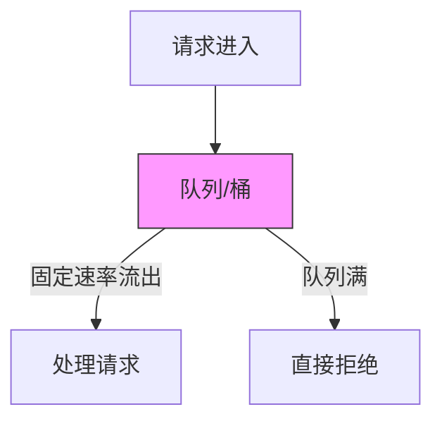
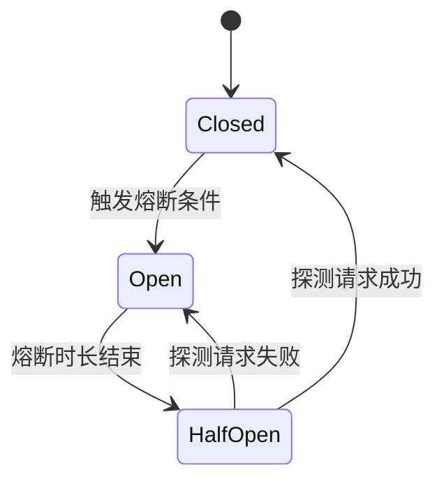

# Sentinel（限流 / 熔断 / 降级 / 流量治理）

> Sentinel 是阿里开源的**流量治理组件**，以「限流/熔断/降级/热点/系统保护/授权」六大防护能力，替代已停更的 Hystrix。相比 Hystrix（线程隔离重）、Resilience4J（需编码），Sentinel 以**控制台 + 规则动态生效 + 流量塑形**成为 Java 生态流量治理首选。本篇按「解决的问题 → 原理 → 特性 → 选型关注点」拆解。

---

## 一、要解决的问题

| 痛点 | 说明 |
|------|------|
| 流量突增 | 大促/秒杀瞬间 QPS 远超系统容量，需限流保护 |
| 下游故障 | 依赖服务挂了，调用方线程池被占满（雪崩），需熔断 |
| 资源耗尽 | CPU/内存到阈值，需系统自适应保护 |
| 热点参数 | 某商品 ID 被疯狂访问，需热点参数限流 |
| 流量不均 | 多实例负载不均，需流量塑形/匀速通过 |
| 调用链过长 | 微服务调用链 N 层，任一层故障都需保护 |

> 核心认知：**Sentinel 是「流量哨兵」**——站在入口/出口，对流量做识别、管控、塑形，保护系统不被打垮。

---

## 二、Sentinel 核心原理

### 2.1 架构

```
调用方 → Sentinel 资源（接口/方法/代码块）
  ├── Slot Chain（插槽链，责任链模式）
  │   ├── NodeSelectorSlot（资源入口记录）
  │   ├── ClusterBuilderSlot（全局统计）
  │   ├── StatisticSlot（实时统计：QPS/线程数/异常）
  │   ├── FlowSlot（限流规则校验）
  │   ├── DegradeSlot（熔断规则校验）
  │   ├── SystemSlot（系统保护规则校验）
  │   ├── AuthoritySlot（授权规则校验）
  │   └── HotParamSlot（热点参数限流）
  ├── 规则匹配 → 通过/拒绝/等待
  └── 实时指标 → Sentinel Dashboard/控制台
```

### 2.2 核心概念

| 概念 | 说明 |
|------|------|
| 资源（Resource） | 被保护的对象（接口/方法/代码块），用 `SphU.entry("name")` 标记 |
| 规则（Rule） | 限流/熔断/降级/系统保护/热点/授权规则 |
| 插槽（Slot） | 规则校验的执行单元（责任链） |
| 上下文（Context） | 当前调用的上下文（资源/入口/调用者） |
| Node（节点） | 实时统计节点（ClusterNode/DefaultNode/EntranceNode） |

### 2.3 限流算法

| 算法 | 原理 | 适用场景 |
|------|------|----------|
| 直接拒绝 | 超阈值直接抛异常 | 对延迟不敏感 |
| Warm Up（冷启动） | 阈值从 `count/冷启动因子` 线性增长到 count | 系统从冷态到热态 |
| 匀速排队（RateLimiter） | 请求以固定间隔通过（令牌桶） | 流量塑形（脉冲变平滑） |
| 协同限流 | 全局 Token Server 统一分配 | 集群精确限流 |

**选型关注点**：脉冲流量 → 匀速排队（变脉冲为平稳）；冷启动场景 → Warm Up；精确限流 → 协同限流。

### 2.4 熔断策略

| 策略 | 触发条件 | 恢复 |
|------|----------|------|
| 慢调用比例 | 慢调用（超 RT 阈值）占比达阈值 | 熔断后经过熔断时长进入 Half-Open |
| 异常比例 | 异常调用占比达阈值 | Half-Open 时放行一个请求，成功则恢复 |
| 异常数 | 异常数达阈值 | 同上 |

**选型关注点**：慢调用熔断（下游变慢但没挂）→ 慢调用比例；异常熔断（下游挂了）→ 异常比例。

### 2.5 流量控制（FlowControl）

| 维度 | 说明 |
|------|------|
| QPS 阈值 | 每秒请求数上限 |
| 线程数阈值 | 同时处理该资源的线程数上限（信号量隔离） |
| 调用方区分 | 按调用方（appkey）分别限流（防止某调用方打爆全局） |
| 关联限流 | 资源 A 被限流时，资源 B 也被限流（如写库限流→读库也限流） |
| 链路限流 | 指定入口来源限流（如只限 /api 来源，不限 /web 来源） |

---

## 三、Sentinel 控制台（Dashboard）

| 功能 | 说明 |
|------|------|
| 实时监控 | 秒级 QPS/异常/通过/拒绝曲线 |
| 资源管理 | 查看应用所有资源 |
| 规则配置 | 限流/熔断/降级/系统保护/热点/授权规则动态下发 |
| 机器管理 | 查看应用实例健康状态 |
| 集群限流 | Token Server 配置 |

**选型关注点**：Sentinel 控制台是「规则动态生效」的关键——规则修改无需重启应用（通过 Nacos/Apollo/ZooKeeper/文件 持久化）。

---

## 四、Sentinel vs Hystrix vs Resilience4J

| 维度 | Sentinel | Hystrix | Resilience4J |
|------|----------|---------|--------------|
| 语言 | Java | Java | Java |
| 隔离策略 | 信号量（线程数限） | 线程池/信号量（重） | 信号量 |
| 限流 | 丰富（QPS/线程/匀速/WarmUp） | 无 | 有（RateLimiter） |
| 熔断 | 慢调用/异常比例/异常数 | 异常比例 | 异常比例/慢调用 |
| 控制台 | 强（实时监控+规则下发） | Dashboard（弱，已停） | Micrometer + Grafana |
| 动态规则 | 是（多数据源） | 否 | 是（需配合配置中心） |
| 热点参数 | 是 | 否 | 否 |
| 系统保护 | 是（CPU/负载/入口QPS） | 否 | 否 |
| 授权规则 | 是（黑白名单） | 否 | 否 |
| 流量塑形 | 是（匀速排队） | 否 | 否 |
| 社区 | 阿里，活跃 | 停更 | 活跃 |

**选型关注点**：Java 生态流量治理 → **Sentinel**（功能最全+控制台最强）；Spring Cloud 生态 → Resilience4J（与 Spring Boot 集成好）；Hystrix 已停更，新项目不推荐。

---

## 五、Sentinel 与 Spring Cloud Alibaba 集成

```java
// 1. 引入依赖
// spring-cloud-starter-alibaba-sentinel

// 2. 资源标记
@SentinelResource(value = "getOrder", blockHandler = "getOrderBlock", fallback = "getOrderFallback")
public Order getOrder(String id) { ... }

// 3. 规则配置（Nacos 持久化）
// spring.cloud.sentinel.datasource.ds1.nacos.server-addr=...
// spring.cloud.sentinel.datasource.ds1.nacos.dataId=${spring.application.name}-flow-rules
// spring.cloud.sentinel.datasource.ds1.nacos.rule-type=flow
```

**选型关注点**：Spring Cloud Alibaba 生态 → Sentinel 是默认流量治理组件（与 Nacos/Seata 无缝集成）。

---

## 六、Sentinel 规则持久化

| 数据源 | 说明 |
|--------|------|
| 文件 | 本地文件（开发用） |
| Nacos | 推荐（与 Spring Cloud Alibaba 集成） |
| Apollo | 与 Apollo 配置中心集成 |
| ZooKeeper | 与 ZK 集成 |
| Consul | 与 Consul 集成 |
| etcd | 与 etcd 集成 |
| MySQL | 通过 DataSource 扩展 |

**选型关注点**：生产环境必须持久化（否则重启规则丢失），推荐 Nacos（与 Spring Cloud Alibaba 生态一致）。

---

## 七、选型速查

| 需求 | 首选 | 备选 |
|------|------|------|
| 限流（QPS/线程） | Sentinel | Resilience4J |
| 熔断（慢调用/异常） | Sentinel | Resilience4J |
| 流量塑形（匀速通过） | Sentinel | — |
| 热点参数限流 | Sentinel | — |
| 系统自适应保护 | Sentinel | — |
| 黑白名单授权 | Sentinel | — |
| 实时监控+规则下发 | Sentinel Dashboard | — |
| Spring Cloud 生态 | Sentinel | Resilience4J |
| 网关层限流 | Sentinel Gateway | Redis + Lua |

---

## 八、Sentinel 流控内部实现

### 8.1 漏桶算法（Leaky Bucket）



| 特性 | 说明 |
|------|------|
| 原理 | 请求进入固定大小的桶，以恒定速率流出 |
| 优势 | 平滑流量，削峰填谷 |
| 劣势 | 突发流量需排队等待，延迟较高 |
| Sentinel 实现 | `controlBehavior=2`（匀速排队模式） |

### 8.2 Warm Up（冷启动）

```
Warm Up = 请求以固定间隔通过，阈值从 低 → 高 线性增长

原理：
  冷启动因子（默认 3）= 阈值/3
  预热时长内，允许通过的请求数从 count/3 线性增长到 count
  预热时长结束 → 稳态阈值

示例：
  count=90, warmUpPeriodSec=10
  → 初始 QPS = 90/3 = 30
  → 10s 内线性增长到 90
  → 10s 后稳定在 90
```

| 场景 | 说明 |
|------|------|
| 服务刚启动 | 线程池/连接池未初始化，容量不足 |
| 依赖冷资源 | 缓存未预热，数据库连接未建立 |
| 大促场景 | 流量从零突增，系统需渐进式扩容 |

### 8.3 系统自适应保护（System Adaptive）

| 保护维度 | 说明 | 计算方式 |
|----------|------|----------|
| CPU 使用率 | 系统 CPU 超阈值限流 | 实时 CPU 使用率 > 阈值 → 拒绝 |
| 系统负载 | 系统 load 超阈值限流 | 系统 load > 阈值 → 拒绝 |
| 入口 QPS | 入口总 QPS 超阈值限流 | 所有入口 QPS 之和 > 阈值 → 拒绝 |
| 平均 RT | 入口平均 RT 超阈值限流 | 平均 RT > 阈值 → 拒绝 |

```
系统保护原理：
  1. 定期（默认 1s）采集系统指标（CPU/Load/QPS/RT）
  2. 通过滑动窗口计算当前系统负载
  3. 负载超阈值 → 自动调整 QPS 上限
  4. 负载恢复 → 逐步放开口径

优势：无需手动设置阈值，系统自动感知负载
劣势：依赖操作系统指标采集精度
```

### 8.4 Sentinel 流控与 QPS 计算

```
Sentinel QPS 统计实现：
  滑动窗口（LeapArray）
    ├── 窗口大小：默认 1s
    ├── 粒度：默认 500ms（半秒）
    └── 桶数：2（窗口大小/粒度）

  每个桶统计：passCount / blockCount / exceptionCount / completeCount
  QPS = passCount / 窗口时长

  实时性：每 500ms 更新一次统计
  性能：无锁 CAS + ThreadLocal 局部桶
```

---

## 九、Sentinel 熔断状态机

### 9.1 三态模型



| 状态 | 说明 | 行为 |
|------|------|------|
| **Closed**（关闭） | 正常状态，放行所有请求 | 统计慢调用/异常比例，达阈值 → Open |
| **Open**（打开） | 熔断状态，拒绝所有请求 | 等待熔断时长 → HalfOpen |
| **HalfOpen**（半开） | 探测恢复 | 放行一个请求，成功 → Closed，失败 → Open |

### 9.2 熔断时序示例

```
时间线：
  T0：慢调用比例达阈值 → 熔断（Open）
  T1~T10：所有请求被拒绝（Fast Fail）
  T10：熔断时长结束 → HalfOpen
  T11：探测请求成功 → Closed（恢复正常）
  T12：探测请求失败 → Open（继续熔断）
```

### 9.3 熔断配置最佳实践

| 参数 | 建议值 | 说明 |
|------|--------|------|
| minRequestAmount | 5~10 | 最小请求数（低于此不触发） |
| statIntervalMs | 1000~10000 | 统计时间窗口 |
| timeWindow | 10~30s | 熔断时长 |
| slowRatioThreshold | 0.5~0.8 | 慢调用比例阈值 |
| maxAllowedRt | 500~2000ms | 慢调用 RT 阈值 |

---

## 十、Sentinel 系统保护规则

### 10.1 系统规则配置

```json
[
  {
    "resource": "系统规则",
    "highestSystemLoad": 10,
    "highestCpuUsage": 0.8,
    "maxRt": 500,
    "maxQps": 10000
  }
]
```

| 参数 | 说明 | 建议 |
|------|------|------|
| highestSystemLoad | 系统最高负载 | CPU 核数 × 2 |
| highestCpuUsage | 最高 CPU 使用率 | 0.7~0.85 |
| maxRt | 最高平均 RT | 业务可接受的上限 |
| maxQps | 最高入口 QPS | 系统处理能力上限 |

### 10.2 系统保护 vs 资源级限流

| 维度 | 系统保护 | 资源级限流 |
|------|----------|------------|
| 粒度 | 全局（整个应用） | 单个资源（接口） |
| 依据 | 系统指标（CPU/Load/QPS/RT） | 资源指标（QPS/线程数） |
| 作用 | 自动调整全局 QPS 上限 | 控制单个接口流量 |
| 场景 | 系统整体过载保护 | 防止单接口被打爆 |

---

## 十一、Sentinel 与 Spring Cloud 深度集成

### 11.1 自动配置原理

```java
// SentinelAutoConfiguration 自动装配流程
1. @EnableConfigurationProperties → SentinelProperties
2. @ConditionalOnClass → classpath 有 Sentinel 时生效
3. 初始化 SentinelResourceAspect（AOP 拦截 @SentinelResource）
4. 注册 Sentinel 与 Nacos/Apollo 的数据源绑定
5. 注册 Sentinel 与 Spring Cloud Gateway 的集成
```

### 11.2 Feign 与 Sentinel 集成

```yaml
# application.yml
spring:
  cloud:
    openfeign:
      sentinel:
        enabled: true  # 启用 Feign Sentinel 降级

# Feign 接口降级
@FeignClient(name = "user-service", fallback = UserServiceFallback.class)
public interface UserService {
    @GetMapping("/user/{id}")
    User getUser(@PathVariable Long id);
}

@Component
public class UserServiceFallback implements UserService {
    @Override
    public User getUser(Long id) {
        return new User("默认用户");  // 降级返回
    }
}
```

### 11.3 RestTemplate 与 Sentinel 集成

```java
@Configuration
public class RestTemplateConfig {
    @Bean
    @SentinelRestTemplate  // 自动注入 Sentinel 保护
    public RestTemplate restTemplate() {
        return new RestTemplate();
    }
}
```

---

## 十二、Sentinel Dashboard 定制化

### 12.1 Dashboard 架构

```
Sentinel Dashboard
  ├── 实时监控（WebSocket 推送）
  │   ├── QPS 曲线
  │   ├── 线程数曲线
  │   └── RT 曲线
  ├── 规则管理（推送到配置中心）
  │   ├── 流控规则
  │   ├── 熔断规则
  │   ├── 热点规则
  │   └── 系统规则
  ├── 机器列表（健康状态）
  └── 集群流控（Token Server）
```

### 12.2 Dashboard 定制开发

```java
// 自定义数据源（从 MySQL 加载规则）
@Component
public class DataSourceRuleManager {
    @Autowired
    private JdbcTemplate jdbcTemplate;

    public List<FlowRule> getFlowRules(String app) {
        String sql = "SELECT * FROM sentinel_flow_rules WHERE app_name = ?";
        return jdbcTemplate.query(sql, new Object[]{app}, (rs, rowNum) -> {
            FlowRule rule = new FlowRule();
            rule.setResource(rs.getString("resource"));
            rule.setCount(rs.getDouble("count"));
            rule.setGrade(rs.getInt("grade"));
            return rule;
        });
    }
}
```

### 12.3 Dashboard 高可用

| 方案 | 说明 |
|------|------|
| 单实例 | 开发/测试环境 |
| 多实例 + 共享配置中心 | 所有实例从 Nacos 读取规则 |
| 自定义 Dashboard | 对接公司内部权限系统 |

---

## 十三、Sentinel vs Hystrix vs Resilience4j 深度对比

### 13.1 架构对比

| 维度 | Sentinel | Hystrix | Resilience4j |
|------|----------|---------|--------------|
| 隔离模型 | 信号量 | 线程池/信号量 | 信号量 |
| 线程池开销 | 无 | 每资源一个线程池 | 无 |
| 熔断状态 | 三态（Closed/Open/HalfOpen） | 三态 | 三态 |
| 滑动窗口 | LeapArray（环形缓冲区） | RxJava 滑动窗口 | 基于环形缓冲区 |
| 规则存储 | 多数据源（Nacos/ZK/Apollo） | 本地 | 配置文件 |
| 控制台 | 完整（实时监控+规则下发） | 已停更 | 无（依赖 Micrometer） |

### 13.2 性能对比

| 指标 | Sentinel | Hystrix | Resilience4j |
|------|----------|---------|--------------|
| 单机 QPS（限流） | 100k+ | N/A | 50k+ |
| 单机 QPS（熔断） | 50k+ | 10k+ | 30k+ |
| 内存占用 | 低 | 高（线程池） | 低 |
| GC 压力 | 低 | 高 | 低 |

### 13.3 生态适配

```
Spring Cloud Alibaba 生态：
  Nacos（注册+配置）+ Sentinel（限流熔断）+ Seata（分布式事务）
  → 一站式解决方案

Spring Cloud 原生生态：
  Spring Cloud Gateway + Resilience4j + Spring Cloud Config
  → 轻量级方案

Dubbo 生态：
  Sentinel + Nacos + Dubbo
  → RPC 流量治理
```

---

## 十四、Sentinel 生产最佳实践

### 14.1 规则配置流程

```
1. 压测 → 确定系统 QPS/RT/线程数上限
2. 设置系统保护规则（CPU/Load/QPS）
3. 为每个核心接口设置限流规则（QPS × 1.2 冗余）
4. 为下游依赖设置熔断规则（慢调用/异常比例）
5. 为热点参数设置热点规则（商品ID/用户ID）
6. 为黑白名单设置授权规则
7. 规则推送到 Nacos → 持久化
8. 观察 Dashboard → 调整阈值
```

### 14.2 降级策略设计

| 降级层级 | 策略 | 示例 |
|----------|------|------|
| 接口级 | 返回默认值 | 返回空列表 |
| 服务级 | 缓存降级 | 返回 Redis 缓存数据 |
| 功能级 | 功能开关 | 关闭非核心功能 |
| 全局级 | 页面降级 | 显示维护页面 |

### 14.3 监控告警配置

```yaml
# Prometheus 告警规则
groups:
  - name: sentinel-alerts
    rules:
      - alert: SentinelBlockHigh
        expr: sum(rate(sentinel_block_total[5m])) by (resource) > 100
        for: 5m
        labels:
          severity: warning
        annotations:
          summary: "Sentinel 限流告警：{{ $labels.resource }}"
```

---

## 十四-2、Sentinel 滑动窗口计数器实现原理

```
Sentinel 滑动窗口（LeapArray）实现：

数据结构：
  LeapArray = 环形数组（Array）
  每个桶（Bucket）= 一段时间窗口的统计数据

配置：
  窗口大小（windowIntervalMs）：默认 1s
  桶数（sampleCount）：默认 2
  桶粒度 = 窗口大小 / 桶数 = 500ms

统计内容：
  每个桶维护：
    passCount：通过请求数
    blockCount：拒绝请求数
    exceptionCount：异常数
    completeCount：完成数

QPS 计算：
  当前 QPS = 当前桶 passCount / 桶粒度
  窗口 QPS = 所有桶 passCount 之和 / 窗口大小

实现：
  无锁 CAS + ThreadLocal 局部桶
  性能：单机 10 万+ QPS
```

## 十四-3、热点参数限流（ParamFlowThrottling）实战配置

```json
{
  "resource": "getOrder",
  "grade": 1,
  "count": 100,
  "paramIdx": 0,
  "paramFlowItemList": [
    {
      "object": "user_123",
      "count": 10,
      "grade": 1,
      "durationSec": 10
    }
  ]
}
```

```
热点参数限流原理：

配置：
  resource：资源名
  paramIdx：参数索引（从 0 开始）
  count：默认阈值
  paramFlowItemList：特定参数值的自定义阈值

场景：
  1. 某商品 ID 被疯狂访问 → 限流该商品 ID
  2. 某用户异常调用 → 限流该用户
  3. 某 IP 恶意请求 → 限流该 IP

原理：
  1. Sentinel 拦截方法调用
  2. 提取指定参数值
  3. 为该参数值维护独立计数器
  4. 超过阈值 → 拒绝

代码：
  @SentinelResource(value = "getOrder", 
      blockHandler = "getOrderBlock")
  public Order getOrder(String userId, String orderId) {
      // userId 是热点参数（paramIdx=0）
  }
```

## 十四-4、系统自适应保护（CPU/Load/RT 阈值联动）

| 保护维度 | 说明 | 配置 |
|----------|------|------|
| CPU 使用率 | 系统 CPU 超阈值限流 | highestCpuUsage=0.8 |
| 系统负载 | 系统 load 超阈值限流 | highestSystemLoad=10 |
| 入口 QPS | 入口总 QPS 超阈值限流 | maxQps=10000 |
| 平均 RT | 入口平均 RT 超阈值限流 | maxRt=500 |

```
系统保护原理：

1. 定期（默认 1s）采集系统指标
   CPU 使用率（/proc/stat）
   系统负载（/proc/loadavg）
   入口 QPS（Sentinel 统计）
   平均 RT（Sentinel 统计）

2. 通过滑动窗口计算当前系统负载

3. 负载超阈值 → 自动调整 QPS 上限
   如 CPU=85% → 限制 QPS=5000

4. 负载恢复 → 逐步放开口径

优势：
  无需手动设置阈值
  系统自动感知负载
  全局保护（防止单接口拖垮系统）

配置示例：
  {
    "resource": "系统规则",
    "highestSystemLoad": 10,
    "highestCpuUsage": 0.8,
    "maxRt": 500,
    "maxQps": 10000
  }
```

## 十四-5、Sentinel 与 OpenTelemetry 联动上报

```java
// Sentinel + OTel 集成
@SentinelResource(value = "getOrder")
public Order getOrder(String id) {
    Span span = tracer.spanBuilder("getOrder").startSpan();
    try {
        // 业务逻辑
        return orderService.findById(id);
    } finally {
        span.end();
    }
}

// Micrometer 暴露 Sentinel 指标
management:
  metrics:
    export:
      prometheus:
        enabled: true
  endpoints:
    web:
      exposure:
        include: prometheus

// 指标含义：
// sentinel_block_total: 被拒绝的请求总数
// sentinel_pass_total: 通过的请求总数
// sentinel_exception_total: 异常总数
// sentinel_thread_count: 当前线程数
// sentinel_snapshot_thread_count: 快照线程数
```

## 十四-6、Dashboard 自定义集群流控规则

```java
// 集群流控 = 全局 Token Server 分配令牌

1. 部署 Token Server（Sentinel Dashboard 内置）
   - 接收各客户端的 Token 请求
   - 按规则分配令牌
   - 返回给客户端

2. 客户端配置
   cluster_mode=true
   client_ip=10.0.0.1
   server_port=8720
   cluster_config.server_addr=token-server:8719

3. 流控规则
   {
     "resource": "cluster-resource",
     "grade": 1,
     "count": 1000,
     "clusterMode": true
   }

4. Token Server 分配
   - 客户端请求 Token
   - Token Server 检查全局 QPS
   - 未超限 → 返回 Token
   - 超限 → 返回 BlockException
```

## 十四-7、Sentinel 客户端限流规则持久化三方案

| 方案 | 说明 | 适用 |
|------|------|------|
| Nacos 推送 | 规则存 Nacos，变更自动推送到客户端 | Spring Cloud Alibaba 生态 |
| Apollo 配置 | 规则存 Apollo，客户端拉取 | Apollo 配置中心 |
| 文件推送 | 规则存文件，定时拉取 | 开发测试环境 |

```
Nacos 持久化流程：

1. 规则存储在 Nacos
   Data ID: ${spring.application.name}-flow-rules
   Group: SENTINEL_GROUP
   Format: JSON

2. 客户端启动时拉取规则
   spring.cloud.sentinel.datasource.ds1.nacos.server-addr=...
   spring.cloud.sentinel.datasource.ds1.nacos.dataId=...
   spring.cloud.sentinel.datasource.ds1.nacos.rule-type=flow

3. 规则变更自动推送
   Nacos → 客户端 Listener → 更新本地规则

4. 优势：
   - 规则持久化（重启不丢）
   - 动态生效（无需重启）
   - 集中管理（Dashboard 统一配置）

注意：
  - Nacos 需高可用（3 节点）
  - 客户端需实现 Listener
  - 规则格式需统一（JSON）
```

## 十五、与其他板块的关系

- 限流原理（令牌桶/漏桶/滑动窗口）见「[场景设计/稳定性三板斧](../../场景设计/稳定性三板斧：限流-熔断-降级.md)」；
- 分布式限流见「[Redis 实现限流](../../场景设计/redis实现限流.md)」；
- 服务网格流量治理见「[云原生/Service Mesh](../../云原生/ServiceMesh.md)」；
- 云上中间件总览见「[云上中间件体系总览](./云上中间件体系总览.md)」。

---

## 九、Sentinel 生产配置清单

### 9.1 限流规则配置

```json
[
  {
    "resource": "getOrder",
    "grade": 1,
    "count": 100,
    "strategy": 0,
    "controlBehavior": 0
  }
]
```

| 参数 | 说明 |
|------|------|
| grade | 0=线程数限流，1=QPS 限流 |
| count | 阈值 |
| strategy | 0=直接，1=关联，2=链路 |
| controlBehavior | 0=快速拒绝，1=Warm Up，2=匀速排队 |

### 9.2 熔断规则配置

```json
[
  {
    "resource": "downstreamService",
    "grade": 0,
    "count": 0.5,
    "timeWindow": 10,
    "minRequestAmount": 5,
    "statIntervalMs": 1000
  }
]
```

| 参数 | 说明 |
|------|------|
| grade | 0=慢调用比例，1=异常比例，2=异常数 |
| count | 阈值 |
| timeWindow | 熔断时长（秒） |
| minRequestAmount | 最小请求数（低于此不触发） |

### 9.3 监控指标

```
Sentinel 指标：
  每秒通过数（QPS Pass）
  每秒拒绝数（QPS Block）
  每秒异常数（QPS Exception）
  线程数（Thread Count）
  响应时间（RT）
```

### 9.4 常见问题排查

| 问题 | 原因 | 解决 |
|------|------|------|
| 误限流 | 阈值设置过低 | 调整阈值 |
| 熔断不生效 | 规则未持久化 | 配置 Nacos 持久化 |
| 控制台无数据 | Agent 未连接 | 检查 Agent 配置 |
| 性能影响 | Slot 过多 | 精简 Slot 配置 |

---

## 十、Sentinel 网关限流

### 10.1 Spring Cloud Gateway 集成

```java
@Configuration
public class GatewayConfig {
    @Bean
    public RouteLocator routeLocator(RouteLocatorBuilder builder) {
        return builder.routes()
            .route("order-service", r -> r
                .path("/api/order/**")
                .filters(f -> f
                    .requestRateLimiter(config -> config
                        .setRateLimiter(redisRateLimiter())
                        .setKeyResolver(userKeyResolver())))
                .uri("lb://order-service"))
            .build();
    }
}
```

### 10.2 网关限流规则

```json
[
  {
    "resource": "order-service",
    "grade": 1,
    "count": 200,
    "intervalSec": 1
  }
]
```

---

## 十一、Sentinel 与微服务集成

| 框架 | 集成方式 |
|------|----------|
| Spring Cloud | spring-cloud-starter-alibaba-sentinel |
| Dubbo | sentinel-apache-dubbo-adapter |
| Web Servlet | sentinel-web-servlet-adapter |
| gRPC | sentinel-grpc-adapter |
| Reactor | sentinel-reactor-adapter |

---

## 十二、Sentinel 与 OpenTelemetry 集成

```java
// 集成 OTel 进行分布式追踪
@SentinelResource(value = "getOrder")
public Order getOrder(String id) {
    Span span = tracer.spanBuilder("getOrder").startSpan();
    try {
        // 业务逻辑
        return orderService.findById(id);
    } finally {
        span.end();
    }
}
```

### 12.1 Sentinel + Micrometer 指标

```yaml
# 配置 Micrometer 暴露 Sentinel 指标
management:
  metrics:
    export:
      prometheus:
        enabled: true
  endpoints:
    web:
      exposure:
        include: prometheus
```

### 12.2 Sentinel + Grafana 可视化

```
Grafana Dashboard 推荐：
  - Sentinel Real-time Monitor：实时流量监控
  - Sentinel Rule Dashboard：规则管理
  - Sentinel Cluster Flow：集群流控
```

---

## Sentinel 滑动窗口计数器实现原理

### LeapArray / SimpleUpdateLeapArray

```text
LeapArray 核心结构：
  - 时间窗口长度：默认 1s
  - 窗口个数：默认 2（每 500ms 一个窗口）
  - 每个窗口：AtomicLong 计数器

滑动窗口算法：
  1. 获取当前时间对应的窗口
  2. 如果窗口过期，重置并切换
  3. 原子更新计数器
  4. 聚合多个窗口统计

优势：
  - 内存占用小（固定窗口数）
  - 并发安全（CAS 操作）
  - 精确计数（非近似）
```

```java
// LeapArray 源码核心
public class LeapArray<T> {
    private final int windowLengthInMs;  // 窗口长度
    private final int sampleCount;       // 窗口个数
    private final AtomicReferenceArray<WindowWrap<MetricBucket>> array;

    public MetricBucket currentWindow() {
        long timeId = TimeUtil.currentTimeMillis() / windowLengthInMs;
        int idx = (int)(timeId % sampleCount);
        WindowWrap<MetricBucket> old = array.get(idx);

        if (old.windowStart() + windowLengthInMs < TimeUtil.currentTimeMillis()) {
            // 窗口过期，重置
            synchronized (old) {
                if (old.windowStart() + windowLengthInMs < TimeUtil.currentTimeMillis()) {
                    old.resetTo(TimeUtil.currentTimeMillis());
                }
            }
        }
        return old.value();
    }
}
```

## 热点参数限流（ParamFlowThrottling）配置实战

### 配置示例

```java
// 热点参数限流规则
ParamFlowRule rule = new ParamFlowRule("queryResource")
    .setParamIdx(0)  // 第 0 个参数
    .setGrade(RuleConstant.FLOW_GRADE_QPS)
    .setCount(100)   // 默认 QPS 阈值
    .setParamFlowItemList(
        Arrays.asList(
            // 特定参数值配置
            new ParamFlowItem().setObject(String.valueOf(1))
                .setClassType(int.class.getName())
                .setCount(50),  // 参数值为 1 时，QPS 限制 50
            new ParamFlowItem().setObject(String.valueOf(2))
                .setClassType(int.class.getName())
                .setCount(200)  // 参数值为 2 时，QPS 限制 200
        )
    );
ParamFlowRuleManager.loadRules(Collections.singletonList(rule));

// 使用
@SentinelResource(value = "queryResource",
    blockHandler = "queryBlockHandler")
public Result queryResource(int param) {
    return service.query(param);
}

public Result queryBlockHandler(int param, BlockException ex) {
    return Result.fail("Rate limited: " + param);
}
```

## 系统自适应保护（CPU/Load/RT 阈值联动机制）

### 系统保护规则配置

```java
// 系统自适应保护规则
SystemRule rule = new SystemRule();
rule.setHighestSystemLoad(3.0);        // 最高系统负载
rule.setHighestCpuUsage(0.8);          // 最高 CPU 使用率
rule.setAvgRt(200);                    // 平均 RT（ms）
rule.setMaxRt(1000);                   // 最大 RT（ms）
rule.setQps(1000);                     // 入口 QPS
rule.setHighestNetworkFlow(1024 * 1024); // 最高网络流量（1MB/s）

SystemRuleManager.loadRules(Collections.singletonList(rule));

// 联动机制：
// CPU > 80% → 自动降低 QPS 阈值
// Load > 3.0 → 自动降低 QPS 阈值
// RT > 200ms → 自动降低 QPS 阈值
// 多个条件同时触发时，取最严格的阈值
```

## Sentinel 与 OpenTelemetry 联动上报

### Sentinel Metrics Export

```yaml
# 配置 Sentinel OTel Exporter
# application.yml
sentinel:
  metrics:
    exporter:
      enabled: true
      interval: 10s
      otel:
        enabled: true
        endpoint: http://otel-collector:4318
```

```java
// 自定义 MetricExporter
public class SentinelOtelExporter implements MetricExporter {
    @Override
    public void export(List<Metric> metrics) {
        for (Metric metric : metrics) {
            Span span = tracer.spanBuilder("sentinel.metric")
                .setAttribute("resource", metric.getResource())
                .setAttribute("metric.type", metric.getType())
                .setAttribute("metric.value", metric.getValue())
                .startSpan();
            span.end();
        }
    }
}
```

## Dashboard 自定义集群流控规则

### ClusterFlowRuleManager

```java
// 集群流控规则
ClusterFlowRule rule = new ClusterFlowRule("cluster-resource")
    .setClusterMode(ClusterFlowRule.CLUSTER_MODE_FIXED)
    .setFlowId(1001)
    .setGrade(RuleConstant.FLOW_GRADE_QPS)
    .setCount(1000)
    .setSampleCount(10)
    .setIntervalMs(1000);

// 设置集群模式
rule.setClusterMode(ClusterFlowRule.CLUSTER_MODE_FIXED);
// FIXED：固定阈值
// DYNAMIC：动态调整（基于实时负载）

// 加载规则
ClusterFlowRuleManager.loadRules(Collections.singletonList(rule));

// Dashboard 配置步骤：
// 1. 进入 Sentinel Dashboard
// 2. 选择「集群流控」菜单
// 3. 创建流控规则
// 4. 选择集群模式（FIXED/DYNAMIC）
// 5. 设置阈值和 Token Server
// 6. 应用规则
```

## 客户端限流规则持久化三方案

### ZK/Nacos/Apollo push vs pull

| 方案 | 模式 | 一致性 | 复杂度 | 适用场景 |
|------|------|--------|--------|----------|
| ZK | Push | 强一致 | 高 | 已有 ZK 集群 |
| Nacos | Push | 最终一致 | 中 | 已有 Nacos |
| Apollo | Push | 最终一致 | 中 | 已有 Apollo |
| Pull | Pull | 最终一致 | 低 | 简单场景 |

```java
// ZK Push 模式
ZookeeperDataSource<String> dataSource = new ZookeeperDataSource<>(
    zkAddress,
    "/sentinel/rules/flow",
    source -> {
        List<FlowRule> rules = FlowRuleUtil.fromConfig(source);
        FlowRuleManager.loadRules(rules);
    }
);

// Nacos Push 模式
NacosConfigCenter configCenter = new NacosConfigCenter(nacosServerAddr);
configCenter.addListener("sentinel-flow-rules", group, new Listener() {
    @Override
    public void receiveConfigInfo(String configInfo) {
        List<FlowRule> rules = FlowRuleUtil.fromConfig(configInfo);
        FlowRuleManager.loadRules(rules);
    }
});

// Pull 模式（定时拉取）
ScheduledExecutorService scheduler = Executors.newSingleThreadScheduledExecutor();
scheduler.scheduleAtFixedRate(() -> {
    String config = httpClient.get(CONFIG_URL);
    List<FlowRule> rules = FlowRuleUtil.fromConfig(config);
    FlowRuleManager.loadRules(rules);
}, 0, 30, TimeUnit.SECONDS);
```

## Sentinel block 日志分析与限流原因定位

### 日志分析

```bash
# Sentinel 日志路径
${LOG_PATH}/sentinel/block/${resource}.log

# 日志格式
2024-01-01 10:00:00|2|FlowException|origin=default|resource=queryResource|
    limitQps=100|currentQps=150

# 字段说明
# 时间|日志类型|异常类型|来源|资源名|限制QPS|当前QPS
```

```java
// 日志分析工具
public class SentinelLogAnalyzer {
    public void analyzeLog(String logPath) {
        List<BlockLog> logs = parseLog(logPath);

        // 统计各类型异常
        Map<String, Long> exceptionCount = logs.stream()
            .collect(Collectors.groupingBy(
                BlockLog::getExceptionType,
                Collectors.counting()));

        // 统计各资源限流次数
        Map<String, Long> resourceCount = logs.stream()
            .filter(l -> "FlowException".equals(l.getExceptionType()))
            .collect(Collectors.groupingBy(
                BlockLog::getResource,
                Collectors.counting()));

        // 分析限流原因
        logs.stream()
            .filter(l -> "FlowException".equals(l.getExceptionType()))
            .forEach(l -> {
                if (l.getCurrentQps() > l.getLimitQps() * 1.5) {
                    log.warn("资源 {} 严重超限: 当前={}, 限制={}",
                        l.getResource(), l.getCurrentQps(), l.getLimitQps());
                }
            });
    }
}
```

## Sentinel 滑动窗口计数器实现原理

### 滑动窗口数据结构

```
Sentinel 滑动窗口算法：
  将时间窗口划分为多个小窗口（bucket）
  每个小窗口有独立的计数器
  窗口滑动时，旧窗口计数器逐渐失效

  示例（1秒窗口，2个小窗口）：
    Window[0]: [0ms, 500ms)  → count = 80
    Window[1]: [500ms, 1000ms) → count = 60
    当前时间 750ms → 有效计数 = Window[0] + Window[1] = 140
```

### 滑动窗口 vs 固定窗口对比

| 维度 | 固定窗口 | 滑动窗口 |
|------|----------|----------|
| 实现复杂度 | 简单 | 中等 |
| 并发边界问题 | 有（窗口临界突发） | 无 |
| 内存开销 | 低 | 中（多窗口） |
| 精确度 | 低 | 高 |
| 适用场景 | 简单限流 | 精确限流 |

## 热点参数限流配置实战

### 热点参数限流规则

```java
// 热点参数限流配置
@SentinelResource(
    value = "getOrder",
    blockHandler = "getOrderBlockHandler"
)
public Order getOrder(String userId, String productId) {
    // userId 为热点参数，QPS = 10 限流
    // 但 userId = "vip_user" 的 QPS = 100（例外配置）
    return orderService.getOrder(userId, productId);
}

// 规则配置（JSON）
{
    "resource": "getOrder",
    "paramIdx": 0,
    "grade": 1,
    "count": 10,
    "paramStreamItemList": [
        {"param": "vip_user", "threshold": 100},
        {"param": "test_user", "threshold": 1000}
    ]
}
```

### 热点参数限流使用场景

| 场景 | 参数 | 限流策略 | 说明 |
|------|------|----------|------|
| 用户限流 | userId | 普通用户10 QPS，VIP 100 QPS | 差异化服务 |
| 接口限流 | apiName | 热门接口放宽，冷门接口收紧 | 精细化控制 |
| 地域限流 | regionId | 核心城市放宽 | 业务优先级 |
| 商品限流 | skuId | 爆款商品放宽，普通商品收紧 | 热点隔离 |

## 系统自适应保护配置

### CPU/Load/RT 阈值联动

```java
// 系统保护规则配置
SystemRule rule = new SystemRule();
rule.setHighestSystemLoad(3.0);           // 系统最高负载
rule.setHighestCpuUsage(0.8);             // 最高 CPU 使用率
rule.setAvgRt(200);                       // 平均 RT 阈值（ms）
rule.setMaxRt(1000);                      // 最大 RT 阈值（ms）
rule.setMaxThread(100);                   // 最大并发线程数
rule.setQps(1000);                        // 入口 QPS
SystemRuleManager.loadRules(Collections.singletonList(rule));
```

### 系统自适应保护决策流程

```
系统自适应保护流程：
  采集系统指标（CPU/Load/RT/线程数）
    → 计算当前系统压力
    → 对比阈值规则
    → 压力超限 → 动态调整流量控制阈值
    → 压力正常 → 恢复原始阈值
    → 关键：基于反馈的动态调节，无需人工干预
```

## Sentinel 与 OpenTelemetry 联动上报

### Metrics 导出配置

```yaml
# Sentinel OpenTelemetry 集成
sentinel:
  metrics:
    exporter:
      enabled: true
    internode:
      metrics:
        port: 0
        path: /metrics
    command:
      server:
        port: 0
    log:
      info:
        enabled: false

# OTel Collector 配置
processors:
  batch:
    send_batch_size: 1000
    timeout: 5s
exporters:
  prometheus:
    endpoint: "0.0.0.0:8889"
```

## 客户端限流规则持久化三方案

| 方案 | 存储 | 推送方式 | 一致性 | 运维复杂度 |
|------|------|----------|--------|-----------|
| Pull 模式 | Nacos/Apollo | 客户端定时拉取 | 最终一致 | 低 |
| Push 模式 | Nacos | 配置变更推送 | 强一致 | 低 |
| Push 模式 | ZooKeeper | Watcher 通知 | 强一致 | 中 |
| 混合模式 | Nacos + DB | Push + DB 持久化 | 强一致 | 中 |

## Sentinel 限流算法选型

| 算法 | 特点 | 适用场景 | QPS 精确度 |
|------|------|----------|-----------|
| 计数器 | 简单、有边界问题 | 简单限流 | 低 |
| 滑动窗口 | 精确、内存适中 | 通用限流 | 高 |
| 令牌桶 | 允许突发 | 允许突发流量 | 高 |
| 漏桶 | 均匀消费 | 削峰填谷 | 高 |
| WarmUp | 预热启动 | 冷启动场景 | 高 |
| 匀速队列 | 匀速通过 | 消息队列消费 | 高 |

> 一句话：**Sentinel = 限流（QPS/线程/匀速/WarmUp）+ 熔断（慢调用/异常）+ 热点参数 + 系统保护 + 授权 + 控制台动态规则；选型先看「生态（Spring Cloud Alibaba → Sentinel）」，再定「规则持久化（Nacos）」，最后配「控制台监控」**。
