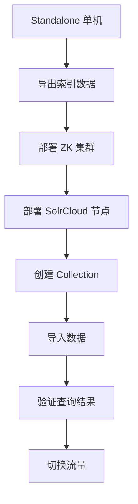
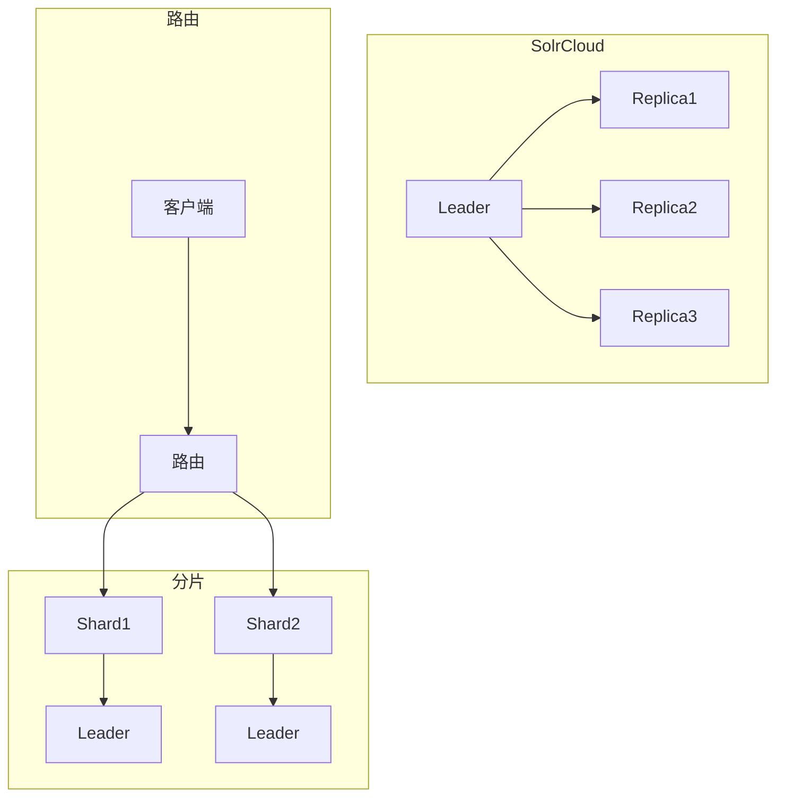

# Solr（企业级搜索平台 / Lucene 封装）

> Solr 是 Apache 基于 Lucene 的**企业级搜索平台**，以「全文检索 + 分面搜索 + 高亮 + 分布式」成为传统搜索领域事实标准。相比 Elasticsearch（轻量/实时）、Lucene（底层库），Solr 以「功能丰富 + 生态成熟 + 传统企业首选」独树一帜。本篇按「解决的问题 → 原理 → 特性 → 选型关注点」拆解。

---

## 一、要解决的问题

| 痛点 | 说明 |
|------|------|
| 全文检索 | 数据库 LIKE 查询性能极差 |
| 分面搜索 | 电商筛选（品牌/价格/评分维度聚合） |
| 高亮 | 搜索结果关键词高亮 |
| 分布式搜索 | 大数据量搜索需水平扩展 |
| 多语言分词 | 中文/日文/韩文分词需求 |

> 核心认知：**Solr = Lucene 的企业级封装**——Lucene 是底层索引库，Solr 在其上提供 HTTP API/分布式/管理界面。

---

## 二、Solr 核心原理

### 2.1 架构

```
Solr Server
  ├── Solr Core（核心：一个索引实例）
  │   ├── Schema（字段定义：类型/分词器/是否索引/是否存储）
  │   ├── Index（Lucene 索引文件）
  │   └── Config（solrconfig.xml 配置）
  ├── SolrCloud（分布式模式）
  │   ├── ZooKeeper（协调：配置/选主/路由）
  │   ├── Collection（逻辑索引）
  │   ├── Shard（分片）
  │   └── Replica（副本）
  ├── RequestHandler（请求处理器：/select/update/SpellCheck...）
  └── Update Chain（更新链：分词→索引→副本同步）
```

### 2.2 Lucene 索引原理

```
文档 → 分析器（Analyzer）
  ├── 分词器（Tokenizer）：文本 → 词元流
  ├── 过滤器（TokenFilter）：小写/停用词/同义词/词干提取
  └── 词元（Token）：写入倒排索引

倒排索引（Inverted Index）
  ├── 词项字典（Term Dictionary）：所有词项有序
  ├── 倒排表（Posting List）：词项 → 文档ID列表 + 词频 + 位置
  └── 跳表（Skip List）：加速倒排表查找
```

**选型关注点**：倒排索引是搜索的核心——词项→文档的映射，支持快速全文检索。

### 2.3 分词器（Analyzer）

| 分词器 | 说明 | 适用 |
|--------|------|------|
| StandardTokenizer | 标准分词（按空格/标点） | 英文 |
| IKAnalyzer | 中文分词（细粒度/智能） | 中文（最常用） |
| jieba | 中文分词（Python 生态常用） | 中文 |
| HanLP | 中文分词（NLP 功能丰富） | 中文 |
| kuromoji | 日文分词 | 日文 |
| CJKTokenizer | 中日韩二元分词 | 中日韩 |

**选型关注点**：中文搜索 → IKAnalyzer（最流行，支持扩展词典/停用词）。

### 2.4 SolrCloud（分布式）

```
Collection（逻辑索引）
  ├── Shard 1（分片1）
  │   ├── Replica 1（Leader）
  │   └── Replica 2（Follower）
  └── Shard 2（分片2）
      ├── Replica 1（Leader）
      └── Replica 2（Follower）

ZooKeeper
  ├── 存储集群状态/配置
  ├── 选主（Leader 选举）
  └── 路由（请求路由到对应 Shard）
```

**选型关注点**：SolrCloud 依赖 ZK（与 ElasticSearch 相比是劣势，ES 自带集群协调）。

---

## 三、Solr 核心特性

| 特性 | 说明 |
|------|------|
| 全文检索 | 基于倒排索引的全文检索 |
| 分面搜索 | 按维度聚合统计（品牌/价格区间/评分） |
| 高亮 | 搜索结果关键词高亮 |
| 拼写检查 | 拼写纠错（"Did you mean"） |
| 自动补全 | 搜索建议/自动完成 |
| 空间搜索 | 地理空间搜索（距离/多边形） |
| 分组/折叠 | 结果分组/去重 |
| 多租户 | 多 Core/Collection 隔离 |
| 数据导入 | DataImportHandler（DB/CSV/XML/JSON 导入） |
| 安全 | 认证/授权/TLS |
| 管理界面 | Solr Admin UI |

---

## 四、Solr vs Elasticsearch

| 维度 | Solr | Elasticsearch |
|------|------|---------------|
| 底层 | Lucene | Lucene |
| 诞生 | 2004（早） | 2010（晚） |
| 分布式 | SolrCloud（依赖 ZK） | 自带集群协调（无外部依赖） |
| 实时性 | 近实时（soft commit） | 近实时（1s refresh） |
| 全文检索 | 强 | 强 |
| 分析/聚合 | 中 | 强（聚合能力更强） |
| 易用性 | 中 | 强（REST API 更友好） |
| 安装 | 较重 | 轻量 |
| 配置 | XML（复杂） | JSON/YAML（简洁） |
| 中文 | IKAnalyzer（成熟） | IK/结巴（成熟） |
| 生态 | 传统企业/电商 | 日志/监控/APM/搜索 |
| 社区 | 成熟 | 更活跃 |
| 云原生 | 弱 | 强（ES Operator） |
| 许可证 | Apache 2.0 | SSPL/Elastic License（变更后） |

**选型关注点**：
- 传统企业搜索/电商分面搜索 → **Solr**（功能更丰富）
- 日志/监控/APM/实时搜索 → **ElasticSearch**（生态更活跃）
- 需要最新特性/云原生 → **ElasticSearch**
- 已有 Solr 基础设施 → 继续 Solr

---

## 五、Solr 生产实践

### 5.1 Schema 设计

```xml
<field name="id" type="string" indexed="true" stored="true" required="true"/>
<field name="title" type="text_ik" indexed="true" stored="true"/>
<field name="content" type="text_ik" indexed="true" stored="true"/>
<field name="price" type="pdouble" indexed="true" stored="true"/>
<field name="brand" type="string" indexed="true" stored="true" docValues="true"/>
<field name="create_time" type="pdate" indexed="true" stored="true"/>
```

**选型关注点**：
- `indexed="true"`：是否索引（可搜索）
- `stored="true"`：是否存储（可返回原文）
- `docValues="true"`：是否列式存储（分面/排序/聚合需要）

### 5.2 关键配置

| 配置 | 说明 |
|------|------|
| autoCommit | 硬提交（fsync 到磁盘）间隔 |
| autoSoftCommit | 软提交（可见但不到磁盘）间隔 |
| mergeFactor | 段合并因子 |
| ramBufferSizeMB | 索引缓冲大小 |
| maxBufferedDocs | 缓冲文档数 |

### 5.3 性能调优

| 调优维度 | 建议 |
|----------|------|
| 分片数 | 按数据量和查询量（过多增加协调开销） |
| 副本数 | 查询多→增加副本（读扩展） |
| 缓存 | filterCache/queryResultCache/documentCache |
| 段合并 | 合理配置 mergePolicy（减少段数） |
| JVM 堆 | 不超过 32GB（压缩 OOPs） |

### 5.4 高可用

- SolrCloud：多副本 + ZK 协调（自动故障转移）
- 跨数据中心：Solr CDCR（Cross Data Center Replication）

---

## 六、选型速查

| 需求 | 首选 | 备选 |
|------|------|------|
| 全文检索 | Solr / ES | — |
| 电商分面搜索 | Solr | ES |
| 日志/监控 | ES | Loki |
| 实时搜索 | ES | Solr |
| 中文搜索 | Solr + IK | ES + IK |
| 自动补全 | ES Completion Suggester | Solr Suggester |
| 地理搜索 | ES / Solr | PostGIS |
| 云原生 | ES | — |

---

## SolrCloud Architecture Deep

### Collections/Shards/Replicas

```
SolrCloud 架构：
  Collection（逻辑索引）
    ├── Shard 1（分片1，数据子集）
    │   ├── Replica 1（Leader，处理写）
    │   ├── Replica 2（Follower，读扩展）
    │   └── Replica 3（Follower，读扩展）
    └── Shard 2（分片2，数据子集）
        ├── Replica 1（Leader）
        ├── Replica 2（Follower）
        └── Replica 3（Follower）

ZooKeeper 协调：
  集群状态（哪些节点/分片/副本）
  配置文件（schema.xml/solrconfig.xml）
  Leader 选举（自动故障转移）
  路由表（请求路由到对应分片）

创建 Collection：
  curl "http://solr:8983/solr/admin/collections?action=CREATE&name=products&numShards=2&replicationFactor=3"

分片策略：
  按数据量（Hash 分片）
  按时间（时间分片）
  手动指定（路由键）
```

## Solr Indexing Deep

### NRT（Near Real-Time）

```
Solr 索引模式：

1. NRT（Near Real-Time，近实时）
   写入 → 软提交（softCommit）→ 可搜索（秒级）
   硬提交（hardCommit）→ 持久化到磁盘
   
   配置：
     autoSoftCommit maxTime="1000"  -- 1秒软提交
     autoCommit maxTime="60000"     -- 60秒硬提交

2. 纯批量索引
   批量导入 → 硬提交 → 可搜索
   适合离线数据导入
   
   使用：SolrJ 批量写入 + 硬提交

3. 实时获取（Real-time Get）
   写入后立即可获取（未提交也可）
   用于确认写入成功
```

### 索引优化

```xml
<!-- 索引优化配置 -->
<updateHandler class="solr.DirectUpdateHandler2">
  <updateLog>
    <str name="dir">${solr.ulog.dir:}</str>
  </updateLog>
  <autoCommit>
    <maxTime>${solr.autoCommit.maxTime:60000}</maxTime>
    <maxDocs>10000</maxDocs>
  </autoCommit>
  <autoSoftCommit>
    <maxTime>${solr.autoSoftCommit.maxTime:1000}</maxTime>
  </autoSoftCommit>
</updateHandler>

<!-- 段合并策略 -->
<indexConfig>
  <mergePolicyFactory class="org.apache.solr.index.TieredMergePolicyFactory">
    <int name="maxMergeAtOnce">10</int>
    <int name="segmentsPerTier">10</int>
  </mergePolicyFactory>
</indexConfig>
```

## Solr Query Parsers Deep

### eDisMax Query Parser

```
eDisMax = 扩展 DisMax（Solr 推荐查询解析器）

配置：
  <requestHandler name="/select" class="solr.SearchHandler">
    <lst name="defaults">
      <str name="defType">edismax</str>
      <str name="qf">title^2.0 content^1.0</str>  <!-- 字段权重 -->
      <str name="pf">title^3.0</str>              <!-- 短语提升 -->
      <str name="bq">title:exact^1.5</str>        <!-- 增量提升 -->
      <str name="mm">75%</str>                     <!-- 最小匹配 -->
      <str name="tie">0.1</str>                    <!-- tie-breaker -->
    </lst>
  </requestHandler>

查询语法：
  title:solr AND content:search     // AND
  title:solr OR content:search      // OR
  title:(solr search)               // 分组
  title:"solr cloud"                // 短语
  title:solr~2                      // 模糊
  title:solr*                       // 通配符
  title:[1 TO 10]                   // 范围
```

## Solr Faceting Deep

### 分面搜索

```
分面 = 按维度聚合统计

查询：
  /select?q=*:*&facet=true&facet.field=brand&facet.field=category&facet.mincount=1

结果：
  facet_fields: {
    brand: ["Apple", 100, "Samsung", 80, "Huawei", 60],
    category: ["Phone", 150, "Laptop", 90]
  }

高级分面：

1. 范围分面
   facet.range=price&f.price.facet.range.start=0&f.price.facet.range.end=1000&f.price.facet.range.gap=100

2. 日期分面
   facet.date=create_time&f.create_time.facet.date.start=2024-01-01T00:00:00Z&f.create_time.facet.date.gap=+1MONTH

3. 地理分面
   facet.geo={!bbox sfield=location}&facet.geo.distance=31.2,121.4

4. 嵌套分面
   facet.field=brand&f.brand.facet.prefix=Apple
```

## Solr Highlight Deep

### 高亮配置

```
高亮 = 搜索结果关键词高亮

查询：
  /select?q=title:solr&hl=true&hl.fl=title,content&hl.snippets=3&hl.fragsize=100

高亮类型：
  1. Original Solr Highlighter（默认）
  2. FastVector Highlighter（需要存储 term vector）
  3. Highlighter（Lucene 高亮器）

配置：
  <searchComponent name="highlight" class="solr.HighlightComponent">
    <highlighting>
      <lst name="defaults">
        <str name="hl">on</str>
        <str name="hl.fl">title,content</str>
        <str name="hl.snippets">3</str>
        <str name="hl.fragsize">100</str>
        <str name="hl.simple.pre">[</str>
        <str name="hl.simple.post">]</str>
      </lst>
    </highlighting>
  </searchComponent>

自定义高亮标签：
  hl.simple.pre=<mark>
  hl.simple.post=</mark>
```

## Solr Streaming Expressions

```
Streaming Expressions = Solr 的流式聚合语言

语法：
  search(collection, q="*:*", fl="*,score", sort="score desc", rows="10")
  | topic(field="category", rows="5")
  | unique(field="brand")
  | count()

示例：

1. 统计分面
   search(products, q="*:*", fl="category", rows="0")
   | facet(field="category")

2. 交叉统计
   search(products, q="*:*", fl="brand,category", rows="0")
   | crossbrowse(field="brand", field="category")

3. 时间序列
   search(logs, q="*:*", fl="timestamp,price", rows="0")
   | timeseries(field="timestamp", gap="1DAY", maxPoints="30")

4. 实时流
   stream(collection="products", 
          expression="search(q='*:*', fl='price', rows='10') | mean(field='price')")

适用场景：
  复杂聚合查询
  实时分析
  数据管道
```

## Solr vs Elasticsearch

| 维度 | Solr | Elasticsearch |
|------|------|---------------|
| 底层 | Lucene | Lucene |
| 诞生 | 2004 | 2010 |
| 分布式 | SolrCloud（ZK） | 自带集群协调 |
| 实时性 | NRT（秒级） | NRT（1s） |
| 全文检索 | 强 | 强 |
| 分析/聚合 | 中 | 强 |
| 易用性 | 中 | 强 |
| 配置 | XML（复杂） | JSON（简洁） |
| 中文分词 | IKAnalyzer | IK/结巴 |
| 生态 | 传统企业/电商 | 日志/监控/APM |
| 云原生 | 弱 | 强（Operator） |
| 许可证 | Apache 2.0 | SSPL/Elastic |

## Solr Analyzers/Tokenizers

```
分析器（Analyzer）= 分词 + 过滤

StandardAnalyzer（默认）：
  按空格/标点分词
  适合英文

IKAnalyzer（中文推荐）：
  细粒度分词：中华人民共和国 → 中华/人民/共和国
  智能分词：中华人民共和国 → 中华人民共和国
  
  配置：
  <analyzer type="index">
    <tokenizer class="solr.IKTokenizerFactory" useSmart="false"/>
    <filter class="solr.IKStopFilterFactory" words="stopwords.txt"/>
  </analyzer>
  <analyzer type="query">
    <tokenizer class="solr.IKTokenizerFactory" useSmart="true"/>
  </analyzer>

自定义分析器：
  Tokenizer：分词器（IKTokenizer）
  TokenFilter：过滤器（LowercaseFilter/StopFilter/SynonymFilter）
  
词干提取（Stemmer）：
  EnglishStemmer：running → run
  SnowballFilter：多语言词干
```

## Solr in Enterprise Search

```
企业搜索场景：

1. 文档搜索
   PDF/Word/HTML → 提取文本 → 索引
   全文检索 + 高亮 + 分面
   权限控制（文档级权限）

2. 产品搜索
   商品名/描述/属性 → 索引
   分面筛选（品牌/价格/评分）
   自动补全 + 拼写检查

3. 日志搜索
   应用日志 → 索引
   按时间/级别/服务搜索
   关联分析（多字段组合查询）

4. 知识库搜索
   技术文档/FAQ → 索引
   语义搜索（同义词扩展）
   相关度排序

最佳实践：
  Schema 设计（字段类型/分词器）
  缓存配置（filterCache/queryResultCache）
  性能调优（分片数/副本数/JVM）
```

## 七、与其他板块的关系

- Elasticsearch 见「[ES 体系](../ES体系.md)」；
- Lucene 原理见「[搜索系统设计](../../场景设计/搜索系统设计.md)」；
- 云上搜索服务见「[云上数据库与缓存生态](./云上数据库与缓存生态.md)」；
- 云上中间件总览见「[云上中间件体系总览](./云上中间件体系总览.md)」。

> 一句话：**Solr = Lucene 企业级封装 + 全文检索 + 分面搜索 + 高亮 + SolrCloud 分布式；选型先看「场景（传统企业搜索→Solr，日志/实时→ES）」，再定「分词器（中文→IKAnalyzer）」，最后调「缓存/段合并/JVM 堆」**。

---

## SolrCloud 路由与 shard 切分操作

### 路由机制

```
SolrCloud 路由 = 决定文档落到哪个 Shard

路由方式：
  ① 隐式路由（默认）：_route_ 参数或 CompositeId
     hash(_id) % numShards → Shard 编号
  ② 复合路由：_route_=shard1!  强制路由到指定 Shard
  ③ 路由键：路由键相同的文档落到同一 Shard

创建 Collection：
  curl "http://solr:8983/solr/admin/collections?action=CREATE&name=products&numShards=3&replicationFactor=2"
```

### Shard 切分操作

```bash
# Split Shard（分裂）
curl "http://solr:8983/solr/admin/collections?action=SPLITSHARD&collection=products&shard=shard1"

# Merge Shards（合并）
curl "http://solr:8983/solr/admin/collections?action=MERGESHARDS&collection=products&shards=shard1,shard2"

# Add Shard（添加分片）
curl "http://solr:8983/solr/admin/collections?action=CREATESHARD&collection=products&shard=shard4"

# Delete Shard
curl "http://solr:8983/solr/admin/collections?action=DELETESHARD&collection=products&shard=shard4"
```

| 操作 | 适用场景 | 注意事项 |
|------|---------|---------|
| SPLITSHARD | 数据量增长，需要扩容 | 会触发大量数据迁移 |
| MERGESHARD | Shard 过多，合并减少开销 | 合并后路由重新计算 |
| CREATESHARD | 手动扩容指定节点 | 数据需手动迁移 |
| DELETESHARD | 下线空 Shard | 必须先迁移走数据 |

> **口诀：路由 = hash(id) % shards——Shard 扩容用 SPLITSHARD，Shard 合并用 MERGESHARD，扩减都要关注数据迁移开销。**

---

## DIH 全量/增量导入配置

### 全量导入

```xml
<!-- data-config.xml -->
<dataConfig>
  <dataSource type="JdbcDataSource"
    driver="com.mysql.jdbc.Driver"
    url="jdbc:mysql://localhost:3306/shop"
    user="root" password="secret"/>
  <document>
    <entity name="product" query="SELECT * FROM products">
      <field column="id" name="id"/>
      <field column="name" name="name"/>
      <field column="price" name="price"/>
      <field column="category" name="category"/>
    </entity>
  </document>
</dataConfig>
```

### 增量导入（deltaQuery）

```xml
<document>
  <entity name="product" 
    query="SELECT * FROM products"
    deltaQuery="SELECT id FROM products WHERE update_time > '${dataimporter.last_index_time}'"
    deletedPkQuery="SELECT id FROM products WHERE deleted = 1"
    deltaImportQuery="SELECT * FROM products WHERE id = ${dih.delta.id}">
    <field column="id" name="id"/>
    <field column="name" name="name"/>
    <field column="price" name="price"/>
  </entity>
</document>
```

| 参数 | 说明 |
|------|------|
| query | 全量导入 SQL |
| deltaQuery | 增量检测：哪些 ID 有变化 |
| deltaImportQuery | 增量导入：按 ID 获取完整数据 |
| deletedPkQuery | 软删除检测（标记删除的记录） |
| last_index_time | 上次导入时间戳（自动维护） |

```bash
# 触发全量导入
http://localhost:8983/solr/products/dataimport?command=full-import&commit=true

# 触发增量导入
http://localhost:8983/solr/products/dataimport?command=delta-import&commit=true

# 查看导入状态
http://localhost:8983/solr/products/dataimport?command=status
```

> **口诀：全量 = query，增量 = deltaQuery + deltaImportQuery + deletedPkQuery——增量导入的关键是"last_index_time"记录上次时间点。**

---

## 函数查询与排序打分定制

### 函数查询

```
函数查询 = 用函数计算动态分数

常用函数：
  recip(x,m,a,b)     → 倒数函数（时间衰减）
  log(x)              → 对数函数
  sqrt(x)             → 平方根
  div(x,y)            → 除法
  map(x,min,max,target) → 范围映射
  if(exists(query),a,b) → 条件函数

示例：
  /select?q={!func}recip(rang(1,1000),1,1,1)&sort=score desc
  /select?q=*:*&sort=product(popularity) desc
```

### 排序打分定制

```xml
<!-- 自定义排序规则 -->
<requestHandler name="/select" class="solr.SearchHandler">
  <lst name="defaults">
    <str name="defType">edismax</str>
    <str name="qf">title^2.0 content^1.0</str>
    <str name="pf">title^3.0</str>
    <str name="bf">recip(rang(1,1000),1,1,1)^1.5</str>
    <str name="boost">if(exists(query({!v='featured:true'})),10,1)</str>
  </lst>
</requestHandler>
```

| 函数 | 用途 | 示例 |
|------|------|------|
| recip | 时间衰减（越新越靠前） | 新闻排序 |
| log | 对数衰减 | 热度衰减 |
| bf | 基础因子（字段值直接加分） | 价格/销量排序 |
| boost | 条件加分 | 精选商品加权 |

> **口诀：函数查询 = "用数学公式定义排序"——recip 做时间衰减，bf 做字段加权，boost 做条件加分。**

---

## 三层缓存调优

### 三层缓存机制

```
Solr 三层缓存：
  filterCache → 缓存 FilterQuery 结果（fq 查询的文档 ID 集合）
  queryResultCache → 缓存完整查询结果
  documentCache → 缓存文档字段值

filterCache 工作原理：
  fq=category:electronics → 缓存匹配的文档 ID 集合
  下次相同 fq → 直接取缓存（不重新查询）
  多个 fq 组合 → 取缓存交集/并集

queryResultCache 工作原理：
  完整查询（q+fq+sort+start+rows）→ 缓存结果
  完全相同查询 → 直接返回缓存

documentCache 工作原理：
  文档 ID → 缓存字段值
  多个查询涉及同一文档 → 减少磁盘 I/O
```

### 调优参数

| 缓存 | 参数 | 建议 |
|------|------|------|
| filterCache | size | 常用过滤条件数 x 10 |
| filterCache | initialSize | 预估常用过滤条件数 |
| filterCache | autowarmCount | 旧缓存迁移数量（10%） |
| queryResultCache | size | 高频查询数 x 5 |
| queryResultCache | autowarmCount | 迁移热门查询 |
| documentCache | size | 热门文档数 x 10 |

```xml
<!-- solrconfig.xml 缓存配置 -->
<query>
  <filterCache class="solr.FastLRUCache"
    size="512"
    initialSize="512"
    autowarmCount="50"/>
  <queryResultCache class="solr.LRUCache"
    size="1024"
    initialSize="1024"
    autowarmCount="100"/>
  <documentCache class="solr.LRUCache"
    size="10240"/>
</query>
```

> **口诀：filterCache 缓存 fq 结果，queryResultCache 缓存完整结果，documentCache 缓存字段值——三层缓存命中率 > 80% 查询延迟降 10x。**

---

## standalone→cloud 迁移路径

### 迁移步骤



### 迁移命令

```bash
# Step 1: 导出数据
curl "http://localhost:8983/solr/products/select?q=*:*&rows=10000&wt=json" > export.json

# Step 2: 部署 ZK（3节点集群）
# zkServer.sh start（每个节点）

# Step 3: 部署 SolrCloud
bin/solr start -cloud -s server/cloud1 -p 8983 -z zk1:2181,zk2:2181,zk3:2181

# Step 4: 创建 Collection
curl "http://solr1:8983/solr/admin/collections?action=CREATE&name=products&numShards=2&replicationFactor=2"

# Step 5: 导入数据
curl -X POST "http://solr1:8983/solr/products/update?commit=true" --data-binary @export.json -H "Content-type: application/json"

# Step 6: 验证
curl "http://solr1:8983/solr/products/select?q=*:*&rows=5"
```

### 迁移注意事项

| 风险点 | 对策 |
|--------|------|
| Schema 不兼容 | 导出前检查 Schema，升级到 Managed Schema |
| 数据量大 | 分批导入，使用 SolrJ 批量 API |
| 停机窗口 | 双写过渡（Standalone+Cloud 并行） |
| 路由变化 | 同 ID 路由算法（CompositeId vs 隐式） |

> **口诀：Standalone → Cloud = "导出数据 → 部署 ZK → 创建 Collection → 导入数据 → 切换流量"——双写过渡避免停机。**

---

## 与 ES 运维成本真实对比

| 维度 | Solr | Elasticsearch |
|------|------|---------------|
| 部署 | Solr + ZK（6 节点起步） | ES 自身（3 节点起步） |
| 运维复杂度 | 高（ZK + Solr 双组件） | 中（单组件） |
| 内存占用 | 中（JVM + Lucene） | 高（JVM + Lucene） |
| 磁盘占用 | 中（索引 + 日志） | 高（索引 + 日志 + translog） |
| 升级难度 | 高（ZK + Solr 协调升级） | 滚动升级 |
| 监控工具 | Solr Admin UI（基础） | Kibana（强大） |
| 社区活跃度 | 中 | 高 |
| 云服务 | 少 | AWS OpenSearch/阿里云 ES |
| 许可证 | Apache 2.0 | SSPL/Elastic License |

```
真实成本对比（10 节点集群）：
  Solr：3 ZK + 7 Solr = 10 节点
  ES：10 ES 节点（无外部依赖）

  运维人力：
    Solr：需懂 ZK + Solr（招人难）
    ES：只需懂 ES（人才多）

  升级频率：
    Solr：年升级 1 次（升级复杂）
    ES：季度升级（滚动升级简单）
```

> **口诀：Solr 运维成本比 ES 高 30%~50%——多一个 ZK 依赖 + 人才少 + 升级难，选型时要考虑 TCO（总拥有成本）。**

## 七、与其他板块的关系（扩展）

---

## 八、Solr 查询语法与高级特性

### 8.1 查询语法

```
# 基本查询
q=title:solr AND content:search

# 范围查询
q=price:[100 TO 500]

# 通配符
q=title:sol*

# 模糊查询（编辑距离）
q=title:solr~1

# 排序
sort=price asc, score desc

# 高亮
hl=true&hl.fl=title,content&hl.snippets=3

# 分面
facet=true&facet.field=brand&facet.field=category
```

### 8.2 高级特性

| 特性 | 说明 |
|------|------|
| Stats Component | 实时统计（min/max/mean/sum） |
| Group/Field Collapsing | 结果分组/折叠 |
| Real-time Get | 近实时获取刚索引的文档 |
| Collapse/Expand | 结果折叠+展开 |
| Debug Query | 查看评分细节 |
| Stats JSON Facet | 嵌套分面（深度聚合） |

### 8.3 SolrJ（Java 客户端）

```java
SolrClient client = new HttpSolrClient.Builder("http://localhost:8983/solr/mycore").build();
SolrQuery query = new SolrQuery();
query.setQuery("title:solr");
query.addFilterQuery("price:[100 TO 500]");
query.setFacet(true);
query.addFacetField("brand");
query.setRows(10);
query.setSort("score", SolrQuery.ORDER.desc);
QueryResponse response = client.query(query);
SolrDocumentList docs = response.getResults();
```

---

## 九、Solr 缓存体系详解

| 缓存 | 说明 | 调优 |
|------|------|------|
| filterCache | 过滤器结果缓存（fq 查询） | 热门过滤条件命中率 |
| queryResultCache | 查询结果缓存 | 高频相同查询命中 |
| documentCache | 文档字段缓存 | 减少磁盘 I/O |
| userValueCache | 自定义缓存 | 按业务需求 |

**调优建议**：
- `initialSize`：预估常用查询数量
- `autowarmCount`：新缓存预热数量（旧缓存迁移）
- `size`：缓存条目数（过大影响 GC）

---

## 十、Solr 高可用与跨数据中心

### 10.1 SolrCloud 高可用

```
Collection: my_index
  ├── Shard1
  │   ├── Leader (node1)
  │   ├── Replica (node2)
  │   └── Replica (node3)
  └── Shard2
      ├── Leader (node4)
      ├── Replica (node5)
      └── Replica (node6)

ZooKeeper 集群 (3节点)
  ├── 集群状态管理
  ├── Leader 选举
  └── 路由表维护
```

### 10.2 跨数据中心复制（CDCR）

```
DC1 (北京) → CDCR → DC2 (上海)
  ├── 双向异步复制
  ├── 冲突检测（最后写入者胜）
  └── 带宽控制（避免跨区流量爆炸）
```

---

## 十一、Solr 常见坑与最佳实践

| 坑 | 表现 | 解法 |
|----|------|------|
| 分片数过大 | 协调开销大、查询变慢 | 按数据量和查询量规划 |
| 段太多 | merge 跟不上，查询慢 | 调整 mergePolicy |
| 全文检索+聚合 | text 字段做聚合 | 拆分 text（搜索）+ keyword（聚合） |
| 深分页 | `start=10000` 性能崩溃 | 用 cursorMark |
| 缓存驱逐 | 内存不足导致缓存失效 | 调大 JVM 堆 + 合理设置缓存大小 |
| 数据导入全量 | DataImportHandler 性能差 | 用 SolrJ 批量写入 |
| Schema 变更 | 新字段需改 Schema | 用 Managed Schema + Schemaless 模式 |

---

## 十二、SolrCloud 分片管理与搜索 API

### SolrCloud 分片策略

| 策略 | 配置 | 适用场景 |
|------|------|----------|
| 哈希分片 | numShards=3 | 均匀分布 |
| 路由分片 | router.name=compositeId | 按业务分片 |
| 自定义分片 | router.name=implicit | 精确控制 |

### Solr Stream API 实时搜索

```json
// Solr Stream API 查询
{
  "stream": {
    "q": "*:*",
    "filter": "author:张三",
    "sort": "create_time desc",
    "facet": "category",
    "limit": 20
  }
}
```

### Solr 缓存策略

| 缓存类型 | 用途 | 调优建议 |
|----------|------|----------|
| filterCache | 过滤器缓存 | size=10000, autowarmCount=1000 |
| queryResultCache | 查询结果缓存 | size=5000, autowarmCount=500 |
| documentCache | 文档缓存 | size=50000 |
| userValueCache | 用户自定义缓存 | 按需配置 |

### Solr DIH 数据导入

```xml
<!-- DataImportHandler 配置 -->
<dataConfig>
  <dataSource type="JdbcDataSource"
              driver="com.mysql.jdbc.Driver"
              url="jdbc:mysql://localhost:3306/db"
              user="root" password="secret"/>
  <document>
    <entity name="item" query="SELECT * FROM items">
      <field column="id" name="id"/>
      <field column="name" name="name"/>
      <field column="description" name="description"/>
    </entity>
  </document>
</dataConfig>
```

### Solr vs Elasticsearch 搜索能力对比

| 能力 | Solr | Elasticsearch |
|------|------|---------------|
| 全文检索 | ★★★★★ | ★★★★★ |
| 分面搜索 | ★★★★★ | ★★★★☆ |
| 地理搜索 | ★★★★☆ | ★★★★★ |
| 聚合分析 | ★★★☆☆ | ★★★★★ |
| 实时索引 | ★★★★☆ | ★★★★★ |
| 运维工具 | ★★★☆☆ | ★★★★★ |
| 中文分词 | ★★★★☆ | ★★★★★ |

### 电商搜索案例

```
电商搜索架构：
  用户输入 → 分词器（IKAnalyzer）→ Solr 查询
    → 分面过滤（品牌/价格/分类）
    → 排序（相关度/销量/价格）
    → 高亮显示
    → 搜索建议（Suggest）

  性能优化：
    - 热门查询缓存（queryResultCache）
    - 过滤器预热（filterCache）
    - 增量索引（DIH）
    - 分片路由（CompositeIdRouter）
```

## 十三、与其他板块的关系（扩展）

- Elasticsearch 见「[ES 体系](../ES体系.md)」；
- Lucene 原理见「[搜索系统设计](../../场景设计/搜索系统设计.md)」；
- 云上搜索服务见「[云上数据库与缓存生态](./云上数据库与缓存生态.md)」；
- 云上中间件总览见「[云上中间件体系总览](./云上中间件体系总览.md)」；

## SolrCloud 高可用运维实战

```
SolrCloud 运维要点：

  集群健康检查
    ├── curl http://solr:8983/solr/admin/collections?action=CLUSTERSTATUS
    ├── 关注 live_nodes、collections 状态
    └── 异常节点自动下线 + 恢复后自动加入

  集群扩容（添加节点）
    ├── 启动新 Solr 节点
    ├── 添加到集群：solr create_collection -c my_coll -shards 2 -replicationFactor 2
    └── 迁移分片：collectionaction SPLITSHARD

  集群缩容（移除节点）
    ├── 迁移分片到其他节点
    ├── 确认节点无分片：CLUSTERSTATUS
    └── 关闭节点

  故障恢复
    ├── 检查副本状态：REPLICA��态为DOWN
    ├── 重新加入：RECREATE REPLICA
    └── 重新平衡分片：SPLITSHARD / MERGESHARDS
```

```
# 查看集群状态
curl -s "http://solr:8983/solr/admin/collections?action=CLUSTERSTATUS" | python3 -m json.tool

# 查看特定 collection 状态
curl -s "http://solr:8983/solr/admin/collections?action=CLUSTERSTATUS&collection=products"

# 查看分片分布
curl -s "http://solr:8983/solr/admin/cores?action=STATUS&core=products_shard1_replica1"

# 触发副本同步
curl -s "http://solr:8983/solr/admin/collections?action=DELETEREPLICA&collection=products&shard=shard1&replica=replica2"
curl -s "http://solr:8983/solr/admin/collections?action=ADDREPLICA&collection=products&shard=shard1&node=192.168.1.10:8983_solr"

# 手动平衡分片
curl -s "http://solr:8983/solr/admin/collections?action=SPLITSHARD&collection=products&shard=shard1"
```

## DIH 数据导入与增量同步

```
DIH（Data Import Handler）工作流：

  数据库/文件
      │
      ├── Entity 配置
      │     ├── query（全量导入 SQL）
      │     ├── deltaQuery（增量查询）
      │     ├── deletedPkQuery（删除检测）
      │     └── transformer（数据转换）
      │
      ├── Processor
      │     ├── EntityProcessor
      │     ├── FieldStreamDataSource
      │     └── ResponseWriter
      │
      └── Solr Index

  触发方式：
    ├── 全量：http://localhost:8983/solr/mycore/dataimport?command=full-import
    ├── 增量：http://localhost:8983/solr/mycore/dataimport?command=delta-import
    └── 定时：配合 cron 定期触发增量
```

```xml
<!-- data-config.xml -->
<dataConfig>
  <dataSource type="JdbcDataSource" driver="com.mysql.jdbc.Driver"
              url="jdbc:mysql://localhost:3306/mydb" user="root" password="pass"/>
  <document>
    <entity name="item" query="SELECT id, name, price FROM products"
            deltaQuery="SELECT id FROM products WHERE update_time > '${dih.last_index_time}'"
            deletedPkQuery="SELECT id FROM products WHERE deleted = 1">
      <field column="id" name="id"/>
      <field column="name" name="name"/>
      <field column="price" name="price"/>
    </entity>
  </document>
</dataConfig>
```

## Solr 缓存体系详解

| 缓存类型 | 作用 | 配置参数 | 调优建议 |
|----------|------|---------|---------|
| filterCache | 缓存过滤器结果 | `size` | 高频查询场景增大 |
| queryResultCache | 缓存查询结果 | `size` | 热点查询命中率高 |
| documentCache | 缓存文档字段 | `size` | 小数据集有效 |
| 自定义缓存 | 业务级缓存 | 实现 SolrCache | 高级场景 |

```xml
<!-- solrconfig.xml -->
<query>
  <filterCache class="solr.FastLRUCache" size="512" initialSize="512" autowarmCount="128"/>
  <queryResultCache class="solr.LRUCache" size="512" initialSize="512" autowarmCount="128"/>
  <documentCache class="solr.LRUCache" size="512" initialSize="512"/>
</query>
```

## Solr vs Elasticsearch 深度对比

| 维度 | Solr | Elasticsearch |
|------|------|---------------|
| 架构 | 主从（Leader-Follower） | 对等（Peer-to-Peer） |
| 查询语法 | SolrQL（类 SQL） | Query DSL（JSON） |
| 实时搜索 | Near Real-Time（有延迟） | Near Real-Time（1s 延迟） |
| 分片管理 | 手动 + 自动 | 全自动 |
| 生态 | 成熟、稳定 | 活跃、发展快 |
| 监控 | Solr Admin UI | Kibana |
| 使用场景 | 企业搜索、电商 | 日志分析、全文搜索 |
| 社区 | 稳定但较慢 | 非常活跃 |

## Solr 常见坑与最佳实践

| 问题 | 原因 | 解决方案 |
|------|------|---------|
| 查询慢 | 缓存未命中 | 调大 filterCache/queryResultCache |
| 索引慢 | 文档过大 | 拆分文档、关闭不需要的 field |
| OOM | 堆内存不足 | 增大 JVM 堆 + 调整缓存 |
| 分片不均 | 热点 shard | 使用 HASH 分片 + 重新平衡 |
| 数据不一致 | 副本延迟 | 强一致写入 + 监控同步延迟 |
| DIH 失败 | SQL 异常 | 检查 deltaQuery + 错误日志 |
- 中文分词见「IKAnalyzer」；
- 对比 Elasticsearch 见「[ES 集群调优](./ES集群调优.md)」。

---

## 查询优化技巧

```xml
<!-- Solr 查询参数优化 -->
<requestHandler name="/select" class="solr.SearchHandler">
  <lst name="defaults">
    <str name="echoParams">explicit</str>
    <str name="wt">json</str>
    <int name="rows">10</int>
    <str name="df">text</str>
    <str name="defType">edismax</str>
    <str name="mm">75%</str>
    <str name="bf">recip(ms(NOW,timestamp),3.16e-11,1,1)^1.5</str>
  </lst>
</requestHandler>
```

### 查询优化策略

| 策略 | 说明 | 效果 |
|------|------|------|
| filterQuery | 缓存过滤 | 提升性能 |
| bf函数 | 时效性加权 | 结果更相关 |
| mm参数 | 最小匹配 | 平衡精度和召回 |
| fl参数 | 字段裁剪 | 减少网络传输 |

## 索引设计最佳实践

```xml
<!-- schema.xml 字段配置 -->
<field name="id" type="string" indexed="true" stored="true" required="true"/>
<field name="title" type="text_general" indexed="true" stored="true" termVectors="true"/>
<field name="content" type="text_general" indexed="true" stored="true" termVectors="true"/>
<field name="timestamp" type="pdate" indexed="true" stored="true" default="NOW" />

<!-- 动态字段 -->
<dynamicField name="*_i" type="int" indexed="true" stored="true"/>
<dynamicField name="*_s" type="string" indexed="true" stored="true"/>
<dynamicField name="*_t" type="text_general" indexed="true" stored="true"/>
```

### 索引设计原则

| 原则 | 说明 | 示例 |
|------|------|------|
| 字段类型 | 选择合适类型 | 日期用pdate |
| 索引 vs 存储 | 按需索引 | 不搜索字段不索引 |
| 动态字段 | 灵活扩展 | *_s, *_i |
| 复制字段 | 多用途 | title -> title_en |

## 分布式架构



### 分布式配置

```bash
# 创建Collection
bin/solr create -c my_collection -shards 2 -replicationFactor 3

# 添加分片
bin/solr add_shard -c my_collection -shard shard3

# 查看Collection状态
bin/solr status -c my_collection
```

## 缓存策略

```xml
<!-- solrconfig.xml 缓存配置 -->
<query>
  <filterCache class="solr.FastLRUCache" size="512" initialSize="512" autowarmCount="0"/>
  <queryResultCache class="solr.LRUCache" size="512" initialSize="512" autowarmCount="0"/>
  <documentCache class="solr.LRUCache" size="512" initialSize="512" autowarmCount="0"/>
</query>
```

### 缓存类型

| 缓存类型 | 说明 | 适用场景 |
|----------|------|----------|
| FilterCache | 过滤器缓存 | 高频过滤 |
| QueryResultCache | 查询结果缓存 | 相同查询 |
| DocumentCache | 文档缓存 | 高频访问 |
| UserRoleCache | 用户权限缓存 | 权限过滤 |

## 运维监控

```bash
# 查看核心状态
bin/solr status

# 查看Collection状态
bin/solr api -get http://localhost:8983/solr/admin/collections?action=STATUS

# 查看分片状态
bin/solr api -get http://localhost:8983/solr/admin/cores?action=STATUS

# 查看缓存命中率
bin/solr api -get http://localhost:8983/solr/admin/cores?action=STATUS&core=my_collection
```

### 监控指标

| 指标 | 说明 | 告警阈值 |
|------|------|----------|
| Query P99 | 查询延迟 | > 500ms |
| 缓存命中率 | 缓存效果 | < 80% |
| 索引大小 | 索引膨胀 | > 100GB |
| JVM内存 | 堆内存使用 | > 80% |

---

## 十三、速查表（扩展）

| 项 | 结论 |
|----|------|
| 类型 | 企业级搜索平台（Lucene 封装） |
| 底层 | Lucene（倒排索引） |
| 分布式 | SolrCloud（依赖 ZooKeeper） |
| 分词器 | IKAnalyzer（中文）/ StandardTokenizer（英文） |
| 缓存 | filterCache / queryResultCache / documentCache |
| 高可用 | 多副本 + ZK 协调 |
| 许可证 | Apache 2.0 |
| 适用场景 | 传统企业搜索/电商分面搜索 |
| 替代方案 | Elasticsearch（日志/实时/云原生） |
| 一句话 | 「Lucene 企业级封装 + 全文检索 + 分面搜索」 |

## Solr 核心配置详解

### solrconfig.xml 关键配置

```xml
<!-- 索引配置 -->
<indexConfig>
  <lockType>${solr.lock.type:native}</lockType>
  <ramBufferSizeMB>32</ramBufferSizeMB>
  <maxBufferedDocs>1000</maxBufferedDocs>
  <mergePolicyFactory class="org.apache.solr.index.TieredMergePolicyFactory">
    <int name="maxMergeAtOnce">10</int>
    <int name="segmentsPerTier">10</int>
  </mergePolicyFactory>
</indexConfig>

<!-- 查询配置 -->
<query>
  <maxBooleanClauses>1024</maxBooleanClauses>
  <filterCache class="solr.FastLRUCache" size="512" initialSize="512" autowarmCount="0"/>
  <queryResultCache class="solr.LRUCache" size="512" initialSize="512" autowarmCount="0"/>
  <enableLazyFieldLoading>true</enableLazyFieldLoading>
</query>
```

### 关键配置参数

| 参数 | 说明 | 建议值 |
|------|------|--------|
| ramBufferSizeMB | 内存缓冲区大小 | 32-128MB |
| maxBufferedDocs | 最大缓冲文档数 | 1000-10000 |
| mergePolicy | 合并策略 | TieredMergePolicy |
| filterCache | 过滤器缓存 | 256-1024 |
| queryResultCache | 查询结果缓存 | 256-1024 |

## Solr 全量导入与增量导入

### DataImportHandler 配置

```xml
<!-- data-config.xml -->
<dataConfig>
  <dataSource type="JdbcDataSource" 
              driver="com.mysql.jdbc.Driver"
              url="jdbc:mysql://localhost:3306/mydb"
              user="root" password="root"/>
  <document>
    <entity name="item" query="SELECT id,name,description FROM items">
      <field column="id" name="id"/>
      <field column="name" name="name"/>
      <field column="description" name="description"/>
    </entity>
  </document>
</dataConfig>
```

### 增量导入策略

| 策略 | 实现方式 | 适用场景 |
|------|----------|----------|
| 时间戳 | updated_at 字段 | 实时性要求高 |
| 触发器 | 数据库触发器 | 数据一致性要求高 |
| 日志解析 | binlog/CDC | 实时同步 |
| 定时全量 | 全量导入 | 数据量小 |

## SolrJ 客户端使用

### SolrJ 查询示例

```java
// 创建 SolrClient
SolrClient client = new HttpSolrClient.Builder("http://localhost:8983/solr/mycore").build();

// 构建查询
SolrQuery query = new SolrQuery();
query.setQuery("*:*");
query.addFilterQuery("status:ACTIVE");
query.setSort("create_time", SolrQuery.ORDER.desc);
query.setStart(0);
query.setRows(10);
query.setFacet(true);
query.addFacetField("category");
query.setHighlight(true);
query.addHighlightField("name");

// 执行查询
QueryResponse response = client.query(query);
SolrDocumentList docs = response.getResults();

// 处理结果
for (SolrDocument doc : docs) {
    String id = (String) doc.getFieldValue("id");
    String name = (String) doc.getFieldValue("name");
}

// 处理高亮
Map<String, Map<String, List<String>>> highlighting = response.getHighlighting();
```

### SolrJ 更新示例

```java
// 添加文档
SolrInputDocument doc = new SolrInputDocument();
doc.addField("id", "1");
doc.addField("name", "测试商品");
doc.addField("description", "这是一个测试商品");
client.add(doc);
client.commit();

// 批量添加
List<SolrInputDocument> docs = new ArrayList<>();
for (Item item : items) {
    SolrInputDocument doc = new SolrInputDocument();
    doc.addField("id", item.getId());
    doc.addField("name", item.getName());
    docs.add(doc);
}
client.add(docs);
client.commit();

// 删除文档
client.deleteById("1");
client.commit();
```

## Solr 与 Elasticsearch 对比

| 维度 | Solr | Elasticsearch |
|------|------|---------------|
| 架构 | SolrCloud | 分布式 |
| 查询语法 | SolrQL | DSL |
| 适用场景 | 企业搜索 | 日志/全文搜索 |
| 运维复杂度 | 中 | 中 |
| 许可证 | Apache 2.0 | SSPL |
