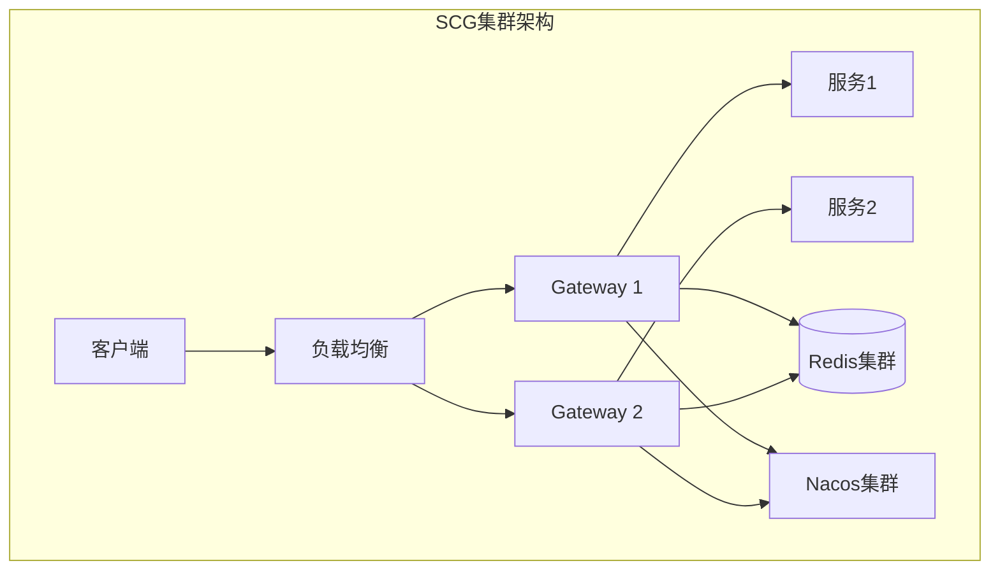

# Spring Cloud Gateway 深入（WebFlux 模型 / 过滤器链 / 动态路由 / 限流实现 / 生产实践）

> Spring Cloud Gateway（SCG）是 **Spring 生态的 API 网关**（Spring WebFlux 响应式编程），Java 微服务事实标准网关。本篇深入拆解：WebFlux 响应式模型、过滤器链执行机制、动态路由实现、限流与熔断、生产实践。

---

## 一、要解决的问题

| 痛点 | 说明 |
|------|------|
| Java 微服务网关 | Spring Cloud 体系需要统一入口（路由/过滤） |
| 配置灵活 | 路由配置支持代码/配置中心动态更新 |
| 响应式性能 | 网关要处理海量请求，需非阻塞 IO |
| 微服务治理 | 与注册中心（Nacos/Eureka）联动自动发现 |
| 熔断限流 | 网关层保护后端（Sentinel/Resilience4j 集成） |

> 核心认知：**SCG = 「基于 WebFlux（Netty 非阻塞）的响应式网关」**——请求走「路由匹配 → 全局过滤器链 → 路由过滤器」流水线，线程不阻塞，IO 复用，性能远优于 Zuul 1.x。

---

## 二、WebFlux 响应式模型（核心基础）

### 2.1 阻塞 vs 非阻塞

```
传统 Spring MVC（阻塞）：
  每个请求一个线程 → 线程池耗尽 = 请求排队/超时
  高并发下：线程切换开销 + 内存占用

WebFlux（非阻塞）：
  Netty EventLoop 线程处理大量请求
  请求处理中不阻塞线程（异步回调/响应式流）
  → 少量线程支撑高并发

响应式流（Reactive Streams）：
  Publisher（发布者）→ Subscriber（订阅者）
  背压（Backpressure）：消费者控制流速
```

### 2.2 SCG 内部模型

```
请求进入 → Netty HttpServer（EventLoop）
  → ServerWebExchange（请求/响应上下文）
  → 路由匹配（RouteLocator）
  → 过滤器链执行（GlobalFilter + GatewayFilter）
  → 转发到后端（HttpClient 非阻塞调用）
  → 响应返回（异步）

关键对象：
  ServerWebExchange：请求/响应/属性（贯穿过滤器链）
  Mono/Flux：响应式类型（异步处理）
```

---

## 三、路由配置（深入）

### 3.1 YAML 配置

```yaml
spring:
  cloud:
    gateway:
      routes:
        - id: order-service
          uri: lb://order-service        # 负载均衡（注册中心）
          predicates:
            - Path=/api/orders/**
            - Method=GET,POST
            - Header=X-Tenant, \d+
            - Query=version, v[12]        # 参数匹配
            - Cookie=session, ok
            - Host=api.example.com
            - Weight=group1, 90           # 权重路由（灰度）
          filters:
            - StripPrefix=2               # 去掉前两段路径
            - AddRequestHeader=X-From, gateway
            - RewritePath=/api/orders/(?<id>.*), /orders/$1
```

### 3.2 Predicate（路由谓词）

| Predicate | 作用 | 示例 |
|-----------|------|------|
| Path | 路径匹配 | `/api/**` |
| Method | 方法匹配 | GET,POST |
| Header | Header 匹配 | `X-Id, \d+` |
| Query | 参数匹配 | `debug, true` |
| Cookie | Cookie 匹配 | `session, ok` |
| Host | 域名匹配 | `**.example.com` |
| RemoteAddr | IP 匹配 | `10.0.0.0/16` |
| Weight | 权重分流 | `group1, 90` |
| Before/After/Between | 时间匹配 | 灰度窗口 |
| 自定义 | 实现 PredicateFactory | 业务条件 |

### 3.3 代码配置（灵活路由）

```java
@Bean
public RouteLocator customRoutes(RouteLocatorBuilder builder) {
    return builder.routes()
        .route("order-route", r -> r
            .path("/api/orders/**")
            .and().header("X-Tenant", "\\d+")
            .filters(f -> f
                .stripPrefix(2)
                .addRequestHeader("X-Gateway", "scg"))
            .uri("lb://order-service"))
        .build();
}
```

---

## 四、过滤器链执行机制（深入）

### 4.1 过滤器类型

```
GlobalFilter（全局，对所有路由生效）：
  NettyRoutingFilter（转发）
  LoadBalancerClientFilter（负载均衡）
  WebClientHttpRoutingFilter（WebClient 转发）
  GatewayMetricsFilter（指标）

GatewayFilter（路由级，配置绑定）：
  AddRequestHeader / StripPrefix / RewritePath
  RequestRateLimiter（限流）
  CircuitBreaker（熔断）
  Retry（重试）
  ......

执行顺序：
  1. GlobalFilter 按 order 排序
  2. 与 GatewayFilter 合并排序（同优先级）
  3. 链式执行：pre 处理 → 转发 → post 处理
```

### 4.2 过滤器链执行流程

```
请求 → filters 链（按 order 从小到大）：
  [0] Pre 逻辑（改写/校验）→ chain.filter(exchange)
       → 调用下一个过滤器（或转发后端）
  [1] Pre → chain...
      ...
  [N] 转发（NettyRoutingFilter）→ 后端响应
  响应 → 反向执行 Post 逻辑（响应处理/记录）

Spring Cloud Gateway 默认过滤器（内建顺序）：
  GatewayMetricsFilter (-1)
  转发类过滤器（高优先级执行转发）
  GatewayFilter（路由级）

自定义全局过滤器：
  @Component implements GlobalFilter, Ordered
  实现 filter() 方法（pre/post 逻辑）
```

### 4.3 自定义过滤器示例

```java
@Component
public class TraceIdFilter implements GlobalFilter, Ordered {

    @Override
    public Mono<Void> filter(ServerWebExchange exchange, GatewayFilterChain chain) {
        String traceId = UUID.randomUUID().toString().replace("-", "");
        // 生成/透传 traceId（pre）
        ServerWebExchange mutated = exchange.mutate()
            .request(r -> r.headers(h -> h.set("X-Trace-Id", traceId)))
            .build();
        return chain.filter(mutated)
            // 响应后记录（post）
            .then(Mono.fromRunnable(() ->
                log.info("traceId={}, status={}", traceId,
                    mutated.getResponse().getStatusCode())));
    }

    @Override
    public int getOrder() {
        return -100;  // 优先执行
    }
}
```

---

## 五、限流实现（深入）

### 5.1 内置限流：RequestRateLimiter

```yaml
spring:
  cloud:
    gateway:
      routes:
        - id: order-service
          uri: lb://order-service
          predicates: [Path=/api/orders/**]
          filters:
            - name: RequestRateLimiter
              args:
                redis-rate-limiter.replenishRate: 100   # 每秒补充令牌
                redis-rate-limiter.burstCapacity: 200   # 桶容量
                redis-rate-limiter.requestedTokens: 1   # 每请求消耗
                key-resolver: "#{@userKeyResolver}"     # 限流键解析
```

```java
@Bean
public KeyResolver userKeyResolver() {
    return exchange -> {
        String userId = exchange.getRequest().getHeaders()
            .getFirst("X-User-Id");
        return Mono.just(userId != null ? userId : "anonymous");
    };
}
```

### 5.2 限流原理（令牌桶 + Redis）

```
实现：Redis RateLimiter（Lua 脚本原子操作）
  令牌桶：每 replenishRate 秒补充令牌
  请求消耗 requestedTokens 个令牌
  桶满 burstCapacity（突发容忍）
  令牌不足 → 429 Too Many Requests

限流维度：
  按用户（KeyResolver 返回 user id）
  按 IP / 按接口 / 按租户
  按业务自定义

注意：
  Redis 是限流依赖（Redis 故障 → 限流失效/拒流）
  限流键基数（用户量大 → Redis 内存）
```

### 5.3 熔断与重试

```yaml
filters:
  - name: CircuitBreaker
    args:
      name: orderCB
      fallbackUri: forward:/fallback/order   # 降级路径
      statusCodes: [500, 503]
      # 底层用 Resilience4j 配置：失败率阈值/半开状态等
  - name: Retry
    args:
      retries: 2
      statuses: [SERVICE_UNAVAILABLE]
      methods: [GET]
```

```
熔断状态机（Resilience4j）：
  关闭（正常）→ 失败率超阈值（如 50%）→ 打开（拒绝）
  → 等待窗口（如 10s）→ 半开（放少量流量试探）
  → 成功 → 关闭 / 失败 → 打开

降级路径：fallbackUri 转发到本地处理（友好提示）
```

---

## 六、动态路由（配置中心热更新）

### 6.1 Nacos 动态路由

```yaml
spring:
  cloud:
    nacos:
      config:
        server-addr: nacos:8848
        data-id: gateway-routes.yaml
        group: DEFAULT_GROUP
        file-extension: yaml
```

```
原理：
  路由配置存配置中心（Nacos/Consul/本地）
  配置变更 → 监听器（RefreshScope）→ RouteLocator 刷新
  → 新路由立即生效（无需重启）

自定义动态路由（DB/接口存储）：
  实现 RouteDefinitionRepository（增删改查路由定义）
  修改后 publishEvent（RefreshRoutesEvent）→ 生效
```

---

## 七、SCG vs Zuul 2.x vs 自研网关

| 维度 | SCG（WebFlux） | Zuul 2.x | 自研（Netty） |
|------|----------------|----------|---------------|
| 模型 | 响应式（非阻塞） | 响应式（Netty） | 响应式 |
| Spring 集成 | 原生 | 原生 | 需自己集成 |
| 注册中心联动 | 原生（lb://） | 原生 | 需开发 |
| 限流 | Redis 令牌桶 | 依赖 Sentinel | 需开发 |
| 熔断 | Resilience4j | Sentinel/Hystrix | 需开发 |
| 学习成本 | 中 | 中 | 高 |
| 适用 | Spring 生态标准 | Spring 生态 | 特殊需求 |

**选型关注点**：
- Spring 微服务 → **SCG**（生态最好）；
- 非 Spring 体系 → **Kong/APISIX**（见「[Kong 与 APISIX 网关](./Kong与APISIX网关.md)」）；
- 需要跨语言网关 → APISIX/Kong；
- 特殊性能/定制 → 自研（成本高）。

---

## 八、生产实践

### 8.1 最佳实践

| 实践 | 说明 |
|------|------|
| 统一鉴权 | 全局过滤器做 JWT 校验 + 白名单放行 |
| 统一限流 | Redis 令牌桶按用户/接口 |
| 统一熔断 | CircuitBreaker + fallbackUri |
| 全链路 traceId | 全局过滤器生成/透传（与 OTel 结合） |
| 日志脱敏 | 网关层统一脱敏（手机号/Token） |
| 性能 | 避免过滤器里做阻塞 IO（DB 查询） |
| 监控 | 网关指标（QPS/延迟/错误）+ 告警 |

### 8.2 常见坑

| 坑 | 说明 | 对策 |
|----|------|------|
| 阻塞 IO | 过滤器里查 DB → 线程阻塞 | 响应式/异步化 |
| 大文件上传 | 默认限制 | 调整请求大小限制 |
| 超时未配 | 默认无超时 → 请求挂死 | 配置全局超时 |
| Redis 依赖 | 限流依赖 Redis 单点 | Redis 高可用 |
| 路由误配 | Predicate 冲突 | 测试 + 优先级 |
| 响应式调试难 | 堆栈不直观 | 日志/链路追踪 |
| 内存溢出 | 大响应体缓冲 | 限制响应大小 |

### 8.3 监控指标

```
网关指标（Micrometer/Prometheus）：
  请求 QPS / 延迟 P50/P99
  各路由错误率
  限流拒绝数（429）
  熔断状态（打开数）
  连接池状态
```

---

## 九、选型速查

| 需求 | 首选 | 备选 |
|------|------|------|
| Spring 微服务标准网关 | Spring Cloud Gateway | Zuul 2.x |
| 跨语言/云原生网关 | APISIX | Kong |
| 服务网格 | Istio | — |
| 阿里生态 | Sentinel + SCG | — |
| 高吞吐定制 | 自研 Netty | SCG |

---

## SCG Predicate Factories Deep

### Predicate 工厂详解

```yaml
# 路径匹配
predicates:
  - Path=/api/orders/**
  - Path=/api/users/{id}

# Header 匹配
predicates:
  - Header=X-Tenant, \d+
  - Header=X-Request-Id, .+

# Cookie 匹配
predicates:
  - Cookie=session, .+

# 方法匹配
predicates:
  - Method=GET,POST

# 参数匹配
predicates:
  - Query=version, v[12]
  - Query=debug

# 主机匹配
predicates:
  - Host=api.example.com
  - Host=**.example.com

# 权重匹配（灰度）
predicates:
  - Weight=group1, 90  # 90% 流量到 group1

# 时间匹配
predicates:
  - After=2024-01-01T00:00:00+08:00
  - Before=2024-12-31T23:59:59+08:00
  - Between=2024-01-01T00:00:00+08:00, 2024-12-31T23:59:59+08:00

# RemoteAddr 匹配
predicates:
  - RemoteAddr=10.0.0.0/16
```

### 自定义 Predicate

```java
@Component
public class MyPredicateFactory implements PredicateFactory {
    
    @Override
    public Config getConfig() {
        return new Config();
    }
    
    @Override
    public Predicate apply(Config config) {
        return exchange -> {
            String header = exchange.getRequest().getHeaders()
                .getFirst(config.getHeaderName());
            return header != null && header.equals(config.getExpectedValue());
        };
    }
    
    @Data
    public static class Config {
        private String headerName;
        private String expectedValue;
    }
}
```

## SCG Filter Factories Deep

### 过滤器工厂详解

```yaml
filters:
  # 添加请求头
  - AddRequestHeader=X-From, gateway
  - AddRequestHeader=X-Trace-Id, #{T(java.util.UUID).randomUUID().toString()}

  # 添加请求参数
  - AddRequestParameter=version, v1

  # 添加响应头
  - AddResponseHeader=X-Response-Time, #{T(System.currentTimeMillis())}

  # 重写路径
  - RewritePath=/api/orders/(?<id>.*), /orders/$1

  # 去掉路径前缀
  - StripPrefix=2

  # 设置路径
  - SetPath=/new-path

  # 重试
  - Retry:
      retries: 3
      statuses: BAD_GATEWAY, SERVICE_UNAVAILABLE
      methods: GET
      backoff:
        firstBackoff: 100ms
        maxBackoff: 5000ms
        factor: 2

  # 熔断
  - CircuitBreaker:
      name: orderCB
      fallbackUri: forward:/fallback
      statusCodes: 500, 503
      fallbackHeaders:
        - name: X-Fallback-Reason
          value: Circuit breaker triggered
```

## SCG Global Filters

```java
// 全局过滤器 = 对所有路由生效
@Component
public class GlobalAuthFilter implements GlobalFilter, Ordered {
    
    @Override
    public Mono<Void> filter(ServerWebExchange exchange, GatewayFilterChain chain) {
        // 获取 Token
        String token = exchange.getRequest().getHeaders()
            .getFirst("Authorization");
        
        if (token == null || !isValid(token)) {
            exchange.getResponse().setStatusCode(HttpStatus.UNAUTHORIZED);
            return exchange.getResponse().setComplete();
        }
        
        // 传递用户信息到下游
        ServerWebExchange mutated = exchange.mutate()
            .request(r -> r.headers(h -> 
                h.set("X-User-Id", extractUserId(token))))
            .build();
        
        return chain.filter(mutated);
    }
    
    @Override
    public int getOrder() {
        return -100;  // 优先执行
    }
}

// 指标过滤器
@Component
public class MetricsFilter implements GlobalFilter, Ordered {
    
    @Override
    public Mono<Void> filter(ServerWebExchange exchange, GatewayFilterChain chain) {
        long start = System.currentTimeMillis();
        
        return chain.filter(exchange)
            .then(Mono.fromRunnable(() -> {
                long duration = System.currentTimeMillis() - start;
                meterRegistry.timer("gateway.request.duration")
                    .tag("path", exchange.getRequest().getPath().value())
                    .tag("status", exchange.getResponse().getStatusCode().name())
                    .record(duration, TimeUnit.MILLISECONDS);
            }));
    }
    
    @Override
    public int getOrder() {
        return -200;  // 最先执行（计时）
    }
}
```

## SCG Custom Filter Development

```java
// 自定义 GatewayFilter（路由级）
@Component
public class MyGatewayFilterFactory 
        extends AbstractGatewayFilterFactory<MyGatewayFilterFactory.Config> {
    
    @Override
    public GatewayFilter apply(Config config) {
        return (exchange, chain) -> {
            // 前置处理
            log.info("Request: {}", exchange.getRequest().getPath());
            
            return chain.filter(exchange)
                .then(Mono.fromRunnable(() -> {
                    // 后置处理
                    log.info("Response: {}", exchange.getResponse().getStatusCode());
                }));
        };
    }
    
    @Data
    public static class Config {
        private boolean enabled = true;
    }
}

// 使用：
// filters:
//   - MyGateway=true
```

## SCG Rate Limiting Deep

### Redis + TokenBucket

```yaml
# 限流配置
spring:
  cloud:
    gateway:
      routes:
        - id: order-service
          filters:
            - name: RequestRateLimiter
              args:
                redis-rate-limiter.replenishRate: 100
                redis-rate-limiter.burstCapacity: 200
                redis-rate-limiter.requestedTokens: 1
                key-resolver: "#{@ipKeyResolver}"
```

```java
// 限流键解析器
@Bean
public KeyResolver ipKeyResolver() {
    return exchange -> Mono.just(
        exchange.getRequest().getRemoteAddress().getAddress().getHostAddress()
    );
}

// Lua 脚本原理：
// 令牌桶算法：
//   1. 计算时间差 → 应补充的令牌数
//   2. 当前令牌数 + 补充令牌 → 不超过桶容量
//   3. 请求消耗一个令牌
//   4. 令牌不足 → 返回 429

// Redis Lua 脚本（原子操作）：
// local tokens = redis.call('get', KEYS[1]) or capacity
// local last_time = redis.call('get', KEYS[2]) or now
// local elapsed = now - last_time
// local new_tokens = math.min(capacity, tokens + elapsed * rate)
// if new_tokens >= requested then
//   redis.call('set', KEYS[1], new_tokens - requested)
//   redis.call('set', KEYS[2], now)
//   return 1
// else
//   return 0
// end
```

## SCG Retry

```yaml
# 重试配置
filters:
  - name: Retry
    args:
      retries: 3
      statuses: BAD_GATEWAY, SERVICE_UNAVAILABLE, GATEWAY_TIMEOUT
      methods: GET, HEAD
      backoff:
        firstBackoff: 100ms
        maxBackoff: 5000ms
        factor: 2
        basedOnPreviousValue: false

# 重试策略：
#   1. 首次失败 → 100ms 后重试
#   2. 第二次失败 → 200ms 后重试
#   3. 第三次失败 → 400ms 后重试
#   4. 最大重试 3 次

# 注意：
#   只重试幂等操作（GET/HEAD）
#   写操作需业务保证幂等
#   重试次数不宜过多（防雪崩）
```

## SCG WebSocket Support

```yaml
# WebSocket 路由
spring:
  cloud:
    gateway:
      routes:
        - id: websocket-route
          uri: ws://websocket-server:8080
          predicates:
            - Path=/ws/**
          filters:
            - StripPrefix=1

# 或使用 lb:// 负载均衡
        - id: websocket-lb
          uri: lb:ws://websocket-service
          predicates:
            - Path=/ws/**
```

```java
// WebSocket 处理
@Component
public class WebSocketHandler implements WebSocketHandler {
    
    @Override
    public Mono<Void> handle(WebSocketSession session) {
        return session.receive()
            .map(msg -> {
                String payload = msg.getPayloadAsText();
                // 处理消息
                return session.textMessage("Echo: " + payload);
            })
            .flatMap(session::send);
    }
}

// 路由配置
@Bean
public RouterFunction<ServerResponse> websocketRoute() {
    return RouterFunctions.route()
        .path("/ws", builder -> builder
            .GET("", websocketHandler()))
        .build();
}
```

## SCG Integration with Consul/Nacos

```yaml
# Consul 动态路由
spring:
  cloud:
    consul:
      host: consul
      port: 8500
      discovery:
        enabled: true
        service-name: ${spring.application.name}
      config:
        enabled: true
        prefix: config
        default-context: application
        data-key: gateway-routes.yaml

# Nacos 动态路由
spring:
  cloud:
    nacos:
      config:
        server-addr: nacos:8848
        data-id: gateway-routes.yaml
        group: DEFAULT_GROUP
        file-extension: yaml
        refresh-enabled: true
```

```java
// 动态路由刷新
@Component
public class DynamicRouteRefresh implements ApplicationEventPublisherAware {
    
    @Autowired
    private RouteDefinitionWriter routeDefinitionWriter;
    
    @Autowired
    private ApplicationEventPublisher publisher;
    
    public void refreshRoutes(List<RouteDefinition> routes) {
        routes.forEach(route -> {
            routeDefinitionWriter.delete(Mono.just(route.getId()));
            routeDefinitionWriter.save(Mono.just(route)).subscribe();
        });
        publisher.publishEvent(new RefreshRoutesEvent(this));
    }
}
```

## SCG vs Zuul vs Kong Performance

| 维度 | SCG | Zuul 2.x | Kong |
|------|-----|----------|------|
| 模型 | WebFlux（非阻塞） | Netty（非阻塞） | OpenResty（非阻塞） |
| 吞吐 | 高（万级 QPS） | 高 | 最高（十万级 QPS） |
| 延迟 | 中 | 中 | 低 |
| 内存 | 中（JVM） | 中（JVM） | 低（C） |
| 扩展 | Java 生态 | Java 生态 | Lua/Go 插件 |
| 适用 | Spring 微服务 | Spring 生态 | 跨语言/高性能 |

## 十、Spring Cloud Gateway 生产运维

### Metrics 监控指标

| 指标名称 | 类型 | 说明 |
|----------|------|------|
| spring.cloud.gateway.requests | Timer | 请求延迟分布 |
| spring.cloud.gateway.request.count | Counter | 请求总数 |
| jvm.memory.used | Gauge | JVM 内存使用 |
| netty.pooled.allocated.num | Gauge | Netty 连接池分配 |
| hikaricp.connections.active | Gauge | 数据库连接池 |

### 会话共享与粘滞路由

```
Spring Cloud Gateway 会话共享方案：

  1. Redis 会话（Spring Session）
    - Session 存储到 Redis
    - 所有实例共享会话
    - 无状态网关，支持水平扩展

  2. JWT Token（推荐）
    - 用户信息存储在 JWT Token 中
    - 网关无状态，无需会话共享
    - 支持多终端登录

  3. 粘滞路由（Sticky Session）
    - 基于用户 ID Hash 路由到固定实例
    - 不推荐（不支持水平扩展）
```

### 服务网格集成

```yaml
# Spring Cloud Gateway + Istio 集成
apiVersion: networking.istio.io/v1beta1
kind: VirtualService
metadata:
  name: gateway-service
spec:
  hosts:
    - gateway.example.com
  gateways:
    - istio-system/ingressgateway
  http:
    - match:
        - uri:
            prefix: /api
      route:
        - destination:
            host: spring-cloud-gateway
            port:
              number: 8080
```

### 限流降级配置

```yaml
# Gateway 限流 + 熔断配置
spring:
  cloud:
    gateway:
      routes:
        - id: order-service
          uri: lb://order-service
          predicates:
            - Path=/api/orders/**
          filters:
            - name: RequestRateLimiter
              args:
                redis-rate-limiter.replenishRate: 100
                redis-rate-limiter.burstCapacity: 200
                key-resolver: "#{@userKeyResolver}"
            - name: CircuitBreaker
              args:
                name: orderCB
                fallbackUri: forward:/fallback
                statusCodes:
                  - 500
                  - 503
```

### 生产问题排查清单

| 问题现象 | 排查方向 | 排查工具 |
|----------|----------|----------|
| 502 Bad Gateway | 后端服务不可用 | 日志 + curl 测试 |
| 504 Gateway Timeout | 后端响应超时 | 超时配置 + 线程池 |
| 连接池耗尽 | 并发过高 | Netty 连接池监控 |
| 内存溢出 | 大对象/连接泄漏 | JVM 堆分析 |
| 路由不生效 | 路由配置错误 | 路由日志 + Actuator |

## 十一、与其他板块的关系

- 网关选型整体见「[API 网关](./API网关.md)」；
- 非 Java 网关见「[Kong 与 APISIX 网关](./Kong与APISIX网关.md)」「[OpenResty](./OpenResty.md)」；
- 微服务注册发现（lb:// 路由）见「[注册中心与配置中心](./注册中心与配置中心.md)」；
- 熔断限流组件见「[Sentinel 限流熔断](./Sentinel限流熔断.md)」；
- 全链路可观测见「[OpenTelemetry](./OpenTelemetry.md)」。

> 一句话：**SCG = WebFlux 响应式（Netty 非阻塞）+ Route/Predicate/Filter 三层模型 + GlobalFilter 链（鉴权/限流/熔断/追踪）+ Redis 令牌桶限流 + 配置中心热更新——生产守则：无阻塞 IO、限流熔断全配、traceId 透传、监控告警齐全**。

## 十一、自定义谓词工厂（Custom Predicate Factory）

```java
// 自定义谓词工厂：按用户 ID 范围路由
@Component
public class UserIdRangePredicateFactory extends AbstractRoutePredicateFactory {

    public UserIdRangePredicateFactory() {
        super(UserIdRangePredicateFactory.class);
    }

    @Override
    public ShortcutMetadata shortcutMetadata() {
        return ShortcutConfiguration.builder()
            .field("from")
            .field("to")
            .build();
    }

    @Override
    public Predicate<ServerWebExchange> apply(Config config) {
        return exchange -> {
            String userId = exchange.getRequest().getHeaders().getFirst("X-User-Id");
            if (userId == null) return false;
            long id = Long.parseLong(userId);
            return id >= config.getFrom() && id <= config.getTo();
        };
    }

    @Data
    public static class Config {
        private long from;
        private long to;
    }
}
```

```yaml
# 使用自定义谓词
spring:
  cloud:
    gateway:
      routes:
        - id: vip-route
          uri: lb://vip-service
          predicates:
            - UserIdRange=1000,9999  # 用户 ID 1000-9999
```

## 十二、自定义过滤器工厂（Custom Filter Factory）

```java
// 自定义过滤器工厂：请求签名验证
@Component
public class SignatureFilterFactory extends AbstractGatewayFilterFactory<Config> {

    @Override
    public GatewayFilter apply(Config config) {
        return (exchange, chain) -> {
            ServerHttpRequest request = exchange.getRequest();

            // 1. 获取签名参数
            String signature = request.getHeaders().getFirst("X-Signature");
            String timestamp = request.getHeaders().getFirst("X-Timestamp");
            String nonce = request.getHeaders().getFirst("X-Nonce");

            // 2. 验证签名
            String signStr = request.getMethod() + "\n"
                + request.getURI().getPath() + "\n"
                + timestamp + "\n"
                + nonce;
            String expectedSign = HmacUtils.hmacSha256Hex(config.getSecret(), signStr);

            if (!expectedSign.equals(signature)) {
                exchange.getResponse().setStatusCode(HttpStatus.UNAUTHORIZED);
                return exchange.getResponse().setComplete();
            }

            // 3. 验证时间戳（防止重放攻击）
            long ts = Long.parseLong(timestamp);
            if (System.currentTimeMillis() - ts > 300000) { // 5 分钟
                exchange.getResponse().setStatusCode(HttpStatus.UNAUTHORIZED);
                return exchange.getResponse().setComplete();
            }

            return chain.filter(exchange);
        };
    }
}
```

```yaml
# 使用自定义过滤器
spring:
  cloud:
    gateway:
      routes:
        - id: secure-route
          uri: lb://my-service
          filters:
            - name: Signature
              args:
                secret: ${SIGNATURE_SECRET}
```

## 十三、Resilience4j 熔断集成

```yaml
# 熔断配置
resilience4j:
  circuitbreaker:
    instances:
      myService:
        slidingWindowSize: 100          # 滑动窗口大小
        minimumNumberOfCalls: 10        # 最小调用次数
        failureRateThreshold: 50        # 失败率阈值（%）
        waitDurationInOpenState: 30s    # 熔断器打开持续时间
        permittedNumberOfCallsInHalfOpenState: 10  # 半开状态允许调用数
        registerHealthIndicator: true

  timelimiter:
    instances:
      myService:
        timeoutDuration: 3s             # 超时时间

# Gateway 配置
spring:
  cloud:
    gateway:
      routes:
        - id: resilient-route
          uri: lb://my-service
          filters:
            - name: CircuitBreaker
              args:
                name: myService
                fallbackUri: forward:/fallback
            - name: Retry
              args:
                retries: 3
                backoff:
                  firstBackoff: 100ms
                  maxBackoff: 5s
```

```java
// 熔断降级
@RestController
public class FallbackController {
    @RequestMapping("/fallback")
    public Mono<String> fallback() {
        return Mono.just("服务暂时不可用，请稍后重试");
    }
}
```

## 十四、请求重写（Request Rewrite）

```yaml
# 请求重写配置
spring:
  cloud:
    gateway:
      routes:
        - id: rewrite-route
          uri: lb://my-service
          predicates:
            - Path=/api/v1/**
          filters:
            # 路径重写：/api/v1/users → /users
            - RewritePath=/api/v1/(?<segment>.*), /$\{segment}

            # 请求头添加
            - AddRequestHeader=X-Request-Source, gateway

            # 请求参数添加
            - AddRequestParameter=source, gateway

            # 请求体修改（自定义过滤器）
            - name: RequestBodyRewrite
              args:
                pattern: "${old}"
                replacement: "${new}"
```

```java
// 请求体重写过滤器
@Component
public class RequestBodyRewriteFilter implements GatewayFilterFactory<Config> {
    @Override
    public GatewayFilter apply(Config config) {
        return (exchange, chain) -> {
            ServerHttpRequest request = exchange.getRequest();

            // 修改请求体
            ServerHttpRequest modifiedRequest = request.mutate()
                .header("X-Rewritten", "true")
                .path(request.getPath().value().replace("/old", "/new"))
                .build();

            return chain.filter(exchange.mutate().request(modifiedRequest).build());
        };
    }
}
```

## 十五、响应重写（Response Rewrite）

```java
// 响应重写过滤器
@Component
public class ResponseRewriteFilter implements GlobalFilter, Ordered {

    @Override
    public Mono<Void> filter(ServerWebExchange exchange, GatewayFilterChain chain) {
        ServerHttpResponse response = exchange.getResponse();

        // 包装响应（添加响应头）
        ServerHttpResponse wrappedResponse = new ServerHttpResponseDecorator(response) {
            @Override
            public Mono<Void> writeWith(Publisher<? extends DataBuffer> body) {
                // 添加响应头
                getHeaders().add("X-Response-Time", Instant.now().toString());
                getHeaders().add("X-Gateway-Version", "1.0");
                return super.writeWith(body);
            }
        };

        return chain.filter(exchange.mutate().response(wrappedResponse).build());
    }

    @Override
    public int getOrder() {
        return -1; // 高优先级
    }
}
```

## 十六、生产监控指标

```yaml
# Prometheus 监控配置
management:
  endpoints:
    web:
      exposure:
        include: health,info,prometheus
  metrics:
    export:
      prometheus:
        enabled: true
    tags:
      application: ${spring.application.name}
```

```yaml
# 关键监控指标
- http_server_requests_seconds_count        # 请求总数
- http_server_requests_seconds_sum          # 请求总耗时
- http_server_requests_seconds_bucket       # 请求耗时分布
- gateway_requests_seconds_count            # 网关请求总数
- gateway_requests_seconds_sum              # 网关请求总耗时
- circuitbreaker_state                      # 熔断器状态
- circuitbreaker_calls_seconds_count        # 熔断器调用次数
- resilience4j_timelimiter_timeout_seconds  # 超时次数
```

```yaml
# 告警规则
groups:
- name: scg_alerts
  rules:
  - alert: SCGHighLatency
    expr: histogram_quantile(0.99, rate(gateway_requests_seconds_bucket[5m])) > 1
    for: 5m
    labels:
      severity: warning
    annotations:
      summary: "SCG P99 延迟 > 1 秒"

  - alert: SCGHighErrorRate
    expr: rate(gateway_requests_seconds_count{status=~"5.."}[5m]) / rate(gateway_requests_seconds_count[5m]) > 0.05
    for: 5m
    labels:
      severity: critical
    annotations:
      summary: "SCG 错误率 > 5%"

  - alert: CircuitBreakerOpen
    expr: circuitbreaker_state == 1
    for: 1m
    labels:
      severity: critical
    annotations:
      summary: "熔断器已打开"
```

## 十七、Gateway Metrics监控深度配置

### 17.1 Micrometer集成配置

```yaml
# Micrometer配置
management:
  endpoints:
    web:
      exposure:
        include: health,info,prometheus,metrics
  metrics:
    tags:
      application: ${spring.application.name}
    distribution:
      percentiles-histogram:
        http.server.requests: true
      percentiles:
        http.server.requests: 0.5,0.75,0.95,0.99
      slo:
        http.server.requests: 100ms,500ms

# 自定义指标
@Component
public class GatewayMetrics implements MeterBinder {
    @Override
    public void bindTo(MeterRegistry registry) {
        // 请求计数
        Counter.builder("gateway.requests")
            .description("Gateway请求总数")
            .tag("type", "http")
            .register(registry);
        
        // 请求延迟
        Timer.builder("gateway.request.duration")
            .description("Gateway请求延迟")
            .publishPercentiles(0.5, 0.75, 0.95, 0.99)
            .register(registry);
        
        // 错误率
        Counter.builder("gateway.errors")
            .description("Gateway错误总数")
            .tag("type", "http")
            .register(registry);
    }
}
```

### 17.2 请求延迟分布监控

```text
请求延迟分布监控：

  监控指标：
    http_server_requests_seconds：请求延迟分布
    http_server_requests_seconds_bucket：延迟桶
    http_server_requests_seconds_count：请求总数
    http_server_requests_seconds_sum：延迟总和

  关键分位数：
    P50：中位数延迟（< 100ms为佳）
    P75：75分位数延迟（< 200ms为佳）
    P95：95分位数延迟（< 500ms为佳）
    P99：99分位数延迟（< 1000ms为佳）

  告警规则：
    P99 > 1秒：性能下降告警
    P99 > 5秒：严重性能问题
    错误率 > 5%：服务异常告警

  Grafana面板：
    请求速率：requests/second
    延迟分布：延迟分位数趋势
    错误率：错误请求占比
    路由延迟：各路由延迟对比
```

### 17.3 错误率监控

```yaml
# 错误率监控配置
management:
  metrics:
    enable:
      all: true
    distribution:
      percentiles-histogram:
        http.server.requests: true
      percentiles:
        http.server.requests: 0.5,0.75,0.95,0.99
      sla:
        http.server.requests: 100ms,200ms,500ms

# 自定义错误率指标
@Component
public class ErrorRateMonitor {
    private final Counter errorCounter;
    private final Timer errorTimer;
    
    public ErrorRateMonitor(MeterRegistry registry) {
        this.errorCounter = Counter.builder("gateway.errors.total")
            .description("Gateway错误总数")
            .register(registry);
        
        this.errorTimer = Timer.builder("gateway.errors.duration")
            .description("Gateway错误延迟")
            .register(registry);
    }
    
    public void recordError(String route, int statusCode) {
        errorCounter.increment();
        errorTimer.record(Duration.ofMillis(0));
    }
}

# Prometheus查询规则
# 错误率计算
rate(gateway_requests_seconds_count{status=~"5.."}[5m]) / rate(gateway_requests_seconds_count[5m])

# P99延迟
histogram_quantile(0.99, rate(gateway_requests_seconds_bucket[5m]))
```

## 十八、Gateway多实例会话共享

### 18.1 Redis会话共享

```yaml
# Redis会话共享配置
spring:
  session:
    store-type: redis
    timeout: 1800
    redis:
      namespace: spring:session
  redis:
    host: localhost
    port: 6379
    password: 
    database: 0
    lettuce:
      pool:
        max-active: 8
        max-idle: 8
        min-idle: 0
        max-wait: -1ms

# 会话配置
spring.session.redis.flush-mode: on_save
spring.session.redis.spring-session-serializer: java

# 自定义Session序列化
@Configuration
@EnableRedisHttpSession(maxInactiveIntervalInSeconds = 1800)
public class RedisSessionConfig {
    @Bean
    public RedisSerializer<Object> springSessionRedisSerializer() {
        return new GenericJackson2JsonRedisSerializer();
    }
}
```

### 18.2 数据库会话共享

```yaml
# 数据库会话共享配置
spring:
  session:
    store-type: jdbc
    jdbc:
      initialize-schema: always
      table-name: SPRING_SESSION
      schema: classpath:org/springframework/session/jdbc/schema-@@platform@@.sql
      platform: postgresql

# 数据库连接配置
spring:
  datasource:
    url: jdbc:postgresql://localhost:5432/session_db
    username: session_user
    password: session_password
    driver-class-name: org.postgresql.Driver

# 会话表结构
CREATE TABLE SPRING_SESSION (
    SESSION_ID CHAR(36),
    CREATION_TIME BIGINT,
    LAST_ACCESS_TIME BIGINT,
    MAX_INACTIVE_INTERVAL INT,
    PRINCIPAL_NAME VARCHAR(100),
    PRIMARY KEY (SESSION_ID)
);

CREATE TABLE SPRING_SESSION_ATTRIBUTES (
    SESSION_ID CHAR(36),
    ATTRIBUTE_NAME VARCHAR(200),
    ATTRIBUTE_BYTES BYTEA,
    PRIMARY KEY (SESSION_ID, ATTRIBUTE_NAME)
);
```

### 18.3 JWT无状态方案

```java
// JWT无状态方案
@Component
public class JwtSessionManager {
    private final String jwtSecret = "your-secret-key";
    private final long jwtExpiration = 1800000; // 30分钟
    
    public String createToken(UserDetails userDetails) {
        Map<String, Object> claims = new HashMap<>();
        claims.put("sub", userDetails.getUsername());
        claims.put("roles", userDetails.getAuthorities());
        claims.put("iat", System.currentTimeMillis());
        claims.put("exp", System.currentTimeMillis() + jwtExpiration);
        
        return Jwts.builder()
            .setClaims(claims)
            .signWith(SignatureAlgorithm.HS256, jwtSecret)
            .compact();
    }
    
    public UserDetails validateToken(String token) {
        Claims claims = Jwts.parser()
            .setSigningKey(jwtSecret)
            .parseClaimsJws(token)
            .getBody();
        
        String username = claims.getSubject();
        List<SimpleGrantedAuthority> authorities = claims.get("roles", List.class)
            .stream()
            .map(role -> new SimpleGrantedAuthority("ROLE_" + role))
            .collect(Collectors.toList());
        
        return new User(username, "", authorities);
    }
}

// Gateway过滤器
@Component
public class JwtAuthenticationFilter implements GlobalFilter, Ordered {
    @Override
    public Mono<Void> filter(ServerWebExchange exchange, GatewayFilterChain chain) {
        String token = extractToken(exchange);
        if (token != null && validateToken(token)) {
            // 设置用户信息到请求头
            exchange.getRequest().mutate()
                .header("X-User-Name", getUsernameFromToken(token))
                .header("X-User-Roles", getRolesFromToken(token));
            return chain.filter(exchange);
        }
        
        exchange.getResponse().setStatusCode(HttpStatus.UNAUTHORIZED);
        return exchange.getResponse().setComplete();
    }
    
    @Override
    public int getOrder() {
        return -100; // 高优先级
    }
}
```

## 十九、Gateway与服务网格集成

### 19.1 Istio Sidecar集成

```yaml
# Istio Sidecar配置
apiVersion: apps/v1
kind: Deployment
metadata:
  name: spring-cloud-gateway
spec:
  template:
    metadata:
      labels:
        app: gateway
        sidecar.istio.io/inject: "true"
    spec:
      containers:
      - name: gateway
        image: spring-cloud-gateway:latest
        ports:
        - containerPort: 8080
      - name: istio-proxy
        image: istio/proxyv2:latest
        ports:
        - containerPort: 15090
          protocol: TCP

# Istio路由配置
apiVersion: networking.istio.io/v1alpha3
kind: VirtualService
metadata:
  name: gateway-service
spec:
  hosts:
  - "*"
  http:
  - match:
    - uri:
        prefix: /api
    route:
    - destination:
        host: spring-cloud-gateway
        port:
          number: 8080
    retries:
      attempts: 3
      perTryTimeout: 2s
    timeout: 10s

# Istio DestinationRule
apiVersion: networking.istio.io/v1alpha3
kind: DestinationRule
metadata:
  name: gateway-destination
spec:
  host: spring-cloud-gateway
  trafficPolicy:
    connectionPool:
      tcp:
        maxConnections: 100
      http:
        h2UpgradePolicy: DEFAULT
        http1MaxPendingRequests: 100
        http2MaxRequests: 1000
    loadBalancer:
      simple: ROUND_ROBIN
```

### 19.2 Envoy Filter集成

```yaml
# Envoy Filter配置
apiVersion: networking.istio.io/v1alpha3
kind: EnvoyFilter
metadata:
  name: gateway-filter
spec:
  workloadSelector:
    labels:
      app: gateway
  configPatches:
  - applyTo: HTTP_FILTER
    match:
      context: SIDECAR_INBOUND
      listener:
        filterChain:
          filter:
            name: envoy.filters.network.http_connection_manager
            subFilter:
              name: envoy.filters.http.router
    patch:
      operation: INSERT_BEFORE
      value:
        name: envoy.filters.http.cors
        typed_config:
          "@type": type.googleapis.com/envoy.extensions.filters.http.cors.v3.Cors
        config:
          enabled: true

# Envoy限流配置
apiVersion: networking.istio.io/v1alpha3
kind: EnvoyFilter
metadata:
  name: gateway-ratelimit
spec:
  workloadSelector:
    labels:
      app: gateway
  configPatches:
  - applyTo: HTTP_FILTER
    match:
      context: SIDECAR_INBOUND
      listener:
        filterChain:
          filter:
            name: envoy.filters.network.http_connection_manager
    patch:
      operation: INSERT_BEFORE
      value:
        name: envoy.filters.http.local_ratelimit
        typed_config:
          "@type": type.googleapis.com/envoy.extensions.filters.http.local_ratelimit.v3.LocalRateLimit
          stat_prefix: http_local_rate_limiter
          token_bucket:
            max_tokens: 100
            tokens_per_fill: 10
            fill_interval: 1s
          filter_enabled:
            runtime_key: local_rate_limit_enabled
            default_value:
              numerator: 100
              denominator: HUNDRED
```

## 二十、Gateway限流降级

### 20.1 Sentinel集成

```yaml
# Sentinel配置
spring:
  cloud:
    sentinel:
      transport:
        dashboard: localhost:8080
        port: 8719
      eager: true
      scg:
        fallback:
          mode: response
          response-status: 429
          response-body: "请求过多，请稍后重试"

# Sentinel规则配置
@Component
public class SentinelConfig {
    @PostConstruct
    public void initGatewayRules() {
        Set<GatewayFlowRule> rules = new HashSet<>();
        
        // 限流规则
        rules.add(new GatewayFlowRule("order-route")
            .setCount(100) // QPS限制
            .setIntervalSec(1)
            .setBurst(20) // 突发容量
            .setControlBehavior(RuleConstant.CONTROL_BEHAVIOR_DEFAULT));
        
        // 熔断规则
        rules.add(new GatewayDegradeRule("order-route")
            .setCount(5) // 错误率阈值
            .setGrade(RuleConstant.DEGRADE_GRADE_EXCEPTION_RATIO)
            .setTimeWindow(10) // 熔断时间窗口
            .setMinRequestAmount(10) // 最小请求数
            .setStatIntervalMs(1000)); // 统计时间窗口
        
        GatewayRuleManager.loadRules(rules);
    }
}
```

### 20.2 Resilience4j集成

```yaml
# Resilience4j配置
resilience4j:
  circuitbreaker:
    instances:
      gateway:
        registerHealthIndicator: true
        slidingWindowSize: 10
        permittedNumberOfCallsInHalfOpenState: 3
        waitDurationInOpenState: 10s
        failureRateThreshold: 50
        eventConsumerBufferSize: 10
        failureRateOpenState: 50
        slowCallRateThreshold: 100
        slowCallDurationThreshold: 2s
  ratelimiter:
    instances:
      gateway:
        limitForPeriod: 100
        limitRefreshPeriod: 1s
        timeoutDuration: 0
  retry:
    instances:
      gateway:
        maxAttempts: 3
        waitDuration: 500ms
        enableExponentialBackoff: true
        exponentialBackoffMultiplier: 2
        retryExceptions:
          - java.io.IOException
          - java.util.concurrent.TimeoutException

# 自定义过滤器
@Component
public class Resilience4jFilter implements GlobalFilter, Ordered {
    private final CircuitBreakerRegistry circuitBreakerRegistry;
    private final RateLimiterRegistry rateLimiterRegistry;
    
    @Override
    public Mono<Void> filter(ServerWebExchange exchange, GatewayFilterChain chain) {
        String routeId = exchange.getAttribute("route_id");
        
        CircuitBreaker circuitBreaker = circuitBreakerRegistry.circuitBreaker(routeId);
        RateLimiter rateLimiter = rateLimiterRegistry.rateLimiter(routeId);
        
        return Mono.fromCallable(() -> {
            if (!rateLimiter.acquirePermission()) {
                throw new RequestNotPermitted("请求被限流");
            }
            return "OK";
        })
        .transform(CircuitBreakerOperator.of(circuitBreaker))
        .then(chain.filter(exchange))
        .onErrorResume(throwable -> {
            if (throwable instanceof RequestNotPermitted) {
                exchange.getResponse().setStatusCode(HttpStatus.TOO_MANY_REQUESTS);
                return exchange.getResponse().setComplete();
            }
            return Mono.error(throwable);
        });
    }
    
    @Override
    public int getOrder() {
        return -90;
    }
}
```

## 二十一、Gateway生产问题排查

### 21.1 502 Bad Gateway排查

```text
502 Bad Gateway排查：

  常见原因：
    1. 后端服务不可用
    2. 后端服务响应超时
    3. 网络连接问题
    4. 负载均衡器问题

  排查步骤：
    1. 检查后端服务状态
       curl http://backend-service/health
       查看后端服务日志
    
    2. 检查网络连接
       telnet backend-host port
       检查防火墙规则
    
    3. 检查负载均衡器
       查看负载均衡器健康检查
       检查后端服务是否健康
    
    4. 检查Gateway配置
       查看路由配置是否正确
       检查超时配置

  解决方案：
    1. 启动后端服务
    2. 增加超时时间
       timeout: 60s
    3. 检查网络配置
    4. 调整负载均衡器配置
```

### 21.2 504 Gateway Timeout排查

```text
504 Gateway Timeout排查：

  常见原因：
    1. 后端服务响应慢
    2. 后端服务处理时间过长
    3. 网络延迟高
    4. 资源不足

  排查步骤：
    1. 检查后端服务性能
       查看后端服务响应时间
       检查数据库查询性能
    
    2. 检查网络延迟
       ping backend-host
       traceroute backend-host
    
    3. 检查资源使用
       查看CPU/内存/磁盘使用率
       检查网络带宽
    
    4. 检查Gateway配置
       查看超时配置
       检查连接池配置

  解决方案：
    1. 优化后端服务
       增加缓存
       优化数据库查询
    2. 增加超时时间
       timeout: 120s
    3. 增加资源
       增加后端服务实例
       增加网络带宽
    4. 使用异步处理
       消息队列解耦
```

### 21.3 连接超时排查

```text
连接超时排查：

  常见原因：
    1. 后端服务不可用
    2. 网络连接问题
    3. 连接池耗尽
    4. DNS解析问题

  排查步骤：
    1. 检查后端服务状态
       curl http://backend-service/health
       查看后端服务日志
    
    2. 检查网络连接
       telnet backend-host port
       检查防火墙规则
    
    3. 检查连接池
       查看连接池使用情况
       检查连接泄漏
    
    4. 检查DNS
       nslookup backend-host
       检查DNS配置

  解决方案：
    1. 启动后端服务
    2. 增加连接超时时间
       connect-timeout: 30s
    3. 增加连接池大小
       max-connections: 100
    4. 检查DNS配置
```

### 21.4 路由不匹配排查

```text
路由不匹配排查：

  常见原因：
    1. 路由配置错误
    2. 路由规则不匹配
    3. 路由优先级问题
    4. 路由过滤器问题

  排查步骤：
    1. 检查路由配置
       查看路由配置是否正确
       检查路由规则
    
    2. 测试路由匹配
       curl -v http://gateway/api/test
       查看路由匹配结果
    
    3. 检查路由过滤器
       查看过滤器配置
       检查过滤器逻辑
    
    4. 查看Gateway日志
       查看路由匹配日志
       检查错误信息

  解决方案：
    1. 修正路由配置
       检查URI配置
       检查谓词配置
    2. 调整路由优先级
       使用order属性
    3. 检查过滤器
       简化过滤器逻辑
       检查过滤器配置
    4. 启用调试日志
       logging.level.org.springframework.cloud.gateway: DEBUG
```

## Spring Cloud Gateway 生产部署与运维最佳实践

### 部署架构选型

| 架构模式 | 适用场景 | 节点数 | 说明 |
|----------|---------|--------|------|
| 单机模式 | 开发测试 | 1 | 所有组件合一 |
| 集群模式 | 生产环境 | 3+ | 高可用 |
| 多机房模式 | 多机房 | 多集群 | 跨机房 |
| 云原生模式 | K8s | Operator部署 | 弹性伸缩 |



### 资源规划公式

| 资源类型 | 计算公式 | 推荐值 |
|----------|---------|--------|
| Gateway CPU | QPS × 0.001 | 4-8核 |
| Gateway 内存 | 并发连接数 × 10KB | 4-8GB |
| 连接池大小 | QPS / 响应时间 | 1000+ |
| Redis连接 | Gateway数 × 10 | 100+ |
| 网络带宽 | QPS × 请求大小 × 2 | 10Gbps+ |

### 监控告警配置

```yaml
# Prometheus 告警规则
groups:
  - name: scg-alerts
    rules:
      - alert: SCGHighLatency
        expr: histogram_quantile(0.99, rate(gateway_requests_seconds_bucket[5m])) > 1
        for: 5m
        labels:
          severity: warning
        annotations:
          summary: "SCG P99延迟过高"

      - alert: SCGHighErrorRate
        expr: rate(gateway_requests_seconds_count{status=~"5.."}[5m]) / rate(gateway_requests_seconds_count[5m]) > 0.05
        for: 5m
        labels:
          severity: critical
        annotations:
          summary: "SCG错误率过高"

      - alert: CircuitBreakerOpen
        expr: circuitbreaker_state == 1
        for: 1m
        labels:
          severity: critical
        annotations:
          summary: "熔断器打开"

      - alert: SCGHighConnections
        expr: gateway_connections > 10000
        for: 5m
        labels:
          severity: warning
        annotations:
          summary: "SCG连接数过高"
```

### 容灾备份策略

| 备份内容 | 备份方式 | 频率 | 保留期 |
|----------|---------|------|--------|
| 路由配置 | 配置中心 | 每次变更 | 永久 |
| 证书文件 | 密钥管理服务 | 每次变更 | 永久 |
| 监控数据 | Prometheus | 15天 | 15天 |
| 日志数据 | 文件归档 | 每日 | 30天 |

### 故障恢复演练

| 演练场景 | 演练步骤 | 预期结果 | RTO |
|----------|---------|----------|-----|
| Gateway宕机 | 停止Gateway | HA自动切换 | <30s |
| Redis故障 | 模拟Redis故障 | 本地缓存降级 | <1min |
| 上游故障 | 模拟上游不可用 | 熔断降级 | <10s |
| 证书过期 | 模拟证书过期 | 自动续期 | <5min |

### 多租户资源隔离

```yaml
# 租户级路由配置
spring:
  cloud:
    gateway:
      routes:
        - id: tenant-a-route
          uri: lb://tenant-a-service
          predicates:
            - Path=/api/tenant-a/**
          filters:
            - name: RequestRateLimiter
              args:
                redis-rate-limiter.replenishRate: 100
                redis-rate-limiter.burstCapacity: 200
                key-resolver: "#{@tenantKeyResolver}"

        - id: tenant-b-route
          uri: lb://tenant-b-service
          predicates:
            - Path=/api/tenant-b/**
          filters:
            - name: RequestRateLimiter
              args:
                redis-rate-limiter.replenishRate: 200
                redis-rate-limiter.burstCapacity: 400
                key-resolver: "#{@tenantKeyResolver}"
```

### 与微服务生态集成

```yaml
# Spring Cloud Gateway + Nacos配置
spring:
  cloud:
    gateway:
      discovery:
        locator:
          enabled: true
          lower-case-service-id: true
      routes:
        - id: user-service
          uri: lb://user-service
          predicates:
            - Path=/api/users/**
          filters:
            - StripPrefix=1
            - name: CircuitBreaker
              args:
                name: userCB
                fallbackUri: forward:/fallback

# Resilience4j熔断配置
resilience4j:
  circuitbreaker:
    instances:
      userCB:
        slidingWindowSize: 100
        minimumNumberOfCalls: 10
        failureRateThreshold: 50
        waitDurationInOpenState: 30s
  timelimiter:
    instances:
      userCB:
        timeoutDuration: 3s
```

## 二十二、与其他板块的关系