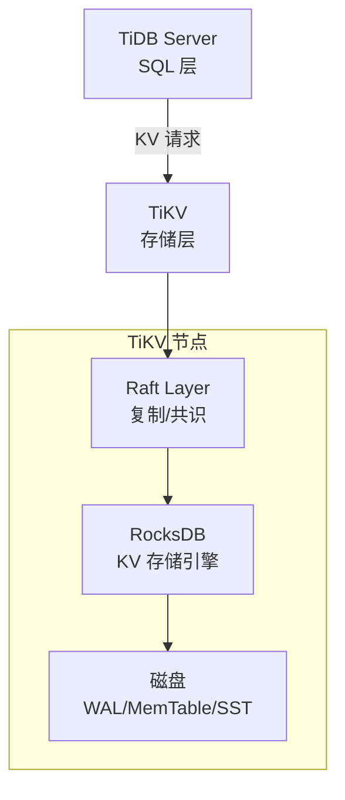
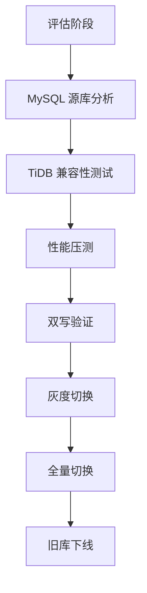

# TiDB 与 NewSQL 深入（架构原理 / Percolator 事务 / Region 调度 / HTAP / 迁移实践 / 选型）

> TiDB 是 **NewSQL 代表**（PingCAP 开源，兼容 MySQL 协议），核心特性：**水平扩展（计算存储分离）+ 强一致分布式事务 + HTAP（行存列存双引擎）**。本篇深入拆解：整体架构、Percolator 分布式事务、Region 调度、TiFlash 列存、迁移实践、选型决策。

---

## 一、要解决的问题

| 痛点 | 说明 |
|------|------|
| MySQL 扩容难 | 单库容量/写入瓶颈，分库分表复杂（MyCat/ShardingSphere） |
| 分片运维重 | 预分片、扩容迁移、跨片事务——成本高 |
| 事务限制 | 分片方案跨片事务弱/性能差 |
| 分析查询弱 | 在线库做分析 → 影响业务 / 需要额外数仓 |
| 高可用 | MySQL 主从切换有延迟/丢数据风险 |

> 核心认知：**TiDB = 「MySQL 兼容 + 无限水平扩展 + 强一致事务 + 一库两用（OLTP+OLAP）的 NewSQL」**——把 MySQL 的痛点（分片、扩容、分析）从「应用层解决」变为「数据库层解决」。

---

## 二、整体架构（计算与存储分离）

```
SQL 层（TiDB Server，无状态，可水平扩展）
  ├── 解析 SQL → 生成执行计划
  ├── 分布式优化器（下推计算：谓词/聚合/Join）
  ├── 分布式执行引擎（并行扫描多 Region）
  └── 兼容 MySQL 协议（连接/权限/语法）

元数据与调度（PD - Placement Driver，PD Server）
  ├── 集群元数据（表/Region 分布）
  ├── Region 调度（分裂/合并/迁移/均衡）
  ├── TSO 分配（全局单调时间戳）
  └── 基于 Raft 的高可用（PD 集群）

存储层（TiKV - 行存，分布式 KV）
  ├── 数据按 Range 切 Region（默认 ~96MB）
  ├── Region 内 Raft 复制组（3 副本强一致）
  └── MVCC + Percolator 事务

分析引擎（TiFlash - 列存）
  ├── 列式存储（AP 查询加速）
  ├── Raft Learner（异步实时同步行存数据）
  └── TiDB 优化器自动选择行存/列存（HTAP）
```

---

## 三、TiKV 存储引擎（深入）

### 3.1 数据组织

```
表数据 → 编码为 KV：
  t{tableID}_r{rowID} → 行数据
  索引 → i{indexID}_... → 主键

Region 划分：
  数据按 Key Range 切成 Region（默认 96MB）
  每个 Region 是复制/迁移的基本单位
  热点 Region 自动分裂（写入热点 → 拆 Region）

存储结构（RocksDB）：
  行数据：Raft 日志落盘（WAL）→ MemTable → SST
  列数据（TiFlash）：DeltaTree 存储
```

### 3.2 Region 与 Raft

```
每个 Region = 一个 Raft 组（Leader + Followers）

Raft 共识：
  Leader 处理读写（读在 Leader 线性一致 / 或 Learner）
  写入：Leader → 复制到 Followers（多数派确认）→ 提交
  选举：Leader 故障 → Followers 选举新 Leader

3 副本容错：
  任意 1 副本故障可用（多数派 2/3）
  不丢数据（Raft 日志持久化）

Region 状态：
  Raft Leader / Follower / Learner（只同步不参与投票）
  Region 分裂/合并（数据量变化自动调整）
```

---

## 四、分布式事务（Percolator 模型，深入）

### 4.1 两阶段提交思想

```
Percolator = 基于 BigTable 的两阶段提交（2PC）+ 全局时间戳

时间戳：
  PD 分配 TSO（全局单调递增）
  事务 startTS / commitTS

事务流程：
  1. 写事务预写（Primary Key 写 Lock）
  2. 提交：提交 Primary（写入 Commit 记录）
  3. 提交 Secondary（异步批量）
  4. 清理 Lock
```

### 4.2 TiDB 事务细节

```
写路径（两阶段）：
  Phase 1（prewrite）：
    写事务数据 + 加锁（每个 Key 一个 Lock，标记 primary）
    primary 加锁成功 = 预写成功
  Phase 2（commit）：
    提交 primary（commitTS 写入）
    异步提交 secondary

读路径（MVCC）：
  读时检查版本（startTS 之前的提交版本）
  遇锁：等待/回滚（resolve lock）

冲突处理：
  写冲突（同 Key 并发写）→ 等待锁 / 重试（悲观锁模式）
  事务重试 → 新 startTS（乐观模式）
  死锁检测（Wait-for graph）

隔离级别：
  默认 REPEATABLE READ（快照隔离）
  支持悲观锁模式（SELECT ... FOR UPDATE 等场景）
```

### 4.3 大事务注意事项

```
限制：
  事务大小限制（5.0+ 放宽）：单事务 KV 数 ≤ 300k（默认）
  大事务提交慢（同步复制开销）

优化：
  批量写入分批提交
  避免大事务（拆小批）
  批量删除用 DELETE ... LIMIT
```

---

## 五、Region 调度（PD 核心职责）

### 5.1 调度机制

```
PD 收集 Region 状态（心跳）→ 决策调度 → 下发

调度类型：
  均衡调度：Region 在 TiKV 间分布均衡（容量/读写负载）
  热点调度：热点 Region 分裂/迁移（写入/读取热点）
  故障恢复：节点故障 → Region 副本自动补齐
  下线调度：TiKV 下线 → 数据迁走
  分裂合并：Region 过大分裂 / 过小合并

调度目标：
  负载均衡（CPU/磁盘/网络）
  数据安全（副本分散在不同故障域）
  容量均衡（磁盘水位）
```

### 5.2 故障恢复

```
节点故障流程：
  1. Leader 故障 → Raft 选举新 Leader（秒级）
  2. 副本缺失 → PD 调度在健康节点补副本
  3. 数据均衡恢复

丢失数据保护：
  Raft 日志（多数派已持久化 → 不丢）
  Region 数据有 3 副本 → 单节点故障无损

多副本策略：
  跨机架/跨可用区（placement rules）
  数据本地性（就近副本）
```

---

## 六、HTAP 双引擎（深入）

### 6.1 原理

```
TiFlash（列存）：
  每个 Region 的 Learner 角色（同步行存数据到列存）
  异步实时同步（秒级延迟，不阻塞行存写入）

查询分流（TiDB 优化器决策）：
  OLTP 查询（点查/小范围）→ TiKV（行存，低延迟）
  OLAP 查询（聚合/扫描大表）→ TiFlash（列存，高吞吐）
  自动选择 or 强制 Hint（/*+ read_from_storage(tiflash[t]) */）

列存优势：
  列式压缩（体积小）
  向量化执行（批量计算）
  MPP 引擎（并行多节点计算，Join 下推）
```

### 6.2 HTAP 使用场景

```
在线分析：
  业务报表实时查询（数据秒级可见）
  实时大屏/指标看板
  运营分析（不建数仓直接查）

对比传统方案：
  传统：业务库 → CDC → 数仓（T+1 或准实时）
  HTAP：业务库 + TiFlash（无需数据搬运，实时性更强）

注意：
  TiFlash 增加存储/内存成本（双份数据）
  复杂分析仍建议大数据平台（数据湖/数仓）
```

---

## 七、TiDB vs MySQL vs NewSQL 生态

| 维度 | TiDB | MySQL | CockroachDB | OceanBase |
|------|------|-------|-------------|-----------|
| 协议兼容 | MySQL | 原生 | PostgreSQL | MySQL |
| 水平扩展 | 原生 | 分片方案 | 原生 | 原生 |
| 分布式事务 | Percolator 2PC | 无 | 串行化（2PC） | Paxos 事务 |
| HTAP | TiKV+TiFlash | 无 | 无（扩展版有） | 有（列存） |
| 生态工具 | 丰富（Lightning/CDC/DM） | 极丰富 | 一般 | 阿里系 |
| 学习成本 | 中（MySQL 语法） | 低 | 中 | 中 |
| 适用 | 海量数据 MySQL 兼容 | 中小规模 | 分布式 PG 需求 | 阿里生态 |

**选型关注点**：
- MySQL 协议 + 海量数据扩展 → **TiDB**；
- 开源自建 → **TiDB / CockroachDB**（PG 语法选后者）；
- 阿里生态 → **OceanBase / PolarDB-X**；
- 已有 MySQL 中小规模 → 优化/分片方案即可。

---

## 八、迁移实践（从 MySQL 到 TiDB）

### 8.1 迁移路径

```
方案一：全量 + 增量（推荐）
  DM（Data Migration）工具：
    → 全量迁移（dumpling 导出 + Lightning 导入）
    → 增量同步（binlog 持续复制）
    → 切换（停写窗口短，秒级）

方案二：双写 + 切换（无停服）
  业务双写（MySQL + TiDB）→ 校验 → 切读 → 切写

迁移要点：
  语法兼容性检查（DDL/DML 差异）
  索引/分区设计（TiDB 分区策略）
  字符集/时区
  大表优先迁移（分批）
  验证数据一致性（checksum）
```

### 8.2 迁移后优化

```
表设计优化：
  主键选择（避免自增热点 → 用雪花 ID/无序主键）
  分区表（时间分区适合归档查询）
  索引设计（TiDB 执行计划分析）

热点优化：
  自增主键热点 → 随机主键（Snowflake）
  唯一索引 → 降低写热点
  大表扫描 → 下推聚合（MPP）

资源规划：
  内存（TiKV 缓存 + TiFlash 列存）
  磁盘（行存 + 列存双份）
  网络（集群内部复制流量）
```

---

## 九、运维与监控

### 9.1 核心组件监控

```
TiDB：查询延迟/QPS/慢查询/执行计划
PD：Region 数量/调度/TSO 延迟
TiKV：写入延迟/磁盘 IO/Region 状态/GC 进度
TiFlash：同步延迟/查询延迟

关键指标：
  TiKV 写入延迟 P99
  Region 状态（异常数）
  热点 Region
  GC 落后（版本堆积 → 存储膨胀）
  慢查询（EXPLAIN ANALYZE 定位）
```

### 9.2 常见坑

| 坑 | 说明 | 对策 |
|----|------|------|
| 自增主键热点 | 单 Region 写热点 | 随机主键 |
| 大事务 | 提交慢/内存高 | 拆批 |
| GC 堆积 | 版本过多存储膨胀 | 监控 GC 进度 |
| 慢查询 | 无索引扫描全表 | 执行计划分析 |
| TSO 延迟 | PD 压力 | PD 扩容 |
| TiFlash 落后 | 同步延迟 | 检查磁盘/网络 |

---

## 十、选型速查

| 需求 | 首选 | 备选 |
|------|------|------|
| MySQL 兼容 + 海量数据扩展 | TiDB | OceanBase |
| 新系统原生分布式 | TiDB | CockroachDB |
| 在线分析（HTAP） | TiDB（TiFlash） | OceanBase |
| 阿里云生态 | PolarDB-X | OceanBase |
| 开源自建 | TiDB | CockroachDB |
| PostgreSQL 语法 | CockroachDB | — |
| 存量 MySQL 分片改造 | TiDB（DM 迁移） | Vitess/MyCat |

---

## 十二、TiDB TiKV/TiFlash 架构深入

### 12.1 TiKV 架构



| 组件 | 职责 |
|------|------|
| Raft Layer | 复制/选举/日志提交 |
| RocksDB | KV 存储（LSM-Tree） |
| Coprocessor | 计算下推（谓词/聚合/TopN） |
| Region | 数据调度基本单位（~96MB） |

### 12.2 TiFlash 架构

```
TiFlash 架构：
  列式存储引擎（DeltaTree）
  Raft Learner（异步同步行存数据）
  MPP 引擎（多节点并行计算）

DeltaTree 结构：
  Delta 层：增量数据（写缓冲）
  Stable 层：全量数据（列存压缩）
  合并：Delta → Stable（后台合并）

MPP 模式：
  大查询 → 分发到多个 TiFlash 节点
  → 各节点并行计算
  → 汇总结果
  适合：大表 JOIN / 聚合 / 扫描
```

### 12.3 TiKV vs TiFlash

| 维度 | TiKV（行存） | TiFlash（列存） |
|------|-------------|----------------|
| 存储格式 | 行式 | 列式 |
| 读优化 | 点查/小范围 | 大范围扫描/聚合 |
| 写入性能 | 高 | 中（异步同步） |
| 压缩比 | 一般 | 高（列压缩） |
| 适用 | OLTP | OLAP |
| 副本 | Raft（强一致） | Raft Learner（异步） |

---

## 十三、TiDB Placement Rules

### 13.1 Placement Rules 概念

```
Placement Rules = 数据放置规则
  控制副本数量/角色/位置
  实现：跨机架/跨可用区/跨地域部署

规则维度：
  replicas：副本数
  role：Leader/Follower/Learner
  location_labels：位置标签（zone/rack/host）
  count：副本数量
```

### 13.2 Placement Rules 配置

```json
// 将 order 表的 Leader 放在 zone=a，Follower 放在 zone=b/c
[
  {
    "group_id": "order_group",
    "id": 1,
    "index": 1,
    "override": true,
    "role": "leader",
    "count": 1,
    "location_labels": ["zone"],
    "isolation_level": "zone"
  },
  {
    "group_id": "order_group",
    "id": 2,
    "index": 2,
    "override": true,
    "role": "follower",
    "count": 2,
    "location_labels": ["zone"],
    "isolation_level": "zone"
  }
]
```

### 13.3 Placement Rules 使用场景

| 场景 | 规则 |
|------|------|
| 跨可用区高可用 | Leader + 2 Follower 分布 3 个 AZ |
| 读写分离 | Leader 在主区，Follower 在从区 |
| 数据本地性 | 特定表的副本在指定区域 |
| 降级容灾 | Learner 在异地（不影响写入性能） |

---

## 十四、TiDB HTAP 场景

### 14.1 HTAP 使用模式

```
模式一：在线分析（实时报表）
  业务写入 TiKV（OLTP）
  分析查询自动路由到 TiFlash（OLAP）
  → 实时报表（数据秒级可见）

模式二：实时大屏
  业务数据实时写入
  Grafana/BI 工具直接查 TiFlash
  → 毫秒级响应

模式三：数据仓库替代
  传统 ETL 流程：业务库 → CDC → 数仓（T+1）
  HTAP 模式：业务库 + TiFlash（无需 ETL，实时查询）
```

### 14.2 HTAP 查询路由

```sql
-- 自动路由（TiDB 优化器决策）
EXPLAIN SELECT * FROM orders WHERE amount > 100;
-- 优化器根据数据量自动选择 TiKV 或 TiFlash

-- 强制使用 TiFlash
EXPLAIN SELECT /*+ read_from_storage(tiflash[orders]) */ 
  COUNT(*) FROM orders GROUP BY status;

-- 强制使用 TiKV
EXPLAIN SELECT /*+ read_from_storage(tikv[orders]) */ 
  * FROM orders WHERE id = 123;
```

### 14.3 HTAP 注意事项

| 事项 | 说明 |
|------|------|
| 存储成本 | TiKV + TiFlash 双份数据 |
| 同步延迟 | TiFlash 异步同步（秒级延迟） |
| 写放大 | TiFlash 同步增加写入开销 |
| 复杂分析 | 超复杂查询仍建议大数据平台 |
| 内存消耗 | MPP 查询消耗大量内存 |

---

## 十五、TiDB vs CockroachDB vs YugabyteDB

| 维度 | TiDB | CockroachDB | YugabyteDB |
|------|------|-------------|------------|
| 协议兼容 | MySQL | PostgreSQL | PostgreSQL |
| 存储引擎 | RocksDB（TiKV） | Pebble | RocksDB |
| 事务模型 | Percolator 2PC | 串行化（2PC） | 2PC |
| HTAP | TiKV + TiFlash | 无（扩展版有） | 无 |
| 一致性 | 强一致（Raft） | 强一致（Raft） | 强一致（Raft） |
| 地理分布 | Placement Rules | 自动区域化 | 表空间 |
| 生态工具 | 丰富（Lightning/CDC） | 一般 | 一般 |
| 社区 | 活跃（CNCF） | 活跃 | 活跃 |
| 学习成本 | 中（MySQL） | 中（PostgreSQL） | 中（PostgreSQL） |

### 选型决策

| 场景 | 首选 | 理由 |
|------|------|------|
| MySQL 生态 + HTAP | TiDB | MySQL 兼容 + TiFlash |
| PostgreSQL 生态 | CockroachDB | PG 兼容 |
| 全球分布式 | CockroachDB | 原生区域化 |
| 阿里云生态 | OceanBase | 阿里系支持 |
| 开源自建 | TiDB / CockroachDB | 功能丰富 |

---

## 十六、TiDB 性能调优

### 16.1 SQL 层调优

| 调优点 | 方法 |
|--------|------|
| 执行计划 | EXPLAIN ANALYZE 分析慢查询 |
| 索引优化 | 合理创建索引（避免全表扫描） |
| 查询改写 | 避免子查询/改写为 JOIN |
| 统计信息 | ANALYZE TABLE 更新统计信息 |
| Hint | 强制使用特定索引/存储引擎 |

### 16.2 TiKV 层调优

| 调优点 | 方法 |
|--------|------|
| 热点 Region | 随机主键/打散热点 |
| 写入性能 | 批量写入/调整 raft log |
| 读取性能 | Follower Read/_kv_read_only |
| 内存 | 调整 block cache 大小 |
| 磁盘 | SSD + 调整 RocksDB 参数 |

### 16.3 慢查询分析

```sql
-- 查看慢查询
SELECT * FROM mysql.slow_query ORDER BY query_time DESC LIMIT 10;

-- 执行计划分析
EXPLAIN ANALYZE SELECT * FROM orders WHERE user_id = 123 AND status = 'paid';

-- 关注：
-- - rows_examined（扫描行数）
-- - execution_info（实际耗时）
-- - task info（TiKV/TiFlash 任务分布）
```

---

## 十七、TiDB 备份与恢复

### 17.1 备份方案

| 方案 | 工具 | 说明 |
|------|------|------|
| 全量备份 | BR (Backup & Restore) | 物理备份，速度快 |
| 增量备份 | BR incremental | 基于全量的增量 |
| 逻辑备份 | Dumpling | SQL 导出，兼容 MySQL |
| 实时备份 | TiCDC | 实时增量同步 |

### 17.2 BR 备份示例

```bash
# 全量备份
br backup full \
  --pd "pd1:2379,pd2:2379,pd3:2379" \
  --storage "s3://backup/tidb/full" \
  --send-credentials-to-tikv=true

# 增量备份
br backup incremental \
  --pd "pd1:2379" \
  --storage "s3://backup/tidb/full" \
  --lastbackupid 1234567890

# 恢复
br restore full \
  --pd "pd1:2379" \
  --storage "s3://backup/tidb/full" \
  --send-credentials-to-tikv=true
```

### 17.3 备份策略

```
备份策略：
  全量备份：每天凌晨（业务低峰）
  增量备份：每小时
  保留周期：7 天
  异地备份：跨 AZ/跨地域

恢复时间目标（RTO）：
  BR 物理恢复：TB 级数据 ~30 分钟
  Dumpling 逻辑恢复：TB 级数据 ~数小时

恢复点目标（RPO）：
  全量+增量：最多丢失 1 小时数据
  TiCDC 实时同步：秒级 RPO
```

---

## 十八、TiDB 金融场景

### 18.1 金融场景要求

| 要求 | TiDB 方案 |
|------|----------|
| 强一致 | Raft 多副本 + Percolator 事务 |
| 高可用 | 自动故障转移（秒级） |
| 数据不丢 | RPO = 0（同步复制） |
| 事务完整 | ACID 事务支持 |
| 审计 | SQL 审计日志 |
| 加密 | 传输加密（TLS）+ 存储加密 |

### 18.2 金融场景最佳实践

```
部署要求：
  3 数据中心部署（跨 AZ）
  Raft 副本数 ≥ 3
  同步模式（sync_log = true）
  金融级 SSD（高 IOPS）

性能要求：
  核心交易：P99 < 10ms
  批量处理：高吞吐
  报表查询：HTAP 实时分析

运维要求：
  7×24 监控
  自动备份 + 异地容灾
  定期演练恢复
```

### 18.3 TiDB 金融案例

```
场景：银行核心交易系统
  数据量：日增 500GB
  QPS：峰值 50,000
  事务：核心交易 ACID
  报表：实时风控分析

方案：
  TiDB（MySQL 兼容，应用改造小）
  TiFlash（实时风控分析）
  3 AZ 部署（高可用）
  BR + TiCDC（备份 + 实时同步）
```

---

## 十九、TiDB 生态工具

### 19.1 TiCDC

```
TiCDC（Change Data Capture）：
  实时捕获 TiDB 变更
  输出到下游系统（Kafka/MySQL/云存储）

用途：
  实时数据同步（TiDB → MySQL）
  实时数据仓库（TiDB → ClickHouse/数仓）
  实时搜索（TiDB → Elasticsearch）
  实时缓存（TiDB → Redis）

架构：
  TiDB → TiKV → CDC 捕获变更 → 下游
```

### 19.2 TiDB Lightning

```
TiDB Lightning：
  快速数据导入工具
  全量导入（TB 级数据 ~小时级完成）

工作流程：
  1. 导出数据文件（CSV/Dumpling 格式）
  2. Lightning 解析文件
  3. 并行写入 TiKV（绕过 SQL 层）
  4. 数据校验

使用场景：
  新集群初始化
  全量数据迁移
  大表重建
```

### 19.3 TiDB DM（Data Migration）

```
DM（Data Migration）：
  MySQL → TiDB 实时同步
  全量迁移 + 增量同步

工作流程：
  1. 全量迁移（dumpling 导出 + Lightning 导入）
  2. 增量同步（binlog 持续复制）
  3. 数据校验
  4. 切换（停写窗口秒级）

使用场景：
  MySQL → TiDB 迁移
  MySQL → TiDB 实时同步
  分库分表 → TiDB 合并
```

### 19.4 生态工具对比

| 工具 | 用途 | 输入 | 输出 |
|------|------|------|------|
| TiCDC | 实时变更捕获 | TiDB | Kafka/MySQL/ES |
| Lightning | 快速导入 | CSV/Dumpling | TiDB |
| DM | MySQL 同步 | MySQL binlog | TiDB |
| BR | 备份恢复 | TiDB | S3/本地 |
| Dumpling | 逻辑导出 | TiDB | SQL/CSV |
| TiDB Dashboard | 运维监控 | — | Web UI |

---

## 十二、Placement Rules 数据放置策略

### 12.1 Placement Rules 概念

| 规则 | 说明 | 示例 |
|------|------|------|
| leader | Leader 副本放置位置 | `{"region": "cn", "role": "leader"}` |
| follower | Follower 副本放置位置 | `{"region": "us", "role": "follower"}` |
| learner | Learner 副本（不参与投票） | `{"region": "eu", "role": "learner"}` |
| zone | 可用区级别 | `{"zone": "zone1"}` |

```sql
-- 创建 Placement Policy
CREATE PLACEMENT POLICY policy_cn PRIMARY_REGION="cn" REGIONS="cn,us";
ALTER TABLE orders PLACEMENT POLICY=policy_cn;
```

## 十三、TiFlash 列存同步

### 13.1 同步模式

| 模式 | 说明 | 适用 |
|------|------|------|
| 同步复制 | 事务提交时同步到 TiFlash | 强一致 HTAP |
| 异步复制 | 后台异步同步 | 延迟敏感场景 |
| 延迟复制 | 可配置延迟 | 兼容性验证 |

```sql
-- 设置表为 HTAP 模式
ALTER TABLE orders SET TIFLASH REPLICA 2;

-- 查看同步状态
SELECT * FROM information_schema.tiflash_replica WHERE TABLE_SCHEMA='mydb';
```

## 十四、TiDB 运维命令大全

```bash
# 集群管理
tiup cluster display          # 查看集群状态
tiup cluster scale-out       # 扩容
tiup cluster scale-in        # 缩容
tiup cluster upgrade         # 滚动升级

# SQL 运维
SHOW PROCESSLIST;            # 查看正在执行的查询
SHOW ENGINE TIKV STATUS\G    # 查看 TiKV 状态
ANALYZE TABLE orders;        # 更新统计信息
EXPLAIN ANALYZE SELECT ...;  # 执行计划分析

# 备份恢复
br backup --pd pd:2379 --storage s3://bucket/backup
br restore --pd pd:2379 --storage s3://bucket/backup
```

## 十五、MySQL 兼容性

### 15.1 兼容特性

| 特性 | 兼容性 | 说明 |
|------|--------|------|
| SQL 语法 | 95%+ | INSERT/UPDATE/DELETE/SELECT |
| 事务 | ACID | Percolator 两阶段提交 |
| 索引 | B+Tree | 支持联合索引/覆盖索引 |
| 存储过程 | 部分 | 不支持触发器 |
| 外键 | 支持 | 逻辑外键 |

### 15.2 不兼容特性

```text
不支持：
  - 空间数据类型（POINT/POLYGON）
  - 全文索引（FULLTEXT）
  - 触发器（TRIGGER）
  - 存储过程（部分语法）
  - 自定义函数（UDF）
  - 部分 JSON 函数
```

## 十六、大事务处理

### 16.1 大事务限制

| 限制类型 | 阈值 | 影响 |
|----------|------|------|
| 事务大小 | 100MB | 写入 KV 数量限制 |
| 锁数量 | 5000 | 锁冲突风险 |
| 执行时间 | 默认 5min | 超时回滚 |

### 16.2 优化策略

```java
// 分批处理大事务
public void batchProcess(List<Order> orders) {
    int batchSize = 1000;
    for (int i = 0; i < orders.size(); i += batchSize) {
        List<Order> batch = orders.subList(i, Math.min(i + batchSize, orders.size()));
        processBatch(batch);  // 每个批次独立事务
    }
}
```

## 十七、金融案例：银行核心系统迁移

### 17.1 迁移路径



| 阶段 | 时间 | 关键任务 |
|------|------|----------|
| 评估 | 2周 | SQL 兼容性、数据量评估 |
| 开发 | 4周 | 应用改造、适配层开发 |
| 测试 | 3周 | 功能/性能/压力测试 |
| 切换 | 1周 | 灰度→全量→观察 |

---

## TiDB Placement Rules 与数据放置策略

```
Placement Rules 核心概念：

  Rule Group（规则组）
    ├── 可针对不同表/分区设置不同副本策略
    └── scope = REGION / ZONE / HOST

  Rule（规则）
    ├── role = FOLLOWER / LEARNER / RESTRICTED_FOLLOWER
    ├── count = 副本数
    ├── location_labels = [zone, rack, host]
    └── isolation_level = ZONE（同 zone 不放多副本）

  Rule Calculator
    └── 根据 rules 自动调度 region 到合适 store
```

| 配置项 | 说明 | 典型值 |
|--------|------|--------|
| `location_labels` | 物理拓扑标签 | `["zone","rack","host"]` |
| `isolation_level` | 隔离级别 | `ZONE`（zone 级隔离） |
| `leader_constraints` | Leader 放置约束 | `+zone=zone1` |
| `learner_constraints` | Learner 放置约束 | `+zone=zone3` |
| `schedule_policy` | 调度策略 | `even` / `explicit` |

```
# 查看当前 Placement Rules
pd-ctl config placement-rules

# 导出规则到文件
pd-ctl config placement-rules export --outpath ./rules.json

# 导入规则
pd-ctl config placement-rules import --inpath ./rules.json

# 示例：为某表设置 2follower+1learner
{
  "group_id": "tenant_a",
  "rules": [
    {
      "id": 1,
      "role": "VOTER",
      "count": 2,
      "location_labels": ["zone"],
      "isolation_level": "ZONE"
    },
    {
      "id": 2,
      "role": "LEARNER",
      "count": 1,
      "constraints": {"+zone": "zone3"}
    }
  ]
}
```

## TiFlash 同步机制深度解析

```
TiFlash 同步流程：

  TiKV Region Leader
      │
      ├── Raft Learner (TiFlash)
      │     ├── 异步复制 Raft 日志
      │     ├── 延迟通常 < 1s
      │     └── 可配置同步模式：
      │           ├── Async（默认，低延迟）
      │           └── Sync（强一致，高延迟）
      │
  只读快照：
      └── TiFlash 定期做 snapshot
          └── MVCC 读取历史版本
```

| 同步模式 | 一致性 | 延迟 | 适用场景 |
|----------|--------|------|----------|
| `Async` | 最终一致 | 1-5s | 实时报表、OLAP 查询 |
| `Sync` | 强一致 | 10-50ms | 实时风控、强一致分析 |
| `RocksDB 引擎` | 本地一致 | 0ms | TiKV 内部 |

```
# 查看 TiFlash 同步状态
pd-ctl region check --zone=tiflash

# TiFlash 同步延迟监控
curl http://tiflash:12313/metrics | grep tiflash_proxy_raft_apply_log_duration_seconds

# 强同步设置
ALTER TABLE t SET TIFLASH REPLICA 1 LOCATION LABELS "zone=tiflash" FOLLOWER_COUNT 1;

# 检查同步进度
SELECT * FROM information_schema.tiflash_replica;
```

## pd-ctl 运维操作大全

```
# 集群状态
pd-ctl cluster info
pd-ctl member list
pd-ctl region status

# Store 管理
pd-ctl store list
pd-ctl store stats <store_id>
pd-ctl store remove <store_id>          # 下线节点
pd-ctl store limit <store_id> add-peer 10  # 限制调度速率

# Region 调度
pd-ctl region operator add transfer-leader <region_id> <target_store_id>
pd-ctl region operator add scatter-region <region_id>
pd-ctl region operator remove <region_id>

# 调度器控制
pd-ctl scheduler list
pd-ctl scheduler pause balance-leader-scheduler
pd-ctl scheduler resume balance-leader-scheduler
pd-ctl scheduler config balance-leader

# 配置热更新
pd-ctl config set max-snapshot-count 3
pd-ctl config set leader-schedule-limit 4
pd-ctl config set region-schedule-limit 2048
```

| 命令 | 用途 | 注意事项 |
|------|------|----------|
| `store remove` | 下线节点 | 先 `prepare-stop` 再 `remove` |
| `scatter-region` | 打散 region | 大规模扩缩容前必做 |
| `balance-leader` | Leader 均衡 | 高峰期暂停避免抖动 |
| `hot-region` | 热 region 调度 | 配合 `hot-region-schedule-limit` |

## tikv-ctl 运维工具箱

```
# 查看 Region 信息
tikv-ctl --host tikv0:20160 region -r <region_id>

# 查看 RocksDB 统计
tikv-ctl --host tikv0:20160 region-properties -r <region_id>
tikv-ctl --host tikv0:20160 engine-info

# 人工 compact（大版本升级后必做）
tikv-ctl --host tikv0:20160 compact --db /var/lib/tikv/db
tikv-ctl --all --host tikv0:20160 compact --db /var/lib/tikv/db

# RocksDB SST 文件分析
tikv-ctl --host tikv0:20160 scan --from 'key1' --to 'key2' --limit 10

# 恢复（危险操作）
tikv-ctl --host tikv0:20160 recover -r <region_id>

# Tombstone 清理
tikv-ctl --host tikv0:20160 tombstone --pd http://pd:2379
```

## MySQL 工具兼容性矩阵

| 工具 | 兼容性 | 注意事项 |
|------|--------|----------|
| MySQL 5.7 Client | ✅ 完全兼容 | 基础 CRUD 无差异 |
| MySQL 8.0 Client | ✅ 完全兼容 | 新语法支持 |
| Navicat | ✅ 兼容 | DDL 操作需 PD 在线 |
| DBeaver | ✅ 兼容 | 部分系统表差异 |
| MySQL Workbench | ⚠️ 部分兼容 | 逆向工程可能报错 |
| pt-online-schema-change | ✅ 兼容 | 大表 DDL 推荐使用 |
| gh-ost | ✅ 兼容 | 无外键场景更优 |
| mysqldump | ✅ 兼容 | 逻辑备份 |
| mydumper/myloader | ✅ 兼容 | 并行备份恢复 |
| Canal | ✅ 兼容 | 需配置 GTID 模式 |
| Maxwell | ✅ 兼容 | 需 binlog_row_image=FULL |
| Debezium | ✅ 兼容 | CDC 首选 |

## 大事务处理与规避方案

```
TiDB 大事务限制：

  1. 默认单事务大小限制：
     ├── raft_log_max_size = 6MB（建议值）
     └── 超过会报 "transaction too large"

  2. 默认事务 KV 数限制：
     └── 5000 KV（单次事务）
         └── 超过会回退到 pessimistic retry

  3. 写入 QPS 限制：
     └── 单 Region 写入不超过 1MB/s
         └── 超过触发 split

  4. Snapshot 大小限制：
     └── 单 Region 不超过 256MB
```

```
# 大事务规避策略：

1. 分批写入
   ├── 每批 1000-5000 条
   ├── 每批独立事务
   └── 用 batch_id 做幂等

2. 使用悲观事务
   SET SESSION tidb_txn_mode = 'pessimistic';
   -- 降低冲突重试概率

3. 压缩写入
   ├── 合并小 Key 为大 Key
   └── 减少 MVCC 版本数

4. 流式写入
   ├── 使用 LOAD DATA INFILE
   └── 使用 TiDB Lightning 批量导入
```

| 场景 | 推荐方案 | 预期效果 |
|------|----------|----------|
| 百万级批量插入 | 分批 5000 条/批 + 悲观事务 | 吞吐 10w+/s |
| 大表 DDL | pt-osc 或 gh-ost | 零锁表时间 |
| 跨表事务 | 拆分为多事务 + 最终一致 | 避免大事务 |
| 实时写入 | 批量攒批 + 异步提交 | 延迟 < 100ms |

## 金融系统迁移实战案例

```
某银行核心系统迁移路径：

  Phase 1: 双写验证（2周）
    ├── 应用双写 MySQL + TiDB
    ├── 定时对账脚本
    └── 差异告警

  Phase 2: 灰度切换（1周）
    ├── 10% 流量切 TiDB
    ├── 观察延迟/P99/错误率
    └── 逐步提升到 50%

  Phase 3: 全量切换（3天）
    ├── 停止 MySQL 写入
    ├── TiDB 独立运行
    └── MySQL 作为备份

  Phase 4: 下线 MySQL（2周）
    ├── 观察期
    ├── 清理双写代码
    └── 成本回收
```

| 迁移阶段 | 风险等级 | 回滚时间 | 核心指标 |
|----------|----------|----------|----------|
| 双写验证 | 低 | 即时 | 对账差异率 < 0.01% |
| 灰度切换 | 中 | < 5min | P99 延迟 ≤ MySQL 2倍 |
| 全量切换 | 高 | < 30min | 错误率 < 0.1% |
| 下线 MySQL | 低 | 不可回滚 | 稳定运行 7 天 |

---

## TiDB Placement Rules 亲和性配置

### 标签 / 存储引擎亲和 / 跨地域部署

```
Placement Rules：
  控制 Region 在不同存储引擎/标签的分布
  实现：热数据放 TiKV，分析数据放 TiFlash

配置步骤：
  1. 设置节点标签
    tikv-1: zone=us-east-1, engine=tikv
    tikv-2: zone=us-east-2, engine=tikv
    tiflash-1: zone=us-east-1, engine=tiflash

  2. 创建 Placement Policy
    CREATE PLACEMENT POLICY hot_data PRIMARY_REGION="us-east-1"
    FOLLOWERS=2 REGION_LABELS="zone";

  3. 应用到表
    CREATE TABLE logs (...) PLACEMENT POLICY=hot_data;

  4. TiFlash 副本配置
    ALTER TABLE logs SET TIFLASH REPLICA 2;
    → 自动同步到 2 个 TiFlash 节点

效果：
  热数据 → TiKV（us-east-1）
  分析查询 → TiFlash（列存加速）
  跨地域 → Follower 在其他 zone
```

## TiFlash 列存同步机制

### 异步复制 / Raft Learner / 一致性

```
TiFlash 同步机制：
  TiKV → TiFlash 异步复制（Raft Learner）
  通过 Raft Log 复制（非物理复制）
  一致性：最终一致（异步）
  延迟：通常 < 1 秒

Raft Learner：
  TiFlash 作为 Raft Learner（只读）
  不参与选举（不投票）
  只接收日志（异步）
  保证数据一致性

同步模式：
  SYNCHRONOUS：等待 TiFlash 确认（慢）
  ASYNCHRONOUS：不等待（默认）
  SESSION：会话级别控制

监控：
  SHOW PLACEMENT;
  → 查看副本分布和同步状态
```

## TiDB 运维命令速查

### 日常运维 / 故障处理

```sql
-- 查看集群信息
SELECT * FROM information_schema.tikv_store_status;
SELECT * FROM information_schema.tiflash_store_status;

-- 查看 Region 分布
SHOW TABLE TABLE_REGIONS;

-- 查看执行计划
EXPLAIN ANALYZE SELECT * FROM orders WHERE user_id = 123;

-- 热点 Region 调度
SPLIT TABLE orders BY (user_id) 10;
→ 手动分裂 Region

-- 手动 compact
COMPACT TABLE orders;

-- 灾难恢复
FLASHBACK TABLE orders TO TIMESTAMP '2026-01-15 10:00:00';
```

## TiDB MySQL 工具兼容性

### 备份/导入/同步工具

| 工具 | 兼容性 | 说明 |
|------|--------|------|
| mysqldump | 兼容 | 全量导出/导入 |
| mydumper | 兼容 | 快速并行导出 |
| TiDB Lightning | 原生 | 高速导入（推荐） |
| TiCDC | 原生 | 增量同步到 MySQL/Kafka |
| DM | 原生 | MySQL→TiDB 迁移 |
| Canal | 兼容 | 增量订阅 |
| Debezium | 兼容 | CDC 采集 |

```
迁移方案选择：
  MySQL → TiDB（全量+增量）→ DM
  TiDB → MySQL（同步）→ TiCDC
  TiDB → Kafka（事件流）→ TiCDC
  大文件导入 → TiDB Lightning（并行导入）
```

## TiDB 大事务处理

### 拆分策略 / 超时控制

```
大事务问题：
  单事务写入数据量 > 10GB → 性能下降
  事务持锁时间长 → 冲突增多
  GC 压力大 → 影响其他事务

拆分策略：
  1. 按用户/订单拆分
    单事务只处理一个用户/订单
    减小事务粒度

  2. 批量提交
    每 1000 条提交一次
    降低单事务大小

  3. 异步处理
    写入消息队列（RocketMQ）
    消费者批量处理

超时控制：
  -- tidb_gc_life_time=10m（GC 保留时间）
  -- tidb_txn_entry_count_limit=300000（单事务 key 数限制）
  -- tidb_txn_total_size_limit=104857600（单事务大小限制 100MB）
```

## TiDB 金融级应用案例

### 强一致 / 分布式事务 / MySQL 兼容

```
金融场景：
  账户余额（强一致）
  转账交易（分布式事务）
  对账报表（HTAP）

TiDB 方案：
  1. 强一致：Raft 协议保证（可调）
   tidb_txn_mode=PESSIMISTIC（悲观锁，默认）
   tidb_txn_mode=OPTIMISTIC（乐观锁，冲突少时快）

  2. 分布式事务：Percolator 两阶段提交
    Prewrite → Commit
    保证 ACID（跨 Region）

  3. HTAP：TiKV（OLTP）+ TiFlash（OLAP）
    交易数据实时同步到 TiFlash
    报表查询走 TiFlash（不阻塞交易）

  4. MySQL 兼容：
    应用零改动迁移
    MySQL 驱动/ORM 直接使用
    生态工具（Navicat/DBeaver）兼容

效果：
  从 MySQL 单机 → TiDB 分布式
  QPS 从 1 万 → 10 万+
  存储从 1TB → 10TB+
  查询延迟：OLTP < 10ms，OLAP < 1s
```

## 十一、与其他板块的关系

- 分片方案对比见「[MyCat 与 Vitess](./MyCat与Vitess.md)」与「[分库分表 ShardingSphere](./分库分表ShardingSphere.md)」；
- 存储引擎见「[RocksDB 与嵌入式 KV 存储](./RocksDB与嵌入式KV存储.md)」；
- MySQL 基础见「[MySQL 知识](../mysql知识.md)」；
- 数据迁移生态见「[云上数据库与缓存生态](./云上数据库与缓存生态.md)」。

> 一句话：**TiDB = TiDB（无状态 SQL 层）+ PD（元数据/TSO/调度）+ TiKV（Raft 行存）+ TiFlash（列存 HTAP）——事务走 Percolator 两阶段提交，扩展靠 Region 自动分裂迁移——选型先看「MySQL 兼容+海量数据→TiDB」，迁移走 DM 全量+增量，生产守则：随机主键防热点、大事务拆批、GC 监控、执行计划分析**。

## TiDB 故障排查

### 常见故障处理

| 故障类型 | 排查步骤 | 解决方案 |
|----------|----------|----------|
| 连接超时 | 检查网络/负载 | 调整连接池 |
| 慢查询 | EXPLAIN ANALYZE | 优化SQL/索引 |
| Region 热点 | PD Dashboard | 调整Region分布 |
| 存储满 | 扩容/清理 | 扩容磁盘 |

### 故障排查命令

```sql
-- 查看集群信息
SHOW CREATE TABLE t\G

-- 查看执行计划
EXPLAIN SELECT * FROM t WHERE id = 1;

-- 查看慢查询
SELECT * FROM information_schema.slow_query ORDER BY query_time DESC LIMIT 10;

-- 查看Region分布
SHOW TABLE t REGIONS;

-- 查看TiKV状态
SELECT * FROM information_schema.tikv_region_status;
```

## TiDB 与其他数据库对比

| 维度 | TiDB | MySQL | PostgreSQL |
|------|------|-------|------------|
| 架构 | 分布式 | 单机 | 单机 |
| 扩展性 | 水平扩展 | 垂直扩展 | 垂直扩展 |
| 事务 | 分布式事务 | 本地事务 | 本地事务 |
| 兼容性 | MySQL 兼容 | - | 标准 SQL |
| 适用场景 | 海量数据 | 传统业务 | 复杂查询 |

## TiDB 版本对比

| 版本 | 功能 | 适用场景 | 许可证 |
|------|------|----------|--------|
| TiDB 5.x | 稳定 | 生产环境 | Apache 2.0 |
| TiDB 6.x | 新特性 | 新项目 | Apache 2.0 |
| TiDB 7.x | 实验性 | 测试 | Apache 2.0 |

### 版本选择建议

```
版本选择：
  生产环境 → TiDB 5.x 或 6.x
  新项目 → TiDB 6.x
  测试 → TiDB 7.x
  需要稳定性 → TiDB 5.x
  需要新特性 → TiDB 6.x
```

## TiDB 最佳实践

### 写入优化

| 优化项 | 方法 | 效果 |
|--------|------|------|
| 批量写入 | 批量 INSERT/UPDATE | 减少事务开销 |
| 随机主键 | 避免热点写入 | 写入均衡 |
| 分区表 | 按时间/范围分区 | 数据管理 |
| 大事务拆批 | 分批提交 | 避免大事务 |

### 查询优化

| 优化项 | 方法 | 效果 |
|--------|------|------|
| 索引优化 | 合理建立索引 | 查询加速 |
| 执行计划 | EXPLAIN ANALYZE | 分析慢查询 |
| 统计信息 | ANALYZE TABLE | 优化器决策 |
| SQL 改写 | 避免全表扫描 | 减少 IO |

## TiDB 监控与告警

### 监控指标

| 指标 | 说明 | 告警阈值 |
|------|------|----------|
| QPS | 每秒查询数 | 按需 |
| 延迟 | 查询延迟 | > 100ms |
| 连接数 | 数据库连接数 | > 80% 最大连接 |
| 存储使用 | 磁盘使用率 | > 80% |
| 复制延迟 | TiKV 复制延迟 | > 10s |

### 告警配置

```yaml
# Prometheus 告警规则
groups:
  - name: tidb-alerts
    rules:
      - alert: TiDBQueryLatencyHigh
        expr: histogram_quantile(0.99, rate(tidb_session_query_duration_seconds_bucket[5m])) > 0.1
        for: 5m
        labels:
          severity: warning
        annotations:
          summary: "TiDB查询延迟过高"

      - alert: TiDBStorageHigh
        expr: tidb_storage_used_bytes / tidb_storage_total_bytes > 0.8
        for: 5m
        labels:
          severity: warning
        annotations:
          summary: "TiDB存储使用率过高"
```

## 十二、Placement Rules深度详解

### 12.1 Placement Rules概念

```
Placement Rules：
  控制数据副本的放置位置
  实现跨机架/跨地域部署
  满足数据本地性要求
  支持混合部署模式

规则类型：
  leader：指定Leader副本位置
  follower：指定Follower副本位置
  learner：指定Learner副本位置
  leader-and-follower：指定Leader和Follower位置
```

### 12.2 Placement Rules配置示例

```sql
-- 创建Placement Policy
CREATE PLACEMENT POLICY my_policy
  PRIMARY_REGION="us-east-1"
  REGIONS="us-east-1,us-west-2,eu-west-1"
  FOLLOWERS=2
  SCHEDULE='EVEN';

-- 应用到表
CREATE TABLE users (
  id BIGINT PRIMARY KEY,
  name VARCHAR(100)
) PLACEMENT POLICY=my_policy;

-- 查看Placement Policy
SHOW PLACEMENT POLICY my_policy;
```

## 十三、TiFlash引擎详解

### 13.1 TiFlash特性

| 特性 | 说明 | 适用场景 |
|------|------|---------|
| 列式存储 | 列式存储格式 | 分析查询 |
| 实时同步 | 异步复制 | 实时分析 |
| 混合负载 | OLTP+OLAP混合 | HTAP场景 |
| MPP引擎 | 分布式并行处理 | 大数据分析 |

### 13.2 TiFlash使用场景

```
TiFlash使用场景：
  1. 实时报表
     → 实时同步TiKV数据
     → 列式存储加速查询
     → 支持复杂聚合分析

  2. 数据仓库
     → 替代传统数仓
     → 支持SQL标准
     → 实时数据更新

  3. 混合负载
     → OLTP处理事务
     → OLAP处理分析
     → 统一平台

  4. 数据探索
     → 交互式查询
     → 即席分析
     → 数据可视化
```

## 十四、TiDB运维工具详解

### 14.1 运维工具对比

| 工具 | 功能 | 适用场景 |
|------|------|---------|
| TiUP | 集群部署/升级/管理 | 日常运维 |
| TiDB Data Migration | 数据迁移 | MySQL迁移 |
| TiDB Backup & Backup | 备份恢复 | 数据备份 |
| TiDB Lightning | 高速导入 | 大数据导入 |
| TiDB DM | 分库分表迁移 | 复杂迁移 |

### 14.2 TiUP常用命令

```bash
# 集群部署
tiup cluster deploy my-cluster v7.0.0 topology.yaml

# 集群启动
tiup cluster start my-cluster

# 集群升级
tiup cluster upgrade my-cluster v7.1.0

# 集群扩容
tiup cluster scale-out my-cluster scale-out.yaml

# 集群缩容
tiup cluster scale-in my-cluster --node node1:2379

# 集群备份
tiup backup full my-cluster --backpath /backup

# 集群恢复
tiup restore full my-cluster --backpath /backup
```

## 十五、TiDB大事务处理详解

### 15.1 大事务限制

```
TiDB大事务限制：
  单个事务大小限制：100MB
  单个KV条目大小：6MB
  事务持有锁时间：默认10s
  并发事务数：受TiKV节点数限制

大事务问题：
  1. 事务超时
  2. 锁冲突严重
  3. GC压力大
  4. 网络带宽消耗
```

### 15.2 大事务解决方案

| 方案 | 做法 | 适用场景 | 优缺点 |
|------|------|---------|--------|
| 事务拆批 | 分批提交 | 批量操作 | 复杂度高 |
| 异步处理 | 消息队列异步 | 非实时场景 | 一致性弱 |
| 预处理 | 预计算结果 | 复杂计算 | 开发成本高 |
| 限流 | 控制事务频率 | 高并发场景 | 降低吞吐 |

## 十六、TiDB金融级应用案例详解

### 16.1 金融级场景

```
金融级场景：
  1. 账户系统
     → 高一致性要求
     → 资金安全
     → 审计追踪

  2. 支付系统
     → 高可用要求
     → 低延迟要求
     → 高并发处理

  3. 风控系统
     → 实时计算
     → 规则引擎
     → 告警通知

  4. 报表系统
     → 实时数据
     → 复杂查询
     → 多维度分析
```

### 16.2 金融级最佳实践

| 实践 | 做法 | 目的 |
|------|------|------|
| 数据一致性 | 强一致性读 | 资金安全 |
| 事务隔离 | RC隔离级别 | 性能优化 |
| 监控告警 | 全链路监控 | 故障快速发现 |
| 审计日志 | 操作审计 | 合规要求 |
| 灾备方案 | 同城双活/异地多活 | 业务连续性 |

## 十七、TiDB选型对比详解

### 17.1 选型对比表

| 场景 | 推荐数据库 | 理由 |
|------|-----------|------|
| 高并发OLTP | TiDB | 分布式架构，水平扩展 |
| HTAP混合负载 | TiDB | OLTP+OLAP一体化 |
| 大数据分析 | TiDB + TiFlash | 列式存储，分析加速 |
| 数据迁移 | TiDB | MySQL兼容，迁移成本低 |
| 金融级应用 | TiDB | 强一致性，高可用 |

### 17.2 选型决策树

```
选型决策树：
  Q1：需要HTAP吗？
    是 → TiDB
    否 → Q2

  Q2：需要水平扩展吗？
    是 → TiDB/CockroachDB
    否 → Q3

  Q3：需要强一致性吗？
    是 → TiDB/CockroachDB
    否 → MySQL/PostgreSQL

  Q4：团队熟悉MySQL吗？
    是 → TiDB
    否 → CockroachDB

  Q5：预算充足吗？
    是 → TiDB（推荐）
    否 → MySQL分库分表
```