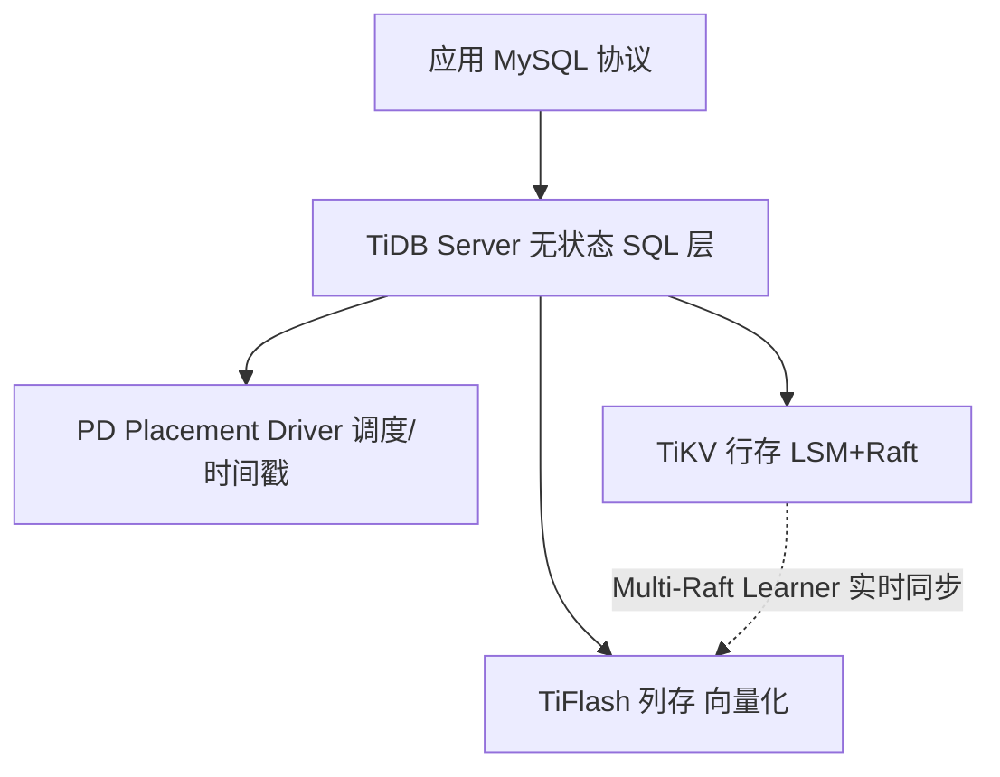

# TiDB 与 NewSQL（分布式关系型数据库）

> TiDB 是**兼容 MySQL 的分布式 NewSQL 数据库**，兼具「水平扩展 + ACID 事务 + HTAP 分析」。
> 适合：MySQL 遇到分库分表瓶颈、需要弹性扩容又不想改业务代码、事务+实时分析混合（HTAP）、SaaS 多租户。
> 不适合：极简单机业务（运维 3 类节点有成本）、超复杂跨节点多表 JOIN（超大集群性能边际递减）。

---

## 一、什么是 NewSQL

NoSQL 解决了扩展，却丢了 SQL/ACID。NewSQL 的目标是：**像单机关系型一样用 SQL + 强一致事务，又像 NoSQL 一样水平扩展**。TiDB、CockroachDB、OceanBase 都属此列。

TiDB 的独特卖点：**100% 兼容 MySQL 协议**——应用几乎零改动迁移（不用像 CockroachDB 那样改 PostgreSQL 协议栈）。

> 仓库 `github.com/pingcap/tidb`：Go 实现（TiKV 存储层为 Rust，已捐 CNCF），**Apache 2.0**，28k+ commits；官方定位 "open-source, cloud-native, distributed SQL database"，兼容 MySQL 8.0，支持 HTAP + 向量搜索。

---

## 二、整体架构（计算存储分离）

| 组件 | 角色 |
|------|------|
| **TiDB Server** | 无状态 SQL 层，解析/优化/执行，可多节点水平扩 QPS |
| **TiKV** | 分布式 KV 存储，**RocksDB(LSM) + Raft 多副本强一致**，行存 |
| **PD (Placement Driver)** | 集群大脑：元数据、时间戳分配（TSO）、调度均衡 |
| **TiFlash** | 列存引擎，通过 **Multi-Raft Learner** 从 TiKV 实时复制，向量化执行分析查询 |

**HTAP 原理**：同一份数据，行存（TiKV）保事务、列存（TiFlash）保分析，Learner 实时同步，查询时引擎自动路由——事务走 TiKV、分析走 TiFlash，**互不干扰**。

---

## 三、关键能力

1. **水平扩展**：加 TiKV 节点即可扩存储/算力，扩 TiDB 节点即可提 QPS，无需停机、无需业务分片。
2. **分布式 ACID 事务**：基于 **Percolator 模型 + 两阶段提交**，跨行跨表事务强一致；Raft 多副本（默认 3），RPO=0，节点故障自动选主自愈（RTO≈10s）。
3. **MySQL 兼容**：兼容 MySQL 5.7/8.0 语法、索引、生态工具（DMP、Binlog、ORM 直接连）。
4. **HTAP**：行列混合，实时分析不打扰在线事务。
5. **高可用**：Raft 3 副本，自动故障转移。
6. **生态工具**：TiDB DM（数据迁移）、TiCDC（增量同步到 Kafka/MySQL）、BR（备份恢复）、TiDB Operator（K8s 部署）。

---

## 四、TiDB vs CockroachDB vs OceanBase

| 维度 | TiDB | CockroachDB | OceanBase |
|------|------|-------------|-----------|
| 定位 | 开源 NewSQL，MySQL 兼容+HTAP | 云原生强一致，跨地域 | 企业级金融，强一致+高可用 |
| 协议 | ✅ MySQL 5.7/8.0 | PostgreSQL（部分） | MySQL/Oracle（企业版） |
| 架构 | TiDB+TiKV+PD 分离 | P2P 对等（无中心） | 无共享+单元化 |
| 一致性 | Raft，RC/Serial | Raft+HLC，Serializable | Paxos+Raft，Serializable |
| HTAP | ✅ TiFlash | 弱（需外部 OLAP） | ✅ 分析+事务引擎 |
| 开源 | Apache-2.0 | 2024 转 Enterprise 许可（社区反弹） | 社区版+商业版 |
| 典型客户 | 美团/京东/知乎/平安 | Netflix/PayPal | 支付宝/工行/移动 |

**选型建议**
- 团队熟 MySQL + 要开源 + 事务+简单分析混合 → **TiDB**
- 跨国业务、全球分布、PostgreSQL 栈 → **CockroachDB**
- 金融核心、极致高可用、预算充足 → **OceanBase**

---

## 五、生产实践与避坑

1. **热点 Key**：自增主键会造成写入热点（全落一个 Region），改用**打散主键**（如 UUID 或 雪花 id 取模），让 Region 均匀分布。
2. **大事务拆分**：TiDB 对超大事务（如一次性 update 全表）有限制，应分批。
3. **JOIN 跨节点**：超大规模多表 JOIN 性能不如单机调优的专用数仓，分析场景优先 TiFlash 或下推。
4. **PD 是关键**：PD 挂了影响调度/时间戳，需 3 节点高可用，别和 TiKV 混部抢资源。
5. **TiFlash 同步延迟**：Learner 异步同步有秒级延迟，强一致分析需读 TiKV 或容忍延迟。
6. **迁移**：用 TiDB DM 从 MySQL 全量+增量平滑迁移，几乎不中断。

---

## 六、与其他板块的关系

- 与 [MySQL](mysql知识.md)、[分库分表 ShardingSphere](分库分表ShardingSphere.md)：TiDB 是「不分库分表也能水平扩展」的替代方案，sharding 是应用层手动分片，TiDB 是存储层自动分片（Region）。
- 与 [MongoDB](MongoDB.md)：TiDB 保 ACID/SQL、强一致；MongoDB 保灵活 Schema/文档。事务强一致场景选 TiDB。
- 与 [分布式事务 Seata](分布式事务Seata.md)：Seata 解决「多个独立数据源」的分布式事务；TiDB 自身内部已通过 Percolator 提供跨行 ACID，二者在不同层次。
- 与 [ClickHouse](ClickHouse.md)：TiDB HTAP 的分析能力对许多场景够用；超大规模纯分析（单表聚合）仍 ClickHouse 更强，常见「TiDB 做事务 + ClickHouse 做分析」组合。

---

## 七、速查表

| 项 | 结论 |
|----|------|
| 类型 | 分布式 NewSQL（兼容 MySQL） |
| 架构 | TiDB(无状态)+TiKV(Raft行存)+PD(调度)+TiFlash(列存) |
| 事务 | 分布式 ACID（Percolator + 2PC） |
| 扩展 | 计算存储分离，独立水平扩 |
| HTAP | ✅ TiKV 行存 + TiFlash 列存实时同步 |
| 一致性 | Raft 多副本，RPO=0 |
| 许可证 | Apache-2.0 |
| 一句话 | 「MySQL 的分布式分身」——扩容不用分库分表 |
