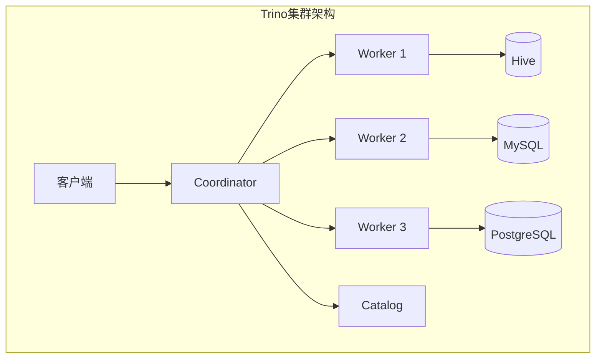
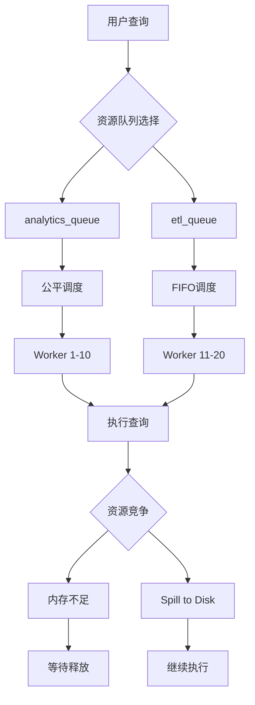
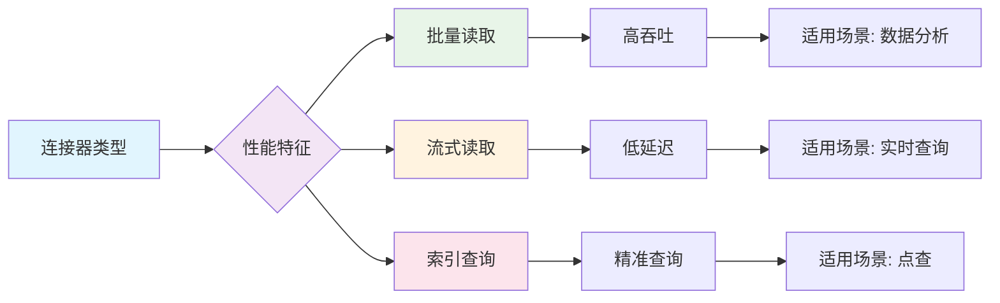
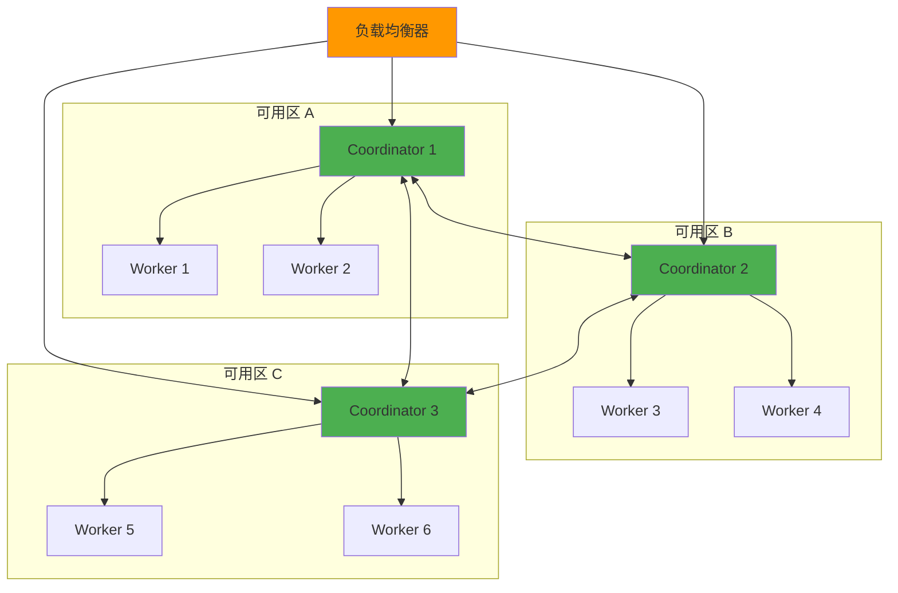

# Trino（Presto）联邦查询引擎（深入）

> Trino（原 PrestoSQL）是**多源联邦 SQL 查询引擎**：一条 SQL 同时查 MySQL + Hive + Kafka + 对象存储 + 云数仓。本篇深入拆解：Connector SPI、调度模型、性能调优、生产部署、与 Iceberg/Hudi 集成。

---

## 一、解决的问题与定位

**解决的问题**：
1. 数据分散在多个系统，分析要搬数据、建管道，周期长；
2. Hive/Spark 查询重、分钟级，交互式分析需要秒级；
3. 数据湖缺一个「直接 SQL 查询」的引擎。

**定位一句话**：**「不存数据、只算数据」的分布式 SQL 引擎——连接器（Connector）模式对接 N 种数据源，SQL 下推与跨源 Join。**

---

## 二、核心原理

### 2.1 Coordinator + Worker 架构

```
Coordinator: 解析 SQL → 生成分布式执行计划 → 调度给 Worker
Worker 并行执行 Task；数据按分区(partition)分片

Coordinator: 无状态（可多活），只做解析/优化/调度
Worker: 执行计算，可无限水平扩展（加 Worker = 加并发）
无状态 + 弹性: 查询结束即释放，不存用户数据
```

### 2.2 查询执行流程

```
SQL → Parser → Analyzer → Optimizer → LogicalPlan → PhysicalPlan
  → Stage 分解（Coordinator/Worker 多级 Stage）
  → Task 分发到 Worker
  → Worker 读取数据（通过 Connector）
  → 执行 Filter/Join/Aggregation
  → 结果返回 Coordinator → 返回客户端

Stage 类型：
  CoordinatorOnly: 只在 Coordinator 执行（如展示结果）
  Source: 从 Connector 读数据
  Fixed: 在 Worker 上执行计算
  Single: 在 Coordinator 上汇聚结果
```

### 2.3 连接器（Connector）体系

| 连接器 | 数据源 | 关键点 |
|--------|--------|--------|
| Hive/Iceberg/Delta Lake | 数据湖表格式 | 元数据从 HMS/Catalog 读，数据扫对象存储 |
| JDBC 类 | MySQL/PG/Doris/ClickHouse… | 谓词下推减少传输 |
| Kafka | 实时流 | 可当实时表查（低延迟小批） |
| 对象存储+File | S3/OSS 上 JSON/CSV/Parquet | 无目录表也行（Raw Query） |
| 云数仓 | Redshift/BigQuery/Snowflake | 跨云联邦 |
| Elasticsearch | 搜索索引 | 全文检索 + 聚合 |
| Redis | KV 存储 | 简单查询 |

### 2.4 Connector SPI 开发

```java
// 自定义 Connector 需要实现的接口
public interface Connector {
    ConnectorMetadata getMetadata();
    ConnectorFactory getConnectorFactory();
    ConnectorSplitManager getSplitManager();
    ConnectorPageSourceProvider getPageSourceProvider();
    ConnectorPageSinkProvider getPageSinkProvider();
}

// 元数据接口
public interface ConnectorMetadata {
    List<String> listSchemaNames();
    List<String> listTables(ConnectorSession session, String schemaName);
    ConnectorTableHandle getTableHandle(ConnectorSession session, SchemaTableName tableName);
    ConnectorTableMetadata getTableMetadata(ConnectorSession session, ConnectorTableHandle tableHandle);
}

// Split 管理（数据分片）
public interface ConnectorSplitManager {
    ConnectorSplitSource getSplits(ConnectorSession session, ConnectorTableHandle table, DynamicFilter dynamicFilter);
}
```

---

## 三、下推与优化

### 3.1 谓词下推

```sql
-- 原始查询
SELECT * FROM mysql.users u JOIN hive.orders o ON u.id = o.user_id
WHERE u.age > 25 AND o.amount > 100;

-- Trino 优化后：
-- MySQL 端：WHERE age > 25（只拉符合条件的用户）
-- Hive 端：WHERE amount > 100（只拉符合条件的订单）
-- 内存中：Join 两小结果集

-- 验证下推：EXPLAIN 输出看 ConnectorScanNode 的过滤条件
EXPLAIN SELECT * FROM mysql.users WHERE age > 25;
-- 输出中应包含 "FilterExpression: (age > 25)" 在 ConnectorScanNode 中
```

### 3.2 关键优化

| 优化 | 说明 |
|------|------|
| 谓词下推 | WHERE/HAVING 条件压到源端执行 |
| 列裁剪 | 只读查询需要的列（对象存储按列切片） |
| 分区裁剪 | 只读匹配分区的数据 |
| Join 优化 | 小表广播（Broadcast）、大表分区分发 |
| 字段裁剪 | 只读需要的字段（减少 IO） |
| 聚合下推 | 源端预聚合（减少传输量） |
| 时间旅行 | Iceberg 表的快照查询 |

---

## 四、性能调优

### 4.1 Worker 资源配置

```properties
# worker 节点配置
query.max-memory=50GB           # 单查询最大内存
query.max-memory-per-node=8GB   # 单节点单查询最大内存
query.max-total-memory-per-node=10GB  # 单节点总内存限制
query.max-run-time=1h           # 单查询最大执行时间
query.queue-config-file=queue.json  # 资源队列配置
```

### 4.2 资源队列

```json
{
  "queues": {
    "root": {
      "maxQueued": 100,
      "maxRunning": 50,
      "schedulingPolicy": "fair",
      "subqueues": {
        "interactive": {
          "maxQueued": 50,
          "maxRunning": 30,
          "schedulingPolicy": "weighted",
          "subqueues": {
            "team_a": { "maxQueued": 20, "maxRunning": 10, "weight": 1 },
            "team_b": { "maxQueued": 20, "maxRunning": 10, "weight": 2 }
          }
        },
        "batch": {
          "maxQueued": 50,
          "maxRunning": 20
        }
      }
    }
  }
}
```

### 4.3 常见性能问题

| 问题 | 原因 | 解决 |
|------|------|------|
| 跨源 Join 慢 | 数据没下推，全量拉取 | EXPLAIN 检查下推情况 |
| 内存溢出 | 单查询内存太大 | 调 query.max-memory |
| 数据倾斜 | 某个 partition 数据量特别多 | 调整分区策略 / Salting |
| 元数据慢 | Hive Metastore 响应慢 | 缓存元数据 / 用 Iceberg |
| Worker OOM | 并发查询太多 | 资源队列 + 调并发限制 |

---

## 五、与 Iceberg 集成

### 5.1 Iceberg 表配置

```sql
-- 创建 Iceberg 表
CREATE TABLE iceberg.mydb.users (
    id BIGINT,
    name VARCHAR,
    age INT
) WITH (
    format = 'ORC',
    partitioning = ARRAY['age'],
    location = 's3://my-bucket/iceberg/mydb/users'
);

-- 时间旅行查询
SELECT * FROM iceberg.mydb.users FOR TIMESTAMP AS OF TIMESTAMP '2024-01-01 00:00:00';
SELECT * FROM iceberg.mydb.users FOR VERSION AS OF 12345;

-- Schema 演进
ALTER TABLE iceberg.mydb.users ADD COLUMN email VARCHAR;
```

### 5.2 Iceberg + Trino 优势

| 特性 | 说明 |
|------|------|
| 列统计 | 自动收集列统计信息优化查询 |
| 分区裁剪 | 按分区过滤，只读需要的数据 |
| 时间旅行 | 查询历史快照 |
| Schema 演进 | 安全地添加/删除列 |
| ACID 事务 | 并发写入安全 |
| 小文件合并 | 自动合并小文件 |

---

## 六、生产部署

### 6.1 部署模式

```
独立部署（Self-Hosted）：
  - Coordinator × 2（高可用）
  - Worker × N（按需扩缩）
  - 依赖：Metastore（HMS）+ 对象存储

云托管：
  - AWS EMR Trino
  - Google Cloud Dataproc Trino
  - Starburst Galaxy
  - Allen AI Trino

K8s 部署：
  - trino-kubernetes-operator
  - Helm Chart
```

### 6.2 生产检查清单

| 项目 | 建议 |
|------|------|
| Coordinator HA | 2 个 Coordinator + 负载均衡 |
| Worker 数量 | 按并发查询数 × 单查询资源需求 |
| 内存规划 | 每 Worker 16~64GB，JVM 堆占 70% |
| 网络 | Worker 间 10Gbps+（shuffle 吃带宽） |
| 元数据缓存 | HMS 缓存 / Iceberg 元数据缓存 |
| 监控 | JMX Exporter + Prometheus + Grafana |
| 日志 | 结构化日志 + 集中采集 |

---

## 七、与其他引擎对比

| 引擎 | 定位 | 存储 | 延迟 | 适用 |
|------|------|------|------|------|
| **Trino** | 联邦查询 | 不存数据 | 秒级 | 联邦/BI/Ad-hoc |
| **Spark** | 批处理 | 不存数据 | 分钟~小时 | ETL/ML |
| **Hive** | 离线数仓 | HDFS | 分钟~小时 | 离线分析 |
| **ClickHouse** | OLAP | 自存储 | 毫秒~秒 | 实时分析 |
| **Doris** | OLAP | 自存储 | 毫秒~秒 | 实时分析 |
| **PrestoDB** | 联邦查询 | 不存数据 | 秒级 | Facebook 生态 |

---

## 八、速查表

| 主题 | 一句话 |
|------|--------|
| 定位 | 无状态多源联邦 SQL 引擎，不存数据只算 |
| 架构 | Coordinator + 无状态 Worker，弹性扩展 |
| 连接器 | Hive/Iceberg/JDBC/Kafka/ES/对象存储全对接 |
| 关键优化 | 谓词下推 + 列裁剪 + 分区裁剪 + 内存 Join |
| 对比 | 查得快→Trino；ETL→Spark；要存数据→CK/Doris |
| 典型组合 | Iceberg 湖 + Trino 查询层；CK 热数据 + Trino 联邦 |

---

## 九、Trino 架构深入与查询优化

### 9.1 Coordinator + Worker 架构详解

```
Trino 集群架构：

  Coordinator（协调节点，可多实例）：
    ├── SQL 解析器（ANTLR 语法解析）
    ├── 查询分析器（语义分析/类型检查）
    ├── 查询优化器（规则优化 + 成本优化）
    ├── Stage 调度器（分解 Stage → 分发 Task）
    ├── 结果聚合（合并 Worker 结果）
    └── REST API（客户端通信）

  Worker（工作节点，可水平扩展）：
    ├── Task 执行器（Pipeline 执行模型）
    ├── 页面源（PageSource → 从 Connector 读数据）
    ├── 页面 Sink（PageSink → 写数据到 Connector）
    ├── 内存管理器（查询级内存限制）
    └── 任务管理器（Task 生命周期管理）

  存储层（不存储数据）：
    ├── Connector SPI（连接器接口）
    ├── 元数据缓存（表/列/分区信息）
    └── 数据源对接（MySQL/Hive/S3/ES...）

  通信机制：
    Coordinator ↔ Worker: REST API（HTTP/HTTPS）
    Worker ↔ Worker: 数据 Shuffle（Exchange）
    所有节点: 基于 HTTP/2 的高效通信
```

### 9.2 查询解析与优化

```
Trino 查询处理流程：

  SQL 字符串
  → Parser（ANTLR 语法树）
  → Analyzer（语义分析/类型推断/权限检查）
  → Logical Plan（逻辑计划）
  → Optimizer（规则优化 + 成本优化）
  → Physical Plan（物理计划）
  → Stage 分解（Coordinator/Source/Fixed/Single）
  → Task 生成（分布式执行单元）
  → Task 分发到 Worker
  → Pipeline 执行（读→处理→写）
  → 结果返回 Coordinator → 客户端

关键优化器规则：
  1. 谓词下推（Predicate Pushdown）：WHERE 条件推到 Connector
  2. 列裁剪（Column Pruning）：只读需要的列
  3. 分区裁剪（Partition Pruning）：只读匹配分区
  4. 聚合下推（Aggregation Pushdown）：源端预聚合
  5. Join 重排序（Join Reordering）：按成本选择最优 Join 顺序
  6. 子查询合并（Subquery Merging）：减少重复扫描
  7. 常量折叠（Constant Folding）：编译期计算常量表达式
```

### 9.3 动态过滤（Dynamic Filtering）

```
动态过滤 = Join 时从大表提取过滤条件，应用到小表扫描

示例：
  SELECT * FROM orders o
  JOIN users u ON o.user_id = u.id
  WHERE o.order_date > '2024-01-01';

  传统执行：
    orders 扫描全量 → Join → 过滤
    users 扫描全量 → Join → 过滤

  动态过滤执行：
    阶段 1：扫描 orders（过滤 order_date > 2024-01-01）
           → 提取 user_id 集合 {101, 102, 103, ...}
    阶段 2：将 user_id 集合推送到 users Connector
           → users 只扫描 id IN (101, 102, 103, ...)
           → 大幅减少 users 扫描量

  配置：
    optimizer.dynamic-filtering=true（默认开启）
    dynamic-filtering-max-domain-combinations=1000
    dynamic-filtering-pushdown-filter-factor=10
```

### 9.4 字典聚合（Dictionary Aggregation）

```
字典聚合 = 用字典编码优化 GROUP BY

原理：
  低基数列（如 status, region）GROUP BY 时
  传统：逐行比较字符串 → CPU 开销大
  字典聚合：将字符串映射为整数 → 整数 GROUP BY → 极快

  适用条件：
    列的唯一值数量有限（< 几千）
    GROUP BY 列是低基数列

  配置：
    dictionary-aggregation=true（默认开启）

  验证：
    EXPLAIN 输出中看到 "DictionaryAggregation" 节点
    表示字典聚合已生效
```

---

## 十、Trino Connector SPI 深入

### 10.1 Connector 核心接口

```java
// Connector 实现核心接口
public interface Connector {
    // 元数据管理
    ConnectorMetadata getMetadata();

    // Split 管理（数据分片）
    ConnectorSplitManager getSplitManager();

    // 数据读取
    ConnectorPageSourceProvider getPageSourceProvider();

    // 数据写入（可选）
    ConnectorPageSinkProvider getPageSinkProvider();

    // 事务管理（可选）
    ConnectorTransactionHandle beginTransaction();
}

// 元数据接口（实现表/列信息查询）
public interface ConnectorMetadata {
    // Schema 管理
    List<String> listSchemaNames(ConnectorSession session);
    List<SchemaTableName> listTables(ConnectorSession session, Optional<String> schema);

    // 表元数据
    ConnectorTableHandle getTableHandle(ConnectorSession session, SchemaTableName tableName);
    ConnectorTableMetadata getTableMetadata(ConnectorSession session, ConnectorTableHandle handle);
    List<ConnectorColumnHandle> getColumns(ConnectorSession session, ConnectorTableHandle handle);

    // 应用谓词下推（核心）
    Optional<ConnectorApplyFilterResult> applyFilter(
        ConnectorSession session,
        ConnectorTableHandle handle,
        TupleDomain<ColumnHandle> filter);

    // 聚合下推
    Optional<ConnectorAggregationgregationPushdownResult> applyAggregationgregationPushdown(
        ConnectorSession session,
        ConnectorTableHandle handle,
        ConnectorAggregationgregationPushdownResult result);
}

// Split 管理（数据分片）
public interface ConnectorSplitManager {
    ConnectorSplitSource getSplits(
        ConnectorSession session,
        ConnectorTableHandle table,
        DynamicFilter dynamicFilter);
}
```

### 10.2 自定义 Connector 开发流程

```
开发自定义 Connector 步骤：

  1. 实现 Connector 接口
     实现 getMetadata/getSplitManager/getPageSourceProvider

  2. 实现 ConnectorMetadata
     实现 listSchemaNames/listTables/getTableHandle
     实现 getColumns（返回列信息）
     实现 applyFilter（谓词下推）

  3. 实现 ConnectorSplitManager
     getSplits：将表数据划分为 Split（分片）
     每个 Split 对应一个数据源片段

  4. 实现 ConnectorPageSourceProvider
     createPageSource：根据 Split 读取数据
     返回 PageSource（逐页读取数据）

  5. 打包为 JAR → 放入 Trino plugin 目录
     每个 Connector 一个目录（如 plugin/mysql/）

  6. 配置 catalog
     catalog/properties 文件指定 Connector 类
```

---

## 十一、Trino 容错执行与安全

### 11.1 容错执行（Fault-Tolerant Execution）

```
Trino 容错模式（实验性）：

  传统执行（当前默认）：
    查询失败 → 整体失败 → 需要重跑

  容错执行（可选）：
    任务失败 → 重新调度到其他 Worker → 继续执行
    中间结果持久化到存储（S3/HDFS）→ 避免重复计算

  配置：
    queryFaultToleranceEnabled=true

  工作原理：
    Stage 中间结果写入临时存储（S3/HDFS）
    Task 失败 → 重新创建 Task → 从临时存储读取中间结果
    支持 Stage 级别重试（非查询级别）

  适用场景：
    大规模 ETL 查询（运行数小时）
    资源不稳定集群（Spot 实例）
    多租户环境（资源竞争频繁）

  当前状态：
    实验性功能（非生产就绪）
    性能开销：中间结果持久化增加 10-20% 开销
    社区持续优化中
```

### 11.2 Trino 安全机制

```
认证（Authentication）：
  LDAP：集成 Active Directory / OpenLDAP
  Kerberos：企业级身份认证
  Password：内置密码认证
  Certificate：双向 TLS 认证
  OAuth 2.0：集成身份提供商

  配置示例（LDAP）：
    http-server.authentication.type=LDAP
    ldap.url=ldap://ldap.example.com:389
    ldap.user-base-dn=dc=example,dc=com
    ldap.user-filter=(&(objectClass=person)(uid=${USER}))

授权（Authorization）：
  RBAC（基于角色的访问控制）
    角色 → 权限 → 资源（Catalog/Schema/Table/Column）
    系统角色：admin、user
    自定义角色：data_analyst、data_engineer

  配置：
    access-control.name=file
    access-control.config-file=/etc/trino/access-control.json

列级掩码（Column Masking）：
  敏感列自动脱敏（如手机号、身份证号）
  不同角色看到不同数据

  配置示例：
    {
      "row-filters": [],
      "column-masks": {
        "users.phone": {
          "type": "partial",
          "mask": "concat('***', substring(${USER} from 8))"
        }
      }
    }

行级过滤（Row Filtering）：
  不同角色只能看到部分行（如区域数据隔离）
```

---

## 十二、Trino 性能调优

### 12.1 内存调优

```properties
# Worker 内存配置
query.max-memory=50GB              # 单查询最大内存（集群级）
query.max-memory-per-node=8GB      # 单节点单查询最大内存
query.max-total-memory-per-node=10GB  # 单节点总内存
query.memory-headroom=2GB          # 系统预留内存

# 查询内存分配：
#   每查询内存 = min(query.max-memory, query.max-memory-per-node × Worker 数)
#   Join/聚合操作消耗最多内存
#   大表 JOIN → 可能 OOM → 调小 query.max-memory

# 内存溢出排查：
#   查询日志：EXCEEDED_MEMORY_LIMIT
#   监控：trino_queries 查询内存使用
#   解决：调小并发/查询内存限制/优化查询
```

### 12.2 Join 策略优化

```
Trino Join 策略：

  1. Broadcast Join（广播 Join）：
     小表广播到所有 Worker → 大表分区处理
     适用：小表 < 几百 MB
     优势：避免 Shuffle，性能好
     劣势：小表重复传输（网络开销）

  2. Partitioned Join（分区 Join）：
     大表按 Join Key 分区 → Shuffle → Worker 本地 Join
     适用：大表 JOIN 大表
     优势：内存友好
     劣势：网络 Shuffle 开销大

  3. Hash Join（哈希 Join）：
     构建阶段：构建哈希表（小表）
     探测阶段：大表逐行探测
     支持：内连接/左连接/右连接/全连接

  优化器自动选择：
    优化器根据统计信息选择最优策略
    统计信息：表行数、列基数、数据分布
    收集统计信息：ANALYZE table_name;
```

### 12.3 性能监控与诊断

```sql
-- 查询执行信息
SELECT
    query_id,
    user,
    source,
    state,
    query,
    started,
    end_time - started AS duration,
    queued_time_ms,
    analyze_time_ms,
    process_time_ms,
    result_queue_time_ms
FROM system.runtime.queries
WHERE state = 'FINISHED'
ORDER BY duration DESC
LIMIT 20;

-- 查询内存使用
SELECT
    query_id,
    user,
    memory_pool,
    peak_memory
FROM system.runtime.queries
WHERE memory_pool != 'reserved'
ORDER BY peak_memory DESC;

-- Stage 执行详情
SELECT
    query_id,
    stage_id,
    stage_number,
    state,
    rows,
    bytes,
    cpu_time_ms,
    wall_time_ms,
    user_memory_reservation
FROM system.runtime.stages
WHERE query_id = 'your_query_id';

-- Worker 健康
SELECT
    node_id,
    http_uri,
    node_pool,
    active_queries,
    memory_available,
    cpu_available
FROM system.runtime.nodes
WHERE state = 'active';
```

---

## 十三、Trino on Kubernetes

### 13.1 K8s 部署架构

```yaml
# Trino on K8s 架构
Coordinator Deployment:
  replicas: 2（高可用）
  containers:
    - coordinator: Coordinator 服务
  services:
    - ClusterIP: 内部通信
    - LoadBalancer: 客户端访问

Worker StatefulSet:
  replicas: N（弹性伸缩）
  containers:
    - worker: Worker 服务
  volumeClaimTemplates:
    - 本地缓存卷（可选）

ConfigMap:
  config.properties: Trino 配置
  catalog/: 数据源配置

Secret:
  ldap-password: LDAP 认证密码
  tls-cert: TLS 证书

Ingress:
  路由规则：trino.example.com → Coordinator
```

### 13.2 Helm Chart 部署

```bash
# 使用 Trino Helm Chart
helm repo add trino https://trino.io/charts
helm repo update

# 安装 Trino
helm install trino trino/trino \
  --set coordinator.replicas=2 \
  --set worker.replicas=3 \
  --set worker.autoscaling.enabled=true \
  --set worker.autoscaling.minReplicas=3 \
  --set worker.autoscaling.maxReplicas=10 \
  --set coordinator.config."query\.max-memory"="50GB"

# 监控集成
helm install trino trino/trino \
  --set prometheus.enabled=true \
  --set grafana.enabled=true
```

---

## 十四、Trino vs PrestoDB vs Athena 对比

| 维度 | Trino | PrestoDB | AWS Athena |
|------|-------|----------|------------|
| **维护方** | Trino 社区（Starburst 主导） | Facebook/Meta | AWS |
| **协议** | Apache License 2.0 | Apache License 2.0 | 闭源 |
| **功能** | 最丰富（最新特性） | 稳定（Facebook 验证） | 简化版 |
| **Connector** | 最多（50+） | 中等 | 有限（AWS 生态） |
| **性能** | 优秀（持续优化） | 优秀 | 良好（受限） |
| **部署** | 自托管/云 | 自托管 | 托管服务 |
| **成本** | 自运维成本 | 自运维成本 | 按查询付费 |
| **社区** | 活跃（GitHub 最快增长） | 活跃（Facebook 背书） | 无开源社区 |
| **SQL 方言** | ANSI 标准 | ANSI 标准 | AWS 扩展 |
| **适用** | 通用联邦查询 | Facebook 生态 | AWS 数据湖 |

### 选型决策

```
场景 → 选型：
  通用联邦查询（多云）→ Trino（功能最全，社区最活跃）
  Facebook 生态（Hive 表格式兼容）→ PrestoDB
  AWS 数据湖（S3 + Glue）→ Athena（零运维）
  功能需求（动态过滤/字典聚合）→ Trino（新特性最多）
  已有 Trino 集群 → 继续用（迁移成本高）
  新建集群 → Trino（社区方向，Starburst 支持）
```

---

## 十五、Trino 容错执行深入（Exchange/Split/Single Task）

### 15.1 容错执行架构

```
Fault-Tolerant Execution（容错执行）核心机制：

  Exchange（交换）：
    Stage 间数据传输的中间层
    支持物化到磁盘/对象存储（S3/HDFS）
    Task 失败时可从 Exchange 重读中间结果
    避免从头重算整个 Stage

  Split（分片）：
    数据源的最小调度单元
    每个 Split 对应一个数据源片段（如 Hive 表的一个分区）
    失败的 Split 可重新调度到其他 Worker

  Single Task 模型：
    每个 Stage 只创建一个 Task（而非 N 个并行 Task）
    Task 内部按 Split 流水线执行
    失败时整体重新调度（而非单个并行 Task 重试）
    简化容错逻辑

容错执行配置：
  query.fault-tolerant-execution.enabled=true
  exchange.deduplication.max-buffer-size=1GB
  fault-tolerant-execution.target-stage-input-positions=100000000
```

### 15.2 容错执行 vs 传统执行对比

| 维度 | 传统执行 | 容错执行 |
|------|---------|---------|
| 中间结果 | 内存传输 | 物化到存储（S3/HDFS） |
| Task 失败 | 整个查询失败 | 单 Task 重试 |
| Stage 失败 | 整个查询失败 | Stage 级重试 |
| 资源浪费 | 重试全量计算 | 仅重算失败部分 |
| 性能开销 | 无额外开销 | 增加 10-20% IO |
| 适用场景 | 交互式查询 | 大规模 ETL / Spot 实例 |

```text
容错执行适用场景：
  1. 大规模 ETL 查询（运行数小时，失败代价高）
  2. Spot 实例集群（实例随时被回收）
  3. 多租户环境（资源竞争频繁，任务易失败）
  4. 数据源不稳定（网络抖动导致读取失败）
```

## 十六、动态过滤器（Dynamic Filtering）原理与 EXPLAIN 输出

### 16.1 动态过滤原理

```
动态过滤 = Join 时从大表提取过滤条件，应用到小表扫描

原理详解：
  1. Phase 1（构建阶段）：
     扫描大表 orders，提取 JOIN 键的值集合
     如：SELECT DISTINCT user_id FROM orders WHERE order_date > '2024-01-01'
     → 提取 user_id 集合 {101, 102, 103, ...}

  2. Phase 2（推送阶段）：
     将 user_id 集合推送到小表 users 的 Connector
     → Connector 生成过滤条件：WHERE id IN (101, 102, 103, ...)

  3. Phase 3（执行阶段）：
     users 表扫描量大幅减少（从全量 → 仅匹配行）
     → Join 性能提升显著

配置：
  optimizer.dynamic-filtering=true（默认开启）
  dynamic-filtering-max-domain-combinations=1000
  dynamic-filtering-pushdown-filter-factor=10
```

### 16.2 EXPLAIN 输出解读

```sql
-- 开启动态过滤后的 EXPLAIN
EXPLAIN SELECT * FROM orders o
JOIN users u ON o.user_id = u.id
WHERE o.order_date > '2024-01-01';

-- EXPLAIN 输出关键信息：
-- DynamicFilter: [o.user_id IN (101, 102, 103, ...)]
-- → 表示动态过滤已生效
-- → users 表只扫描 id IN (...) 的行

-- 未开启动态过滤的 EXPLAIN：
-- → users 表全表扫描（无 IN 条件）
-- → Join 在内存中完成（慢）
```

```text
EXPLAIN 输出解读：
  DynamicFilter: [...] → 动态过滤已生效
  FilterExpression: (id IN (...)) → Connector 层过滤
  Estimates: rows=1000 (vs 全量 100 万) → 扫描量大幅减少
  性能提升：通常 10-100 倍（取决于过滤选择性）
```

## 十七、字典聚合优化（DictionaryAggregationOperator）

```
字典聚合 = 用字典编码优化 GROUP BY

原理：
  低基数列（如 status, region, gender）GROUP BY 时
  传统：逐行比较字符串 → CPU 开销大（字符串哈希+比较）
  字典聚合：将字符串映射为整数 → 整数 GROUP BY → 极快

  适用条件：
    列的唯一值数量有限（< 几千）
    GROUP BY 列是低基数列

  工作流程：
    1. 扫描时构建字典（string → int 映射）
    2. GROUP BY 用整数比较（替代字符串比较）
    3. 聚合完成后将整数映射回字符串

  配置：
    dictionary-aggregation=true（默认开启）

  验证：
    EXPLAIN 输出中看到 "DictionaryAggregation" 节点
    表示字典聚合已生效

  性能提升：
    低基数列 GROUP BY：2-10 倍提速
    高基数列（如 user_id）：不适用（字典过大）
```

```sql
-- 验证字典聚合是否生效
EXPLAIN SELECT status, COUNT(*) FROM orders GROUP BY status;
-- 输出中应包含 "DictionaryAggregation" 节点

-- 如果没有出现，检查：
-- 1. status 列基数是否过高（> 10000）
-- 2. dictionary-aggregation 是否被禁用
```

## 十八、Trino on Kubernetes（trino-operator）

### 18.1 trino-operator 部署

```yaml
# 使用 trino-operator 部署 Trino 集群
apiVersion: trino.apache.org/v1alpha1
kind: TrinoCluster
metadata:
  name: trino-cluster
spec:
  coordinator:
    replicas: 2
    image:
      repository: trinodb/trino
      tag: "433"
    resources:
      requests:
        memory: "4Gi"
        cpu: "2"
      limits:
        memory: "8Gi"
        cpu: "4"
  worker:
    replicas: 3
    image:
      repository: trinodb/trino
      tag: "433"
    resources:
      requests:
        memory: "8Gi"
        cpu: "4"
      limits:
        memory: "16Gi"
        cpu: "8"
    autoscaling:
      enabled: true
      minReplicas: 3
      maxReplicas: 10
      targetCPUUtilization: 70
  catalog:
    mysql: |
      connector.name=mysql
      connection-url=jdbc:mysql://mysql:3306/mydb
      connection-user=user
      connection-password=pass
    hive: |
      connector.name=hive
      hive.metastore.uri=thrift://hive-metastore:9083
```

### 18.2 trino-operator vs Helm Chart 对比

| 维度 | trino-operator | Helm Chart |
|------|---------------|------------|
| 部署方式 | K8s Operator（CRD） | Helm 安装 |
| 扩缩容 | 自动（HPA） | 手动/HPA |
| 版本升级 | 滚动更新 | Helm upgrade |
| 配置管理 | CRD 声明式 | values.yaml |
| 运维复杂度 | 低（Operator 管理） | 中 |
| 适用 | K8s 原生部署 | 传统部署 |

## 十九、Trino 安全模型（System Access Control）

```
Trino 安全模型（System Access Control）：

  认证（Authentication）：
    LDAP：集成 Active Directory / OpenLDAP
    Kerberos：企业级身份认证
    Password：内置密码认证
    Certificate：双向 TLS 认证
    OAuth 2.0：集成身份提供商

  授权（Authorization）：
    System Access Control：全局授权框架
    文件型（file）：JSON 配置文件定义权限
    Ranger：Apache Ranger 集成（Hadoop 生态）
    访问控制粒度：Catalog / Schema / Table / Column

  列级掩码（Column Masking）：
    敏感列自动脱敏（如手机号、身份证号）
    不同角色看到不同数据

  配置示例：
    access-control.name=file
    access-control.config-file=/etc/trino/access-control.json

  行级过滤（Row Filtering）：
    不同角色只能看到部分行（如区域数据隔离）

  审计日志：
    记录所有查询操作（用户/时间/查询/结果行数）
    集成 ELK/Splunk 做安全分析
```

```json
// access-control.json 示例
{
  "tables": [
    {
      "group": "analytics",
      "catalog": "hive",
      "schema": "default",
      "table": "users",
      "columns": ["phone", "id_card"],
      "mask": {
        "phone": "concat('***', substring(phone from 8))",
        "id_card": "concat('****', substring(id_card from 15))"
      }
    }
  ],
  "row-filters": [
    {
      "group": "regional",
      "catalog": "hive",
      "schema": "default",
      "table": "orders",
      "filter": "region = currentUserRegion()"
    }
  ]
}
```

## 二十、Trino 性能调优（query.max-memory-per-node / join-distribution-type）

### 20.1 内存调优

```properties
# Worker 内存配置
query.max-memory=50GB              # 单查询最大内存（集群级）
query.max-memory-per-node=8GB      # 单节点单查询最大内存
query.max-total-memory-per-node=10GB  # 单节点总内存
query.memory-headroom=2GB          # 系统预留内存

# 内存分配公式：
#   每查询内存 = min(query.max-memory, query.max-memory-per-node × Worker 数)
#   Join/聚合操作消耗最多内存
#   大表 JOIN → 可能 OOM → 调小 query.max-memory

# 内存溢出排查：
#   查询日志：EXCEEDED_MEMORY_LIMIT
#   监控：trino_queries 查询内存使用
#   解决：调小并发/查询内存限制/优化查询
```

### 20.2 Join 分布式类型

```properties
# join-distribution-type 配置
# AUTOMATIC（默认）：优化器自动选择 Broadcast 或 Partitioned
# BROADCAST：强制广播 Join（小表广播到所有 Worker）
# PARTITIONED：强制分区 Join（大表按 JOIN 键分区）

# 选择策略：
#   小表 < 几百 MB → BROADCAST（避免 Shuffle）
#   大表 JOIN 大表 → PARTITIONED（内存友好）
#   AUTOMATIC → 优化器根据统计信息自动选择

# 配置示例：
join-distribution-type=AUTOMATIC
```

```text
调优 Checklist：
  1. 收集统计信息：ANALYZE table_name;
  2. 检查 EXPLAIN 输出中的 Join 类型
  3. 调整 query.max-memory-per-node（单节点内存）
  4. 调整 join-distribution-type（Broadcast vs Partitioned）
  5. 监控查询内存使用（system.runtime.queries）
  6. 优化数据倾斜（Salting / 自定义 Partitioner）
```

## 二十一、Trino Connector开发框架深度指南

### 21.1 Connector SPI核心接口体系

```java
// Trino Connector SPI 接口层次
Connector SPI 核心接口：

  1. Connector（入口接口）
     ├── getMetadata() → ConnectorMetadata（元数据管理）
     ├── getSplitManager() → ConnectorSplitManager（分片管理）
     ├── getPageSourceProvider() → ConnectorPageSourceProvider（数据读取）
     ├── getPageSinkProvider() → ConnectorPageSinkProvider（数据写入）
     └── getHandleResolver() → ConnectorHandleResolver（句柄解析）

  2. ConnectorMetadata（元数据接口）
     ├── listSchemaNames() → List<String>（Schema列表）
     ├── listTables() → List<SchemaTableName>（表列表）
     ├── getTableHandle() → ConnectorTableHandle（表句柄）
     ├── getTableMetadata() → ConnectorTableMetadata（表元数据）
     ├── getColumns() → List<ColumnHandle>（列信息）
     ├── applyFilter() → 谓词下推（核心）
     ├── applyAggregationgregationPushdown() → 聚合下推
     └── beginUpdate() → 更新操作支持

  3. ConnectorSplitManager（分片管理）
     ├── getSplits() → ConnectorSplitSource（获取分片）
     ├── getPreferredLocations() → 分片数据本地性
     └── DiscountinuousSplitHandling → 分片处理策略

  4. ConnectorPageSourceProvider（数据读取）
     ├── createPageSource() → ConnectorPageSource（创建页面源）
     └── 支持列裁剪/谓词下推/分页读取
```

### 21.2 自定义Connector开发实战

```java
// 自定义MySQL Connector开发步骤
public class MySqlConnector implements Connector {
    private final MySqlMetadata metadata;
    private final MySqlSplitManager splitManager;
    private final MySqlPageSourceProvider pageSourceProvider;

    @Override
    public ConnectorMetadata getMetadata() {
        return metadata;
    }

    @Override
    public ConnectorSplitManager getSplitManager() {
        return splitManager;
    }

    @Override
    public ConnectorPageSourceProvider getPageSourceProvider() {
        return pageSourceProvider;
    }
}

// 分片器实现
public class MySqlSplitManager implements ConnectorSplitManager {
    @Override
    public ConnectorSplitSource getSplits(
            ConnectorSession session,
            ConnectorTableHandle table,
            DynamicFilter dynamicFilter) {
        // 1. 获取表信息
        MySqlTableHandle myTable = (MySqlTableHandle) table;

        // 2. 生成分片（按主键范围）
        List<ConnectorSplit> splits = new ArrayList<>();
        for (Range range : generateRanges(myTable)) {
            splits.add(new MySqlSplit(range));
        }

        // 3. 返回分片源
        return new FixedSplitSource(splits);
    }

    private List<Range> generateRanges(MySqlTableHandle table) {
        // 按主键范围生成分片
        // 例如：[1,1000], [1001,2000], ...
        return RangeUtils.generateRanges(
            table.getPartitionColumn(),
            table.getRowCount(),
            DEFAULT_SPLIT_SIZE);
    }
}

// 过滤下推实现
public class MySqlMetadata implements ConnectorMetadata {
    @Override
    public Optional<ConnectorApplyFilterResult> applyFilter(
            ConnectorSession session,
            ConnectorTableHandle handle,
            TupleDomain<ColumnHandle> filter) {
        // 将Trino过滤条件转换为MySQL WHERE子句
        String whereClause = translateFilter(filter);

        // 返回下推结果
        return Optional.of(new ConnectorApplyFilterResult(
            handle.withFilter(whereClause),
            filter));
    }

    private String translateFilter(TupleDomain<ColumnHandle> filter) {
        // 实现谓词转换逻辑
        // 例如：(age > 25 AND status = 'active')
        StringBuilder sb = new StringBuilder();
        filter.getDomains().ifPresent(domains -> {
            domains.forEach((column, domain) -> {
                if (!sb.isEmpty()) sb.append(" AND ");
                sb.append(translateDomain(column, domain));
            });
        });
        return sb.toString();
    }
}
```

### 21.3 Split大小调优

```properties
# Split大小配置
# 默认Split大小：64MB（Hive Connector）
hive.max-split-size=64MB

# Split数量计算公式：
# Split数量 = 表大小 / Split大小
# 并行度 = min(Split数量, Worker数 × 每Worker并发数)

# 调优策略：
# 1. 小表（< 1GB）：使用较大Split（128MB-256MB）
# 2. 大表（> 100GB）：使用较小Split（32MB-64MB）
# 3. 高并发场景：减小Split大小（16MB-32MB）

# 配置示例：
hive.max-split-size=64MB
hive.minimum-split-size=16MB
hive.maximum-split-size=256MB

# 动态Split调整：
# 根据数据源特性动态调整Split大小
# 例如：MySQL按主键范围，Hive按文件大小
```

## 二十二、Trino内存管理深度解析

### 22.1 内存管理架构

```text
Trino 内存管理架构：

  内存池（Memory Pool）：
    ├── 系统内存池（Reserved Pool）：系统预留，用于大查询
    ├── 通用内存池（General Pool）：普通查询使用
    └── 查询级内存池：每个查询独立内存限制

  内存分配流程：
    1. 查询提交 → 分配查询级内存池
    2. 查询执行 → 从池中申请内存
    3. 池满 → 等待其他查询释放内存
    4. 超过限制 → 查询被终止（OOM）

  内存类型：
    ├── User Memory：用户数据（Join/聚合/排序）
    ├── System Memory：系统开销（元数据/网络缓冲）
    └── Reserved Memory：预留内存（大查询专用）

  内存监控：
    system.runtime.queries → peak_memory
    system.runtime.memory_pools → 内存池使用率
    system.runtime.nodes → 节点内存使用
```

### 22.2 内存配置详解

```properties
# 内存配置详解
query.max-memory=50GB              # 单查询最大内存（集群级）
query.max-memory-per-node=8GB      # 单节点单查询最大内存
query.max-total-memory-per-node=10GB  # 单节点总内存
query.memory-headroom=2GB          # 系统预留内存

# 内存分配公式：
#   每查询内存 = min(query.max-memory, query.max-memory-per-node × Worker数)
#   例如：50GB查询，8GB/节点 × 10节点 = 80GB → 实际分配50GB

# 内存溢出（OOM）处理：
#   1. 查询日志：EXCEEDED_MEMORY_LIMIT
#   2. 监控：trino_queries 查询内存使用
#   3. 解决方案：
#      a. 调小query.max-memory
#      b. 优化查询（减少Join/聚合数据量）
#      c. 增加Worker数量（分摊内存压力）

# 内存泄漏检测：
#   监控内存池使用率持续上升
#   分析查询内存使用趋势
#   检查Connector内存泄漏
```

### 22.3 OOM处理策略

```text
OOM处理策略：

  预防措施：
    1. 合理设置query.max-memory
    2. 监控内存使用趋势
    3. 限制大查询并发数

  处理流程：
    1. 查询OOM → 立即终止
    2. 记录错误日志：EXCEEDED_MEMORY_LIMIT
    3. 释放查询占用的所有资源
    4. 通知用户/重试

  调优建议：
    1. 分析查询执行计划（EXPLAIN）
    2. 优化Join策略（Broadcast vs Partitioned）
    3. 减少数据倾斜
    4. 增加资源队列限制

  监控告警：
    内存使用率 > 80% → 告警
    查询失败率 > 5% → 告警
    内存池使用率持续上升 → 告警
```

## 二十三、Trino安全机制深度配置

### 23.1 Kerberos认证配置

```properties
# Kerberos认证配置
http-server.authentication.type=Kerberos
http-server.authentication.krb5.config=/etc/krb5.conf
http-server.authentication.krb5.keytab=/etc/trino.keytab
http-server.authentication.krb5.principal=trino/_HOST@EXAMPLE.COM

# Kerberos服务账号
http-server.https.required=true
http-server.https.port=8443
http-server.https.keystore.path=/etc/trino/keystore.jks
http-server.https.keystore.password=changeit

# Kerberos客户端配置
client.authentication.type=Kerberos
client.krb5.config=/etc/krb5.conf
client.keytab=/etc/client.keytab
client.principal=client/_HOST@EXAMPLE.COM

# Hive Connector Kerberos配置
hive.metastore.authentication.type=Kerberos
hive.metastore.service.principal=hive/_HOST@EXAMPLE.COM
hive.metastore.client.principal=trino/_HOST@EXAMPLE.COM
hive.metastore.client.keytab=/etc/trino.keytab
```

### 23.2 LDAP认证配置

```properties
# LDAP认证配置
http-server.authentication.type=LDAP
ldap.url=ldap://ldap.example.com:389
ldap.ssl.enabled=true
ldap.ssl.keystore=/etc/trino/keystore.jks
ldap.ssl.keystore.password=changeit

# LDAP用户查找
ldap.user-base-dn=dc=example,dc=com
ldap.user.filter=(&(objectClass=person)(uid=${USER}))
ldap.user.search-scope=SUBTREE

# LDAP组查找
ldap.group-base-dn=dc=example,dc=com
ldap.group.filter=(&(objectClass=group)(member=${USERDN}))
ldap.group.search-scope=SUBTREE

# LDAP连接池
ldap.connection-pool.enabled=true
ldap.connection-pool.max-size=100
ldap.connection-pool.initial-size=10
ldap.connection-pool.timeout=60s
```

### 23.3 RBAC权限模型

```json
// RBAC权限配置示例
{
  "roles": [
    {
      "name": "data_analyst",
      "description": "数据分析师角色",
      "catalogs": [
        {
          "catalog": "hive",
          "schema": "analytics",
          "tables": ["users", "orders", "products"],
          "columns": ["user_id", "order_date", "amount"],
          "privileges": ["SELECT"]
        }
      ]
    },
    {
      "name": "data_engineer",
      "description": "数据工程师角色",
      "catalogs": [
        {
          "catalog": "hive",
          "schema": "analytics",
          "tables": ["*"],
          "columns": ["*"],
          "privileges": ["SELECT", "INSERT", "DELETE"]
        }
      ]
    },
    {
      "name": "admin",
      "description": "管理员角色",
      "catalogs": [
        {
          "catalog": "*",
          "schema": "*",
          "tables": ["*"],
          "columns": ["*"],
          "privileges": ["ALL"]
        }
      ]
    }
  ],
  "users": [
    {
      "name": "analyst1",
      "roles": ["data_analyst"]
    },
    {
      "name": "engineer1",
      "roles": ["data_engineer"]
    },
    {
      "name": "admin1",
      "roles": ["admin"]
    }
  ]
}
```

### 23.4 Column-level Masking配置

```json
// 列级掩码配置
{
  "column-masks": {
    "users.phone": {
      "type": "partial",
      "mask": "concat('***', substring(${USER} from 8))",
      "description": "手机号掩码：只显示后4位"
    },
    "users.id_card": {
      "type": "partial",
      "mask": "concat('****', substring(${USER} from 15))",
      "description": "身份证掩码：只显示后4位"
    },
    "users.email": {
      "type": "partial",
      "mask": "concat(substring(${USER} from 1 for 2), '***@', substring(${USER} from locate('@', ${USER}) + 1))",
      "description": "邮箱掩码：只显示前2位和域名"
    }
  },
  "row-filters": {
    "orders": {
      "type": "dynamic",
      "filter": "region = currentUserRegion()",
      "description": "行级过滤：按用户区域过滤"
    }
  }
}
```

## 二十四、Trino性能调优深度指南

### 24.1 Join Reordering优化

```sql
-- Join Reordering原理
-- 优化器根据统计信息选择最优Join顺序

-- 示例：三表Join优化
SELECT * FROM orders o
JOIN users u ON o.user_id = u.id
JOIN products p ON o.product_id = p.id
WHERE o.order_date > '2024-01-01';

-- 优化器自动选择Join顺序：
-- 1. orders（过滤后最小）→ users → products
-- 2. 避免大表Join大表

-- 验证Join顺序：
EXPLAIN SELECT * FROM orders o
JOIN users u ON o.user_id = u.id
JOIN products p ON o.product_id = p.id
WHERE o.order_date > '2024-01-01';

-- EXPLAIN输出关键信息：
-- JoinNode → 显示Join顺序和策略
-- 检查是否使用了最优Join顺序

-- 调优建议：
-- 1. 收集统计信息：ANALYZE table_name;
-- 2. 检查EXPLAIN输出中的Join顺序
-- 3. 手动调整Join顺序（如果优化器选择不佳）
```

### 24.2 Dynamic Filtering调优

```properties
# Dynamic Filtering配置
optimizer.dynamic-filtering=true
dynamic-filtering-max-domain-combinations=1000
dynamic-filtering-pushdown-filter-factor=10

# 调优策略：
# 1. 小表Join大表：开启Dynamic Filtering（默认）
# 2. 大表Join大表：关闭Dynamic Filtering（避免开销）
# 3. 高选择性过滤：增大pushdown-filter-factor
# 4. 低选择性过滤：减小pushdown-filter-factor

# 监控Dynamic Filtering效果：
# EXPLAIN输出中检查DynamicFilter信息
# 查询性能提升：通常10-100倍

# 常见问题：
# 1. 过滤选择性低 → 性能提升不明显
# 2. 分布式Join → 动态过滤开销大
# 3. 数据倾斜 → 动态过滤效果差
```

### 24.3 Split大小调优

```properties
# Split大小配置
hive.max-split-size=64MB
hive.minimum-split-size=16MB
hive.maximum-split-size=256MB

# Split大小计算公式：
# Split数量 = 表大小 / Split大小
# 并行度 = min(Split数量, Worker数 × 每Worker并发数)

# 调优策略：
# 1. 小表（< 1GB）：使用较大Split（128MB-256MB）
# 2. 大表（> 100GB）：使用较小Split（32MB-64MB）
# 3. 高并发场景：减小Split大小（16MB-32MB）
# 4. IO密集型查询：增大Split大小（减少调度开销）

# 动态Split调整：
# 根据数据源特性动态调整Split大小
# 例如：MySQL按主键范围，Hive按文件大小

# 监控Split效率：
# system.runtime.tasks → Split执行时间
# system.runtime.stages → Stage并行度
```

## 二十五、Trino Catalog管理深度指南

### 25.1 多源Catalog配置实例

```properties
# MySQL Catalog配置
connector.name=mysql
connection-url=jdbc:mysql://mysql-host:3306/mydb
connection-user=trino_user
connection-password=trino_pass
mysql.jdbc.url=jdbc:mysql://mysql-host:3306/mydb?useSSL=true

# PostgreSQL Catalog配置
connector.name=postgresql
connection-url=jdbc:postgresql://pg-host:5432/mydb
connection-user=trino_user
connection-password=trino_pass

# Hive Catalog配置
connector.name=hive
hive.metastore.uri=thrift://hive-metastore:9083
hive.config.resources=/etc/hadoop/core-site.xml,/etc/hadoop/hdfs-site.xml
hive.allow-drop-table=true

# Iceberg Catalog配置
connector.name=iceberg
iceberg.catalog-type=hive_metastore
iceberg.metastore.uri=thrift://hive-metastore:9083

# Kafka Catalog配置
connector.name=kafka
kafka.nodes=kafka1:9092,kafka2:9092,kafka3:9092
kafka.default-schema=kafka

# Elasticsearch Catalog配置
connector.name=elasticsearch
elasticsearch.host=elasticsearch-host
elasticsearch.port=9200
elasticsearch.schema=json
```

### 25.2 跨源联合查询示例

```sql
-- 跨源联合查询示例
-- MySQL用户表 + Hive订单表 + Elasticsearch日志表

-- 1. 创建跨源视图
CREATE VIEW analytics.user_orders AS
SELECT
    u.id as user_id,
    u.name as user_name,
    o.order_id,
    o.order_date,
    o.amount,
    l.action as last_action
FROM mysql.mydb.users u
JOIN hive.analytics.orders o ON u.id = o.user_id
JOIN elasticsearch.logs.events l ON u.id = l.user_id
WHERE o.order_date > '2024-01-01';

-- 2. 跨源聚合查询
SELECT
    u.region,
    COUNT(DISTINCT o.user_id) as user_count,
    SUM(o.amount) as total_amount
FROM mysql.mydb.users u
JOIN hive.analytics.orders o ON u.id = o.user_id
WHERE o.order_date BETWEEN '2024-01-01' AND '2024-12-31'
GROUP BY u.region
ORDER BY total_amount DESC;

-- 3. 性能优化建议：
-- a. 启用谓词下推：WHERE条件推到源端
-- b. 列裁剪：只读需要的列
-- c. 分区裁剪：只读匹配分区
-- d. 广播Join：小表广播到所有Worker
```

### 25.3 Catalog监控与管理

```sql
-- Catalog监控查询
SELECT
    catalog_name,
    connector_id,
    table_count,
    column_count,
    estimated_size
FROM system.metadata.catalog_metadata
ORDER BY estimated_size DESC;

-- 表统计信息
SELECT
    table_catalog,
    table_schema,
    table_name,
    row_count,
    data_size,
    column_count
FROM system.metadata.table_metadata
WHERE table_catalog = 'hive'
ORDER BY data_size DESC;

-- 查询性能监控
SELECT
    source,
    table_name,
    query_count,
    avg_duration,
    peak_memory
FROM system.runtime.table_scan_stats
ORDER BY query_count DESC;

-- 配置自动统计信息收集：
-- Hive Connector：
hive.collect-column-statistics-on-write=true
hive.analyze-optimize-on-write=true

-- Iceberg Connector：
iceberg.file-format=PARQUET
iceberg.delete-file-granularity=PARTITION
```

## Trino Connector 开发

### Connector 架构

| 组件 | 职责 | 接口 |
|------|------|------|
| Metadata | 元数据管理 | ConnectorMetadata |
| SplitManager | 分片管理 | ConnectorSplitManager |
| PageSource | 数据读取 | ConnectorPageSource |
| RecordSink | 数据写入 | ConnectorRecordSink |

### 自定义 Connector 示例

```java
public class CustomConnector implements Connector {
    private final ConnectorMetadata metadata;
    private final ConnectorSplitManager splitManager;
    private final ConnectorPageSourceFactory pageSourceFactory;

    @Override
    public ConnectorMetadata getMetadata(ConnectorTransactionHandle transaction) {
        return metadata;
    }

    @Override
    public ConnectorSplitManager getSplitManager(ConnectorTransactionHandle transaction) {
        return splitManager;
    }

    @Override
    public ConnectorPageSource createPageSource(
            ConnectorTransactionHandle transaction,
            ConnectorSession session,
            ConnectorSplit split,
            ColumnHandles columnHandles) {
        return pageSourceFactory.createPageSource(session, split, columnHandles);
    }
}
```

---

## Trino 内存管理

### 内存模型

```text
Trino 内存管理：
  1. 堆内存：JVM 堆内存
     - 查询内存
     - 缓存内存
     - 元数据内存

  2. 堆外内存：Netty 缓冲区
     - 网络缓冲区
     - 序列化缓冲区

  3. 内存池：
     - General Pool：通用查询
     - Reserved Pool：保留查询
     - System Pool：系统内存
```

### 内存配置

| 参数 | 默认值 | 说明 |
|------|--------|------|
| query.max-memory | 20GB | 单查询最大内存 |
| query.max-memory-per-node | 4GB | 单节点查询内存 |
| memory.heap-headroom-per-node | 1GB | 堆内存预留 |
| query.max-total-memory | 30GB | 单查询总内存 |

---

## Trino 安全配置

### 安全配置

```properties
# 认证配置
http-server.authentication.type=PASSWORD
http-server.authentication.password.file=/etc/trino/users.txt

# 授权配置
access-control.config-file=/etc/trino/access-control.properties

# TLS 配置
http-server.https.enabled=true
http-server.https.port=8443
http-server.https.keystore.path=/etc/trino/keystore.jks
http-server.https.keystore.password=keystore-password
```

### 访问控制配置

```properties
# access-control.properties
# 表级权限
table.orders=ALLOW_READ
table.user_data=ALLOW_READ,ALLOW_WRITE

# Schema 权限
schema.production=ALLOW_READ
schema.development=ALLOW_ALL
```

---

## 性能调优

### 查询优化

| 优化点 | 说明 | 方法 |
|--------|------|------|
| 数据本地性 | 减少数据传输 | 分片与计算同节点 |
| 谓词下推 | 减少扫描量 | 过滤条件下推到数据源 |
| 列裁剪 | 减少IO | 只读取需要的列 |
| 并行度 | 提高并发 | 调整task.max-worker-per-node |

### 配置优化

```properties
# 并行度配置
task.max-worker-per-node=8
query.initial-hash-partitions=16

# 缓存配置
query.max-query-length=1MB
query.max-stage-count=100

# 连接器配置
hive.metastore.uri=thrift://metastore:9083
hive.config.resources=/etc/trino/core-site.xml,/etc/trino/hdfs-site.xml
```

---

## Catalog 管理

### Catalog 配置示例

```properties
# catalog/hive.properties
connector.name=hive-hadoop2
hive.metastore.uri=thrift://metastore:9083
hive.config.resources=/etc/trino/core-site.xml,/etc/trino/hdfs-site.xml

# catalog/postgres.properties
connector.name=postgresql
connection-url=jdbc:postgresql://postgres:5432/mydb
connection-user=trino
connection-password=trino-password

# catalog/mysql.properties
connector.name=mysql
connection-url=jdbc:mysql://mysql:3306/mydb
connection-user=trino
connection-password=trino-password
```

### Catalog 管理操作

| 操作 | SQL | 说明 |
|------|-----|------|
| 查看Catalog | SHOW CATALOGS | 列出所有Catalog |
| 切换Catalog | USE CATALOG hive | 切换Catalog |
| 查看Schema | SHOW SCHEMAS | 列出Schema |
| 切换Schema | USE SCHEMA default | 切换Schema |

---

## Trino vs PrestoDB 对比

| 维度 | Trino | PrestoDB |
|------|-------|----------|
| 开源 | 社区驱动 | Facebook 驱动 |
| 优化器 | CBO + RBO | CBO |
| 性能 | 更快（新优化器） | 稳定 |
| 生态 | 活跃 | 稳定 |
| Connector | 丰富 | 丰富 |

---

## Trino 生产部署与运维最佳实践

### 部署架构选型

| 架构模式 | 适用场景 | 节点数 | 说明 |
|----------|---------|--------|------|
| 单机模式 | 开发测试 | 1 | 所有组件合一 |
| 集群模式 | 生产环境 | 3+ | Coordinator+Worker |
| 云原生模式 | K8s | 弹性 | Operator部署 |
| 混合模式 | 大规模 | 10+ | 多集群 |



### 资源规划公式

| 资源类型 | 计算公式 | 推荐值 |
|----------|---------|--------|
| Coordinator CPU | 并发查询数 × 2 | 8-16核 |
| Coordinator 内存 | 并发查询数 × 4GB | 16-32GB |
| Worker CPU | 并发查询数 × 4 | 16-32核 |
| Worker 内存 | 并发查询数 × 8GB | 32-64GB |
| 网络带宽 | 查询数据量 / 时间 | 10Gbps+ |

### 查询性能优化

```sql
-- 1. 使用谓词下推
SELECT * FROM hive.default.orders 
WHERE order_date = '2024-01-01'  -- 谓词下推到Hive
AND amount > 100;

-- 2. 使用分区裁剪
SELECT * FROM hive.default.events 
WHERE dt = '2024-01-01'  -- 分区裁剪
AND event_type = 'click';

-- 3. 使用列裁剪
SELECT order_id, amount FROM hive.default.orders  -- 只查询需要的列
WHERE order_date = '2024-01-01';

-- 4. 使用CTE优化复杂查询
WITH monthly_sales AS (
    SELECT 
        DATE_TRUNC('month', order_date) as month,
        SUM(amount) as total
    FROM hive.default.orders
    GROUP BY 1
)
SELECT * FROM monthly_sales 
WHERE total > 1000000;
```

### 监控告警配置

```yaml
# Prometheus 告警规则
groups:
  - name: trino-alerts
    rules:
      - alert: TrinoQuerySlow
        expr: histogram_quantile(0.99, rate(trino_query_duration_seconds_bucket[5m])) > 60
        for: 5m
        labels:
          severity: warning
        annotations:
          summary: "Trino查询延迟过高"

      - alert: TrinoWorkerDown
        expr: up{job="trino-worker"} == 0
        for: 1m
        labels:
          severity: critical
        annotations:
          summary: "Trino Worker节点宕机"

      - alert: TrinoQueryFailure
        expr: rate(trino_query_failures_total[5m]) > 0.05
        for: 5m
        labels:
          severity: warning
        annotations:
          summary: "Trino查询失败率过高"
```

### 容灾备份策略

| 备份内容 | 备份方式 | 频率 | 保留期 |
|----------|---------|------|--------|
| Catalog配置 | Git版本控制 | 每次变更 | 永久 |
| 查询历史 | 数据库导出 | 每日 | 30天 |
| 资源队列 | 配置文件 | 每次变更 | 永久 |
| 监控数据 | Prometheus | 15天 | 15天 |

### 故障恢复演练

| 演练场景 | 演练步骤 | 预期结果 | RTO |
|----------|---------|----------|-----|
| Worker宕机 | 停止Worker | 查询自动重试 | <30s |
| Coordinator故障 | 停止Coordinator | 新查询路由到其他节点 | <1min |
| Catalog故障 | 模拟Catalog故障 | 查询降级 | <5min |
| 网络分区 | 模拟网络隔离 | 查询超时失败 | <1min |

### 多租户资源隔离

```sql
-- 1. 创建资源队列
CREATE RESOURCE QUEUE analytics_queue WITH (
    max_memory = '80%',
    max_concurrent_queries = 20
);

-- 2. 分配资源队列
ALTER USER analytics_user SET RESOURCE QUEUE analytics_queue;

-- 3. 查询优先级
SET SESSION query_priority = 'HIGH';

-- 4. 会话限制
SET SESSION max_memory_per_node = '16GB';
```

### 与数据湖生态集成

```yaml
# Iceberg Catalog配置
connector.name=iceberg
iceberg.catalog-type=hive_metastore
hive.metastore.uri=thrift://metastore:9083

# Delta Lake Catalog配置
connector.name=delta_lake
delta_lake.hadoop.config.resources=/etc/trino/core-site.xml,/etc/trino/hdfs-site.xml

# Hudi Catalog配置
connector.name=hudi
hudi.table-type=COPY_ON_WRITE
```

## 二十七、Trino Connector 开发与扩展

### 27.1 Connector 开发架构

```java
// 自定义 Connector 示例
public class MyConnector implements Connector {

    private final ConnectorMetadata metadata;
    private final ConnectorSplitManager splitManager;
    private final ConnectorRecordSinkProvider recordSinkProvider;

    public MyConnector(MyConnectorConfig config) {
        this.metadata = new MyConnectorMetadata(config);
        this.splitManager = new MyConnectorSplitManager(config);
        this.recordSinkProvider = new MyConnectorRecordSinkProvider(config);
    }

    @Override
    public ConnectorMetadata getMetadata() {
        return metadata;
    }

    @Override
    public ConnectorSplitManager getSplitManager() {
        return splitManager;
    }

    @Override
    public ConnectorRecordSinkProvider getRecordSinkProvider() {
        return recordSinkProvider;
    }
}
```

### 27.2 内存管理机制

```
内存管理架构：
  Query Memory：
    → 每个查询独立内存池
    → 防止单查询 OOM

  Cluster Memory：
    → 全局内存管理
    → 跨查询共享

  Spill to Disk：
    → 内存不足时溢写磁盘
    → 支持复杂查询

  内存分配：
    → 源节点：读取数据
    → 交换节点：Shuffle 数据
    → 输出节点：聚合计算
```

| 内存类型 | 配置参数 | 默认值 | 说明 |
|----------|----------|--------|------|
| 查询最大内存 | query.max-memory | 20GB | 单查询内存 |
| 节点最大内存 | query.max-memory-per-node | 2GB | 单节点内存 |
| 源内存占比 | memory.heap-headroom-per-node | 0.4 | 堆外内存 |
| Spill 目录 | spill.path | /tmp/spill | 溢写目录 |

### 27.3 性能调优指南

```
性能调优策略：
  1. 查询优化
     → 谓词下推
     → 列裁剪
     → 投影下推

  2. 并行度调整
     → 增加 Worker 并行度
     → 调整分区策略
     → 优化 Shuffle

  3. 内存优化
     → 增加查询内存
     → 启用 Spill to Disk
     → 调整内存分配

  4. 连接器优化
     → 批量读取
     → 并行扫描
     → 缓存优化
```

### 27.4 安全与权限管理

```sql
-- 创建角色
CREATE ROLE admin_role;
GRANT ALL ON SCHEMA mydb TO admin_role;

-- 创建用户
CREATE USER analyst WITH PASSWORD 'password123';
GRANT admin_role TO analyst;

-- 行级安全
CREATE POLICY user_filter ON mydb.users
    FOR SELECT
    USING (user_id = current_user);

-- 列级安全
GRANT SELECT (user_id, name) ON mydb.users TO analyst;
```

### 27.5 Catalog 管理最佳实践

```
Catalog 组织：
  生产环境：
    → 按数据源分类
    → 使用 Schema 隔离
    → 定期清理

  开发环境：
    → 使用测试 Catalog
    → 隔离生产数据
    → 快速原型验证

  数据湖集成：
    → Iceberg Catalog
    → Delta Lake Catalog
    → Hudi Catalog
```

### 27.6 常见生产问题排查

| 问题现象 | 可能原因 | 排查步骤 | 解决方案 |
|----------|----------|----------|----------|
| 查询超时 | 内存不足 | 1.检查内存配置<br>2.分析查询计划 | 增加内存 |
| OOM 错误 | 单查询内存过大 | 1.检查查询<br>2.分析数据量 | 启用 Spill |
| 连接失败 | Catalog 配置错误 | 1.检查连接配置<br>2.测试网络 | 修复配置 |
| 性能下降 | 数据倾斜 | 1.检查数据分布<br>2.分析执行计划 | 优化分区 |

## 二十六、Trino 安全深度实战

### 26.1 认证体系详解

```
Trino 认证架构：
  内置认证：
    → Password 文件认证
    → LDAP 认证
    → Certificate 证书认证

  外部认证：
    → OAuth 2.0 集成
    → SAML 2.0 单点登录
    → Kerberos 集成

  认证流程：
    → 客户端提交凭据
    → Coordinator 验证
    → 生成认证令牌
    → 后续请求携带令牌
```

```properties
# LDAP 认证配置
http-server.https.enabled=true
http-server.https.port=8443
http-server.https.keystore.path=/path/to/keystore.jks
http-server.https.keystore.password=keystore_password

# LDAP 配置
ldap.url=ldap://ldap.example.com:389
ldap.base-dn=dc=example,dc=com
ldap.user-bind-pattern=uid=${USER},ou=people,dc=example,dc=com
ldap.group-auth-pattern=member=${USER}
ldap.user-search-base=ou=people
ldap.user-search-filter=(&(objectClass=person)(uid=${USER}))
```

| 认证方式 | 配置复杂度 | 安全性 | 适用场景 |
|----------|------------|--------|----------|
| Password 文件 | 低 | 中 | 开发测试 |
| LDAP | 中 | 高 | 企业环境 |
| OAuth 2.0 | 高 | 很高 | 云环境 |
| Kerberos | 很高 | 很高 | Hadoop 生态 |

### 26.2 授权与访问控制

```sql
-- 创建角色层次
CREATE ROLE data_admin;
CREATE ROLE data_analyst;
CREATE ROLE data_viewer;

-- 授予权限
GRANT ALL ON SCHEMA production TO data_admin;
GRANT SELECT ON SCHEMA analytics TO data_analyst;
GRANT SELECT ON SCHEMA public TO data_viewer;

-- 角色继承
GRANT data_analyst TO data_admin;
GRANT data_viewer TO data_analyst;

-- 行级安全策略
CREATE ROW LEVEL SECURITY POLICY region_filter ON sales
    FOR SELECT
    USING (region = current_user_region());

-- 列级权限
GRANT SELECT (order_id, product_name, quantity) ON orders TO data_analyst;
REGRANT SELECT (customer_email, customer_phone) ON orders FROM data_analyst;
```

```java
// 自定义授权器
public class CustomAccessControl implements AccessControl {
    
    @Override
    public void checkCanCreateTable(TrinoIdentity identity, SchemaTableName table) {
        // 检查用户是否有创建表权限
        if (!hasPermission(identity, "CREATE_TABLE", table.getSchemaName())) {
            throw new AccessDeniedException("User " + identity.getUser() 
                + " cannot create table in schema " + table.getSchemaName());
        }
    }
    
    @Override
    public void checkCanSelectFromTable(TrinoIdentity identity, SchemaTableName table) {
        // 检查行级安全策略
        if (isRowLevelSecurityEnabled(table)) {
            applyRowLevelSecurityFilter(identity, table);
        }
    }
}
```

### 26.3 数据加密与传输安全

```properties
# TLS/SSL 配置
http-server.https.enabled=true
http-server.https.port=8443

# 服务端证书
http-server.https.keystore.path=/path/to/trino.jks
http-server.https.keystore.password=changeit

# 客户端证书认证（双向 TLS）
http-server.https.client.required=true
http-server.https.client.keystore.path=/path/to/client.jks
http-server.https.client.keystore.password=changeit

# 内部通信加密
internal-communication.shared-secret=your-shared-secret
internal-communication.token.enabled=true
```

```yaml
# Kubernetes TLS 配置
apiVersion: v1
kind: Secret
metadata:
  name: trino-tls
  namespace: trino
type: kubernetes.io/tls
data:
  tls.crt: <base64-encoded-cert>
  tls.key: <base64-encoded-key>
---
apiVersion: networking.k8s.io/v1
kind: Ingress
metadata:
  name: trino-ingress
  annotations:
    nginx.ingress.kubernetes.io/ssl-redirect: "true"
    nginx.ingress.kubernetes.io/backend-protocol: "HTTPS"
spec:
  tls:
  - hosts:
    - trino.example.com
    secretName: trino-tls
  rules:
  - host: trino.example.com
    http:
      paths:
      - path: /
        pathType: Prefix
        backend:
          service:
            name: trino-coordinator
            port:
              number: 8443
```

## 二十七、Trino 高级性能调优

### 27.1 查询优化器深度配置

```properties
# 优化器配置
query.max-execution-time=30m
query.max-memory=20GB
query.max-memory-per-node=4GB

# 并行度优化
query.default-filter-factor-limit=100
query.optimization-inner-join-reordering=true
query.optimization-hash-aggregation-strategy=auto

# 谓词下推优化
connector.predicate-pushdown.enabled=true
predicate.pushdown.join-pushdown=true
predicate.pushdown.aggregation-pushdown=true
```

```sql
-- 使用 EXPLAIN 分析查询计划
EXPLAIN (TYPE DISTRIBUTED, FORMAT JSON)
SELECT 
    region,
    product_category,
    SUM(amount) as total_sales,
    COUNT(DISTINCT customer_id) as unique_customers
FROM sales
WHERE sale_date BETWEEN '2024-01-01' AND '2024-12-31'
GROUP BY region, product_category
HAVING SUM(amount) > 1000000;

-- 查看查询统计
SELECT * FROM system.runtime.queries
WHERE query_id = '2024_0115_123456_001'
ORDER BY created DESC;
```

| 优化项 | 配置参数 | 默认值 | 推荐值 | 说明 |
|--------|----------|--------|--------|------|
| 内存分配 | query.max-memory | 20GB | 30-50GB | 根据集群调整 |
| 并行度 | query.max-concurrent | 100 | 200-500 | 根据 Worker 数 |
| 超时时间 | query.max-execution-time | 30m | 60m | 复杂查询 |
| Spill 阈值 | spill.enabled | false | true | 大查询必备 |

### 27.2 资源队列与调度

```sql
-- 创建资源队列
CREATE RESOURCE QUEUE analytics_queue 
    WITH (
        max_memory = '50GB',
        max_concurrent = 50,
        scheduling_policy = 'fair'
    );

CREATE RESOURCE QUEUE etl_queue
    WITH (
        max_memory = '100GB',
        max_concurrent = 20,
        scheduling_policy = 'fifo'
    );

-- 分配队列给用户
ALTER USER analyst_user SET RESOURCE QUEUE analytics_queue;
ALTER USER etl_user SET RESOURCE QUEUE etl_queue;

-- 创建资源池
CREATE RESOURCE POOL io_pool
    WITH (
        max_memory = '200GB',
        max_concurrent = 100
    );
```



### 27.3 数据倾斜处理策略

```java
// 自定义分区器处理数据倾斜
public class SkewAwarePartitioner implements ConnectorPartitionProvider {
    
    @Override
    public PartitionResult getPartitions(ConnectorTransactionHandle transaction,
                                        ConnectorSession session,
                                        ConnectorTableHandle table) {
        // 检测数据倾斜
        Map<Object, Long> partitionSizes = analyzePartitionSizes(table);
        
        // 对大分区进行二次分割
        List<Partition> partitions = new ArrayList<>();
        for (Map.Entry<Object, Long> entry : partitionSizes.entrySet()) {
            if (entry.getValue() > SKEW_THRESHOLD) {
                // 大分区拆分为多个子分区
                partitions.addAll(splitLargePartition(entry.getKey(), entry.getValue()));
            } else {
                partitions.add(new Partition(entry.getKey(), entry.getValue()));
            }
        }
        
        return new PartitionResult(partitions);
    }
    
    private List<Partition> splitLargePartition(Object key, Long size) {
        List<Partition> subPartitions = new ArrayList<>();
        int subPartitionsCount = (int) Math.ceil(size.doubleValue() / IDEAL_PARTITION_SIZE);
        
        for (int i = 0; i < subPartitionsCount; i++) {
            subPartitions.add(new Partition(
                new CompositeKey(key, i), 
                size / subPartitionsCount
            ));
        }
        return subPartitions;
    }
}
```

```sql
-- 使用 TABLESAMPLE 处理倾斜
SELECT 
    region,
    AVG(amount) as avg_amount
FROM sales TABLESAMPLE BERNOULLI (10)
GROUP BY region;

-- 使用 DISTRIBUTE BY 强制重新分布
SELECT 
    customer_id,
    SUM(amount) as total
FROM orders
DISTRIBUTE BY customer_id
SORT BY customer_id;

-- 使用 HINT 指定分区策略
SELECT /*+ JOIN_PARTITIONING(cartesian, hash) */
    o.order_id,
    c.customer_name
FROM orders o
JOIN customers c ON o.customer_id = c.id;
```

## 二十八、生产监控与告警体系

### 28.1 核心监控指标

```sql
-- 查询性能监控
SELECT 
    query_id,
    user,
    source,
    state,
    query,
    created,
    started,
    end_time,
    duration_ms,
    queued_time_ms,
    analysis_time_ms,
    distributed_planning_time_ms,
    execution_time_ms,
    memory_pool,
    peak_memory_bytes,
    cumulative_memory,
    cpu_time_ms,
    wall_time_ms,
    processed_rows,
    processed_bytes
FROM system.runtime.queries
WHERE state = 'FAILED'
  AND created > current_timestamp - interval '1' hour
ORDER BY duration_ms DESC;

-- 资源使用监控
SELECT 
    node_id,
    heap_used,
    heap_max,
    heap_used_percent,
    non_heap_used,
    cpu_usage,
    memory_pools,
    threads_running,
    threads_blocked
FROM system.runtime.nodes
ORDER BY heap_used DESC;

-- 连接器性能监控
SELECT 
    catalog_name,
    connector_id,
    total_queries,
    successful_queries,
    failed_queries,
    avg_query_duration,
    total_processed_rows,
    total_processed_bytes
FROM system.runtime.connector_stats
ORDER BY total_queries DESC;
```

```yaml
# Prometheus 配置
global:
  scrape_interval: 15s
  evaluation_interval: 15s

rule_files:
  - "trino_alerts.yml"

scrape_configs:
  - job_name: 'trino'
    static_configs:
      - targets: ['trino-coordinator:9090']
    metrics_path: '/metrics'
    
alerting:
  alertmanagers:
    - static_configs:
        - targets:
          - alertmanager:9093
```

```yaml
# 告警规则
groups:
  - name: trino_alerts
    rules:
      - alert: TrinoHighQueryDuration
        expr: trino_query_duration_seconds > 300
        for: 5m
        labels:
          severity: warning
        annotations:
          summary: "Trino 查询执行时间过长"
          description: "查询 {{ $labels.query_id }} 执行时间超过 5 分钟"
      
      - alert: TrinoHighMemoryUsage
        expr: trino_memory_used_bytes / trino_memory_max_bytes > 0.9
        for: 2m
        labels:
          severity: critical
        annotations:
          summary: "Trino 内存使用率过高"
          description: "节点 {{ $labels.node_id }} 内存使用率超过 90%"
      
      - alert: TrinoQueryFailureRate
        expr: rate(trino_query_failures_total[5m]) > 0.1
        for: 5m
        labels:
          severity: warning
        annotations:
          summary: "Trino 查询失败率过高"
          description: "过去 5 分钟查询失败率超过 10%"
```

### 28.2 监控大盘配置

```json
{
  "dashboard": {
    "title": "Trino 监控大盘",
    "panels": [
      {
        "title": "查询吞吐量",
        "type": "graph",
        "targets": [
          {
            "expr": "rate(trino_queries_total[5m])",
            "legendFormat": "{{state}}"
          }
        ]
      },
      {
        "title": "查询延迟分布",
        "type": "heatmap",
        "targets": [
          {
            "expr": "histogram_quantile(0.95, rate(trino_query_duration_seconds_bucket[5m]))",
            "legendFormat": "P95"
          }
        ]
      },
      {
        "title": "内存使用情况",
        "type": "gauge",
        "targets": [
          {
            "expr": "trino_memory_used_bytes / trino_memory_max_bytes * 100",
            "legendFormat": "{{node_id}}"
          }
        ]
      }
    ]
  }
}
```

## 二十九、高级连接器模式

### 29.1 连接器开发最佳实践

```java
// 高性能连接器示例
public class HighPerformanceConnector implements Connector {
    
    private final ConnectionPool connectionPool;
    private final CacheManager cacheManager;
    private final MetricsCollector metrics;
    
    @Override
    public ConnectorMetadata getMetadata() {
        return new CachingMetadata(
            new MyConnectorMetadata(config),
            cacheManager,
            Duration.ofMinutes(5)
        );
    }
    
    @Override
    public ConnectorSplitManager getSplitManager() {
        return new ParallelSplitManager(
            new MyConnectorSplitManager(config),
            Runtime.getRuntime().availableProcessors() * 2
        );
    }
    
    @Override
    public ConnectorRecordCursorProvider getRecordCursorProvider() {
        return new BatchRecordCursorProvider(
            connectionPool,
            config.getBatchSize(),
            config.getFetchSize()
        );
    }
}
```

```yaml
# 连接器配置最佳实践
connector:
  name: mysql-production
  
  # 连接池配置
  connection:
    pool:
      min-size: 5
      max-size: 20
      idle-timeout: 30m
      max-lifetime: 1h
    
    # 超时配置
    timeout:
      connection: 30s
      query: 5m
      socket: 60s
  
  # 批量读取配置
  fetch:
    size: 10000
    timeout: 30s
  
  # 缓存配置
  cache:
    enabled: true
    size: 10000
    ttl: 5m
```

### 29.2 连接器性能对比



| 连接器 | 吞吐量 | 延迟 | 资源消耗 | 适用场景 |
|--------|--------|------|----------|----------|
| MySQL | 中 | 低 | 低 | OLTP 查询 |
| Hive | 高 | 高 | 中 | 批量分析 |
| Kafka | 很高 | 很低 | 高 | 流式处理 |
| Iceberg | 很高 | 中 | 中 | 数据湖查询 |
| Elasticsearch | 中 | 很低 | 中 | 全文搜索 |

## 三十、数据治理与合规

### 30.1 数据血缘追踪

```java
// 数据血缘收集器
public class LineageCollector implements ConnectorMetadata {
    
    private final LineageStore lineageStore;
    
    @Override
    public void beginQuery(ConnectorSession session, String queryId) {
        // 开始查询时收集血缘
        lineageStore.beginQuery(queryId, session.getIdentity());
    }
    
    @Override
    public void endQuery(ConnectorSession session, String queryId) {
        // 结束查询时保存血缘
        lineageStore.endQuery(queryId);
    }
    
    @Override
    public void addLineage(ConnectorSession session, 
                          SchemaTableName table,
                          LineageOperation operation) {
        // 记录数据血缘
        lineageStore.recordLineage(
            session.getQueryId(),
            table,
            operation,
            session.getIdentity()
        );
    }
}
```

```sql
-- 查询数据血缘
SELECT 
    query_id,
    query_text,
    user,
    source_table,
    target_table,
    operation,
    created_time
FROM system.metadata.lineage
WHERE source_table = 'mysql.production.orders'
  AND created_time > current_timestamp - interval '7' day
ORDER BY created_time DESC;

-- 生成血缘报告
SELECT 
    table_name,
    COUNT(DISTINCT query_id) as query_count,
    COUNT(DISTINCT user) as user_count,
    MIN(created_time) as first_access,
    MAX(created_time) as last_access
FROM system.metadata.lineage
WHERE created_time > current_timestamp - interval '30' day
GROUP BY table_name
ORDER BY query_count DESC;
```

### 30.2 数据质量检查

```sql
-- 创建数据质量规则
CREATE DATA QUALITY RULE order_completeness
ON mysql.production.orders
AS
SELECT 
    COUNT(*) as total_rows,
    COUNT(CASE WHEN order_id IS NULL THEN 1 END) as null_order_ids,
    COUNT(CASE WHEN amount <= 0 THEN 1 END) as invalid_amounts,
    COUNT(CASE WHEN order_date > CURRENT_DATE THEN 1 END) as future_dates
FROM orders
WHERE created_time > current_timestamp - interval '1' day;

-- 执行数据质量检查
EXECUTE DATA QUALITY RULE order_completeness;

-- 查看检查结果
SELECT 
    rule_name,
    check_time,
    total_rows,
    null_order_ids,
    invalid_amounts,
    future_dates,
    CASE 
        WHEN null_order_ids = 0 AND invalid_amounts = 0 AND future_dates = 0 
        THEN 'PASS'
        ELSE 'FAIL'
    END as status
FROM system.data_quality.results
WHERE rule_name = 'order_completeness'
ORDER BY check_time DESC;
```

```yaml
# 数据质量告警配置
data_quality:
  rules:
    - name: order_completeness
      table: mysql.production.orders
      schedule: "0 2 * * *"  # 每天凌晨2点
      thresholds:
        null_percentage: 0.01  # 空值比例不超过1%
        invalid_percentage: 0.005  # 无效数据比例不超过0.5%
      alerting:
        channels:
          - type: email
            recipients:
              - data-team@example.com
          - type: slack
            channel: "#data-quality"
```

## 三十一、灾难恢复与高可用

### 31.1 集群高可用架构



```yaml
# Kubernetes 高可用配置
apiVersion: apps/v1
kind: StatefulSet
metadata:
  name: trino-coordinator
  namespace: trino
spec:
  replicas: 3
  selector:
    matchLabels:
      app: trino-coordinator
  template:
    metadata:
      labels:
        app: trino-coordinator
    spec:
      affinity:
        podAntiAffinity:
          requiredDuringSchedulingIgnoredDuringExecution:
          - labelSelector:
              matchExpressions:
              - key: app
                operator: In
                values:
                - trino-coordinator
            topologyKey: kubernetes.io/hostname
      containers:
      - name: coordinator
        image: trinodb/trino:latest
        ports:
        - containerPort: 8080
          name: http
        - containerPort: 8443
          name: https
        resources:
          requests:
            memory: "4Gi"
            cpu: "2"
          limits:
            memory: "8Gi"
            cpu: "4"
        livenessProbe:
          httpGet:
            path: /v1/status
            port: 8080
          initialDelaySeconds: 30
          periodSeconds: 10
        readinessProbe:
          httpGet:
            path: /v1/status
            port: 8080
          initialDelaySeconds: 5
          periodSeconds: 5
```

### 31.2 故障转移与恢复

```java
// 故障检测与转移
public class FailureDetector {
    
    private final ScheduledExecutorService scheduler;
    private final Map<NodeId, NodeStatus> nodeStatuses;
    private final FailureHandler failureHandler;
    
    @Scheduled(fixedDelay = 5000)
    public void checkNodeHealth() {
        for (NodeId nodeId : nodeStatuses.keySet()) {
            try {
                NodeStatus status = checkNodeStatus(nodeId);
                nodeStatuses.put(nodeId, status);
                
                if (status.isUnhealthy()) {
                    handleNodeFailure(nodeId);
                }
            } catch (Exception e) {
                handleNodeFailure(nodeId);
            }
        }
    }
    
    private void handleNodeFailure(NodeId nodeId) {
        // 1. 标记节点为失败
        nodeStatuses.get(nodeId).markFailed();
        
        // 2. 重新分配该节点上的查询
        List<RunningQuery> queries = getQueriesOnNode(nodeId);
        for (RunningQuery query : queries) {
            rerouteQuery(query);
        }
        
        // 3. 通知故障处理器
        failureHandler.handleNodeFailure(nodeId, queries);
        
        // 4. 触发告警
        alertManager.sendAlert(new NodeFailureAlert(nodeId));
    }
}
```

```sql
-- 故障恢复检查
SELECT 
    node_id,
    status,
    last_heartbeat,
    CURRENT_TIMESTAMP - last_heartbeat as heartbeat_age,
    CASE 
        WHEN CURRENT_TIMESTAMP - last_heartbeat > interval '30' second 
        THEN 'UNHEALTHY'
        ELSE 'HEALTHY'
    END as health_status
FROM system.runtime.nodes
ORDER BY heartbeat_age DESC;

-- 恢复失败查询
SELECT 
    query_id,
    user,
    source,
    state,
    error_message,
    created,
    started
FROM system.runtime.queries
WHERE state = 'FAILED'
  AND error_message LIKE '%node failure%'
  AND created > current_timestamp - interval '1' hour
ORDER BY created DESC;
```

## 二十六、与其他板块的关系

- 数据湖格式见「[列式存储与数据湖格式](../大数据/05-列式存储与数据湖格式.md)」；
- 与 Spark/ClickHouse 对比见对应文档；
- 云上对应见「[云上数仓与大数据生态](./云上数仓与大数据生态.md)」。

> 一句话：**Trino = 「哪里的数据都能查」的联邦 SQL——不是存储不是 ETL，是「分布式查询层」；生产核心：谓词下推 + 资源队列 + Iceberg 集成 + Worker 弹性扩缩**。
