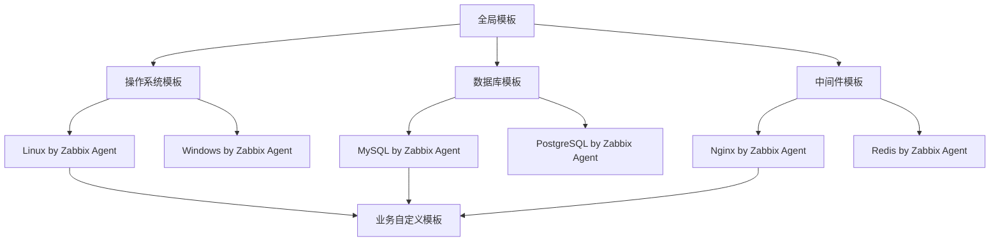
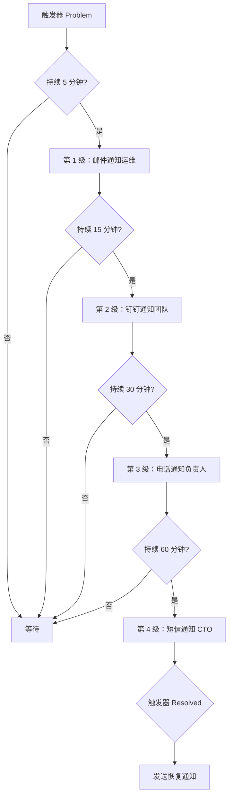
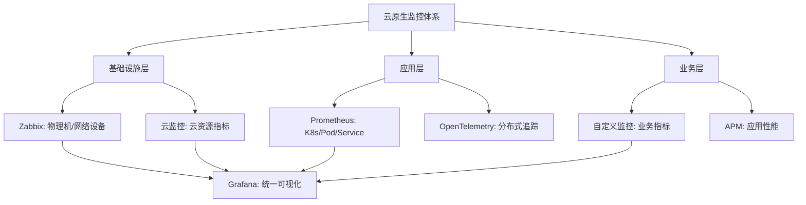
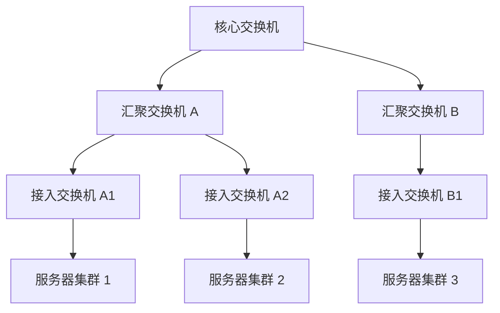

# Zabbix（传统监控系统 / 企业级告警平台）

> Zabbix 是**开源老牌企业级监控系统**（2001 年诞生，波兰团队维护），以「**主动/被动采集 + 触发器（Trigger）+ 事件告警 + 分布式监控（Proxy）**」覆盖服务器/网络/应用监控。相比 Prometheus（云原生/拉模型/标签）、Grafana（可视化层）、Nagios（脚本告警）、云监控（托管），Zabbix 以「**开箱即用的企业监控全栈（模板/告警/报表）+ 主动推送采集（穿 NAT）**」在传统运维环境仍是主力。本篇按「解决的问题 → 原理 → 对比 → 选型关注点」拆解。

---

## 一、要解决的问题

| 痛点 | 说明 |
|------|------|
| 监控缺失 | 服务器/网络/数据库状态不可见，故障后知后觉 |
| 告警泛滥 | 没有阈值/抑制/升级机制，告警轰炸被忽略 |
| 采集困难 | 内网/跨网段机器采集（防火墙/NAT） |
| 资产规模 | 上千台机器统一纳管（模板批量应用） |
| 报表/趋势 | 容量趋势、SLA 报表需要历史数据积累 |

> 核心认知：**Zabbix = 「监控四件套」**——数据采集（Agent/SNMP/主动）+ 触发器（阈值判断）+ 告警（动作/媒介）+ 展示（图形/报表），一个产品闭环。

---

## 二、核心原理

### 2.1 架构

```
Zabbix Server（中心）
  ├── 数据收集（被动轮询 + 主动 Trapper）
  ├── 触发器评估（表达式 → 问题/恢复）
  ├── 动作（告警：邮件/钉钉/微信/脚本）
  └── 数据存储（MySQL/PG）

Zabbix Proxy（分布式采集节点，可选）
  └── 机房/远程站点本地采集 → 上报中心（断网缓存）

Zabbix Agent（被监控端）
  ├── 被动模式：Server 轮询（默认，10050 端口）
  └── 主动模式：Agent 主动推送（Trapper，穿 NAT/防火墙）

前端 Web UI（配置/图形/报表/权限）
```

### 2.2 核心对象模型

| 对象 | 说明 |
|------|------|
| Host / Host Group | 主机/主机组（按业务/机房分组） |
| Item | 监控项（如 CPU 使用率，采集间隔） |
| Trigger | 触发器（表达式：`{host:item.last()}>90`） |
| Action | 动作（触发器触发 → 告警媒介/升级） |
| Template | 模板（一批 Item+Trigger 批量套用主机） |
| Discovery | 自动发现（网段扫描/自动注册纳管） |

### 2.3 对象模型深入（如何配置一台主机）

```
配置流程：
  ① 定义主机组（按业务线：订单组/支付组）
  ② 关联模板（Linux by Zabbix agent / MySQL by Zabbix agent）
     → 模板自动带来几十个 Item + 相关 Trigger + 图形
  ③ 调整关键 Item 采集间隔（CPU 10s，磁盘 60s）
  ④ 自定义 Trigger（业务指标：下单失败率 > 1%）
  ⑤ 配置 Action（触发条件 → 通知媒介/脚本）
  ⑥ 自动发现（新机器自动纳管，套用模板）

模板体系的价值：
  一次定义（Item+Trigger+Graph+Discovery Rule）→ 无限套用
  官方/社区 1000+ 模板（Linux/Windows/MySQL/Redis/Nginx/Docker...）
  生产建议：以官方模板为基线，按业务扩展自定义模板
```

### 2.4 采集方式

| 方式 | 协议/说明 | 适用 |
|------|-----------|------|
| Zabbix Agent | 自定义采集项（CPU/内存/磁盘/进程/日志） | 服务器（最常用） |
| SNMP | 网络设备（交换机/路由器/防火墙） | 网络监控 |
| IPMI | 硬件传感器（温度/电源） | 物理机 |
| JMX | Java 应用指标 | Java 中间件 |
| HTTP/数据库查询 | 站点可用性/业务指标 | 应用监控 |
| 主动 Trapper | Agent 主动推送 | 跨网段/NAT |
| 自定义脚本/SSH | 任意指标采集 | 特殊场景 |

### 2.5 告警机制

```
Trigger 表达式 → 事件（Problem/Resolved）
  → Action（条件匹配）→ 通知媒介（邮件/Webhook/钉钉/短信）
  → 升级（告警级别：信息/警告/严重/灾难；时间升级）
  → 确认/关闭（操作记录）
```

**选型关注点**：Zabbix 告警是「事件驱动 + 媒介插件化」——与 Prometheus Alertmanager 对等，但 Zabbix 还内置了「告警升级 + 确认 + 报表」。

### 2.6 Trigger 表达式深入

```
表达式构成：
  {主机:监控项.函数(参数)} 运算符 阈值
  函数：last() / avg(10m) / min / max / count / nodata() / change()
  运算符：= < > <= >= <>（数值）
 与或非组合：(A) and (B) or not (C)

常用模式：
  连续 N 次超阈值（去抖）：last(3) #3 > 90（最近 3 次均 >90）
  持续窗口超阈值：min(5m) > 90（5 分钟最小值 >90）
  数据缺失（采集失败）：nodata(5m)=1
  速率变化（异常增长）：change() > 30
  业务条件组合：(status=1) and (last(3)#3>90)

维护期（Maintenance）：
  变更/发布期间抑制告警（计划内维护不告警）
```

### 2.7 告警升级与收敛

```
告警升级（Escalation）：
  级别：信息 → 警告 → 严重 → 灾难
  时间升级：告警持续 10 分钟 → 升级到二级负责人
  → 电话/短信 vs 邮件分层

告警收敛（防轰炸）：
  ① 条件组合（多条件同时满足才触发）
  ② 维护期抑制（计划内变更不告警）
  ③ 聚合通知（同类告警合并成一条）
  ④ 恢复通知（Problem 自动恢复 → Resolved 通知）
  ⑤ 告警去重（同一 Trigger 短时间内不重复发）
```

---

## 三、核心特性

| 特性 | 说明 |
|------|------|
| 全栈监控 | 服务器/网络/存储/数据库/应用一体 |
| 模板体系 | 官方/社区 1000+ 模板（MySQL/Redis/Nginx...） |
| 主动采集 | 穿 NAT/防火墙（Agent 主动上报） |
| 分布式 | Proxy 级联（多机房统一纳管） |
| 告警升级 | 级别 + 时间升级 + 确认关闭 |
| 自动发现 | 网段扫描 + 自动注册（Agent 自动纳管） |
| 报表/SLA | 内置趋势报表/可用性报表 |
| 权限 | 用户组 + 主机组权限隔离 |
| 高可用 | Server 主备（HA）+ 数据库主从 |
| 自定义 | 脚本监控项（任意指标）+ 宏变量（模板参数化） |

### 3.1 宏变量（模板参数化）

```
宏 = 模板中的变量（{$NAME}），套用主机时替换
  内置宏：{$HOST.NAME} / {$IPADDRESS} / {HOSTNAME}
  自定义宏：{$MYSQL_PASSWORD} / {$PORT} / {$URL}

价值：
  同一模板套用到不同主机时差异化配置
  敏感信息（密码）放宏，避免硬编码
  示例：MySQL 监控模板用 {$MYSQL_USER} / {$MYSQL_PASSWORD} 宏
```

---

## 四、Zabbix vs Prometheus vs Grafana vs 云监控

| 维度 | Zabbix | Prometheus | Grafana | 云监控 |
|------|--------|------------|---------|--------|
| 定位 | 传统监控全栈 | 云原生指标采集 | 可视化（需数据源） | 云上托管监控 |
| 采集模型 | 主动+被动（Agent/SNMP） | 拉模型（Pull + 服务发现） | 不采集 | 云内自动采集 |
| 数据模型 | 主机+Item（树状） | 指标+标签（多维） | — | 资源+指标 |
| 告警 | 强（升级/确认/媒介） | 强（Alertmanager） | 中（面板告警） | 强 |
| 模板 | 强（1000+） | 中（exporter + 规则） | — | 云服务模板 |
| 云原生 | 弱（需手动纳管） | 强（K8s 原生） | 强 | 强 |
| 适用 | 传统机房/混合环境 | K8s/云原生 | 统一可视化 | 云上 |

### 4.1 协作模式（不是二选一）

```
最佳实践：
  Zabbix：物理机/网络/传统中间件（基础设施层）
  Prometheus：K8s/云原生应用（Pod/Service 指标）
  Grafana：统一可视化层（接 Zabbix + Prometheus 数据源）
  → 各司其职，互补共存

数据模型差异：
  Zabbix 树状（主机 → 监控项）：适合"这台机器的状态"
  Prometheus 标签（指标 + 多维标签）：适合"按维度聚合的云原生"
```

**选型关注点**：
- 传统机房/网络设备/物理机 → **Zabbix**（Agent/SNMP/IPMI 全支持）；
- 云原生/K8s → **Prometheus**（服务发现 + 标签）；
- 两者并存是常态：**Zabbix（基础设施）+ Prometheus（K8s/应用）+ Grafana（统一大盘）**；
- 云上快速 → **云监控**（免运维）。

---

## 五、生产实践

### 5.1 关键实践

| 实践 | 说明 |
|------|------|
| 模板先行 | 官方模板 + 自定义模板（基线/批量化） |
| 采集间隔 | 常规 30~60s；关键指标 10s（间隔越短库越大） |
| 触发器 | 多条件组合（如 连续 3 次超阈值）+ 抑制（维护期） |
| 数据保留 | 原始 30 天 + 趋势 1 年（分区表清理） |
| Proxy | 多机房用 Proxy 本地采集（断网不丢） |
| 告警分级 | 严重→电话/钉钉，警告→邮件；加告警收敛（聚合） |
| 数据库 | 独立 MySQL/PG + 主从（Server 元数据库） |

### 5.2 容量规划

```
数据量估算：
  每主机 100 Item × 采集间隔 60s = 每分钟 100 条 × 1000 主机
  → 日增千万级记录 → 数据库必须分区（按天）+
    housekeeping 自动清理（保留策略：原始/趋势分级）

Server 规模：
  1000 主机以下：单机 Server（8C/16G 够）
  1000+ 主机/高采集频率：Server + Proxy 分布式
  数据库：独立实例（避免与 Server 抢资源）
```

### 5.3 常见坑

- **告警轰炸**：触发器条件太敏感 + 无抑制 → 收敛（条件组合/时间窗口/维护期）；
- **被动模式穿墙失败**：跨网段必须主动模式（Trapper）；
- **历史数据膨胀**：无清理策略拖垮数据库（分区 + 自动清理）；
- **Server 单点**：必须 HA（主备 + 数据库主从），否则中心挂=监控盲区；
- **Agent 版本混杂**：Agent 与 Server 版本不匹配 → 统一版本升级；
- **采集频率过高**：10s 间隔 × 上千主机 → DB 打爆 → 分级频率（核心 10s，常规 60s）。

### 5.4 高可用架构

```
Zabbix 高可用：
  Server HA：双 Server 共享数据库（主动/被动切换）
    → 故障自动切换（VIP 或 DNS 切换）
  Proxy：多 Proxy 分担采集（机房级容灾）
  数据库：MySQL 主从 + 半同步复制
  → 前端 UI：负载均衡 + Session 共享（可多实例）

断网容错：
  Proxy 本地缓存（断网不丢数据，恢复后回传）
  Agent 主动模式（断连自动重连）
```

---

## 六、选型速查

| 需求 | 首选 | 备选 |
|------|------|------|
| 传统机房/物理机/网络 | Zabbix | Nagios（过时） |
| K8s/云原生 | Prometheus | 云监控 |
| 统一可视化大盘 | Grafana（接两者） | — |
| 云上托管 | 云监控 | Prometheus 托管版 |
| 多机房统一纳管 | Zabbix Proxy 级联 | — |
| 深度自定义采集 | Zabbix（脚本/宏） | Prometheus exporter |

### 6.1 决策树

```
传统机房（物理机/网络设备/SNMP）→ Zabbix
K8s/容器 → Prometheus
两者都有 → Zabbix + Prometheus + Grafana 统一
云上无运维团队 → 云监控
需要 SLA 报表/告警升级/确认流程 → Zabbix（企业流程）
```

---

## Zabbix 架构深入：Server / Proxy / Agent 全景

### 架构组件详解

```
┌─────────────────────────────────────────────────────────┐
│                    Zabbix Server                         │
│  ┌──────────┐  ┌──────────┐  ┌────────────────────┐    │
│  │ 调度器    │  │ 触发器   │  │ 事件管理器          │    │
│  │ Poller   │  │ Eval     │  │ Event Manager      │    │
│  └──────────┘  └──────────┘  └────────────────────┘    │
│  ┌──────────┐  ┌──────────┐  ┌────────────────────┐    │
│  │ Trapper  │  │ 自发现    │  │ 告警发送器          │    │
│  │ 接收端   │  │ Disc     │  │ Alerter            │    │
│  └──────────┘  └──────────┘  └────────────────────┘    │
│                      ↕                                  │
│              MySQL / PostgreSQL                          │
└─────────────────────────────────────────────────────────┘
          ↕ (主动/被动)          ↕ (主动/被动)
┌──────────────────┐    ┌──────────────────┐
│  Zabbix Proxy    │    │  Zabbix Proxy    │
│  (数据中心A)     │    │  (数据中心B)     │
│  ┌────────┐      │    │  ┌────────┐      │
│  │本地缓存│      │    │  │本地缓存│      │
│  └────────┘      │    │  └────────┘      │
└──────────────────┘    └──────────────────┘
      ↕ (10050/10051)         ↕
┌─────────────┐  ┌─────────────┐  ┌─────────────┐
│ Agent       │  │ Agent       │  │ Agent       │
│ (被监控主机)│  │ (被监控主机)│  │ (被监控主机)│
└─────────────┘  └─────────────┘  └─────────────┘
```

### Zabbix Agent 2 vs Agent 1 对比

| 维度 | Agent 1 | Agent 2 |
|------|---------|---------|
| 语言 | C | Go |
| 插件机制 | 无（编译时内置） | 无限插件架构（Go plugin） |
| 预处理 | 服务器端预处理 | 客户端预处理（减少 Server 压力） |
| 并发采集 | 单线程 | 原生并发（Go goroutine） |
| 内存占用 | ~10MB | ~30MB（但功能更强） |
| 支持协议 | Agent/SNMP/JMX | Agent/SNMP/JMX/HTTP/MySQL/PostgreSQL/Podman |
| 证书认证 | 无 | 支持 TLS 证书双向认证 |
| 可靠性 | 本地文件存储状态 | SQLite 存储状态（更可靠） |

### Agent 2 插件架构

```yaml
# agent2 配置示例（插件化）
Plugins:
  MySQL:
    Enabled: true
    DSN: "tcp(127.0.0.1:3306)/"
    Username: "zabbix"
    Password: "{$MYSQL_PASSWORD}"
  PostgreSQL:
    Enabled: true
    DSN: "host=127.0.0.1 port=5432 user=zabbix"
  HTTPAgent:
    Enabled: true
    Timeout: 5s
  MQTT:
    Enabled: true
    Broker: "tcp://127.0.0.1:1883"
```

---

## 模板系统与 LLD（Low Level Discovery）

### 模板层次体系



### LLD 低级发现原理

```
LLD 工作流程：
  ① 发现规则（Discovery Rule）→ 执行发现脚本/命令
  ② 返回 JSON 格式发现数据（Macros 变量）
  ③ 根据发现数据自动创建 Item + Trigger + Graph
  ④ 当新实体出现/消失时自动增删监控

LLD 发现类型：
  文件系统发现 → 自动监控每个分区
  网络接口发现 → 自动监控每张网卡
  Docker 容器发现 → 自动监控每个容器
  K8s Pod 发现 → 自动监控每个 Pod
  自定义发现 → 自定义脚本返回 JSON

LLD JSON 示例：
  {
    "data": [
      {"/{#DISK}": "/", "{#FSTYPE}": "ext4"},
      {"/{#DISK}": "/data", "{#FSTYPE}": "xfs"}
    ]
  }
```

### LLD 宏变量映射

| 宏 | 说明 | 示例 |
|----|------|------|
| `{#FSNAME}` | 文件系统名 | /, /data |
| `{#FSTYPE}` | 文件系统类型 | ext4, xfs |
| `{#IFNAME}` | 网络接口名 | eth0, eth1 |
| `{#CONTAINER}` | Docker 容器名 | nginx-abc123 |
| `{#PODNAME}` | K8s Pod 名 | web-7d4b8f |

---

## Zabbix Trigger 表达式深入

### 触发器函数详解

| 函数 | 说明 | 示例 |
|------|------|------|
| `last()` | 最近 N 次值 | `last(3)#3 > 90`（最近 3 次均超 90） |
| `avg()` | 时间窗口平均值 | `avg(5m) > 80`（5 分钟平均 >80） |
| `min()` | 时间窗口最小值 | `min(10m) < 10`（10 分钟最低 <10） |
| `max()` | 时间窗口最大值 | `max(3m) > 95`（3 分钟最高 >95） |
| `count()` | 时间窗口值计数 | `count(1h,100,"gt")`（1 小时内 >100 的次数） |
| `nodata()` | 数据缺失检测 | `nodata(5m)=1`（5 分钟无数据） |
| `change()` | 值变化检测 | `change(1h) > 0`（1 小时内有变化） |
| `diff()` | 与前值比较 | `diff()=1`（与上一值不同） |
| `band()` | 按位与 | `band(last(),1)=0`（最低位为 0） |
| `forecast()` | 趋势预测 | `forecast(1h,2h) > 100`（预测 2 小时后超 100） |

### 复杂触发器示例

```
# CPU 连续 3 次超 90% 且 5 分钟平均超 80%
{Host:system.cpu.util.avg(5m)}>80 and {Host:system.cpu.util.last(3)}>90

# 磁盘使用率 > 90% 且 inode 使用率 > 80%
{Host:vfs.fs.size[/,pused].last()}>90 and {Host:vfs.fs.inode[/,pused].last()}>80

# 网络流量突增（当前值 > 平均值 3 倍）
{Host:net.if.in[eth0].last()} > 3*{Host:net.if.in[eth0].avg(1h)}

# 数据库连接数超阈值 + 慢查询数突增
{DB:db.connections.active.last()}>500 and {DB:db.slow_queries.count(5m)}>10
```

---

## 告警升级（Escalation）机制



### 告警升级配置

| 步骤 | 时间 | 动作 | 媒介 |
|------|------|------|------|
| 1 | 立即 | 通知运维组 | 邮件 |
| 2 | 持续 10 分钟 | 升级到团队负责人 | 钉钉 |
| 3 | 持续 30 分钟 | 升级到部门经理 | 短信 + 邮件 |
| 4 | 持续 60 分钟 | 升级到 CTO | 电话 |
| 恢复 | 任意时刻 | 发送恢复通知 | 所有已通知媒介 |

---

## Zabbix Proxy 分布式监控

### Proxy 工作原理

```
Zabbix Proxy 核心机制：
  ① 代理采集：Proxy 代替 Server 采集 Agent 数据
  ② 本地缓存：断网时数据存本地磁盘（SQLite/MySQL）
  ③ 数据转发：网络恢复后批量回传 Server
  ④ 心跳机制：Proxy 定期向 Server 报告存活
  ⑤ 配置同步：Server 下发监控配置到 Proxy

部署模式：
  模式一：Proxy 仅采集（推荐，最常见）
  模式二：Proxy 采集 + 简单触发器评估（减少 Server 压力）

适用场景：
  跨机房/跨地域监控（带宽受限）
  大规模监控（分担 Server 采集压力）
  防火墙/NAT 穿透（Agent → Proxy → Server）
```

### Proxy 高可用

| 组件 | HA 方案 | 说明 |
|------|---------|------|
| Proxy | 主备 Proxy | 同一网段部署两个 Proxy，共享 Agent 列表 |
| Server | 主备 Server | 共享数据库，VIP 切换 |
| 数据库 | MySQL 主从 | 半同步复制，防止数据丢失 |
| 网络 | 多链路 | Proxy 到 Server 有备用网络路径 |

---

## Zabbix API 与自动化

### API 核心接口

```python
# Zabbix API 调用示例
import jsonrpc

# 认证
zabbix = jsonrpc.ServerProxy("http://zabbix-server/api_jsonrpc.php")
auth = zabbix.user.login("Admin", "zabbix")
# 返回: "xxxxxxxxxxxxxxxxxxxxxxxxxxxxxxxx"

# 获取主机列表
hosts = zabbix.host.get({
    "auth": auth,
    "params": {
        "output": ["hostid", "host", "name"],
        "selectInterfaces": ["ip"],
        "filter": {"status": 0}
    }
})

# 批量创建监控项
items = zabbix.item.create({
    "auth": auth,
    "params": {
        "hostid": "10001",
        "name": "CPU Load",
        "key_": "system.cpu.load[percpu,avg1]",
        "type": 0,  # 0=Zabbix Agent
        "value_type": 0,  # 0=浮点数
        "delay": "30s"
    }
})

# 导出模板
export = zabbix.configuration.export({
    "auth": auth,
    "params": {
        "format": "yaml",
        "options": {"templates": ["10001"]}
    }
})
```

### 自动化集成场景

| 场景 | 实现方式 |
|------|----------|
| 自动纳管新主机 | Zabbix Agent 自动注册 + API 批量关联模板 |
| 配置批量变更 | API 批量修改 Item/Trigger 参数 |
| 监控即代码 | API + Terraform/Ansible 实现监控配置版本化 |
| CMDB 联动 | API 拉取主机清单 → 自动创建/删除监控 |
| 告警自动工单 | Webhook 告警 → Jira/ServiceNow 自动创建工单 |

---

## 自定义 Item 采集

### 自定义 Key 配置

```bash
# Agent 配置文件（zabbix_agentd.conf）
UserParameter=mysql.connections[*],mysql -u$1 -p$2 -e "show status" 2>/dev/null | grep "Threads_connected" | awk '{print $$2}'
UserParameter=nginx.requests[*],curl -s "http://$1/nginx_status" | grep "accepts" | awk '{print $$3}'
UserParameter=docker.container.cpu[*],docker stats --no-stream --format "{{.CPUPerc}}" $1 | tr -d '%'
```

### 采集方式对比

| 方式 | 延迟 | 准确性 | 适用 |
|------|------|--------|------|
| Zabbix Agent（被动） | 秒级 | 高 | 常规监控 |
| Zabbix Agent（主动） | 秒级 | 高 | 跨网段/NAT |
| SNMP | 秒级 | 中 | 网络设备 |
| JMX Gateway | 秒级 | 高 | Java 应用 |
| HTTP Agent | 秒级 | 高 | REST API 指标 |
| 计算项 | 实时 | 高 | 派生指标 |
| 聚合项 | 实时 | 高 | 跨主机聚合 |

---

## Zabbix vs Prometheus vs Datadog 对比

| 维度 | Zabbix | Prometheus | Datadog |
|------|--------|------------|---------|
| 部署模式 | 自建（Server+Agent+DB） | 自建（Server+Agent） | SaaS（免运维） |
| 数据模型 | 主机+Item（树状） | 指标+标签（多维） | 指标+标签（多维） |
| 采集模型 | 主动推送+被动拉取 | Pull（拉模型） | Agent 推送 |
| 存储 | MySQL/PG（关系型） | 本地 TSDB（时间序列） | 云端 TSDB |
| 查询语言 | 函数表达式 | PromQL | DQL（私有） |
| 告警 | 升级/确认/媒介 | Alertmanager | 内置告警 |
| 可视化 | 内置 Web UI | Grafana | 内置 Dashboard |
| 云原生 | 弱 | 强（K8s 原生） | 强（多云） |
| 成本 | 开源免费（运维成本） | 开源免费（运维成本） | 按主机计费（$15+/主机/月） |
| 扩展性 | Proxy 分布式 | Federation/远程写 | 自动扩展 |

### 成本估算对比

```
1000 台主机监控年成本估算：
  Zabbix（自建）：
    服务器：2 台 Server + 1 台 DB = ¥5 万/年
    运维人力：1 人 × 20% = ¥5 万/年
    总计：~¥10 万/年

  Prometheus（自建）：
    服务器：3 台（HA）= ¥8 万/年
    运维人力：1 人 × 20% = ¥5 万/年
    总计：~¥13 万/年

  Datadog（SaaS）：
    1000 主机 × $15/月 × 12 = $180,000/年 ≈ ¥130 万/年

  结论：
    小规模（<100 台）→ Datadog 最省心
    中大规模（>500 台）→ Zabbix/Prometheus 自建更经济
    混合环境 → Zabbix（基础设施）+ Prometheus（云原生）
```

---

## 生产部署容量规划

### Server 规格推荐

| 监控规模 | Server 配置 | DB 配置 | Proxy 数量 |
|----------|-------------|---------|------------|
| <500 主机 | 4C/8G | 4C/8G | 0 |
| 500~2000 主机 | 8C/16G | 8C/16G（独立） | 1~2 |
| 2000~10000 主机 | 16C/32G | 16C/32G（主从） | 3~5 |
| >10000 主机 | 32C/64G（集群） | 32C/64G（集群） | 5+ |

### 数据量估算

```
数据量计算公式：
  每天数据量 = 主机数 × Item数 × (86400/采集间隔) × 每条大小(~100B)

示例（1000 主机，每主机 100 Item，60s 间隔）：
  = 1000 × 100 × (86400/60) × 100B
  = 1000 × 100 × 1440 × 100B
  ≈ 14.4 GB/天（原始数据）

清理策略：
  原始数据：保留 30 天 → ~432 GB
  趋势数据（每小时聚合）：保留 1 年 → ~5 GB
  快照数据：保留 30 天 → 较小
  → 总存储需求：~500 GB（需分区表 + 自动清理）
```

---

## Zabbix 在云原生监控中的定位



### Zabbix 云原生集成方案

| 方案 | 说明 | 适用 |
|------|------|------|
| Zabbix Agent 2 on K8s | DaemonSet 部署 Agent 2 | K8s 节点+容器监控 |
| Zabbix + Prometheus Exporter | Zabbix 采集 Prometheus 指标 | 混合环境过渡 |
| Zabbix + 云 API | 直接调用云 API 采集云资源 | 深度云资源监控 |
| Zabbix + OpenTelemetry | OTel Collector 转发到 Zabbix | 统一可观测性 |

---

## Zabbix Proxy 数据同步机制

### cached 与 unsynced 模式

| 模式 | 行为 | 适用场景 |
|------|------|----------|
| synced（默认） | Proxy 启动后从 Server 拉取完整配置，缓存本地 | 正常运行，配置一致性要求高 |
| cached（缓存模式） | 首次同步后缓存配置，定期增量同步 | 大规模 Proxy（万级监控项），减少 Server 压力 |
| unsynced | Proxy 不从 Server 拉取配置，依赖本地配置 | 断网/隔离环境，手动维护配置 |

```
Proxy 同步流程：
  ① Proxy 启动 → 向 Server 请求配置（full sync）
  ② Server 响应 → 返回 Item/Trigger/Host 清单
  ③ Proxy 本地缓存（SQLite/MySQL）
  ④ 定期心跳（默认 10s）→ 增量同步变更
  ⑤ 断网时使用本地缓存，恢复后自动回传

性能优化：
  ProxyCacheSize 控制缓存上限（默认 64MB）
  CacheUpdateFrequency 控制同步频率（默认 60s）
  大规模场景建议用 cached 模式 + MySQL 后端
```

### Proxy 数据回传策略

| 策略 | 配置 | 说明 |
|------|------|------|
| 即时回传 | 默认（数据产生即推送） | 实时性好，带宽占用高 |
| 批量回传 | ProxyLocalBuffer=300s | 数据本地攒 5 分钟批量推送 |
| 断网回传 | 断网期间缓存，恢复后按 FIFO 回传 | 保证数据不丢，但有延迟 |
| 压缩回传 | ProxyConfigFrequency + Gzip | 配置同步时压缩，减少带宽 |

## LLD 规则高级用法

### LLD 依赖与条件过滤

```yaml
# LLD 依赖规则：仅当父规则发现实例时才执行子规则
Discovery Rules:
  Disk Discovery:
    Key: vfs.fs.discovery
    Dependent Item: false
  Disk IOPS (依赖磁盘发现):
    Key: vfs.fs.iops[{#DISK}]
    Type: Dependent
    Master Item: vfs.fs.discovery
    LLD Filter: {$DISK_IGNORE}  # 正则过滤

# LLD 正则过滤（排除系统盘、过滤容器卷）
LLD Filters:
  - {$DISK_FILTER}: /.+\/(docker|kubelet|overlay).+/
  - {$NET_FILTER}: /^lo$|^docker[0-9]+|^br-|^veth/
```

### LLD 宏变量高级用法

| 宏类型 | 语法 | 用途 |
|--------|------|------|
| 常量宏 | `{$MACRO_NAME}` | 模板级常量（阈值/端口） |
| 主机宏 | `{HOST.NAME}` | 引用主机属性 |
| LLD 宏 | `{#DISK}` | 发现实例变量 |
| 正则宏 | `{#REGEXP:pattern}` | 从实例名提取子串 |
| 自定义宏 | `{$USER_MACRO}` | 用户定义的模板参数 |

```
LLD 宏提取子串示例：
  实例名：/data/mysql/binlog
  正则宏：{#REGEXP:/\/(\w+)\/\w+$/}
  提取结果：mysql → 可用于创建按库分组的监控项
```

### LLD 规则最佳实践

| 实践 | 说明 |
|------|------|
| 过滤无用实例 | 排除系统盘、容器临时卷 |
| 按业务分组 | 利用 LLD 宏创建主机组/标签 |
| 限制发现数量 | 最大 10,000 条（防 OOM） |
| 预处理链 | 在 Agent 2 端预处理 LLD JSON（过滤/排序） |
| 定期执行 | Discovery Interval 设为 1~6 小时 |

## Zabbix 自定义监控项（UserParameter / ExternalCheck）

### UserParameter 配置

```bash
# zabbix_agentd.conf 配置
# 语法：UserParameter=key[*],command

# 基础示例
UserParameter=nginx.active,ss -s | awk '/^Active/{print $2}'

# 带参数（$1,$2 引用参数）
UserParameter=mysql.connections[*],mysql -u$1 -p$2 -e "SHOW STATUS" 2>/dev/null | grep "Threads_connected" | awk '{print $$2}'

# 脚本型（复杂逻辑推荐）
UserParameter=custom.healthcheck[*],/etc/zabbix/scripts/healthcheck.sh $1 $2

# 安全配置（限制执行目录）
# UnsafeUserParameters=0  # 默认关闭
# AllowKey=system.run[*]  # 白名单执行命令
```

### ExternalCheck 方式

| 方式 | 延迟 | 安全性 | 适用 |
|------|------|--------|------|
| UserParameter（Agent 内） | 低（Agent 进程内执行） | 中（需审计脚本） | 高频采集 |
| ExternalCheck（独立进程） | 高（启动进程开销） | 高（隔离执行） | 低频/高危脚本 |
| HTTPAgent（HTTP 接口） | 低 | 高（标准 HTTP） | REST API 指标 |
| Script Item（Agent 2） | 低 | 中 | Agent 2 专用脚本 |

### 自定义监控项模板

```yaml
# 模板：自定义应用健康检查
Template: App Health Check
Items:
  - Name: HTTP Status Code
    Key: http.status[{$APP_URL}]
    Type: HTTPAgent
    Interval: 30s
    Preprocessing:
      - Type: JSONPath
        Parameters: $.status_code

  - Name: Response Time
    Key: http.rtt[{$APP_URL}]
    Type: HTTPAgent
    Interval: 30s
    ValueType: Numeric (float)

  - Name: Process Memory
    Key: proc.mem[{$PROCESS_NAME}]
    Type: Zabbix Agent
    Interval: 60s

Triggers:
  - Name: HTTP Error Rate > 5%
    Expression: avg(/App Health Check/http.status[{$APP_URL}],5m,"regexp:^[45]") > 0.05
    Severity: High

  - Name: Response Time > 2s
    Expression: avg(/App Health Check/http.rtt[{$APP_URL}],3m) > 2000
    Severity: Warning
```

## Zabbix 仪表板设计最佳实践

### 网络拓扑图（Network Map）



| Map 要素 | 说明 |
|----------|------|
| 元素 | 主机/主机组/图片/链接/文本 |
| 连线 | 表示拓扑关系（网络/逻辑/依赖） |
| 图标状态 | 绿=正常，黄=警告，红=故障，灰=未知 |
| 钻取 | 点击元素跳转到主机图形/触发器 |
| 更新间隔 | 30s~5min（与采集频率匹配） |

### 仪表板布局设计

```
Dashboard 布局原则：
  ┌──────────────────────────────────────┐
  │ 第一行：全局概览（问题数/告警趋势/可用率） │
  ├──────────────────────────────────────┤
  │ 第二行：分组状态（按业务/机房分组主机状态） │
  ├──────────────────────────────────────┤
  │ 第三行：详细指标（关键主机 TopN）          │
  ├──────────────────────────────────────┤
  │ 第四行：趋势图（7天/30天历史趋势）        │
  └──────────────────────────────────────┘

Widget 类型：
  Global View：问题计数、可用率汇总
  Problem Hosts：当前有告警的主机列表
  Top Hosts：按指标排名的 TopN 主机
  Graph：关键指标趋势图
  Pie Chart：资源分布（按状态/类型）
  Host Navigator：按主机组快速筛选
```

### 仪表板优化要点

| 要点 | 说明 |
|------|------|
| 分层设计 | 管理层看全局，运维看详情 |
| 响应式布局 | 自适应不同屏幕（1920/2560） |
| 数据时效 | 趋势图 7 天/30 天，实时图 1 小时 |
| 权限隔离 | 按用户组可见不同仪表板 |
| 共享与复用 | 模板化仪表板，按团队定制 |
| 交互钻取 | 图表 → 主机 → 触发器 → 日志 |

## Zabbix 容量规划

### 主机数/监控项/触发器估算

```
容量规划公式：
  监控项总数 = 主机数 × 每主机平均 Item 数
  触发器总数 = 监控项总数 × 触发器/Item 比（约 0.3~0.5）
  每日数据量 = 监控项总数 × (86400/采集间隔) × 100B

示例：
  5000 主机，每主机 150 Item，60s 间隔
  = 5000 × 150 × 1440 × 100B
  = 108 GB/天（原始数据）
  = 3.24 TB/30 天（需分区表 + 自动清理）
```

### Server 规格选型

| 监控规模 | 主机数 | Item 数 | Server 配置 | DB 配置 | Proxy 数 |
|----------|--------|---------|-------------|---------|----------|
| 小型 | <500 | <75K | 4C/8G | 4C/8G | 0 |
| 中型 | 500~2K | 75K~300K | 8C/16G | 8C/16G（独立） | 1~2 |
| 大型 | 2K~10K | 300K~1.5M | 16C/32G | 16C/32G（主从） | 3~5 |
| 超大 | >10K | >1.5M | 32C/64G（集群） | 32C/64G（集群） | 5+ |

### 性能调优参数

```
Server 端调优：
  CacheSize=2G              # 元数据缓存（默认 8MB 太小）
  HistoryCacheSize=1G       # 历史数据缓存
  TrendCacheSize=256M       # 趋势缓存
  ValueCacheSize=256M       # 值缓存
  StartPollers=50           # 被动采集进程数
  StartPingers=5            # 主动探测进程数

DB 端调优：
  innodb_buffer_pool_size=服务器内存 60%
  innodb_log_file_size=1G
  innodb_flush_log_at_trx_commit=2  # 性能优先
  innodb_flush_method=O_DIRECT
  分区表：按天分区原始数据表

Housekeeping 配置：
  原始数据保留：30 天
  趋势数据保留：1 年
  快照数据保留：30 天
  自动清理任务：每天凌晨执行
```

## Zabbix 5.x → 6.x → 7.x 升级要点

### 版本演进

| 版本 | 发布年份 | 核心特性 | 注意事项 |
|------|----------|----------|----------|
| 5.0 LTS | 2020 | Agent 2、原生容器支持 | LTS 版本，稳定首选 |
| 5.4 | 2021 | Tag 系统、预处理增强 | 过渡版本 |
| 6.0 LTS | 2021 | 单一二进制、动态指标、服务端告警 | LTS，推荐升级目标 |
| 6.2 | 2022 | 标签继承、LLD 增强 | 小版本升级 |
| 6.4 | 2022 | UI 重构、性能提升 | 推荐版本 |
| 7.0 LTS | 2024 | 原生 Prometheus 协议、AI 辅助诊断 | 最新 LTS |

### 升级路径

```
推荐升级路径：
  5.0 LTS → 5.4 → 6.0 LTS → 6.4 → 7.0 LTS
  （不支持跳版本升级）

升级前准备：
  ① 备份数据库（mysqldump/pg_dump）
  ② 备份配置（Zabbix 配置导出为 YAML）
  ③ 测试环境验证（副本环境先升级）
  ④ Agent 版本兼容性检查（Agent 2 向后兼容）

升级后验证：
  ① 数据采集恢复（Item 有新数据）
  ② 触发器正常评估
  ③ 告警动作正常发送
  ④ API 接口兼容性
  ⑤ UI 功能正常
```

### 7.x 新特性速览

| 特性 | 说明 |
|------|------|
| Prometheus 协议 | 直接抓取 Prometheus exporter（/metrics） |
| AI 辅助诊断 | 自动分析告警根因（实验性） |
| 原生 OpenTelemetry | 支持 OTLP 协议接收 trace/metrics |
| 增强 Tag 系统 | 标签支持批量操作、继承、过滤 |
| 容器化部署 | 官方 Helm Chart + Operator |

---

## 七、Zabbix Proxy 数据同步机制（cached/unsynced）

### 7.1 Proxy 同步模式

| 模式 | 行为 | 适用场景 |
|------|------|----------|
| synced（默认） | Proxy 启动后从 Server 拉取完整配置 | 正常运行，配置一致性要求高 |
| cached（缓存模式） | 首次同步后缓存配置，定期增量同步 | 大规模 Proxy，减少 Server 压力 |
| unsynced | Proxy 不从 Server 拉取配置，依赖本地配置 | 断网/隔离环境，手动维护配置 |

### 7.2 Proxy 数据回传策略

| 策略 | 配置 | 说明 |
|------|------|------|
| 即时回传 | 默认 | 实时性好，带宽占用高 |
| 批量回传 | ProxyLocalBuffer=300s | 数据本地攒 5 分钟批量推送 |
| 断网回传 | 断网期间缓存，恢复后按 FIFO 回传 | 保证数据不丢，但有延迟 |

## 八、LLD 规则高级用法（依赖/正则过滤/宏覆盖）

### 8.1 LLD 依赖规则

```yaml
# LLD 依赖规则：仅当父规则发现实例时才执行子规则
Discovery Rules:
  Disk Discovery:
    Key: vfs.fs.discovery
    Dependent Item: false
  Disk IOPS (依赖磁盘发现):
    Key: vfs.fs.iops[{#DISK}]
    Type: Dependent
    Master Item: vfs.fs.discovery
    LLD Filter: {$DISK_IGNORE}
```

### 8.2 LLD 正则过滤

```yaml
# LLD 正则过滤（排除系统盘、过滤容器卷）
LLD Filters:
  - {$DISK_FILTER}: /.+\/(docker|kubelet|overlay).+/
  - {$NET_FILTER}: /^lo$|^docker[0-9]+|^br-|^veth/
```

### 8.3 LLD 宏变量高级用法

| 宏类型 | 语法 | 用途 |
|--------|------|------|
| 常量宏 | `{$MACRO_NAME}` | 模板级常量（阈值/端口） |
| 主机宏 | `{HOST.NAME}` | 引用主机属性 |
| LLD 宏 | `{#DISK}` | 发现实例变量 |
| 正则宏 | `{#REGEXP:pattern}` | 从实例名提取子串 |

## 九、自定义监控项（UserParameter/HTTP agent）

### 9.1 UserParameter 配置

```bash
# 基础示例
UserParameter=nginx.active,ss -s | awk '/^Active/{print $2}'

# 带参数
UserParameter=mysql.connections[*],mysql -u$1 -p$2 -e "SHOW STATUS" 2>/dev/null | grep "Threads_connected" | awk '{print $$2}'

# 脚本型（复杂逻辑推荐）
UserParameter=custom.healthcheck[*],/etc/zabbix/scripts/healthcheck.sh $1 $2
```

### 9.2 HTTP Agent 方式

| 方式 | 延迟 | 安全性 | 适用 |
|------|------|--------|------|
| UserParameter（Agent 内） | 低 | 中 | 高频采集 |
| ExternalCheck（独立进程） | 高 | 高 | 低频/高危脚本 |
| HTTPAgent（HTTP 接口） | 低 | 高 | REST API 指标 |

## 十、仪表板设计最佳实践

### 10.1 仪表板布局设计

```
Dashboard 布局原则：
  ┌──────────────────────────────────────┐
  │ 第一行：全局概览（问题数/告警趋势/可用率） │
  ├──────────────────────────────────────┤
  │ 第二行：分组状态（按业务/机房分组主机状态） │
  ├──────────────────────────────────────┤
  │ 第三行：详细指标（关键主机 TopN）          │
  ├──────────────────────────────────────┤
  │ 第四行：趋势图（7天/30天历史趋势）        │
  └──────────────────────────────────────┘

Widget 类型：
  Global View：问题计数、可用率汇总
  Problem Hosts：当前有告警的主机列表
  Top Hosts：按指标排名的 TopN 主机
  Graph：关键指标趋势图
  Pie Chart：资源分布（按状态/类型）
  Host Navigator：按主机组快速筛选
```

### 10.2 仪表板优化要点

| 要点 | 说明 |
|------|------|
| 分层设计 | 管理层看全局，运维看详情 |
| 响应式布局 | 自适应不同屏幕 |
| 数据时效 | 趋势图 7 天/30 天，实时图 1 小时 |
| 权限隔离 | 按用户组可见不同仪表板 |
| 共享与复用 | 模板化仪表板，按团队定制 |

## 十一、容量规划估算（主机数×监控项×采集间隔）

### 11.1 容量规划公式

```
数据量计算公式：
  每天数据量 = 主机数 × Item数 × (86400/采集间隔) × 每条大小(~100B)

示例（1000 主机，每主机 100 Item，60s 间隔）：
  = 1000 × 100 × 1440 × 100B
  ≈ 14.4 GB/天（原始数据）
  = 432 GB/30 天（需分区表 + 自动清理）
```

### 11.2 Server 规格选型

| 监控规模 | 主机数 | Item 数 | Server 配置 | DB 配置 |
|----------|--------|---------|-------------|---------|
| 小型 | <500 | <75K | 4C/8G | 4C/8G |
| 中型 | 500~2K | 75K~300K | 8C/16G | 8C/16G（独立） |
| 大型 | 2K~10K | 300K~1.5M | 16C/32G | 16C/32G（主从） |
| 超大 | >10K | >1.5M | 32C/64G（集群） | 32C/64G（集群） |

## 十二、Zabbix 5.x→6.x→7.x 升级要点

### 12.1 版本演进

| 版本 | 发布年份 | 核心特性 | 注意事项 |
|------|----------|----------|----------|
| 5.0 LTS | 2020 | Agent 2、原生容器支持 | LTS 版本，稳定首选 |
| 5.4 | 2021 | Tag 系统、预处理增强 | 过渡版本 |
| 6.0 LTS | 2021 | 单一二进制、动态指标 | LTS，推荐升级目标 |
| 6.4 | 2022 | UI 重构、性能提升 | 推荐版本 |
| 7.0 LTS | 2024 | 原生 Prometheus 协议 | 最新 LTS |

### 12.2 升级路径

```
推荐升级路径：
  5.0 LTS → 5.4 → 6.0 LTS → 6.4 → 7.0 LTS
  （不支持跳版本升级）

升级前准备：
  ① 备份数据库（mysqldump/pg_dump）
  ② 备份配置（Zabbix 配置导出为 YAML）
  ③ 测试环境验证（副本环境先升级）
  ④ Agent 版本兼容性检查
```

## 七、与其他板块的关系

- 云原生监控对比见「[Prometheus 与 Grafana 监控](./Prometheus与Grafana监控.md)」；
- 可观测性标准见「[OpenTelemetry](./OpenTelemetry.md)」；
- 日志体系见「[ELK 日志体系](./ELK日志体系.md)」「[Loki](./Loki.md)」；
- 云上监控见「[云上可观测性体系](./云上可观测性体系.md)」。

## Zabbix Proxy 同步与分布式监控

```
Zabbix Proxy 架构：

  ┌─────────────────────┐
  │     Zabbix Server   │
  └──────────┬──────────┘
             │
  ┌──────────┴──────────┐
  │     Proxy 1         │     Proxy 2
  │  ┌──────────────┐   │   ┌──────────────┐
  │  │ Agent (A)    │   │   │ Agent (C)    │
  │  │ Agent (B)    │   │   │ Agent (D)    │
  │  └──────────────┘   │   └──────────────┘
  └─────────────────────┘

  Proxy 类型：
    ├── 普通 Proxy（默认）
    │     └── 本地缓存，断网可继续采集
    └── 自动发现 Proxy
          └── 动态发现 Agent

  同步模式：
    ├── 主动模式：Proxy 主动拉取 Server 配置
    └── 被动模式：Server 主动推送配置

  断网保护：
    ├── Proxy 本地缓存（SQLite / MySQL）
    ├── 数据保留时间可配置
    └── 恢复后自动同步
```

```bash
# Proxy 配置
ProxyMode=0                    # 0=主动, 1=被动
Server=zabbix-server
Hostname=Proxy-1
DBName=/var/lib/zabbix/proxy.sqlite3
CacheSize=128M
HistoryCacheSize=64M
# 断网数据保留
ProxyLocalBuffer=12            # 本地保留 12 小时
ProxyOfflineBuffer=24          # 断网保留 24 小时
```

## Zabbix LLD（Low-Level Discovery）详解

```
LLD 自动发现流程：

  ① 定义发现规则
     └── Key: vfs.fs.discovery / net.if.discovery

  ② 执行发现
     └── Agent 返回 JSON 格式发现数据

  ③ 创建监控项原型
     └── vfs.fs.size[{#FSNAME},used]

  ④ 创建触发器原型
     └── vfs.fs.size[{#FSNAME},used] > 80%

  ⑤ 自动创建监控项/触发器

  支持类型：
    ├── 文件系统发现
    ├── 网络接口发现
    ├── SNMP OID 发现
    ├── HTTP Agent 发现
    └── 自定义 Key 发现
```

```bash
# Agent 自定义发现
UserParameter=custom.discovery[*],/etc/zabbix/scripts/discovery_$1.sh

# discovery_fs.sh
#!/bin/bash
echo '{"data":['
first=1
for fs in $(df -h | awk 'NR>1{print $6}'); do
    [ $first -eq 0 ] && echo ","
    echo "{\"{#FSNAME}\":\"$fs\"}"
    first=0
done
echo ']}'

# Discovery 网络接口
net.if.discovery
# 返回：{"data":[{"{#IFNAME}":"eth0"},{"{#IFNAME}":"lo"}]}

# 使用宏
net.if.in[{#IFNAME}]
net.if.out[{#IFNAME}]
```

## Zabbix 自定义监控项进阶

```bash
# /etc/zabbix/zabbix_agentd.d/custom.conf

# 检查端口是否存活
UserParameter=net.tcp.port[*],nc -z -w $1 $2 $3; echo $?

# 检查进程数
UserParameter=proc.num[*],ps aux | grep $1 | grep -v grep | wc -l

# 获取 JVM 堆内存
UserParameter=jvm.heap.used[*],jcmd $1 GC.heap_info | grep "Heap Usage" -A 2 | grep "used" | awk '{print $3}'

# 获取 MySQL 查询数
UserParameter=mysql.queries[*],mysql -h $1 -u $2 -p$3 -e "SHOW GLOBAL STATUS LIKE 'Queries'" | awk '/Queries/{print $2}'

# 依赖项（确保服务先启动）
# Zabbix Server 配置：
# Dependency=service.running
```

## Zabbix Dashboard 设计最佳实践

```
Dashboard 分层设计：

  总览层（Overview）
    ├── 服务可用性 SLA
    ├── 告警数量趋势
    └── 关键业务指标

  服务层（Service）
    ├── 各服务响应时间
    ├── 错误率
    └── 资源使用率

  基础设施层（Infrastructure）
    ├── CPU/内存/磁盘/网络
    ├── JVM/GC 指标
    └── 连接池状态

  业务层（Business）
    ├── 订单量/交易额
    ├── 用户在线数
    └── 核心业务指标
```

```yaml
# Dashboard JSON 示例
{
  "name": "Production Overview",
  "pages": [
    {
      "name": "Overview",
      "widgets": [
        {
          "type": "problem_hosts",
          "name": "Problem Hosts"
        },
        {
          "type": "problems",
          "name": "Active Problems"
        },
        {
          "type": "top_hosts",
          "name": "Top CPU Users"
        }
      ]
    }
  ]
}
```

## Zabbix 容量规划

| 节点类型 | 规格建议 | 适用规模 |
|----------|---------|---------|
| Zabbix Server | 8C/16G/100G SSD | 10000+ 主机 |
| Database | 16C/64G/500G SSD | 10000+ 主机 |
| Proxy | 4C/8G/50G SSD | 每 Proxy 1000+ Agent |
| Frontend | 4C/8G | Web UI |

```
容量规划公式：

  Server CPU = (主机数 × 监控项数 × 采集频率) / 基准值
  Database 存储 = 主机数 × 监控项数 × 数据点 × 保留天数 × 压缩比
  内存 = 活跃主机数 × 5MB + 历史缓存 + 趋势缓存

  示例：
    10000 主机 × 100 项 × 60s 采集
    → 10000 × 100 × 1440 = 14.4 亿数据点/天
    → 压缩后约 50GB/天
    → 30 天保留 = 1.5TB
```

## Zabbix 5.x → 6.x → 7.x 升级要点

| 版本 | 关键变化 | 升级建议 |
|------|---------|---------|
| 5.0→6.0 | 原生 HA、Tag 管理、新 UI | 测试环境验证 |
| 6.0→6.4 | 增强发现、新 Agent | 备份数据库 |
| 6.4→7.0 | 原生 OTLP、新模板 | 全面测试 |

```
升级步骤：
  1. 备份数据库和配置
  2. 升级 Zabbix Server
  3. 升级 Proxy（逐个）
  4. 升级 Agent
  5. 更新模板
  6. 验证监控数据
```

> 一句话：**Zabbix = 采集（Agent/SNMP/主动）+ 触发器（阈值）+ 告警（升级/媒介）+ 报表——传统企业监控闭环；选型先看「环境（传统机房→Zabbix，云原生→Prometheus）」，再定「部署（多机房→Proxy 级联 + Server HA）」，最后配「模板批量 + 告警收敛 + 分级采集频率 + 数据保留策略」**。