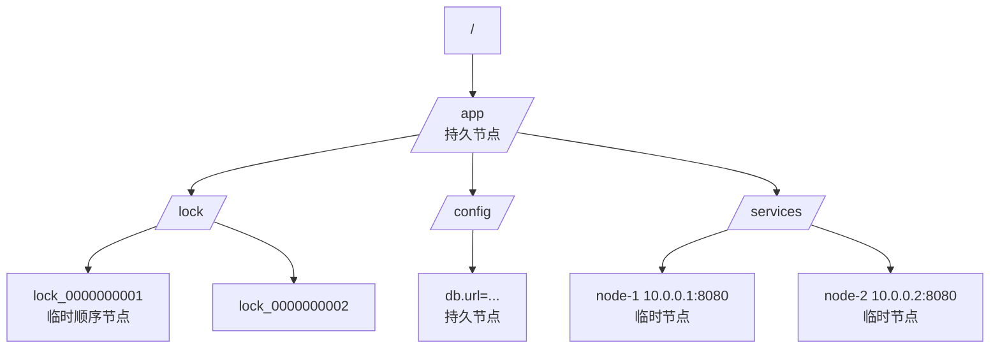
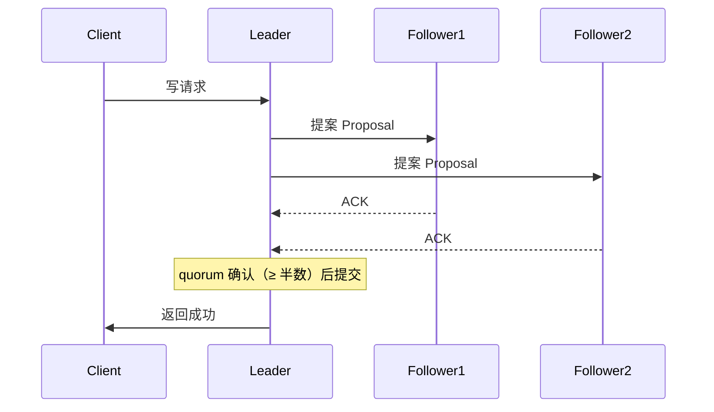
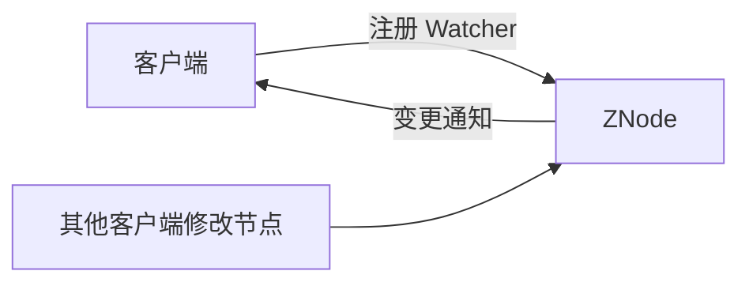

# ZooKeeper（分布式协调服务）

> 分布式系统「协调层」的老牌王者：分布式锁、选举、元数据、命名服务全靠它。本文讲透 ZAB 协议、节点与会话、Watcher 机制、典型场景与生产坑；与「源码系列/zookeeper」互补（那边偏源码与面试题）。
> 开源参考：[apache/zookeeper](https://github.com/apache/zookeeper)（Java，Apache 2.0，Hadoop 生态的分布式协调底座）。

---

## 〇、本体介绍（它是什么 / 适用场景 / 核心概念）

**它是什么**：ZooKeeper 是 Apache 的**分布式协调服务**，提供「强一致（CP）的共享存储 + 通知机制」，是所有需要「选主、锁、元数据协调」的分布式系统的地基。

**解决什么痛点**：多节点之间怎么互斥（分布式锁）、谁来当 Leader（选举）、配置/元数据怎么让大家看到同一个版本（共享存储 + Watcher 通知）、服务地址怎么注册发现（临时节点）。

**核心概念**：ZNode（数据节点，树形）、临时节点/持久节点/顺序节点、Session 会话（心跳）、Watcher 监听、ZAB 协议（ZooKeeper Atomic Broadcast）、Leader 选举、ACL 权限、Zxid 事务 ID、follower/observer 角色。

**适用场景**：分布式锁、Leader 选举、元数据存储（Kafka 老版本）、配置/命名服务、协调协调者。
**不适用**：大数据量存储（KV 替代：etcd/Redis）、高吞吐配置下发（Apollo/Nacos 更好）、替代业务数据库。

---

## 一、数据模型与节点类型

ZooKeeper 的数据结构是**一棵树**，节点叫 **ZNode**：



| 节点类型 | 特点 | 典型用途 |
|----------|------|----------|
| **持久节点** | 创建后一直存在，需显式删除 | 配置、元数据、常驻注册信息 |
| **临时节点** | 会话结束自动删除 | 服务注册、Leader 占位、锁 |
| **顺序节点** | 创建时自动追加单调递增序号 | 分布式锁排队、选举编号 |

> 灵魂设计：**临时节点 + 会话**——客户端崩了会话断开，临时节点自动消失，协调状态不会残留（这是比「手写心跳」可靠的原因）。

---

## 二、ZAB 协议与一致性（面试核心）

### 2.1 ZAB 是什么

ZAB（ZooKeeper Atomic Broadcast）是 ZK 自研的**崩溃恢复 + 原子广播**协议，保证**写操作全局有序、强一致**（CP）：

1. **Leader 选举**：集群启动或 Leader 挂掉时，通过投票选出新 Leader（比较 Zxid + 节点 id）。
2. **恢复阶段**：新 Leader 与其他节点同步未提交的事务（保证不丢已确认写）。
3. **广播阶段（两阶段）**：写请求由 Leader 广播（提案），**超过半数（quorum）节点确认**才提交并响应客户端。



### 2.2 一致性级别

- **顺序一致性**：所有节点看到的写顺序一致（全局 Zxid 有序）。
- **强一致读**：读也走 Leader 或 `sync` 请求，保证读到最新（Follower 读可能读到旧数据——ZK 是「线性写 + 最终一致读」的折中，严格讲是顺序一致性 + 读优化）。

### 2.3 CAP 取舍

ZK 是 **CP**：网络分区时，少数派节点无法形成 quorum，写被拒绝（宁可不可用，不可不一致）。这也决定了它不适合做「可用性优先」的服务发现（AP 型用 Nacos/Eureka）。

---

## 三、Watcher 机制（监听通知）

- 客户端对节点注册 `Watcher`，节点**数据变更/删除/子节点变化**时，服务端**一次性推送**通知。
- 关键：Watcher 是**一次性的**（触发后失效，需重新注册）——这是面试常考点，也常在生产里踩坑（忘了重注册导致监听失效）。
- 用途：配置变更实时感知、服务上下线感知、Leader 变更感知。



---

## 四、经典场景（必须会写）

### 4.1 分布式锁（临时顺序节点 + Watcher）

```text
1. 客户端在 /lock 下创建「临时顺序节点」：/lock/lock_0000000001
2. 获取 /lock 下所有子节点，判断自己是否最小
3. 是最小 → 拿到锁，执行业务
4. 不是最小 → 监听「前一个节点」，前一个删除（释放锁）时唤醒重新判断
5. 业务完成 → 删除自己的节点释放锁；宕机 → 会话断开临时节点自动删除（防死锁）
```

> 相比 Redis SETNX 锁：ZK 锁天然防「持有者宕机死锁」，且 Watch 通知（非轮询）；缺点是吞吐低、CP 模型下分区不可用。

### 4.2 Leader 选举

- 多实例创建同一**临时节点**，创建成功的实例 = Leader（唯一性）；Leader 挂了临时节点消失，其他实例 Watcher 感知后重新竞争。
- 或者用「临时顺序节点 + 最小序号」的公平选举。

### 4.3 服务注册发现（临时节点）

- 服务启动创建 `/services/user/user-1`（临时节点，值为 IP:port），客户端 Watch 目录拿列表；服务下线节点自动消失。
- 注：ZK 注册中心是 CP 型，服务发现场景**通常选 AP**（Nacos/Eureka）更合适；ZK 适合「一致性比可用性重要」的协调。

### 4.4 元数据/配置存储

- Kafka 老版本用它存 Topic/分区/Controller 元数据（新版本已换 KRaft）；HBase 用它管 region 分配；Dubbo 老版本用它做注册中心。

---

## 五、集群部署与生产实践

### 5.1 集群形态

- **奇数节点**（3/5/7），超过半数存活才可用（2 节点集群挂 1 个就不可用，所以必须奇数）。
- 角色：Leader（写入口）/ Follower（读+投票）/ **Observer**（只读不投票，用于扩大读能力不降写性能）。
- 部署建议：单机房 3 节点起步；跨机房选主要小心「全局仲裁」导致的分区不可用。

### 5.2 常见坑（生产血泪）

1. **节点数偶数** → 挂一台就没了 quorum，集群瘫痪；必须奇数。
2. **JVM 堆太小 / GC 卡顿** → 影响会话超时判断，误判客户端宕机；调大堆 + 监控 GC。
3. **sessionTimeout 配太小** → 网络抖动就断会话，临时节点被删（服务被误摘）；一般 30s~60s 起步。
4. **Watcher 一次性失效忘重注册** → 变更不再通知，配置/服务列表过期。
5. **把 ZK 当数据库存大对象** → ZNode 数据默认限制 1MB，且全量加载内存，超大节点拖垮集群。
6. **客户端连接池/Session 复用**：每请求新建连接开销大，用 Curator 等框架管理。
7. **ZK 挂了对业务的影响**：写全拒、读可能可用但数据可能旧；依赖方必须有降级（缓存 + 重连）。

### 5.3 客户端框架

- **Curator**（推荐）：封装了分布式锁（InterProcessMutex）、选举（LeaderLatch）、缓存（PathChildrenCache），避免手写 Watcher 的坑。

---

## 面试高频问题（20+ 条）

1. **ZooKeeper 是什么？** 分布式协调服务：强一致共享存储（树形 ZNode）+ Watcher 通知，用于锁、选举、元数据、命名/配置。

2. **ZAB 协议是什么？** 崩溃恢复 + 原子广播：Leader 选举后，写请求由 Leader 广播提案，过半（quorum）确认才提交；保证写全局有序、已确认事务不丢。

3. **ZK 是 CP 还是 AP？** CP（强一致优先）：分区时少数派拒绝写。适合协调/锁/元数据；服务发现场景 AP 更合适。

4. **节点类型有哪些？** 持久 / 临时（会话结束删除）/ 顺序（序号递增）；可组合：持久顺序、临时顺序。

5. **临时节点的意义？** 会话断开自动删除——客户端宕机不留残留，天然解决「锁持有者挂掉死锁」「服务下线未清理」问题。

6. **Watcher 机制？** 注册后节点变更一次性通知；触发即失效需重注册；不要用于高频率变更（通知风暴），配置下发应批量。

7. **分布式锁怎么实现？** 临时顺序节点 + 最小序号判断 + Watch 前驱节点；释放=删除节点；宕机=会话断开自动删。公平锁。

8. **ZK 锁和 Redis 锁区别？** ZK：临时节点防死锁、Watch 通知不轮询、CP 强一致；吞吐低、集群成本高。Redis：性能高、实现简单；需要自己处理「持有者挂掉续期/死锁」（红锁/看门狗）。

9. **Leader 选举？** 启动时投票（Zxid + myid 大者胜）；运行时 Leader 挂，ZAB 自动重选；业务级选举可用临时节点竞争。

10. **Zxid 是什么？** 事务 ID，全局递增（高 32 位 epoch + 低 32 位计数器）；用于排序与选举比较新旧。

11. **读写分离？** 写必须 Leader；读可走 Follower（可能旧），需要强一致读用 sync 请求或全走 Leader。

12. **观察者 Observer？** 只读不投票，水平扩展读能力，不降低写 quorum 要求。

13. **会话超时会怎样？** 客户端与任一节点断开超时 → 会话失效 → 临时节点全部删除，Watcher 通知相关客户端。

14. **ZK 和 etcd 区别？** etcd：Raft 协议、gRPC + 原生 Watch 流、K8s 云原生生态、二级事务（Txn）；ZK：ZAB、Java 生态（Hadoop/Kafka 老版本）、Watcher 一次性。云原生新项目选 etcd。

15. **ZK 和 Nacos 区别？** 注册中心场景：ZK CP 强一致但分区不可用；Nacos 支持 AP（Distro）优先可用，且一体化配置中心，国内微服务首选 Nacos。

16. **顺序节点有什么用？** 分布式锁排队、选举编号、日志序号——天然单调递增，可实现公平锁。

17. **为什么集群要奇数节点？** quorum = 过半；偶数节点挂一半即不可用，奇数节点在同等容错下数量更少。

18. **ZK 常见使用方？** Kafka（旧版元数据/Controller）、HBase（region 元数据）、Dubbo（旧注册中心）、Solr、Elastic-Job（旧版分片协调）。

19. **ZK 的 ACL？** 基于 path 的权限控制（read/write/create/delete/admin），配合认证（digest/sasl）防未授权访问。

20. **ZK 性能瓶颈？** 写需要 quorum 确认（网络往返），吞吐约几万 QPS；节点数据全量在内存，别存大对象；读可加 Observer 扩。

21. **ZK 挂了怎么办？** 高可用：奇数集群 + 监控 Leader 状态；依赖方必须有降级（本地缓存 + 重连退避）；关键场景评估是否用 AP 型组件替代。

22. **什么时候用 ZK？** 需要强一致协调语义（锁/选举/元数据）、已有 Hadoop/Java 生态、团队熟悉运维；新项目云原生优先考虑 etcd。

---

## 六、与其他板块的关系

- 和「**源码系列/zookeeper**」：本篇讲协议、场景与生产；源码篇有常见 ZK 面试题深挖。
- 和「**基础知识/中间件/etcd**」：同是 CP 协调服务，etcd 是云原生替代者（对比见上）。
- 和「**基础知识/中间件/注册中心与配置中心**」：ZK 可做注册中心（CP 型），与 Nacos/Eureka（AP）的取舍见该篇。
- 和「**场景设计/分布式锁**」：ZK 锁是分布式锁三大实现之一（Redis / ZK / DB 行锁）。
- 和「**基础知识/中间件/Kafka**」：Kafka 老版本元数据依赖 ZK，新版本 KRaft 已替代。
- 和「**基础知识/分布式系统**」：ZAB、quorum、CAP 是分布式理论在真实组件上的落地。

---

## 七、速查表

| 项 | 结论 |
|----|------|
| 类型 | 分布式协调服务（CP） |
| 协议 | ZAB（崩溃恢复 + 原子广播，quorum 提交） |
| 数据模型 | ZNode 树（持久/临时/顺序） |
| 通知 | Watcher（一次性，触发需重注册） |
| 场景 | 分布式锁 / 选举 / 元数据 / 命名配置 |
| 集群 | 奇数节点（3/5/7），过半可用，可加 Observer 扩读 |
| 局限 | 吞吐不高、不存大数据、分区时不可写 |
| 许可证 | Apache 2.0 |
| 一句话 | 「分布式协调的老牌地基」——强一致的锁与选举，云原生时代让位于 etcd |

---

## 八、ZooKeeper 高级特性

### 8.1 Curator 框架

```java
// 分布式锁
InterProcessMutex lock = new InterProcessMutex(client, "/lock/order");
if (lock.acquire(10, TimeUnit.SECONDS)) {
    try {
        // 业务逻辑
    } finally {
        lock.release();
    }
}

// Leader 选举
LeaderLatch latch = new LeaderLatch(client, "/leader/election");
latch.start();
if (latch.hasLeadership()) {
    // 当前是 Leader
}

// PathChildrenCache（监听子节点变化）
PathChildrenCache cache = new PathChildrenCache(client, "/services", true);
cache.getListenable().addListener((curatorFramework, event) -> {
    // 处理节点变化
});
cache.start();
```

### 8.2 ZooKeeper 动态配置

```bash
# 动态更新配置（无需重启）
zkCli.sh set /config/db.url "jdbc:mysql://new-host:3306/mydb"

# 客户端 Watcher 监听变更
# 配置变更 → 实时感知 → 热更新
```

### 8.3 ZooKeeper ACL

```bash
# 创建带权限的节点
create /secure/data "secret" digest:user:password:cdrwa

# 授权
addauth digest user:password
setAcl /secure/data world:anyone:r
```

---

## 九、ZooKeeper 生产运维

### 9.1 监控指标

| 指标 | 说明 | 告警阈值 |
|------|------|----------|
| zk_server_state | Leader/Follower | Leader 变化 |
| zk_avg_latency | 平均延迟 | > 100ms |
| zk_outstanding_requests | 排队请求数 | > 10 |
| zk_num_alive_connections | 活跃连接数 | > 1000 |
| zk_followers | Follower 数量 | < 预期 |

### 9.2 常见故障排查

| 故障 | 现象 | 排查 |
|------|------|------|
| 集群不可用 | 写超时 | 检查 Leader/磁盘/网络 |
| 会话超时 | 临时节点被删 | 检查 sessionTimeout/网络 |
| GC 卡顿 | 间歇性超时 | 调大堆 + 监控 GC |
| 磁盘满 | 写失败 | 清理日志/扩容 |
| Watcher 丢失 | 配置不更新 | 重注册 Watcher |

---

## 十、与其他板块的关系（扩展）

- 和「**源码系列/zookeeper**」：本篇讲协议、场景与生产；源码篇有常见 ZK 面试题深挖。
- 和「**基础知识/中间件/etcd**」：同是 CP 协调服务，etcd 是云原生替代者（对比见上）。
- 和「**基础知识/中间件/注册中心与配置中心**」：ZK 可做注册中心（CP 型），与 Nacos/Eureka（AP）的取舍见该篇。
- 和「**场景设计/分布式锁**」：ZK 锁是分布式锁三大实现之一（Redis / ZK / DB 行锁）。
- 和「**基础知识/中间件/Kafka**」：Kafka 老版本元数据依赖 ZK，新版本 KRaft 已替代。
- 和「**基础知识/分布式系统**」：ZAB、quorum、CAP 是分布式理论在真实组件上的落地。

---

## 十一、速查表（扩展）

| 项 | 结论 |
|----|------|
| 类型 | 分布式协调服务（CP） |
| 协议 | ZAB（崩溃恢复 + 原子广播，quorum 提交） |
| 数据模型 | ZNode 树（持久/临时/顺序） |
| 通知 | Watcher（一次性，触发需重注册） |
| 场景 | 分布式锁 / 选举 / 元数据 / 命名配置 |
| 集群 | 奇数节点（3/5/7），过半可用，可加 Observer 扩读 |
| 客户端 | Curator（推荐，封装锁/选举/缓存） |
| 局限 | 吞吐不高、不存大数据、分区时不可写 |
| 许可证 | Apache 2.0 |
| 一句话 | 「分布式协调的老牌地基」——强一致的锁与选举，云原生时代让位于 etcd |
