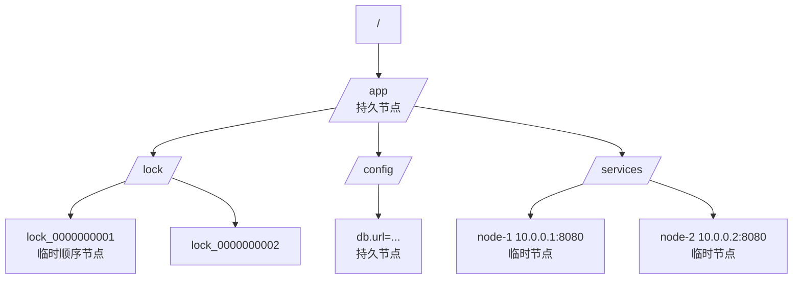
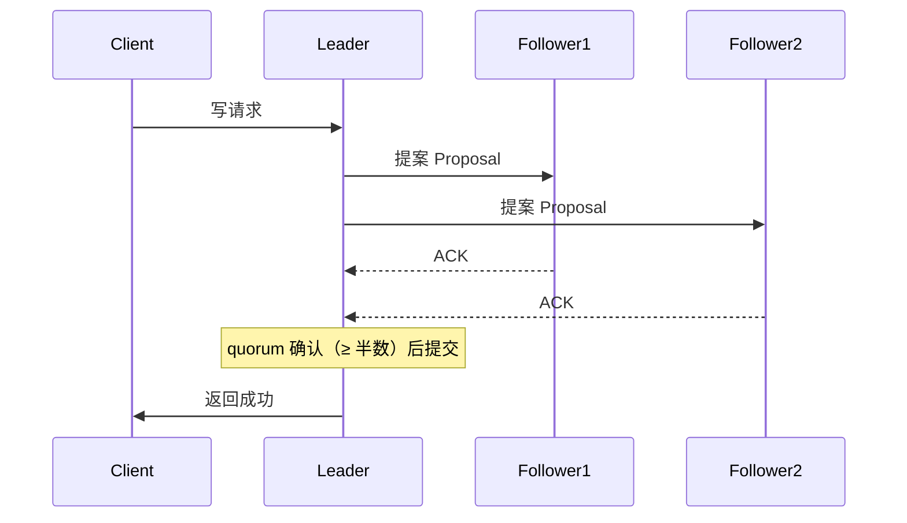
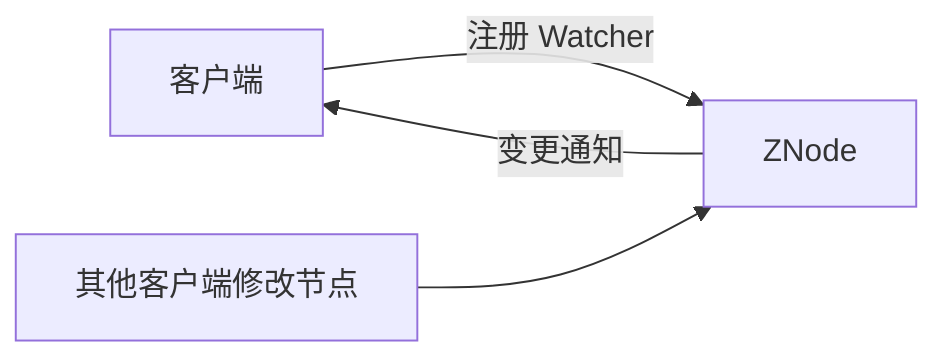
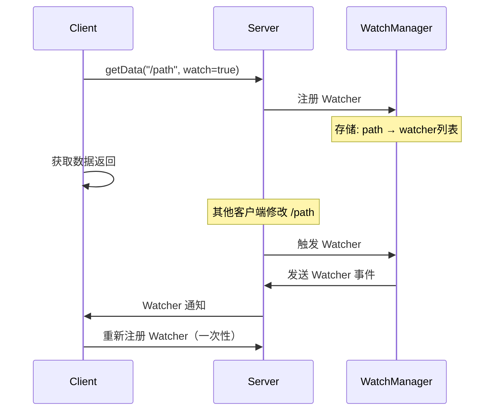

# ZooKeeper（分布式协调服务）

> 分布式系统「协调层」的老牌王者：分布式锁、选举、元数据、命名服务全靠它。本文讲透 ZAB 协议、节点与会话、Watcher 机制、典型场景与生产坑；与「源码系列/zookeeper」互补（那边偏源码与面试题）。
> 开源参考：[apache/zookeeper](https://github.com/apache/zookeeper)（Java，Apache 2.0，Hadoop 生态的分布式协调底座）。

---

## 〇、本体介绍（它是什么 / 适用场景 / 核心概念）

**它是什么**：ZooKeeper 是 Apache 的**分布式协调服务**，提供「强一致（CP）的共享存储 + 通知机制」，是所有需要「选主、锁、元数据协调」的分布式系统的地基。

**解决什么痛点**：多节点之间怎么互斥（分布式锁）、谁来当 Leader（选举）、配置/元数据怎么让大家看到同一个版本（共享存储 + Watcher 通知）、服务地址怎么注册发现（临时节点）。

**核心概念**：ZNode（数据节点，树形）、临时节点/持久节点/顺序节点、Session 会话（心跳）、Watcher 监听、ZAB 协议（ZooKeeper Atomic Broadcast）、Leader 选举、ACL 权限、Zxid 事务 ID、follower/observer 角色。

**适用场景**：分布式锁、Leader 选举、元数据存储（Kafka 老版本）、配置/命名服务、协调协调者。
**不适用**：大数据量存储（KV 替代：etcd/Redis）、高吞吐配置下发（Apollo/Nacos 更好）、替代业务数据库。

---

## 一、数据模型与节点类型

ZooKeeper 的数据结构是**一棵树**，节点叫 **ZNode**：



| 节点类型 | 特点 | 典型用途 |
|----------|------|----------|
| **持久节点** | 创建后一直存在，需显式删除 | 配置、元数据、常驻注册信息 |
| **临时节点** | 会话结束自动删除 | 服务注册、Leader 占位、锁 |
| **顺序节点** | 创建时自动追加单调递增序号 | 分布式锁排队、选举编号 |

> 灵魂设计：**临时节点 + 会话**——客户端崩了会话断开，临时节点自动消失，协调状态不会残留（这是比「手写心跳」可靠的原因）。

---

## 二、ZAB 协议与一致性（面试核心）

### 2.1 ZAB 是什么

ZAB（ZooKeeper Atomic Broadcast）是 ZK 自研的**崩溃恢复 + 原子广播**协议，保证**写操作全局有序、强一致**（CP）：

1. **Leader 选举**：集群启动或 Leader 挂掉时，通过投票选出新 Leader（比较 Zxid + 节点 id）。
2. **恢复阶段**：新 Leader 与其他节点同步未提交的事务（保证不丢已确认写）。
3. **广播阶段（两阶段）**：写请求由 Leader 广播（提案），**超过半数（quorum）节点确认**才提交并响应客户端。



### 2.2 一致性级别

- **顺序一致性**：所有节点看到的写顺序一致（全局 Zxid 有序）。
- **强一致读**：读也走 Leader 或 `sync` 请求，保证读到最新（Follower 读可能读到旧数据——ZK 是「线性写 + 最终一致读」的折中，严格讲是顺序一致性 + 读优化）。

### 2.3 CAP 取舍

ZK 是 **CP**：网络分区时，少数派节点无法形成 quorum，写被拒绝（宁可不可用，不可不一致）。这也决定了它不适合做「可用性优先」的服务发现（AP 型用 Nacos/Eureka）。

---

## 三、Watcher 机制（监听通知）

- 客户端对节点注册 `Watcher`，节点**数据变更/删除/子节点变化**时，服务端**一次性推送**通知。
- 关键：Watcher 是**一次性的**（触发后失效，需重新注册）——这是面试常考点，也常在生产里踩坑（忘了重注册导致监听失效）。
- 用途：配置变更实时感知、服务上下线感知、Leader 变更感知。



---

## 四、经典场景（必须会写）

### 4.1 分布式锁（临时顺序节点 + Watcher）

```text
1. 客户端在 /lock 下创建「临时顺序节点」：/lock/lock_0000000001
2. 获取 /lock 下所有子节点，判断自己是否最小
3. 是最小 → 拿到锁，执行业务
4. 不是最小 → 监听「前一个节点」，前一个删除（释放锁）时唤醒重新判断
5. 业务完成 → 删除自己的节点释放锁；宕机 → 会话断开临时节点自动删除（防死锁）
```

> 相比 Redis SETNX 锁：ZK 锁天然防「持有者宕机死锁」，且 Watch 通知（非轮询）；缺点是吞吐低、CP 模型下分区不可用。

### 4.2 Leader 选举

- 多实例创建同一**临时节点**，创建成功的实例 = Leader（唯一性）；Leader 挂了临时节点消失，其他实例 Watcher 感知后重新竞争。
- 或者用「临时顺序节点 + 最小序号」的公平选举。

### 4.3 服务注册发现（临时节点）

- 服务启动创建 `/services/user/user-1`（临时节点，值为 IP:port），客户端 Watch 目录拿列表；服务下线节点自动消失。
- 注：ZK 注册中心是 CP 型，服务发现场景**通常选 AP**（Nacos/Eureka）更合适；ZK 适合「一致性比可用性重要」的协调。

### 4.4 元数据/配置存储

- Kafka 老版本用它存 Topic/分区/Controller 元数据（新版本已换 KRaft）；HBase 用它管 region 分配；Dubbo 老版本用它做注册中心。

---

## 五、集群部署与生产实践

### 5.1 集群形态

- **奇数节点**（3/5/7），超过半数存活才可用（2 节点集群挂 1 个就不可用，所以必须奇数）。
- 角色：Leader（写入口）/ Follower（读+投票）/ **Observer**（只读不投票，用于扩大读能力不降写性能）。
- 部署建议：单机房 3 节点起步；跨机房选主要小心「全局仲裁」导致的分区不可用。

### 5.2 常见坑（生产血泪）

1. **节点数偶数** → 挂一台就没了 quorum，集群瘫痪；必须奇数。
2. **JVM 堆太小 / GC 卡顿** → 影响会话超时判断，误判客户端宕机；调大堆 + 监控 GC。
3. **sessionTimeout 配太小** → 网络抖动就断会话，临时节点被删（服务被误摘）；一般 30s~60s 起步。
4. **Watcher 一次性失效忘重注册** → 变更不再通知，配置/服务列表过期。
5. **把 ZK 当数据库存大对象** → ZNode 数据默认限制 1MB，且全量加载内存，超大节点拖垮集群。
6. **客户端连接池/Session 复用**：每请求新建连接开销大，用 Curator 等框架管理。
7. **ZK 挂了对业务的影响**：写全拒、读可能可用但数据可能旧；依赖方必须有降级（缓存 + 重连）。

### 5.3 客户端框架

- **Curator**（推荐）：封装了分布式锁（InterProcessMutex）、选举（LeaderLatch）、缓存（PathChildrenCache），避免手写 Watcher 的坑。

---

## 面试高频问题（20+ 条）

1. **ZooKeeper 是什么？** 分布式协调服务：强一致共享存储（树形 ZNode）+ Watcher 通知，用于锁、选举、元数据、命名/配置。

2. **ZAB 协议是什么？** 崩溃恢复 + 原子广播：Leader 选举后，写请求由 Leader 广播提案，过半（quorum）确认才提交；保证写全局有序、已确认事务不丢。

3. **ZK 是 CP 还是 AP？** CP（强一致优先）：分区时少数派拒绝写。适合协调/锁/元数据；服务发现场景 AP 更合适。

4. **节点类型有哪些？** 持久 / 临时（会话结束删除）/ 顺序（序号递增）；可组合：持久顺序、临时顺序。

5. **临时节点的意义？** 会话断开自动删除——客户端宕机不留残留，天然解决「锁持有者挂掉死锁」「服务下线未清理」问题。

6. **Watcher 机制？** 注册后节点变更一次性通知；触发即失效需重注册；不要用于高频率变更（通知风暴），配置下发应批量。

7. **分布式锁怎么实现？** 临时顺序节点 + 最小序号判断 + Watch 前驱节点；释放=删除节点；宕机=会话断开自动删。公平锁。

8. **ZK 锁和 Redis 锁区别？** ZK：临时节点防死锁、Watch 通知不轮询、CP 强一致；吞吐低、集群成本高。Redis：性能高、实现简单；需要自己处理「持有者挂掉续期/死锁」（红锁/看门狗）。

9. **Leader 选举？** 启动时投票（Zxid + myid 大者胜）；运行时 Leader 挂，ZAB 自动重选；业务级选举可用临时节点竞争。

10. **Zxid 是什么？** 事务 ID，全局递增（高 32 位 epoch + 低 32 位计数器）；用于排序与选举比较新旧。

11. **读写分离？** 写必须 Leader；读可走 Follower（可能旧），需要强一致读用 sync 请求或全走 Leader。

12. **观察者 Observer？** 只读不投票，水平扩展读能力，不降低写 quorum 要求。

13. **会话超时会怎样？** 客户端与任一节点断开超时 → 会话失效 → 临时节点全部删除，Watcher 通知相关客户端。

14. **ZK 和 etcd 区别？** etcd：Raft 协议、gRPC + 原生 Watch 流、K8s 云原生生态、二级事务（Txn）；ZK：ZAB、Java 生态（Hadoop/Kafka 老版本）、Watcher 一次性。云原生新项目选 etcd。

15. **ZK 和 Nacos 区别？** 注册中心场景：ZK CP 强一致但分区不可用；Nacos 支持 AP（Distro）优先可用，且一体化配置中心，国内微服务首选 Nacos。

16. **顺序节点有什么用？** 分布式锁排队、选举编号、日志序号——天然单调递增，可实现公平锁。

17. **为什么集群要奇数节点？** quorum = 过半；偶数节点挂一半即不可用，奇数节点在同等容错下数量更少。

18. **ZK 常见使用方？** Kafka（旧版元数据/Controller）、HBase（region 元数据）、Dubbo（旧注册中心）、Solr、Elastic-Job（旧版分片协调）。

19. **ZK 的 ACL？** 基于 path 的权限控制（read/write/create/delete/admin），配合认证（digest/sasl）防未授权访问。

20. **ZK 性能瓶颈？** 写需要 quorum 确认（网络往返），吞吐约几万 QPS；节点数据全量在内存，别存大对象；读可加 Observer 扩。

21. **ZK 挂了怎么办？** 高可用：奇数集群 + 监控 Leader 状态；依赖方必须有降级（本地缓存 + 重连退避）；关键场景评估是否用 AP 型组件替代。

22. **什么时候用 ZK？** 需要强一致协调语义（锁/选举/元数据）、已有 Hadoop/Java 生态、团队熟悉运维；新项目云原生优先考虑 etcd。

---

## 五、ZAB 协议深入

### 5.1 ZAB 协议详解

```
ZAB（ZooKeeper Atomic Broadcast）协议分为两个核心阶段：

1. 崩溃恢复（Leader Election + Recovery）
   ├── Leader 选举：比较 Zxid（高 epoch + 低 counter）
   ├── 数据同步：Leader 与 Follower 同步未提交事务
   └── 原子提交：超过 quorum 确认后提交

2. 原子广播（Atomic Broadcast）
   ├── Leader 接收写请求 → 生成 Proposal（Zxid+1）
   ├── 广播 Proposal 到所有 Follower
   ├── Follower 写入本地事务日志 → 返回 ACK
   ├── Leader 收到 quorum ACK → 发送 Commit
   └── 各节点提交事务 → 响应客户端
```

### 5.2 Zxid 结构

```
Zxid = 64 位事务 ID
  高 32 位：epoch（Leader 任期编号，每次选举 +1）
  低 32 位：counter（事务计数器，每次写 +1）

示例：
  Zxid = 0x100000003
    epoch = 1（第 2 任 Leader）
    counter = 3（第 3 个事务）

作用：
  比较事务新旧：Zxid 越大越新
  选举比较：Zxid 大者优先（保证新 Leader 有最新数据）
  事务排序：全局有序，保证一致性
```

### 5.3 ZAB vs Raft 对比

| 维度 | ZAB | Raft |
|------|-----|------|
| Leader 选举 | 比较 Zxid | 比较日志最后索引 |
| 日志复制 | 两阶段（Proposal+Commit） | AppendEntries + Commit |
| 脑裂处理 | quorum 保证 | quorum 保证 |
| 日志空洞 | 恢复阶段填补 | Leader 补发缺失日志 |
| 成员变更 | 动态配置变更 | Joint Consensus / 自动变更 |
| 应用 | ZooKeeper | etcd/Raft/PolarDB |

---

## 六、Session 管理机制

### 6.1 Session 生命周期

```
Session 状态机：
  Creating → Active → Closing → Closed

  Creating：客户端与服务端建立连接，分配 SessionID
  Active：心跳正常，Session 保持存活
  Closing：Session 超时，开始清理临时节点
  Closed：Session 完全结束

心跳机制：
  客户端 → 服务端：Ping 心跳
  服务端 → 客户端：响应（更新 Session 超时时间）
  默认心跳间隔：sessionTimeout / 3
```

### 6.2 Session 超时处理

| 场景 | 行为 |
|------|------|
| 客户端正常关闭 | 主动关闭 Session，临时节点删除 |
| 客户端网络断开 | 等待 sessionTimeout，超时后关闭 Session |
| 服务端重启 | 客户端重连，Session 可恢复（如果在超时内） |
| 集群 Leader 切换 | Session 状态同步到新 Leader |

### 6.3 Session 分配策略

```
Session 分配流程：
  1. 客户端连接任意 Follower
  2. Follower 转发 Session 创建请求到 Leader
  3. Leader 分配全局唯一 SessionID
  4. Leader 广播 Session 信息到所有节点
  5. 各节点维护 Session 状态

Session 存储：
  内存中维护 Session → 对应临时节点映射
  定期持久化 Session 信息到磁盘（Zxid + Session 列表）
```

---

## 七、Watcher 机制深入

### 7.1 Watcher 类型

| 类型 | 说明 | 触发事件 |
|------|------|----------|
| Data Watch | 监听节点数据变更 | NodeDataChanged |
| Child Watch | 监听子节点变更 | NodeChildrenChanged |
| Exist Watch | 监听节点是否存在 | NodeCreated/NodeDeleted |
| Persistent Watch | 持久监听（3.6+） | 所有事件（不自动失效） |
| Recursive Watch | 递归监听（3.6+） | 子树所有变更 |

### 7.2 Watcher 注册与触发流程



### 7.3 Watcher 一次性与持久监听

```
一次性 Watcher（默认）：
  1. 客户端注册 Watcher
  2. 事件触发后自动失效
  3. 需要客户端重新注册
  问题：容易遗漏事件（忘记重注册）

持久 Watcher（3.6+）：
  addWatch /path -p（持久模式）
  事件触发后不会失效
  适合需要持续监听的场景
  缺点：服务端需维护更多 Watcher

递归 Watcher（3.6+）：
  addWatch /path -r（递归模式）
  监听整个子树的所有变更
  减少客户端 Watcher 注册数量
```

---

## 八、ZooKeeper 动态重配置

### 8.1 动态添加/删除节点

```bash
# 动态添加节点（无需重启）
zkServer.sh add start

# 动态删除节点
zkServer.sh remove <server-id>

# 查看当前配置
zkServer.sh config
```

### 8.2 动态重配置流程

```
1. 管理员执行 reconfig 命令
2. Leader 验证配置变更合法性
3. Leader 将新配置作为特殊事务广播
4. 所有节点更新本地配置
5. 新节点加入后从 Leader 同步数据

限制：
  - 只能修改集群成员（不能改端口/路径等）
  - 需要所有节点在线（或 quorum 在线）
  - 不支持跨机房动态扩展（延迟敏感）
```

### 8.3 动态配置 vs 滚动重启

| 方式 | 优势 | 劣势 |
|------|------|------|
| 动态重配置 | 无需停服，实时生效 | 只能改集群成员 |
| 滚动重启 | 可修改所有配置 | 需要逐个重启，有短暂不可用 |

---

## 九、Curator 框架模式

### 9.1 Curator 核心 API

```java
// 1. 分布式锁（可重入）
InterProcessMutex lock = new InterProcessMutex(client, "/lock/order");
if (lock.acquire(10, TimeUnit.SECONDS)) {
    try {
        // 业务逻辑
    } finally {
        lock.release();
    }
}

// 2. 分布式可重入读写锁
InterProcessReadWriteLock rwLock = new InterProcessReadWriteLock(client, "/rw-lock");
rwLock.readLock().acquire();
rwLock.writeLock().acquire();

// 3. 分布式信号量
InterProcessSemaphoreV2 semaphore = new InterProcessSemaphoreV2(client, "/semaphore", 5);
Lease lease = semaphore.acquire();
try {
    // 最多 5 个并发
} finally {
    semaphore.returnLease(lease);
}

// 4. 分布式 Barrier
InterProcessBarrier barrier = new InterProcessBarrier(client, "/barrier", 3);
barrier.await(10, TimeUnit.SECONDS);  // 等待 3 个节点都到达
```

### 9.2 Curator 缓存模式

```java
// PathChildrenCache：监听子节点变化
PathChildrenCache cache = new PathChildrenCache(client, "/services", true);
cache.getListenable().addListener((framework, event) -> {
    switch (event.getType()) {
        case CHILD_ADDED:
            System.out.println("节点添加: " + event.getData().getPath());
            break;
        case CHILD_REMOVED:
            System.out.println("节点删除: " + event.getData().getPath());
            break;
        case CHILD_UPDATED:
            System.out.println("节点更新: " + event.getData().getPath());
            break;
    }
});
cache.start();

// TreeCache：监听整棵树
TreeCache treeCache = new TreeCache(client, "/app");
treeCache.getListenable().addListener((framework, event) -> {
    // 处理所有节点事件
});
treeCache.start();

// NodeCache：监听单个节点
NodeCache nodeCache = new NodeCache(client, "/config/db.url");
nodeCache.getListenable().addListener(() -> {
    System.out.println("配置变更: " + nodeCache.getCurrentData().getPath());
});
nodeCache.start();
```

### 9.3 Curator 重试策略

| 策略 | 说明 |
|------|------|
| ExponentialBackoffRetry | 指数退避重试（推荐） |
| RetryNTimes | 固定次数重试 |
| RetryForever | 无限重试 |
| RetryUntilElapsed | 直到超时 |

```java
// 推荐配置
CuratorFramework client = CuratorFrameworkFactory.builder()
    .connectString("localhost:2181")
    .sessionTimeoutMs(30000)
    .connectionTimeoutMs(15000)
    .retryPolicy(new ExponentialBackoffRetry(1000, 3))
    .namespace("my-app")
    .build();
```

---

## 十、ZooKeeper vs etcd vs Consul 对比

### 10.1 核心能力对比

| 维度 | ZooKeeper | etcd | Consul |
|------|-----------|------|--------|
| 一致性协议 | ZAB | Raft | Raft |
| 数据模型 | ZNode 树 | 扁平 KV | KV + 服务目录 |
| 通知机制 | Watcher（一次性） | Watch 流（持续） | Blocking Queries |
| 事务 | 无原生事务 | Txn（if-then-else） | KV 事务 |
| 服务发现 | 临时节点 | Lease + Watch | 内置健康检查 |
| 健康检查 | 无（需自建） | 无（需自建） | 内置（HTTP/TCP/gRPC） |
| 多数据中心 | 不支持 | 不支持 | 原生支持 |
| DNS 接口 | 无 | 无 | 内置 DNS |
| ACL | 基于 path | 基于 key prefix | 基于 token + policy |

### 10.2 适用场景对比

| 场景 | 首选 | 原因 |
|------|------|------|
| K8s 元数据存储 | etcd | K8s 官方指定 |
| Java 微服务注册 | ZooKeeper | Dubbo/Kafka 生态 |
| 多数据中心服务发现 | Consul | 原生多 DC 支持 |
| 轻量配置中心 | etcd | Watch 流 + MVCC |
| 分布式锁 | 三者都可 | ZK 最成熟，etcd 更轻量 |
| 服务网格 | Consul/etcd | 内置健康检查 + DNS |

### 10.3 性能对比

| 指标 | ZooKeeper | etcd | Consul |
|------|-----------|------|--------|
| 写 QPS | 10k~20k | 10k~15k | 10k~15k |
| 读 QPS | 100k+（Follower） | 10k~15k（线性读） | 50k+（Stale） |
| 写延迟 | 5~20ms | 5~20ms | 5~20ms |
| 集群规模 | 3~7 节点 | 3~7 节点 | 3~7 节点 |

---

## 十一、ZooKeeper 性能调优

### 11.1 关键配置参数

| 参数 | 默认值 | 建议值 | 说明 |
|------|--------|--------|------|
| tickTime | 2000ms | 2000ms | 心跳基本单位 |
| initLimit | 10 | 10 | Follower 初始连接超时（tickTime 倍数） |
| syncLimit | 5 | 5 | Follower 同步超时 |
| maxClientCnxns | 60 | 128 | 单 IP 最大连接数 |
| snapCount | 100000 | 500000 | 触发快照的事务数 |
|autopurge.purgeInterval | 0 | 24 | 自动清理间隔（小时） |

### 11.2 JVM 调优

```bash
# JVM 参数
export SERVER_JVMFLAGS="-Xms4g -Xmx4g \
  -XX:+UseG1GC \
  -XX:MaxGCPauseMillis=50 \
  -XX:InitiatingHeapOccupancyPercent=35 \
  -XX:+HeapDumpOnOutOfMemoryError \
  -XX:HeapDumpPath=/var/log/zookeeper/heapdump.hprof"

# GC 日志
export SERVER_JVMFLAGS="$SERVER_JVMFLAGS \
  -Xlog:gc*:file=/var/log/zookeeper/gc.log:time,uptime:filecount=10,filesize=100m"
```

### 11.3 操作系统调优

```bash
# 文件描述符限制
ulimit -n 65536

# 虚拟内存
echo 1 > /proc/sys/vm/overcommit_memory

# 网络优化
echo 32768 > /proc/sys/net/core/somaxconn
echo 1 > /proc/sys/net/ipv4/tcp_tw_reuse
```

---

## 十二、ZooKeeper 在 Kafka 中的角色演变

### 12.1 Kafka 旧版本（依赖 ZK）

```
Kafka 0.8 ~ 2.8：ZK 作为元数据存储
  ├── Broker 注册 → /brokers/ids/[brokerId]
  ├── Topic 配置 → /brokers/topics/[topicName]
  ├── Partition 分配 → /brokers/topics/[topic]/partitions/[0]
  ├── Controller 选举 → /controller
  └── 消费者组 → /consumers/[group]

问题：
  ZK 成为性能瓶颈（大量写操作）
  Controller 单点（依赖 ZK 选举）
  网络分区时 ZK 不可用影响 Kafka
```

### 12.2 KRaft 替代方案（KRaft）

```
Kafka 3.0+：KRaft 模式（去除 ZK 依赖）
  ├── 自管理 Raft 共识
  ├── Controller Quorum（多个 Controller 节点）
  ├── 元数据存储在 Kafka 内部 Topic
  └── 性能提升：Controller 选举更快，元数据同步更高效

迁移路径：
  1. K8s 部署：直接使用 KRaft 模式
  2. 存量集群：ZK → KRaft 滚动迁移
```

### 12.3 KRaft vs ZK 模式对比

| 维度 | ZK 模式 | KRaft 模式 |
|------|---------|------------|
| 依赖组件 | ZooKeeper | 无外部依赖 |
| Controller 选举 | ZK 选举（慢） | Raft 选举（快） |
| 元数据存储 | ZK（内存） | Kafka Topic |
| 启动速度 | 慢（等 ZK） | 快 |
| 运维复杂度 | 高（维护 ZK 集群） | 低 |

---

## 十二-2、ZAB 协议消息广播与崩溃恢复两阶段详解

```
ZAB 协议两阶段：

第一阶段：崩溃恢复（Leader Election + Recovery）

  1. Leader 选举：
     - 比较 Zxid（高 epoch + 低 counter）
     - Zxid 大者优先（保证新 Leader 有最新数据）
     - Zxid 相同则比较 myid（大者胜）

  2. 数据同步：
     - 新 Leader 与其他节点同步未提交事务
     - 保证不丢已确认写（committed transactions）
     - 未提交的事务按最新 Leader 的决定

  3. 原子提交：
     - 超过 quorum 确认后提交
     - 各节点提交事务 → 响应客户端

第二阶段：消息广播（Atomic Broadcast）

  1. Leader 接收写请求
  2. 生成 Proposal（Zxid+1）
  3. 广播 Proposal 到所有 Follower
  4. Follower 写入本地事务日志 → 返回 ACK
  5. Leader 收到 quorum ACK → 发送 Commit
  6. 各节点提交事务 → 响应客户端

消息广播 = 两阶段提交（2PC）简化版：
  Proposal → ACK → Commit
  不需要准备阶段（简化）
  quorum 保证一致性（不需要所有节点）
```

## 十二-3、Watcher 事件类型与一次性语义

| 事件类型 | 触发条件 | 说明 |
|----------|----------|------|
| NodeCreated | 节点创建 | 持久/临时节点创建时触发 |
| NodeDeleted | 节点删除 | 节点被删除时触发 |
| NodeDataChanged | 节点数据变更 | 数据修改时触发 |
| NodeChildrenChanged | 子节点变更 | 子节点增删时触发 |

```
Watcher 一次性语义详解：

默认 Watcher（一次性）：
  1. 客户端注册 Watcher（getData/getChildren/exist）
  2. 事件触发后自动失效
  3. 需要客户端重新注册
  4. 问题：容易遗漏事件（忘记重注册）

持久 Watcher（3.6+）：
  addWatch /path -p（持久模式）
  事件触发后不会失效
  适合需要持续监听的场景
  缺点：服务端需维护更多 Watcher

递归 Watcher（3.6+）：
  addWatch /path -r（递归模式）
  监听整个子树的所有变更
  减少客户端 Watcher 注册数量

最佳实践：
  1. 配置变更 → 持久 Watcher（避免重注册）
  2. 服务上下线 → 临时节点 + Watcher
  3. 批量监听 → 递归 Watcher（减少注册数）
```

## 十二-4、Curator InterProcessMutex 可重入锁实现

```java
// Curator 分布式可重入锁
InterProcessMutex lock = new InterProcessMutex(client, "/lock/order");

if (lock.acquire(10, TimeUnit.SECONDS)) {
    try {
        // 业务逻辑（可重入：同一线程可多次 acquire）
        lock.acquire();  // 重入 +1
        // ...
        lock.release();  // 重入 -1
    } finally {
        lock.release();  // 完全释放
    }
}

// 锁实现原理：
// 1. 创建临时顺序节点 /lock/order/lock_0000000001
// 2. 获取 /lock/order 下所有子节点
// 3. 判断自己是否最小序号节点
// 4. 是 → 拿到锁；否 → 监听前一个节点
// 5. 前一个节点删除（释放锁）→ 唤醒重新判断
// 6. 宕机 → 会话断开 → 临时节点自动删除（防死锁）
```

## 十二-5、ZooKeeper 配置中心设计模式（Watch+长轮询）

```
ZK 配置中心设计：

模式：Watch + 长轮询

1. 配置存储
   /config/db.url = "jdbc:mysql://..."
   /config/redis.host = "10.0.0.1"

2. 客户端读取
   getData("/config/db.url", watch=true)

3. 配置变更
   setData("/config/db.url", "new-url")

4. Watcher 通知
   客户端收到 NodeDataChanged 事件
   → 重新获取配置
   → 热更新（如数据源切换）

5. 长轮询优化
   客户端发起长连接 → 服务端有变更才返回
   → 减少无效轮询
   → 实时性高

优势：
  - 实时推送（毫秒级）
  - 强一致（ZK 保证）
  - 简单可靠

劣势：
  - ZK 性能瓶颈（几万 QPS）
  - Watcher 一次性（需重注册）
  - 不适合高频变更（通知风暴）
```

## 十二-6、ZK 集群扩容滚动操作步骤

```bash
# ZK 集群扩容（滚动操作）

Step 1: 准备新节点
  安装 ZK 二进制
  配置 zoo.cfg（添加新节点）
  myid 设置（如 4）

Step 2: 动态添加节点
  # 在现有节点执行
  zkServer.sh add start

Step 3: 验证新节点
  echo ruok | nc new-node 2181
  # 返回 imok 表示正常

Step 4: 检查集群状态
  echo mntr | nc leader 2181
  # 查看 zk_followers 指标

Step 5: 测试读写
  create /test "test-data"
  get /test

注意事项：
  - 必须奇数节点（3→5，不能 3→4）
  - 扩容期间集群仍可用
  - 新节点需要从 Leader 同步数据
  - 数据同步完成前不要执行下线操作
```

## 十二-7、ZK → K8s/etcd 迁移评估维度

| 维度 | 评估点 | 迁移建议 |
|------|--------|----------|
| 生态依赖 | 是否依赖 ZK（Kafka/HBase/Dubbo） | 逐步替换为 etcd/原生 |
| Watch 语义 | 是否依赖一次性 Watcher | etcd Watch 是持续流 |
| 数据模型 | ZNode 树 vs KV | 扁平 KV 更简单 |
| 事务能力 | 是否需要分布式事务 | etcd Txn 更强 |
| 运维成本 | ZK 集群运维复杂度 | etcd 更轻量 |
| 性能要求 | 读写吞吐需求 | etcd 写略慢，读可优化 |

```
迁移路径评估：

1. Kafka 老版本（依赖 ZK）→ KRaft 模式（去除 ZK）
2. Dubbo 老版本（ZK 注册中心）→ Nacos/AP 模式
3. HBase（ZK 管理 Region）→ 保留 ZK（HBase 依赖）
4. 新项目 → etcd（云原生首选）

迁移步骤：
  1. 评估依赖方（哪些组件用 ZK）
  2. 逐个替换（Kafka→KRaft, Dubbo→Nacos）
  3. 数据迁移（元数据导出/导入）
  4. 验证（新旧系统并行运行）
  5. 切换（灰度切流）
  6. 下线 ZK 集群
```

## 十三、与其他板块的关系

- 和「**源码系列/zookeeper**」：本篇讲协议、场景与生产；源码篇有常见 ZK 面试题深挖。
- 和「**基础知识/中间件/etcd**」：同是 CP 协调服务，etcd 是云原生替代者（对比见上）。
- 和「**基础知识/中间件/注册中心与配置中心**」：ZK 可做注册中心（CP 型），与 Nacos/Eureka（AP）的取舍见该篇。
- 和「**场景设计/分布式锁**」：ZK 锁是分布式锁三大实现之一（Redis / ZK / DB 行锁）。
- 和「**基础知识/中间件/Kafka**」：Kafka 老版本元数据依赖 ZK，新版本 KRaft 已替代。
- 和「**基础知识/分布式系统**」：ZAB、quorum、CAP 是分布式理论在真实组件上的落地。

---

## 七、速查表

| 项 | 结论 |
|----|------|
| 类型 | 分布式协调服务（CP） |
| 协议 | ZAB（崩溃恢复 + 原子广播，quorum 提交） |
| 数据模型 | ZNode 树（持久/临时/顺序） |
| 通知 | Watcher（一次性，触发需重注册） |
| 场景 | 分布式锁 / 选举 / 元数据 / 命名配置 |
| 集群 | 奇数节点（3/5/7），过半可用，可加 Observer 扩读 |
| 局限 | 吞吐不高、不存大数据、分区时不可写 |
| 许可证 | Apache 2.0 |
| 一句话 | 「分布式协调的老牌地基」——强一致的锁与选举，云原生时代让位于 etcd |

---

## 八、ZooKeeper 高级特性

### 8.1 Curator 框架

```java
// 分布式锁
InterProcessMutex lock = new InterProcessMutex(client, "/lock/order");
if (lock.acquire(10, TimeUnit.SECONDS)) {
    try {
        // 业务逻辑
    } finally {
        lock.release();
    }
}

// Leader 选举
LeaderLatch latch = new LeaderLatch(client, "/leader/election");
latch.start();
if (latch.hasLeadership()) {
    // 当前是 Leader
}

// PathChildrenCache（监听子节点变化）
PathChildrenCache cache = new PathChildrenCache(client, "/services", true);
cache.getListenable().addListener((curatorFramework, event) -> {
    // 处理节点变化
});
cache.start();
```

### 8.2 ZooKeeper 动态配置

```bash
# 动态更新配置（无需重启）
zkCli.sh set /config/db.url "jdbc:mysql://new-host:3306/mydb"

# 客户端 Watcher 监听变更
# 配置变更 → 实时感知 → 热更新
```

### 8.3 ZooKeeper ACL

```bash
# 创建带权限的节点
create /secure/data "secret" digest:user:password:cdrwa

# 授权
addauth digest user:password
setAcl /secure/data world:anyone:r
```

---

## 九、ZooKeeper 生产运维

### 9.1 监控指标

| 指标 | 说明 | 告警阈值 |
|------|------|----------|
| zk_server_state | Leader/Follower | Leader 变化 |
| zk_avg_latency | 平均延迟 | > 100ms |
| zk_outstanding_requests | 排队请求数 | > 10 |
| zk_num_alive_connections | 活跃连接数 | > 1000 |
| zk_followers | Follower 数量 | < 预期 |

### 9.2 常见故障排查

| 故障 | 现象 | 排查 |
|------|------|------|
| 集群不可用 | 写超时 | 检查 Leader/磁盘/网络 |
| 会话超时 | 临时节点被删 | 检查 sessionTimeout/网络 |
| GC 卡顿 | 间歇性超时 | 调大堆 + 监控 GC |
| 磁盘满 | 写失败 | 清理日志/扩容 |
| Watcher 丢失 | 配置不更新 | 重注册 Watcher |

---

## 十、与其他板块的关系（扩展）

- 和「**源码系列/zookeeper**」：本篇讲协议、场景与生产；源码篇有常见 ZK 面试题深挖。
- 和「**基础知识/中间件/etcd**」：同是 CP 协调服务，etcd 是云原生替代者（对比见上）。
- 和「**基础知识/中间件/注册中心与配置中心**」：ZK 可做注册中心（CP 型），与 Nacos/Eureka（AP）的取舍见该篇。
- 和「**场景设计/分布式锁**」：ZK 锁是分布式锁三大实现之一（Redis / ZK / DB 行锁）。
- 和「**基础知识/中间件/Kafka**」：Kafka 老版本元数据依赖 ZK，新版本 KRaft 已替代。
- 和「**基础知识/分布式系统**」：ZAB、quorum、CAP 是分布式理论在真实组件上的落地。

---

## 十一、速查表（扩展）

| 项 | 结论 |
|----|------|
| 类型 | 分布式协调服务（CP） |
| 协议 | ZAB（崩溃恢复 + 原子广播，quorum 提交） |
| 数据模型 | ZNode 树（持久/临时/顺序） |
| 通知 | Watcher（一次性，触发需重注册） |
| 场景 | 分布式锁 / 选举 / 元数据 / 命名配置 |
| 集群 | 奇数节点（3/5/7），过半可用，可加 Observer 扩读 |
| 客户端 | Curator（推荐，封装锁/选举/缓存） |
| 局限 | 吞吐不高、不存大数据、分区时不可写 |
| 许可证 | Apache 2.0 |

## ZAB 协议消息广播与崩溃恢复两阶段详解

### 消息广播阶段

```text
ZAB 消息广播流程：
  1. Leader 接收写请求
  2. Leader 生成 Proposal（zxid + 数据）
  3. Leader 发送 Proposal 给所有 Follower
  4. Follower 收到 Proposal 后写入本地事务日志
  5. Follower 发送 ACK 给 Leader
  6. Leader 收到过半 ACK 后，发送 Commit
  7. Follower 收到 Commit 后应用到内存

zxid 结构：
  64 位 = epoch（32位）+ counter（32位）
  epoch：Leader 选举周期，每次选主 +1
  counter：事务计数器，每次写入 +1

优势：
  - 保证消息顺序（zxid 单调递增）
  - 过半提交保证一致性
  - 事务日志保证持久性
```

### 崩溃恢复阶段

```text
ZAB 崩溃恢复流程：
  1. Leader 宕机，Follower 检测到连接断开
  2. Follower 切换到 LOOKING 状态
  3. 触发 Leader 选举（FastLeaderElection）
  4. 选举规则：
     - 优先选 zxid 最大的 Follower
     - zxid 相同选 myid 最大的
  5. 新 Leader 产生后，与 Follower 同步数据
  6. 同步完成后，切换到正常广播模式

数据同步规则：
  - 新 Leader 的 zxid 必须 >= 所有 Follower 的 zxid
  - 不一致的数据会被截断（回滚到 Leader 的 zxid）
```

## Watcher 事件类型与一次性语义

### 持久/递归/非递归

| Watcher 类型 | 说明 | 适用场景 |
|--------------|------|----------|
| 默认（OneShot） | 触发一次后失效 | 一次性通知 |
| 持久（Persistent） | 触发后继续有效 | 持续监听 |
| 递归（Recursive） | 监听子节点变更 | 目录监听 |

```java
// 默认 Watcher（一次性）
zk.getData("/mynode", event -> {
    System.out.println("Node changed: " + event.getType());
    // 需要重新注册 Watcher
}, null);

// 持久 Watcher（Curator）
PathChildrenCache cache = new PathChildrenCache(client, "/mynode", true);
cache.getListenable().addListener((curatorFramework, event) -> {
    System.out.println("Event: " + event.getType());
});
cache.start();

// 递归 Watcher
TreeCache treeCache = new TreeCache(client, "/mynode");
treeCache.getListenable().addListener((curatorFramework, event) -> {
    System.out.println("Event: " + event.getType() + " Path: " + event.getData().getPath());
});
treeCache.start();
```

## Curator InterProcessMutex 可重入锁实现原理

### 可重入锁机制

```text
Curator InterProcessMutex 原理：
  1. 创建临时顺序节点：/locks/resource/_c_0000000001
  2. 获取所有子节点，排序
  3. 如果当前节点是最小的，获取锁成功
  4. 否则，监听前一个节点
  5. 前一个节点删除后，尝试获取锁

可重入机制：
  - 使用 threadData Map 存储锁信息
  - 同一线程多次获取同一锁，计数 +1
  - 释放时计数 -1，减到 0 才真正释放

公平性：
  - 严格按请求顺序获取锁
  - 避免饥饿
```

```java
// 可重入锁使用
InterProcessMutex lock = new InterProcessMutex(client, "/locks/resource");

// 获取锁（可重入）
if (lock.acquire(10, TimeUnit.SECONDS)) {
    try {
        // 业务逻辑
        lock.acquire();  // 可重入，计数 +1
        // 业务逻辑
    } finally {
        lock.release();  // 计数 -1
        lock.release();  // 计数 -1，真正释放
    }
}
```

## ZK 配置中心设计模式

### Watch + 长轮询

```text
ZK 配置中心设计：
  1. 配置存储在 ZNode 中
  2. 客户端读取配置 + 注册 Watcher
  3. 配置变更时 ZK 通知客户端
  4. 客户端重新读取配置

长轮询优化：
  - 客户端 Watcher 触发后立即重新读取
  - 避免频繁轮询
  - ZK 通知延迟约 1-2ms

配置分层：
  /config
    /app1
      /db
      /cache
    /app2
      /db
```

```java
// ZK 配置监听
String configPath = "/config/app1/db";
byte[] config = zk.getData(configPath, event -> {
    // 配置变更回调
    if (event.getType() == Watcher.Event.EventType.NodeDataChanged) {
        // 重新读取配置
        byte[] newConfig = zk.getData(configPath, false, null);
        refreshConfig(newConfig);
    }
}, null);
```

## ZK 集群扩容滚动操作步骤

### 扩容注意事项

```text
ZK 集群扩容步骤：
  1. 准备新节点（与现有节点相同配置）
  2. 配置新节点（zoo.cfg + myid）
  3. 逐个启动新节点
  4. 更新所有节点的 zoo.cfg（添加新节点）
  5. 滚动重启所有节点

注意事项：
  - 不能一次性重启所有节点（会导致选举）
  - 建议逐个重启，每次等待选举完成
  - 扩容前备份数据
  - 监控集群状态

扩容后验证：
  - 检查 Leader/Follower 状态
  - 验证数据同步
  - 测试读写功能
```

```bash
# 1. 添加新节点配置
# zoo.cfg
server.4=new-node:2888:3888

# 2. 设置新节点 myid
echo "4" > /var/lib/zookeeper/myid

# 3. 启动新节点
zkServer.sh start

# 4. 重启现有节点（逐个）
zkServer.sh stop
zkServer.sh start

# 5. 验证集群状态
echo stat | nc localhost 2181
```

## ZK → K8s ConfigMap/etcd 迁移评估维度

### 迁移评估

| 维度 | ZK | K8s ConfigMap | K8s etcd |
|------|-----|----------------|----------|
| 数据模型 | 树形结构 | 键值对 | 键值对 |
| Watch | 事件驱动 | HTTP 长轮询 | 事件驱动 |
| 一致性 | 强一致（ZAB） | 最终一致 | 强一致（Raft） |
| 性能 | 低（写入） | 中 | 高 |
| 运维 | 复杂 | 简单（K8s） | 复杂 |

```text
迁移决策：
  1. 已有 K8s 集群 → ConfigMap（简单场景）
  2. 需要强一致 → etcd（K8s 内置）
  3. 复杂协调需求 → 保持 ZK 或迁移到 etcd
  4. 配置管理 → ConfigMap + Secret

迁移步骤：
  1. 数据迁移（ZK → ConfigMap/etcd）
  2. 客户端改造（ZK API → K8s API）
  3. 测试验证
  4. 灰度切换
```
| 一句话 | 「分布式协调的老牌地基」——强一致的锁与选举，云原生时代让位于 etcd |
