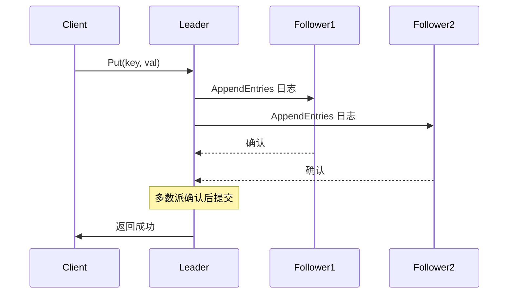
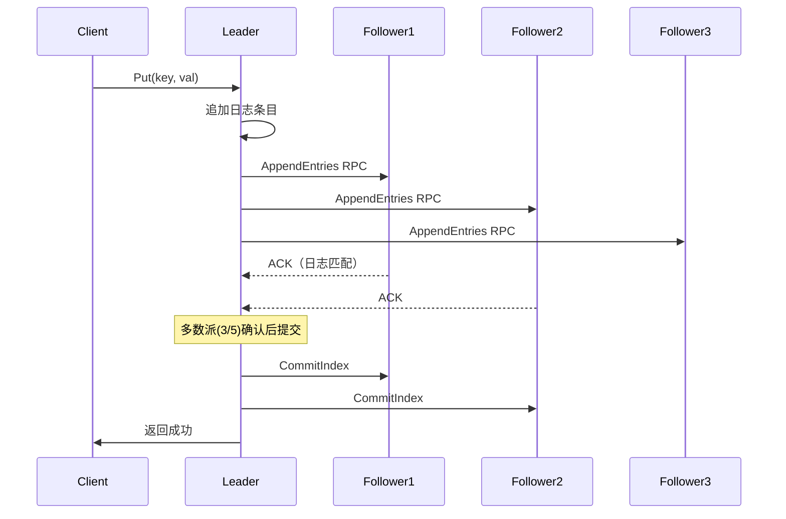

# etcd（云原生分布式 KV 存储 / 协调服务）

> Kubernetes 的「大脑」就是 etcd：所有集群状态都存它里面。云原生时代分布式协调的事实标准，Raft 实现教科书。本文讲透 Raft、MVCC、Watch、Lease，以及作为注册中心/配置中心/分布式锁的落地姿势。
> 开源参考：[etcd-io/etcd](https://github.com/etcd-io/etcd)（Go，Apache 2.0，CoreOS 开源，K8s 数据底座）。

---

## 〇、本体介绍（它是什么 / 适用场景 / 核心概念）

**它是什么**：etcd 是**云原生的分布式 KV 存储**，基于 Raft 共识协议实现强一致（CP），提供 Put/Get、Watch（监听）、Lease（租约）、Txn（事务）四大核心能力，是 Kubernetes 全部集群状态的存储后端。

**解决什么痛点**：分布式系统需要「所有节点看到同一个事实」（共享强一致存储）、「配置变更实时通知」（Watch）、「分布式锁」（Txn + Lease）、「Leader 选举」。etcd 用 Raft + 原生 Watch 流把这三件事做得干净利落。

**核心概念**：Raft（Leader 选举 + 日志复制）、Key-Value（带 revision 版本）、MVCC（多版本并发控制）、Watch（监听流，持续推送）、Lease（租约 TTL）、Txn（if-then-else 原子事务）、Compact（历史版本压缩）、gRPC 协议。

**适用场景**：K8s 元数据存储、服务发现、配置中心（轻量）、分布式锁、选主。
**不适用**：大数据量（内存 KV，几 GB 级别）、高频写（写要 Raft 落盘）、替代业务数据库/Redis 缓存。

---

## 一、四大核心能力

### 1.1 Raft 共识（强一致底座）

- 节点角色：**Leader（唯一的写入口）/ Follower / Candidate**；Leader 挂了触发新一轮选举。
- 写流程：客户端写 Leader → Leader 广播日志条目 → **多数派（quorum）落盘确认** → 提交并返回。
- **Term（任期）+ 随机超时选举**：防脑裂的经典机制。



### 1.2 Watch（持续监听，与 ZK 的一次性 Watcher 本质区别）

- 客户端 `Watch(key 前缀)` 后建立**长连接流**，后续所有变更**持续推送**（不是一次性），无需重注册。
- 支持按 `revision` 从指定版本开始监听——客户端可「从上次断点续听」，不怕漏通知。
- 应用：配置热更新、服务注册发现、K8s 控制器 watch 资源变化。

### 1.3 Lease（租约 TTL）

- 创建租约（如 10s），绑定 key；客户端周期性续约（KeepAlive），**租约过期 key 自动删除**。
- 作用：分布式锁持有者宕机自动释放、服务心跳下线自动清理、临时元数据。
- 底层是「时间戳比较」，比 ZK 会话更轻量灵活。

### 1.4 Txn（原子事务）

- `if 条件 then 操作 else 操作`：基于 revision 的比较（`ModRevision`）实现**乐观锁/CAS**。
- 是分布式锁、Leader 选举、`create-if-not-exists` 的原子基础。

---

## 二、MVCC 与版本机制

- 每次写分配全局递增的 **revision**（主版本号），旧版本保留（MVCC），支持读历史版本。
- 无限保留会撑爆磁盘/内存 → 需要 **Compact（压缩）** 定期清理历史版本（K8s 有 `--compaction` 定时任务）。
- 坑：**没做 compaction 的 etcd 会越来越大**，最后磁盘爆掉、集群退化——K8s 集群最常见的故障之一。

---

## 三、经典落地场景

### 3.1 Kubernetes 的数据库

- K8s 全部资源（Pod/Deployment/Service/ConfigMap...）都存在 etcd，kube-apiserver 是唯一读写入口。
- 集群可用性 = etcd 可用性：etcd 挂 → 整个集群不可变（只读都不行）。

### 3.2 分布式锁（Lease + Txn）

```text
1. 创建租约 lease（TTL 如 10s），后续 KeepAlive 续租
2. Txn：if 锁 key 不存在 → Put(key, owner, lease) 成功=拿锁
        else 失败（已被持有）
3. 执行业务
4. 释放：Delete 锁 key（或租约过期自动删）
```

- 宕机安全：Lease 过期自动释放，不会死锁。
- 对比 Redis 锁：不需要自己实现续期看门狗；但吞吐远低于 Redis（Raft 写）。

### 3.3 注册中心 / 配置中心

- 服务注册 = `Put(/services/name/instance, addr, lease)` + 心跳续租；发现 = `Watch /services/name` 前缀。
- 配置 = KV + Watch 前缀；支持按目录组织，变更实时推送。
- 定位：**轻量、强一致**；重配置治理（灰度/权限/审计）选 Apollo/Nacos。

### 3.4 Leader 选举

- `Txn(if 锁 key 不存在 → Put 成功即当选)` + Lease 保活；被选者挂了 Lease 过期，其他节点 Watch 后竞争。
- 或使用 `concurrency` 库（etcd 官方 Go 客户端内置 Session + Election）。

---

## 四、etcd vs ZooKeeper（面试高频对比）

| 维度 | etcd | ZooKeeper |
|------|------|-----------|
| 语言/协议 | Go / gRPC | Java / 自研协议 |
| 一致性 | Raft | ZAB |
| 数据模型 | 扁平 KV（前缀组织） | ZNode 树 |
| 通知 | **Watch 长连接流**（持续） | Watcher（一次性，需重注册） |
| 事务 | Txn（if-then-else） | 无原生事务 |
| 租约 | Lease（TTL + 续约） | Session 会话 |
| MVCC | ✅ 带版本 | ❌ |
| 生态 | K8s / 云原生 / Go 系 | Hadoop / Kafka 旧版 / Java 系 |
| 当前定位 | 新项目、云原生首选 | 存量 Java 生态 |

**选型结论**：新项目 + 云原生/K8s → etcd；存量 Java/Hadoop 生态 → ZooKeeper；轻量服务发现 → 两者都可，但业务服务发现国内更常用 Nacos（AP）。

---

## 五、生产实践与踩坑

### 5.1 部署建议

- **奇数节点**（3 起步，K8s 生产建议 5），跨 AZ 分布（可用区感知）但不能跨广域（Raft 延迟敏感）。
- **磁盘**：SSD，fsync 延迟直接影响写性能；监控 `wal_fsync_duration`。
- **版本升级**：小版本逐级升，别跨大版本（数据格式兼容问题）。

### 5.2 常见坑（K8s 运维必踩）

1. **defrag 未做 / 空间增长**：历史版本 + 删除未压缩 → 磁盘暴涨；定期 `compact + defrag`。
2. **磁盘慢 / fsync 延迟高** → 选举超时、Leader 抖动、整个集群写不可用。
3. **网络抖动频繁** → Raft 反复选主（Term 暴涨），服务不可用；监控 `etcd_server_leader_changes_seen_total`。
4. **快照恢复**：etcd 备份靠快照 + 增量 WAL；恢复要按官方流程（`etcdctl snapshot restore`），别直接拷数据目录。
5. **写放大**：高 QPS 写 + Raft 多副本 → 磁盘 IO 翻倍；别把日志/流水等高频写塞进 etcd。
6. **客户端超时/重试**：etcd 写超时后客户端需重试，但**写可能已提交**（返回超时≠失败）——业务要幂等。
7. **K8s 场景**：apiserver 连不上 etcd 表现为「集群只读/完全不可用」，先查 etcd 健康与磁盘。

### 5.3 监控指标速查

- `etcd_server_has_leader`（是否有主）、`etcd_server_leader_changes_seen_total`（换主次数，剧增=故障）、`etcd_server_slow_apply_total`（慢 apply）、`etcd_disk_wal_fsync_duration_seconds`（磁盘延迟）、`etcd_mvcc_db_total_size_in_bytes`（DB 大小）。

---

## 面试高频问题（20+ 条）

1. **etcd 是什么？** 分布式强一致 KV 存储（Raft 实现），K8s 数据底座；提供 Put/Get/Watch/Lease/Txn。

2. **Raft 怎么保证一致性？** Leader 唯一写入口，日志复制到多数派落盘才提交；选举有随机超时 + Term 防脑裂；已提交日志永不过期（Leader 完整性保证）。

3. **etcd 和 ZooKeeper 区别？** 见对比表：Raft vs ZAB、Watch 流 vs 一次性 Watcher、MVCC/事务 vs 树模型；生态 Go/云原生 vs Java/Hadoop。

4. **Watch 和 ZK Watcher 区别？** Watch 是长连接持续推送，支持按 revision 断点续听；ZK Watcher 一次性，触发后必须重注册。

5. **Lease 是什么？** 租约：绑定 TTL，key 到期自动删除；KeepAlive 续约；用于锁/注册中心的心跳保活与自动清理。

6. **Txn 怎么用？** if（ModRevision 比较）then（操作）else（操作），实现 CAS/乐观锁、create-if-not-exists、分布式锁。

7. **分布式锁怎么实现？** Lease + Txn（if key 不存在则 Put 成功=拿锁）+ KeepAlive 续租 + 释放删 key；宕机 Lease 过期自动释放。

8. **K8s 为什么用 etcd？** 需要强一致 + Watch（控制器监听资源变化）+ 高可用元数据存储；apiserver 通过 Watch 驱动所有控制循环。

9. **MVCC 是什么？** 每次写生成全局递增 revision，保留历史版本可读；配合 Compact 压缩历史，避免无限膨胀。

10. **为什么 etcd 会越来越大？** 历史版本未压缩（MVCC）、删除的 key 只打 tombstone、没有 defrag；需定期 compact + defrag。

11. **quorum 是什么？** 多数派（3 节点需 2，5 节点需 3）确认才提交；quorum 不可达则集群不可写——所以节点必须奇数、别拆成偶数组。

12. **写性能瓶颈？** 每次写要 Raft 多数派落盘（fsync），吞吐受磁盘延迟限制；别存大数据（内存 KV）和超高频写。

13. **Watch 为什么适合配置中心？** 客户端持续监听前缀，变更实时推送、断线可续听，天然支持「配置热更新」。

14. **etcd 可以作为缓存吗？** 不适合：强一致 + Raft 复制的读性能远不如 Redis，且数据全在内存、容量有限。

15. **选举机制细节？** 候选者随机超时 → 请求投票 → 多数票当选 → 任期 Term+1；分票则重新随机超时再选。

16. **客户端超时后数据写入了吗？** 不一定：Leader 可能已提交但响应超时；业务侧必须幂等重试（唯一 key / Txn 判断）。

17. **快照与 WAL？** 定期快照（全量） + 追加 WAL（增量日志）持久化；恢复用 snapshot restore + 重放 WAL。

18. **etcd 做注册中心合适吗？** 合适（强一致 + Watch + Lease 自动清理），尤其云原生 Go 技术栈；但业务级服务发现国内常用 Nacos（AP 优先可用）。

19. **如何保证「选举不出双主」？** Raft 任意 term 只有一个 Leader；网络分区时少数派无法获得 quorum，不会选出第二个 Leader（这也是 CP 可用性代价）。

20. **etcd 集群规模？** 3~5 节点最常见；读写都在 Leader，加节点不提升性能反而增网络开销；扩读用 Mirror/代理，业务上通常不需要。

21. **K8s etcd 故障怎么排查？** 依次查：进程/证书（`etcdctl endpoint health`）、磁盘空间与 fsync、DB 大小（compact/defrag）、换主次数、网络分区。

22. **什么时候用 etcd？** K8s 集群、云原生服务发现/配置、需要强一致锁与选举、Go/微服务技术栈；Java 存量生态继续用 ZK/Nacos。

---

## 五、etcd Raft 实现细节

### 5.1 Raft 日志复制流程



### 5.2 Raft 关键机制

| 机制 | 说明 |
|------|------|
| Leader 完整性 | 已提交的日志一定存在于新 Leader |
| 日志匹配 | AppendEntries 校验前一条日志的 Term 和 Index |
| 快速恢复 | Follower 缺失的日志会回退到 Leader 匹配点 |
| 心跳 | Leader 定期发送空 AppendEntries 保持权威 |
| PreVote | 预选举机制，防止网络分区后 Term 暴涨 |

### 5.3 etcd Raft 优化

```
etcd Raft 优化点：
  1. 批量日志合并：多个写请求合并为一次 AppendEntries
  2. Pipeline 模式：日志复制不等待上一轮确认
  3. 读优化：ReadIndex / Lease Read（避免走 Raft 共识）
  4. Leader Transfer：优雅转移 Leader（运维友好）
  5. 只读节点：Learner 不参与投票，只同步日志
```

---

## 六、etcd Watch 机制深入

### 6.1 Watch 数据结构

```
Watch 结构：
  watchID         → 唯一标识
  key             → 监听的 key 或前缀
  startRevision   → 起始版本号
  progress        → 当前进度（用于断线续传）
  chan            → 事件通知 channel

事件类型：
  PUT    → key 创建或修改
  DELETE → key 删除
```

### 6.2 Watch 事件分发流程

```
1. 客户端发起 Watch 请求（gRPC Stream）
2. etcd server 创建 Watcher 对象
3. Watcher 注册到WatchableStore
4. 后续写操作产生事件 → 分发给所有匹配的 Watcher
5. 通过 gRPC Stream 推送给客户端

性能优化：
  事件批量发送（减少网络开销）
  事件压缩（合并同一 key 的多次变更）
  按 revision 过滤（只推送客户端关心的版本）
```

### 6.3 Watch 与 ZooKeeper Watcher 对比

| 维度 | etcd Watch | ZK Watcher |
|------|------------|------------|
| 生命周期 | 持续流式推送 | 一次性触发 |
| 断线续传 | 支持（按 revision） | 不支持 |
| 前缀监听 | 原生支持 | 需监听父节点 |
| 事件可靠性 | 保证不丢（WAL） | 可能丢事件 |
| 性能 | 高（长连接） | 中（每次重注册） |

---

## 七、etcd Compaction 与 Defragmentation

### 7.1 Compaction 压缩

```bash
# 手动压缩（保留当前 revision）
etcdctl compact $(etcdctl endpoint status --write-out=json | jq '.header.revision')

# 自动压缩配置
# --auto-compaction-mode=periodic
# --auto-compaction-retention=8h

# K8s 默认配置
# kube-apiserver --etcd-compaction-retention=8h
```

### 7.2 Defragmentation 碎片整理

```bash
# 手动碎片整理（释放磁盘空间）
etcdctl defrag

# 批量整理所有节点
for host in node1 node2 node3; do
  ETCDCTL_API=3 etcdctl --endpoints=$host:2379 defrag
done

# 注意：
#   defrag 会阻塞写操作（拷贝数据+切换）
#   建议在低峰期执行
#   执行前确保磁盘空间充足
```

### 7.3 DB 空间管理最佳实践

```
磁盘空间计算：
  理论大小 = 当前数据量 + 历史版本 + 删除标记（tombstone）
  实际大小 = 理论大小 × 2（碎片 + 临时文件）

监控指标：
  etcd_mvcc_db_total_size_in_bytes  → DB 大小
  etcd_mvcc_db_total_size_in_use_in_bytes → 实际使用大小
  ratio = total_size_in_bytes / total_size_in_use_in_bytes
  ratio > 2 → 需要 defrag

清理策略：
  1. 启用自动压缩（--auto-compaction-retention=8h）
  2. 每周执行一次 defrag
  3. 磁盘使用率 > 70% 时立即 defrag
```

---

## 八、etcd 在 Kubernetes 中的角色

### 8.1 etcd 作为 K8s 后端存储

```
Kubernetes 架构：
  kube-apiserver → etcd（唯一读写入口）
    ├── 所有资源对象存储
    ├── Watch 机制驱动控制循环
    ├── 事务操作（创建/更新/删除）
    └── 版本控制（resourceVersion）

存储内容：
  Pod / Deployment / Service / ConfigMap / Secret
  Namespace / Node / PV / PVC / Ingress ...
  所有集群状态信息
```

### 8.2 etcd 与 K8s 性能关系

| 场景 | 影响 |
|------|------|
| etcd 延迟高 | API 请求超时，控制器反应迟钝 |
| etcd 磁盘满 | 集群完全不可用 |
| etcd 写吞吐不足 | 大规模集群创建/更新缓慢 |
| etcd 网络分区 | 集群脑裂/不可用 |

### 8.3 K8s etcd 运维建议

```bash
# 定期备份（建议每小时）
etcdctl snapshot save /backup/etcd-$(date +%Y%m%d%H%M).db

# 监控 etcd 健康
etcdctl endpoint health --cluster
etcdctl endpoint status --cluster --write-out=table

# 关键告警指标
# etcd_server_has_leader == 0 → 无 Leader
# etcd_server_leader_changes_seen_total → 频繁换主
# etcd_disk_wal_fsync_duration_seconds > 100ms → 磁盘慢
# etcd_mvcc_db_total_size_in_bytes > 8GB → DB 过大
```

---

## 九、etcd 性能调优

### 9.1 关键参数配置

| 参数 | 默认值 | 建议值 | 说明 |
|------|--------|--------|------|
| heartbeat-interval | 100ms | 100~300ms | 心跳间隔（跨机房可调大） |
| election-timeout | 1000ms | 1000~5000ms | 选举超时 |
| quota-backend-bytes | 2GB | 8GB | 后端存储大小限制 |
| auto-compaction-retention | 0 | 8h | 自动压缩周期 |
| snapshot-count | 10000 | 10000~50000 | 触发快照的事务数 |
| max-request-bytes | 1.5MB | 4MB | 最大请求大小 |

### 9.2 磁盘优化

```
磁盘选型：
  推荐：NVMe SSD（最低延迟）
  可接受：SATA SSD
  禁止：HDD（fsync 延迟高，会导致选举超时）

文件系统：
  推荐：ext4 或 xfs
  挂载选项：noatime,nodiratime

IO 调度器：
  SSD：noop 或 deadline
  查看：cat /sys/block/sda/queue/scheduler
```

### 9.3 网络优化

```
网络要求：
  延迟：< 10ms（同机房）
  带宽：1Gbps+
  丢包率：< 0.1%

跨机房部署：
  主集群在一个机房，灾备集群跨机房
  Raft 对延迟敏感，跨广域网不推荐
  建议使用 Observer 节点做跨机房读
```

---

## 十、etcd 备份与恢复

### 10.1 备份策略

```bash
# 完整备份
etcdctl snapshot save /backup/etcd-$(date +%Y%m%d).db

# 验证备份
etcdctl snapshot status /backup/etcd-20260821.db --write-out=table

# 定时备份（cron）
0 * * * * /usr/local/bin/etcdctl snapshot save /backup/etcd-$(date +\%Y\%m\%d\%H\%M).db

# 保留策略
# 保留最近 7 天的备份
find /backup -name "etcd-*.db" -mtime +7 -delete
```

### 10.2 恢复流程

```bash
# 1. 停止所有 etcd 节点
systemctl stop etcd

# 2. 备份当前数据目录
mv /var/lib/etcd /var/lib/etcd.bak

# 3. 恢复快照
etcdctl snapshot restore /backup/etcd-20260821.db \
  --data-dir=/var/lib/etcd-restored \
  --name=etcd-node1 \
  --initial-cluster="etcd-node1=http://node1:2380,etcd-node2=http://node2:2380" \
  --initial-advertise-peer-urls=http://node1:2380

# 4. 启动 etcd
systemctl start etcd

# 5. 验证数据完整性
etcdctl get / --prefix --keys-only | head -20
```

### 10.3 恢复注意事项

| 场景 | 注意事项 |
|------|----------|
| 单节点恢复 | 直接 snapshot restore + 启动 |
| 集群恢复 | 所有节点使用同一快照恢复 |
| 部分数据恢复 | 先恢复到新集群，再导出部分数据 |
| 跨版本恢复 | 小版本可恢复，大版本需验证兼容性 |

---

## 十一、etcd 安全（RBAC / Auth）

### 11.1 认证开启

```bash
# 启用认证
etcdctl auth enable

# 禁用认证
etcdctl auth disable

# 查看认证状态
etcdctl auth status
```

### 11.2 RBAC 角色权限

```bash
# 创建用户
etcdctl user add root:root-password

# 创建角色
etcdctl role add read-only

# 给角色授权（只读 /services 前缀）
etcdctl role grant-permission read-only read /services/

# 绑定角色到用户
etcdctl user grant-role root root

# 查看用户权限
etcdctl user get root
```

### 11.3 权限控制最佳实践

| 角色 | 权限 | 用途 |
|------|------|------|
| root | 读写全部 key | 管理员 |
| k8s-apiserver | 读写 /registry/* | K8s API Server |
| monitoring | 读全部 key | 监控系统 |
| app-read | 读 /services/* | 应用只读 |

### 11.4 传输加密（TLS）

```bash
# 生成证书
cfssl gencert -ca=ca.pem -ca-key=ca-key.pem \
  -config=ca-config.json -profile=server etcd-csr.json | cfssljson -bare etcd

# 启动时配置 TLS
etcd \
  --cert-file=/etc/etcd/server.pem \
  --key-file=/etc/etcd/server-key.pem \
  --trusted-ca-file=/etc/etcd/ca.pem \
  --client-cert-auth=true \
  --peer-cert-file=/etc/etcd/peer.pem \
  --peer-key-file=/etc/etcd/peer-key.pem \
  --peer-trusted-ca-file=/etc/etcd/ca.pem \
  --peer-client-cert-auth=true
```

---

## 十二、etcd vs ZooKeeper 性能基准

### 12.1 基准测试对比

| 指标 | etcd | ZooKeeper |
|------|------|-----------|
| 写 QPS（3 节点） | 15,000~20,000 | 15,000~25,000 |
| 读 QPS（线性读） | 15,000~20,000 | 100,000+（Follower） |
| 写延迟（P99） | 10~50ms | 5~20ms |
| 读延迟（P99） | 5~20ms | < 5ms（Follower） |
| 内存占用 | 较低 | 较高 |
| 磁盘 IO | WAL + snapshot | 事务日志 + snapshot |

### 12.2 场景适配

```
选 etcd 的场景：
  ✓ K8s 集群（官方指定）
  ✓ 云原生 Go 技术栈
  ✓ 需要 Watch 流和 MVCC
  ✓ 轻量配置中心

选 ZooKeeper 的场景：
  ✓ 存量 Java 生态（Kafka/HBase/Dubbo）
  ✓ 需要超高读吞吐（Follower 读）
  ✓ 团队熟悉 ZK 运维
  ✓ 大规模 Hadoop 集群
```

---

## 十二-2、etcd MVCC 原理（revision + tree index）

```
etcd MVCC 实现：

每次写操作分配全局递增 revision：
  revision = 全局版本号（每次 Put/Delete +1）

数据结构：
  tree index：内存索引，key → revision 列表
  boltdb：持久化存储，revision → value

读取流程：
  1. 客户端 Get(key)
  2. tree index 查找 key 对应的最新 revision
  3. boltdb 按 revision 读取 value
  4. 返回结果

历史版本读取：
  Get(key, WithRevision(rev)) → 读指定版本
  支持范围查询：Get(prefix, WithLastRev())

优势：
  - 读不阻塞写（MVCC）
  - 支持历史版本（审计/回滚）
  - Watch 基于 revision（断点续传）
```

## 十二-3、compact/defrag 周期性维护操作

```bash
# Compact：压缩历史版本（保留当前 revision）
etcdctl compact $(etcdctl endpoint status --write-out=json | jq '.header.revision')

# Defrag：碎片整理（释放磁盘空间）
etcdctl defrag --endpoints=http://localhost:2379

# 自动压缩配置
# --auto-compaction-mode=periodic
# --auto-compaction-retention=8h

# 定期维护脚本（cron）
#!/bin/bash
REV=$(etcdctl endpoint status --write-out=json | jq '.header.revision')
etcdctl compact $REV
etcdctl defrag --endpoints=http://localhost:2379
etcdctl snapshot save /backup/etcd-$(date +%Y%m%d).db

# 监控指标
# etcd_mvcc_db_total_size_in_bytes → DB 大小
# ratio > 2 → 需要 defrag
```

## 十二-4、etcd lease 租约续期与自动回收

```
Lease 租约机制：

1. 创建租约
   lease, _ := client.Grant(ctx, 10)  -- 10 秒 TTL

2. 绑定 Key
   client.Put(ctx, "key", "value", clientv3.WithLease(lease.ID))

3. 续期（KeepAlive）
   ch, _ := client.KeepAlive(ctx, lease.ID)
   for resp := range ch {
       // 自动续期（每次 TTL/3）
   }

4. 自动回收
   租约过期 → 绑定的 Key 自动删除
   客户端宕机 → KeepAlive 停止 → 租约过期 → Key 删除

与 ZK 对比：
  etcd Lease：时间戳比较，灵活（可调整 TTL）
  ZK Session：会话超时，固定（不易调整）

应用：
  分布式锁：持有者宕机 → 租约过期 → 锁自动释放
  服务注册：服务下线 → 租约过期 → 注册信息自动清理
  临时元数据：按需设置 TTL → 过期自动清理
```

## 十二-5、K8s etcd 故障恢复（backup/restore）

```bash
# 备份（每小时）
etcdctl snapshot save /backup/etcd-$(date +%Y%m%d%H%M).db

# 验证备份
etcdctl snapshot status /backup/etcd-20260821.db --write-out=table

# 恢复流程
Step 1: 停止所有 etcd 节点
  systemctl stop etcd

Step 2: 备份当前数据目录
  mv /var/lib/etcd /var/lib/etcd.bak

Step 3: 恢复快照
  etcdctl snapshot restore /backup/etcd-20260821.db \
    --data-dir=/var/lib/etcd-restored \
    --name=etcd-node1 \
    --initial-cluster="etcd-node1=http://node1:2380,etcd-node2=http://node2:2380" \
    --initial-advertise-peer-urls=http://node1:2380

Step 4: 启动 etcd
  systemctl start etcd

Step 5: 验证数据完整性
  etcdctl get / --prefix --keys-only | head -20

注意：
  - 所有节点使用同一快照恢复
  - 恢复后需要重启 etcd
  - 定期测试恢复流程（完整性校验）
```

## 十二-6、etcd 网络分区与 leader election 行为

```
网络分区行为：

场景：3 节点集群（A, B, C），A 被隔离

正常状态：
  A(Leader) ──── B(Follower)
       │
       └─── C(Follower)

分区后：
  A(Leader) ──── X (隔离)
  B ──── C (仍连通)

行为：
  1. B/C 检测到 Leader 不可达
  2. 触发选举（随机超时后）
  3. B 或 C 当选新 Leader
  4. A 被隔离后无法获得 quorum → 写被拒绝
  5. A 的读可能返回旧数据

恢复后：
  A 重新加入集群
  → 发现自己的 Term 较低
  → 自动降级为 Follower
  → 从新 Leader 同步数据

这就是 CP 特性的代价：
  网络分区时少数派不可用（写被拒绝）
  保证一致性（不会出现双主）
```

## 十二-7、etcd v2 vs v3 API 本质差异

| 维度 | etcd v2 | etcd v3 |
|------|---------|---------|
| 协议 | HTTP REST | gRPC |
| 数据模型 | 扁平 KV（目录树） | 扁平 KV（前缀组织） |
| Watch | HTTP 长轮询（一次性） | gRPC Stream（持续流） |
| 事务 | 无原生事务 | Txn（if-then-else） |
| MVCC | ❌ | ✅（带 revision） |
| 租约 | TTL（HTTP） | Lease（gRPC） |
| 性能 | 低（HTTP 开销） | 高（gRPC + 批量） |
| 适用 | 已废弃 | K8s 官方指定 |

```
v3 优势：
  1. gRPC 性能更高（二进制协议）
  2. Watch 是持续流（不丢事件）
  3. MVCC 支持历史版本
  4. Txn 事务（CAS/乐观锁）
  5. Lease 租约（灵活 TTL）
  6. 批量操作（Put/Get 支持批量）

K8s 已完全移除 v2 支持
新项目必须使用 v3
```

## 十三、与其他板块的关系

- 和「**基础知识/中间件/ZooKeeper**」：同为 CP 协调服务，etcd 是云原生替代者（对比见上）。
- 和「**基础知识/中间件/注册中心与配置中心**」：etcd 可做轻量注册/配置中心，与 Nacos/Apollo 的取舍见该篇。
- 和「**云原生/Kubernetes核心**」「**云原生/K8S**」：K8s 的存储后端就是 etcd，集群故障一半以上出在 etcd。
- 和「**场景设计/分布式锁**」：etcd 锁（Lease+Txn）与 Redis 锁、ZK 锁并列三大方案。
- 和「**基础知识/分布式系统**」：Raft、quorum、脑裂是分布式理论的活教材。

---

## 七、速查表

| 项 | 结论 |
|----|------|
| 类型 | 分布式强一致 KV 存储（CP） |
| 协议 | Raft（选主 + 日志复制 + quorum 提交） |
| 能力 | Put/Get / Watch 流 / Lease / Txn |
| 数据模型 | 扁平 KV + revision（MVCC）+ 前缀组织 |
| 场景 | K8s 元数据 / 服务发现 / 配置 / 锁 / 选举 |
| 集群 | 奇数节点（3/5），SSD + 定期 compact/defrag |
| 局限 | 内存 KV 容量有限、写吞吐受磁盘限制 |
| 许可证 | Apache 2.0 |
| 一句话 | 「K8s 的大脑」——云原生协调的事实标准，Raft 工程范式 |

---

## 八、etcd 高级特性

### 8.1 Compact 与 Defrag

```bash
# 压缩历史版本（保留当前 revision）
etcdctl compact $(etcdctl endpoint status --write-out=json | jq '.header.revision')

# 整理碎片（释放磁盘空间）
etcdctl defrag

# 自动压缩（K8s 默认）
# --auto-compaction-retention=8h
```

### 8.2 成员变更与滚动升级

```bash
# 添加成员
etcdctl member add node4 --peer-urls=http://node4:2380

# 移除成员
etcdctl member remove <member-id>

# 滚动升级（逐个节点）
# 1. 停止旧版本
# 2. 替换二进制
# 3. 启动新版本
# 4. 验证健康
# 5. 继续下一个节点
```

### 8.3 备份与恢复

```bash
# 完整备份
etcdctl snapshot save /backup/etcd-$(date +%Y%m%d).db

# 恢复
etcdctl snapshot restore /backup/etcd-20260821.db \
  --data-dir=/var/lib/etcd-restored

# 恢复后需要重启 etcd
```

### 8.4 性能调优

| 参数 | 建议 | 说明 |
|------|------|------|
| heartbeat-interval | 100ms | 心跳间隔（默认 100ms） |
| election-timeout | 1000ms | 选举超时（默认 1000ms） |
| quota-backend-bytes | 8GB | 后端存储大小限制 |
| auto-compaction-retention | 8h | 自动压缩周期 |
| snapshot-count | 10000 | 触发快照的事务数 |

---

## 九、etcd 在 K8s 中的运维

### 9.1 etcd 健康检查

```bash
# 检查端点健康
etcdctl endpoint health --cluster

# 查看端点状态
etcdctl endpoint status --cluster --write-out=table

# 查看 DB 大小
etcdctl endpoint status --write-out=json | jq '.dbSize'

# 查看 Leader 信息
etcdctl endpoint status --write-out=json | jq '.leader'
```

### 9.2 etcd 常见故障排查

| 故障 | 现象 | 排查步骤 |
|------|------|----------|
| etcd 不可用 | K8s 集群只读/不可用 | 检查进程/证书/磁盘 |
| DB 膨胀 | 磁盘使用率高 | compact + defrag |
| Leader 抖动 | 写入间歇性失败 | 检查磁盘延迟/网络 |
| 选举超时 | 集群不可写 | 检查网络/磁盘 |
| 快照失败 | 备份失败 | 检查磁盘空间 |

---

## 十、与其他板块的关系（扩展）

- 和「**基础知识/中间件/ZooKeeper**」：同为 CP 协调服务，etcd 是云原生替代者（对比见上）。
- 和「**基础知识/中间件/注册中心与配置中心**」：etcd 可做轻量注册/配置中心，与 Nacos/Apollo 的取舍见该篇。
- 和「**云原生/Kubernetes核心**」「**云原生/K8S**」：K8s 的存储后端就是 etcd，集群故障一半以上出在 etcd。
- 和「**场景设计/分布式锁**」：etcd 锁（Lease+Txn）与 Redis 锁、ZK 锁并列三大方案。
- 和「**基础知识/分布式系统**」：Raft、quorum、脑裂是分布式理论的活教材。

---

## 十一、速查表（扩展）

| 项 | 结论 |
|----|------|
| 类型 | 分布式强一致 KV 存储（CP） |
| 协议 | Raft（选主 + 日志复制 + quorum 提交） |
| 能力 | Put/Get / Watch 流 / Lease / Txn |
| 数据模型 | 扁平 KV + revision（MVCC）+ 前缀组织 |
| 场景 | K8s 元数据 / 服务发现 / 配置 / 锁 / 选举 |
| 集群 | 奇数节点（3/5），SSD + 定期 compact/defrag |
| 备份 | snapshot save + WAL 增量 |
| 调优 | heartbeat/election/quota/compaction |
| 局限 | 内存 KV 容量有限、写吞吐受磁盘限制 |
| 许可证 | Apache 2.0 |
| 一句话 | 「K8s 的大脑」——云原生协调的事实标准，Raft 工程范式 |
