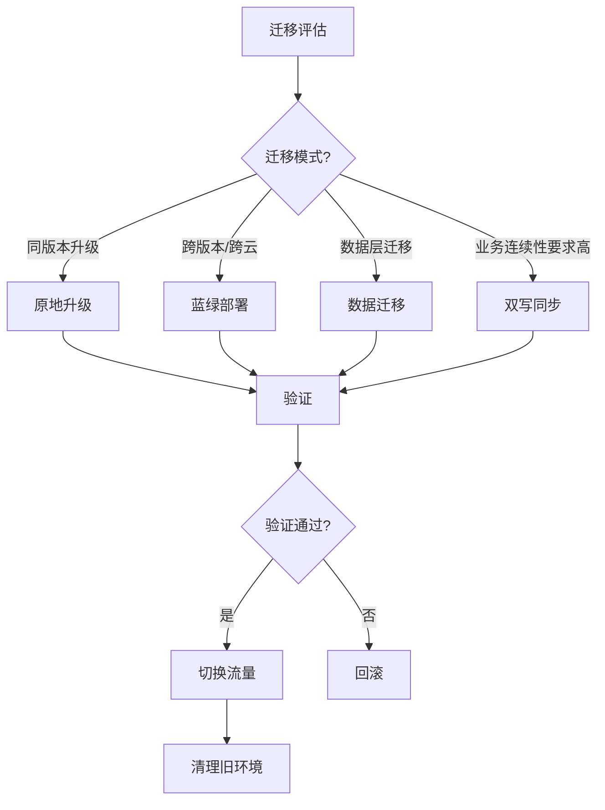
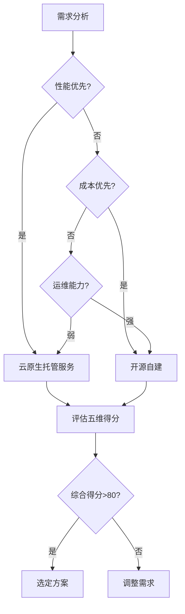
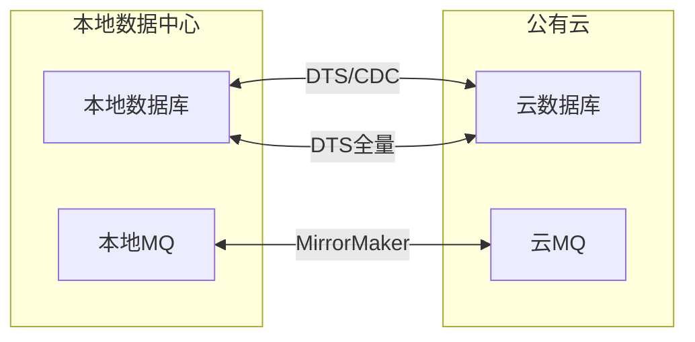
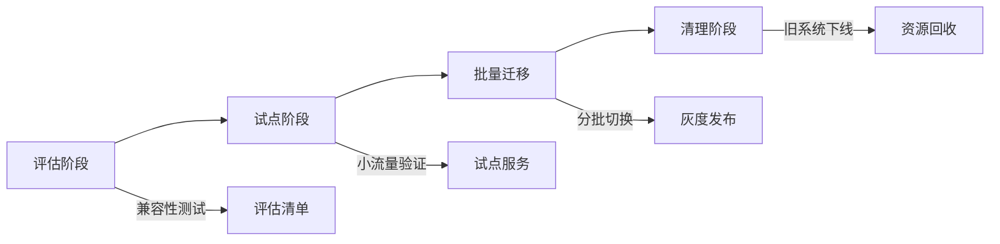
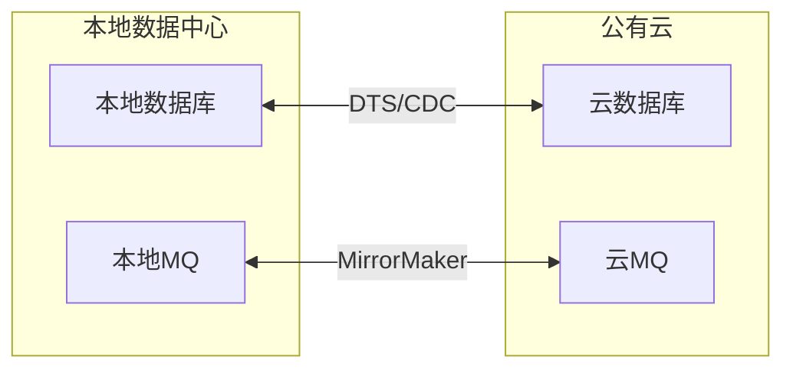

# 云上中间件体系总览（成本优化 / 多云编排 / SLA 对比 / 迁移路径）

> 云上中间件 = 云厂商把消息、缓存、数据库、数仓做成**托管服务（PaaS）**。本篇深入拆解：各云厂商中间件成本对比、多云编排策略、SLA 等级差异、迁移路径规划。

---

## 一、PaaS vs 自建

| 维度 | 自建 | 云托管 |
|------|------|--------|
| 人力 | 部署/升级/扩缩容全自己干 | 全托管，只写业务代码 |
| 高可用 | 自己搭主从/集群 | 厂商 SLA（99.9%~99.99%+） |
| 弹性 | 提前备机 | 秒~分钟级伸缩 |
| 升级 | 停服风险自担 | 厂商滚动升级 |
| 成本 | 闲时满配 | 按量付费 |
| 风险 | 完全可控 | 厂商锁定 |
| 备份恢复 | 自己搞 | 厂商自动备份 + 一键恢复 |
| 安全合规 | 自己搞 | 厂商合规认证（等保/PCI DSS） |

> 核心认知：**云托管的代价是厂商锁定，收益是运维成本降低 60-80%**——关键是选对协议兼容的中间件。

---

## 二、各云厂商中间件对比矩阵

### 2.1 消息队列

| 能力 | AWS | Azure | GCP | 阿里云 | 腾讯云 |
|------|-----|-------|-----|--------|--------|
| 标准队列 | SQS | Service Bus | Pub/Sub | 云 RocketMQ | CMQ |
| 事件总线 | EventBridge | Event Grid | Eventarc | 云 EventBridge | EventBridge |
| 流处理 | Kinesis/MSK | Event Hubs | Dataflow | 云 Kafka/Flink | CKafka |
| 协议兼容 | SQS API（非标准） | AMQP | gRPC | RocketMQ/Kafka 协议 | AMQP/Kafka |
| 延迟消息 | SQS Delay（最长15min） | Scheduled Delivery | 无原生 | RocketMQ 原生支持 | CMQ 延迟消息 |
| 事务消息 | SQS FIFO | Service Bus Peek-Lock | 无 | RocketMQ 原生支持 | CMQ 事务消息 |

### 2.2 数据库

| 能力 | AWS | Azure | GCP | 阿里云 | 腾讯云 |
|------|-----|-------|-----|--------|--------|
| MySQL | RDS/Aurora | Azure SQL | Cloud SQL | RDS/PolarDB | CDB/TDSQL |
| PostgreSQL | RDS/Aurora | Database for PG | Cloud SQL/AlloyDB | RDS/PolarDB | TDSQL |
| Redis | ElastiCache | Azure Cache | Memorystore | 云 Redis/Tair | 云 Redis |
| 文档库 | DocumentDB | Cosmos DB | Firestore | 云 MongoDB | 云 MongoDB |
| 图数据库 | Neptune | Cosmos DB Gremlin | — | GDB | — |
| 时序库 | Timestream | — | — | TSDB | — |

### 2.3 大数据/数仓

| 能力 | AWS | Azure | GCP | 阿里云 | 腾讯云 |
|------|-----|-------|-----|--------|--------|
| 数仓 | Redshift | Synapse | BigQuery | MaxCompute | 云数仓 |
| 流计算 | Kinesis Analytics | Stream Analytics | Dataflow | 云 Flink | 流计算 |
| 搜索 | OpenSearch | AI Search | 自建 ES | 云 ES | 云 ES |
| 调度 | Step Functions | Logic Apps | Workflows | 云工作流 | 云工作流 |
| 数据湖 | Lake Formation | Data Lake Gen2 | Dataproc | Data Lake | 数据湖 |

---

## 三、成本优化实战

### 3.1 计费模式

```
包年包月（预留实例）：稳定负载，省 30~60%
按量付费：波动负载，用多少付多少
Serverless：极低频/突发，按请求计费
Reserved Instance / Savings Plans：承诺用量折扣（1年/3年）
Spot / 抢占式实例：非关键任务，省 60~90%（可能被回收）
```

### 3.2 优化策略

| 策略 | 做法 | 省多少 | 风险 |
|------|------|--------|------|
| 预留+按量混合 | 基线用预留，峰值用按量 | 30~50% | 无 |
| 存储分层 | 热数据 SSD，冷数据 HDD/归档 | 50~80% | 冷数据访问延迟增加 |
| 自动缩容 | 非高峰时段缩容实例 | 20~40% | 缩容期间可能影响性能 |
| Serverless | 低频服务用 Lambda/函数计算 | 60~90% | 冷启动延迟 |
| 多可用区 | 按需部署（不需要全 AZ） | 10~20% | 可用性略降 |
| Spot 实例 | 非关键批处理用 Spot | 60~90% | 随时被回收 |
| 压缩 | 消息/日志压缩传输存储 | 30~50% | CPU 开销 |
| 清理策略 | 自动删除过期数据/日志 | 20~40% | 需确认保留策略 |

### 3.3 成本监控

```
工具：
  AWS Cost Explorer / Azure Cost Management / GCP Billing
  阿里云费用中心 / 腾讯云费用中心

实践：
  每周 Review 成本报表
  设置预算告警（超预算 80%/100%）
  标签管理（按团队/项目/环境标记资源）
  闲置资源检测（未挂载的云盘/未使用的弹性 IP）
  Reserved Instance 到期提醒（提前 30 天）
  成本归因（按服务/团队/环境拆分）
```

### 3.4 各云中间件价格对比（参考）

| 服务 | AWS（us-east-1） | GCP | 阿里云（华东1） |
|------|------------------|-----|-----------------|
| 托管 Redis 30GB | $0.092/hr ≈ $670/月 | $0.065/hr ≈ $475/月 | ¥0.064/GB/hr ≈ ¥340/月 |
| 托管 MySQL 4vCPU/16GB | $0.34/hr ≈ $2480/月 | $0.21/hr ≈ $1530/月 | ¥0.56/hr ≈ ¥4090/月 |
| 托管 Kafka 3 Broker | $0.21/hr/Broker ≈ $4600/月 | $0.17/hr/Broker ≈ $3700/月 | ¥1.2/hr/Broker ≈ ¥2590/月 |
| 对象存储（标准） | $0.023/GB/月 | $0.020/GB/月 | ¥0.12/GB/月 |

> 注意：价格随区域/配置/折扣波动，以官网为准。

---

## 四、SLA 等级差异

| 服务 | 99.9% SLA | 99.95% SLA | 99.99% SLA |
|------|-----------|------------|------------|
| RDS MySQL | 单可用区 | 多可用区 | 跨地域（极少见） |
| Redis | 单副本 | 多副本 | 集群模式 |
| 消息队列 | 单集群 | 多可用区 | 跨地域复制 |
| 对象存储 | 标准 | 高频访问 | 跨区域复制 |

> 多一个 9 的成本差异：通常高 2~5 倍。按业务价值选择，不是越高越好。

### SLA 与停机时间对照

| SLA | 年停机时间 | 月停机时间 | 适用场景 |
|-----|-----------|-----------|----------|
| 99.9% | 8.76 小时 | 43.8 分钟 | 内部工具/非关键服务 |
| 99.95% | 4.38 小时 | 21.9 分钟 | 一般业务服务 |
| 99.99% | 52.6 分钟 | 4.38 分钟 | 核心交易/支付 |
| 99.999% | 5.26 分钟 | 26.3 秒 | 金融核心/支付网关 |

---

## 五、多云与规避锁定

### 5.1 策略

| 策略 | 做法 | 代价 |
|------|------|------|
| 协议抽象 | 只依赖开源标准协议（S3/Kafka/MySQL/Redis） | API 兼容 |
| 客户端抽象 | 统一 MQ 客户端封装 | 开发成本 |
| 数据可迁移 | 备份/导出机制必须成熟 | 验证成本 |
| 双云高可用 | 关键读路径双云冗余 | 成本翻倍 |
| Terraform | 基础设施即代码，可跨云 | 学习成本 |
| Kubernetes | 容器化部署，跨云调度 | 运维复杂度 |

### 5.2 协议兼容优先级

```
放心选（协议是事实标准）：
  S3 协议（对象存储：AWS S3 / 阿里 OSS / MinIO）
  MySQL/PostgreSQL 协议（关系库：RDS / Cloud SQL）
  Redis 协议（缓存：ElastiCache / 云 Redis）
  Kafka 协议（消息：MSK / 云 Kafka）
  gRPC（服务通信）
  OpenTelemetry（可观测性）

谨慎选（厂商锁定风险高）：
  SQS API（AWS 私有）
  EventBridge 格式（各厂商不同）
  云数仓 SQL（各厂商方言不同）
  云原生 SDK（各厂商 API 不同）
```

### 5.3 多云架构模式

| 模式 | 说明 | 适用场景 |
|------|------|----------|
| 主备模式 | 一主一备，故障切换 | 灾备 |
| 双活模式 | 两云同时服务，流量切换 | 高可用 |
| 多活模式 | 多云同时服务，就近路由 | 全球化 |
| 灰度模式 | 新功能在新云验证后切换 | 迁移过渡 |

---

## 六、迁移路径规划

```
评估阶段（1~2 周）
  梳理现有中间件清单（类型/版本/数据量/QPS）
  评估各服务的迁移复杂度
  确定迁移优先级（低风险→高风险）
  制定回滚方案

试点阶段（2~4 周）
  选一个非核心服务试点
  验证协议兼容性（连接测试）
  测试性能和可靠性（压测）
  验证数据一致性

批量迁移（4~8 周）
  按优先级批量迁移
  双跑验证（新旧并行，比对数据）
  流量切换（灰度→全量）
  监控新服务稳定性

清理阶段（1~2 周）
  下线旧实例
  清理旧数据
  复盘总结
  更新文档/运维手册
```

### 迁移风险控制

| 风险 | 控制措施 |
|------|----------|
| 数据丢失 | 双写验证 + 数据校验脚本 |
| 性能下降 | 压测对比 + 灰度切换 |
| 兼容性问题 | 协议兼容测试 + 客户端适配 |
| 服务中断 | 双跑并行 + 快速回滚 |
| 成本超支 | 迁移前成本预估 + 实时监控 |

---

## 七、云中间件选型决策树

```
需要消息队列？
  ├── 高吞吐日志流 → Kafka/MSK
  ├── 业务解耦/延迟消息 → RabbitMQ/云 RocketMQ
  ├── 事件驱动 → EventBridge/Pub/Sub
  └── 事务消息 → RocketMQ

需要数据库？
  ├── MySQL 兼容 → RDS/Aurora/PolarDB
  ├── PostgreSQL 兼容 → RDS/AlloyDB
  ├── 缓存 → Redis/云 Redis
  ├── 文档 → MongoDB/Cosmos DB
  └── 图 → Neptune/GDB

需要大数据？
  ├── 数仓 → Redshift/Synapse/MaxCompute
  ├── 流处理 → Kinesis/Dataflow/云 Flink
  └── 搜索 → OpenSearch/云 ES
```

---

## 补充：云中间件深度对比

### 1. 完整云中间件对比矩阵

| 中间件类型 | AWS | Azure | GCP | 阿里云 | 腾讯云 |
|------------|-----|-------|-----|--------|--------|
| 消息队列 | SQS/SNS/MSK | Service Bus/Event Hubs | Pub/Sub/Kafka | RocketMQ/Kafka | CMQ/CKafka |
| 缓存 | ElastiCache | Azure Cache | Memorystore | Redis/Tair | 云 Redis |
| 数据库 | RDS/Aurora | Azure SQL | Cloud SQL | RDS/PolarDB | CDB/TDSQL |
| 对象存储 | S3 | Blob Storage | Cloud Storage | OSS | COS |
| 搜索 | OpenSearch | AI Search | 自建 ES | 云 ES | 云 ES |
| 数仓 | Redshift | Synapse | BigQuery | MaxCompute | 云数仓 |
| 流处理 | Kinesis | Event Hubs | Dataflow | Flink | 流计算 |

### 2. 托管消息队列对比

| 特性 | AWS SQS | Azure Service Bus | GCP Pub/Sub | 阿里云 RocketMQ |
|------|---------|-------------------|-------------|-----------------|
| 协议 | SQS API | AMQP | gRPC | RocketMQ/Kafka |
| 吞吐 | 高 | 高 | 高 | 高 |
| 延迟 | 低 | 低 | 低 | 低 |
| 事务 | FIFO | Peek-Lock | 无 | 原生支持 |
| 死信队列 | 支持 | 支持 | 支持 | 支持 |
| 延迟消息 | 15min | Scheduled | 无 | 原生支持 |
| 价格模型 | 按请求 | 按消息数 | 按消息数 | 按消息数 |

### 3. 托管缓存对比

| 特性 | AWS ElastiCache | Azure Cache | GCP Memorystore | 阿里云 Redis |
|------|-----------------|-------------|-----------------|--------------|
| 协议 | Redis/Memcached | Redis | Redis | Redis |
| 最大内存 | 510GB | 1.2TB | 300GB | 512GB |
| 集群模式 | 支持 | 支持 | 支持 | 支持 |
| 数据持久化 | 支持 | 支持 | 支持 | 支持 |
| 跨 AZ | 支持 | 支持 | 支持 | 支持 |
| 自动故障转移 | 支持 | 支持 | 支持 | 支持 |

### 4. 托管流处理对比

| 特性 | AWS Kinesis | Azure Event Hubs | GCP Pub/Sub | 阿里云 Kafka |
|------|-------------|------------------|-------------|--------------|
| 吞吐 | 1MB/s/shard | 1MB/s/分区 | 无限制 | 按规格 |
| 消息保留 | 24h-365d | 7d | 7d | 按配置 |
| 消费模型 | Read | Read | Push | Pull |
| Schema | 可选 | 可选 | 可选 | 可选 |
| 价格 | 按 shard | 按 TU | 按量 | 按规格 |

### 5. 云中间件成本对比

| 服务 | AWS（us-east-1） | GCP | 阿里云（华东1） |
|------|------------------|-----|-----------------|
| 托管 Redis 30GB | $0.092/hr ≈ $670/月 | $0.065/hr ≈ $475/月 | ¥0.064/GB/hr ≈ ¥340/月 |
| 托管 MySQL 4vCPU/16GB | $0.34/hr ≈ $2480/月 | $0.21/hr ≈ $1530/月 | ¥0.56/hr ≈ ¥4090/月 |
| 托管 Kafka 3 Broker | $0.21/hr/Broker ≈ $4600/月 | $0.17/hr/Broker ≈ $3700/月 | ¥1.2/hr/Broker ≈ ¥2590/月 |
| 对象存储（标准） | $0.023/GB/月 | $0.020/GB/月 | ¥0.12/GB/月 |

### 6. 云中间件选择决策树

```
需要消息队列？
  ├── 高吞吐日志流 → Kafka/MSK
  ├── 业务解耦/延迟消息 → RabbitMQ/云 RocketMQ
  ├── 事件驱动 → EventBridge/Pub/Sub
  └── 事务消息 → RocketMQ

需要缓存？
  ├── Redis 协议 → ElastiCache/Memorystore/云 Redis
  ├── 大对象缓存 → S3/Blob Storage
  └── 本地缓存 → ElastiCache Serverless

需要数据库？
  ├── MySQL 兼容 → RDS/Aurora/PolarDB
  ├── PostgreSQL 兼容 → RDS/AlloyDB
  ├── 文档 → MongoDB/Cosmos DB
  └── 图 → Neptune/GDB
```

### 7. 云中间件安全与合规

| 维度 | AWS | Azure | GCP |
|------|-----|-------|-----|
| 加密 | KMS/CMK | Key Vault | Cloud KMS |
| 审计 | CloudTrail | Activity Log | Audit Log |
| 网络 | VPC/私有子网 | VNet/私有端点 | VPC/私有访问 |
| 合规 | SOC/PCI DSS/HIPAA | SOC/PCI DSS/HIPAA | SOC/PCI DSS |
| 身份 | IAM | Entra ID | Cloud IAM |

### 8. 云中间件运维自动化

| 工具 | AWS | Azure | GCP |
|------|-----|-------|-----|
| IaC | CloudFormation/CDK | ARM/Bicep | Deployment Manager |
| 配置管理 | SSM | Automation | Config Connector |
| 监控 | CloudWatch | Monitor | Cloud Monitoring |
| 日志 | CloudWatch Logs | Log Analytics | Cloud Logging |
| 告警 | CloudWatch Alarms | Alert Rules | Alerting Policies |

### 9. 云中间件数据迁移服务

| 场景 | AWS | Azure | GCP |
|------|-----|-------|-----|
| MySQL 迁移 | DMS | Database Migration Service | Database Migration Service |
| Kafka 迁移 | MSK Connect | Event Hubs Kafka | Pub/Sub Kafka Connect |
| Redis 迁移 | ElastiCache Migration | Azure Cache Migration | Memorystore Migration |
| 对象存储迁移 | S3 Transfer | AzCopy | Storage Transfer |

### 10. 云中间件性能基准

| 服务 | 指标 | AWS | Azure | GCP |
|------|------|-----|-------|-----|
| Redis | 延迟 | <1ms | <1ms | <1ms |
| MySQL | QPS | 10000+ | 10000+ | 10000+ |
| Kafka | 吞吐 | 1GB/s/broker | 1GB/s/partition | 无限制 |
| 对象存储 | 吞吐 | 5.5GB/s | 60GB/s | 无限制 |

### 11. 云中间件最佳实践清单

| 实践 | 说明 |
|------|------|
| 协议优先 | 选择开源标准协议（Redis/Kafka/MySQL） |
| 多可用区 | 核心服务部署多 AZ |
| 加密传输 | 启用 TLS 加密 |
| 监控告警 | 设置关键指标告警 |
| 备份恢复 | 定期测试恢复流程 |
| 成本优化 | 使用预留实例+按量混合 |
| 安全审计 | 启用审计日志 |
| 容量规划 | 基于监控预测扩容 |
| 网络隔离 | 使用私有子网和安全组 |
| 访问控制 | 最小权限原则 |
| 版本管理 | 保持中间件版本更新 |
| 文档维护 | 维护架构图和运维手册 |
| 灾备演练 | 定期进行故障切换演练 |
| 自动化运维 | 使用 IaC 和自动化工具 |
| 日志集中化 | 使用 ELK/Splunk 集中管理日志 |
| 性能测试 | 定期进行压测和容量评估 |
| 安全加固 | 定期进行安全扫描和渗透测试 |
| 变更管理 | 建立变更审批流程 |
| 回滚机制 | 每次变更都有回滚方案 |
| 成本分账 | 按团队/项目分摊云资源费用 |
| 供应商评估 | 定期评估云服务商能力 |
| 技术债务 | 定期清理技术债务 |
| 培训机制 | 建立云技能培训体系 |
| 知识沉淀 | 建立云中间件知识库 |
| 持续改进 | 定期复盘优化流程 |
| 自动化测试 | 建立自动化测试体系 |
| 灰度发布 | 核心服务使用灰度发布策略 |
| 服务治理 | 建立统一的服务治理框架 |

---

## 八、云消息选型决策树

```
场景 → 云消息服务选择：

需要消息队列？
  ├── 高吞吐日志/事件流 → Kafka/MSK/CKafka
  │     适用：日志管道、CDC、事件流
  │     延迟：ms~s级
  │     吞吐：MB/s级
  ├── 业务解耦/任务分发 → SQS/RocketMQ
  │     适用：订单处理、异步任务、延迟消息
  │     延迟：ms级
  │     吞吐：万级QPS
  ├── 事件驱动/规则路由 → EventBridge/EventGrid/Eventarc
  │     适用：云服务事件、SaaS集成、定时任务
  │     延迟：ms级
  │     吞吐：事件数/s
  └── 事务消息 → RocketMQ
        适用：分布式事务、最终一致性
        特性：半消息、回查、事务消息

选择维度：
  协议兼容 → Kafka协议(通用) > RocketMQ协议(国内) > SQS API(AWS锁定)
  吞吐需求 → Kafka > RocketMQ > SQS
  延迟需求 → SQS < EventBridge < Kafka
  事务需求 → RocketMQ > Kafka(Exactly-Once) > SQS
  成本 → SQS(按请求) < RocketMQ(按消息) < Kafka(按Broker)
```

### 云缓存选型决策树

```
场景 → 云缓存选择：

需要缓存？
  ├── Redis协议兼容 → ElastiCache/Memorystore/云Redis
  │     适用：会话缓存、排行榜、分布式锁
  │     特性：数据结构丰富、持久化、集群模式
  │     最大内存：510GB
  ├── 大对象/低频 → S3/Blob Storage
  │     适用：图片、视频、大文件元数据
  │     特性：REST API、无限容量
  ├── 超低延迟(DAX/Memorystore for Redis集群) → DAX/Redis集群
  │     适用：电商秒杀、实时竞价
  │     延迟：微秒级
  ├── 纯缓存(无持久化) → ElastiCache Serverless
  │     适用：临时缓存、计算缓存
  │     特性：自动扩缩、按使用付费
  └── 跨区域复制 → ElastiCache Global Datastore
        适用：全球游戏/电商
        特性：多区域同步

选择维度：
  数据结构 → Redis(5种) > Memcached(简单KV)
  持久化 → Redis(支持) > Memcached(不支持)
  集群模式 → 两者都支持
  成本 → Memcached < Redis单机 < Redis集群
  延迟 → DAX(μs) < Redis(ms) < Memcached(ms)
```

### 云流处理选型决策树

```
场景 → 云流处理选择：

需要流处理？
  ├── 高吞吐实时聚合 → Kinesis Data Streams/MSK
  │     适用：日志实时分析、IoT数据聚合
  │     吞吐：1MB/s/shard
  │     保留：24h~365d
  ├── 事件驱动/路由 → EventBridge/Kinesis Data Firehose
  │     适用：S3自动摄入、Elasticsearch索引
  │     特性：自动重试、格式转换
  ├── 复杂事件处理(CEP) → Flink on K8s/云Flink
  │     适用：风控、欺诈检测、模式匹配
  │     特性：有状态计算、窗口、CEP
  ├── 实时ETL/数据集成 → MSK Connect + S3/数仓
  │     适用：Kafka到S3/Redshift实时同步
  │     特性：Exactly-Once、Schema管理
  └── 流式机器学习 → Kinesis + SageMaker
        适用：实时特征计算、在线推理
        特性：流式特征、模型更新

选择维度：
  吞吐 → Kinesis > MSK > Flink(取决于并行度)
  复杂度 → Flink > Kinesis > Firehose
  延迟 → Flink(ms) < Kinesis(s) < Firehose(min)
  成本 → Firehose(按量) < Kinesis(按shard) < MSK(按Broker)
  运维 → Firehose(全托管) < Kinesis(托管) < Flink(需运维)
```

### 云数据库选型决策树

```
场景 → 云数据库选择：

需要数据库？
  ├── MySQL兼容 → RDS/Aurora/PolarDB
  │     适用：OLTP、电商、ERP
  │     特性：ACID、事务、外键
  ├── PostgreSQL兼容 → RDS/Aurora/AlloyDB
  │     适用：地理信息、全文搜索、JSON
  │     特性：扩展性强、GIS支持
  ├── 文档型 → DocumentDB/Cosmos DB/Firestore
  │     适用：内容管理、用户画像、CMS
  │     特性：灵活Schema、水平扩展
  ├── 键值 → DynamoDB/Azure Table Storage
  │     适用：会话存储、配置管理、元数据
  │     特性：毫秒延迟、无限扩展
  ├── 图 → Neptune/Cosmos DB Gremlin
  │     适用：社交网络、推荐、欺诈检测
  │     特性：图遍历、模式匹配
  ├── 时序 → Timestream/IoT Hub
  │     适用：IoT监控、日志指标
  │     特性：时间索引、自动聚合
  └── 全球分布式 → Cosmos DB/Globally Distributed DB
        适用：全球游戏、社交
        特性：多区域写、99.999% SLA

选择维度：
  一致性 → Aurora(强一致) > DynamoDB(最终一致)
  扩展性 → DynamoDB/Cosmos(自动扩展) > RDS(手动)
  成本 → DynamoDB(按请求) < RDS(按实例)
  复杂度 → SQL(复杂查询) > NoSQL(简单KV)
  生态 → RDS(Hive/Spark集成) > DynamoDB(云原生)
```

## 云中间件成本计算器

```
成本估算公式：

存储成本 = 数据量(GB) × 单价($/GB/月) × 月数
计算成本 = 实例规格 × 小时数 × 单价($/hr)
网络成本 = 流量(GB) × 单价($/GB) × 区域系数

示例：3节点Redis集群(64GB) + RDS MySQL(4vCPU/16GB) + Kafka(3 Broker)

Redis成本(阿里云华东1)：
  64GB × ¥0.064/GB/hr × 730hr = ¥3,000/月

RDS MySQL成本：
  4vCPU/16GB × ¥0.56/hr × 730hr = ¥4,090/月

Kafka成本(3 Broker)：
  3 × ¥1.2/Broker/hr × 730hr = ¥2,590/月

总计：¥9,680/月

优化后(预留+Spot)：
  Redis预留1年：¥3,000 × 0.7 = ¥2,100
  RDS预留1年：¥4,090 × 0.65 = ¥2,659
  Kafka预留1年：¥2,590 × 0.7 = ¥1,813
  总计：¥6,572/月（节省32%）
```

## 云中间件迁移模式

| 模式 | 说明 | 工具 | 风险 |
|------|------|------|------|
| 原地升级 | 就地升级版本 | 各云控制台 | 中（停机风险） |
| 蓝绿部署 | 新环境部署，流量切换 | DMS/自建脚本 | 低（可回滚） |
| 数据迁移 | 底层数据迁移，服务不变 | DMS/数据传输服务 | 低（数据一致性） |
| 双写同步 | 新旧环境双写，比对验证 | Canal + Kafka | 低（数据一致性） |
| 全量重导 | 数据导出导入新环境 | DataX/DistCp | 高（停机时间长） |



### 迁移关键检查点

| 检查项 | 说明 | 工具/方法 |
|--------|------|-----------|
| Schema兼容性 | 新旧表结构一致 | Schema对比工具 |
| 数据一致性 | 行数/校验和一致 | 数据校验脚本 |
| 性能基准 | QPS/延迟达标 | 压测工具(JMeter) |
| 功能验证 | 业务逻辑正确 | 自动化测试 |
| 监控覆盖 | 告警规则完整 | 监控配置审查 |
| 回滚方案 | 可快速回退 | 文档+演练 |
| 时间窗口 | 低峰期执行 | 业务协调 |

### 多云中间件同步策略

| 策略 | 说明 | 工具 | 适用场景 |
|------|------|------|----------|
| 双写 | 应用同时写两个云 | 自建双写逻辑 | 强一致性 |
| CDC同步 | CDC捕获变更同步 | Debezium + Kafka Connect | 近实时 |
| 定期同步 | 定期全量同步 | DataX + 调度 | 离线分析 |
| 事件同步 | 事件总线桥接 | EventBridge + SQS/SNS | 事件驱动 |

```
同步一致性级别：
  强一致：双写 + 事务（成本高、性能低）
  最终一致：CDC + 异步同步（成本低、延迟高）
  读时一致：写入时校验路由（中等）

选择建议：
  核心交易数据 → 强一致（双写）
  日志/监控数据 → 最终一致（CDC）
  配置数据 → 读时一致（路由）
```

---

## 八、云中间件运维最佳实践

| 实践 | 说明 |
|------|------|
| 监控告警 | 云监控 + Prometheus（多云统一） |
| 备份恢复 | 自动备份 + 跨区域复制 + 定期恢复演练 |
| 安全合规 | 加密（传输+存储）+ 审计日志 + 合规认证 |
| 成本管理 | 标签管理 + 预算告警 + 闲置资源检测 |
| 变更管理 | 变更窗口 + 回滚方案 + 灰度发布 |
| 容量规划 | 基于监控数据预测 + 自动扩缩容 |
| 灾备演练 | 定期故障注入 + 切换演练 |

### 8.1 云中间件 SLA 选型决策

```
SLA 选型逻辑：
  1. 识别业务关键级别（P0/P1/P2/P3）
  2. P0 核心交易（支付/订单）→ 99.99% SLA（跨可用区）
  3. P1 重要服务（用户/库存）→ 99.95% SLA（多可用区）
  4. P2 一般服务（通知/日志）→ 99.9% SLA（单可用区）
  5. P3 内部工具（监控/运维）→ 99.9% SLA（单可用区）
```

### 8.2 云中间件监控体系

```
监控层次：
  基础层：云监控（CPU/内存/磁盘/网络）
  服务层：Prometheus + Exporter（中间件指标）
  应用层：OpenTelemetry（链路/指标/日志）
  业务层：自定义指标（QPS/延迟/错误率）

告警层次：
  通知：邮件/钉钉/Slack
  升级：PagerDuty/Opsgenie
  自动恢复：自动扩容/重启/切换
```

### 8.3 云中间件容灾方案

| 方案 | 说明 | RPO/RTO |
|------|------|---------|
| 同城双活 | 两可用区同时服务 | 0/分钟级 |
| 异地灾备 | 一主一备，故障切换 | 分钟/小时级 |
| 多活 | 多地域同时服务 | 0/秒级 |

---

## 九、五维评估模型

### 9.1 评估维度

| 维度 | 评估指标 | 权重 |
|------|----------|------|
| 性能 | 延迟P99、吞吐量、并发数 | 30% |
| 可靠性 | SLA、故障恢复、数据持久性 | 25% |
| 成本 | 实例费用、存储费用、网络费用 | 25% |
| 运维复杂度 | 部署难度、监控、升级 | 10% |
| 生态兼容 | 协议支持、API兼容、社区活跃度 | 10% |

### 9.2 评估决策矩阵



## 十、消息中间件选型矩阵

| 维度 | Kafka | RocketMQ | Pulsar |
|------|-------|----------|--------|
| 吞吐量 | 极高 | 高 | 极高 |
| 延迟 | ms级 | ms级 | ms级 |
| 消息顺序 | 分区有序 | 队列有序 | 分区有序 |
| 事务消息 | 支持 | 支持 | 支持 |
| 延迟消息 | 不支持 | 支持（18级） | 支持 |
| 消息回溯 | 支持 | 支持 | 支持 |
| 运维复杂度 | 中 | 低 | 高 |
| 生态兼容 | 好 | 好 | 一般 |

## 十一、托管缓存选型对比

| 维度 | Redis | Memcached | 云托管Redis |
|------|-------|-----------|-------------|
| 数据结构 | 丰富（String/Hash/List/Set） | 仅KV | 丰富 |
| 持久化 | RDB+AOF | 无 | RDB+AOF |
| 集群 | Redis Cluster | 客户端分片 | 托管集群 |
| 内存效率 | 中 | 高 | 中 |
| 运维 | 需自运维 | 简单 | 托管服务 |

## 十二、流处理框架选型

| 维度 | Flink | Spark Streaming | Kafka Streams |
|------|-------|-----------------|---------------|
| 处理模型 | 流批一体 | 微批 | 流 |
| 延迟 | ms级 | 秒级 | ms级 |
| 状态管理 | 内置 | 需外部 | 内置 |
| 容错 | Checkpoint | Checkpoint | 无 |
| 运维 | 独立集群 | Spark集群 | 嵌入应用 |

## 十三、成本优化策略

| 策略 | 做法 | 效果 |
|------|------|------|
| 预留实例 | 1年/3年预留 | 节省30~60% |
| 按需+预留混合 | 基线预留+峰值按需 | 平衡成本弹性 |
| Spot实例 | 抢占式实例 | 节省60~80% |
| 自动伸缩 | 按负载调整实例数 | 避免闲置 |
| 存储分层 | 热/温/冷分层 | 降低存储成本 |

## 十四、混合云同步策略



| 同步场景 | 方案 | RPO |
|----------|------|-----|
| 数据库同步 | DTS/CDC | 秒级 |
| 消息同步 | MirrorMaker/Connector | 秒级 |
| 文件同步 | 对象存储同步 | 分钟级 |
| 全量迁移 | DTS全量+增量 | 秒级 |

## 十五、中间件监控指标体系

### 15.1 通用监控指标

| 指标类型 | 指标 | 告警阈值 |
|----------|------|----------|
| 可用性 | 服务存活检查 | 连续3次失败 |
| 延迟 | P99响应时间 | >500ms |
| 吞吐 | 每秒请求数 | <预期50% |
| 错误率 | 5xx错误比例 | >1% |
| 资源 | CPU/内存使用率 | >85% |

### 15.2 中间件专项监控

| 中间件 | 关键指标 | 说明 |
|--------|----------|------|
| Kafka | 消费延迟(Lag) | 消费者积压量 |
| Redis | 命中率/内存碎片 | 缓存效率 |
| MySQL | 连接数/慢查询 | 数据库健康 |
| MQ | 消息堆积/消费TPS | 消息处理能力 |

## 十六、中间件迁移四阶段



| 阶段 | 任务 | 时间 |
|------|------|------|
| 评估 | 兼容性/性能/成本评估 | 2~4周 |
| 试点 | 1~2个服务试点迁移 | 2~4周 |
| 批量 | 分批迁移+灰度切换 | 4~8周 |
| 清理 | 旧系统下线+资源回收 | 2周 |

## 十七、中间件治理清单

| 治理项 | 检查点 | 频率 |
|--------|--------|------|
| 版本管理 | 统一中间件版本 | 季度 |
| 配置规范 | 配置模板化 | 月度 |
| 安全审计 | 漏洞扫描+权限检查 | 月度 |
| 容量评估 | 资源使用趋势分析 | 季度 |
| 灾备演练 | 故障注入+恢复测试 | 半年 |

## 十八、云中间件选型五维评估模型

### 18.1 评估维度与权重

| 维度 | 评估指标 | 权重 | 评分标准 |
|------|----------|------|---------|
| 功能 | 协议兼容、API 完整性、生态丰富度 | 25% | 是否满足核心需求 |
| 性能 | 延迟 P99、吞吐量、并发数 | 25% | 压测对比 |
| 成本 | 实例费用、存储费用、网络费用 | 20% | 3年 TCO 对比 |
| 生态 | 开源兼容、社区活跃度、文档质量 | 15% | 迁移成本 |
| 运维 | 部署难度、监控、升级、SLA | 15% | 运维人力投入 |

### 18.2 评估决策矩阵


## 十九、AWS 托管消息三件套选型决策树

```
需要消息队列？
  ├── 任务队列/延迟消息 → SQS
  │     标准队列：高吞吐，至少一次投递
  │     FIFO 队列：严格有序，正好一次
  │     延迟：最长 15 分钟
  │
  ├── 事件广播/推送 → SNS
  │     发布-订阅模型
  │     支持 HTTP/SQS/Lambda/Email/SMS 推送
  │     消息过滤（Message Filtering）
  │
  ├── 事件驱动/规则路由 → EventBridge
  │     70+ AWS 服务事件源
  │     内置规则引擎（内容路由）
  │     自定义事件总线（跨账户/跨区域）
  │
  └── 事务消息 → SQS FIFO + DynamoDB
        事务性消息投递 + 幂等消费

选择维度：
  任务队列 → SQS（简单可靠）
  事件广播 → SNS（扇出推送）
  复杂事件 → EventBridge（规则路由）
  事务场景 → SQS FIFO + 业务幂等
```

## 二十、托管缓存选型

| 维度 | ElastiCache Redis | ElastiCache Memcached | DAX |
|------|-------------------|----------------------|-----|
| 数据结构 | 丰富（String/Hash/List/Set/ZSet） | 仅 KV | KV |
| 持久化 | RDB + AOF | 无 | RDB |
| 集群模式 | Redis Cluster | 客户端分片 | DynamoDB 原生 |
| 内存效率 | 中 | 高 | N/A |
| 延迟 | <1ms | <1ms | 微秒级 |
| 适用场景 | 会话/排行榜/分布式锁 | 简单缓存/页面缓存 | DynamoDB 加速 |
| 成本 | 中 | 低 | 按请求 |

```
选型决策：
  需要复杂数据结构 → Redis
  纯 KV 缓存且追求低成本 → Memcached
  DynamoDB 热点加速 → DAX
  跨区域复制 → ElastiCache Global Datastore
```

## 二十一、托管流处理选型

| 维度 | Kinesis Data Streams | MSK (Managed Kafka) | Kafka Connect |
|------|---------------------|---------------------|---------------|
| 吞吐 | 1MB/s/shard | 按 Broker 配置 | 按 Connector |
| 消息保留 | 24h-365d | 按配置 | N/A |
| 消费模型 | Read (pull) | Pull | Source/Sink |
| Schema | 可选 | 可选 | 可选 |
| 价格 | 按 shard | 按 Broker | 按 Connector |
| 适用 | 实时分析 | 大数据/日志 | 数据集成 |

```
选型决策：
  简单实时分析 → Kinesis（全托管）
  大数据/日志 → MSK（Kafka 兼容）
  数据集成 → Kafka Connect（Source/Sink）
```

## 云中间件选型决策矩阵

| 中间件类型 | AWS 推荐 | 阿里云推荐 | Azure 推荐 | 自建推荐 |
|-----------|---------|-----------|-----------|---------|
| 消息队列 | SQS + SNS | MNS + RocketMQ | Service Bus | Kafka/RocketMQ |
| 服务注册 | Cloud Map | MSE Nacos | Azure Cosmos DB | Nacos/Consul |
| 配置中心 | AppConfig | ACM | App Configuration | Nacos/Apollo |
| API 网关 | API Gateway | API Gateway | API Management | Kong/APISIX |
| 对象存储 | S3 | OSS | Blob Storage | MinIO |
| 缓存 | ElastiCache | Redis | Azure Cache | Redis Cluster |
| 搜索 | OpenSearch | OpenSearch | Azure Search | Elasticsearch |
| 任务调度 | EventBridge + Lambda | Serverless 工作流 | Logic Apps | Airflow/XXL-Job |
| 链路追踪 | X-Ray | ARMS | App Insights | SkyWalking/Jaeger |
| 日志 | CloudWatch Logs | SLS | Log Analytics | ELK/Loki |

## 云中间件成本对比分析

```
消息队列月成本对比（10 万 TPS）：

  AWS SQS Standard:
    ├── 调用费: $0.20/M × 30B = $6000
    ├── 存储: $0.40/GB × 100GB = $40
    └── 月成本: ~$6040

  阿里云 MNS:
    ├── 按量: ¥0.002/万次 × 30 亿 = ¥6000
    ├── 存储: ¥0.00006/GB/小时 × 100GB × 720h = ¥4.3
    └── 月成本: ~¥6004 (≈$835)

  自建 Kafka (3 Broker):
    ├── EC2: 3 × c5.xlarge × $0.17 = $0.51/h = $367/月
    ├── EBS: 3 × 500GB × $0.10 = $150/月
    ├── 带宽: $0.09/GB × 10TB = $900/月
    └── 月成本: ~$1417

  成本排名：自建 Kafka < 阿里云 MNS < AWS SQS
```

| 场景 | 推荐方案 | 月成本估算 | 备注 |
|------|---------|-----------|------|
| 低频 API | API Gateway + Lambda | $50-200 | 按量 |
| 高频 API | EC2 + Kong | $200-500 | 固定 |
| 消息解耦 | SQS + SNS | $100-1000 | 按量 |
| 服务网格 | EKS + Istio | $500-2000 | 按节点 |
| 数据缓存 | ElastiCache | $200-1000 | 按节点 |

## 云中间件 SLA 对比

| 服务 | AWS SLA | 阿里云 SLA | Azure SLA |
|------|---------|-----------|-----------|
| SQS | 99.9% | 99.9% | 99.9% |
| S3 | 99.9% (单AZ), 99.99% (多AZ) | 99.995% | 99.9% (LRS), 99.99% (GRS) |
| API Gateway | 99.95% | 99.95% | 99.95% |
| ElastiCache | 99.99% | 99.9% | 99.9% |
| Lambda | 99.95% | 99.99% | 99.95% |
| DynamoDB | 99.999% (全球表) | 99.99% | 99.999% |

## 云中间件监控告警最佳实践

```
监控指标体系：

  基础设施层：
    ├── CPU / 内存 / 磁盘 / 网络
    ├── 连接数 / 线程数
    └── GC / 堆内存

  应用层：
    ├── QPS / TPS / 延迟 P99
    ├── 错误率 / 重试率
    └── 消息积压 / 消费延迟

  业务层：
    ├── 订单量 / 支付成功率
    ├── 数据一致性指标
    └── 用户体验指标
```

```
# 告警规则模板
resource "aws_cloudwatch_metric_alarm" "high_latency" {
  alarm_name          = "high-api-latency"
  comparison_operator = "GreaterThanThreshold"
  evaluation_periods  = 3
  metric_name         = "Latency"
  namespace           = "AWS/ApiGateway"
  period              = 300
  statistic           = "p99"
  threshold           = 1000  # 1秒
  alarm_description   = "API P99 延迟超过 1 秒"
  alarm_actions       = [aws_sns_topic.alerts.arn]
}
```

## 云中间件成本预警最佳实践

```
成本预警机制：

  1. 预算告警
     设置月度预算上限
     达到 80% 时邮件/钉钉告警
     达到 100% 时自动冻结非关键资源

  2. 异常检测
     每日对比前 7 天均值
     突增 >30% 自动告警
     每周生成成本报表

  3. 资源闲置检测
     未挂载的云盘
     未使用的弹性 IP
     低流量的 NAT 网关
     闲置的负载均衡器

  4. 标签管理
     按团队/项目/环境打标签
     成本归因到具体业务
     定期清理无标签资源

  5. RI/SP 到期提醒
     提前 30 天提醒预留实例到期
     评估续费 vs 按量
```

## 二十三、混合云中间件同步模式



| 同步场景 | 方案 | RPO | 工具 |
|----------|------|-----|------|
| 数据库同步 | DTS/CDC | 秒级 | 阿里云 DTS / AWS DMS |
| 消息同步 | MirrorMaker/Connector | 秒级 | Kafka MirrorMaker 2 |
| 文件同步 | 对象存储同步 | 分钟级 | S3 跨区域复制 |
| 全量迁移 | DTS 全量+增量 | 秒级 | DataX / DTS |

```
同步一致性级别：
  强一致：双写 + 事务（成本高、性能低）
  最终一致：CDC + 异步同步（成本低、延迟高）
  读时一致：写入时校验路由（中等）

选择建议：
  核心交易数据 → 强一致（双写）
  日志/监控数据 → 最终一致（CDC）
  配置数据 → 读时一致（路由）
```

## 云中间件成本优化

```yaml
# 成本优化策略
cost_optimization:
  # 预留实例
  reserved_instances:
    - service: RDS
      term: 1_year
      discount: 40%
    - service: Redis
      term: 3_year
      discount: 60%
    
  # Spot实例
  spot_instances:
    - service: ECS
      discount: 70%
      availability: "5%"
    
  # 存储优化
  storage:
    - tier: Hot
      service: SSD
      cost: high
    - tier: Warm
      service: HDD
      cost: medium
    - tier: Cold
      service: Archive
      cost: low
```

### 成本优化策略

| 策略 | 说明 | 节省比例 |
|------|------|----------|
| 预留实例 | 1-3年预付 | 30-60% |
| Spot实例 | 抢占式实例 | 50-70% |
| 存储分层 | 热温冷分层 | 40-60% |
| 自动伸缩 | 按需扩缩 | 20-40% |
| 资源回收 | 清理闲置资源 | 10-30% |

### 成本监控告警

```yaml
# 成本告警配置
alerts:
  - name: "日成本超预算"
    condition: "daily_cost > budget * 1.2"
    severity: warning
    notify: [email, slack]
    
  - name: "资源闲置"
    condition: "idle_resources > 20%"
    severity: info
    notify: [email]
```

## 云中间件 SLA 对比

```yaml
# SLA 对比表
sla_comparison:
  database:
    RDS:
      availability: "99.95%"
      rpo: "5分钟"
      rto: "30分钟"
      backup: "自动备份"
    
    MongoDB:
      availability: "99.99%"
      rpo: "1分钟"
      rto: "5分钟"
      backup: "连续备份"
  
  cache:
    Redis:
      availability: "99.99%"
      rpo: "1秒"
      rto: "1分钟"
      backup: "RDB+AOF"
  
  message_queue:
    Kafka:
      availability: "99.95%"
      rpo: "0"
      rto: "5分钟"
      backup: "多副本"
```

### SLA 选择建议

| SLA级别 | 适用场景 | 成本影响 |
|---------|----------|----------|
| 99.9% | 开发测试 | 低 |
| 99.95% | 一般业务 | 中 |
| 99.99% | 核心业务 | 高 |
| 99.999% | 金融支付 | 极高 |

## 监控告警最佳实践

```yaml
# 监控配置
monitoring:
  # 指标监控
  metrics:
    - name: "CPU使用率"
      threshold: "> 80%"
      duration: "5m"
      severity: warning
    
    - name: "内存使用率"
      threshold: "> 85%"
      duration: "5m"
      severity: warning
    
    - name: "磁盘使用率"
      threshold: "> 90%"
      duration: "10m"
      severity: critical
  
  # 日志监控
  logs:
    - pattern: "ERROR"
      threshold: "> 10/min"
      severity: warning
    
    - pattern: "OutOfMemory"
      threshold: "> 0"
      severity: critical
  
  # 链路追踪
  traces:
    - name: "请求延迟P99"
      threshold: "> 1s"
      duration: "5m"
      severity: warning
```

### 告警分级

| 级别 | 说明 | 响应时间 | 通知方式 |
|------|------|----------|----------|
| P0 | 服务不可用 | 5分钟 | 电话+短信 |
| P1 | 功能降级 | 15分钟 | 短信+邮件 |
| P2 | 性能下降 | 1小时 | 邮件 |
| P3 | 预警 | 24小时 | 邮件 |

## 多云管理策略

```yaml
# 多云配置
multi_cloud:
  # 云厂商选择
  providers:
    - name: "AWS"
      services: ["RDS", "S3", "CloudFront"]
      region: "us-east-1"
    
    - name: "Azure"
      services: ["Cosmos DB", "Blob Storage"]
      region: "eastus"
    
    - name: "Alibaba Cloud"
      services: ["RDS", "OSS", "CDN"]
      region: "cn-hangzhou"
  
  # 数据同步
  sync:
    strategy: "active-active"
    conflict_resolution: "last-write-wins"
    sync_interval: "5s"
  
  # 流量调度
  routing:
    strategy: "geographic"
    fallback: "round-robin"
```

### 多云管理最佳实践

| 实践 | 说明 | 收益 |
|------|------|------|
| 协议兼容 | 使用标准协议 | 避免锁定 |
| 数据同步 | 跨云数据同步 | 高可用 |
| 统一监控 | 统一监控平台 | 运维效率 |
| 成本对比 | 跨云成本分析 | 成本优化 |

## 安全合规框架

```yaml
# 安全配置
security:
  # 身份认证
  authentication:
    - type: "IAM"
      provider: "云厂商"
    - type: "SSO"
      provider: "企业AD"
    - type: "MFA"
      enabled: true
  
  # 访问控制
  authorization:
    - model: "RBAC"
      granularity: "资源级"
    - audit: true
    - log: true
  
  # 数据加密
  encryption:
    - at_rest: true
      algorithm: "AES-256"
    - in_transit: true
      algorithm: "TLS 1.3"
```

### 合规检查清单

| 检查项 | 说明 | 状态 |
|--------|------|------|
| 身份认证 | 启用MFA | 必须 |
| 访问控制 | 最小权限原则 | 必须 |
| 数据加密 | 静态+传输加密 | 必须 |
| 审计日志 | 开启操作审计 | 必须 |
| 备份策略 | 定期备份验证 | 必须 |
| 灾备方案 | 跨地域灾备 | 建议 |

## 云中间件统一运维平台

### 统一运维平台架构

```
云中间件统一运维平台：

  资源管理层：
    - 资源拓扑：云账号 → Region → 可用区 → 实例
    - 资源标签：环境/业务/负责人
    - 资源成本：按标签分摊费用

  监控告警层：
    - 指标采集：Prometheus/CloudWatch
    - 日志采集：ELK/Loki
    - 告警管理：分级告警/告警收敛

  自动化运维层：
    - 批量操作：批量重启/批量升级
    - 自动伸缩：基于指标自动扩缩容
    - 自动备份：定时备份/跨区域备份

  安全合规层：
    - 访问控制：IAM/RBAC
    - 审计日志：操作审计/变更审计
    - 合规检查：自动扫描/报告生成
```

### 多云适配层设计

| 组件 | AWS | Azure | GCP | 阿里云 |
|------|-----|-------|-----|--------|
| 消息队列 | SQS | Service Bus | Pub/Sub | RocketMQ |
| 数据库 | RDS | SQL Database | Cloud SQL | RDS |
| 缓存 | ElastiCache | Redis Cache | Memorystore | Redis |
| 搜索 | OpenSearch | Azure Search | Elasticsearch | ES |
| 对象存储 | S3 | Blob Storage | Cloud Storage | OSS |
| 函数计算 | Lambda | Functions | Cloud Functions | FC |

### 版本升级策略

| 策略 | 步骤 | 适用场景 |
|------|------|----------|
| 蓝绿升级 | 部署新版 → 切流量 → 下线旧版 | 有状态服务 |
| 滚动升级 | 逐个节点升级 → 验证 → 继续 | 无状态服务 |
| 金丝雀 | 先升级 10% 节点 → 监控 → 全量 | 高风险变更 |
| 停机升级 | 维护窗口 → 停服 → 升级 → 启动 | 低可用要求 |

### SLA 差距分析

| 中间件 | AWS SLA | Azure SLA | 自建 SLA | 差距分析 |
|--------|---------|-----------|----------|----------|
| RDS | 99.95% | 99.99% | 99.9% | 自建差距明显 |
| Redis | 99.99% | 99.99% | 99.9% | 自建需双活 |
| Kafka | 99.9% | 99.9% | 99.9% | 基本一致 |
| ES | 99.9% | 99.9% | 99.9% | 基本一致 |

### 灾难恢复方案

```
云中间件灾备方案：

  同城双活：
    - 主可用区 + 备可用区
    - 数据同步：同步复制
    - 切换方式：DNS 切换 / VIP 漂移
    - RPO：0，RTO：< 5分钟

  异地灾备：
    - 主 Region + 备 Region
    - 数据同步：异步复制
    - 切换方式：DNS 切换 + 数据验证
    - RPO：< 1分钟，RTO：< 30分钟

  多云灾备：
    - 云 A + 云 B
    - 数据同步：CDC + MQ
    - 切换方式：DNS + 负载均衡
    - RPO：< 5分钟，RTO：< 1小时
```

> 一句话：**云中间件 = 开源原理 + 托管运维 + 云生态联动——选型先看协议兼容（防锁定），再算 SLA 与弹性账，成本用预留+按量混合优化，迁移按评估→试点→批量→清理四阶段**。
