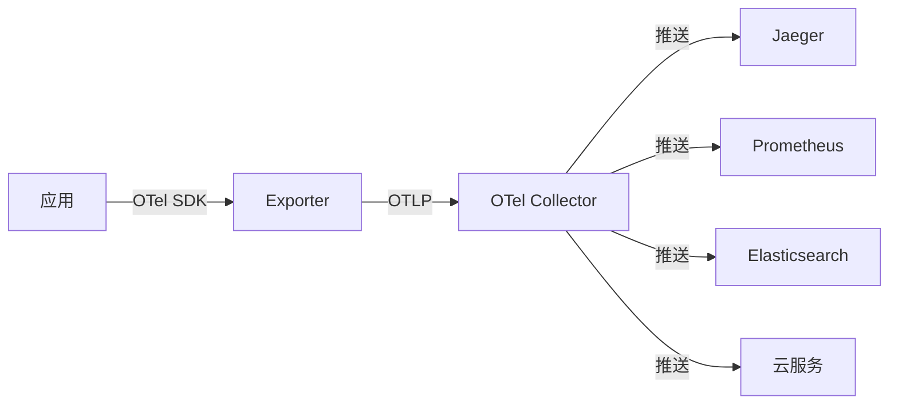

# 云上可观测性体系（监控 / 日志 / 链路 / APM）

> 可观测性三支柱（指标、日志、链路）在云上全有托管服务：不用自建 Prometheus/Grafana/ELK，开箱即用、按量付费、与云生态原生打通。本篇按「解决的问题 → 原理 → 特性 → 选型关注点」拆解各云厂商的托管可观测性服务。

---

## 一、可观测性三支柱与云托管对应

| 支柱 | 关注点 | 自建代表 | AWS | Azure | GCP | 阿里云 | 腾讯云 |
|------|--------|----------|-----|-------|-----|--------|--------|
| 指标 Metrics | 时序数值、告警 | Prometheus+Grafana | CloudWatch | Monitor/Insights | Cloud Monitoring | 云监控/ARMS | 云监控/哨兵 |
| 日志 Logging | 集中检索、分析 | ELK/EFK | CloudWatch Logs | Log Analytics | Cloud Logging | 日志服务 SLS | 日志服务 CLS |
| 链路 Tracing | 分布式调用链 | Jaeger/Zipkin | X-Ray | Application Insights | Cloud Trace | 链路追踪 CAT | 链路追踪 CT |
| APM | 应用性能全景 | SkyWalking/Pinpoint | CloudWatch RUM | Application Insights | Cloud Profiler/Trace | ARMS/PaaS | APM |

> 核心认知：**云托管可观测性 = 采集 Agent 托管化 + 存储按量计费 + 与云服务原生联动（告警触发函数/自动伸缩）**。

---

## 二、指标监控云服务

### 2.1 CloudWatch（AWS）

**解决的问题**：不想自建 Prometheus，要一个「自动采集云资源指标 + 自定义指标 + 告警」的一站式服务。

**原理**：各云服务内置 CloudWatch Agent/Exporter 采集指标 → 时序存储 → 仪表盘 + 告警规则 → 触发 Auto Scaling / Lambda / SNS。

| 特性 | 说明 |
|------|------|
| 命名空间 | AWS/EC2、AWS/RDS 等内置，自定义命名空间写业务指标 |
| 高精度 | 支持 1 秒粒度（High-Resolution） |
| 告警 | 静态阈值 + 异常检测（ML） + 组合告警 |
| Contributor Insights | 自动 TopN 贡献者分析 |
| Logs Insights | 日志里直接跑 SQL 查指标 |

**选型关注点**：自定义指标按条计费，高频指标成本高；长期存储需转 S3（降采样）；与 Prometheus 协议兼容（AMP 托管 Prometheus）。

### 2.2 Azure Monitor

- **Metrics Explorer**：时序可视化 + 告警
- **Container Insights**：K8s 集群 Pod/节点指标自动采集
- **VM Insights**：虚拟机性能全景
- **选型关注点**：与 Azure 资源深度绑定，跨云需统一采集层。

### 2.3 GCP Cloud Monitoring

- 基于 Monarch（Google 内部时序引擎），全球规模
- 特性：按量计费、内置 SLO 监控（错误预算燃烧率）、与 Cloud Logging 原生联动
- **选型关注点**：跨云支持（AWS 集成），GCP 生态最强。

### 2.4 国内：阿里云 ARMS / 腾讯云监控

- **ARMS**（应用实时监控服务）：前端 RUM + 后端 APM +  Prometheus 托管 三合一
- **云监控/哨兵**：基础资源指标 + 告警
- **选型关注点**：国内业务合规 + 阿里云生态 → ARMS（APM 能力比基础云监控强）；Prometheus 兼容 → ARMS Prometheus。

---

## 三、托管日志服务

### 3.1 CloudWatch Logs（AWS）

**解决的问题**：应用日志、云服务日志集中存储 + 检索 + 告警，不用运维 ES 集群。

**原理**：Log Agent（CloudWatch Agent/Fluent Bit）采集 → Log Group/Stream 存储 → CloudWatch Logs Insights（SQL 查询）+ Metric Filter（日志→指标）+ 订阅（实时送到 Lambda/Kinesis）。

| 特性 | 说明 |
|------|------|
| Logs Insights | 类 SQL 日志查询（自动解析 JSON/CSV/空格分隔） |
| Metric Filter | 日志模式匹配→转指标→告警 |
| 订阅过滤器 | 实时流式送到 Lambda/OpenSearch/Kinesis |
| 留存策略 | 永久/1天~10年可调 |

**选型关注点**：存储按 GB 计费 + 查询按扫描量，高频查询成本高；需要全文检索/复杂分析 → 接 OpenSearch（托管 ES）。

### 3.2 阿里云 SLS（Log Service）

- 国内日志托管标杆：日志采集 → 存储 → 查询 → 投递（到 MaxCompute/OSS）全链路
- 特性：SQL 92 兼容查询、秒级分析 PB 级、审计合规、与 Flink/函数计算原生联动
- **选型关注点**：国内业务 + 大数据投递链路 → SLS（生态打通最强）。

### 3.3 GCP Cloud Logging

- 基于 Google 全球存储，日志路由（Log Router）按规则投递到 BigQuery/Cloud Storage/PubSub
- 特性：日志分桶（Bucket）+ 基于日志的审计（Admin Audit / Data Access）
- **选型关注点**：需要日志直接进数仓分析 → BigQuery 投递最顺滑。

---

## 四、托管链路追踪与 APM

### 4.1 AWS X-Ray

**解决的问题**：微服务调用链「慢在哪一跳、错在哪个依赖」看不清，要一个托管的分布式追踪。

**原理**：应用 SDK（X-Ray SDK）埋点 → 发送 trace segment → X-Ray 服务聚合生成服务地图（Service Map）+ 追踪时间线。

| 特性 | 说明 |
|------|------|
| 服务地图 | 自动生成调用拓扑 + 健康热力图 |
| 追踪分组 | 按错误率/延迟/采样率分组追踪 |
| 采样规则 | 动态采样（每秒 N 条 + 速率上限） |
| 与云集成 | API Gateway/Lambda/ECS 自动埋点 |

**选型关注点**：X-Ray 是 AWS 专属，跨云/多云需 OpenTelemetry 标准；采样率影响成本与覆盖度。

### 4.2 Azure Application Insights

- 全功能 APM：请求/依赖/异常/性能计数器 + 智能检测（Smart Detection，自动异常告警）
- 特性：与 Azure DevOps 联动（发布前后性能对比）、Live Metrics（实时指标流）
- **选型关注点**：Azure 生态内 APM 首选，跨云需 OpenTelemetry。

### 4.3 GCP Cloud Trace + Cloud Profiler

- **Cloud Trace**：分布式追踪，自动采集 App Engine/GKE/Cloud Run 延迟
- **Cloud Profiler**：持续 CPU/内存 profiling（生产环境低开销）
- **选型关注点**：GCP 生态内 + 与 Cloud Logging 联动（日志点跳转 trace）。

### 4.4 国内：阿里云 ARMS 链路追踪 / 腾讯云 APM

- **ARMS 链路追踪**：兼容 OpenTelemetry/Jaeger 协议，与 SLS/Prometheus 联动
- **OpenTelemetry 标准**：跨云/多云的统一埋点协议，各云托管服务均支持 OTLP 接入
- **选型关注点**：多云/混合云 → 用 OpenTelemetry 统一埋点，后端接各云托管服务或自建 Jaeger。

---

## 五、托管 Prometheus / Grafana

| 服务 | 厂商 | 关键点 |
|------|------|--------|
| AMP（Amazon Managed Prometheus） | AWS | 托管 PromQL，与 CloudWatch 并列 |
| Azure Monitor Managed Prometheus | Azure | 托管 Prom，与 Grafana 集成 |
| Google Cloud Managed Service for Prometheus | GCP | 原生支持，与 Cloud Monitoring 并列 |
| 阿里云 Prometheus（ARMS Prometheus） | 阿里云 | 国内主流，与 ARMS 生态打通 |
| AMG（Amazon Managed Grafana） | AWS | 托管 Grafana，多数据源 |
| Azure Managed Grafana | Azure | 托管 Grafana |

**选型关注点**：已有 Prometheus/Grafana 投资 → 托管版平滑迁移（兼容 PromQL）；需要多云统一大盘 → Grafana 托管版 + 多数据源。

---

## 六、第三方 SaaS 可观测性（跨云）

| 产品 | 定位 | 亮点 |
|------|------|------|
| Datadog | 全栈 APM + 基础设施 + 日志 | 统一平台、AI 异常检测、生态集成最广 |
| New Relic | APM + 全栈可观测 | 按主机计费、免费档慷慨 |
| Grafana Cloud | 开源栈托管（Prom+Loki+Tempo） | 开源兼容、多云中立 |
| Elastic Cloud | 托管 ELK | 搜索/日志/APM 一体化 |

**选型关注点**：多云/混合云 + 要统一平台 → Datadog/New Relic/Grafana Cloud（中立 SaaS）；单云 → 原生托管服务更便宜且生态联动好。

---

## 七、选型速查

| 需求 | 首选 | 备选 |
|------|------|------|
| 单云基础监控 | 云厂商原生（CloudWatch/Monitor/云监控） | Prometheus 托管版 |
| 多云统一大盘 | Grafana Cloud / Datadog | AMG + 多数据源 |
| 日志集中检索 | 云厂商日志服务（SLS/CloudWatch Logs） | Elastic Cloud |
| 分布式追踪 | 云厂商 X-Ray/Trace/ARMS | Jaeger + OpenTelemetry |
| 全栈 APM | Datadog / New Relic / ARMS | 云厂商原生 APM |
| 已有 Prom 投资 | 各云托管 Prometheus | 自建 |
| 合规 + 国内 | ARMS + SLS + CAT | — |

---

## 补充：云可观测性深度解析

### 1. AWS CloudWatch 深度

| 特性 | 说明 |
|------|------|
| 指标精度 | 1秒高精度指标 |
| 告警 | 静态阈值 + ML异常检测 + 组合告警 |
| Logs Insights | 类SQL日志查询 |
| Metric Filter | 日志→指标转换 |
| Contributor Insights | TopN贡献者分析 |
| Cross-account | 跨账号监控聚合 |

### 2. Azure Monitor/Application Insights

| 特性 | 说明 |
|------|------|
| Metrics Explorer | 时序可视化+告警 |
| Container Insights | K8s集群自动采集 |
| VM Insights | 虚拟机性能全景 |
| Smart Detection | AI自动异常检测 |
| Live Metrics | 实时指标流 |
| Availability Tests | 全球拨测 |

### 3. GCP Cloud Logging/Monitoring

| 特性 | 说明 |
|------|------|
| 日志路由 | 按规则投递到BigQuery/Storage/PubSub |
| 日志分桶 | 不同存储级别 |
| 审计日志 | Admin Audit/Data Access |
| SLO监控 | 错误预算燃烧率 |
| 跨云支持 | AWS集成 |

### 4. Cloud-Native Observability Stack

| 组件 | 用途 | 优势 |
|------|------|------|
| Prometheus | 指标采集 | 开源标准 |
| Grafana | 可视化 | 多数据源 |
| Loki | 日志聚合 | 轻量级 |
| Tempo | 链路追踪 | 与Loki集成 |
| Alertmanager | 告警管理 | 高可用 |

### 5. OpenTelemetry in Cloud

| 特性 | 说明 |
|------|------|
| 统一采集 | 一套SDK采集三支柱 |
| 多语言 | Java/Go/Python/Node.js |
| 自动埋点 | 框架自动采集 |
| Collector | 接收/处理/导出 |
| 云支持 | AWS/Azure/GCP均支持OTLP |

### 6. Cloud Observability Cost Optimization

| 策略 | 做法 | 节省 |
|------|------|------|
| 采样 | 降低采样率 | 50-90% |
| 日志过滤 | 只采集关键日志 | 30-70% |
| 指标聚合 | 降低精度 | 20-50% |
| 保留期 | 热冷分层 | 40-60% |
| 按需采集 | 非核心服务降频 | 30-50% |

### 7. Observability as Code

| 工具 | 说明 |
|------|------|
| Terraform | 基础设施即代码 |
| Pulumi | 编程语言定义 |
| OpenTelemetry Collector | 配置即代码 |
| Grafana Provisioning | 仪表盘即代码 |
| Prometheus Operator | K8s原生配置 |

### 8. 云可观测性架构模式

| 模式 | 说明 | 适用 |
|------|------|------|
| 中心化 | 统一采集平台 | 多云/混合云 |
| 去中心化 | 各团队自建 | 小团队 |
| 混合 | 核心统一+边缘自建 | 大团队 |
| SaaS优先 | 优先使用云服务 | 快速上手 |

### 9. 云可观测性安全与合规

| 维度 | 说明 |
|------|------|
| 日志脱敏 | 敏感数据不写日志 |
| 访问控制 | 日志访问权限最小化 |
| 加密 | 传输和存储加密 |
| 审计 | 日志操作审计 |
| 保留 | 按合规要求保留 |

### 10. 云可观测性团队协作

| 角色 | 职责 |
|------|------|
| SRE | 架构设计、告警策略 |
| 开发 | 应用埋点、日志规范 |
| 运维 | Agent部署、集群运维 |
| 安全 | 日志审计、合规检查 |

### 11. 云可观测性工具对比

| 工具 | 定位 | 优势 | 劣势 |
|------|------|------|------|
| Datadog | 全栈APM | 统一平台、AI检测 | 贵 |
| New Relic | APM+全栈 | 免费档慷慨 | 自定义指标贵 |
| Grafana Cloud | 开源栈托管 | 开源兼容 | 需运维 |
| Elastic Cloud | 托管ELK | 搜索能力强 | 存储贵 |

### 12. 云可观测性常见问题

| 问题 | 原因 | 解决 |
|------|------|------|
| 指标丢失 | Agent未部署 | 检查Agent配置 |
| 日志查询慢 | 索引不合理 | 优化索引字段 |
| 链路不完整 | 采样率太低 | 提高采样率 |
| 告警漏发 | 规则配置错 | 检查PromQL |
| 成本超支 | 采集量太大 | 采样+过滤 |

### 13. 云可观测性性能优化

| 优化项 | 说明 |
|--------|------|
| 采集性能 | 使用异步采集 |
| 存储优化 | 压缩和分层 |
| 查询优化 | 合理使用索引 |
| 告警优化 | 减少误报 |

### 14. 云可观测性集成模式

| 模式 | 说明 |
|------|------|
| 与CI/CD集成 | 发布前后性能对比 |
| 与Auto Scaling集成 | 指标驱动伸缩 |
| 与故障注入集成 | 混沌工程可观测 |
| 与成本集成 | 可观测性成本归因 |

### 15. 云可观测性未来趋势

| 趋势 | 说明 |
|------|------|
| AIops | AI驱动的异常检测 |
| 统一可观测 | 指标/日志/链路统一 |
| 边缘可观测 | 边缘节点监控 |
| 成本可观测 | 可观测性成本透明化 |

---

## 八、CloudWatch Logs Insights 高级查询

```sql
-- 查找错误率最高的5个接口
fields @timestamp, @message
| filter @message like /ERROR/
| parse @message "API: *" as api
| stats count(*) as errorCount by api
| sort errorCount desc
| limit 5

-- 分析请求延迟分布
fields @timestamp, @duration
| stats count(*) as total,
        avg(@duration) as avgLatency,
        pct(@duration, 50) as p50,
        pct(@duration, 99) as p99
  by bin(1h)

-- 按小时统计日志量趋势
fields @timestamp, @message
| stats count(*) as logCount by bin(1h)
| sort @timestamp asc

-- 查找特定时间段的异常
fields @timestamp, @message
| filter @timestamp >= "2026-07-01 00:00:00"
  and @timestamp < "2026-07-02 00:00:00"
| filter @message like /Exception/
| display @timestamp, @message
| sort @timestamp desc

-- 提取JSON字段分析
fields @message
| parse @message '"userId":"*"' as userId
| parse @message '"action":"*"' as action
| stats count(*) as cnt by userId, action
| sort cnt desc
| limit 20
```

## CloudWatch X-Ray 集成

```
X-Ray 与 CloudWatch 联动：

1. 自动采样：Lambda/API Gateway/ECS 自动生成 Trace
2. Service Map：自动构建调用拓扑
3. 指标聚合：X-Ray → CloudWatch Metrics（延迟/错误率）
4. 告警：基于 X-Ray 指标创建 CloudWatch Alarm
5. 服务拓扑：自动发现依赖关系

配置示例（Lambda）：
  环境变量：_X_AMZN_TRACE_ID=Root=1-...
  中间件：aws-xray-sdk
  采样规则：固定比例1% + 动态采样
```

## Azure Monitor Log Analytics

```kusto
-- KQL 查询：查找失败请求
requests
| where success == false
| summarize count() by name, resultCode
| order by count_ desc

-- 性能分析：P95延迟
requests
| where timestamp > ago(24h)
| summarize percentiles(duration, 95) by bin(timestamp, 1h)

-- 依赖分析：调用失败的依赖
dependencies
| where success == false
| summarize count() by target, type
| order by count_ desc

-- 异常统计
exceptions
| summarize count() by type, outerMessage
| order by count_ desc
```

## GCP Cloud Trace 分析

```
Cloud Trace 功能：
  分布式追踪：自动采集 App Engine/GKE/Cloud Run 延迟
  请求洞察：延迟直方图、QPS趋势
  性能分析：慢查询分析、瓶颈定位
  成本分析：按服务/方法计算成本

查询示例（Cloud Logging）：
  resource.type="cloud_trace.googleapis.com/trace"
  traceLabels.googleapis.com/trace_route.server_response_time > "1"

优化建议：
  高延迟请求：采样率100% + 自定义属性
  冷启动分析：函数计算延迟分桶
  依赖分析：Service Map可视化
```

## 云可观测性成本优化

### 日志留存策略

| 留存期 | $/GB/月 | 适用场景 | 节省 |
|--------|---------|----------|------|
| 1天 | $0.03 | 调试/临时分析 | 90% |
| 7天 | $0.05 | 近期问题排查 | 80% |
| 30天 | $0.10 | 月度审计 | 60% |
| 180天 | $0.12 | 合规要求 | 40% |
| 1年 | $0.15 | 长期审计 | 30% |
| 永久 | $0.20 | 历史归档 | 0% |

### 指标粒度优化

| 精度 | $/指标/月 | 数据点 | 适用 |
|------|-----------|--------|------|
| 1秒 | $1.00 | 86,400/天 | 关键链路 |
| 1分钟 | $0.30 | 1,440/天 | 一般监控 |
| 5分钟 | $0.10 | 288/天 | 非核心服务 |
| 1小时 | $0.03 | 24/天 | 趋势分析 |

```
成本优化策略：
  1. 采样率：生产环境默认1%，问题排查时临时提高
  2. 日志过滤：只采集INFO以上级别
  3. 指标聚合：非核心服务5分钟精度
  4. 留存分层：热7天/冷30天/归档1年
  5. 按需采集：非核心服务降低频率
```

## OpenTelemetry Collector 云部署

```yaml
# OTel Collector 配置
receivers:
  otlp:
    protocols:
      grpc:
        endpoint: 0.0.0.0:4317
      http:
        endpoint: 0.0.0.0:4318
  prometheus:
    config:
      scrape_configs:
        - job_name: 'otel-collector'
          static_configs:
            - targets: ['localhost:8888']

processors:
  batch:
    send_batch_size: 10000
    timeout: 5s
  memory_limiter:
    limit_mib: 4000
    spike_limit_mib: 800

exporters:
  awsxray:
    region: us-east-1
  awsemf:
    region: us-east-1
  prometheusremotewrite:
    endpoint: https://aps-workspaces.us-east-1.amazonaws.com/workspaces/ws-xxx/api/v1/remote_write

service:
  pipelines:
    traces:
      receivers: [otlp]
      processors: [memory_limiter, batch]
      exporters: [awsxray]
    metrics:
      receivers: [otlp, prometheus]
      processors: [memory_limiter, batch]
      exporters: [awsemf, prometheusremotewrite]
```

## 云仪表盘模板

### SRE 四大黄金信号仪表盘

| 信号 | 指标 | 告警阈值 | 来源 |
|------|------|----------|------|
| 延迟 | P50/P95/P99 | P99>500ms | X-Ray/Application Insights |
| 流量 | QPS/TPS | 突增200% | CloudWatch/监控 |
| 错误率 | 4xx/5xx比例 | >1% | 访问日志/HTTP状态码 |
| 饱和度 | CPU/内存/磁盘 | CPU>80% | 基础监控 |

### 业务指标仪表盘模板

| 模块 | 指标 | 刷新频率 | 数据源 |
|------|------|----------|--------|
| 交易量 | 实时GMV/订单数 | 5s | Redis/OLAP |
| 用户活跃 | DAU/MAU/留存 | 1min | 数据库/数仓 |
| 系统健康 | 成功率/延迟 | 1s | Prometheus |
| 成本趋势 | 资源使用/账单 | 1h | Cost Explorer |

## 云告警最佳实践

```
告警分级：
  P0（Critical）：5分钟响应，电话+短信
  P1（Warning）：30分钟响应，邮件+钉钉
  P2（Info）：工作时间处理，仅通知

告警抑制规则：
  集群宕机 → 抑制所有子服务告警
  机房故障 → 抑制该机房所有告警
  维护窗口 → 抑制相关告警

告警静默：
  变更窗口：提前静默相关告警
  计划维护：定时静默非核心告警

告警升级：
  P0：5分钟未响应 → 升级主管
  P0：15分钟未响应 → 升级总监
  P0：30分钟未响应 → 升级CEO
```

## SLO/SLI/SLA 计算

### 定义与关系

| 概念 | 定义 | 示例 |
|------|------|------|
| SLI | 服务级别指标 | 可用性99.95%，延迟P99<200ms |
| SLO | 服务级别目标 | 可用性99.9%，延迟P99<500ms |
| SLA | 服务级别协议 | 可用性99.9%，违反赔偿 |

### 错误预算计算

```
错误预算 = (1 - SLO) × 时间窗口

示例：SLO = 99.9%，30天窗口
  错误预算 = (1 - 0.999) × 30 × 24 × 60 = 43.2分钟
  意味着30天内最多允许43.2分钟的不可用

错误预算消耗率：
  消耗率 = 实际不可用时间 / 错误预算
  消耗率 < 100%：正常
  消耗率 100%~200%：警告
  消耗率 > 200%：紧急

SLI计算：
  可用性 = 成功请求数 / 总请求数
  延迟 = P99延迟 < 目标值的比例
  吞吐 = 实际处理量 / 需求量
```

### SLO 实现示例

```python
# Prometheus SLI计算
sli_availability = (
    rate(http_requests_total{status!~"5.."}[5m])
    /
    rate(http_requests_total[5m])
)

sli_latency = (
    histogram_quantile(0.99, rate(http_request_duration_seconds_bucket[5m]))
    < 0.5  # 500ms
)

# 错误预算剩余
remaining_budget = (1 - SLO) - (1 - sli_availability)
```

---

## 九、云可观测性最佳实践

### 9.1 指标监控最佳实践

| 实践 | 说明 |
|------|------|
| 四大黄金信号 | 延迟/流量/错误率/饱和度 |
| 告警分级 | Critical/Warning/Info |
| 告警抑制 | 高优先级抑制低优先级 |
| SLO/SLI | 错误预算驱动运维决策 |

### 9.2 日志最佳实践

| 实践 | 说明 |
|------|------|
| 结构化日志 | JSON 格式（便于查询） |
| 日志级别 | 生产用 INFO/WARN/ERROR |
| 日志保留 | 按合规要求保留（等保180天+） |
| 日志路由 | 实时告警→函数，长期→对象存储 |

### 9.3 链路追踪最佳实践

| 实践 | 说明 |
|------|------|
| 采样策略 | 生产 1%~10%，问题排查时临时提高 |
| 传播标准 | W3C Trace Context（跨语言） |
| 与日志联动 | TraceID 注入日志（便于串联） |
| 与指标联动 | 延迟/错误率聚合到指标 |

### 9.4 OpenTelemetry 统一采集

```
应用代码 → OTel SDK（自动埋点）
  → OTel Collector（接收/处理/导出）
    → Jaeger（追踪）
    → Prometheus（指标）
    → Loki/ELK（日志）

优势：一套代码采集三支柱，后端可替换
```

---

## 十、云可观测性成本优化

| 策略 | 做法 |
|------|------|
| 采样 | 降低采样率（10%→1%） |
| 日志过滤 | 只采集 INFO 以上日志 |
| 指标聚合 | 降低指标精度（1s→15s） |
| 保留期 | 热数据 7 天，冷数据归档 |
| 按需采集 | 非核心服务降低采集频率 |

### 10.1 各云监控价格对比

| 服务 | 免费额度 | 超出价格 |
|------|----------|----------|
| CloudWatch Metrics | 10 个自定义指标 | $0.30/指标/月 |
| CloudWatch Logs | 5GB/月 | $0.50/GB |
| Azure Monitor | 5 个自定义指标 | $0.273/指标/月 |
| 阿里云 ARMS | 基础免费 | 按调用量计费 |

### 10.2 监控告警配置最佳实践

| 实践 | 说明 |
|------|------|
| 告警分级 | Critical（5分钟响应）、Warning（30分钟）、Info（工作时间） |
| 告警抑制 | 高优先级抑制低优先级（集群宕机抑制单实例） |
| 告警静默 | 维护期间静默相关告警 |
| 告警升级 | 自动升级（通知→电话→值班） |

---

## 十一、云可观测性部署架构

```
应用 → OTel SDK → OTel Collector
  ├── Prometheus（指标）
  ├── Jaeger/云 Trace（链路）
  └── Loki/云 Logs（日志）

告警 → Alertmanager → 钉钉/Slack/PagerDuty
  └── 自动恢复（扩容/重启）
```

---

## 十二、可观测性工具对比

| 工具 | 定位 | 优势 | 劣势 |
|------|------|------|------|
| Datadog | 全栈 APM | 统一平台、AI 检测 | 贵 |
| New Relic | APM + 全栈 | 免费档慷慨 | 自定义指标贵 |
| Grafana Cloud | 开源栈托管 | 开源兼容 | 需运维 |
| Elastic Cloud | 托管 ELK | 搜索能力强 | 存储贵 |

---

## 十三、云可观测性常见问题

| 问题 | 原因 | 解决 |
|------|------|------|
| 指标丢失 | Agent 未部署 | 检查 Agent 配置 |
| 日志查询慢 | 索引不合理 | 优化索引字段 |
| 链路不完整 | 采样率太低 | 提高采样率 |
| 告警漏发 | 规则配置错 | 检查 PromQL |
| 成本超支 | 采集量太大 | 采样+过滤 |

---

## 十四、云可观测性团队分工

| 角色 | 职责 |
|------|------|
| SRE | 可观测性架构、告警策略 |
| 开发 | 应用埋点、日志规范 |
| 运维 | Agent 部署、集群运维 |
| 安全 | 日志审计、合规检查 |

---

## 十五、云可观测性工具价格对比

| 工具 | 免费档 | 付费档 |
|------|--------|--------|
| Datadog | 14天试用 | $15/主机/月起 |
| New Relic | 100GB/月免费 | $0.35/GB |
| Grafana Cloud | 10K指标免费 | 按量计费 |

---

## 十六、CloudWatch Logs Insights 高级查询

### 16.1 KQL 语法对比

| 语法 | CloudWatch Logs Insights | Azure Log Analytics | Splunk |
|------|-------------------------|---------------------|--------|
| 过滤 | `| filter message = "error"` | `| where Message == "error"` | `error` |
| 投影 | `| fields timestamp, message` | `| project TimeGenerated, Message` | `fields timestamp, message` |
| 聚合 | `| stats count() by bin(1h)` | `| summarize count() by bin(1h, TimeGenerated)` | `stats count by _time` |
| 排序 | `| sort @timestamp desc` | `| order TimeGenerated desc` | `| sort -timestamp` |

### 16.2 常用查询模板

```sql
-- 错误趋势分析（5分钟粒度）
fields @timestamp, @message
| filter @message like /ERROR|Exception/
| stats count(*) as error_count by bin(5m) as time_bucket
| sort time_bucket asc

-- Top10 慢查询
fields @timestamp, @message
| filter @message like /duration/
| parse @message "duration=*" as duration
| sort duration desc
| limit 10
```

## 十七、Cloud Trace 分布式追踪

### 17.1 追踪数据模型

```text
Trace：
  TraceID：全局唯一，贯穿整个请求链路
  SpanID：单个服务调用的唯一标识
  ParentSpanID：父调用的 SpanID（构建调用树）
  OperationName：操作名称
  StartTime/EndTime：开始/结束时间
  Tags：附加标签（HTTP方法、状态码等）
  Logs：事件日志（错误、重试等）
```

### 17.2 追踪采样策略

| 策略 | 说明 | 适用 |
|------|------|------|
| 固定概率 | 按比例采样（如1%） | 高流量服务 |
| 自适应 | 根据QPS动态调整 | 变化流量 |
| 尾部采样 | 等待完整Trace后决定 | 保留异常Trace |
| 全量采样 | 100%采样 | 调试/开发环境 |

## 十八、云可观测性成本优化

### 18.1 成本构成

| 组件 | 成本占比 | 优化方向 |
|------|----------|----------|
| 日志存储 | 40~60% | 降采样/压缩/分层 |
| 指标存储 | 15~25% | 减少基数/聚合 |
| 链路追踪 | 10~20% | 采样策略 |
| 告警 | 5~10% | 合并告警/静默规则 |

### 18.2 优化策略

```text
成本优化方法：
  1. 日志降采样：debug日志不进生产
  2. 指标聚合：5min粒度代替1min
  3. 存储分层：热7天/温30天/冷90天
  4. 压缩：Snappy/Zstandard压缩
  5. 保留策略：设置自动删除规则
```

## 十十九、OpenTelemetry 统一采集

### 19.1 OTel 架构



### 19.2 OTel vs 原生方案对比

| 维度 | OTel | 原生SDK |
|------|------|---------|
| 多厂商支持 | 一次采集，多处导出 | 绑定单一厂商 |
| 自动埋入 | Java/Python/Go自动 | 需手动埋入 |
| 社区活跃度 | CNCF顶级项目 | 各厂商独立 |
| 功能完整度 | 指标+日志+追踪 | 各有侧重 |

## 二十、SLI/SLO/SLA 体系

| 概念 | 定义 | 示例 |
|------|------|------|
| SLI | 服务级别指标 | 可用性、延迟、错误率 |
| SLO | 服务级别目标 | 99.9%可用性 |
| SLA | 服务级别协议 | 99.9%可用性，否则赔偿 |

```yaml
# SLO 定义示例
apiVersion: sloth.slok.dev/v1
kind: PrometheusServiceLevel
metadata:
  name: order-service-slo
spec:
  service: "order-service"
  labels:
    team: "backend"
  slos:
    - name: "availability"
      objective: 99.9
      description: "订单服务可用性"
      sli:
        events:
          error_query: sum(rate(http_requests_total{code=~"5.."}[5m]))
          total_query: sum(rate(http_requests_total[5m]))
      alerting:
        name: "OrderServiceAvailabilityViolation"
        labels:
          severity: "critical"
```

---

## CloudWatch Logs Insights 查询语言速查

### stats / parse / filter / order by

```sql
-- 基础查询
fields @timestamp, @message
| filter @message like /ERROR/
| sort @timestamp desc
| limit 20

-- 统计分析
fields @timestamp, @message
| parse @message "ERROR * [*] *" as level, src_ip, msg
| stats count(*) as cnt by src_ip
| sort cnt desc
| limit 10

-- 时间聚合
fields @timestamp, @message
| parse @message "duration=*ms" as duration
| stats avg(duration) as avg_dur, max(duration) as max_dur by bin(1h)
| sort avg_dur desc

-- 多条件过滤
fields @timestamp, @message
| filter @message like /ERROR/ and @message like /timeout/
| stats count(*) by bin(5m)
```

## Azure Log Analytics KQL 基础语法

### datatable / union / extend / summarize

```kql
// 基础查询
| where TimeGenerated > ago(1h)
| where Level == "Error"
| project TimeGenerated, Message, Source
| sort by TimeGenerated desc

// 统计分析
| where TimeGenerated > ago(24h)
| summarize ErrorCount = count() by Source
| sort by ErrorCount desc

// 时间聚合
| where TimeGenerated > ago(7d)
| summarize Count = count() by bin(TimeGenerated, 1h)
| render timechart

// 多表联合
union AppTraces, AppExceptions
| where TimeGenerated > ago(1h)
| summarize Count = count() by Type
```

## GCP Cloud Trace 分析

### trace explorer / span attributes

```sql
-- 查询慢请求
trace_id
| display_name = "GET /api/orders"
| duration > 5s
| project_id = "my-project"

-- Span 属性分析
span_id
| attribute.key = "http.status_code"
| attribute.value.int_value > 400
| project_id = "my-project"
```

## 可观测性成本优化三策略

### 采样/聚合/过滤

```text
成本优化策略：

1. 采样（Sampling）
   - 尾部采样：延迟数据在尾部采样
   - 头部采样：随机采样 1-10%
   - 自适应采样：错误请求全采样
   - 成本降低：80-95%

2. 聚合（Aggregation）
   - 预聚合：在客户端聚合指标
   - 降采样：原始数据 → 1分钟聚合
   - 成本降低：70-90%

3. 过滤（Filtering）
   - 前置过滤：只收集需要的数据
   - 后置过滤：查询时过滤
   - 成本降低：50-80%
```

```yaml
# 采样配置（OTel Collector）
processors:
  tail_sampling:
    decision_wait: 10s
    num_traces: 100000
    policies:
      - name: error-policy
        type: status_code
        status_code: {status_codes: [ERROR]}
      - name: slow-policy
        type: latency
        latency: {threshold_ms: 5000}
      - name: probabilistic-policy
        type: probabilistic
        probabilistic: {sampling_percentage: 5}
```

## 自建 vs 托管 Prometheus+Grafana 成本对比表

| 维度 | 自建 | 托管 |
|------|------|------|
| 月成本（100万指标） | $500-1000 | $200-400 |
| 运维成本 | 高 | 低 |
| 可用性 | 依赖自建 | 99.9%+ |
| 扩展性 | 手动 | 自动 |
| 数据保留 | 自定义 | 受限 |
| 定制能力 | 高 | 中 |

```text
成本对比示例（月 100 万指标）：

自建：
  - EC2 实例（3台）：$300
  - EBS 存储（500GB）：$50
  - 运维人力：$200-500（占比）
  - 总计：$500-800

托管（Amazon Managed Grafana + Prometheus）：
  - Prometheus：$200
  - Grafana：$100
  - 总计：$300

选择建议：
  - 指标少（<100万）→ 托管
  - 指标多（>100万）→ 自建
  - 运维能力弱 → 托管
  - 需要定制 → 自建
```

## SLI/SLO/SLA 定义与告警配置

### error budget / slo burn rate

```yaml
# SLO 定义
slos:
  - name: "availability"
    objective: 99.9
    window: "30d"
    sli:
      type: "availability"
      error_query: 'sum(http_requests_total{code=~"5.."})'
      total_query: 'sum(http_requests_total)'

# Error Budget 告警
groups:
- name: slo-alerts
  rules:
  - alert: SLOBurnRateHigh
    expr: |
      (
        1 - (sum(rate(http_requests_total{code!~"5.."}[1h])) /
             sum(rate(http_requests_total[1h])))
      ) > (1 - 0.999) * 14.4
    for: 5m
    labels:
      severity: critical
    annotations:
      summary: "SLO burn rate > 14.4x"
```

```text
SLI/SLO/SLA 定义：
  SLI（Service Level Indicator）：服务级别指标
    - 可用性：成功请求/总请求
    - 延迟：P99/P999 响应时间
    - 吞吐量：QPS/TPS

  SLO（Service Level Objective）：服务级别目标
    - 可用性目标：99.9%
    - 延迟目标：P99 < 500ms
    - 错误预算：0.1%

  SLA（Service Level Agreement）：服务级别协议
    - 法律约束
    - 赔偿条款
    - 退出条件

Error Budget 计算：
  30天 SLO = 99.9%
  Error Budget = 30天 × 24小时 × 60分钟 × (1-0.999) = 43.2分钟
  
  Burn Rate 告警：
    14.4x burn rate → 10% error budget in 1 hour
    6x burn rate → 10% error budget in 6 hours
```

> 一句话：**云可观测性 = 三支柱托管化（指标/日志/链路）+ 与云生态原生联动（告警→函数/伸缩）；选型先看单云原生（便宜联动好），多云/混合云走 OpenTelemetry + 中立 SaaS（Datadog/Grafana Cloud）。**
