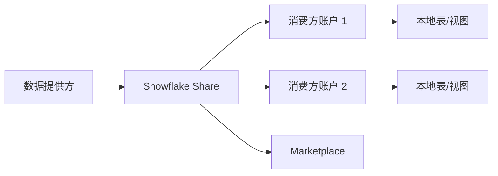
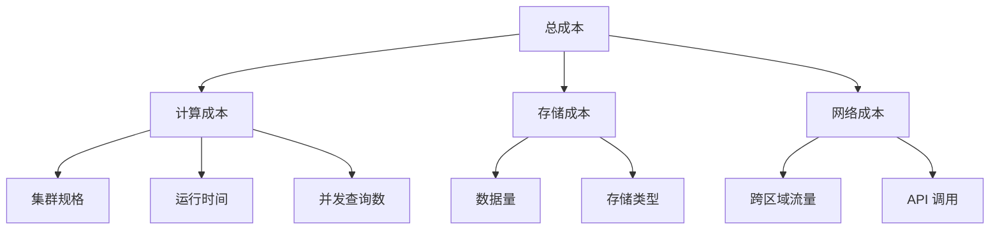
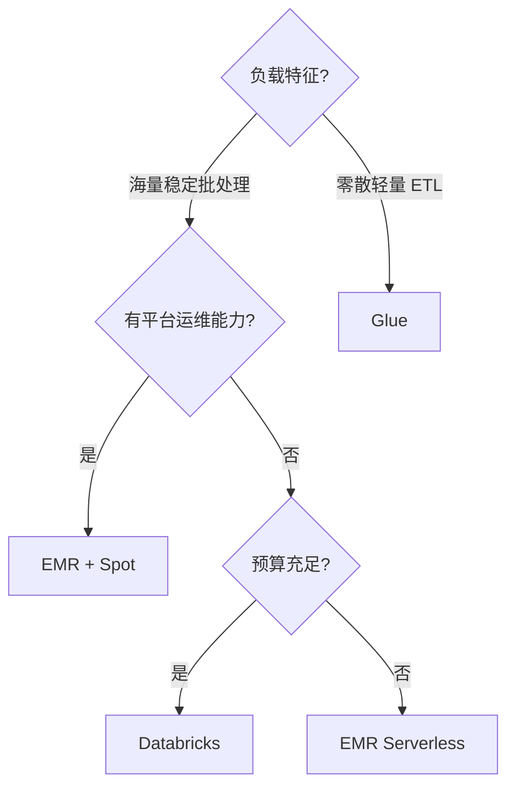
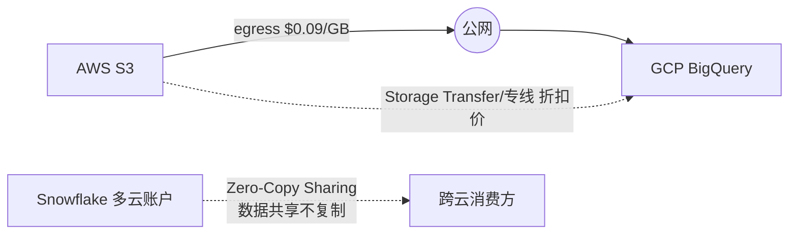

# 云上数仓与大数据生态深入（数据湖表格式 / 成本治理 / 数据治理 / Serverless 查询）

> 云上大数据 = 按量付费查询。本篇深入拆解：数据湖表格式对比（Iceberg/Delta/Hudi）、成本治理策略、数据治理体系、Serverless 查询方案。

---

## 一、云数仓三大路线

| 路线 | 代表 | 特点 |
|------|------|------|
| 预留集群 | Redshift/MaxCompute | 固定规格，空闲也付费 |
| Serverless 按量 | BigQuery/Snowflake | 按查询扫描量计费 |
| 湖仓一体 | Databricks（Delta Lake） | 数据湖 + 数仓合一 |

---

## 二、数据湖表格式（深入）

### 2.1 为什么需要表格式

```
原始数据（Parquet/ORC）→ 只是文件，没有事务/版本/Schema 管理
表格式 = 在文件之上加「元数据层」
  → ACID 事务
  → 时间旅行（查历史版本）
  → Schema 演化
  → 分区演化
  → 小文件合并
```

### 2.2 三种格式对比

| 特性 | Iceberg | Delta Lake | Hudi |
|------|---------|------------|------|
| ACID | ✅ | ✅ | ✅ |
| 时间旅行 | ✅ | ✅ | ✅ |
| Schema 演化 | ✅（列级） | 有限 | ✅ |
| 分区演化 | ✅（隐藏分区） | ❌ | ✅ |
| 流式写入 | ✅ | ✅ | ✅（COW/MOR） |
| 小文件合并 | ✅ | ✅ | ✅ |
| Flink 支持 | ✅（原生） | 有限 | ✅ |
| Spark 支持 | ✅ | ✅（原生） | ✅ |
| 云存储 | S3/GCS/OSS | S3/GCS | S3/GCS |
| 适用 | 通用湖仓 | Spark 生态 | 增量处理/CDC |

### 2.3 选型指南

```
Spark 生态为主 → Delta Lake（Databricks 原生支持）
Flink 生态为主 → Iceberg（Flink 原生支持）
增量处理/CDC → Hudi（增量查询能力最强）
多引擎混合 → Iceberg（Flink/Spark/Presto/Trino 都支持）
新项目 → Iceberg（趋势最强）
```

### 2.4 隐藏分区（Iceberg 优势）

```
传统分区：PARTITIONED BY (dt)
  → 查询必须带 dt，否则全表扫

Iceberg 隐藏分区：
  按 timestamp 字段自动按天分区
  查询时不需要知道分区字段
  → 分区演化不改查询

示例：
  CREATE TABLE t (id int, ts timestamp)
  PARTITIONED BY (days(ts))
  
  查询 SELECT * FROM t WHERE ts > '2026-08-01'
  → 自动裁剪分区，不需要 WHERE dt = '...'
```

---

## 三、Serverless 查询

### 3.1 Athena / BigQuery / MaxCompute Serverless

| 服务 | 厂商 | 特点 |
|------|------|------|
| Athena | AWS | SQL 查 S3，按扫描量计费 |
| BigQuery | GCP | Serverless 数仓，按扫描量 |
| MaxCompute Serverless | 阿里 | 按量付费模式 |
| Snowflake | 多云 | 按查询付费 |

### 3.2 适用场景

| 场景 | 推荐 |
|------|------|
| 临时/低频分析 | Athena（按扫描量，最便宜） |
| 高频 BI | Redshift/MaxCompute（预留更划算） |
| 跨云分析 | Snowflake |
| 数据湖探索 | Athena + Glue Catalog |

### 3.3 成本对比

```
假设：每天扫描 100GB

Athena：$0.005/GB × 100GB = $0.5/天 = $15/月
Redshift（dc2.large）：$0.25/小时 × 730h = $182.5/月（空闲也付费）
BigQuery：$0.005/GB × 100GB = $0.5/天 = $15/月

结论：低频 → Athena/BigQuery，高频 → Redshift
```

---

## 四、成本治理

### 4.1 成本构成

| 成本项 | 说明 |
|--------|------|
| 计算 | 集群规格 × 运行时间 / 查询扫描量 |
| 存储 | 数据量 × 存储单价 |
| 网络 | 跨 AZ/跨地域流量 |
| 数据传输 | S3 出站流量 |

### 4.2 优化策略

| 策略 | 做法 | 省多少 |
|------|------|--------|
| 冷热分层 | 热 SSD + 冷 HDD/归档 | 50~80% |
| 压缩 | Parquet + ZSTD/LZ4 | 60~80% |
| 列裁剪 | 只读需要的列 | 50~70% |
| 分区裁剪 | WHERE 带分区键 | 80~95% |
| 预留实例 | 承诺 1~3 年 | 30~60% |
| 自动缩容 | 非高峰时段缩容 | 20~40% |
| Serverless | 按量付费（低频） | 60~90% |

### 4.3 成本监控

```
工具：
  AWS Cost Explorer / Azure Cost Management / GCP Billing
  阿里云费用中心

实践：
  每周 Review 成本报表
  设置预算告警（超预算 80%/100%）
  标签管理（按团队/项目/环境标记资源）
  闲置资源检测
```

---

## 五、数据治理体系

### 5.1 治理框架

```
元数据管理 → 数据质量 → 数据安全 → 数据血缘 → 数据目录

元数据管理：
  技术元数据：表结构、字段类型、分区
  业务元数据：指标定义、口径、Owner
  操作元数据：ETL 任务、调度、依赖

数据质量：
  完整性：字段非空率
  准确性：值域校验
  一致性：跨表/跨系统一致性
  时效性：数据到达延迟
```

### 5.2 数据质量监控

| 指标 | 计算 | 告警阈值 |
|------|------|----------|
| 非空率 | 非空行数 / 总行数 | < 99% |
| 唯一率 | 去重后行数 / 总行数 | < 100% |
| 时效性 | 数据到达时间 - 事件发生时间 | > 1h |
| 一致性 | 跨表校验不一致行数 | > 0 |

### 5.3 数据安全

| 措施 | 说明 |
|------|------|
| 分级分类 | 按敏感度标记数据（公开/内部/机密/绝密） |
| 脱敏 | 查询时动态脱敏（如手机号中间 4 位 ***） |
| 审计 | 数据访问日志（谁查了什么） |
| 权限 | RBAC/ABAC 权限控制 |
| 加密 | 传输加密（TLS）+ 存储加密（SSE） |

---

## 六、托管流计算

| 服务 | 厂商 | 关键点 |
|------|------|--------|
| Dataflow | GCP | 托管 Beam，自动扩缩容 |
| Managed Flink | 阿里/腾讯 | 开源 Flink 托管 |
| Kinesis Analytics | AWS | SQL/Java 分析 Kinesis 流 |
| Stream Analytics | Azure | 类 SQL 流处理 |

---

## 七、选型速查

| 需求 | 首选 | 备选 |
|------|------|------|
| 离线数仓（国内） | MaxCompute / 云数仓 | Redshift |
| Serverless 按量 | BigQuery / Athena | Snowflake |
| 多云/弹性 BI | Snowflake | BigQuery |
| 数据湖 + ML | Databricks | EMR + Delta |
| 实时流处理 | 云 Flink | Dataflow |
| 查询 S3 数据湖 | Athena / Redshift Spectrum | BigQuery 外部表 |
| 交互式 BI | AnalyticDB / 云 ClickHouse | — |

---

## Snowflake 数据共享功能与使用场景

### 功能矩阵

| 能力 | 说明 | 适用场景 |
|------|------|----------|
| Direct Share | 点对点共享（无需复制数据） | 跨组织数据共享 |
| Marketplace | Snowflake 市场（公共数据集） | 第三方数据采购 |
| Cross-Cloud | 跨云共享（AWS/Azure/GCP） | 多云数据同步 |
| Reader Account | 只读账户（共享方付费） | 数据产品交付 |
| Data Exchange | 企业内部数据交易所 | 内部多团队共享 |

### 数据共享架构



### 使用场景

```
场景一：跨组织数据共享
  供应商 → 共享销售数据给零售商
  零售商 → 共享库存数据给供应商
  免费：数据提供方付费（Reader Account 免费）

场景二：多云数据同步
  AWS 数据 → 共享给 Azure 消费方
  无需数据复制，零延迟

场景三：数据产品化
  创建数据集 → 发布到 Marketplace
  按查询量/数据量计费

场景四：合规数据交换
  金融数据共享（审计追踪内建）
  医疗数据共享（HIPAA 合规）
```

## BigQuery BI Engine 加速查询原理

### 架构

```
BI Engine 架构：
  内存列式存储：热点数据加载到 BI Engine 内存
  向量化执行：列式运算（SIMD 指令加速）
  自动刷新：增量更新（无需手动同步）
  查询改写：SQL 自动路由到 BI Engine
  
工作流程：
  ① 用户查询 → BigQuery 判断可加速表
  ② 表数据 → 加载到 BI Engine 内存（列式压缩）
  ③ 查询 → 路由到 BI Engine（内存级执行）
  ④ 结果返回（亚秒级响应）
```

### 加速效果

| 指标 | 无 BI Engine | 有 BI Engine |
|------|-------------|-------------|
| 查询延迟 | 2~10 秒 | <500 毫秒 |
| 并发能力 | 受槽位限制 | 1000+ QPS |
| 数据量 | 无限制 | 受内存限制（TB 级） |
| 成本 | 按扫描量计费 | 按内存预留计费 |

### 配置与限制

```sql
-- 启用 BI Engine（按表/模型）
CREATE TABLE `dataset.table`
OPTIONS (
  enable_bf_engine = true,
  bf_engine_max_bytes = 10737418240  -- 10GB 内存
);

-- BI Engine 加速的查询限制
-- 支持：SELECT/JOIN/GROUP BY/ORDER BY
-- 不支持：DISTINCT COUNT、正则、UDF
```

## Redshift Spectrum 查询外部表性能优化

### 优化策略

| 策略 | 说明 | 效果 |
|------|------|------|
| 文件格式 | Parquet/ORC（列式压缩） | 扫描量减 60~80% |
| 分区裁剪 | WHERE 带分区键 | 扫描量减 80~95% |
| 列裁剪 | SELECT 只选需要的列 | 扫描量减 50~70% |
| 压缩 | GZIP/SNAPPY/ZSTD | 存储减 60~80% |
| 统计信息 | ANALYZE 更新统计信息 | 查询计划优化 |
| 文件大小 | 128MB~1GB（避免小文件） | 并行度优化 |

### 配置示例

```sql
-- 创建外部表（优化配置）
CREATE EXTERNAL TABLE spectrum_orders (
    order_id BIGINT,
    user_id BIGINT,
    amount DECIMAL(18,2),
    created_at TIMESTAMP
)
ROW FORMAT SERDE 'org.apache.hadoop.hive.ql.io.parquet.serde.ParquetHiveSerDe'
LOCATION 's3://data-lake/orders/'
TABLE PROPERTIES (
    'parquet.compression' = 'SNAPPY',
    'classification' = 'parquet'
);

-- 查询优化：带分区条件
SELECT order_id, SUM(amount)
FROM spectrum_orders
WHERE dt = '2026-08-01'  -- 分区裁剪
GROUP BY order_id;
```

## Databricks Unity Catalog 数据治理能力

### 功能矩阵

| 能力 | 说明 |
|------|------|
| 统一治理 | 跨工作区统一权限（表/列/行级） |
| 数据血缘 | 自动追踪数据来源与去向（column-level） |
| 数据质量 | Expectations 规则校验（非空/唯一/范围） |
| 数据共享 | Delta Sharing（安全共享数据，跨平台） |
| 数据发现 | 元数据搜索 + 数据目录 |
| 审计日志 | 数据访问审计（谁查了什么） |
| 合规 | GDPR/CCPA 合规工具（删除/匿名化） |

### 权限模型

```sql
-- 创建 Catalog
CREATE CATALOG business_data;
USE CATALOG business_data;

-- Schema 级权限
GRANT USE SCHEMA ON SCHEMA finance TO ROLE analyst;

-- 表级权限
GRANT SELECT ON TABLE orders TO ROLE analyst;

-- 列级权限（脱敏）
CREATE ROW ACCESS POLICY email_mask ON users
  AS (email STRING) RETURNS STRING ->
    CASE WHEN current_role() IN ('admin') THEN email
         ELSE REGEXP_REPLACE(email, '.+@', '***@')
    END;
```

## 云数仓备份与恢复策略对比

| 服务 | 备份方式 | 恢复 RTO | 恢复 RPO | 成本 |
|------|----------|---------|---------|------|
| Snowflake | Time Travel（0~90天）+ Fail-safe | 秒级 | 0（Time Travel） | 含在费用中 |
| Redshift | 快照（自动）+ 手动快照 | 分钟级 | 可配置（5分钟间隔） | 快照存储费 |
| BigQuery | Time Travel（7天）+ 快照 | 秒级 | 0（Time Travel） | 含在费用中 |
| Databricks | Delta Lake 版本化 + 快照 | 秒级 | 0（事务日志） | 存储费 |
| Synapse | 自动备份 + 手动备份 | 小时级 | 可配置 | 备份存储费 |

### 备份策略最佳实践

```
Snowflake：
  Time Travel：保留 7~30 天（查历史/回滚）
  Fail-safe：7 天（灾难恢复，不可查询）
  跨区域复制：关键数据 100% 复制

Redshift：
  自动快照：保留 1~35 天
  手动快照：关键节点前手动创建
  跨区域快照：灾备恢复

BigQuery：
  Time Travel：保留 7 天（默认）
  快照表：CREATE SNAPSHOT TABLE（点-in-time）
  跨区域数据集：高可用

Databricks：
  Delta Lake 版本化：事务日志天然备份
  VACUUM：清理旧版本（默认 7 天）
  快照表：CREATE TABLE AS SELECT（静态快照）
```

## 云数仓选型评分卡（五维度）

### 评分标准

| 维度 | 权重 | Snowflake | BigQuery | Redshift | Databricks |
|------|------|-----------|----------|----------|------------|
| 功能 | 25% | 9.5 | 9.0 | 8.5 | 9.0 |
| 性能 | 25% | 9.0 | 9.5 | 8.5 | 9.0 |
| 成本 | 25% | 7.5 | 9.0 | 8.5 | 7.5 |
| 生态 | 15% | 8.5 | 8.0 | 8.0 | 9.0 |
| 运维 | 10% | 9.5 | 9.5 | 7.0 | 8.0 |
| **总分** | **100%** | **8.85** | **9.10** | **8.25** | **8.55** |

### 详细评分

| 项 | Snowflake | BigQuery | Redshift | Databricks |
|----|-----------|----------|----------|------------|
| 存算分离 | 9.5 | 9.5 | 8.5 | 9.0 |
| Serverless | 9.0 | 9.5 | 8.0 | 8.5 |
| 数据共享 | 9.5 | 7.5 | 7.0 | 8.5 |
| ML 集成 | 7.5 | 9.5 | 7.0 | 9.5 |
| CDC 支持 | 8.0 | 7.5 | 8.0 | 9.0 |
| 湖仓一体 | 7.5 | 8.0 | 8.0 | 9.5 |
| 多云支持 | 9.5 | 7.0 | 6.0 | 9.0 |
| 定价透明度 | 7.5 | 8.5 | 8.0 | 7.5 |
| 文档质量 | 9.0 | 9.0 | 8.5 | 9.0 |

### 选型建议

```
功能优先 → Snowflake（数据共享/多租户最强）
性能+成本 → BigQuery（Serverless + 按扫描量最灵活）
生态+湖仓 → Databricks（Delta + ML + 开源）
成本稳定 → Redshift（Reserved Instance 省 30~60%）
多云部署 → Snowflake > Databricks > BigQuery
国内部署 → MaxCompute / 云数仓
```

---

## 九、数据湖表格式深入对比

### 9.1 Iceberg 深入

```sql
-- 创建 Iceberg 表
CREATE TABLE catalog.db.orders (
    order_id BIGINT,
    user_id BIGINT,
    amount DECIMAL(10,2),
    created_at TIMESTAMP
) PARTITIONED BY (days(created_at))
WITH (
    'format-version' = '2',
    'write.target-file-size-bytes' = '536870912'
);

-- Schema 演化（不重写数据）
ALTER TABLE catalog.db.orders ADD COLUMN region STRING;

-- 时间旅行
SELECT * FROM catalog.db.orders FOR SYSTEM_TIME AS OF '2026-08-21 10:00:00';
```

### 9.2 Delta Lake 深入

```sql
-- 创建 Delta 表
CREATE TABLE delta.`/data/orders` (
    order_id BIGINT,
    user_id BIGINT,
    amount DECIMAL(10,2)
) USING DELTA PARTITIONED BY (dt);

-- 时间旅行
SELECT * FROM delta.`/data/orders` VERSION AS OF 12345;

-- VACUUM（清理旧版本）
VACUUM delta.`/data/orders` RETAIN 168 HOURS;
```

### 9.3 Hudi 深入

```sql
-- 创建 Hudi 表
CREATE TABLE hudi_orders (
    order_id BIGINT,
    user_id BIGINT,
    amount DECIMAL(10,2)
) USING hudi
OPTIONS (
    'type' = 'cow',  -- Copy on Write
    'preCombineField' = 'order_id'
);

-- 增量查询
SELECT * FROM hudi_orders
WHERE _hoodie_commit_time > '20260821000000';
```

---

## 十、成本治理深度

### 10.1 存储分层策略

```
热数据（7天内）：SSD / 标准存储
温数据（7-30天）：HDD / 低频访问
冷数据（30天+）：归档存储 / 对象存储

成本对比：
  标准存储：$0.023/GB/月
  低频存储：$0.0125/GB/月
  归档存储：$0.004/GB/月
  
  100GB 数据存 1 年：
    标准：$27.6
    低频：$15
    归档：$4.8
```

### 10.2 查询成本优化

| 优化 | 说明 | 省多少 |
|------|------|--------|
| 列裁剪 | 只读需要的列 | 50~70% |
| 分区裁剪 | WHERE 带分区键 | 80~95% |
| 物化视图 | 预聚合 | 90%+ |
| 压缩 | Parquet + ZSTD | 60~80% |
| 缓存 | 结果缓存/物化视图 | 50~90% |

---

## 十一、与其他板块的关系（扩展）

- 数仓分层见「[大数据/09-数据仓库与OLAP引擎](../大数据/09-数据仓库与OLAP引擎.md)」；
- 列存原理见「[ClickHouse](./ClickHouse.md)」；
- 流处理见「[Apache Flink 流处理](./ApacheFlink流处理.md)」；
- 成本治理见「[大数据/16-大数据成本优化](../大数据/16-大数据成本优化.md)」；
- Iceberg 与 Flink 集成见「[Flink 流处理](./ApacheFlink流处理.md)」。

---

## 十三、AWS Redshift 深入

### 13.1 Redshift 架构

| 组件 | 说明 |
|------|------|
| Leader Node | 接收 SQL、生成查询计划、分发任务 |
| Compute Node | 执行查询、存储数据（SRA 架构） |
| S3 Data Lake | 外部表直查（Redshift Spectrum） |
| Aqua | 加速缓存层（查询结果缓存） |
| RA3 节点 | 存算分离（计算独立扩展） |

```sql
-- Redshift 外部表直查 S3
CREATE EXTERNAL TABLE s3_orders (
  order_id BIGINT,
  amount DECIMAL(10,2)
)
ROW FORMAT SERDE 'org.apache.hadoop.hive.ql.io.parquet.serde.ParquetHiveSerDe'
LOCATION 's3://data-lake/orders/';

-- Redshift Spectrum 跨库查询
SELECT r.order_id, s.amount
FROM redshift_local_table r
JOIN s3_orders s ON r.id = s.order_id;
```

### 13.2 Redshift 成本优化

| 策略 | 做法 | 省多少 |
|------|------|--------|
| Reserved Instance | 承诺 1~3 年 | 30~60% |
| AQUA Cache | 利用缓存减少计算 | 20~40% |
| Sort Key | 按查询模式设计排序键 | 30~50% |
| Dist Key | 分布键优化 JOIN | 20~40% |
| 自动 Vacuum | 定期回收空间 | 10~20% |

## 十四、Azure Synapse Analytics

### 14.1 架构特点

| 组件 | 说明 |
|------|------|
| Serverless Pool | 按查询付费，SQL on S3/ADLS |
| Dedicated Pool | 预留节点（DW200c~DW6000c） |
| Spark Pool | 托管 Spark，Notebooks + Jobs |
| Data Explorer | 实时分析（KQL 查询） |
| Synapse Link | 与 Cosmos DB 实时同步 |

```sql
-- Synapse Serverless 查询 ADLS
SELECT *
FROM OPENROWSET(
  BULK 'https://datalake/adls/orders/*.parquet',
  FORMAT = 'PARQUET'
) WITH (order_id BIGINT, amount DECIMAL(18,2)) AS orders
WHERE order_id > 1000;
```

### 14.2 Synapse vs Redshift

| 维度 | Azure Synapse | AWS Redshift |
|------|---------------|--------------|
| 存算分离 | ✅ 原生 | RA3 节点支持 |
| Serverless | ✅ | Redshift Spectrum |
| Spark 集成 | ✅ 托管 Spark | EMR 外部集成 |
| 数据格式 | Parquet/ORC/Delta | Parquet/ORC |
| 价格 | 中 | 中（Reserved 更优） |

## 十五、Google BigQuery

### 15.1 架构特点

| 组件 | 说明 |
|------|------|
| 分析引擎 | Dremel（列式+MPP+嵌套查询） |
| 存储 | Colossus（分布式列式存储） |
| 网络 | Jupiter（数据中心内高带宽） |
| BigQuery ML | SQL 内建 ML（回归/分类/聚类） |
| BigQuery BI Engine | 内存加速（亚秒级 BI） |

```sql
-- BigQuery ML 示例
CREATE MODEL `dataset.churn_model`
OPTIONS(model_type='logistic_reg') AS
SELECT user_id, age, city, order_count, total_amount,
       is_churned AS label
FROM `dataset.user_features`;

-- 预测
SELECT user_id, predicted_label, predicted_prob
FROM ML.PREDICT(MODEL `dataset.churn_model`,
  (SELECT * FROM `dataset.new_users`));
```

### 15.2 BigQuery 成本控制

| 策略 | 做法 | 省多少 |
|------|------|--------|
| 分区表 | 按时间/整数分区 | 80~95%（分区裁剪） |
| 聚合表 | 预聚合高频查询 | 50~90% |
| 物化视图 | 自动刷新预计算 | 50~90% |
| BI Engine | 内存缓存热点查询 | 90%+ |
| Flat Rate | 预留槽位 | 30~50% |

## 十六、Snowflake 架构深入

### 16.1 三层架构

```
Snowflake 独特架构：
  计算层（Virtual Warehouse）：独立扩缩，多集群
  存储层（Cloud Storage）：自动压缩，跨区域复制
  服务层（Metadata/Cloud Services）：协调、安全、优化

核心优势：
  存算分离（计算独立扩缩，多集群共享存储）
  弹性（按需起停 Virtual Warehouse）
  多租户（Database/Schema 级隔离）
```

### 16.2 Snowflake 功能对比

| 功能 | 说明 |
|------|------|
| Time Travel | 回看 N 天前数据（最长 90 天） |
| Zero-Copy Clone | 秒级克隆数据库（不占存储） |
| Materialized Views | 自动刷新预聚合 |
| Snowpipe | 流式自动摄入（S3/ADLS/GCS） |
| Dynamic Tables | 声明式流式聚合（类物化视图） |
| Cross-Cloud | 跨云数据共享（无数据复制） |

## 十七、Databricks Lakehouse

### 17.1 Unity Catalog 数据治理

| 能力 | 说明 |
|------|------|
| 统一治理 | 跨工作区统一权限（表/列/行级） |
| 数据血缘 | 自动追踪数据来源与去向 |
| 数据质量 | Expectations 规则校验 |
| 数据共享 | Delta Sharing（安全共享数据） |

### 17.2 Databricks 功能矩阵

| 功能 | 说明 |
|------|------|
| Delta Live Tables | 声明式 ETL（数据质量内建） |
| MLflow | 模型管理 + 实验追踪 |
| Photon | 向量化查询引擎（2~10x 加速） |
| Serverless | 按需启动计算集群 |
| Notebooks | 协作式分析（Python/SQL/R/Scala） |

## 十八、云数据仓库成本优化

### 18.1 成本分析框架



### 18.2 优化策略对比

| 策略 | 适用场景 | 省多少 | 实施难度 |
|------|----------|--------|----------|
| 冷热分层 | 数据有明显热温冷周期 | 50~80% | 低 |
| 列裁剪 | 查询只读部分列 | 50~70% | 低 |
| 分区裁剪 | WHERE 带分区键 | 80~95% | 低 |
| 压缩 | Parquet + ZSTD | 60~80% | 低 |
| 物化视图 | 高频聚合查询 | 90%+ | 中 |
| Reserved Instance | 长期稳定负载 | 30~60% | 低 |
| Serverless | 低频/突发查询 | 60~90% | 低 |
| 自动缩容 | 非高峰时段缩容 | 20~40% | 中 |

## 十九、云 ETL 工具对比

| 工具 | 厂商 | 特点 |
|------|------|------|
| AWS Glue | AWS | 托管 ETL，自动推断 Schema，PySpark |
| Google Dataflow | GCP | 托管 Apache Beam，流批一体 |
| Apache Beam | 开源 | 统一流批 SDK，多 runner |
| Azure Data Factory | Azure | 可视化 ETL，100+ 连接器 |
| Databricks Jobs | Databricks | Spark 托管，Delta Live Tables |

```python
# Apache Beam 示例（Python）
import apache_beam as beam

with beam.Pipeline() as p:
    (p
     | 'Read' >> beam.io.ReadFromText('gs://bucket/input.csv')
     | 'Parse' >> beam.Map(parse_csv)
     | 'Filter' >> beam.Filter(lambda x: x['amount'] > 100)
     | 'Aggregate' >> beam.CombinePerKey(sum)
     | 'Write' >> beam.io.WriteToBigQuery('dataset.table'))
```

## 二十、云数据治理

### 20.1 治理框架

```
数据治理 = 元数据 + 质量 + 安全 + 血缘 + 目录

元数据管理：
  技术元数据：表结构、字段类型、分区、血缘
  业务元数据：指标定义、口径、Owner、SLA
  操作元数据：ETL 任务、调度频率、数据到达时间

数据质量：
  完整性：字段非空率 > 99%
  准确性：值域校验（枚举/范围）
  一致性：跨表/跨系统校验
  时效性：数据到达延迟 < 1h
```

### 20.2 治理工具对比

| 工具 | 能力 | 适用 |
|------|------|------|
| Apache Atlas | 血缘 + 分类 + 治理 | Hadoop 生态 |
| DataHub | 血缘 + 目录 + 搜索 | 现代数据栈 |
| OpenMetadata | 元数据 + 数据质量 + 血缘 | 开源替代 |
| AWS Glue Catalog | 元数据管理 | AWS 生态 |
| Unity Catalog | 统一治理 | Databricks |

## BigQuery 按扫描量计费的成本控制深入

### 计费模型与切换临界点

| 计费模式 | 公式 | 适用 |
|----------|------|------|
| On-Demand | 扫描量 GB × $0.005/GB（每查询最低 10MB） | 低频/临时分析 |
| Editions 预留槽位 | slot 数 × 单价/slot/小时（Enterprise 约 $0.04） | 高频稳定负载 |
| 切换临界点 | 月扫描总量 > 约 70TB → 预留更划算 | 先测算再决策 |

### 分区 + 聚簇 + 强制过滤三板斧

```sql
CREATE TABLE `proj.dw.orders` (
  order_id INT64,
  user_id INT64,
  amount NUMERIC,
  created_at TIMESTAMP
)
PARTITION BY DATE(created_at)
CLUSTER BY user_id, order_id
OPTIONS (
  partition_expiration_days = 365,
  require_partition_filter = TRUE   -- 强制带分区条件，编译期拦截全表扫
);
```

| 手段 | 原理 | 典型节省 |
|------|------|---------|
| 分区裁剪 | WHERE 命中分区键只扫相关分区 | 80~95% |
| 聚簇（CLUSTER BY） | 同值数据物理相邻，块级跳过 | 20~50% |
| require_partition_filter | 无分区条件的查询直接报错 | 防御性兜底 |
| 物化视图 | 自动增量刷新 + 查询改写 | 50~90% |

```sql
-- 物化视图：BigQuery 自动维护增量刷新，查询自动改写命中
CREATE MATERIALIZED VIEW `proj.dw.mv_city_gmv`
PARTITION BY dt AS
SELECT city, DATE(pay_time) AS dt,
       SUM(amount) AS gmv, COUNT(*) AS cnt
FROM `proj.dw.orders` GROUP BY city, dt;

-- 成本归因：给会话打标签，按团队拆账单
SET @@query_label = 'team:fin,project:gmv_report';
```

治理要点：
- INFORMATION_SCHEMA.JOBS_BY_PROJECT 导出每日扫描量 TopN，定位「吞金查询」；
- 对分析师账号设 custom quota（如单查询 ≤ 500GB、日累计 ≤ 2TB），超限自动拒；
- 高频看板查询迁到 BI Engine / 预聚合表，避免每次都付扫描费。

## Redshift RA3 架构与 Spectrum 深入

| 能力 | 说明 |
|------|------|
| RA3 存算分离 | 本地 SSD 只做热缓存，全量数据在 RMS 托管存储（独立计费） |
| 独立扩缩 | 加计算不用搬数据；缩容不丢数据（老一代 dc 节点做不到） |
| Concurrency Scaling | 高峰自动拉起临时集群，按秒计费（每 24h 赠送 1h 积分） |
| Spectrum | 外部表直查 S3，$5/TB 扫描量，冷数据不出仓也能查 |

```sql
-- 冷历史外移到 S3（Parquet）+ 外部表回查，本地只留热数据
UNLOAD ('SELECT * FROM orders WHERE dt < ''2026-01-01''')
TO 's3://dw-cold/orders/'
IAM_ROLE 'arn:aws:iam::123456:role/redshift-spectrum'
FORMAT AS PARQUET;

CREATE EXTERNAL TABLE spectrum_orders (order_id BIGINT, amount DECIMAL(18,2))
STORED AS PARQUET LOCATION 's3://dw-cold/orders/';
```

收益测算：历史 80TB 中约 90% 为冷数据 → 本地只留 8TB 热数据，RA3 节点从 ra3.4xlarge×4 缩到 ×2，低频冷查询走 Spectrum 按扫描付费，综合成本降 50% 以上。

## Snowflake Virtual Warehouse 与 Credit 计算

| 概念 | 说明 |
|------|------|
| Virtual Warehouse | 独立 MPP 计算集群（XS~6XL），仓库间互不干扰 |
| Credit | 计费单位；XS=1 credit/h，每升一档 ×2（L=8、XL=16） |
| Auto-suspend/resume | 空闲自动挂起（最小 60s），新查询秒级唤醒 |
| Multi-cluster WH | 同一 WH 配多个集群抗并发（MIN/MAX_CLUSTER_COUNT） |
| Query Acceleration | 大查询临时借资源，按秒计费 |

```sql
-- ETL 与 BI 分仓是成本隔离的核心手段
CREATE WAREHOUSE etl_wh WITH WAREHOUSE_SIZE='LARGE'
  AUTO_SUSPEND=60 AUTO_RESUME=TRUE INITIALLY_SUSPENDED=TRUE;
CREATE WAREHOUSE bi_wh WITH WAREHOUSE_SIZE='XSMALL'
  MIN_CLUSTER_COUNT=2 MAX_CLUSTER_COUNT=4 SCALING_POLICY='STANDARD';

-- 按团队归因：QUERY_TAG 进 ACCOUNT_USAGE.WAREHOUSE_METERING_HISTORY
ALTER SESSION SET QUERY_TAG='team:fin:etl';
```

credit 估算示例：X-Small 跑 2h/天 × 22 工作日 ≈ 44 credit/月；换成 Large 同时长 = 352 credit/月。用 `WAREHOUSE_METERING_HISTORY` 按日聚合画趋势，发现「忘挂起的空转仓」是最常见浪费。

## EMR vs Databricks vs Glue 选型

| 维度 | EMR | Databricks | Glue |
|------|-----|-----------|------|
| 定位 | 托管 Hadoop/Spark 集群 | Lakehouse 一体化平台 | Serverless ETL |
| 计费粒度 | EC2 + 服务费（Spot 可省 60%+） | DBU × 运行时长 | DPU-hour |
| 弹性 | 集群级（Instance Fleet/Spot） | 池化实例 + Serverless Job/SQL | 完全免运维 |
| 生态绑定 | 开源栈，自由度最高 | Delta/Unity Catalog/MLflow 深度绑定 | Glue Catalog（Hive 兼容） |
| 调试体验 | SSH 上节点随意折腾 | Notebook 协作最好 | 受限（Serverless 黑盒） |
| 适用 | 规模大 + 成本敏感 + 有运维 | 要平台生产力 + ML 一体 | 轻量 ETL/爬虫/元数据 |

选型口诀：**重开源可控选 EMR（配 Spot），要平台生产力选 Databricks，轻量零散任务选 Glue**；三者常混用——Glue 做编目与小任务，EMR/Databricks 跑重计算。



## 云数仓 TCO 测算模板

| 成本项 | 公式 | 示例（中型 BI 场景） |
|--------|------|---------------------|
| 存储 | 数据量 × 单价/GB/月 × 压缩比因子 | 100TB × $0.023 ÷ 4 ≈ $575/月 |
| 计算-吞吐型 | Σ(月扫描量 GB) × $0.005 | 150TB × 30 天折算…见下 |
| 计算-预留型 | 规格 × 台数 × 小时 × 折扣 | ra3.4xlarge×4×730h×0.6 |
| 网络 | egress + 跨 AZ 复制 + API | 预留总额 5~10% |
| 人力 | FTE × 月成本 × 平台占比 | 自建多估 0.5~1 FTE |
| 合计 | 求和 × 1.2 冗余系数 | 输出年度 TCO |

```text
示例对比（每天 500GB 查询扫描 + 100TB 存储）：
  BigQuery on-demand：计算 ≈ $75/月（500×30×0.005）+ 存储分层费
  Redshift 预留：ra3.xlplus×4 ≈ $4k+/月（含托管存储另计）
结论：扫描量小且突发 → on-demand；全天候高频 → 预留/自有集群。
```

## 跨云数据搬运成本（Egress 费用陷阱）

| 链路 | 单价量级 | 陷阱说明 |
|------|---------|---------|
| AWS → 公网 | ~$0.09/GB 阶梯递减 | 1TB 出站 ≈ $92，PB 级直接上万美金 |
| GCP → 公网 | ~$0.12/GB（首 TB） | 三朵云中最贵 |
| Azure → 公网 | ~$0.087/GB | 类似 AWS |
| 入站 ingress | 免费 | 方向设计错了就是白花钱 |



规避策略：
- **计算靠近数据**：跨云分析优先 Snowflake 跨云共享 / BigQuery Omni / Athena 直查，而不是拷数据；
- 大规模一次性迁移走物理设备（Snowball）或专线，比公网便宜一个量级；
- egress 在账单里单独设科目 + 预算告警（Cost Explorer 按 Transfer 类型过滤）；
- 双云架构按「数据域」划分归属，避免同一份数据高频双向同步。

---

## 二十一、速查表（扩展）

| 项 | 结论 |
|----|------|
| 三大路线 | 预留集群 / Serverless 按量 / 湖仓一体 |
| 表格式 | Iceberg（趋势）/ Delta Lake（Spark）/ Hudi（CDC） |

## BigQuery/Redshift/Snowflake 选型对比

| 维度 | BigQuery | Redshift | Snowflake |
|------|----------|----------|-----------|
| 架构 | Serverless | 预留集群 | 独立虚拟仓库 |
| 计费 | 按查询 TB 数 | 按节点 | 按 Credit（计算+存储） |
| 存储 | 列式 + 压缩 | 列式 + 压缩 | 列式 + 微分区 |
| 并发 | 高（无限制） | 中（需 WLM） | 高（仓库隔离） |
| 数据共享 | 原生 | 需要 ETL | 原生 Snowflake Sharing |
| 生态 | GCP 原生 | AWS 原生 | 多云 |
| 最适合 | 分析查询为主 | 数据迁移 + ETL | 多云 + 数据共享 |

```
TCO 测算公式：

  月成本 = 计算成本 + 存储成本 + 数据传输成本 + 其他成本

  BigQuery：
    └── 查询成本 = 扫描 TB 数 × $6.25/TB（按需）或 $4/TB（预留）

  Redshift：
    └── 计算 = 节点数 × 单价/h × 730h
    └── 存储 = TB 数 × $0.024/GB/月

  Snowflake：
    └── 计算 = Credit × 虚拟仓库大小 × 运行时间 × 单价/Credit
    └── 存储 = TB 数 × $23/TB/月（标准）
```

| 场景 | 推荐 | 理由 |
|------|------|------|
| 纯 GCP 分析 | BigQuery | 无运维、按量 |
| AWS 数据仓库 | Redshift | 与 S3/EMR 深度集成 |
| 多云/数据共享 | Snowflake | 跨云能力最强 |
| 高并发 BI | BigQuery/Snowflake | 无 WLM 瓶颈 |
| 预算有限 | Redshift | 节点预留更便宜 |

## 跨云数据搬运成本（Egress 费用陷阱）

```
数据传输费用对比：

  AWS → AWS（同 Region）：免费
  AWS → AWS（跨 Region）：$0.02/GB
  AWS → 外部：$0.09/GB

  GCP → GCP（同 Region）：免费
  GCP → GCP（跨 Region）：$0.01/GB
  GCP → 外部：$0.12/GB

  Azure → Azure（同 Region）：免费
  Azure → Azure（跨 Region）：$0.02/GB
  Azure → 外部：$0.087/GB

  避免策略：
    ├── 同 Region 部署
    ├── 数据压缩传输
    ├── 批量传输（非实时）
    └── 使用云厂商数据传输套餐
```

| 传输路径 | 单价/GB | 月 1TB 成本 | 月 10TB 成本 |
|----------|---------|------------|-------------|
| 同 Region | $0 | $0 | $0 |
| 跨 Region | $0.02 | $20 | $200 |
| 出站到公网 | $0.09 | $90 | $900 |
| 跨云 | $0.12 | $120 | $1,200 |

## 云数仓 TCO 测算模板

```
3 年 TCO 测算：

  一次性成本：
    ├── 数据迁移工具：$5,000 - $20,000
    ├── 架构设计咨询：$20,000 - $50,000
    └── 培训成本：$5,000 - $15,000

  月度成本：
    ├── 计算：$2,000 - $20,000
    ├── 存储：$500 - $5,000
    ├── 数据传输：$100 - $2,000
    └── 运维人力：$5,000 - $15,000

  隐藏成本：
    ├── 数据孤岛成本：难以量化
    ├── 机会成本：延迟上线
    └── 风险成本：数据丢失/安全
```

| 阶段 | 时间 | 成本占比 | 关键产出 |
|------|------|---------|---------|
| 评估 | 1-2 月 | 10% | 架构方案 |
| 迁移 | 3-6 月 | 30% | 数据迁移 |
| 优化 | 6-12 月 | 20% | 性能调优 |
| 运营 | 持续 | 40% | 日常运维 |

## 云数仓成本优化最佳实践

```
成本优化策略：

  1. 存储分层
     ├── 热数据：SSD（高成本，高性能）
     ├── 温数据：HDD（中等成本）
     └── 冷数据：归档存储（低成本）

  2. 计算优化
     ├── 预留实例：节省 30-50%
     ├── Spot 实例：节省 60-80%
     └── Serverless：按量计费

  3. 查询优化
     ├── 物化视图：减少重复计算
     ├── 结果缓存：命中率 > 30%
     └── 谓词下推：减少扫描量

  4. 数据生命周期
     ├── 自动过期：设置 TTL
     ├── 归档策略：90 天后转冷存储
     └── 清理策略：删除无用数据
```
| Serverless | Athena（AWS）/ BigQuery（GCP）/ MaxCompute |
| Redshift | Leader+Compute+Spectrum，Reserved 省 30~60% |
| BigQuery | Dremel+Colossus，分区+物化视图省 80%+ |
| Snowflake | 存算分离+多集群，Time Travel+Zero-Copy Clone |
| 成本优化 | 冷热分层 + 压缩 + 列裁剪 + 物化视图 + Reserved |
| 数据治理 | 元数据 + 质量 + 安全 + 血缘 + 目录 |
| 选型 | 低频→Athena，高频→Redshift，多云→Snowflake |
| 一句话 | 「云数仓 = 表格式 + Serverless + 成本治理」 |

## 十七、Redshift Spectrum外部数据查询架构

### 17.1 Spectrum架构原理

```text
Redshift Spectrum架构原理：

  架构组成：
    Leader Node：查询规划与优化
    Compute Node：数据处理与计算
    Spectrum Layer：外部数据访问层

  工作流程：
    1. 用户提交SQL查询
    2. Leader Node解析查询
    3. 生成执行计划
    4. 下推谓词到Spectrum
    5. Spectrum读取S3数据
    6. 返回结果给Compute Node
    7. Compute Node处理并返回

  优势：
    无需加载数据：直接查询S3数据
    支持多种格式：Parquet、ORC、JSON等
    自动分区修剪：减少扫描数据量
    列式存储：只读取需要的列
```

### 17.2 Spectrum配置示例

```sql
-- Spectrum配置示例
-- 步骤1：创建外部数据库
CREATE DATABASE IF NOT EXISTS spectrum_db
LOCATION 's3://my-bucket/data/';

-- 步骤2：创建外部表
CREATE EXTERNAL TABLE spectrum_db.sales (
  sale_id INT,
  customer_id INT,
  amount DECIMAL(10,2),
  sale_date DATE
)
PARTITIONED BY (year INT, month INT)
STORED AS PARQUET
LOCATION 's3://my-bucket/data/sales/';

-- 步骤3：查询外部表
SELECT 
  year, 
  month, 
  SUM(amount) AS total_sales
FROM spectrum_db.sales
WHERE year = 2024
GROUP BY year, month
ORDER BY year, month;

-- 步骤4：分区修剪优化
-- 自动只扫描year=2024的分区
```

### 17.3 Spectrum最佳实践

```text
Spectrum最佳实践：

  数据格式：
    首选Parquet：列式存储，压缩率高
    次选ORC：列式存储，支持复杂类型
    避免JSON：解析开销大

  分区策略：
    按时间分区：年/月/日
    按业务分区：地区/产品线
    分区数量：每个分区128MB-1GB

  查询优化：
    谓词下推：将过滤条件推到Spectrum
    列裁剪：只选择需要的列
    分区修剪：指定分区条件

  性能监控：
    Spectrum扫描时间
    Spectrum扫描数据量
    Spectrum返回数据量
```

## 十八、BigQuery BI Engine内存加速

### 18.1 BI Engine架构

```text
BigQuery BI Engine架构：

  核心组件：
    BI Engine：内存加速层
    BigQuery存储：列式存储
    Dremel：查询引擎

  工作流程：
    1. 用户提交查询
    2. BI Engine检查缓存
    3. 命中缓存：直接返回
    4. 未命中：查询BigQuery存储
    5. 结果缓存到BI Engine
    6. 返回结果

  优势：
    毫秒级响应：内存查询
    自动缓存：智能缓存热点数据
    无缝集成：与BigQuery完全兼容
    弹性扩展：自动扩展内存
```

### 18.2 BI Engine配置

```sql
-- BI Engine配置
-- 步骤1：创建BI Engine模型
CREATE OR REPLACE MODEL `my_dataset.bi_model`
OPTIONS(
  model_type = 'BI_ENGINE',
  tags = ['bi', 'dashboard']
) AS
SELECT 
  date,
  product,
  revenue
FROM `my_dataset.sales`
WHERE date >= DATE_SUB(CURRENT_DATE(), INTERVAL 30 DAY);

-- 步骤2：查询BI Engine模型
SELECT 
  date,
  SUM(revenue) AS total_revenue
FROM `my_dataset.bi_model`
WHERE date >= DATE_SUB(CURRENT_DATE(), INTERVAL 7 DAY)
GROUP BY date
ORDER BY date;

-- 步骤3：监控BI Engine使用情况
-- 查询BI Engine命中率
SELECT 
  cache_hit,
  COUNT(*) AS query_count
FROM `my_dataset.INFORMATION_SCHEMA.JOBS`
WHERE query LIKE '%bi_model%'
GROUP BY cache_hit;
```

### 18.3 BI Engine最佳实践

```text
BI Engine最佳实践：

  数据建模：
    星型模型：维度表+事实表
    宽表模式：减少JOIN操作
    聚合表：预计算聚合结果

  缓存策略：
    热点数据：最近30天数据
    温数据：30-90天数据
    冷数据：90天以上数据

  查询优化：
    使用BI Engine模型
    指定日期范围
    避免全表扫描

  监控指标：
    缓存命中率：> 80%
    查询延迟：< 1秒
    内存使用率：< 80%
```

## 十九、Snowflake Time Travel数据时间旅行

### 19.1 Time Travel原理

```text
Time Travel原理：

  核心思想：
    保留历史数据版本
    支持查询历史数据
    支持恢复历史数据

  工作机制：
    数据快照：每次查询创建快照
    版本保留：保留指定天数的历史版本
    历史查询：查询指定时间点的数据
    数据恢复：恢复指定时间点的数据

  配置参数：
    DATA_RETENTION_TIME_IN_DAYS：数据保留天数
    MIN_DATA_RETENTION_TIME_IN_DAYS：最小保留天数
    MAX_DATA_RETENTION_TIME_IN_DAYS：最大保留天数

  优势：
    数据恢复：误操作可恢复
    审计追踪：查询历史变更
    数据对比：对比不同时间点数据
```

### 19.2 Time Travel查询示例

```sql
-- Time Travel查询示例
-- 步骤1：查询历史数据
SELECT * FROM my_table
AT (TIMESTAMP => '2024-01-01 10:00:00'::TIMESTAMP);

-- 步骤2：查询指定版本数据
SELECT * FROM my_table
AT (OFFSET => -3600);  -- 1小时前

-- 步骤3：恢复历史数据
CREATE TABLE my_table_restored AS
SELECT * FROM my_table
AT (TIMESTAMP => '2024-01-01 10:00:00'::TIMESTAMP);

-- 步骤4：对比历史数据
SELECT 
  current_data.*,
  historical_data.*
FROM my_table AS current_data
JOIN my_table AT (TIMESTAMP => '2024-01-01 10:00:00'::TIMESTAMP) AS historical_data
ON current_data.id = historical_data.id
WHERE current_data.value != historical_data.value;

-- 步骤5：查看表历史
SELECT *
FROM TABLE(INFORMATION_SCHEMA.CHANGE_TRACKING_HISTORY(
  TABLE_NAME => 'my_table'
))
ORDER BY VERSION DESC;
```

### 19.3 Time Travel最佳实践

```text
Time Travel最佳实践：

  数据保留策略：
    关键业务表：保留30天
    普通业务表：保留7天
    临时表：保留1天

  数据恢复：
    误删除：恢复到删除前时间点
    误更新：恢复到更新前时间点
    数据修正：恢复到正确时间点

  审计追踪：
    数据变更审计
    操作历史审计
    合规性审计

  性能优化：
    避免频繁查询历史数据
    使用CLONE创建快照
    定期清理历史数据
```

## 二十、云数仓数据加载模式

### 20.1 COPY加载模式

```sql
-- COPY加载模式
-- 步骤1：从S3加载数据
COPY INTO my_table
FROM 's3://my-bucket/data/'
STORAGE_INTEGRATION = my_s3_integration
FILE_FORMAT = (TYPE = PARQUET)
ON_ERROR = 'CONTINUE';

-- 步骤2：从GCS加载数据
COPY INTO my_table
FROM 'gs://my-bucket/data/'
STORAGE_INTEGRATION = my_gcs_integration
FILE_FORMAT = (TYPE = PARQUET)
ON_ERROR = 'CONTINUE';

-- 步骤3：从Azure加载数据
COPY INTO my_table
FROM 'azure://my-storage/data/'
STORAGE_INTEGRATION = my_azure_integration
FILE_FORMAT = (TYPE = PARQUET)
ON_ERROR = 'CONTINUE';

-- 步骤4：监控加载状态
SELECT *
FROM TABLE(INFORMATION_SCHEMA.COPY_LOAD_HISTORY(
  TABLE_NAME => 'my_table'
))
ORDER BY LOAD_TIME DESC;
```

### 20.2 Streaming Ingestion模式

```text
Streaming Ingestion模式：

  实时流：
    Kafka → Snowflake
    Kinesis → Snowflake
    Pub/Sub → Snowflake

  配置步骤：
    1. 创建Snowpipe
    2. 配置Kafka连接
    3. 配置格式转换
    4. 启动Snowpipe

  优势：
    实时性：秒级延迟
    自动性：自动加载数据
    可靠性：自动重试机制

  注意事项：
    消息格式：需要转换为Snowflake格式
    数据质量：需要验证数据质量
    错误处理：需要处理加载错误
```

### 20.3 数据加载最佳实践

```text
数据加载最佳实践：

  批量加载：
    使用COPY命令
    并行加载：多个文件并行
    压缩文件：减少网络传输

  实时加载：
    使用Snowpipe
    配置自动刷新
    监控加载状态

  数据质量：
    数据验证：加载前验证
    错误处理：记录错误并重试
    数据清理：清洗脏数据

  性能优化：
    文件大小：100MB-1GB
    文件格式：Parquet或ORC
    分区策略：按时间或业务分区
```

## 二十一、云数仓安全

### 21.1 列级权限控制

```sql
-- 列级权限控制
-- 步骤1：创建列级权限
CREATE OR REPLACE ROLE analyst;
GRANT SELECT ON TABLE my_table (id, name, date) TO ROLE analyst;

-- 步骤2：创建视图权限
CREATE OR REPLACE VIEW my_view AS
SELECT id, name, date FROM my_table;
GRANT SELECT ON VIEW my_view TO ROLE analyst;

-- 步骤3：行级权限
CREATE OR REPLACE ROW ACCESS POLICY my_policy
ON my_table
FOR SELECT
USING (region = CURRENT_ROLE());

-- 步骤4：查看权限
SHOW GRANTS ON TABLE my_table;
SHOW GRANTS TO ROLE analyst;
```

### 21.2 数据脱敏

```sql
-- 数据脱敏
-- 步骤1：创建脱敏策略
CREATE OR REPLACE MASKING POLICY email_mask
ON COLUMN my_table.email
USING (REGEXP_REPLACE(email, '(.).*@(.).*', '***@***'));

-- 步骤2：应用脱敏策略
ALTER TABLE my_table MODIFY COLUMN email
SET MASKING POLICY email_mask;

-- 步骤3：查询脱敏数据
SELECT id, name, email FROM my_table;
-- email显示为：***@***

-- 步骤4：查看脱敏策略
SHOW MASKING POLICIES ON TABLE my_table;
```

### 21.3 数据加密

```sql
-- 数据加密
-- 步骤1：创建加密密钥
CREATE OR REPLACE SECURITY INTEGRATION my_kms
TYPE = KMS
ENABLED = TRUE
KMS_KEY_ID = 'arn:aws:kms:us-east-1:123456789012:key/12345678-1234-1234-1234-123456789012';

-- 步骤2：使用加密密钥
CREATE OR REPLACE TABLE my_table (
  id INT,
  name STRING,
  sensitive_data VARIANT
)
STORAGE_INTEGRATION = my_kms
ENCRYPTION = (KMS_KEY_ID = 'my_kms');

-- 步骤3：查看加密配置
SHOW TABLES LIKE 'my_table';
DESCRIBE TABLE my_table;
```

### 21.4 安全最佳实践

```text
安全最佳实践：

  访问控制：
    最小权限原则
    角色分离：不同角色不同权限
    定期审计：定期检查权限

  数据保护：
    列级权限：敏感列限制访问
    行级权限：不同用户看到不同数据
    数据脱敏：敏感数据脱敏显示

  加密：
    静态加密：存储数据加密
    传输加密：网络传输加密
    密钥管理：定期轮转密钥

  监控审计：
    登录监控：监控用户登录
    查询监控：监控SQL查询
    操作审计：记录所有操作
```
