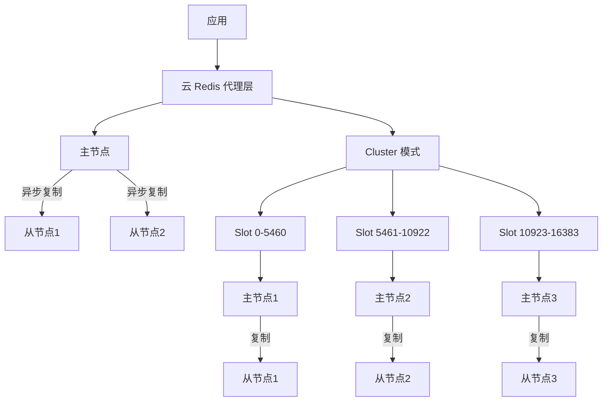
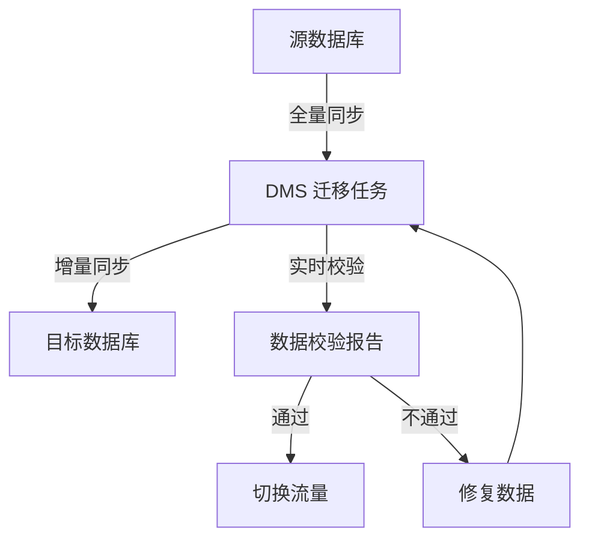
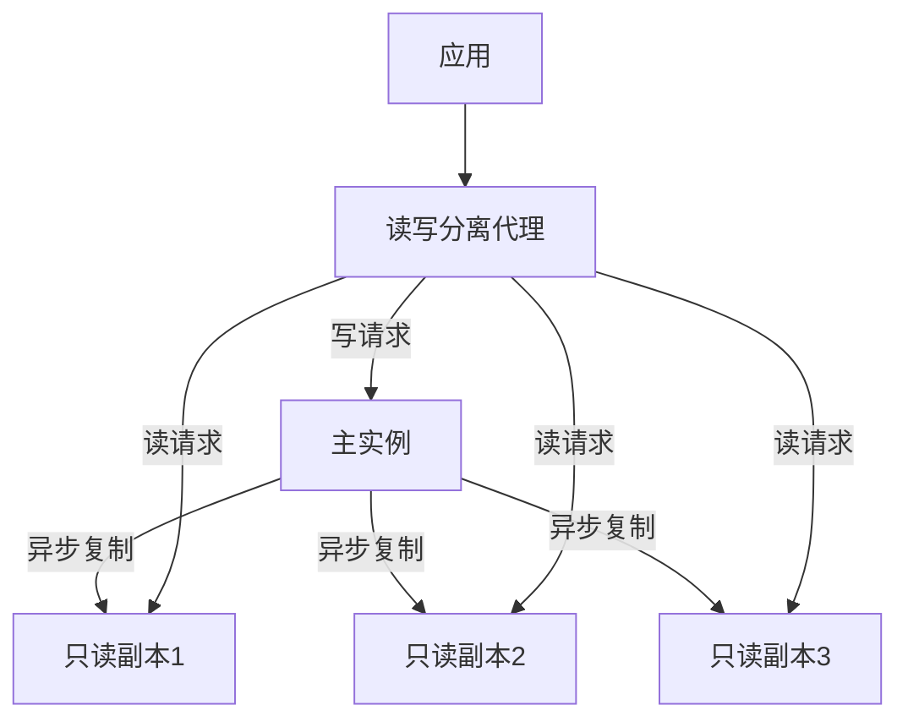
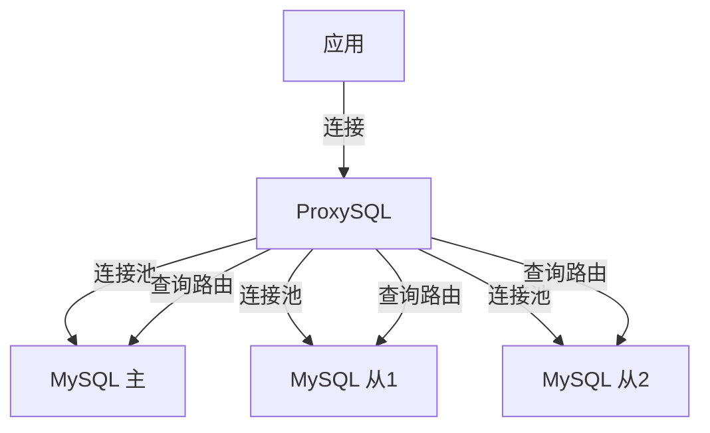

# 云上数据库与缓存生态

> **核心认知**：云数据库（RDS）和云缓存（Redis/Memcached）是云上应用的核心数据层。RDS 将传统数据库的部署、备份、扩容、高可用等运维复杂性抽象为托管服务；云缓存则提供毫秒级读写性能。理解二者的架构差异和选型逻辑，是构建高性能云原生应用的基础。

## 要解决的问题

| 问题 | 自建数据库的痛点 | 云数据库的解法 |
|------|-----------------|---------------|
| 高可用部署 | 需自建主从、配置故障转移 | 一键部署主从，自动故障切换 |
| 备份恢复 | 需编写备份脚本，验证恢复 | 自动备份 + 一键恢复 |
| 弹性扩容 | 需停机迁移数据 | 在线扩容，几乎无感知 |
| 安全合规 | 需自建安全策略 | 内置加密、审计、VPC 隔离 |
| 监控告警 | 需自建监控体系 | 内置性能指标 + 告警 |
| 版本升级 | 需手动升级 + 验证 | 自动补丁 + 可控大版本升级 |

## 云数据库产品矩阵

### 关系型数据库

| 产品 | 引擎 | 适用场景 | 特点 |
|------|------|----------|------|
| AWS RDS | MySQL/PostgreSQL/Oracle/SQL Server | 通用 OLTP | 多引擎、成熟稳定 |
| AWS Aurora | MySQL/PostgreSQL 兼容 | 高性能 OLTP | 存算分离、5x MySQL 性能 |
| 阿里云 RDS | MySQL/PostgreSQL/SQL Server | 通用 OLTP | 国内生态丰富 |
| 阿里云 PolarDB | MySQL/PostgreSQL/Oracle 兼容 | 高性能 OLTP | 存算分离、共享存储 |
| 腾讯云 TDSQL | MySQL/PostgreSQL | 金融级 OLTP | 分布式、强一致 |

### NoSQL 数据库

| 产品 | 类型 | 适用场景 | 特点 |
|------|------|----------|------|
| AWS DynamoDB | Key-Value/文档 | 高并发读写 | 全托管、自动扩展 |
| AWS ElastiCache | Redis/Memcached | 缓存/会话 | 内存缓存、微秒延迟 |
| 阿里云 Redis | Redis | 缓存/会话 | 兼容开源 Redis |
| 阿里云 Tablestore | 宽列存储 | IoT/时序数据 | 海量数据、低成本 |
| 腾讯云 Redis | Redis | 缓存/会话 | 集群版、全球复制 |

## 云数据库架构演进

### 传统架构 vs 云原生架构

```
传统架构：
  应用 → 连接池 → 单机 MySQL → 本地磁盘
  问题：扩展性差、高可用复杂、备份恢复手动

云原生架构（以 Aurora 为例）：
  应用 → 连接池 → Aurora 写节点 → 共享存储（6副本）
                       ↓
                   Aurora 读节点（最多15个）
  优势：存储自动扩展、读写分离开箱即用、故障秒级恢复
```

### Aurora 存储引擎

```
Aurora 存储层：
  ├── 数据分片（10GB 单位）
  ├── 每个分片 6 副本（跨 3 AZ）
  ├── 4/6 quorum 写入
  ├── 3/6 quorum 读取
  └── 异步复制到 S3（备份）

写入路径：
  1. 写节点 → 内存（WAL）
  2. 内存 → 共享存储（6 副本）
  3. 4 副本确认 → 写入成功
  4. 后台异步刷盘

读取路径：
  1. 读节点检查本地缓存
  2. 未命中 → 从存储层读取
  3. 一致性读：等待 LSN 同步
```

## 云缓存生态

### Redis 云服务架构



### Redis 部署模式

| 模式 | 适用场景 | 特点 |
|------|----------|------|
| 单机 | 开发/测试 | 简单、无高可用 |
| 主从 | 读多写少 | 读扩展、手动切换 |
| 哨兵 | 自动故障转移 | 监控 + 自动 failover |
| Cluster | 大数据量/高吞吐 | 分片 + 高可用 |

### 缓存策略对比

| 策略 | 流程 | 适用场景 | 一致性 |
|------|------|----------|--------|
| Cache Aside | 先更新 DB → 再删缓存 | 通用场景 | 最终一致 |
| Read Through | 缓存未命中 → 缓存层读 DB | 读多写少 | 最终一致 |
| Write Through | 写入缓存 → 缓存层写 DB | 写一致性要求高 | 强一致 |
| Write Behind | 写入缓存 → 异步写 DB | 高写入吞吐 | 弱一致 |

## RDS vs Aurora vs PolarDB 选型

| 维度 | RDS（MySQL） | Aurora（MySQL） | PolarDB（MySQL） |
|------|-------------|-----------------|------------------|
| 存储架构 | 本地 EBS | 分布式共享存储 | 分布式共享存储 |
| 写性能 | 基准 | 5x MySQL | 与 Aurora 相当 |
| 读扩展 | 5 只读副本 | 15 只读副本 | 15 只读副本 |
| 存储成本 | 按预分配 | 按实际使用 | 按实际使用 |
| 故障恢复 | 分钟级 | 秒级 | 秒级 |
| 全球数据库 | 不支持 | Global Database | 全球数据库 |
| 价格 | 较低 | 中等 | 中等 |

## 高可用与容灾设计

### 多层容灾

```
容灾层次：
  ├── 应用层：多 AZ 部署
  ├── 代理层：云数据库 Proxy（连接池 + 故障转移）
  ├── 数据库层：主从复制 + 自动切换
  ├── 存储层：多副本 + 跨 AZ 复制
  └── 备份层：自动备份 + 跨区域复制

RPO/RTO 目标：
  ├── RPO（数据丢失量）：秒级（异步复制）/ 零（同步复制）
  └── RTO（恢复时间）：分钟级（自动切换）
```

### 故障转移流程

```
主节点故障检测（30s 内）：
  1. 健康检查失败
  2. 代理层标记主节点不可用
  3. 选择最新的从节点提升为主
  4. DNS 切换 / 代理层更新路由
  5. 应用无感知（连接池自动重连）
  6. 旧主节点恢复后作为从节点加入
```

## 成本优化

| 优化手段 | 节省比例 | 说明 |
|----------|----------|------|
| 预留实例 | 30-60% | 1-3 年预留 |
| 读写分离 | 20-40% | 读请求打到只读副本 |
| 自动扩缩容 | 20-50% | 根据负载自动调整 |
| 存储优化 | 10-30% | 压缩、冷数据归档 |
| 选择合适规格 | 30-50% | 按实际需求选型 |

## 常见陷阱

| 陷阱 | 后果 | 正确做法 |
|------|------|----------|
| 不设自动备份 | 数据丢失无法恢复 | 开启自动备份 + 定期验证恢复 |
| 读写不分离 | 主节点压力过大 | 配置只读副本 |
| 连接数不控制 | 数据库连接耗尽 | 使用数据库代理 + 连接池 |
| 不监控慢查询 | 性能问题难以定位 | 开启慢查询日志 + 监控告警 |
| 跨 AZ 不考虑 | 单 AZ 故障全部不可用 | 多 AZ 部署 |
| 不设密码策略 | 安全风险 | 使用 IAM 认证 + 密码轮转 |

## 云数据库迁移策略

### DMS（数据迁移服务）流程



### 迁移模式对比

| 模式 | 停机时间 | 数据一致性 | 复杂度 | 适用场景 |
|------|----------|------------|--------|----------|
| 全量迁移 | 数小时 | 一次性同步 | 低 | 小数据量 |
| 全量+增量 | 分钟级 | 实时一致 | 中 | 大数据量（推荐） |
| 双写同步 | 零 | 强一致 | 高 | 核心业务 |
| CDC 实时同步 | 零 | 最终一致 | 中 | 数据平台同步 |

### 迁移注意事项

```
迁移检查清单：
  ├── 源库性能评估
  │   ├── 源库 QPS 和连接数
  │   ├── 迁移期间对源库的影响
  │   └── 是否需要在低峰期迁移
  ├── 网络带宽
  │   ├── 跨 AZ 迁移：确认带宽充足
  │   ├── 跨区域迁移：考虑专线/VPN
  │   └── 数据量预估：初始同步时间
  ├── 数据兼容性
  │   ├── 字符集兼容（UTF-8）
  │   ├── 存储过程/函数兼容
  │   └── 时区和排序规则
  ├── 回滚方案
  │   ├── 保留源库数据 7 天
  │   ├── 验证回滚流程
  │   └── 回滚时间窗口
  └── 切换计划
      ├── DNS TTL 提前调低
      ├── 准备切换脚本
      └── 监控切换后指标
```

## 读副本架构详解

### 读写分离架构



### 复制延迟处理

```
复制延迟问题：
  写入主库后立即读取副本 → 读不到最新数据

解决方案：
  ├── 读己之写（Read Your Own Writes）
  │   ├── 用户写入后，后续读请求强制走主库
  │   ├── 实现：根据时间戳/版本号判断
  │   └── 缺点：主库压力大
  ├── 延迟路由
  │   ├── 根据复制延迟动态路由
  │   ├── 延迟 < 阈值 → 走副本
  │   └── 延迟 > 阈值 → 走主库
  └── 会话一致性
      ├── 同一用户会话内保证读写一致
      ├── 实现：Session Stickiness
      └── 缺点：负载不均衡
```

### Aurora 读副本性能

```
Aurora 读副本优势：
  ├── 共享存储：无需复制数据，只复制日志
  ├── 启动时间：秒级（vs 传统分钟级）
  ├── 最多 15 个只读副本
  ├── 每个副本独立的读缓存
  └── 自动负载均衡

读副本延迟：
  ├── 亚秒级（通常 < 20ms）
  ├── 可通过 Aurora Replication Lag 监控
  └── 超过阈值可触发告警
```

## 连接池管理

### ProxySQL 架构



### 连接池参数配置

| 参数 | 推荐值 | 说明 |
|------|--------|------|
| max_connections | 1000-5000 | 最大连接数 |
| min_idle | 10-50 | 最小空闲连接 |
| idle_timeout | 600s | 空闲连接超时 |
| connection_timeout | 5s | 获取连接超时 |
| validation_interval | 3000ms | 连接验证间隔 |
| max_connect_errors | 100 | 最大连接错误数 |

### PgBouncer 配置

```ini
# pgbouncer.ini
[databases]
mydb = host=127.0.0.1 port=5432 dbname=mydb

[pgbouncer]
listen_addr = 0.0.0.0
listen_port = 6432
auth_type = md5
auth_file = /etc/pgbouncer/userlist.txt

pool_mode = transaction    # session / transaction / statement
max_client_conn = 1000
default_pool_size = 50
min_pool_size = 10
reserve_pool_size = 5
reserve_pool_timeout = 5

server_lifetime = 3600
server_idle_timeout = 600
client_idle_timeout = 0
```

### 连接池模式对比

| 模式 | 连接保持 | 性能 | 事务支持 | 适用场景 |
|------|----------|------|----------|----------|
| Session | 整个会话 | 中 | 完整 | 需要 Session 状态 |
| Transaction | 事务级别 | 高 | 完整 | 通用（推荐） |
| Statement | 语句级别 | 最高 | 单语句 | 简单查询 |

## 云数据库安全

### 加密体系

```
加密层次：
  ├── 静态加密（Encryption at Rest）
  │   ├── 存储层：AES-256 加密磁盘
  │   ├── 备份：自动加密备份文件
  │   ├── 日志：加密 Binlog/WAL
  │   └── 密钥管理：AWS KMS / 阿里云 KMS
  ├── 传输加密（Encryption in Transit）
  │   ├── TLS 1.2+ 强制
  │   ├── 证书管理：自动续期
  │   └── 客户端证书认证（可选）
  └── 应用层加密
      ├── 字段级加密
      ├── 应用端加密
      └── 透明数据加密（TDE）
```

### VPC 安全组配置

```
安全组规则设计：
  入站规则：
    ├── 3306 (MySQL)：仅允许应用子网 (10.0.1.0/24)
    ├── 5432 (PostgreSQL)：仅允许应用子网
    └── 6379 (Redis)：仅允许应用子网
  出站规则：
    └── 全部允许（或限制到特定目标）

最佳实践：
  ├── 数据库不暴露公网
  ├── 使用堡垒机跳板访问
  ├── 启用数据库审计日志
  ├── 定期轮转密码
  └── 使用 IAM 认证代替密码
```

## 云 Redis Cluster 内部机制

### 数据分片原理

```
Redis Cluster 16384 个 Slot：
  Slot 0-5460    → Node A
  Slot 5461-10922 → Node B
  Slot 10923-16383 → Node C

Slot 计算：CRC16(key) % 16384

客户端路由：
  1. 发送命令到任意节点
  2. 如果 Slot 不在该节点 → 返回 MOVED 重定向
  3. 客户端更新本地路由表
  4. 后续直接发送到正确节点

Hash Tag：
  使用 {} 包裹的 key 部分计算 Slot
  {user:123}:profile → Slot 基于 "user:123" 计算
  {user:123}:orders  → 同一 Slot
  优势：相关 key 在同一节点，支持多 key 操作
```

### 集群扩容流程

```
扩容步骤：
  1. 启动新节点
  2. 执行 CLUSTER MEET 加入集群
  3. 执行 CLUSTER ADDSLOTS 分配 Slot
  4. 迁移 Slot（在线迁移）
     ├── CLUSTER SETSLOT importing <slot> MIGRATING <node>
     ├── 逐个迁移 Slot 中的 key
     └── CLUSTER SETSLOT node <node> MIGRATING
  5. 更新客户端路由表

在线迁移注意事项：
  ├── 迁移期间 MOVED 和 ASK 重定向并存
  ├── 客户端需要支持 ASK 重定向
  ├── 控制迁移速度，避免影响线上流量
  └── 迁移前后验证数据一致性
```

## 云数据库备份恢复策略

### 备份策略配置

```
备份策略层次：
  ├── 自动备份
  │   ├── 全量备份：每天一次
  │   ├── 增量备份：每小时（WAL/Binlog）
  │   ├── 保留周期：7-35 天
  │   └── 跨区域复制：可选
  ├── 手动备份
  │   ├── 变更前备份
  │   ├── 迁移前备份
  │   └── 大版本升级前备份
  └── 快照
      ├── 存储层快照（如 EBS Snapshot）
      ├── 秒级创建
      └── 增量快照

恢复类型：
  ├── 恢复到指定时间点（PITR）
  │   └── 基于全量备份 + 增量日志重放
  ├── 恢复到指定 SLA 时间
  │   └── 最新备份点
  └── 跨区域恢复
      └── 从其他区域的备份恢复
```

### 恢复验证流程

```
恢复验证（定期执行）：
  1. 从备份恢复到测试实例
  2. 验证数据完整性
     ├── 表结构完整
     ├── 数据条数一致
     └── 关键数据抽样校验
  3. 验证应用兼容性
     ├── 连接测试
     ├── 查询性能测试
     └── 存储过程执行
  4. 记录恢复时间（RTO 验证）
  5. 生成恢复报告
```

## 数据库性能测试（sysbench）

### sysbench 测试模式

```
sysbench oltp_read_write 模式（推荐）：
  ├── 读写混合（70% 读 + 30% 写）
  ├── 模拟真实 OLTP 负载
  └── 测试 QPS / TPS / 延迟

sysbench 命令：
  sysbench oltp_read_write \
    --mysql-host=rds-instance.xxx.rds.aliyuncs.com \
    --mysql-port=3306 \
    --mysql-user=sbtest \
    --mysql-password=**** \
    --mysql-db=sbtest \
    --tables=10 \
    --table-size=100000 \
    --threads=64 \
    --time=300 \
    --report-interval=10 \
    run

关键指标：
  ├── queries: 总查询数
  ├── QPS: 每秒查询数
  ├── TPS: 每秒事务数
  ├── latency P50/P95/P99: 响应延迟
  └── errors: 错误数
```

### 性能测试场景

| 场景 | 模式 | 线程数 | 表大小 | 目的 |
|------|------|--------|--------|------|
| 基准测试 | oltp_read_only | 16 | 10万 | 基线性能 |
| 高并发 | oltp_read_write | 128 | 10万 | 压力极限 |
| 大表查询 | oltp_point_select | 64 | 100万 | 索引性能 |
| 批量写入 | bulk_insert | 32 | - | 写入吞吐 |
| 事务性能 | oltp_update_non_index | 64 | 10万 | 更新性能 |

## 云数据库成本优化

### 成本计算公式

```
月度成本 = 计算成本 + 存储成本 + 备份成本 + 网络成本

计算成本：
  ├── 按需：实例规格 × 单价 × 使用时长
  ├── 包年包月：实例规格 × 月单价 × 月数 × 折扣
  └── 预留实例：年付 6-7 折，3 年付 3-5 折

存储成本：
  ├── 按容量：存储大小 × 单价/GB/月
  ├── IOPS：预留 IOPS × 单价
  └── 吞吐：预留吞吐 × 单价

优化策略：
  ├── 读写分离：读请求走只读副本（成本低）
  ├── 自动扩缩容：低峰期缩容（节省 20-50%）
  ├── 压缩存储：启用压缩（节省 30-50%）
  ├── 冷热分离：冷数据归档到低成本存储
  └── 选择合适规格：不超配，按需选择
```

### 成本对比示例

```
场景：100GB 数据，1000 QPS，7×24

方案 A：RDS MySQL 4核8G
  ├── 计算：¥2000/月
  ├── 存储：100GB × ¥0.5 = ¥50/月
  ├── 备份：50GB × ¥0.3 = ¥15/月
  └── 总计：¥2065/月

方案 B：Aurora MySQL 2核8G（按量）
  ├── 计算：¥1200/月（按量 ×730h）
  ├── 存储：100GB × ¥0.15 = ¥15/月
  ├── 备份：100GB × ¥0.15 = ¥15/月
  └── 总计：¥1230/月（节省 40%）

方案 C：Aurora MySQL 2核8G（预留1年）
  ├── 计算：¥800/月（年付 6.7 折）
  ├── 存储：100GB × ¥0.15 = ¥15/月
  ├── 备份：100GB × ¥0.15 = ¥15/月
  └── 总计：¥830/月（节省 60%）
```

## 云数据库监控仪表盘

### 核心监控指标

| 类别 | 指标 | 告警阈值 | 说明 |
|------|------|----------|------|
| 连接 | Active Connections | > 80% max | 活跃连接数 |
| 连接 | Connection Usage | > 80% | 连接使用率 |
| CPU | CPU Utilization | > 80% | CPU 使用率 |
| CPU | CPU Memory Utilization | > 80% | 内存使用率 |
| I/O | Disk IOPS | > 80% 预留 | 磁盘 IOPS |
| I/O | Disk Space Usage | > 80% | 磁盘空间 |
| 复制 | Replication Lag | > 30s | 复制延迟 |
| 性能 | Slow Queries | > 10/min | 慢查询数 |
| 性能 | QPS | 基线 ±50% | 每秒查询数 |
| 性能 | TPS | 基线 ±50% | 每秒事务数 |

### Grafana Dashboard 配置

```json
{
  "dashboard": {
    "title": "Cloud Database Overview",
    "panels": [
      {
        "title": "Connections",
        "type": "graph",
        "targets": [
          {"expr": "mysql_global_status_threads_connected"},
          {"expr": "mysql_global_variables_max_connections"}
        ]
      },
      {
        "title": "QPS",
        "type": "graph",
        "targets": [
          {"expr": "rate(mysql_global_status_queries[5m])"}
        ]
      },
      {
        "title": "Replication Lag",
        "type": "singlestat",
        "targets": [
          {"expr": "mysql_slave_status_seconds_behind_master"}
        ],
        "thresholds": [
          {"value": 0, "color": "green"},
          {"value": 10, "color": "yellow"},
          {"value": 30, "color": "red"}
        ]
      }
    ]
  }
}
```

### 告警规则

```yaml
# Prometheus 告警规则
groups:
  - name: cloud-db
    rules:
      - alert: HighConnections
        expr: mysql_global_status_threads_connected / mysql_global_variables_max_connections > 0.8
        for: 5m
        labels:
          severity: warning
        annotations:
          summary: "DB connections > 80%"

      - alert: ReplicationLag
        expr: mysql_slave_status_seconds_behind_master > 30
        for: 5m
        labels:
          severity: critical
        annotations:
          summary: "Replication lag > 30s"

      - alert: DiskSpaceLow
        expr: mysql_global_status_innodb_data_free_bytes / mysql_global_status_innodb_data_file_bytes < 0.2
        for: 10m
        labels:
          severity: warning
        annotations:
          summary: "Disk space < 20% free"
```

## 与其他板块的关系

| 关联板块 | 关系描述 |
|----------|----------|
| **微服务架构** | 每个微服务通常有独立的数据库实例 |
| **缓存策略** | 云缓存是数据库性能优化的关键层 |
| **数据同步** | CDC 工具将云数据库变更同步到大数据平台 |
| **监控体系** | 云数据库指标接入 Prometheus/Grafana |
| **安全合规** | 云数据库内置加密、审计、VPC 隔离 |

## 一句话总结

云数据库和云缓存将传统数据库的运维复杂性抽象为托管服务，Aurora/PolarDB 等存算分离架构实现了性能与弹性的质的飞跃，是云原生应用数据层的标配。

---

## 参考资料

- [AWS Aurora 文档](https://docs.aws.amazon.com/aurora/)
- [阿里云 PolarDB 文档](https://www.alibabacloud.com/help/en/polardb/)
- [Redis 官方文档](https://redis.io/docs/)
- [Cloud Database Best Practices](https://aws.amazon.com/blogs/database/)
