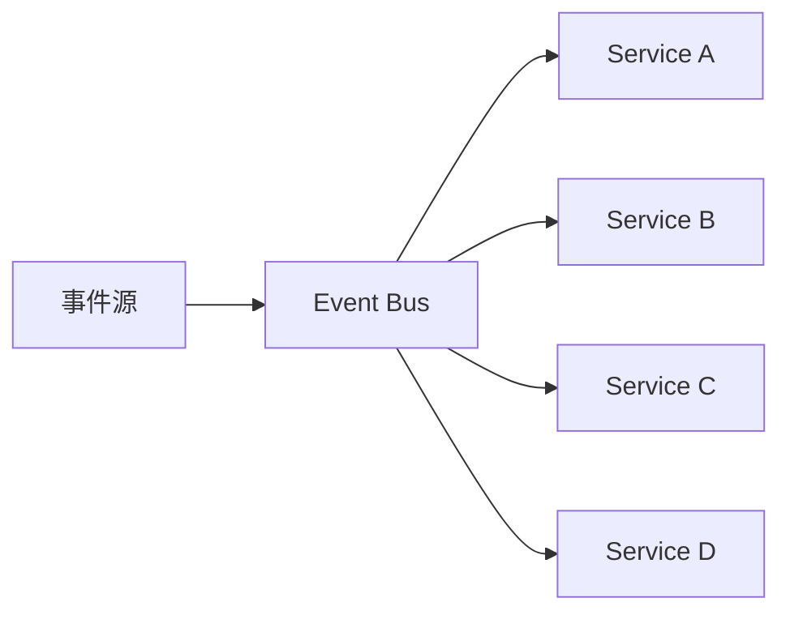
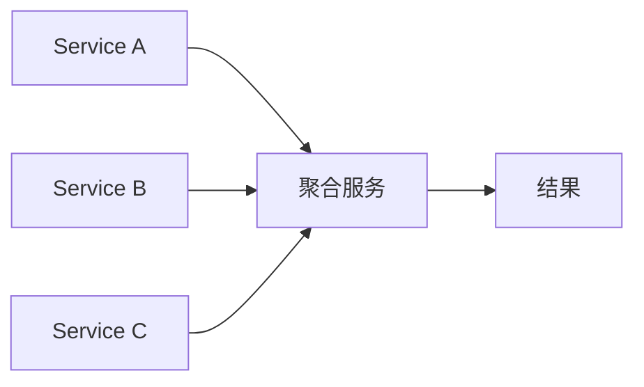
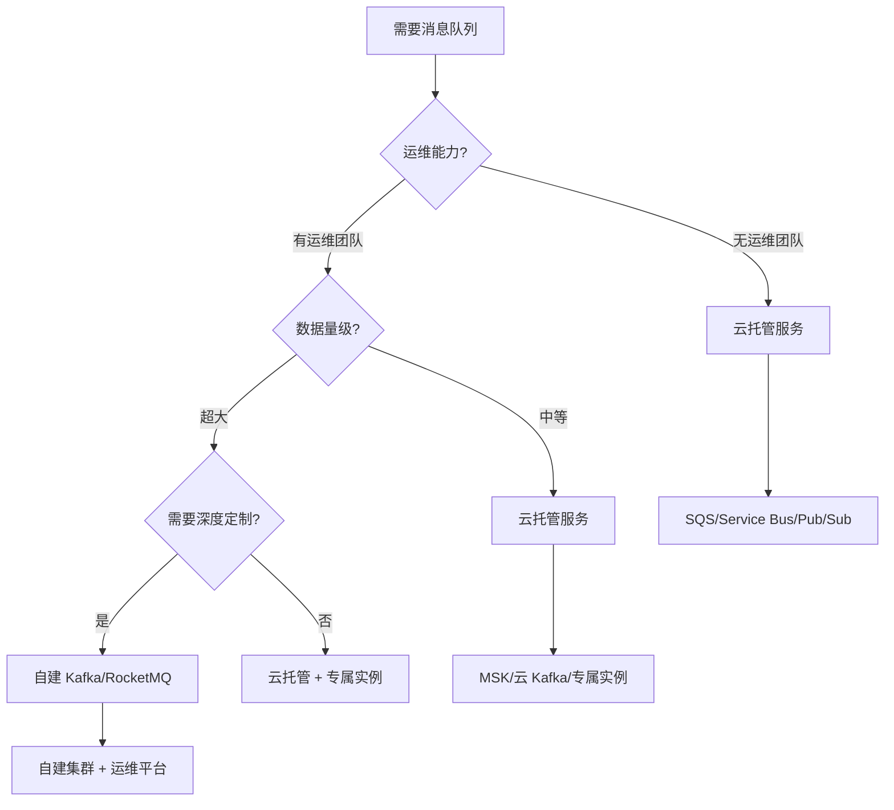
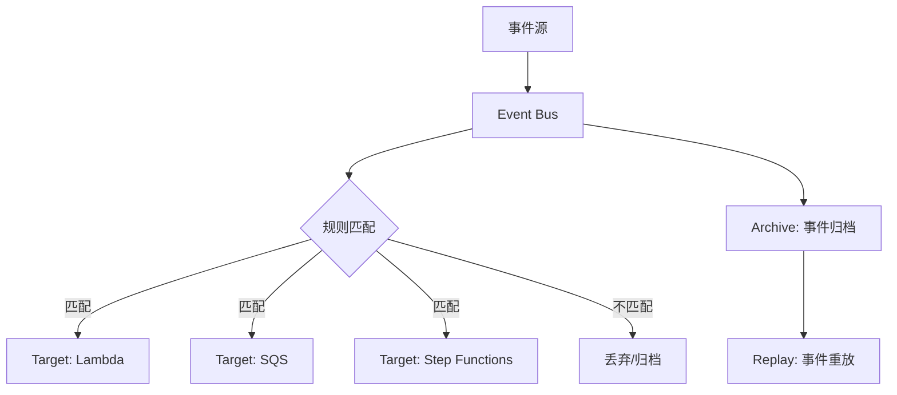
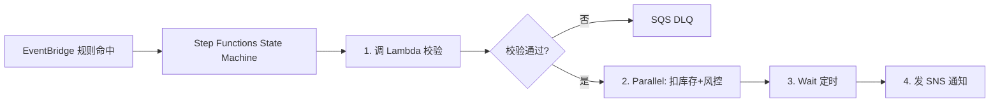
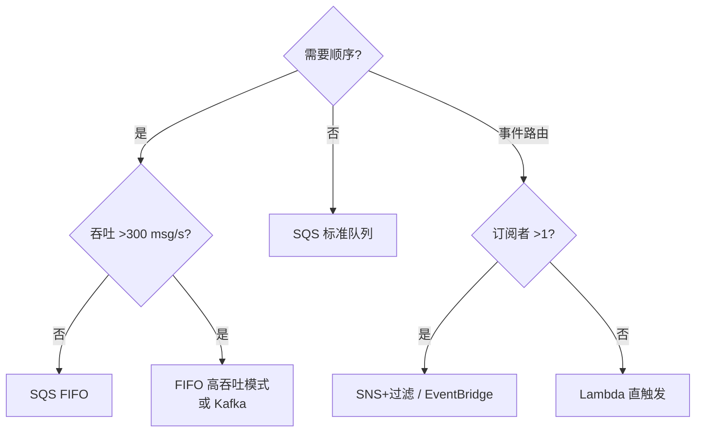
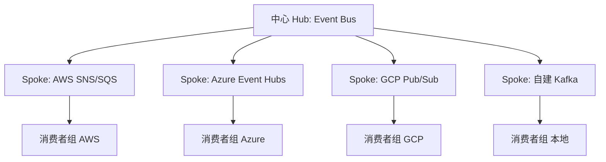

# 云上消息与集成生态深入（事件驱动架构 / 死信治理 / 成本优化 / 厂商锁定规避）

> 云厂商把消息中间件做成托管服务，按 IO 模型拆成**队列（Q）、主题（Topic）、事件总线（Event Bus）、流（Stream）**四类。本篇深入拆解：事件驱动架构模式、死信治理、成本优化、跨云规避锁定。

---

## 一、四类 IO 模型先分清（所有云通用）

| 模型 | 语义 | 典型场景 | 云服务代表 |
|------|------|----------|-----------|
| 队列 Queue | 点对点，一条消息只被一个消费者处理 | 任务解耦、削峰、异步 | SQS / 云 RocketMQ / CMQ |
| 主题 Topic | 发布订阅，一条消息被所有订阅者各收一份 | 事件通知、广播 | SNS / Pub/Sub / MNS |
| 事件总线 | 事件驱动编排，按规则路由到目标 | 云服务间联动、事件过滤 | EventBridge / Event Grid |
| 流 Stream | 有序可回放、高吞吐日志 | 日志管道、实时分析 | Kinesis / Event Hubs / CKafka |

> 最容易混淆：**Topic 是「广播」、Queue 是「竞争消费」**。

---

## 二、AWS：SQS / SNS / EventBridge / Kinesis

### 2.1 SQS（Simple Queue Service）——托管队列

**原理**：分布式队列，标准队列至少一次投递（可能重复），FIFO 队列严格有序 + 恰好一次（基于消息组）。

| 特性 | 说明 |
|------|------|
| 标准 vs FIFO | 标准高吞吐（默认乱序、至少一次）；FIFO 严格有序 + 去重，限 300 msg/s |
| 可见性超时 | 消费者拉走后消息对他人不可见，处理完删除；超时未删重复投递 |
| 死信队列 DLQ | 消费失败 N 次进 DLQ，人工/脚本处理 |
| 长轮询 | 减少空轮询流量（20s） |
| CloudWatch | 内置队列深度、条年龄监控 |

### 2.2 SNS（Simple Notification Service）——托管 Pub/Sub 主题

**原理**：主题 + 订阅者组，发布进主题 → SNS 扇出发往所有订阅者（fan-out）。

**特性**：主题过滤（按属性只推给感兴趣的订阅）、多协议订阅（HTTP/SMS/Email/Lambda/SQS）、与 SQS 组合做「扇出到 N 个队列」。

### 2.3 EventBridge —— 云内事件总线

**原理**：事件总线接收事件（事件源），规则（pattern matching）路由到目标（Targets：Lambda/Step Functions/SQS/HTTP）。

**特性**：事件模式匹配（按 source/detail-type/字段）、调度器（cron 定时）、自定义事件源、跨账号/跨区域总线、归档与重放。

### 2.4 Kinesis —— 托管流

**原理**：分片（Shard）模型 = Kafka 分区；每条记录带序列号；消费者按分片读游标，支持回放。

**特性**：Kinesis Data Streams（实时流）、Data Firehose（批量落 S3/Redshift）、Data Analytics（SQL 实时分析）；保留期默认 24h（可调）。

---

## 三、事件驱动架构模式（深入）

### 3.1 四种模式

| 模式 | 说明 | 适用 |
|------|------|------|
| 事件通知 | 事件 → 触发下游（不传数据） | 联动/唤醒 |
| 事件携带状态转移 | 事件带完整数据（Event Carrying State Transfer） | 服务解耦 |
| 事件溯源 | 以事件为唯一事实来源（可重放） | 审计/对账 |
| CQRS | 读写分离，事件同步读模型 | 高并发读 |

### 3.2 事件设计规范

```
事件结构：
  {
    "id": "evt_xxx",            // 唯一 ID（幂等）
    "source": "order-service",  // 来源
    "type": "order.created",    // 类型（过去式）
    "time": "2026-08-19T10:00:00Z",
    "data": { ... },            // 业务数据（完整）
    "specversion": "1.0"        // CloudEvents 标准
  }

规范：
  type 用过去式（order.created 而非 createOrder）
  data 带完整数据（下游无需回查）
  id 全局唯一（幂等消费）
  版本化（type 升级用 order.created.v2）
```

### 3.3 SAGA 分布式事务（云上实现）

```
订单流程：
  Order Service → 创建订单（本地事务）
  → 发事件 order.created
  → Payment Service 收到 → 扣款
  → 发事件 payment.completed
  → Inventory Service 收到 → 扣库存
  → 发事件 inventory.reserved

失败补偿：
  payment.failed → 触发 cancel 流程
  → 反向补偿（退款/释放库存）

实现：
  事件驱动（EventBridge/Pub-Sub）+ 本地事务
  每个服务只保证本地 ACID，全局靠事件编排
```

---

## 四、死信治理（DLQ 最佳实践）

### 4.1 为什么需要 DLQ

```
消费失败处理策略：
  立即重试 → 可能一直失败（坏消息/下游故障）
  无限重试 → 阻塞队列（消息积压）
  丢弃 → 丢数据（不可接受）

DLQ = 失败 N 次后转入死信队列，隔离坏消息
```

### 4.2 DLQ 配置

| 服务 | 配置 |
|------|------|
| SQS | 源队列 → DLQ（maxReceiveCount=3，重试 3 次转 DLQ） |
| EventBridge | 目标失败 → 路由到 DLQ（可配） |
| 云 RocketMQ | 消费失败 → 重试队列 → 死信队列（16 次后） |

### 4.3 DLQ 治理流程

```
1. 监控 DLQ 深度（告警阈值：> 100 条）
2. 分析失败原因（消息格式/下游故障/业务规则）
3. 修复（重放/修正数据/修 bug）
4. 重放机制（手动重新投递到源队列）
5. 定期清理（确认无法处理的消息归档）

DLQ 消费方案：
  人工 + 脚本（管理台重放）
  自动重放（带退避 + 熔断）
```

---

## 五、幂等消费设计（云消息）

### 5.1 重复投递来源

```
标准队列：至少一次投递（可能重复）
消费者失败：超时未删 → 重新投递
FIFO 去重窗口外：可能重复

幂等方案：
  消息 ID + 去重表（DB 唯一索引/Redis setnx）
  业务幂等键（orderId 唯一索引）
  状态机（重复事件自然终止）
```

### 5.2 消费重试策略

```
指数退避：
  重试 1：延迟 10s
  重试 2：延迟 30s
  重试 3：延迟 1min
  重试 N：延迟 指数增长 + 抖动

熔断：
  连续失败超阈值 → 暂停消费（人工介入）
  恢复：间隔探测 → 逐步恢复
```

---

## 六、成本优化

| 策略 | 做法 | 省多少 |
|------|------|--------|
| 批量发送 | SQS SendMessageBatch（10 条/次） | 90%（请求数） |
| 长轮询 | 减少空轮询 API 调用 | 80%+ |
| 预留容量 | FIFO 高吞吐预留分片 | 30~60% |
| 生命周期 | 冷数据转归档存储 | 50%+ |
| 消息压缩 | 大消息压缩（gzip） | 存储 60%+ |
| Kinesis 扩缩容 | 低峰缩分片 | 30~50% |

### 6.1 成本监控

```
监控指标：
  消息量/请求数（按 API 调用计费）
  DLQ 深度（异常消费）
  队列积压（消费者能力）
  保留期（存储费用）

优化动作：
  定期清理无用队列/主题
  调整保留期（够用即可）
  使用标签管理（按团队/项目计费）
```

---

## 七、跨云规避锁定

### 7.1 锁定风险点

| 风险 | 说明 |
|------|------|
| 私有 API | SQS API 仅 AWS |
| 事件格式 | EventBridge 格式各厂商不同 |
| 传输协议 | 各厂商协议私有 |
| 数据迁移 | 历史消息导出困难 |

### 7.2 规避策略

```
协议兼容优先：
  选开源协议兼容服务：
    Kafka 协议（MSK/云 Kafka/CKafka 互通）
    RocketMQ 协议（云 RocketMQ/TDMQ 互通）
    MQTT（物联网场景）

标准事件格式：
  CloudEvents 标准（各云已支持）
  事件结构独立于厂商

封装层：
  统一消息客户端（内部 SDK 抽象）
  配置驱动（切换厂商改配置不改代码）

数据可迁移：
  定期导出到对象存储（S3/OSS）
  保留期设置合理（可回放窗口）
```

---

## 八、选型速查（按需求选，不按品牌选）

| 需求 | 首选 | 备选 |
|------|------|------|
| 简单解耦削峰 | SQS / MNS | 云 RocketMQ（要事务时） |
| 事务消息/延迟消息 | 云 RocketMQ（阿里） | TDMQ (RocketMQ 兼容) |
| 一个事件通知多接收方 | SNS / 云 MNS 主题 | Pub/Sub |
| 云内事件驱动编排 | EventBridge / Event Grid / Eventarc | 自研事件中心 |
| 高吞吐流+回放 | Kinesis / Event Hubs / 云 Kafka | MSK |
| 需要 Kafka 全语义 | MSK / CKafka / 云 Kafka | Kinesis（语义不全） |
| 跨云/多云 | 协议兼容层（Kafka/S3 类开源标准） | 厂商专属 API |

### 8.1 事件驱动设计要点

```
1. 先定事件模型（CloudEvents 标准）
2. 再选总线（EventBridge/Event Grid）
3. 规则设计（过滤/路由/目标）
4. 幂等消费（消息 ID + 去重）
5. 死信治理（DLQ + 重放机制）
6. 观测（事件链路/延迟/失败率）
```

---

## AWS SQS / SNS 深入剖析

### SQS 高级特性

| 特性 | 说明 | 配置 |
|------|------|------|
| 消息保留期 | 默认 4 天，最长 14 天 | `MessageRetentionPeriod` |
| 可见性超时 | 消费者锁定消息的时间窗口 | `VisibilityTimeout`（0~12h） |
| 长轮询 | 消费者等待新消息到达（最长 20s） | `WaitTimeSeconds` |
| 延迟投递 | 消息延迟 N 秒后可见 | `DelaySeconds`（标准队列最大 15min） |
| 消息分组 | FIFO 队列中逻辑分组 | `MessageGroupId` |
| 消息去重 | FIFO 队列基于 MessageDeduplicationId 去重 | `MessageDeduplicationId` |
| 加密 | 服务端加密（SSE-SQS / SSE-KMS） | `KmsMasterKeyId` |

### SNS Fan-out 模式详解

```
SNS + SQS Fan-out 架构：
  发布者 → SNS Topic
             ├── SQS 队列 A（订单服务消费）
             ├── SQS 队列 B（库存服务消费）
             ├── SQS 队列 C（通知服务消费）
             └── Lambda 函数 D（实时处理）

关键配置：
  SNS Topic Policy：允许 SNS 推送到 SQS
  SQS Access Policy：允许 SNS 写入
  订阅过滤：按 MessageAttributes 过滤

示例（订单事件路由）：
  Topic: order-events
  订阅过滤规则：
    - 订单创建 → 所有订阅者
    - 支付完成 → 仅通知服务
    - 退款 → 仅财务服务
```

---

## Azure Service Bus 与 Google Pub/Sub

### Azure Service Bus 高级特性

| 特性 | 说明 |
|------|------|
| 队列/主题 | 支持队列和发布订阅两种模式 |
| 会话 | Session 消息按 SessionId 路由（有序消费） |
| 延迟消息 | Scheduled Enqueue Time（定时投递） |
| 死信 | DeliveryCount 超限自动转 DLQ |
| 去重 | Duplicate Detection（基于 MessageId） |
| 事务 | Transactional Batch（原子发送多条消息） |
| Geo-Disaster Recovery | 跨区域自动故障转移 |

### Google Pub/Sub 特性矩阵

| 特性 | 说明 |
|------|------|
| At-least-once | 默认投递语义 |
| Exactly-once | 通过 ordering key + 幂等消费实现 |
| 消息保留 | 最长 31 天 |
| 延迟消息 | ScheduleTime（精确到秒） |
| BigQuery 直连 | 直接将消息流式写入 BigQuery |
| Dataflow 集成 | 与 Dataflow 流处理无缝集成 |
| Schema Registry | JSON/Avro Schema 验证 |

---

## 云消息队列对比矩阵

| 维度 | AWS SQS | Azure Service Bus | GCP Pub/Sub | 阿里云 RocketMQ |
|------|---------|-------------------|-------------|-----------------|
| 消息模型 | 队列/主题 | 队列/主题 | 发布订阅 | 队列/主题/事务 |
| 投递语义 | At-least-once | At-least-once | At-least-once | At-least-once/Exactly-once |
| 顺序保证 | FIFO 队列 | Session | Ordering Key | 顺序消息 |
| 延迟消息 | 15min | 无限制 | ScheduleTime | 18小时 |
| 事务消息 | 无 | Transactional Batch | 无 | 事务消息 |
| 死信队列 | 有 | 有 | 有 | 有 |
| 消息大小 | 256KB | 256KB | 10MB | 4MB |
| 最大吞吐 | 3000/s（标准） | 1000/s（标准） | 数百万/s | 10万+/s |
| 持久化 | 自动 | 自动 | 自动 | 自动 |
| 价格模型 | 请求计费 | 消息计费 | 消息计费 | 消息计费 |

---

## 事件驱动集成模式深入

### Fan-out 扇出模式



**场景**：一个事件需要触发多个下游服务处理。实现方式：SNS/Pub/Sub/EventBridge 主题 + 多订阅。

### Fan-in 扇入模式



**场景**：多个服务的输出需要聚合处理。实现方式：SQS/队列 + 消费者聚合 + 计数器/状态机。

### 内容路由（Content-based Routing）

```python
# 基于消息属性路由
def route_message(message):
    priority = message.get_attribute("priority")
    region = message.get_attribute("region")
    
    if priority == "high":
        send_to_queue("high-priority-queue")
    elif region == "cn":
        send_to_queue("cn-processing-queue")
    else:
        send_to_queue("default-queue")
```

---

## 死信队列（DLQ）治理深入

### DLQ 配置策略

| 服务 | 配置方式 | 重试次数 |
|------|----------|----------|
| AWS SQS | `maxReceiveCount=3` | 3 次 |
| Azure Service Bus | `maxDeliveryCount=10` | 10 次 |
| GCP Pub/Sub | `maxDeliveryAttempts=5` | 5 次 |
| 阿里云 RocketMQ | `maxReconsumeTimes=16` | 16 次 |

### DLQ 治理自动化

```python
# DLQ 自动重放脚本示例
import boto3

sqs = boto3.client('sqs')

def replay_dlq(source_queue, dlq_url, max_messages=10):
    messages = sqs.receive_message(
        QueueUrl=dlq_url,
        MaxNumberOfMessages=max_messages,
        WaitTimeSeconds=5
    )
    
    for msg in messages.get('Messages', []):
        # 重新发送到源队列
        sqs.send_message(
            QueueUrl=source_queue,
            MessageBody=msg['Body'],
            MessageAttributes=msg.get('MessageAttributes', {})
        )
        # 删除 DLQ 中的消息
        sqs.delete_message(
            QueueUrl=dlq_url,
            ReceiptHandle=msg['ReceiptHandle']
        )
```

---

## 跨账号/跨区域消息

### AWS 跨账号消息架构

```
跨账号通信方案：
  方案一：SNS + SQS（推荐）
    账号 A 的 SNS Topic → 账号 B 的 SQS 队列
    配置跨账号 Resource Policy

  方案二：EventBridge 跨账号总线
    账号 A 的 EventBridge → 账号 B 的 EventBridge
    配置跨账号 Target

  方案三：Kafka（MSK）跨账号
    共享 MSK 集群 → 多账号 Consumer Group
```

### 跨区域容灾

| 方案 | 说明 | RPO/RTO |
|------|------|---------|
| SNS 多区域订阅 | 同一 Topic 订阅多区域 SQS | 近零 |
| EventBridge 跨区域复制 | 跨区域 Event Bus 转发 | 分钟级 |
| MSK MirrorMaker | Kafka 跨区域数据镜像 | 秒级 |
| SQS 延迟消息 | 延迟投递到目标区域 | 分钟级 |

---

## 消息队列成本优化

### 成本构成分析

| 费用项 | AWS SQS | Azure Service Bus | GCP Pub/Sub |
|--------|---------|-------------------|-------------|
| 请求费 | $0.40/百万请求 | $0.05/百万消息 | $40/TB |
| 数据传输 | $0.09/GB | $0.025/GB | $0.01/GB |
| 持久化 | 包含 | 包含 | 包含 |
| DLQ | 免费 | 免费 | 免费 |

### 优化策略

```
1. 批量操作：
   SQS SendMessageBatch（10 条/次）→ 请求数减 90%

2. 长轮询：
   WaitTimeSeconds=20 → 空轮询减 80%+

3. 消息压缩：
   gzip 压缩大消息 → 存储/传输费减 60%+

4. 合理保留期：
   按需设置（4 天 vs 14 天）→ 存储费减 75%

5. 监控清理：
   定期清理无用队列/主题
   监控 DLQ（异常消费成本）
```

---

## 云 vs 自建消息队列决策树



---

## 云事件总线架构

### EventBridge 架构设计



### 事件模式匹配规则

```json
{
  "source": ["aws.ec2", "myapp.orders"],
  "detail-type": ["EC2 Instance State-change", "Order Created"],
  "detail": {
    "state": ["running", "stopped"],
    "amount": [{"numeric": [">", 100]}]
  }
}
```

## SQS FIFO vs 标准队列深度对比

| 维度 | 标准队列 | FIFO 队列 |
|------|---------|-----------|
| 顺序保证 | 尽力而为（可能乱序） | MessageGroupId 内严格 FIFO |
| 投递语义 | At-least-once（可重复） | Exactly-once 处理（去重窗口内） |
| 吞吐 | 近无限（自动扩展） | 默认 300 msg/s、3000 msg/s（批+高吞吐模式） |
| 去重 | 无 | MessageDeduplicationId / 内容去重（5min 窗口） |
| 价格 | 标准 API 价 | 略贵 + FIFO 高吞吐模式按分片另计 |

```text
FIFO 两大机制：
① 去重：生产端给 MessageDeduplicationId
   - 显式指定：业务幂等键（如 orderId）
   - ContentBasedDeduplication=true：对 body 做哈希（同内容 5 分钟内只投一次）
   注意：5 分钟窗口外重发仍会重复 → 消费端幂等依然要做

② 消息组：MessageGroupId
   - 同 Group 内严格有序、串行消费
   - 不同 Group 并行 → 用「订单ID % N」「租户ID」做 Group 提升吞吐
```

选型结论：金融/库存扣减/状态机用 FIFO（Group 设计成实体 ID）；日志/通知/削峰用标准队列。

## SNS 消息过滤策略实战

```json
// 订阅属性 FilterPolicy（SNS 推送前在服务端过滤，省下游成本）
{
  "event_type": ["order.created", "order.paid"],
  "amount": [{ "numeric": [">=", 1000] }],
  "region": { "anything-but": ["test"] },
  "tenant_id": { "prefix": "vip-" }
}
```

| 过滤语法 | 含义 |
|----------|------|
| 精确匹配 `["a","b"]` | 属性值在集合内 |
| `anything-but` | 排除指定值 |
| `prefix` / `suffix` | 前缀/后缀匹配 |
| `numeric` | 数值比较（>, >=, <, <=, between） |
| `$or` / 组合 | 多条件或逻辑 |
| FilterPolicyScope=MessageBody | 对消息体 JSON 过滤（默认只过滤 MessageAttributes） |

实战要点：
- 扇出架构里「每个订阅者只收自己关心的子集」——未命中不推送也不计下游 SQS 费用；
- 无 FilterPolicy 的订阅会收到全部消息（含垃圾），务必显式声明；
- 属性总数 ≤10、策略大小 ≤256KB；超复杂路由应改用 EventBridge。

## EventBridge 规则引擎模式匹配语法

```json
{
  "source": ["myapp.orders"],
  "detail-type": ["Order Created"],
  "detail": {
    "state": ["paid"],
    "amount": [{ "numeric": [">", 100] }],
    "items": { "sku": [{ "prefix": "SKU-" }] }
  }
}
```

| 能力 | 语法示例 | 说明 |
|------|---------|------|
| 精确匹配 | `"state": ["running"]` | 数组内任一命中即可 |
| 前缀 | `{"prefix": "prod-"}` | 字符串前缀 |
| 后缀 | `{"suffix": ".jpg"}` | 文件类型路由常用 |
| 排除 | `{"anything-but": ["dev"]}` | 黑名单 |
| 数值 | `[{"numeric":[">",100,"<=",500]}]` | 区间判断 |
| IP/CIDR | `{"cidr":"10.0.0.0/8"}` | 安全事件路由 |
| exists | `{"exists": true}` | 判断字段存在性 |
| 通配符 | `{"wildcard":"*-payment-*"}` | 任意位置通配（最多5个*） |

设计建议：规则数控制（单总线默认 300 条）；高频演进的路由逻辑下沉到消费者侧或用 Step Functions 分流；归档（Archive）+ 重放（Replay）用于规则调试与事故回放。

## Step Functions 与消息集成编排



| 编排能力 | 在消息链路里的价值 |
|----------|-------------------|
| Choice 条件分支 | 按消息内容走不同处理路径 |
| Parallel | 一条消息触发多个并行子流程 |
| Retry/Catch | 内建指数退避重试，失败进 Catch→DLQ |
| Wait until | 延时消息（替代 15 分钟上限的 SQS Delay） |
| Map | 批量消息逐项扇出处理 |

定位分工：**EventBridge 负责「选谁」，Step Functions 负责「怎么一步步做完」**——超过 2 步的联动一律上状态机而不是链式 Lambda。

## 跨区域消息复制方案

| 方案 | RPO/RTO | 成本 | 适用 |
|------|---------|------|------|
| EventBridge 跨区域总线转发 | 秒级 | 双份事件费+egress | 主动多活联动 |
| SNS → 多区域 SQS 订阅 | 近零延迟差 | 中 | 广播型容灾 |
| MSK Replicator/MirrorMaker2 | 秒级 | 集群×2+带宽 | Kafka 生态容灾 |
| SQS 消息复制（Lambda 中继） | 分钟级 | 低 | 单队列级备份 |

```text
跨区域复制三原则：
① 只复制必要事件（加 region 过滤器），egress 是最大成本项
② 目标区写入时改写 source/attributes，防回环（A→B→A 死循环）
③ 幂等键全局唯一（原 message-id 透传），重放不产生二次副作用
```

## 云消息成本测算公式（请求数 × 单价）

```text
月成本 ≈ Σ(各 API 请求数) ÷ 1,000,000 × 单价 + 出站流量费 + 可选特性费

SQS 示例：
  生产 3,000 万条/月（SendMessageBatch 10条/次 → 300 万请求）
  消费 3,000 万条（ReceiveBatch 10条/次 + DeleteBatch → 600 万请求）
  = 900 万请求 ÷ 100 万 × $0.40 = $3.6/月
  若不用批量：9,000 万请求 → $36/月（批量省 90%）

长轮询价值：WaitTimeSeconds=20 使空轮询近乎为 0，
  否则空闲期 Receive 也按请求计费（监控 NumberOfEmptyReceives）。
```

优化清单：
- [ ] 全链路批量 API（Send/Receive/Delete Batch）
- [ ] 长轮询 20s + 合理 VisibilityTimeout
- [ ] 大消息走指针模式（body 存 S3 引用，消息只传 key）
- [ ] FIFO 高吞吐模式仅在 >300msg/s 时开启
- [ ] 每队列 CloudWatch 账单维度告警，异常流量当天发现

## 消息集成选型补充：队列 vs 总线 vs 状态机

| 需求 | 用什么 | 反例（不要用） |
|------|--------|---------------|
| 解耦削峰、无顺序要求 | SQS 标准队列 | FIFO（浪费吞吐与成本） |
| 同实体严格有序 | SQS FIFO（Group=实体ID） | 全局单队列串行 |
| 一事件多订阅者且各自过滤 | SNS + FilterPolicy | 轮询数据库表 |
| 云服务状态变化联动 | EventBridge 规则 | 自己写 Lambda 扫 CloudTrail |
| 多步骤可靠流程 | Step Functions | Lambda 链式互调（无重试语义） |
| 高吞吐回放日志流 | Kinesis/Kafka | SQS（不可回放） |



---

## AWS EventBridge vs SNS+SQS 组合选择

| 维度 | EventBridge | SNS + SQS 组合 |
|------|-------------|----------------|
| 路由能力 | 事件模式匹配（字段级过滤） | SNS FilterPolicy（属性级过滤） |
| 事件格式 | CloudEvents 标准 | 自定义 MessageAttributes |
| 目标类型 | Lambda/SQS/SNS/StepFunctions | SNS → SQS/Lambda/HTTP |
| 归档重放 | 内置 Archive + Replay | 需自行实现（S3 归档） |
| 调度能力 | 内置 cron/Rate 调度器 | 需 CloudWatch Events |
| 跨账号 | 原生跨账号总线 | 需 Resource Policy |
| 成本 | $1.00/百万事件 | SNS + SQS 分别计费 |

```
选择 EventBridge：路由规则复杂、归档回放、云服务联动、跨账号
选择 SNS+SQS：简单扇出、严格队列语义、拉取模式、成本敏感
最佳组合：EventBridge 路由 → SNS 扇出 → SQS 消费缓冲
```

## Azure Event Hubs 与 Kafka 协议兼容性

| 能力 | 原生 Event Hubs | Kafka 协议兼容 |
|------|----------------|----------------|
| 协议 | AMQP 1.0 / HTTP | Kafka 0.10+/1.0+ |
| 生产者 | Azure SDK | kafka-python/librdkafka |
| 消费者 | EventProcessorHost | Kafka Consumer Group |
| 分区 | Event Hubs Partition | 映射为 Kafka Partition |
| 保留期 | 1~7 天（标准）/ 90 天（专用） | 同左 |
| 吞吐 | 1~20 TU（标准）/ 专用无限 | 同左 |

```
兼容适用：已有 Kafka 生态工具、多云场景、迁移场景
注意：不支持 Kafka 事务、Log Compaction、旧版本协议
配置：创建 Event Hubs Namespace 时启用 Kafka 端口（9093）
```

## GCP Pub/Sub 至少一次 vs 仅一次投递对比

| 维度 | At-least-once（默认） | Exactly-once（2023 GA） |
|------|----------------------|------------------------|
| 投递保证 | 至少投递一次，可能重复 | 语义上恰好一次（去重窗口内） |
| 实现机制 | 自动重试 + 超时重发 | Publisher 序列号 + 去重窗口（~10min） |
| 消费者幂等 | 必须自行实现 | 窗口内自动去重，窗口外仍需幂等 |
| 吞吐影响 | 无额外开销 | 略有延迟（去重校验） |
| 适用场景 | 大部分场景（推荐） | 金融交易、库存扣减 |
| 成本 | 标准价 | 标准价（无额外费用） |

```
选择建议：
  默认选 At-least-once + 消费者幂等（最可靠）
  仅在「高频重复无法接受 + 去重窗口覆盖」时用 Exactly-once
  Exactly-once 去重窗口约 10 分钟，超时后仍可能重复
  消息大小上限：标准 1MB，Exactly-once 不变
```

## 跨云消息集成模式（Hub-Spoke）



| 模式 | 说明 | 适用 |
|------|------|------|
| Hub-Spoke | 中心事件总线分发到多云 | 多云事件路由 |
| Mesh | 各云事件总线直接互联 | 低延迟跨云 |
| Bridge | 桥接器做协议转换 | 异构协议互通 |
| Federation | 各云自治 + 命名空间联邦 | 松耦合多云 |

```
Hub-Spoke 实现要点：
  ① 中心用 Kafka（MSK/Confluent）或 EventBridge（单云优先）
  ② 各 Spoke 用 Kafka Connect 或云 SDK 桥接
  ③ 事件格式统一 CloudEvents（跨云互操作）
  ④ 幂等键全局唯一（原 message-id 透传）
  ⑤ 跨云带宽是成本大头，只复制必要事件
```

## 云消息持久化策略

| 策略 | 保留期 | 成本 | 适用 |
|------|--------|------|------|
| 标准保留 | 1~14 天 | 低（含在消息费中） | 大部分消费场景 |
| Extended 保留 | 14~365 天 | 中（存储费） | 审计回放、合规 |
| Archive 归档 | 无限期 | 低（冷存储价） | 长期合规、事件溯源 |
| 外部归档 | 自定义 | 最低（S3/OSS） | 超长期、跨云 |

```
持久化策略选择：
  实时消费：标准保留（4 天够用）
  调试回放：Extended 保留（7~14 天）
  合规审计：Archive + S3 归档（永久保留）
  事件溯源：Archive + 快照（定期导出）
  
成本优化：
  SQS：默认 4 天，调到 1 天省存储费
  SNS：消息不持久化（推送到 SQS 后删除）
  EventBridge：默认不归档，开启 Archive 收存储费
```

## 云消息成本优化三策略

### 策略一：批量操作

```
SQS 批量 API：
  SendMessageBatch：最多 10 条/次 → 请求数减 90%
  ReceiveMessage：MaxNumberOfMessages=10 → 拉取效率 ×10
  DeleteMessageBatch：最多 10 条/次 → 删除请求数减 90%

成本对比：
  不批量：3000 万条/月 = 3000 万请求 → $120/月
  批量：300 万请求 → $1.2/月（省 99%）
```

### 策略二：消息压缩

```
压缩方式：
  gzip：压缩率 60~80%，CPU 开销低
  lz4：压缩率 50~70%，CPU 开销最低
  zstd：压缩率 70~90%，CPU 开销中等

适用场景：
  大消息体（>10KB）：压缩收益明显
  小消息（<1KB）：压缩可能增加体积
  网络带宽受限：压缩减少传输费

成本对比：
  不压缩：10KB 消息 × 1000 万/月 = 100GB → 传输费 $9
  gzip 压缩：2KB × 1000 万 = 20GB → 传输费 $1.8（省 80%）
```

### 策略三：TTL 与生命周期

```
TTL 设置：
  SQS MessageRetentionPeriod：1~14 天（默认 4 天）
  SNS 消息不持久化（推完即删）
  EventBridge Archive：可设保留策略自动清理
  Pub/Sub MessageRetentionDuration：10 分钟~31 天

成本对比：
  保留 14 天 vs 1 天：存储费 ×14
  100TB 数据 × 14 天 × $0.023/GB = $322
  100TB × 1 天 × $0.023/GB = $23（省 93%）

实践：
  消费完即删：SQS 消费后立即 Delete
  按业务设 TTL：订单事件 7 天，日志事件 1 天
  冷数据转归档：超过保留期转 S3 Glacier
```

## SQS 深度特性与 FIFO 队列

```
SQS 核心架构：

  Producer ──→ Queue ──→ Consumer(s)
              │
  ┌───────────┴───────────┐
  │ Standard Queue        │
  │   ├── 至少一次投递     │
  │   ├── 高吞吐           │
  │   └── 无序             │
  │ FIFO Queue            │
  │   ├── 精确一次投递     │
  │   ├── 严格顺序         │
  │   └── 3000 msg/s (batch)│
  └───────────────────────┘
```

| 特性 | Standard SQS | FIFO SQS |
|------|-------------|----------|
| 吞吐量 | 无限制 | 3000 msg/s (batch) |
| 顺序 | 尽力有序 | 严格有序 |
| 投递语义 | 至少一次 | 精确一次 |
| 去重 | 无 | 5 分钟内 MessageDeduplicationId |
| 延迟 | 最大 15min | 最大 15min |
| 死信队列 | ✅ | ✅ |

```
# FIFO 去重配置
{
  "QueueUrl": "https://sqs.us-east-1.amazonaws.com/123456789012/my-queue.fifo",
  "MessageBody": "{\"orderId\":\"123\"}",
  "MessageGroupId": "order-group-1",
  "MessageDeduplicationId": "order-123-20240101"
}

# 消息属性
{
  "MessageAttributes": {
    "OrderType": {
      "DataType": "String",
      "StringValue": "express"
    }
  }
}

# 死信队列配置
{
  "RedrivePolicy": {
    "deadLetterTargetArn": "arn:aws:sqs:us-east-1:123456789012:my-dlq",
    "maxReceiveCount": 3
  }
}
```

## SNS 消息过滤与高级路由

```
SNS + SQS 过滤模式：

  Publisher → SNS Topic
              │
    ┌─────────┼─────────┐
    ↓         ↓         ↓
  SQS-A     SQS-B     SQS-C
  (过滤:     (过滤:     (过滤:
   type=a)   type=b)   type=c)

  Filter Policy 示例：
  {
    "type": ["order", "payment"],
    "amount": [{"numeric": [">=", 100]}],
    "region": ["us-east-1"]
  }
```

| 过滤策略 | JSON 示例 | 说明 |
|----------|-----------|------|
| 精确匹配 | `{"type": ["order"]}` | type 只能是 order |
| 前缀匹配 | `{"source": [{"prefix": "aws."}]}` | source 以 aws. 开头 |
| 数值比较 | `{"amount": [{"numeric": [">=", 100]}]}` | amount ≥ 100 |
| IP 匹配 | `{"ip": [{"cidr": "10.0.0.0/8"}]}` | IP 在 10.x.x.x |
| 复合条件 | `{"type": ["order"], "region": ["us-*"]}` | AND 逻辑 |

```
# 创建带过滤的订阅
aws sns subscribe \
  --topic-arn arn:aws:sns:us-east-1:123456789012:my-topic \
  --protocol sqs \
  --notification-endpoint arn:aws:sqs:us-east-1:123456789012:my-queue \
  --attributes '{"FilterPolicy":"{\"type\":[\"order\"]}"}'
```

## EventBridge 事件总线架构

```
EventBridge 架构：

  事件源                    事件总线                 规则目标
  ┌──────────┐          ┌──────────────┐          ┌──────────┐
  │ AWS 服务  │───→     │ 事件总线      │ ──→      │ Lambda   │
  │ S3/EC2/  │         │              │          │ SQS      │
  │ CloudWatch│         │  ① 模式匹配  │          │ SNS      │
  └──────────┘         │  ② 转换      │          │ Step Fn  │
  ┌──────────┐         │  ③ 目标路由  │          │ API GW   │
  │ SaaS 应用 │───→     │              │ ──→      │          │
  │ Zendesk  │         └──────────────┘          └──────────┘
  │ Datadog  │
  └──────────┘
```

| 规则目标 | 内置目标 | 说明 |
|----------|---------|------|
| Lambda | `arn:aws:lambda:...` | 事件触发函数 |
| SQS | `arn:aws:sqs:...` | 事件排队 |
| SNS | `arn:aws:sns:...` | 事件广播 |
| Step Functions | `arn:aws:states:...` | 编排工作流 |
| API Gateway | `arn:aws:execute-api:...` | 事件转 HTTP |
| Kinesis | `arn:aws:kinesis:...` | 事件流处理 |

```
# 事件模式
{
  "source": ["aws.ec2"],
  "detail-type": ["EC2 Instance State-change Notification"],
  "detail": {
    "state": ["running", "stopped"]
  }
}

# SaaS 事件模式
{
  "source": ["zendesk"],
  "detail-type": ["ticket.created"],
  "detail": {
    "priority": ["high", "urgent"]
  }
}

# 事件转换（Input Transformer）
{
  "InputPathsMap": {
    "instance": "$.detail.instance-id",
    "state": "$.detail.state"
  },
  "InputTemplate": "\"Instance <instance> is <state>\""
}
```

## Step Functions 工作流编排

```
Step Functions 状态机：

  Start
    │
    ↓
  ┌──────────┐
  │ 调用 Lambda│ → 成功 → ┌──────────┐
  └──────────┘          │ 内联判断  │
        ↓ 失败          └──────────┘
  ┌──────────┐           │     │
  │ 重试 (3次) │           ↓     ↓
  └──────────┘         ┌────┐ ┌────┐
        ↓ 失败         │ A  │ │ B  │
  ┌──────────┐         └────┘ └────┘
  │ 人工审批  │            │     │
  │ (SAM权限) │            ↓     ↓
  └──────────┘         ┌──────────┐
        ↓              │ 并行合并  │
     结束              └──────────┘
```

| Step Functions 特性 | 标准工作流 | 快速工作流 |
|---------------------|-----------|-----------|
| 持续时间 | 最长 1 年 | 最长 5 分钟 |
| 事件率 | 2,000/s | 8,000/s |
| 状态转换 | 25,000 | 25,000 |
| 计费 | 按状态转换 | 免费 |
| 用途 | 长运行编排 | 高频短任务 |

```
# 并行状态
{
  "Type": "Parallel",
  "Branches": [
    {
      "StartAt": "TaskA",
      "States": {
        "TaskA": {"Type": "Task", "Resource": "arn:aws:lambda:..."}
      }
    },
    {
      "StartAt": "TaskB",
      "States": {
        "TaskB": {"Type": "Task", "Resource": "arn:aws:lambda:..."}
      }
    }
  ],
  "Next": "MergeState"
}

# 选择状态（条件路由）
{
  "Type": "Choice",
  "Choices": [
    {
      "Variable": "$.status",
      "StringEquals": "approved",
      "Next": "ProcessOrder"
    }
  ],
  "Default": "RejectOrder"
}

# Map 状态（动态并行）
{
  "Type": "Map",
  "ItemsPath": "$.orders",
  "MaxConcurrency": 10,
  "Iterator": {
    "StartAt": "ProcessItem",
    "States": {
      "ProcessItem": {"Type": "Task", "Resource": "..."}
    }
  }
}
```

## 云消息集成最佳实践对照表

| 场景 | AWS 方案 | 阿里云方案 | Azure 方案 |
|------|----------|-----------|-----------|
| 业务解耦 | SQS + SNS | MNS + 事件总线 | Service Bus + Event Grid |
| 事件驱动 | EventBridge | EventBridge | Event Grid |
| 工作流编排 | Step Functions | Serverless 工作流 | Logic Apps |
| 延迟消息 | SQS + DLQ + Lambda | MNS 延迟队列 | Service Bus Scheduled |
| 死信处理 | SQS DLQ + Lambda | MNS DLQ | Service Bus DLQ |
| 消息过滤 | SNS Filter Policy | MNS Tag 过滤 | Subscription Filter |
| FIFO 消费 | SQS FIFO | MNS FIFO（2024+） | Service Bus Sessions |
| 跨区域同步 | EventBridge Replication | 跨区域事件总线 | Event Grid Geo-Redundancy |

## SQS FIFO vs Standard 深度对比

### 顺序 / 幂等 / 去重窗口

```
Standard SQS：
  顺序：至少一次投递，可能乱序
  吞吐：近乎无限
  重复：可能重复（需要幂等消费）
  适用：日志/监控/解耦（可容忍重复）

FIFO SQS：
  顺序：严格先进先出（FIFO）
  吞吐：300 TPS（单队列）
  重复：去重窗口（5分钟）
  适用：订单处理/金融交易（严格顺序）

FIFO 去重：
  MessageDeduplicationId = 内容哈希 或 客户端指定
  去重窗口 = 5 分钟（可配置）
  去重基于：消息内容 + DeduplicationId
```

| 特性 | Standard | FIFO |
|------|----------|------|
| 顺序 | 无保证 | 严格 FIFO |
| 吞吐 | 无限制 | 300 TPS |
| 重复 | 可能 | 去重窗口 |
| 价格 | 低 | 高 4 倍 |
| 适用 | 日志/解耦 | 订单/金融 |

## SNS Filter Policy 详解

### 条件过滤 / 消息路由

```json
// SNS Filter Policy（订阅过滤）
{
  "store": ["order_placed", "order_cancelled"],
  "customer_interests": ["rugby", "soccer"],
  "event": {
    "prefix": "order_"
  },
  "price_usd": {
    "numeric": [">=", 100]
  }
}

// Filter Policy 高级条件
{
  "event_type": ["order.created"],
  "amount": {
    "numeric": [">=", 1000]
  },
  "region": ["us-east-1", "eu-west-1"],
  "metadata": {
    "anything-but": ["test"]
  }
}

// 效果：只有匹配 filter policy 的消息才会推送到订阅
```

## EventBridge 规则与目标

### 事件模式 / 非 Lambda 目标

```json
// EventBridge 规则
{
  "source": ["aws.ec2"],
  "detail-type": ["EC2 Instance State-change Notification"],
  "detail": {
    "state": ["stopped", "terminated"]
  }
}

// 目标配置（非 Lambda）
{
  "Targets": [
    {
      "Arn": "arn:aws:sqs:us-east-1:123456789:my-queue",
      "Id": "SQSTarget"
    },
    {
      "Arn": "arn:aws:sns:us-east-1:123456789:my-topic",
      "Id": "SNSTarget"
    },
    {
      "Arn": "arn:aws:codepipeline:us-east-1:123456789:my-pipeline",
      "Id": "CodePipelineTarget"
    },
    {
      "Arn": "arn:aws:states:us-east-1:123456789:stateMachine:my-sm",
      "Id": "StepFunctionsTarget"
    }
  ]
}
```

| 目标 | 说明 | 适用 |
|------|------|------|
| SQS | 消息队列 | 异步处理 |
| SNS | 主题通知 | 广播 |
| Lambda | 无服务器函数 | 事件处理 |
| Step Functions | 工作流 | 复杂编排 |
| CodePipeline | CI/CD 流水线 | 自动化部署 |
| API Gateway | HTTP 端点 | Webhook |

## Step Functions 状态机

### Standard / Express / Map 状态

```
Standard 工作流：
  最长执行时间：1 年
  按状态转换计费（$0.025/1000 状态）
  适用：长时运行（ETL/批处理/人工审批）

Express 工作流：
  最长执行时间：5 分钟
  按执行时间计费（$0.000025/秒）
  适用：高吞吐（IoT/微服务编排）

Map 状态（动态并行）：
  遍历 JSON 数组，并行执行
  MaxConcurrency：最大并行数
  适用：批量处理/扇出
```

```json
// Map 状态示例
{
  "Type": "Map",
  "ItemsPath": "$.orders",
  "MaxConcurrency": 10,
  "Iterator": {
    "StartAt": "ProcessItem",
    "States": {
      "ProcessItem": {
        "Type": "Task",
        "Resource": "arn:aws:lambda:...",
        "End": true
      }
    }
  }
}
```

## 跨区域消息同步

### EventBridge Replication / SNS 全球订阅

```yaml
# AWS EventBridge 跨区域复制
# 源区域：us-east-1
# 目标区域：eu-west-1

# 1. 创建复制规则
aws events put-replication-config \
  --replication-config-name "us-to-eu" \
  --source-arn "arn:aws:events:us-east-1:123456789:event-bus/default" \
  --targets '[{
    "Arn": "arn:aws:events:eu-west-1:123456789:event-bus/default",
    "RoleArn": "arn:aws:iam::123456789:role/EventBridgeReplicationRole"
  }]'

# SNS 全球订阅（FIFO 原生跨区域）
# 使用 SNS 全球端点 → 单一 ARN 路由到多区域
```

## 成本公式与优化

### SQS/SNS/EventBridge 成本模型

```
成本计算公式：

SQS Standard：
  月费用 = (请求数 × $0.40/百万) + (数据传输 × $0.09/GB)
  100 万请求/天 × 30 天 = 3000 万请求
  = 30 × $0.40 = $12/月

SQS FIFO：
  月费用 = (请求数 × $0.40/百万) + (消息数 × $0.05/百万) + (数据传输 × $0.09/GB)
  3000 万请求 + 3000 万消息
  = 30 × $0.40 + 30 × $0.05 = $13.50/月

SNS：
  月费用 = (发布数 × $0.50/百万) + (推送数 × $0.50/百万) + (数据传输 × $0.09/GB)
  100 万发布 × 30 天 = 3000 万发布
  = 30 × $0.50 = $15/月

EventBridge：
  月费用 = (事件数 × $1.00/百万) + (自定义事件 × $0.10/百万)
  100 万事件/天 × 30 天 = 3000 万事件
  = 30 × $1.00 = $30/月
```

| 服务 | 基础费用 | 优化建议 |
|------|----------|----------|
| SQS Standard | $0.40/百万请求 | 合并批量请求 |
| SQS FIFO | $0.40/百万请求 | 去重窗口优化 |
| SNS | $0.50/百万推送 | Filter Policy 减少推送 |
| EventBridge | $1.00/百万事件 | 聚合事件 |

## 云消息高级实践与故障排查

### SQS FIFO vs 标准队列

```yaml
# SQS FIFO配置
FIFOQueue:
  Type: "AWS::SQS::Queue"
  Properties:
    QueueName: "orders.fifo"
    FifoQueue: true
    ContentBasedDeduplication: true
    DeduplicationScope: "messageGroup"
    FifoThroughputLimit: "perMessageGroupId"
    
    # 消息组配置
    # 每个消息组内严格有序
    # 不同消息组并行处理

# SQS标准队列配置
StandardQueue:
  Type: "AWS::SQS::Queue"
  Properties:
    QueueName: "orders-standard"
    VisibilityTimeout: 300
    MessageRetentionPeriod: 1209600  # 14天
    ReceiveMessageWaitTimeSeconds: 20  # 长轮询

# FIFO vs 标准对比
# FIFO特性：
# - 严格有序（消息组内）
# - 恰好一次消费（去重）
# - 限300 msg/s（消息组）
# - 高成本（$0.40/百万请求）

# 标准特性：
# - 至少一次消费
# - 高吞吐（无限制）
# - 低成本（$0.40/百万请求）
# - 最终一致性
```

| 特性 | FIFO | 标准 |
|------|------|------|
| 顺序性 | 严格有序 | 无序 |
| 消费语义 | 恰好一次 | 至少一次 |
| 吞吐量 | 300 msg/s | 无限制 |
| 成本 | $0.40/百万 | $0.40/百万 |
| 去重 | 内置去重 | 需要应用层 |

### SNS过滤策略

```yaml
# SNS过滤策略配置
FilterPolicy:
  Type: "AWS::SNS::Subscription"
  Properties:
    TopicArn: !Ref OrdersTopic
    Protocol: "sqs"
    FilterPolicy:
      # 精确匹配
      event_type:
        - "order.created"
        - "order.updated"
      
      # 数值范围
      amount:
        - numeric:
            - ">="
            - 100
            - "<"
            - 10000
      
      # 前缀匹配
      customer_id:
        - prefix: "CUST-"
      
      # 任意前缀
      region:
        - "us-east-1"
        - "eu-west-1"

# 过滤策略说明
# 1. 精确匹配：event_type = "order.created"
# 2. 数值范围：amount >= 100 AND amount < 10000
# 3. 前缀匹配：customer_id LIKE "CUST-%"
# 4. 任意匹配：region IN ("us-east-1", "eu-west-1")

# 性能优化
# 过滤在SNS端执行，减少不必要的推送
# 降低Lambda调用成本
# 减少SQS消息堆积
```

| 过滤类型 | 说明 | 示例 |
|----------|------|------|
| 精确匹配 | 完全匹配 | event_type = "order.created" |
| 数值范围 | 数值比较 | amount >= 100 |
| 前缀匹配 | 前缀匹配 | customer_id LIKE "CUST-%" |
| 任意匹配 | 多值匹配 | region IN ("us-east-1") |

### EventBridge规则引擎

```yaml
# EventBridge规则配置
OrderRule:
  Type: "AWS::Events::Rule"
  Properties:
    Name: "order-processing-rule"
    Description: "Route order events to targets"
    EventPattern:
      source:
        - "myapp.orders"
      detail-type:
        - "OrderCreated"
        - "OrderUpdated"
      detail:
        status:
          - "pending"
          - "processing"
        amount:
          - numeric:
              - ">="
              - 100
    
    Targets:
      # 目标1：Lambda处理
      - Arn: !GetAtt OrderProcessorLambda.Arn
        Id: "OrderProcessor"
        InputTransformer:
          InputPathsMap:
            orderId: "$.detail.orderId"
            amount: "$.detail.amount"
          InputTemplate: |
            {
              "orderId": "<orderId>",
              "amount": <amount>,
              "processedAt": "<now>"
            }
      
      # 目标2：SQS队列
      - Arn: !GetAtt OrderQueue.Arn
        Id: "OrderQueue"
      
      # 目标3：Step Functions
      - Arn: !GetAtt OrderStateMachine.Arn
        Id: "OrderStateMachine"

# 规则说明
# 1. 事件模式匹配：source + detail-type + detail字段
# 2. 目标路由：Lambda/SQS/Step Functions
# 3. 输入转换：InputTransformer自定义输入
```

| 目标类型 | 说明 | 适用场景 |
|----------|------|----------|
| Lambda | 事件处理 | 复杂逻辑 |
| SQS | 异步处理 | 任务队列 |
| Step Functions | 工作流 | 编排流程 |
| Kinesis | 流处理 | 实时分析 |

### Step Functions工作流

```yaml
# Step Functions状态机
OrderStateMachine:
  Type: "AWS::StepFunctions::StateMachine"
  Properties:
    DefinitionBody:
      StartAt: ValidateOrder
      States:
        ValidateOrder:
          Type: "Task"
          Resource: !GetAtt ValidateOrderLambda.Arn
          Next: CheckInventory
        
        CheckInventory:
          Type: "Task"
          Resource: !GetAtt CheckInventoryLambda.Arn
          Next: ProcessPayment
        
        ProcessPayment:
          Type: "Task"
          Resource: !GetAtt ProcessPaymentLambda.Arn
          Next: ShipOrder
        
        ShipOrder:
          Type: "Task"
          Resource: !GetAtt ShipOrderLambda.Arn
          End: true

# 工作流说明
# 1. ValidateOrder：验证订单
# 2. CheckInventory：检查库存
# 3. ProcessPayment：处理支付
# 4. ShipOrder：发货

# 错误处理
# Catch：捕获错误
# Retry：重试机制
# Choice：条件分支
# Parallel：并行执行
```

| 状态类型 | 说明 | 用途 |
|----------|------|------|
| Task | 任务状态 | 执行Lambda |
| Choice | 条件状态 | 条件分支 |
| Wait | 等待状态 | 延迟执行 |
| Parallel | 并行状态 | 并行执行 |
| Pass | 透传状态 | 数据透传 |

### 跨区域消息复制

```yaml
# 跨区域SNS复制
CrossRegionReplication:
  Type: "AWS::SNS::Topic"
  Properties:
    TopicName: "orders-replication"
    
    # 跨区域订阅
    Subscription:
      - Protocol: "sqs"
        Endpoint: !GetAtt CrossRegionQueue.Arn
        FilterPolicy:
          region:
            - "us-east-1"

# 跨区域SQS复制
CrossRegionQueue:
  Type: "AWS::SQS::Queue"
  Properties:
    QueueName: "orders-replication-queue"
    
    # 跨区域访问策略
    Policy:
      Version: "2012-10-17"
      Statement:
        - Effect: "Allow"
          Principal:
            AWS: "arn:aws:iam::root"
          Action: "sqs:SendMessage"
          Resource: !GetAtt CrossRegionQueue.Arn

# 跨区域复制策略
# 1. 主从复制：主区域写入，从区域读取
# 2. 双活复制：两个区域都可写入
# 3. 灰度复制：按比例复制到从区域

# 复制延迟
# 同区域：<100ms
# 跨区域：100-500ms
# 跨大陆：500ms-2s
```

| 复制模式 | 说明 | 适用场景 |
|----------|------|----------|
| 主从复制 | 主写从读 | 灾备 |
| 双活复制 | 双向写入 | 高可用 |
| 灰度复制 | 按比例复制 | 测试验证 |

### 成本测算

```yaml
# 成本测算模型
cost_calculation:
  # SQS成本
  sqs:
    standard:
      requests_per_million: 1.0
      cost_per_million: 0.40
      monthly_requests: 100000000  # 1亿
      monthly_cost: 40.00
    
    fifo:
      requests_per_million: 1.0
      cost_per_million: 0.40
      monthly_requests: 10000000  # 1000万
      monthly_cost: 4.00
  
  # SNS成本
  sns:
    requests_per_million: 1.0
    cost_per_million: 0.50
    monthly_requests: 50000000  # 5000万
    monthly_cost: 25.00
  
  # EventBridge成本
  eventbridge:
    requests_per_million: 1.0
    cost_per_million: 1.00
    monthly_requests: 10000000  # 1000万
    monthly_cost: 10.00
  
  # 总成本
  total:
    sqs: 44.00  # $40 + $4
    sns: 25.00
    eventbridge: 10.00
    total: 79.00

# 成本优化策略
optimization:
  # 1. 合并批量请求
  batch_size: 10  # 每次处理10条消息
  
  # 2. 使用过滤策略减少推送
  filter_reduction: 0.7  # 减少70%推送
  
  # 3. 使用标准队列替代FIFO
  fifo_to_standard: 0.8  # 成本降低80%
  
  # 4. 使用预留容量
  reserved_capacity: 0.6  # 成本降低40%
```

| 成本项 | 月成本 | 优化建议 |
|--------|--------|----------|
| SQS Standard | $40 | 合并批量 |
| SQS FIFO | $4 | 按需使用 |
| SNS | $25 | 过滤策略 |
| EventBridge | $10 | 聚合事件 |
| **总计** | **$79** | |

### 云消息故障排查手册

| 故障现象 | 可能原因 | 排查步骤 | 解决方案 |
|----------|----------|----------|----------|
| 消息丢失 | 配置错误 | 检查DLQ | 修复配置 |
| 消息重复 | 至少一次语义 | 实现幂等 | 幂等消费 |
| 消费延迟 | 消费者性能 | 监控队列深度 | 扩容消费者 |
| 消息积压 | 消费能力不足 | 检查消费线程 | 增加消费线程 |
| 过滤失效 | 策略配置错误 | 检查过滤策略 | 修正策略 |
| 跨区域延迟 | 网络问题 | 检查网络延迟 | 优化网络 |

> 核心原则：**FIFO有序消费，SNS过滤推送，EventBridge事件路由，Step Functions工作流编排，跨区域复制高可用，成本模型可控**。

## 云上消息架构设计

### 消息模式对比

| 模式 | 说明 | AWS | Azure | GCP |
|------|------|-----|-------|-----|
| 点对点 | 队列模式 | SQS | Service Bus Queue | Pub/Sub Pull |
| 发布订阅 | 广播模式 | SNS | Event Grid | Pub/Sub Push |
| 事件路由 | 事件驱动 | EventBridge | Event Grid | Eventarc |
| 工作流 | 编排模式 | Step Functions | Logic Apps | Workflows |

### SQS FIFO 高级特性

| 特性 | 说明 | 适用场景 |
|------|------|---------|
| 消息去重 | DeduplicationId | 防止重复处理 |
| 消息分组 | MessageGroupId | 有序处理 |
| 延迟消息 | DelaySeconds | 定时任务 |
| 死信队列 | RedrivePolicy | 错误处理 |

```json
// SQS FIFO 配置
{
  "QueueName": "order-queue.fifo",
  "FifoQueue": true,
  "ContentBasedDeduplication": true,
  "DeduplicationScope": "messageGroup",
  "FifoThroughputLimit": "perMessageGroupId"
}
```

---

## SNS 消息过滤

### 过滤策略配置

```json
// SNS 订阅过滤策略
{
  "FilterPolicy": {
    "event_type": ["order.created", "order.updated"],
    "amount": [{"numeric": [">=", 100]}],
    "region": ["us-east-1", "us-west-2"]
  }
}
```

### SNS 消息格式

| 字段 | 说明 | 示例 |
|------|------|------|
| Type | 消息类型 | Notification |
| MessageId | 消息ID | 56789012-3456-7890-abcd-ef1234567890 |
| TopicArn | 主题ARN | arn:aws:sns:us-east-1:123456789012:my-topic |
| Message | 消息内容 | JSON字符串 |
| Timestamp | 时间戳 | 2025-01-15T12:00:00.000Z |

---

## EventBridge 事件路由

### 事件模式匹配

```json
// EventBridge 规则
{
  "source": ["aws.ec2"],
  "detail-type": ["EC2 Instance State-change Notification"],
  "detail": {
    "state": ["running", "stopped"]
  }
}
```

### 跨账户事件路由

| 场景 | 说明 | 实现方式 |
|------|------|---------|
| 跨账户 | 不同账户间事件 | 事件总线跨账户授权 |
| 跨区域 | 不同区域间事件 | 事件转发规则 |
| 跨云 | 多云事件 | 自定义事件总线 |

---

## Step Functions 工作流

### 工作流类型

| 类型 | 说明 | 适用场景 |
|------|------|---------|
| Standard | 长时间运行 | 复杂业务流程 |
| Express | 高吞吐 | 短时任务 |

### 工作流定义

```json
{
  "Comment": "订单处理流程",
  "StartAt": "ValidateOrder",
  "States": {
    "ValidateOrder": {
      "Type": "Task",
      "Resource": "arn:aws:lambda:us-east-1:123456789012:function:validate",
      "Next": "ProcessPayment"
    },
    "ProcessPayment": {
      "Type": "Task",
      "Resource": "arn:aws:lambda:us-east-1:123456789012:function:payment",
      "Next": "FulfillOrder"
    },
    "FulfillOrder": {
      "Type": "Task",
      "Resource": "arn:aws:lambda:us-east-1:123456789012:function:fulfill",
      "End": true
    }
  }
}
```

---

## 跨区域复制

### 复制策略

| 策略 | 说明 | RPO | 成本 |
|------|------|-----|------|
| 主从复制 | 单向同步 | 秒级 | 低 |
| 双活 | 双向同步 | 0 | 高 |
| 多活 | 多区域写入 | 0 | 极高 |

### SQS 跨区域复制

```json
// S3 跨区域复制配置
{
  "Rules": [
    {
      "ID": "replicate-logs",
      "Status": "Enabled",
      "Destination": {
        "Bucket": "arn:aws:s3:::backup-logs-us-west-2",
        "StorageClass": "STANDARD_IA"
      },
      "Filter": {
        "Prefix": "logs/"
      }
    }
  ]
}
```

---

## 成本测算

### 消息服务成本对比

| 服务 | 定价模型 | 100万消息成本 |
|------|---------|--------------|
| SQS Standard | $0.40/百万 | $0.40 |
| SQS FIFO | $0.50/百万 | $0.50 |
| SNS | $2.00/百万 | $2.00 |
| EventBridge | $1.00/百万 | $1.00 |
| Pub/Sub | $40/TB | ~$0.40 |

### 成本优化策略

| 策略 | 说明 | 节省比例 |
|------|------|---------|
| 消息批处理 | 减少API调用 | 30-50% |
| 消息压缩 | 减少数据传输 | 20-40% |
| 选择合适服务 | Standard vs FIFO | 20% |
| 利用免费额度 | 每月100万免费 | 100%（小规模） |

---

## 九、与其他板块的关系

- 各云队列/流与自建原理一致：见「[Kafka](./Kafka.md)」「[RocketMQ](./RocketMQ.md)」「[RabbitMQ](./RabbitMQ.md)」「[Apache Pulsar](./ApachePulsar.md)」；
- 事件驱动架构见「[架构/事件溯源与CQRS](../../架构/事件溯源与CQRS实战.md)」；
- 流处理见「[基础知识/大数据/11-实时数仓](../大数据/11-实时数仓与湖仓一体.md)」；
- 消息幂等见「[场景设计/幂等设计](../../场景设计/幂等设计.md)」。

> 一句话：**云消息选型 = 先定 IO 模型（队列/主题/事件/流）→ 再按「要什么语义（有序/事务/恰好一次）」选厂商 → 最后配「事件规范（CloudEvents）+ 幂等消费 + DLQ 治理 + 成本优化」——跨云用协议兼容层防锁定**。
