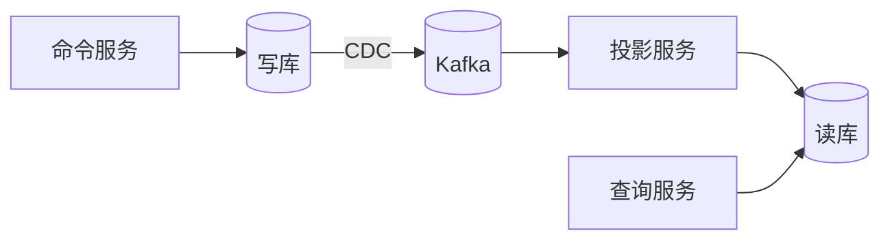
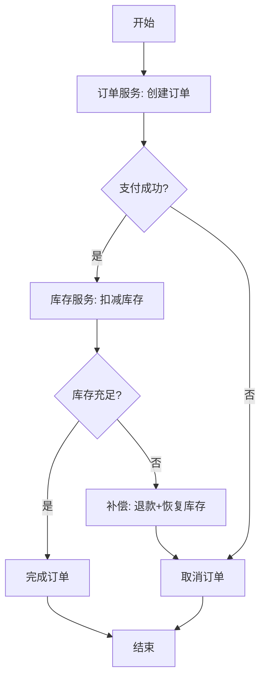
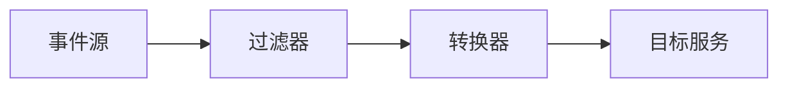
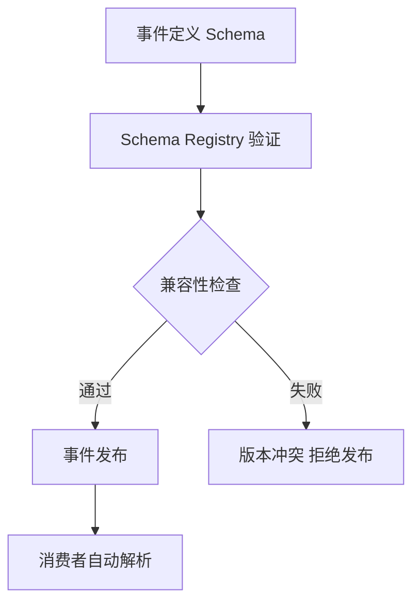
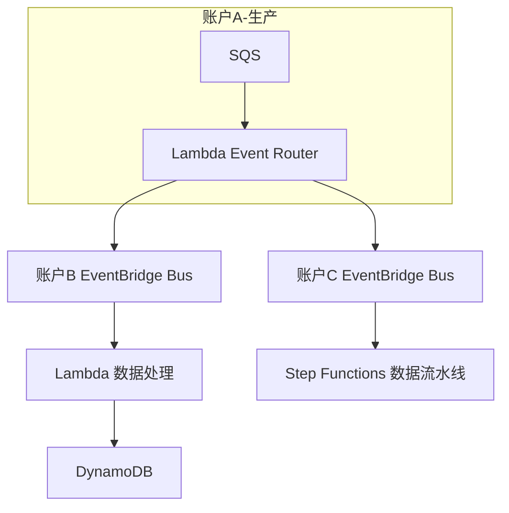
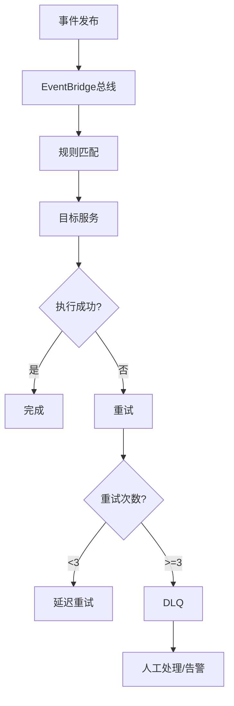

# 云原生事件驱动与集成（EventBridge 深度 / CloudEvents / Schema / 事件总线）

> 事件驱动架构（EDA）是云原生的核心范式：服务间通过事件松耦合通信，事件总线负责路由/过滤/归档。云厂商把事件基础设施做成托管服务。本篇按「解决的问题 → 原理 → 特性 → 选型关注点」拆解事件驱动的全套云服务。

---

## 一、事件驱动架构（EDA）核心概念

| 概念 | 说明 |
|------|------|
| 事件（Event） | 已发生的事实（OrderPlaced / PaymentCompleted） |
| 事件源（Event Source） | 产生事件的服务/云资源 |
| 事件总线（Event Bus） | 事件的中枢路由层 |
| 事件规则（Rule） | 基于事件属性的过滤+路由逻辑 |
| 事件目标（Target） | 规则匹配后触发的下游（Lambda/SQS/函数/HTTP） |
| 事件归档（Archive） | 事件的持久化存储与重放 |
| Schema | 事件的结构定义与版本管理 |

> 核心认知：**事件驱动 = 生产者与消费者解耦 + 事件总线智能路由 + 事件可归档重试**——是云原生微服务集成的首选范式。

---

## 二、云事件总线深度拆解

### 2.1 AWS EventBridge（事件总线标杆）

**解决的问题**：云上数十个服务的事件（EC2 状态变化、S3 上传、自定义应用事件）要按规则自动触发下游，不想写胶水代码。

**原理**：
- **事件总线**：默认总线 + 自定义总线 + 合作伙伴总线（SaaS 事件源）
- **规则引擎**：基于事件源/detail-type/detail 字段的模式匹配（类似 event filter）
- **目标路由**：匹配后路由到 Lambda/SQS/SNS/Step Functions/HTTP/API Destinations 等 17+ 目标
- **归档与重放**：事件可归档到 S3，支持时间点重放

| 特性 | 说明 |
|------|------|
| Schema Registry | 自动发现/手动定义事件结构，支持代码绑定生成 |
| API Destinations | 直接路由到外部 HTTP 端点（SaaS/自建） |
| 调度器 | 内置 cron/rate 定时事件 |
| 跨账号/区域 | 事件跨账号、跨区域路由 |
| 事件归档 | 无限期归档、按时间/规则重放 |
| 全球端点 | 全球高可用事件入口 |

**选型关注点**：云内事件驱动编排 → EventBridge（原生联动最强）；跨云迁移成本高（事件格式厂商锁定）→ 用 CloudEvents 标准 + 自建抽象层。

### 2.2 Azure Event Grid

- **定位**：轻量级事件路由（毫秒级延迟）
- **与 Event Bridge 差异**：更轻、延迟更低，但 Schema/归档/API Destinations 不如 EventBridge 丰富
- **与 Service Bus 差异**：EventGrid 是事件（通知），Service Bus 是消息（需处理/ACK）
- **选型关注点**：Azure 生态内轻量事件路由 → EventGrid。

### 2.3 GCP Eventarc

- **定位**：将事件从 GCP/Aurora/Cloud Storage/任何 HTTP 源路由到 Cloud Run/Functions/GKE
- **特性：与 CloudEvents 原生兼容、多环境（区域/全球）路由
- **选型关注点**：GCP 生态 + Cloud Run → Eventarc。

### 2.4 国内：阿里云 EventBridge / 腾讯云 EventBridge

| 服务 | 厂商 | 关键点 |
|------|------|--------|
| 阿里云 EventBridge | 阿里云 | 与 AWS EventBridge 同源设计，与阿里云生态集成 |
| 腾讯云事件总线 | 腾讯云 | 云内事件路由 + 定时 + 规则 |

**选型关注点**：国内业务 + 阿里云 → 与 AWS EventBridge 几乎同源，迁移知识可复用。

---

## 三、CloudEvents 标准

### 3.1 解决的问题

各云厂商事件格式不统一（AWS event、Azure EventGridEvent、GCP AuditLog 结构各异）→ 跨云事件迁移成本高。

### 3.2 原理

- **CloudEvents**：CNCF 标准化的中立事件格式
- **核心字段**：specversion / type / source / id / time / datacontenttype / data
- **传输绑定**：支持 HTTP/Kafka/AMQP/Protobuf 等多种协议传输
- **各云支持**：AWS EventBridge（可接收/发送 CloudEvents）、Azure EventGrid（原生 CloudEvents）、GCP Eventarc（原生 CloudEvents）

| 优势 | 说明 |
|------|------|
| 厂商中立 | 事件格式不绑定某云 |
| 跨云兼容 | 多云事件格式统一 |
| 工具生态 | SDK（多语言）+ 代码生成 + 事件处理框架 |

**选型关注点**：多云/混合云事件架构 → 用 CloudEvents 作为事件格式标准；单云 → 原生格式即可（性能更好）。

---

## 四、事件 Schema 管理

### 4.1 解决的问题

事件结构演进（加字段/改类型）→ 生产者与消费者契约破坏。需要 Schema 注册 + 版本管理 + 兼容性校验。

### 4.2 服务

| 服务 | 厂商 | 关键点 |
|------|------|--------|
| EventBridge Schema Registry | AWS | 自动发现/手动定义、代码绑定生成、版本演进 |
| Azure Schema Registry | Azure | 与 Event Hubs/Service Bus 集成、 Avro/JSON Schema |
| Confluent Schema Registry | 多云 | Kafka 生态 Schema 注册（Avro/Protobuf/JSON） |

**选型关注点**：事件驱动架构 → Schema Registry 必备（保证契约兼容）；Kafka 生态 → Confluent Schema Registry。

---

## 五、事件驱动 vs 消息队列 vs 流

| 维度 | 事件驱动 | 消息队列 | 流 |
|------|----------|----------|----|
| 语义 | 通知（已发生） | 命令/任务（需处理） | 持续数据流 |
| 消费者关系 | 广播（多消费者各收一份） | 竞争消费（一条只被一人处理） | 多消费者组独立读 |
| 持久化 | 归档（可重放） | 消费后删除 | 保留期可回放 |
| 代表 | EventBridge/EventGrid | SQS/RocketMQ | Kafka/Kinesis |
| 重试 | 归档重试 + DLQ | 可见性超时 + DLQ | 消费者位点回溯 |

> 三者不是互斥而是互补：**事件驱动做服务间通知、消息队列做任务分发、流做数据管道**。

---

## 六、事件驱动架构设计模式

| 模式 | 说明 | 云服务实现 |
|------|------|------------|
| 事件通知 | A 发生 → 通知 B/C/D | EventBridge → 多目标路由 |
| 事件携带状态转移 | 事件携带足够数据，消费者无需回查 | EventBridge + Schema |
| 事件溯源 | 状态 = 事件序列的折叠 | DynamoDB Streams + Lambda |
| CQRS | 读写分离，命令→事件→读模型更新 | EventBridge + DynamoDB |
| Saga | 长事务 = 事件链 + 补偿 | Step Functions + EventBridge |
| 变更数据捕获（CDC） | DB binlog → 事件流 | DMS + EventBridge / Debezium + Kafka |

---

## 七、Serverless 事件源映射

| 事件源 | AWS 触发器 | 说明 |
|--------|-----------|------|
| API Gateway | API Gateway | HTTP 请求 → Lambda |
| S3 | S3 Event Notification | 文件上传 → Lambda |
| SQS | SQS Trigger | 队列消息 → Lambda |
| DynamoDB | DynamoDB Stream | 表变更 → Lambda |
| Kinesis | Kinesis Trigger | 流数据 → Lambda |
| EventBridge | EventBridge Rule | 事件匹配 → Lambda |
| CloudWatch Events | Schedule | 定时触发 → Lambda |
| Cognito | Cognito Trigger | 用户事件 → Lambda |

> Lambda 的事件源映射是 Serverless 事件驱动的核心：任何云服务的事件都可以触发函数。

---

## 八、选型速查

| 需求 | 首选 | 备选 |
|------|------|------|
| 云内事件编排 | EventBridge/EventGrid/Eventarc | — |
| 跨云事件格式 | CloudEvents 标准 | — |
| Schema 管理 | EventBridge Schema Registry | Confluent Schema Registry |
| 事件溯源 | DynamoDB Streams + Lambda | EventStoreDB |
| 事件→函数 | EventBridge + Lambda | — |
| 事件→队列 | EventBridge → SQS | — |
| 事件归档重放 | EventBridge Archive | Kafka 长期保留 |
| CDC 事件 | DMS + EventBridge | Debezium + Kafka |

---

## 补充：云事件驱动深度解析

### 1. AWS EventBridge 深度

| 特性 | 说明 |
|------|------|
| 事件总线 | 默认/自定义/合作伙伴 |
| 规则引擎 | 模式匹配+过滤 |
| 目标路由 | 17+目标类型 |
| 归档重放 | 无限期归档+时间点重放 |
| Schema Registry | 自动发现+代码生成 |
| API Destinations | HTTP端点集成 |

### 2. Azure Event Grid

| 特性 | 说明 |
|------|------|
| 轻量级 | 毫秒级延迟 |
| 事件域 | 多租户事件分发 |
| 输入映射 | 事件属性转换 |
| 死信 | 失败事件重试 |
| 云事件 | 原生CloudEvents支持 |

### 3. Google Eventarc

| 特性 | 说明 |
|------|------|
| 事件路由 | GCP/HTTP源→Cloud Run/Functions |
| CloudEvents | 原生兼容 |
| 多环境 | 区域/全球路由 |
| 触发器 | Pub/Sub/Storage/Firestore |

### 4. Cloud Event Bus Patterns

| 模式 | 说明 | 适用 |
|------|------|------|
| 单一总线 | 所有事件走一个总线 | 小型系统 |
| 多总线 | 按领域拆分总线 | 大型系统 |
| 跨账号 | 事件跨账号路由 | 多租户 |
| 跨区域 | 事件跨区域复制 | 全球化 |

### 5. Serverless Integration Patterns

| 模式 | 说明 | 实现 |
|------|------|------|
| 事件扇出 | 事件→多函数并行 | EventBridge多目标 |
| 结果聚合 | 多函数→汇总函数 | Step Functions |
| 异步HTTP | 事件→HTTP调用 | API Destinations |
| 定时任务 | cron触发 | Scheduler |

### 6. Event Schema Registry

| 功能 | 说明 |
|------|------|
| 自动发现 | 从事件流自动推断Schema |
| 手动定义 | JSON Schema/Avro |
| 版本管理 | 演进+兼容性校验 |
| 代码生成 | 多语言绑定 |

### 7. Cloud Event Replay

| 特性 | 说明 |
|------|------|
| 时间点重放 | 指定时间范围重放 |
| 过滤重放 | 按事件类型重放 |
| 速度控制 | 控制重放速率 |
| 目标选择 | 重放到指定目标 |

### 8. 云事件驱动安全

| 维度 | 说明 |
|------|------|
| 事件加密 | 传输和存储加密 |
| 访问控制 | 事件总线权限 |
| 审计 | 事件操作日志 |
| 签名验证 | 事件来源验证 |

### 9. 云事件驱动监控

| 指标 | 说明 |
|------|------|
| 事件吞吐 | 每秒事件数 |
| 事件延迟 | 生产到消费延迟 |
| 事件失败率 | 匹配失败/目标失败 |
| DLQ深度 | 死信队列消息数 |

### 10. 云事件驱动成本优化

| 策略 | 做法 | 节省 |
|------|------|------|
| 事件过滤 | 在源端过滤无用事件 | 50-80% |
| 批量处理 | 合并多个事件批量处理 | 30-60% |
| 归档策略 | 冷数据归档到对象存储 | 40-70% |
| 规则精简 | 减少不必要的规则匹配 | 20-40% |

### 11. 云事件驱动最佳实践

| 实践 | 说明 |
|------|------|
| 幂等设计 | 消费者必须幂等 |
| 事件大小 | 单事件<256KB |
| 事件格式 | CloudEvents标准格式 |
| Schema版本 | 事件结构演进用版本管理 |
| DLQ | 配置死信队列 |
| 监控 | 事件吞吐/延迟/错误率监控 |

### 12. 云事件驱动架构模式

| 模式 | 说明 | 适用 |
|------|------|------|
| 事件通知 | A发生→通知B/C/D | 广播场景 |
| 事件携带状态 | 事件携带足够数据 | 无回查场景 |
| 事件溯源 | 状态=事件序列折叠 | 审计场景 |
| CQRS | 读写分离 | 高读场景 |
| Saga | 长事务=事件链+补偿 | 分布式事务 |

### 13. 云事件驱动常见问题

| 问题 | 原因 | 解决 |
|------|------|------|
| 事件丢失 | 无归档/DLQ | 配置Archive+DLQ |
| 重复消费 | 无幂等 | 消费者做幂等 |
| 延迟高 | 规则复杂/目标慢 | 简化规则/优化目标 |
| 事件风暴 | 无限流 | 配置速率限制 |

### 14. 云事件驱动集成模式

| 集成方式 | 说明 |
|----------|------|
| EventBridge+Lambda | 事件触发函数 |
| EventBridge+SQS | 事件触发队列 |
| EventBridge+Step Functions | 事件触发工作流 |
| EventBridge+API Gateway | 事件触发HTTP调用 |
| EventBridge+Kinesis | 事件触发流处理 |
| EventBridge+SNS | 事件广播 |
| EventBridge+CodePipeline | 事件触发CI/CD |
| EventBridge+Systems Manager | 事件触发运维操作 |
| EventBridge+Glue | 事件触发ETL |
| EventBridge+EMR | 事件触发大数据处理 |
| EventBridge+Athena | 事件触发查询 |
| EventBridge+Redshift | 事件触发数仓加载 |
| EventBridge+EventHubs | 跨云事件路由 |
| EventBridge+PubSub | 跨云事件触发 |
| EventBridge+Data Pipeline | 事件触发数据管道 |
| EventBridge+MWAA | 事件触发Airflow DAG |
| EventBridge+Lake Formation | 事件触发数据湖操作 |
| EventBridge+OpenSearch | 事件触发搜索索引 |

---

## 九、EventBridge Scheduler 深度

### 定时任务模式

| 模式 | 说明 | 示例 |
|------|------|------|
| Cron | 固定时间触发 | 每天凌晨2点 |
| Rate | 固定间隔触发 | 每5分钟 |
| One-Time | 单次定时触发 | 某个时间点执行 |
| Window | 时间窗口触发 | 工作日9-18点每小时 |

### 高级调度配置

```json
{
  "ScheduleExpression": "cron(0 2 * * ? *)",
  "FlexibleTimeWindow": {
    "Mode": "OFF"
  },
  "Target": {
    "Arn": "arn:aws:lambda:us-east-1:123456789:function:myFunction",
    "RoleArn": "arn:aws:iam::123456789:role/EventBridgeRole",
    "Input": "{\"action\":\"cleanup\",\"days\":30}"
  },
  "RetryPolicy": {
    "MaximumRetryAttempts": 3,
    "MaximumEventAgeInSeconds": 3600
  }
}
```

## EventBridge Schema Registry 使用

### Schema 自动发现

```
自动发现流程：
  1. 开启Schema发现功能
  2. EventBridge自动分析事件格式
  3. 生成JSON Schema定义
  4. 版本管理（向后兼容检查）
  5. 代码生成（多语言绑定）

Schema版本管理：
  新版本发布：自动校验兼容性
  破坏性变更：阻止发布
  兼容性规则：BACKWARD/FORWARD/FULL
```

### 代码生成示例

```python
# Python - EventBridge Schema代码生成
import eventbridge

# 自动绑定事件结构
event = eventbridge.OrderCreatedEvent(
    order_id="12345",
    user_id="67890",
    amount=99.99,
    timestamp="2026-07-29T10:00:00Z"
)

# 类型安全的事件发布
client.put_events(Entries=[event.to_dict()])
```

## EventBridge Archive 与重放

### 归档策略

| 策略 | 说明 | 成本 | 适用 |
|------|------|------|------|
| 全部归档 | 所有事件归档 | 高 | 审计合规 |
| 按规则归档 | 匹配规则的事件归档 | 中 | 重要事件 |
| 按时间归档 | 最近N天归档 | 低 | 短期回放 |
| 不归档 | 仅实时路由 | 最低 | 临时事件 |

### 重放场景

```
重放场景：
  1. 故障恢复：消费者故障后重放事件
  2. 数据修复：修复错误数据后重放
  3. 新消费者接入：新服务需要历史事件
  4. 审计合规：回溯特定时间段事件
  5. 测试验证：用生产数据测试新逻辑

重放配置：
  时间范围：指定开始/结束时间
  过滤条件：按事件类型/来源过滤
  速率控制：控制重放速度（避免压垮下游）
  目标选择：重放到指定目标（Lambda/SQS/SNS）
```

## Azure Logic Apps 集成

### 工作流模式

| 模式 | 说明 | 示例 |
|------|------|------|
| 请求/响应 | HTTP触发，同步返回 | Webhook处理 |
| 事件驱动 | 事件触发，异步处理 | 事件路由 |
| 定时触发 | Cron触发，周期执行 | 定时任务 |
| 混合触发 | 多种触发器组合 | 复杂工作流 |

### 连接器生态

```
Azure Logic Apps 连接器：
  云服务：Office365/SharePoint/Dynamics
  数据库：SQL/MySQL/PostgreSQL
  存储：Blob/Queue/Table
  消息：Service Bus/Event Hub
  自定义：HTTP/Webhook
  SAP/Oracle：企业系统集成
```

## Google Cloud Tasks

### 任务队列模式

| 模式 | 说明 | 适用 |
|------|------|------|
| App Engine HTTP | HTTP任务触发App Engine | Web应用 |
| HTTP目标 | 任何HTTP端点 | 通用集成 |
| Pub/Sub | 任务发到Pub/Sub | 异步处理 |
| 限流 | 控制任务速率 | API保护 |

### 任务调度配置

```python
# Google Cloud Tasks 任务创建
from google.cloud import tasks_v2

client = tasks_v2.CloudTasksClient()
parent = client.queue_path(project, location, queue_name)

task = {
    'http_request': {
        'http_method': 'POST',
        'url': 'https://example.com/process',
        'body': json.dumps({'order_id': '123'}).encode(),
        'headers': {'Content-Type': 'application/json'}
    },
    'schedule_time': {
        'seconds': int(time.time()) + 3600  # 1小时后执行
    }
}

client.create_task(parent=parent, task=task)
```

## 云事件驱动架构模式

### CQRS 实现



```
CQRS要点：
  命令模型：写操作优化（范式化）
  查询模型：读操作优化（反范式化/宽表）
  同步机制：CDC + Kafka 实现写库到读库同步
  一致性：最终一致（秒级延迟）
  适用场景：读写比例>10:1，复杂查询
```

### Saga 模式

| 类型 | 说明 | 实现 |
|------|------|------|
| 编排式(Orchestration) | 中央协调器控制流程 | Step Functions |
| 协同式(Choreography) | 事件驱动，无中央协调 | EventBridge + Lambda |



### Event Sourcing 实现

```
Event Sourcing要点：
  事件存储：追加写入，不可变
  状态恢复：重放事件序列
  快照：定期生成状态快照（优化性能）
  投影：事件 → 读模型（查询优化）

存储选择：
  DynamoDB Streams：AWS原生，Lambda触发
  Kafka：高吞吐，长期保留
  EventStoreDB：专用事件存储

查询模式：
  当前状态：重放所有事件或读最新快照
  历史状态：重放事件到指定时间点
  审计：完整事件历史
```

## 云 Webhook 管理

### Webhook 架构

```
Webhook管理要点：
  注册：用户注册回调URL
  验证：挑战响应验证所有权
  签名：HMAC签名验证来源
  重试：失败自动重试（指数退避）
  监控：成功率/延迟监控
  限流：防止Webhook风暴
```

### 安全实践

| 实践 | 说明 |
|------|------|
| HTTPS | 强制HTTPS |
| 签名验证 | HMAC-SHA256签名 |
| IP白名单 | 限制来源IP |
| 重放保护 | 时间戳+nonce |
| 速率限制 | 防止DDoS |
| 超时处理 | 5秒超时 |

## 云事件网关

```
事件网关功能：
  路由：按规则路由到不同目标
  转换：事件格式转换
  过滤：按条件过滤事件
  聚合：多个事件聚合为一个
  重放：事件归档与重放
  监控：事件流监控

部署模式：
  集中式：单点网关，简单但单点
  分布式：多网关，高可用
  边缘：靠近生产者，低延迟
```

---

## 十、事件驱动最佳实践

### 10.1 事件设计原则

| 原则 | 说明 |
|------|------|
| 幂等 | 消费者必须幂等（事件可能重复投递） |
| 自包含 | 事件携带足够数据，消费者无需回查 |
| 不可变 | 事件一旦发出不可修改（追加语义） |
| 版本化 | 事件结构演进用 Schema 版本管理 |
| 小事件 | 事件体尽量小，大数据走引用 |

### 10.2 事件驱动 vs 消息队列决策

```
需要事件驱动？
  ├── 通知类（已发生的事）→ EventBridge/EventGrid
  ├── 任务类（需处理的命令）→ SQS/RocketMQ
  ├── 数据流（持续处理）→ Kafka/Kinesis
  └── 混合场景 → EventBridge + SQS/Kafka
```

### 10.3 常见问题排查

| 问题 | 原因 | 解决 |
|------|------|------|
| 事件丢失 | 无归档/DLQ | 配置 Archive + DLQ |
| 重复消费 | 无幂等 | 消费者做幂等 |
| 延迟高 | 规则复杂/目标慢 | 简化规则/优化目标 |
| 事件风暴 | 无限流 | 配置速率限制 |

---

## 十一、事件驱动最佳实践清单

| 实践 | 说明 |
|------|------|
| 幂等设计 | 消费者必须幂等（事件可能重复投递） |
| 事件大小 | 单事件 < 256KB（避免大事件） |
| 事件格式 | CloudEvents 标准格式 |
| Schema 版本 | 事件结构演进用版本管理 |
| DLQ | 配置死信队列（失败事件重试） |
| 监控 | 事件吞吐/延迟/错误率监控 |

---

## 十二、事件驱动架构模式详解

| 模式 | 说明 | 云服务实现 |
|------|------|------------|
| 事件通知 | A 发生 → 通知 B/C/D | EventBridge → 多目标路由 |
| 事件携带状态转移 | 事件携带足够数据，消费者无需回查 | EventBridge + Schema |
| 事件溯源 | 状态 = 事件序列的折叠 | DynamoDB Streams + Lambda |
| CQRS | 读写分离，命令→事件→读模型更新 | EventBridge + DynamoDB |
| Saga | 长事务 = 事件链 + 补偿 | Step Functions + EventBridge |
| 变更数据捕获（CDC） | DB binlog → 事件流 | DMS + EventBridge / Debezium + Kafka |

### 11.1 事件溯源实现示例

```java
// 事件存储
public class OrderEventStore {
    private final DynamoDBStreams streams;
    
    public void appendEvent(OrderEvent event) {
        // 追加事件到流
        streams.putRecord(event);
    }
    
    public Order getState(String orderId) {
        // 重放事件序列恢复状态
        List<OrderEvent> events = streams.getEvents(orderId);
        return events.stream()
            .reduce(new Order(), Order::apply);
    }
}
```

---

## 十二、事件驱动常见问题排查清单

| 检查项 | 命令/方法 |
|--------|-----------|
| 事件是否到达 | EventBridge 控制台 → 事件追踪 |
| 规则是否匹配 | 检查事件模式与规则 |
| 目标是否正常 | 检查 Lambda/SQS 执行日志 |
| DLQ 是否有消息 | 检查死信队列 |
| 延迟是否正常 | 监控事件处理延迟 |

---

## 十三、云事件驱动成本优化

| 策略 | 做法 |
|------|------|
| 事件过滤 | 在源端过滤无用事件 |
| 批量处理 | 合并多个事件批量处理 |
| 归档策略 | 冷数据归档到对象存储 |
| 规则精简 | 减少不必要的规则匹配 |

---

## 十四、事件驱动与云原生集成

| 集成方式 | 说明 |
|----------|------|
| EventBridge + Lambda | 事件触发函数 |
| EventBridge + SQS | 事件触发队列 |
| EventBridge + Step Functions | 事件触发工作流 |
| EventBridge + API Gateway | 事件触发 HTTP 调用 |
| EventBridge + Kinesis | 事件触发流处理 |

---

## 十五、事件驱动监控指标

| 指标 | 说明 |
|------|------|
| 事件吞吐 | 每秒事件数 |
| 事件延迟 | 生产到消费延迟 |
| 事件失败率 | 匹配失败/目标失败 |
| DLQ 深度 | 死信队列消息数 |

---

## 十六、EventBridge Pipes 管道集成

### 16.1 Pipes 架构



### 16.2 支持的源与目标

| 源类型 | 目标类型 | 适用场景 |
|--------|----------|----------|
| SQS | Lambda | 消息队列触发 |
| Kinesis | Lambda | 流数据处理 |
| DynamoDB Streams | Step Functions | 数据变更处理 |
| Kafka | Lambda/SQS | 消息集成 |
| Self-managed Kafka | EventBridge | 自建MQ集成 |

## 十七、EventBridge Scheduler 调度器

| 调度类型 | 语法 | 适用 |
|----------|------|------|
| Rate | `rate(5 minutes)` | 固定间隔 |
| Cron | `cron(0 12 * * ? *)` | 固定时间 |
| One-time | ISO 8601 时间 | 一次性任务 |
| Timezone | 指定时区 | 跨时区调度 |

```yaml
# CloudFormation 调度器
Resources:
  ScheduleRule:
    Type: AWS::Scheduler::Schedule
    Properties:
      Name: daily-report
      ScheduleExpression: "cron(0 8 * * ? *)"
      Target:
        Arn: !GetAtt ReportFunction.Arn
        RoleArn: !GetAtt SchedulerRole.Arn
```

## 十八、Schema Registry 契约管理

### 18.1 Schema 演进策略

| 策略 | 说明 | 兼容性 |
|------|------|--------|
| Backward | 新Schema读旧数据 | 向后兼容 |
| Forward | 旧Schema读新数据 | 向前兼容 |
| Full | 双向兼容 | 完全兼容 |
| None | 不保证 | 不兼容 |

### 18.2 Schema 注册示例

```json
{
  "type": "record",
  "name": "Order",
  "fields": [
    {"name": "orderId", "type": "string"},
    {"name": "amount", "type": "double"},
    {"name": "status", "type": {"type": "enum", "symbols": ["PENDING", "PAID", "SHIPPED"]}}
  ]
}
```

## 十九、跨账户/跨区域事件集成

| 方案 | 适用 | 复杂度 |
|------|------|--------|
| EventBridge 跨账户 | 同云多账户 | 低 |
| EventBridge 跨区域 | 多地域 | 中 |
| SNS 跨区域 | 简单通知 | 低 |
| EventBridge Archive/Replay | 事件归档 | 中 |

```json
// 跨账户目标 ARN
{
  "Arn": "arn:aws:events:us-east-1:123456789012:event-bus/target-bus",
  "RoleArn": "arn:aws:iam::123456789012:role/CrossAccountEventBridgeRole"
}
```

## 二十、集成模式与企业集成

| 模式 | 说明 | 适用 |
|------|------|------|
| Content-based Router | 按内容路由 | 多目标分发 |
| Message Filter | 消息过滤 | 选择性消费 |
| Aggregator | 消息聚合 | 批量处理 |
| Splitter | 消息拆分 | 大消息分解 |
| Transformer | 消息转换 | 格式适配 |

## 二十一、事件驱动监控指标

| 指标 | 说明 | 告警阈值 |
|------|------|----------|
| 事件吞吐 | 每秒事件数 | <预期80% |
| 事件延迟 | 生产到消费延迟 | >5s |
| 事件失败率 | 匹配失败/目标失败 | >1% |
| DLQ 深度 | 死信队列消息数 | >100 |
| 规则命中率 | 事件匹配规则比例 | <50% |

## 附录 A：EventBridge Pipes 架构与实战

### A.1 Pipes 支持的 Source-Sink 矩阵

| Source | Transformation | Sink |
|--------|---------------|------|
| SQS | Lambda | SQS |
| Kinesis | Step Functions | Lambda |
| DynamoDB Streams | — | EventBridge Bus |
| API Gateway | — | Kinesis |
| MSK (Kafka) | — | API Gateway |
| S3 Bucket Events | — | Step Functions |
| CloudWatch Events | — | Redshift |

### A.2 Pipes 成本对比

```text
场景：每秒 1,000 条事件，平均 2KB/条，月处理量 = 2.59 亿条

传统路径：
  SQS → Lambda → Kinesis
  SQS: $0.40/百万 + $0.0000004/请求
  Lambda: $0.20/百万 + $0.0000016/GB-s
  Kinesis: $0.015/百万 PUT
  月成本 ≈ $6.87

Pipes 路径：
  SQS → Pipes → Kinesis
  无 Lambda 调用费
  无请求费
  月成本 ≈ $1.30
  节省 ≈ 81%
```

## 附录 B：EventBridge Scheduler 高级调度

### B.1 Schedule 表达式详解

```json
{
  "schedule_expression": {
    "rate": "rate(5 minutes)",
    "cron": "cron(0 12 * * ? *)",
    "cron_with_timezone": "cron(0 12 * * ? *)",
    "one_time": "at(2024-06-01T12:00:00Z)"
  }
}
```

| 表达式 | 含义 | 常见用途 |
|--------|------|----------|
| `rate(5 minutes)` | 每 5 分钟 | 轮询检查 |
| `cron(0 12 * * ? *)` | 每天中午 12:00 | 日报生成 |
| `cron(0/30 * * * ? *)` | 每 30 分钟 | 数据同步 |
| `cron(0 9 ? * MON-FRI *)` | 工作日 9:00 | 每日推送 |
| `cron(0 0 1 * ? *)` | 每月 1 日 0:00 | 月度报告 |

### B.2 Scheduler vs Lambda+EventBridge Rules 对比

| 特性 | Scheduler | Rules |
|------|-----------|-------|
| 最小调度粒度 | 1 分钟 | 1 分钟 |
| 精确到秒 | ✅ | ❌ |
| 时区支持 | ✅ | ❌ |
| 跨账户目标 | ✅ | ❌ |
| 固定/一次执行 | ✅ | ❌ |
| 延迟执行 | ✅ | ❌ |
| 回填任务 | ✅ | ❌ |

## 附录 C：CloudEvents Schema Registry 集成

### C.1 Schema 注册流程



### C.2 Schema 兼容性模式

| 模式 | 说明 | 向后兼容 |
|------|------|----------|
| BACKWARD | 新 Schema 可读旧数据 | ✅ |
| FORWARD | 旧 Schema 可读新数据 | ✅ |
| FULL | 双向兼容 | ✅ |
| NONE | 不检查 | ❌ |
| BACKWARD_TRANSITIVE | 所有历史版本向后兼容 | ✅ |

## 附录 D：Serverless 事件驱动模式速查

| 模式 | Source | Handler | Sink | 适用场景 |
|------|--------|---------|------|----------|
| 过滤-转换-加载 | S3 | Lambda | DynamoDB | 文件导入 |
| 事件聚合 | IoT | Kinesis | S3 | 大数据湖 |
| 事件路由 | 定时 | Lambda | SQS | 异步解耦 |
| 告警响应 | CloudWatch | Lambda | SNS | 运维告警 |
| 审计日志 | CloudTrail | Lambda | S3 | 合规存储 |
| 数据同步 | DynamoDB Streams | Lambda | Elasticsearch | 搜索索引 |
| 消息扇出 | SQS | Lambda | SNS | 多消费者 |

## 附录 E：跨账户事件架构



## 附录 F：事件驱动监控指标

| 指标 | 监控对象 | 阈值建议 | 工具 |
|------|----------|----------|------|
| Event Age | Lambda | < 1 分钟 | CloudWatch |
| Iterator Age | Kinesis/DynamoDB Streams | < 5 分钟 | CloudWatch |
| ApproximateAgeOfOldestMessage | SQS | < 30 秒 | CloudWatch |
| FailedInvocations | Lambda | < 1% | CloudWatch |
| DeliveryFailures | EventBridge | = 0 | CloudWatch |
| ThrottledRequests | Lambda | < 0.1% | CloudWatch |

## 二十二、事件驱动最佳实践

### 22.1 事件设计原则

| 原则 | 说明 | 示例 |
|------|------|------|
| 事件不可变 | 事件一旦发出不可修改 | 只追加，不更新 |
| 事件自描述 | 事件包含完整上下文 | 避免回查 |
| 事件溯源 | 通过事件重建状态 | Event Sourcing |
| 最小知识 | 事件只包含必要信息 | 避免过度暴露 |

### 22.2 事件驱动陷阱

```text
常见陷阱：
  1. 事件风暴：过多事件导致系统复杂
  2. 循环事件：A→B→A 导致死循环
  3. 事件耦合：消费者强依赖事件格式
  4. 最终一致性：业务逻辑需容忍延迟
  5. 事件顺序：需保证事件处理顺序
```

## EventBridge Pipes 完整配置

### 源→转换→目标

```json
// 创建 Pipe
aws pipes create-pipe \
  --name order-processing-pipe \
  --source arn:aws:sqs:us-east-1:123456789:order-queue \
  --source-parameters '{
    "SqsQueueParameters": {
      "BatchSize": 10
    }
  }' \
  --target arn:aws:lambda:us-east-1:123456789:process-order \
  --target-parameters '{
    "LambdaFunctionParameters": {
      "InvocationType": "Event"
    }
  }' \
  --role-arn arn:aws:iam::123456789:role/pipe-role

// 带转换的 Pipe
aws pipes create-pipe \
  --name data-transform-pipe \
  --source arn:aws:kinesis:us-east-1:123456789:my-stream \
  --source-parameters '{
    "KinesisStreamParameters": {
      "StartingPosition": "LATEST",
      "BatchSize": 100,
      "MaximumBatchingWindowInSeconds": 5
    }
  }' \
  --target arn:aws:s3:us-east-1:123456789:my-bucket \
  --target-parameters '{
    "S3DestinationParameters": {
      "BucketName": "my-bucket",
      "Prefix": "data/",
      "BatchingConfig": {
        "MaxCount": 1000,
        "WindowInSeconds": 60
      }
    }
  }' \
  --transformations '{
    "InputTemplate": "{\"id\": \"<id>\", \"data\": <body>, \"timestamp\": <time>}"
  }' \
  --role-arn arn:aws:iam::123456789:role/pipe-role
```

## EventBridge Schedule 定时任务配置示例

### Schedule 创建

```json
// 创建定时任务（每天凌晨2点执行）
aws scheduler create-schedule \
  --name daily-cleanup \
  --schedule-expression "cron(0 2 * * ? *)" \
  --target '{
    "Arn": "arn:aws:lambda:us-east-1:123456789:cleanup-function",
    "RoleArn": "arn:aws:iam::123456789:role/scheduler-role",
    "Input": "{\"action\": \"cleanup\", \"days\": 7}"
  }' \
  --flexible-time-window '{
    "Mode": "FLEXIBLE_TIME_WINDOW",
    "MaximumWindowInMinutes": 5
  }'

// 每5分钟执行
aws scheduler create-schedule \
  --name periodic-sync \
  --schedule-expression "rate(5 minutes)" \
  --target '{
    "Arn": "arn:aws:lambda:us-east-1:123456789:sync-function",
    "RoleArn": "arn:aws:iam::123456789:role/scheduler-role"
  }'
```

## Serverless 集成模式代码

### Fan-out / Fan-in

```python
# Fan-out 模式（一个事件触发多个处理）
import boto3

def fan_out_handler(event, context):
    """将订单事件分发到多个处理函数"""
    lambda_client = boto3.client('lambda')
    
    # 并行调用多个处理函数
    functions = [
        'arn:aws:lambda:us-east-1:123456789:process-payment',
        'arn:aws:lambda:us-east-1:123456789:update-inventory',
        'arn:aws:lambda:us-east-1:123456789:send-notification'
    ]
    
    for func in functions:
        lambda_client.invoke(
            FunctionName=func,
            InvocationType='Event',  # 异步调用
            Payload=json.dumps(event)
        )

# Fan-in 模式（多个处理结果聚合）
import boto3
from concurrent.futures import ThreadPoolExecutor

def fan_in_handler(event, context):
    """聚合多个处理结果"""
    lambda_client = boto3.client('lambda')
    
    def invoke_function(func_name):
        response = lambda_client.invoke(
            FunctionName=func_name,
            Payload=json.dumps(event)
        )
        return json.loads(response['Payload'].read())
    
    functions = [
        'get-user-info',
        'get-order-details',
        'get-payment-status'
    ]
    
    with ThreadPoolExecutor(max_workers=3) as executor:
        results = list(executor.map(invoke_function, functions))
    
    # 聚合结果
    return {
        'user': results[0],
        'order': results[1],
        'payment': results[2]
    }
```

## 跨账户事件投递 IAM 策略

```json
// EventBridge 跨账户投递 IAM 策略
{
    "Version": "2012-10-17",
    "Statement": [
        {
            "Sid": "AllowCrossAccountPutEvents",
            "Effect": "Allow",
            "Action": "events:PutEvents",
            "Resource": "arn:aws:events:us-east-1:TARGET_ACCOUNT_ID:event-bus/default"
        },
        {
            "Sid": "AllowEventBridgeToAssumeRole",
            "Effect": "Allow",
            "Principal": {
                "Service": "events.amazonaws.com"
            },
            "Action": "sts:AssumeRole",
            "Condition": {
                "StringEquals": {
                    "aws:SourceAccount": "SOURCE_ACCOUNT_ID"
                }
            }
        }
    ]
}

// 目标账户信任策略
{
    "Version": "2012-10-17",
    "Statement": [
        {
            "Sid": "AllowSourceAccountPutEvents",
            "Effect": "Allow",
            "Principal": {
                "AWS": "arn:aws:iam::SOURCE_ACCOUNT_ID:root"
            },
            "Action": "events:PutEvents",
            "Resource": "arn:aws:events:us-east-1:ACCOUNT_ID:event-bus/default"
        }
    ]
}
```

## 事件驱动架构监控指标

### 事件延迟/丢弃率/处理耗时

```text
关键监控指标：

事件延迟（Event Latency）：
  - 入站时间 → 处理完成时间
  - 告警阈值：>30s 告警，>60s 严重

丢弃率（Discard Rate）：
  - 丢弃事件数 / 总事件数
  - 告警阈值：>0.1% 告警，>1% 严重

处理耗时（Processing Duration）：
  - 单事件处理时间
  - 告警阈值：P99 >5s 告警

死信队列（Dead Letter Queue）：
  - DLQ 中事件数量
  - 告警阈值：>100 告警

重试次数（Retry Count）：
  - 重试事件比例
  - 告警阈值：>5% 告警
```

```python
# CloudWatch 告警配置
import boto3

cloudwatch = boto3.client('cloudwatch')

# 事件延迟告警
cloudwatch.put_metric_alarm(
    AlarmName='EventBridgeLatencyHigh',
    MetricName='EventPublishSuccessRate',
    Namespace='AWS/Events',
    Statistic='Average',
    Period=300,
    EvaluationPeriods=1,
    Threshold=99.0,
    ComparisonOperator='LessThanThreshold',
    AlarmActions=['arn:aws:sns:us-east-1:123456789:alerts']
)

# 丢弃率告警
cloudwatch.put_metric_alarm(
    AlarmName='EventBridgeDiscardRateHigh',
    MetricName='FailedInvocations',
    Namespace='AWS/Events',
    Statistic='Sum',
    Period=300,
    EvaluationPeriods=1,
    Threshold=10,
    ComparisonOperator='GreaterThanThreshold',
    AlarmActions=['arn:aws:sns:us-east-1:123456789:alerts']
)
```

## 云事件驱动架构监控指标与告警

### 监控指标体系

| 指标分类 | 指标名称 | 告警阈值 | 监控工具 |
|----------|----------|----------|----------|
| 投递成功率 | DeliverySuccessRate | < 99% | CloudWatch |
| 投递延迟 | DeliveryLatency | > 10s | CloudWatch |
| 死信队列 | DLQMessageCount | > 0 | CloudWatch |
| 规则匹配率 | RuleMatchRate | 波动 > 30% | 自定义 Metrics |
| Lambda 并发 | ConcurrentExecutions | > 80% 配额 | CloudWatch |
| Pipe 执行时间 | PipeDuration | > 30s | CloudWatch |
| 事件堆积 | EventAge | > 5min | CloudWatch |

### 告警规则配置

```yaml
# CloudWatch 告警规则
AWSTemplateFormatVersion: '2010-09-09'
Resources:
  DeliveryFailureAlarm:
    Type: AWS::CloudWatch::Alarm
    Properties:
      AlarmName: EventBridge-Delivery-Failure
      MetricName: FailedInvocations
      Namespace: AWS/Events
      Statistic: Sum
      Period: 300
      EvaluationPeriods: 1
      Threshold: 10
      ComparisonOperator: GreaterThanThreshold
      AlarmActions:
        - !Ref AlertSNSTopic
```

### 监控面板设计

```
EventBridge 监控 Dashboard：

  事件流概览：
    ├── 总事件数 / 成功事件数 / 失败事件数
    ├── 事件类型分布（饼图）
    └── 事件源 TOP10（柱状图）

  延迟分析：
    ├── P50 / P95 / P99 延迟趋势（折线图）
    └── 各目标延迟对比（热力图）

  错误分析：
    ├── 失败原因分类（表格）
    ├── DLQ 消息堆积趋势（折线图）
    └── 重试成功率（柱状图）

  成本分析：
    ├── 月度事件费用趋势
    ├── 各规则费用占比
    └── 调用次数预测
```

### 事件驱动架构可观测性实践

| 实践 | 工具/方法 | 说明 |
|------|----------|------|
| 分布式追踪 | X-Ray + Correlation ID | 跨服务事件追踪 |
| 日志聚合 | CloudWatch Logs + OpenSearch | 事件日志检索 |
| 指标聚合 | CloudWatch + Grafana | 自定义监控面板 |
| 告警通知 | SNS + PagerDuty | 多渠道告警 |
| 成本监控 | Cost Explorer + 预算告警 | 费用超支预警 |

### 云事件驱动容灾与高可用

```
容灾架构设计：
  多 AZ 部署：
    EventBridge → 原生多 AZ（无需手动配置）
    Lambda → 多 AZ 并发执行

  多 Region 容灾：
    Region A EventBridge → Region B EventBridge（复制规则）
    Route 53 → 全局流量分发

  重试与死信：
    最大重试次数：185 天（EventBridge 标准）
    DLQ → 手动重试/告警/自动处理
    退避策略：指数退避 + 随机抖动
```

### 事件驱动成本优化策略

| 策略 | 实现方式 | 预期节省 |
|------|----------|----------|
| 事件过滤 | Rule Filter → 减少无效 Lambda 调用 | 30-50% |
| 批量处理 | SQS 批量消费 → 减少 Lambda 调用次数 | 20-40% |
| 调度优化 | 避免高频轮询 → 使用 EventBridge Schedule | 15-30% |
| 资源配置 | 合理设置 Lambda 内存 → 按需调整 | 10-25% |
| 存储优化 | 压缩事件数据 → 减少数据传输费用 | 5-15% |

---

## EventBridge vs SNS+SQS 组合成本对比

| 维度 | EventBridge | SNS+SQS |
|------|-------------|---------|
| 定价模型 | 每百万事件 $1.00 | SNS $0.50/百万 + SQS $0.40/百万 |
| 基础成本 | $1.00/百万 | $0.90/百万 |
| 附加功能 | 免费（过滤/转换/重试） | 需额外付费 |
| 复杂规则 | 免费 | 需要 Lambda 处理 |
| 运维成本 | 低（全托管） | 中（需管理两个服务） |

```text
成本对比示例（月 1000 万事件）：

EventBridge：
  1000万 × $1.00/百万 = $10

SNS+SQS：
  SNS：1000万 × $0.50/百万 = $5
  SQS：1000万 × $0.40/百万 = $4
  总计：$9

结论：
  简单场景：SNS+SQS 便宜 $1
  复杂场景（需要过滤/转换）：EventBridge 更划算
```

---

## EventBridge Pipes 与 Schedule 高级配置

### Pipes 连接配置

```json
// Pipes：Kafka → Transform → Lambda
{
  "Source": "arn:aws:kinesis:us-east-1:123456789:stream/my-stream",
  "Target": "arn:aws:lambda:us-east-1:123456789:function:process-event",
  "RoleArn": "arn:aws:iam::123456789:role/pipe-role",
  "SourceParameters": {
    "KinesisStreamParameters": {
      "StartingPosition": "LATEST",
      "BatchSize": 100,
      "MaximumBatchingWindowInSeconds": 30
    }
  },
  "EnrichmentParameters": {
    "InputTemplate": "{\"id\": \"<$.id>\", \"data\": \"<$.data>\", \"timestamp\": \"<$.timestamp>\"}"
  }
}
```

### Schedule 调度配置

```json
// 定时触发Lambda
{
  "ScheduleExpression": "rate(5 minutes)",
  "FlexibleTimeWindow": {
    "Mode": "OFF"
  },
  "Target": {
    "Arn": "arn:aws:lambda:us-east-1:123456789:function:report-generator",
    "RoleArn": "arn:aws:iam::123456789:role/schedule-role"
  }
}

// Cron表达式：每周一早9点
{
  "ScheduleExpression": "cron(0 9 ? * MON *)",
  "FlexibleTimeWindow": {
    "Mode": "FLEXIBLE_TIME_WINDOW",
    "MaximumWindowInMinutes": 60
  }
}
```

### 跨账户事件集成（IAM 跨账户角色）

```json
// 跨账户EventBridge规则
{
  "Statement": [
    {
      "Effect": "Allow",
      "Principal": {
        "AWS": "arn:aws:iam::987654321:root"
      },
      "Action": "events:PutEvents",
      "Resource": "arn:aws:events:us-east-1:123456789:event-bus/cross-account-bus"
    }
  ]
}
```

| 集成模式 | 配置要点 | 适用场景 |
|----------|---------|---------|
| 跨账户事件总线 | IAM角色+资源策略 | 多账户统一事件 |
| 跨区域复制 | EventBridge→EventBridge | 灾备/合规 |
| SaaS集成 | API密钥+OAuth | 第三方SaaS |
| 自定义事件总书 | ARN+权限 | 混合云架构 |

## 事件驱动监控指标体系

| 指标类别 | 具体指标 | 告警阈值 | 处理方案 |
|----------|---------|---------|---------|
| 吞吐 | EventsPublished/min | 基线±30% | 检查事件源 |
| 延迟 | EventAge | >5s | 检查消费者 |
| 错误 | FailedInvocations/min | >0 | 检查DLQ |
| 重试 | RetryAttempts/min | >10 | 优化消费者 |
| 成本 | EstimatedCost | >预算120% | 优化配置 |



## Serverless 事件驱动 vs 传统队列模式对比

| 维度 | Serverless事件驱动 | 传统队列模式 |
|------|-------------------|-------------|
| 运维成本 | 极低（全托管） | 中（需维护队列服务） |
| 弹性能力 | 自动扩缩 | 手动/定时扩缩 |
| 冷启动 | 可能(100ms-2s) | 无 |
| 状态管理 | 无状态 | 消费者可有状态 |
| 顺序保证 | 最多一次/至少一次 | 可配置 |
| 成本模型 | 按调用付费 | 按实例付费 |
| 适用场景 | 事件密集型 | 长连接/有状态 |

> 一句话：**云事件驱动 = EventBridge 总线（路由/过滤/归档）+ CloudEvents 标准（跨云兼容）+ Schema Registry（契约管理）+ 事件源映射（云服务→函数）；选型先看「事件源在哪（云内/SaaS/自定义）」，再用 CloudEvents 标准防厂商锁定。**
