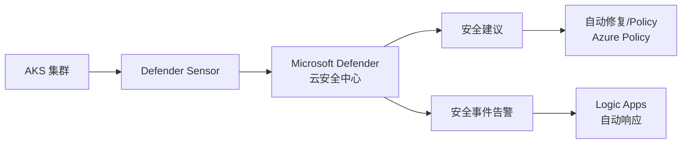
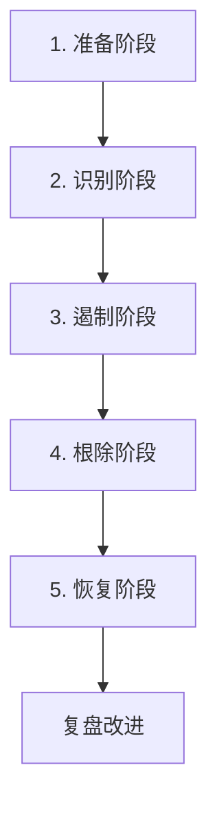
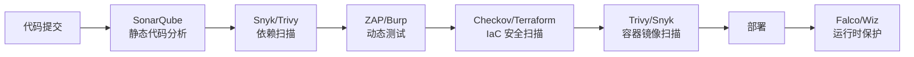
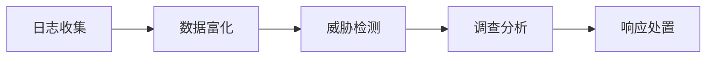
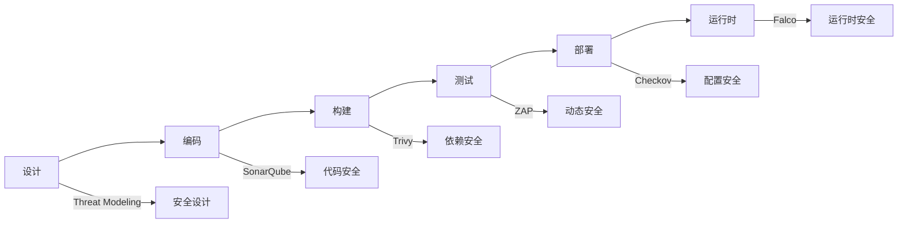
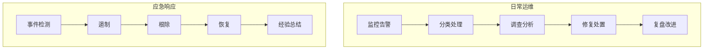

# 云安全体系（密钥 / WAF / DDoS / 合规）

> 云安全是「责任共担模型」：云厂商保底层（物理/网络/ Hypervisor），用户保上层（应用/数据/配置）。云厂商提供托管安全服务：密钥管理、WAF、DDoS 防护、证书管理、合规审计。本篇按「解决的问题 → 原理 → 特性 → 选型关注点」拆解。

---

## 一、云安全责任共担模型

| 层 | IaaS 用户责任 | PaaS 用户责任 | SaaS 用户责任 |
|----|---------------|---------------|---------------|
| 数据/身份 | 全责 | 全责 | 全责 |
| 应用/运行时 | 用户 | 用户 | 厂商 |
| 操作系统 | 用户 | 厂商 | 厂商 |
| 网络/虚拟化 | 用户 | 厂商 | 厂商 |
| 物理/设施 | 厂商 | 厂商 | 厂商 |

> 核心认知：**用 PaaS/SaaS 越多，安全责任越往上层收**——但数据与身份（IAM）永远是自己的责任。

---

## 二、密钥管理服务（KMS）

### 2.1 解决的问题

应用配置里硬编码 AK/SK/数据库密码 → 泄露即灾难。需要：集中托管密钥、自动轮换、访问审计、与云服务原生集成。

### 2.2 原理

- **信封加密（Envelope Encryption）**：用 KMS 主密钥（CMK）加密数据密钥（DEK），DEK 加密实际数据。CMK 不出 HSM，DEK 随数据存储。
- **访问控制**：谁能使用 CMK 由 IAM 策略控制（与 IAM 原生联动）。
- **自动轮换**：CMK 每年/自动轮换，旧密钥仍可解密历史数据。

| 服务 | 厂商 | 关键点 |
|------|------|--------|
| AWS KMS | AWS | CMK + HSM（FIPS 140-2）、自动轮换、别名 |
| Azure Key Vault | Azure | 密钥/证书/机密三合一、HSM、软删除/清除保护 |
| GCP Cloud KMS | GCP | 与 IAM 集成、自动轮换、信封加密 |
| 阿里云 KMS | 阿里云 | 国密 SM2/SM4、信封加密、托管密码 |
| 腾讯云 KMS | 腾讯云 | 国密支持、HSM、密钥轮换 |
| HashiCorp Vault | 多云 | 动态密钥、多云统一、与 K8s 深度集成 |

**选型关注点**：国密合规（SM2/SM4）→ 国内云 KMS；多云统一密钥 → Vault；与云服务集成（S3/RDS 加密）→ 原生 KMS。

---

## 三、Web 应用防火墙（WAF）

### 3.1 解决的问题

应用层攻击（SQL 注入、XSS、CSRF、CC 攻击）——在流量进应用前拦截。

### 3.2 原理

- **反向代理模式**：DNS 指向 WAF → WAF 检查请求 → 干净流量转发到源站
- **规则引擎**：OWASP Core Rule Set（CRS）+ 自定义规则（IP/路径/速率/正则）
- **Bot 管理**：人机验证（CAPTCHA）、指纹、行为分析

| 服务 | 厂商 | 关键点 |
|------|------|--------|
| AWS WAF | AWS | 托管规则组（AWS/ Marketplace）、Bot Control、与 CloudFront/ALB 集成 |
| Azure WAF | Azure | OWASP CRS + 自定义规则、与 Front Door/Application Gateway 集成 |
| GCP Cloud Armor | AWS | 基于边缘的安全策略、自适应保护（ML）、与 Global LB 集成 |
| 阿里云 WAF | 阿里云 | 国密支持、防爬、 Bot 管理、合规等保 |
| 腾讯云 WAF | 腾讯云 | AI + 语义分析、Bot 管理、域名接入 |

**选型关注点**：CDN/边缘接入 → 与 CDN 联发的 WAF（CloudFront WAF/Cloud Armor）；应用层精细防护 → ALB/API Gateway 上的 WAF；等保合规 → 国内云 WAF。

---

## 四、DDoS 防护

### 4.1 的问题

大流量攻击（网络层 L3/4、应用层 L7）打垮服务——需要 Tbps 级清洗能力。

### 4.2 原理

- **Anycast 流量牵引**：攻击流量被 BGP Anycast 路由到全球清洗中心
- **流量清洗**：基于特征/行为/速率过滤恶意流量，干净流量回注
- **应用层防护**：CC 攻击通过 WAF + 速率限制 + 人机验证缓解

| 服务 | 厂商 | 关键点 |
|------|------|--------|
| AWS Shield | AWS | Standard（免费，基础防护）+ Advanced（L3/4/7，24/7 DRT 支持） |
| Azure DDoS Protection | Azure | Basic（免费）+ Standard（与 VNet 集成） |
| GCP Cloud Armor | GCP | Always-on L7 防护 + 边缘清洗 |
| 阿里云 DDoS 高防 | 阿里云 | Tbps 级清洗、国内节点、游戏/金融常用 |
| 腾讯云大禹 BGP | 腾讯云 | 多线路清洗、Anycast |

**选型关注点**：云上基础防护（Shield Basic）一般免费；大流量攻击 → Advanced/高防套餐（贵但必要）；混合云/多入口 → 统一高防 IP。

---

## 五、证书管理服务（SSL/TLS）

| 服务 | 厂商 | 关键点 |
|------|------|--------|
| AWS ACM | AWS | 免费公共证书、自动轮换、与 ALB/CloudFront/API Gateway 集成 |
| Azure App Service Certificates | Azure | 托管证书、自动续期 |
| GCP Certificate Manager | GCP | 托管证书、与 Global LB 集成 |
| 阿里云 SSL 证书 | 阿里云 | 免费 DV 证书、OV/EV 付费、与 CDN/SLB 集成 |

**解决的问题**：证书手动申请/续期麻烦且易过期 → 托管自动续期 + 与云服务原生集成。

**选型关注点**：云上 HTTPS 终止 → 原生 ACM（免费且自动轮换）；国密合规 → 国内云国密证书。

---

## 六、安全合规与审计

### 6.1 解决的问题

等保 2.0/ISO 27001/SOC 2/GDPR 合规要求：配置审计、漏洞扫描、合规报告。

### 6.2 服务

| 服务 | 厂商 | 关键点 |
|------|------|--------|
| AWS Security Hub | AWS | 聚合 GuardDuty/Inspector/Macie 发现、合规评分 |
| AWS Config | AWS | 资源配置变更记录 + 合规规则评估 |
| Azure Policy + Defender | Azure | 资源配置合规 + 安全态势管理 |
| GCP Security Command Center | GCP | 风险/合规统一视图 |
| 阿里云配置审计/云安全中心 | 阿里云 | 等保合规检查、漏洞扫描、基线核查 |
| 腾讯云主机安全/云审计 | 腾讯云 | 主机安全 + 操作审计 |

### 6.3 审计日志

- **AWS CloudTrail**：记录所有 API 调用（谁、何时、什么操作）
- **Azure Activity Log + Diagnostic Logs**：活动日志 + 资源诊断日志
- **GCP Cloud Audit Logs**：管理员/数据访问/系统事件审计
- **阿里云操作审计（ActionTrail）/ 腾讯云操作审计（CloudAudit）**

**选型关注点**：等保 2.0 → 国内云合规套件（等保合规检查/云安全中心）；跨国合规（GDPR/SOC2）→ AWS/Azure/GCP 合规报告；操作审计必须开启（所有云厂商）。

---

## 七、云原生安全（工作负载/容器/供应链）

| 层面 | 服务 | 说明 |
|------|------|------|
| 镜像扫描 | ECR/ACR/GCR 内置扫描 | 镜像推送时自动 CVE 扫描 |
| 运行时安全 | GuardDuty/Defender/云安全中心 | 异常行为检测（挖矿/提权） |
| 密钥注入 | Secrets Store CSI Driver / External Secrets | K8s Pod 自动注入 Vault/KMS 密钥 |
| 供应链安全 | SLSA/Sigstore/Cosign | 镜像签名 + 来源证明 |
| 网络安全组 | Security Group / 安全组 | 实例级虚拟防火墙（有状态） |
| 网络 ACL | NACL /  VPC ACL | 子网级无状态访问控制 |

**选型关注点**：容器化部署 → 镜像扫描 + 运行时安全 + 密钥注入 CSI；供应链安全 → Cosign 镜像签名；微分段 → Security Group + 网络策略。

---

## 八、选型速查

| 需求 | 首选 | 备选 |
|------|------|------|
| 密钥托管 | 云厂商 KMS | HashiVault Vault（多云） |
| 应用层防护 | 云厂商 WAF | Cloudflare WAF（多云） |
| DDoS 防护 | 云厂商原生（Shield/高防） | Cloudflare/Akamai |
| 证书管理 | 云厂商 ACM | Let's Encrypt + Cert-Manager |
| 合规审计 | 云厂商安全中心/Security Hub | 第三方合规 SaaS |
| 操作审计 | CloudTrail/ActionTrail/CloudAudit | — |
| 镜像安全 | 云仓库内置扫描 + Cosign | Aqua/Trivy |
| 国密合规 | 国内云 KMS/WAF/证书 | — |

---

## 九、AWS GuardDuty 深入

### 9.1 威胁检测能力

| 威胁类型 | 说明 | 检测方式 |
|----------|------|----------|
| 未授权访问 | 异常 API 调用 | 行为分析 |
| 挖矿检测 | EC2 上的挖矿行为 | 网络流量+进程 |
| 恶意软件 | 已知恶意 IP/域名 | 威胁情报 |
| 数据泄露 | S3 异常访问模式 | 访问模式分析 |
| 容器威胁 | EKS 异常行为 | 日志分析 |

### 9.2 GuardDuty 配置

```json
{
  "DetectorConfig": {
    "FindingPublishingFrequency": "FIFTEEN_MINUTES",
    "DataSources": {
      "CloudTrail": {
        "EventSources": ["s3.amazonaws.com", "eks.amazonaws.com"]
      },
      "VPCFlowLogs": {
        "Status": "ENABLED"
      },
      "DNSLogs": {
        "Status": "ENABLED"
      }
    }
  }
}
```

### 9.3 成本

| 数据源 | 价格 |
|--------|------|
| CloudTrail 事件 | $1.00/百万事件 |
| VPC Flow Logs | $0.50/GB |
| DNS Logs | $0.50/GB |
| EKS Audit Logs | $1.00/百万事件 |

---

## 十、Azure Defender 深入

### 10.1 Defender 覆盖范围

| 覆盖范围 | 说明 |
|----------|------|
| 服务器 | VM 漏洞/恶意软件检测 |
| 容器 | AKS 安全态势 |
| 存储 | Blob/文件共享异常访问 |
| 数据库 | SQL/MySQL 漏洞检测 |
| 网络 | DDoS/WAF 建议 |
| 应用服务 | Web 应用漏洞 |
| Key Vault | 密钥泄露检测 |

### 10.2 Defender for Cloud 定价层

| 层 | 说明 | 价格 |
|----|------|------|
| Free | 基础安全态势 | 免费 |
| Standard | 高级威胁检测 | 按资源计费 |
| Defender for Servers | P1/P2 | $15/$40/月 |
| Defender for Containers | 容器安全 | $0.001/秒/节点 |

---

## 十一、Google Chronicle 深入

### 11.1 Chronicle 架构

```
数据源 → Chronicle SIEM → 检测规则 → 告警
  │
  ├── 网络流量（VPC Flow）
  ├── 身份日志（Cloud Audit）
  ├── 终点日志（Agent）
  └── 第三方日志（Syslog）

核心能力：
  高速搜索：PB 级数据秒级搜索
  自动化：SOAR 集成
  威胁情报：内置 Google 威胁情报
```

### 11.2 Chronicle vs 其他 SIEM

| 维度 | Chronicle | Splunk | ELK |
|------|-----------|--------|-----|
| 搜索速度 | 秒级（PB 级） | 中 | 慢（大数据量） |
| 部署 | SaaS | SaaS/自建 | 自建 |
| 成本 | 按数据量 | 按数据量 | 免费（自建） |
| 适用 | 大规模安全分析 | 企业级 SIEM | 中小规模 |

---

## 十二、云数据分类分级

### 12.1 分类分级框架

| 级别 | 数据类型 | 安全要求 |
|------|----------|----------|
| L1 公开 | 产品文档/新闻 | 无特殊要求 |
| L2 内部 | 内部邮件/文档 | 访问控制 |
| L3 敏感 | 客户信息/财务 | 加密+审计 |
| L4 机密 | 密钥/证书/核心算法 | KMS 加密+严格审计 |
| L5 绝密 | 监管数据/合规数据 | 硬件安全模块 |

### 12.2 分类工具

| 工具 | 厂商 | 说明 |
|------|------|------|
| Macie | AWS | S3 数据自动分类 |
| Purview | Azure | 数据治理+分类 |
| DLP | GCP | 数据丢失防护 |
| 数据安全中心 | 阿里云 | 数据分类分级 |

---

## 十三、云合规（SOC2/HIPAA/PCI-DSS）

### 13.1 合规框架对比

| 框架 | 适用 | 核心要求 |
|------|------|----------|
| SOC 2 | SaaS/云服务 | 安全/可用/处理完整性 |
| HIPAA | 医疗数据 | 隐私保护+安全控制 |
| PCI-DSS | 支付卡数据 | 加密+访问控制+审计 |
| GDPR | 欧盟个人数据 | 数据主体权利+隐私设计 |
| 等保 2.0 | 中国 | 安全等级保护 |

### 13.2 云合规检查清单

| 检查项 | SOC2 | HIPAA | PCI-DSS |
|--------|------|-------|---------|
| 访问控制 | ✅ | ✅ | ✅ |
| 加密传输 | ✅ | ✅ | ✅ |
| 加密存储 | ✅ | ✅ | ✅ |
| 审计日志 | ✅ | ✅ | ✅ |
| 漏洞扫描 | ✅ | ✅ | ✅ |
| 渗透测试 | ✅ | ✅ | ✅ |
| 数据备份 | ✅ | ✅ | ✅ |
| 事件响应 | ✅ | ✅ | ✅ |

---

## 十四、云密钥管理深入

### 14.1 密钥管理最佳实践

| 实践 | 说明 |
|------|------|
| 最小权限 | 仅授予必要密钥访问权限 |
| 自动轮换 | 定期轮换（90 天） |
| 信封加密 | 主密钥加密数据密钥 |
| HSM 保护 | 敏感密钥用 HSM |
| 审计 | 记录所有密钥操作 |
| 多区域 | 跨区域密钥复制 |

### 14.2 HashiCorp Vault 集成

```bash
# Vault 动态密钥
vault mount -path=database database
vault write database/config/mysql \
  plugin_name=mysql-database-plugin \
  connection_url="{{username}}:{{password}}@tcp(mysql:3306)/" \
  allowed_roles="readonly" \
  username="vault" \
  password="vault"

# 生成动态凭证
vault read database/creds/readonly
# 返回临时用户名/密码（自动过期）
```

---

## 十五、云网络安全组深入

### 15.1 安全组 vs NACL

| 维度 | Security Group | NACL |
|------|---------------|------|
| 层级 | 实例级 | 子网级 |
| 状态 | 有状态 | 无状态 |
| 规则 | 只允许 ALLOW | ALLOW + DENY |
| 优先级 | 所有规则同时生效 | 按规则号顺序 |
| 适用 | 实例级精细控制 | 子网级批量控制 |

### 15.2 安全组最佳实践

```yaml
# 最小开放原则
ingress:
  - description: "允许内部 HTTP"
    from_port: 80
    to_port: 80
    protocol: tcp
    cidr: 10.0.0.0/8
  - description: "允许 SSH 从堡垒机"
    from_port: 22
    to_port: 22
    protocol: tcp
    cidr: 10.0.1.100/32
  # 禁止：0.0.0.0/0 开放所有端口
```

---

## 十六、云审计日志深入

### 16.1 审计日志类型

| 日志类型 | 说明 | 保留建议 |
|----------|------|----------|
| 管理员日志 | API 调用 | 365 天 |
| 数据访问日志 | 数据操作 | 180 天 |
| 系统事件日志 | 系统变更 | 90 天 |
| VPC Flow 日志 | 网络流量 | 30~90 天 |

### 16.2 审计日志分析

```
审计日志分析场景：
  1. 异常登录：非常规 IP/时间登录
  2. 权限提升：IAM 角色变更
  3. 数据泄露：大量数据下载
  4. 配置变更：安全组/密钥变更
  5. 合规审计：谁在何时做了什么

工具：
  CloudTrail + Athena（SQL 分析）
  CloudTrail + CloudWatch Logs Insights
  第三方 SIEM（Splunk/Chronicle）
```

---

## 补充：云安全深度解析

### 1. AWS Security Hub

| 功能 | 说明 |
|------|------|
| 安全评分 | 聚合多安全服务发现 |
| 合规检查 | CIS/PCI DSS/SOC 2 |
| 自动修复 | EventBridge触发自动修复 |
| 跨账号 | 多账号安全聚合 |

### 2. Azure Sentinel

| 功能 | 说明 |
|------|------|
| SIEM | 日志集中分析 |
| SOAR | 安全编排自动化 |
| 威胁情报 | 内置微软威胁情报 |
| 机器学习 | 异常检测 |

### 3. GCP Security Command Center

| 功能 | 说明 |
|------|------|
| 风险分析 | 资产风险评估 |
| 合规检查 | CIS/ISO/SOC |
| 威胁检测 | 异常行为检测 |
| 安全指挥 | 统一安全视图 |

### 4. Cloud SIEM/SOAR

| 工具 | 类型 | 优势 |
|------|------|------|
| Splunk Enterprise Security | SIEM | 功能全面 |
| IBM QRadar | SIEM | 企业级 |
| Chronicle | SIEM | PB级搜索 |
| Swimlane | SOAR | 自动化编排 |

### 5. Cloud Threat Detection

| 检测方式 | 说明 |
|----------|------|
| 基于规则 | 预定义规则匹配 |
| 基于异常 | 机器学习检测异常 |
| 基于威胁情报 | 已知攻击特征 |
| 基于行为 | 用户/实体行为分析 |

### 6. Cloud Security Posture Management

| 功能 | 说明 |
|------|------|
| 资产发现 | 自动发现云资源 |
| 配置评估 | 检查安全配置 |
| 合规检查 | 验证合规状态 |
| 修复建议 | 提供修复方案 |

### 7. Cloud Workload Protection

| 功能 | 说明 |
|------|------|
| 运行时保护 | 容器/VM运行时安全 |
| 漏洞管理 | 已知漏洞扫描 |
| 合规监控 | 工作负载合规 |
| 威胁检测 | 异常行为检测 |

### 8. Cloud Encryption Strategies

| 策略 | 说明 |
|------|------|
| 传输加密 | TLS 1.2+ |
| 存储加密 | AES-256 |
| 数据库加密 | TDE |
| 密钥管理 | KMS/HSM |

### 9. 云安全最佳实践

| 实践 | 说明 |
|------|------|
| 最小权限 | 只授予必要权限 |
| MFA | 强制多因素认证 |
| 加密 | 传输+存储加密 |
| 审计 | 开启操作审计 |
| 监控 | 安全事件监控 |
| 备份 | 定期备份测试 |
| 漏洞扫描 | 定期扫描修复 |
| 安全培训 | 团队安全意识 |

### 10. 云安全架构模式

| 模式 | 说明 |
|------|------|
| 零信任 | 不信任任何网络边界 |
| 微分段 | 细粒度网络隔离 |
| 最小权限 | 默认拒绝 |
| 纵深防御 | 多层安全控制 |

### 11. 云安全工具链

| 工具 | 用途 |
|------|------|
| Trivy | 容器镜像扫描 |
| Checkov | IaC安全扫描 |
| Prowler | AWS安全审计 |
| ScoutSuite | 多云安全审计 |
| Cartography | 资产可视化 |

### 12. 云安全自动化

| 自动化类型 | 说明 |
|------------|------|
| 配置自动修复 | 检测到违规自动修复 |
| 密钥自动轮换 | 定期轮换密钥 |
| 漏洞自动修复 | 自动打补丁 |
| 安全事件响应 | 自动隔离/修复 |

### 13. 云安全合规检查

| 合规框架 | 检查项 |
|----------|--------|
| CIS Benchmark | 基础安全配置 |
| PCI DSS | 支付卡数据安全 |
| HIPAA | 医疗数据隐私 |
| GDPR | 欧盟数据保护 |

### 14. 云安全成本优化

| 策略 | 说明 |
|------|------|
| 免费层利用 | 充分使用免费安全服务 |
| 按需购买 | 按实际需求购买安全服务 |
| 自动化 | 减少人工安全运营成本 |
| 集中化 | 统一安全平台降低成本 |

### 15. 云安全团队职责

| 角色 | 职责 |
|------|------|
| 安全架构师 | 安全架构设计 |
| 安全工程师 | 安全工具部署 |
| 安全运营 | 日常安全监控 |
| 合规专员 | 合规检查报告 |

### 16. 云安全未来趋势

| 趋势 | 说明 |
|------|------|
| AI安全 | AI驱动威胁检测 |
| 零信任架构 | 持续验证 |
| 云原生安全 | 安全左移 |
| 供应链安全 | 软件供应链保护 |

---

## 附录 A：AWS GuardDuty 检测类型与成本控制

### A.1 GuardDuty 检测类型矩阵

| 检测类型 | 数据源 | 检测目标 | 成本影响 |
|----------|--------|----------|----------|
| 异常 API 调用 | CloudTrail | 异常行为、未授权访问 | $1.00/百万事件 |
| VPC Flow 异常 | VPC Flow Logs | 异常网络连接、挖矿流量 | $0.50/GB |
| DNS 异常 | Route 53 DNS Logs | C2 域名通信、DNS 隧道 | $0.50/GB |
| S3 数据泄露 | CloudTrail (S3) | 异常 S3 访问模式 | $1.00/百万事件 |
| EKS 威胁 | EKS Audit Logs | K8s 异常行为、提权 | $1.00/百万事件 |
| EC2 恶意软件 | EBS 快照 | 挖矿/恶意软件检测 | $1.00/百万事件 |
| 容器运行时 | Container Runtime | 容器逃逸、异常进程 | $1.00/百万事件 |

### A.2 成本控制策略

```text
成本控制三板斧：

① 采样频率控制（FindingPublishingFrequency）
   FIFTEEN_MINUTES（默认）→ 成本最低
   ONE_HOUR → 成本再降 4x
   SIX_HOURS → 适合低优先级账号

② CloudTrail 事件过滤
   只监控关键 Service：s3, iam, ec2, eks
   排除高频低风险事件：Describe*/List* 调用
   通过 EventBridge 规则过滤后才写入

③ VPC Flow Logs 采样
   自定义流日志：只记录 ACCEPT/REJECT（丢弃 ALL）
   限制记录端口：只记录 80/443/22 等关键端口
   使用 CloudWatch Logs 采样（降低日志量）
```

```json
{
  "cost_optimization": {
    "finding_publishing_frequency": "FIFTEEN_MINUTES",
    "data_sources": {
      "cloud_trail": {
        "event_sources": ["s3.amazonaws.com", "iam.amazonaws.com"]
      },
      "flow_logs": {
        "status": "ENABLED",
        "log_destination_type": "cloud-watch-logs"
      },
      "dns_logs": {
        "status": "ENABLED"
      }
    }
  }
}
```

## 附录 B：Azure Defender for Cloud 工作负载保护

### B.1 Defender 覆盖范围详解

| 工作负载 | 检测能力 | 定价 |
|----------|----------|------|
| Servers (P1) | VM 漏洞/CVE、恶意软件、异常登录 | $15/月/节点 |
| Servers (P2) | P1 + EDR + 自动响应 | $40/月/节点 |
| Containers | K8s 安全态势、运行时威胁 | $0.001/秒/节点 |
| App Service | Web 应用漏洞、配置检查 | $0.016/小时 |
| SQL Servers | 漏洞、SQL 注入、异常访问 | $15/月/服务器 |
| Storage Accounts | 异常访问、匿名公有访问 | $0.015/小时 |
| Key Vault | 密钥泄露、异常访问 | $0.026/小时 |

### B.2 Defender for Containers 集成流程



## 附录 C：GCP Chronicle SIEM 架构

### C.1 Chronicle 架构详解

```
数据流入层：
  ├── 网络设备：VPC Flow / Firewall Logs
  ├── 身份：Cloud Audit / Workspace Audit
  ├── 终端：Endpoint Agent / EDR
  ├── 应用：Syslog / JSON / CEF
  └── 第三方：CrowdStrike / Palo Alto / Okta

处理层：
  ├── 自动解析：结构化/半结构化日志
  ├── IOC 匹配：内置 Google 威胁情报
  ├── YARA 规则：恶意软件检测
  └── SOAR：Playbook 自动响应

查询层：
  ├── UDM 查询：PB 级数据秒级搜索
  ├── SOAR 工作流：自动化事件响应
  └── API：与 SIEM 工具集成
```

### C.2 Chronicle 检测规则示例

```yaml
# YARA-L 检测规则
rule BruteForceLogin {
  meta:
    description = "检测暴力破解登录"
    severity = "HIGH"
    author = "SOC Team"
  events:
    - $e.event_type = "login"
    - $e.status = "failed"
    - $e.src_ip = $src_ip
  condition:
    $e by $src_ip where count(*) > 10 in 5 minutes
  outcome:
    $risk_score = 75
    $mitre_attack = "T1110"
```

## 附录 D：云安全事件响应流程（IR 五阶段）



| 阶段 | 任务 | 工具/方法 | SLA |
|------|------|-----------|-----|
| 准备 | 建立 IR 团队、预案文档、Playbook | 安全编排平台 | 年度演练 |
| 识别 | SIEM 告警、威胁情报、IOC 指标匹配 | Chronicle/Splunk | 15 分钟 |
| 遏制 | 隔离受影响资源、封禁恶意 IP | 安全组/VPC 隔离 | 30 分钟 |
| 根除 | 清除恶意软件、修复漏洞、轮换密钥 | EDR/KMS/WAF | 4 小时 |
| 恢复 | 从备份恢复、验证完整性、恢复服务 | 快照/备份 | 8 小时 |

## 附录 E：云合规审计清单（SOC2/HIPAA/PCI-DSS 控制点映射）

| 控制域 | SOC2 | HIPAA | PCI-DSS | 实施工具 |
|--------|------|-------|---------|----------|
| 访问控制 | CC6.1-CC6.3 | §164.312(a) | Req 7/8 | IAM + Permission Boundary |
| 数据加密 | CC6.7 | §164.312(a)(2)(iv) | Req 3/4 | KMS + TLS |
| 审计日志 | CC7.2 | §164.312(b) | Req 10 | CloudTrail + SIEM |
| 漏洞管理 | CC7.1 | §164.308(a)(1) | Req 6 | Inspector + GuardDuty |
| 网络安全 | CC6.6 | §164.312(e) | Req 1/2 | VPC + WAF + DDoS |
| 事件响应 | CC7.3-7.5 | §164.308(a)(6) | Req 12 | SIEM + SOAR |
| 数据备份 | A1.2 | §164.308(a)(7) | Req 9/10 | S3 Cross-Region Replication |
| 物理安全 | — | §164.310 | Req 9 | 云厂商保证 |

## 附录 F：云安全左移工具链（CI/CD 集成）



| 阶段 | 工具 | 检查内容 | 集成方式 |
|------|------|----------|----------|
| 设计 | Threat Modeling | 威胁建模 | 人工评审 |
| 编码 | SonarQube | 代码质量+安全 | IDE 插件 |
| 构建 | Snyk/Trivy | 依赖漏洞 | CI/CD Pipeline |
| 测试 | OWASP ZAP | DAST 扫描 | CI/CD Pipeline |
| 部署 | Checkov | IaC 安全配置 | CI/CD Pipeline |
| 运行时 | Falco/Wiz | 运行时异常 | K8s Operator |

```yaml
# GitHub Actions CI/CD 安全扫描示例
name: Security Scan
on: [push, pull_request]
jobs:
  security:
    runs-on: ubuntu-latest
    steps:
      - uses: actions/checkout@v4
      
      - name: SAST - SonarQube
        uses: SonarSource/sonarqube-scan-action@v2
        env:
          SONAR_TOKEN: ${{ secrets.SONAR_TOKEN }}
      
      - name: SCA - Snyk
        uses: snyk/actions@master
        env:
          SNYK_TOKEN: ${{ secrets.SNYK_TOKEN }}
      
      - name: Container Scan - Trivy
        uses: aquasecurity/trivy-action@master
        with:
          image-ref: 'myapp:${{ github.sha }}'
          format: 'sarif'
          output: 'trivy-results.sarif'
      
      - name: IaC Scan - Checkov
        uses: bridgecrewio/checkov-action@master
        with:
          directory: terraform/
```

## 十七、与其他板块的关系

- 认证授权原理见「[认证授权 JWT/OAuth2](./认证授权JWT-OAuth2.md)」；
- 云 IAM 体系见「[云身份与访问管理体系](./云身份与访问管理体系.md)」；
- 网络安全（TLS/加密）见「[安全工程/常见Web安全漏洞与防护](../../安全工程/03-常见Web安全漏洞与防护.md)」；
- 等保合规见「[安全工程/数据安全与密码学基础](../../安全工程/05-数据安全与密码学基础.md)」。

---

## 十、云安全最佳实践清单

### 10.1 身份与访问

| 实践 | 说明 |
|------|------|
| 最小权限 | 只授予完成工作所需的最小权限 |
| MFA | 所有用户强制多因素认证 |
| 临时凭证 | 用 STS/IRSA，避免长期 AK/SK |
| 密钥轮换 | 定期轮换（90天） |

### 10.2 网络安全

| 实践 | 说明 |
|------|------|
| 安全组 | 最小开放原则（只开必要端口） |
| VPC 隔离 | 不同环境/租户用独立 VPC |
| WAF | 应用层防护（SQL注入/XSS/CC） |
| DDoS | 基础防护 + 高防套餐 |

### 10.3 数据安全

| 实践 | 说明 |
|------|------|
| 传输加密 | TLS 1.2+（禁用 SSLv3） |
| 存储加密 | KMS 信封加密 |
| 备份 | 自动备份 + 跨区域复制 |
| 脱敏 | 测试环境数据脱敏 |

### 10.4 审计与合规

| 实践 | 说明 |
|------|------|
| 操作审计 | CloudTrail/ActionTrail 必开 |
| 日志保留 | 至少 180 天（等保要求） |
| 定期扫描 | 漏洞扫描 + 基线核查 |
| 合规报告 | 等保/SOC2/GDPR 定期生成 |

---

## 十一、安全事件响应流程

```
1. 检测：云安全中心/CloudTrail 告警
2. 分析：确认事件范围与影响
3. 遏制：隔离受影响资源（安全组/网络策略）
4. 根除：修复漏洞/清除恶意软件
5. 恢复：从备份恢复/重建资源
6. 复盘：事件报告 + 改进措施
```

---

## 十二、WAF 规则配置示例

### 12.1 AWS WAF 规则

```json
{
  "Rules": [
    {
      "Priority": 1,
      "Action": { "Type": "BLOCK" },
      "Statement": {
        "SqliMatchStatement": {
          "FieldToMatch": { "Body": {} },
          "TextTransformations": [{ "Priority": 0, "Type": "URL_DECODE" }]
        }
      }
    },
    {
      "Priority": 2,
      "Action": { "Type": "BLOCK" },
      "Statement": {
        "XssMatchStatement": {
          "FieldToMatch": { "QueryString": {} },
          "TextTransformations": [{ "Priority": 0, "Type": "NONE" }]
        }
      }
    }
  ]
}
```

### 12.2 DDoS 防护配置

| 层级 | 防护方式 | 阈值 |
|------|----------|------|
| L3/4 | Anycast 流量清洗 | Tbps 级 |
| L7 | WAF + 速率限制 | 1000 QPS/IP |
| 应用层 | 验证码/人机识别 | 按业务调整 |

---

## 十三、合规检查清单

| 检查项 | 等保要求 | 实施方式 |
|--------|----------|----------|
| 身份鉴别 | 双因素认证 | MFA + 密码策略 |
| 访问控制 | 最小权限 | IAM + 权限边界 |
| 安全审计 | 操作审计 | CloudTrail/ActionTrail |
| 数据加密 | 传输+存储加密 | TLS + KMS |
| 入侵防范 | WAF + DDoS | 云安全服务 |
| 数据备份 | 定期备份 | 自动备份 + 恢复演练 |

---

## 十四、云安全服务价格参考

| 服务 | 免费额度 | 付费价格 |
|------|----------|----------|
| AWS WAF | — | $0.60/百万请求 |
| AWS Shield Standard | 免费 | — |
| AWS Shield Advanced | — | $3,000/月 + 数据费 |
| 阿里云 WAF | — | ¥3,000/年起 |
| 阿里云 DDoS 高防 | — | ¥20,000/年起 |
| AWS KMS | 20,000 次免费 | $0.03/10,000 次 |

---

## 十五、云安全自动化工具

| 工具 | 用途 |
|------|------|
| AWS Config Rules | 资源配置合规检查 |
| CloudFormation Guard | IaC 模板安全校验 |
| Trivy | 容器镜像漏洞扫描 |
| Checkov | 基础设施代码安全扫描 |
| Prowler | AWS 安全审计工具 |

---

## 十六、GuardDuty/Azure Defender 云威胁检测

### 16.1 威胁检测能力

| 检测类型 | AWS GuardDuty | Azure Defender | 说明 |
|----------|---------------|----------------|------|
| 异常API调用 | 支持 | 支持 | 识别异常行为 |
| 挖矿检测 | 支持 | 支持 | 识别加密挖矿 |
| 恶意软件 | 支持 | 支持 | 文件/网络恶意软件 |
| 数据泄露 | 支持 | 支持 | 敏感数据外泄 |
| 容器安全 | 支持 | 支持 | 容器异常行为 |

### 16.2 配置示例

```yaml
# AWS GuardDuty 配置
Resources:
  GuardDutyDetector:
    Type: AWS::GuardDuty::Detector
    Properties:
      Enable: true
      FindingPublishingFrequency: FIFTEEN_MINUTES
      DataSources:
        S3Logs:
          Enable: true
        Kubernetes:
          AuditLogs:
            Enable: true
        CloudTrail:
          Logs:
            Enable: true
```

## 十七、Chronicle SIEM 安全分析

### 17.1 安全分析流程



### 17.2 检测规则示例

```yaml
# Chronicle 检测规则
rule BruteForceLogin {
  meta:
    description = "检测暴力破解登录"
    severity = "HIGH"
  events:
    - $e.event_type = "login"
    - $e.status = "failed"
  condition:
    $e by $e.src_ip where count(*) > 10 in 5 minutes
}
```

## 十八、Incident Response 流程

| 阶段 | 任务 | 工具 |
|------|------|------|
| 准备 | 建立响应团队、预案 | Playbook |
| 检测 | 发现安全事件 | SIEM/EDR |
| 分析 | 确定影响范围 | 日志分析 |
| 遏制 | 控制事件扩散 | 隔离/封禁 |
| 清除 | 消除威胁 | 杀毒/修复 |
| 恢复 | 恢复正常运行 | 备份/重建 |
| 总结 | 复盘改进 | 报告 |

## 十九、合规清单与自动化

### 19.1 常见合规要求

| 合规标准 | 要求 | 自动化工具 |
|----------|------|-----------|
| 等保2.0 | 身份认证/访问控制/安全审计 | AWS Config |
| GDPR | 数据加密/删除权/隐私保护 | AWS Macie |
| PCI DSS | 支付数据加密/网络隔离 | AWS WAF |
| SOC 2 | 安全/可用性/处理完整性 | AWS Security Hub |

### 19.2 合规自动化检查

```yaml
# AWS Config 合规规则
Resources:
  RootAccessRule:
    Type: AWS::Config::ConfigRule
    Properties:
      ConfigRuleName: root-access-check
      Source:
        Owner: AWS
        SourceIdentifier: ROOT_ACCESS_CHECK
```

## 二十、左移安全工具链

| 阶段 | 工具 | 用途 |
|------|------|------|
| 设计 | Threat Modeling | 威胁建模 |
| 编码 | SonarQube | 代码质量+安全 |
| 构建 | Trivy/Snyk | 依赖扫描 |
| 测试 | OWASP ZAP | DAST扫描 |
| 部署 | Checkov/IaC扫描 | 配置安全 |
| 运行时 | Falco/Wiz | 运行时保护 |



---

## WAF 规则配置实战

```json
// AWS WAF 规则配置
{
  "Rules": [
    {
      "Name": "RateLimit",
      "Priority": 1,
      "Action": { "Block": {} },
      "Statement": {
        "RateBasedStatement": {
          "Limit": 2000,
          "AggregateKeyType": "IP"
        }
      }
    },
    {
      "Name": "SQLInjection",
      "Priority": 2,
      "Action": { "Block": {} },
      "Statement": {
        "SqliMatchStatement": {
          "FieldToMatch": { "Body": {} },
          "TextTransformations": [
            { "Priority": 0, "Type": "URL_DECODE" }
          ]
        }
      }
    },
    {
      "Name": "XSS",
      "Priority": 3,
      "Action": { "Block": {} },
      "Statement": {
        "XssMatchStatement": {
          "FieldToMatch": { "Body": {} },
          "TextTransformations": [
            { "Priority": 0, "Type": "URL_DECODE" }
          ]
        }
      }
    }
  ]
}
```

### WAF 规则优先级

| 优先级 | 规则类型 | 说明 | 处理方式 |
|--------|----------|------|----------|
| 1 | 速率限制 | 防DDoS/CC | 封禁IP |
| 2 | SQL注入 | 防数据库攻击 | 封禁请求 |
| 3 | XSS | 防跨站脚本 | 封禁请求 |
| 4 | 路径限制 | 保护敏感路径 | 封禁请求 |
| 5 | 自定义规则 | 业务逻辑 | 按需处理 |

## DDoS 防护配置

```yaml
# AWS Shield Advanced 配置
Protection:
  - Name: "Web应用防护"
    ResourceArn: "arn:aws:elasticloadbalancing:us-east-1:123456789:loadbalancer/app/my-alb/abc123"
    ProtectionLimits:
      - Type: " ShieldFixedRateLimit"
        Limit: 2000  # 每秒请求限制
      - Type: " ShieldPacedRateLimit"  
        Limit: 100   # 突发限制

# 自动缓解
ShieldAdvancedProtection:
  - ResourceArn: "arn:aws:ec2:us-east-1:123456789:instance/i-abc123"
    AutoMitigation: true
```

### DDoS 防护策略

| 策略 | 说明 | 适用攻击 |
|------|------|----------|
| Anycast | 全球清洗 | 大流量攻击 |
| 速率限制 | 请求限速 | CC攻击 |
| 地理封锁 | 按地区封锁 | 地域攻击 |
| 行为分析 | ML检测异常 | 复杂攻击 |

## 合规审计清单

```yaml
# 合规检查配置
ComplianceChecks:
  - Name: "等保三级"
    Checks:
      - "访问控制: 身份认证"
      - "访问控制: 权限管理"
      - "安全审计: 日志记录"
      - "通信安全: 传输加密"
      - "数据安全: 存储加密"
    
  - Name: "GDPR"
    Checks:
      - "数据最小化"
      - "用户同意"
      - "数据可移植性"
      - "被遗忘权"
      - "数据泄露通知"
```

### 合规要求对比

| 合规要求 | 要点 | 实施难度 | 优先级 |
|----------|------|----------|--------|
| 等保三级 | 身份认证、访问控制、审计 | 高 | 高 |
| GDPR | 用户数据保护 | 中 | 高 |
| PCI DSS | 支付数据安全 | 高 | 中 |
| SOC 2 | 可用性、安全性、完整性 | 中 | 中 |

## 安全运维流程



### 安全运维SOP

| 步骤 | 操作 | 时间要求 | 责任人 |
|------|------|----------|--------|
| 1 | 告警接收 | 5分钟 | 值班人员 |
| 2 | 事件分类 | 15分钟 | 安全工程师 |
| 3 | 影响评估 | 30分钟 | 安全工程师 |
| 4 | 处置执行 | 1小时 | 运维工程师 |
| 5 | 复盘报告 | 24小时 | 安全团队 |

## 应急响应预案

```yaml
# 应急响应预案配置
IncidentResponse:
  - Level: "P1-严重"
    Scenario: "数据泄露"
    ResponseTime: "15分钟"
    Actions:
      - "隔离受影响系统"
      - "通知管理层"
      - "启动取证调查"
      - "通知监管机构"
    
  - Level: "P2-高"
    Scenario: "服务中断"
    ResponseTime: "30分钟"
    Actions:
      - "切换备用系统"
      - "排查故障原因"
      - "恢复服务"
    
  - Level: "P3-中"
    Scenario: "漏洞利用"
    ResponseTime: "2小时"
    Actions:
      - "评估影响范围"
      - "修补漏洞"
      - "加强监控"
```

### 应急联系人

| 角色 | 职责 | 联系方式 |
|------|------|----------|
| 安全负责人 | 总体协调 | 手机+邮箱 |
| 运维负责人 | 系统恢复 | 手机+邮箱 |
| 开发负责人 | 代码修复 | 手机+邮箱 |
| 法务负责人 | 合规处理 | 手机+邮箱 |
| 公关负责人 | 对外沟通 | 手机+邮箱

> 一句话：**云安全 = 责任共担（云厂商保底层、用户保数据/应用/配置）+ 托管服务（KMS/WAF/DDoS/证书）+ 合规审计（CloudTrail/等保）；选型先看「合规区域与国密要求」，再用原生托管服务（便宜且生态联动好）。**
