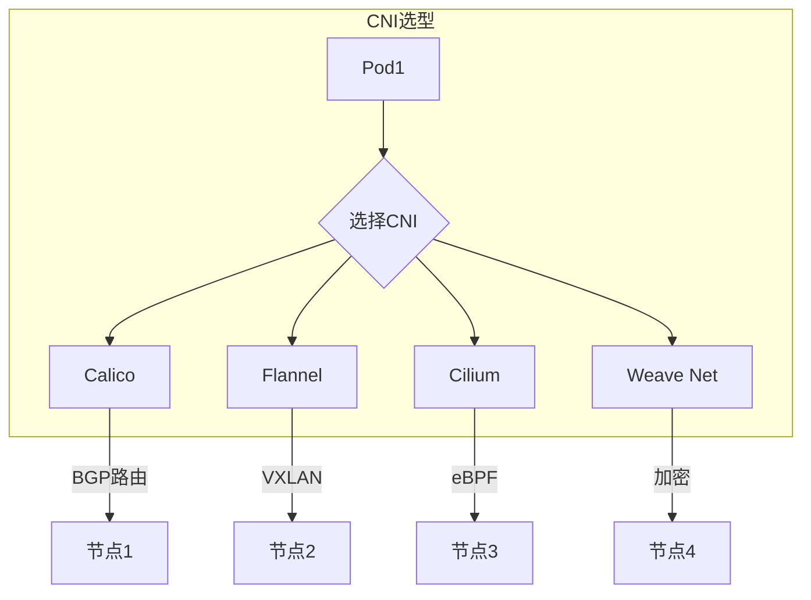
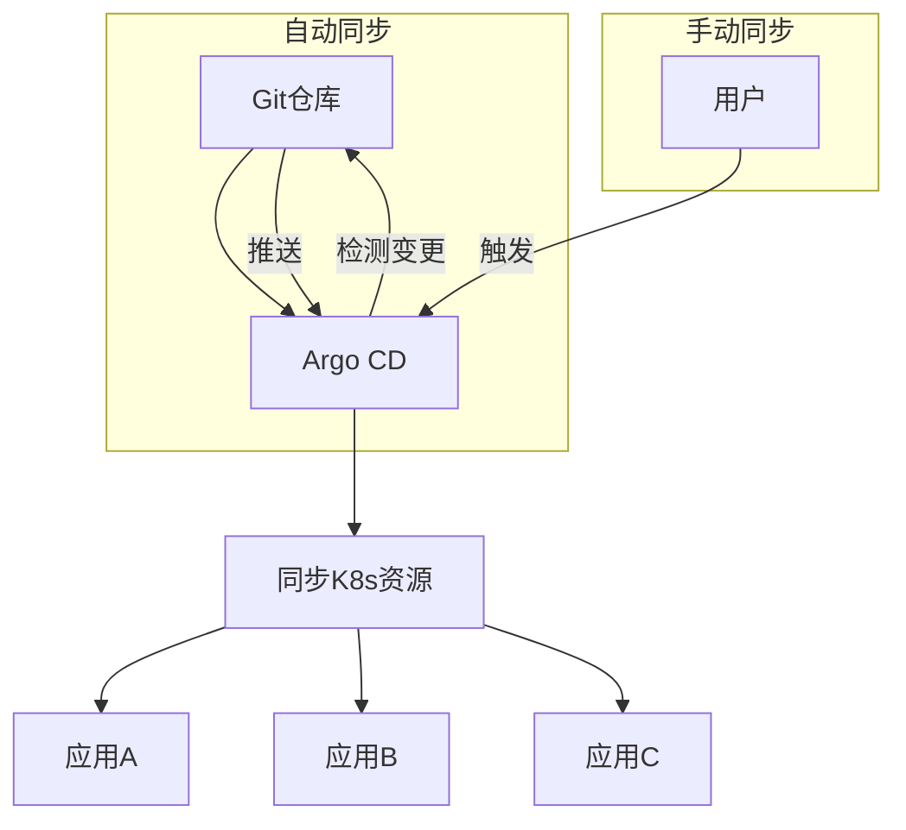
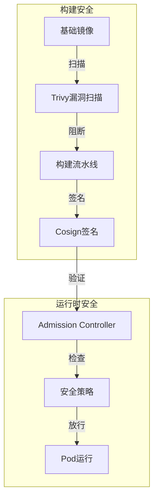
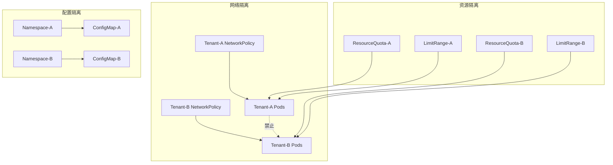

# 云容器编排与 DevOps 体系（托管 K8s / CI-CD / GitOps）

> 云上容器编排把 K8s 控制面托管、CI/CD 流水线 SaaS 化、部署策略 GitOps 化——开发者只写业务代码与应用描述，平台负责构建/部署/回滚。本篇按「解决的问题 → 原理 → 特性 → 选型关注点」拆解，并深入托管控制面、GitOps 拉取模型、流水线即代码等机制。

---

## 一、云容器编排（托管 K8s）

### 1.1 解决的问题

自建 K8s 控制面（API Server/ etcd/ Controller Manager/ Scheduler）运维复杂、升级风险高 → 托管控制面，只负责工作节点。

### 1.2 原理

- **控制面托管**：云厂商管理 API Server/etcd/控制器，用户不可见
- **工作节点**：用户管理节点组（Node Group/托管节点/虚拟节点）
- **网络/存储集成**：原生集成云 VPC、负载均衡、块存储、对象存储

| 服务 | 厂商 | 关键点 |
|------|------|--------|
| EKS | AWS | 托管 K8s、与 IAM/ALB/VPC 集成、Fargate 无节点模式 |
| AKS | Azure | 托管 K8s、与 AD/Monitor 集成、虚拟节点 |
| GKE | GCP | 托管 K8s、Autopilot 模式（免节点管理）、与 Cloud Operations 集成 |
| ACK | 阿里云 | 托管 K8s、与 RAM/SLB/OSS 集成、托管/专有/Serverless 版 |
| TKE | 腾讯云 | 托管 K8s、与 CAM/CLB/COS 集成 |

| 特性 | 说明 |
|------|------|
| 控制面 SLA | 云厂商承诺 99.5%~99.95% 可用性 |
| 自动升级 | 控制面/节点版本自动或手动升级 |
| 托管节点组 | 节点自动修复/替换/扩缩 |
| Serverless 节点 | Fargate/ACI/ECI（按 Pod 计费，无节点管理） |
| 多集群管理 | EKS Anywhere/Anthos/TKE 多集群统一治理 |

### 1.3 托管控制面机制深入

```
自建 vs 托管：
  自建：API Server + etcd + Scheduler + Controller Manager 全自管
    → 升级补丁、etcd 备份、控制面高可用都要自己搞
  托管：控制面由云厂商管理（版本升级/补丁/高可用）
    → 用户只管理工作节点（Node Group）

etc 处理（托管）：
  控制面 etcd：云厂商管理（3 副本 + 加密 + 快照）
  用户数据（ConfigMap/Secret）：仍存在 etcd
  → Secret 建议走外部密钥系统（见云配置与密钥管理）

节点管理（Node Group）：
  自动扩缩（Cluster Autoscaler / Karpenter）
  节点自动修复（异常节点替换）
  镜像预拉取/启动模板（快速扩容）

Serverless 节点（Fargate/ECI）：
  无需管理节点（无 Node Group）
  按 Pod 计费（秒级计费）
  适合：突发负载/无状态应用/不想管节点
  限制：不支持 DaemonSet/特权容器（部分场景）
```

**选型关注点**：单云 → 原生托管 K8s（生态联动最好）；多云/混合云 → Anthos/Rancher/ACK 多集群；不想管节点 → Serverless 节点（Fargate/ECI）。

---

## 二、镜像仓库（容器镜像托管）

| 服务 | 厂商 | 关键点 |
|------|------|--------|
| ECR | AWS | 托管 Docker/OCI 镜像、与 EKS/IAM 集成、镜像扫描 |
| ACR | Azure | 托管镜像、与 AKS 集成、任务构建 |
| GCR / Artifact Registry | GCP | 托管镜像、与 GKE 集成 |
| ACR（阿里云） | 阿里云 | 托管镜像、与 ACK 集成、安全扫描 |
| TCR | 腾讯云 | 托管镜像、与 TKE 集成 |

**解决的问题**：自建 Harbor 运维复杂 → 托管镜像仓库 + 自动 CVE 扫描 + 与 K8s 集成。

### 2.1 镜像供应链安全

```
镜像生命周期（Supply Chain）：
  代码 → 构建（SBOM 生成）→ 镜像扫描（CVE）→ 签名
  → 推送仓库 → 拉取（验证签名）→ 运行

关键实践：
  SBOM（软件物料清单）：记录镜像内所有依赖
  漏洞扫描：构建时 + 运行时（trivy/clair）
  镜像签名：Cosign（OIDC 身份签名）→ K8s 验证
  镜像不可变：tag 用 commit SHA（禁止 latest）
  拉取策略：优先从私有仓库（内网加速 + 受控）
```

---

## 三、CI/CD 流水线

### 3.1 解决的问题

代码提交后自动构建/测试/发布——不用 Jenkins 自己搭，要托管的流水线服务。

### 3.2 服务

| 服务 | 厂商 | 关键点 |
|------|------|--------|
| AWS CodePipeline + CodeBuild | AWS | 流水线 + 构建，与 ECR/EKS/Lambda 集成 |
| Azure DevOps / GitHub Actions | Azure | 完整 DevOps 平台 / 事件驱动 CI/CD |
| GCP Cloud Build + Cloud Deploy | GCP | 托管构建 + 交付管道，与 GKE 集成 |
| 阿里云云效 / 容器服务流水线 | 阿里云 | 与 ACR/ACK 集成 |
| 腾讯云 CODING / 持续集成 | 腾讯云 | 与 TCR/TKE 集成 |
| GitHub Actions | 多云 | 事实标准 CI/CD，与任意云集成 |

### 3.3 CI/CD 核心概念

| 概念 | 说明 |
|------|------|
| Pipeline as Code | 流水线定义在代码仓库（Jenkinsfile/GitHub Actions YAML） |
| 多阶段构建 | 构建→测试→安全扫描→推送镜像→部署 |
| 环境管理 | Dev/Staging/Prod 多环境、审批门控 |
| 制品管理 | 镜像/二进制版本化、回滚能力 |

### 3.4 流水线即代码深入

```
Pipeline as Code 的本质：
  流水线定义 = 代码（评审/版本/审计）
  → 每条流水线是一个"可复现的构建过程"

CI 阶段（Commit → Artifact）：
  代码检出 → 依赖安装 → 单元测试 → 静态检查（lint）→
  构建镜像 → 镜像扫描（CVE）→ 推送镜像仓库（tag=SHA）

CD 阶段（Artifact → 生产）：
  拉取镜像 → 部署到 Dev（自动）→ 冒烟测试 →
  审批门控 → 部署 Staging → 集成/压测 →
  审批门控 → 部署 Prod（金丝雀/蓝绿）→ 验证 → 完成

质量门控（Quality Gate）：
  测试覆盖率/静态扫描/SBOM 漏洞阈值
  任一门控失败 → 流水线终止（不放行到下一环境）

发布策略（CD 部署方式）：
  滚动（Rolling）：逐个替换 Pod
  金丝雀（Canary）：5% → 20% → 100% 逐步放量
  蓝绿（Blue/Green）：新旧版本并行，切换流量
  灰度指标：错误率/延迟/业务指标 → 自动回滚
```

**选型关注点**：GitHub 托管代码 → GitHub Actions（生态最广）；Azure 生态 → Azure DevOps；多云/混合云 → Jenkins/ Tekton（可移植）。

---

## 四、GitOps（声明式持续交付）

### 4.1 解决的问题

传统 CI/CD 推模式（CI 触发部署）→ GitOps 拉模式（Git 仓库是唯一事实来源，Agent 自动同步集群状态到 Git 声明）。

### 4.2 原理

- **声明式**：Git 仓库存储期望状态（K8s YAML / Helm / Kustomize）
- **Agent 同步**：ArgoCD/Flux 运行在集群中，持续对比 Git 与集群状态，自动同步
- **不可变**：所有变更通过 Git PR，可审计、可回滚

| 服务 | 厂商 | 关键点 |
|------|------|--------|
| ArgoCD | 多云（开源） | GitOps 事实标准、多集群、可视化、回滚 |
| Flux | 多云（开源） | CNCF 项目、轻量、与 Helm/Kustomize 集成 |
| AWS CodeCommit + Proton | AWS | 托管 Git + 服务目录 |
| Azure DevOps + Flux | Azure | 与 AKS 集成 |
| 阿里云 ArgoCD / 云效 | 阿里云 | 与 ACK 集成 |

### 4.3 GitOps 核心循环深入

```
GitOps 闭环：
  开发者提交 PR（修改 K8s YAML/Helm chart）
  → 评审合并到主干（Git 是唯一真相源）
  → ArgoCD Agent 检测到 Git 变更
  → 对比集群当前状态 vs Git 期望状态
  → 有差异 → 应用变更（同步）
  → 持续监控：集群漂移 → 自动收敛回 Git 状态

推 vs 拉的本质区别：
  CI/CD 推模式：CI 主动触发部署（部署由流水线驱动）
  GitOps 拉模式：Agent 在集群内拉取 Git（部署由 Git 驱动）
  → 安全：集群无需对外暴露部署权限（Agent 只读 Git + 改集群）
  → 可审计：所有变更来自 Git 提交（谁改了什么一目了然）
  → 自愈：集群漂移（手动 kubectl apply 被覆盖）自动收敛

版本回滚：
  Git 回滚 → ArgoCD 自动同步旧版本
  → 秒级回滚（Git revert + 同步）

多环境管理：
  每个环境一个 Git 目录/分支（dev/qa/prod）
  Kustomize 覆盖（环境差异）或 Helm values 文件
```

**选型关注点**：K8s 部署 → ArgoCD（可视化+多集群最强）；GitOps 理念 → Flux（更轻量 CNCF）；与 CI 集成 → GitHub Actions + ArgoCD（CI 推镜像，ArgoCD 拉部署）。

---

## 五、基础设施即代码（IaC）

| 工具 | 定位 | 关键点 |
|------|------|--------|
| Terraform | 多云 IaC 事实标准 | HCL 语言、状态管理、Provider 覆盖最广 |
| AWS CDK / CloudFormation | AWS IaC | CDK 用编程语言（TS/Python）定义资源 |
| Azure Bicep / ARM | Azure IaC | Bicep 是 ARM 模板的简化语言 |
| GCP Deployment Manager | GCP IaC | 基于 YAML/Jinja |
| Pulumi | 多云 IaC | 用编程语言（TS/Python/Go）定义资源 |
| Crossplane | 多云（K8s 原生） | 用 K8s CRD 管理云资源 |

**解决的问题**：手动控制台创建资源不可重复/不可审计 → 代码化管理基础设施。

### 5.1 IaC 核心机制

```
声明式 vs 命令式：
  命令式：执行命令创建资源（不可重复/不可审计）
  声明式：描述期望状态（Terraform plan/apply）

Terraform 流程：
  写 HCL（provider + resource）→ terraform init → plan（对比状态）
  → apply（执行变更）→ state 文件（记录资源状态）

状态管理：
  state 文件 = 资源的"当前状态快照"
  团队协作 → 远程状态（S3+锁/Terraform Cloud）
  锁机制防并发 apply

基础设施分层：
  环境级（VPC/子网/安全组）→ 平台级（集群/中间件）→ 应用级（服务）
  每层独立 Terraform 工程（模块化）
```

### 5.2 Terraform vs CDK/Pulumi 选择

```
Terraform：HCL 声明式，Provider 最全（多云），运维习惯
CDK：编程语言定义（TS/Python），类型安全，单云
Pulumi：编程语言（通用），多云，需要编程能力

选择：
  多云/生态最全 → Terraform
  单云 + 开发团队（想用代码）→ CDK/Bicep
  编程语言偏好 → Pulumi
  K8s 团队（全云资源纳入 K8s）→ Crossplane
```

**选型关注点**：多云 → Terraform（Provider 最广）；单云 → 原生 IaC（CDK/Bicep）；K8s 团队 → Crossplane。

---

## 六、制品与包管理

| 服务 | 厂商 | 关键点 |
|------|------|--------|
| AWS CodeArtifact | AWS | 托管 Maven/npm/PyPI 私有仓库 |
| Azure Artifacts | Azure | 与 Azure DevOps 集成 |
| GCP Artifact Registry | GCP | 托管 Docker/Maven/npm |
| 阿里云云效制品库 | 阿里云 | 与云效 CI 集成 |
| Nexus / JFrog Artifactory | 多云 | 自建/托管制品仓库 |

---

## 七、DevOps 组织与流程

### 7.1 发布流程规范

```
环境分层：
  Dev：开发自测（自动部署）
  Staging：预发布验证（功能/回归/压测）
  Prod：生产（金丝雀 + 监控）

发布规范：
  ① 所有变更走 PR（代码 + IaC + 配置）
  ② CI 质量门控（测试/扫描/覆盖率）
  ③ CD 自动到 Staging → 审批 → 金丝雀生产
  ④ 发布观察期（错误率/延迟/业务指标）
  ⑤ 自动回滚（指标异常）或手动回滚（Git revert）

审计：谁部署了什么版本、什么时间、哪个环境
```

### 7.2 全链路 DevOps 架构

```
代码仓库（Git）→ CI（构建+测试+扫描）→ 镜像仓库（ECR/ACR）
  → GitOps（ArgoCD 拉取部署）→ K8s 集群（EKS/ACK）
  → 可观测（Prometheus/Grafana）→ 反馈（指标驱动回滚）

基础设施：Terraform（IaC）+ 密钥（Secrets Manager）
配置：AppConfig/ACM（动态配置）
```

---

## 八、选型速查

| 需求 | 首选 | 备选 |
|------|------|------|
| 托管 K8s | EKS/AKS/GKE/ACK/TKE | — |
| 无节点 K8s | Fargate/ECI/ACI | — |
| 镜像仓库 | ECR/ACR/GCR | Harbor（自建） |
| CI/CD | GitHub Actions | Azure DevOps/云效 |
| GitOps 部署 | ArgoCD | Flux |
| 多云 IaC | Terraform | Pulumi |
| 单云 IaC | CDK/Bicep/Deployment Manager | — |
| 制品管理 | Artifact Registry/CodeArtifact | Nexus |

### 8.1 决策树

```
代码托管在哪？
  GitHub → GitHub Actions + ArgoCD
  Azure DevOps → Azure DevOps + Flux
  云效/CODING → 对应云流水线
部署方式偏好？
  拉模式（声明式）→ GitOps（ArgoCD）
  推模式（流水线触发）→ CI/CD 直接部署
基础设施定义？
  多云 → Terraform；单云 → 原生 IaC；K8s → Crossplane
```

---

## 九、K8s Helm Chart 深入

### 9.1 Helm Chart 结构

```
mychart/
  ├── Chart.yaml          # 元数据（版本/依赖）
  ├── values.yaml         # 默认配置值
  ├── templates/
  │   ├── deployment.yaml # K8s 资源模板
  │   ├── service.yaml
  │   ├── ingress.yaml
  │   ├── configmap.yaml
  │   ├── secret.yaml
  │   ├── hpa.yaml
  │   ├── _helpers.tpl   # 模板助手函数
  │   └── NOTES.txt       # 安装后提示
  └── charts/             # 依赖 chart
```

### 9.2 Helm 模板语法

```yaml
# templates/deployment.yaml
apiVersion: apps/v1
kind: Deployment
metadata:
  name: {{ include "mychart.fullname" . }}
  labels:
    {{- include "mychart.labels" . | nindent 4 }}
spec:
  replicas: {{ .Values.replicaCount }}
  selector:
    matchLabels:
      {{- include "mychart.selectorLabels" . | nindent 6 }}
  template:
    spec:
      containers:
        - name: {{ .Chart.Name }}
          image: "{{ .Values.image.repository }}:{{ .Values.image.tag }}"
          ports:
            - containerPort: {{ .Values.service.targetPort }}
          resources:
            {{- toYaml .Values.resources | nindent 12 }}
```

### 9.3 Helm 最佳实践

| 实践 | 说明 |
|------|------|
| values 分层 | values.yaml + env-specific values |
| 模板复用 | _helpers.tpl 提取公共模板 |
| 版本管理 | Chart.yaml 语义化版本 |
| 依赖管理 | Chart.yaml 声明依赖 |
| 安全 | 非 root 运行，SecurityContext |
| 健康检查 | liveness/readiness probe |
| 资源限制 | requests/limits 明确声明 |

---

## 十、K8s Custom Operator

### 10.1 Operator 模式

```
Operator = CRD（自定义资源）+ Controller（控制循环）

控制循环：
  1. Watch：监听 CRD 变更
  2. Compare：当前状态 vs 期望状态
  3. Act：调谐（Reconcile）到期望状态

实现框架：
  Kubebuilder（Go，官方推荐）
  Operator SDK（Go/Ansible/Helm）
  KUDO（声明式 Operator）
```

### 10.2 CRD 定义示例

```yaml
apiVersion: apiextensions.k8s.io/v1
kind: CustomResourceDefinition
metadata:
  name: webapps.example.com
spec:
  group: example.com
  versions:
    - name: v1
      served: true
      storage: true
      schema:
        openAPIV3Schema:
          type: object
          properties:
            spec:
              type: object
              properties:
                replicas:
                  type: integer
                image:
                  type: string
  scope: Namespaced
  names:
    plural: webapps
    singular: webapp
    kind: WebApp
```

---

## 十一、K8s Admission Controllers

### 11.1 准入控制流程

```
API Server 请求流程：
  认证 → 授权 → 准入控制 → etcd

准入控制器类型：
  MutatingAdmissionWebhook：修改请求（注入 Sidecar 等）
  ValidatingAdmissionWebhook：验证请求（策略检查）
```

### 11.2 常见准入控制器

| 控制器 | 说明 |
|--------|------|
| PodSecurity | Pod 安全策略 |
| ResourceQuota | 资源配额检查 |
| LimitRange | 资源限制默认值 |
| NamespaceExists | 命名空间存在检查 |
| MutatingWebhook | Istio Sidecar 注入 |
| ValidatingWebhook | 策略验证（OPA/Kyverno） |

### 11.3 OPA Gatekeeper 示例

```yaml
# 禁止 latest tag
apiVersion: templates.gatekeeper.sh/v1
kind: ConstraintTemplate
metadata:
  name: k8srequiredtags
spec:
  crd:
    spec:
      names:
        kind: K8sRequiredTags
  targets:
    - target: admission.k8s.gatekeeper.sh
      rego: |
        package k8srequiredtags
        violation[{"msg": msg}] {
          container := input.review.object.spec.containers[_]
          not startswith(container.image, "registry.example.com/")
          msg := sprintf("镜像必须来自私有仓库: %v", [container.image])
        }
```

---

## 十二、K8s API Aggregation Layer

### 12.1 聚合 API 架构

```
K8s API Server 请求路由：
  /api/v1          → 内置资源（Pod/Service）
  /apis/apps/v1    → 内置资源（Deployment）
  /apis/custom.example.com/v1 → 聚合 API Server

聚合层作用：
  允许注册自定义 API Server
  扩展 K8s API 能力
  保持 K8s API 风格
```

### 12.2 APIService 注册

```yaml
apiVersion: apiregistration.k8s.io/v1
kind: APIService
metadata:
  name: v1.custom.example.com
spec:
  group: custom.example.com
  version: v1
  service:
    name: custom-api-server
    namespace: system
  caBundle: <base64-ca-cert>
```

---

## 十三、K8s Storage Classes

### 13.1 StorageClass 定义

```yaml
apiVersion: storage.k8s.io/v1
kind: StorageClass
metadata:
  name: fast-ssd
provisioner: kubernetes.io/aws-ebs
parameters:
  type: gp3
  iopsPerGB: "10"
  encrypted: "true"
reclaimPolicy: Retain
volumeBindingMode: WaitForFirstConsumer
allowVolumeExpansion: true
```

### 13.2 动态供给流程

```
PVC → StorageClass → Provisioner → 创建 PV → 绑定 PVC → Pod 挂载

StorageClass 关键参数：
  provisioner：谁来创建存储（EBS/Ceph/NFS）
  reclaimPolicy：Delete/Retain（PV 删除时行为）
  volumeBindingMode：Immediate/WaitForFirstConsumer
  allowVolumeExpansion：是否允许在线扩容
```

---

## 十四、K8s 多集群管理

### 14.1 多集群方案

| 方案 | 说明 | 适用 |
|------|------|------|
| Federation v2 | K8s 原生联邦 | 多集群资源同步 |
| Anthos | Google 多集群管理 | GCP 生态 |
| Rancher | 开源多集群管理 | 多云 |
| Cluster API | 声明式集群生命周期 | 自建集群 |

### 14.2 多集群网络

```
多集群网络方案：
  ① 集群内：CNI（Calico/Cilium）
  ② 集群间：Submariner/Cluster API
  ③ 跨云：VPN/专线
  ④ Service Mesh：Istio 多集群
```

---

## 十五、GitOps 深入：Flux 与 ArgoCD 对比

| 维度 | Flux | ArgoCD |
|------|------|--------|
| 架构 | 轻量级，单组件 | 功能丰富，多组件 |
| UI | 无原生 UI（需 Weave GitOps） | 强大 Web UI |
| 多集群 | 支持 | 强（可视化） |
| RBAC | 基于 K8s RBAC | 内置 RBAC |
| 通知 | 丰富（Slack/Teams/Webhook） | 有限 |
| 适用 | 轻量 GitOps | 复杂多集群 |

---

## 十六、DevSecOps 流水线集成

### 16.1 安全扫描阶段

```
CI/CD 安全扫描：
  代码阶段：SAST（SonarQube/Checkmarx）
  依赖阶段：SCA（Snyk/Dependabot）
  构建阶段：镜像扫描（Trivy/Snyk）
  部署阶段：IaC 扫描（Checkov/tfsec）
  运行时：运行时安全（Falco/Tetragon）
```

### 16.2 DevSecOps 工具链

| 阶段 | 工具 | 说明 |
|------|------|------|
| 代码 | SonarQube | 静态代码分析 |
| 依赖 | Snyk | 依赖漏洞扫描 |
| 镜像 | Trivy | 容器镜像 CVE |
| IaC | Checkov | Terraform/K8s 安全 |
| 策略 | OPA/Kyverno | K8s 策略执行 |
| 运行时 | Falco | 运行时威胁检测 |

---

## 补充：云容器编排深度解析

### 1. EKS vs AKS vs GKE 对比

| 维度 | EKS | AKS | GKE |
|------|-----|-----|-----|
| 控制面SLA | 99.95% | 99.95% | 99.95% |
| 控制面费用 | $0.10/hr | 免费 | $0.10/hr |
| 节点自动扩缩 | Cluster Autoscaler/Karpenter | Cluster Autoscaler | 自动扩缩 |
| Serverless节点 | Fargate | ACI/Virtual Nodes | Autopilot |
| 网络 | VPC CNI | Azure CNI | VPC-native |
| 存储 | EBS/EFS | Azure Disk/File | Persistent Disk |
| 安全 | IAM Roles for Pods | AAD Pod Identity | Workload Identity |
| 监控 | CloudWatch | Azure Monitor | Cloud Monitoring |

### 2. Managed K8s Control Plane

| 组件 | 托管说明 |
|------|----------|
| API Server | 云厂商管理，自动扩缩 |
| etcd | 云厂商管理，自动备份 |
| Controller Manager | 云厂商管理，自动升级 |
| Scheduler | 云厂商管理，自动优化 |

### 3. K8s Node Auto-Provisioning

| 方案 | 说明 |
|------|------|
| Cluster Autoscaler | 根据Pod需求自动扩缩节点 |
| Karpenter | AWS新一代节点自动配置 |
| Node Pool | 预配置节点组 |
| Spot Instances | 使用抢占式实例降低成本 |

### 4. Cloud CI/CD Pipelines

| 服务 | 说明 |
|------|------|
| AWS CodePipeline | 流水线编排 |
| AWS CodeBuild | 托管构建服务 |
| Azure DevOps | 完整DevOps平台 |
| GitHub Actions | 事件驱动CI/CD |
| Cloud Build | GCP托管构建 |

### 5. Cloud Artifact Registry

| 服务 | 说明 |
|------|------|
| ECR | AWS容器镜像仓库 |
| ACR | Azure容器镜像仓库 |
| Artifact Registry | GCP制品仓库 |
| 支持格式 | Docker/Maven/npm/PyPI |

### 6. Cloud Deployment Strategies

| 策略 | 说明 |
|------|------|
| Rolling Update | 逐步替换Pod |
| Blue/Green | 新旧版本并行 |
| Canary | 灰度发布 |
| A/B Testing | 流量分割测试 |

### 7. GitOps with ArgoCD

| 功能 | 说明 |
|------|------|
| 声明式部署 | Git作为唯一真相源 |
| 自动同步 | 检测Git变更自动部署 |
| 多集群管理 | 统一管理多集群 |
| 回滚 | Git revert自动回滚 |
| RBAC | 细粒度权限控制 |

### 8. 云容器安全

| 实践 | 说明 |
|------|------|
| 镜像扫描 | 构建时CVE扫描 |
| 运行时安全 | 异常行为检测 |
| 网络策略 | Pod间网络隔离 |
| RBAC | K8s权限控制 |
| Secret管理 | 外部密钥系统 |

### 9. 云容器成本优化

| 策略 | 说明 |
|------|------|
| 节点自动扩缩 | 按需扩缩节点 |
| Spot实例 | 非关键负载使用 |
| 资源请求 | 合理设置requests/limits |
| Pod反亲和性 | 均衡节点负载 |

### 10. 云容器监控

| 工具 | 说明 |
|------|------|
| Prometheus | 指标采集 |
| Grafana | 可视化 |
| Loki | 日志聚合 |
| Jaeger | 链路追踪 |

### 11. 云容器网络

| 方案 | 说明 |
|------|------|
| VPC CNI | AWS VPC原生网络 |
| Azure CNI | Azure容器网络 |
| Calico | 网络策略 |
| Cilium | eBPF网络 |

### 12. 云容器存储

| 方案 | 说明 |
|------|------|
| EBS | AWS块存储 |
| Azure Disk | Azure块存储 |
| Persistent Disk | GCP块存储 |
| EFS/Azure File | 共享文件存储 |

### 13. 云容器最佳实践

| 实践 | 说明 |
|------|------|
| 镜像优化 | 最小化基础镜像 |
| 资源限制 | 设置requests/limits |
| 健康检查 | liveness/readiness |
| 日志收集 | 标准输出收集 |
| 配置管理 | ConfigMap/Secret |

### 14. 云容器团队协作

| 角色 | 职责 |
|------|------|
| 平台工程师 | K8s集群运维 |
| SRE | 可观测性保障 |
| 开发工程师 | 应用容器化 |
| 安全工程师 | 容器安全 |

### 15. 云容器未来趋势

| 趋势 | 说明 |
|------|------|
| WebAssembly | 新一代容器运行时 |
| eBPF | 内核级网络观测 |
| 多集群联邦 | 统一管理多集群 |
| 混合云 | 云上云下统一调度 |

### 16. 云容器选型决策

| 场景 | 推荐方案 |
|------|----------|
| 快速上手 | 托管K8s+托管CI/CD |
| 多云环境 | Terraform+ArgoCD |
| 企业级 | 安全扫描+合规检查 |
| 成本敏感 | Spot实例+自动扩缩 |

---

## 十七、EKS/AKS/GKE 托管 K8s 差异对比

| 维度 | EKS（AWS） | AKS（Azure） | GKE（GCP） |
|------|-----------|-------------|------------|
| 控制面费用 | $0.10/小时 | 免费 | 免费 |
| 节点费用 | EC2 实例 | VM 实例 | Compute Engine |
| 自动升级 | 可配置 | 自动 | 自动 |
| 节点池 | 托管节点池 | 节点池 | 节点池 |
| 网络插件 | VPC CNI | Azure CNI | GKE Dataplane |
| 服务网格 | App Mesh | Istio | Anthos Service Mesh |
| CI/CD | CodePipeline | Azure DevOps | Cloud Build |
| 监控 | CloudWatch | Azure Monitor | Cloud Monitoring |
| 成本 | 中 | 低（控制面免费） | 低（控制面免费） |

```text
托管 K8s 升级策略：
  1. 自动升级：云厂商自动升级控制面（需测试兼容性）
  2. 手动升级：控制面 + 节点池同时升级
  3. 滚动升级：节点池逐个升级（零停机）
  4. 蓝绿升级：新节点池 + 旧节点池同时存在
```

## 十八、节点池管理与自动扩缩

```yaml
# AWS EKS 节点池配置
apiVersion: eks.amazonaws.com/v1
kind: Nodegroup
metadata:
  name: production-pool
spec:
  instanceTypes:
    - m5.xlarge
    - m5.2xlarge
  minSize: 3
  maxSize: 20
  desiredSize: 5
  labels:
    role: production
  taints:
    - key: "env"
      value: "production"
      effect: "NoSchedule"
  updateConfig:
    maxUnavailable: 1
```

```yaml
# 自动扩缩配置（Cluster Autoscaler）
apiVersion: apps/v1
kind: Deployment
metadata:
  name: cluster-autoscaler
spec:
  template:
    spec:
      containers:
        - name: cluster-autoscaler
          command:
            - ./cluster-autoscaler
            - --v=4
            - --cloud-provider=aws
            - --skip-nodes-with-local-storage=false
            - --expander=least-waste
            - --node-group-auto-discovery=asg:tag=k8s.io/cluster-autoscaler/enabled,k8s.io/cluster-autoscaler/my-cluster
```

```text
节点池最佳实践：
  1. 业务节点池：生产/测试/开发 分开
  2. 系统节点池：监控/日志/基础设施
  3. GPU 节点池：AI/ML 训练任务
  4. Spot 节点池：成本敏感型任务
  5. 混合实例：按需 + Spot（平衡成本和可用性）
```

## 十九、ArgoCD ApplicationSet 多环境管理

```yaml
# ApplicationSet 生成多环境应用
apiVersion: argoproj.io/v1alpha1
kind: ApplicationSet
metadata:
  name: my-app-set
spec:
  generators:
    - list:
        elements:
          - env: dev
            url: https://dev.example.com
            revision: develop
          - env: staging
            url: https://staging.example.com
            revision: main
          - env: prod
            url: https://prod.example.com
            revision: main
  template:
    metadata:
      name: 'my-app-{{env}}'
    spec:
      project: default
      source:
        repoURL: https://github.com/myorg/myapp
        targetRevision: '{{revision}}'
        path: 'k8s/{{env}}'
      destination:
        server: '{{url}}'
        namespace: my-app
      syncPolicy:
        automated:
          prune: true
          selfHeal: true
        syncOptions:
          - CreateNamespace=true
```

```text
ApplicationSet 优势：
  1. 一次定义，多环境生成
  2. Git 分支对应环境（develop/staging/main）
  3. 自动同步 + 自愈
  4. 环境隔离（独立项目）
```

## 二十、Helm 版本管理与回滚

```bash
# Helm 部署与回滚
# 1. 安装
helm install my-app ./my-chart -f values-prod.yaml

# 2. 升级
helm upgrade my-app ./my-chart -f values-prod.yaml --set image.tag=v2.0

# 3. 查看历史
helm history my-app

# 4. 回滚到指定版本
helm rollback my-app 3  # 回滚到版本 3

# 5. 查看差异
helm diff upgrade my-app ./my-chart -f values-prod.yaml
```

```yaml
# Helm Chart 版本管理
apiVersion: v2
name: my-app
version: 1.0.0
appVersion: "2.0.0"
description: My Application Helm Chart
maintainers:
  - name: devops-team
dependencies:
  - name: postgresql
    version: "12.x.x"
    repository: "https://charts.bitnami.com/bitnami"
    condition: postgresql.enabled
```

## 二十一、K8s 资源配额与多租户隔离

```yaml
# Namespace 资源配额
apiVersion: v1
kind: ResourceQuota
metadata:
  name: team-a-quota
  namespace: team-a
spec:
  hard:
    requests.cpu: "20"
    requests.memory: "40Gi"
    limits.cpu: "40"
    limits.memory: "80Gi"
    pods: "100"
    services: "20"
    persistentvolumeclaims: "10"

# LimitRange（默认资源限制）
apiVersion: v1
kind: LimitRange
metadata:
  name: team-a-limits
  namespace: team-a
spec:
  limits:
    - type: Container
      default:
        cpu: "500m"
        memory: "512Mi"
      defaultRequest:
        cpu: "100m"
        memory: "128Mi"
      max:
        cpu: "2"
        memory: "4Gi"
      min:
        cpu: "50m"
        memory: "64Mi"
```

```yaml
# NetworkPolicy（网络隔离）
apiVersion: networking.k8s.io/v1
kind: NetworkPolicy
metadata:
  name: team-a-network-policy
  namespace: team-a
spec:
  podSelector: {}
  policyTypes:
    - Ingress
    - Egress
  ingress:
    - from:
        - namespaceSelector:
            matchLabels:
              name: team-a
  egress:
    - to:
        - namespaceSelector:
            matchLabels:
              name: team-a
```

```text
多租户隔离方案：
  1. Namespace 隔离：每个租户一个 Namespace
  2. 资源配额：CPU/内存/Pod 数量限制
  3. LimitRange：默认资源限制
  4. NetworkPolicy：网络隔离
  5. RBAC：权限隔离
  6. 节点亲和性：租户 Pod 分散到不同节点
```

## CNI 网络插件对比



### CNI 插件对比

| 特性 | Calico | Flannel | Cilium | Weave |
|------|--------|---------|--------|-------|
| 网络模式 | BGP/VXLAN | VXLAN/host-gw | eBPF | VXLAN |
| 网络策略 | 支持 | 不支持 | 支持 | 支持 |
| 性能 | 高 | 中 | 极高 | 中 |
| 安全性 | 高 | 中 | 极高 | 高 |
| 运维复杂度 | 中 | 低 | 高 | 低 |
| 适用场景 | 企业级 | 简单场景 | 高性能 | 小规模 |

### CNI 选型建议

```
简单场景（<50节点）：Flannel（简单易用）
企业级场景：Calico（功能全面）
高性能场景：Cilium（eBPF加速）
安全敏感场景：Calico+加密
```

## Helm 最佳实践

```yaml
# Helm Chart 结构
mychart/
├── Chart.yaml          # Chart元数据
├── values.yaml         # 默认配置
├── templates/
│   ├── deployment.yaml
│   ├── service.yaml
│   ├── ingress.yaml
│   ├── configmap.yaml
│   ├── secrets.yaml
│   └── _helpers.tpl   # 模板助手
├── charts/             # 依赖Chart
└── README.md
```

### Helm 仓库管理

```bash
# 添加仓库
helm repo add bitnami https://charts.bitnami.com/bitnami
helm repo add prometheus-community https://prometheus-community.github.io/helm-charts
helm repo update

# 搜索Chart
helm search repo nginx
helm search hub prometheus

# 查看Chart信息
helm show chart bitnami/nginx
helm show values bitnami/nginx
```

### Helm 部署策略

| 策略 | 命令 | 适用场景 |
|------|------|----------|
| 默认升级 | helm upgrade --install | 正常更新 |
| 等待部署 | helm upgrade --wait | 依赖检查 |
| 并行部署 | helm upgrade --atomic | 原子性部署 |
| 回滚 | helm rollback | 发布失败 |

### Helm 资源管理

```yaml
# values.yaml 资源配置
resources:
  limits:
    cpu: 500m
    memory: 512Mi
  requests:
    cpu: 250m
    memory: 256Mi

# 自动扩缩容
autoscaling:
  enabled: true
  minReplicas: 2
  maxReplicas: 10
  targetCPUUtilizationPercentage: 80
  targetMemoryUtilizationPercentage: 80
```

## Argo CD GitOps 实战



### Argo CD 配置示例

```yaml
apiVersion: argoproj.io/v1alpha1
kind: Application
metadata:
  name: my-app
  namespace: argocd
spec:
  project: default
  source:
    repoURL: https://github.com/org/app.git
    targetRevision: HEAD
    path: k8s/overlays/production
  destination:
    server: https://kubernetes.default.svc
    namespace: production
  syncPolicy:
    automated:
      prune: true
      selfHeal: true
    syncOptions:
    - CreateNamespace=true
```

### Argo CD 与 Helm 集成

```yaml
source:
  repoURL: https://charts.bitnami.com/bitnami
  chart: nginx
  targetRevision: 1.0.0
  helm:
    releaseName: my-nginx
    values: |
      replicaCount: 3
      service:
        type: LoadBalancer
```

## 容器安全最佳实践



### 容器安全检查清单

| 检查项 | 说明 | 实现方式 |
|--------|------|----------|
| 镜像漏洞扫描 | 扫描CVE漏洞 | Trivy/Snyk |
| 镜像签名 | 验证镜像来源 | Cosign/Notary |
| 非root运行 | 降低容器权限 | USER指令 |
| 只读根文件系统 | 防止恶意写入 | readOnlyRootFilesystem |
| 禁止特权模式 | 防止容器逃逸 | privileged:false |
| 资源限制 | 防止资源耗尽 | resources.limits |

### Pod 安全上下文

```yaml
apiVersion: v1
kind: Pod
metadata:
  name: secure-pod
spec:
  securityContext:
    runAsNonRoot: true
    runAsUser: 1000
    fsGroup: 2000
  containers:
  - name: app
    image: my-app:v1
    securityContext:
      allowPrivilegeEscalation: false
      readOnlyRootFilesystem: true
      capabilities:
        drop:
          - ALL
    resources:
      limits:
        cpu: "1"
        memory: 512Mi
      requests:
        cpu: "0.5"
        memory: 256Mi
```

## 多租户隔离方案



### 多租户隔离配置

```yaml
# Namespace 隔离
apiVersion: v1
kind: Namespace
metadata:
  name: tenant-a
  labels:
    tenant: a

# ResourceQuota 隔离
apiVersion: v1
kind: ResourceQuota
metadata:
  name: tenant-a-quota
  namespace: tenant-a
spec:
  hard:
    requests.cpu: "10"
    requests.memory: 20Gi
    limits.cpu: "20"
    limits.memory: 40Gi
    pods: "50"

# NetworkPolicy 网络隔离
apiVersion: networking.k8s.io/v1
kind: NetworkPolicy
metadata:
  name: tenant-a-isolation
  namespace: tenant-a
spec:
  podSelector: {}
  policyTypes:
  - Ingress
  - Egress
  ingress:
  - from:
    - namespaceSelector:
        matchLabels:
          tenant: a
  egress:
  - to:
    - namespaceSelector:
        matchLabels:
          tenant: a
```

### 多租户管理组件

| 组件 | 说明 | 用途 |
|------|------|------|
| Namespace | 命名空间隔离 | 资源/配置隔离 |
| ResourceQuota | 资源配额 | 限制资源使用 |
| LimitRange | 资源限制 | 默认资源限制 |
| NetworkPolicy | 网络策略 | 网络隔离 |
| RBAC | 权限控制 | 访问控制 |
| PodSecurityPolicy | Pod安全策略 | 安全约束 |

## K8s高级实践与故障排查

### K8s网络模型CNI

```yaml
# CNI插件选择
# Calico: 网络策略 + BGP路由
# Flannel: 简单 overlay
# Cilium: eBPF 高性能网络
# Weave: 简单易用

# Calico网络策略
apiVersion: networking.k8s.io/v1
kind: NetworkPolicy
metadata:
  name: allow-frontend-to-backend
spec:
  podSelector:
    matchLabels:
      app: backend
  policyTypes:
    - Ingress
  ingress:
    - from:
        - podSelector:
            matchLabels:
              app: frontend
      ports:
        - protocol: TCP
          port: 8080

# Cilium网络策略（eBPF）
apiVersion: cilium.io/v2
kind: CiliumNetworkPolicy
metadata:
  name: allow-frontend-to-backend
spec:
  endpointSelector:
    matchLabels:
      app: backend
  ingress:
    - fromEndpoints:
        - matchLabels:
            app: frontend
      toPorts:
        - ports:
            - port: "8080"
```

| CNI插件 | 特点 | 适用场景 |
|---------|------|----------|
| Calico | 网络策略+BGP | 企业级 |
| Flannel | 简单overlay | 小型集群 |
| Cilium | eBPF高性能 | 大规模 |
| Weave | 简单易用 | 开发测试 |

### Helm Chart开发

```yaml
# Chart.yaml
apiVersion: v2
name: myapp
description: My application Helm chart
type: application
version: 0.1.0
appVersion: "1.0.0"

# values.yaml
replicaCount: 3
image:
  repository: nginx
  pullPolicy: IfNotPresent
  tag: "latest"

service:
  type: ClusterIP
  port: 80

ingress:
  enabled: true
  hosts:
    - host: myapp.example.com
      paths:
        - path: /
          pathType: Prefix

resources:
  limits:
    cpu: 100m
    memory: 128Mi
  requests:
    cpu: 100m
    memory: 128Mi

# templates/deployment.yaml
apiVersion: apps/v1
kind: Deployment
metadata:
  name: {{ include "myapp.fullname" . }}
spec:
  replicas: {{ .Values.replicaCount }}
  selector:
    matchLabels:
      {{- include "myapp.selectorLabels" . | nindent 6 }}
  template:
    metadata:
      labels:
        {{- include "myapp.selectorLabels" . | nindent 8 }}
    spec:
      containers:
        - name: {{ .Chart.Name }}
          image: "{{ .Values.image.repository }}:{{ .Values.image.tag }}"
          ports:
            - containerPort: 80
```

| Helm组件 | 说明 | 用途 |
|----------|------|------|
| Chart.yaml | Chart元数据 | 版本管理 |
| values.yaml | 默认配置 | 参数化 |
| templates/ | 模板文件 | 渲染部署 |
| helpers.tpl | 辅助函数 | 代码复用 |

### Argo CD ApplicationSet

```yaml
# ApplicationSet配置
apiVersion: argoproj.io/v1alpha1
kind: ApplicationSet
metadata:
  name: myapp-set
spec:
  generators:
    - list:
        elements:
          - env: dev
            url: https://dev.example.com
          - env: staging
            url: https://staging.example.com
          - env: prod
            url: https://prod.example.com
  
  template:
    metadata:
      name: 'myapp-{{env}}'
    spec:
      project: default
      source:
        repoURL: https://github.com/org/myapp.git
        targetRevision: HEAD
        path: 'k8s/{{env}}'
      destination:
        server: '{{url}}'
        namespace: myapp
      syncPolicy:
        automated:
          prune: true
          selfHeal: true
        syncOptions:
          - CreateNamespace=true

# 多集群管理
apiVersion: argoproj.io/v1alpha1
kind: ApplicationSet
metadata:
  name: cluster-set
spec:
  generators:
    - clusters:
        selector:
          matchLabels:
            env: production
  
  template:
    metadata:
      name: 'myapp-{{name}}'
    spec:
      project: default
      source:
        repoURL: https://github.com/org/myapp.git
        targetRevision: HEAD
        path: k8s/production
      destination:
        server: '{{server}}'
        namespace: myapp
```

| ApplicationSet特性 | 说明 | 适用场景 |
|--------------------|------|----------|
| List Generator | 列表生成 | 多环境部署 |
| Clusters Generator | 集群生成 | 多集群管理 |
| Git Generator | Git目录生成 | GitOps |
| Matrix Generator | 矩阵生成 | 复杂组合 |

### 容器安全

```yaml
# Pod安全策略
apiVersion: v1
kind: Pod
metadata:
  name: secure-pod
spec:
  securityContext:
    runAsNonRoot: true
    runAsUser: 1000
    fsGroup: 2000
  
  containers:
    - name: app
      image: nginx:latest
      securityContext:
        allowPrivilegeEscalation: false
        readOnlyRootFilesystem: true
        capabilities:
          drop:
            - ALL
      
      resources:
        limits:
          cpu: "1"
          memory: "512Mi"
        requests:
          cpu: "500m"
          memory: "256Mi"
      
      volumeMounts:
        - name: tmp
          mountPath: /tmp
  
  volumes:
    - name: tmp
      emptyDir: {}

# 网络策略
apiVersion: networking.k8s.io/v1
kind: NetworkPolicy
metadata:
  name: deny-all
spec:
  podSelector: {}
  policyTypes:
    - Ingress
    - Egress

# 镜像安全扫描
# 使用Trivy扫描镜像漏洞
# trivy image nginx:latest
```

| 安全措施 | 说明 | 重要性 |
|----------|------|--------|
| 非Root运行 | 降低权限 | 高 |
| 只读文件系统 | 防止写入 | 高 |
| 资源限制 | 防止资源耗尽 | 高 |
| 网络策略 | 网络隔离 | 高 |
| 镜像扫描 | 漏洞检测 | 高 |

### 多租户隔离

```yaml
# Namespace隔离
apiVersion: v1
kind: Namespace
metadata:
  name: team-a
  labels:
    team: a

# ResourceQuota
apiVersion: v1
kind: ResourceQuota
metadata:
  name: team-a-quota
  namespace: team-a
spec:
  hard:
    requests.cpu: "10"
    requests.memory: 20Gi
    limits.cpu: "20"
    limits.memory: 40Gi
    pods: "50"

# LimitRange
apiVersion: v1
kind: LimitRange
metadata:
  name: team-a-limits
  namespace: team-a
spec:
  limits:
    - default:
        cpu: "1"
        memory: 1Gi
      defaultRequest:
        cpu: 100m
        memory: 128Mi
      type: Container

# RBAC
apiVersion: rbac.authorization.k8s.io/v1
kind: Role
metadata:
  name: team-a-role
  namespace: team-a
rules:
  - apiGroups: [""]
    resources: ["pods", "services"]
    verbs: ["get", "list", "watch"]

---
apiVersion: rbac.authorization.k8s.io/v1
kind: RoleBinding
metadata:
  name: team-a-binding
  namespace: team-a
subjects:
  - kind: User
    name: team-a-user
roleRef:
  kind: Role
  name: team-a-role
  apiGroup: rbac.authorization.k8s.io
```

| 隔离措施 | 说明 | 作用 |
|----------|------|------|
| Namespace | 命名空间隔离 | 资源隔离 |
| ResourceQuota | 资源配额 | 限制资源 |
| LimitRange | 资源限制 | 默认限制 |
| RBAC | 权限控制 | 访问控制 |

### K8s故障排查手册

| 故障现象 | 可能原因 | 排查步骤 | 解决方案 |
|----------|----------|----------|----------|
| Pod CrashLoopBackOff | 启动失败 | kubectl logs | 检查日志 |
| Pod Pending | 资源不足 | kubectl describe | 扩容节点 |
| Service无法访问 | 网络问题 | kubectl get endpoints | 检查网络 |
| Deployment不更新 | 镜像问题 | kubectl rollout status | 更新镜像 |
| Node NotReady | 节点故障 | kubectl get nodes | 修复节点 |
| etcd集群异常 | 数据问题 | etcdctl检查 | 恢复数据 |

### K8s监控与告警

```yaml
# Prometheus监控配置
apiVersion: monitoring.coreos.com/v1
kind: ServiceMonitor
metadata:
  name: myapp-monitor
spec:
  selector:
    matchLabels:
      app: myapp
  endpoints:
    - port: http
      path: /metrics
      interval: 30s

# 告警规则
apiVersion: monitoring.coreos.com/v1
kind: PrometheusRule
metadata:
  name: myapp-alerts
spec:
  groups:
    - name: myapp
      rules:
        - alert: HighErrorRate
          expr: rate(http_requests_total{status=~"5.."}[5m]) > 0.1
          for: 5m
          labels:
            severity: critical
          annotations:
            summary: "High error rate detected"
        
        - alert: HighLatency
          expr: histogram_quantile(0.99, rate(http_request_duration_seconds_bucket[5m])) > 1
          for: 5m
          labels:
            severity: warning
          annotations:
            summary: "High latency detected"
```

| 监控指标 | 说明 | 告警阈值 |
|----------|------|----------|
| 错误率 | 5xx错误比例 | >10% |
| 延迟 | P99延迟 | >1秒 |
| CPU使用率 | 节点CPU使用率 | >80% |
| 内存使用率 | 节点内存使用率 | >80% |

> 核心原则：**CNI网络模型灵活，Helm Chart参数化，Argo CD声明式，容器安全多层防护，多租户资源隔离**。

---

## 二十二、CNI 网络插件深度对比

### 22.1 CNI 插件对比

| 插件 | 性能 | 功能 | 复杂度 | 适用场景 |
|------|------|------|--------|---------|
| Calico | 高 | 网络策略、BGP | 中 | 企业级 |
| Cilium | 最高 | eBPF、可观测性 | 高 | 高性能 |
| Flannel | 中 | 基础网络 | 低 | 测试环境 |
| Weave | 中 | 加密、多播 | 中 | 多云 |
| Antrea | 高 | OpenFlow | 中 | VMware |

### 22.2 Calico 配置

```yaml
# Calico 网络策略
apiVersion: projectcalico.org/v3
kind: NetworkPolicy
metadata:
  name: deny-all
  namespace: default
spec:
  selector: all()
  types:
    - Ingress
    - Egress
---
apiVersion: projectcalico.org/v3
kind: NetworkPolicy
metadata:
  name: allow-frontend
  namespace: default
spec:
  selector: app == 'frontend'
  types:
    - Ingress
  ingress:
    - from:
        - namespaceSelector:
            matchLabels:
              name: frontend
      ports:
        - protocol: TCP
          port: 80
```

### 22.3 Cilium eBPF 配置

```yaml
# Cilium 网络策略
apiVersion: cilium.io/v2
kind: CiliumNetworkPolicy
metadata:
  name: allow-frontend
  namespace: default
spec:
  endpointSelector:
    matchLabels:
      app: frontend
  ingress:
    - fromEndpoints:
        - matchLabels:
            app: backend
      toPorts:
        - ports:
            - port: "80"
              protocol: TCP
```

---

## 二十三、Helm Chart 管理

### 23.1 Helm Chart 结构

```
mychart/
  Chart.yaml          # Chart元数据
  values.yaml         # 默认配置
  charts/             # 依赖Chart
  templates/          # 模板文件
    deployment.yaml
    service.yaml
    ingress.yaml
    configmap.yaml
    _helpers.tpl      # 辅助模板
  .helmignore         # 忽略文件
```

### 23.2 Helm Chart 配置

```yaml
# values.yaml
replicaCount: 3

image:
  repository: nginx
  pullPolicy: IfNotPresent
  tag: "latest"

service:
  type: ClusterIP
  port: 80

ingress:
  enabled: true
  className: nginx
  annotations:
    cert-manager.io/cluster-issuer: letsencrypt-prod
  hosts:
    - host: chart-example.local
      paths:
        - path: /
          pathType: ImplementationSpecific
  tls:
    - secretName: chart-example-tls
      hosts:
        - chart-example.local

resources:
  limits:
    cpu: 500m
    memory: 128Mi
  requests:
    cpu: 250m
    memory: 64Mi
```

### 23.3 Helm 操作命令

```bash
# 安装Chart
helm install my-release ./mychart

# 升级Chart
helm upgrade my-release ./mychart --set replicaCount=5

# 回滚
helm rollback my-release 1

# 查看历史
helm history my-release

# 卸载
helm uninstall my-release
```

---

## 二十四、Argo CD GitOps 配置

### 24.1 Argo CD Application 配置

```yaml
apiVersion: argoproj.io/v1alpha1
kind: Application
metadata:
  name: my-app
  namespace: argocd
spec:
  project: default
  source:
    repoURL: https://github.com/my-org/my-app.git
    targetRevision: HEAD
    path: k8s/overlays/production
  destination:
    server: https://kubernetes.default.svc
    namespace: production
  syncPolicy:
    automated:
      prune: true
      selfHeal: true
    syncOptions:
      - CreateNamespace=true
    retry:
      limit: 5
      backoff:
        duration: 5s
        factor: 2
        maxDuration: 3m
```

### 24.2 Argo CD 配置

```yaml
# argocd-cm.yaml
apiVersion: v1
kind: ConfigMap
metadata:
  name: argocd-cm
  namespace: argocd
data:
  url: https://argocd.example.com
  admin.enabled: "false"
  dex.config: |
    connectors:
      - type: github
        id: github
        name: GitHub
        config:
          clientID: $dex.github.clientID
          clientSecret: $dex.github.clientSecret
          orgs:
            - name: my-org
```

---

## 二十五、容器安全多层防护

### 25.1 安全层级

| 层级 | 措施 | 工具 | 优先级 |
|------|------|------|--------|
| 镜像层 | 扫描漏洞 | Trivy/Snyk | 高 |
| 运行时层 | 行为监控 | Falco | 高 |
| 网络层 | 网络策略 | Calico/Cilium | 高 |
| 存储层 | 加密存储 | Vault | 中 |
| 身份层 | RBAC | K8s RBAC | 高 |

### 25.2 镜像扫描配置

```yaml
# Trivy 扫描配置
apiVersion: v1
kind: ConfigMap
metadata:
  name: trivy-config
data:
  trivy.yaml: |
    scan:
      scanners:
        - vuln
        - misconfig
        - secret
    vulnerability:
      severity:
        - CRITICAL
        - HIGH
      ignoreUnfixed: true
```

### 25.3 Falco 规则配置

```yaml
# falco-rules.yaml
- rule: Terminal shell in container
  desc: A shell was used as the entrypoint/exec point into a container
  condition: >
    spawned_process and container and shell_procs and proc.tty != 0
  output: >
    Shell spawned in container (user=%user.name container=%container.name
    shell=%proc.name parent=%proc.pname cmdline=%proc.cmdline)
  priority: WARNING
  tags: [container, shell, mitre_execution]
```

---

## 二十六、多租户资源隔离

### 26.1 多租户隔离方案

| 方案 | 隔离级别 | 资源开销 | 适用场景 |
|------|---------|---------|---------|
| Namespace | 中 | 低 | 软隔离 |
| ResourceQuota | 高 | 低 | 资源限制 |
| NetworkPolicy | 高 | 低 | 网络隔离 |
| Virtual Cluster | 最高 | 高 | 硬隔离 |
| Node Pool | 最高 | 高 | 物理隔离 |

### 26.2 多租户配置

```yaml
# Namespace 资源配额
apiVersion: v1
kind: ResourceQuota
metadata:
  name: tenant-quota
  namespace: tenant-a
spec:
  hard:
    requests.cpu: "10"
    requests.memory: 20Gi
    limits.cpu: "20"
    limits.memory: 40Gi
    pods: "50"
    services: "20"
---
# LimitRange
apiVersion: v1
kind: LimitRange
metadata:
  name: tenant-limit
  namespace: tenant-a
spec:
  limits:
    - type: Container
      default:
        cpu: 500m
        memory: 512Mi
      defaultRequest:
        cpu: 100m
        memory: 128Mi
      max:
        cpu: 2
        memory: 4Gi
      min:
        cpu: 50m
        memory: 64Mi
```

---

## 二十七、多集群管理

### 27.1 多集群方案

| 方案 | 管理复杂度 | 功能 | 适用场景 |
|------|-----------|------|---------|
| Kubefed | 中 | 联邦管理 | 多区域 |
| Rancher | 低 | 统一管理 | 多集群 |
| Argo CD | 低 | GitOps | 多环境 |
| Cluster API | 高 | 生命周期 | 多云 |
| Liqo | 中 | 资源共享 | 混合云 |

### 27.2 多集群配置

```yaml
# Kubefed 配置
apiVersion: core.kubefed.io/v1beta1
kind: KubeFedCluster
metadata:
  name: cluster-b
  namespace: kube-federation-system
spec:
  apiEndpoint: https://cluster-b.example.com
  secretRef:
    name: cluster-b-secret
---
# 联邦资源
apiVersion: types.kubefed.io/v1beta1
kind: FederatedDeployment
metadata:
  name: my-app
  namespace: federation
spec:
  template:
    spec:
      replicas: 3
      template:
        spec:
          containers:
            - name: my-app
              image: my-app:latest
  placement:
    clusters:
      - name: cluster-a
      - name: cluster-b
```

---

## 二十八、成本优化策略

### 28.1 成本优化方案

| 方案 | 节省比例 | 实施难度 | 适用场景 |
|------|---------|---------|---------|
| Spot实例 | 70-90% | 低 | 无状态服务 |
| 自动扩缩容 | 30-50% | 低 | 负载波动 |
| 资源预留 | 30-40% | 中 | 稳定负载 |
| 右sizing | 20-40% | 中 | 资源浪费 |
| 混合策略 | 50-70% | 高 | 复杂场景 |

### 28.2 自动扩缩容配置

```yaml
# HPA 配置
apiVersion: autoscaling/v2
kind: HorizontalPodAutoscaler
metadata:
  name: my-app-hpa
spec:
  scaleTargetRef:
    apiVersion: apps/v1
    kind: Deployment
    name: my-app
  minReplicas: 2
  maxReplicas: 20
  metrics:
    - type: Resource
      resource:
        name: cpu
        target:
          type: Utilization
          averageUtilization: 70
    - type: Resource
      resource:
        name: memory
        target:
          type: Utilization
          averageUtilization: 80
  behavior:
    scaleDown:
      stabilizationWindowSeconds: 300
      policies:
        - type: Percent
          value: 10
          periodSeconds: 60
    scaleUp:
      stabilizationWindowSeconds: 60
      policies:
        - type: Percent
          value: 100
          periodSeconds: 60
```

---

## 二十九、调试与故障排查

### 29.1 常见问题排查

| 问题 | 排查步骤 | 常见原因 | 解决方案 |
|------|---------|---------|---------|
| Pod CrashLoopBackOff | kubectl logs | 配置错误/资源不足 | 修正配置/调整资源 |
| Service无法访问 | kubectl describe svc | 端口不匹配/标签错误 | 修正端口/标签 |
| PVC绑定失败 | kubectl describe pvc | StorageClass错误 | 检查StorageClass |
| 节点NotReady | kubectl describe node | 资源压力/网络问题 | 清理资源/修复网络 |

### 29.2 调试命令

```bash
# Pod调试
kubectl logs <pod> --previous
kubectl describe pod <pod>
kubectl exec -it <pod> -- /bin/sh

# 服务调试
kubectl get endpoints <service>
kubectl port-forward <pod> 8080:80

# 网络调试
kubectl run debug --image=nicolaka/netshoot -it --rm -- /bin/bash

# 资源监控
kubectl top nodes
kubectl top pods
```

---

## 三十、网络策略配置

### 30.1 网络策略类型

| 策略类型 | 方向 | 用途 | 示例 |
|---------|------|------|------|
| Ingress | 入站 | 控制入站流量 | 允许前端访问后端 |
| Egress | 出站 | 控制出站流量 | 限制访问外部 |
| Both | 双向 | 完全隔离 | 租户隔离 |

### 30.2 网络策略配置

```yaml
# 允许前端访问后端
apiVersion: networking.k8s.io/v1
kind: NetworkPolicy
metadata:
  name: allow-frontend-to-backend
  namespace: production
spec:
  podSelector:
    matchLabels:
      app: backend
  policyTypes:
    - Ingress
  ingress:
    - from:
        - podSelector:
            matchLabels:
              app: frontend
      ports:
        - protocol: TCP
          port: 8080
---
# 禁止所有入站流量
apiVersion: networking.k8s.io/v1
kind: NetworkPolicy
metadata:
  name: deny-all-ingress
  namespace: production
spec:
  podSelector: {}
  policyTypes:
    - Ingress
```

---

## 三十一、与其他板块的关系

- K8s 原理见「[云原生/Kubernetes核心](../../云原生/Kubernetes核心.md)」；
- CI/CD 原理见「[基础知识/CI-CD](../../基础知识/CI-CD/README.md)」；
- 云原生总览见「[云原生](../../云原生/README.md)」；
- 云上中间件总览见「[云上中间件体系总览](./云上中间件体系总览.md)」；
- 密钥管理见「[云配置与密钥管理](./云配置与密钥管理.md)」。

> 一句话：**云容器 DevOps = 托管 K8s（控制面免运维）+ CI/CD（流水线即代码 + 质量门控）+ GitOps（声明式拉取交付，Git 即真相源）+ IaC（Terraform/CDK 代码化基础设施）；选型先看「代码托管在哪（GitHub/Azure DevOps/云效）」，再定「部署策略（推式 CI-CD / 拉式 GitOps）」，最后配「镜像供应链安全 + 金丝雀/蓝绿发布 + 自动回滚」**。