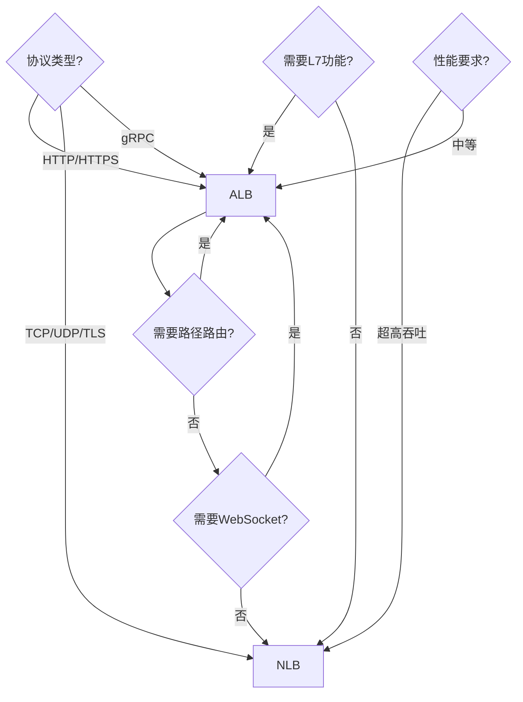
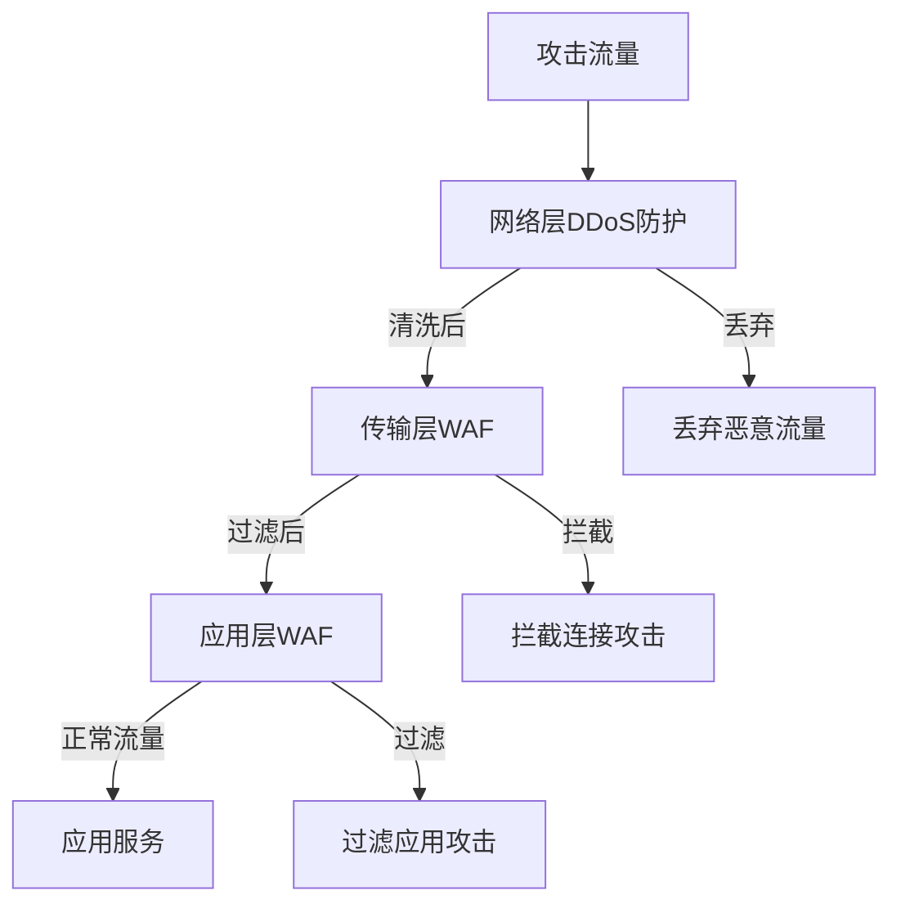

# 云网络与流量接入体系（LB / CDN / DNS / API 网关 / 服务网格）

> 流量从公网到应用的「最后一公里」：负载均衡、加速、DNS 解析、API 治理、服务间通信——云上全有托管服务。本篇按「解决的问题 → 原理 → 特性 → 选型关注点」拆解。

---

## 一、云服务流量接入全景

```
公网用户 → DNS(Route53/Cloud DNS) → CDN(CloudFront/阿里云CDN)
    → DDoS(Shield/高防) → WAF → 负载均衡(ALB/NLB/SLB)
        → API Gateway → Service Mesh(Istio/Linkerd) → 微服务 Pod/VM
```

> 核心认知：**云上网络是分层解耦的**——DNS 做流量调度、CDN 做边缘加速、LB 做四层/七层分发、API Gateway 做 API 治理、Service Mesh 做服务间通信，每层独立选型。

---

## 二、负载均衡（LB）

### 2.1 解决的问题

多台服务器分担流量、健康检查自动摘除故障节点、SSL 终止、跨可用区分发。

### 2.2 原理（四层 vs 七层）

| 层级 | 工作层 | 转发依据 | 代表服务 |
|------|--------|----------|----------|
| L4 负载均衡 | TCP/UDP | 源 IP+Port、目标 IP+Port | NLB / 阿里云 SLB(TCP) |
| L7 负载均衡 | HTTP/HTTPS | URL 路径、Header、Cookie、Host | ALB / 阿里云 SLB(HTTP) |

### 2.3 各云托管服务

| 服务 | 厂商 | 层级 | 关键点 |
|------|------|------|--------|
| ALB | AWS | L7 | 基于路径/主机路由、与 ECS/EKS 集成 |
| NLB | AWS | L4 | 超低延迟、静态 IP、百万级并发 |
| Azure Load Balancer | Azure | L4/L7 | Basic/Standard、与 VMSS 集成 |
| GCP Global LB | GCP | L4/L7 | 单 Anycast IP 全球负载、与 GKE 集成 |
| 阿里云 SLB | 阿里云 | L4/L7 | 传统负载均衡、与 ECS/ACK 集成 |
| 腾讯云 CLB | 腾讯云 | L4/L7 | 传统负载均衡、与 CVM/TKE 集成 |

**选型关注点**：HTTP 路由（路径/主机）→ L7 ALB/CLB；超低延迟/TCP 长连接 → L4 NLB；全球单 IP 接入 → GCP Global LB / AWS Global Accelerator。

---

## 三、CDN（内容分发网络）

### 3.1 解决的问题

静态资源（图片/视频/JS/CSS）跨地域访问慢 → 缓存到边缘节点，用户就近命中。

### 3.2 原理

- **边缘节点**：全球数百~数千节点，缓存用户请求的内容
- **回源**：缓存未命中时回源站拉取并缓存
- **动态加速**：通过路由优化/协议优化（QUIC/BBR）加速动态请求

| 服务 | 厂商 | 关键点 |
|------|------|--------|
| CloudFront | AWS | 与 S3/ALB/Lambda@Edge 集成、全球边缘 |
| Azure CDN | Azure | 与 Blob/Storage 集成、动态站点加速 |
| GCP Cloud CDN | GCP | 与 Global LB/Cloud Storage 集成 |
| 阿里云 CDN | 阿里云 | 国内节点最多、与 OSS 集成 |
| 腾讯云 CDN | 腾讯云 | 国内节点多、与 COS 集成 |
| Cloudflare | 多云 | 全球边缘、免费档慷慨、DDoS+WAF+CDN 三合一 |

**选型关注点**：国内用户为主 → 国内云 CDN（节点多）；全球业务 → CloudFront/Cloudflare；安全融合 → Cloudflare（CDN+WAF+DDoS 一体）。

---

## 四、DNS 与全局流量管理

### 4.1 解决的问题

域名解析 + 跨地域/跨云流量调度 + 健康检查自动故障转移。

### 4.2 原理

- **托管 DNS**：高可用 Anycast DNS 托管
- **路由策略**：简单/加权/延迟/地理位置/故障转移/多值应答
- **健康检查**：探测端点健康，自动切换路由

| 服务 | 厂商 | 关键点 |
|------|------|--------|
| Route 53 | AWS | 与 AWS 生态集成、延迟/地理位置路由、域名注册 |
| Azure DNS | Azure | 与 Azure 资源集成、Alias 记录 |
| Cloud DNS | GCP | 与 GCP 资源集成、100% SLA |
| 阿里云云解析 | 阿里云 | 国内解析、与 SLB/OSS 集成 |
| 腾讯云 DNSPod | 腾讯云 | 国内解析、与 CLB 集成 |

**选型关注点**：多活/跨云流量调度 → Route 53（路由策略最丰富）；国内解析 → 阿里云/腾讯云；与 CDN 联动 → 原生 DNS。

---

## 五、API 网关

### 5.1 解决的问题

微服务 API 的统一入口：路由、鉴权、限流、灰度、协议转换、监控——不用每个服务各写一套。

### 5.2 原理

- **托管网关**：云平台托管的 API 网关，后端对接 Lambda/HTTP/微服务
- **插件链**：请求经过鉴权→限流→路由→协议转换→后端

| 服务 | 厂商 | 关键点 |
|------|------|--------|
| API Gateway | AWS | REST/WebSocket/HTTP API、Lambda 集成、使用计划/限流 |
| Azure API Management | Azure | 开发者门户、策略引擎、与 AD 集成 |
| GCP API Gateway / Apigee | GCP | 托管网关 + API 生命周期管理（Apigee） |
| 阿里云 API 网关 | 阿里云 | 与 FC/微服务集成、插件市场 |
| 腾讯云 API 网关 | 腾讯云 | 与 SCF/微服务集成 |
| Kong / APISIX | 多云 | 开源网关，云上可托管（Kong Konnect/APISIX Cloud） |

**选型关注点**：Serverless（Lambda/FC 后端）→ 原生 API Gateway（AWS API Gateway/阿里云 API 网关）；复杂 API 生命周期管理 → Apigee/Azure APIM；多云/混合云 → Kong/APISIX（开源可移植）。

---

## 六、服务网格（Service Mesh）

### 6.1 解决的问题

微服务间通信（服务发现、负载均衡、熔断、mTLS、可观测）不用写 SDK → 下沉到 Sidecar 代理。

### 6.2 原理

- **数据面**：Envoy Sidecar 代理所有进出 Pod 流量
- **控制面**：下发路由/安全/观测配置（xDS 协议）
- **mTLS**：服务间自动双向认证加密

| 服务 | 厂商 | 关键点 |
|------|------|--------|
| AWS App Mesh | AWS | Envoy-based、与 ECS/EKS/Fargate 集成 |
| Istio on AKS / Istio on Azure | Azure | 托管 Istio 控制面 |
| Anthos Service Mesh | GCP | 基于 Istio、跨集群/多云 |
| 阿里云 ASM | 阿里云 | 托管 Istio、与 ACK 集成 |
| 腾讯云 TCM | 腾讯云 | 托管 Istio、与 TKE 集成 |
| Istio（开源） | 多云 | 事实标准、自托管或托管 |

**选型关注点**：K8s 集群 → 托管 Istio（ASM/TCM/Anthos）；非 K8s（ECS/VM）→ App Mesh；多云 → Istio 开源（可移植）。

---

## 七、云联网（跨 VPC / 跨云 / 混合云）

| 服务 | 厂商 | 关键点 |
|------|------|--------|
| AWS Transit Gateway | AWS | 多 VPC 中心辐射互联、跨账号 |
| Azure VNet Peering / vWAN | Azure | VPC 对等互联、虚拟 WAN |
| GCP VPC / Network Connectivity Center | GCP | VPC 对等、混合互联 |
| 阿里云 CEN | 阿里云 | 跨 VPC/跨账号/跨地域骨干网 |
| 腾讯云联网 | 腾讯云 | 跨 VPC 互联 |
| 专线 | 各云 | Direct Connect/Express Connect/云专线（物理专线混合云） |

**解决的问题**：多 VPC/跨账号/跨云网络互通、混合云（本地 IDC ↔ 云）。

**选型关注点**：多 VPC 互联 → 云联网/CEN/Transit Gateway；混合云 → 专线 + VPN 备份。

---

## 八、选型速查

| 需求 | 首选 | 备选 |
|------|------|------|
| HTTP 路由 + 微服务 | ALB / SLB(L7) | API Gateway |
| TCP 长连接/超低延迟 | NLB / SLB(L4) | — |
| 全球单 IP 接入 | GCP Global LB | AWS Global Accelerator |
| 静态加速 | CloudFront / CDN | Cloudflare |
| 国内加速 | 阿里云/腾讯云 CDN | Cloudflare 中国 |
| 跨云流量调度 | Route 53 | Cloudflare |
| API 治理 | API Gateway / APIM | Kong/APISIX |
| 服务间通信安全 | Istio (ASM/TCM/Anthos) | Linkerd |
| 混合云 | 专线 + VPN | SD-WAN |

---

## 九、AWS VPC 深入

### 9.1 VPC 核心组件

| 组件 | 说明 | 作用 |
|------|------|------|
| 子网 | VPC 内的 IP 地址段 | 隔离不同工作负载 |
| 路由表 | 路由规则集合 | 控制流量走向 |
| NACL | 子网级无状态防火墙 | 批量访问控制 |
| 安全组 | 实例级有状态防火墙 | 精细访问控制 |
| NAT 网关 | 私有子网访问公网 | 出站流量 |
| Internet 网关 | 公网出入站 | 入站流量 |
| VPC Endpoint | 私有连接到云服务 | 避免公网流量 |

### 9.2 子网规划

```
VPC CIDR: 10.0.0.0/16

子网规划：
  公有子网 AZ-a: 10.0.1.0/24  (254 IPs, ALB/NAT)
  公有子网 AZ-b: 10.0.2.0/24
  私有子网 AZ-a: 10.0.10.0/24 (应用层)
  私有子网 AZ-b: 10.0.20.0/24
  数据子网 AZ-a: 10.0.100.0/24 (DB/缓存)
  数据子网 AZ-b: 10.0.200.0/24

最佳实践：
  至少 2 个 AZ（高可用）
  公有子网放 ALB/NAT
  私有子网放应用
  数据子网放数据库（无公网路由）
```

### 9.3 NACL vs 安全组

| 维度 | NACL | 安全组 |
|------|------|--------|
| 层级 | 子网级 | 实例级 |
| 状态 | 无状态 | 有状态 |
| 规则 | ALLOW + DENY | 仅 ALLOW |
| 优先级 | 规则号（数字小优先） | 所有规则同时生效 |
| 性能 | 高（批量过滤） | 中（实例级） |
| 适用 | 子网级批量控制 | 实例级精细控制 |

### 9.4 路由表配置

```yaml
# 路由表规则
route_tables:
  public:
    - destination: 0.0.0.0/0
      target: internet-gateway
    - destination: 10.0.0.0/16
      target: local
  private:
    - destination: 0.0.0.0/0
      target: nat-gateway
    - destination: 10.0.0.0/16
      target: local
  database:
    - destination: 10.0.0.0/16
      target: local
    # 无互联网路由
```

---

## 十、Azure VNet 深入

### 10.1 VNet 核心概念

| 概念 | 说明 |
|------|------|
| VNet | 虚拟网络（类似 AWS VPC） |
| 子网 | VNet 内的 IP 段 |
| NSG | 网络安全组（类似 AWS 安全组） |
| UDR | 用户定义路由（自定义路由表） |
| VNet Peering | VNet 对等互联 |
| Service Endpoint | 私有连接到 Azure 服务 |
| Private Link | 私有端点（内部 IP） |

### 10.2 Azure VNet vs AWS VPC

| 维度 | Azure VNet | AWS VPC |
|------|-----------|---------|
| CIDR 限制 | /8 到 /29 | /16 到 /28 |
| 子网大小 | 最小 /29 | 最小 /28 |
| 安全组 | NSG（子网+实例） | 安全组（实例级） |
| NACL | 无原生（用 NSG） | 有原生 NACL |
| 对等互联 | VNet Peering | VPC Peering |

---

## 十一、GCP VPC 深入

### 11.1 GCP VNet 特点

| 特性 | 说明 |
|------|------|
| 全球 VPC | 单个 VPC 跨所有区域 |
| 自动子网 | 按区域自动分配子网 |
| 共享 VPC | 多项目共享网络 |
| 私有 Google 访问 | 无需公网访问 GCP 服务 |
| VPC Service Controls | 数据安全边界 |

### 11.2 GCP VPC 路由

```
GCP VPC 路由类型：
  系统路由：自动创建（子网路由）
  静态路由：手动创建
  动态路由：Cloud Router（BGP）

Cloud Router 用途：
  VPN 连接（动态路由）
  混合云（专线+动态路由）
  跨区域路由
```

---

## 十二、云 VPN 深入

### 12.1 Site-to-Site VPN

| 维度 | AWS VPN | Azure VPN | GCP VPN |
|------|---------|-----------|---------|
| 协议 | IPSec | IPSec | IPSec |
| 可用性 | 双隧道 | 双隧道 | 双隧道 |
| 带宽 | 1.25 Gbps | 10 Gbps | 3 Gbps |
| 动态路由 | 支持 | 支持 | 支持 |
| BGP | 支持 | 支持 | 支持 |

### 12.2 Client-to-Site VPN

```
Client VPN 方案：
  AWS：Client VPN（托管）
  Azure：Point-to-Site VPN
  GCP：Cloud VPN Client

配置要素：
  协议：OpenVPN / IKEv2
  认证：证书 / SAML / AD
  分割隧道：仅访问云内流量走 VPN
  DNS：推送云内 DNS
```

---

## 十三、云互联（Direct Connect / ExpressRoute）

### 13.1 专线服务对比

| 维度 | AWS Direct Connect | Azure ExpressRoute | GCP Cloud Interconnect |
|------|-------------------|-------------------|----------------------|
| 类型 | 物理专线 | 物理专线 | 物理专线/Partner |
| 带宽 | 1~100 Gbps | 50 Mbps~100 Gbps | 1~100 Gbps |
| 延迟 | 低（专线） | 低（专线） | 低（专线） |
| 可用性 | 多路径冗余 | 多路径冗余 | 多路径冗余 |
| 适用 | 混合云/大流量 | 混合云/大流量 | 混合云/大流量 |

### 13.2 专线 vs VPN

| 维度 | 专线 | VPN |
|------|------|-----|
| 带宽 | 高（100Gbps） | 中（10Gbps） |
| 延迟 | 低 | 中 |
| 成本 | 高（物理专线） | 低 |
| 可靠性 | 高（冗余） | 中（加密） |
| 适用 | 大规模混合云 | 小规模/临时 |

---

## 十四、云 NAT 深入

### 14.1 NAT 类型

| 类型 | 说明 | 适用 |
|------|------|------|
| NAT 网关 | 托管 NAT（高可用） | 生产环境 |
| NAT 实例 | EC2 实例做 NAT | 测试/低成本 |
| 云 NAT | 托管 NAT（多云） | 生产环境 |

### 14.2 NAT 最佳实践

| 实践 | 说明 |
|------|------|
| 多 AZ | 每个 AZ 一个 NAT |
| 高可用 | NAT 网关自动冗余 |
| 成本 | 非关键用 NAT 实例 |
| 安全 | 限制出站端口/目标 |
| 监控 | 监控连接数/流量 |

---

## 十五、云网络监控

### 15.1 监控指标

| 指标 | 说明 | 告警阈值 |
|------|------|----------|
| 入站流量 | 公网入站带宽 | >80% |
| 出站流量 | 公网出站带宽 | >80% |
| 连接数 | 并发连接数 | >80% |
| 数据包丢失 | 丢包率 | >0.1% |
| 延迟 | 端到端延迟 | >100ms |

### 15.2 监控工具

| 工具 | 厂商 | 说明 |
|------|------|------|
| VPC Flow Logs | AWS | 网络流量日志 |
| Network Watcher | AWS | 网络诊断 |
| Network Insights | AWS | 流量分析 |
| Network Watcher | Azure | 网络监控 |
| Network Intelligence | GCP | 网络分析 |

---

## 十六、云网络安全深入

### 16.1 零信任网络

| 原则 | 说明 |
|------|------|
| 永不信任 | 所有请求都验证 |
| 始终验证 | 身份+设备+上下文 |
| 最小权限 | 仅授予必要访问 |
| 微分段 | 隔离工作负载 |
| 持续监控 | 实时检测异常 |

### 16.2 网络安全最佳实践

| 实践 | 说明 |
|------|------|
| 最小开放 | 安全组只开必要端口 |
| VPC 隔离 | 不同环境用独立 VPC |
| WAF | 应用层防护 |
| DDoS | 基础防护+高防 |
| TLS | 传输加密（1.2+） |
| mTLS | 服务间双向认证 |
| 网络策略 | K8s NetworkPolicy |

---

## 补充：云网络深度解析

### 1. AWS ALB/NLB/CLB 深度

| 特性 | ALB | NLB | CLB |
|------|-----|-----|-----|
| 层级 | L7 | L4 | L4/L7 |
| 协议 | HTTP/HTTPS | TCP/UDP/TLS | TCP/UDP/HTTP |
| 延迟 | 低 | 极低 | 低 |
| 静态IP | 无 | 有 | 有 |
| WebSocket | 支持 | 支持 | 支持 |
| gRPC | 支持 | 支持 | 不支持 |
| 价格 | 中 | 高 | 中 |

### 2. Azure Application Gateway

| 特性 | 说明 |
|------|------|
| 层级 | L7 |
| WAF集成 | 内置WAF |
| 路径路由 | 基于URL路径 |
| 会话保持 | 基于Cookie |
| SSL终止 | 支持 |

### 3. GCP Cloud Load Balancing

| 特性 | 说明 |
|------|------|
| 全球LB | 单Anycast IP |
| 内部LB | VPC内部负载 |
| SSL策略 | 自定义SSL |
| 健康检查 | HTTP/TCP/gRPC |

### 4. Cloud CDN

| 服务 | 说明 |
|------|------|
| CloudFront | AWS全球CDN |
| Azure CDN | Azure全球CDN |
| Cloud CDN | GCP全球CDN |
| 阿里云CDN | 国内节点最多 |

### 5. Cloud WAF

| 服务 | 说明 |
|------|------|
| AWS WAF | 与ALB/CloudFront集成 |
| Azure WAF | 与App Gateway/Front Door集成 |
| Cloud Armor | GCP与Global LB集成 |
| 阿里云WAF | 国内等保合规 |

### 6. Cloud DDoS Protection

| 服务 | 说明 |
|------|------|
| Shield Standard | AWS免费基础防护 |
| Shield Advanced | AWS高级防护 |
| DDoS Protection | Azure标准防护 |
| Cloud Armor | GCP边缘防护 |

### 7. Cloud DNS

| 服务 | 说明 |
|------|------|
| Route 53 | AWS托管DNS |
| Azure DNS | Azure托管DNS |
| Cloud DNS | GCP托管DNS |
| 云解析 | 阿里云托管DNS |

### 8. Cloud VPC Networking Patterns

| 模式 | 说明 |
|------|------|
| 单VPC | 简单架构 |
| 多VPC | 环境隔离 |
| 混合云 | 专线+VPN |
| 多云 | 跨云互联 |

### 9. 云网络最佳实践

| 实践 | 说明 |
|------|------|
| 分层解耦 | 每层独立选型 |
| 最小开放 | 安全组只开必要端口 |
| 多活高可用 | 跨AZ/跨地域部署 |
| 零信任 | mTLS+身份认证 |
| 可观测 | 链路追踪+指标监控 |

### 10. 云网络成本优化

| 策略 | 说明 |
|------|------|
| CDN缓存 | 减少回源流量 |
| 压缩 | Gzip/Brotli压缩 |
| 长连接 | 减少连接建立开销 |
| 按量付费 | 波动流量用按量 |

### 11. 云网络监控

| 指标 | 说明 |
|------|------|
| 入站/出站流量 | 带宽使用 |
| 连接数 | 并发连接数 |
| 请求延迟 | 端到端延迟 |
| 错误率 | 5xx/4xx错误比例 |

### 12. 云网络架构模式

| 模式 | 说明 |
|------|------|
| 前端代理 | CDN+LB+WAF |
| 微服务入口 | LB+API Gateway |
| 服务网格 | Istio+Envoy |
| 混合云 | 专线+VPN |

### 13. 云网络团队职责

| 角色 | 职责 |
|------|------|
| 网络架构师 | 网络架构设计 |
| 网络工程师 | 网络设备配置 |
| 安全工程师 | 网络安全策略 |
| SRE | 网络监控运维 |

### 14. 云网络未来趋势

| 趋势 | 说明 |
|------|------|
| SD-WAN | 软件定义广域网 |
| SASE | 安全访问服务边缘 |
| 零信任网络 | 持续验证 |
| 网络自动化 | 自动化运维 |

### 15. 云网络选型决策

| 场景 | 推荐方案 |
|------|----------|
| Web应用 | CDN+ALB+WAF |
| TCP应用 | NLB |
| 全球化 | 全球LB+CDN |
| 混合云 | 专线+VPN |

### 16. 云网络最佳实践清单

| 实践 | 说明 |
|------|------|
| 最小开放 | 安全组只开必要端口 |
| VPC隔离 | 不同环境用独立VPC |
| WAF | 应用层防护 |
| DDoS | 基础防护+高防 |

---

## 十七、与其他板块的关系

- API 网关原理见「[API 网关](./API网关.md)」；
- Nginx/负载均衡原理见「[Nginx](./Nginx.md)」；
- 服务网格原理见「[云原生/Service Mesh](../../云原生/ServiceMesh.md)」；
- 云上中间件总览见「[云上中间件体系总览](./云上中间件体系总览.md)」。

---

## 十、云网络最佳实践

### 10.1 安全分层

| 层 | 实践 |
|----|------|
| 边缘层 | CDN + DDoS + WAF（拦截恶意流量） |
| 接入层 | LB + API Gateway（路由 + 鉴权 + 限流） |
| 服务层 | Service Mesh（mTLS + 流量治理） |
| 数据层 | VPC 隔离 + 安全组（最小开放） |

### 10.2 高可用设计

| 实践 | 说明 |
|------|------|
| 多可用区 LB | 跨 AZ 部署负载均衡 |
| 多区域 DNS | 延迟/地理位置路由 |
| 健康检查 | 自动故障转移 |
| 优雅降级 | 限流/熔断/降级兜底 |

### 10.3 成本优化

| 实践 | 说明 |
|------|------|
| CDN 缓存 | 减少回源流量 |
| 压缩 | Gzip/Brotli 压缩传输 |
| 长连接 | 减少连接建立开销 |
| 按量付费 | 波动流量用按量 |

---

## 十一、云网络监控指标

| 指标 | 说明 |
|------|------|
| 入站/出站流量 | 带宽使用 |
| 连接数 | 并发连接数 |
| 请求延迟 | 端到端延迟 |
| 错误率 | 5xx/4xx 错误比例 |
| 健康检查 | 后端实例健康状态 |

---

## 十二、云网络常见问题排查

| 问题 | 原因 | 解决 |
|------|------|------|
| 502/503 | 后端不可达 | 检查安全组/路由 |
| 延迟高 | 跨地域访问 | CDN/就近接入 |
| 连接数满 | LB 规格不足 | 升级 LB 规格 |
| 证书过期 | 未自动续期 | 配置 ACM 自动续期 |

---

## 十三、云网络架构设计原则

| 原则 | 说明 |
|------|------|
| 分层解耦 | 每层独立选型和扩展 |
| 最小开放 | 安全组只开必要端口 |
| 多活高可用 | 跨 AZ/跨地域部署 |
| 零信任 | mTLS + 身份认证 |
| 可观测 | 链路追踪 + 指标监控 |

---

## 十四、Service Mesh vs API Gateway

| 维度 | Service Mesh | API Gateway |
|------|--------------|-------------|
| 位置 | 服务间通信 | 边缘入口 |
| 功能 | mTLS/流量治理/可观测 | 路由/鉴权/限流 |
| 性能 | 有 Sidecar 开销 | 无额外开销 |
| 适用 | K8s 微服务 | 外部 API 管理 |

---

## 十五、云网络架构设计模式

| 模式 | 说明 | 适用场景 |
|------|------|----------|
| 前端代理 | CDN + LB + WAF | Web 应用 |
| 微服务入口 | LB + API Gateway | 微服务架构 |
| 服务网格 | Istio + Envoy | K8s 微服务 |
| 混合云 | 专线 + VPN | 本地 + 云 |

---

## 十六、云网络安全最佳实践

| 实践 | 说明 |
|------|------|
| 最小开放 | 安全组只开必要端口 |
| VPC 隔离 | 不同环境用独立 VPC |
| WAF | 应用层防护 |
| DDoS | 基础防护+高防 |
| TLS | 传输加密（1.2+） |

---

## 十七、云网络成本优化

| 策略 | 说明 |
|------|------|
| CDN 缓存 | 减少回源流量（省 30-50%） |
| 压缩 | Gzip/Brotli（省 40-60%） |
| 长连接 | 减少连接建立开销 |
| 按量付费 | 波动流量用按量 |
| 预留实例 | 稳定流量用预留 |

---

## 十八、云网络监控告警

| 指标 | 告警阈值 |
|------|----------|
| 入站流量 | >80% 带宽 |
| 连接数 | >80% 最大连接 |
| 延迟 | >1s |
| 错误率 | >1% |
| 健康检查 | DOWN |

---

## 十四、NLB vs ALB 决策树



| 维度 | NLB | ALB |
|------|-----|-----|
| 层级 | L4 | L7 |
| 协议 | TCP/UDP/TLS | HTTP/HTTPS/gRPC/WebSocket |
| 延迟 | <10ms | <50ms |
| 吞吐 | 极高 | 高 |
| 路由 | 基于IP:Port | 基于域名/路径/Header |
| SSL终止 | 支持 | 支持 |
| WebSocket | 不支持 | 支持 |
| 适用 | 游戏/数据库/高吞吐 | Web应用/API |

## 十五、Application Gateway WAF 集成

### 15.1 WAF 规则模式

| 模式 | 说明 | 适用 |
|------|------|------|
| DetectionOnly | 仅检测不拦截 | 初期观察 |
| Prevention | 检测+拦截 | 生产环境 |
| Custom | 自定义规则 | 精细化控制 |

### 15.2 WAF 规则配置

```yaml
# Azure Application Gateway WAF
resources:
  wafPolicy:
    type: Microsoft.Network/ApplicationGatewayWebApplicationFirewallPolicies
    properties:
      policySettings:
        mode: Prevention
        state: Enabled
      managedRules:
        managedRuleSets:
          - ruleSetType: OWASP
            ruleSetVersion: '3.2'
```

## 十六、GCP 负载均衡差异

| 类型 | 前端 | 后端 | 适用 |
|------|------|------|------|
| HTTP(S) LB | HTTP/HTTPS | VM/容器 | Web应用 |
| TCP/UDP LB | TCP/UDP | VM | 非HTTP协议 |
| Internal LB | TCP/UDP | VM | 内部服务 |
| SSL Proxy | SSL/TLS | VM | SSL终结 |
| TCP Proxy | TCP | VM | TCP代理 |

## 十七、CDN 缓存策略

### 17.1 缓存层级

```text
用户 → 边缘节点 → 区域节点 → 源站
       ↓          ↓           ↓
     缓存命中   缓存命中    回源获取
```

### 17.2 缓存配置

| 配置项 | 说明 | 推荐值 |
|--------|------|--------|
| TTL | 缓存过期时间 | 静态资源: 7天 |
| Cache-Control | 浏览器缓存 | public, max-age=31536000 |
| Vary | 缓存键 | Accept-Encoding |
| Purge | 缓存清除 | 支持URL/Tag清除 |

## 十八、DDoS 分层防护

| 层级 | 防护目标 | 工具 |
|------|----------|------|
| 网络层 | SYN/UDP Flood | 云DDoS防护 |
| 传输层 | 连接耗尽 | WAF/LB |
| 应用层 | CC攻击/慢速攻击 | WAF规则 |
| DNS层 | DNS放大/NXDOMAIN | DNS防护 |



## 十九、Transit Gateway 跨VPC互联

| 方案 | 适用 | 复杂度 |
|------|------|--------|
| VPC Peering | 两个VPC | 低 |
| Transit Gateway | 多VPC互联 | 中 |
| Cloud WAN | 跨地域多VPC | 高 |
| SD-WAN | 混合云 | 高 |

```yaml
# AWS Transit Gateway
Resources:
  TransitGateway:
    Type: AWS::EC2::TransitGateway
    Properties:
      DefaultAssociationRouteTableId: main
      DefaultPropagationRouteTableId: main
      AutoAcceptSharedAttachments: enable

  VPCAttachment:
    Type: AWS::EC2::TransitGatewayVpcAttachment
    Properties:
      TransitGatewayId: !Ref TransitGateway
      VpcId: !Ref VPC
      SubnetIds:
        - !Ref PrivateSubnet1
        - !Ref PrivateSubnet2
```

---

> 一句话：**云网络 = 分层解耦（DNS→CDN→DDoS→WAF→LB→API Gateway→Mesh）；选型按「流量从哪来（公网/内网）、什么协议（HTTP/TCP）、治理深度（路由/mTLS/生命周期）」逐层匹配托管服务。**
