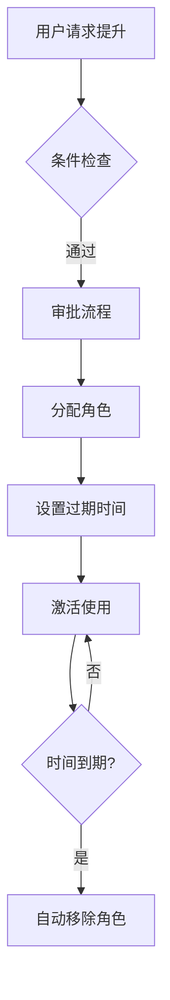
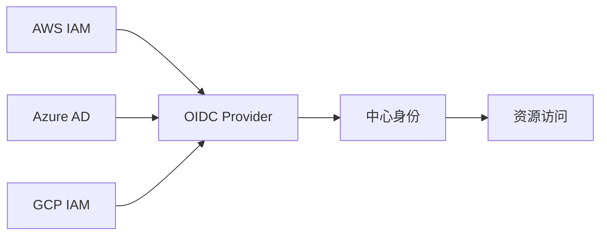
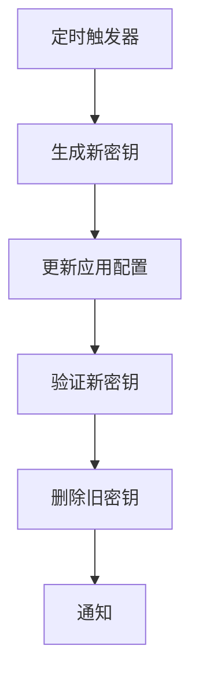
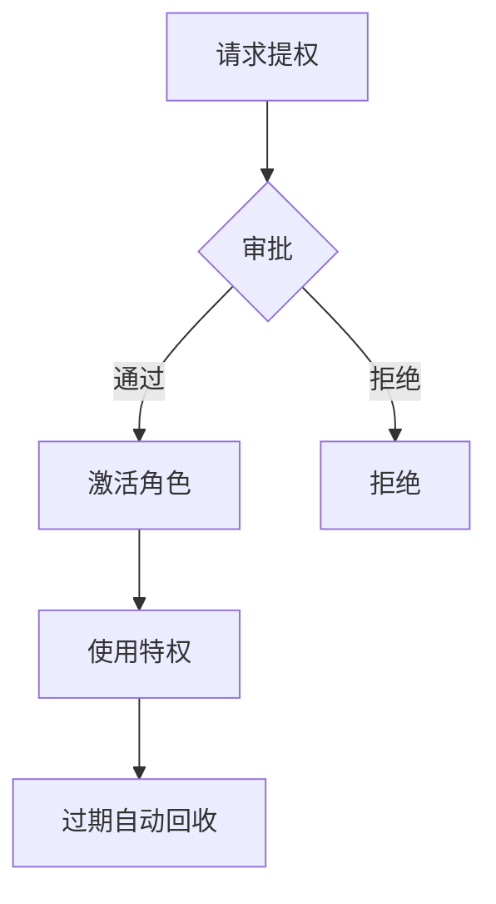
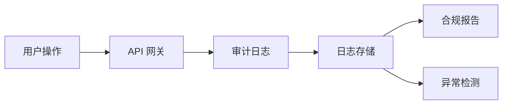
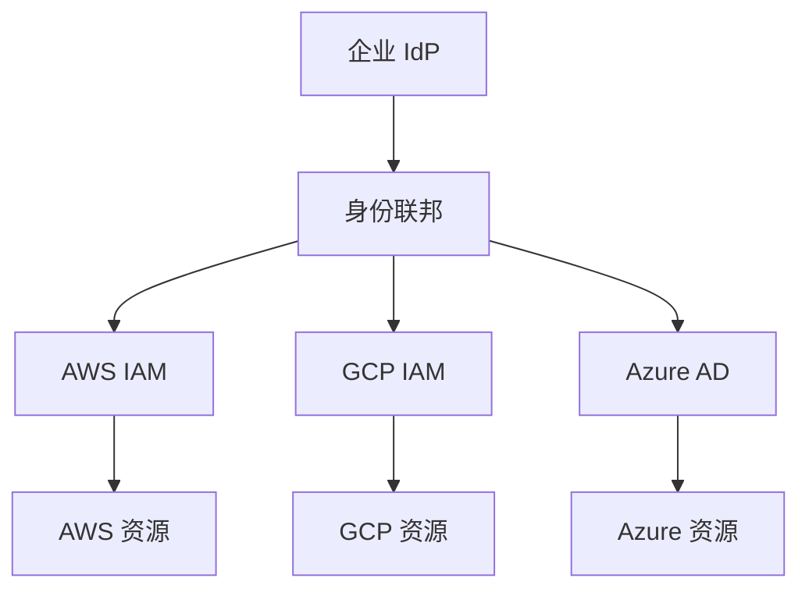

# 云身份与访问管理体系（IAM / SSO / 权限治理）

> 身份与访问管理（IAM）是云安全的基石：谁（身份）能访问什么（资源）、在什么条件下（策略）、怎么证明（认证）。云厂商把 IAM 做成托管服务，提供 RBAC/ABAC、临时凭证、SSO、多账号治理。本篇按「解决的问题 → 原理 → 特性 → 选型关注点」拆解。

---

## 一、IAM 的核心概念（所有云通用）

| 概念 | 说明 |
|------|------|
| 身份（Principal） | 人（用户/角色）或应用（服务账号/Workload Identity） |
| 认证（Authentication） | 证明「你是谁」：密码、MFA、OIDC/SAML 联邦、临时密钥 |
| 授权（Authorization） | 证明「你能做什么」：策略（Policy）绑定到身份 |
| 策略（Policy） | JSON/结构化文档：Effect + Action + Resource + Condition |
| 角色（Role） | 可被「扮演（Assume）」的身份，用于临时授权、跨账号访问 |
| 临时凭证 | STS 颁发的短期 AccessKey/Token（分钟~小时级），自动过期 |
| 权限边界（Permission Boundary） | 角色最大权限上限（防过度授权） |
| 条件键（Condition Key） | 基于 IP/时间/标签/身份等条件的动态策略 |

> 核心认知：**云上 IAM 的威力在于「临时凭证 + 最小权限」**——不再用长期 AK/SK，一切权限动态授予、自动过期。

---

## 二、AWS IAM（业界标杆）

### 2.1 解决的问题

多员工、多服务、多账号场景下，权限怎么管？怎么避免一个泄露全完蛋？

### 2.2 原理

- **身份**：User（人）、Role（角色/服务）、Group（用户组）
- **策略**：Identity-based（绑定身份）、Resource-based（绑定资源，如 S3 Bucket Policy）、Permission Boundary（权限边界）、SCP（组织级服务控制策略）
- **AssumeRole**：一个身份「扮演」另一个角色，获取临时凭证（STS）
- **IAM Role for Service Accounts（IRSA）**：EKS Pod 自动获取角色凭证（OIDC 联邦）
- **IAM Roles Anywhere**：非 AWS 工作负载（本地/其他云）获取临时凭证

| 特性 | 说明 |
|------|------|
| 最小权限 | 策略模拟器（Policy Simulator）验证权限边界 |
| 临时凭证 | STS 颁发，默认 1 小时，可自定义 |
| 多账号治理 | AWS Organizations + SCP（服务控制策略）统一管控 |
| 身份联邦 | 支持 SAML 2.0 / OIDC / 自定义身份代理 |
| Access Analyzer | 自动分析谁可以访问什么，发现过度授权 |
| IAM Access Analyzer | 跨账号访问分析 + 资源策略验证 |
| 条件键 | 100+ 条件键（aws:SourceIp, aws:RequestedRegion 等） |

**选型关注点**：策略复杂度爆炸 → 用 Permission Boundary + SCP 分层治理；跨账号访问 → AssumeRole；K8s 工作负载 → IRSA（避免静态 AK）。

### 2.3 AWS IAM 策略示例

```json
{
  "Version": "2012-10-17",
  "Statement": [
    {
      "Effect": "Allow",
      "Action": "s3:GetObject",
      "Resource": "arn:aws:s3:::my-bucket/*",
      "Condition": {
        "StringEquals": {"s3:ExistingObjectTag/environment": "prod"},
        "IpAddress": {"aws:SourceIp": "10.0.0.0/8"}
      }
    }
  ]
}
```

---

## 三、Azure IAM（Entra ID + RBAC）

### 3.1 解决的问题

企业已有 Active Directory，上云后怎么统一身份？云资源权限怎么管？

### 3.2 原理

- **Microsoft Entra ID**（原 Azure AD）：云身份服务，与本地 AD 同步（Entra Connect）
- **Azure RBAC**：角色分配（Role Assignment）= 身份 + 角色定义 + 范围（Subscription/Resource Group/Resource）
- **Managed Identity**：Azure 资源自动获取身份凭证（无需手动管理密钥）
- **Privileged Identity Management（PIM）**：即时（JIT）权限激活 + 审批 + 审计
- **Conditional Access**：基于位置/设备/风险等级的访问控制
- **Entra ID Governance**：访问评审 + 权限生命周期管理

| 特性 | 说明 |
|------|------|
| 与 AD 同步 | 本地 AD 用户/组同步到云，统一身份源 |
| 条件访问 | 基于位置/设备/风险等级的访问控制 |
| 托管身份 | VM/App Service/Function 自动获取凭证 |
| 自定义角色 | 内置角色不满足时自定义权限集 |
| PIM | 即时权限激活，防止长期过度授权 |
| 权限评审 | 定期评审角色分配，自动移除未使用权限 |

**选型关注点**：已有 Windows/AD 企业 → Azure 身份生态最顺滑；云原生应用 → Managed Identity（免密钥）；精细化权限 → PIM + 条件访问。

---

## 四、GCP IAM（Cloud IAM + Workload Identity）

### 4.1 解决的问题

Google 生态（Workspace + Cloud）身份统一，工作负载自动获取凭证。

### 4.2 原理

- **Cloud IAM**：角色（Primitive/Predefined/Custom）+ 策略绑定
- **Workload Identity**：K8s Service Account ↔ Google Service Account 联邦（无需 JSON 密钥）
- **Organization Policy**：组织级策略（如禁止公开 IP、限制区域）
- **BeyondCorp**：零信任访问（基于身份/设备而非网络位置）
- **IAM Recommender**：AI 驱动权限优化建议（收回未用权限）

| 特性 | 说明 |
|------|------|
| 层次结构 | Organization → Folder → Project → Resource，策略继承 |
| Workload Identity | GKE Pod 自动获取 GSA 凭证 |
| 条件 | 基于资源属性/时间/角色的动态策略 |
| Recommender | AI 驱动权限优化建议（收回未用权限） |
| deniedPremises | 防止 IAM 策略授予高于当前角色的权限 |

**选型关注点**：GKE 工作负载 → Workload Identity（最安全）；多组织层级 → 策略继承 + Organization Policy；权限优化 → Recommender 自动建议。

---

## 五、国内：阿里云 RAM / 腾讯云 CAM

### 5.1 阿里云 RAM（Resource Access Management）

- **身份**：RAM 用户、RAM 角色、用户组
- **策略**：授权策略（System/Custom）+ 权限边界 + 资源目录（多账号）
- **STS**：临时访问凭证（AssumeRole）
- **SSO**：与 IdP（企业身份源）联邦（SAML/OIDC）
- **RRSA**：ACK（K8s）Pod 自动获取 RAM 角色凭证（类似 AWS IRSA）
- **选型关注点**：国内业务 + 阿里云生态 → RAM 是标配；多账号 → 资源目录 + 管控策略。

### 5.2 腾讯云 CAM（Cloud Access Management）

- 类似 AWS IAM：用户/角色/策略/临时密钥
- 特性：角色载体（Role Entity）、策略语法（CAM Policy）、与 LDAP/AD 对对接
- **OIDC 联邦**：支持外部 IdP（如 GitHub/GitLab）联邦登录
- **选型关注点**：国内业务 + 腾讯云生态 → CAM。

---

## 六、身份联邦与 SSO（跨云/跨身份源）

| 协议/标准 | 说明 | 适用场景 |
|-----------|------|----------|
| SAML 2.0 | XML 断言，企业级 SSO | 企业 IdP（ADFS/Okta）→ 云 |
| OIDC | JSON Token（JWT），现代标准 | 社交登录、K8s 联邦、云间联邦 |
| OAuth 2.0 | 授权框架（非认证） | 第三方应用授权 |
| SCIM | 用户/组自动同步协议 | IdP → 云自动开通/禁用账号 |
| WS-Federation | XML 断言，旧标准 | 遗留系统 |

**选型关注点**：企业已有 IdP（AD/Okta）→ SAML/OIDC 联邦（不改身份源）；K8s 工作负载 → OIDC 联邦（IRSA/Workload Identity）；自动化账号生命周期 → SCIM。

### SSO 集成模式

```
模式一：IdP 联邦（推荐）
  企业 IdP（AD/Okta）→ SAML/OIDC → 云 IAM
  优点：身份源统一，离职自动回收权限
  缺点：依赖 IdP 可用性

模式二：本地账号
  云 IAM 直接创建用户
  优点：简单，无外部依赖
  缺点：多云需维护多套账号

模式三：社交登录
  GitHub/GitLab → OIDC → 云 IAM
  优点：开发者友好
  缺点：不适合企业级
```

---

## 七、密钥管理服务（KMS）

| 服务 | 厂商 | 关键点 |
|------|------|--------|
| AWS KMS | AWS | 托管密钥（CMK）、信封加密、自动轮换、HSM 支持 |
| Azure Key Vault | Azure | 密钥/证书/机密托管、HSM、软删除 |
| GCP Cloud KMS | GCP | 与 IAM 集成、自动轮换、信封加密 |
| 阿里云 KMS | 阿里云 | 托管密钥、信封加密、国密支持 |
| 腾讯云 KMS | 腾讯云 | 托管密钥、HSM、国密 |
| HashiCorp Vault | 多云 | 动态密钥、PKI、加密即服务 |

**解决的问题**：应用配置里硬编码密钥 → 托管到 KMS，信封加密（数据密钥加密数据，主密钥加密数据密钥）。

**选型关注点**：国密合规（SM2/SM4）→ 国内云 KMS；自动轮换 → 开启自动轮换；与云服务集成 → 原生 KMS（如 S3 SSE-KMS）；多云 → Vault。

---

## 八、权限治理最佳实践

| 实践 | 说明 |
|------|------|
| 最小权限原则 | 只授予完成工作所需的最小权限 |
| 定期审计 | 每季度 Review 角色分配，移除未使用权限 |
| 临时权限 | 用 PIM/JIT 获取临时权限，用完即收 |
| 权限边界 | 用 Permission Boundary 限制角色最大权限 |
| 标签策略 | 资源打标签（team/env/project），策略按标签授权 |
| 服务账号轮换 | 静态密钥定期轮换，优先用 Workload Identity |
| 异常检测 | 监控异常 API 调用（Access Analyzer/CloudTrail） |
| 多账号治理 | 用 Organizations/资源目录统一管控 |

---

## 九、选型速查

| 需求 | 首选 | 备选 |
|------|------|------|
| 单云权限治理 | 云厂商原生 IAM（IAM/RAM/CAM） | — |
| 多账号统一管控 | AWS Organizations / 阿里云资源目录 | — |
| 企业已有 IdP | SAML/OIDC 联邦 | SCIM 自动同步 |
| K8s 工作负载凭证 | IRSA / Workload Identity / 阿里云 RRSA | — |
| 密钥托管 | 云厂商 KMS | HashiCorp Vault（多云） |
| 零信任访问 | BeyondCorp / Azure 条件访问 | — |
| 多云身份统一 | Okta / Auth0（第三方 IdP） | 各云联邦到统一 IdP |
| 非 AWS 工作负载 | IAM Roles Anywhere | Vault |

---

## 十、AWS IAM 策略深入

### 10.1 Identity-based vs Resource-based

| 策略类型 | 绑定对象 | 适用场景 |
|----------|----------|----------|
| Identity-based | 用户/角色/组 | 赋予身份权限 |
| Resource-based | 资源（S3/Bucket） | 资源级访问控制 |
| Permission Boundary | 角色 | 限制最大权限 |
| SCP | 组织 | 组织级策略限制 |
| ACL | 资源 | 粗粒度访问控制 |

### 10.2 策略评估逻辑

```
IAM 策略评估流程：
  1. 收集所有适用策略（Identity + Resource + SCP + Permission Boundary）
  2. 默认 DENY（无显式 Allow 则拒绝）
  3. 显式 DENY 优先于 Allow
  4. Permission Boundary 限制上限

示例：
  Identity 策略：Allow s3:GetObject
  Resource 策略：Allow s3:GetObject on bucket-a
  Permission Boundary：Deny s3:DeleteObject
  → 结果：可以 GetObject on bucket-a，不能 DeleteObject
```

### 10.3 策略条件键深入

| Condition Key | 说明 | 示例 |
|---------------|------|------|
| aws:SourceIp | 来源 IP | 10.0.0.0/8 |
| aws:RequestedRegion | 请求区域 | us-east-1 |
| aws:CurrentTime | 当前时间 | 2024-01-01T00:00:00Z |
| aws:PrincipalTag | 主体标签 | team=backend |
| aws:PrincipalOrgID | 组织 ID | o-xxxxxxxx |
| s3:prefix | S3 前缀 | backups/ |
| ec2:ResourceTag | 资源标签 | env=prod |

---

## 十一、AWS STS 深入

### 11.1 AssumeRole 场景

| 场景 | 说明 |
|------|------|
| 跨账号访问 | Account A AssumeRole Account B 的角色 |
| 临时权限 | 给外部用户临时访问权限 |
| 工作负载身份 | EKS Pod 获取 IAM 角色（IRSA） |
| 联合身份 | SAML/OIDC 联合身份获取临时凭证 |

### 11.2 AssumeRole 配置

```json
{
  "Version": "2012-10-17",
  "Statement": [
    {
      "Effect": "Allow",
      "Action": "sts:AssumeRole",
      "Resource": "arn:aws:iam::ACCOUNT_B:role/CrossAccountRole",
      "Condition": {
        "StringEquals": {
          "sts:ExternalId": "unique-external-id"
        }
      }
    }
  ]
}
```

### 11.3 Web Identity Federation

```
Web Identity 流程：
  1. 用户登录外部 IdP（Google/GitHub/Apple）
  2. 获取 ID Token
  3. 调用 STS AssumeRoleWithWebIdentity
  4. 获取临时 AWS 凭证
  5. 使用临时凭证访问 AWS 资源

适用：
  - 移动应用访问 S3
  - 客户端直传 S3
  - 无需后端的临时授权
```

---

## 十二、Azure Managed Identities 深入

### 12.1 托管身份类型

| 类型 | 说明 | 适用 |
|------|------|------|
| System-assigned | 随 Azure 资源创建/删除 | 单一资源 |
| User-assigned | 独立创建，可分配给多个资源 | 多资源共享 |

### 12.2 托管身份工作原理

```
托管身份流程：
  1. Azure 资源启用托管身份
  2. Azure 自动创建服务主体
  3. Azure 内部管理凭证（用户无需管理）
  4. 资源获取 Token（本地 endpoint）
  5. 使用 Token 访问其他 Azure 服务

Token Endpoint：
  http://169.254.169.254/metadata/identity/oauth2/token
  ?api-version=2018-02-01
  &resource=https://management.azure.com/
```

### 12.3 托管身份最佳实践

| 实践 | 说明 |
|------|------|
| 优先使用 | 优先于服务主体密钥 |
| 最小权限 | 只授予必要 RBAC 角色 |
| 审计 | 监控 Token 获取日志 |
| 轮换 | 无需手动轮换（自动管理） |

---

## 十三、GCP Service Account Keys 深入

### 13.1 密钥类型

| 类型 | 说明 | 安全性 |
|------|------|--------|
| 用户管理密钥 | 手动创建/轮换 | 低 |
| 系统管理密钥 | GCP 自动轮换 | 高 |
| 永久密钥 | 不自动过期 | 低 |
| 临时密钥 | 限时有效 | 高 |

### 13.2 Workload Identity 深入

```yaml
# GKE Workload Identity 配置
apiVersion: v1
kind: ServiceAccount
metadata:
  name: my-app
  namespace: default
  annotations:
    iam.gke.io/gcp-service-account: my-app@project.iam.gserviceaccount.com
---
# GCP Service Account 绑定
gcloud iam service-accounts add-iam-policy-binding my-app@project.iam.gserviceaccount.com \
  --role=roles/iam.workloadIdentityUser \
  --member="serviceAccount:project.svc.id.goog[default/my-app]"
```

### 13.3 最佳实践

| 实践 | 说明 |
|------|------|
| Workload Identity | K8s Pod 绑定 GSA |
| 短期密钥 | 优先使用临时凭证 |
| 密钥轮换 | 定期轮换（90天） |
| 最小权限 | IAM 角色最小权限 |
| 审计 | 监控密钥使用 |

---

## 十四、云 IAM Condition Keys 深入

### 14.1 常用条件键

| 条件键 | 说明 | 使用场景 |
|--------|------|----------|
| aws:SourceIp | 来源 IP | IP 白名单 |
| aws:RequestedRegion | 目标区域 | 限制操作区域 |
| aws:CurrentTime | 当前时间 | 工作时间访问 |
| aws:PrincipalTag | 主体标签 | 基于标签授权 |
| aws:PrincipalOrgID | 组织 ID | 跨账号访问控制 |
| aws:PrincipalArn | 主体 ARN | 角色/用户限制 |
| s3:prefix | S3 前缀 | 目录级访问控制 |
| ec2:ResourceTag | 资源标签 | 基于标签授权 |

### 14.2 条件键示例

```json
{
  "Version": "2012-10-17",
  "Statement": [
    {
      "Effect": "Allow",
      "Action": "s3:GetObject",
      "Resource": "arn:aws:s3:::my-bucket/*",
      "Condition": {
        "StringEquals": {
          "aws:SourceIp": "10.0.0.0/8",
          "aws:PrincipalTag/team": "backend",
          "aws:RequestedRegion": "us-east-1"
        },
        "DateGreaterThan": {
          "aws:CurrentTime": "2024-01-01T00:00:00Z"
        }
      }
    }
  ]
}
```

---

## 十五、云 RBAC 模式

### 15.1 RBAC 设计模式

| 模式 | 说明 | 适用 |
|------|------|------|
| 按团队 | 团队级别角色绑定 | 小团队 |
| 按项目 | 项目级别权限隔离 | 多项目 |
| 按环境 | Dev/Staging/Prod 分离 | 环境隔离 |
| 按资源标签 | 基于标签的动态授权 | 灵活场景 |
| 按职责 | 只读/运维/管理员 | 职责分离 |

### 15.2 RBAC 最佳实践

| 实践 | 说明 |
|------|------|
| 最小权限 | 只授予必要权限 |
| 角色复用 | 预定义可复用角色 |
| 定期审计 | 每季度 Review |
| 临时权限 | PIM/JIT 获取临时权限 |
| 权限边界 | 限制最大权限 |

---

## 十六、云 IAM 多账号管理

### 16.1 多账号策略

| 策略 | 说明 |
|------|------|
| 环境隔离 | Dev/Staging/Prod 独立账号 |
| 项目隔离 | 每个项目独立账号 |
| 部门隔离 | 每个部门独立账号 |
| 安全隔离 | 安全敏感资源独立账号 |

### 16.2 AWS Organizations 管理

```
AWS Organizations 结构：
  Root Account
    ├── Management Account（管理账号）
    ├── Dev Account
    ├── Staging Account
    ├── Prod Account
    └── Security Account

SCP 策略：
  限制区域：只允许特定区域
  限制服务：只允许必要服务
  限制实例类型：只允许特定实例类型
  强制加密：要求所有存储加密
```

---

## 补充：云IAM深度解析

### 1. AWS IAM Deep Dive

| 特性 | 说明 |
|------|------|
| 策略类型 | Identity-based/Resource-based/SCP/Permission Boundary |
| 临时凭证 | STS AssumeRole，默认1小时 |
| 身份联邦 | SAML 2.0/OIDC |
| 访问分析 | Access Analyzer自动发现过度授权 |
| 条件键 | 100+条件键实现动态策略 |

### 2. Azure AD/Entra ID

| 特性 | 说明 |
|------|------|
| 身份同步 | 本地AD同步到云端 |
| 条件访问 | 基于位置/设备/风险等级 |
| 托管身份 | Azure资源自动获取凭证 |
| PIM | 即时权限激活+审批 |
| 权限评审 | 定期评审角色分配 |

### 3. Google Cloud IAM

| 特性 | 说明 |
|------|------|
| 层次结构 | Organization→Folder→Project→Resource |
| Workload Identity | K8s Pod绑定GSA |
| IAM Recommender | AI驱动权限优化 |
| Organization Policy | 组织级策略限制 |

### 4. IAM Policy Evaluation Logic

```
策略评估流程：
  1. 收集所有适用策略
  2. 默认DENY（无显式Allow则拒绝）
  3. 显式DENY优先于Allow
  4. Permission Boundary限制上限
  5. SCP限制组织级权限
```

### 5. Service Accounts

| 类型 | 说明 |
|------|------|
| AWS IAM Role | 可被Assume的角色 |
| Azure Managed Identity | Azure资源自动身份 |
| GCP Service Account | GCP服务身份 |
| K8s Service Account | K8s Pod身份 |

### 6. Workload Identity Federation

| 方案 | 说明 |
|------|------|
| AWS IRSA | EKS Pod绑定IAM Role |
| Azure Workload Identity | AKS Pod绑定Managed Identity |
| GCP Workload Identity | GKE Pod绑定GSA |

### 7. Cross-Account Access Patterns

| 模式 | 说明 |
|------|------|
| AssumeRole | 跨账号角色扮演 |
| 资源策略 | 资源级跨账号授权 |
| 身份联邦 | 统一身份源 |

### 8. Cloud IAM Best Practices

| 实践 | 说明 |
|------|------|
| 最小权限 | 只授予必要权限 |
| 临时凭证 | 避免长期AK/SK |
| MFA | 强制多因素认证 |
| 定期审计 | 每季度Review |
| 密钥轮换 | 定期轮换密钥 |

### 9. Least Privilege Principle Implementation

| 步骤 | 说明 |
|------|------|
| 权限分析 | 分析实际使用的权限 |
| 策略创建 | 创建最小权限策略 |
| 测试验证 | 验证策略有效性 |
| 持续监控 | 监控权限使用情况 |

### 10. Cloud IAM Cost Optimization

| 策略 | 说明 |
|------|------|
| 免费层利用 | 充分使用免费IAM服务 |
| 自动化 | 自动化权限管理 |
| 集中化 | 统一身份平台 |

### 11. Cloud IAM Security

| 维度 | 说明 |
|------|------|
| 身份验证 | MFA+强密码策略 |
| 访问控制 | 最小权限+权限边界 |
| 审计日志 | 记录所有IAM操作 |
| 异常检测 | 监控异常API调用 |

### 12. Cloud IAM Team Roles

| 角色 | 职责 |
|------|------|
| IAM管理员 | IAM架构设计 |
| 安全工程师 | 权限策略审核 |
| 合规专员 | 合规检查报告 |
| SRE | IAM运维监控 |

### 13. Cloud IAM Future Trends

| 趋势 | 说明 |
|------|------|
| 零信任 | 持续验证 |
| AI驱动 | 智能权限推荐 |
| 无密码 | 生物识别认证 |
| 身份即服务 | IDaaS平台 |

### 14. Cloud IAM Selection Guide

| 场景 | 推荐方案 |
|------|----------|
| 单云 | 原生IAM |
| 多云 | 统一IdP+联邦 |
| 企业级 | SAML/OIDC联邦 |
| K8s | Workload Identity |

### 15. Cloud IAM Checklist

| 检查项 | 说明 |
|--------|------|
| MFA启用 | 所有用户强制MFA |
| 最小权限 | 策略仅授予必要权限 |
| 密钥轮换 | 定期轮换静态密钥 |
| 审计日志 | 开启IAM操作审计 |

### 16. Cloud IAM Tools

| 工具 | 说明 |
|------|------|
| Access Analyzer | 自动发现过度授权 |
| IAM Recommender | AI权限优化建议 |
| Policy Simulator | 策略效果模拟 |
| CloudTrail | IAM操作审计 |

---

## 附录 A：AWS IAM 条件键详解

### A.1 常用条件键

| 条件键 | 说明 | 使用场景 |
|--------|------|----------|
| `aws:sourceIp` | 源 IP 地址 | IP 白名单 |
| `aws:PrincipalTag` | 主体标签 | ABAC |
| `aws:RequestTag` | 请求标签 | 资源标签控制 |
| `aws:ResourceTag` | 资源标签 | 资源访问控制 |
| `aws:userId` | 用户 ID | 用户身份验证 |
| `aws:sourceArn` | 源 ARN | 来源控制 |
| `ec2:ResourceTag` | EC2 标签 | 实例访问控制 |

### A.2 条件键配置示例

```json
{
  "Version": "2012-10-17",
  "Statement": [
    {
      "Sid": "AllowByIP",
      "Effect": "Allow",
      "Action": "s3:GetObject",
      "Resource": "arn:aws:s3:::my-bucket/*",
      "Condition": {
        "IpAddress": {
          "aws:SourceIp": "203.0.113.0/24"
        }
      }
    },
    {
      "Sid": "AllowByTag",
      "Effect": "Allow",
      "Action": "ec2:StartInstances",
      "Resource": "*",
      "Condition": {
        "StringEquals": {
          "aws:RequestedRegion": "us-east-1"
        },
        "Null": {
          "aws:PrincipalTag/department": "false"
        }
      }
    }
  ]
}
```

### A.3 条件键最佳实践

| 实践 | 说明 |
|------|------|
| 最小权限 | 只允许必要操作 |
| IP 限制 | 限制访问来源 |
| 标签控制 | 使用 ABAC 简化管理 |
| 条件嵌套 | 组合多个条件 |
| 测试验证 | 使用 IAM Policy Simulator |

## 附录 B：Azure PIM JIT 提升

### B.1 PIM 工作流程



### B.2 PIM 配置

```json
{
  "roleManagementPolicy": {
    "rules": [
      {
        "ruleType": "RoleExpirationPolicy",
        "isExpirationRequired": true,
        "maximumDuration": "PT4H"
      },
      {
        "ruleType": "ActivationApprovalPolicy",
        "approvalStages": [
          {
            "primaryApprovers": [
              {
                "groupId": "security-team-group-id"
              }
            ]
          }
        ]
      }
    ]
  }
}
```

### B.3 PIM 使用场景

| 场景 | 持续时间 | 审批要求 |
|------|----------|----------|
| 紧急响应 | 1 小时 | 跳过 |
| 临时运维 | 4 小时 | 经理审批 |
| 开发调试 | 8 小时 | 自动批准 |
| 长期项目 | 30 天 | 安全团队审批 |

## 附录 C：GCP Workload Identity Federation

### C.1 Federation 配置

```bash
# 创建 Workload Identity Pool
gcloud iam workload-identity-pools create-pool \
  "my-pool" \
  --location="global" \
  --description="Workload Identity Pool"

# 创建 Provider
gcloud iam workload-identity-pools providers create-oidc \
  "my-provider" \
  --workload-identity-pool="my-pool" \
  --issuer-uri="https://token.actions.githubusercontent.com" \
  --allowed-audiences="https://github.com/myorg" \
  --attribute-mapping="google.subject=assertion.sub"

# 绑定服务账号
gcloud iam service-accounts add-iam-policy-binding \
  "my-sa@my-project.iam.gserviceaccount.com" \
  --role="roles/iam.workloadIdentityUser" \
  --member="principalSet://iam.googleapis.com/workloadIdentityPools/my-pool/attribute.repository/myorg/myrepo"
```

### C.2 Federation 架构

```text
外部身份提供者：
  - GitHub Actions
  - GitLab CI
  - AWS
  - 其他云厂商

流程：
  外部身份 → Workload Identity Pool → Provider → GCP SA → 资源访问
```

## 附录 D：跨云 OIDC 联邦

### D.1 跨云联邦架构



### D.2 OIDC 联邦配置

```yaml
# 中心 OIDC Provider 配置
oidc_provider:
  issuer: "https://auth.example.com"
  audience: "api://default"
  
# AWS 配置
aws:
  identity_provider: "https://auth.example.com"
  client_id: "aws-audience"

# Azure 配置
azure:
  tenant_id: "xxx"
  client_id: "xxx"
  allowed_audiences: ["azure-audience"]

# GCP 配置
gcp:
  project_id: "my-project"
  allowed_audiences: ["gcp-audience"]
```

### D.3 联邦优势

| 优势 | 说明 |
|------|------|
| 统一身份 | 一个身份访问多云 |
| 集中管理 | 统一权限策略 |
| 安全审计 | 统一日志 |
| 成本降低 | 减少身份管理开销 |

## 附录 E：IAM 验证工具

### E.1 验证工具列表

| 工具 | 功能 | 使用场景 |
|------|------|----------|
| IAM Access Analyzer | 策略分析 | 安全审查 |
| Policy Simulator | 策略测试 | 变更验证 |
| CloudTrail | 访问日志 | 审计分析 |
| Config | 合规检查 | 持续监控 |
| Security Hub | 安全态势 | 综合评估 |

### E.2 Access Analyzer 配置

```bash
# 创建 Analyzer
access-analyzer create-analyzer \
  --analyzer-name my-analyzer \
  --type ACCOUNT

# 分析策略
access-analyzer analyze-policy \
  --policy-document file://policy.json \
  --policy-type IDENTITY_POLICY

# 获取 findings
access-analyzer list-findings \
  --analyzer-arn arn:aws:access-analyzer:us-east-1:123456789:analyzer/my-analyzer
```

### E.3 Policy Simulator

```text
Policy Simulator 使用流程：

1. 选择身份（用户/角色/组）
2. 选择操作（EC2:RunInstances）
3. 选择资源（arn:aws:ec2:us-east-1:123:instance/*）
4. 模拟执行
5. 查看结果：允许/拒绝
6. 分析原因
```

## 附录 F：服务账号密钥轮换自动化

### F.1 自动化轮换架构



### F.2 轮换脚本

```python
import boto3
from datetime import datetime

def rotate_access_key(user_name):
    iam = boto3.client('iam')
    
    # 1. 获取现有密钥
    keys = iam.list_access_keys(UserName=user_name)['AccessKeyMetadata']
    
    # 2. 创建新密钥
    new_key = iam.create_access_key(UserName=user_name)['AccessKey']
    
    # 3. 验证新密钥
    verify_key(new_key['AccessKeyId'], new_key['SecretAccessKey'])
    
    # 4. 停用旧密钥（保留 24 小时）
    for key in keys:
        iam.update_access_key(
            UserName=user_name,
            AccessKeyId=key['AccessKeyId'],
            Status='Inactive'
        )
    
    # 5. 安排删除旧密钥
    schedule_key_deletion(user_name, keys)
    
    return new_key
```

### F.3 轮换策略

| 策略 | 周期 | 方式 | 适合场景 |
|------|------|------|----------|
| 定期轮换 | 90 天 | 自动 | 通用 |
| 事件触发 | 按需 | 半自动 | 安全事件 |
| 强制轮换 | 30 天 | 自动 | 高安全 |
| 实时轮换 | 每次使用 | 自动 | 极高安全 |

## 十七、与其他板块的关系

- 认证授权原理（JWT/OAuth2/RBAC）见「[认证授权 JWT/OAuth2](./认证授权JWT-OAuth2.md)」；
- 云安全（WAF/加密/合规）见「[安全工程](../../安全工程/README.md)」；
- 服务网格 mTLS 见「[云原生/Service Mesh](../../云原生/ServiceMesh.md)」；
- 云上中间件总览见「[云上中间件体系总览](./云上中间件体系总览.md)」；
- 密钥管理见「[云配置与密钥管理](./云配置与密钥管理.md)」。

---

## 十、IAM 安全最佳实践

| 实践 | 说明 |
|------|------|
| 最小权限原则 | 只授予完成工作所需的最小权限 |
| 临时凭证 | 用 STS/IRSA/Workload Identity，避免长期 AK/SK |
| 定期审计 | 每季度 Review 角色分配，移除未使用权限 |
| MFA | 所有用户强制启用多因素认证 |
| 密钥轮换 | 静态密钥定期轮换（90 天） |
| 异常检测 | 监控异常 API 调用（登录失败/权限提升） |
| 权限边界 | 用 Permission Boundary 限制角色最大权限 |
| 多账号治理 | 用 Organizations/资源目录统一管控 |
| 标签策略 | 资源打标签（team/env/project），策略按标签授权 |
| 服务账号轮换 | 静态密钥定期轮换，优先用 Workload Identity |

---

## 十一、IAM 常见问题排查

| 问题 | 原因 | 解决 |
|------|------|------|
| Access Denied | 权限不足 | 检查策略绑定/权限边界 |
| InvalidPrincipal | 身份不存在 | 检查 ARN 格式/账号 |
| Token 过期 | STS Token 超时 | 重新 AssumeRole |
| SCP 拦截 | 组织策略限制 | 检查 SCP 规则 |
| 条件不满足 | Condition Key 不匹配 | 检查 IP/MFA/标签条件 |

---

## 十二、IAM 策略语法示例

### 12.1 AWS IAM 策略

```json
{
  "Version": "2012-10-17",
  "Statement": [
    {
      "Effect": "Allow",
      "Action": "s3:GetObject",
      "Resource": "arn:aws:s3:::my-bucket/*",
      "Condition": {
        "StringEquals": {"s3:ExistingObjectTag/environment": "prod"}
      }
    }
  ]
}
```

### 12.2 阿里云 RAM 策略

```json
{
  "Version": "1",
  "Statement": [
    {
      "Effect": "Allow",
      "Action": "ecs:Describe*",
      "Resource": "*",
      "Condition": {
        "IpAddress": {"acs:SourceIp": "10.0.0.0/8"}
      }
    }
  ]
}
```

### 12.3 常用 Condition Key

| Condition Key | 说明 | 示例 |
|---------------|------|------|
| aws:SourceIp | 来源 IP | 10.0.0.0/8 |
| aws:CurrentTime | 当前时间 | 2024-01-01T00:00:00Z |
| aws:PrincipalTag | 主体标签 | team=backend |
| s3:ExistingObjectTag | S3 对象标签 | env=prod |
| iam:MFAPresent | 是否有 MFA | true |

---

## 十六、IAM 条件键高级用法

### 16.1 常用条件键

| 条件键 | 说明 | 示例 |
|--------|------|------|
| aws:SourceIp | 来源IP | 限制内网访问 |
| aws:CurrentTime | 当前时间 | 限制工作时间 |
| aws:PrincipalTag | 主体标签 | 按团队授权 |
| s3:ExistingObjectTag | S3对象标签 | 按环境控制 |
| iam:MFAPresent | 是否有MFA | 强制MFA |
| aws:RequestedRegion | 请求区域 | 限制部署区域 |

### 16.2 条件键策略示例

```json
{
  "Version": "2012-10-17",
  "Statement": [
    {
      "Sid": "DenyProductionWithoutMFA",
      "Effect": "Deny",
      "Action": "iam:*",
      "Resource": "*",
      "Condition": {
        "Bool": {
          "aws:MultiFactorAuthPresent": "false"
        },
        "StringLike": {
          "aws:PrincipalTag/Environment": "production"
        }
      }
    }
  ]
}
```

## 十七、PIM 特权身份管理

### 17.1 PIM 工作流



### 17.2 PIM 配置

| 配置项 | 说明 | 推荐 |
|--------|------|------|
| 最大激活时长 | 单次激活最长时间 | 4小时 |
| 需要审批 | 是否需要审批 | 生产环境必须 |
| 需要MFA | 激活时是否需要MFA | 必须 |
| 活动警报 | 激活时通知 | 必须 |

## 十八、Workload Identity 工作负载身份

### 18.1 工作负载身份方案

| 方案 | 平台 | 原理 | 适用 |
|------|------|------|------|
| IRSA | AWS EKS | Pod挂载临时凭证 | AWS EKS |
| Workload Identity | GCP GKE | KSA→GSA映射 | GCP GKE |
| AAD Pod Identity | Azure AKS | Pod→Managed Identity | Azure AKS |

### 18.2 AWS IRSA 配置

```yaml
# 服务账户注解
apiVersion: v1
kind: ServiceAccount
metadata:
  name: my-service-account
  annotations:
    eks.amazonaws.com/role-arn: arn:aws:iam::123456789012:role/my-role
```

## 十九、OIDC 联合身份认证

| 场景 | 方案 | 说明 |
|------|------|------|
| 企业IdP→云 | SAML 2.0 | 企业SSO |
| 云→云 | OIDC | 跨云联邦 |
| CI/CD→云 | OIDC | GitHub Actions |
| K8s→云 | OIDC | K8s身份 |

```yaml
# GitHub Actions OIDC 配置
permissions:
  id-token: write
  contents: read
steps:
  - uses: aws-actions/configure-aws-credentials@v4
    with:
      role-to-assume: arn:aws:iam::123456789012:role/github-actions
      aws-region: us-east-1
```

## 二十、策略验证与审计

### 20.1 策略验证工具

| 工具 | 用途 | 平台 |
|------|------|------|
| IAM Access Analyzer | 识别公开访问 | AWS |
| CloudTrail | API审计 | AWS |
| AWS Config | 配置合规 | AWS |
| Prowler | 安全审计 | AWS |

### 20.2 策略审计检查

```bash
# IAM Access Analyzer 分析
aws accessanalyzer list-findings --analyzer-arn arn:aws:access-analyzer:us-east-1:123456789012:analyzer

# 检查未使用权限
aws iam generate-credential-report
```

## 二十一、密钥轮转自动化

| 密钥类型 | 轮转周期 | 自动化方式 |
|----------|----------|-----------|
| IAM Access Key | 90天 | Lambda自动轮转 |
| RDS密码 | 30天 | Secrets Manager |
| SSL证书 | 90天 | ACM自动续期 |
| API Key | 180天 | 应用层轮转 |

```python
# Lambda 自动轮转 Access Key
def lambda_handler(event, context):
    iam = boto3.client('iam')
    user = event['user_name']

    # 创建新密钥
    new_key = iam.create_access_key(UserName=user)
    # 更新应用配置
    update_app_config(new_key)
    # 验证新密钥
    verify_key(new_key)
    # 删除旧密钥
    iam.delete_access_key(
        UserName=user,
        AccessKeyId=event['old_access_key_id']
    )
```

---

## IAM 最佳实践

### IAM 安全配置清单

```text
IAM 安全配置清单：
  ☐ 启用 MFA（多因素认证）
  ☐ 使用最小权限原则
  ☐ 定期轮转密钥
  ☐ 启用 CloudTrail 审计
  ☐ 使用临时凭证
  ☐ 配置 Permission Boundary
  ☐ 禁用根用户访问
  ☐ 使用角色而非用户
```

### IAM 最佳实践

| 实践 | 说明 | 优先级 |
|------|------|--------|
| 最小权限 | 只授予必要权限 | 高 |
| 定期审计 | 检查未使用权限 | 高 |
| 密钥轮转 | 定期更换密钥 | 高 |
| MFA | 多因素认证 | 高 |
| 角色分离 | 按职责分配角色 | 中 |
| 监控告警 | 异常访问告警 | 中 |

---

## 自建 IAM 对比云 IAM

### 自建 vs 云 IAM

| 维度 | 自建 IAM | 云 IAM |
|------|----------|--------|
| 成本 | 开发+运维成本 | 按量付费 |
| 安全性 | 需要自己保障 | 云厂商保障 |
| 可扩展性 | 需要自己扩展 | 自动扩展 |
| 功能 | 定制化 | 标准化 |
| 运维 | 复杂 | 简单 |
| 合规 | 需要自己认证 | 云厂商认证 |

### 自建 IAM 适用场景

```text
自建 IAM 适用场景：
  1. 多云环境：需要统一身份管理
  2. 特殊合规：数据主权要求
  3. 定制需求：云 IAM 无法满足
  4. 成本敏感：大量用户成本高

自建 IAM 技术栈：
  身份认证：Keycloak/FreeIPA
  目录服务：OpenLDAP/Active Directory
  SSO：CAS/SAML
  API 网关：Kong/APISIX
```

---

## 身份联邦深度配置

### SAML 2.0 联邦配置

```xml
<!-- SAML 2.0 SP 配置 -->
<saml2:EntityDescriptor xmlns:saml2="urn:oasis:names:tc:SAML:2.0:metadata"
    entityID="https://myapp.example.com">
    <saml2:SPSSODescriptor>
        <saml2:AssertionConsumerService
            Binding="urn:oasis:names:tc:SAML:2.0:bindings:HTTP-POST"
            Location="https://myapp.example.com/saml/callback"
            index="1"/>
    </saml2:SPSSODescriptor>
</saml2:EntityDescriptor>
```

### OIDC 联邦配置

```yaml
# OIDC 联邦配置
oidc:
  issuer: https://accounts.google.com
  client_id: my-client-id
  client_secret: my-client-secret
  redirect_uri: https://myapp.example.com/callback
  scopes:
    - openid
    - profile
    - email
```

---

## 审计日志与合规

### 审计日志架构



### 审计日志字段

| 字段 | 说明 | 示例 |
|------|------|------|
| who | 操作人 | user123 |
| what | 操作内容 | CreateBucket |
| when | 操作时间 | 2024-01-01 00:00:00 |
| where | 操作位置 | cn-north-1 |
| result | 操作结果 | SUCCESS/FAIL |
| ip | 操作 IP | 1.2.3.4 |

---

## 多云统一身份管理

### 多云 IAM 架构



### 多云身份管理方案

| 方案 | 说明 | 适用场景 |
|------|------|----------|
| 企业 IdP + 联邦 | 统一身份源 | 企业多云 |
| 云厂商联合 | 云间联合 | 少量云 |
| 第三方 IAM | 统一管理平台 | 复杂环境 |
| 自建 IAM | 完全控制 | 特殊合规 |

---

> 一句话：**云 IAM = 最小权限 + 临时凭证 + 身份联邦；选型先看「身份源在哪（企业 IdP/云原生）」，再定「联邦协议（SAML/OIDC）」，最后用 Permission Boundary/SCP 分层治理防权限爆炸**。
