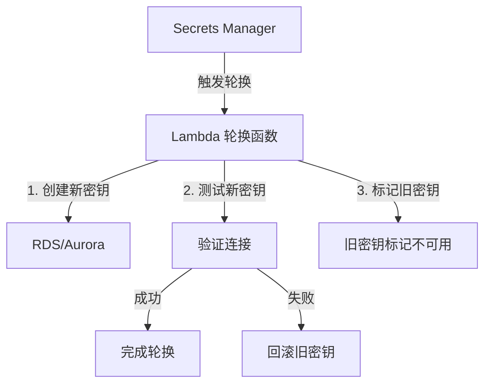
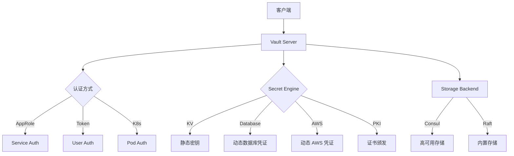
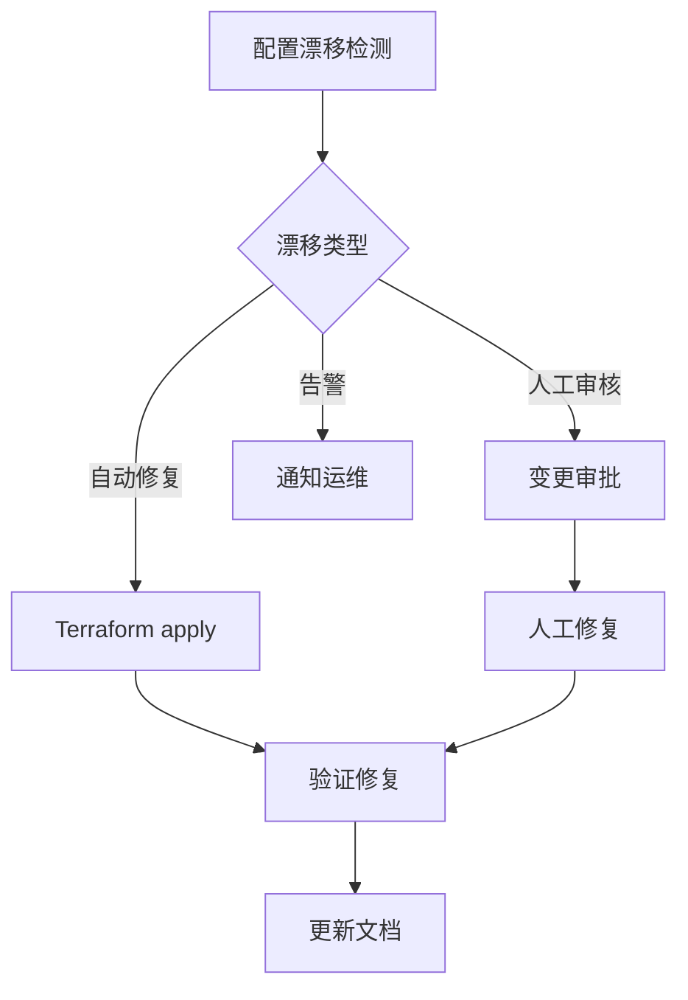
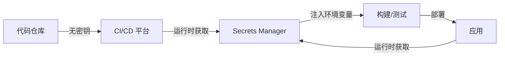
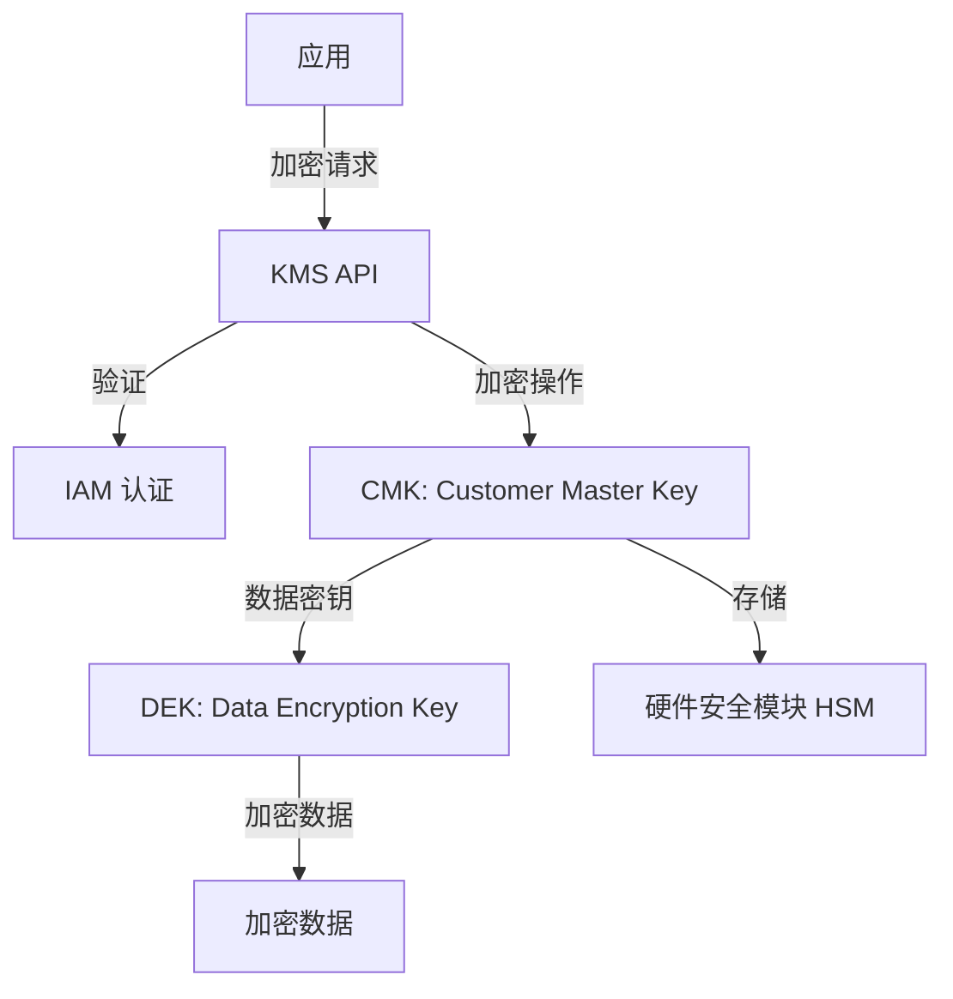
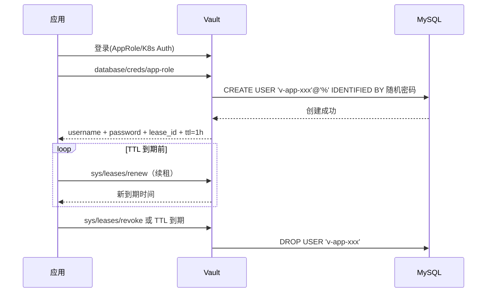
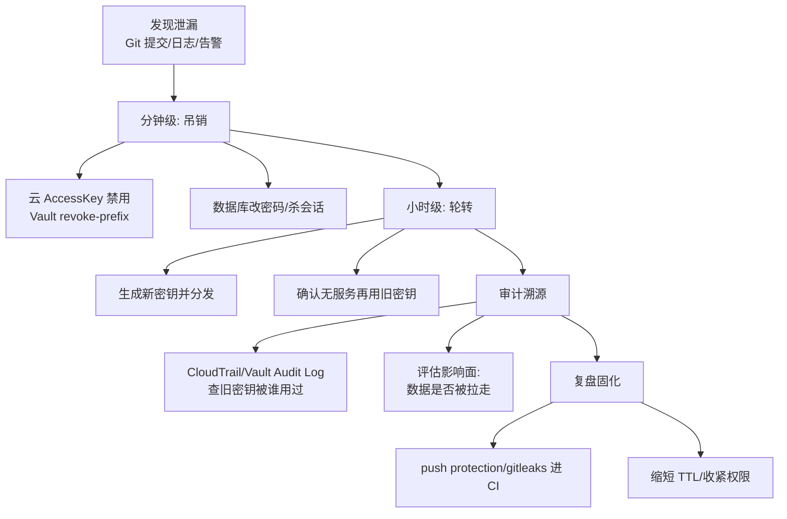
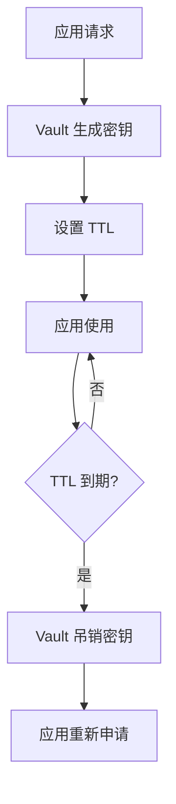
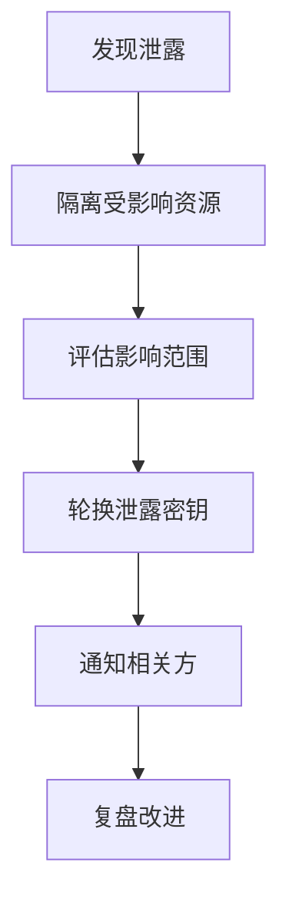
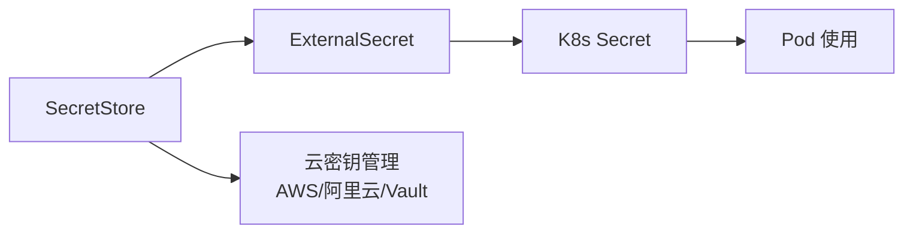

# 云配置与密钥管理（动态配置 / 参数中心 / 密钥分发）

> 分布式系统的配置与密钥管理：不用重启服务就能改配置、密钥自动轮换、多环境隔离。云厂商把配置中心与密钥管理做成托管服务。本篇按「解决的问题 → 原理 → 特性 → 选型关注点」拆解，并深入动态配置推送机制、密钥轮换机制、K8s 密钥方案等。

---

## 一、配置管理的核心挑战

| 挑战 | 说明 |
|------|------|
| 动态生效 | 改配置不用重启服务 |
| 多环境隔离 | Dev/Staging/Prod 配置独立 |
| 版本与回滚 | 配置变更可审计、可回滚 |
| 灰度发布 | 配置按实例/比例灰度生效 |
| 安全隔离 | 敏感配置（密码/密钥）加密存储、最小权限访问 |

> 核心认知：**配置中心 = 配置的「真相源」**——所有实例从中心拉取配置，保证一致性；密钥管理 = 敏感数据的「保险箱」——加密存储、自动轮换、访问审计。

---

## 二、云配置中心服务

### 2.1 AWS AppConfig

**解决的问题**：应用配置（功能开关/业务参数）需要动态生效、灰度发布、自动回滚。

**原理**：
- **配置档案**：存储配置（JSON/YAML/纯文本/Feature Flags）
- **部署策略**：线性/指数灰度、烘焙时间（观察期）、自动回滚（CloudWatch 告警触发）
- **应用集成**：SDK 拉取配置或 Lambda 推送

| 特性 | 说明 |
|------|------|
| Feature Flags | 功能开关：按百分比/用户属性灰度 |
| 验证 | JSON Schema 验证配置合法性 |
| 部署监控 | 部署过程监控 + 自动回滚 |
| 与 Parameter Store 联动 | 引用 SSM Parameter Store 参数 |

### 2.2 动态配置推送机制深入

```
配置变更 → 客户端感知的两条路径：

① 拉取（Pull）模式：
  客户端 SDK 定时轮询（默认 30s~5min）
  服务端版本号比对 → 有变化拉取新配置
  → 简单可靠，但生效延迟（秒~分钟级）

② 推送（Push）模式：
  服务端配置变更 → 通知客户端（WebSocket/长连接/事件）
  客户端收到通知 → 立即拉取最新配置
  → 秒级生效，生产推荐

配置下发链路：
  控制台/API 更新 → 存储（DB/S3）
  → 校验（Schema/格式）→ 部署策略（灰度）
  → 客户端拉取/推送 → 应用热加载（不用重启）
```

### 2.3 灰度发布与自动回滚

```
灰度策略：
  按百分比：10% → 50% → 100%（线性/指数递增）
  按属性：特定实例/环境/用户组先生效
  烘焙时间：每阶段停留观察（如 15 分钟）

自动回滚：
  部署期间监控告警（CloudWatch 指标/错误率）
  触发条件 → 自动回滚到上一版本
  → 配置变更也走"发布流程"，不是直接改
```

**选型关注点**：功能开关/灰度发布 → AppConfig（AWS 生态内最强）；纯参数存储 → SSM Parameter Store。

### 2.4 AWS Systems Manager Parameter Store

- **参数存储**：层级化参数（/String/ListString）、加密参数（KMS）
- **与生态**：与 Lambda/ECS/EC2/CloudFormation 集成
- **选型关注点**：简单参数/密码存储 → Parameter Store（免费基础版）；复杂配置/灰度 → AppConfig。

### 2.5 Azure App Configuration

- **功能标志**：与 Azure Feature Management 集成
- **与生态**：与 Azure AD/Key Vault/Functions/App Service 集成
- **参考**：Key Vault 引用（配置中引用密钥）
- **选型关注点**：Azure 生态 + 功能开关 → App Configuration。

### 2.6 GCP

- **Runtime Configurator**（已弃用）→ 推荐用 **Firebase Remote Config**（移动端）或 **Cloud Storage + 自建轮询**
- **Secret Manager**：托管密钥/密码/证书（见密钥管理部分）
- **选型关注点**：GCP 生态配置管理相对弱，常用 Secret Manager + Cloud Storage 自建。

### 2.7 国内：阿里云 ACM / 腾讯云 TCM

| 服务 | 厂商 | 关键点 |
|------|------|--------|
| ACM（Application Configuration Management） | 阿里云 | 动态配置、灰度推送、与 Nacos/MSE 集成 |
| TCM（Tencent Configuration Management） | 腾讯云 | 动态配置、灰度发布、与 TSF 集成 |

**选型关注点**：国内业务 + 阿里云 → ACM（与 Nacos 生态打通）；腾讯云 → TCM。

---

## 三、云密钥管理服务（Secrets Manager）

### 3.1 解决的问题

数据库密码/API 密钥/证书硬编码在代码/配置里 → 泄露风险高。需要：集中加密存储、自动轮换、访问审计、最小权限。

### 3.2 服务

| 服务 | 厂商 | 关键点 |
|------|------|--------|
| AWS Secrets Manager | AWS | 托管密钥、自动轮换（内置 RDS/Redshift/DocumentDB 轮换）、与 Lambda 集成 |
| Azure Key Vault | Azure | 密钥/证书/机密三合一、HSM、软删除 |
| GCP Secret Manager | GCP | 版本化密钥、与 IAM 集成、自动轮换 |
| 阿里云 KMS + 凭据管家 | 阿里云 | 托管密钥/凭据、自动轮换、国密 |
| 腾讯云凭据管家 | 腾讯云 | 托管凭据、自动轮换 |
| HashiCorp Vault | 多云 | 动态密钥（数据库/云服务临时凭证）、多云统一、与 K8s 深度集成 |

### 3.3 密钥自动轮换机制深入

```
轮换流程（Secrets Manager 内置 Lambda 轮换函数）：
  ① 创建新密钥版本（新密码）
  ② 更新数据库密码为新值（同步）
  ③ 测试新密钥可用（应用连接验证）
  ④ 完成轮换（旧版本标记不可用，可回滚保留）

双密钥轮换（避免服务中断）：
  轮换期间新旧密钥都可用
  应用每次调用获取"当前版本"密钥
  存量连接用旧密钥、新连接用新密钥
  → 无缝切换

轮换周期建议：
  数据库密码：30~90 天
  API 密钥：90 天（或按泄露事件紧急轮换）
  TLS 证书：1 年（Let's Encrypt 90 天）
```

### 3.4 应用获取密钥的方式

```
① SDK 直接调用：应用启动/运行时调 GetSecretValue
  → 建议缓存 + 定期刷新（减少 API 调用）

② 注入环境变量：ECS/Lambda 环境变量引用（部署时注入）
  → 启动时注入，运行中不变（轮换后需重启应用）

③ 挂载文件：Fargate/ECS Secret 挂载（容器内文件）
  → 文件刷新机制（K8s CSI Driver 支持动态刷新）

④ 运行时刷新库：AWS Secrets Manager Java 客户端（缓存 + 自动刷新）
```

**选型关注点**：云数据库密码 → 原生 Secrets Manager（内置轮换）；多云/混合云 → Vault（动态密钥最强）；国密合规 → 国内云 KMS。

---

## 四、K8s 密钥管理

| 方案 | 说明 |
|------|------|
| Kubernetes Secret | 原生 Secret（base64 编码，非加密） |
| Sealed Secrets | Secret 加密后安全存入 Git（Bitnami） |
| External Secrets Operator | 将云密钥（Secrets Manager/Vault）同步为 K8s Secret |
| Secrets Store CSI Driver | 密钥以卷形式挂载到 Pod（不经过 K8s Secret） |
| Vault Injector | Vault Agent 注入 Pod 动态获取密钥 |

**解决的问题**：K8s Secret 明文存储在 etcd → 加密/外部密钥管理。

### 4.1 方案对比深入

```
K8s Secret：base64 编码（不是加密！）
  etcd 泄露 = 密钥泄露
  默认任何有 etcd 权限的人都可读

Sealed Secrets：
  SealedSecret CRD（公钥加密）
  Git 仓库只存密文（可提交 GitOps）
  集群内 Sealed Secrets Controller 解密为 Secret
  → 解决"密钥进 Git"问题，但密钥仍在 etcd（解密后）

External Secrets Operator：
  定期从 Secrets Manager/Vault 拉取 → 同步为 K8s Secret
  密钥只存在于外部（云厂商），K8s 里是同步副本
  轮换自动同步（Secret 更新触发 Pod 滚动）

Secrets Store CSI Driver：
  Pod 挂载时从外部密钥系统拉取 → 挂载为卷
  不经过 K8s Secret API（etc 不留密钥）
  支持动态刷新（新版本自动更新挂载文件）
  → 最高安全级别（但管理复杂）

Vault Injector：
  Pod 启动时 Vault Agent sidecar 注入密钥到共享卷
  支持动态密钥（数据库临时凭证，短时有效）
  → 动态密钥场景首选
```

**选型关注点**：云原生 + 已有云密钥 → External Secrets Operator（同步为 K8s Secret）；最高安全 → Secrets Store CSI Driver（卷挂载，不落 Secret）；多云/动态密钥 → Vault Injector。

---

## 五、配置中心 vs 注册中心 vs 密钥管理

| 维度 | 配置中心 | 注册中心 | 密钥管理 |
|------|----------|----------|----------|
| 存储内容 | 业务参数/功能开关 | 服务实例地址 | 密码/密钥/证书 |
| 变更频率 | 低~中 | 高（实例上下线） | 低（定期轮换） |
| 一致性要求 | 最终一致 | 强一致/最终一致 | 强一致 |
| 敏感度 | 低~中 | 低 | 高（加密存储） |
| 代表服务 | AppConfig/ACM | Nacos/Consul/Eureka | Secrets Manager/Vault |

```
三者常混用：
  配置中心：非敏感业务参数（开关/阈值/URL）
  密钥管理：敏感信息（密码/密钥/证书）
  注册中心：服务发现（实例地址动态变化）

注意：不要把所有配置塞进配置中心（密钥必须走密钥管理）
  不要用环境变量硬编码密钥（提交 Git 风险）
```

---

## 六、配置管理最佳实践

### 6.1 配置分类

| 类型 | 例子 | 存放位置 |
|------|------|----------|
| 构建时配置 | 依赖版本/镜像 tag | 代码仓库（CI 变量） |
| 环境配置 | URL/端口/日志级别 | 配置中心（按环境隔离） |
| 功能开关 | 新功能灰度比例 | 配置中心（Feature Flags） |
| 密钥 | 密码/API Key/证书 | 密钥管理服务 |

### 6.2 设计原则

```
① 配置即代码：配置进 Git（评审/审计/回滚）
② 环境隔离：Dev/Staging/Prod 命名空间分离
③ 最小敏感面：密钥不进代码/不进配置中心
④ 灰度先行：重大配置变更灰度生效
⑤ 监控联动：配置变更触发审计日志
⑥ 自动回滚：变更失败自动恢复（结合告警）
```

### 6.3 配置治理 Checklist

- [ ] 所有配置有 Owner（谁负责改/谁负责解释）
- [ ] 配置变更走审批/发布流程（非直接改）
- [ ] 敏感配置 100% 进密钥管理（扫描代码防硬编码）
- [ ] 配置灰度 + 自动回滚已配置
- [ ] 配置版本历史可追溯（谁在何时改了什么）
- [ ] 密钥轮换机制已启用（数据库/API 密钥）
- [ ] 密钥访问审计（谁读了什么密钥）

---

## 七、选型速查

| 需求 | 首选 | 备选 |
|------|------|------|
| 功能开关/灰度配置 | AppConfig/ACM/TCM | LaunchDarkly（第三方） |
| 简单参数存储 | SSM Parameter Store/ACM | — |
| 密钥托管 + 自动轮换 | Secrets Manager/Key Vault | Vault |
| 多云密钥统一 | HashiCorp Vault | — |
| K8s 密钥同步 | External Secrets Operator | Secrets Store CSI Driver |
| 动态临时凭证 | Vault | 云厂商 IAM Role |
| 国密合规 | 国内云 KMS | — |
| Git 内密钥加密 | Sealed Secrets | Vault Transit |

### 7.1 决策树

```
是密钥/密码/证书？→ 是 → Secrets Manager/Key Vault/Vault（按云/多云）
是功能开关/灰度？→ 是 → AppConfig/ACM/TCM
只是普通参数？→ Parameter Store/ACM
K8s 环境？→ External Secrets Operator（推荐）/ CSI Driver（最高安全）
需要动态临时凭证？→ Vault
```

---

## AWS Secrets Manager vs Parameter Store 深入对比

| 维度 | Secrets Manager | Parameter Store |
|------|-----------------|-----------------|
| 定位 | 密钥托管（密码/密钥/证书） | 参数存储（配置/密码/命令） |
| 自动轮换 | 内置 Lambda 轮换函数 | 无（需自建） |
| 版本管理 | 自动版本化（可回滚） | 支持版本（手动） |
| 加密 | KMS 加密（默认） | KMS 加密（可选） |
| 跨区域复制 | 有（Region Replica） | 无 |
| 价格 | $0.40/密钥/月 + $0.05/万次 API | 免费（标准）/ $0.05/万次（高级） |
| 最大长度 | 64KB | 标准 4KB / 高级 8KB |
| 集成服务 | Lambda/RDS/Redshift/DocumentDB | Lambda/ECS/EC2/CloudFormation |

### 密钥轮换架构



---

## Azure Key Vault 深入

### Key Vault 三合一架构

| 内容类型 | 用途 | 操作 |
|----------|------|------|
| 密钥（Keys） | 加密/签名/解密 | RSA/ECC 密钥操作 |
| 证书（Certificates） | TLS/SSL 证书管理 | 自动续期/吊销 |
| 机密（Secrets） | 密码/连接字符串 | CRUD 操作 |

### Key Vault 访问控制

```
访问模型：
  ① Azure AD 认证（用户/服务主体）
  ② 访问策略（Access Policy）：细粒度权限
  ③ RBAC（角色）：Key Vault Administrator/Reader 等
  ④ 托管标识（Managed Identity）：免密钥访问

推荐模式：
  应用 → 托管标识 → Azure AD Token → Key Vault → 密钥
  → 零密钥硬编码
```

---

## GCP Secret Manager 深入

### 特性矩阵

| 特性 | 说明 |
|------|------|
| 版本化 | 每个 Secret 多版本，支持回滚 |
| IAM 集成 | 细粒度权限控制（Secret Admin/Viewer） |
| 自动轮换 | Cloud Scheduler + Cloud Functions |
| 审计 | Cloud Audit Logs（访问记录） |
| 复制 | 跨区域复制（高可用） |
| 标签 | 按团队/项目分类管理 |

---

## HashiCorp Vault 架构深入

### Vault 核心架构



### Seal/Unseal 机制

```
Vault 安全机制：
  Seal（封存）：Vault 启动后默认封存状态，无法访问密钥
  Unseal（解封）：需要提供 Unseal Key（Shamir 分片）
  
  Shamir 密钥分片：
    总共 N 片，需要 M 片才能解封（M-of-N）
    示例：5 片中需要 3 片解封
    → 单人无法解封（防内部威胁）

  Cloud Unseal：
    AWS KMS / Azure Key Vault / GCP KMS 自动解封
    → 生产环境推荐
```

### 动态密钥（Dynamic Secrets）

```
动态密钥原理：
  ① 应用请求临时凭证
  ② Vault 调用后端 API 创建临时凭证
  ③ 凭证带 TTL（默认 1 小时）
  ④ TTL 到期自动撤销

示例：动态数据库凭证
  Vault → MySQL → 创建临时用户（密码随机）→ 授予有限权限
  → TTL 1 小时 → 到期自动删除用户
  → 永不硬编码密码

优势：
  每个应用独立凭证（最小权限）
  自动轮换（TTL 到期重新生成）
  审计追踪（谁在何时获取了什么凭证）
```

### Vault Lease 机制

| 概念 | 说明 |
|------|------|
| Lease | 密钥/凭证的有效期 |
| TTL | Time To Live（有效期） |
| Renewable | 可续期（延长 TTL） |
| Revoke | 立即撤销（不用等 TTL） |
| Orphan | 孤立密钥（不随父密钥撤销） |

---

## 密钥轮换策略深入

### 轮换策略对比

| 策略 | 说明 | 适用 |
|------|------|------|
| 定期轮换 | 固定周期（30/60/90 天） | 合规要求 |
| 事件驱动轮换 | 泄露事件触发紧急轮换 | 安全事件 |
| 自动轮换 | 云服务内置 Lambda 轮换 | RDS/Redshift 等 |
| 手动轮换 | 人工操作（审批流程） | 高敏感密钥 |

### 轮换最佳实践

```
轮换流程（零停机）：
  ① 创建新密钥版本（新密码）
  ② 双密钥共存（新旧密钥都可用）
  ③ 应用热加载新密钥（刷新缓存）
  ④ 验证新密钥可用
  ⑤ 标记旧密钥为不可用（保留回滚）
  ⑥ 定期清理旧版本

关键点：
  应用必须支持密钥热加载（不重启）
  轮换期间双密钥共存（避免服务中断）
  轮换后验证（连接测试）
  保留旧版本（可回滚）
```

---

## 配置漂移检测

### 漂移检测方案

| 方案 | 原理 | 工具 |
|------|------|------|
| IaC 对比 | 期望状态 vs 实际状态 | Terraform plan / CloudFormation drift |
| API 审计 | 配置变更事件检测 | CloudTrail / Azure Activity Log |
| 合规扫描 | 定期扫描配置合规性 | AWS Config / Azure Policy |
| 配置快照 | 定期快照对比 | 自建脚本 |

### 配置漂移修复流程



---

## 基础设施即代码（IaC）

### Terraform vs CloudFormation

| 维度 | Terraform | CloudFormation |
|------|-----------|----------------|
| 多云 | 支持（多 Provider） | 仅 AWS |
| 状态管理 | State 文件（远程存储） | AWS 托管 |
| 语言 | HCL（声明式） | YAML/JSON |
| 变更检测 | `terraform plan` | Change Sets |
| 模块化 | Module（可复用） | Stack（嵌套） |
| 社区 | 活跃（第三方 Provider） | AWS 原生 |

### Terraform 状态管理最佳实践

```
State 文件安全：
  ① 远程存储（S3 + DynamoDB 锁）
  ② 加密（S3 SSE-S3/SSE-KMS）
  ③ 版本控制（S3 Versioning）
  ④ 访问控制（IAM 限制谁可读写）

示例配置：
  terraform {
    backend "s3" {
      bucket         = "my-terraform-state"
      key            = "prod/terraform.tfstate"
      region         = "us-east-1"
      encrypt        = true
      dynamodb_table = "terraform-lock"
    }
  }
```

---

## 云配置审计

### AWS Config 规则

| 规则 | 检查内容 |
|------|----------|
| `s3-bucket-ssl-requests-only` | S3 强制 HTTPS |
| `rds-storage-encrypted` | RDS 存储加密 |
| `iam-user-mfa-enabled` | IAM 用户启用 MFA |
| `ec2-instance-no-public-ip` | EC2 无公网 IP |
| `lambda-function-public-access-prohibited` | Lambda 禁止公网访问 |

### 审计自动化

```
配置审计流程：
  ① AWS Config 规则持续扫描
  ② 违规事件 → EventBridge
  ③ EventBridge → Lambda 自动修复
  ④ 修复结果 → SNS 通知
  ⑤ 历史记录 → CloudTrail 审计
```

---

## CI/CD 中的密钥管理

### 密钥在流水线中的位置



### 安全实践

| 实践 | 说明 |
|------|------|
| 禁止硬编码 | 代码扫描（git-secrets / TruffleHog） |
| 运行时注入 | CI/CD 运行时从 Secrets Manager 获取 |
| 最小权限 | CI/CD 角色仅可访问所需密钥 |
| 审计 | 记录谁在何时获取了什么密钥 |
| 轮换 | 密钥定期轮换，CI/CD 自动适配 |

---

## 零信任密钥管理

### 零信任原则在密钥管理中的应用

```
零信任密钥管理：
  ① 永不信任，始终验证
     → 每次访问密钥都需认证+授权
     → 无预信任（即使内部网络）

  ② 最小权限
     → 应用只能访问所需的密钥
     → 动态凭证（短 TTL）

  ③ 假设被入侵
     → 密钥加密存储（KMS）
     → 审计所有访问
     → 自动轮换

  ④ 微分段
     → 不同环境密钥隔离
     → 不同服务密钥隔离
```

---

## 云 KMS 架构

### KMS 核心架构



### KMS 密钥层级

| 层级 | 密钥 | 用途 |
|------|------|------|
| 根密钥 | CMK（Customer Master Key） | 加密/解密 DEK |
| 数据密钥 | DEK（Data Encryption Key） | 加密实际数据 |
| 信封加密 | CMK 加密 DEK | 高性能加密 |

### 信封加密原理

```
信封加密（Envelope Encryption）：
  ① 请求 KMS 生成 DEK（数据密钥）
  ② KMS 用 CMK 加密 DEK → 密文 DEK
  ③ 用明文 DEK 加密数据 → 密文数据
  ④ 存储：密文 DEK + 密文数据
  ⑤ 解密：用 CMK 解密 DEK → 用 DEK 解密数据

优势：
  CMK 不直接接触数据（安全）
  DEK 可本地缓存（性能）
  密钥轮换只换 CMK（不影响数据）
```

---

## Vault 动态密钥完整生命周期（Lease / Renew / Revoke）



| 概念 | 说明 | 生产建议 |
|------|------|---------|
| Lease ID | 每份动态凭证的唯一租约标识 | 应用持久化，用于 renew/revoke |
| TTL | 凭证有效期（默认 1h） | 短 TTL=高安全，但要防续租风暴 |
| Max TTL | 续租上限，超过强制重新申请 | 数据库 24h、云凭证 1~2h |
| Renewable | 是否可续期 | 长任务必须 renewable=true |
| Revoke 前缀撤销 | `revoke-prefix` 可批量吊销一类租约 | 泄露应急的核心手段 |

```bash
# 续期与撤销
vault lease renew database/creds/app-role/<lease_id>
vault lease revoke database/creds/app-role/<lease_id>
# 应急：吊销该角色全部动态凭证
vault lease revoke -prefix database/creds/app-role
```

运维要点：应用必须有「凭证即将过期自动换新」逻辑（先拿新凭证→切流量→释放旧连接）；监控 `sys/leases/lookup` 存量租约数，异常暴涨说明有应用没做释放。

## Vault Transit 加密即服务（应用层加密）

```
思路：应用不接触主密钥——明文发给 Vault，Vault 用内存中的 key
     加密后只返回密文；解密同理。密钥永不离开 Vault。

适用：
  字段级加密（身份证/手机号落库加密）
  文件/报文加签验签（sign/verify）
  不想自研 KMS 封装的中小团队

限制：所有加解密流量过 Vault → 吞吐与可用性依赖 Vault，
     高 QPS 场景要评估批处理接口或本地缓存派生数据密钥。
```

```bash
# 创建加密密钥（支持自动轮换，旧版本仍可解密）
vault write -f transit/keys/orders-pii
vault write transit/keys/orders-pii/config auto_rotate_period=720h

# 加密 / 解密 / 签名
vault write transit/encrypt/orders-pii plaintext=$(base64 <<< "13812341234")
# => ciphertext: vault:v1:a5f3...
vault write transit/decrypt/orders-pii ciphertext="vault:v1:a5f3..."
vault write transit/sign/orders-pii input=$(base64 <<< "payload")

# 轮换后读最新版本号；历史密文用 v1 版本照常解密
vault read -field=latest_version transit/keys/orders-pii
```

与 KMS 信封加密的分工：大对象/高性能场景走「KMS 信封加密」（DEK 本地缓存）；低 QPS 高敏字段走 Transit（零密钥管理负担）。

## AWS Parameter Store 分层路径设计与批量获取

```text
分层命名规范（路径即元数据）：
  /{org}/{app}/{env}/{key}
  例：
    /acme/order-service/prod/db/url
    /acme/order-service/prod/db/password   （SecureString）
    /acme/order-service/staging/db/url

设计原则：
  ① 环境放路径而非参数名（GetParametersByPath 一把梭）
  ② 密码类一律 SecureString（绑定 KMS Key，可按环境隔离 CMK）
  ③ 公共配置下沉共享段：/acme/common/prod/*
  ④ 版本利用：同一 Name 支持多 version，回滚 = 指定旧版本
```

```bash
# 批量获取某应用某环境全部配置（一次 API 拉全树）
aws ssm get-parameters-by-path \
  --path "/acme/order-service/prod" \
  --recursive \
  --with-decryption \
  --query "Parameters[].[Name,Value]" \
  --output text

# IAM 最小授权示例：只能读本应用 prod 路径
#   Resource: arn:aws:ssm:*:*:parameter/acme/order-service/prod/*
```

| 能力 | Parameter Store | 说明 |
|------|-----------------|------|
| 层级查询 | GetParametersByPath | 按前缀递归拉取，适合启动加载 |
| 批量读取 | GetParameters（≤10 个） | 合并请求省配额 |
| 变更通知 | EventBridge 监听 Parameter Store Change | 触发配置刷新流水线 |
| 配额 | 标准版 1 万条免费 / 高级版收费+8KB+策略 | 高级版支持 TTL 自动过期 |

## 密钥泄漏应急响应流程（吊销 → 轮转 → 审计）



| 阶段 | 时限 | 关键动作 |
|------|------|---------|
| 吊销 | ≤15 分钟 | 先断权限再排查，宁可误伤不可拖 |
| 轮转 | ≤1 小时 | 双密钥共存热切换，避免二次故障 |
| 审计 | 24 小时内出初报 | 从审计日志还原「谁在何时用过泄漏密钥」 |
| 复盘 | 1 周 | 把泄漏路径堵死（扫描器/短TTL/最小权限） |

演练建议：每季度做一次「假泄漏」演练，验证从告警到吊销的实际耗时能否压进 SLA。

## GitOps 场景密钥注入（External Secrets Operator）

```yaml
# ① ExternalSecret：声明"我要什么密钥"
apiVersion: external-secrets.io/v1beta1
kind: ExternalSecret
metadata:
  name: order-service-db
  namespace: prod
spec:
  refreshInterval: 1h            # 定期从外部同步（轮换自动跟进）
  secretStoreRef:
    name: aws-secrets-manager
    kind: ClusterSecretStore
  target:
    name: order-service-db       # 生成的 K8s Secret 名
    creationPolicy: Owner
  data:
    - secretKey: DB_PASSWORD
      remoteRef:
        key: prod/order-service/db
        property: password
```

```yaml
# ② ClusterSecretStore：声明"从哪取、用什么身份"
apiVersion: external-secrets.io/v1beta1
kind: ClusterSecretStore
metadata:
  name: aws-secrets-manager
spec:
  provider:
    aws:
      service: SecretsManager
      region: cn-north-1
      auth:
        jwt:
          serviceAccountRef:
            name: external-secrets-sa   # IRSA：Pod 身份免 AK/SK
```

工作模式对比：

| 方案 | Git 里存什么 | 轮换生效方式 |
|------|-------------|-------------|
| Sealed Secrets | 加密封文 | 改 Git 重新 kubectl apply |
| ESO（推荐） | 只有 ExternalSecret 引用 | 外部源更新后 refreshInterval 内自动同步 |
| CSI Driver 卷挂载 | 无 Secret 对象 | 文件级滚动刷新，不进 etcd |

落地要点：ESO 同步出的仍是普通 K8s Secret（在 etcd 中），务必开启 etcd encryption；配合 Reloader/Argo CD 的 `argocd.argoproj.io/sync-options` 让 Secret 更新触发 Deployment 滚动。

---

## 附录 A：Vault 动态密钥生命周期

### A.1 动态密钥流程



### A.2 动态密钥配置

```bash
# 启用数据库秘密引擎
vault secrets enable database

# 配置 PostgreSQL 连接
vault write database/config/postgres \
  plugin_name=postgresql-database-plugin \
  connection_url="postgresql://{{username}}:{{password}}@db:5432/app" \
  allowed_roles="readonly" \
  username="vault" \
  password="vault-password"

# 创建角色
vault write database/roles/readonly \
  db_name=postgres \
  default_ttl="1h" \
  max_ttl="24h"

# 生成动态密钥
vault read database/creds/readonly
```

### A.3 密钥轮换策略

| 密钥类型 | 轮换周期 | 方法 | 影响 |
|----------|----------|------|------|
| 静态密钥 | 90 天 | 手动/API | 需协调 |
| 动态密钥 | 1 小时 | 自动 | 无感 |
| 数据库密码 | 30 天 | 脚本 | 短暂中断 |
| API 密钥 | 180 天 | API | 需重配置 |

## 附录 B：Vault Transit 加密引擎

### B.1 Transit 配置

```bash
# 启用 Transit 引擎
vault secrets enable transit

# 创建加密密钥
vault write -f transit/keys/my-key type=aes256-gcm96

# 加密数据
vault write -f transit/encrypt/my-key \
  plaintext=$(echo -n "sensitive data" | base64)

# 解密数据
vault write -f transit/decrypt/my-key \
  ciphertext="vault:v1:..."
```

### B.2 Transit 高级功能

| 功能 | 说明 | 使用场景 |
|------|------|----------|
| 自动轮换 | 自动更新密钥版本 | 定期轮换 |
| 密钥导出 | 密钥备份 | 灾难恢复 |
| 签名/验证 | 数据签名 | 完整性校验 |
| HMAC | 消息认证 | 防篡改 |
| 处理者 | 加解密 | 数据加密 |

## 附录 C：Parameter Store 路径设计

### C.1 路径结构

```text
标准路径结构：

/env/{环境}/{服务}/{密钥类型}/{密钥名}

示例：
/env/prod/payment/database/credentials
/env/prod/payment/api/stripe-key
/env/staging/payment/database/credentials
/env/dev/payment/database/credentials
```

### C.2 参数组织

| 层级 | 说明 | 示例 |
|------|------|------|
| 第1层 | 环境 | prod/staging/dev |
| 第2层 | 服务 | payment/order/user |
| 第3层 | 类型 | database/api/cert |
| 第4层 | 名称 | credentials/stripe-key |

### C.3 版本管理

```json
{
  "Name": "/prod/payment/database/credentials",
  "Type": "String",
  "Value": "{\"username\":\"app\",\"password\":\"xxx\"}",
  "Version": 3,
  "LastModifiedDate": "2024-01-01T12:00:00Z",
  "ARN": "arn:aws:ssm:us-east-1:123456789:parameter/prod/payment/database/credentials"
}
```

## 附录 D：密钥泄露应急响应

### D.1 应急响应流程



### D.2 响应时间线

| 阶段 | 任务 | SLA |
|------|------|-----|
| 检测 | 确认泄露 | 15 分钟 |
| 遏制 | 隔离资源 | 30 分钟 |
| 恢复 | 轮换密钥 | 2 小时 |
| 复盘 | 根因分析 | 24 小时 |

### D.3 密钥轮换检查清单

```text
轮换清单：

□ 确认泄露密钥
□ 生成新密钥
□ 更新应用配置
□ 验证新密钥有效
□ 吊销旧密钥
□ 通知相关团队
□ 更新文档
□ 监控异常
```

## 附录 E：External Secrets Operator（ESO）

### E.1 ESO 架构



### E.2 ESO 配置

```yaml
# SecretStore 配置
apiVersion: external-secrets.io/v1beta1
kind: SecretStore
metadata:
  name: aws-secrets-manager
spec:
  provider:
    aws:
      service: SecretsManager
      region: us-east-1
      auth:
        secretRef:
          accessKeyIDSecretRef:
            name: aws-credentials
            key: access-key-id
          secretAccessKeySecretRef:
            name: aws-credentials
            key: secret-access-key

# ExternalSecret 配置
apiVersion: external-secrets.io/v1beta1
kind: ExternalSecret
metadata:
  name: app-secrets
spec:
  refreshInterval: 1h
  secretStoreRef:
    name: aws-secrets-manager
    kind: SecretStore
  target:
    name: app-secrets
  data:
    - secretKey: db-password
      remoteRef:
        key: prod/app/database
        property: password
```

### E.3 ESO vs 其他方案

| 方案 | 密钥存储 | 自动同步 | K8s 原生 |
|------|----------|----------|----------|
| ESO | 云密钥管理 | ✅ | ✅ |
| Sealed Secrets | etcd | ❌ | ✅ |
| Vault Agent | Vault | ✅ | ❌ |
| 外部工具 | 自定义 | 部分 | ❌ |

## 附录 F：ConfigMap→Sealed Secrets→ESO 演进

### F.1 方案演进

| 阶段 | 方案 | 特点 | 适合规模 |
|------|------|------|----------|
| 初期 | ConfigMap | 简单 | 小型 |
| 中期 | Sealed Secrets | 加密存储 | 中型 |
| 成熟 | ESO | 自动同步 | 大型 |

### F.2 迁移路径

```text
迁移步骤：

阶段1：ConfigMap → Sealed Secrets
  - 安装 Sealed Secrets Controller
  - 转换 ConfigMap 为 SealedSecret
  - 部署到 K8s

阶段2：Sealed Secrets → ESO
  - 安装 ESO Operator
  - 配置 SecretStore
  - 创建 ExternalSecret
  - 迁移应用引用

阶段3：验证与清理
  - 验证密钥同步
  - 清理旧方案
  - 更新文档
```

### F.3 最佳实践

| 实践 | 说明 |
|------|------|
| 密钥加密 | 始终加密存储 |
| 访问控制 | 最小权限原则 |
| 审计日志 | 记录访问 |
| 定期轮换 | 自动/手动轮换 |
| 备份恢复 | 测试恢复流程 |

## 八、与其他板块的关系

- 注册中心与配置中心（Nacos/Apollo/Consul）见「[注册中心与配置中心](./注册中心与配置中心.md)」；
- 云 IAM 与 KMS 见「[云身份与访问管理体系](./云身份与访问管理体系.md)」；
- 云安全见「[云安全体系](./云安全体系.md)」；
- 云上中间件总览见「[云上中间件体系总览](./云上中间件体系总览.md)」；
- K8s 应用见「[云容器编排与DevOps体系](./云容器编排与DevOps体系.md)」。

> 一句话：**云配置与密钥管理 = 动态配置（AppConfig/ACM，灰度+回滚）+ 密钥托管（Secrets Manager/Vault，加密+轮换）+ K8s 密钥同步（External Secrets/CSI Driver）；选型先看「配置类型（业务参数/功能开关/密钥）」，再定「轮换需求与合规区域」——核心机制要懂「推送/拉取生效链路、双密钥轮换、K8s 密钥不进 etcd」**。