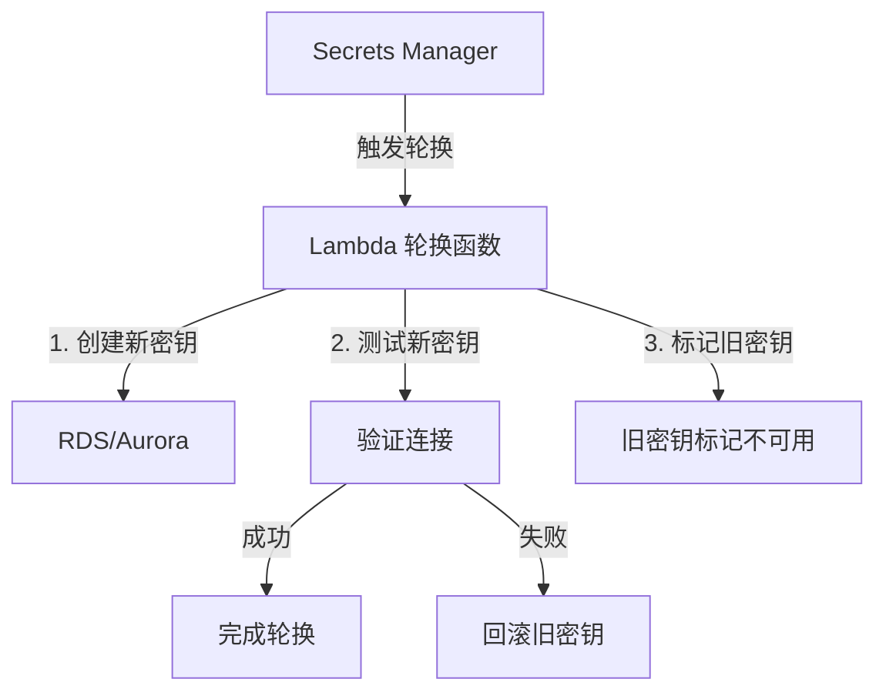
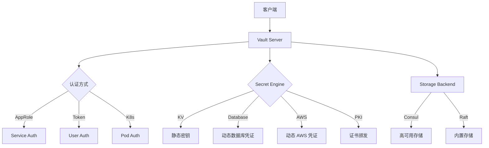
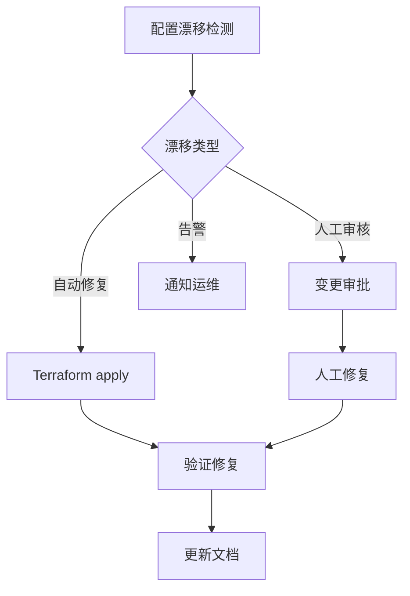
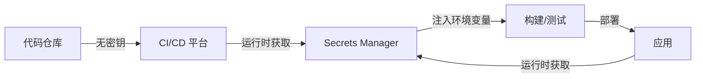
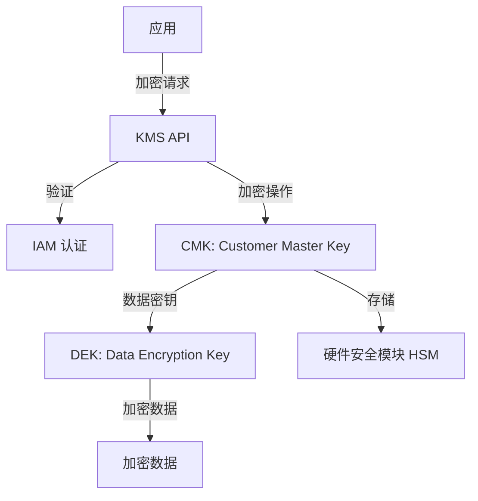
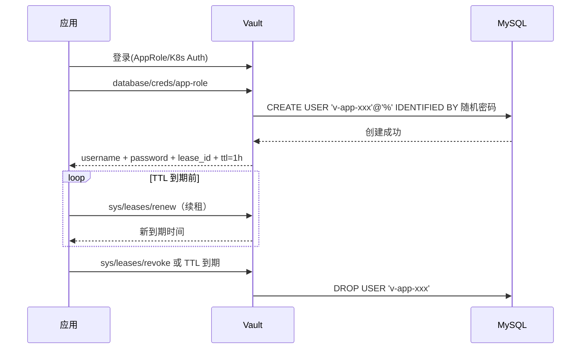
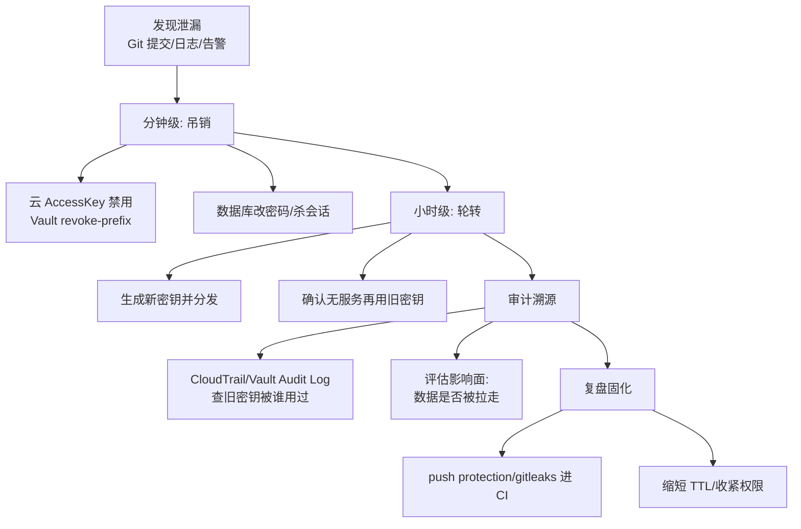
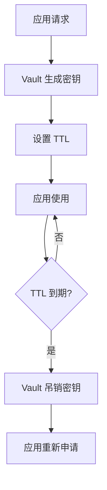
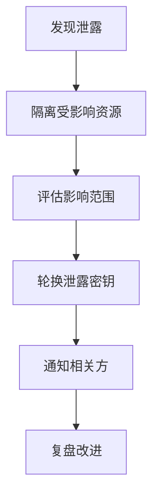
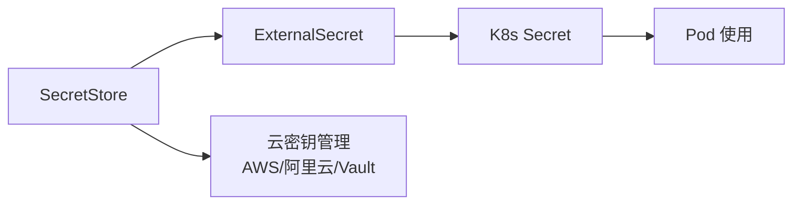

# 云配置与密钥管理（动态配置 / 参数中心 / 密钥分发）

> 分布式系统的配置与密钥管理：不用重启服务就能改配置、密钥自动轮换、多环境隔离。云厂商把配置中心与密钥管理做成托管服务。本篇按「解决的问题 → 原理 → 特性 → 选型关注点」拆解，并深入动态配置推送机制、密钥轮换机制、K8s 密钥方案等。

---

## 一、配置管理的核心挑战

| 挑战 | 说明 |
|------|------|
| 动态生效 | 改配置不用重启服务 |
| 多环境隔离 | Dev/Staging/Prod 配置独立 |
| 版本与回滚 | 配置变更可审计、可回滚 |
| 灰度发布 | 配置按实例/比例灰度生效 |
| 安全隔离 | 敏感配置（密码/密钥）加密存储、最小权限访问 |

> 核心认知：**配置中心 = 配置的「真相源」**——所有实例从中心拉取配置，保证一致性；密钥管理 = 敏感数据的「保险箱」——加密存储、自动轮换、访问审计。

---

## 二、云配置中心服务

### 2.1 AWS AppConfig

**解决的问题**：应用配置（功能开关/业务参数）需要动态生效、灰度发布、自动回滚。

**原理**：
- **配置档案**：存储配置（JSON/YAML/纯文本/Feature Flags）
- **部署策略**：线性/指数灰度、烘焙时间（观察期）、自动回滚（CloudWatch 告警触发）
- **应用集成**：SDK 拉取配置或 Lambda 推送

| 特性 | 说明 |
|------|------|
| Feature Flags | 功能开关：按百分比/用户属性灰度 |
| 验证 | JSON Schema 验证配置合法性 |
| 部署监控 | 部署过程监控 + 自动回滚 |
| 与 Parameter Store 联动 | 引用 SSM Parameter Store 参数 |

### 2.2 动态配置推送机制深入

```
配置变更 → 客户端感知的两条路径：

① 拉取（Pull）模式：
  客户端 SDK 定时轮询（默认 30s~5min）
  服务端版本号比对 → 有变化拉取新配置
  → 简单可靠，但生效延迟（秒~分钟级）

② 推送（Push）模式：
  服务端配置变更 → 通知客户端（WebSocket/长连接/事件）
  客户端收到通知 → 立即拉取最新配置
  → 秒级生效，生产推荐

配置下发链路：
  控制台/API 更新 → 存储（DB/S3）
  → 校验（Schema/格式）→ 部署策略（灰度）
  → 客户端拉取/推送 → 应用热加载（不用重启）
```

### 2.3 灰度发布与自动回滚

```
灰度策略：
  按百分比：10% → 50% → 100%（线性/指数递增）
  按属性：特定实例/环境/用户组先生效
  烘焙时间：每阶段停留观察（如 15 分钟）

自动回滚：
  部署期间监控告警（CloudWatch 指标/错误率）
  触发条件 → 自动回滚到上一版本
  → 配置变更也走"发布流程"，不是直接改
```

**选型关注点**：功能开关/灰度发布 → AppConfig（AWS 生态内最强）；纯参数存储 → SSM Parameter Store。

### 2.4 AWS Systems Manager Parameter Store

- **参数存储**：层级化参数（/String/ListString）、加密参数（KMS）
- **与生态**：与 Lambda/ECS/EC2/CloudFormation 集成
- **选型关注点**：简单参数/密码存储 → Parameter Store（免费基础版）；复杂配置/灰度 → AppConfig。

### 2.5 Azure App Configuration

- **功能标志**：与 Azure Feature Management 集成
- **与生态**：与 Azure AD/Key Vault/Functions/App Service 集成
- **参考**：Key Vault 引用（配置中引用密钥）
- **选型关注点**：Azure 生态 + 功能开关 → App Configuration。

### 2.6 GCP

- **Runtime Configurator**（已弃用）→ 推荐用 **Firebase Remote Config**（移动端）或 **Cloud Storage + 自建轮询**
- **Secret Manager**：托管密钥/密码/证书（见密钥管理部分）
- **选型关注点**：GCP 生态配置管理相对弱，常用 Secret Manager + Cloud Storage 自建。

### 2.7 国内：阿里云 ACM / 腾讯云 TCM

| 服务 | 厂商 | 关键点 |
|------|------|--------|
| ACM（Application Configuration Management） | 阿里云 | 动态配置、灰度推送、与 Nacos/MSE 集成 |
| TCM（Tencent Configuration Management） | 腾讯云 | 动态配置、灰度发布、与 TSF 集成 |

**选型关注点**：国内业务 + 阿里云 → ACM（与 Nacos 生态打通）；腾讯云 → TCM。

---

## 三、云密钥管理服务（Secrets Manager）

### 3.1 解决的问题

数据库密码/API 密钥/证书硬编码在代码/配置里 → 泄露风险高。需要：集中加密存储、自动轮换、访问审计、最小权限。

### 3.2 服务

| 服务 | 厂商 | 关键点 |
|------|------|--------|
| AWS Secrets Manager | AWS | 托管密钥、自动轮换（内置 RDS/Redshift/DocumentDB 轮换）、与 Lambda 集成 |
| Azure Key Vault | Azure | 密钥/证书/机密三合一、HSM、软删除 |
| GCP Secret Manager | GCP | 版本化密钥、与 IAM 集成、自动轮换 |
| 阿里云 KMS + 凭据管家 | 阿里云 | 托管密钥/凭据、自动轮换、国密 |
| 腾讯云凭据管家 | 腾讯云 | 托管凭据、自动轮换 |
| HashiCorp Vault | 多云 | 动态密钥（数据库/云服务临时凭证）、多云统一、与 K8s 深度集成 |

### 3.3 密钥自动轮换机制深入

```
轮换流程（Secrets Manager 内置 Lambda 轮换函数）：
  ① 创建新密钥版本（新密码）
  ② 更新数据库密码为新值（同步）
  ③ 测试新密钥可用（应用连接验证）
  ④ 完成轮换（旧版本标记不可用，可回滚保留）

双密钥轮换（避免服务中断）：
  轮换期间新旧密钥都可用
  应用每次调用获取"当前版本"密钥
  存量连接用旧密钥、新连接用新密钥
  → 无缝切换

轮换周期建议：
  数据库密码：30~90 天
  API 密钥：90 天（或按泄露事件紧急轮换）
  TLS 证书：1 年（Let's Encrypt 90 天）
```

### 3.4 应用获取密钥的方式

```
① SDK 直接调用：应用启动/运行时调 GetSecretValue
  → 建议缓存 + 定期刷新（减少 API 调用）

② 注入环境变量：ECS/Lambda 环境变量引用（部署时注入）
  → 启动时注入，运行中不变（轮换后需重启应用）

③ 挂载文件：Fargate/ECS Secret 挂载（容器内文件）
  → 文件刷新机制（K8s CSI Driver 支持动态刷新）

④ 运行时刷新库：AWS Secrets Manager Java 客户端（缓存 + 自动刷新）
```

**选型关注点**：云数据库密码 → 原生 Secrets Manager（内置轮换）；多云/混合云 → Vault（动态密钥最强）；国密合规 → 国内云 KMS。

---

## 四、K8s 密钥管理

| 方案 | 说明 |
|------|------|
| Kubernetes Secret | 原生 Secret（base64 编码，非加密） |
| Sealed Secrets | Secret 加密后安全存入 Git（Bitnami） |
| External Secrets Operator | 将云密钥（Secrets Manager/Vault）同步为 K8s Secret |
| Secrets Store CSI Driver | 密钥以卷形式挂载到 Pod（不经过 K8s Secret） |
| Vault Injector | Vault Agent 注入 Pod 动态获取密钥 |

**解决的问题**：K8s Secret 明文存储在 etcd → 加密/外部密钥管理。

### 4.1 方案对比深入

```
K8s Secret：base64 编码（不是加密！）
  etcd 泄露 = 密钥泄露
  默认任何有 etcd 权限的人都可读

Sealed Secrets：
  SealedSecret CRD（公钥加密）
  Git 仓库只存密文（可提交 GitOps）
  集群内 Sealed Secrets Controller 解密为 Secret
  → 解决"密钥进 Git"问题，但密钥仍在 etcd（解密后）

External Secrets Operator：
  定期从 Secrets Manager/Vault 拉取 → 同步为 K8s Secret
  密钥只存在于外部（云厂商），K8s 里是同步副本
  轮换自动同步（Secret 更新触发 Pod 滚动）

Secrets Store CSI Driver：
  Pod 挂载时从外部密钥系统拉取 → 挂载为卷
  不经过 K8s Secret API（etc 不留密钥）
  支持动态刷新（新版本自动更新挂载文件）
  → 最高安全级别（但管理复杂）

Vault Injector：
  Pod 启动时 Vault Agent sidecar 注入密钥到共享卷
  支持动态密钥（数据库临时凭证，短时有效）
  → 动态密钥场景首选
```

**选型关注点**：云原生 + 已有云密钥 → External Secrets Operator（同步为 K8s Secret）；最高安全 → Secrets Store CSI Driver（卷挂载，不落 Secret）；多云/动态密钥 → Vault Injector。

---

## 五、配置中心 vs 注册中心 vs 密钥管理

| 维度 | 配置中心 | 注册中心 | 密钥管理 |
|------|----------|----------|----------|
| 存储内容 | 业务参数/功能开关 | 服务实例地址 | 密码/密钥/证书 |
| 变更频率 | 低~中 | 高（实例上下线） | 低（定期轮换） |
| 一致性要求 | 最终一致 | 强一致/最终一致 | 强一致 |
| 敏感度 | 低~中 | 低 | 高（加密存储） |
| 代表服务 | AppConfig/ACM | Nacos/Consul/Eureka | Secrets Manager/Vault |

```
三者常混用：
  配置中心：非敏感业务参数（开关/阈值/URL）
  密钥管理：敏感信息（密码/密钥/证书）
  注册中心：服务发现（实例地址动态变化）

注意：不要把所有配置塞进配置中心（密钥必须走密钥管理）
  不要用环境变量硬编码密钥（提交 Git 风险）
```

---

## 六、配置管理最佳实践

### 6.1 配置分类

| 类型 | 例子 | 存放位置 |
|------|------|----------|
| 构建时配置 | 依赖版本/镜像 tag | 代码仓库（CI 变量） |
| 环境配置 | URL/端口/日志级别 | 配置中心（按环境隔离） |
| 功能开关 | 新功能灰度比例 | 配置中心（Feature Flags） |
| 密钥 | 密码/API Key/证书 | 密钥管理服务 |

### 6.2 设计原则

```
① 配置即代码：配置进 Git（评审/审计/回滚）
② 环境隔离：Dev/Staging/Prod 命名空间分离
③ 最小敏感面：密钥不进代码/不进配置中心
④ 灰度先行：重大配置变更灰度生效
⑤ 监控联动：配置变更触发审计日志
⑥ 自动回滚：变更失败自动恢复（结合告警）
```

### 6.3 配置治理 Checklist

- [ ] 所有配置有 Owner（谁负责改/谁负责解释）
- [ ] 配置变更走审批/发布流程（非直接改）
- [ ] 敏感配置 100% 进密钥管理（扫描代码防硬编码）
- [ ] 配置灰度 + 自动回滚已配置
- [ ] 配置版本历史可追溯（谁在何时改了什么）
- [ ] 密钥轮换机制已启用（数据库/API 密钥）
- [ ] 密钥访问审计（谁读了什么密钥）

---

## 七、选型速查

| 需求 | 首选 | 备选 |
|------|------|------|
| 功能开关/灰度配置 | AppConfig/ACM/TCM | LaunchDarkly（第三方） |
| 简单参数存储 | SSM Parameter Store/ACM | — |
| 密钥托管 + 自动轮换 | Secrets Manager/Key Vault | Vault |
| 多云密钥统一 | HashiCorp Vault | — |
| K8s 密钥同步 | External Secrets Operator | Secrets Store CSI Driver |
| 动态临时凭证 | Vault | 云厂商 IAM Role |
| 国密合规 | 国内云 KMS | — |
| Git 内密钥加密 | Sealed Secrets | Vault Transit |

### 7.1 决策树

```
是密钥/密码/证书？→ 是 → Secrets Manager/Key Vault/Vault（按云/多云）
是功能开关/灰度？→ 是 → AppConfig/ACM/TCM
只是普通参数？→ Parameter Store/ACM
K8s 环境？→ External Secrets Operator（推荐）/ CSI Driver（最高安全）
需要动态临时凭证？→ Vault
```

---

## AWS Secrets Manager vs Parameter Store 深入对比

| 维度 | Secrets Manager | Parameter Store |
|------|-----------------|-----------------|
| 定位 | 密钥托管（密码/密钥/证书） | 参数存储（配置/密码/命令） |
| 自动轮换 | 内置 Lambda 轮换函数 | 无（需自建） |
| 版本管理 | 自动版本化（可回滚） | 支持版本（手动） |
| 加密 | KMS 加密（默认） | KMS 加密（可选） |
| 跨区域复制 | 有（Region Replica） | 无 |
| 价格 | $0.40/密钥/月 + $0.05/万次 API | 免费（标准）/ $0.05/万次（高级） |
| 最大长度 | 64KB | 标准 4KB / 高级 8KB |
| 集成服务 | Lambda/RDS/Redshift/DocumentDB | Lambda/ECS/EC2/CloudFormation |

### 密钥轮换架构



---

## Azure Key Vault 深入

### Key Vault 三合一架构

| 内容类型 | 用途 | 操作 |
|----------|------|------|
| 密钥（Keys） | 加密/签名/解密 | RSA/ECC 密钥操作 |
| 证书（Certificates） | TLS/SSL 证书管理 | 自动续期/吊销 |
| 机密（Secrets） | 密码/连接字符串 | CRUD 操作 |

### Key Vault 访问控制

```
访问模型：
  ① Azure AD 认证（用户/服务主体）
  ② 访问策略（Access Policy）：细粒度权限
  ③ RBAC（角色）：Key Vault Administrator/Reader 等
  ④ 托管标识（Managed Identity）：免密钥访问

推荐模式：
  应用 → 托管标识 → Azure AD Token → Key Vault → 密钥
  → 零密钥硬编码
```

---

## GCP Secret Manager 深入

### 特性矩阵

| 特性 | 说明 |
|------|------|
| 版本化 | 每个 Secret 多版本，支持回滚 |
| IAM 集成 | 细粒度权限控制（Secret Admin/Viewer） |
| 自动轮换 | Cloud Scheduler + Cloud Functions |
| 审计 | Cloud Audit Logs（访问记录） |
| 复制 | 跨区域复制（高可用） |
| 标签 | 按团队/项目分类管理 |

---

## HashiCorp Vault 架构深入

### Vault 核心架构



### Seal/Unseal 机制

```
Vault 安全机制：
  Seal（封存）：Vault 启动后默认封存状态，无法访问密钥
  Unseal（解封）：需要提供 Unseal Key（Shamir 分片）
  
  Shamir 密钥分片：
    总共 N 片，需要 M 片才能解封（M-of-N）
    示例：5 片中需要 3 片解封
    → 单人无法解封（防内部威胁）

  Cloud Unseal：
    AWS KMS / Azure Key Vault / GCP KMS 自动解封
    → 生产环境推荐
```

### 动态密钥（Dynamic Secrets）

```
动态密钥原理：
  ① 应用请求临时凭证
  ② Vault 调用后端 API 创建临时凭证
  ③ 凭证带 TTL（默认 1 小时）
  ④ TTL 到期自动撤销

示例：动态数据库凭证
  Vault → MySQL → 创建临时用户（密码随机）→ 授予有限权限
  → TTL 1 小时 → 到期自动删除用户
  → 永不硬编码密码

优势：
  每个应用独立凭证（最小权限）
  自动轮换（TTL 到期重新生成）
  审计追踪（谁在何时获取了什么凭证）
```

### Vault Lease 机制

| 概念 | 说明 |
|------|------|
| Lease | 密钥/凭证的有效期 |
| TTL | Time To Live（有效期） |
| Renewable | 可续期（延长 TTL） |
| Revoke | 立即撤销（不用等 TTL） |
| Orphan | 孤立密钥（不随父密钥撤销） |

---

## 密钥轮换策略深入

### 轮换策略对比

| 策略 | 说明 | 适用 |
|------|------|------|
| 定期轮换 | 固定周期（30/60/90 天） | 合规要求 |
| 事件驱动轮换 | 泄露事件触发紧急轮换 | 安全事件 |
| 自动轮换 | 云服务内置 Lambda 轮换 | RDS/Redshift 等 |
| 手动轮换 | 人工操作（审批流程） | 高敏感密钥 |

### 轮换最佳实践

```
轮换流程（零停机）：
  ① 创建新密钥版本（新密码）
  ② 双密钥共存（新旧密钥都可用）
  ③ 应用热加载新密钥（刷新缓存）
  ④ 验证新密钥可用
  ⑤ 标记旧密钥为不可用（保留回滚）
  ⑥ 定期清理旧版本

关键点：
  应用必须支持密钥热加载（不重启）
  轮换期间双密钥共存（避免服务中断）
  轮换后验证（连接测试）
  保留旧版本（可回滚）
```

---

## 配置漂移检测

### 漂移检测方案

| 方案 | 原理 | 工具 |
|------|------|------|
| IaC 对比 | 期望状态 vs 实际状态 | Terraform plan / CloudFormation drift |
| API 审计 | 配置变更事件检测 | CloudTrail / Azure Activity Log |
| 合规扫描 | 定期扫描配置合规性 | AWS Config / Azure Policy |
| 配置快照 | 定期快照对比 | 自建脚本 |

### 配置漂移修复流程



---

## 基础设施即代码（IaC）

### Terraform vs CloudFormation

| 维度 | Terraform | CloudFormation |
|------|-----------|----------------|
| 多云 | 支持（多 Provider） | 仅 AWS |
| 状态管理 | State 文件（远程存储） | AWS 托管 |
| 语言 | HCL（声明式） | YAML/JSON |
| 变更检测 | `terraform plan` | Change Sets |
| 模块化 | Module（可复用） | Stack（嵌套） |
| 社区 | 活跃（第三方 Provider） | AWS 原生 |

### Terraform 状态管理最佳实践

```
State 文件安全：
  ① 远程存储（S3 + DynamoDB 锁）
  ② 加密（S3 SSE-S3/SSE-KMS）
  ③ 版本控制（S3 Versioning）
  ④ 访问控制（IAM 限制谁可读写）

示例配置：
  terraform {
    backend "s3" {
      bucket         = "my-terraform-state"
      key            = "prod/terraform.tfstate"
      region         = "us-east-1"
      encrypt        = true
      dynamodb_table = "terraform-lock"
    }
  }
```

---

## 云配置审计

### AWS Config 规则

| 规则 | 检查内容 |
|------|----------|
| `s3-bucket-ssl-requests-only` | S3 强制 HTTPS |
| `rds-storage-encrypted` | RDS 存储加密 |
| `iam-user-mfa-enabled` | IAM 用户启用 MFA |
| `ec2-instance-no-public-ip` | EC2 无公网 IP |
| `lambda-function-public-access-prohibited` | Lambda 禁止公网访问 |

### 审计自动化

```
配置审计流程：
  ① AWS Config 规则持续扫描
  ② 违规事件 → EventBridge
  ③ EventBridge → Lambda 自动修复
  ④ 修复结果 → SNS 通知
  ⑤ 历史记录 → CloudTrail 审计
```

---

## CI/CD 中的密钥管理

### 密钥在流水线中的位置



### 安全实践

| 实践 | 说明 |
|------|------|
| 禁止硬编码 | 代码扫描（git-secrets / TruffleHog） |
| 运行时注入 | CI/CD 运行时从 Secrets Manager 获取 |
| 最小权限 | CI/CD 角色仅可访问所需密钥 |
| 审计 | 记录谁在何时获取了什么密钥 |
| 轮换 | 密钥定期轮换，CI/CD 自动适配 |

---

## 零信任密钥管理

### 零信任原则在密钥管理中的应用

```
零信任密钥管理：
  ① 永不信任，始终验证
     → 每次访问密钥都需认证+授权
     → 无预信任（即使内部网络）

  ② 最小权限
     → 应用只能访问所需的密钥
     → 动态凭证（短 TTL）

  ③ 假设被入侵
     → 密钥加密存储（KMS）
     → 审计所有访问
     → 自动轮换

  ④ 微分段
     → 不同环境密钥隔离
     → 不同服务密钥隔离
```

---

## 云 KMS 架构

### KMS 核心架构



### KMS 密钥层级

| 层级 | 密钥 | 用途 |
|------|------|------|
| 根密钥 | CMK（Customer Master Key） | 加密/解密 DEK |
| 数据密钥 | DEK（Data Encryption Key） | 加密实际数据 |
| 信封加密 | CMK 加密 DEK | 高性能加密 |

### 信封加密原理

```
信封加密（Envelope Encryption）：
  ① 请求 KMS 生成 DEK（数据密钥）
  ② KMS 用 CMK 加密 DEK → 密文 DEK
  ③ 用明文 DEK 加密数据 → 密文数据
  ④ 存储：密文 DEK + 密文数据
  ⑤ 解密：用 CMK 解密 DEK → 用 DEK 解密数据

优势：
  CMK 不直接接触数据（安全）
  DEK 可本地缓存（性能）
  密钥轮换只换 CMK（不影响数据）
```

---

## Vault 动态密钥完整生命周期（Lease / Renew / Revoke）



| 概念 | 说明 | 生产建议 |
|------|------|---------|
| Lease ID | 每份动态凭证的唯一租约标识 | 应用持久化，用于 renew/revoke |
| TTL | 凭证有效期（默认 1h） | 短 TTL=高安全，但要防续租风暴 |
| Max TTL | 续租上限，超过强制重新申请 | 数据库 24h、云凭证 1~2h |
| Renewable | 是否可续期 | 长任务必须 renewable=true |
| Revoke 前缀撤销 | `revoke-prefix` 可批量吊销一类租约 | 泄露应急的核心手段 |

```bash
# 续期与撤销
vault lease renew database/creds/app-role/<lease_id>
vault lease revoke database/creds/app-role/<lease_id>
# 应急：吊销该角色全部动态凭证
vault lease revoke -prefix database/creds/app-role
```

运维要点：应用必须有「凭证即将过期自动换新」逻辑（先拿新凭证→切流量→释放旧连接）；监控 `sys/leases/lookup` 存量租约数，异常暴涨说明有应用没做释放。

## Vault Transit 加密即服务（应用层加密）

```
思路：应用不接触主密钥——明文发给 Vault，Vault 用内存中的 key
     加密后只返回密文；解密同理。密钥永不离开 Vault。

适用：
  字段级加密（身份证/手机号落库加密）
  文件/报文加签验签（sign/verify）
  不想自研 KMS 封装的中小团队

限制：所有加解密流量过 Vault → 吞吐与可用性依赖 Vault，
     高 QPS 场景要评估批处理接口或本地缓存派生数据密钥。
```

```bash
# 创建加密密钥（支持自动轮换，旧版本仍可解密）
vault write -f transit/keys/orders-pii
vault write transit/keys/orders-pii/config auto_rotate_period=720h

# 加密 / 解密 / 签名
vault write transit/encrypt/orders-pii plaintext=$(base64 <<< "13812341234")
# => ciphertext: vault:v1:a5f3...
vault write transit/decrypt/orders-pii ciphertext="vault:v1:a5f3..."
vault write transit/sign/orders-pii input=$(base64 <<< "payload")

# 轮换后读最新版本号；历史密文用 v1 版本照常解密
vault read -field=latest_version transit/keys/orders-pii
```

与 KMS 信封加密的分工：大对象/高性能场景走「KMS 信封加密」（DEK 本地缓存）；低 QPS 高敏字段走 Transit（零密钥管理负担）。

## AWS Parameter Store 分层路径设计与批量获取

```text
分层命名规范（路径即元数据）：
  /{org}/{app}/{env}/{key}
  例：
    /acme/order-service/prod/db/url
    /acme/order-service/prod/db/password   （SecureString）
    /acme/order-service/staging/db/url

设计原则：
  ① 环境放路径而非参数名（GetParametersByPath 一把梭）
  ② 密码类一律 SecureString（绑定 KMS Key，可按环境隔离 CMK）
  ③ 公共配置下沉共享段：/acme/common/prod/*
  ④ 版本利用：同一 Name 支持多 version，回滚 = 指定旧版本
```

```bash
# 批量获取某应用某环境全部配置（一次 API 拉全树）
aws ssm get-parameters-by-path \
  --path "/acme/order-service/prod" \
  --recursive \
  --with-decryption \
  --query "Parameters[].[Name,Value]" \
  --output text

# IAM 最小授权示例：只能读本应用 prod 路径
#   Resource: arn:aws:ssm:*:*:parameter/acme/order-service/prod/*
```

| 能力 | Parameter Store | 说明 |
|------|-----------------|------|
| 层级查询 | GetParametersByPath | 按前缀递归拉取，适合启动加载 |
| 批量读取 | GetParameters（≤10 个） | 合并请求省配额 |
| 变更通知 | EventBridge 监听 Parameter Store Change | 触发配置刷新流水线 |
| 配额 | 标准版 1 万条免费 / 高级版收费+8KB+策略 | 高级版支持 TTL 自动过期 |

## 密钥泄漏应急响应流程（吊销 → 轮转 → 审计）



| 阶段 | 时限 | 关键动作 |
|------|------|---------|
| 吊销 | ≤15 分钟 | 先断权限再排查，宁可误伤不可拖 |
| 轮转 | ≤1 小时 | 双密钥共存热切换，避免二次故障 |
| 审计 | 24 小时内出初报 | 从审计日志还原「谁在何时用过泄漏密钥」 |
| 复盘 | 1 周 | 把泄漏路径堵死（扫描器/短TTL/最小权限） |

演练建议：每季度做一次「假泄漏」演练，验证从告警到吊销的实际耗时能否压进 SLA。

## GitOps 场景密钥注入（External Secrets Operator）

```yaml
# ① ExternalSecret：声明"我要什么密钥"
apiVersion: external-secrets.io/v1beta1
kind: ExternalSecret
metadata:
  name: order-service-db
  namespace: prod
spec:
  refreshInterval: 1h            # 定期从外部同步（轮换自动跟进）
  secretStoreRef:
    name: aws-secrets-manager
    kind: ClusterSecretStore
  target:
    name: order-service-db       # 生成的 K8s Secret 名
    creationPolicy: Owner
  data:
    - secretKey: DB_PASSWORD
      remoteRef:
        key: prod/order-service/db
        property: password
```

```yaml
# ② ClusterSecretStore：声明"从哪取、用什么身份"
apiVersion: external-secrets.io/v1beta1
kind: ClusterSecretStore
metadata:
  name: aws-secrets-manager
spec:
  provider:
    aws:
      service: SecretsManager
      region: cn-north-1
      auth:
        jwt:
          serviceAccountRef:
            name: external-secrets-sa   # IRSA：Pod 身份免 AK/SK
```

工作模式对比：

| 方案 | Git 里存什么 | 轮换生效方式 |
|------|-------------|-------------|
| Sealed Secrets | 加密封文 | 改 Git 重新 kubectl apply |
| ESO（推荐） | 只有 ExternalSecret 引用 | 外部源更新后 refreshInterval 内自动同步 |
| CSI Driver 卷挂载 | 无 Secret 对象 | 文件级滚动刷新，不进 etcd |

落地要点：ESO 同步出的仍是普通 K8s Secret（在 etcd 中），务必开启 etcd encryption；配合 Reloader/Argo CD 的 `argocd.argoproj.io/sync-options` 让 Secret 更新触发 Deployment 滚动。

---

## 附录 A：Vault 动态密钥生命周期

### A.1 动态密钥流程



### A.2 动态密钥配置

```bash
# 启用数据库秘密引擎
vault secrets enable database

# 配置 PostgreSQL 连接
vault write database/config/postgres \
  plugin_name=postgresql-database-plugin \
  connection_url="postgresql://{{username}}:{{password}}@db:5432/app" \
  allowed_roles="readonly" \
  username="vault" \
  password="vault-password"

# 创建角色
vault write database/roles/readonly \
  db_name=postgres \
  default_ttl="1h" \
  max_ttl="24h"

# 生成动态密钥
vault read database/creds/readonly
```

### A.3 密钥轮换策略

| 密钥类型 | 轮换周期 | 方法 | 影响 |
|----------|----------|------|------|
| 静态密钥 | 90 天 | 手动/API | 需协调 |
| 动态密钥 | 1 小时 | 自动 | 无感 |
| 数据库密码 | 30 天 | 脚本 | 短暂中断 |
| API 密钥 | 180 天 | API | 需重配置 |

## 附录 B：Vault Transit 加密引擎

### B.1 Transit 配置

```bash
# 启用 Transit 引擎
vault secrets enable transit

# 创建加密密钥
vault write -f transit/keys/my-key type=aes256-gcm96

# 加密数据
vault write -f transit/encrypt/my-key \
  plaintext=$(echo -n "sensitive data" | base64)

# 解密数据
vault write -f transit/decrypt/my-key \
  ciphertext="vault:v1:..."
```

### B.2 Transit 高级功能

| 功能 | 说明 | 使用场景 |
|------|------|----------|
| 自动轮换 | 自动更新密钥版本 | 定期轮换 |
| 密钥导出 | 密钥备份 | 灾难恢复 |
| 签名/验证 | 数据签名 | 完整性校验 |
| HMAC | 消息认证 | 防篡改 |
| 处理者 | 加解密 | 数据加密 |

## 附录 C：Parameter Store 路径设计

### C.1 路径结构

```text
标准路径结构：

/env/{环境}/{服务}/{密钥类型}/{密钥名}

示例：
/env/prod/payment/database/credentials
/env/prod/payment/api/stripe-key
/env/staging/payment/database/credentials
/env/dev/payment/database/credentials
```

### C.2 参数组织

| 层级 | 说明 | 示例 |
|------|------|------|
| 第1层 | 环境 | prod/staging/dev |
| 第2层 | 服务 | payment/order/user |
| 第3层 | 类型 | database/api/cert |
| 第4层 | 名称 | credentials/stripe-key |

### C.3 版本管理

```json
{
  "Name": "/prod/payment/database/credentials",
  "Type": "String",
  "Value": "{\"username\":\"app\",\"password\":\"xxx\"}",
  "Version": 3,
  "LastModifiedDate": "2024-01-01T12:00:00Z",
  "ARN": "arn:aws:ssm:us-east-1:123456789:parameter/prod/payment/database/credentials"
}
```

## 附录 D：密钥泄露应急响应

### D.1 应急响应流程



### D.2 响应时间线

| 阶段 | 任务 | SLA |
|------|------|-----|
| 检测 | 确认泄露 | 15 分钟 |
| 遏制 | 隔离资源 | 30 分钟 |
| 恢复 | 轮换密钥 | 2 小时 |
| 复盘 | 根因分析 | 24 小时 |

### D.3 密钥轮换检查清单

```text
轮换清单：

□ 确认泄露密钥
□ 生成新密钥
□ 更新应用配置
□ 验证新密钥有效
□ 吊销旧密钥
□ 通知相关团队
□ 更新文档
□ 监控异常
```

## 附录 E：External Secrets Operator（ESO）

### E.1 ESO 架构



### E.2 ESO 配置

```yaml
# SecretStore 配置
apiVersion: external-secrets.io/v1beta1
kind: SecretStore
metadata:
  name: aws-secrets-manager
spec:
  provider:
    aws:
      service: SecretsManager
      region: us-east-1
      auth:
        secretRef:
          accessKeyIDSecretRef:
            name: aws-credentials
            key: access-key-id
          secretAccessKeySecretRef:
            name: aws-credentials
            key: secret-access-key

# ExternalSecret 配置
apiVersion: external-secrets.io/v1beta1
kind: ExternalSecret
metadata:
  name: app-secrets
spec:
  refreshInterval: 1h
  secretStoreRef:
    name: aws-secrets-manager
    kind: SecretStore
  target:
    name: app-secrets
  data:
    - secretKey: db-password
      remoteRef:
        key: prod/app/database
        property: password
```

### E.3 ESO vs 其他方案

| 方案 | 密钥存储 | 自动同步 | K8s 原生 |
|------|----------|----------|----------|
| ESO | 云密钥管理 | ✅ | ✅ |
| Sealed Secrets | etcd | ❌ | ✅ |
| Vault Agent | Vault | ✅ | ❌ |
| 外部工具 | 自定义 | 部分 | ❌ |

## 附录 F：ConfigMap→Sealed Secrets→ESO 演进

### F.1 方案演进

| 阶段 | 方案 | 特点 | 适合规模 |
|------|------|------|----------|
| 初期 | ConfigMap | 简单 | 小型 |
| 中期 | Sealed Secrets | 加密存储 | 中型 |
| 成熟 | ESO | 自动同步 | 大型 |

### F.2 迁移路径

```text
迁移步骤：

阶段1：ConfigMap → Sealed Secrets
  - 安装 Sealed Secrets Controller
  - 转换 ConfigMap 为 SealedSecret
  - 部署到 K8s

阶段2：Sealed Secrets → ESO
  - 安装 ESO Operator
  - 配置 SecretStore
  - 创建 ExternalSecret
  - 迁移应用引用

阶段3：验证与清理
  - 验证密钥同步
  - 清理旧方案
  - 更新文档
```

### F.3 最佳实践

| 实践 | 说明 |
|------|------|
| 密钥加密 | 始终加密存储 |
| 访问控制 | 最小权限原则 |
| 审计日志 | 记录访问 |
| 定期轮换 | 自动/手动轮换 |
| 备份恢复 | 测试恢复流程 |

## 八、Secrets Manager vs Parameter Store对比

### 8.1 功能对比

| 功能 | Secrets Manager | Parameter Store |
|------|-----------------|-----------------|
| 数据类型 | 密钥、密码、证书 | 配置参数、简单值 |
| 加密 | 自动加密（KMS） | 可选加密 |
| 轮转 | 自动轮转支持 | 手动轮转 |
| 版本管理 | 自动版本管理 | 手动版本管理 |
| 跨区域复制 | 支持 | 不支持 |
| 费用 | 较高 | 较低 |

### 8.2 配置示例

```bash
# Secrets Manager配置
# 创建密钥
aws secretsmanager create-secret \
  --name my-app/db-password \
  --secret-string '{"username":"admin","password":"mypassword"}'

# 获取密钥
aws secretsmanager get-secret-value \
  --secret-id my-app/db-password

# Parameter Store配置
# 创建参数
aws ssm put-parameter \
  --name /my-app/config/db-host \
  --value "localhost" \
  --type String

# 获取参数
aws ssm get-parameter \
  --name /my-app/config/db-host
```

### 8.3 选型建议

```text
选型建议：

  选择Secrets Manager：
    敏感数据：密码、API密钥、证书
    自动轮转：需要定期轮转
    合规要求：需要加密和审计
    跨区域：需要跨区域复制

  选择Parameter Store：
    配置参数：数据库连接、服务地址
    低成本：预算有限
    简单场景：无需自动轮转
    开发环境：测试环境配置

  混合使用：
    Secrets Manager：存储敏感数据
    Parameter Store：存储配置参数
    根据数据类型选择合适服务
```

## 九、密钥轮转Lambda函数配置

### 9.1 轮转Lambda函数

```python
# 轮转Lambda函数
import boto3
import json
import logging

logger = logging.getLogger()
logger.setLevel(logging.INFO)

def lambda_handler(event, context):
    """密钥轮转Lambda函数"""
    
    secret_arn = event['SecretId']
    client = boto3.client('secretsmanager')
    
    try:
        # 获取当前密钥
        response = client.get_secret_value(SecretId=secret_arn)
        secret = json.loads(response['SecretString'])
        
        # 生成新密钥
        new_password = generate_new_password()
        
        # 更新密钥
        client.update_secret(
            SecretId=secret_arn,
            SecretString=json.dumps({
                'username': secret['username'],
                'password': new_password
            })
        )
        
        logger.info(f"密钥轮转成功: {secret_arn}")
        return {'statusCode': 200, 'body': '轮转成功'}
        
    except Exception as e:
        logger.error(f"密钥轮转失败: {str(e)}")
        raise

def generate_new_password():
    """生成新密码"""
    import secrets
    import string
    alphabet = string.ascii_letters + string.digits
    return ''.join(secrets.choice(alphabet) for i in range(16))
```

### 9.2 轮转配置

```json
{
  "ARN": "arn:aws:lambda:us-east-1:123456789012:function:secret-rotation",
  "DefaultVersion": "$LATEST",
  "Description": "密钥轮转函数",
  "Environment": {
    "Variables": {
      "SECRET_ARN": "arn:aws:secretsmanager:us-east-1:123456789012:secret:my-app/db-password"
    }
  },
  "FunctionName": "secret-rotation",
  "Handler": "lambda_function.lambda_handler",
  "MemorySize": 128,
  "Role": "arn:aws:iam::123456789012:role/lambda-secretsmanager-role",
  "Runtime": "python3.9",
  "Timeout": 30
}
```

### 9.3 轮转最佳实践

```text
轮转最佳实践：

  轮转策略：
    定期轮转：30-90天轮转一次
    事件触发：密码泄露后立即轮转
    手动触发：运维人员手动轮转

  轮转流程：
    1. 生成新密钥
    2. 更新Secrets Manager
    3. 通知应用更新
    4. 验证新密钥生效
    5. 清理旧密钥

  监控告警：
    轮转失败告警
    轮转成功通知
    密钥使用监控

  回滚机制：
    保留旧密钥：保留30天
    快速回滚：支持一键回滚
    回滚验证：验证回滚结果
```

## 十、KMS密钥策略配置

### 10.1 KMS密钥策略

```json
{
  "Version": "2012-10-17",
  "Id": "key-defaultpolicy",
  "Statement": [
    {
      "Sid": "Enable IAM User Permissions",
      "Effect": "Allow",
      "Principal": {
        "AWS": "arn:aws:iam::123456789012:root"
      },
      "Action": "kms:*",
      "Resource": "*"
    },
    {
      "Sid": "Allow access for Key Administrators",
      "Effect": "Allow",
      "Principal": {
        "AWS": "arn:aws:iam::123456789012:role/kms-admin"
      },
      "Action": [
        "kms:Create*",
        "kms:Describe*",
        "kms:Enable*",
        "kms:List*",
        "kms:Put*",
        "kms:Update*",
        "kms:Revoke*",
        "kms:Disable*",
        "kms:Get*",
        "kms:Delete*",
        "kms:TagResource",
        "kms:UntagResource",
        "kms:ScheduleKeyDeletion",
        "kms:CancelKeyDeletion"
      ],
      "Resource": "*"
    },
    {
      "Sid": "Allow use of the key",
      "Effect": "Allow",
      "Principal": {
        "AWS": "arn:aws:iam::123456789012:role/app-role"
      },
      "Action": [
        "kms:Encrypt",
        "kms:Decrypt",
        "kms:ReEncrypt*",
        "kms:GenerateDataKey*",
        "kms:DescribeKey"
      ],
      "Resource": "*"
    }
  ]
}
```

### 10.2 KMS策略类型

```text
KMS策略类型：

  密钥策略：
    控制对KMS密钥的访问
    定义谁可以使用密钥
    定义可以执行的操作

  IAM策略：
    控制对KMS操作的访问
    定义用户/角色权限
    与密钥策略配合使用

  服务控制策略（SCP）：
    控制组织级别的KMS使用
    定义组织策略
    与账户级别策略配合使用

  策略评估：
    显式拒绝：优先级最高
    显式允许：需要匹配
    默认拒绝：未明确允许则拒绝
```

### 10.3 KMS最佳实践

```text
KMS最佳实践：

  密钥管理：
    分层管理：主密钥+数据密钥
    自动轮转：定期轮转密钥
    密钥备份：备份密钥材料

  访问控制：
    最小权限：只授予必要权限
    角色分离：管理员与用户分离
    审计日志：记录所有操作

  性能优化：
    缓存密钥：本地缓存加密密钥
    批量处理：批量加密/解密
    异步操作：异步处理KMS请求

  合规要求：
    密钥存储：密钥不离开KMS
    审计追踪：记录所有密钥操作
    合规认证：满足行业合规要求
```

## 十一、密钥版本管理最佳实践

### 11.1 版本管理策略

```text
版本管理策略：

  自动版本管理：
    Secrets Manager：自动创建版本
    Parameter Store：手动创建版本
    版本历史：保留所有版本

  版本控制：
    活动版本：当前使用的版本
    非活动版本：历史版本
    删除版本：已删除的版本

  版本轮转：
    自动轮转：定期自动创建新版本
    手动轮转：运维人员手动创建新版本
    紧急轮转：安全事件后立即轮转

  版本清理：
    保留策略：保留最近N个版本
    过期策略：删除超过N天的版本
    成本优化：删除不再使用的版本
```

### 11.2 版本管理配置

```bash
# Secrets Manager版本管理
# 查看密钥版本
aws secretsmanager list-secret-version-ids \
  --secret-id my-app/db-password

# 获取指定版本
aws secretsmanager get-secret-value \
  --secret-id my-app/db-password \
  --version-id AWSCURRENT

# Parameter Store版本管理
# 查看参数版本
aws ssm get-parameter-history \
  --name /my-app/config/db-host

# 获取指定版本
aws ssm get-parameter \
  --name /my-app/config/db-host \
  --with-decryption
```

### 11.3 版本管理最佳实践

```text
版本管理最佳实践：

  版本命名：
    活动版本：AWSCURRENT
    前一版本：AWSPREVIOUS
    特定版本：version-id

  版本监控：
    版本使用监控：哪些版本在使用
    版本变更监控：版本何时变更
    版本删除监控：版本何时删除

  版本审计：
    版本创建审计：谁创建了版本
    版本使用审计：谁使用了版本
    版本删除审计：谁删除了版本

  成本控制：
    版本数量限制：限制保留版本数
    自动清理：自动删除旧版本
    成本监控：监控版本存储成本
```

## 十二、云配置与密钥审计日志

### 12.1 审计日志配置

```bash
# CloudTrail配置
# 创建Trail
aws cloudtrail create-trail \
  --name my-app-trail \
  --s3-bucket-name my-app-logs

# 启用Trail
aws cloudtrail start-logging \
  --name my-app-trail

# 查看事件
aws cloudtrail lookup-events \
  --lookup-attributes AttributeKey=EventName,AttributeValue=GetSecretValue
```

### 12.2 审计日志类型

```text
审计日志类型：

  CloudTrail：
    API调用日志：记录所有AWS API调用
    用户行为日志：记录用户操作
    资源访问日志：记录资源访问

  Secrets Manager日志：
    密钥访问日志：记录密钥访问
    密钥变更日志：记录密钥变更
    密钥轮转日志：记录密钥轮转

  Parameter Store日志：
    参数访问日志：记录参数访问
    参数变更日志：记录参数变更

  KMS日志：
    密钥操作日志：记录密钥操作
    密钥访问日志：记录密钥访问
```

### 12.3 审计最佳实践

```text
审计最佳实践：

  日志收集：
    启用CloudTrail：记录所有API调用
    配置日志存储：存储到S3
    日志加密：加密存储日志

  日志分析：
    实时分析：分析实时日志
    历史分析：分析历史日志
    异常检测：检测异常行为

  告警配置：
    异常访问告警
    密钥变更告警
    权限变更告警

  合规报告：
    定期报告：生成审计报告
    合规检查：检查合规性
    问题整改：整改审计问题
```

## AWS Secrets Manager vs Parameter Store

| 维度 | Secrets Manager | Parameter Store |
|------|-----------------|-----------------|
| 用途 | 密钥/凭证存储 | 配置参数存储 |
| 加密 | 自动加密（KMS） | 可选加密 |
| 轮转 | 原生支持（Lambda） | 不支持 |
| 版本控制 | 支持 | 支持 |
| 审计 | CloudTrail | CloudTrail |
| 跨区域复制 | 支持 | 不支持 |
| 费用 | $0.40/密钥/月 | 免费（标准）/ $0.05/参数（高级） |
| 适用场景 | 数据库密码/API Key | 应用配置/环境变量 |

### 选型决策

```
配置存储选型：
  需要自动轮转 → Secrets Manager
  只需存储配置 → Parameter Store
  需要跨区域 → Secrets Manager
  成本敏感 → Parameter Store（标准版免费）
  合规要求高 → Secrets Manager（加密+审计）
```

## 密钥轮转 Lambda

### 自动轮转配置

```python
# Lambda 轮转函数示例
import boto3
import json
import random
import string

def lambda_handler(event, context):
    secret_id = event['SecretId']
    client = boto3.client('secretsmanager')
    
    # 获取当前密钥
    current = client.get_secret_value(SecretId=secret_id)
    
    # 生成新密码
    new_password = ''.join(random.choices(
        string.ascii_letters + string.digits + '!@#$%^&*',
        k=20
    ))
    
    # 更新数据库密码
    # update_database_password(current, new_password)
    
    # 更新 Secrets Manager
    client.update_secret(
        SecretId=secret_id,
        SecretString=json.dumps({
            'username': current['username'],
            'password': new_password
        })
    )
    
    return {'statusCode': 200}
```

### 轮转策略

| 策略 | 说明 | 适用场景 |
|------|------|---------|
| 定时轮转 | 按时间间隔轮转 | 合规要求 |
| 事件驱动 | 异常时触发轮转 | 安全事件 |
| 手动轮转 | 人工触发 | 紧急情况 |

## KMS 密钥策略

### KMS 密钥配置

```json
{
  "Version": "2012-10-17",
  "Statement": [
    {
      "Sid": "Enable IAM User Permissions",
      "Effect": "Allow",
      "Principal": {
        "AWS": "arn:aws:iam::123456789012:root"
      },
      "Action": "kms:*",
      "Resource": "*"
    },
    {
      "Sid": "Allow use of the key",
      "Effect": "Allow",
      "Principal": {
        "AWS": "arn:aws:iam::123456789012:role/app-role"
      },
      "Action": [
        "kms:Encrypt",
        "kms:Decrypt",
        "kms:ReEncrypt*",
        "kms:GenerateDataKey*",
        "kms:DescribeKey",
        "kms:CreateGrant"
      ],
      "Resource": "*"
    }
  ]
}
```

### KMS 权限矩阵

| 权限 | 说明 | 适用场景 |
|------|------|---------|
| kms:Encrypt | 加密数据 | 写入数据 |
| kms:Decrypt | 解密数据 | 读取数据 |
| kms:GenerateDataKey | 生成数据密钥 | 对称加密 |
| kms:CreateGrant | 创建授权 | 跨账号访问 |
| kms:DescribeKey | 查看密钥信息 | 监控审计 |

## 配置版本管理与回滚

### 版本管理策略

```
配置版本管理：
  版本号：语义化版本（1.0.0）
  标签：dev/staging/production
  历史：保留最近 30 个版本
  回滚：支持一键回滚到任意版本
```

### 回滚机制

```bash
# Nacos 配置回滚
curl -X PUT "http://localhost:8448/nacos/v1/cs/configs" \
  -d "dataId=my-config&group=DEFAULT_GROUP&content=old-content&version=1.0.0"

# Apollo 配置回滚
curl -X POST "http://localhost:8070/configs/revert" \
  -d '{"appId":"my-app","cluster":"default","namespace":"application","key":"my-key","releaseId":123}'

# Consul 配置回滚
consul kv put config/my-key old-value
```

### 回滚决策流程

```
配置回滚决策：
  影响范围？→ 全量回滚/部分回滚
  回滚时间？→ 立即回滚/计划回滚
  数据影响？→ 无需处理/需要修复
  通知范围？→ 内部通知/外部公告
```

## 配置审计与合规

### 审计日志配置

```json
{
  "audit": {
    "enabled": true,
    "logLevel": "INFO",
    "destinations": ["file", "elasticsearch"],
    "events": [
      "config.create",
      "config.update",
      "config.delete",
      "config.publish",
      "secret.access"
    ],
    "retention": "90d"
  }
}
```

### 合规检查清单

| 检查项 | 说明 | 工具 |
|--------|------|------|
| 密钥加密 | 敏感配置加密存储 | KMS/Vault |
| 访问控制 | 最小权限原则 | IAM/ACL |
| 审计日志 | 操作可追溯 | CloudTrail/ELK |
| 轮转策略 | 定期轮转密钥 | Lambda/Cron |
| 敏感信息 | 不明文存储 | Secrets Manager |

## K8s Secret 加密

### Secret 加密配置

```yaml
# K8s Secret 配置
apiVersion: v1
kind: Secret
metadata:
  name: my-secret
type: Opaque
data:
  username: YWRtaW4=  # base64 编码
  password: cGFzc3dvcmQ=
---
# 加密配置（KMS）
apiVersion: apiserver.config.k8s.io/v1
kind: EncryptionConfiguration
resources:
  - resources:
      - secrets
    providers:
      - aescbc:
          keys:
            - name: key1
              secret: <base64-encoded-key>
      - identity: {}
```

### Secret 加密策略

| 策略 | 说明 | 适用场景 |
|------|------|---------|
| KMS | 云厂商密钥管理 | 云环境 |
| Vault | HashiCorp Vault | 混合云 |
| Sealed Secrets | 加密的 Secret | GitOps |
| External Secrets | 外部密钥同步 | 多云环境 |

## 配置热更新

### 热更新机制

```
配置热更新：
  推送模式：配置中心主动推送
  拉取模式：应用定期拉取
  监听模式：配置变更监听

热更新流程：
  配置变更 → 通知应用 → 应用重新加载 → 生效
  支持配置：数据库连接池/限流规则/功能开关
  不支持配置：端口号/JVM参数
```

### 热更新配置示例

```java
// Spring Cloud Config 热更新
@RefreshScope
@RestController
public class ConfigController {
    @Value("${my.config}")
    private String config;
    
    @GetMapping("/config")
    public String getConfig() {
        return config;
    }
}

// Nacos 配置监听
@NacosValue(value = "${my.config}", autoRefreshed = true)
private String config;
```

## 多环境配置管理

### 环境隔离策略

```
多环境配置：
  开发环境（dev）：默认值 + 开发工具
  测试环境（test）：测试数据 + 调试开关
  预发环境（staging）：生产数据子集 + 生产配置
  生产环境（production）：生产数据 + 安全配置

配置差异：
  数据库连接：各环境独立
  缓存配置：各环境独立
  日志级别：dev=DEBUG, test=INFO, prod=WARN
  功能开关：各环境独立
```

### 环境配置模板

```yaml
# base-config.yaml
spring:
  application:
    name: my-app
  profiles:
    active: ${ENV:dev}

---
# dev 配置
spring:
  config:
    activate:
      on-profile: dev
  datasource:
    url: jdbc:mysql://localhost:3306/dev
logging:
  level: DEBUG

---
# production 配置
spring:
  config:
    activate:
      on-profile: prod
  datasource:
    url: jdbc:mysql://prod-db:3306/prod
logging:
  level: WARN
```

- 注册中心与配置中心（Nacos/Apollo/Consul）见「[注册中心与配置中心](./注册中心与配置中心.md)」；
- 云 IAM 与 KMS 见「[云身份与访问管理体系](./云身份与访问管理体系.md)」；
- 云安全见「[云安全体系](./云安全体系.md)」。

## 补充：AWS Secrets Manager 轮转

### 自动轮转配置

```python
# AWS Secrets Manager 自动轮转
import boto3
import json
import MySQLdb

def lambda_handler(event, context):
    """Lambda 函数自动轮转密码"""
    secret_arn = event['SecretId']
    client = boto3.client('secretsmanager')
    
    # 获取当前密码
    response = client.get_secret_value(SecretId=secret_arn)
    secret = json.loads(response['SecretString'])
    
    # 生成新密码
    new_password = generate_password(32)
    
    # 更新数据库密码
    update_database_password(secret['host'], secret['username'], secret['password'], new_password)
    
    # 更新 Secrets Manager
    client.update_secret(
        SecretId=secret_arn,
        SecretString=json.dumps({
            'host': secret['host'],
            'username': secret['username'],
            'password': new_password
        })
    )
    
    return {'statusCode': 200, 'body': 'Password rotated successfully'}

def generate_password(length):
    """生成随机密码"""
    import random
    import string
    chars = string.ascii_letters + string.digits + '!@#$%^&*'
    return ''.join(random.choice(chars) for _ in range(length))

def update_database_password(host, username, old_password, new_password):
    """更新数据库密码"""
    conn = MySQLdb.connect(host=host, user=username, passwd=old_password)
    cursor = conn.cursor()
    cursor.execute(f"ALTER USER '{username}'@'%' IDENTIFIED BY '{new_password}'")
    conn.commit()
    cursor.close()
    conn.close()
```

### 轮转策略

```text
轮转策略：
  ├── 定期轮转
  │   ├── 每 30 天轮转一次
  │   ├── 每 90 天轮转一次
  │   └── 根据安全要求调整

  ├── 事件触发轮转
  │   ├── 人员离职
  │   ├── 安全事件
  │   └── 密钥泄露

  ├── 自动轮转
  │   ├── Lambda 函数
  │   ├── 定时任务
  │   └── 监控告警

  └── 手动轮转
      ├── 运维人员操作
      ├── 审批流程
      └── 记录日志
```

### 轮转监控

```python
# 轮转监控
import boto3
from datetime import datetime, timedelta

def check_secret_rotation(secret_arn):
    """检查密钥轮转状态"""
    client = boto3.client('secretsmanager')
    response = client.describe_secret(SecretId=secret_arn)
    
    last_rotated = response.get('LastRotatedDate')
    if last_rotated:
        days_since_rotation = (datetime.now() - last_rotated).days
        if days_since_rotation > 90:
            return {'status': 'overdue', 'days': days_since_rotation}
    
    return {'status': 'ok', 'last_rotated': last_rotated}
```

---

## 补充：KMS 密钥策略

### KMS 密钥策略

```json
{
  "Version": "2012-10-17",
  "Statement": [
    {
      "Sid": "Enable IAM User Permissions",
      "Effect": "Allow",
      "Principal": {
        "AWS": "arn:aws:iam::123456789012:root"
      },
      "Action": "kms:*",
      "Resource": "*"
    },
    {
      "Sid": "Allow use of the key for encryption",
      "Effect": "Allow",
      "Principal": {
        "AWS": "arn:aws:iam::123456789012:user/encryption-user"
      },
      "Action": [
        "kms:Encrypt",
        "kms:Decrypt",
        "kms:ReEncrypt*",
        "kms:GenerateDataKey*",
        "kms:DescribeKey"
      ],
      "Resource": "*"
    }
  ]
}
```

### KMS 密钥管理

```python
# KMS 密钥管理
import boto3

def create_kms_key(alias_name):
    """创建 KMS 密钥"""
    client = boto3.client('kms')
    
    # 创建密钥
    response = client.create_key(
        Description='Data encryption key',
        KeyUsage='ENCRYPT_DECRYPT',
        Origin='AWS_KMS'
    )
    
    key_id = response['KeyMetadata']['KeyId']
    
    # 创建别名
    client.create_alias(
        AliasName=f'alias/{alias_name}',
        TargetKeyId=key_id
    )
    
    return key_id

def encrypt_data(key_id, plaintext):
    """加密数据"""
    client = boto3.client('kms')
    response = client.encrypt(
        KeyId=key_id,
        Plaintext=plaintext
    )
    return response['CiphertextBlob']

def decrypt_data(ciphertext):
    """解密数据"""
    client = boto3.client('kms')
    response = client.decrypt(
        CiphertextBlob=ciphertext
    )
    return response['Plaintext']
```

---

## 补充：版本管理

### 版本管理策略

```text
版本管理策略：
  ├── 版本号规则
  │   ├── 主版本号：不兼容的 API 修改
  │   ├── 次版本号：向下兼容的功能性新增
  │   └── 修订号：向下兼容的问题修正

  ├── 版本标签
  │   ├── v1.0.0：正式发布
  │   ├── v1.0.1-rc：候选版本
  │   └── v1.0.1-beta：测试版本

  └── 版本兼容性
      ├── 向后兼容：新版本兼容旧版本
      ├── 向前兼容：旧版本兼容新版本
      └── 严格兼容：完全兼容
```

### 版本管理实现

```python
# 版本管理实现
class ConfigVersionManager:
    def __init__(self, config_store):
        self.config_store = config_store
        self.versions = {}
    
    def create_version(self, config_name, config_data):
        """创建新版本"""
        if config_name not in self.versions:
            self.versions[config_name] = []
        
        version = {
            'version_id': len(self.versions[config_name]) + 1,
            'config_data': config_data,
            'created_at': datetime.now(),
            'status': 'active'
        }
        
        self.versions[config_name].append(version)
        return version
    
    def get_version(self, config_name, version_id):
        """获取指定版本"""
        if config_name in self.versions:
            for version in self.versions[config_name]:
                if version['version_id'] == version_id:
                    return version
        return None
    
    def get_latest_version(self, config_name):
        """获取最新版本"""
        if config_name in self.versions and self.versions[config_name]:
            return self.versions[config_name][-1]
        return None
    
    def rollback_version(self, config_name, version_id):
        """回滚到指定版本"""
        version = self.get_version(config_name, version_id)
        if version:
            # 标记当前版本为废弃
            latest = self.get_latest_version(config_name)
            if latest:
                latest['status'] = 'deprecated'
            
            # 激活目标版本
            version['status'] = 'active'
            return version
        return None
```

---

## 补充：审计日志

### 审计日志配置

```python
# 审计日志配置
import logging
from datetime import datetime

class AuditLogger:
    def __init__(self, log_file):
        self.logger = logging.getLogger('audit')
        self.logger.setLevel(logging.INFO)
        handler = logging.FileHandler(log_file)
        formatter = logging.Formatter('%(asctime)s - %(levelname)s - %(message)s')
        handler.setFormatter(formatter)
        self.logger.addHandler(handler)
    
    def log_secret_access(self, secret_name, user, action):
        """记录密钥访问"""
        self.logger.info(f"SECRET_ACCESS: {secret_name} - User: {user} - Action: {action}")
    
    def log_secret_change(self, secret_name, user, change_type):
        """记录密钥变更"""
        self.logger.info(f"SECRET_CHANGE: {secret_name} - User: {user} - Change: {change_type}")
    
    def log_secret_rotation(self, secret_name, rotation_type):
        """记录密钥轮转"""
        self.logger.info(f"SECRET_ROTATION: {secret_name} - Type: {rotation_type}")
    
    def log_config_change(self, config_name, user, change_details):
        """记录配置变更"""
        self.logger.info(f"CONFIG_CHANGE: {config_name} - User: {user} - Details: {change_details}")
```

### 审计日志分析

```python
# 审计日志分析
import re
from collections import defaultdict

class AuditLogAnalyzer:
    def __init__(self, log_file):
        self.log_file = log_file
        self.events = []
    
    def parse_log(self):
        """解析日志文件"""
        with open(self.log_file, 'r') as f:
            for line in f:
                # 解析日志行
                match = re.match(r'(\d{4}-\d{2}-\d{2} \d{2}:\d{2}:\d{2}) - (\w+) - (.+)', line)
                if match:
                    timestamp, level, message = match.groups()
                    self.events.append({
                        'timestamp': datetime.strptime(timestamp, '%Y-%m-%d %H:%M:%S'),
                        'level': level,
                        'message': message
                    })
    
    def analyze_events(self):
        """分析事件"""
        analysis = {
            'total_events': len(self.events),
            'events_by_type': defaultdict(int),
            'events_by_user': defaultdict(int),
            'events_by_hour': defaultdict(int)
        }
        
        for event in self.events:
            # 按类型统计
            if 'SECRET_ACCESS' in event['message']:
                analysis['events_by_type']['secret_access'] += 1
            elif 'SECRET_CHANGE' in event['message']:
                analysis['events_by_type']['secret_change'] += 1
            elif 'SECRET_ROTATION' in event['message']:
                analysis['events_by_type']['secret_rotation'] += 1
            
            # 按用户统计
            user_match = re.search(r'User: (\w+)', event['message'])
            if user_match:
                analysis['events_by_user'][user_match.group(1)] += 1
            
            # 按小时统计
            analysis['events_by_hour'][event['timestamp'].hour] += 1
        
        return analysis
```

---

## 补充：ESO 架构

### External Secrets Operator 架构

```text
ESO 架构：
  ├── SecretStore：定义密钥源
  │   ├── AWS Secrets Manager
  │   ├── HashiCorp Vault
  │   ├── Azure Key Vault
  │   └── GCP Secret Manager

  ├── ExternalSecret：定义密钥同步
  │   ├── secretStoreRef：引用 SecretStore
  │   ├── data：定义密钥映射
  │   └── target：定义目标 Secret

  └── Secret：Kubernetes Secret
      ├── 自动同步
      ├── 定期刷新
      └── 自动解码
```

### ESO 配置

```yaml
# SecretStore 配置
apiVersion: external-secrets.io/v1beta1
kind: SecretStore
metadata:
  name: aws-secrets-manager
spec:
  provider:
    aws:
      service: SecretsManager
      region: us-east-1
      auth:
        secretRef:
          accessKeyIDSecretRef:
            name: aws-credentials
            key: access-key-id
          secretAccessKeySecretRef:
            name: aws-credentials
            key: secret-access-key
---
# ExternalSecret 配置
apiVersion: external-secrets.io/v1beta1
kind: ExternalSecret
metadata:
  name: my-database-credentials
spec:
  refreshInterval: 1h
  secretStoreRef:
    name: aws-secrets-manager
    kind: SecretStore
  target:
    name: my-database-credentials
    creationPolicy: Owner
  data:
    - secretKey: password
      remoteRef:
        key: prod/database/password
```

---

## 补充：K8s Secret 加密

### Secret 加密配置

```yaml
# 加密配置
apiVersion: apiserver.config.k8s.io/v1
kind: EncryptionConfiguration
resources:
  - resources:
      - secrets
    providers:
      - aescbc:
          keys:
            - name: key1
              secret: <base64-encoded-secret>
      - identity: {}
```

### Secret 加密实践

```python
# Secret 加密实践
import base64
from cryptography.fernet import Fernet

class SecretEncryption:
    def __init__(self, key):
        self.key = key
        self.cipher = Fernet(key)
    
    def encrypt_secret(self, secret_data):
        """加密 Secret"""
        encrypted_data = self.cipher.encrypt(secret_data.encode())
        return base64.b64encode(encrypted_data).decode()
    
    def decrypt_secret(self, encrypted_data):
        """解密 Secret"""
        decoded_data = base64.b64decode(encrypted_data)
        decrypted_data = self.cipher.decrypt(decoded_data)
        return decrypted_data.decode()
    
    def generate_key(self):
        """生成加密密钥"""
        return Fernet.generate_key()
```

---

## 补充：热更新

### 热更新机制

```text
热更新机制：
  ├── 文件监听
  │   ├── inotify（Linux）
  │   ├── FSEvents（macOS）
  │   └── WatchService（Java）

  ├── 配置中心
  │   ├── Nacos：长轮询
  │   ├── Apollo：实时推送
  │   └── Consul：Watch 机制

  └── 消息通知
      ├── Redis Pub/Sub
      ├── Kafka 消息
      └── HTTP 回调
```

### 热更新实现

```python
# 热更新实现
import time
import json
import redis

class ConfigHotReloader:
    def __init__(self, config_file, redis_client):
        self.config_file = config_file
        self.redis_client = redis_client
        self.config = {}
        self.last_modified = 0
    
    def load_config(self):
        """加载配置文件"""
        with open(self.config_file, 'r') as f:
            self.config = json.load(f)
        self.last_modified = time.time()
    
    def watch_config(self):
        """监听配置文件变化"""
        import os
        while True:
            current_modified = os.path.getmtime(self.config_file)
            if current_modified > self.last_modified:
                self.load_config()
                self.notify_config_change()
            time.sleep(1)
    
    def notify_config_change(self):
        """通知配置变更"""
        self.redis_client.publish('config_change', json.dumps(self.config))
    
    def get_config(self, key=None):
        """获取配置"""
        if key:
            return self.config.get(key)
        return self.config
```

---

## 补充：多环境配置

### 多环境配置管理

```text
多环境配置管理：
  ├── 环境隔离
  │   ├── 开发环境（dev）
  │   ├── 测试环境（test）
  │   ├── 预发布环境（staging）
  │   └── 生产环境（prod）

  ├── 配置分层
  │   ├── 基础配置：所有环境共享
  │   ├── 环境配置：环境特定配置
  │   └── 密钥配置：敏感信息

  └── 配置同步
      ├── Git 管理：配置版本控制
      ├── CI/CD：自动部署配置
      └── 配置中心：动态更新配置
```

### 多环境配置实现

```yaml
# 多环境配置示例
# application.yml（基础配置）
spring:
  profiles:
    active: dev
---
# application-dev.yml（开发环境）
spring:
  datasource:
    url: jdbc:mysql://localhost:3306/dev
    username: dev_user
    password: dev_password
---
# application-prod.yml（生产环境）
spring:
  datasource:
    url: jdbc:mysql://prod-db:3306/prod
    username: ${PROD_DB_USER}
    password: ${PROD_DB_PASSWORD}
```

---

## 补充：最佳实践

### 密钥管理最佳实践

```text
密钥管理最佳实践：
  1. 最小权限原则
     ├── 只授予必要的权限
     ├── 定期审查权限
     └── 及时回收权限

  2. 密钥轮转
     ├── 定期轮转密钥
     ├── 自动化轮转
     └── 监控轮转状态

  3. 加密存储
     ├── 使用 KMS 加密
     ├── 传输加密
     └── 存储加密

  4. 审计日志
     ├── 记录所有操作
     ├── 定期审查日志
     └── 异常告警
```

### 配置管理最佳实践

```text
配置管理最佳实践：
  1. 配置版本控制
     ├── 使用 Git 管理
     ├── 配置变更记录
     └── 配置回滚能力

  2. 配置分层
     ├── 基础配置共享
     ├── 环境配置隔离
     └── 密钥单独管理

  3. 配置验证
     ├── 配置格式验证
     ├── 配置逻辑验证
     └── 配置依赖验证

  4. 配置监控
     ├── 配置变更监控
     ├── 配置使用监控
     └── 配置异常告警
```

---

## 补充：监控

### 监控指标

| 指标 | 说明 | 告警阈值 |
|------|------|----------|
| secret_access_count | 密钥访问次数 | 基线对比 |
| secret_rotation_status | 密钥轮转状态 | 轮转失败 |
| config_change_count | 配置变更次数 | 异常变更 |
| encryption_status | 加密状态 | 加密失败 |
| audit_log_count | 审计日志数量 | 异常增长 |

### Prometheus 告警配置

```yaml
groups:
  - name: secret-management
    rules:
      - alert: SecretAccessAbnormal
        expr: rate(secret_access_count[5m]) > 100
        for: 5m
        labels:
          severity: warning
        annotations:
          summary: "密钥访问频率异常"

      - alert: SecretRotationFailed
        expr: secret_rotation_status == 0
        for: 5m
        labels:
          severity: critical
        annotations:
          summary: "密钥轮转失败"

      - alert: ConfigChangeAbnormal
        expr: rate(config_change_count[5m]) > 10
        for: 5m
        labels:
          severity: warning
        annotations:
          summary: "配置变更频率异常"
```

---

## 补充：安全

### 安全策略

```text
安全策略：
  ├── 访问控制
  │   ├── RBAC：基于角色的访问控制
  │   ├── ABAC：基于属性的访问控制
  │   └── ACL：访问控制列表

  ├── 数据加密
  │   ├── 传输加密：TLS/SSL
  │   ├── 存储加密：AES/RSA
  │   └── 密钥管理：KMS

  ├── 审计日志
  │   ├── 操作日志
  │   ├── 访问日志
  │   └── 变更日志

  └── 安全监控
      ├── 异常检测
      ├── 入侵检测
      └── 安全告警
```

### 安全实践

```python
# 安全实践
import hashlib
import hmac
import secrets

class SecurityManager:
    def __init__(self):
        self.security_config = {}
    
    def generate_api_key(self):
        """生成 API Key"""
        return secrets.token_urlsafe(32)
    
    def hash_password(self, password):
        """密码哈希"""
        salt = secrets.token_bytes(16)
        key = hashlib.pbkdf2_hmac('sha256', password.encode(), salt, 100000)
        return salt + key
    
    def verify_password(self, password, stored_hash):
        """验证密码"""
        salt = stored_hash[:16]
        stored_key = stored_hash[16:]
        key = hashlib.pbkdf2_hmac('sha256', password.encode(), salt, 100000)
        return hmac.compare_digest(key, stored_key)
    
    def validate_api_key(self, api_key, stored_hash):
        """验证 API Key"""
        return hmac.compare_digest(
            hashlib.sha256(api_key.encode()).digest(),
            stored_hash
        )
```

---

## 补充：工具对比

### 密钥管理工具对比

| 工具 | 类型 | 特点 | 适用场景 |
|------|------|------|----------|
| AWS Secrets Manager | 云服务 | 托管服务 | AWS 环境 |
| HashiCorp Vault | 开源 | 功能丰富 | 多云/混合云 |
| Azure Key Vault | 云服务 | Azure 集成 | Azure 环境 |
| GCP Secret Manager | 云服务 | GCP 集成 | GCP 环境 |
| Kubernetes Secrets | 原生 | K8s 集成 | K8s 环境 |

### 配置管理工具对比

| 工具 | 类型 | 特点 | 适用场景 |
|------|------|------|----------|
| Nacos | 开源 | 服务发现+配置 | 微服务 |
| Apollo | 开源 | 配置管理 | 微服务 |
| Consul | 开源 | 服务发现+配置 | 微服务 |
| etcd | 开源 | 分布式KV | 基础设施 |
| Spring Cloud Config | 框架 | Spring 集成 | Spring 应用 |

## AWS Secrets Manager 轮转深入

### Lambda 轮转函数配置

```python
# Secrets Manager 轮转 Lambda 函数
import boto3
import json
import random
import string

def lambda_handler(event, context):
    secret_arn = event['SecretId']
    token = event['ClientRequestToken']
    step = event['Step']
    
    service_client = boto3.client('secretsmanager')
    
    if step == "createSecret":
        # 生成新密码
        new_password = generate_password(32)
        
        # 创建新版本
        service_client.put_secret_value(
            SecretId=secret_arn,
            ClientRequestToken=token,
            SecretString=json.dumps({
                "username": "admin",
                "password": new_password
            }),
            VersionStages=['AWSPENDING']
        )
    
    elif step == "setSecret":
        # 将新密码设置到数据库
        # 调用数据库 API 更新密码
        pass
    
    elif step == "testSecret":
        # 验证新密码可用
        # 尝试用新密码连接数据库
        pass
    
    elif step == "finishSecret":
        # 标记新版本为活跃
        metadata = service_client.describe_secret(SecretId=secret_arn)
        current_version = metadata['VersionIdsToStages']
        
        for version_id, stages in current_version.items():
            if 'AWSCURRENT' in stages:
                if version_id != token:
                    service_client.update_secret_version_stage(
                        SecretId=secret_arn,
                        VersionStage='AWSCURRENT',
                        MoveToVersionId=token,
                        RemoveFromVersionId=version_id
                    )
                    break

def generate_password(length):
    chars = string.ascii_letters + string.digits + "!@#$%^&*"
    return ''.join(random.choice(chars) for _ in range(length))
```

### 轮转策略

| 策略 | 周期 | 适用场景 | 说明 |
|------|------|---------|------|
| 定期轮转 | 30/60/90天 | 数据库密码 | 自动化 |
| 事件触发 | 即时 | 密钥泄露 | 紧急 |
| 手动轮转 | 不定期 | 特殊场景 | 人工触发 |

## KMS 密钥策略深入

### CMK 密钥策略配置

```json
{
  "Version": "2012-10-17",
  "Id": "key-consolepolicy-3",
  "Statement": [
    {
      "Sid": "Enable IAM User Permissions",
      "Effect": "Allow",
      "Principal": {
        "AWS": "arn:aws:iam::123456789012:root"
      },
      "Action": "kms:*",
      "Resource": "*"
    },
    {
      "Sid": "Allow access for Key Administrators",
      "Effect": "Allow",
      "Principal": {
        "AWS": "arn:aws:iam::123456789012:role/KeyAdministrator"
      },
      "Action": [
        "kms:Create*",
        "kms:Describe*",
        "kms:Enable*",
        "kms:List*",
        "kms:Put*",
        "kms:Update*",
        "kms:Revoke*",
        "kms:Disable*",
        "kms:Invoke*"
      ],
      "Resource": "*"
    },
    {
      "Sid": "Allow use of the key for encryption",
      "Effect": "Allow",
      "Principal": {
        "AWS": "arn:aws:iam::123456789012:role/ApplicationRole"
      },
      "Action": [
        "kms:Encrypt",
        "kms:Decrypt",
        "kms:ReEncrypt*",
        "kms:GenerateDataKey*",
        "kms:DescribeKey"
      ],
      "Resource": "*"
    }
  ]
}
```

### 密钥策略最佳实践

```text
KMS 策略最佳实践：
  1. 最小权限原则
     只授予必要的加密/解密权限
     区分管理员和使用者

  2. 密钥策略
     根用户完全控制
     管理员管理权限
     应用程序使用权限

  3. 条件键
     aws:SourceIp：限制 IP
     aws:PrincipalOrgID：限制组织
     kms:EncryptionContext：加密上下文

  4. 审计日志
     启用 CloudTrail
     监控密钥使用
     告警异常调用
```

## 配置版本管理深入

### 版本控制与回滚

```text
配置版本管理：
  版本号：语义化版本（1.0.0）
  变更日志：记录每次变更
  回滚机制：支持一键回滚

  版本控制流程：
    1. 提交变更申请
    2. 审核变更内容
    3. 灰度发布
    4. 监控验证
    5. 全量发布

  回滚策略：
    自动回滚：错误率超阈值
    手动回滚：人工触发
    蓝绿部署：快速切换
    金丝雀发布：逐步放量
```

## 审计日志深入

### CloudTrail 审计配置

```yaml
# CloudTrail 配置
{
  "Trail": {
    "Name": "config-audit-trail",
    "S3BucketName": "audit-logs-bucket",
    "IsLogging": true,
    "IncludeGlobalServiceEvents": true,
    "IsMultiRegionTrail": true,
    "EnableLogFileValidation": true,
    "EventSelectors": [
      {
        "ReadWriteType": "All",
        "IncludeManagementEvents": true,
        "DataResources": [
          {
            "Type": "AWS::KMS::Key",
            "Values": ["arn:aws:kms:region:account:key/"]
          },
          {
            "Type": "AWS::SecretsManager::Secret",
            "Values": ["arn:aws:secretsmanager:region:account:secret:"]
          }
        ]
      }
    ]
  }
}
```

### 审计日志分析

| 事件类型 | 说明 | 关注点 |
|----------|------|--------|
| Encrypt/Decrypt | 加解密操作 | 频率、来源 |
| CreateKey/DeleteKey | 密钥生命周期 | 敏感操作 |
| PutSecretValue | 密钥更新 | 变更审计 |
| GetSecretValue | 密钥读取 | 访问审计 |
| DisableKey/EnableKey | 密钥状态变更 | 安全事件 |

## External Secrets Operator 深入

### K8s 密钥同步配置

```yaml
# ExternalSecret 配置
apiVersion: external-secrets.io/v1beta1
kind: ExternalSecret
metadata:
  name: db-credentials
  namespace: default
spec:
  refreshInterval: 1h
  secretStoreRef:
    name: aws-secrets-manager
    kind: SecretStore
  target:
    name: db-credentials
  data:
    - secretKey: username
      remoteRef:
        key: prod/db/credentials
        property: username
    - secretKey: password
      remoteRef:
        key: prod/db/credentials
        property: password

# SecretStore 配置
apiVersion: external-secrets.io/v1beta1
kind: SecretStore
metadata:
  name: aws-secrets-manager
  namespace: default
spec:
  provider:
    aws:
      service: SecretsManager
      region: us-east-1
      auth:
        secretRef:
          accessKeyIDSecretRef:
            name: aws-credentials
            key: access-key-id
          secretAccessKeySecretRef:
            name: aws-credentials
            key: secret-access-key
```

## K8s Secret 加密深入

### etcd 加密配置

```yaml
# EncryptionConfiguration
apiVersion: apiserver.config.k8s.io/v1
kind: EncryptionConfiguration
resources:
  - resources:
      - secrets
    providers:
      - aescbc:
          keys:
            - name: key1
              secret: <base64-encoded-secret>
      - identity: {}
```

### 密钥加密最佳实践

| 方案 | 安全性 | 复杂度 | 适用 |
|------|--------|--------|------|
| K8s Secret | 低 | 低 | 开发环境 |
| Sealed Secrets | 中 | 中 | 小团队 |
| External Secrets | 高 | 中 | 生产环境 |
| Vault | 高 | 高 | 企业级 |
| etcd 加密 | 中 | 中 | 集群安全 |

## 配置热更新深入

### 动态配置生效

```text
配置热更新方案：
  轮询模式：
    客户端定期拉取配置
    优点：实现简单
    缺点：延迟高

  推送模式：
    配置中心主动推送
    优点：实时性好
    缺点：实现复杂

  文件监听：
    监听配置文件变化
    优点：无侵入
    缺点：仅文件配置

  热更新流程：
    1. 配置变更
    2. 通知客户端
    3. 客户端重新加载
    4. 生效新配置
    5. 旧配置回收
```

## 多环境配置深入

### 环境隔离与配置管理

```text
多环境配置管理：
  环境划分：
    dev：开发环境
    test：测试环境
    staging：预发环境
    prod：生产环境

  配置策略：
    环境级隔离：每个环境独立配置
    命名空间隔离：K8s Namespace 隔离
    权限隔离：不同环境不同权限

  配置模板：
    通用配置：所有环境共享
    环境配置：每个环境差异
    密钥配置：单独管理

  配置下发：
    配置中心统一管理
    按环境/命名空间分发
    支持灰度发布
```

## 最佳实践深入

### 配置管理最佳实践

```text
配置管理最佳实践：
  1. 配置分类
     业务配置：应用参数
     基础设施配置：中间件地址
     密钥配置：密码、证书

  2. 安全管理
     密钥加密存储
     最小权限访问
     审计日志

  3. 版本控制
     配置版本化
     变更可追溯
     支持回滚

  4. 监控告警
     配置变更告警
     异常访问告警
     配置漂移检测

  5. 灰度发布
     金丝雀发布
     蓝绿部署
     快速回滚
```

## 配置监控深入

### 配置变更与漂移检测

```yaml
# 配置监控告警
groups:
  - name: config-alerts
    rules:
      - alert: ConfigChanged
        expr: increase(config_change_count[5m]) > 0
        for: 1m
        labels:
          severity: info
        annotations:
          summary: "配置发生变更"

      - alert: SecretAccessAnomaly
        expr: rate(secret_access_count[5m]) > 10
        for: 5m
        labels:
          severity: warning
        annotations:
          summary: "密钥访问异常"

      - alert: ConfigDrift
        expr: config_drift_detected == 1
        for: 5m
        labels:
          severity: critical
        annotations:
          summary: "配置漂移检测到"
```

## 配置安全深入

### 配置加密与访问控制

```text
配置安全：
  传输加密：TLS 1.2+
  存储加密：AES-256
  访问控制：RBAC
  审计日志：所有操作记录

  安全实践：
    1. 密钥不进代码仓库
    2. 配置不进 Docker 镜像
    3. 运行时注入配置
    4. 定期轮换密钥
    5. 监控异常访问
```

## 工具对比深入

### 配置管理工具综合对比

| 维度 | Nacos | Apollo | Consul | etcd |
|------|-------|--------|--------|------|
| 功能 | 配置+发现 | 配置管理 | 配置+发现 | KV 存储 |
| 协议 | HTTP/gRPC | HTTP | HTTP | gRPC |
| 持久化 | MySQL | MySQL | 内置/Raft | 内置/Raft |
| 监听 | 支持 | 支持 | 支持 | 支持 |
| 多租户 | 支持 | 不支持 | 不支持 | 不支持 |
| 灰度发布 | 支持 | 支持 | 不支持 | 不支持 |
| 回滚 | 支持 | 支持 | 不支持 | 不支持 |
| 运维复杂度 | 中 | 中 | 中 | 低 |
| 适用场景 | 微服务 | 微服务 | 基础设施 | 基础设施 |

- 云上中间件总览见「[云上中间件体系总览](./云上中间件体系总览.md)」；
- K8s 应用见「[云容器编排与DevOps体系](./云容器编排与DevOps体系.md)」。

> 一句话：**云配置与密钥管理 = 动态配置（AppConfig/ACM，灰度+回滚）+ 密钥托管（Secrets Manager/Vault，加密+轮换）+ K8s 密钥同步（External Secrets/CSI Driver）；选型先看「配置类型（业务参数/功能开关/密钥）」，再定「轮换需求与合规区域」——核心机制要懂「推送/拉取生效链路、双密钥轮换、K8s 密钥不进 etcd」**。