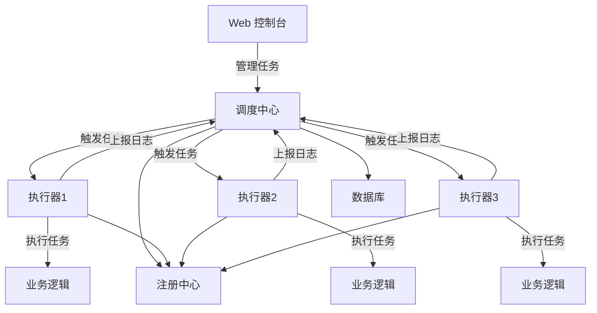
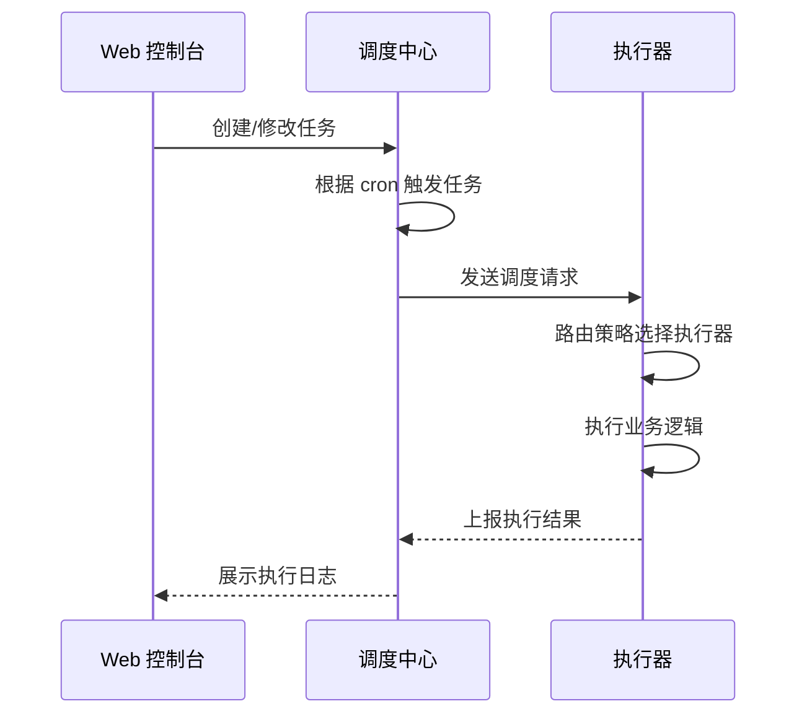

# 任务调度：XXL-JOB

> **核心认知**：XXL-JOB 是一个分布式任务调度平台，解决定时任务的分布式部署、失败重试、分片执行、日志收集等问题。它将任务调度中心与执行器分离，通过 Web 控制台统一管理所有定时任务，是 Java 生态中最流行的轻量级任务调度方案。

## 要解决的问题

| 问题 | 单机定时任务的痛点 | XXL-JOB 的解法 |
|------|-------------------|---------------|
| 单点故障 | 任务绑定单机，机器故障任务停跑 | 多执行器部署，自动故障转移 |
| 任务分片 | 单机处理海量数据慢 | 分片广播，多节点并行处理 |
| 失败重试 | 任务失败无自动重试 | 内置重试机制 + 失败告警 |
| 依赖管理 | 任务间依赖手动编排 | 任务链 + DAG 执行 |
| 日志分散 | 每台机器日志独立查看 | 中心化日志收集 + Web 查看 |
| 动态管理 | 修改 cron 需重启应用 | Web 控制台动态修改 + 立即生效 |

## 架构设计

### 核心组件



### 调度流程



## 核心特性详解

### 1. 路由策略

| 策略 | 说明 | 适用场景 |
|------|------|----------|
| ROUND | 轮询 | 负载均衡 |
| FIRST | 第一个执行器 | 主备模式 |
| LAST | 最后一个执行器 | 特定节点执行 |
| RANDOM | 随机 | 简单负载均衡 |
| HASH | 哈希 | 同一任务固定节点 |
| CONSISTENT_HASH | 一致性哈希 | 缓存亲和性 |
| LEAST_FREQUENTLY_USED | 最不经常使用 | 资源均衡 |
| LEAST_RECENTLY_USED | 最近最久未使用 | 资源均衡 |
| FAILOVER | 故障转移 | 高可用 |
| BUSYOVER | 忙碌转移 | 避免过载 |
| SHARDING_BROADCAST | 分片广播 | 并行处理 |

### 2. 分片广播模式

```
分片广播流程：
  1. 调度中心触发任务
  2. 广播到所有在线执行器
  3. 每个执行器获取分片参数（index, total）
  4. 根据分片参数处理对应数据

数据分片策略：
  ├── 分片键取模：user_id % total == index
  ├── 范围分片：每段数据分配给不同执行器
  └── 一致性哈希：动态扩缩容时数据迁移少

示例：
  3 个执行器，分片参数：
    执行器1: index=0, total=3 → 处理 user_id % 3 == 0 的数据
    执行器2: index=1, total=3 → 处理 user_id % 3 == 1 的数据
    执行器3: index=2, total=3 → 处理 user_id % 3 == 2 的数据
```

### 3. 任务生命周期

```
任务状态流转：
  新建 → 已启动 → 运行中 → 成功/失败
  
  触发方式：
    ├── CRON 触发：按 cron 表达式定时触发
    ├── API 触发：HTTP 接口手动触发
    ├── 事件触发：依赖任务完成后触发
    └── 固定频率：每 N 秒执行一次
  
  失败处理：
    ├── 重试次数：可配置重试次数
    ├── 重试间隔：可配置重试间隔
    ├── 失败告警：邮件/钉钉/企微通知
    └── 失败回调：HTTP 回调通知上游系统
```

### 4. 任务依赖（DAG）

```
DAG 任务链示例：
  
  任务A (数据抽取)
    ↓
  任务B (数据转换) ← 依赖 A
    ↓
  任务C (数据加载) ← 依赖 B
    ↓
  任务D (数据验证) ← 依赖 C
  
  执行顺序：A → B → C → D
  失败策略：
    ├── 任一失败 → 整条链停止
    ├── 失败重试 → 从失败节点重试
    └── 超时终止 → 节点超时自动跳过
```

### 5. 日志收集与查看

```
日志架构：
  执行器 → 日志文件 → 调度中心（Web API）→ Web 控制台

  日志特性：
    ├── 实时日志流：WebSocket 推送
    ├── 历史日志：按日期查看
    ├── 日志搜索：关键字过滤
    ├── 日志下载：导出完整日志
    └── 执行耗时：统计任务执行时间
```

## 部署架构

### 单机部署

```
适用：开发/测试环境
  
  XXL-JOB Admin (调度中心)
    └── 内嵌 Tomcat
    └── 数据库：MySQL
  
  执行器（嵌入应用）
    └── Spring Boot 应用
    └── @XxlJob 注解声明任务
```

### 集群部署

```
适用：生产环境

  调度中心集群（2+ 节点）：
    ├── 负载均衡：Nginx
    ├── 任务触发：DB 锁保证同一任务只触发一次
    ├── 会话管理：Redis
    └── 数据库：MySQL 主从

  执行器集群（N 节点）：
    ├── 自动注册：启动时注册到调度中心
    ├── 故障摘除：心跳检测，超时自动摘除
    ├── 路由策略：多种策略可选
    └── 分片广播：所有执行器并行处理
```

## Cron 表达式速查

| 表达式 | 含义 |
|--------|------|
| `0 0/30 * * * ?` | 每 30 分钟 |
| `0 0 2 * * ?` | 每天凌晨 2 点 |
| `0 0 2 * * ?` | 每天凌晨 2 点 |
| `0 0 1 ? * MON-FRI` | 工作日凌晨 1 点 |
| `0 0 15 1 * ?` | 每月 1 号下午 3 点 |
| `0 0 0 1 1 ?` | 每年 1 月 1 日 |

## 与其他调度方案对比

| 特性 | XXL-JOB | Elastic-Job | Quartz | Spring Scheduler |
|------|---------|-------------|--------|------------------|
| 分布式 | ✅ | ✅ | ❌ | ❌ |
| 分片执行 | ✅ | ✅ | ❌ | ❌ |
| 失败重试 | ✅ | ✅ | ❌ | ❌ |
| 日志收集 | ✅ | ❌ | ❌ | ❌ |
| Web 管理 | ✅ | ✅ | ❌ | ❌ |
| 任务依赖 | ✅ | ❌ | ❌ | ❌ |
| 学习成本 | 低 | 中 | 中 | 低 |
| 运维成本 | 低 | 中 | 中 | 低 |

## 常见陷阱

| 陷阱 | 后果 | 正确做法 |
|------|------|----------|
| 任务不做幂等 | 重复执行产生脏数据 | 任务逻辑必须幂等 |
| 分片键设计不合理 | 数据倾斜 | 选择均匀分布的分片键 |
| 不设超时 | 任务卡死占用资源 | 设置合理的执行超时时间 |
| 不做失败告警 | 任务失败无人知晓 | 配置告警通知 |
| cron 表达式错误 | 任务不触发或频繁触发 | 测试环境验证 cron |
| 执行器不注册 | 任务无法执行 | 确保执行器正确注册 |


## 执行器自动注册机制

```
执行器自动注册流程：
  1. 执行器启动时，扫描 @XxlJob 注解的方法
  2. 向调度中心发送注册请求（HTTP POST /api/registry）
  3. 注册信息包含：应用名、IP、端口、执行器版本
  4. 调度中心维护执行器注册表（DB + 内存）
  5. 执行器定时心跳续约（每 30s）
  6. 调度中心检测心跳超时（90s），自动摘除

  注册表数据结构：
    ├── app_name: 应用名称
    ├── registry_group: 注册分组（EXECUTOR）
    ├── address: 执行器地址（ip:port）
    ├── registry_time: 注册时间
    └── status: 0=在线 1=离线
```

```java
// 执行器启动自动注册配置
@Component
public class XxlJobSpringExecutor implements ApplicationContextAware {

    @Override
    public void setApplicationContext(ApplicationContext ctx) {
        // 1. 扫描所有 @XxlJob 注解方法
        Map<String, Object> jobHandlerMap = new HashMap<>();
        String[] beanNames = ctx.getBeanDefinitionNames();
        for (String beanName : beanNames) {
            Object bean = ctx.getBean(beanName);
            for (Method method : bean.getClass().getDeclaredMethods()) {
                XxlJob xxlJob = method.getAnnotation(XxlJob.class);
                if (xxlJob != null) {
                    String jobHandler = xxlJob.value();
                    jobHandlerMap.put(jobHandler, new MethodJobHandler(bean, method, jobHandler));
                }
            }
        }
        // 2. 启动内嵌 Server，接收调度请求
        startEmbedServer(jobHandlerMap);
        // 3. 注册到调度中心
        ExecutorRegistryThread.getInstance().registry(appName, address);
    }
}
```

## 分片广播数据迁移

```
分片广播扩容数据迁移策略：

  场景：从 3 台执行器扩展到 5 台

  方案一：一致性哈希迁移
    ├── 计算新旧分片映射
    ├── 只迁移受影响的数据分片
    ├── 迁移期间暂停对应分片任务
    └── 迁移完成后恢复

  方案二：双写过渡
    ├── 扩容期间新旧节点同时写入
    ├── 数据校验确保一致性
    ├── 切换流量到新节点
    └── 停止旧节点写入

  方案三：全量重分区
    ├── 暂停所有分片任务
    ├── 重新计算分片分配
    ├── 全量数据迁移
    └── 恢复任务执行

  推荐：分片键使用 user_id 时，扩容后取模基数变化
    旧：user_id % 3 → 新：user_id % 5
    迁移量约 60%（3/5 的数据需要迁移）
```

## 任务链实现详解

```
任务链（DAG）实现机制：
  ├── 事件触发：任务完成后触发下游任务
  ├── 父任务 ID：记录任务间的依赖关系
  ├── 触发模式：串行执行 / 并行执行
  └── 失败策略：任一失败停止 / 失败重试 / 超时跳过
```

```java
// 任务链配置示例
@XxlJob("dataExtractJob")
public void dataExtract() {
    // 数据抽取任务
    System.out.println("执行数据抽取...");
    // 抽取完成后，触发下游任务
    XxlJobHelper.log("数据抽取完成，触发转换任务");
}

@XxlJob("dataTransformJob")
public void dataTransform() {
    System.out.println("执行数据转换...");
}

@XxlJob("dataLoadJob")
public void dataLoad() {
    System.out.println("执行数据加载...");
}
```

```
任务链触发流程：
  调度中心配置任务依赖关系：
    任务A (id=1) -> 任务B (id=2) -> 任务C (id=3)

  执行流程：
    1. 调度中心触发任务A
    2. 任务A执行成功，上报结果
    3. 调度中心检测到任务A完成
    4. 自动触发任务B（事件触发）
    5. 任务B执行成功，触发任务C
    6. 整条链执行完成

  失败处理：
    任务B失败 -> 重试 3 次 -> 仍失败 -> 任务C不触发 -> 告警通知
```

## XXL-JOB + Docker/Kubernetes 部署

```
Docker Compose 部署：

  xxl-job-admin:
    image: xuxueli/xxl-job-admin:2.4.0
    ports:
      - "8080:8080"
    environment:
      - SPRING_DATASOURCE_URL=jdbc:mysql://db:3306/xxl_job
      - SPRING_DATASOURCE_USERNAME=root
      - SPRING_DATASOURCE_PASSWORD=root
    depends_on:
      - db

  xxl-job-executor:
    image: xuxueli/xxl-job-executor-springboot:2.4.0
    environment:
      - XXL_JOB_ADMIN_ADDRESS=http://xxl-job-admin:8080/xxl-job
      - XXL_JOB_APPNAME=xxl-job-executor
      - XXL_JOB_PORT=9999
    ports:
      - "9999:9999"
```

```yaml
# Kubernetes Deployment
apiVersion: apps/v1
kind: Deployment
metadata:
  name: xxl-job-admin
spec:
  replicas: 2
  selector:
    matchLabels:
      app: xxl-job-admin
  template:
    metadata:
      labels:
        app: xxl-job-admin
    spec:
      containers:
      - name: xxl-job-admin
        image: xuxueli/xxl-job-admin:2.4.0
        ports:
        - containerPort: 8080
        env:
        - name: SPRING_DATASOURCE_URL
          value: "jdbc:mysql://mysql-service:3306/xxl_job"
---
apiVersion: apps/v1
kind: Deployment
metadata:
  name: xxl-job-executor
spec:
  replicas: 3
  selector:
    matchLabels:
      app: xxl-job-executor
  template:
    metadata:
      labels:
        app: xxl-job-executor
    spec:
      containers:
      - name: xxl-job-executor
        image: xuxueli/xxl-job-executor-springboot:2.4.0
        env:
        - name: XXL_JOB_ADMIN_ADDRESS
          value: "http://xxl-job-admin:8080/xxl-job"
        - name: XXL_JOB_APPNAME
          value: "xxl-job-executor"
        - name: XXL_JOB_PORT
          value: "9999"
```

## XXL-JOB API 集成

```
XXL-JOB 提供的 HTTP API：

  任务管理：
    POST /api/add          新增任务
    POST /api/update       更新任务
    POST /api/remove       删除任务
    POST /api/start        启动任务
    POST /api/stop         停止任务
    POST /api/trigger      手动触发任务

  执行器管理：
    POST /api/registry     执行器注册
    POST /api/registryRemove 执行器摘除

  日志查询：
    GET  /api/loglist      日志列表
    GET  /api/logdetail    日志详情
    GET  /api/loglog      实时日志流

  使用方式：
    curl -X POST http://admin:8080/xxl-job/api/add \
      -H "Content-Type: application/json" \
      -d '{"jobGroup":1,"jobDesc":"测试任务","cron":"0 0/30 * * * ?","executorRouteStrategy":"ROUND"}'
```

```java
// 通过 API 动态创建任务
@Component
public class XxlJobApiClient {

    @Value("${xxl.job.admin.address}")
    private String adminAddress;

    public void createJob(String jobDesc, String cron, String executorParam) {
        Map<String, Object> params = new HashMap<>();
        params.put("jobGroup", 1);
        params.put("jobDesc", jobDesc);
        params.put("scheduleType", "CRON");
        params.put("scheduleConf", cron);
        params.put("executorRouteStrategy", "ROUND");
        params.put("executorHandler", "demoJobHandler");
        params.put("executorParam", executorParam);
        params.put("executorBlockStrategy", "SERIAL_EXECUTION");
        params.put("executorTimeout", 0);
        params.put("executorFailRetryCount", 0);

        String result = HttpUtil.post(adminAddress + "/api/add", params);
        log.info("创建任务结果: {}", result);
    }
}
```

## 任务执行超时处理

```
超时处理机制：
  1. 调度中心记录任务触发时间
  2. 执行器设置任务执行超时时间（executorTimeout）
  3. 超时后执行器强制终止任务（interrupt 线程）
  4. 调度中心标记任务为超时失败
  5. 触发失败告警

  超时处理策略：
    ├── 温和终止：Thread.interrupt() 发送中断信号
    ├── 强制终止：Runtime.halt() 强制停止 JVM（慎用）
    ├── 超时回调：超时后执行指定回调方法
    └── 超时告警：发送超时告警通知
```

```java
@XxlJob("longRunningJob")
public void longRunningJob() {
    try {
        // 模拟长时间任务
        for (int i = 0; i < 1000; i++) {
            // 检查线程中断标记
            if (Thread.currentThread().isInterrupted()) {
                XxlJobHelper.log("任务被中断，执行清理...");
                cleanup();
                return;
            }
            processChunk(i);
            Thread.sleep(1000);
        }
    } catch (InterruptedException e) {
        XxlJobHelper.log("任务超时中断，执行清理...");
        cleanup();
        Thread.currentThread().interrupt();
    }
}

private void cleanup() {
    // 清理临时文件、释放资源等
    // 确保任务可安全重试
}
```

## 任务日志架构

```
日志收集架构：
  执行器端：
    ├── 日志文件：本地文件存储（xxl-job/jobhandler/）
    ├── 日志 ID：每次任务执行生成唯一 logId
    └── 日志上报：通过 HTTP 上报到调度中心

  调度中心端：
    ├── 日志存储：数据库（xxl_job_log）
    ├── 实时日志流：WebSocket 推送
    └── 日志查询：支持关键字搜索、时间范围查询

  日志数据结构：
    log_id:          日志 ID
    job_id:          任务 ID
    job_group:       执行器组
    executor_address: 执行器地址
    executor_param:  执行参数
    trigger_time:    触发时间
    trigger_code:    触发结果码
    trigger_msg:     触发信息
    handle_time:     执行时间
    handle_code:     执行结果码
    handle_msg:      执行信息
    alarm_status:    告警状态
```

```sql
-- 调度中心日志表
CREATE TABLE xxl_job_log (
    id BIGINT NOT NULL AUTO_INCREMENT,
    job_group INT NOT NULL COMMENT '执行器组ID',
    job_id INT NOT NULL COMMENT '任务ID',
    trigger_time DATETIME NOT NULL COMMENT '触发时间',
    trigger_code INT NOT NULL COMMENT '触发结果码 0=成功',
    trigger_msg VARCHAR(512) DEFAULT NULL COMMENT '触发信息',
    handle_time DATETIME DEFAULT NULL COMMENT '执行时间',
    handle_code INT DEFAULT NULL COMMENT '执行结果码',
    handle_msg VARCHAR(2048) DEFAULT NULL COMMENT '执行信息',
    alarm_status TINYINT DEFAULT 0 COMMENT '告警状态 0=未告警 1=已告警',
    executor_address VARCHAR(256) DEFAULT NULL COMMENT '执行器地址',
    executor_param VARCHAR(512) DEFAULT NULL COMMENT '执行参数',
    PRIMARY KEY (id),
    KEY idx_job_id (job_id),
    KEY idx_trigger_time (trigger_time)
) ENGINE=InnoDB DEFAULT CHARSET=utf8mb4;
```

## XXL-JOB vs Elastic-Job 详细对比

| 维度 | XXL-JOB | Elastic-Job |
|------|---------|-------------|
| 核心架构 | 中心化调度（调度中心） | 去中心化（ZooKeeper 协调） |
| 调度方式 | 基于数据库锁 | 基于 ZooKeeper 临时节点 |
| 注册中心 | 可选（数据库也可） | 必须（ZooKeeper） |
| 任务分片 | 分片广播模式 | 内置分片策略 |
| 数据一致性 | DB 锁保证 | ZooKeeper 选举保证 |
| 运维成本 | 低（Web 控制台） | 中（需要 ZooKeeper） |
| 功能丰富度 | 高（日志/告警/DAG） | 中（基础调度） |
| 性能 | 高 | 高 |
| 社区活跃度 | 高（国内流行） | 中 |
| 适用场景 | 通用任务调度 | 大数据任务调度 |

```
选型建议：
  ├── 通用定时任务：XXL-JOB（功能丰富、运维简单）
  ├── 大数据处理：Elastic-Job（原生分片支持）
  ├── 无 ZooKeeper 环境：XXL-JOB（数据库即可）
  ├── 需要 DAG 任务链：XXL-JOB（内置支持）
  └── 需要弹性扩缩容：两者均支持
```

## XXL-JOB 在 ETL 流程中的应用

```
ETL 数据管道架构：

  数据源 → 抽取 → 转换 → 加载 → 数据仓库

  XXL-JOB 任务链：
    Step 1: 数据抽取（dataExtractJob）
      ├── 分片广播模式，3 个执行器并行抽取
      ├── 分片键：source_id % 3 == index
      └── 产出：数据暂存到 staging 表

    Step 2: 数据转换（dataTransformJob）
      ├── 依赖抽取任务完成
      ├── 数据清洗、格式转换、字段映射
      └── 产出：转换后数据写入 temp 表

    Step 3: 数据加载（dataLoadJob）
      ├── 依赖转换任务完成
      ├── 数据校验、去重、合并
      └── 产出：正式写入数据仓库

    Step 4: 数据验证（dataValidateJob）
      ├── 依赖加载任务完成
      ├── 数据质量检查、统计校验
      └── 产出：验证报告
```

```java
// ETL 抽取任务（分片模式）
@XxlJob("dataExtractJob")
public void dataExtract() {
    int shardIndex = XxlJobHelper.getShardIndex();
    int shardTotal = XxlJobHelper.getShardTotal();

    // 根据分片参数查询数据
    List<DataSource> sources = dataSourceMapper.selectByShard(shardIndex, shardTotal);

    for (DataSource source : sources) {
        try {
            List<DataRecord> records = extractData(source);
            // 批量写入 staging 表
            stagingMapper.batchInsert(records);
            XxlJobHelper.log("抽取数据源 {} 完成，记录数: {}", source.getId(), records.size());
        } catch (Exception e) {
            XxlJobHelper.log("抽取数据源 {} 失败: {}", source.getId(), e.getMessage());
            XxlJobHelper.handleFail("抽取失败: " + e.getMessage());
            return;
        }
    }
    XxlJobHelper.handleSuccess("所有数据源抽取完成");
}
```

## 与其他板块的关系

| 关联板块 | 关系描述 |
|----------|----------|
| **微服务架构** | XXL-JOB 是微服务定时任务的标准方案 |
| **数据管道** | 定时任务驱动 ETL 数据处理 |
| **监控体系** | 任务执行指标接入 Prometheus |
| **消息队列** | 任务触发可通过 MQ 异步执行 |
| **分布式锁** | DB 锁保证调度中心集群的任务唯一触发 |

## 一句话总结

XXL-JOB 是分布式任务调度平台，将调度中心与执行器分离，提供分片执行、失败重试、日志收集等企业级特性，是 Java 生态中定时任务管理的首选方案。

---

## 参考资料

- [XXL-JOB 官方文档](https://www.xuxueli.com/xxl-job/)
- [XXL-JOB GitHub](https://github.com/xuxueli/xxl-job)
- [Cron 表达式参考](https://www.xuxueli.com/xxl-job/#7.1%C2%A0Cron%E8%A1%A8%E8%BE%BE%E5%BC%8F)
- [XXL-JOB vs Elastic-Job](https://www.xuxueli.com/xxl-job/#11.1%C2%A0%E4%B8%8EXXJ-JOB%E5%AF%B9%E6%AF%94)
