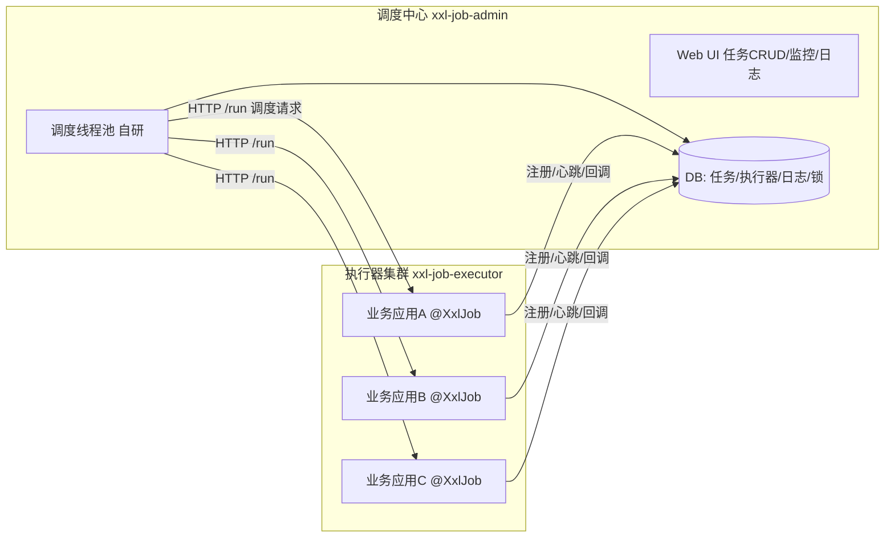

# 任务调度 XXL-JOB

> 日常项目里最常被问到、也最容易踩坑的中间件之一。本文把「为什么需要分布式调度」「XXL-JOB 怎么工作的」「和 Quartz / Elastic-Job / PowerJob 怎么选」「生产怎么落地」一次讲透。
> 开源参考：[xuxueli/xxl-job](https://github.com/xuxueli/xxl-job)（Java，GPLv3，调度中心 + 执行器架构，已接入 700+ 企业，2026 仍在更新）。

---

## 一、先搞懂：为什么需要「分布式任务调度」

单体时代用 `@Scheduled` 或 Linux `crontab` 就够了。但到了微服务 / 集群部署，单机定时任务有硬伤：

| 痛点 | 说明 |
|------|------|
| 重复执行 | 同一任务在 N 个节点各自跑，数据被重复处理（除非你自己在代码里加分布式锁） |
| 无统一管控 | 任务散落在各服务代码里，启停、改 cron、看日志都得登机器，改完还得重新发版 |
| 无失败重试 / 告警 | 任务挂了没人知道，只能靠业务方投诉 |
| 无分片能力 | 千万级数据一个线程跑，跑几个小时，还不支持横向扩容 |
| 无调度高可用 | 调度节点挂了，任务整体停摆 |

**分布式任务调度平台**就是来解决这些：把「调度」和「执行」解耦，调度中心统一管控，执行器集群干活，支持分片、重试、告警、可视化。

### 三种常见形态

1. **中心化调度（XXL-JOB 路线）**：调度中心主动「推」任务给执行器（HTTP/RPC）。调度逻辑集中，可视化强。
2. **去中心化调度（Elastic-Job 路线）**：基于 Quartz + ZooKeeper 选举，每个节点既是调度也是执行。依赖 ZK 做协调。
3. **自治式作业（PowerJob 路线）**：调度服务 +  worker，支持 DAG 工作流、MapReduce 分片，更现代。

---

## 二、XXL-JOB 核心架构

XXL-JOB 采用经典的 **「调度中心 + 执行器」** 解耦设计：



### 1. 调度中心（xxl-job-admin）

- 一个独立的 Spring Boot 应用，自带 Web UI。
- **自研调度组件**：2.x 起不再依赖 Quartz，自研调度线程 + Cron 解析，通过 **数据库行锁**（`SELECT ... FOR UPDATE`）保证集群部署时只有一个节点触发某次调度（调度一致性）。
- 负责任务的 CRUD、触发、日志收集、告警、报表。

### 2. 执行器（xxl-job-core）

- 以 **JAR 形式内嵌到你的业务应用**（也可以独立部署）。
- 用 `@XxlJob("demoJobHandler")` 注解声明任务方法。
- 启动时向调度中心 **自动注册**（上报地址 + 拥有的 JobHandler 列表），通过心跳保活。
- 收到调度请求后，在业务进程内执行任务逻辑，并回调结果。

### 3. 一次调度发生了什么

1. 调度中心扫描 `xxl_job_info`，根据 cron 触发任务。
2. 取 DB 锁保证本次触发只由一个 admin 节点执行（HA）。
3. 按 **路由策略** 选出目标执行器地址。
4. 通过 HTTP 调用执行器的 `/run` 接口，带上 `jobId`、`logId`、`shardingParam` 等。
5. 执行器线程池执行 `@XxlJob` 方法，实时回传 Rolling 日志。
6. 执行完成回调 `/callback` 上报结果；失败按配置重试。

---

## 三、关键特性逐条拆解（面试高频）

### 3.1 路由策略（执行器集群怎么选一台）

| 策略 | 行为 |
|------|------|
| FIRST / LAST | 固定第一个 / 最后一个地址 |
| ROUND（轮询） | 依次轮询 |
| RANDOM | 随机 |
| CONSISTENT_HASH | 一致性 Hash，同一 sharding 参数落到固定节点 |
| LFU / LRU | 最不常使用 / 最近最久未使用 |
| **FAILOVER（故障转移）** | 依次探测节点，选第一个存活的 |
| BUSY_TRANSFER（忙碌转移） | 节点忙碌（线程池满）则转给空闲节点 |
| **SHARDING_BROADCAST（分片广播）** | 向集群**所有**执行器各发一次，并带分片参数 |

### 3.2 分片广播（大数据量处理的杀手锏）

场景：要处理 1 亿条数据，单机跑不动。用分片广播：

```java
@XxlJob("shardingJobHandler")
public void shardingJobHandler() throws Exception {
    int shardIndex = XxlJobHelper.getShardIndex();   // 当前分片序号，如 0/1/2
    int shardTotal = XxlJobHelper.getShardTotal();   // 总分片数，如 3
    // 只处理 id % shardTotal == shardIndex 的数据
    List<Long> ids = orderMapper.selectByMod(shardTotal, shardIndex);
    for (Long id : ids) { process(id); }
}
```

执行器集群部署 3 台 → 调度中心广播给 3 台 → 每台拿 `shardIndex` 各自处理 1/3，整体并行。**动态扩容执行器即可增加分片数**，协同提升吞吐。这是「其他框架技术.md」里 Quartz 做不到的。

### 3.3 阻塞处理策略（调度太密、执行器忙不过来）

| 策略 | 行为 |
|------|------|
| SERIAL_EXECUTION（单机串行，默认） | 排队，一个跑完再跑下一个 |
| DISCARD_LATER（丢弃后续） | 本次调度直接丢弃，不执行 |
| COVER_EARLY（覆盖之前） | 中断正在跑的，执行新的 |

> 经验：非幂等 / 会写数据的任务用「单机串行」；可丢弃的探测类任务用「丢弃后续」。

### 3.4 失败重试与超时控制

- **失败重试**：任务失败按配置次数自动重试；**分片任务支持分片粒度重试**（只重试失败的那一片）。
- **超时控制**：自定义超时时间，超时就中断任务。
- **失败告警**：默认邮件，预留扩展接口可接钉钉 / 飞书 / 企业微信。

### 3.5 其他亮点

- **GLUE 模式**：Web IDE 在线写 Java 代码，动态发布即时生效，不用发版（适合临时脚本）。
- **Rolling 实时日志**：在 admin 页面实时看执行器输出，排查神器。
- **调度报表**：成功 / 失败 / 调度频次统计。
- **跨语言 OpenAPI**：通过 API 触发任务，非 Java 也能用。
- **容器化 / 优雅停机**：K8s 友好。

---

## 四、和主流方案的选型对比

| 维度 | XXL-JOB | Quartz | Elastic-Job（已停更） | PowerJob |
|------|---------|--------|----------------------|----------|
| 调度模型 | 中心化（admin 推送） | 嵌入 / 集群（DB 锁） | 去中心化（ZK 选举） | 中心化（调度服务 + worker） |
| 可视化 UI | ✅ 内置强大 | ❌ 无 | ❌（依赖外部） | ✅ 内置 |
| 分片能力 | ✅ 分片广播 | ❌ | ✅ | ✅ MapReduce 分片 |
| 工作流 DAG | ❌（仅父子任务依赖） | ❌ | ❌ | ✅ 原生 DAG |
| 依赖中间件 | 仅 MySQL | 仅 JDBC | ZooKeeper | 仅 MongoDB/MySQL |
| 失败重试 / 告警 | ✅ 完善 | ❌ | 部分 | ✅ |
| 轻量易上手 | ✅ | ✅ | 中（要搭 ZK） | 中 |
| 维护状态 | 活跃 | 停滞 | **已停止维护** | 活跃 |

**选型结论**：
- 绝大多数国内 Java 业务系统 → **XXL-JOB**（开箱即用、中文友好、可视化强）。
- 需要 **DAG 工作流 / MapReduce 重度分片 / 复杂依赖编排** → **PowerJob**（新一代）。
- 老系统已经在用 Quartz、且任务简单 → 不折腾，但新项目别再选裸 Quartz。
- Elastic-Job 已停止维护，新项目不推荐。

---

## 五、生产落地实践

### 5.1 接入步骤

1. 初始化 `tables_xxl_job.sql`（建 8 张表：job_info / job_log / job_group / job_registry / job_lock 等）。
2. 部署 `xxl-job-admin`，配置 `spring.datasource` 指向同一库。
3. 业务应用引入 `xxl-job-core`，配置 `xxl.job.admin.addresses`、`executor.appname`、`executor.port`。
4. 写 `@XxlJob` 方法，admin 页面配任务（cron + 路由策略 + 重试次数）。

### 5.2 高可用部署

- **调度中心 HA**：admin 多节点部署，共享同一个 MySQL，DB 锁保证不重复触发。
- **执行器 HA**：业务应用多实例，appname 相同即同一执行器集群，调度中心自动发现。

### 5.3 常见坑

1. **执行器地址注册不上**：检查 `executor.ip` 是否能连通（容器环境要配宿主机 IP 或 `preferIp=true`）。
2. **任务重复执行**：同一 admin 下多个执行器 appname 配错成不同值，导致分片错乱；或 cron 配错导致超频。
3. **分片参数没用**：用了分片广播但代码里没读 `getShardIndex()`，等于每台都全量跑。
4. **任务阻塞堆积**：阻塞策略用了「单机串行」但任务执行慢，导致后续全排队——评估是否改「丢弃后续」或优化任务。
5. **DB 单点**：调度中心强依赖 MySQL，数据库要主从 / 高可用。
6. **GLUE 模式滥用**：GLUE 代码不在 Git 里，团队协作易失控，仅适合临时脚本。

---

## 六、面试高频速查

- **XXL-JOB 怎么保证调度不重复？** 调度中心集群通过 DB 行锁（`FOR UPDATE`）竞争，只有一个节点执行当次触发。
- **调度中心挂了会怎样？** 多节点部署共享 DB 即可 HA；单节点挂则暂停调度，但已下发的任务由执行器继续跑完。
- **分片广播适用什么场景？** 大批量数据并行处理（如全表扫描、批量对账、数据迁移），按 `shardingIndex` 切片。
- **和 Quartz 比优势？** 可视化、分片、失败重试、告警、路由策略、动态修改，Quartz 都没有。
- **执行器怎么注册？** 启动后向 admin 发注册请求 + 心跳保活，admin 维护 `job_registry`（含 30s 过期）。
- **任务失败了怎么排查？** admin 的 Rolling 实时日志 + `job_log` 表；配钉钉告警。

---

## 七、与其他板块的关系

- 和「**源码系列/Spring**」：执行器是 Spring Bean，`@XxlJob` 在 Spring 容器启动时扫描注册。
- 和「**基础知识/MQ**」：重试 / 异步任务也可用 MQ 延时消息实现，但不具备统一管控与分片；二者常互补（XXL-JOB 触发，MQ 解耦执行）。
- 和「**基础知识/分布式事务 Seata**」：调度任务里跨服务写数据，必要时引入 Seata 保证一致。
