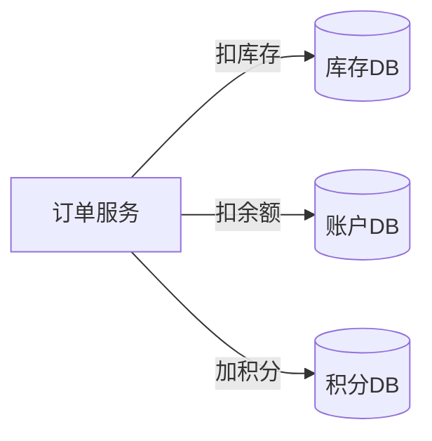
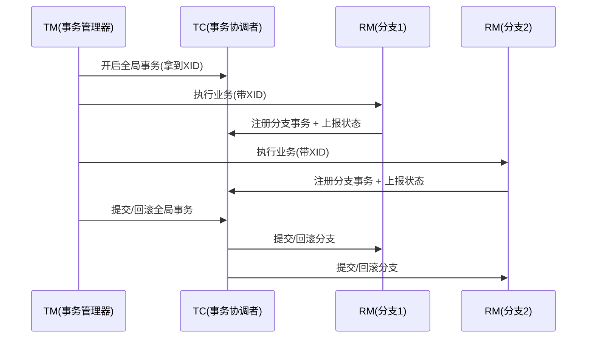
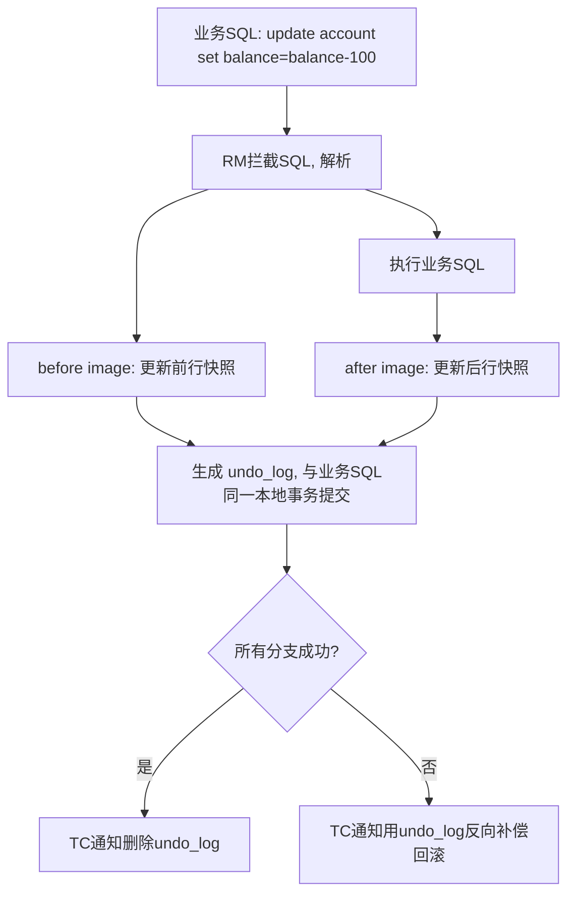

# 分布式事务 Seata

> 微服务下「下单一笔单子，要扣库存、扣余额、记积分、发消息」——任一步失败，数据就对不上了。本文讲清分布式事务的几种解法，重点拆解 **Seata 的 AT / TCC / SAGA / XA 四种模式**，以及怎么选型。
> 开源参考：[apache/seata](https://github.com/apache/seata)（Java，Apache-2.0，源自阿里 TXC / 蚂蚁 XTS，2023 进入 Apache 孵化器、现为顶级项目，是目前 Java 微服务最主流的分布式事务框架）。

---


## 〇、本体介绍（它是什么 / 适用场景 / 核心概念）

**它是什么**：Seata 是阿里开源的**分布式事务解决方案**，提供 AT、TCC、Saga、XA 四种模式，让跨多个微服务/数据源的写操作保持最终一致或强一致，对业务侵入度低（AT 模式基本无侵入）。

**解决什么痛点**：单体本地事务（@Transactional）在微服务拆分后失效——一个业务要写订单库、库存库、账户库，任一步失败如何回滚？Seata 引入 TC（事务协调者）统一编排全局事务的两阶段提交/回滚。

**核心概念**：TC（Transaction Coordinator，独立部署）、TM（Transaction Manager，发起方 @GlobalTransactional）、RM（Resource Manager，各分支）、XID（全局事务 ID）、Branch（分支事务）、undo_log（AT 回滚日志）、全局锁、两阶段提交。

**适用场景**：跨服务下单扣库存、转账、电商核心链路的最终一致/强一致。
**不适用**：单库事务（直接用本地事务即可）、超高性能极致低延迟（XA 模式性能差）。

---

## 一、问题本质：为什么本地事务不够用



单体应用：一个本地事务（`@Transactional`）搞定，要么全成要么全回。
微服务：每个服务**独立数据源**，本地事务只能管自己。扣了库存、扣余额时账户服务挂了 → 库存已扣、余额没扣 → **数据不一致**。

核心矛盾：**跨多个独立事务资源，如何保证「整体」要么都成功、要么都回滚**。

---

## 二、分布式事务的几种经典解法

| 方案 | 一致性 | 侵入性 | 性能 | 适用场景 |
|------|--------|--------|------|----------|
| 2PC / XA | 强一致 | 低 | 差（锁资源） | 短事务、强一致核心业务 |
| TCC | 强一致 | 高 | 好 | 高并发、可控业务 |
| SAGA | 最终一致 | 中 | 好（无锁） | 长流程、跨系统 |
| 本地消息表 / 事务消息 | 最终一致 | 中 | 好 | 异步通知、解耦 |

**Seata 是「框架」**，把 AT / TCC / SAGA / XA 都封装好，让你按场景切换，不用自己造轮子。

---

## 三、Seata 核心模型：TC / TM / RM



- **TC（Transaction Coordinator）**：独立部署的协调者，维护全局 / 分支事务状态，驱动提交或回滚。
- **TM（Transaction Manager）**：定义在哪开始全局事务（`@GlobalTransactional`）。
- **RM（Resource Manager）**：管理分支事务资源（数据源），向 TC 注册、上报、接收指令。
- **XID**：全局事务 ID，通过 RPC 上下文（Dubbo / Spring Cloud / gRPC）透传到各分支。

---

## 四、AT 模式（最常用，无侵入）

### 4.1 原理

AT 是「**非侵入的自动补偿**」——业务代码几乎不用改，引入 starter + 代理数据源即可。



### 4.2 两阶段

- **一阶段**：执行业务 SQL 的同时，RM 拦截并生成 **undo_log（前后镜像）**，和业务数据 **同一个本地事务** 提交。此时数据库已是「最终状态」，无需长期持锁。
- **二阶段**：
  - 提交：异步删除 undo_log（非常快）。
  - 回滚：用 undo_log 生成反向 SQL，把数据恢复成 before image。

### 4.3 全局锁与隔离

- 为避免「脏写」，AT 在一阶段提交前会向 TC 申请 **全局锁**（行级）。别的事务要改同一行，拿不到全局锁就阻塞 / 失败。
- 默认隔离级别 **读未提交**；要读已提交需在 `@GlobalTransactional` 上加 `@GlobalLock` 或开启 `selectForUpdate`。

### 4.4 AT 的优缺点与坑

- ✅ 无侵入、易上手、性能好（相比 XA 不长期持 DB 锁）。
- ❌ 只支持关系型数据库（MySQL / Oracle / PostgreSQL / TiDB 等）。
- ❌ 有全局锁冲突风险（热点行高并发写入会排队）。
- ❌ 脏读 / 脏写需配全局锁；跨库多 SQL 的复杂分支要小心。
- ❌ undo_log 表必须和业务表同库；要定期清理。

---

## 五、TCC 模式（高性能强一致，侵入高）

Try-Confirm-Cancel 三阶段，业务自己写：

- **Try**：预留资源（如冻结金额）。
- **Confirm**：确认提交（真正扣款）。**必须幂等**。
- **Cancel**：释放预留（解冻）。**必须幂等**。

要解决的三个经典问题：

| 问题 | 说明 | 解法 |
|------|------|------|
| 空回滚 | 没收到 Try 就收到 Cancel | 记录事务状态，Cancel 时若 Try 未执行则记空回滚直接返回 |
| 防悬挂 | Cancel 比 Try 先到，之后 Try 又执行 | 发现已有空回滚记录则 Try 不再执行 |
| 幂等 | 网络重试导致 Confirm/Cancel 多次 | 用事务状态表（Seata 的 `tcc_fence_log`）去重 |

Seata 提供 `@TwoPhaseBusinessAction` + TCC fence 自动处理悬挂 / 幂等，大幅降低复杂度。

---

## 六、SAGA 模式（长事务、最终一致）

把大事务拆成多个本地事务，每个配一个**补偿操作**。失败则**逆序**执行补偿。

```
创建订单 → 扣库存 → 扣余额
  ↑          ↑          ↓失败
  └──── 补偿库存 ← 补偿订单 ←┘
```

- ✅ 无全局锁，适合长流程、跨系统（如机票 + 酒店 + 接送机组合订单）。
- ❌ 只能最终一致；补偿逻辑设计复杂。
- Seata 用**状态机引擎**编排 Saga，可视化配置正向 / 补偿。

---

## 七、XA 模式（强一致，性能差）

基于数据库原生 XA 接口（2PC）。Seata 在框架内管理 XA 事务。

- ✅ 强一致、无侵入。
- ❌ 全程持锁（Prepare 阶段锁资源到 Commit），性能差、协调者风险。
- 适合对一致性极度敏感、并发不高的核心业务。

---

## 八、和「本地消息表 / 事务消息」怎么选

Seata 之外，还有一类**基于 MQ 的最终一致方案**：

- **本地消息表（Outbox）**：业务表 + 消息表同事务写，定时任务扫描投递 MQ，消费端幂等。
- **RocketMQ 事务消息**：半消息 → 本地事务 → Commit/Rollback，MQ 回查确认。

| 维度 | Seata AT | 本地消息表 / 事务消息 |
|------|----------|----------------------|
| 一致性 | 近强一致（短窗口） | 最终一致（有延迟） |
| 依赖 | 独立 TC 服务 | 仅 MQ |
| 跨语言 | Java 为主 | 任意（MQ 多语言） |
| 适合 | 同步跨服务写 | 异步解耦（如发通知、写 ES） |

**经验**：同步强一致用 Seata；异步通知 / 异构同步（如刷新缓存、写 ES）用事务消息更轻。

---

## 九、生产落地与坑

1. **TC 高可用**：TC 独立部署集群，存储可用 DB 或 Raft（新版本 beta）。别让它单点。
2. **undo_log 表**：每个参与 AT 的库都要建 `undo_log` 表，且与业务同库同事务。
3. **热点行冲突**：高并发改同一行（如账户余额）用 AT 会全局锁排队 → 这种场景考虑 TCC 或本地消息表。
4. **事务边界**：`@GlobalTransactional` 别包太大，长事务拖垮 TC。
5. **只读查询别进全局事务**：避免无谓加锁。
6. **与 MQ 配合**：AT 保证同步一致，事务消息保证异步一致，二者互补。

---

## 面试高频问题（20+ 条）

1. **Seata 的三种核心角色？** TC（Transaction Coordinator，独立部署的事务协调者）、TM（Transaction Manager，带 @GlobalTransactional 的发起方）、RM（Resource Manager，各分支资源）。它们通过 XID 串联全局事务。

2. **AT 模式原理（两阶段）？** 一阶段：本地事务提交前，拦截 SQL，生成 before/after 快照存入 undo_log，业务数据与 undo_log 同库同事务提交；二阶段：TC 通知提交则异步删 undo_log，通知回滚则按 undo_log 反向补偿。对业务零侵入。

3. **AT 模式的全局锁？** 一阶段本地提交时会申请全局锁（防止其他事务同时改同一数据造成脏写），二阶段结束释放。全局锁保证 AT 的写隔离。

4. **AT 的脏写/脏读问题？** 未用 Seata 的本地事务可能绕过全局锁直接改，造成脏写；AT 默认读不加全局锁可能读到中间态（脏读）。解决办法：关键读也走 Seata 或加 @GlobalLock。

5. **TCC 模式是什么？** Try-Confirm-Cancel：Try 预留资源（如冻结金额），Confirm 真正提交，Cancel 释放预留。高性能强一致但业务侵入高（要手写三方法）。

6. **TCC 空回滚/幂等/悬挂？** 空回滚：Try 未执行却收到 Cancel（网络丢 Try），Cancel 要能识别并直接成功；幂等：同分支可能重复调用，Confirm/Cancel 要幂等；悬挂：Cancel 比 Try 先到（资源未预留），要记录并忽略后续 Try。三者是 TCC 必处理的经典问题。

7. **Saga 模式适用什么？** 长事务、最终一致。把流程拆成一系列本地事务+补偿操作，某步失败则反向依次补偿。适合跨多服务、耗时长的业务流程（如旅行预订）。

8. **XA 模式特点？** 基于数据库 XA 协议，强一致、无业务侵入，但资源长时间锁占用、性能差，高并发慎用。

9. **Seata 与本地消息表/事务消息区别？** 本地消息表/事务消息（RocketMQ）是「最大努力通知 + 最终一致」，侵入中、性能较好；Seata AT/TCC 提供更强一致编排。选型看一致性要求与性能。

10. **AT 与 TCC 怎么选？** 一般业务用 AT（无侵入）；高性能强一致、需精细控制资源用 TCC；跨多数据源且不能改代码用 XA；长流程用 Saga。

11. **undo_log 表作用？** 存数据修改前后快照，是 AT 回滚的依据；必须在业务库同库同事务，保证本地提交即可回滚。

12. **全局事务 ID（XID）怎么传播？** 通过 RPC 上下文（如 Dubbo/Feign 透传）把 XID 带到下游 RM，下游注册为分支事务，保证同属一个全局事务。

13. **Seata 支持哪些注册/配置中心？** 支持 Nacos、Eureka、Redis、ZK、Consul 等做 TC 注册发现，配置可用 Nacos/Apollo 等。

14. **AT 模式适用前提？** 基于支持 ACID 的关系库（MySQL/Oracle/PG），且表有主键（回滚定位用）。无主键表 AT 不支持。

15. **TC 高可用怎么部署？** TC 自身无状态，可集群部署，注册到注册中心，前端通过负载均衡访问；事务日志建议存 DB 或 Redis 保证重启不丢。

16. **Seata 与 Spring Cloud / Dubbo 集成？** 通过 @GlobalTransactional 注解 + 数据源代理（DataSourceProxy）+ RPC 拦截器透传 XID，开箱即用。

17. **AT 的读隔离级别？** 默认 Read Uncommitted（可能脏读），如需 Read Committed 要用 @GlobalLock 或 SELECT FOR UPDATE 代理。

18. **生产落地常见坑？** undo_log 表未建/不在同库；数据源未代理导致不走 Seata；XID 未透传使分支未纳入全局事务；大事务全局锁竞争导致超时。

19. **Seata 与消息队列的最终一致方案怎么配合？** 强一致链路用 Seata；异步解耦/削峰用 MQ；也可用「Seata 事务内发可靠消息」保证本地与消息同时成功。

20. **TCC 业务侵入体现在哪？** 需把每个参与服务改造成 Try/Confirm/Cancel 三个接口，且要考虑空回滚、幂等、悬挂，开发成本明显高于 AT。

21. **Seata 的事务模式优先级？** 优先 AT（无侵入覆盖多数场景），其次 TCC（高性能），长事务 Saga，强一致但性能差才 XA。

22. **Seata 与 RocketMQ 事务消息本质差异？** 事务消息是解决「本地事务 + 消息发送」原子性（半消息+回查），保证下游最终一致；Seata 是解决「多数据源/多服务写」的全局一致编排。场景互补。

---
## 十一、与其他板块的关系

- 和「**基础知识/MQ**」：事务消息是分布式事务的另一条路；Seata 也可接入 RocketMQ 做最终一致。
- 和「**基础知识/分库分表 ShardingSphere**」：ShardingSphere 内置 XA / Seata 事务模式，跨库事务可走 Seata。
- 和「**基础知识/注册中心与配置中心**」：Seata 的 TC 注册发现常用 Nacos / Eureka。
