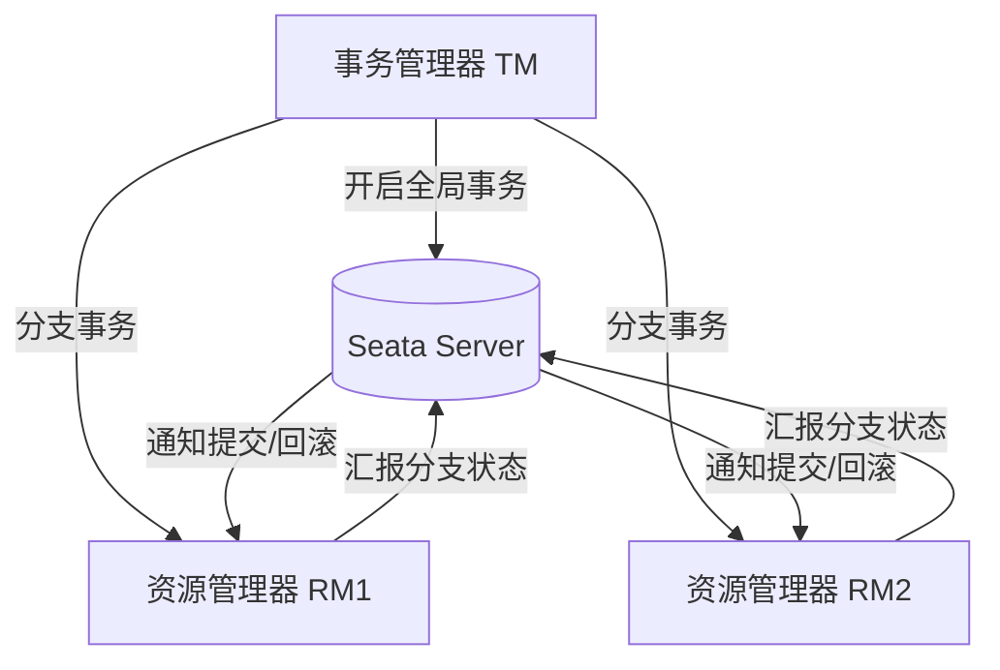

# 分布式事务：Seata

> **核心认知**：Seata 是阿里巴巴开源的分布式事务解决方案，提供 AT、TCC、SAGA、XA 四种事务模式。AT 模式通过 SQL 解析自动生成反向回滚 SQL，是侵入性最低的方案；TCC 模式通过业务层面的 Try/Confirm/Cancel 实现，是灵活性最高的方案。理解不同模式的适用场景是正确使用 Seata 的关键。

## 要解决的问题

| 问题 | 单体事务的痛点 | 分布式事务的挑战 | Seata 的解法 |
|------|---------------|-----------------|-------------|
| 跨服务数据一致性 | 本地事务保证 ACID | 跨服务无法使用本地事务 | 全局事务协调 |
| 跨库数据一致性 | 单库事务保证一致性 | 跨库无法使用本地事务 | 两阶段提交/补偿 |
| 性能与一致性 | 强一致但性能低 | 强一致性能更差 | 多种模式按需选择 |
| 补偿逻辑 | 不需要 | 需要手动实现补偿 | SAGA/TCC 内置补偿 |
| 数据隔离 | 本地事务保证 | 分布式环境无隔离 | 全局锁 + 读写隔离 |

## Seata 架构

### 核心组件



### 四大角色

| 角色 | 全称 | 职责 |
|------|------|------|
| TC | Transaction Coordinator | 事务协调器，管理全局事务和分支事务状态 |
| TM | Transaction Manager | 事务管理器，开启/提交/回滚全局事务 |
| RM | Resource Manager | 资源管理器，管理分支事务资源 |
| 应用 | Application | 业务代码，通过注解声明事务边界 |

## 四种事务模式

### 1. AT 模式（Automatic Transaction）

```
AT 模式原理：
  第一阶段（执行）：
    1. 解析业务 SQL，提取表名/条件/数据
    2. 生成 before image（执行前快照）
    3. 执行业务 SQL
    4. 生成 after image（执行后快照）
    5. 将 before/after image 存入 undo_log 表
    6. 释放本地锁

  第二阶段（提交/回滚）：
    提交：删除 undo_log（异步）
    回滚：
      1. 读取 undo_log
      2. 校验数据（dirty check）
      3. 执行反向 SQL（INSERT → DELETE, UPDATE → 还原）
      4. 删除 undo_log
```

**AT 模式 SQL 解析示例**：

```
原始 SQL：UPDATE account SET balance = balance - 100 WHERE user_id = 'A'

Before Image：
  user_id | balance
  --------|--------
  A       | 1000

After Image：
  user_id | balance
  --------|--------
  A       | 900

回滚 SQL：
  UPDATE account SET balance = 1000 WHERE user_id = 'A'
```

**AT 模式适用与限制**：

| 维度 | 说明 |
|------|------|
| 适用 | 基于关系型数据库的 CRUD 操作 |
| 优点 | 无侵入，自动解析 SQL |
| 缺点 | 全局锁影响并发性能 |
| 缺点 | 不支持非 SQL 的数据源（Redis/MQ） |
| 缺点 | undo_log 表增加存储开销 |

### 2. TCC 模式（Try-Confirm-Cancel）

```
TCC 模式流程：
  Try：
    检查资源 + 预留资源
    例：冻结账户余额 100 元

  Confirm：
    确认预留资源
    例：扣减冻结金额，真正扣减余额

  Cancel：
    取消预留资源
    例：解冻账户余额
```

**TCC 接口定义示例**：

```java
@LocalTCC
public interface AccountTccService {

    @TwoPhaseBusinessAction(name = "deduct", commitMethod = "confirm", rollbackMethod = "cancel")
    boolean tryDeduct(@BusinessActionContextParameter(paramName = "userId") String userId,
                      @BusinessActionContextParameter(paramName = "amount") BigDecimal amount);

    boolean confirm(BusinessActionContext context);
    boolean cancel(BusinessActionContext context);
}
```

**TCC 模式适用与限制**：

| 维度 | 说明 |
|------|------|
| 适用 | 业务逻辑复杂的场景 |
| 优点 | 无全局锁，性能高 |
| 优点 | 支持非 SQL 数据源 |
| 缺点 | 侵入性强，需实现三个接口 |
| 缺点 | 空回滚/悬挂问题需处理 |

### 3. SAGA 模式

```
SAGA 模式原理：
  正向事务链：
    T1 → T2 → T3 → T4（每个 Ti 是本地事务）

  补偿事务链（失败时）：
    T4 失败 → C3 → C2 → C1（反向执行补偿）

  编排方式：
    ├── 编排式（Orchestration）：中心协调器控制流程
    └── 协同式（Choreography）：事件驱动，每个参与者监听事件
```

**SAGA 适用场景**：

| 场景 | 说明 |
|------|------|
| 长事务 | 跨多个步骤的业务流程 |
| 跨系统集成 | 与外部系统的交互 |
| 无 Try 阶段 | 无法预留资源的场景 |
| 最终一致性 | 允许短暂不一致 |

### 4. XA 模式

```
XA 模式原理：
  第一阶段（Prepare）：
    所有参与者执行 SQL，锁定资源
    向 TC 汇报 prepare 状态

  第二阶段（Commit）：
    TC 通知所有参与者提交
    释放资源

  特点：
    ├── 强一致：数据库层面保证
    ├── 性能低：资源锁定时间长
    └── 兼容标准：符合 XA 规范
```

## 四种模式对比

| 维度 | AT | TCC | SAGA | XA |
|------|-----|-----|------|-----|
| 侵入性 | 低 | 高 | 中 | 低 |
| 一致性 | 强一致 | 强一致 | 最终一致 | 强一致 |
| 性能 | 中 | 高 | 中 | 低 |
| 补偿 | 自动 | 手动 | 手动 | 无需 |
| 锁机制 | 全局锁 | 业务锁 | 无锁 | 数据库锁 |
| 适用场景 | CRUD | 复杂业务 | 长事务 | 强一致要求 |
| 实现难度 | 低 | 高 | 中 | 低 |

## 高可用设计

```
Seata Server 高可用：
  ├── 注册中心：Nacos/Eureka/ZooKeeper
  ├── 配置中心：Nacos/Apollo
  ├── 数据库：MySQL/PostgreSQL（存储全局事务状态）
  ├── 多实例部署：至少 2 个 TC 节点
  └── 容器化：K8s Deployment + Service

客户端高可用：
  ├── 重试机制：网络抖动自动重试
  ├── 降级策略：TC 不可用时本地事务兜底
  └── 超时处理：全局事务超时自动回滚
```

## 性能优化

| 优化手段 | 效果 | 说明 |
|----------|------|------|
| 异步提交 | 提升吞吐 | 二阶段异步执行 |
| 批量处理 | 减少网络开销 | 多个分支事务批量汇报 |
| 本地缓存 | 减少 TC 查询 | 事务状态本地缓存 |
| 连接池复用 | 减少连接开销 | TC 连接池管理 |
| 合理超时 | 防止资源泄漏 | 设置全局事务超时时间 |

## 常见陷阱

| 陷阱 | 后果 | 正确做法 |
|------|------|----------|
| AT 模式不用 undo_log | 回滚失败 | 确保 undo_log 表存在 |
| TCC 不处理空回滚 | 补偿失败 | Cancel 中检查 Try 是否执行 |
| TCC 不处理悬挂 | 资源锁定 | 添加全局事务状态检查 |
| SAGA 不幂等 | 补偿重复执行 | 补偿操作必须幂等 |
| 不设超时 | 资源长期锁定 | 合理设置全局事务超时 |
| 全局锁等待过长 | 并发性能差 | 优化事务粒度 |

## Seata TC 集群部署详解

### TC Server 集群架构

```
Seata TC 集群部署拓扑：
  ┌─────────────────────────────────────────┐
  │              Nginx 负载均衡              │
  │         (轮询/权重/一致性哈希)           │
  └──────┬──────────┬──────────┬────────────┘
         │          │          │
    ┌────▼───┐ ┌────▼───┐ ┌────▼───┐
    │ TC-1   │ │ TC-2   │ │ TC-3   │
    │ (主)   │ │ (从)   │ │ (从)   │
    └────┬───┘ └────┬───┘ └────┬───┘
         │          │          │
    ┌────▼──────────▼──────────▼────┐
    │     MySQL (事务日志存储)       │
    │   global_table / branch_table │
    │   lock_table / undo_log       │
    └───────────────────────────────┘
```

### TC 集群配置

```yaml
# seata-server.yml 集群配置
server:
  port: 8091

store:
  mode: db
  db:
    datasource: druid
    db-type: mysql
    driver-class-name: com.mysql.cj.jdbc.Driver
    url: jdbc:mysql://127.0.0.1:3306/seata?useSSL=false&characterEncoding=utf8
    user: root
    password: root

registry:
  type: nacos
  nacos:
    application: seata-server
    server-addr: 127.0.0.1:8848
    group: SEATA_GROUP
    namespace: ""
    cluster: default

config:
  type: nacos
  nacos:
    server-addr: 127.0.0.1:8848
    group: SEATA_GROUP
    namespace: ""
```

### TC 集群部署步骤

```
生产环境 TC 集群部署：
  1. 准备 MySQL 数据库，执行 seata-server.sql 初始化表
  2. 部署 Nacos 集群作为注册中心和配置中心
  3. 部署 3 个 TC 节点，配置相同的 store.db 和 registry
  4. Nginx 配置 upstream 负载均衡
  5. 客户端配置多个 TC 地址（逗号分隔）
  6. 验证集群状态：nacos 控制台查看 seata-server 实例

TC 节点容灾：
  ├── 至少 3 个节点，任意 1 个宕机不影响服务
  ├── 节点间通过 DB 共享状态，无节点间直接通信
  ├── 客户端自动切换到可用 TC 节点
  └── 监控 TC 节点健康状态，自动摘除故障节点
```

## Seata + Spring Boot 集成

### 依赖配置

```xml
<!-- pom.xml -->
<dependency>
    <groupId>io.seata</groupId>
    <artifactId>seata-spring-boot-starter</artifactId>
    <version>1.7.0</version>
</dependency>
<dependency>
    <groupId>com.alibaba.cloud</groupId>
    <artifactId>spring-cloud-starter-alibaba-seata</artifactId>
</dependency>
```

```yaml
# application.yml
seata:
  enabled: true
  application-id: order-service
  tx-service-group: my_tx_group
  service:
    vgroup-mapping:
      my_tx_group: default
  registry:
    type: nacos
    nacos:
      server-addr: 127.0.0.1:8848
  config:
    type: nacos
    nacos:
      server-addr: 127.0.0.1:8848
```

### AT 模式使用示例

```java
@Service
public class OrderService {

    @Autowired
    private OrderMapper orderMapper;
    @Autowired
    private AccountClient accountClient;
    @Autowired
    private StorageClient storageClient;

    @GlobalTransactional(name = "create-order", rollbackFor = Exception.class)
    public void createOrder(OrderDTO orderDTO) {
        Order order = new Order();
        order.setUserId(orderDTO.getUserId());
        order.setProductId(orderDTO.getProductId());
        order.setCount(orderDTO.getCount());
        order.setAmount(orderDTO.getAmount());
        orderMapper.insert(order);

        storageClient.deduct(orderDTO.getProductId(), orderDTO.getCount());
        accountClient.deduct(orderDTO.getUserId(), orderDTO.getAmount());
    }
}
```

### TCC 模式完整实现

```java
@LocalTCC
public interface AccountTccService {

    @TwoPhaseBusinessAction(
        name = "deduct",
        commitMethod = "confirm",
        rollbackMethod = "cancel"
    )
    boolean tryDeduct(
        @BusinessActionContextParameter(paramName = "userId") String userId,
        @BusinessActionContextParameter(paramName = "amount") BigDecimal amount
    );

    boolean confirm(BusinessActionContext context);
    boolean cancel(BusinessActionContext context);
}

@Service
public class AccountTccServiceImpl implements AccountTccService {

    @Autowired
    private AccountMapper accountMapper;
    @Autowired
    private FrozenAccountMapper frozenMapper;

    @Override
    public boolean tryDeduct(String userId, BigDecimal amount) {
        Account account = accountMapper.selectByUserId(userId);
        if (account.getBalance().compareTo(amount) < 0) {
            throw new RuntimeException("余额不足");
        }
        account.setBalance(account.getBalance().subtract(amount));
        accountMapper.updateBalance(account);

        FrozenAccount frozen = new FrozenAccount();
        frozen.setUserId(userId);
        frozen.setFrozenAmount(amount);
        frozenMapper.insert(frozen);
        return true;
    }

    @Override
    public boolean confirm(BusinessActionContext context) {
        String userId = context.getActionContext("userId").toString();
        BigDecimal amount = (BigDecimal) context.getActionContext("amount");
        frozenMapper.deleteByUserIdAndAmount(userId, amount);
        return true;
    }

    @Override
    public boolean cancel(BusinessActionContext context) {
        String userId = context.getActionContext("userId").toString();
        BigDecimal amount = (BigDecimal) context.getActionContext("amount");
        FrozenAccount frozen = frozenMapper.selectByUserIdAndAmount(userId, amount);
        if (frozen == null) {
            insertCancelMark(userId, amount);
            return true;
        }
        Account account = accountMapper.selectByUserId(userId);
        account.setBalance(account.getBalance().add(amount));
        accountMapper.updateBalance(account);
        frozenMapper.deleteByUserIdAndAmount(userId, amount);
        return true;
    }
}
```

## AT 模式 undo_log 表结构

```sql
CREATE TABLE IF NOT EXISTS `undo_log` (
    `id` BIGINT NOT NULL AUTO_INCREMENT,
    `branch_id` BIGINT NOT NULL COMMENT '分支事务ID',
    `xid` VARCHAR(100) NOT NULL COMMENT '全局事务ID',
    `context` VARCHAR(128) NOT NULL COMMENT '序列化上下文',
    `rollback_info` LONGBLOB NOT NULL COMMENT '回滚信息',
    `log_status` INT NOT NULL COMMENT '0:正常 1:已回滚',
    `log_created` DATETIME NOT NULL COMMENT '日志创建时间',
    `log_modified` DATETIME NOT NULL COMMENT '日志修改时间',
    `ext` VARCHAR(100) DEFAULT NULL COMMENT '扩展字段',
    PRIMARY KEY (`id`),
    UNIQUE KEY `ux_undo_log` (`xid`, `branch_id`)
) ENGINE=InnoDB DEFAULT CHARSET=utf8mb4 COMMENT='AT模式回滚日志';
```

## TCC 空回滚与悬挂处理

### 空回滚问题

```
空回滚场景：
  1. 分支事务 Try 方法未执行（网络超时/TC 超时）
  2. TC 直接发起 Cancel 回滚
  3. Cancel 方法执行时无冻结数据需要处理

  时序：
    TM -> TC：开启全局事务
    TM -> RM：Try（网络超时，未到达 RM）
    TM -> TC：回滚
    TC -> RM：Cancel（此时 Try 未执行）
    RM Cancel：无冻结数据，空回滚
```

```java
@Override
public boolean cancel(BusinessActionContext context) {
    String userId = context.getActionContext("userId").toString();
    BigDecimal amount = (BigDecimal) context.getActionContext("amount");

    FrozenAccount frozen = frozenMapper.selectByUserIdAndAmount(userId, amount);
    if (frozen == null) {
        insertCancelMark(userId, amount);
        return true;
    }

    Account account = accountMapper.selectByUserId(userId);
    account.setBalance(account.getBalance().add(amount));
    accountMapper.updateBalance(account);
    frozenMapper.deleteByUserIdAndAmount(userId, amount);
    return true;
}
```

### 悬挂问题

```
悬挂场景：
  1. Try 超时未执行
  2. Cancel 先到达并执行（空回滚）
  3. Try 后到达并执行（但全局事务已回滚）
  结果：资源被永久锁定

  解决方案：
    Cancel 中插入空回滚标记
    Try 中检查空回滚标记，存在则拒绝执行
```

```java
@Override
public boolean tryDeduct(String userId, BigDecimal amount) {
    CancelMark mark = cancelMarkMapper.selectByUserIdAndAmount(userId, amount);
    if (mark != null) {
        throw new RuntimeException("Try rejected: cancel already executed");
    }

    Account account = accountMapper.selectByUserId(userId);
    if (account.getBalance().compareTo(amount) < 0) {
        throw new RuntimeException("余额不足");
    }
    account.setBalance(account.getBalance().subtract(amount));
    accountMapper.updateBalance(account);

    FrozenAccount frozen = new FrozenAccount();
    frozen.setUserId(userId);
    frozen.setFrozenAmount(amount);
    frozenMapper.insert(frozen);
    return true;
}
```

## SAGA 状态机定义

```
SAGA 状态机定义（Seata SAGA 模式）：
  ├── 状态定义：STARTED, RUNNING, SUSPENDED, ABORTED, STOPPED, FINISHED, COMPENSATING
  ├── 状态转换：定义每个状态的合法后继状态
  ├── 事务节点：每个节点对应一个本地事务
  ├── 补偿节点：每个事务节点对应一个补偿事务
  └── 决策节点：根据条件选择不同分支
```

```json
{
  "Name": "createOrderSaga",
  "StartState": "CreateOrder",
  "States": {
    "CreateOrder": {
      "Type": "ServiceTask",
      "ServiceName": "orderService",
      "ServiceMethod": "create",
      "CompensateState": "CancelOrder",
      "Next": "DeductInventory"
    },
    "DeductInventory": {
      "Type": "ServiceTask",
      "ServiceName": "storageService",
      "ServiceMethod": "deduct",
      "CompensateState": "RestoreInventory",
      "Next": "DeductBalance"
    },
    "DeductBalance": {
      "Type": "ServiceTask",
      "ServiceName": "accountService",
      "ServiceMethod": "deduct",
      "CompensateState": "RestoreBalance",
      "Next": "Succeeded"
    },
    "CancelOrder": {
      "Type": "ServiceTask",
      "ServiceName": "orderService",
      "ServiceMethod": "cancel"
    },
    "RestoreInventory": {
      "Type": "ServiceTask",
      "ServiceName": "storageService",
      "ServiceMethod": "restore"
    },
    "RestoreBalance": {
      "Type": "ServiceTask",
      "ServiceName": "accountService",
      "ServiceMethod": "restore"
    },
    "Succeeded": { "Type": "Succeed" },
    "Failed": { "Type": "Fail" }
  }
}
```

## Seata 性能调优

| 调优方向 | 参数 | 推荐值 | 说明 |
|----------|------|--------|------|
| TC 内存 | server.maxCommitRetryTimeout | -1 | 提交重试超时，-1 不限制 |
| TC 内存 | server.maxRollbackRetryTimeout | -1 | 回滚重试超时 |
| TC 连接 | server.rollbackRetryTimeoutUnlockEnable | true | 回滚超时释放锁 |
| 客户端 | client.rm.asyncCommitBufferLimit | 10000 | 异步提交缓冲区大小 |
| 客户端 | client.rm.reportRetryCount | 5 | 分支事务汇报重试次数 |
| 客户端 | client.tm.defaultGlobalTransactionTimeout | 60000 | 全局事务默认超时（ms） |
| 数据库 | lock.retryTimes | 30 | 全局锁获取重试次数 |
| 数据库 | lock.retryInterval | 10 | 全局锁获取重试间隔（ms） |

```
性能优化要点：
  1. AT 模式：减少全局锁持有时间，缩短事务粒度
  2. TCC 模式：Confirm/Cancel 尽量快速执行
  3. TC 调优：增大 redo_log 清理线程数，加快日志清理
  4. 网络优化：TC 与 RM 部署在同机房，减少网络延迟
  5. 连接池：TC 使用连接池复用数据库连接
  6. 异步提交：二阶段提交使用异步模式
```

## Seata 与其他分布式事务方案对比

| 维度 | Seata AT | Seata TCC | RocketMQ 事务消息 | 本地消息表 | 最大努力通知 |
|------|----------|-----------|-------------------|------------|-------------|
| 一致性 | 强一致 | 强一致 | 最终一致 | 最终一致 | 最终一致 |
| 侵入性 | 低 | 高 | 中 | 中 | 低 |
| 性能 | 中 | 高 | 高 | 高 | 高 |
| 复杂度 | 低 | 高 | 中 | 中 | 低 |
| 适用场景 | CRUD 业务 | 复杂业务 | 异步解耦 | 同步场景 | 跨平台通知 |
| 数据库依赖 | 关系型 DB | 任意 | 任意 | 任意 | 任意 |

```
方案选型建议：
  ├── 同步场景 + CRUD：Seata AT 模式
  ├── 同步场景 + 复杂业务：Seata TCC 模式
  ├── 异步解耦：RocketMQ 事务消息
  ├── 简单最终一致：本地消息表 + 定时补偿
  ├── 跨平台/跨组织：最大努力通知
  └── 长事务/跨系统：Seata SAGA 模式
```

## 微服务架构中的 Seata 模式

```
Seata 在微服务架构中的典型部署：

  API Gateway
      │
  ┌───▼───┐
  │  TM   │  (订单服务 - 事务发起者)
  └───┬───┘
      │ @GlobalTransactional
      ├── 分支事务1 ──→ [RM] 库存服务
      ├── 分支事务2 ──→ [RM] 账户服务
      └── 分支事务3 ──→ [RM] 积分服务
      │
  ┌───▼───┐
  │  TC   │  (Seata Server 集群)
  └───────┘
      │
  MySQL (全局事务状态)

事务协调流程：
  1. TM 开启全局事务，获取全局事务 ID（XID）
  2. TM 调用各微服务，XID 通过 RPC 传播（ThreadLocal/Feign Interceptor）
  3. 各 RM 注册分支事务到 TC
  4. 所有分支事务执行完毕
  5. TM 提交/回滚全局事务
  6. TC 通知所有 RM 提交/回滚
```

```
XID 传播机制：
  ├── Dubbo：通过 RpcContext Filter 传播
  ├── Feign：通过 RequestInterceptor 在 Header 中传递
  ├── RestTemplate：通过 RestTemplateInterceptor 传递
  └── WebFlux：通过 WebFilter 传递
```

## 与其他板块的关系

| 关联板块 | 关系描述 |
|----------|----------|
| **微服务架构** | Seata 是微服务分布式事务的核心解决方案 |
| **数据库** | AT/XA 模式依赖数据库 SQL 解析 |
| **消息队列** | 事务消息可配合 SAGA 模式实现最终一致 |
| **缓存** | 分布式事务需保证缓存与数据库一致性 |
| **监控体系** | Seata Dashboard 监控事务状态 |

## 一句话总结

Seata 提供 AT/TCC/SAGA/XA 四种分布式事务模式，AT 模式通过 SQL 解析实现零侵入的分布式事务，是大多数场景的首选；TCC 模式适合复杂业务逻辑，SAGA 模式适合长事务场景。

---

## 参考资料

- [Seata 官方文档](https://seata.io/zh-cn/docs/)
- [Seata GitHub](https://github.com/seata/seata)
- [分布式事务模式对比](https://seata.io/zh-cn/docs/dev/mode/at-mode.html)
- [Seata AT 模式原理](https://seata.io/zh-cn/docs/dev/mode/at-mode.html)
