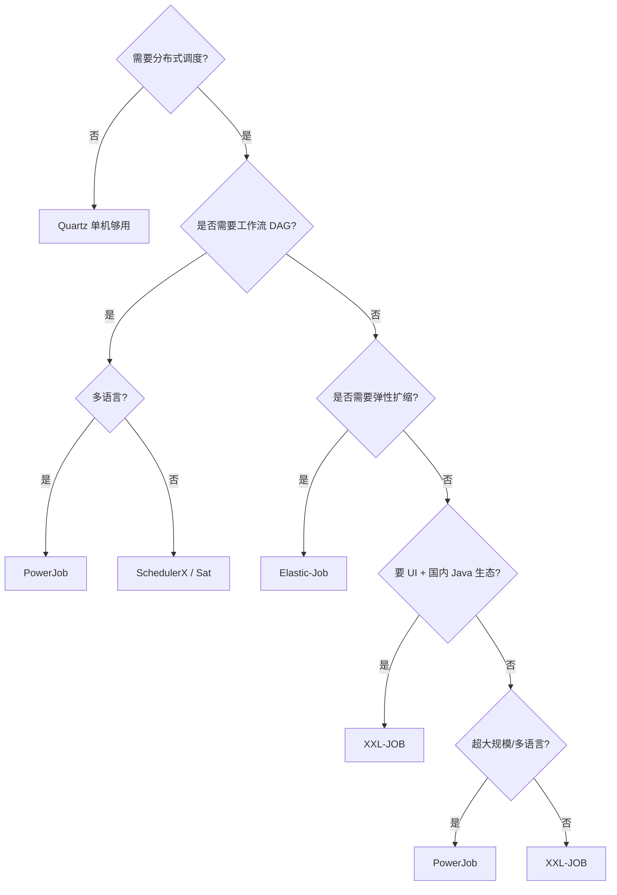
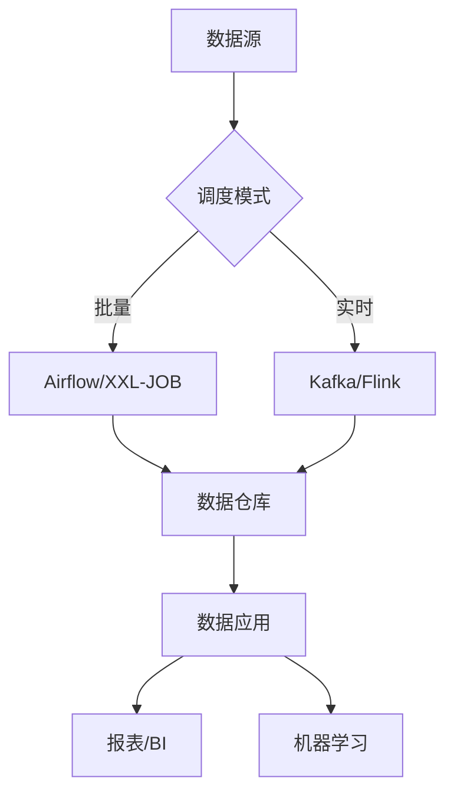
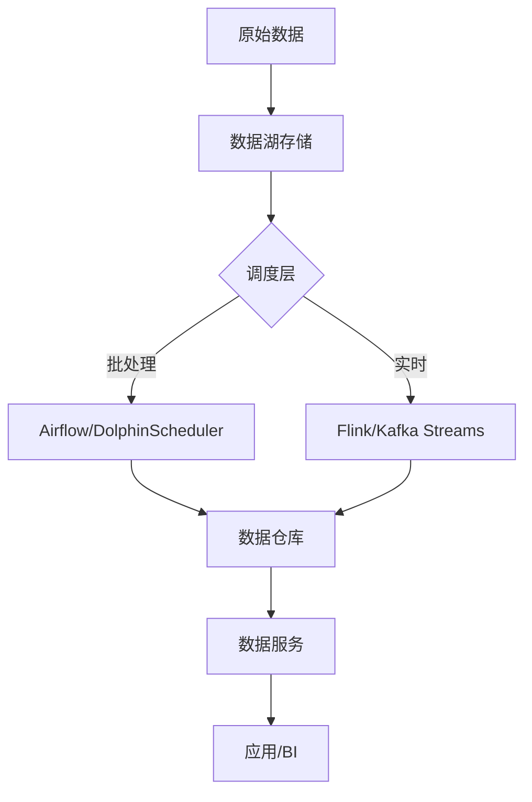
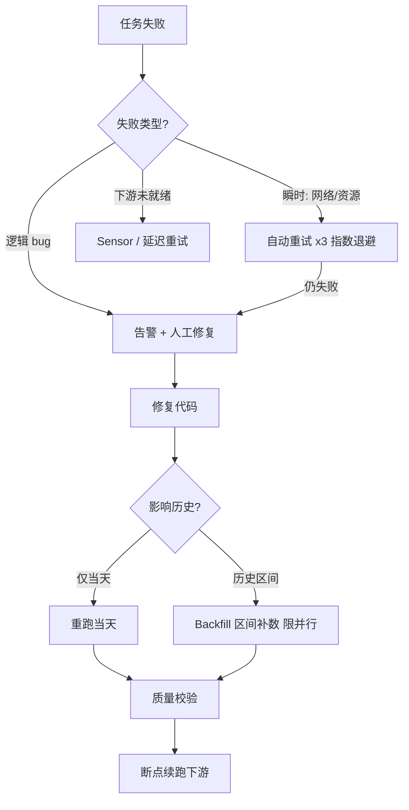
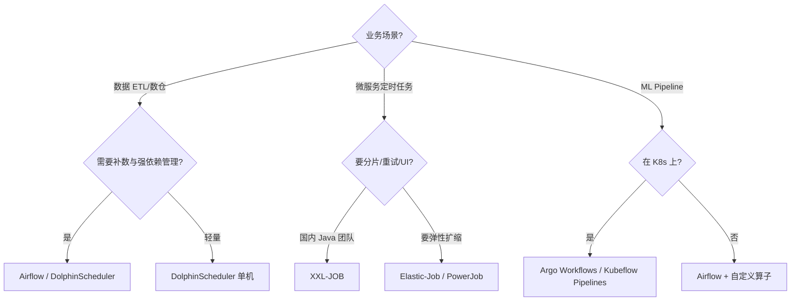
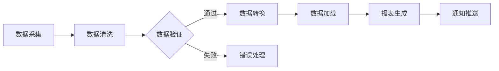
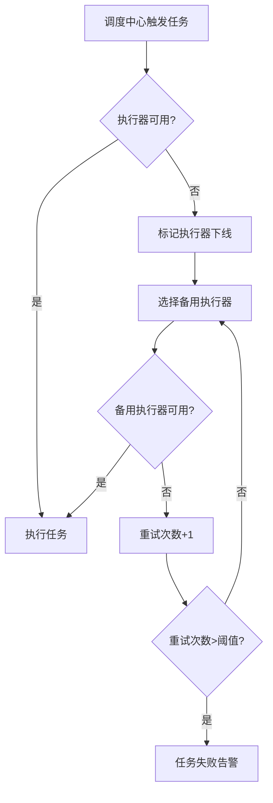

# 分布式任务调度深入（调度原理 / 分片机制 / 路由策略 / 故障转移 / 选型决策树）

> 分布式任务调度是定时任务/批处理作业的调度中心：cron 触发、分片执行、失败重试、可视化管控。本篇深入拆解：调度器核心原理、分片机制、路由策略、故障转移、选型决策树。

---

## 一、要解决的问题

| 痛点 | 说明 |
|------|------|
| 单点故障 | Quartz 单节点挂了任务不执行 |
| 单机瓶颈 | 任务量超单机处理能力 |
| 分片执行 | 大数据量任务需拆分到多节点并行 |
| 可视化 | 任务管理/执行日志/失败告警需 UI |
| 弹性扩缩 | 节点增减时任务自动重分配 |

> 核心认知：**分布式调度 = 调度器（选主/触发）+ 执行器（业务逻辑）分离**——调度器负责 cron 触发与路由，执行器负责业务。

---

## 二、调度器核心原理

### 2.1 触发机制

```
cron 表达式 → 时间轮/日历解析 → 到期触发

实现方式：
  1. 轮询扫描：调度线程定期扫描任务表（简单、有延迟）
  2. 时间轮：预计算下一个触发时间（精确、省资源）
  3. 延迟队列：按触发时间排序（精确）

Quartz 触发：
  调度线程池 + 触发器（Trigger）→ 到期 → 执行 Job
  错过触发：misfire 策略（立即执行/忽略/等待）

XXL-JOB 触发：
  调度中心线程扫描（周期默认 1s）→ 到点 → RPC 调执行器
```

### 2.2 分布式协调（防重复触发）

| 方案 | 原理 | 优缺点 |
|------|------|--------|
| DB 行锁 | `SELECT ... FOR UPDATE` | 简单，DB 压力大 |
| ZooKeeper | 临时节点选主 | 强一致，依赖 ZK |
| Redis 锁 | SETNX 选主 | 简单，锁过期风险 |
| Raft/Akka | 内部选举 | 强一致，实现复杂 |

```
XXL-JOB 防重复：
  调度中心集群 → 触发前先抢 DB 锁（任务表行锁）
  多中心只有抢到锁的触发（其余跳过）
  → 保证同一任务同一时刻只触发一次
```

### 2.3 执行模型

```
同步：调度中心等执行器返回（任务完成才结束）
异步：调度中心触发后即完成（执行器后台跑）

XXL-JOB 两种模型：
  同步调用：调度中心 → 执行器 → 返回结果（阻塞等待）
  异步执行：调度中心触发 → 执行器立即返回 → 任务后台执行 → 回调结果

大型批处理 → 异步模型（不阻塞调度中心）
```

---

## 三、分片机制（深入）

### 3.1 为什么分片

```
单机处理大数据量任务（如 1 亿行数据清洗）：
  单节点：内存/CPU 瓶颈，耗时长
  分片：拆成 N 个子任务 → 并行执行 → 总时长 /N
```

### 3.2 分片实现

```
XXL-JOB 分片广播：
  调度中心触发 → 所有执行器都收到任务
  每个执行器拿到分片参数：shardIndex（0~N-1）+ shardTotal
  执行器按 shardIndex 处理自己那份数据
  → 数据按分片键取模：WHERE id % shardTotal = shardIndex

Elastic-Job 弹性分片：
  ZK 协调分片分配（节点增减自动重分片）
  JobShardingStrategy：平均分配/轮询/自定义

PowerJob MapReduce：
  任务自动拆分（map）→ 分发子任务 → 汇总（reduce）
  框架管理子任务生命周期
```

### 3.3 分片键设计

```
数据分片原则：
  WHERE 分片条件能命中索引（id % N / date 范围）
  均匀分布（避免数据倾斜）
  幂等（子任务可重试）

示例：
  按用户 ID 取模：UPDATE ... WHERE user_id % 4 = {shardIndex}
  按时间范围：处理 {shardIndex} 天的数据
  按业务维度：按地区/渠道分片
```

---

## 四、路由策略（执行器选择）

| 策略 | 原理 | 适用 |
|------|------|------|
| 第一个 | 固定第一个执行器 | 简单任务 |
| 最后一个 | 固定最后一个 | 简单任务 |
| 轮询 | 轮流选择 | 负载均衡 |
| 随机 | 随机选择 | 负载均衡 |
| 一致性哈希 | 按参数哈希路由 | 同参数落同节点（有状态） |
| 最不经常使用 | 选调用最少的 | 冷热不均任务 |
| 最近最久未使用 | 选最久没调的 | 冷热不均任务 |
| 故障转移 | 失败换下一个 | 高可用 |
| 忙碌转移 | 忙的跳过 | 负载均衡 |
| 分片广播 | 所有节点都执行 | 分片任务 |

```
路由策略选择：
  无状态任务 → 轮询/随机（负载均衡）
  有状态任务（依赖本地缓存）→ 一致性哈希
  关键任务 → 故障转移（失败自动换节点）
  大数据量 → 分片广播
```

---

## 五、失败重试与告警

### 5.1 重试机制

```
重试时机：
  执行器执行失败 → 按策略重试（默认 3 次）
  调度中心未收到回调（超时）→ 判定失败

重试注意：
  任务必须幂等（重试不产生重复副作用）
  重试间隔（指数退避 + 抖动）
  重试次数上限（防无限重试）

成功/失败回调：
  执行器 → 调度中心（更新任务日志）
  失败 → 触发告警（邮件/钉钉/企微）
```

### 5.2 告警

```
告警渠道：邮件/钉钉/企微/Slack
告警触发：
  任务失败
  连续失败 N 次
  任务超时未完成
  调度中心异常

告警分级：
  失败 → 通知负责人
  连续失败 → 升级（通知团队）
  调度中心挂 → 紧急（值班）
```

---

## 六、六大调度器对比

### 6.1 Quartz（Java 调度基础库）

**原理**：RAMJobStore（内存）或 JobStoreTX（数据库悲观锁）；集群模式用数据库行锁选举。

| 特性 | 说明 |
|------|------|
| 优点 | 轻量、稳定、Spring 集成好 |
| 缺点 | 集群模式数据库压力大、无 UI、无分片、无失败告警 |

### 6.2 XXL-JOB（轻量级分布式调度平台）

**原理**：调度中心（Admin，Web UI + 调度触发，集群部署 DB 行锁防重复）+ 执行器（Embed，业务方引入 SDK 自动注册）。

| 特性 | 说明 |
|------|------|
| 优点 | UI 友好、分片广播、失败重试、路由策略丰富 |
| 缺点 | 调度中心 HA 依赖 DB 行锁；无工作流（DAG）；分片参数需手动传 |

### 6.3 Elastic-Job（ZK 协调）

**原理**：ZooKeeper 协调选主/分片/故障转移；弹性扩缩分片自动重分配。

| 特性 | 说明 |
|------|------|
| 优点 | 弹性扩缩、ZK 协调 HA、Dataflow 流式处理 |
| 缺点 | 依赖 ZK、学习曲线陡 |

### 6.4 PowerJob（多语言 + MapReduce）

**原理**：Server（调度中心）+ Worker（执行器）；Akka 通信；MapReduce 自动拆分分发汇总。

| 特性 | 说明 |
|------|------|
| 优点 | 多语言支持、MapReduce、处理器链、工作流（DAG） |
| 缺点 | 相对年轻、社区较小 |

### 6.5 SchedulerX / Sat

| 调度器 | 定位 | 关键点 |
|--------|------|--------|
| SchedulerX | 阿里商用 | 与阿里云集成、高可用、精确一次 |
| Sat | 国产轻量 | Nacos/Redis 协调、DAG 支持 |

---

## 七、横向对比表

| 维度 | Quartz | XXL-JOB | Elastic-Job | PowerJob | SchedulerX | Sat |
|------|--------|---------|-------------|----------|-------------|-----|
| 分布式 | 集群模式（弱） | 是 | 强（ZK） | 强（Akka） | 是 | 是 |
| 协调机制 | 数据库 | DB 行锁 | ZooKeeper | Akka | 内部 | Nacos/Redis |
| HA | 弱 | DB 锁集群 | ZK HA | Akka HA | 高可用 | 是 |
| 分片 | 无 | 分片广播 | 弹性分片 | MapReduce | 分片 | 分片 |
| 弹性扩缩 | 无 | 手动注册 | 自动感知 | 自动感知 | 自动 | 自动 |
| UI | 无 | 强 | 弱 | 强 | 强 | 有 |
| 失败重试 | 无 | 有 | 有 | 有 | 有 | 有 |
| 路由策略 | 无 | 丰富 | 分片 | 丰富 | 丰富 | 丰富 |
| 工作流（DAG） | 无 | 无 | 无 | 有 | 有 | 有 |
| 多语言 | Java | Java | Java | Java/Go/Python 等 | Java | Java |
| 社区 | 成熟 | 活跃（国内最流行） | 活跃 | 成长中 | 商业 | 年轻 |
| 依赖 | 数据库 | MySQL | ZooKeeper | 无外部依赖 | 阿里云 | Nacos/Redis |

---

## 八、选型决策树



**选型速查**：

| 场景 | 首选 | 备选 |
|------|------|------|
| 单机定时任务 | Quartz | — |
| 国内 Java 业务 + UI + 分片 | XXL-JOB | — |
| 需要弹性扩缩 + ZK | Elastic-Job | — |
| 多语言/MapReduce/工作流 | PowerJob | SchedulerX |
| 阿里云生态 | SchedulerX | XXL-JOB |
| 轻量级 + Nacos/Redis | Sat | XXL-JOB |
| 需要工作流（DAG） | PowerJob | SchedulerX |

---

## 九、生产实践 Checklist

| 检查项 | 说明 |
|--------|------|
| 任务幂等 | 重试不产生重复副作用 |
| 分片键 | 命中索引 + 均匀分布 |
| 超时设置 | 任务超时时间（防挂死） |
| 告警 | 失败/连续失败/超时告警 |
| 监控 | 任务成功率/执行时长/积压 |
| 资源隔离 | 大任务与小任务分执行器 |
| 压测 | 上线前并发压测调度中心 |

---

## 调度器详细对比矩阵

### Quartz vs Elastic-Job vs XXL-JOB vs Airflow vs Celery

| 维度 | Quartz | Elastic-Job | XXL-JOB | Airflow | Celery |
|------|--------|-------------|---------|---------|--------|
| 语言 | Java | Java | Java | Python | Python |
| 定位 | 调度库 | 分布式调度 | 分布式调度平台 | 工作流调度 | 分布式任务队列 |
| 调度模型 | 内嵌 | 独立进程 | 独立进程 | 独立进程 | 独立进程 |
| 协调机制 | DB 锁 | ZooKeeper | DB 行锁 | DB（元数据库） | Redis/RabbitMQ |
| 分片 | 无 | 弹性分片 | 分片广播 | 无 | 无（需自建） |
| 工作流 DAG | 无 | 无 | 无 | 有（核心特性） | 有（Canvas） |
| UI | 无 | 弱 | 强 | 强（Web UI） | 弱（Flower） |
| 可视化依赖 | — | — | — | Flask + Celery | Flower 插件 |
| 重试机制 | 手动实现 | 有 | 有 | 有（配置化） | 有（autoretry） |
| 告警 | 手动实现 | 有 | 有 | 有（Email/Slack） | 有（celery-email） |
| 多语言 | Java | Java | Java/Go/Python | Python/多语言 | Python/多语言 |
| 适用规模 | 小 | 中 | 中 | 中 | 中 |

### Kubernetes 任务调度

| 方案 | 说明 | 适用 |
|------|------|------|
| CronJob | K8s 原生定时任务 | 简单定时任务 |
| K8s Job | 一次性任务 | 批处理任务 |
| Argo Workflows | K8s 原生工作流引擎 | 复杂 DAG 工作流 |
| Tekton | K8s 原生 CI/CD 流水线 | CI/CD 场景 |
| Volcano | K8s 批处理调度器 | 大数据/AI 批处理 |

### K8s CronJob 配置示例

```yaml
apiVersion: batch/v1
kind: CronJob
metadata:
  name: data-cleanup
spec:
  schedule: "0 2 * * *"  # 每天凌晨 2 点
  concurrencyPolicy: Forbid  # 禁止并发
  successfulJobsHistoryLimit: 3
  failedJobsHistoryLimit: 1
  jobTemplate:
    spec:
      backoffLimit: 3  # 重试 3 次
      activeDeadlineSeconds: 3600  # 超时 1 小时
      template:
        spec:
          containers:
          - name: cleanup
            image: my-app:latest
            command: ["python", "cleanup.py"]
          restartPolicy: OnFailure
```

---

## 分布式系统中 Cron 表达式解析

### Cron 表达式标准对比

| 字段 | 标准 Cron | Quartz Cron | 说明 |
|------|-----------|-------------|------|
| 秒 | 无 | 有 | Quartz 支持秒级 |
| 分钟 | 0-59 | 0-59 | — |
| 小时 | 0-23 | 0-23 | — |
| 日 | 1-31 | 1-31 | — |
| 月 | 1-12 | 1-12 | — |
| 星期 | 0-6（0=周日） | 1-7（1=周日） | 注意差异 |
| 年 | 无 | 可选 | Quartz 支持 |

### Cron 解析陷阱

```
常见陷阱：
  ① 星期字段差异：Cron(0=周日) vs Quartz(1=周日)
  ② 月末日期：2月30日 → 自动调整/报错
  ③ 闰年处理：2月29日
  ④ 时区问题：服务器时区 vs UTC
  ⑤ 分布式解析：多节点时钟同步

分布式 Cron 一致性：
  方案一：单点调度（简单，有单点风险）
  方案二：DB 行锁选主（XXL-JOB 模式）
  方案三：ZooKeeper 选主（Elastic-Job 模式）
  方案四：Raft 选主（强一致，实现复杂）
```

---

## 任务合并（Task Coalescing）

### 合并策略

| 策略 | 说明 | 适用 |
|------|------|------|
| 时间窗口合并 | N 秒内的任务合并为一个 | 批量处理 |
| 计数合并 | 累计 N 次触发执行一次 | 计数器场景 |
| 去重合并 | 相同参数任务只执行一次 | 幂等操作 |
| 优先级合并 | 高优先级任务不合并 | 混合优先级 |

### 合并实现

```python
# 时间窗口合并示例
import time
from collections import deque

class TaskCoalescer:
    def __init__(self, window_seconds=30):
        self.window = window_seconds
        self.buffer = deque()
        self.last_execute = 0
    
    def add_task(self, task):
        self.buffer.append(task)
        now = time.time()
        if now - self.last_execute >= self.window:
            self._execute_batch()
    
    def _execute_batch(self):
        batch = list(self.buffer)
        self.buffer.clear()
        self.last_execute = time.time()
        # 执行批量任务
        process_batch(batch)
```

---

## 任务维护窗口（Blackout Windows）

### 维护窗口配置

```yaml
# 维护窗口配置示例
blackout_windows:
  - name: "数据库维护"
    schedule: "0 2-4 * * 0"  # 每周日凌晨 2-4 点
    affected_jobs: ["db-sync", "db-backup"]
    action: "skip"  # skip/reschedule
  
  - name: "月末结算"
    schedule: "0 0 L * *"  # 每月最后一天
    affected_jobs: ["*"]
    action: "reschedule"
    reschedule_to: "0 6 L * *"
```

### 维护窗口策略

| 策略 | 说明 | 适用 |
|------|------|------|
| Skip | 跳过执行 | 非关键任务 |
| Reschedule | 延后执行 | 关键任务 |
| Throttle | 降速执行 | 批处理任务 |
| Pause | 暂停调度 | 维护期间 |

---

## 基于 SLA 的调度

### SLA 调度模型

```
SLA 调度设计：
  ① 定义 SLA 目标
     - 每日任务：T+1 08:00 前完成
     - 实时任务：延迟 < 5 秒
     - 批处理任务：4 小时内完成

  ② 监控执行时间
     - 预估剩余时间 = 历史平均 × 剩余数据量
     - SLA 违约预测 = 预估完成时间 > SLA 截止时间

  ③ 自动调整
     - SLA 风险 → 增加资源（分片/并行度）
     - SLA 违约 → 告警 + 降级处理
     - SLA 达标 → 释放资源
```

### SLA 监控指标

| 指标 | 说明 | 告警阈值 |
|------|------|----------|
| 任务成功率 | 成功/总执行 | < 99% |
| 平均执行时间 | 历史平均 | > SLA 80% |
| 最大执行时间 | 历史最大 | > SLA 100% |
| SLA 违约率 | 违约/总任务 | > 1% |

---

## 数据管道调度模式

### 调度模式对比

| 模式 | 说明 | 适用 |
|------|------|------|
| 批量调度 | 固定周期触发 | ETL/报表 |
| 事件驱动 | 数据到达触发 | 实时处理 |
| 微批处理 | 小间隔批量（秒级） | 准实时 |
| 流式处理 | 持续处理 | 实时分析 |

### 数据管道调度架构



---

## Backfill 策略

### Backfill 场景

| 场景 | 说明 | 策略 |
|------|------|------|
| 数据修复 | 历史数据错误需要重算 | 重跑历史任务 |
| 新增字段 | 历史数据需要补充新字段 | 增量 Backfill |
| 算法升级 | 计算逻辑变更 | 全量重算 |
| 补数据 | 数据延迟到达 | 增量追补 |

### Backfill 实现策略

```
Backfill 实现：
  ① 时间范围选择
     - 按天分区：逐天 Backfill
     - 按小时分区：逐小时 Backfill
     - 大范围：并行 Backfill

  ② 并行度控制
     - 同时 Backfill 天数 = min(可用资源, SLA 要求)
     - 避免一次性 Backfill 过多天导致资源争抢

  ③ 依赖处理
     - 下游依赖自动触发（事件驱动）
     - 或手动触发（批量模式）

  ④ 监控
     - Backfill 进度监控
     - 数据质量校验（Backfill 后验证）
```

---

## 数据湖架构中的调度

### 数据湖调度挑战

| 挑战 | 说明 | 解决方案 |
|------|------|----------|
| 数据格式多样 | Parquet/ORC/JSON/CSV | Schema Registry |
| 处理框架混用 | Spark/Flink/Presto | 统一调度层 |
| 数据新鲜度 | 批处理 vs 实时 | Lambda/Kappa 架构 |
| 数据质量 | 历史数据修复 | Backfill 机制 |

### 数据湖调度架构



---

## 调度系统核心抽象对比（DAG 定义方式 / 任务类型扩展点）

| 抽象维度 | Airflow | DolphinScheduler | XXL-JOB | PowerJob | Argo Workflows |
|----------|---------|------------------|---------|----------|----------------|
| DAG 定义 | Python 代码（GitOps 友好） | 页面拖拽 + JSON 导入 | 页面配置，依赖能力弱 | 页面 + 代码双模 | YAML 声明式（K8s CRD） |
| 调度对象 | Operator（算子） | 任务节点类型插件 | JobHandler（Java 方法） | 处理器 Processor | Container/Script 模板 |
| 扩展点 | 自定义 Operator/Sensor/Hook | 自定义任务插件（SPI） | 实现 IJobHandler 即可 | 基本/MapReduce 处理器 | 自定义 Container 模板 |
| 触发器抽象 | Sensor（等外部条件） | 依赖/事件触发 | Cron + 子任务 | 工作流依赖 | Artifact/Event 触发 |
| 参数传递 | XCom（跨任务变量） | 上下文参数/内置参数 | 分片参数 Sharding | MapReduce 结果传递 | 输出产物 Artifact |

```python
# Airflow：代码即 DAG，扩展 = 写一个 Operator
from airflow.models import BaseOperator

class DataXSyncOperator(BaseOperator):
    def __init__(self, job_json: str, **kwargs):
        super().__init__(**kwargs)
        self.job_json = job_json
    def execute(self, context):
        return submit_datax(self.job_json)   # 接入任意执行引擎
```

```java
// XXL-JOB：扩展点最薄——一个注解方法就是一个任务
@XxlJob("demoJobHandler")
public void demoJobHandler() {
    XxlJobHelper.log("shard=" + XxlJobHelper.getShardIndex()
                   + "/" + XxlJobHelper.getShardTotal());
}
```

抽象取舍：Airflow「一切皆代码」适合工程团队但门槛高；DS/XXL-JOB「页面优先」上手快但 GitOps 弱；PowerJob 双模式居中。选型先看团队构成：数据工程师多 → Airflow；运维与业务自助多 → DolphinScheduler。

## 失败补偿策略对比（重试 / Backfill / 断点续跑）

| 策略 | 触发条件 | 粒度 | 各调度器实现 |
|------|---------|------|-------------|
| 自动重试 | 单次执行失败 | 任务级 ×N 次 | XXL-JOB 重试次数 / Airflow retries+delay |
| 手工重跑 | 修复后人工触发 | 单任务/DAG 片段 | 各平台 UI 一键重跑 |
| Backfill 补数 | 历史区间错误/新逻辑回填 | 时间区间批量 | Airflow backfill 命令 / DS 补数工作流 |
| 断点续跑 | 长链路中途失败 | 从失败节点恢复下游 | DS/PowerJob「从失败节点恢复」 |
| 幂等兜底 | 一切补偿的前提 | 数据级 | 分区覆盖写 INSERT OVERWRITE |

```text
补偿设计三原则：
① 任务幂等是前提：同分区重复执行结果一致（覆盖写/去重键），
   否则重试 = 重复副作用（重复扣减、重复发消息）
② 重试分层：瞬时故障自动重试（指数退避）；逻辑 bug 不自动重试，
   否则只是把同一次失败放大 N 次
③ 补数限速：Backfill 并行度受队列资源约束，
   避免补 30 天数据打爆生产队列
```



## 调度器 HA 设计对比（ZK 锁 / DB 锁 / Raft）

| HA 方案 | 代表 | 机制 | 优点 | 缺点 |
|---------|------|------|------|------|
| DB 行锁选主 | XXL-JOB | 多 Admin 抢任务表悲观锁 | 零额外组件，最简单 | DB 成瓶颈；锁粒度粗 |
| ZK 临时节点 | Elastic-Job | 临时顺序节点选举 + Watcher | 秒级故障感知转移 | 引入 ZK；GC 停顿可能误判 |
| 内嵌 Raft | PowerJob Server / DS 3.x | Raft 选主 + 状态复制 | 无外部依赖、强一致、防脑裂 | 实现复杂，扩缩容需懂 Raft |
| K8s Leader Election | Argo / CronJob 控制器 | Lease 资源抢锁 | 云原生统一方案 | 仅限 K8s 场景 |

```text
HA 关键指标：
  故障感知：ZK Watcher 毫秒级 ≈ Raft 心跳百毫秒级 > DB 锁轮询秒级
  误切风险：Raft 任期机制天然防脑裂；
           ZK 受长 GC 影响（会话过期误判）；
           DB 锁最保守（几乎不误切但恢复慢）
  恢复语义：新主接管后「未完成任务」如何处理是分水岭——
           幂等任务直接重派；非幂等要先对账再续跑
```

## 大规模任务量下的性能表现（万级 DAG）

| 规模瓶颈点 | 现象 | 应对 |
|-----------|------|------|
| 调度循环扫描 | 万级 DAG × 分钟级 cron → 单轮数万次判定 | 时间轮预计算下次触发；按分钟分桶 |
| 元数据库压力 | Airflow Scheduler 高频读写 DagRun 表 | 连接池 + max_active_runs 限流 + 多调度器进程 |
| 日志/状态写入 | 高并发执行日志打爆存储 | 执行日志异步落 ES/S3，DB 只存状态 |
| UI 渲染 | 万级任务列表卡死 | 分页 + 按域过滤 + 只查活跃实例 |
| 心跳风暴 | 数千执行器心跳挤占 RPC | 心跳合并上报、执行器分组 |

```text
经验量级（容量规划参考）：
  XXL-JOB 单 Admin 集群：数千~万级任务较稳，DB 锁先成为瓶颈
  DolphinScheduler：Master/Worker 分离，万级工作流靠加 Master
  Airflow 2.x：多 Scheduler 进程水平扩展，10 万+ 任务实例/天可行
  健康标准：调度延迟（cron 到实际触发）P99 < 5~30s
```

## 按业务场景选型决策树（ETL / 微服务定时任务 / ML Pipeline）



| 场景 | 核心诉求 | 首选 | 说明 |
|------|---------|------|------|
| 数据 ETL | DAG 依赖 + 补数 + SLA | Airflow / DS | 补数是硬需求，XXL-JOB 缺失 |
| 微服务定时任务 | 低侵入 + 分片 + 告警 | XXL-JOB | 与 Spring 无缝，运维最低 |
| 订单超时/延迟处理 | 精确延时触发 | 时间轮/延迟队列 | 秒级精度别用 cron 轮询 |
| ML Pipeline | 容器化 + 产物传递 | Argo Workflows | GPU 任务 + Artifact 原生 |
| 混合场景 | 统一管控 | DS 编排 + XXL-JOB 执行 | 页面编排大数据，微服务下沉 |

## 生产容量规划速查

| 指标 | 计算方式 | 经验阈值 |
|------|---------|---------|
| 单 Admin/Master 任务承载 | 任务数 × cron 频率 < 扫描能力 | ≤1 万任务/实例 |
| 执行器并发 | 峰值同时运行任务 ÷ 单机并发 | 单执行器 ≤200 线程 |
| 元数据库 QPS | 调度写 ×3（状态/日志/心跳） | 预留 50% 余量 |
| 补数资源 | 区间天数 × 日均资源 × 并行度上限 | 不超过队列 30% |
| 调度延迟预算 | 触发排队 + RPC + 执行器拉起 | P99 < 30s |

```text
上线前压测清单：
① 用真实 DAG 拓扑模拟万级任务触发，测调度延迟 P99
② 杀掉主节点，验证 HA 切换时间与新主接管语义
③ 模拟补数 30 天，确认限流生效、不冲击在线 SLA
④ 断网一个执行器分组，验证任务重派与告警链路
⑤ 混沌演练：DB 主从切换期间确认调度不重复触发（幂等兜底）
⑥ 监控埋点：调度延迟、队列积压、失败率三指标进大盘
⑦ 文档沉淀：每个任务标注 Owner/幂等策略/补数预案
```

---

## 附录 A：HA 高可用设计深度

### A.1 选主机制对比

| 调度框架 | 选主实现 | 一致性保证 | 故障转移时间 |
|----------|----------|------------|-------------|
| XXL-JOB | DB 锁 | 强一致 | 10-30s |
| Elastic-Job | ZooKeeper | 强一致 | 5-15s |
| DolphinScheduler | ZooKeeper/DB | 强一致 | 10-30s |
| Airflow | DB + DAG | 最终一致 | 30-60s |
| Celery | Redis/RabbitMQ | 最终一致 | 5-10s |

### A.2 故障恢复策略

```text
故障场景与恢复：

场景1：调度中心主节点故障
  → 选主机制自动选举新主
  → 未执行任务重新调度
  → 已执行任务不重复执行

场景2：执行器节点故障
  → 心跳检测发现故障
  → 任务迁移到其他执行器
  → 失败任务自动重试

场景3：数据库故障
  → 调度中心降级（只读）
  → 任务暂停执行
  → 数据库恢复后自动恢复

场景4：网络分区
  → 少数派节点暂停服务
  → 多数派节点继续调度
  → 网络恢复后数据同步
```

## 附录 B：DAG 任务可视化

### B.1 DAG 编排示例



### B.2 DAG 调度配置

```json
{
  "dag_name": "daily_etl",
  "schedule": "0 2 * * *",
  "tasks": [
    {
      "name": "extract",
      "command": "python extract.py",
      "depends_on": [],
      "retry": 3,
      "timeout": 3600
    },
    {
      "name": "transform",
      "command": "python transform.py",
      "depends_on": ["extract"],
      "retry": 2,
      "timeout": 7200
    },
    {
      "name": "load",
      "command": "python load.py",
      "depends_on": ["transform"],
      "retry": 1,
      "timeout": 3600
    }
  ]
}
```

## 附录 C：Backfill 策略与最佳实践

### C.1 Backfill 策略矩阵

| 策略 | 说明 | 适用场景 | 资源消耗 |
|------|------|----------|----------|
| 全量回填 | 重跑所有历史任务 | 数据修复 | 高 |
| 增量回填 | 只补跑失败任务 | 日常运维 | 低 |
| 时间窗口回填 | 指定时间范围 | 部分修复 | 中 |
| 并发回填 | 多实例并行 | 大规模补数 | 高 |

### C.2 Backfill 最佳实践

```text
Backfill 三原则：

① 幂等设计
  - 任务必须支持重复执行
  - 使用 upsert 而非 insert
  - 检查数据是否已存在

② 资源隔离
  - Backfill 与正常调度分离
  - 使用独立执行器
  - 限制并发度

③ 监控告警
  - Backfill 进度监控
  - 资源使用告警
  - 完成后通知
```

### C.3 Backfill 配置示例

```yaml
# XXL-JOB Backfill 配置
backfill_config:
  job_id: 1001
  start_time: "2024-01-01 00:00:00"
  end_time: "2024-01-31 23:59:59"
  parallelism: 5
  chunk_size: 1000
  retry_failed: true
  notify_on_complete: true
```

## 附录 D：SLA 驱动调度

### D.1 SLA 指标定义

| 指标 | 定义 | 目标 | 计算方式 |
|------|------|------|----------|
| 任务成功率 | 成功任务/总任务 | > 99.9% | 日统计 |
| 平均延迟 | 提交到完成时间 | < 5min | 实时计算 |
| P99 延迟 | 99%分位延迟 | < 30min | 日统计 |
| 可用性 | 调度中心可用时间 | > 99.99% | 月统计 |
| 数据新鲜度 | 数据延迟时间 | < 1h | 实时计算 |

### D.2 SLA 告警配置

```yaml
# SLA 告警规则
sla_alerts:
  - name: task_success_rate_low
    condition: task_success_rate < 0.999
    duration: 1h
    severity: critical
    action: page_oncall
  
  - name: task_latency_high
    condition: task_avg_latency > 300
    duration: 30m
    severity: warning
    action: notify_team
  
  - name: scheduler_unavailable
    condition: scheduler_uptime < 0.9999
    duration: 5m
    severity: critical
    action: page_oncall
```

## 附录 E：性能基准测试

### E.1 调度性能对比

| 调度框架 | 调度 TPS | 并发任务数 | 资源消耗 |
|----------|----------|------------|----------|
| XXL-JOB | 1000+ | 1000+ | 低 |
| Elastic-Job | 500+ | 500+ | 中 |
| DolphinScheduler | 300+ | 300+ | 中 |
| Airflow | 100+ | 100+ | 高 |
| Celery | 10000+ | 10000+ | 低 |

### E.2 性能测试方案

```text
测试环境：
  - 3 节点调度集群
  - 10 个执行器节点
  - MySQL 8.0 (8核16G)
  - 每个任务执行时间 100ms

测试场景：
  1. 单任务高频调度：1000 TPS
  2. 多任务并发：1000 任务同时执行
  3. 大量小任务：10000 任务/分钟
  4. 长任务并发：100 任务，每个执行 1 小时
```

## 附录 F：调度监控指标

### F.1 核心监控指标

| 指标 | 说明 | 采集方式 | 告警阈值 |
|------|------|----------|----------|
| scheduler_active_count | 活跃任务数 | Prometheus | > 1000 |
| scheduler_queue_size | 等待队列大小 | Prometheus | > 500 |
| task_success_count | 成功任务数 | 数据库 | — |
| task_fail_count | 失败任务数 | 数据库 | > 10 |
| task_running_count | 运行中任务数 | 数据库 | > 100 |
| executor_cpu_usage | 执行器 CPU 使用率 | node_exporter | > 80% |
| executor_memory_usage | 执行器内存使用率 | node_exporter | > 85% |

### F.2 Grafana Dashboard 设计

```text
Dashboard 布局：

Row1：总览
  - 调度成功率 (Gauge)
  - 活跃任务数 (Stat)
  - 队列大小 (Stat)
  - 执行器数量 (Stat)

Row2：任务执行
  - 任务执行趋势 (Time Series)
  - 任务成功率 (Time Series)
  - 任务延迟分布 (Heatmap)

Row3：资源使用
  - CPU 使用率 (Time Series)
  - 内存使用率 (Time Series)
  - 磁盘 IO (Time Series)

Row4：告警
  - 最近告警 (Table)
  - 告警趋势 (Time Series)
```

## 十、与其他板块的关系

- XXL-JOB 深度篇见「[任务调度 XXL-JOB](./任务调度XXL-JOB.md)」；
- ZooKeeper（Elastic-Job 协调）见「[ZooKeeper](./ZooKeeper.md)」；
- 分布式锁（调度中心选主）见「[场景设计/分布式锁](../../场景设计/分布式锁.md)」；
- 云上调度服务见「[云上中间件体系总览](./云上中间件体系总览.md)」；
- 大数据工作流见「[DolphinScheduler](./DolphinScheduler.md)」「[Airflow](./Airflow.md)」。

---

## 十一、HA 高可用设计对比

| 维度 | XXL-JOB | Elastic-Job | PowerJob |
|------|---------|-------------|----------|
| 调度中心高可用 | 数据库主从 | ZooKeeper选主 | Raft协议 |
| 执行器高可用 | 自动注册 | 自动注册 | 自动注册 |
| 任务重试 | 自动重试 | 自动重试 | 自动重试 |
| 故障转移 | 支持 | 支持 | 支持 |
| 数据库依赖 | MySQL | 无（ZK） | MySQL |

### 11.1 故障转移流程



## 十二、DAG 可视化

| 方案 | 适用 | 说明 |
|------|------|------|
| Airflow UI | Airflow | 内置DAG可视化 |
| DolphinScheduler UI | DolphinScheduler | 内置可视化 |
| 自建前端 | 通用 | Graphviz/D3.js |
| 自定义Dashboard | 通用 | 前端渲染 |

```python
# Airflow DAG 可视化
from airflow import DAG
from airflow.operators.bash import BashOperator
from airflow.utils.dates import days_ago

with DAG(
    dag_id='data_pipeline',
    start_date=days_ago(1),
    schedule_interval='@daily',
    render_template_as_native_obj=True
) as dag:
    task1 = BashOperator(task_id='extract', bash_command='python extract.py')
    task2 = BashOperator(task_id='transform', bash_command='python transform.py')
    task3 = BashOperator(task_id='load', bash_command='python load.py')
    task1 >> task2 >> task3
```

## 十三、Backfill 回填策略

### 13.1 回填场景

| 场景 | 方案 | 注意事项 |
|------|------|----------|
| 历史数据重跑 | 手动触发+参数化日期 | 注意数据量 |
| 补数 | 调整调度时间窗口 | 避免重复 |
| 数据修复 | 指定日期范围 | 事务一致性 |
| 测试数据 | 批量生成+导入 | 环境隔离 |

## 十四、SLA 调度（截止时间调度）

| 调度方式 | 说明 | 适用 |
|----------|------|------|
| 按时间调度 | 固定时间触发 | 常规任务 |
| SLA调度 | 按截止时间调度 | 报表/账单 |
| 依赖调度 | 上游完成触发 | DAG任务链 |
| 手动调度 | 人工触发 | 紧急任务 |

```python
# SLA 调度示例（Airflow）
from airflow.models import DAG
from airflow.operators.python import PythonOperator
from datetime import datetime, timedelta

dag = DAG(
    'daily_report',
    schedule_interval='0 8 * * *',
    sla_miss_callback=sla_callback,
    default_args={
        'sla': timedelta(hours=1),
    }
)
```

## 十五、万级 DAG 性能优化

| 优化点 | 方案 | 效果 |
|--------|------|------|
| 元数据存储 | 分库分表 | 查询加速 |
| 调度优化 | 批量触发 | 减少锁竞争 |
| 执行器优化 | 动态扩缩 | 提高并发 |
| 资源隔离 | 命名空间/队列 | 避免干扰 |
| 监控优化 | 异步采集 | 减少开销 |

## 十六、调度监控指标

| 指标 | 说明 | 告警阈值 |
|------|------|----------|
| 任务成功率 | 成功次数/总次数 | <99% |
| 任务延迟 | 触发到执行的延迟 | >30s |
| 队列积压 | 等待执行的任务数 | >100 |
| 执行器负载 | CPU/内存使用率 | >80% |
| 调度延迟 | 调度中心处理延迟 | >10s |

---

> 一句话：**分布式调度 = 调度触发（cron/时间轮）+ 分布式协调（DB 锁/ZK/Raft 防重复）+ 分片（数据拆 N 份并行）+ 路由策略 + 失败重试告警——选型先看「UI+分片（XXL-JOB）→ 弹性扩缩（Elastic-Job）→ 多语言/工作流（PowerJob）」**。