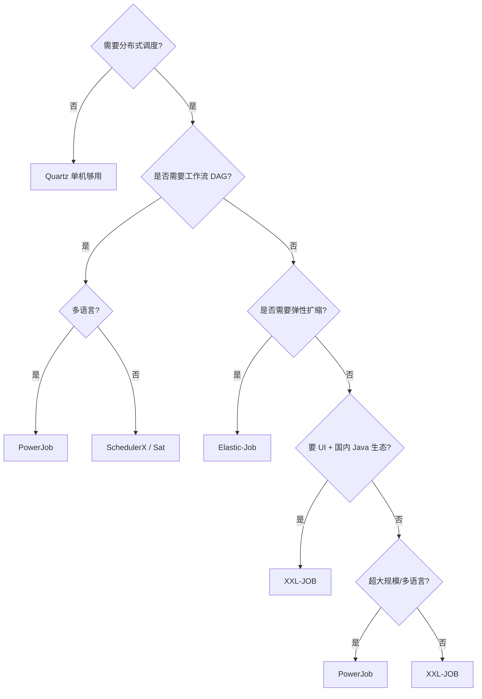

# 分布式任务调度深入（调度原理 / 分片机制 / 路由策略 / 故障转移 / 选型决策树）

> 分布式任务调度是定时任务/批处理作业的调度中心：cron 触发、分片执行、失败重试、可视化管控。本篇深入拆解：调度器核心原理、分片机制、路由策略、故障转移、选型决策树。

---

## 一、要解决的问题

| 痛点 | 说明 |
|------|------|
| 单点故障 | Quartz 单节点挂了任务不执行 |
| 单机瓶颈 | 任务量超单机处理能力 |
| 分片执行 | 大数据量任务需拆分到多节点并行 |
| 可视化 | 任务管理/执行日志/失败告警需 UI |
| 弹性扩缩 | 节点增减时任务自动重分配 |

> 核心认知：**分布式调度 = 调度器（选主/触发）+ 执行器（业务逻辑）分离**——调度器负责 cron 触发与路由，执行器负责业务。

---

## 二、调度器核心原理

### 2.1 触发机制

```
cron 表达式 → 时间轮/日历解析 → 到期触发

实现方式：
  1. 轮询扫描：调度线程定期扫描任务表（简单、有延迟）
  2. 时间轮：预计算下一个触发时间（精确、省资源）
  3. 延迟队列：按触发时间排序（精确）

Quartz 触发：
  调度线程池 + 触发器（Trigger）→ 到期 → 执行 Job
  错过触发：misfire 策略（立即执行/忽略/等待）

XXL-JOB 触发：
  调度中心线程扫描（周期默认 1s）→ 到点 → RPC 调执行器
```

### 2.2 分布式协调（防重复触发）

| 方案 | 原理 | 优缺点 |
|------|------|--------|
| DB 行锁 | `SELECT ... FOR UPDATE` | 简单，DB 压力大 |
| ZooKeeper | 临时节点选主 | 强一致，依赖 ZK |
| Redis 锁 | SETNX 选主 | 简单，锁过期风险 |
| Raft/Akka | 内部选举 | 强一致，实现复杂 |

```
XXL-JOB 防重复：
  调度中心集群 → 触发前先抢 DB 锁（任务表行锁）
  多中心只有抢到锁的触发（其余跳过）
  → 保证同一任务同一时刻只触发一次
```

### 2.3 执行模型

```
同步：调度中心等执行器返回（任务完成才结束）
异步：调度中心触发后即完成（执行器后台跑）

XXL-JOB 两种模型：
  同步调用：调度中心 → 执行器 → 返回结果（阻塞等待）
  异步执行：调度中心触发 → 执行器立即返回 → 任务后台执行 → 回调结果

大型批处理 → 异步模型（不阻塞调度中心）
```

---

## 三、分片机制（深入）

### 3.1 为什么分片

```
单机处理大数据量任务（如 1 亿行数据清洗）：
  单节点：内存/CPU 瓶颈，耗时长
  分片：拆成 N 个子任务 → 并行执行 → 总时长 /N
```

### 3.2 分片实现

```
XXL-JOB 分片广播：
  调度中心触发 → 所有执行器都收到任务
  每个执行器拿到分片参数：shardIndex（0~N-1）+ shardTotal
  执行器按 shardIndex 处理自己那份数据
  → 数据按分片键取模：WHERE id % shardTotal = shardIndex

Elastic-Job 弹性分片：
  ZK 协调分片分配（节点增减自动重分片）
  JobShardingStrategy：平均分配/轮询/自定义

PowerJob MapReduce：
  任务自动拆分（map）→ 分发子任务 → 汇总（reduce）
  框架管理子任务生命周期
```

### 3.3 分片键设计

```
数据分片原则：
  WHERE 分片条件能命中索引（id % N / date 范围）
  均匀分布（避免数据倾斜）
  幂等（子任务可重试）

示例：
  按用户 ID 取模：UPDATE ... WHERE user_id % 4 = {shardIndex}
  按时间范围：处理 {shardIndex} 天的数据
  按业务维度：按地区/渠道分片
```

---

## 四、路由策略（执行器选择）

| 策略 | 原理 | 适用 |
|------|------|------|
| 第一个 | 固定第一个执行器 | 简单任务 |
| 最后一个 | 固定最后一个 | 简单任务 |
| 轮询 | 轮流选择 | 负载均衡 |
| 随机 | 随机选择 | 负载均衡 |
| 一致性哈希 | 按参数哈希路由 | 同参数落同节点（有状态） |
| 最不经常使用 | 选调用最少的 | 冷热不均任务 |
| 最近最久未使用 | 选最久没调的 | 冷热不均任务 |
| 故障转移 | 失败换下一个 | 高可用 |
| 忙碌转移 | 忙的跳过 | 负载均衡 |
| 分片广播 | 所有节点都执行 | 分片任务 |

```
路由策略选择：
  无状态任务 → 轮询/随机（负载均衡）
  有状态任务（依赖本地缓存）→ 一致性哈希
  关键任务 → 故障转移（失败自动换节点）
  大数据量 → 分片广播
```

---

## 五、失败重试与告警

### 5.1 重试机制

```
重试时机：
  执行器执行失败 → 按策略重试（默认 3 次）
  调度中心未收到回调（超时）→ 判定失败

重试注意：
  任务必须幂等（重试不产生重复副作用）
  重试间隔（指数退避 + 抖动）
  重试次数上限（防无限重试）

成功/失败回调：
  执行器 → 调度中心（更新任务日志）
  失败 → 触发告警（邮件/钉钉/企微）
```

### 5.2 告警

```
告警渠道：邮件/钉钉/企微/Slack
告警触发：
  任务失败
  连续失败 N 次
  任务超时未完成
  调度中心异常

告警分级：
  失败 → 通知负责人
  连续失败 → 升级（通知团队）
  调度中心挂 → 紧急（值班）
```

---

## 六、六大调度器对比

### 6.1 Quartz（Java 调度基础库）

**原理**：RAMJobStore（内存）或 JobStoreTX（数据库悲观锁）；集群模式用数据库行锁选举。

| 特性 | 说明 |
|------|------|
| 优点 | 轻量、稳定、Spring 集成好 |
| 缺点 | 集群模式数据库压力大、无 UI、无分片、无失败告警 |

### 6.2 XXL-JOB（轻量级分布式调度平台）

**原理**：调度中心（Admin，Web UI + 调度触发，集群部署 DB 行锁防重复）+ 执行器（Embed，业务方引入 SDK 自动注册）。

| 特性 | 说明 |
|------|------|
| 优点 | UI 友好、分片广播、失败重试、路由策略丰富 |
| 缺点 | 调度中心 HA 依赖 DB 行锁；无工作流（DAG）；分片参数需手动传 |

### 6.3 Elastic-Job（ZK 协调）

**原理**：ZooKeeper 协调选主/分片/故障转移；弹性扩缩分片自动重分配。

| 特性 | 说明 |
|------|------|
| 优点 | 弹性扩缩、ZK 协调 HA、Dataflow 流式处理 |
| 缺点 | 依赖 ZK、学习曲线陡 |

### 6.4 PowerJob（多语言 + MapReduce）

**原理**：Server（调度中心）+ Worker（执行器）；Akka 通信；MapReduce 自动拆分分发汇总。

| 特性 | 说明 |
|------|------|
| 优点 | 多语言支持、MapReduce、处理器链、工作流（DAG） |
| 缺点 | 相对年轻、社区较小 |

### 6.5 SchedulerX / Sat

| 调度器 | 定位 | 关键点 |
|--------|------|--------|
| SchedulerX | 阿里商用 | 与阿里云集成、高可用、精确一次 |
| Sat | 国产轻量 | Nacos/Redis 协调、DAG 支持 |

---

## 七、横向对比表

| 维度 | Quartz | XXL-JOB | Elastic-Job | PowerJob | SchedulerX | Sat |
|------|--------|---------|-------------|----------|-------------|-----|
| 分布式 | 集群模式（弱） | 是 | 强（ZK） | 强（Akka） | 是 | 是 |
| 协调机制 | 数据库 | DB 行锁 | ZooKeeper | Akka | 内部 | Nacos/Redis |
| HA | 弱 | DB 锁集群 | ZK HA | Akka HA | 高可用 | 是 |
| 分片 | 无 | 分片广播 | 弹性分片 | MapReduce | 分片 | 分片 |
| 弹性扩缩 | 无 | 手动注册 | 自动感知 | 自动感知 | 自动 | 自动 |
| UI | 无 | 强 | 弱 | 强 | 强 | 有 |
| 失败重试 | 无 | 有 | 有 | 有 | 有 | 有 |
| 路由策略 | 无 | 丰富 | 分片 | 丰富 | 丰富 | 丰富 |
| 工作流（DAG） | 无 | 无 | 无 | 有 | 有 | 有 |
| 多语言 | Java | Java | Java | Java/Go/Python 等 | Java | Java |
| 社区 | 成熟 | 活跃（国内最流行） | 活跃 | 成长中 | 商业 | 年轻 |
| 依赖 | 数据库 | MySQL | ZooKeeper | 无外部依赖 | 阿里云 | Nacos/Redis |

---

## 八、选型决策树



**选型速查**：

| 场景 | 首选 | 备选 |
|------|------|------|
| 单机定时任务 | Quartz | — |
| 国内 Java 业务 + UI + 分片 | XXL-JOB | — |
| 需要弹性扩缩 + ZK | Elastic-Job | — |
| 多语言/MapReduce/工作流 | PowerJob | SchedulerX |
| 阿里云生态 | SchedulerX | XXL-JOB |
| 轻量级 + Nacos/Redis | Sat | XXL-JOB |
| 需要工作流（DAG） | PowerJob | SchedulerX |

---

## 九、生产实践 Checklist

| 检查项 | 说明 |
|--------|------|
| 任务幂等 | 重试不产生重复副作用 |
| 分片键 | 命中索引 + 均匀分布 |
| 超时设置 | 任务超时时间（防挂死） |
| 告警 | 失败/连续失败/超时告警 |
| 监控 | 任务成功率/执行时长/积压 |
| 资源隔离 | 大任务与小任务分执行器 |
| 压测 | 上线前并发压测调度中心 |

---

## 十、与其他板块的关系

- XXL-JOB 深度篇见「[任务调度 XXL-JOB](./任务调度XXL-JOB.md)」；
- ZooKeeper（Elastic-Job 协调）见「[ZooKeeper](./ZooKeeper.md)」；
- 分布式锁（调度中心选主）见「[场景设计/分布式锁](../../场景设计/分布式锁.md)」；
- 云上调度服务见「[云上中间件体系总览](./云上中间件体系总览.md)」；
- 大数据工作流见「[DolphinScheduler](./DolphinScheduler.md)」「[Airflow](./Airflow.md)」。

> 一句话：**分布式调度 = 调度触发（cron/时间轮）+ 分布式协调（DB 锁/ZK/Raft 防重复）+ 分片（数据拆 N 份并行）+ 路由策略 + 失败重试告警——选型先看「UI+分片（XXL-JOB）→ 弹性扩缩（Elastic-Job）→ 多语言/工作流（PowerJob）」**。