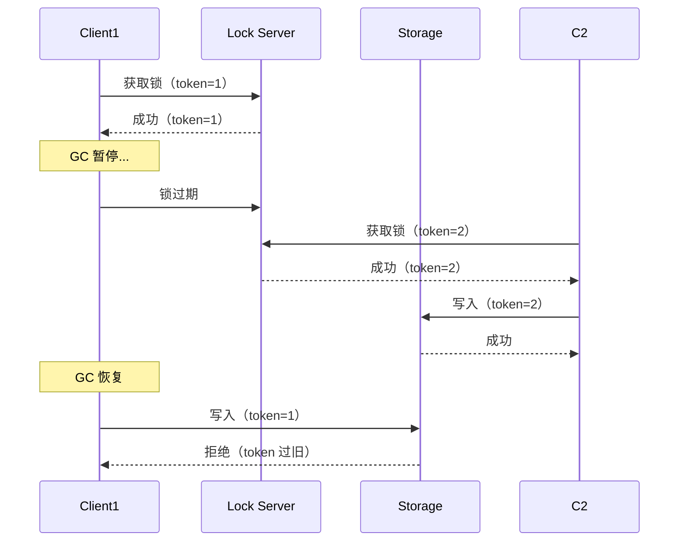
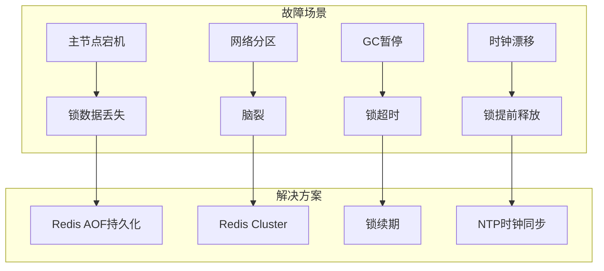

# 分布式锁专题（Redis / ZK / etcd / Redlock / Fencing Token / 生产踩坑）

> 分布式锁 = **在分布式系统中保证同一时刻只有一个进程/实例执行临界区操作**。核心挑战：网络不可靠 + 节点可能宕机 + 锁可能过期。本篇按「方案对比 → 实现细节 → Redlock 争议 → Fencing Token → 生产踩坑」深入拆解。

---

## 一、方案全景对比

| 方案 | 实现 | 一致性 | 性能 | 公平性 | 适用 |
|------|------|--------|------|--------|------|
| Redis SETNX | `SET key val NX EX ttl` | 最终一致 | **最高**（~10万 QPS） | 非公平 | 低竞争场景 |
| Redis Redlock | 多节点多数派 | 强一致（有争议） | 较高 | 非公平 | 中等可靠性 |
| ZooKeeper | 临时顺序节点 + Watch | **强一致**（ZAB） | 较低（~1万 QPS） | 公平 | 强一致性场景 |
| etcd | Lease + Revision + Watch | **强一致**（Raft） | 较低 | 公平 | 云原生/K8s |
| MySQL | 唯一索引 / SELECT FOR UPDATE | 强一致 | **最低** | 公平 | 低并发兜底 |

---

## 二、Redis 分布式锁

### 2.1 基础实现

```java
// 加锁（原子操作）
String lock(String key, String requestId, long expireSeconds) {
    return redis.execute(
        "SET", key, requestId, "NX", "EX", String.valueOf(expireSeconds)
    );
    // NX: 不存在才设置  EX: 过期时间  requestId: 持有者标识
}

// 解锁（Lua 保证原子性）
Long unlock(String key, String requestId) {
    String lua = """
        if redis.call('get', KEYS[1]) == ARGV[1] then
            return redis.call('del', KEYS[1])
        else
            return 0
        end
        """;
    return redis.eval(lua, List.of(key), List.of(requestId));
}
```

### 2.2 为什么解锁必须用 Lua

```
错误写法（非原子）：
  GET key == requestId  →  true（此时锁可能已过期被别人获取）
  DEL key              →  删掉了别人的锁！

正确写法（Lua 原子）：
  if GET key == requestId then DEL key
  → GET + DEL 在同一个 Lua 脚本中执行（Redis 单线程保证原子性）
```

### 2.3 锁过期但业务未完成

```
问题：
  1. 线程 A 获取锁（TTL=30s）
  2. 线程 A 执行业务（耗时 35s）
  3. 30s 后锁过期
  4. 线程 B 获取锁（两个线程同时执行临界区代码！）

解决：
  方案一：Redisson 自动续期（看门狗，默认 30s，每 10s 续期）
  方案二：业务侧续期（独立线程定期延长锁）
  方案三：Fencing Token（存储层校验令牌，见第六节）
```

### 2.4 Redisson 实现

```java
// Redisson 看门狗（自动续期）
RLock lock = redissonClient.getLock("myLock");

// 默认：30s 过期，每 10s 续期一次
lock.lock();
try {
    // 业务逻辑（即使超过 30s 也会自动续期）
    doBusiness();
} finally {
    if (lock.isHeldByCurrentThread()) {
        lock.unlock();
    }
}

// 指定过期时间（不自动续期）
lock.lock(60, TimeUnit.SECONDS);
```

---

## 三、ZooKeeper 分布式锁

### 3.1 实现原理

```
基于临时顺序节点（Ephemeral Sequential）：

1. 客户端在 /lock 目录下创建临时顺序节点：/lock/lock-00000001
2. 获取 /lock 下所有子节点，排序
3. 如果自己是最小节点 → 获取锁成功
4. 否则 → Watch 前一个节点（避免惊群效应）
5. 前一个节点被删除（释放/宕机）→ 收到 Watch 通知 → 重新判断

特点：
  临时节点：客户端宕机 → 节点自动删除 → 不会死锁
  顺序节点：天然公平（FIFO）
  Watch 机制：实时通知（不轮询）
```

### 3.2 ZK 实现代码

```java
// Curator 框架
InterProcessMutex lock = new InterProcessMutex(client, "/lock/myLock");

if (lock.acquire(10, TimeUnit.SECONDS)) {
    try {
        doBusiness();
    } finally {
        lock.release();
    }
}
```

### 3.3 ZK vs Redis 对比

| 维度 | ZK | Redis |
|------|-----|-------|
| 一致性 | 强一致（ZAB） | 最终一致（主从切换可能丢锁） |
| 性能 | 低（~1万 QPS） | 高（~10万 QPS） |
| 公平性 | 公平（顺序节点） | 非公平 |
| 可重入 | 支持（InterProcessMutex） | 需手动实现 |
| 宕机处理 | 临时节点自动删除 | TTL 过期（可能提前过期） |
| 适用 | 强一致/公平锁 | 高性能/简单场景 |

---

## 四、etcd 分布式锁

### 4.1 实现原理

```
基于 Lease + Revision + Watch：

1. 创建 Lease（带 TTL）
2. 用 Lease 创建 key（key 绑定 Lease，Lease 过期 key 自动删除）
3. 获取所有锁 key 的 Revision
4. 最小 Revision → 获取锁成功
5. 否则 → Watch 前一个 Revision 的 key
6. 释放锁 → 删除 key / 撤销 Lease

优势：
  强一致（Raft 协议）
  Lease 自动过期（类似 ZK 临时节点）
  Revision 天然递增（公平）
  云原生原生支持（K8s 生态）
```

### 4.2 etcd 实现代码

```go
// Go 客户端（concurrency 包）
session, _ := concurrency.NewSession(client, concurrency.WithTTL(30))
defer session.Close()

mutex := concurrency.NewMutex(session, "/lock/myLock")
mutex.Lock(context.TODO())
defer mutex.Unlock(context.TODO())

doBusiness()
```

---

## 五、Redlock 争议

### 5.1 Redlock 算法

```
Antirez（Redis 作者）提出：

1. 获取当前时间 T1
2. 依次向 N 个 Redis 节点加锁（超时时间较短）
3. 获取当前时间 T2，计算耗时 = T2 - T1
4. 如果在 N/2+1 个节点上加锁成功，且耗时 < 锁过期时间 → 成功
5. 锁有效时间 = 过期时间 - 耗时
6. 如果失败 → 向所有节点释放锁
```

### 5.2 Martin Kleppmann 批评

```
问题一：时钟跳跃
  NTP 同步可能导致时钟跳跃 → 锁提前过期
  解决：禁用 NTP 跳跃（但运维不可控）

问题二：GC 暂停
  Client1 获取锁 → GC 暂停 50s → 锁过期 → Client2 获取锁
  → GC 恢复 → Client1 认为自己还持有锁 → 两个客户端同时操作

问题三：网络延迟
  Client1 获取锁 → 网络延迟 → 锁过期 → Client2 获取锁
  → Client1 收到成功响应 → 两个客户端同时操作

建议：用 fencing token（递增令牌）保证安全
```

### 5.3 Antirez 回应

```
1. 时钟跳跃可以通过运维避免（调整时钟渐进式同步）
2. GC 暂停是所有分布式系统都面临的问题
3. Redlock 的安全性依赖多数派，不是依赖单个节点
4. fencing token 需要存储层支持（不是所有场景都适用）
```

### 5.4 结论

| 场景 | 推荐方案 |
|------|----------|
| 中等可靠性（允许极端情况失败） | Redlock / 单节点 Redis + 看门狗 |
| 强一致性（金融/支付） | ZooKeeper / etcd |
| 高性能 + 可接受极端情况 | 单节点 Redis + Fencing Token |
| 云原生环境 | etcd（K8s 生态原生） |

---

## 六、Fencing Token（隔离令牌）

### 6.1 原理

```
核心思想：用递增令牌保证即使锁过期，旧锁的操作也不会被接受

Client1 获取锁（token=1）→ 暂停 → 锁过期
Client2 获取锁（token=2）→ 写入存储（token=2）
Client1 恢复 → 写入存储（token=1）→ 存储拒绝（token 太旧）

实现：
  Redis：INCR key（每次加锁 +1）
  ZK：zxid（事务 ID，天然递增）
  etcd：Revision（每次修改 +1）
  数据库：version 字段（乐观锁）
```

### 6.2 实现示例

```java
// 加锁时获取 token
Long token = redis.incr("lock:token:" + lockKey);
redis.set("lock:" + lockKey, token, "NX", "EX", 30);

// 写入时校验 token
// Redis Lua：只在 token 匹配时更新
String lua = """
    if redis.call('get', KEYS[1]) == ARGV[1] then
        return redis.call('set', KEYS[2], ARGV[2])
    else
        return 0
    end
    """;
```

---

## 七、生产踩坑

### 7.1 常见坑

| 问题 | 原因 | 解决 |
|------|------|------|
| 锁过期业务未完成 | TTL 设太短 | Redisson 看门狗 / 合理 TTL |
| 删了别人的锁 | 非原子 GET+DEL | Lua 脚本保证原子性 |
| 主从切换丢锁 | Redis 异步复制 | 用 Redlock / 换 ZK/etcd |
| Redis 重启丢锁 | AOF 未及时 fsync | 持久化 + Fencing Token |
| 惊群效应 | ZK Watch 所有子节点 | 有序节点 Watch 前一个 |
| 锁饥饿 | 高并发下抢锁失败 | 公平锁（ZK/etcd）/ 重试 + 退避 |

### 7.2 最佳实践

```
1. 锁粒度：按业务 key 加锁（如 lock:order:123），不要全局锁
2. 锁超时：TTL > 业务最大执行时间 × 1.5
3. 原子操作：解锁必须用 Lua（GET + DEL 原子）
4. 幂等设计：锁 + 唯一索引 + 状态机 三重保障
5. 降级方案：锁服务不可用时的 fallback 策略
6. 监控告警：锁等待时间 / 锁获取失败次数 / 锁持有时间
```

### 7.3 选型决策树

```
需要分布式锁？
  ├── 高并发 + 中等可靠性 → Redis + 看门狗
  ├── 强一致性 + 公平锁 → ZooKeeper
  ├── 云原生 + 强一致性 → etcd
  ├── 金融/支付 → ZK/etcd + Fencing Token
  └── 低并发 → MySQL 唯一索引
```

---

## 八、ZooKeeper 顺序锁深度

### 8.1 Curator InterProcessMutex 实现

```text
Curator 的 InterProcessMutex 实现原理：

1. 在 /lock 下创建临时顺序节点 /lock/lock-0000000001
2. 获取 /lock 下所有子节点，排序
3. 如果自己是最小节点 → 获取锁成功
4. 否则 → Watch 前一个节点（避免惊群）
5. 前一个节点被删除 → 回调触发 → 重新判断

可重入支持：
  - 每次 acquire 创建子节点
  - release 时删除对应子节点
  - 全部释放后才算真正释放锁
```

### 8.2 ZK 锁代码示例

```java
CuratorFramework client = CuratorFrameworkFactory.newClient(
    "zk1:2181,zk2:2181,zk3:2181", new ExponentialBackoffRetry(1000, 3));

InterProcessMutex lock = new InterProcessMutex(client, "/lock/order-lock");

// 可重入锁
if (lock.acquire(10, TimeUnit.SECONDS)) {
    try {
        // 业务逻辑（支持重入）
        doBusiness();
    } finally {
        lock.release();
    }
}

// 读写锁
InterProcessReadWriteLock rwLock = new InterProcessReadWriteLock(client, "/lock/rw-lock");
InterProcessMutex readLock = rwLock.readLock();
InterProcessMutex writeLock = rwLock.writeLock();
```

---

## 九、etcd Lease 锁深度

### 9.1 Lease 机制

```text
etcd 分布式锁基于 Lease 实现：

1. 创建 Lease（带 TTL，如 30s）
2. 用 Lease 创建 key（key 绑定 Lease）
3. Lease 存活时 key 存在，Lease 过期 key 自动删除
4. 需定期续约（KeepAlive）保持 Lease 活跃
5. 释放锁时撤销 Lease 或删除 key
```

### 9.2 Go 客户端完整示例

```go
package main

import (
    "context"
    "go.etcd.io/etcd/client/v3"
    "go.etcd.io/etcd/client/v3/concurrency"
)

func main() {
    client, _ := clientv3.New(clientv3.Config{
        Endpoints:   []string{"etcd1:2379", "etcd2:2379", "etcd3:2379"},
        DialTimeout: 5 * time.Second,
    })
    defer client.Close()

    // 创建会话（自动续约）
    session, _ := concurrency.NewSession(client, concurrency.WithTTL(30))
    defer session.Close()

    // 创建互斥锁
    mutex := concurrency.NewMutex(session, "/lock/myLock")
    
    // 加锁
    if err := mutex.Lock(context.TODO()); err != nil {
        log.Fatal(err)
    }
    defer mutex.Unlock(context.TODO())

    // 业务逻辑
    doBusiness()
}
```

### 9.3 etcd vs ZK 选择

| 维度 | etcd | ZooKeeper |
|------|------|-----------|
| 协议 | Raft | ZAB |
| 语言 | Go | Java |
| API | HTTP/gRPC | 自定义协议 |
| 云原生 | K8s 生态原生 | 独立部署 |
| 性能 | 较高 | 中等 |
| 适用 | 云原生/微服务 | 传统 Java 生态 |

---

## 十、MySQL Advisory Lock

### 10.1 MySQL 锁机制

```sql
-- 表级锁
LOCK TABLES t WRITE;
-- 解锁
UNLOCK TABLES;

-- 行级锁
SELECT * FROM t WHERE id=1 FOR UPDATE;

-- 基于唯一索引的插入锁（隐式锁）
INSERT INTO t (id, name) VALUES (1, 'a');
-- 重复插入会等待/超时
```

### 10.2 分布式锁实现

```sql
-- 方案一：唯一索引
CREATE TABLE distributed_lock (
    lock_key VARCHAR(64) PRIMARY KEY,
    holder VARCHAR(128) NOT NULL,
    expire_at DATETIME NOT NULL
);

-- 加锁
INSERT INTO distributed_lock (lock_key, holder, expire_at)
VALUES ('order-lock', 'instance-1', NOW() + INTERVAL 30 SECOND)
ON DUPLICATE KEY UPDATE
    holder = IF(expire_at < NOW(), VALUES(holder), holder),
    expire_at = IF(expire_at < NOW(), VALUES(expire_at), expire_at);

-- 解锁
DELETE FROM distributed_lock WHERE lock_key = 'order-lock' AND holder = 'instance-1';

-- 方案二：UPDATE 条件更新
UPDATE distributed_lock SET holder = 'new-holder', expire_at = NOW() + INTERVAL 30s
WHERE lock_key = 'order-lock' AND (expire_at < NOW() OR holder = 'old-holder');
```

### 10.3 MySQL 锁优缺点

```
优点：
  - 实现简单，不需要额外组件
  - 强一致（InnoDB 保证）
  - 支持公平锁（FIFO）

缺点：
  - 性能最低（~1000 QPS）
  - 锁超时需要定时清理
  - 高并发下数据库压力大
  - 不支持自动续期

适用：
  - 低并发兜底方案
  - 已有 MySQL，不想引入额外组件
  - 简单的定时任务互斥
```

---

## 十一、分布式锁 Fencing Token 机制

### 11.1 完整流程



### 11.2 各实现的 Fencing Token

| 实现 | Token 机制 | 说明 |
|------|-----------|------|
| Redis | INCR lock:token | 每次加锁 +1 |
| ZooKeeper | zxid（事务 ID） | 天然递增 |
| etcd | Revision | 每次修改 +1 |
| MySQL | version 字段 | 乐观锁版本号 |

### 11.3 存储层校验示例

```java
// Redis Lua：只在 token 匹配时更新
String lua = """
    if redis.call('get', KEYS[1]) == ARGV[1] then
        return redis.call('set', KEYS[2], ARGV[2])
    else
        return 0
    end
    """;

// 数据库：乐观锁
UPDATE t_order 
SET status = 'paid', version = version + 1 
WHERE id = ? AND version = ?;
```

---

## 十二、锁服务发现

### 12.1 服务发现模式

```
1. 独立锁服务
   - Redis / ZK / etcd 作为独立组件
   - 应用直连锁服务
   - 需要自己维护锁服务可用性

2. 内嵌锁
   - 数据库锁（MySQL Advisory Lock）
   - 应用内锁 + 分布式协调

3. 服务网格集成
   - 通过 Service Mesh 的 Sidecar 实现
   - 应用无感知
```

### 12.2 锁服务高可用

```
锁服务高可用方案：
  1. Redis Sentinel：哨兵自动故障转移
  2. Redis Cluster：分片集群
  3. ZK 集群：3/5/7 节点，自动选举
  4. etcd 集群：Raft 共识，3/5 节点

降级策略：
  1. 锁服务不可用 → 降级到数据库锁
  2. 锁服务不可用 → 降级到本地锁（单实例场景）
  3. 锁服务不可用 → 拒绝服务（保护业务）
```

---

## 十三、分布式锁性能对比

| 方案 | QPS | 延迟 | 公平性 | 一致性 | 复杂度 |
|------|-----|------|--------|--------|--------|
| Redis SETNX | ~10万 | <1ms | 非公平 | 最终一致 | 低 |
| Redis Redlock | ~5万 | ~5ms | 非公平 | 强一致(争议) | 中 |
| ZK 顺序锁 | ~1万 | ~10ms | 公平 | 强一致 | 中 |
| etcd Lease | ~2万 | ~5ms | 公平 | 强一致 | 中 |
| MySQL 唯一索引 | ~1千 | ~10ms | 公平 | 强一致 | 低 |
| MySQL SELECT FOR UPDATE | ~5千 | ~5ms | 公平 | 强一致 | 低 |

```
选型建议：
  - 高并发 + 可接受极端失败 → Redis + 看门狗
  - 强一致 + 公平锁 → ZK / etcd
  - 云原生环境 → etcd（K8s 原生）
  - 低并发兜底 → MySQL 唯一索引
  - 金融/支付 → ZK/etcd + Fencing Token
```

---

## 十四、Kubernetes Lease 锁

### 14.1 K8s Lease 原理

```yaml
apiVersion: coordination.k8s.io/v1
kind: Lease
metadata:
  name: leader-lock
  namespace: default
spec:
  holderIdentity: pod-name-1
  leaseDurationSeconds: 15
  acquireTime: "2026-01-01T00:00:00Z"
  renewTime: "2026-01-01T00:00:10Z"
  leaseTransitions: 0
```

### 14.2 Leader Election 使用

```go
// Kubernetes client-go Leader Election
leaderElection, _ := leaderelection.NewLeaderElector(leaderelection.LeaderElectionConfig{
    Lock:          &resourcelock.LeaseLock{...},
    LeaseDuration: 15 * time.Second,
    RenewDeadline: 10 * time.Second,
    RetryPeriod:   2 * time.Second,
    Callbacks: leaderelection.LeaderCallbacks{
        OnStartedLeading: func(ctx context.Context) {
            // 成为 Leader
        },
        OnStoppedLeading: func() {
            // 失去 Leader
        },
    },
})
leaderElection.Run(ctx)
```

### 14.3 K8s 锁应用场景

```
1. Controller Leader Election
   - 多副本 Controller 只有一个执行
   
2. Deployment 锁
   - 防止并发部署冲突
   
3. ConfigMap 更新锁
   - 防止并发配置更新冲突
   
4. 自定义资源锁
   - CRD 操作的互斥
```

---

## 十五、无锁替代方案（CAS / 乐观锁）

### 15.1 乐观锁（CAS）

```
核心思想：不加锁，通过版本号检测冲突

流程：
  1. 读取数据及版本号
  2. 修改数据
  3. 提交时检查版本号是否变化
  4. 变化 → 重试；未变化 → 提交成功
```

### 15.2 数据库乐观锁实现

```sql
-- 版本号方式
UPDATE t_order 
SET status = 'paid', version = version + 1 
WHERE id = ? AND version = ?;

-- 影响行数 = 0 → 重试

-- 时间戳方式
UPDATE t_order 
SET status = 'paid', update_time = NOW() 
WHERE id = ? AND update_time = ?;
```

### 15.3 Redis CAS 实现

```lua
-- Redis WATCH + MULTI（事务）
WATCH lock_key
val = GET lock_key
if val == expected then
    MULTI
    SET lock_key new_value
    EXEC
    -- 成功
else
    UNWATCH
    -- 重试
end
```

### 15.4 适用场景对比

| 场景 | 推荐方案 |
|------|----------|
| 低冲突读多写少 | 乐观锁（CAS） |
| 高冲突写多 | 分布式锁 |
| 单次更新 | 数据库唯一约束 |
| 幂等操作 | 天然幂等（无需锁） |
| 缓存更新 | Redis 分布式锁 |

---

## 分布式锁性能基准测试

### 16.1 Redis vs ZooKeeper vs etcd 基准测试

```
分布式锁性能基准测试（100 并发，10000 次操作）：

  Redis 分布式锁：
    QPS: 50000+
    延迟 P95: 2ms
    延迟 P99: 5ms
    吞吐量: 高

  ZooKeeper 分布式锁：
    QPS: 5000-10000
    延迟 P95: 10ms
    延迟 P99: 20ms
    吞吐量: 中

  etcd 分布式锁：
    QPS: 10000-20000
    延迟 P95: 5ms
    延迟 P99: 10ms
    吞吐量: 中高

  测试方法：
    1. 使用 JMH 基准测试框架
    2. 多线程并发测试
    3. 测试不同锁粒度（粗粒度 vs 细粒度）
    4. 测试不同冲突概率（低冲突 vs 高冲突）
```

### 16.2 性能对比

| 维度 | Redis | ZooKeeper | etcd |
|------|-------|-----------|------|
| 获取锁延迟 | 1-2ms | 5-10ms | 3-5ms |
| 释放锁延迟 | 1-2ms | 5-10ms | 3-5ms |
| 锁续期延迟 | 1-2ms | N/A | 3-5ms |
| 故障转移 | 哨兵自动 | ZAB 协议 | Raft 协议 |
| 吞吐量 | 高 | 中 | 中高 |
| 数据持久化 | RDB/AOF | 快照 | WAL |
| 适用场景 | 高并发/低延迟 | 强一致/高可用 | 强一致/云原生 |

---

## Kubernetes Operator 实现分布式锁

### 17.1 K8s Operator 模式

```go
// K8s Operator 分布式锁实现
type DistributedLockReconciler struct {
    client.Client
    Scheme *runtime.Scheme
}

func (r *DistributedLockReconciler) Reconcile(ctx context.Context, req ctrl.Request) (ctrl.Result, error) {
    // 1. 获取 Lease 资源
    lease := &coordinationv1.Lease{}
    if err := r.Get(ctx, req.NamespacedName, lease); err != nil {
        return ctrl.Result{}, err
    }

    // 2. 检查锁是否过期
    if lease.Spec.LeaseDurationSeconds != nil {
        duration := time.Duration(*lease.Spec.LeaseDurationSeconds) * time.Second
        if time.Since(lease.Spec.AcquireTime.Time) > duration {
            // 锁已过期，尝试获取
            return r.tryAcquireLock(ctx, lease)
        }
    }

    // 3. 检查是否是当前持有者
    if lease.Spec.HolderIdentity != nil && *lease.Spec.HolderIdentity == r.getHolderID() {
        // 续期
        return r.renewLock(ctx, lease)
    }

    return ctrl.Result{RequeueAfter: 10 * time.Second}, nil
}
```

### 17.2 K8s 分布式锁配置

```yaml
# K8s Lease 资源
apiVersion: coordination.k8s.io/v1
kind: Lease
metadata:
  name: my-lock
  namespace: default
spec:
  holderIdentity: my-pod-name
  leaseDurationSeconds: 15
  acquireTime: "2024-01-01T00:00:00Z"
  renewTime: "2024-01-01T00:00:10Z"
  leaseTransitions: 0
```

---

## 分布式锁 Lease 延期续期机制

### 18.1 续期策略

```
分布式锁 Lease 延期续期：

  1. 主动续期：
     - 持有锁的客户端定期发送续期请求
     - 间隔：锁超时时间的 1/3
     - 例：锁超时 30s，续期间隔 10s

  2. 被动续期：
     - 锁服务端检测到客户端心跳
     - 超过心跳间隔自动续期
     - 适用于长连接场景

  3. 混合续期：
     - 主动 + 被动结合
     - 主动续期作为主要机制
     - 被动续期作为兜底

  续期失败处理：
    1. 立即释放锁
    2. 通知其他等待者
    3. 记录日志
    4. 触发告警
```

### 18.2 Redisson 续期机制

```java
// Redisson 看门狗续期机制
public class Watchdog {
    private static final long LOCK_TIMEOUT = 30000; // 30 秒
    private static final long RENEW_INTERVAL = 10000; // 10 秒

    private final RedissonClient redisson;
    private final ScheduledExecutorService scheduler = Executors.newScheduledThreadPool(1);

    public void startWatchdog(RLock lock) {
        scheduler.scheduleAtFixedRate(() -> {
            if (lock.isHeldByCurrentThread()) {
                try {
                    // 续期
                    lock.expire(LOCK_TIMEOUT, TimeUnit.MILLISECONDS);
                    log.debug("锁续期成功");
                } catch (Exception e) {
                    log.error("锁续期失败", e);
                }
            }
        }, RENEW_INTERVAL, RENEW_INTERVAL, TimeUnit.MILLISECONDS);
    }

    public void stopWatchdog() {
        scheduler.shutdown();
    }
}
```

---

## 无锁并发编程模式

### 19.1 无锁数据结构

```java
// 无锁队列（基于 CAS）
public class LockFreeQueue<T> {
    private final AtomicReference<Node<T>> head = new AtomicReference<>(new Node<>(null));
    private final AtomicReference<Node<T>> tail = new AtomicReference<>(head.get());

    public void enqueue(T value) {
        Node<T> newNode = new Node<>(value);
        while (true) {
            Node<T> currentTail = tail.get();
            if (currentTail.next.compareAndSet(null, newNode)) {
                tail.compareAndSet(currentTail, newNode);
                return;
            }
        }
    }

    public T dequeue() {
        while (true) {
            Node<T> currentHead = head.get();
            Node<T> currentTail = tail.get();
            Node<T> nextNode = currentHead.next.get();

            if (currentHead == currentTail) {
                if (nextNode == null) {
                    return null; // 队列为空
                }
                tail.compareAndSet(currentTail, nextNode);
            } else {
                T value = nextNode.value;
                if (head.compareAndSet(currentHead, nextNode)) {
                    return value;
                }
            }
        }
    }

    private static class Node<T> {
        final T value;
        final AtomicReference<Node<T>> next;

        Node(T value) {
            this.value = value;
            this.next = new AtomicReference<>(null);
        }
    }
}
```

### 19.2 无锁 vs 有锁对比

| 维度 | 无锁 | 有锁 |
|------|------|------|
| 性能 | 高（无上下文切换） | 中（有锁竞争） |
| 复杂度 | 高（CAS 实现） | 低（API 简单） |
| 适用场景 | 高并发/低冲突 | 低并发/高冲突 |
| 死锁风险 | 无 | 有 |
| 公平性 | 不保证 | 可保证 |
| 适用数据结构 | 队列/栈/计数器 | 通用 |

---

## 分布式锁在微服务中的 Saga 模式

### 20.1 Saga 分布式锁

```java
// Saga 模式分布式锁
@Service
public class OrderSaga {
    @Autowired
    private RedissonClient redisson;

    @Transactional
    public void createOrder(OrderDTO order) {
        String lockKey = "saga:order:" + order.getId();
        RLock lock = redisson.getLock(lockKey);

        try {
            // 1. 获取锁
            if (!lock.tryLock(5, 30, TimeUnit.SECONDS)) {
                throw new RuntimeException("获取锁失败");
            }

            // 2. 执行 Saga 步骤
            try {
                // 步骤 1：创建订单
                createOrderStep(order);
                // 步骤 2：扣减库存
                deductInventoryStep(order);
                // 步骤 3：扣减余额
                deductBalanceStep(order);
                // 步骤 4：创建支付记录
                createPaymentStep(order);
            } catch (Exception e) {
                // 3. 补偿操作
                compensateSteps(order);
                throw e;
            }
        } finally {
            // 4. 释放锁
            if (lock.isHeldByCurrentThread()) {
                lock.unlock();
            }
        }
    }

    private void compensateSteps(OrderDTO order) {
        // 补偿逻辑（逆序执行）
        compensatePaymentStep(order);
        compensateBalanceStep(order);
        compensateInventoryStep(order);
        compensateOrderStep(order);
    }
}
```

### 20.2 Saga vs 两阶段提交

| 维度 | Saga | 两阶段提交 |
|------|------|------------|
| 一致性 | 最终一致 | 强一致 |
| 性能 | 高 | 低 |
| 复杂度 | 中 | 高 |
| 可用性 | 高 | 低 |
| 适用场景 | 长事务/跨服务 | 短事务/同服务 |
| 锁机制 | 分布式锁 | 数据库锁 |

---

## 分布式锁冲突分析与优化

### 21.1 冲突分析

```
分布式锁冲突分析：

  冲突概率 = 并发请求数 / 临界区执行时间

  示例：
    并发请求数：1000 QPS
    临界区执行时间：100ms
    冲突概率 = 1000 × 0.1 = 100（意味着平均 100 个请求同时竞争锁）

  优化策略：
    1. 减小临界区：减少锁持有时间
    2. 细粒度锁：按业务分锁
    3. 乐观锁：CAS 替代悲观锁
    4. 无锁设计：队列/缓冲
    5. 锁分段：分段锁减少竞争
```

### 21.2 优化效果

| 优化措施 | 效果 | 适用场景 |
|----------|------|----------|
| 减小临界区 | 冲突概率降低 50-70% | 通用 |
| 细粒度锁 | 冲突概率降低 80-90% | 业务可分 |
| 乐观锁 | 冲突概率降低 60-80% | 读多写少 |
| 无锁设计 | 冲突概率降低 90-100% | 高并发 |
| 锁分段 | 冲突概率降低 70-85% | 高并发 |

---

## 分布式锁性能对比

```java
// Redis 分布式锁实现
public class RedisLock {
    private final RedissonClient redisson;
    
    public boolean tryLock(String lockKey, long waitTime, long leaseTime) {
        RLock lock = redisson.getLock(lockKey);
        try {
            return lock.tryLock(waitTime, leaseTime, TimeUnit.MILLISECONDS);
        } catch (InterruptedException e) {
            Thread.currentThread().interrupt();
            return false;
        }
    }
    
    public void unlock(String lockKey) {
        RLock lock = redisson.getLock(lockKey);
        if (lock.isHeldByCurrentThread()) {
            lock.unlock();
        }
    }
}

// ZooKeeper 分布式锁实现
public class ZooKeeperLock {
    private final CuratorFramework client;
    
    public boolean tryLock(String lockPath, long maxWait) throws Exception {
        InterProcessMutex lock = new InterProcessMutex(client, lockPath);
        return lock.acquire(maxWait, TimeUnit.MILLISECONDS);
    }
    
    public void unlock(String lockPath) throws Exception {
        InterProcessMutex lock = new InterProcessMutex(client, lockPath);
        if (lock.isAcquiredInThisProcess()) {
            lock.release();
        }
    }
}
```

### 性能对比

| 实现 | 获取延迟 | 吞吐量 | 可靠性 | 运维复杂度 |
|------|----------|--------|--------|------------|
| Redis | 1ms | 10万+/秒 | 高 | 低 |
| ZooKeeper | 5ms | 1万+/秒 | 极高 | 中 |
| etcd | 2ms | 5万+/秒 | 极高 | 中 |
| 数据库 | 10ms | 1000+/秒 | 中 | 低 |

## 分布式锁可靠性分析



### 可靠性保障措施

| 故障场景 | 问题 | 解决方案 |
|----------|------|----------|
| 主节点宕机 | 锁数据丢失 | AOF + 副本 |
| 网络分区 | 脑裂 | 集群 + 多数派 |
| GC暂停 | 锁超时 | 锁续期 + Fencing |
| 时钟漂移 | 锁提前释放 | NTP + 合理超时 |

## 锁续期与 Fencing

```java
// Redisson 锁续期
RLock lock = redisson.getLock("myLock");
// 自动续期（WatchDog）
lock.lock();

// 手动设置续期
lock.lock(30, TimeUnit.SECONDS);

// Fencing Token 方案
public class FencingTokenLock {
    private final AtomicLong token = new AtomicLong(0);
    
    public long acquireLock(String lockKey) {
        // 获取锁并返回fencing token
        long currentToken = token.incrementAndGet();
        // 存储锁+token
        return currentToken;
    }
    
    public boolean validateLock(String lockKey, long fencingToken) {
        // 验证fencing token是否有效
        return fencingToken >= token.get();
    }
}
```

## 十六、与其他板块的关系

- Redis 分布式锁见「[Redis 深度篇](./Redis深度篇.md)」；
- ZooKeeper 原理见「[ZooKeeper](./ZooKeeper.md)」；
- etcd 源码见「[源码系列/etcd 源码](../../源码系列/etcd源码.md)」；
- 幂等设计见「[场景设计/幂等设计](../../场景设计/幂等设计.md)」；
- 分布式系统理论见「[分布式系统](../分布式系统.md)」。

> 一句话：**分布式锁 = Redis 高性能 + ZK/etcd 强一致——生产核心：Lua 原子解锁 + 看门狗续期 + Fencing Token 防旧锁——选型：中等可靠用 Redis，强一致用 ZK/etcd**。
