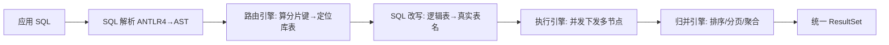
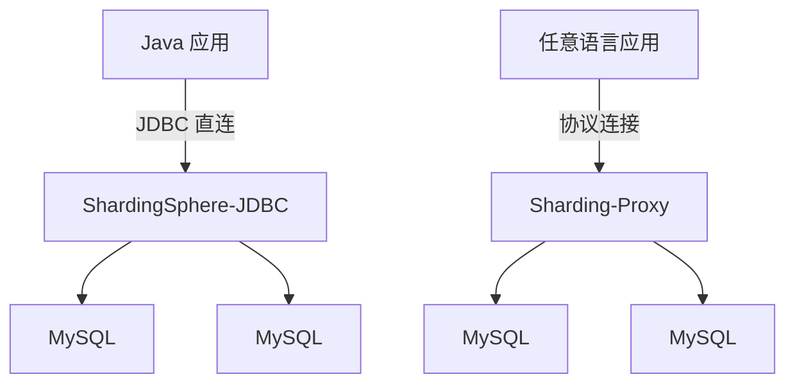
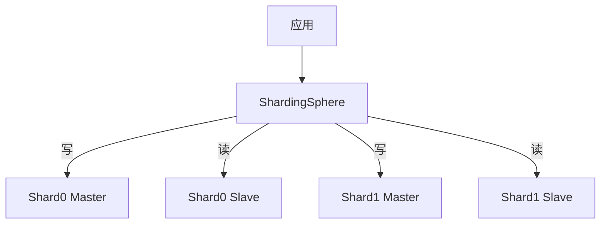

# 分库分表 ShardingSphere

> 单表几千万行、写入开始变慢、DB 连接打满——这时候就该「分库分表」了。本文讲清 **ShardingSphere 怎么把分片做得对业务透明**，以及分片键怎么选、有哪些必踩的坑。
> 开源参考：[apache/shardingsphere](https://github.com/apache/shardingsphere)（Java，Apache-2.0，"Database Plus" 数据库增强层，提供 Sharding-JDBC / Sharding-Proxy 双接入端，5.5.x 活跃，49k+ commits，全球 1.9 万+ 项目采用）。

---


## 〇、本体介绍（它是什么 / 适用场景 / 核心概念）

**它是什么**：ShardingSphere 是 Apache 顶级项目，定位「Database Plus」——在数据库之上构建增强层，提供分库分表、读写分离、分布式事务、数据加密、影子库等能力，接入端有 Sharding-JDBC（客户端）与 Sharding-Proxy（代理端）。

**解决什么痛点**：单库单表数据量/并发到瓶颈后，手写分库分表面临 SQL 路由、分布式主键、跨片 JOIN、分布式事务等难题。ShardingSphere 在 JDBC 层透明拦截 SQL，自动完成分片路由与结果归并，业务几乎无感。

**核心概念**：逻辑表/真实表、分片键（Sharding Key）、分片算法（取模/范围/哈希）、绑定表、广播表、读写分离、分布式主键（Snowflake）、分布式事务（XA/Seata 集成）、Hint。

**适用场景**：MySQL/PostgreSQL 单实例达瓶颈、需要水平拆分且保留 SQL 生态。
**不适用**：数据量不大强行分片（增加复杂度）、强一致跨片事务频繁且要求极高。

---

## 一、为什么分库分表

| 瓶颈 | 表现 |
|------|------|
| 单表数据量过大 | 索引树深、查询慢、DDL 卡死 |
| 单库连接 / CPU 打满 | 高并发下连接数瓶颈，一损俱损 |
| 单机容量上限 | 磁盘 / 内存不够 |

**垂直分库**：按业务拆（订单库、用户库、商品库）。
**垂直分表**：大表拆小表（热点字段 / 冗余字段分离）。
**水平分表 / 分库**：同一张表按分片键拆到多个表 / 库（本文重点）。

---

## 二、ShardingSphere 是什么：Database Plus

ShardingSphere 不是新数据库，而是**构建在异构数据库之上的增强层**——通过分布式 SQL 最大化现有数据库能力，提供统一访问 + 分片 / 读写分离 / 加密 / 分布式事务。

### 两种接入端

| 接入端 | 形态 | 优点 | 缺点 | 适用 |
|--------|------|------|------|------|
| **Sharding-JDBC** | JAR 嵌入应用，增强 JDBC | 直连无网络跳转、性能高、零部署 | 仅 Java、升级要发版 | 中小规模、Spring Boot 单体 |
| **Sharding-Proxy** | 独立透明代理，兼容 MySQL/PG 协议 | 多语言、DBA 友好、集中管控 | 多一跳网络、要部署 | 大规模、多语言、云原生 |

> 5.x 后包名从 `io.shardingsphere` 变为 `org.apache.shardingsphere`。

---

## 三、核心执行流程（对业务透明的关键）



五步：**解析 → 路由 → 改写 → 执行 → 归并**。应用写 `SELECT * FROM t_order WHERE user_id=?`，ShardingSphere 自动路由到 `ds_0.t_order_2` 并把多节点结果归并返回——业务像操作单表。

---

## 四、分片核心概念

### 4.1 分片键（最重要）

决定数据「去哪个库哪个表」的列。选择原则：

- **高基数**：取值多，才能均匀分散（别用 status 这种低基数列）。
- **查询高频**：绝大多数查询都带它，避免广播。
- **避免热点**：如按 `user_id` 取模，某大 V 数据集中怎么办？可用 `user_id` + 二级打散。
- **全局唯一 ID**：分片后单库唯一索引无法保证全局唯一 → 必须上**分布式 ID**（雪花算法）。

### 4.2 分片算法

- **Standard（标准）**：单分片键，`inline`（行表达式，如 `t_order_${order_id % 4}`）、`interval`（范围）。
- **Complex（复合）**：多分片键自定义。
- **Hint（强制）**：代码里用 `HintManager` 强制指定路由（无分片键查询时救急，如 `强制主库`）。

### 4.3 配置示例（Sharding-JDBC，YAML）

```yaml
spring:
  shardingsphere:
    datasource:
      names: ds0,ds1
      ds0: {type: HikariDataSource, jdbc-url: jdbc:mysql://localhost:3306/order_db_0, ...}
      ds1: {type: HikariDataSource, jdbc-url: jdbc:mysql://localhost:3306/order_db_1, ...}
    rules:
      sharding:
        tables:
          t_order:
            actual-data-nodes: ds${0..1}.t_order_${0..3}
            database-strategy:
              standard: {sharding-column: user_id, sharding-algorithm-name: db-hash}
            table-strategy:
              standard: {sharding-column: order_id, sharding-algorithm-name: tbl-hash}
        sharding-algorithms:
          db-hash: {type: HASH_MOD, props: {sharding-count: 2}}
          tbl-hash: {type: HASH_MOD, props: {sharding-count: 4}}
```

### 4.4 读写分离

```yaml
rules:
  readwrite-splitting:
    data-sources:
      ms_ds:
        type: Static
        props:
          write-data-source-name: ds_master
          read-data-source-names: ds_slave0,ds_slave1
        load-balancer-name: round_robin
```

支持 `Hint` 强制主库（写完立刻读，防主从延迟读到旧值）。

---

## 五、分布式事务

ShardingSphere 内置多种事务模式：

- **LOCAL**：单库本地事务（默认）。
- **XA**：基于数据库 XA 接口的 2PC，强一致但性能差。
- **Seata（BASE）**：集成 Seata AT，最终一致，性能好（见「分布式事务 Seata」篇）。

---

## 六、其他增强能力

- **数据加密 / 脱敏**：字段级透明加密（如手机号、身份证），查询自动解密，密钥可轮换。
- **影子库压测**：线上流量复制 / 打标到影子库，无感做全链路压测。
- **DistSQL**：用 SQL 动态管理分片规则（`SHOW SHARDING TABLE RULES;`），**无需重启应用**。
- **数据治理**：SQL 审计、流量控制、可观测性。

---

## 七、必踩的坑（生产血泪）

| 坑 | 说明 | 应对 |
|----|------|------|
| 无分片键查询 | `WHERE order_id=?` 但按 user_id 分库 → 全库广播，性能灾难 | 选高频查询列做分片键；或用冗余索引表 / ES 异构索引 |
| 跨分片 JOIN | 分片后两表不在同库，JOIN 失效 | 尽量同分片键让相关数据同库；否则应用层二次查询 / 宽表 |
| 跨分片分页 / 排序 / 聚合 | 归并在内存，深度分页极慢 | 避免深度翻页（`limit 1000000`）；用游标 / 业务游标；ES 承担搜索 |
| 分布式主键 | 单库唯一索引不保证全局唯一 | 雪花算法 / UUID / Leaf |
| 分布式事务 | 跨库事务不在一个本地事务 | 引入 XA / Seata |
| 扩容迁移 | 分片数变了，数据要重新分布 | 提前规划容量；用 ShardingSphere-Scaling 在线迁移 |
| SQL 兼容性 | 复杂 SQL（子查询、函数）支持有限 | 提前验证；简化 SQL |
| 分片键热点 | 大 V / 热点商家数据集中 | 组合分片键 + 打散 |

---

## 八、选型与决策

- **要不要分？** 单表 < 500 万、QPS 不高 → 先优化索引 / 读写分离，不急着分。分库分表是「最后手段」，复杂度高。
- **分片数怎么定？** 单表目标 500 万 ~ 1000 万行；按 3 年业务增长预估。
- **ShardingSphere vs MyCat**：ShardingSphere-JDBC 嵌入无独立节点、性能高；MyCat 是独立代理、运维集中。Java 栈首选 ShardingSphere。
- **分库分表 vs 换 NewSQL**：数据量极大且不想管分片，可考虑 TiDB / PolarDB-X（自动分片），但迁移成本高。

---

## 面试高频问题（20+ 条）

1. **ShardingSphere 是什么，两种接入端？** Apache 顶级项目，定位 Database Plus。Sharding-JDBC（客户端，Jar 包，无代理、性能高）与 Sharding-Proxy（代理端，兼容异构客户端、运维方便）。

2. **分片键（Sharding Key）为什么最重要？** 分片键决定数据路由到哪个库/表。选错会导致热点（单调键）、跨片查询、无法定位。应选高频过滤、分布均匀的字段（如 user_id）。

3. **分片算法有哪些？** 取模（hash 均分）、范围（按时间/ID 区间）、哈希、复合分片、Hint（强制路由）。根据业务查询模式选择。

4. **绑定表（Binding Table）作用？** 具有相同分片规则的主子表（如 order 与 order_item 都按 order_id 分片）绑定后，关联查询路由到同片，避免笛卡尔积跨片 Join。

5. **广播表（Broadcast Table）是什么？** 每个分片都全量冗余的表（如字典表、配置表），避免跨片 Join，查询本地即得。

6. **ShardingSphere 与 MyCat 区别？** Sharding-JDBC 是客户端增强、无中心节点、性能高、对应用透明；MyCat 是中间代理、独立部署、异构客户端友好但多一跳。

7. **分库分表后跨分片 JOIN 怎么办？** 用绑定表（同片 Join）、广播表（小表冗余）、或应用层二次查询聚合；无法避免时才接受跨片。

8. **分布式主键怎么生成？** 内置 Snowflake（默认，趋势递增、含 workerId），也支持 UUID、Leaf 等；避免用数据库自增（跨片冲突/热点）。

9. **读写分离如何配置？** 配主库 + 多个从库，SQL 自动路由（写主读从），支持 Hint 强制走主；从库延迟需业务容忍。

10. **分布式事务支持？** 集成 XA（强一致但性能差）、Seata（AT/TCC 最终一致）、本地事务+最终一致；按一致性要求选型。

11. **逻辑表与真实表？** 逻辑表是业务 SQL 写的统一名（t_order），真实表是物理分片（t_order_0...t_order_n），ShardingSphere 在 JDBC 层透明映射。

12. **分库分表必踩的坑？** 分片键选择不当致热点；跨片查询/分页性能差（需归并）；分布式事务复杂；运维/扩容需数据迁移；唯一 ID 冲突。

13. **分页怎么处理？** 跨片分页会查各片再归并，深分页性能差；优化：用分片键过滤缩小范围、游标/连续 ID 分页、避免 LIMIT 大 offset。

14. **数据加密能力？** 提供透明字段加密（如手机号、身份证），应用无感，满足合规（脱敏存储）。

15. **影子库（Shadow DB）？** 压测流量路由到影子库，不影响真实数据，支持全链路压测。

16. **ShardingSphere 与 TiDB 怎么选？** 已有 MySQL 生态、想保留 SQL 且成本敏感 → ShardingSphere 分库分表；数据量极大、要原生跨片 JOIN/事务、不停机扩容 → TiDB。

17. **扩容怎么做的？** 一致性哈希分片可减少迁移量；普通取模扩容需大量数据重分布；可借双写/灰度迁移降低风险。

18. **Hint 强制路由用途？** 某些场景绕过分片规则强制指定库/表（如运维脚本、指定从库），用 HintManager API。

19. **执行流程（对业务透明的关键）？** SQL 解析 → 路由（按分片键算目标库表）→ 改写（SQL 改写为真实表名）→ 执行（多数据源并行）→ 归并（结果合并排序/聚合）。

20. **数据脱敏与加密区别？** 脱敏是查询展示时掩码（如 138****0000），加密是存储层密文（AES），ShardingSphere 两者都支持。

21. **Sharding-Proxy 的使用场景？** 异构语言客户端（非 Java）、不想改代码接入、统一治理入口；代价是多一跳代理与额外运维。

22. **分库分表的合理阈值？** 单表超 500 万~1000 万行或单库性能瓶颈再分，不要过早分片增加复杂度。
---

## 十、ShardingSphere-JDBC vs ShardingSphere-Proxy 深度对比

### 10.1 架构差异



### 10.2 详细对比

| 维度 | ShardingSphere-JDBC | ShardingSphere-Proxy |
|------|---------------------|---------------------|
| 部署 | JAR 嵌入应用 | 独立进程部署 |
| 协议 | JDBC | MySQL/PG 协议 |
| 语言 | 仅 Java | 任意语言 |
| 性能 | 高（无网络跳转） | 较低（多一跳） |
| 运维 | 需发版升级 | 独立升级 |
| 连接池 | 应用管理 | Proxy 管理 |
| 适用 | Java 微服务 | 多语言/统一管控 |
| 集群 | 无需额外部署 | 需 HA 部署 |

### 10.3 混合部署方案

```
推荐架构：
  - Java 微服务：用 ShardingSphere-JDBC（性能优先）
  - 非 Java 应用：用 Sharding-Proxy（兼容性优先）
  - DBA 运维入口：统一用 Sharding-Proxy 管理
  - 两种接入端可共享同一套配置（治理中心 ZK/Nacos）
```

---

## 十一、读写分离深度

### 11.1 路由策略

```yaml
rules:
  readwrite-splitting:
    data-sources:
      ds_master:
        write-data-source-name: master
        read-data-source-names: slave0,slave1
        load-balancer-name: round_robin
        props:
          write-data-source-query-enabled: false  # 写后读延迟允许从库
    load-balancers:
      round_robin:
        type: ROUND_ROBIN
      random:
        type: RANDOM
      weight:
        type: WEIGHT
        props:
          slave0: 3
          slave1: 1
```

### 11.2 主从延迟处理

```
问题：写完立刻从从库读，可能读到旧数据。

解决方案：
1. Hint 强制主库：写完立刻读强制走主库
   HintManager.getInstance().setWriteRouteOnly();

2. 强一致读：读主库（牺牲性能）
3. 延迟检测：检测主从延迟，超过阈值读主库
4. 业务容忍：非核心业务接受短暂不一致

配置：
  props:
    allow-read-data-source-write-data-source: true
```

### 11.3 读写分离 + 分片组合



---

## 十二、数据脱敏与加密

### 12.1 脱敏类型

| 算法 | 效果 | 适用 |
|------|------|------|
| MD5 | 哈希不可逆 | 唯一键 |
| MASK | 掩码 `138****0000` | 手机号/身份证 |
| KEEP_FIRST_LAST | 保留首尾 | 姓名 |
| PERSONAL_IDENTITY_NUMBER_MASK | 身份证脱敏 | 身份证号 |
| TELEPHONE_RANDOM_MASK | 随机掩码 | 电话 |
| LITERAL_REPLACE | 固定替换 | 测试数据 |

### 12.2 配置示例

```yaml
rules:
  mask:
    tables:
      t_user:
        columns:
          phone:
            mask-algorithm: TELEPHONE_RANDOM_MASK
          id_card:
            mask-algorithm: PERSONAL_IDENTITY_NUMBER_MASK
          name:
            mask-algorithm: MASK
            props:
              mask-algorithm-MASK.mask-char: "*"
              mask-algorithm-MASK.allow-partial-list: true
```

---

## 十三、分布式事务深度（XA / Saga）

### 13.1 XA 事务

```text
原理：
  - 基于数据库 XA 协议的两阶段提交（2PC）
  - 协调者：ShardingSphere
  - 参与者：各分片数据库

优点：强一致
缺点：性能差（全局锁）、阻塞、协调者单点

配置：
  props:
    xa-transaction-manager-name: atomikos
```

### 13.2 Saga 事务

```text
原理：
  - 长事务拆为本地事务序列
  - 任一步失败 → 逆序补偿（回滚）

编排方式：
  1. Choreography（事件驱动）：无中心，各服务监听事件
  2. Orchestrator（编排器）：中心协调器指挥流程

与 Seata 集成：
  - ShardingSphere + Seata AT 模式
  - 分布式事务由 Seata 协调
```

### 13.3 事务选型

| 场景 | 推荐方案 |
|------|----------|
| 强一致、低并发 | XA（2PC） |
| 高性能、最终一致 | Saga / 本地消息表 |
| 跨数据源 | Seata AT/TCC |
| 简单分片 | LOCAL 本地事务 |

---

## 十四、影子库压测

### 14.1 原理

```text
影子库（Shadow DB）将线上流量路由到独立的影子库，不影响真实数据。

工作流程：
  1. 流量标记：HTTP Header / 注解标记压测流量
  2. 路由决策：ShardingSphere 判断流量类型
  3. 压测流量 → 影子库
  4. 真实流量 → 真实库
```

### 14.2 配置

```yaml
rules:
  shadow:
    data-sources:
      shadow_ds:
        source-data-source-name: ds
        shadow-data-source-name: ds_shadow
    tables:
      t_order:
        data-source-mapping: t_order_shadow
    shadow-algorithm-name: hint-algo
    shadow-algorithms:
      hint-algo:
        type: VALUE_MATCH
        props:
          operation: all
          value: shadow
```

---

## 十五、Hint 策略

### 15.1 使用场景

```
1. 强制路由到指定库/表
   - 无分片键的查询
   - 运维脚本指定库

2. 强制走主库
   - 写后立刻读
   - 强一致读需求

3. 数据迁移
   - 指定源库和目标库
   - 灰度迁移

4. 分片键值注入
   - 无法从 SQL 提取分片键
   - 通过 HintManager 注入
```

### 15.2 代码示例

```java
// 强制走主库
try (HintManager hintManager = HintManager.getInstance()) {
    hintManager.setWriteRouteOnly();
    jdbcTemplate.query("SELECT * FROM t_order WHERE id = ?", orderId);
}

// 强制指定分片
try (HintManager hintManager = HintManager.getInstance()) {
    hintManager.addTableShardingValue("t_order", "order_id", orderId);
    jdbcTemplate.query("SELECT * FROM t_order", new Object[]{});
}
```

---

## 十六、SQL 改写引擎

### 16.1 改写类型

```text
1. 逻辑表 → 真实表
   SELECT * FROM t_order → SELECT * FROM ds_0.t_order_3

2. 分布式 ID 替换
   INSERT INTO t_order(id, ...) VALUES(?, ...) 
   → INSERT INTO t_order_3(id, ...) VALUES(雪花ID生成, ...)

3. 分页改写
   LIMIT 10 OFFSET 100000 
   → 各分片查 100010 条，在内存中归并取后 10 条

4. 聚合改写
   SELECT COUNT(*) FROM t_order 
   → 各分片 SELECT COUNT(*)，结果归并求和

5. 排序改写
   SELECT * FROM t_order ORDER BY create_time 
   → 各分片排序，归并排序（归并排序算法）
```

---

## 十七、ShardingSphere on Kubernetes

### 17.1 部署方式

```text
ShardingSphere on K8s 三种模式：
1. ShardingSphere-JDBC：嵌入应用 Pod（最简单）
2. ShardingSphere-Proxy：独立 Deployment + Service
3. ShardingSphere Operator：K8s Operator 自动化管理
```

### 17.2 Proxy 部署示例

```yaml
apiVersion: apps/v1
kind: Deployment
metadata:
  name: shardingsphere-proxy
spec:
  replicas: 2
  selector:
    matchLabels:
      app: shardingsphere-proxy
  template:
    metadata:
      labels:
        app: shardingsphere-proxy
    spec:
      containers:
      - name: proxy
        image: apache/shardingsphere-proxy:5.4.0
        ports:
        - containerPort: 3307
        volumeMounts:
        - name: config
          mountPath: /opt/shardingsphere-proxy/conf
      volumes:
      - name: config
        configMap:
          name: shardingsphere-config
```

---

## 十八、ShardingSphere vs MyCat vs Vitess

| 维度 | ShardingSphere | MyCat | Vitess |
|------|---------------|-------|--------|
| 语言 | Java | Java | Go |
| 架构 | JDBC + Proxy | 代理 | 代理 + VTGate |
| 社区 | Apache 活跃 | 停滞 | CNCF 活跃 |
| 分布式事务 | XA / Seata | 弱 | 有限 |
| 数据加密 | ✅ | ❌ | ❌ |
| 影子库 | ✅ | ❌ | ❌ |
| SQL 支持 | MySQL/PG | MySQL | MySQL |
| 适用 | Java 生态 | 老系统 | 大规模/云原生 |
| 运维 | DistSQL 动态管理 | 较弱 | vtctld 管理 |

---

## 十八-2、ShardingSphere 改写引擎原理（SQL 重写规则）

```
SQL 改写 = 将逻辑表名替换为真实表名

改写规则：
  1. 逻辑表 → 真实表
     SELECT * FROM t_order → SELECT * FROM ds_0.t_order_3

  2. 分布式 ID 替换
     INSERT INTO t_order(id, ...) VALUES(?, ...)
     → INSERT INTO t_order_3(id, ...) VALUES(雪花ID, ...)

  3. 分页改写
     LIMIT 10 OFFSET 100000
     → 各分片查 100010 条，在内存中归并取后 10 条

  4. 聚合改写
     SELECT COUNT(*) FROM t_order
     → 各分片 SELECT COUNT(*)，结果归并求和

  5. 排序改写
     SELECT * FROM t_order ORDER BY create_time
     → 各分片排序，归并排序（归并排序算法）

改写引擎流程：
  解析 SQL → 生成逻辑执行计划 → 改写为真实 SQL → 多节点执行 → 结果归并
```

## 十八-3、分片算法 SPI 自定义扩展步骤

```
SPI 扩展步骤：

1. 实现分片算法接口
   public class MyShardingAlgorithm implements StandardShardingAlgorithm<String> {
     @Override
     public String doSharding(Collection<String> availableTargetNames, 
                               PreciseShardingValue<String> shardingValue) {
       String value = shardingValue.getValue();
       // 自定义路由逻辑
       int index = Math.abs(value.hashCode()) % availableTargetNames.size();
       return Lists.newArrayList(availableTargetNames).get(index);
     }
   }

2. SPI 注册
   META-INF/services/org.apache.shardingsphere.sharding.spi.ShardingAlgorithm
   → 写入：com.example.MyShardingAlgorithm

3. 配置使用
   sharding-algorithms:
     my-algorithm:
       type: CUSTOM
       props:
         strategy: STANDARD
         algorithm-class-name: com.example.MyShardingAlgorithm

4. 打包部署
   编译为 JAR → 放入 ShardingSphere classpath
```

## 十八-4、数据脱敏内置算法（AES/MD5/随机替换）

| 算法 | 效果 | 可逆 | 适用 |
|------|------|------|------|
| AES | 密文存储 | ✅ 可逆 | 需要解密的场景 |
| MD5 | 哈希不可逆 | ❌ | 唯一键/密码 |
| MASK | 掩码 `138****0000` | ❌ | 手机号/身份证 |
| KEEP_FIRST_LAST | 保留首尾 | ❌ | 姓名 |
| TELEPHONE_RANDOM_MASK | 随机掩码 | ❌ | 电话 |
| LITERAL_REPLACE | 固定替换 | ❌ | 测试数据 |

```yaml
# 配置示例
rules:
  encrypt:
    tables:
      t_user:
        columns:
          phone:
            cipher:
              type: AES
              props:
                aes.key: 1234567890abcdef
            plain:
              type: PLAIN
          name:
            cipher:
              type: MD5
```

## 十八-5、影子库压测流程与流量录制

```
影子库压测流程：

1. 流量标记
   HTTP Header / 注解标记压测流量
   如 X-Shadow-Flag: true

2. 路由决策
   ShardingSphere 判断流量类型
   压测流量 → 影子库
   真实流量 → 真实库

3. 流量录制
   线上流量复制到影子库
   不影响真实数据

4. 压测执行
   影子库承载压测流量
   监控性能指标（QPS/RT/错误率）

5. 结果分析
   对比真实库与影子库性能
   识别瓶颈点

配置：
  shadow:
    data-sources:
      shadow_ds:
        source-data-source-name: ds
        shadow-data-source-name: ds_shadow
    tables:
      t_order:
        data-source-mapping: t_order_shadow
    shadow-algorithm-name: hint-algo
```

## 十八-6、Hint 强制路由（读写分离/分片）

```java
// 强制走主库
try (HintManager hintManager = HintManager.getInstance()) {
    hintManager.setWriteRouteOnly();
    jdbcTemplate.query("SELECT * FROM t_order WHERE id = ?", orderId);
}

// 强制指定分片
try (HintManager hintManager = HintManager.getInstance()) {
    hintManager.addTableShardingValue("t_order", "order_id", orderId);
    jdbcTemplate.query("SELECT * FROM t_order", new Object[]{});
}

// 使用场景：
// 1. 无分片键查询 → 强制指定分片
// 2. 写后立刻读 → 强制走主库
// 3. 运维脚本 → 指定库/表
// 4. 数据迁移 → 指定源库和目标库
```

## 十八-7、ShardingSphere 在 K8s Operator 部署模式

```yaml
# ShardingSphere-Operator 部署
apiVersion: shardingsphere.apache.org/v1alpha1
kind: ShardingSphereProxy
metadata:
  name: shardingsphere-proxy
spec:
  replicas: 2
  image:
    repository: apache/shardingsphere-proxy
    tag: "5.4.0"
  resources:
    requests:
      memory: "2Gi"
      cpu: "1"
  config:
    rules:
      - !DBDISCOVERY
        dataSources:
          ds_0:
            openGaussDataSource:
              url: jdbc:opengauss://...
  scaling:  # 在线扩容
    enable: true

# 三种部署模式：
# 1. ShardingSphere-JDBC：嵌入应用 Pod（最简单）
# 2. ShardingSphere-Proxy：独立 Deployment + Service
# 3. ShardingSphere Operator：K8s Operator 自动化管理
```

## 十九、与其他板块的关系

- 和「**基础知识/分布式事务 Seata**」：跨库事务走 Seata AT 模式。
- 和「**基础知识/MQ**」：分片后异构同步（如订单同步 ES）用 Canal + MQ。
- 和「**基础知识/MySQL**」：分库分表建立在 MySQL 之上，索引 / 慢 SQL 优化仍是基础。
- 和「**基础知识/分布式ID生成器**」：分片后需要分布式 ID（雪花/Leaf）。
- 和「**云原生/微服务架构**」：ShardingSphere-JDBC 嵌入微服务，Sharding-Proxy 独立部署。
- 和「**云原生/高可用架构**」：ShardingSphere + 读写分离 + 主从切换构成高可用方案。

---

## 十一、ShardingSphere 扩展能力

### 11.1 数据加密

```yaml
# 字段级透明加密
rules:
  encrypt:
    tables:
      t_user:
        columns:
          phone:
            cipher:
              type: AES
              props:
                aes.key: 1234567890abcdef
            plain:
              type: PLAIN
```

### 11.2 影子库压测

```yaml
rules:
  shadow:
    data-sources:
      shadow_ds:
        source-data-source-name: ds
        shadow-data-source-name: ds_shadow
    tables:
      t_order:
        data-source-mapping: t_order_shadow
```

### 11.3 DistSQL（动态管理）

```sql
SHOW SHARDING TABLE RULES;
CREATE SHARDING TABLE RULE t_order (...);
ALTER SHARDING TABLE RULE t_order (...);
DROP SHARDING TABLE RULE t_order;
```

### 11.4 数据脱敏

```yaml
rules:
  mask:
    tables:
      t_user:
        columns:
          phone:
            mask-algorithm: MD5
```

### 11.5 读写分离 + 分片组合

```yaml
rules:
  readwrite-splitting:
    data-sources:
      ds_0:
        write-data-source-name: ds_0_master
        read-data-source-names: ds_0_slave
      ds_1:
        write-data-source-name: ds_1_master
        read-data-source-names: ds_1_slave
  sharding:
    tables:
      t_order:
        actual-data-nodes: ds_${0..1}.t_order_${0..3}
```

---

## 十二、速查表（扩展）

| 项 | 结论 |
|----|------|
| 类型 | 数据库增强层（Database Plus） |
| 接入端 | Sharding-JDBC（客户端）/ Sharding-Proxy（代理） |
| 核心流程 | SQL 解析 → 路由 → 改写 → 执行 → 归并 |
| 分片键 | 高基数、查询高频、避免热点 |
| 分片算法 | Standard/Complex/Hint |
| 绑定表 | 相同分片规则的主子表（避免笛卡尔积） |
| 广播表 | 小表全量冗余（字典表/配置表） |
| 分布式事务 | LOCAL / XA / Seata |
| 扩展能力 | 数据加密 / 影子库压测 / DistSQL / 数据脱敏 |
| 配置方式 | YAML / Java API / DistSQL（动态） |
| 许可证 | Apache 2.0 |
| 一句话 | 「分库分表的瑞士军刀——对业务透明的数据库增强层」 |
