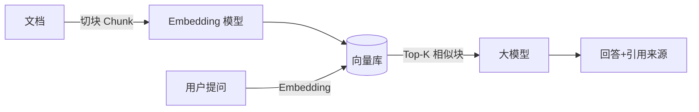

# 向量数据库生态（Milvus / FAISS / Qdrant / Weaviate / Chroma / pgvector）

> 向量数据库 = 存「高维向量」并按「向量相似度」检索的数据库，是 **RAG（检索增强生成）、语义搜索、推荐、去重、多模态** 的核心底座。本篇讲清「向量检索原理 → 索引算法 → 六大产品对比 → RAG 选型」。

---

## 一、解决的问题与核心概念

**解决的问题**：传统数据库按「字段值」精确/范围查询；向量检索是按「语义距离」找最近邻——「和这句话意思最像的段落」「和这张图最像的商品」。

**核心术语**：
- **Embedding（向量化）**：文本/图片/音频经模型（如 OpenAI embedding、BGE、CLIP）映射为 N 维浮点向量（如 1024 维）；
- **相似度度量**：余弦相似度（常用）、欧氏距离、内积；维度归一化后余弦≈内积，性能最优；
- **Top-K 最近邻（ANN）**：精确 KNN 太慢，用近似最近邻（Approximate NN）在「召回率 × 查询速度」间权衡。

**典型场景**：RAG 知识库检索（大模型问答）、语义搜索、以图搜图、推荐召回、相似去重（文本/代码）、异常检测。

---

## 二、核心原理：倒排文件（IVF）与 HNSW

### 2.1 暴力扫描 → 索引的三个思路

| 思路 | 做法 | 特点 |
|------|------|------|
| 暴力扫描 | 全量算距离 | 准确但 O(N×D)，百万级就慢 |
| IVF（倒排文件） | 先聚类分桶（如 1024 桶），查最近几个桶 | 快，但桶边界可能漏 |
| HNSW（分层可导航小世界） | 多层图：高层粗定位、低层精检索 | 召回高、快，内存占用大 |

### 2.2 HNSW 原理（当前最主流）

```
每层一张图：层越高节点越少（跳得快）
查询: 顶层贪婪搜索 → 逐层下钻到第 0 层精搜索
索引: 新向量自顶向下插入，每层按概率保留
```

- 参数：M（每节点邻居数，越大召回越高内存越大）、efConstruction（建索引质量）、efSearch（查询质量）；
- 优点：查询延迟稳定低、召回率高；缺点：**全部驻留内存**，亿级向量需要大内存机器。

### 2.3 压缩：PQ（乘积量化）

- 把 N 维向量切成 m 段，每段用 k-means 聚类成子码本，用「码字 ID」代替原始浮点 → 内存降 8~64 倍；
- 代价：精度损失——用「先粗索引（IVF/HNSW）+ 再 PQ 精排 + 重算原始距离」的混合方案恢复精度。

> 一句话原理：**IVF 负责「粗筛到少数桶」，HNSW 负责「图内快速精搜」，PQ 负责「压缩省内存」，生产系统三选二或全上。**

---

## 三、六大产品对比

| 产品 | 形态 | 核心特点 | 适合 |
|------|------|----------|------|
| **Milvus**（开源/云） | 分布式向量数据库 | 存算分离、分片+副本、亿级向量、多种索引（HNSW/IVF/磁盘索引）、与 Zilliz Cloud 一体 | 大规模生产 RAG、多租户 |
| **Qdrant** | 开源向量库（Rust） | 过滤（payload filter）能力强、快、Docker 一键起 | 中小规模、Rust 栈、过滤多 |
| **Weaviate** | 开源向量库（Go） | 内建模块（向量化/多模态）、GraphQL 查询 | 快速原型、教学 |
| **Chroma** | 轻量嵌入式（Python） | 本地方便、内存/持久化皆可 | 原型验证、小项目（不扛生产量） |
| **FAISS** | 向量**索引库**（非数据库） | Meta 出品，算法最全最快，无服务化 | 算法/离线、自建检索服务 |
| **pgvector** | PostgreSQL 扩展 | 直接装进 PG，SQL 里做向量列 + 向量索引（HNSW/IVF） | 已有 PG、数据量中小、不想引入新组件 |

> 选型速记：**已有 PG 且量不大 → pgvector（零新组件）；生产级 RAG 亿级向量 → Milvus；要过滤条件多且快 → Qdrant；纯算法实验 → FAISS；原型 → Chroma。**

---

## 四、RAG 工程中的向量库最佳实践



1. **切块策略**：按语义/章节切（500~1000 token），块太大检索不准、太小上下文碎片化；
2. **混合检索**：向量（语义）+ 关键词（BM25 精确词命）双路，结果融合——单向量漏病：专有名词/编号；
3. **元数据过滤**：把「知识域/时间/权限」存成标量字段，检索先过滤再相似（缩小搜索空间 + 权限隔离）；
4. **重排（Rerank）**：召回 Top-100 → 用重排模型精排取 Top-5，精度提升显著；
5. **增量更新**：文档更新走「新向量写入 + 旧向量删除（按 doc_id）」，避免索引膨胀；
6. **监控**：检索召回率、命中块质量（人工评估集），迭代切块与向量模型。

---

## 五、常见误区

- **向量库 ≠ 语义库**：相似度只代表「向量空间相近」，不代表「答案正确」——检索质量取决于切块与模型；
- **HNSW 全内存**：亿级向量估算内存（1 亿 × 1024 维 × 4B ≈ 400GB 原始值 + 图结构），学前预算；
- **维度越高不一定越准**：768/1024 是常用档，超高维（>2048）收益递减且资源翻倍；
- **只上向量不做过滤**：权限场景必须标量过滤，否则越权检索。

---

## 六、速查表

| 主题 | 一句话 |
|------|--------|
| 检索原理 | Embedding → 相似度（余弦/内积）→ ANN 最近邻 |
| 主流索引 | HNSW（内存快）/ IVF（磁盘省）/ PQ（压缩） |
| 生产选型 | 亿级上 Milvus；已有 PG 用 pgvector；过滤多用 Qdrant |
| RAG 关键 | 切块 + 混合检索 + 元数据过滤 + Rerank |
| 监控 | 召回率与命中块质量评估集 |

---

## 七、与其他板块的关系

- RAG 全链路见「[大模型/03-RAG 工程化](../../大模型/RAG/README.md)」；Embedding 与「[大模型/01-核心原理与训练机制](../../大模型/推理与思考模型/01-核心原理与训练机制.md)」同源；
- 向量检索与「[数据库与缓存云生态](./云上数据库与缓存生态.md)」（托管向量服务、Aurora pgvector / Cosmos DB 向量）呼应；
- 搜索漏斗与「[ES 体系](../ES体系.md)」互补：关键词搜索用 ES，语义检索用向量库，常混合部署。

> 一句话：**向量库 = 语义搜索引擎；原理靠 HNSW/IVF + PQ，工程靠切块 + 混合检索 + 过滤 + 重排；生产选型先问「量多大、过滤多不多、有没有 PG」。**