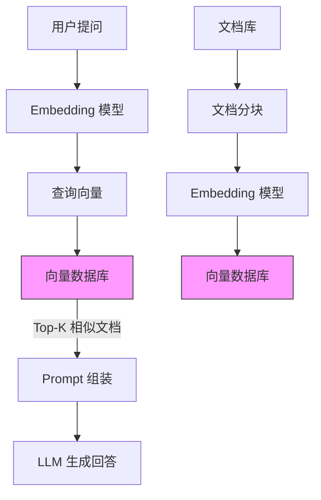

# 向量数据库生态

> **核心认知**：向量数据库是为高维向量相似度搜索设计的专用数据库，是 AI 应用（特别是 RAG、推荐系统、图像检索）的核心基础设施。它通过 ANN（近似最近邻）算法在毫秒级时间内从百万级向量中找到最相似的结果，传统关系型数据库无法高效完成此类查询。

## 要解决的问题

| 问题 | 传统数据库的痛点 | 向量数据库的解法 |
|------|-----------------|-----------------|
| 相似度搜索 | 需要遍历所有行，O(n) 复杂度 | ANN 算法，O(log n) 复杂度 |
| 高维向量存储 | 不支持向量类型 | 原生向量存储 + 索引 |
| 语义搜索 | 关键词匹配无法理解语义 | 向量 + 余弦相似度实现语义匹配 |
| 多模态检索 | 文本/图片/音频无法统一检索 | 统一向量空间 + 跨模态嵌入 |
| 实时更新 | 索引重建代价大 | 增量索引更新 |

## 向量数据库核心概念

### 向量嵌入（Embedding）

```
文本 → Embedding 模型 → 向量（如 1536 维）

示例：
  "苹果" → [0.02, -0.15, 0.33, ..., 0.08] (1536 维)
  "iPhone" → [0.03, -0.14, 0.31, ..., 0.07] (1536 维)
  
  语义相似 → 向量距离近
```

### 相似度度量

| 度量方式 | 公式 | 适用场景 | 特点 |
|----------|------|----------|------|
| 余弦相似度 | cos(A,B) = (A·B)/(‖A‖·‖B‖) | 文本语义 | 不受向量长度影响 |
| 欧氏距离 | √Σ(Ai-Bi)² | 图像特征 | 直观的几何距离 |
| 内积 | Σ(Ai×Bi) | 推荐系统 | 计算效率高 |
| 汉明距离 | 不同位数计数 | 二值向量 | 适合图像哈希 |

### ANN 算法

| 算法 | 原理 | 速度 | 精度 | 内存 |
|------|------|------|------|------|
| HNSW | 层次可导航小世界图 | 快 | 高 | 高 |
| IVF | 倒排文件索引 | 中 | 中 | 中 |
| PQ | 乘积量化 | 快 | 中 | 低 |
| LSH | 局部敏感哈希 | 快 | 低 | 低 |
| ScaNN | 向量量化 | 快 | 高 | 中 |

### HNSW 算法详解

```
HNSW（Hierarchical Navigable Small World）：
  ├── 多层图结构：顶层稀疏，底层密集
  ├── 插入：随机选择层级，逐层建立连接
  ├── 搜索：从顶层开始，贪心搜索到目标区域
  └── 参数：M（连接数）、efConstruction（构建精度）

  层级 3:  ●────────●
           │        │
  层级 2:  ●───●────●───●
           │   │    │   │
  层级 1:  ●─●─●──●─●─●─●──●
           │ │ │  │ │ │ │  │
  层级 0:  ●●●●●●●●●●●●●●●●●●●
```

## 主流向量数据库对比

| 特性 | Milvus | Pinecone | Qdrant | Weaviate | pgvector |
|------|--------|----------|--------|----------|----------|
| 部署方式 | 自部署/SaaS | 纯 SaaS | 自部署/Docker | 自部署/Docker | PostgreSQL 扩展 |
| 语言 | Go/C++ | - | Rust | Go | C |
| 标量过滤 | 支持 | 支持 | 支持 | 支持 | 支持 |
| 多向量 | 支持 | 不支持 | 支持 | 支持 | 不支持 |
| 混合搜索 | 支持 | 支持 | 支持 | 支持 | 支持 |
| 分布式 | 原生 | 内置 | 分布式集群 | 分布式 | 需 Citus |
| 许可证 | Apache 2.0 | 商业 | Apache 2.0 | BSD-3 | PostgreSQL |
| 适用场景 | 大规模生产 | 快速上手 | 高性能 | GraphQL 生态 | 已有 PG |

## Milvus 深入

### 架构设计

```
Milvus 架构：
  ├── Proxy Layer：接入层，负载均衡
  ├── Coordinator Layer：元数据管理
  │   ├── Root Coordinator：全局时间戳
  │   ├── Query Coordinator：查询调度
  │   ├── Data Coordinator：数据写入调度
  │   └── Index Coordinator：索引管理
  ├── Worker Layer：执行层
  │   ├── Query Node：查询执行
  │   ├── Data Node：数据写入
  │   └── Index Node：索引构建
  └── Storage Layer：存储层
      ├── Meta Store：etcd（元数据）
      ├── Object Storage：MinIO/S3（向量数据）
      └── Log Broker：Pulsar/Kafka（消息队列）
```

### 使用示例

```python
from pymilvus import MilvusClient, DataType

# 连接
client = MilvusClient(uri="http://localhost:19530")

# 创建集合
schema = {
    "fields": [
        {"name": "id", "dtype": DataType.INT64, "is_primary": True},
        {"name": "embedding", "dtype": DataType.FLOAT_VECTOR, "dim": 1536},
        {"name": "text", "dtype": DataType.VARCHAR, "max_length": 2000},
        {"name": "category", "dtype": DataType.VARCHAR, "max_length": 100}
    ]
}
client.create_collection(
    collection_name="documents",
    schema=schema,
    index_params=[{
        "field_name": "embedding",
        "index_type": "HNSW",
        "metric_type": "COSINE",
        "params": {"M": 16, "efConstruction": 256}
    }]
)

# 插入数据
client.insert("documents", [
    {"id": 1, "embedding": [0.1]*1536, "text": "向量数据库", "category": "tech"},
    {"id": 2, "embedding": [0.2]*1536, "text": "机器学习", "category": "tech"}
])

# 向量搜索 + 标量过滤
results = client.search(
    collection_name="documents",
    data=[[0.1]*1536],
    limit=10,
    output_fields=["text", "category"],
    filter='category == "tech"'
)
```

## RAG 架构中的向量数据库



### RAG 中向量数据库的关键配置

| 配置项 | 推荐值 | 说明 |
|--------|--------|------|
| 向量维度 | 1536 (OpenAI) | 根据 Embedding 模型决定 |
| 索引类型 | HNSW | 速度和精度平衡 |
| Top-K | 5-20 | 根据上下文窗口调整 |
| 相似度阈值 | 0.7+ | 过滤不相关结果 |
| 分块大小 | 500-1000 tokens | 根据文档类型调整 |

## 性能优化

| 优化手段 | 效果 | 说明 |
|----------|------|------|
| 量化压缩 | 减少内存 4-8x | PQ/SQ 量化 |
| GPU 加速 | 提升构建/查询 10x | GPU 索引构建 |
| 分片并行 | 提升查询吞吐 | 多分片并行搜索 |
| 缓存热门查询 | 减少重复计算 | 查询结果缓存 |
| 批量写入 | 提升写入吞吐 | 批量插入 |

## 常见陷阱

| 陷阱 | 后果 | 正确做法 |
|------|------|----------|
| Embedding 模型选错 | 搜索质量差 | 根据领域选择合适的模型 |
| 分块策略不合理 | 检索结果碎片化 | 合理设计分块大小和重叠 |
| 不做标量过滤 | 无关结果太多 | 结合元数据过滤 |
| 索引参数不当 | 精度/速度失衡 | 调优 HNSW 参数 |
| 不监控索引大小 | 内存溢出 | 监控向量数量和内存 |
| 忽略向量更新 | 旧数据污染结果 | 设计数据更新策略 |


## Embedding 模型对比

| 模型 | 维度 | 最大Token | 语言支持 | 适用场景 | 开源 |
|------|------|-----------|----------|----------|------|
| OpenAI text-embedding-3-large | 3072 | 8191 | 多语言 | 通用语义搜索 | 否 |
| OpenAI text-embedding-3-small | 1536 | 8191 | 多语言 | 成本敏感场景 | 否 |
| BGE-large-zh-v1.5 | 1024 | 512 | 中文 | 中文语义搜索 | 是 |
| BGE-M3 | 1024 | 8192 | 多语言 | 多语言+多粒度 | 是 |
| GTE-large | 1024 | 512 | 多语言 | 通用语义匹配 | 是 |
| Cohere embed-v3 | 1024 | 512 | 多语言 | 商业应用 | 否 |
| Jina-embedding-v2 | 768 | 8192 | 多语言 | 长文本嵌入 | 是 |
| M3E-base | 768 | 512 | 中文 | 中文文本聚类 | 是 |
| nomic-embed-text | 768 | 8191 | 多语言 | 本地部署 | 是 |

```
Embedding 模型选型建议：
  ├── 中文场景：BGE-large-zh-v1.5 或 M3E-base
  ├── 多语言场景：BGE-M3 或 text-embedding-3-small
  ├── 长文本场景：Jina-embedding-v2（8192 token）
  ├── 本地部署：nomic-embed-text 或 BGE 系列
  ├── 商业应用：OpenAI text-embedding-3 系列
  └── 成本敏感：BGE-M3（开源免费）vs OpenAI（按量计费）
```

## 向量索引算法深入

### HNSW 参数详解

```
HNSW 关键参数：
  M: 每个节点的最大连接数
    ├── 值越大：索引质量越高，内存占用越大
    ├── 值越小：内存占用小，但搜索质量下降
    └── 推荐值：16-64（通用场景）

  efConstruction: 构建时的搜索范围
    ├── 值越大：构建时间越长，索引质量越高
    ├── 值越小：构建快，但质量差
    └── 推荐值：128-512

  efSearch: 查询时的搜索范围
    ├── 值越大：搜索精度越高，速度越慢
    ├── 值越小：搜索快，但可能漏掉近邻
    └── 推荐值：64-256

  层级生成公式：layer = -ln(random()) * mL
    mL = ln(M) / ln(2)
    M 越大，层级越少，搜索越快
```

```
HNSW 构建过程：
  1. 插入节点 v，随机生成层级 L
  2. 如果 L > 当前最大层级，创建新层
  3. 从顶层开始，贪心搜索最近邻
  4. 在目标层级建立连接
  5. 限制每个节点的连接数为 M
  6. 如果连接数超过 M，剪枝保留最近的 M 个

  搜索过程：
    1. 从顶层入口节点开始
    2. 贪心搜索：在当前层找最近邻
    3. 进入下一层，从上层最近邻继续搜索
    4. 直到最底层，返回 efSearch 个候选
    5. 在候选中精排，返回 Top-K
```

### IVF + PQ 组合索引

```
IVF-PQ 索引构建流程：
  1. IVF 阶段：用 K-Means 将向量空间划分为 nlist 个簇
  2. PQ 阶段：每个簇内的向量用乘积量化压缩
  3. 每个向量存储：簇 ID + PQ 编码（紧凑）

  参数配置：
    nlist: 簇数量（推荐 sqrt(n) 到 4*sqrt(n)）
    m: 子空间数量（推荐 8/16/32）
    nbits: 每个子空间的量化位数（推荐 8）
    nprobe: 查询时搜索的簇数量（影响精度/速度权衡）

  搜索过程：
    1. 计算查询向量与所有簇中心的距离
    2. 选择最近的 nprobe 个簇
    3. 在选中簇内用 PQ 精排
    4. 返回 Top-K

  适用场景：
    ├── 数据量大（>1000万）
    ├── 内存受限
    ├── 可接受一定精度损失
    └── 写入少，查询多
```

## 向量数据库在图像检索中的应用

```
图像检索架构：

  图像输入 → 特征提取（CNN/ViT）→ 图像向量 → 向量数据库

  特征提取模型：
    ├── CLIP：图文对齐，支持跨模态检索
    ├── ResNet：图像分类特征
    ├── ViT：视觉 Transformer 特征
    └── DINOv2：自监督视觉特征

  图像检索流程：
    1. 图像预处理（缩放、归一化）
    2. CNN/ViT 提取特征向量（如 512 维）
    3. 向量归一化（L2 归一化）
    4. 写入向量数据库
    5. 查询时：提取查询图像特征 → 相似度搜索

  应用场景：
    ├── 以图搜图：电商商品搜索
    ├── 相似图片推荐：社交平台
    ├── 版权检测：图片去重
    └── 医学影像：病理图像匹配
```

```python
# 图像检索示例（使用 CLIP + Milvus）
import torch
from PIL import Image
from transformers import CLIPProcessor, CLIPModel
from pymilvus import MilvusClient

# 加载 CLIP 模型
model = CLIPModel.from_pretrained("openai/clip-vit-base-patch32")
processor = CLIPProcessor.from_pretrained("openai/clip-vit-base-patch32")

def extract_image_embedding(image_path):
    image = Image.open(image_path)
    inputs = processor(images=image, return_tensors="pt")
    with torch.no_grad():
        features = model.get_image_features(**inputs)
    return features[0].tolist()

# 写入向量数据库
client = MilvusClient(uri="http://localhost:19530")
for img_path in image_list:
    embedding = extract_image_embedding(img_path)
    client.insert("images", [{"id": next_id, "embedding": embedding, "path": img_path}])

# 以图搜图
query_embedding = extract_image_embedding("query.jpg")
results = client.search("images", [query_embedding], limit=10)
```

## 向量数据库在推荐系统中的应用

```
推荐系统中的向量数据库：

  实时推荐架构：
    用户行为 → 实时特征提取 → 用户向量 → 向量数据库检索 → 候选集 → 排序 → 推荐结果

  离线向量召回：
    物品特征 → Embedding 模型 → 物品向量 → 向量数据库（离线构建索引）

  双塔模型 + 向量数据库：
    ├── User Tower：用户特征 → 用户向量
    ├── Item Tower：物品特征 → 物品向量
    ├── 训练：对比学习（正样本拉近，负样本推远）
    └── 召回：用户向量检索物品向量

  向量召回策略：
    ├── 热门召回：全局热门物品向量
    ├── 兴趣召回：用户历史行为向量
    ├── 协同召回：相似用户喜欢的物品
    └── 跨域召回：不同业务域的物品
```

```
推荐系统向量数据库配置：
  ├── 索引类型：HNSW（召回精度要求高）或 IVF-PQ（数据量大）
  ├── 向量维度：64-256（权衡效果和性能）
  ├── Top-K：100-1000（召回候选集大小）
  ├── 相似度阈值：根据业务调整
  ├── 更新频率：物品特征变化时增量更新
  └── 冷启动：新物品直接写入，无需重建索引
```

## 向量数据库性能基准测试

```
Benchmark 方法论：
  数据集：
    ├── GIST-1M：100 万 960 维向量
    ├── SIFT-1M：100 万 128 维向量
    ├── DEEP-1M：100 万 256 维向量
    └── OpenAI-1M：100 万 1536 维向量

  评测指标：
    ├── Recall@K：召回率（Top-K 中包含真实近邻的比例）
    ├── QPS：每秒查询数
    ├── P99 延迟：99 分位查询延迟
    ├── 索引构建时间
    └── 内存占用

  典型测试结果（SIFT-1M, 128 维）：
    Milvus HNSW:   Recall@10=0.98, QPS=5000, P99=5ms
    Milvus IVF:    Recall@10=0.95, QPS=8000, P99=10ms
    Qdrant HNSW:   Recall@10=0.99, QPS=6000, P99=3ms
    Pinecone:      Recall@10=0.97, QPS=10000, P99=2ms
    pgvector IVFF: Recall@10=0.90, QPS=1000, P99=50ms
```

| 数据库 | 索引 | QPS (1M) | P99 (ms) | Recall@10 | 内存 (GB) |
|--------|------|----------|----------|-----------|-----------|
| Milvus | HNSW | 5000 | 5 | 0.98 | 1.5 |
| Qdrant | HNSW | 6000 | 3 | 0.99 | 1.4 |
| Weaviate | HNSW | 4000 | 8 | 0.97 | 1.6 |
| pgvector | IVFF | 1000 | 50 | 0.90 | 2.0 |
| Pinecone | - | 10000 | 2 | 0.97 | - |

## 向量数据库扩展策略

```
水平扩展方案：
  分片（Sharding）：
    ├── 哈希分片：向量 ID 哈希到不同节点
    ├── 范围分片：按 ID 范围分片
    └── 一致性哈希：动态扩缩容

  副本（Replication）：
    ├── 读写分离：写主读从
    ├── 高可用：主从故障转移
    └── 负载均衡：多副本分担查询

  扩容流程：
    1. 添加新节点
    2. 迁移部分分片数据到新节点
    3. 更新路由表
    4. 验证数据一致性
    5. 停止旧节点的对应分片服务
```

```
垂直扩展方案：
  内存扩展：
    ├── 增加物理内存
    ├── 使用 GPU 加速索引构建
    └── 量化压缩减少内存占用

  CPU 扩展：
    ├── 增加 CPU 核心数
    ├── 并行构建索引
    └── 多线程查询

  存储扩展：
    ├── 使用 SSD 替代 HDD
    ├── NVMe 存储
    └── 分布式存储（MinIO/S3）
```

## 向量数据库备份与恢复

```
备份策略：
  全量备份：
    ├── 定期导出整个向量数据库
    ├── 包含元数据、向量数据、索引
    └── 推荐频率：每周一次

  增量备份：
    ├── 备份上次备份后的变更
    ├── WAL 日志回放
    └── 推荐频率：每天一次

  快照备份：
    ├── 利用存储层快照（LVM/S3 快照）
    ├── 一致性快照，不影响服务
    └── 推荐频率：每小时一次

  恢复流程：
    1. 恢复元数据（etcd/ZooKeeper）
    2. 恢复向量数据（Object Storage）
    3. 重建索引（如果需要）
    4. 验证数据一致性
    5. 切换流量
```

```bash
# Milvus 备份示例
# 全量备份
milvus-backup create --collection documents --name full_backup_20240101

# 恢复
milvus-backup restore --name full_backup_20240101

# 定时备份脚本
#!/bin/bash
DATE=$(date +%Y%m%d)
milvus-backup create --collection documents --name "backup_${DATE}"
# 上传到 S3
aws s3 cp /backup/documents_${DATE}.tar.gz s3://milvus-backup/
# 清理 30 天前的备份
find /backup -name "backup_*" -mtime +30 -delete
```

## 向量数据库安全

```
安全防护措施：
  认证：
    ├── API Key 认证
    ├── JWT Token 认证
    ├── TLS 客户端证书
    └── 集成 LDAP/AD

  授权：
    ├── 基于角色的访问控制（RBAC）
    ├── 基于集合的权限隔离
    ├── API 级别的权限控制
    └── 查询审计日志

  数据安全：
    ├── 传输加密（TLS 1.3）
    ├── 静态加密（AES-256）
    ├── 向量数据脱敏
    └── 访问日志记录

  网络安全：
    ├── VPC 隔离
    ├── 防火墙规则
    ├── IP 白名单
    └── DDoS 防护
```

```
安全配置示例：
  Milvus 安全配置：
    ├── 启用 TLS：配置证书和密钥
    ├── 启用认证：设置 root 密码
    ├── RBAC：创建角色和用户
    └── 审计日志：记录所有操作

  生产环境安全清单：
    ├── [ ] 启用 TLS 加密传输
    ├── [ ] 启用认证机制
    ├── [ ] 配置 RBAC 权限
    ├── [ ] 限制网络访问
    ├── [ ] 开启审计日志
    ├── [ ] 定期轮换密钥
    └── [ ] 监控异常访问
```

## 向量数据库在 RAG 生产系统中的完整架构

### RAG 生产系统架构

```
RAG 生产系统全链路架构：

  文档处理层：
    ├── 文档解析：PDF/Word/HTML → 纯文本
    ├── 文档分块：固定大小 + 语义分块
    ├── 元数据提取：标题/作者/时间/来源
    └── Embedding 生成：文本 → 向量

  向量存储层：
    ├── Milvus 集群：主向量存储
    ├── 元数据存储：PostgreSQL
    └── 缓存层：Redis（热门查询缓存）

  检索层：
    ├── 混合检索：向量检索 + BM25 关键词检索
    ├── 重排序：Cross-Encoder 重排 Top-K
    ├── 过滤：元数据过滤 + 相似度阈值
    └── 融合：RRF（Reciprocal Rank Fusion）融合

  生成层：
    ├── Prompt 组装：检索结果 + 用户问题
    ├── LLM 生成：GPT-4/Claude/本地模型
    └── 引用标注：标注答案来源文档
```

### 生产级 RAG 代码实现

```python
from pymilvus import MilvusClient, DataType
from sentence_transformers import CrossEncoder
from rank_bm25 import BM25Okapi
import numpy as np

class ProductionRAG:
    def __init__(self):
        self.milvus = MilvusClient(uri="http://milvus-cluster:19530")
        self.cross_encoder = CrossEncoder("cross-encoder/ms-marco-MiniLM-L-6-v2")
        self.reranker = CrossEncoder("BAAI/bge-reranker-v2-m3")
        self.top_k = 20
        self.rerank_top_n = 5

    def index_documents(self, documents: list[dict]):
        """文档索引：分块 + Embedding + 写入"""
        embeddings = self._generate_embeddings([doc["text"] for doc in documents])

        entities = []
        for doc, emb in zip(documents, embeddings):
            entities.append({
                "id": doc["id"],
                "embedding": emb,
                "text": doc["text"],
                "metadata": doc["metadata"]
            })

        self.milvus.insert("documents", entities)
        self.milvus.flush("documents")

    def hybrid_search(self, query: str, filters: dict = None) -> list[dict]:
        """混合检索：向量 + 关键词"""
        # 1. 向量检索
        query_embedding = self._generate_embeddings([query])[0]
        vector_results = self.milvus.search(
            collection_name="documents",
            data=[query_embedding],
            limit=self.top_k,
            output_fields=["text", "metadata"],
            filter=self._build_filter(filters)
        )

        # 2. BM25 关键词检索
        bm25_results = self._bm25_search(query)

        # 3. RRF 融合
        fused_results = self._rrf_fusion(vector_results, bm25_results)

        # 4. Cross-Encoder 重排序
        reranked = self._rerank(query, fused_results)

        return reranked[:self.rerank_top_n]

    def _rrf_fusion(self, vector_results, bm25_results, k=60):
        """RRF 融合算法"""
        score_map = {}

        # 向量检索结果
        for rank, result in enumerate(vector_results):
            doc_id = result["id"]
            score_map[doc_id] = score_map.get(doc_id, 0) + 1 / (k + rank + 1)

        # BM25 检索结果
        for rank, doc_id in enumerate(bm25_results):
            score_map[doc_id] = score_map.get(doc_id, 0) + 1 / (k + rank + 1)

        # 按融合分数排序
        sorted_results = sorted(score_map.items(), key=lambda x: x[1], reverse=True)
        return [doc_id for doc_id, _ in sorted_results]

    def _rerank(self, query: str, doc_ids: list) -> list[dict]:
        """Cross-Encoder 重排序"""
        docs = [self._get_doc_text(doc_id) for doc_id in doc_ids]
        pairs = [(query, doc) for doc in docs]
        scores = self.cross_encoder.predict(pairs)

        scored_docs = list(zip(doc_ids, scores))
        scored_docs.sort(key=lambda x: x[1], reverse=True)
        return [{"id": doc_id, "score": score} for doc_id, score in scored_docs]

    def answer(self, query: str) -> dict:
        """完整 RAG 流程"""
        # 检索
        results = self.hybrid_search(query)

        # 组装 Prompt
        context = "\n\n".join([r["text"] for r in results])
        prompt = f"""基于以下上下文回答问题。如果上下文不包含答案，请说明无法回答。

上下文：
{context}

问题：{query}

回答："""

        # 生成
        answer = self._call_llm(prompt)

        # 引用标注
        sources = [{"doc_id": r["id"], "score": r["score"]} for r in results]

        return {"answer": answer, "sources": sources}
```

## Embedding 模型微调

### 领域特定 Embedding 微调

```python
from sentence_transformers import SentenceTransformer, InputExample, losses
from torch.utils.data import DataLoader

class EmbeddingFineTuner:
    def __init__(self, base_model: str = "BAAI/bge-large-zh-v1.5"):
        self.model = SentenceTransformer(base_model)

    def prepare_training_data(self, domain_data: list[dict]):
        """准备训练数据：正负样本对"""
        examples = []
        for item in domain_data:
            # 正样本：语义相似的文本对
            examples.append(InputExample(
                texts=[item["query"], item["positive"]],
                label=1.0
            ))
            # 负样本：语义不相似的文本对
            examples.append(InputExample(
                texts=[item["query"], item["negative"]],
                label=0.0
            ))
        return examples

    def fine_tune(self, train_data: list[dict], epochs: int = 3, batch_size: int = 16):
        """微调模型"""
        examples = self.prepare_training_data(train_data)
        train_dataloader = DataLoader(examples, shuffle=True, batch_size=batch_size)

        # 使用 MultipleNegativesRankingLoss
        train_loss = losses.MultipleNegativesRankingLoss(self.model)

        self.model.fit(
            train_objectives=[(train_dataloader, train_loss)],
            epochs=epochs,
            warmup_steps=100,
            output_path="./fine-tuned-embedding"
        )

    def evaluate(self, test_data: list[dict]) -> dict:
        """评估模型效果"""
        queries = [item["query"] for item in test_data]
        documents = [item["positive"] for item in test_data]

        query_embeddings = self.model.encode(queries)
        doc_embeddings = self.model.encode(documents)

        # 计算余弦相似度
        similarities = np.array([
            np.dot(q, d) / (np.linalg.norm(q) * np.linalg.norm(d))
            for q, d in zip(query_embeddings, doc_embeddings)
        ])

        return {
            "mean_similarity": float(np.mean(similarities)),
            "median_similarity": float(np.median(similarities)),
            "min_similarity": float(np.min(similarities)),
            "recall@1": float(np.mean(similarities > 0.8))
        }

# 使用示例
tuner = EmbeddingFineTuner()
domain_data = [
    {
        "query": "如何配置数据库连接池？",
        "positive": "数据库连接池配置方法：设置maxPoolSize=20, minIdle=5...",
        "negative": "今天天气真好，适合出去玩。"
    },
    # ... 更多训练数据
]
tuner.fine_tune(domain_data, epochs=5)
```

## 向量数据库基准测试方法论

### ANN-Benchmarks 测试框架

```
基准测试流程：
  1. 数据集准备：
     ├── SIFT-1M：128维，100万向量
     ├── GIST-1M：960维，100万向量
     ├── OpenAI-1M：1536维，100万向量
     └── 自定义数据集：领域特定数据

  2. 测试指标：
     ├── Recall@K：召回率（K=1,10,100）
     ├── QPS：每秒查询数
     ├── P50/P95/P99 延迟
     ├── 索引构建时间
     └── 内存占用

  3. 测试方法：
     ├── 批量查询：1000条查询取平均
     ├── 并发查询：多线程并发测试
     ├── 冷启动：首次查询延迟
     └── 热缓存：缓存命中后延迟
```

```python
import time
import numpy as np
from pymilvus import MilvusClient

class VectorBenchmark:
    def __init__(self, client: MilvusClient, collection: str):
        self.client = client
        self.collection = collection

    def benchmark_search(self, query_vectors: np.ndarray, top_k: int = 10,
                         n_runs: int = 1000) -> dict:
        """基准测试：搜索性能"""
        latencies = []

        for _ in range(n_runs):
            query = query_vectors[np.random.randint(len(query_vectors))]

            start = time.perf_counter()
            self.client.search(
                collection_name=self.collection,
                data=[query.tolist()],
                limit=top_k
            )
            latencies.append(time.perf_counter() - start)

        latencies = np.array(latencies) * 1000  # 转换为毫秒

        return {
            "qps": n_runs / sum(latencies) * 1000,
            "p50_ms": float(np.percentile(latencies, 50)),
            "p95_ms": float(np.percentile(latencies, 95)),
            "p99_ms": float(np.percentile(latencies, 99)),
            "mean_ms": float(np.mean(latencies)),
            "std_ms": float(np.std(latencies))
        }

    def benchmark_insert(self, vectors: np.ndarray, batch_size: int = 1000) -> dict:
        """基准测试：插入性能"""
        start = time.perf_counter()

        for i in range(0, len(vectors), batch_size):
            batch = vectors[i:i+batch_size]
            entities = [
                {"id": i+j, "embedding": v.tolist()}
                for j, v in enumerate(batch)
            ]
            self.client.insert(self.collection, entities)

        total_time = time.perf_counter() - start

        return {
            "total_vectors": len(vectors),
            "total_time_s": total_time,
            "vectors_per_second": len(vectors) / total_time
        }

    def compare_indexes(self, query_vectors: np.ndarray, ground_truth: list) -> dict:
        """比较不同索引的精度"""
        results = self.client.search(
            collection_name=self.collection,
            data=[query_vectors[0].tolist()],
            limit=100
        )

        # 计算 Recall@K
        retrieved_ids = [r["id"] for r in results[0]]
        relevant_ids = set(ground_truth[0][:10])

        recall_at_10 = len(set(retrieved_ids[:10]) & relevant_ids) / 10
        recall_at_100 = len(set(retrieved_ids[:100]) & relevant_ids) / len(relevant_ids)

        return {
            "recall@10": recall_at_10,
            "recall@100": recall_at_100
        }
```

## 混合检索（向量 + 关键词）实现

```python
from elasticsearch import Elasticsearch
from pymilvus import MilvusClient
import numpy as np

class HybridSearchEngine:
    def __init__(self):
        self.milvus = MilvusClient(uri="http://milvus:19530")
        self.es = Elasticsearch("http://elasticsearch:9200")

    def index(self, documents: list[dict]):
        """混合索引：同时写入向量库和倒排索引"""
        # 1. 写入 Elasticsearch（关键词索引）
        for doc in documents:
            self.es.index(
                index="documents",
                id=doc["id"],
                body={
                    "title": doc["title"],
                    "content": doc["content"],
                    "metadata": doc["metadata"]
                }
            )

        # 2. 写入 Milvus（向量索引）
        embeddings = self._encode([doc["content"] for doc in documents])
        entities = [
            {"id": doc["id"], "embedding": emb.tolist(), "text": doc["content"]}
            for doc, emb in zip(documents, embeddings)
        ]
        self.milvus.insert("documents", entities)

    def search(self, query: str, top_k: int = 20) -> list[dict]:
        """混合检索"""
        # 1. BM25 关键词检索
        bm25_results = self.es.search(
            index="documents",
            body={
                "query": {
                    "multi_match": {
                        "query": query,
                        "fields": ["title^3", "content"]
                    }
                },
                "size": top_k
            }
        )
        bm25_ids = [hit["_id"] for hit in bm25_results["hits"]["hits"]]

        # 2. 向量语义检索
        query_embedding = self._encode([query])[0]
        vector_results = self.milvus.search(
            collection_name="documents",
            data=[query_embedding.tolist()],
            limit=top_k,
            output_fields=["text"]
        )
        vector_ids = [r["id"] for r in vector_results[0]]

        # 3. RRF 融合
        k = 60
        scores = {}
        for rank, doc_id in enumerate(bm25_ids):
            scores[doc_id] = scores.get(doc_id, 0) + 1 / (k + rank + 1)
        for rank, doc_id in enumerate(vector_ids):
            scores[doc_id] = scores.get(doc_id, 0) + 1 / (k + rank + 1)

        sorted_ids = sorted(scores.items(), key=lambda x: x[1], reverse=True)

        # 4. 获取完整文档
        results = []
        for doc_id, score in sorted_ids[:top_k]:
            doc = self.es.get(index="documents", id=doc_id)
            results.append({
                "id": doc_id,
                "score": score,
                "text": doc["_source"]["content"],
                "metadata": doc["_source"]["metadata"]
            })

        return results

    def _encode(self, texts: list[str]) -> np.ndarray:
        """文本编码"""
        from sentence_transformers import SentenceTransformer
        model = SentenceTransformer("BAAI/bge-large-zh-v1.5")
        return model.encode(texts)
```

## 向量数据库扩展到十亿级向量

### 十亿级向量存储架构

```
十亿级向量存储架构：

  接入层：
    ├── 代理层：代理查询路由
    ├── 缓存层：Redis 缓存热门查询
    └── 限流层：保护后端服务

  计算层：
    ├── 查询节点：分布式并行查询
    ├── 索引节点：分布式索引构建
    └── 写入节点：分布式数据写入

  存储层：
    ├── 分片1：~1亿向量
    ├── 分片2：~1亿向量
    ├── ...
    └── 分片N：~1亿向量

  元数据层：
    ├── etcd：分布式元数据管理
    └── 路由表：查询路由信息
```

### 分片策略与数据分布

```python
class BillionScaleSharding:
    """十亿级向量分片管理"""

    def __init__(self, num_shards: int = 100):
        self.num_shards = num_shards
        self.shard_clients = {}

    def get_shard(self, vector_id: int) -> int:
        """一致性哈希分片"""
        return vector_id % self.num_shards

    def route_query(self, query_embedding: np.ndarray, top_k: int = 10) -> list:
        """分布式查询路由"""
        results = []

        # 并行查询所有分片
        from concurrent.futures import ThreadPoolExecutor, as_completed

        with ThreadPoolExecutor(max_workers=32) as executor:
            futures = {}
            for shard_id in range(self.num_shards):
                future = executor.submit(
                    self._query_shard, shard_id, query_embedding, top_k
                )
                futures[future] = shard_id

            for future in as_completed(futures):
                shard_results = future.result()
                results.extend(shard_results)

        # 全局排序取 Top-K
        results.sort(key=lambda x: x["score"], reverse=True)
        return results[:top_k]

    def _query_shard(self, shard_id: int, query: np.ndarray, top_k: int) -> list:
        """查询单个分片"""
        client = self.shard_clients.get(shard_id)
        if not client:
            return []

        results = client.search(
            collection_name=f"shard_{shard_id}",
            data=[query.tolist()],
            limit=top_k
        )
        return results[0] if results else []

    def reshard(self, old_num_shards: int, new_num_shards: int):
        """动态重分片"""
        migration_plan = []

        for old_shard in range(old_num_shards):
            # 获取旧分片所有向量
            vectors = self._scan_shard(old_shard)

            for vector in vectors:
                new_shard = vector["id"] % new_num_shards
                if new_shard != old_shard:
                    migration_plan.append({
                        "from": old_shard,
                        "to": new_shard,
                        "vector": vector
                    })

        # 执行迁移
        self._execute_migration(migration_plan)
```

## 向量量化技术

### 乘积量化（PQ）与标量量化（SQ）

```
乘积量化（Product Quantization）：
  原理：将高维向量分成多个子空间，每个子空间独立量化

  示例（128维向量，8个子空间）：
    原始向量：[0.1, 0.2, ..., 0.128] (128维)
    ↓ 分成8个子空间
    子空间1: [0.1, 0.2, ..., 0.16] (16维)
    子空间2: [0.17, 0.18, ..., 0.32] (16维)
    ...
    子空间8: [0.113, 0.114, ..., 0.128] (16维)
    ↓ 每个子空间用 K-Means 聚类（256个中心）
    量化编码：[12, 45, 78, 23, 56, 89, 34, 67] (8字节)

  压缩比：128维 * 4字节/维 = 512字节 → 8字节 = 64x 压缩

  优势：
    ├── 内存占用大幅减少
    ├── 查询时只需计算 PQ 编码距离
    └── 适合内存受限场景

  劣势：
    ├── 精度损失（量化误差）
    ├── 构建时间长
    └── 不适合精确度要求高的场景
```

```python
import faiss
import numpy as np

class ProductQuantizationDemo:
    def __init__(self, dimension: int = 128, num_subquantizers: int = 8):
        self.dimension = dimension
        self.num_subquantizers = num_subquantizers
        self.bits_per_code = 8

    def build_pq_index(self, vectors: np.ndarray):
        """构建 PQ 索引"""
        m = self.num_subquantizers
        nbits = self.bits_per_code

        # 创建 PQ 量化器
        quantizer = faiss.IndexFlatL2(self.dimension)
        pq_index = faiss.IndexPQ(self.dimension, m, nbits)

        # 训练并添加向量
        pq_index.train(vectors)
        pq_index.add(vectors)

        return pq_index

    def build_ivf_pq_index(self, vectors: np.ndarray, nlist: int = 100):
        """构建 IVF-PQ 组合索引"""
        m = self.num_subquantizers
        nbits = self.bits_per_code

        # 创建 IVF 量化器
        quantizer = faiss.IndexFlatL2(self.dimension)
        ivf_pq_index = faiss.IndexIVFPQ(
            quantizer, self.dimension, nlist, m, nbits
        )

        # 训练并添加向量
        ivf_pq_index.train(vectors)
        ivf_pq_index.add(vectors)

        # 设置查询参数
        ivf_pq_index.nprobe = 10  # 搜索时访问的聚类数

        return ivf_pq_index

class ScalarQuantizationDemo:
    def __init__(self, dimension: int = 128):
        self.dimension = dimension

    def build_sq_index(self, vectors: np.ndarray):
        """构建标量量化索引"""
        # 每个维度独立量化为 8 位整数
        sq_index = faiss.IndexScalarQuantizer(
            self.dimension,
            faiss.ScalarQuantizer.QT_8bit
        )

        sq_index.train(vectors)
        sq_index.add(vectors)

        return sq_index

# 量化效果对比
# 原始向量：128维 * 4字节 = 512 字节/向量
# PQ 量化：8字节/向量（64x 压缩）
# SQ 量化：128字节/向量（4x 压缩）
# IVF-PQ：8字节 + 索引开销（~50x 压缩）
```

## 向量数据库备份与容灾

```
向量数据库容灾策略：

  RPO（恢复点目标）：< 1小时
  RTO（恢复时间目标）：< 30分钟

  备份方案：
    ├── 全量备份：每周一次，S3/OSS 存储
    ├── 增量备份：每天一次，WAL 日志
    ├── 快照备份：每小时一次，存储层快照
    └── 跨区域复制：异地灾备

  恢复流程：
    1. 从最近的快照恢复（< 5分钟）
    2. 回放 WAL 日志（< 30分钟）
    3. 验证数据一致性
    4. 切换流量

  容灾演练：
    ├── 每月执行一次容灾切换
    ├── 验证恢复时间和数据完整性
    └── 更新容灾文档
```

```bash
#!/bin/bash
# Milvus 备份脚本

# 全量备份
backup_full() {
    DATE=$(date +%Y%m%d_%H%M)
    milvus-backup create \
        --collection documents \
        --name "full_backup_${DATE}" \
        --storage s3://milvus-backup/

    echo "全量备份完成: full_backup_${DATE}"
}

# 增量备份（基于 WAL）
backup_incremental() {
    DATE=$(date +%Y%m%d_%H%M)
    milvus-backup create \
        --collection documents \
        --name "incr_backup_${DATE}" \
        --incremental \
        --storage s3://milvus-backup/

    echo "增量备份完成: incr_backup_${DATE}"
}

# 恢复
restore() {
    BACKUP_NAME=$1
    milvus-backup restore \
        --name "${BACKUP_NAME}" \
        --storage s3://milvus-backup/

    echo "恢复完成: ${BACKUP_NAME}"
}

# 定时任务
# 0 2 * * 0 /path/to/backup_full.sh
# 0 2 * * 1-6 /path/to/backup_incremental.sh
```

## 多租户向量数据库

### 多租户隔离方案

```
多租户隔离方案：

  方案一：Collection 级隔离
    ├── 每个租户一个 Collection
    ├── 完全隔离，互不影响
    ├── 管理复杂度高（租户多时）
    └── 适用场景：大客户、数据敏感

  方案二：Partition 级隔离
    ├── 所有租户共享 Collection
    ├── 使用 Partition Key 隔离
    ├── 管理简单
    └── 适用场景：中小客户、成本敏感

  方案三：数据库级隔离
    ├── 每个租户一个数据库实例
    ├── 完全隔离
    ├── 成本最高
    └── 适用场景：金融级隔离要求
```

```python
class MultiTenantVectorDB:
    """多租户向量数据库"""

    def __init__(self):
        self.client = MilvusClient(uri="http://milvus:19530")

    def create_tenant_collection(self, tenant_id: str):
        """为租户创建独立 Collection"""
        schema = {
            "fields": [
                {"name": "id", "dtype": DataType.INT64, "is_primary": True},
                {"name": "embedding", "dtype": DataType.FLOAT_VECTOR, "dim": 1536},
                {"name": "text", "dtype": DataType.VARCHAR, "max_length": 2000},
                {"name": "tenant_id", "dtype": DataType.VARCHAR, "max_length": 64}
            ]
        }

        collection_name = f"docs_{tenant_id}"
        self.client.create_collection(
            collection_name=collection_name,
            schema=schema,
            index_params=[{
                "field_name": "embedding",
                "index_type": "HNSW",
                "metric_type": "COSINE",
                "params": {"M": 16, "efConstruction": 256}
            }]
        )

    def insert_with_tenant(self, tenant_id: str, documents: list[dict]):
        """带租户标识的数据写入"""
        collection_name = f"docs_{tenant_id}"
        entities = [
            {
                "id": doc["id"],
                "embedding": doc["embedding"],
                "text": doc["text"],
                "tenant_id": tenant_id
            }
            for doc in documents
        ]
        self.client.insert(collection_name, entities)

    def search_with_tenant(self, tenant_id: str, query_embedding: list, top_k: int = 10):
        """租户隔离的向量检索"""
        collection_name = f"docs_{tenant_id}"
        results = self.client.search(
            collection_name=collection_name,
            data=[query_embedding],
            limit=top_k,
            output_fields=["text", "tenant_id"],
            filter=f'tenant_id == "{tenant_id}"'
        )
        return results[0]

    def list_tenant_collections(self) -> list[str]:
        """列出所有租户 Collection"""
        collections = self.client.list_collections()
        return [c for c in collections if c.startswith("docs_")]

    def delete_tenant(self, tenant_id: str):
        """删除租户数据"""
        collection_name = f"docs_{tenant_id}"
        if collection_name in self.client.list_collections():
            self.client.drop_collection(collection_name)
```

## 与其他板块的关系

| 关联板块 | 关系描述 |
|----------|----------|
| **大模型应用** | 向量数据库是 RAG 架构的核心存储层 |
| **推荐系统** | 向量相似度实现物品推荐 |
| **图像检索** | 图像特征向量实现以图搜图 |
| **语义搜索** | 文本向量实现语义级别的搜索 |
| **数据管道** | 向量数据通过 ETL 流程写入 |

## 一句话总结

向量数据库通过 ANN 算法实现高维向量的毫秒级相似度搜索，是 RAG、推荐系统、图像检索等 AI 应用的核心基础设施，Milvus 是目前最成熟的开源分布式向量数据库。

---

## 参考资料

- [Milvus 官方文档](https://milvus.io/docs)
- [Pinecone 向量数据库](https://www.pinecone.io/)
- [Qdrant 文档](https://qdrant.tech/documentation/)
- [pgvector GitHub](https://github.com/pgvector/pgvector)
- [ANN Benchmarks](https://ann-benchmarks.com/)
