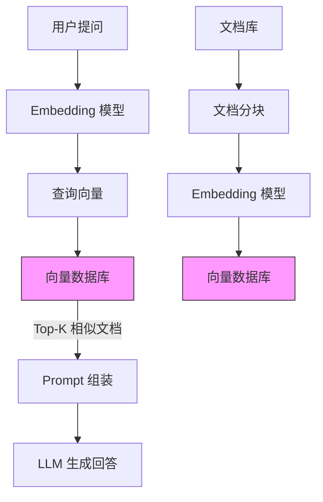

# 向量数据库生态

> **核心认知**：向量数据库是为高维向量相似度搜索设计的专用数据库，是 AI 应用（特别是 RAG、推荐系统、图像检索）的核心基础设施。它通过 ANN（近似最近邻）算法在毫秒级时间内从百万级向量中找到最相似的结果，传统关系型数据库无法高效完成此类查询。

## 要解决的问题

| 问题 | 传统数据库的痛点 | 向量数据库的解法 |
|------|-----------------|-----------------|
| 相似度搜索 | 需要遍历所有行，O(n) 复杂度 | ANN 算法，O(log n) 复杂度 |
| 高维向量存储 | 不支持向量类型 | 原生向量存储 + 索引 |
| 语义搜索 | 关键词匹配无法理解语义 | 向量 + 余弦相似度实现语义匹配 |
| 多模态检索 | 文本/图片/音频无法统一检索 | 统一向量空间 + 跨模态嵌入 |
| 实时更新 | 索引重建代价大 | 增量索引更新 |

## 向量数据库核心概念

### 向量嵌入（Embedding）

```
文本 → Embedding 模型 → 向量（如 1536 维）

示例：
  "苹果" → [0.02, -0.15, 0.33, ..., 0.08] (1536 维)
  "iPhone" → [0.03, -0.14, 0.31, ..., 0.07] (1536 维)
  
  语义相似 → 向量距离近
```

### 相似度度量

| 度量方式 | 公式 | 适用场景 | 特点 |
|----------|------|----------|------|
| 余弦相似度 | cos(A,B) = (A·B)/(‖A‖·‖B‖) | 文本语义 | 不受向量长度影响 |
| 欧氏距离 | √Σ(Ai-Bi)² | 图像特征 | 直观的几何距离 |
| 内积 | Σ(Ai×Bi) | 推荐系统 | 计算效率高 |
| 汉明距离 | 不同位数计数 | 二值向量 | 适合图像哈希 |

### ANN 算法

| 算法 | 原理 | 速度 | 精度 | 内存 |
|------|------|------|------|------|
| HNSW | 层次可导航小世界图 | 快 | 高 | 高 |
| IVF | 倒排文件索引 | 中 | 中 | 中 |
| PQ | 乘积量化 | 快 | 中 | 低 |
| LSH | 局部敏感哈希 | 快 | 低 | 低 |
| ScaNN | 向量量化 | 快 | 高 | 中 |

### HNSW 算法详解

```
HNSW（Hierarchical Navigable Small World）：
  ├── 多层图结构：顶层稀疏，底层密集
  ├── 插入：随机选择层级，逐层建立连接
  ├── 搜索：从顶层开始，贪心搜索到目标区域
  └── 参数：M（连接数）、efConstruction（构建精度）

  层级 3:  ●────────●
           │        │
  层级 2:  ●───●────●───●
           │   │    │   │
  层级 1:  ●─●─●──●─●─●─●──●
           │ │ │  │ │ │ │  │
  层级 0:  ●●●●●●●●●●●●●●●●●●●
```

## 主流向量数据库对比

| 特性 | Milvus | Pinecone | Qdrant | Weaviate | pgvector |
|------|--------|----------|--------|----------|----------|
| 部署方式 | 自部署/SaaS | 纯 SaaS | 自部署/Docker | 自部署/Docker | PostgreSQL 扩展 |
| 语言 | Go/C++ | - | Rust | Go | C |
| 标量过滤 | 支持 | 支持 | 支持 | 支持 | 支持 |
| 多向量 | 支持 | 不支持 | 支持 | 支持 | 不支持 |
| 混合搜索 | 支持 | 支持 | 支持 | 支持 | 支持 |
| 分布式 | 原生 | 内置 | 分布式集群 | 分布式 | 需 Citus |
| 许可证 | Apache 2.0 | 商业 | Apache 2.0 | BSD-3 | PostgreSQL |
| 适用场景 | 大规模生产 | 快速上手 | 高性能 | GraphQL 生态 | 已有 PG |

## Milvus 深入

### 架构设计

```
Milvus 架构：
  ├── Proxy Layer：接入层，负载均衡
  ├── Coordinator Layer：元数据管理
  │   ├── Root Coordinator：全局时间戳
  │   ├── Query Coordinator：查询调度
  │   ├── Data Coordinator：数据写入调度
  │   └── Index Coordinator：索引管理
  ├── Worker Layer：执行层
  │   ├── Query Node：查询执行
  │   ├── Data Node：数据写入
  │   └── Index Node：索引构建
  └── Storage Layer：存储层
      ├── Meta Store：etcd（元数据）
      ├── Object Storage：MinIO/S3（向量数据）
      └── Log Broker：Pulsar/Kafka（消息队列）
```

### 使用示例

```python
from pymilvus import MilvusClient, DataType

# 连接
client = MilvusClient(uri="http://localhost:19530")

# 创建集合
schema = {
    "fields": [
        {"name": "id", "dtype": DataType.INT64, "is_primary": True},
        {"name": "embedding", "dtype": DataType.FLOAT_VECTOR, "dim": 1536},
        {"name": "text", "dtype": DataType.VARCHAR, "max_length": 2000},
        {"name": "category", "dtype": DataType.VARCHAR, "max_length": 100}
    ]
}
client.create_collection(
    collection_name="documents",
    schema=schema,
    index_params=[{
        "field_name": "embedding",
        "index_type": "HNSW",
        "metric_type": "COSINE",
        "params": {"M": 16, "efConstruction": 256}
    }]
)

# 插入数据
client.insert("documents", [
    {"id": 1, "embedding": [0.1]*1536, "text": "向量数据库", "category": "tech"},
    {"id": 2, "embedding": [0.2]*1536, "text": "机器学习", "category": "tech"}
])

# 向量搜索 + 标量过滤
results = client.search(
    collection_name="documents",
    data=[[0.1]*1536],
    limit=10,
    output_fields=["text", "category"],
    filter='category == "tech"'
)
```

## RAG 架构中的向量数据库



### RAG 中向量数据库的关键配置

| 配置项 | 推荐值 | 说明 |
|--------|--------|------|
| 向量维度 | 1536 (OpenAI) | 根据 Embedding 模型决定 |
| 索引类型 | HNSW | 速度和精度平衡 |
| Top-K | 5-20 | 根据上下文窗口调整 |
| 相似度阈值 | 0.7+ | 过滤不相关结果 |
| 分块大小 | 500-1000 tokens | 根据文档类型调整 |

## 性能优化

| 优化手段 | 效果 | 说明 |
|----------|------|------|
| 量化压缩 | 减少内存 4-8x | PQ/SQ 量化 |
| GPU 加速 | 提升构建/查询 10x | GPU 索引构建 |
| 分片并行 | 提升查询吞吐 | 多分片并行搜索 |
| 缓存热门查询 | 减少重复计算 | 查询结果缓存 |
| 批量写入 | 提升写入吞吐 | 批量插入 |

## 常见陷阱

| 陷阱 | 后果 | 正确做法 |
|------|------|----------|
| Embedding 模型选错 | 搜索质量差 | 根据领域选择合适的模型 |
| 分块策略不合理 | 检索结果碎片化 | 合理设计分块大小和重叠 |
| 不做标量过滤 | 无关结果太多 | 结合元数据过滤 |
| 索引参数不当 | 精度/速度失衡 | 调优 HNSW 参数 |
| 不监控索引大小 | 内存溢出 | 监控向量数量和内存 |
| 忽略向量更新 | 旧数据污染结果 | 设计数据更新策略 |


## Embedding 模型对比

| 模型 | 维度 | 最大Token | 语言支持 | 适用场景 | 开源 |
|------|------|-----------|----------|----------|------|
| OpenAI text-embedding-3-large | 3072 | 8191 | 多语言 | 通用语义搜索 | 否 |
| OpenAI text-embedding-3-small | 1536 | 8191 | 多语言 | 成本敏感场景 | 否 |
| BGE-large-zh-v1.5 | 1024 | 512 | 中文 | 中文语义搜索 | 是 |
| BGE-M3 | 1024 | 8192 | 多语言 | 多语言+多粒度 | 是 |
| GTE-large | 1024 | 512 | 多语言 | 通用语义匹配 | 是 |
| Cohere embed-v3 | 1024 | 512 | 多语言 | 商业应用 | 否 |
| Jina-embedding-v2 | 768 | 8192 | 多语言 | 长文本嵌入 | 是 |
| M3E-base | 768 | 512 | 中文 | 中文文本聚类 | 是 |
| nomic-embed-text | 768 | 8191 | 多语言 | 本地部署 | 是 |

```
Embedding 模型选型建议：
  ├── 中文场景：BGE-large-zh-v1.5 或 M3E-base
  ├── 多语言场景：BGE-M3 或 text-embedding-3-small
  ├── 长文本场景：Jina-embedding-v2（8192 token）
  ├── 本地部署：nomic-embed-text 或 BGE 系列
  ├── 商业应用：OpenAI text-embedding-3 系列
  └── 成本敏感：BGE-M3（开源免费）vs OpenAI（按量计费）
```

## 向量索引算法深入

### HNSW 参数详解

```
HNSW 关键参数：
  M: 每个节点的最大连接数
    ├── 值越大：索引质量越高，内存占用越大
    ├── 值越小：内存占用小，但搜索质量下降
    └── 推荐值：16-64（通用场景）

  efConstruction: 构建时的搜索范围
    ├── 值越大：构建时间越长，索引质量越高
    ├── 值越小：构建快，但质量差
    └── 推荐值：128-512

  efSearch: 查询时的搜索范围
    ├── 值越大：搜索精度越高，速度越慢
    ├── 值越小：搜索快，但可能漏掉近邻
    └── 推荐值：64-256

  层级生成公式：layer = -ln(random()) * mL
    mL = ln(M) / ln(2)
    M 越大，层级越少，搜索越快
```

```
HNSW 构建过程：
  1. 插入节点 v，随机生成层级 L
  2. 如果 L > 当前最大层级，创建新层
  3. 从顶层开始，贪心搜索最近邻
  4. 在目标层级建立连接
  5. 限制每个节点的连接数为 M
  6. 如果连接数超过 M，剪枝保留最近的 M 个

  搜索过程：
    1. 从顶层入口节点开始
    2. 贪心搜索：在当前层找最近邻
    3. 进入下一层，从上层最近邻继续搜索
    4. 直到最底层，返回 efSearch 个候选
    5. 在候选中精排，返回 Top-K
```

### IVF + PQ 组合索引

```
IVF-PQ 索引构建流程：
  1. IVF 阶段：用 K-Means 将向量空间划分为 nlist 个簇
  2. PQ 阶段：每个簇内的向量用乘积量化压缩
  3. 每个向量存储：簇 ID + PQ 编码（紧凑）

  参数配置：
    nlist: 簇数量（推荐 sqrt(n) 到 4*sqrt(n)）
    m: 子空间数量（推荐 8/16/32）
    nbits: 每个子空间的量化位数（推荐 8）
    nprobe: 查询时搜索的簇数量（影响精度/速度权衡）

  搜索过程：
    1. 计算查询向量与所有簇中心的距离
    2. 选择最近的 nprobe 个簇
    3. 在选中簇内用 PQ 精排
    4. 返回 Top-K

  适用场景：
    ├── 数据量大（>1000万）
    ├── 内存受限
    ├── 可接受一定精度损失
    └── 写入少，查询多
```

## 向量数据库在图像检索中的应用

```
图像检索架构：

  图像输入 → 特征提取（CNN/ViT）→ 图像向量 → 向量数据库

  特征提取模型：
    ├── CLIP：图文对齐，支持跨模态检索
    ├── ResNet：图像分类特征
    ├── ViT：视觉 Transformer 特征
    └── DINOv2：自监督视觉特征

  图像检索流程：
    1. 图像预处理（缩放、归一化）
    2. CNN/ViT 提取特征向量（如 512 维）
    3. 向量归一化（L2 归一化）
    4. 写入向量数据库
    5. 查询时：提取查询图像特征 → 相似度搜索

  应用场景：
    ├── 以图搜图：电商商品搜索
    ├── 相似图片推荐：社交平台
    ├── 版权检测：图片去重
    └── 医学影像：病理图像匹配
```

```python
# 图像检索示例（使用 CLIP + Milvus）
import torch
from PIL import Image
from transformers import CLIPProcessor, CLIPModel
from pymilvus import MilvusClient

# 加载 CLIP 模型
model = CLIPModel.from_pretrained("openai/clip-vit-base-patch32")
processor = CLIPProcessor.from_pretrained("openai/clip-vit-base-patch32")

def extract_image_embedding(image_path):
    image = Image.open(image_path)
    inputs = processor(images=image, return_tensors="pt")
    with torch.no_grad():
        features = model.get_image_features(**inputs)
    return features[0].tolist()

# 写入向量数据库
client = MilvusClient(uri="http://localhost:19530")
for img_path in image_list:
    embedding = extract_image_embedding(img_path)
    client.insert("images", [{"id": next_id, "embedding": embedding, "path": img_path}])

# 以图搜图
query_embedding = extract_image_embedding("query.jpg")
results = client.search("images", [query_embedding], limit=10)
```

## 向量数据库在推荐系统中的应用

```
推荐系统中的向量数据库：

  实时推荐架构：
    用户行为 → 实时特征提取 → 用户向量 → 向量数据库检索 → 候选集 → 排序 → 推荐结果

  离线向量召回：
    物品特征 → Embedding 模型 → 物品向量 → 向量数据库（离线构建索引）

  双塔模型 + 向量数据库：
    ├── User Tower：用户特征 → 用户向量
    ├── Item Tower：物品特征 → 物品向量
    ├── 训练：对比学习（正样本拉近，负样本推远）
    └── 召回：用户向量检索物品向量

  向量召回策略：
    ├── 热门召回：全局热门物品向量
    ├── 兴趣召回：用户历史行为向量
    ├── 协同召回：相似用户喜欢的物品
    └── 跨域召回：不同业务域的物品
```

```
推荐系统向量数据库配置：
  ├── 索引类型：HNSW（召回精度要求高）或 IVF-PQ（数据量大）
  ├── 向量维度：64-256（权衡效果和性能）
  ├── Top-K：100-1000（召回候选集大小）
  ├── 相似度阈值：根据业务调整
  ├── 更新频率：物品特征变化时增量更新
  └── 冷启动：新物品直接写入，无需重建索引
```

## 向量数据库性能基准测试

```
Benchmark 方法论：
  数据集：
    ├── GIST-1M：100 万 960 维向量
    ├── SIFT-1M：100 万 128 维向量
    ├── DEEP-1M：100 万 256 维向量
    └── OpenAI-1M：100 万 1536 维向量

  评测指标：
    ├── Recall@K：召回率（Top-K 中包含真实近邻的比例）
    ├── QPS：每秒查询数
    ├── P99 延迟：99 分位查询延迟
    ├── 索引构建时间
    └── 内存占用

  典型测试结果（SIFT-1M, 128 维）：
    Milvus HNSW:   Recall@10=0.98, QPS=5000, P99=5ms
    Milvus IVF:    Recall@10=0.95, QPS=8000, P99=10ms
    Qdrant HNSW:   Recall@10=0.99, QPS=6000, P99=3ms
    Pinecone:      Recall@10=0.97, QPS=10000, P99=2ms
    pgvector IVFF: Recall@10=0.90, QPS=1000, P99=50ms
```

| 数据库 | 索引 | QPS (1M) | P99 (ms) | Recall@10 | 内存 (GB) |
|--------|------|----------|----------|-----------|-----------|
| Milvus | HNSW | 5000 | 5 | 0.98 | 1.5 |
| Qdrant | HNSW | 6000 | 3 | 0.99 | 1.4 |
| Weaviate | HNSW | 4000 | 8 | 0.97 | 1.6 |
| pgvector | IVFF | 1000 | 50 | 0.90 | 2.0 |
| Pinecone | - | 10000 | 2 | 0.97 | - |

## 向量数据库扩展策略

```
水平扩展方案：
  分片（Sharding）：
    ├── 哈希分片：向量 ID 哈希到不同节点
    ├── 范围分片：按 ID 范围分片
    └── 一致性哈希：动态扩缩容

  副本（Replication）：
    ├── 读写分离：写主读从
    ├── 高可用：主从故障转移
    └── 负载均衡：多副本分担查询

  扩容流程：
    1. 添加新节点
    2. 迁移部分分片数据到新节点
    3. 更新路由表
    4. 验证数据一致性
    5. 停止旧节点的对应分片服务
```

```
垂直扩展方案：
  内存扩展：
    ├── 增加物理内存
    ├── 使用 GPU 加速索引构建
    └── 量化压缩减少内存占用

  CPU 扩展：
    ├── 增加 CPU 核心数
    ├── 并行构建索引
    └── 多线程查询

  存储扩展：
    ├── 使用 SSD 替代 HDD
    ├── NVMe 存储
    └── 分布式存储（MinIO/S3）
```

## 向量数据库备份与恢复

```
备份策略：
  全量备份：
    ├── 定期导出整个向量数据库
    ├── 包含元数据、向量数据、索引
    └── 推荐频率：每周一次

  增量备份：
    ├── 备份上次备份后的变更
    ├── WAL 日志回放
    └── 推荐频率：每天一次

  快照备份：
    ├── 利用存储层快照（LVM/S3 快照）
    ├── 一致性快照，不影响服务
    └── 推荐频率：每小时一次

  恢复流程：
    1. 恢复元数据（etcd/ZooKeeper）
    2. 恢复向量数据（Object Storage）
    3. 重建索引（如果需要）
    4. 验证数据一致性
    5. 切换流量
```

```bash
# Milvus 备份示例
# 全量备份
milvus-backup create --collection documents --name full_backup_20240101

# 恢复
milvus-backup restore --name full_backup_20240101

# 定时备份脚本
#!/bin/bash
DATE=$(date +%Y%m%d)
milvus-backup create --collection documents --name "backup_${DATE}"
# 上传到 S3
aws s3 cp /backup/documents_${DATE}.tar.gz s3://milvus-backup/
# 清理 30 天前的备份
find /backup -name "backup_*" -mtime +30 -delete
```

## 向量数据库安全

```
安全防护措施：
  认证：
    ├── API Key 认证
    ├── JWT Token 认证
    ├── TLS 客户端证书
    └── 集成 LDAP/AD

  授权：
    ├── 基于角色的访问控制（RBAC）
    ├── 基于集合的权限隔离
    ├── API 级别的权限控制
    └── 查询审计日志

  数据安全：
    ├── 传输加密（TLS 1.3）
    ├── 静态加密（AES-256）
    ├── 向量数据脱敏
    └── 访问日志记录

  网络安全：
    ├── VPC 隔离
    ├── 防火墙规则
    ├── IP 白名单
    └── DDoS 防护
```

```
安全配置示例：
  Milvus 安全配置：
    ├── 启用 TLS：配置证书和密钥
    ├── 启用认证：设置 root 密码
    ├── RBAC：创建角色和用户
    └── 审计日志：记录所有操作

  生产环境安全清单：
    ├── [ ] 启用 TLS 加密传输
    ├── [ ] 启用认证机制
    ├── [ ] 配置 RBAC 权限
    ├── [ ] 限制网络访问
    ├── [ ] 开启审计日志
    ├── [ ] 定期轮换密钥
    └── [ ] 监控异常访问
```

## 与其他板块的关系

| 关联板块 | 关系描述 |
|----------|----------|
| **大模型应用** | 向量数据库是 RAG 架构的核心存储层 |
| **推荐系统** | 向量相似度实现物品推荐 |
| **图像检索** | 图像特征向量实现以图搜图 |
| **语义搜索** | 文本向量实现语义级别的搜索 |
| **数据管道** | 向量数据通过 ETL 流程写入 |

## 一句话总结

向量数据库通过 ANN 算法实现高维向量的毫秒级相似度搜索，是 RAG、推荐系统、图像检索等 AI 应用的核心基础设施，Milvus 是目前最成熟的开源分布式向量数据库。

---

## 参考资料

- [Milvus 官方文档](https://milvus.io/docs)
- [Pinecone 向量数据库](https://www.pinecone.io/)
- [Qdrant 文档](https://qdrant.tech/documentation/)
- [pgvector GitHub](https://github.com/pgvector/pgvector)
- [ANN Benchmarks](https://ann-benchmarks.com/)
