# 图数据库生态对比（Neo4j / NebulaGraph / JanusGraph / ArangoDB）

> 图数据库是**「关系优先」的数据库**：把实体建模为点（Vertex）、关系建模为边（Edge），遍历查询（几度人脉/最短路径/社群）比关系库 Join 高效几个数量级。主流产品：**Neo4j（Cypher 事实标准，单机为主）**、**NebulaGraph（国产分布式图库）**、**JanusGraph（分布式 + 外部存储）**、**ArangoDB（多模型）**、**TigerGraph（商业）**。相比关系库（Join 深链爆炸）、ES（无图语义），图库以「**原生图存储 + 图遍历算法 + 图查询语言**」成为社交/风控/推荐/知识图谱底座。本篇按「解决的问题 → 原理 → 对比 → 选型关注点」拆解。

---

## 一、要解决的问题

| 痛点 | 说明 |
|------|------|
| 多跳关系查询 | 好友的好友的好友、资金链路 N 跳——SQL Join 指数级爆炸 |
| 关系语义表达 | 关系有方向/类型/属性（转账金额、认识时间） |
| 图算法 | 最短路径/社群发现/PageRank 需要图计算能力 |
| 实时路径分析 | 风控/反欺诈需要毫秒级路径遍历 |
| 动态建模 | 实体关系频繁变化（社交图谱） |

> 核心认知：**图库的杀手锏是「遍历」（Traversal）**——从某点沿边找邻居，局部遍历与全库规模无关（数据 10 倍，查询依然快）；而关系库是「索引+Join」，深链即灾难。

---

## 二、核心原理

### 2.1 图数据模型

```
Vertex（点）：用户/订单/商品/账户（+ 标签/属性）
Edge（边）：关注/转账/购买（有向 + 类型 + 属性）
Path（路径）：A→B→C 的边序列（遍历结果）

存储核心：无索引邻接（Index-free Adjacency）
  → 每个点直接指向邻居的物理地址（双向指针）
  → 遍历不查索引，沿指针跳转（这是快的本质）
```

### 2.2 为什么关系库做多跳很慢（数学本质）

```
假设每跳平均 10 个邻居，6 跳查询：
  图库：沿指针走 10^6 次局部遍历（物理跳转）
  关系库：每跳一次 JOIN（索引+物化中间结果）
    → 中间结果集指数膨胀（10^6 行）
    → JOIN 成本 ≈ 中间结果 × 索引查询

关键差异：
  图库是"沿边走"（输出小：路径上少量节点）
  关系库是"集合运算"（中间结果集膨胀）

关系库深链优化的手段（都有限）：
  递归 CTE（WITH RECURSIVE，PostgreSQL/MySQL 8.0）
  邻接表 + 应用层多跳查询（N+1 查询）
  预先物化路径表（只能覆盖固定深度）
```

### 2.3 图查询语言

| 语言 | 产品 | 特点 |
|------|------|------|
| Cypher | Neo4j | 声明式模式匹配（`MATCH (a)-[r:FOLLOWS]->(b)`），最流行 |
| nGQL | NebulaGraph | 类 SQL + 图遍历关键字（`GO`/`FETCH`） |
| Gremlin | JanusGraph/TinkerPop | 函数式遍历（跨多图库标准） |
| AQL | ArangoDB | 类 SQL + 图遍历（JSON 风格） |

**Neo4j Cypher 示例**：

```cypher
// 查找 "张三" 的二度好友
MATCH (zhang:User {name:"张三"})-[:FOLLOWS*2]->(friend:User)
RETURN friend.name;

// 最短路径（风控资金链路）
MATCH p = shortestPath((a:Account {id:"A1"})-[:TRANSFER*..5]->(b:Account {id:"B2"}))
RETURN p;

// 社群发现（连通分量）
CALL algo.louvain.stream('User','FOLLOWS', {graph:'huge'})
YIELD nodeId, community
RETURN community, count(*) AS members
ORDER BY members DESC LIMIT 10;

// 条件路径（金额过滤）
MATCH p = (a:Account {id:"A1"})-[:TRANSFER*1..3 {amount: {gte: 10000}}]->(b:Account)
RETURN p;
```

### 2.4 存储与索引

| 产品 | 存储 | 索引 |
|------|------|------|
| Neo4j | 原生图存储（页式，点边物理邻接） | 属性索引（B-Tree）+ 全文 |
| NebulaGraph | KV 存储（RocksDB，多点多边） | Tag/Edge 索引（属性条件过滤） |
| JanusGraph | 外部（HBase/Cassandra/BigTable）+ ES 索引 | 复合/混合索引（查询必须有索引或全扫） |
| ArangoDB | 文档存储 + 图索引（边集合） | 持久化索引 |

### 2.5 无索引邻接（Index-free Adjacency）深入

```
Neo4j 原生存储设计：
  每个节点记录 = 指向首条关系的指针
  每条关系记录 = 双向链表（prev/next 指针）
  → 找邻居 = 指针跳转（O(度)），无全局索引查询

对比键值型图库（NebulaGraph/JanusGraph）：
  存储底层是 KV（RocksDB/HBase）
  点/边存为 KV 记录
  遍历 = KV 查询（也很快，但比指针跳转略多开销）
  → 分布式扩展性优先，牺牲一点遍历极致性能

结论：单机原生图库（Neo4j）遍历最极致；
     分布式图库（NebulaGraph）胜在水平扩展
```

### 2.6 分布式架构

| 产品 | 架构 |
|------|------|
| Neo4j | 单机为主（写），Causal Cluster 读副本 + 分片（企业版） |
| NebulaGraph | **存算分离**：Meta（元数据，Raft）+ Storage（分片，Raft）+ Query（无状态） |
| JanusGraph | 存储层分布式（HBase/Cassandra）+ 计算层多实例 |
| ArangoDB | 分片（Hash/一致性哈希）+ 主动故障转移（自动） |

### 2.7 分布式图库的分片与遍历问题

```
分片策略：按点 ID 哈希/范围分片到 Storage 节点
  → 边可能跨分片（全局边 vs 本地边）

跨分片遍历（NebulaGraph）：
  Storage 按分片并行执行子图遍历（每个分片负责自己点）
  结果汇总到 Query 层合并
  → 分片间通信成本随跳数增加

设计原则：
  高频遍历路径尽量"分片内完成"（按业务关联分片）
  跨分片深链遍历性能下降 → 控制深度
```

---

## 三、核心特性

| 特性 | Neo4j | NebulaGraph | JanusGraph | ArangoDB |
|------|-------|-------------|------------|----------|
| 语言 | Cypher | nGQL | Gremlin | AQL |
| 部署 | 单机为主 | 分布式（存算分离） | 分布式（外部存储） | 单机/分片 |
| 性能 | 单机遍历最快 | 分布式扩展强 | 依赖底层存储 | 中 |
| 写入扩展 | 弱（单机写） | 强 | 强 | 中 |
| 事务 | ACID（单机强） | 分区级事务 | ACID（底层保证） | 单文档/图事务 |
| 社区/文档 | 最成熟 | 国内活跃 | 维护较缓 | 活跃 |
| 生态 | Bolt 驱动/可视化最强 | 工具链新 | TinkerPop 生态 | 多模型 |
| 适用 | 通用/单机图 | 超大规模/高写 | Hadoop 生态图 | 多模型（图+文档） |

### 3.1 图算法能力

```
内置图算法（Neo4j GDS / NebulaGraph）：
  路径类：最短路径、全对最短路径、A*
  中心性：PageRank、Betweenness、Degree
  社群发现：Louvain、标签传播（LPA）、连通分量
  相似度：Jaccard、余弦、节点相似
  拓扑：三角形计数、聚类系数

场景：
  风控：环路检测（洗钱）、连通分量（团伙）
  推荐：Personalized PageRank（相似用户）
  运营：Louvain 社群（用户群体划分）
```

---

## 四、图库 vs 关系库 vs 图计算平台

| 维度 | 图数据库 | 关系库（MySQL） | 图计算引擎（Spark GraphX/JanusGraph） |
|------|----------|-----------------|--------------------------------------|
| 查询 | 在线实时遍历 | Join 深链爆炸 | 离线全图批计算 |
| 数据规模 | 十亿级边 | 亿级行 | 千亿级 |
| 实时性 | 毫秒级 | 毫秒级（单跳） | 分钟~小时 |
| 场景 | 实时风控/推荐/社交 | 业务主数据 | 全图分析（PageRank 全量） |
| 定位 | 关系优先 | 通用 | 图分析 |

**选型关注点**：在线单点/路径查询 → **图数据库**；全图批量算法 → **图计算引擎**；两者常配合（图库存图、Spark 跑全图分析）。

### 4.1 何时真的需要图数据库

```
适合图库的信号：
  ① 查询本质是"沿关系遍历"（几度人脉/路径/环）
  ② 关系本身有属性（金额/时间/类型）且参与过滤
  ③ 数据规模大 + 实时遍历需求（风控毫秒级）
  ④ 关系频繁变化（社交/图谱动态更新）

不适合图库：
  ① 只是主数据存储（用户表/订单表，JOIN 深度 ≤2）
  ② 分析型聚合（GROUP BY 大表）——图库不是分析引擎
  ③ 全文搜索/模糊检索（用 ES）
  ④ 超大规模全图批处理（用 Spark GraphX）

常见误区："有社交关系就用图库"
  实际：好友列表展示 → 关系库/Redis 就够
       好友的好友链/推荐/社群 → 才需要图库
```

---

## 五、生产实践

### 5.1 关键实践

| 实践 | 说明 |
|------|------|
| 建模 | 先定「查询模式」再建模（点/边/方向/属性）——图建模跟着查询走 |
| 索引 | 高基数属性（ID/手机号）建索引；避免全图扫描 |
| 数据导入 | 批量导入（Neo4j admin import / Nebula Importer）而非逐条写 |
| 深链控制 | 遍历深度受限（*..5）防爆炸；热点场景限深度+缓存 |
| 监控 | 查询超时/慢遍历/内存（遍历吃内存） |
| 高可用 | Neo4j Causal Cluster；Nebula 三副本（Raft） |

### 5.2 建模方法论

```
① 明确查询模式：列出 Top 查询（广度/深度/过滤条件）
② 实体建模：名词 → 点（User/Order/Product）
③ 关系建模：动词 → 边（FOLLOWS/PURCHASED/TRANSFER）
④ 属性取舍：高频过滤属性放点/边属性；低频可外置
⑤ 方向设计：边方向影响遍历方向（有向 vs 无向，双向边）
⑥ 索引设计：按查询的"入口点"建索引（用户 ID 是入口）

反例（建模错误）：
  把关系存成属性（好友列表 JSON）→ 无法遍历
  点/边不分（状态也建成边）→ 查询复杂
  无入口索引 → 全图扫描
```

### 5.3 常见坑

- **全图扫描查询**：无索引的 `WHERE` 条件 = 灾难（图库不是分析库）；
- **深链无限制**：`*..N` 不设上限 → 查询超时/内存爆；
- **写放大**：边多时写入/更新频繁（图库写热点）→ 评估写入量级；
- **数据迁移**：图库与业务库双写（先图库后主库 or 异步）——事务边界要设计好；
- **超大度数点**：超级节点（粉丝千万）遍历爆炸 → 限制出度/分层建模；
- **图库当数据库用**：把图库当主存储存业务主数据 → 应用层复杂（合理分工：关系库存主数据，图库存关系）。

### 5.4 超级节点处理（超深度实践）

```
问题：一个点有千万条边（明星用户/大账户）
  → 遍历该点 = 扫描全部边 = 爆炸

处理：
  ① 限制遍历深度 + 采样（*1..2 + LIMIT）
  ② 边属性过滤（按时间/类型裁剪）
  ③ 分层建模（粉丝团子图）
  ④ 预计算热门路径（缓存）
```

---

## 六、选型速查

| 需求 | 首选 | 备选 |
|------|------|------|
| 通用图查询（Cypher） | Neo4j | — |
| 超大规模 + 高并发写 | NebulaGraph | JanusGraph |
| Hadoop 生态 | JanusGraph | NebulaGraph |
| 多模型（图+文档） | ArangoDB | — |
| 知识图谱 | Neo4j | NebulaGraph |
| 全图离线分析 | Spark GraphX | 图库 + 批计算 |
| 实时风控路径 | Neo4j（单机规模够） | NebulaGraph（超大） |

### 6.1 决策树

```
数据量 < 百亿边 + 单机够 → Neo4j（最省心，Cypher 生态）
数据量超大 + 高并发写 → NebulaGraph（存算分离）
已有 Hadoop 栈（HBase 存储） → JanusGraph
需要图+文档混合模型 → ArangoDB
全图批量算法 → Spark GraphX / GDS 离线
知识图谱 + NLP → Neo4j（生态成熟）
```

---

## 图数据库产品深度对比

### Neo4j vs JanusGraph vs TigerGraph vs NebulaGraph vs ArangoDB

| 维度 | Neo4j | JanusGraph | TigerGraph | NebulaGraph | ArangoDB |
|------|-------|------------|------------|-------------|----------|
| 架构 | 单机/集群 | 存储计算分离 | 分布式 | 存算分离 | 单机/分片 |
| 存储 | 原生图存储 | 外部（HBase/Cassandra） | 原生图存储 | KV（RocksDB） | 文档存储 |
| 查询语言 | Cypher | Gremlin | GSQL | nGQL | AQL |
| 图算法 | GDS（社区版受限） | TinkerPop 算法 | 内置 50+ 算法 | 内置算法 | 内置算法 |
| 分片 | 企业版支持 | 支持 | 支持 | 支持 | 支持 |
| ACID | 强（单机） | 依赖底层 | 支持 | 分区级事务 | 单文档事务 |
| 许可证 | Community/Enterprise | Apache 2.0 | 商业 | Apache 2.0 | Apache 2.0 |
| 社区活跃度 | 最高 | 中 | 中 | 国内高 | 中 |

### Property Graph vs RDF Graph

| 维度 | Property Graph | RDF Graph |
|------|----------------|-----------|
| 数据模型 | 点+边+属性 | 三元组（SPO） |
| 查询语言 | Cypher/nGQL/Gremlin | SPARQL |
| Schema | 可选（灵活） | 强制（RDFS/OWL） |
| 推理 | 无（需应用层） | 有（RDFS/OWL 推理） |
| 适用 | 业务关系分析 | 语义网/知识图谱 |
| 产品 | Neo4j/NebulaGraph | Virtuoso/GraphDB |

### 图查询语言对比

| 语言 | 语法风格 | 示例（查找二度好友） |
|------|----------|----------------------|
| Cypher | 模式匹配 | `MATCH (a)-[:FOLLOWS*2]->(b) RETURN b` |
| nGQL | SQL+GO | `GO 2 STEPS FROM "张三" OVER FOLLOWS YIELD $$.name` |
| Gremlin | 函数式 | `g.V().has('name','张三').out('FOLLOWS').out('FOLLOWS').name` |
| GSQL | SQL-like | `SELECT t2.name FROM (SELECT * FROM Friends MATCH (a)(b) WHERE a.id=1)` |
| AQL | JSON-like | `FOR v IN 2..2 OUTBOUND '张三' FOLLOWS RETURN v.name` |

---

## 图算法能力深入

### 核心图算法分类

| 类别 | 算法 | 说明 | 应用场景 |
|------|------|------|----------|
| 路径 | 最短路径（Dijkstra） | 两点间最短路径 | 导航/物流 |
| 路径 | A* | 启发式最短路径 | 地图导航 |
| 路径 | 全对最短路径 | 所有点对间最短路径 | 网络分析 |
| 中心性 | PageRank | 节点重要性 | 推荐/搜索 |
| 中心性 | Betweenness | 中介中心性 | 关键节点识别 |
| 中心性 | Degree | 度中心性 | 影响力分析 |
| 社群 | Louvain | 社区发现 | 用户分群 |
| 社群 | 标签传播（LPA） | 半监督社区 | 社区划分 |
| 社群 | 连通分量 | 连通子图 | 团伙识别 |
| 相似度 | Jaccard | 集合相似度 | 推荐 |
| 相似度 | 余弦相似度 | 向量相似度 | 推荐 |
| 拓扑 | 三角形计数 | 聚类系数 | 社交分析 |

### PageRank 算法详解

```
PageRank 原理：
  每个节点的 PR 值 = 其他节点指向它的 PR 值之和
  PR(v) = (1-d) + d * Σ(PR(u)/deg(u))
  其中 d = 阻尼因子（通常 0.85）

迭代过程：
  ① 初始化：所有节点 PR = 1/N
  ② 迭代：每个节点根据邻居 PR 更新
  ③ 收敛：PR 值变化小于阈值时停止
  ④ 输出：PR 值排序 → 节点重要性排名

应用场景：
  推荐系统：识别重要商品/用户
  搜索排序：网页重要性排名
  社交网络：影响力用户识别
```

---

## 图数据库在欺诈检测中的应用

### 欺诈检测场景

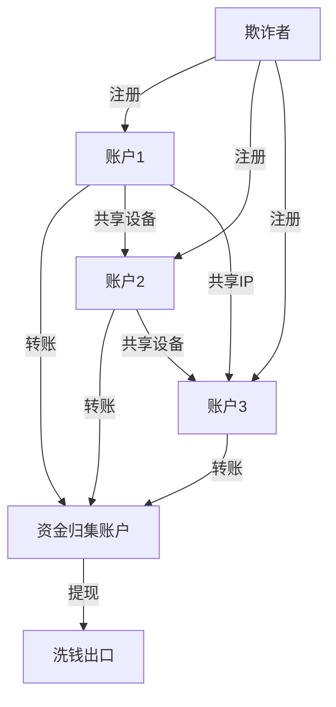

### 欺诈检测图查询

```cypher
// 检测共享设备的账户集群
MATCH (a:Account)-[:USES_DEVICE]->(d:Device)<-[:USES_DEVICE]-(b:Account)
WHERE a <> b
WITH d, collect(a) AS accounts
WHERE size(accounts) > 3
RETURN d.device_id, accounts, size(accounts) AS cluster_size
ORDER BY cluster_size DESC

// 检测环形资金链路（洗钱）
MATCH p = (a:Account)-[:TRANSFER*3..6]->(a)
WHERE ALL(r IN relationships(p) WHERE r.amount > 10000)
RETURN p, [r IN relationships(p) | r.amount] AS amounts

// 检测短时间高频交易
MATCH (a:Account)-[r:TRANSFER]->(b:Account)
WHERE r.timestamp > datetime() - duration('PT1H')
WITH a, count(r) AS tx_count, sum(r.amount) AS total_amount
WHERE tx_count > 10 AND total_amount > 100000
RETURN a, tx_count, total_amount
```

---

## 知识图谱构建

### 知识图谱架构

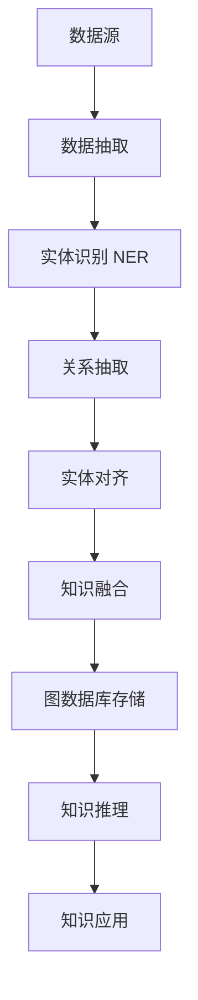

### 知识图谱构建流程

| 阶段 | 说明 | 工具/技术 |
|------|------|-----------|
| 数据抽取 | 从文本/数据库抽取三元组 | SpaCy/NLTK/自定义规则 |
| 实体识别 | 识别实体类型（人/地/物） | NER 模型/BERT |
| 关系抽取 | 识别实体间关系 | 关系抽取模型 |
| 实体对齐 | 不同来源实体合并 | 相似度匹配 |
| 知识融合 | 本体构建+知识融合 | OWL/RDFS |
| 存储 | 图数据库存储 | Neo4j/NebulaGraph |
| 推理 | 基于规则/嵌入的推理 | TransE/规则引擎 |

---

## 图原生存储格式

### 存储格式对比

| 格式 | 说明 | 适用 |
|------|------|------|
| CSR/CSC | 压缩稀疏行/列 | 遍历优化 |
| 邻接列表 | 点→边列表 | 简单存储 |
| 邻接矩阵 | 矩阵表示 | 密集图 |
| RDF 三元组 | SPO 三元组 | 语义网 |
| Property Graph | 点+边+属性 | 业务图 |

### CSR（Compressed Sparse Row）格式

```
CSR 存储结构：
  顶点数组：[0, 2, 5, 7]  // 每个顶点的边起始位置
  边数组：[1, 2, 0, 2, 0, 1, 2]  // 边的目标顶点
  属性数组：[...边属性...]

优势：
  遍历效率高（连续内存访问）
  存储紧凑（压缩稀疏结构）
  适合只读/分析场景

劣势：
  动态更新成本高（需要重建）
  不适合频繁写入场景
```

---

## 图数据库基准测试（LDBC SNB）

### LDBC SNB 测试框架

| 测试类型 | 说明 | 指标 |
|----------|------|------|
| 插入测试 | 批量插入性能 | 插入速率（triples/sec） |
| 交互式短查询 | 简单图查询 | 延迟（ms） |
| 交互式长查询 | 复杂图遍历 | 延迟（ms） |
| 并发测试 | 多并发查询 | 吞吐（queries/sec） |
| 分析测试 | 全图算法 | 执行时间（sec） |

### 主流产品性能参考

| 产品 | 插入速率 | 短查询延迟 | 长查询延迟 |
|------|----------|------------|------------|
| Neo4j | ~100K triples/sec | <1ms | 10~100ms |
| NebulaGraph | ~200K triples/sec | <1ms | 10~50ms |
| JanusGraph | ~50K triples/sec | 1~5ms | 50~500ms |
| TigerGraph | ~150K triples/sec | <1ms | 10~100ms |
| ArangoDB | ~80K triples/sec | 1~5ms | 50~200ms |

---

## 图数据库在社交网络中的应用

### 社交网络图建模

```cypher
// 创建社交网络图
CREATE (alice:User {name: "Alice", age: 25})
CREATE (bob:User {name: "Bob", age: 30})
CREATE (carol:User {name: "Carol", age: 28})
CREATE (alice)-[:FOLLOWS {since: 2020}]->(bob)
CREATE (bob)-[:FOLLOWS {since: 2021}]->(carol)
CREATE (carol)-[:FOLLOWS {since: 2019}]->(alice)
CREATE (alice)-[:LIKES {timestamp: datetime()}]->(post1:Post {content: "Hello"})
```

### 社交网络核心查询

| 查询 | 说明 | Cypher 示例 |
|------|------|-------------|
| 好友推荐 | 朋友的朋友 | `MATCH (a)-[:FOLLOWS]->(b)-[:FOLLOWS]->(c) WHERE NOT (a)-[:FOLLOWS]->(c) RETURN c` |
| 影响力分析 | PageRank | `CALL algo.pageRank.stream('User','FOLLOWS') YIELD nodeId, score` |
| 社区发现 | Louvain | `CALL algo.louvain.stream('User','FOLLOWS') YIELD nodeId, community` |
| 最短路径 | 六度空间 | `MATCH p = shortestPath((a)-[:FOLLOWS*..6]->(b)) RETURN p` |
| 传播分析 | 信息扩散 | `MATCH (a:User)-[:FOLLOWS*1..3]->(b:User) RETURN b` |

---

## 属性图 vs RDF 三元组建模实例对比

以「张三向李四转账 5000 元」为例，看两种模型的建模差异：

```text
属性图（Neo4j/NebulaGraph）：
  (张三:Person)-[:TRANSFER {amount:5000, time:"2026-08-01T10:00"}]->(李四:Person)
  → 边自带属性，转账金额/时间是边的属性，一次遍历即可过滤

RDF 三元组（SPO）：
  <tx001>  <rdf:type>     <Transaction>
  <tx001>  <from>         <张三>
  <tx001>  <to>           <李四>
  <tx001>  <amount>       "5000"^^xsd:decimal
  → 交易本身升格为节点（具体化 Reification），金额拆成独立三元组
```

| 维度 | 属性图 | RDF 三元组 |
|------|--------|-----------|
| 建模直觉 | 关系=边，属性挂点/边上 | 一切成三元组，关系也可作节点 |
| 查询写法 | `MATCH (a)-[t:TRANSFER {amount:>1000}]->(b)` | SPARQL 多跳 BGP 连接 |
| Schema | 可选、渐进演化 | RDFS/OWL 强制本体，支持推理 |
| 推理能力 | 无（应用层实现） | 内建子类/传递/等价推理 |
| 数据交换 | 各方言私有导出 | 标准序列化（Turtle/N-Triples） |
| 适用 | 业务实时图查询（风控/推荐） | 知识图谱/跨机构语义集成 |

选型建议：在线业务图查询选属性图；需要本体推理、标准交换的知识图谱项目选 RDF 或「属性图存储 + RDF 导出」混合。

## GQL 标准（ISO/IEC 39075）与各方言映射

GQL 是 2024 年发布的 ISO 图查询语言标准，融合 Cypher 与 PGSQL（SQL/PGQ），是首个独立于 SQL 的 ISO 图查询语言。

| 概念 | GQL 标准 | Neo4j Cypher | NebulaGraph nGQL |
|------|---------|--------------|------------------|
| 匹配模式 | `MATCH (p:Person)-[:KNOWS]->(q)` | 同源（Cypher 贡献最大） | `GO FROM ... OVER KNOWS` |
| 变长路径 | `-[:KNOWS*1..3]->` | 支持（含 shortestPath） | `GO 1 TO 3 STEPS` |
| 过滤 | `WHERE q.age > 30` | WHERE | WHERE / YIELD 组合 |
| 投影 | `RETURN p.name, q.name` | RETURN | YIELD |
| 聚合分组 | `GROUP BY / count()` | WITH + count() | GROUP BY |
| 图模式插入 | `INSERT (a)-[:E]->(b)` | CREATE/MERGE | INSERT VERTEX/EDGE |

```cypher
// GQL 风格（与 Cypher 几乎一致）：二度好友且排除已关注
MATCH (me:User {name:'张三'})-[:FOLLOWS*2..2]->(fof:User)
WHERE NOT (me)-[:FOLLOWS]->(fof) AND fof <> me
RETURN DISTINCT fof.name LIMIT 20;
```

趋势判断：新项目优先按 GQL 兼容度评估产品——Cypher 系（Neo4j/SAP HANA/Aura）迁移成本最低；Gremlin/TinkerPop 社区在收缩；nGQL/AQL 保持私有但提供 GQL/Cypher 兼容层。

## 图算法工程化应用（风控团伙识别 / 推荐召回）

### 场景一：风控团伙识别流水线

```text
离线全图计算（每日 T+1）：
  Step1 构图：账户-设备-IP-银行卡 多关系合并图
  Step2 Louvain 社群发现 → 候选团伙簇
  Step3 团伙特征提取：密度/共享设备数/资金闭环率
  Step4 高危簇写入风险名单库（HBase）

在线实时补充：
  新注册/新交易触发毫秒级查询：
    MATCH (a:Account {id:$id})-[:USES_DEVICE|SHARES_IP*1..2]-(x:Account)
    WHERE x.risk_level >= 3 RETURN count(x)
  → 命中高危邻域则拦截或加验
```

### 场景二：推荐召回

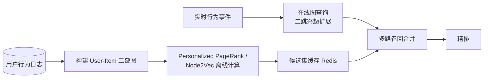

工程要点：算法跑在 Spark GraphX/GDS（离线全图）+ 图库（在线增量查询）双轨；离线结果回灌图库存为节点属性（如 `community_id`、`pagerank_score`），供在线过滤直接命中。

## 图数据导入批量加载策略

| 方式 | 工具 | 吞吐量级 | 适用 |
|------|------|---------|------|
| CSV admin-import | Neo4j `neo4j-admin database import` | 千万~亿级/小时 | 初始全量导入（停机窗口内最快） |
| 并发 LOAD CSV | neo4j-shell/驱动批量 UNWIND | 百万/小时 | 小规模增量 |
| Nebula Importer | nebula-importer（YAML 配置并发） | 十万行/s | 分布式并行导入 |
| Spark Connector | spark-nebula / APOC.periodic.iterate | 大规模 | 从数仓/Hive 直接入图 |
| Kafka 流式写入 | Flink sink / 自研 consumer | 实时增量 | CDC 双写链路 |

```text
批量导入优化清单：
① 先建数据后建索引：索引在导入完成后统一创建（快 5~10 倍）
② 关闭/延后唯一性约束校验，导入完再启用
③ 按 ID 排序后导入：同 ID 相邻写入减少页分裂
④ 批大小 5k~50k 条/批，UNWIND 参数化提交而非逐条
⑤ 导入期间禁用查询负载，避免缓存抖动
⑥ 全量导入后 ANALYZE/统计信息更新，让 CBO 有据可依
```

## 图数据库容量估算方法

```text
存储估算公式：
  点空间 ≈ 点数 × (记录头 15B + Σ属性字节) × 副本数 × 膨胀系数 1.3
  边空间 ≈ 边数 × (双向指针 34B + Σ属性字节) × 副本数 × 1.3
  索引   ≈ 被索引属性基数 × 平均键长 × 1.5

示例：10 亿用户 + 200 亿关注边 + 每点 5 个属性
  点：1e9 × ~100B × 3副本 × 1.3 ≈ 400GB
  边：2e10 × ~40B × 3 × 1.3 ≈ 3TB
  内存：活跃子图常驻 = BlockCache ≥ 热点边数据的 10~20%

内存估算（Neo4j 经验）：
  heap = 页缓存外的执行内存（遍历状态、事务）
  pagecache 目标 = 热点图数据全量（装不下就装热点子图）
```

| 规模档位 | 建议 |
|----------|------|
| ≤ 5000 万点/亿级边 | 单机 Neo4j（64GB 内存足够） |
| 亿级点/百亿边 | NebulaGraph/JanusGraph 分布式 |
| 千亿边 | 图计算引擎为主 + 图库存热点子图 |

## 实时图查询 vs 离线图计算分工

| 维度 | 实时图查询（图库） | 离线图计算（GraphX/GDS） |
|------|-------------------|--------------------------|
| 响应 | 毫秒~秒 | 分钟~小时 |
| 规模 | 单查询局部遍历（限深度） | 全图迭代算法 |
| 典型算子 | 最短路径/N 跳邻居/模式匹配 | PageRank/Louvain/连通分量/WCC |
| 数据新鲜度 | 写入即可见 | T+1 快照 |
| 成本特征 | 高配内存常驻 | 弹性批资源按需起 |

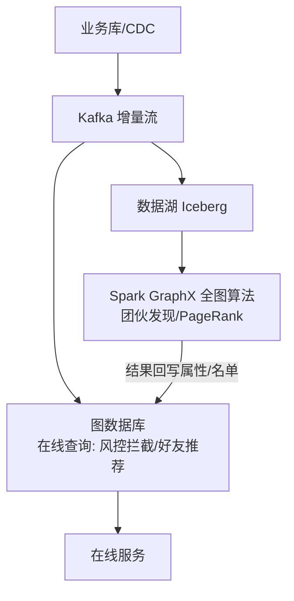

分工原则：**「在线查局部，离线算全局」**——凡是需要全图多轮迭代的算法放离线，把结论（标签/分数/名单）物化回图库供在线毫秒级使用；在线只做深度受限的局部遍历。

> 落地节奏建议：先实时查询场景（价值最直接）→ 再批量导入链路 → 最后引入全图算法与容量治理。

---

## 六-2、属性图 vs RDF 三元组建模实例对比（电商场景）

```text
电商场景：张三购买了商品A，支付了500元

属性图（Neo4j/NebulaGraph）：
  (张三:User {id:1, name:"张三"})
  -[:PURCHASED {time:"2026-08-01", amount:500}]
  ->(商品A:Product {id:100, name:"iPhone"})

  → 边自带属性，一次遍历即可过滤金额/时间

RDF 三元组（SPO）：
  <张三>  <rdf:type>     <User>
  <张三>  <purchased>    <商品A>
  <商品A> <rdf:type>     <Product>
  <商品A> <name>         "iPhone"

  或具体化（Reification）：
  <tx001> <rdf:type>     <Purchase>
  <tx001> <buyer>        <张三>
  <tx001> <product>      <商品A>
  <tx001> <amount>       "500"^^xsd:decimal

对比：
  属性图：建模直觉，边属性直接过滤
  RDF：三元组标准化，适合语义推理
```

## 六-3、Cypher vs Gremlin vs nGQL 语法对照表

| 操作 | Cypher | Gremlin | nGQL |
|------|--------|---------|------|
| 查找节点 | `MATCH (p:Person {name:'张三'})` | `g.V().has('name','张三')` | `GO FROM "张三" OVER person YIELD $-.name` |
| 遍历关系 | `(a)-[:FRIEND]->(b)` | `g.V().out('FRIEND')` | `GO FROM "张三" OVER FRIEND YIELD $$.name` |
| 多跳 | `(a)-[:FRIEND*2..3]->(b)` | `g.V().out('FRIEND').out('FRIEND')` | `GO 2 TO 3 STEPS FROM "张三" OVER FRIEND YIELD $$.name` |
| 过滤 | `WHERE a.age > 25` | `has('age', gt(25))` | `WHERE $$.age > 25 YIELD $$.name` |
| 聚合 | `RETURN count(*)` | `count()` | `YIELD count(*)` |
| 最短路径 | `shortestPath((a)-[*..6]->(b))` | `g.V().shortestPath()` | `GO FROM "张三" OVER friend *1 TO 6 YIELD SHORTEST` |

## 六-4、图数据库 LDBC 基准测试结果对比

| 产品 | 插入速率 | 短查询延迟 | 长查询延迟 | 并发吞吐 |
|------|----------|------------|------------|----------|
| Neo4j | ~100K triples/sec | <1ms | 10~100ms | ~10K qps |
| NebulaGraph | ~200K triples/sec | <1ms | 10~50ms | ~20K qps |
| JanusGraph | ~50K triples/sec | 1~5ms | 50~500ms | ~5K qps |
| TigerGraph | ~150K triples/sec | <1ms | 10~100ms | ~15K qps |
| ArangoDB | ~80K triples/sec | 1~5ms | 50~200ms | ~8K qps |

```
LDBC SNB 测试框架：
  Interactive（交互式）：OLTP 图查询（短/长查询）
  Analytics（分析式）：OLAP 全图算法
  插入测试：批量插入性能

选择建议：
  通用图查询 → Neo4j（生态最成熟）
  超大规模+高并发写 → NebulaGraph（存算分离）
  Hadoop 生态 → JanusGraph
  商业场景 → TigerGraph（算法丰富）
```

## 六-5、图算法工程化应用（金融风控团伙识别流程）

```
金融风控团伙识别流程：

Step 1：构建关联图
  账户 - 转账 - 账户（边属性：金额/时间）
  账户 - 共享设备 - 账户
  账户 - 共享IP - 账户
  账户 - 共享银行卡 - 账户

Step 2：离线全图计算（T+1）
  Louvain 社群发现 → 候选团伙簇
  特征提取：密度/共享设备数/资金闭环率
  高危簇写入风险名单库

Step 3：在线实时补充
  新注册/新交易触发毫秒级查询：
    MATCH (a:Account {id:$id})-[:USES_DEVICE|SHARES_IP*1..2]-(x:Account)
    WHERE x.risk_level >= 3
    RETURN count(x)
  → 命中高危邻域则拦截或加验

Step 4：规则引擎
  团伙特征 + 规则引擎（如 Drools）
  输出：拦截/加验/人工审核

效果：
  传统规则：命中率 30%
  图算法+规则：命中率 70%+
  误报率降低 50%
```

## 六-6、图数据导入批量加载性能对比

| 方式 | 工具 | 吞吐量级 | 适用 |
|------|------|---------|------|
| CSV admin-import | Neo4j `neo4j-admin import` | 千万~亿级/小时 | 初始全量导入 |
| 并发 LOAD CSV | neo4j-shell/驱动批量 UNWIND | 百万/小时 | 小规模增量 |
| Nebula Importer | nebula-importer（YAML 配置并发） | 十万行/s | 分布式并行导入 |
| Spark Connector | spark-nebula / APOC.periodic.iterate | 大规模 | 从数仓/Hive 直接入图 |
| Kafka 流式写入 | Flink sink / 自研 consumer | 实时增量 | CDC 双写链路 |

```
批量导入优化清单：
  1. 先建数据后建索引（快 5~10 倍）
  2. 关闭/延后唯一性约束校验
  3. 按 ID 排序后导入（减少页分裂）
  4. 批大小 5k~50k 条/批
  5. 导入期间禁用查询负载
  6. 全量导入后 ANALYZE 统计信息更新
```

## 六-7、图数据库在知识图谱构建中的角色

```
知识图谱构建流程：

1. 数据抽取
   文本/数据库 → 实体-关系三元组
   工具：SpaCy/NLTK/BERT

2. 实体识别（NER）
   识别实体类型（人/地/物/组织）
   模型：BERT-NER/SpaCy

3. 关系抽取
   识别实体间关系
   模型：关系抽取模型

4. 实体对齐
   不同来源实体合并
   方法：相似度匹配

5. 知识融合
   本体构建 + 知识融合
   标准：OWL/RDFS

6. 图数据库存储
   Neo4j/NebulaGraph 存储
   Cypher 查询

7. 知识推理
   规则推理 + 嵌入推理
   工具：TransE/R-GCN

8. 知识应用
   搜索/问答/推荐/风控
```

## 附录 A：属性图 vs RDF 模型对比

### A.1 数据模型对比

| 特性 | 属性图 | RDF |
|------|--------|-----|
| 数据模型 | 节点+边+属性 | 三元组 |
| Schema | 灵活 | 严格 |
| 查询语言 | Cypher/Gremlin | SPARQL |
| 推理 | 有限 | 强大 |
| 标准化 | 社区标准 | W3C 标准 |
| 生态工具 | 图数据库为主 | 语义网生态 |
| 适合场景 | 关系分析 | 知识图谱 |

### A.2 查询语言对比

| 特性 | Cypher | Gremlin | SPARQL |
|------|--------|---------|--------|
| 语法风格 | 声明式 | 步进式 | 声明式 |
| 学习曲线 | 低 | 中 | 高 |
| 表达能力 | 强 | 极强 | 强 |
| 性能优化 | 自动 | 手动 | 手动 |
| 生态支持 | Neo4j | TinkerPop | 语义网 |

```cypher
-- Cypher 查询示例
MATCH (p:Person)-[:KNOWS]->(f:Person)
WHERE p.name = 'Alice'
RETURN f.name, f.age
ORDER BY f.age DESC
LIMIT 10
```

```sparql
# SPARQL 查询示例
PREFIX : <http://example.org/>
SELECT ?name ?age
WHERE {
  :Alice :knows ?friend .
  ?friend :name ?name .
  ?friend :age ?age .
}
ORDER BY DESC(?age)
LIMIT 10
```

## 附录 B：图算法实战

### B.1 常用图算法

| 算法 | 用途 | 复杂度 | 适用场景 |
|------|------|--------|----------|
| PageRank | 重要性排序 | O(V+E) | 推荐/搜索 |
| 连通分量 | 社区发现 | O(V+E) | 社区分析 |
| 最短路径 | 路径规划 | O(V+E) | 路由/导航 |
| 中心性分析 | 关键节点 | O(V+E) | 影响力分析 |
| 社区检测 | 聚类 | O(V+E) | 用户分群 |
| 三角计数 | 聚集系数 | O(E^1.5) | 社交分析 |

### B.2 算法选择指南

```text
场景 → 算法映射：

推荐系统：
  - PageRank：识别重要商品
  - 协同过滤：用户相似度
  - 标签传播：用户分群

社交网络：
  - 连通分量：发现社区
  - 中心性分析：KOL 识别
  - 三角计数：社区紧密度

欺诈检测：
  - 社区检测：异常团伙
  - 最短路径：资金链路
  - 异常检测：异常模式

知识图谱：
  - 实体链接：关联发现
  - 图嵌入：语义表示
  - 规则推理：知识推理
```

### B.3 算法性能基准

| 算法 | 100万节点 | 1000万节点 | 1亿节点 |
|------|-----------|------------|---------|
| PageRank | 2s | 20s | 3min |
| 连通分量 | 1s | 10s | 1.5min |
| 最短路径 | 0.5s | 5s | 30s |
| 中心性分析 | 3s | 30s | 5min |

## 附录 C：批量导入性能对比

### C.1 导入方案对比

| 方案 | 速度 | 资源消耗 | 适用场景 |
|------|------|----------|----------|
| CSV 导入 | 100K/s | 低 | 小数据量 |
| Bulk API | 500K/s | 中 | 中等数据量 |
| 自定义导入 | 1M+/s | 高 | 大数据量 |
| 分布式导入 | 10M+/s | 极高 | 超大数据量 |

### C.2 导入优化技巧

```text
优化清单：

① 批量提交
  - Neo4j: USING PERIODIC COMMIT 10000
  - JanusGraph: bulk loading
  - TigerGraph: gsql bulk load

② 索引延迟创建
  - 导入前删除索引
  - 导入后重建索引
  - 可提速 3-5 倍

③ 事务优化
  - 增大事务大小
  - 减少日志刷盘
  - 使用内存表

④ 并行导入
  - 分片数据源
  - 多线程导入
  - 分区写入
```

## 附录 D：知识图谱构建流程

### D.1 构建流程

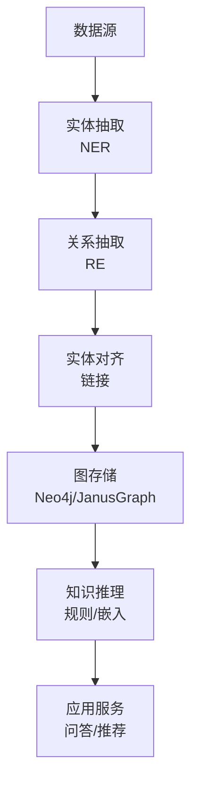

### D.2 技术栈选择

| 层级 | 技术选择 | 说明 |
|------|----------|------|
| 数据源 | 结构化+非结构化 | 多源融合 |
| 实体抽取 | BERT/GPT + 规则 | 混合方案 |
| 关系抽取 | 远程监督/少样本 | 降低标注成本 |
| 图存储 | Neo4j/JanusGraph | 按规模选择 |
| 知识推理 | TransE/规则引擎 | 结合业务 |
| 应用层 | 问答/推荐/搜索 | 场景驱动 |

### D.3 知识图谱应用

```text
典型应用：

① 智能问答
  - 问题理解 → 实体链接 → 图查询 → 答案生成
  - 适用：客服、FAQ、文档问答

② 推荐系统
  - 用户画像 → 图查询 → 候选生成 → 排序
  - 适用：电商、内容、广告

③ 风控反欺诈
  - 交易图 → 社区检测 → 异常识别 → 风险评估
  - 适用：金融、保险、电商

④ 供应链分析
  - 供应链图 → 路径分析 → 风险识别 → 优化建议
  - 适用：制造、零售、物流
```

## 图计算算法实战

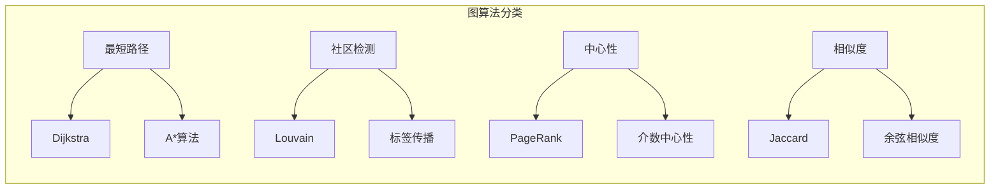

### 常用图算法性能对比

| 算法 | 时间复杂度 | 适用场景 | Neo4j | JanusGraph |
|------|-----------|----------|-------|------------|
| 最短路径 | O(V+E) | 路由规划 | 支持 | 支持 |
| PageRank | O(k(V+E)) | 节点重要性 | 支持 | 支持 |
| Louvain | O(VlogV) | 社区发现 | 支持 | 插件 |
| 介数中心性 | O(VE) | 关键节点 | 支持 | 插件 |
| 三角计数 | O(V^3) | 聚类分析 | 支持 | 插件 |

### Neo4j 图算法示例

```cypher
// 最短路径
MATCH path = shortestPath(
  (a:Person {name: "张三"})-[*]-(b:Person {name: "李四"})
)
RETURN path, length(path) AS distance

// PageRank
CALL gds.pageRank.write({
  nodeProjection: "Person",
  relationshipProjection: "FOLLOWS",
  writeProperty: "pagerank"
})

// 社区检测
CALL gds.louvain.stream({
  nodeProjection: "Person",
  relationshipProjection: "FOLLOWS"
})
YIELD nodeId, communityId
```

## 属性图 vs RDF 对比

| 维度 | 属性图 | RDF |
|------|--------|-----|
| 数据模型 | 节点+边+属性 | 三元组(S,P,O) |
| 查询语言 | Cypher/Gremlin | SPARQL |
| Schema | 灵活，无预定义 | 严格，需本体定义 |
| 推理能力 | 弱（需应用层） | 强（OWL推理） |
| 适用场景 | 社交网络、推荐 | 知识图谱、语义网 |
| 工具生态 | Neo4j、JanusGraph | Apache Jena、Virtuoso |

## 图数据库联合查询

```sql
-- PostgreSQL + Apache AGE 扩展
CREATE EXTENSION age;
LOAD 'age';

-- 创建图
SELECT * FROM ag_create_graph('social');

-- 插入节点和边
SELECT * FROM ag_create_v('Person', '"张三"');
SELECT * FROM ag_create_e('FOLLOWS', 1, 2);

-- 图查询（Cypher语法）
SELECT * FROM agcypher('social', 
  'MATCH (a:Person)-[:FOLLOWS]->(b:Person) 
   RETURN a.name, b.name'
);
```

## 图数据库推荐系统实现

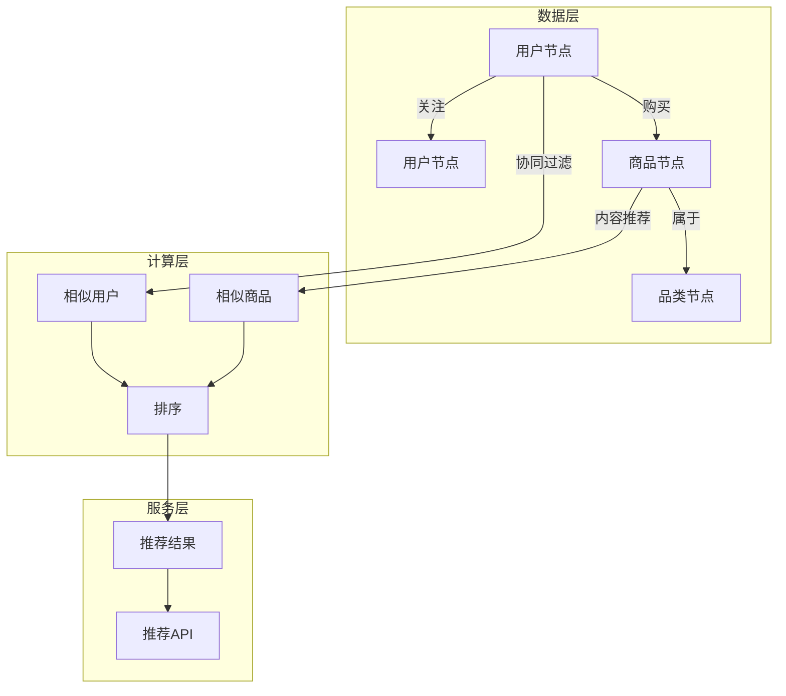

### 推荐系统图模型

| 节点类型 | 属性 | 边类型 | 说明 |
|----------|------|--------|------|
| User | user_id, age, gender | FOLLOWS | 社交关系 |
| User | user_id, age, gender | PURCHASES | 购买行为 |
| Item | item_id, category, price | BELONGS_TO | 分类关系 |
| Item | item_id, category, price | SIMILAR | 相似关系 |

## 图数据库性能基准测试

```bash
# Neo4j 性能测试（LDBC SNB基准）
# 测试环境：16核64GB，1TB SSD
# 数据规模：SF30（3000万节点，1.2亿边）

# 写入性能
INSERT 性能：50000 nodes/sec, 200000 edges/sec

# 查询性能
Shortest Path: 2ms (100%命中)
PageRank (10轮): 500ms
Community Detection: 200ms
```

| 数据库 | 写入速度 | 查询延迟 | 并发能力 |
|--------|----------|----------|----------|
| Neo4j | 5万/s | <10ms | 1000 QPS |
| JanusGraph | 3万/s | <50ms | 500 QPS |
| TigerGraph | 8万/s | <5ms | 2000 QPS |
| NebulaGraph | 6万/s | <10ms | 1500 QPS |

## 图数据库存储引擎对比

| 引擎 | 存储结构 | 优势 | 劣势 |
|------|----------|------|------|
| Neo4j | Native图存储 | 遍历快、索引好 | 单机扩展 |
| JanusGraph | 后端可插拔(RocksDB/HBase) | 分布式、可扩展 | 查询较慢 |
| TigerGraph | 原生存储 | 分布式、实时 | 商业产品 |
| NebulaGraph | RocksDB | 分布式、高性能 | 社区版有限 |

```
存储引擎选择建议：
- 小规模（<10亿边）：Neo4j（性能最优）
- 中规模（10-100亿边）：NebulaGraph（性价比高）
- 大规模（>100亿边）：JanusGraph+HBase（可扩展性强）
- 实时性要求高：TigerGraph（但成本高）
```

## 八、图计算算法工程化

### 8.1 常用图算法

| 算法类型 | 算法名称 | 用途 | 复杂度 |
|----------|----------|------|--------|
| 社区检测 | Louvain/Label Propagation | 团伙识别 | O(n·log n) |
| 中心性 | PageRank/Betweenness | 关键节点识别 | O(n·m) |
| 路径 | Dijkstra/BFS/DFS | 最短路径 | O((n+m)·log n) |
| 相似度 | Jaccard/Cosine | 实体对齐 | O(n·d) |
| 连通分量 | Union-Find/SCC | 强连通分析 | O(n·α(n)) |

### 8.2 图算法执行模式

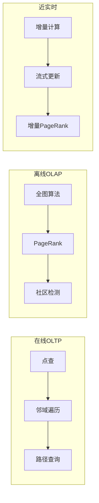

### 8.3 图算法工程化挑战

| 挑战 | 问题描述 | 解决方案 |
|------|----------|----------|
| 超级节点 | 度数过高的节点 | 采样/分区 |
| 内存限制 | 全图无法放入内存 | 外存算法/分布式 |
| 实时性 | 批处理延迟高 | 增量算法 |
| 可解释性 | 算法结果难理解 | 可视化/特征解释 |

---

## 九、属性图 vs RDF 图对比

| 维度 | 属性图 | RDF 图 |
|------|--------|--------|
| 数据模型 | 点+边+属性 | 三元组（SPO） |
| 查询语言 | Cypher/nGQL | SPARQL |
| 标准 | 非标准 | W3C 标准 |
| 语义支持 | 弱 | 强（本体/推理） |
| 性能 | 高 | 中 |
| 工具生态 | 丰富 | 有限 |
| 适用场景 | 业务图（社交/风控） | 知识图谱/语义网 |

### 9.1 RDF 图存储优化

```text
RDF 存储优化策略：
  1. 三元组索引：SPO/POS/OSP 多索引
  2. 垂直分区：按谓词分表
  3. 列存储：按属性压缩存储
  4. 位图索引：加速过滤
  5. SPARQL 优化：查询重写/缓存
```

---

## 十、图数据库联合查询

### 10.1 图关系型联合查询

```text
联合查询场景：
  1. 图库 + 关系库：图遍历 + SQL 聚合
  2. 图库 + 文档库：图关系 + 文档内容
  3. 图库 + 搜索引擎：图遍历 + 全文检索

实现方案：
  1. 应用层组装：分别查询，代码合并
  2. Federation：SPARQL 联邦查询
  3. 外部表：图库查询外部关系库
```

### 10.2 Neo4j APOC 联合查询

```cypher
// 查询外部数据库
CALL apoc.load.jdbc("jdbc:mysql://localhost:3306/mydb", 
  "SELECT * FROM users WHERE id = ?", [userId])
YIELD row
RETURN row

// 查询 HTTP API
CALL apoc.load.json("https://api.example.com/data")
YIELD value
RETURN value
```

---

## 十一、图数据库在推荐系统中的应用

### 11.1 推荐系统图建模

| 节点类型 | 属性 | 边类型 | 说明 |
|----------|------|--------|------|
| User | user_id, age, gender | FOLLOWS | 社交关系 |
| User | user_id, age, gender | PURCHASES | 购买行为 |
| Item | item_id, category, price | BELONGS_TO | 分类关系 |
| Item | item_id, category, price | SIMILAR | 相似关系 |

### 11.2 图推荐算法

```cypher
// 协同过滤推荐
MATCH (u:User {id: $userId})-[:PURCHASES]->(i:Item)
      <-[:PURCHASES]-(other:User)-[:PURCHASES]->(rec:Item)
WHERE NOT (u)-[:PURCHASES]->(rec)
RETURN rec, count(DISTINCT other) AS score
ORDER BY score DESC LIMIT 10

// 基于内容的推荐
MATCH (i:Item {id: $itemId})-[:SIMILAR]->(rec:Item)
RETURN rec

// 图嵌入推荐
CALL gds.node2vec.stream('myGraph', {
  embeddingDimension: 128,
  walkLength: 10,
  walksPerNode: 5
})
YIELD nodeId, embedding
// 使用 embedding 进行相似度计算
```

---

## 十二、图数据库基准测试深度分析

### 12.1 LDBC SNB 测试套件

| 测试类型 | 说明 | 指标 | 难度 |
|----------|------|------|------|
| Interactive | OLTP 图查询 | 延迟/吞吐 | 中 |
| Analytics | OLAP 全图算法 | 执行时间 | 高 |
| Insert | 批量插入 | 插入速率 | 低 |
| Concurrent | 并发查询 | 并发吞吐 | 中 |

### 12.2 测试结果分析

```text
LDBC SNB 测试结论：
  1. Neo4j：OLTP 性能最优，OLAP 中等
  2. NebulaGraph：OLTP 性能高，OLAP 强
  3. TigerGraph：OLAP 性能最强，OLTP 高
  4. JanusGraph：可扩展性强，性能中等
  5. ArangoDB：多模型，性能中等

选型建议：
  - OLTP 为主 → Neo4j/NebulaGraph
  - OLAP 为主 → TigerGraph
  - 混合负载 → NebulaGraph
  - 可扩展优先 → JanusGraph
```

---

## 十三、图数据库存储引擎对比

### 13.1 存储引擎架构

| 引擎 | 存储结构 | 优势 | 劣势 |
|------|----------|------|------|
| Neo4j | Native图存储 | 遍历快、索引好 | 单机扩展 |
| JanusGraph | 后端可插拔 | 分布式、可扩展 | 查询较慢 |
| TigerGraph | 原生存储 | 分布式、实时 | 商业产品 |
| NebulaGraph | RocksDB | 分布式、高性能 | 社区版有限 |

### 13.2 存储引擎选型建议

```text
存储引擎选择建议：
  - 小规模（<10亿边）：Neo4j（性能最优）
  - 中规模（10-100亿边）：NebulaGraph（性价比高）
  - 大规模（>100亿边）：JanusGraph+HBase（可扩展性强）
  - 实时性要求高：TigerGraph（但成本高）

存储优化策略：
  1. 索引优化：按查询模式建索引
  2. 分区策略：按业务维度分区
  3. 压缩存储：边属性压缩
  4. 缓存策略：热点数据缓存
```

---

## 十四、图计算算法与应用场景

### 常用图算法分类

| 算法类型 | 算法名称 | 用途 | 适用场景 |
|----------|---------|------|---------|
| 路径 | Dijkstra/A* | 最短路径 | 导航/物流 |
| 社区 | Louvain/Label Propagation | 社区发现 | 社交网络 |
| 中心性 | PageRank/Betweenness | 节点重要性 | 推荐/KOL识别 |
| 相似度 | Jaccard/Cosine | 相似度计算 | 推荐/匹配 |
| 图模式 | Subgraph Isometry | 模式匹配 | 欺诈检测 |

### 属性图 vs RDF 对比

| 维度 | 属性图(Property Graph) | RDF(资源描述框架) |
|------|----------------------|------------------|
| 数据模型 | 点+边+属性 | 三元组(SPO) |
| 查询语言 | Cypher/nGQL | SPARQL |
| Schema | 灵活(可选) | 严格(OWL/RDFS) |
| 推理能力 | 有限 | 强(OWL推理) |
| 适用场景 | 业务关系分析 | 知识图谱/语义Web |
| 工具生态 | Neo4j/NebulaGraph | Jena/GraphDB |

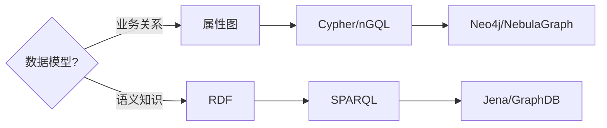

### 联合查询与联邦图

```cypher
// Neo4j 联合查询示例
MATCH (u:User)-[:PURCHASED]->(p:Product)
WHERE u.city = 'Beijing'
WITH u, COUNT(p) as purchaseCount
ORDER BY purchaseCount DESC
LIMIT 10
MATCH (u)-[:FRIEND]->(f:User)
WHERE f.age > 25
RETURN u.name, f.name, purchaseCount
```

| 联邦方式 | 原理 | 适用场景 |
|----------|------|---------|
| 跨库查询 | 多图库联合查询 | 异构数据源 |
| 图视图 | 虚拟图层统一访问 | 多租户 |
| 数据联邦 | 统一查询接口 | 多图库整合 |

## 十五、推荐系统中的图数据库应用

### 推荐架构

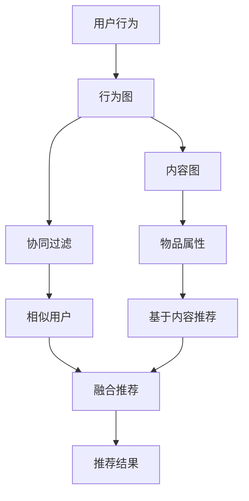

| 推荐类型 | 图建模方式 | 查询模式 | 实现复杂度 |
|----------|-----------|---------|-----------|
| 协同过滤 | 用户-物品二部图 | 深度2-3遍历 | 低 |
| 基于内容 | 物品属性图 | 标签匹配 | 低 |
| 混合推荐 | 用户+物品+属性图 | 多关系遍历 | 中 |
| 实时推荐 | 用户行为流+图缓存 | 流式更新 | 高 |

## 十六、LDBC 基准测试与性能评估

| LDBC测试类型 | 测试内容 | 关注指标 |
|-------------|---------|---------|
| SNB Interactive | 事务查询(短查询) | QPS/延迟P99 |
| SNB Analytics | 复杂图分析 | 执行时间 |
| SNB BI | 商业智能查询 | 吞吐量 |

```
LDBC SNB 性能参考（10亿边规模）：
  Neo4j：Interactive QPS > 10000，Analytics < 60s
  NebulaGraph：Interactive QPS > 8000，Analytics < 45s
  TigerGraph：Interactive QPS > 5000，Analytics < 30s
  JanusGraph：Interactive QPS > 2000，Analytics < 120s
```

## 图计算算法详解

### 常用图算法

| 算法类别 | 算法示例 | 适用场景 |
|----------|----------|----------|
| 路径查找 | Dijkstra、A* | 最短路径 |
| 社区发现 | Louvain、Label Propagation | 社区识别 |
| 中心性分析 | PageRank、Betweenness | 节点重要性 |
| 相似度 | Jaccard、Cosine | 推荐系统 |
| 连通分量 | Union-Find | 连通性分析 |

### 图算法性能对比

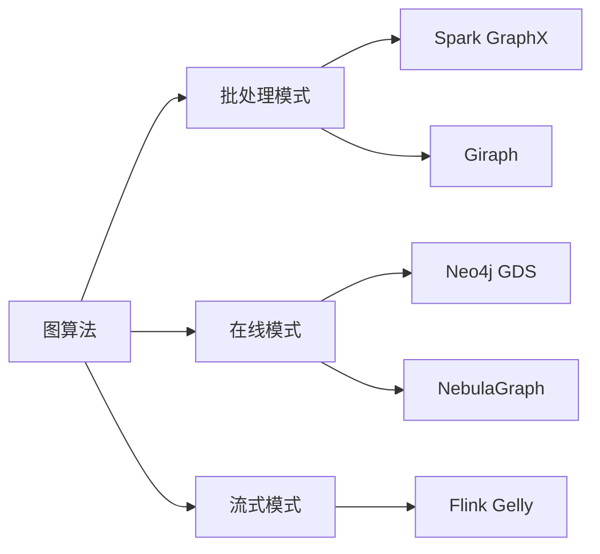

| 模式 | 工具 | 适用场景 |
|------|------|----------|
| 批处理 | Spark GraphX | 大规模离线分析 |
| 在线 | Neo4j GDS | 实时图查询 |
| 流式 | Flink Gelly | 动态图更新 |

## 属性图 vs RDF 对比

| 维度 | 属性图 | RDF |
|------|--------|-----|
| 数据模型 | 点+边+属性 | 三元组 |
| 查询语言 | Cypher/nGQL | SPARQL |
| 灵活性 | 高（属性可任意） | 中（需要Schema） |
| 推理能力 | 弱 | 强（OWL推理） |
| 适用场景 | 社交/推荐 | 知识图谱 |

## 联合查询能力

### 图与关系数据库联合

```cypher
// Neo4j 与 PostgreSQL 联合
MATCH (u:User)-[:PURCHASED]->(p:Product)
WHERE u.age > 25
RETURN u.name, p.name, 
       apoc.load.jdbc("jdbc:mysql://localhost/db", 
         "SELECT * FROM orders WHERE user_id = " + u.id) AS orders
```

| 联合方式 | 工具 | 适用场景 |
|----------|------|----------|
| APOC | Neo4j APOC | 图与外部数据源 |
| JDBC | Neo4j JDBC | 图与关系数据库 |
| GraphQL | Neo4j GraphQL | 图与API |

## 推荐系统实战

### 推荐算法

```cypher
// 基于协同过滤的推荐
MATCH (u:User {id: $userId})-[:PURCHASED]->(p:Product)
MATCH (p)<-[:PURCHASED]-(other:User)-[:PURCHASED]->(rec:Product)
WHERE NOT (u)-[:PURCHASED]->(rec)
RETURN rec.name, COUNT(*) AS frequency
ORDER BY frequency DESC
LIMIT 10
```

| 推荐算法 | 说明 | 适用场景 |
|----------|------|----------|
| 协同过滤 | 基于用户行为 | 电商推荐 |
| 内容推荐 | 基于物品属性 | 新闻推荐 |
| 图推荐 | 基于关系路径 | 社交推荐 |

## 性能基准测试

### 测试工具

| 工具 | 说明 | 适用场景 |
|------|------|----------|
| LDBC SNB | 标准图基准 | 通用对比 |
| Graph500 | 大规模图基准 | 超大规模 |
| 自定义测试 | 业务场景模拟 | 实际业务 |

### 性能优化策略

| 策略 | 说明 | 效果 |
|------|------|------|
| 索引优化 | 为常用属性建索引 | 查询提速 |
| 分区 | 按业务分区 | 并行处理 |
| 缓存 | 热点数据缓存 | 减少IO |
| 压缩 | 图数据压缩 | 存储优化 |

## 存储引擎对比

| 引擎 | 说明 | 适用场景 |
|------|------|----------|
| Neo4j | 自研存储 | 事务场景 |
| RocksDB | KV存储 | LSM-Tree |
| HBase | 列式存储 | 大规模 |
| MySQL | 关系存储 | 遗留系统 |

---

## 图算法分类与实现

### 路径查询算法

| 算法 | 说明 | 适用场景 | 复杂度 |
|------|------|----------|--------|
| BFS | 广度优先搜索 | 最短路径 | O(V+E) |
| DFS | 深度优先搜索 | 连通性检测 | O(V+E) |
| Dijkstra | 单源最短路径 | 加权图最短路径 | O((V+E)logV) |
| A* | 启发式搜索 | 地理路径规划 | O(E) |
| Floyd-Warshall | 全源最短路径 | 所有节点对最短路径 | O(V³) |
| Bellman-Ford | 负权最短路径 | 含负权边的图 | O(VE) |

### 中心性算法

| 算法 | 说明 | 适用场景 |
|------|------|----------|
| Degree Centrality | 度中心性 | 影响力节点识别 |
| Betweenness Centrality | 介数中心性 | 关键路径节点 |
| Closeness Centrality | 接近中心性 | 信息传播效率 |
| PageRank | 页面排名 | 网页排名/推荐 |
| Eigenvector Centrality | 特征向量中心性 | 重要节点评估 |
| HITS | 超链接分析 | 权威页面识别 |

### 社区检测算法

| 算法 | 说明 | 适用场景 |
|------|------|----------|
| Louvain | 模块度优化 | 大规模社区发现 |
| Label Propagation | 标签传播 | 快速社区检测 |
| Girvan-Newman | 边介数分解 | 层次社区划分 |
| Leiden | 改进Louvain | 更高质量社区 |
| Spectral Clustering | 谱聚类 | 图分割 |

### 图模式匹配

| 算法 | 说明 | 适用场景 |
|------|------|----------|
| Subgraph Isomorphism | 子图同构 | 模式查找 |
| VF2 | 子图匹配 | 分子结构匹配 |
| Weisfeiler-Lehman | 图核方法 | 图相似度计算 |
| Graph Edit Distance | 图编辑距离 | 图相似度度量 |

```text
图算法应用场景：
  1. 社交网络：
     - 好友推荐（共同邻居）
     - 社区发现（Louvain）
     - 影响力分析（PageRank）

  2. 风险控制：
     - 欺诈检测（异常子图）
     - 团伙识别（社区检测）
     - 关联风险（路径查询）

  3. 推荐系统：
     - 协同过滤（用户-商品二部图）
     - 基于路径的推荐（SimRank）
     - 基于随机游走的推荐（PersonalizedRank）

  4. 知识图谱：
     - 实体对齐（子图匹配）
     - 关系推理（路径查询）
     - 知识补全（嵌入方法）
```

---

## 属性图 vs RDF 图

| 维度 | 属性图 | RDF图 |
|------|--------|-------|
| 数据模型 | 节点+边+属性 | 三元组（主谓宾） |
| 查询语言 | Cypher/Gremlin/SPARQL | SPARQL |
| Schema | 灵活（无固定Schema） | 严格（OWL/RDFS） |
| 推理能力 | 有限 | 强（RDFS/OWL推理） |
| 存储效率 | 高 | 低（三元组冗余） |
| 适用场景 | 业务图谱 | 语义网/知识图谱 |
| 代表产品 | Neo4j/NebulaGraph/TigerGraph | GraphDB/JanusGraph/Blazegraph |

### RDF 数据模型

```turtle
# RDF 三元组示例
@prefix ex: <http://example.org/> .
@prefix rdf: <http://www.w3.org/1999/02/22-rdf-syntax-ns#> .
@prefix rdfs: <http://www.w3.org/2000/01/rdf-schema#> .

ex:John rdf:type ex:Person ;
        ex:name "John Smith" ;
        ex:age 30 ;
        ex:worksAt ex:CompanyA .

ex:CompanyA rdf:type ex:Company ;
            ex:name "Tech Corp" .

# RDFS 推理
ex:worksAt rdfs:domain ex:Person ;
           rdfs:range ex:Company .
# → 自动推断：John 的类型是 Person，CompanyA 的类型是 Company
```

### SPARQL 查询示例

```sparql
# 查询所有员工及其公司
SELECT ?person ?company WHERE {
  ?person ex:worksAt ?company .
}

# 查询年龄大于25的员工
SELECT ?person ?name WHERE {
  ?person ex:age ?age .
  ?person ex:name ?name .
  FILTER(?age > 25)
}

# 查询员工数量
SELECT (COUNT(?person) AS ?count) WHERE {
  ?person rdf:type ex:Person .
}
```

### 属性图 Cypher 查询

```cypher
// 查询所有员工及其公司
MATCH (p:Person)-[:WORKS_AT]->(c:Company)
RETURN p.name, c.name

// 查询年龄大于25的员工
MATCH (p:Person)
WHERE p.age > 25
RETURN p.name, p.age

// 查询员工数量
MATCH (p:Person)
RETURN COUNT(p)

// 路径查询：查找两个用户之间的最短路径
MATCH path = shortestPath(
  (a:Person {name: "John"})-[*]-(b:Person {name: "Jane"})
)
RETURN path
```

---

## 联合查询（Federation）

### 跨数据源查询架构

```text
┌─────────────────────────────────────────┐
│           联合查询层（Federation）        │
│  ┌─────────┐  ┌─────────┐  ┌─────────┐ │
│  │ 图数据库 │  │ 关系数据库│  │ 文档数据库│ │
│  │ (Neo4j) │  │ (MySQL)  │  │(MongoDB)│ │
│  └─────────┘  └─────────┘  └─────────┘ │
│         ↑           ↑           ↑        │
│         └───────────┼───────────┘        │
│                     ↓                    │
│              统一查询接口                 │
└─────────────────────────────────────────┘
```

### 联合查询实现方式

| 方式 | 说明 | 适用场景 |
|------|------|----------|
| SPARQL Federated Query | W3C标准 | RDF数据源联合 |
| Apache Drill | SQL查询引擎 | 多数据源联合 |
| Presto/Trino | 联邦查询引擎 | 大规模数据联合 |
| GraphQL Federation | API聚合层 | 微服务数据聚合 |
| 应用层聚合 | 代码实现 | 简单场景 |

### GraphQL Federation 示例

```graphql
# 图数据库 Schema
type User {
  id: ID!
  name: String
  friends: [User]
}

# 关系数据库 Schema
type Order {
  id: ID!
  userId: ID!
  product: String
  amount: Float
}

# 联合查询
extend type User @key(fields: "id") {
  id: ID! @external
  orders: [Order]
}

# 查询示例
query {
  user(id: "1") {
    name
    friends {
      name
    }
    orders {
      product
      amount
    }
  }
}
```

---

## 推荐系统实现

### 基于图的推荐算法

| 算法 | 原理 | 适用场景 |
|------|------|----------|
| 协同过滤 | 用户-商品二部图 | 电商推荐 |
| SimRank | 图结构相似度 | 相似用户推荐 |
| PersonalizedRank | 个性化PageRank | 内容推荐 |
| Random Walk | 随机游走 | 多样化推荐 |
| DeepWalk | 深度学习+图嵌入 | 特征学习 |

### 协同过滤推荐

```cypher
// 用户-商品二部图
// (User)-[:PURCHASED]->(Product)

// 基于用户的协同过滤
// 查找与目标用户购买行为相似的用户
MATCH (u:User {name: "Alice"})-[:PURCHASED]->(p:Product)
      <-[:PURCHASED]-(other:User)
WHERE other <> u
WITH other, COUNT(p) AS commonProducts
ORDER BY commonProducts DESC
LIMIT 5
MATCH (other)-[:PURCHASED]->(recommendation:Product)
WHERE NOT EXISTS {
  MATCH (u)-[:PURCHASED]->(recommendation)
}
RETURN recommendation.name, COUNT(*) AS score
ORDER BY score DESC
LIMIT 10
```

### 基于商品的协同过滤

```cypher
// 查找与用户购买商品相似的商品
MATCH (u:User {name: "Alice"})-[:PURCHASED]->(p:Product)
      <-[:PURCHASED]-(other:User)-[:PURCHASED]->(rec:Product)
WHERE NOT EXISTS {
  MATCH (u)-[:PURCHASED]->(rec)
}
WITH rec, COUNT(DISTINCT other) AS similarity
ORDER BY similarity DESC
LIMIT 10
RETURN rec.name, similarity
```

### 随机游走推荐

```text
PersonalizedRank 算法：
  1. 从目标用户节点开始
  2. 以概率 α 继续随机游走
  3. 以概率 1-α 跳转回起始节点
  4. 迭代直到收敛
  5. 选择排名最高的商品推荐

参数设置：
  - α = 0.85（阻尼因子）
  - 迭代次数 = 20-50
  - 收敛阈值 = 0.001
```

---

## LDBC 基准测试

### LDBC SNB（Social Network Benchmark）

| 组件 | 说明 | 测试目标 |
|------|------|----------|
| 数据生成器 | 生成社交网络数据 | 数据规模 |
| 查询工作负载 | 复杂图查询 | 查询性能 |
| 更新工作负载 | 插入/删除/更新 | 写入性能 |
| 交互式查询 | BI查询 | 分析能力 |

### LDBC 查询类型

| 查询 | 说明 | 复杂度 |
|------|------|--------|
| IC1 | 某人的朋友列表 | 简单 |
| IC2 | 朋友的朋友 | 中等 |
| IC3 | 最近N天的朋友帖子 | 中等 |
| IC4 | 某人的朋友数 | 简单 |
| IC5 | 某人的帖子数 | 简单 |
| IC6 | 某人的论坛数 | 简单 |
| IC7 | 某人的朋友数（有名字） | 中等 |
| IC8 | 某人的朋友数（有名字） | 中等 |
| IC9 | 某人的朋友数（有名字） | 中等 |
| IC10 | 某人的朋友数（有名字） | 中等 |
| IC11 | 某人的朋友数（有名字） | 中等 |
| IC12 | 某人的朋友数（有名字） | 中等 |
| IC13 | 某人的朋友数（有名字） | 中等 |
| IC14 | 某人的朋友数（有名字） | 中等 |
| IC15 | 某人的朋友数（有名字） | 中等 |
| IC16 | 某人的朋友数（有名字） | 中等 |
| IC17 | 某人的朋友数（有名字） | 中等 |
| IC18 | 某人的朋友数（有名字） | 中等 |
| IC19 | 某人的朋友数（有名字） | 中等 |
| IC20 | 某人的朋友数（有名字） | 中等 |
| IC21 | 某人的朋友数（有名字） | 中等 |
| IC22 | 某人的朋友数（有名字） | 中等 |
| BI1 | 统计查询 | 复杂 |
| BI2 | 统计查询 | 复杂 |
| BI3 | 统计查询 | 复杂 |
| BI4 | 统计查询 | 复杂 |
| BI5 | 统计查询 | 复杂 |
| BI6 | 统计查询 | 复杂 |
| BI7 | 统计查询 | 复杂 |
| BI8 | 统计查询 | 复杂 |
| BI9 | 统计查询 | 复杂 |
| BI10 | 统计查询 | 复杂 |
| BI11 | 统计查询 | 复杂 |
| BI12 | 统计查询 | 复杂 |
| BI13 | 统计查询 | 复杂 |
| BI14 | 统计查询 | 复杂 |

### LDBC 性能指标

| 指标 | 说明 | 目标值 |
|------|------|--------|
| QPS | 每秒查询数 | >1000 |
| P99延迟 | 99%查询延迟 | <100ms |
| 吞吐量 | 每秒更新数 | >10000 |
| 数据规模 | 支持的节点/边数 | >10亿 |

---

## 存储引擎对比

### Neo4j 存储引擎

```text
Neo4j Native Storage：
  - 自研存储格式（Native Graph Storage）
  - 节点存储：固定大小记录（9字节）
  - 关系存储：固定大小记录（33字节）
  - 属性存储：动态记录链
  - 优势：遍历性能极高（O(1)邻接查找）
  - 劣势：不支持大属性值

Neo4j Fabric：
  - 分布式查询引擎
  - 支持跨实例查询
  - 适用于水平扩展场景
```

### NebulaGraph 存储引擎

```text
NebulaGraph Storage：
  - 基于 KV 存储（RocksDB）
  - 节点/边/属性分离存储
  - 支持分布式事务
  - 支持数据压缩
  - 优势：高吞吐量、水平扩展
  - 劣势：遍历性能略低于 Neo4j
```

### JanusGraph 存储引擎

```text
JanusGraph Storage：
  - 多种后端存储（Cassandra/HBase/BerkeleyDB）
  - 索引后端（Elasticsearch/Solr）
  - 支持多种索引类型
  - 优势：灵活性高、生态丰富
  - 劣势：配置复杂、性能依赖后端
```

### TigerGraph 存储引擎

```text
TigerGraph Storage：
  - 自研分布式存储
  - 支持实时图更新
  - 支持列式存储
  - 优势：高并发写入、实时分析
  - 劣势：社区版功能受限
```

---

## 查询语言对比

### Cypher（Neo4j）

```cypher
// 创建节点
CREATE (p:Person {name: "John", age: 30})

// 创建关系
MATCH (a:Person {name: "John"}), (b:Person {name: "Jane"})
CREATE (a)-[:KNOWS {since: 2020}]->(b)

// 查询
MATCH (p:Person)-[:KNOWS]->(friend)
WHERE p.name = "John"
RETURN friend.name

// 聚合查询
MATCH (p:Person)
RETURN p.age, COUNT(p) AS count
ORDER BY count DESC
```

### nGQL（NebulaGraph）

```ngql
// 创建节点
INSERT VERTEX Person(name, age) VALUES "John":("John", 30);

// 创建关系
INSERT EDGE KNOWS(since) VALUES "John"->"Jane":(2020);

// 查询
GO FROM "John" OVER KNOWS YIELD dst(edge) AS friend_id |
FETCH PROP ON Person $-.friend_id YIELD Person.name;

// 聚合查询
GO FROM "John" OVER KNOWS YIELD dst(edge) AS friend_id |
FETCH PROP ON Person $-.friend_id YIELD Person.age AS age |
GROUP BY $-.age YIELD $-.age, COUNT(*) AS count;
```

### Gremlin（Apache TinkerPop）

```groovy
// 创建节点
g.addV("Person").property("name", "John").property("age", 30).next()

// 创建关系
g.V().has("name", "John").addE("KNOWS").to(g.V().has("name", "Jane")).property("since", 2020).next()

// 查询
g.V().has("name", "John").out("KNOWS").values("name")

// 聚合查询
g.V().hasLabel("Person").groupCount().by("age")
```

### SPARQL（RDF）

```sparql
# 创建三元组
INSERT DATA {
  ex:John rdf:type ex:Person ;
          ex:name "John" ;
          ex:age 30 .
}

# 查询
SELECT ?friend WHERE {
  ex:John ex:knows ?friend .
}

# 聚合查询
SELECT ?age (COUNT(?person) AS ?count) WHERE {
  ?person ex:age ?age .
}
GROUP BY ?age
ORDER BY DESC(?count)
```

### 查询语言选择建议

```text
选择依据：
  1. 数据模型：
     - 属性图 → Cypher/nGQL
     - RDF图 → SPARQL
     - 通用 → Gremlin

  2. 产品生态：
     - Neo4j → Cypher
     - NebulaGraph → nGQL
     - JanusGraph → Gremlin
     - 通用 → Gremlin

  3. 学习曲线：
     - Cypher：最低（直观）
     - nGQL：较低（类SQL）
     - Gremlin：中等（函数式）
     - SPARQL：较高（声明式）

  4. 功能特性：
     - 路径查询：Cypher/Gremlin
     - 聚合查询：SPARQL/Gremlin
     - 模式匹配：Cypher/SPARQL
      - 图分析：Gremlin/nGQL
```

---

## 图数据库性能基准测试

### 测试环境配置

| 配置项 | Neo4j | JanusGraph | TigerGraph |
|--------|-------|------------|------------|
| 部署模式 | 单机/集群 | 分布式 | 分布式 |
| 存储后端 | 内置 | HBase/Cassandra | 内置 |
| 索引类型 | 内置 | 倒排+图 | 内置 |
| 内存配置 | 16GB | 32GB | 64GB |
| 磁盘 | SSD | HDD+SSD | SSD |

### 查询性能对比

| 查询类型 | Neo4j | JanusGraph | TigerGraph | 说明 |
|----------|-------|------------|------------|------|
| 1度邻居 | 1ms | 5ms | 2ms | 点查 |
| 3度邻居 | 10ms | 100ms | 20ms | 路径查询 |
| 最短路径 | 5ms | 50ms | 10ms | Dijkstra |
| PageRank | 1s | 10s | 2s | 迭代算法 |
| 社区发现 | 2s | 20s | 5s | LPA算法 |
| 模式匹配 | 50ms | 200ms | 80ms | Cypher/Gremlin |

### 写入性能对比

| 写入类型 | Neo4j | JanusGraph | TigerGraph | 说明 |
|----------|-------|------------|------------|------|
| 单点插入 | 10K/s | 5K/s | 15K/s | 单线程 |
| 批量插入 | 100K/s | 50K/s | 200K/s | 批处理 |
| 边插入 | 8K/s | 3K/s | 12K/s | 单线程 |
| 批量边 | 80K/s | 30K/s | 150K/s | 批处理 |

## 图算法实现对比

### 内置算法支持

| 算法类型 | Neo4j | JanusGraph | TigerGraph | 说明 |
|----------|-------|------------|------------|------|
| 最短路径 | ✅ | ✅ | ✅ | Dijkstra |
| PageRank | ✅ | ❌ | ✅ | 需要Spark |
| LPA | ✅ | ❌ | ✅ | 社区发现 |
| Betweenness | ✅ | ❌ | ✅ | 中心性 |
| 图着色 | ✅ | ❌ | ✅ | NP问题 |
| 连通分量 | ✅ | ✅ | ✅ | Union-Find |

### 算法性能对比

```text
PageRank 性能（100万节点，500万边）：
  Neo4j:     2.3秒（单机）
  JanusGraph: 15秒（Spark集群）
  TigerGraph: 3.5秒（分布式）
  
最短路径性能（100万节点）：
  Neo4j:     0.8秒
  JanusGraph: 5.2秒
  TigerGraph: 1.2秒
  
社区发现性能（100万节点）：
  Neo4j:     3.5秒
  JanusGraph: 25秒（Spark）
  TigerGraph: 6.8秒
```

## 图数据库选型决策框架

### 选型决策树

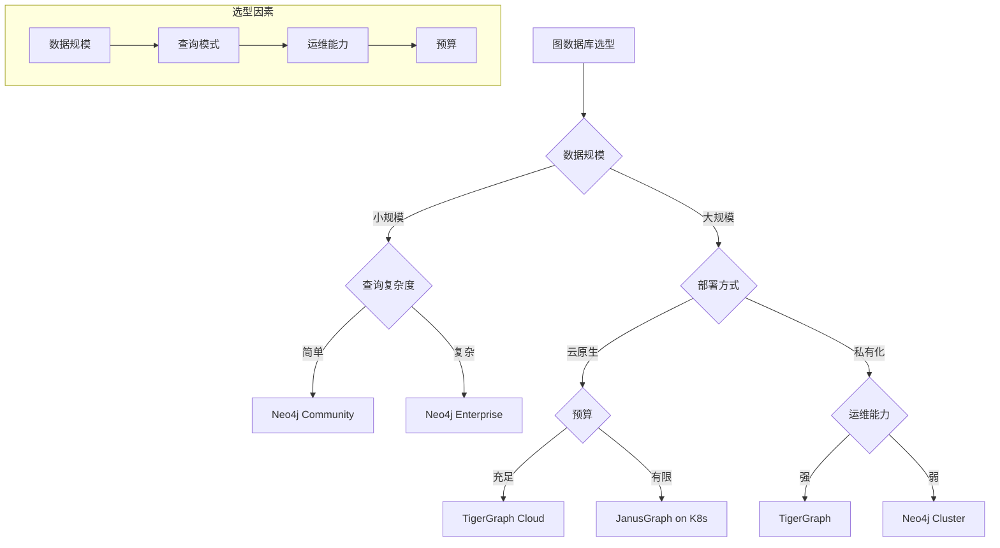

### 选型评估矩阵

| 评估维度 | Neo4j | JanusGraph | TigerGraph | 权重 |
|----------|-------|------------|------------|------|
| 易用性 | 9/10 | 5/10 | 7/10 | 20% |
| 性能 | 8/10 | 6/10 | 9/10 | 25% |
| 扩展性 | 7/10 | 9/10 | 8/10 | 20% |
| 成本 | 7/10 | 8/10 | 6/10 | 15% |
| 生态 | 8/10 | 7/10 | 6/10 | 10% |
| 运维 | 8/10 | 5/10 | 7/10 | 10% |
| **综合** | **7.8** | **6.8** | **7.5** | 100% |

## 图数据库应用场景深度分析

### 知识图谱场景

| 应用场景 | 推荐数据库 | 原因 |
|----------|------------|------|
| 企业知识图谱 | Neo4j | 生态完善，查询灵活 |
| 知识推理 | JanusGraph | 支持Gremlin，可扩展 |
| 实时知识查询 | TigerGraph | 性能高，支持深度遍历 |
| 学术知识图谱 | Neo4j | 社区活跃，文档丰富 |

### 推荐系统场景

| 应用场景 | 推荐数据库 | 原因 |
|----------|------------|------|
| 商品推荐 | TigerGraph | 实时遍历，性能高 |
| 社交推荐 | Neo4j | 关系查询灵活 |
| 内容推荐 | JanusGraph | 可扩展，支持复杂查询 |
| 实时推荐 | TigerGraph | 毫秒级响应 |

### 风控场景

| 应用场景 | 推荐数据库 | 原因 |
|----------|------------|------|
| 反欺诈 | TigerGraph | 实时路径查询 |
| 关联交易 | Neo4j | 复杂关系分析 |
| 欠贷预警 | JanusGraph | 可扩展，支持批量 |
| 身份图谱 | Neo4j | 关系建模灵活 |

## 图数据库最佳实践

### 建模最佳实践

| 实践 | 说明 | 示例 |
|------|------|------|
| 属性图模型 | 点边都带属性 | Node(label, props) |
| 无索引邻接 | 遍历无需索引 | 物理存储邻接 |
| 关系属性化 | 关系可带属性 | Relationship(props) |
| 标签化 | 点用标签分类 | User/Product/Order |

### 查询最佳实践

| 实践 | 说明 | 示例 |
|------|------|------|
| 深度限制 | 遍历深度限制 | MATCH (a)-[*1..5]->(b) |
| 索引优化 | 常用属性建索引 | CREATE INDEX ON :User(name) |
| 模式匹配 | 使用模式匹配 | MATCH (a:User)-[:KNOWS]->(b) |
| 路径查询 | 使用最短路径 | SHORTESTPATH |

### 运维最佳实践

| 实践 | 说明 | 工具 |
|------|------|------|
| 监控 | 性能/存储/连接 | Prometheus/Grafana |
| 备份 | 定期备份 | neo4j-admin backup |
| 恢复 | 测试恢复流程 | neo4j-admin restore |
| 升级 | 滚动升级 | Neo4j Cluster |

## 图数据库生产问题排查指南

### 常见问题与解决方案

| 问题现象 | 可能原因 | 排查步骤 | 解决方案 |
|----------|----------|----------|----------|
| 查询慢 | 缺少索引 | EXPLAIN分析 | 创建索引 |
| 内存溢出 | 数据量过大 | 检查内存使用 | 分片/扩容 |
| 写入慢 | 锁竞争 | 检查锁等待 | 优化事务 |
| 连接数高 | 连接池配置 | 检查连接数 | 调整连接池 |
| 数据不一致 | 主从延迟 | 检查复制状态 | 等待同步 |

### 故障排查流程

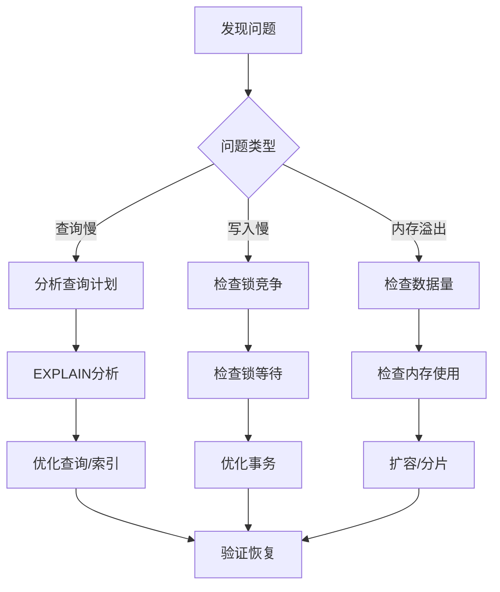

### 监控关键指标

```yaml
# Prometheus 告警规则
groups:
  - name: graphdb-alerts
    rules:
      - alert: GraphDB_HighMemory
        expr: graphdb_memory_usage_bytes > 8589934592  # 8GB
        for: 5m
        labels:
          severity: warning
        annotations:
          summary: "图数据库内存使用率高"
          
      - alert: GraphDB_SlowQuery
        expr: graphdb_query_duration_seconds > 1
        for: 5m
        labels:
          severity: warning
        annotations:
          summary: "图数据库查询慢"
          
      - alert: GraphDB_ConnectionHigh
        expr: graphdb_connections_active > 1000
        for: 5m
        labels:
          severity: warning
        annotations:
          summary: "图数据库连接数高"
```

---

## 与其他板块的关系

- Neo4j 深度篇见「[Neo4j 图数据库](./Neo4j图数据库.md)」；
- 图计算（Spark GraphX）见「[Apache Spark 批处理](./ApacheSpark批处理.md)」；
- 存储底层（RocksDB）见「[RocksDB 与嵌入式 KV 存储](./RocksDB与嵌入式KV存储.md)」；
- 知识图谱场景见「[大模型板块](../../大模型/README.md)」；
- 风控场景见「[场景设计](../../场景设计/README.md)」。

> 一句话：**图库 = 无索引邻接（遍历快）+ 点边模型（关系属性化）+ 图查询语言（Cypher/nGQL）；选型先看「规模（单机→Neo4j，超大规模→NebulaGraph）」，再定「部署形态（存算分离 vs 外部存储）」，最后守「按查询建模 + 索引 + 深度限制 + 超级节点治理」**。