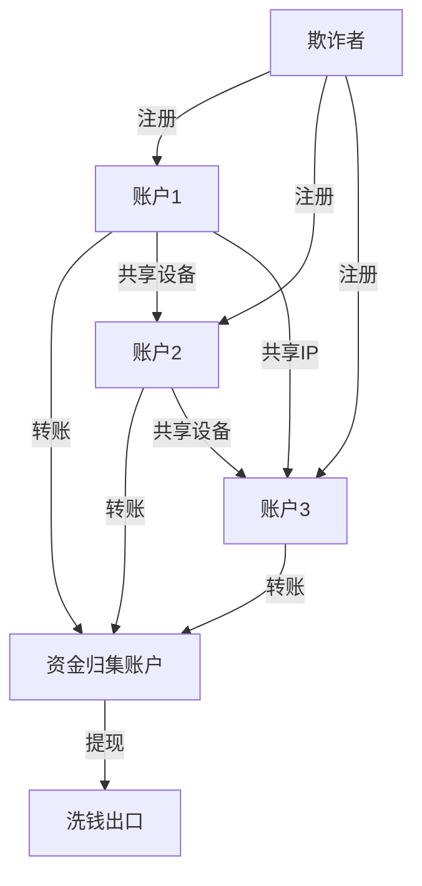
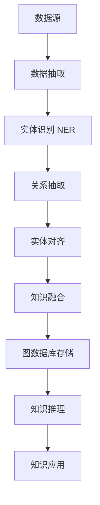
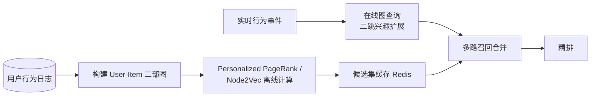
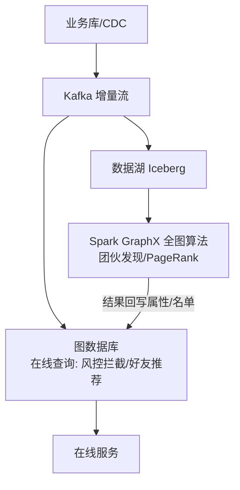

# 图数据库生态对比（Neo4j / NebulaGraph / JanusGraph / ArangoDB）

> 图数据库是**「关系优先」的数据库**：把实体建模为点（Vertex）、关系建模为边（Edge），遍历查询（几度人脉/最短路径/社群）比关系库 Join 高效几个数量级。主流产品：**Neo4j（Cypher 事实标准，单机为主）**、**NebulaGraph（国产分布式图库）**、**JanusGraph（分布式 + 外部存储）**、**ArangoDB（多模型）**、**TigerGraph（商业）**。相比关系库（Join 深链爆炸）、ES（无图语义），图库以「**原生图存储 + 图遍历算法 + 图查询语言**」成为社交/风控/推荐/知识图谱底座。本篇按「解决的问题 → 原理 → 对比 → 选型关注点」拆解。

---

## 一、要解决的问题

| 痛点 | 说明 |
|------|------|
| 多跳关系查询 | 好友的好友的好友、资金链路 N 跳——SQL Join 指数级爆炸 |
| 关系语义表达 | 关系有方向/类型/属性（转账金额、认识时间） |
| 图算法 | 最短路径/社群发现/PageRank 需要图计算能力 |
| 实时路径分析 | 风控/反欺诈需要毫秒级路径遍历 |
| 动态建模 | 实体关系频繁变化（社交图谱） |

> 核心认知：**图库的杀手锏是「遍历」（Traversal）**——从某点沿边找邻居，局部遍历与全库规模无关（数据 10 倍，查询依然快）；而关系库是「索引+Join」，深链即灾难。

---

## 二、核心原理

### 2.1 图数据模型

```
Vertex（点）：用户/订单/商品/账户（+ 标签/属性）
Edge（边）：关注/转账/购买（有向 + 类型 + 属性）
Path（路径）：A→B→C 的边序列（遍历结果）

存储核心：无索引邻接（Index-free Adjacency）
  → 每个点直接指向邻居的物理地址（双向指针）
  → 遍历不查索引，沿指针跳转（这是快的本质）
```

### 2.2 为什么关系库做多跳很慢（数学本质）

```
假设每跳平均 10 个邻居，6 跳查询：
  图库：沿指针走 10^6 次局部遍历（物理跳转）
  关系库：每跳一次 JOIN（索引+物化中间结果）
    → 中间结果集指数膨胀（10^6 行）
    → JOIN 成本 ≈ 中间结果 × 索引查询

关键差异：
  图库是"沿边走"（输出小：路径上少量节点）
  关系库是"集合运算"（中间结果集膨胀）

关系库深链优化的手段（都有限）：
  递归 CTE（WITH RECURSIVE，PostgreSQL/MySQL 8.0）
  邻接表 + 应用层多跳查询（N+1 查询）
  预先物化路径表（只能覆盖固定深度）
```

### 2.3 图查询语言

| 语言 | 产品 | 特点 |
|------|------|------|
| Cypher | Neo4j | 声明式模式匹配（`MATCH (a)-[r:FOLLOWS]->(b)`），最流行 |
| nGQL | NebulaGraph | 类 SQL + 图遍历关键字（`GO`/`FETCH`） |
| Gremlin | JanusGraph/TinkerPop | 函数式遍历（跨多图库标准） |
| AQL | ArangoDB | 类 SQL + 图遍历（JSON 风格） |

**Neo4j Cypher 示例**：

```cypher
// 查找 "张三" 的二度好友
MATCH (zhang:User {name:"张三"})-[:FOLLOWS*2]->(friend:User)
RETURN friend.name;

// 最短路径（风控资金链路）
MATCH p = shortestPath((a:Account {id:"A1"})-[:TRANSFER*..5]->(b:Account {id:"B2"}))
RETURN p;

// 社群发现（连通分量）
CALL algo.louvain.stream('User','FOLLOWS', {graph:'huge'})
YIELD nodeId, community
RETURN community, count(*) AS members
ORDER BY members DESC LIMIT 10;

// 条件路径（金额过滤）
MATCH p = (a:Account {id:"A1"})-[:TRANSFER*1..3 {amount: {gte: 10000}}]->(b:Account)
RETURN p;
```

### 2.4 存储与索引

| 产品 | 存储 | 索引 |
|------|------|------|
| Neo4j | 原生图存储（页式，点边物理邻接） | 属性索引（B-Tree）+ 全文 |
| NebulaGraph | KV 存储（RocksDB，多点多边） | Tag/Edge 索引（属性条件过滤） |
| JanusGraph | 外部（HBase/Cassandra/BigTable）+ ES 索引 | 复合/混合索引（查询必须有索引或全扫） |
| ArangoDB | 文档存储 + 图索引（边集合） | 持久化索引 |

### 2.5 无索引邻接（Index-free Adjacency）深入

```
Neo4j 原生存储设计：
  每个节点记录 = 指向首条关系的指针
  每条关系记录 = 双向链表（prev/next 指针）
  → 找邻居 = 指针跳转（O(度)），无全局索引查询

对比键值型图库（NebulaGraph/JanusGraph）：
  存储底层是 KV（RocksDB/HBase）
  点/边存为 KV 记录
  遍历 = KV 查询（也很快，但比指针跳转略多开销）
  → 分布式扩展性优先，牺牲一点遍历极致性能

结论：单机原生图库（Neo4j）遍历最极致；
     分布式图库（NebulaGraph）胜在水平扩展
```

### 2.6 分布式架构

| 产品 | 架构 |
|------|------|
| Neo4j | 单机为主（写），Causal Cluster 读副本 + 分片（企业版） |
| NebulaGraph | **存算分离**：Meta（元数据，Raft）+ Storage（分片，Raft）+ Query（无状态） |
| JanusGraph | 存储层分布式（HBase/Cassandra）+ 计算层多实例 |
| ArangoDB | 分片（Hash/一致性哈希）+ 主动故障转移（自动） |

### 2.7 分布式图库的分片与遍历问题

```
分片策略：按点 ID 哈希/范围分片到 Storage 节点
  → 边可能跨分片（全局边 vs 本地边）

跨分片遍历（NebulaGraph）：
  Storage 按分片并行执行子图遍历（每个分片负责自己点）
  结果汇总到 Query 层合并
  → 分片间通信成本随跳数增加

设计原则：
  高频遍历路径尽量"分片内完成"（按业务关联分片）
  跨分片深链遍历性能下降 → 控制深度
```

---

## 三、核心特性

| 特性 | Neo4j | NebulaGraph | JanusGraph | ArangoDB |
|------|-------|-------------|------------|----------|
| 语言 | Cypher | nGQL | Gremlin | AQL |
| 部署 | 单机为主 | 分布式（存算分离） | 分布式（外部存储） | 单机/分片 |
| 性能 | 单机遍历最快 | 分布式扩展强 | 依赖底层存储 | 中 |
| 写入扩展 | 弱（单机写） | 强 | 强 | 中 |
| 事务 | ACID（单机强） | 分区级事务 | ACID（底层保证） | 单文档/图事务 |
| 社区/文档 | 最成熟 | 国内活跃 | 维护较缓 | 活跃 |
| 生态 | Bolt 驱动/可视化最强 | 工具链新 | TinkerPop 生态 | 多模型 |
| 适用 | 通用/单机图 | 超大规模/高写 | Hadoop 生态图 | 多模型（图+文档） |

### 3.1 图算法能力

```
内置图算法（Neo4j GDS / NebulaGraph）：
  路径类：最短路径、全对最短路径、A*
  中心性：PageRank、Betweenness、Degree
  社群发现：Louvain、标签传播（LPA）、连通分量
  相似度：Jaccard、余弦、节点相似
  拓扑：三角形计数、聚类系数

场景：
  风控：环路检测（洗钱）、连通分量（团伙）
  推荐：Personalized PageRank（相似用户）
  运营：Louvain 社群（用户群体划分）
```

---

## 四、图库 vs 关系库 vs 图计算平台

| 维度 | 图数据库 | 关系库（MySQL） | 图计算引擎（Spark GraphX/JanusGraph） |
|------|----------|-----------------|--------------------------------------|
| 查询 | 在线实时遍历 | Join 深链爆炸 | 离线全图批计算 |
| 数据规模 | 十亿级边 | 亿级行 | 千亿级 |
| 实时性 | 毫秒级 | 毫秒级（单跳） | 分钟~小时 |
| 场景 | 实时风控/推荐/社交 | 业务主数据 | 全图分析（PageRank 全量） |
| 定位 | 关系优先 | 通用 | 图分析 |

**选型关注点**：在线单点/路径查询 → **图数据库**；全图批量算法 → **图计算引擎**；两者常配合（图库存图、Spark 跑全图分析）。

### 4.1 何时真的需要图数据库

```
适合图库的信号：
  ① 查询本质是"沿关系遍历"（几度人脉/路径/环）
  ② 关系本身有属性（金额/时间/类型）且参与过滤
  ③ 数据规模大 + 实时遍历需求（风控毫秒级）
  ④ 关系频繁变化（社交/图谱动态更新）

不适合图库：
  ① 只是主数据存储（用户表/订单表，JOIN 深度 ≤2）
  ② 分析型聚合（GROUP BY 大表）——图库不是分析引擎
  ③ 全文搜索/模糊检索（用 ES）
  ④ 超大规模全图批处理（用 Spark GraphX）

常见误区："有社交关系就用图库"
  实际：好友列表展示 → 关系库/Redis 就够
       好友的好友链/推荐/社群 → 才需要图库
```

---

## 五、生产实践

### 5.1 关键实践

| 实践 | 说明 |
|------|------|
| 建模 | 先定「查询模式」再建模（点/边/方向/属性）——图建模跟着查询走 |
| 索引 | 高基数属性（ID/手机号）建索引；避免全图扫描 |
| 数据导入 | 批量导入（Neo4j admin import / Nebula Importer）而非逐条写 |
| 深链控制 | 遍历深度受限（*..5）防爆炸；热点场景限深度+缓存 |
| 监控 | 查询超时/慢遍历/内存（遍历吃内存） |
| 高可用 | Neo4j Causal Cluster；Nebula 三副本（Raft） |

### 5.2 建模方法论

```
① 明确查询模式：列出 Top 查询（广度/深度/过滤条件）
② 实体建模：名词 → 点（User/Order/Product）
③ 关系建模：动词 → 边（FOLLOWS/PURCHASED/TRANSFER）
④ 属性取舍：高频过滤属性放点/边属性；低频可外置
⑤ 方向设计：边方向影响遍历方向（有向 vs 无向，双向边）
⑥ 索引设计：按查询的"入口点"建索引（用户 ID 是入口）

反例（建模错误）：
  把关系存成属性（好友列表 JSON）→ 无法遍历
  点/边不分（状态也建成边）→ 查询复杂
  无入口索引 → 全图扫描
```

### 5.3 常见坑

- **全图扫描查询**：无索引的 `WHERE` 条件 = 灾难（图库不是分析库）；
- **深链无限制**：`*..N` 不设上限 → 查询超时/内存爆；
- **写放大**：边多时写入/更新频繁（图库写热点）→ 评估写入量级；
- **数据迁移**：图库与业务库双写（先图库后主库 or 异步）——事务边界要设计好；
- **超大度数点**：超级节点（粉丝千万）遍历爆炸 → 限制出度/分层建模；
- **图库当数据库用**：把图库当主存储存业务主数据 → 应用层复杂（合理分工：关系库存主数据，图库存关系）。

### 5.4 超级节点处理（超深度实践）

```
问题：一个点有千万条边（明星用户/大账户）
  → 遍历该点 = 扫描全部边 = 爆炸

处理：
  ① 限制遍历深度 + 采样（*1..2 + LIMIT）
  ② 边属性过滤（按时间/类型裁剪）
  ③ 分层建模（粉丝团子图）
  ④ 预计算热门路径（缓存）
```

---

## 六、选型速查

| 需求 | 首选 | 备选 |
|------|------|------|
| 通用图查询（Cypher） | Neo4j | — |
| 超大规模 + 高并发写 | NebulaGraph | JanusGraph |
| Hadoop 生态 | JanusGraph | NebulaGraph |
| 多模型（图+文档） | ArangoDB | — |
| 知识图谱 | Neo4j | NebulaGraph |
| 全图离线分析 | Spark GraphX | 图库 + 批计算 |
| 实时风控路径 | Neo4j（单机规模够） | NebulaGraph（超大） |

### 6.1 决策树

```
数据量 < 百亿边 + 单机够 → Neo4j（最省心，Cypher 生态）
数据量超大 + 高并发写 → NebulaGraph（存算分离）
已有 Hadoop 栈（HBase 存储） → JanusGraph
需要图+文档混合模型 → ArangoDB
全图批量算法 → Spark GraphX / GDS 离线
知识图谱 + NLP → Neo4j（生态成熟）
```

---

## 图数据库产品深度对比

### Neo4j vs JanusGraph vs TigerGraph vs NebulaGraph vs ArangoDB

| 维度 | Neo4j | JanusGraph | TigerGraph | NebulaGraph | ArangoDB |
|------|-------|------------|------------|-------------|----------|
| 架构 | 单机/集群 | 存储计算分离 | 分布式 | 存算分离 | 单机/分片 |
| 存储 | 原生图存储 | 外部（HBase/Cassandra） | 原生图存储 | KV（RocksDB） | 文档存储 |
| 查询语言 | Cypher | Gremlin | GSQL | nGQL | AQL |
| 图算法 | GDS（社区版受限） | TinkerPop 算法 | 内置 50+ 算法 | 内置算法 | 内置算法 |
| 分片 | 企业版支持 | 支持 | 支持 | 支持 | 支持 |
| ACID | 强（单机） | 依赖底层 | 支持 | 分区级事务 | 单文档事务 |
| 许可证 | Community/Enterprise | Apache 2.0 | 商业 | Apache 2.0 | Apache 2.0 |
| 社区活跃度 | 最高 | 中 | 中 | 国内高 | 中 |

### Property Graph vs RDF Graph

| 维度 | Property Graph | RDF Graph |
|------|----------------|-----------|
| 数据模型 | 点+边+属性 | 三元组（SPO） |
| 查询语言 | Cypher/nGQL/Gremlin | SPARQL |
| Schema | 可选（灵活） | 强制（RDFS/OWL） |
| 推理 | 无（需应用层） | 有（RDFS/OWL 推理） |
| 适用 | 业务关系分析 | 语义网/知识图谱 |
| 产品 | Neo4j/NebulaGraph | Virtuoso/GraphDB |

### 图查询语言对比

| 语言 | 语法风格 | 示例（查找二度好友） |
|------|----------|----------------------|
| Cypher | 模式匹配 | `MATCH (a)-[:FOLLOWS*2]->(b) RETURN b` |
| nGQL | SQL+GO | `GO 2 STEPS FROM "张三" OVER FOLLOWS YIELD $$.name` |
| Gremlin | 函数式 | `g.V().has('name','张三').out('FOLLOWS').out('FOLLOWS').name` |
| GSQL | SQL-like | `SELECT t2.name FROM (SELECT * FROM Friends MATCH (a)(b) WHERE a.id=1)` |
| AQL | JSON-like | `FOR v IN 2..2 OUTBOUND '张三' FOLLOWS RETURN v.name` |

---

## 图算法能力深入

### 核心图算法分类

| 类别 | 算法 | 说明 | 应用场景 |
|------|------|------|----------|
| 路径 | 最短路径（Dijkstra） | 两点间最短路径 | 导航/物流 |
| 路径 | A* | 启发式最短路径 | 地图导航 |
| 路径 | 全对最短路径 | 所有点对间最短路径 | 网络分析 |
| 中心性 | PageRank | 节点重要性 | 推荐/搜索 |
| 中心性 | Betweenness | 中介中心性 | 关键节点识别 |
| 中心性 | Degree | 度中心性 | 影响力分析 |
| 社群 | Louvain | 社区发现 | 用户分群 |
| 社群 | 标签传播（LPA） | 半监督社区 | 社区划分 |
| 社群 | 连通分量 | 连通子图 | 团伙识别 |
| 相似度 | Jaccard | 集合相似度 | 推荐 |
| 相似度 | 余弦相似度 | 向量相似度 | 推荐 |
| 拓扑 | 三角形计数 | 聚类系数 | 社交分析 |

### PageRank 算法详解

```
PageRank 原理：
  每个节点的 PR 值 = 其他节点指向它的 PR 值之和
  PR(v) = (1-d) + d * Σ(PR(u)/deg(u))
  其中 d = 阻尼因子（通常 0.85）

迭代过程：
  ① 初始化：所有节点 PR = 1/N
  ② 迭代：每个节点根据邻居 PR 更新
  ③ 收敛：PR 值变化小于阈值时停止
  ④ 输出：PR 值排序 → 节点重要性排名

应用场景：
  推荐系统：识别重要商品/用户
  搜索排序：网页重要性排名
  社交网络：影响力用户识别
```

---

## 图数据库在欺诈检测中的应用

### 欺诈检测场景



### 欺诈检测图查询

```cypher
// 检测共享设备的账户集群
MATCH (a:Account)-[:USES_DEVICE]->(d:Device)<-[:USES_DEVICE]-(b:Account)
WHERE a <> b
WITH d, collect(a) AS accounts
WHERE size(accounts) > 3
RETURN d.device_id, accounts, size(accounts) AS cluster_size
ORDER BY cluster_size DESC

// 检测环形资金链路（洗钱）
MATCH p = (a:Account)-[:TRANSFER*3..6]->(a)
WHERE ALL(r IN relationships(p) WHERE r.amount > 10000)
RETURN p, [r IN relationships(p) | r.amount] AS amounts

// 检测短时间高频交易
MATCH (a:Account)-[r:TRANSFER]->(b:Account)
WHERE r.timestamp > datetime() - duration('PT1H')
WITH a, count(r) AS tx_count, sum(r.amount) AS total_amount
WHERE tx_count > 10 AND total_amount > 100000
RETURN a, tx_count, total_amount
```

---

## 知识图谱构建

### 知识图谱架构



### 知识图谱构建流程

| 阶段 | 说明 | 工具/技术 |
|------|------|-----------|
| 数据抽取 | 从文本/数据库抽取三元组 | SpaCy/NLTK/自定义规则 |
| 实体识别 | 识别实体类型（人/地/物） | NER 模型/BERT |
| 关系抽取 | 识别实体间关系 | 关系抽取模型 |
| 实体对齐 | 不同来源实体合并 | 相似度匹配 |
| 知识融合 | 本体构建+知识融合 | OWL/RDFS |
| 存储 | 图数据库存储 | Neo4j/NebulaGraph |
| 推理 | 基于规则/嵌入的推理 | TransE/规则引擎 |

---

## 图原生存储格式

### 存储格式对比

| 格式 | 说明 | 适用 |
|------|------|------|
| CSR/CSC | 压缩稀疏行/列 | 遍历优化 |
| 邻接列表 | 点→边列表 | 简单存储 |
| 邻接矩阵 | 矩阵表示 | 密集图 |
| RDF 三元组 | SPO 三元组 | 语义网 |
| Property Graph | 点+边+属性 | 业务图 |

### CSR（Compressed Sparse Row）格式

```
CSR 存储结构：
  顶点数组：[0, 2, 5, 7]  // 每个顶点的边起始位置
  边数组：[1, 2, 0, 2, 0, 1, 2]  // 边的目标顶点
  属性数组：[...边属性...]

优势：
  遍历效率高（连续内存访问）
  存储紧凑（压缩稀疏结构）
  适合只读/分析场景

劣势：
  动态更新成本高（需要重建）
  不适合频繁写入场景
```

---

## 图数据库基准测试（LDBC SNB）

### LDBC SNB 测试框架

| 测试类型 | 说明 | 指标 |
|----------|------|------|
| 插入测试 | 批量插入性能 | 插入速率（triples/sec） |
| 交互式短查询 | 简单图查询 | 延迟（ms） |
| 交互式长查询 | 复杂图遍历 | 延迟（ms） |
| 并发测试 | 多并发查询 | 吞吐（queries/sec） |
| 分析测试 | 全图算法 | 执行时间（sec） |

### 主流产品性能参考

| 产品 | 插入速率 | 短查询延迟 | 长查询延迟 |
|------|----------|------------|------------|
| Neo4j | ~100K triples/sec | <1ms | 10~100ms |
| NebulaGraph | ~200K triples/sec | <1ms | 10~50ms |
| JanusGraph | ~50K triples/sec | 1~5ms | 50~500ms |
| TigerGraph | ~150K triples/sec | <1ms | 10~100ms |
| ArangoDB | ~80K triples/sec | 1~5ms | 50~200ms |

---

## 图数据库在社交网络中的应用

### 社交网络图建模

```cypher
// 创建社交网络图
CREATE (alice:User {name: "Alice", age: 25})
CREATE (bob:User {name: "Bob", age: 30})
CREATE (carol:User {name: "Carol", age: 28})
CREATE (alice)-[:FOLLOWS {since: 2020}]->(bob)
CREATE (bob)-[:FOLLOWS {since: 2021}]->(carol)
CREATE (carol)-[:FOLLOWS {since: 2019}]->(alice)
CREATE (alice)-[:LIKES {timestamp: datetime()}]->(post1:Post {content: "Hello"})
```

### 社交网络核心查询

| 查询 | 说明 | Cypher 示例 |
|------|------|-------------|
| 好友推荐 | 朋友的朋友 | `MATCH (a)-[:FOLLOWS]->(b)-[:FOLLOWS]->(c) WHERE NOT (a)-[:FOLLOWS]->(c) RETURN c` |
| 影响力分析 | PageRank | `CALL algo.pageRank.stream('User','FOLLOWS') YIELD nodeId, score` |
| 社区发现 | Louvain | `CALL algo.louvain.stream('User','FOLLOWS') YIELD nodeId, community` |
| 最短路径 | 六度空间 | `MATCH p = shortestPath((a)-[:FOLLOWS*..6]->(b)) RETURN p` |
| 传播分析 | 信息扩散 | `MATCH (a:User)-[:FOLLOWS*1..3]->(b:User) RETURN b` |

---

## 属性图 vs RDF 三元组建模实例对比

以「张三向李四转账 5000 元」为例，看两种模型的建模差异：

```text
属性图（Neo4j/NebulaGraph）：
  (张三:Person)-[:TRANSFER {amount:5000, time:"2026-08-01T10:00"}]->(李四:Person)
  → 边自带属性，转账金额/时间是边的属性，一次遍历即可过滤

RDF 三元组（SPO）：
  <tx001>  <rdf:type>     <Transaction>
  <tx001>  <from>         <张三>
  <tx001>  <to>           <李四>
  <tx001>  <amount>       "5000"^^xsd:decimal
  → 交易本身升格为节点（具体化 Reification），金额拆成独立三元组
```

| 维度 | 属性图 | RDF 三元组 |
|------|--------|-----------|
| 建模直觉 | 关系=边，属性挂点/边上 | 一切成三元组，关系也可作节点 |
| 查询写法 | `MATCH (a)-[t:TRANSFER {amount:>1000}]->(b)` | SPARQL 多跳 BGP 连接 |
| Schema | 可选、渐进演化 | RDFS/OWL 强制本体，支持推理 |
| 推理能力 | 无（应用层实现） | 内建子类/传递/等价推理 |
| 数据交换 | 各方言私有导出 | 标准序列化（Turtle/N-Triples） |
| 适用 | 业务实时图查询（风控/推荐） | 知识图谱/跨机构语义集成 |

选型建议：在线业务图查询选属性图；需要本体推理、标准交换的知识图谱项目选 RDF 或「属性图存储 + RDF 导出」混合。

## GQL 标准（ISO/IEC 39075）与各方言映射

GQL 是 2024 年发布的 ISO 图查询语言标准，融合 Cypher 与 PGSQL（SQL/PGQ），是首个独立于 SQL 的 ISO 图查询语言。

| 概念 | GQL 标准 | Neo4j Cypher | NebulaGraph nGQL |
|------|---------|--------------|------------------|
| 匹配模式 | `MATCH (p:Person)-[:KNOWS]->(q)` | 同源（Cypher 贡献最大） | `GO FROM ... OVER KNOWS` |
| 变长路径 | `-[:KNOWS*1..3]->` | 支持（含 shortestPath） | `GO 1 TO 3 STEPS` |
| 过滤 | `WHERE q.age > 30` | WHERE | WHERE / YIELD 组合 |
| 投影 | `RETURN p.name, q.name` | RETURN | YIELD |
| 聚合分组 | `GROUP BY / count()` | WITH + count() | GROUP BY |
| 图模式插入 | `INSERT (a)-[:E]->(b)` | CREATE/MERGE | INSERT VERTEX/EDGE |

```cypher
// GQL 风格（与 Cypher 几乎一致）：二度好友且排除已关注
MATCH (me:User {name:'张三'})-[:FOLLOWS*2..2]->(fof:User)
WHERE NOT (me)-[:FOLLOWS]->(fof) AND fof <> me
RETURN DISTINCT fof.name LIMIT 20;
```

趋势判断：新项目优先按 GQL 兼容度评估产品——Cypher 系（Neo4j/SAP HANA/Aura）迁移成本最低；Gremlin/TinkerPop 社区在收缩；nGQL/AQL 保持私有但提供 GQL/Cypher 兼容层。

## 图算法工程化应用（风控团伙识别 / 推荐召回）

### 场景一：风控团伙识别流水线

```text
离线全图计算（每日 T+1）：
  Step1 构图：账户-设备-IP-银行卡 多关系合并图
  Step2 Louvain 社群发现 → 候选团伙簇
  Step3 团伙特征提取：密度/共享设备数/资金闭环率
  Step4 高危簇写入风险名单库（HBase）

在线实时补充：
  新注册/新交易触发毫秒级查询：
    MATCH (a:Account {id:$id})-[:USES_DEVICE|SHARES_IP*1..2]-(x:Account)
    WHERE x.risk_level >= 3 RETURN count(x)
  → 命中高危邻域则拦截或加验
```

### 场景二：推荐召回



工程要点：算法跑在 Spark GraphX/GDS（离线全图）+ 图库（在线增量查询）双轨；离线结果回灌图库存为节点属性（如 `community_id`、`pagerank_score`），供在线过滤直接命中。

## 图数据导入批量加载策略

| 方式 | 工具 | 吞吐量级 | 适用 |
|------|------|---------|------|
| CSV admin-import | Neo4j `neo4j-admin database import` | 千万~亿级/小时 | 初始全量导入（停机窗口内最快） |
| 并发 LOAD CSV | neo4j-shell/驱动批量 UNWIND | 百万/小时 | 小规模增量 |
| Nebula Importer | nebula-importer（YAML 配置并发） | 十万行/s | 分布式并行导入 |
| Spark Connector | spark-nebula / APOC.periodic.iterate | 大规模 | 从数仓/Hive 直接入图 |
| Kafka 流式写入 | Flink sink / 自研 consumer | 实时增量 | CDC 双写链路 |

```text
批量导入优化清单：
① 先建数据后建索引：索引在导入完成后统一创建（快 5~10 倍）
② 关闭/延后唯一性约束校验，导入完再启用
③ 按 ID 排序后导入：同 ID 相邻写入减少页分裂
④ 批大小 5k~50k 条/批，UNWIND 参数化提交而非逐条
⑤ 导入期间禁用查询负载，避免缓存抖动
⑥ 全量导入后 ANALYZE/统计信息更新，让 CBO 有据可依
```

## 图数据库容量估算方法

```text
存储估算公式：
  点空间 ≈ 点数 × (记录头 15B + Σ属性字节) × 副本数 × 膨胀系数 1.3
  边空间 ≈ 边数 × (双向指针 34B + Σ属性字节) × 副本数 × 1.3
  索引   ≈ 被索引属性基数 × 平均键长 × 1.5

示例：10 亿用户 + 200 亿关注边 + 每点 5 个属性
  点：1e9 × ~100B × 3副本 × 1.3 ≈ 400GB
  边：2e10 × ~40B × 3 × 1.3 ≈ 3TB
  内存：活跃子图常驻 = BlockCache ≥ 热点边数据的 10~20%

内存估算（Neo4j 经验）：
  heap = 页缓存外的执行内存（遍历状态、事务）
  pagecache 目标 = 热点图数据全量（装不下就装热点子图）
```

| 规模档位 | 建议 |
|----------|------|
| ≤ 5000 万点/亿级边 | 单机 Neo4j（64GB 内存足够） |
| 亿级点/百亿边 | NebulaGraph/JanusGraph 分布式 |
| 千亿边 | 图计算引擎为主 + 图库存热点子图 |

## 实时图查询 vs 离线图计算分工

| 维度 | 实时图查询（图库） | 离线图计算（GraphX/GDS） |
|------|-------------------|--------------------------|
| 响应 | 毫秒~秒 | 分钟~小时 |
| 规模 | 单查询局部遍历（限深度） | 全图迭代算法 |
| 典型算子 | 最短路径/N 跳邻居/模式匹配 | PageRank/Louvain/连通分量/WCC |
| 数据新鲜度 | 写入即可见 | T+1 快照 |
| 成本特征 | 高配内存常驻 | 弹性批资源按需起 |



分工原则：**「在线查局部，离线算全局」**——凡是需要全图多轮迭代的算法放离线，把结论（标签/分数/名单）物化回图库供在线毫秒级使用；在线只做深度受限的局部遍历。

> 落地节奏建议：先实时查询场景（价值最直接）→ 再批量导入链路 → 最后引入全图算法与容量治理。

---

## 七、与其他板块的关系

- Neo4j 深度篇见「[Neo4j 图数据库](./Neo4j图数据库.md)」；
- 图计算（Spark GraphX）见「[Apache Spark 批处理](./ApacheSpark批处理.md)」；
- 存储底层（RocksDB）见「[RocksDB 与嵌入式 KV 存储](./RocksDB与嵌入式KV存储.md)」；
- 知识图谱场景见「[大模型板块](../../大模型/README.md)」；
- 风控场景见「[场景设计](../../场景设计/README.md)」。

> 一句话：**图库 = 无索引邻接（遍历快）+ 点边模型（关系属性化）+ 图查询语言（Cypher/nGQL）；选型先看「规模（单机→Neo4j，超大规模→NebulaGraph）」，再定「部署形态（存算分离 vs 外部存储）」，最后守「按查询建模 + 索引 + 深度限制 + 超级节点治理」**。