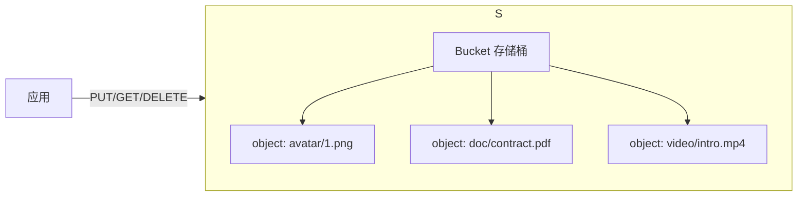

# 对象存储（MinIO / 云 OSS）

> 头像、商品图、合同 PDF、音视频——这些「文件」不适合放 MySQL（慢、占连接），也不适合放本地磁盘（难扩展、难高可用）。本文讲清 **对象存储是什么、S3 协议、MinIO 怎么用**，以及和云厂商 OSS 的选型。
> 开源参考：[minio/minio](https://github.com/minio/minio)（Go，AGPLv3，高性能 S3 兼容对象存储）。**诚实提示：MinIO 官方仓库已声明「不再维护（NO LONGER MAINTAINED）」，转向商业版 AIStor；社区版仍以源码形式分发。生产选型需知悉此风险，下文给出替代方案。**

---


## 〇、本体介绍（它是什么 / 适用场景 / 核心概念）

**它是什么**：对象存储是以「对象（数据+元数据+唯一 Key）」为单元、扁平命名空间的存储形态，专为图片/视频/日志/备份等非结构化数据设计。MinIO 是高性能**开源、S3 兼容**的分布式对象存储；云 OSS（阿里云 OSS、AWS S3）是公有云托管版本。

**解决什么痛点**：NAS/块存储不适合海量小文件与无限扩展；对象存储天然扁平、无限扩容、HTTP 可达、按 Key 寻址。MinIO 让企业可私有化自建、完全兼容 S3 API，数据不出内网。

**核心概念**：Bucket（存储桶）、Object（对象，含 Key/Data/Meta）、S3 协议（事实标准）、Endpoint/AccessKey/SecretKey、纠删码（Erasure Coding）、分片上传（Multipart）、预签名 URL、服务端加密（SSE）、版本控制、生命周期。

**适用场景**：图片/视频存储、文件服务、数据湖底座、备份归档、AI 训练数据。
**不适用**：需要频繁随机改写的块设备场景（如数据库文件）。

---

## 一、什么是对象存储

对象存储（Object Storage）以 **「对象 = 数据 + 元数据 + 唯一 Key」** 方式存文件，通过 HTTP API 访问，无限水平扩展，适合非结构化数据（图片 / 视频 / 文档 / 备份）。



对比：

| 存储类型 | 适合 | 例子 |
|----------|------|------|
| 块存储 | 操作系统盘、数据库卷 | 云硬盘 EBS |
| 文件存储 | 共享目录、NAS | NFS |
| **对象存储** | 图片 / 视频 / 文档 / 备份 | **S3 / MinIO / OSS** |

---

## 二、S3 协议：事实标准

AWS S3 的 API 已成对象存储**事实标准**。只要兼容 S3，就能用同一套 SDK / 工具（`aws-cli`、`s3cmd`、`mc`）操作任意实现。

核心概念：

- **Bucket（桶）**：顶层命名空间，全局唯一。
- **Object（对象）**：`bucket/key`，key 即路径（如 `avatar/1.png`）。
- **Region（区域）**：数据物理位置。
- **ACL / Policy**：访问控制。
- **Multipart Upload**：大文件分片上传。

---

## 三、MinIO 详解

### 3.1 定位与特点

- 高性能、**S3 兼容**的对象存储，Go 编写。
- 部署灵活：裸机 `go install`、Docker、Kubernetes（Operator / Helm）。
- 内置 Web 控制台（MinIO Console）、`mc` 客户端。
- 适合 AI / 分析 / 大规模数据管道。

### 3.2 部署（Docker 一行起）

```bash
docker run -d -p 9000:9000 -p 9001:9001 \
  -e MINIO_ROOT_USER=minioadmin \
  -e MINIO_ROOT_PASSWORD=minioadmin \
  minio/minio server /data --console-address ":9001"
```

- `9000`：S3 API 端口；`9001`：Console 端口。
- 默认凭据 `minioadmin`（生产务必改）。

### 3.3 客户端操作（mc）

```bash
mc alias set local http://localhost:9000 minioadmin minioadmin
mc mb local/avatars          # 建桶
mc cp ./1.png local/avatars/1.png
mc ls local/avatars
```

### 3.4 Java SDK（兼容 S3）

```java
S3Client s3 = S3Client.builder()
    .endpointOverride(URI.create("http://localhost:9000"))
    .credentialsProvider(StaticCredentialsProvider.create(
        AwsBasicCredentials.create("minioadmin", "minioadmin")))
    .region(Region.US_EAST_1)
    .build();
s3.putObject(PutObjectRequest.builder().bucket("avatars").key("1.png").build(),
             RequestBody.fromFile(Paths.get("1.png")));
```

### 3.5 生产要点

- **分布式模式（Erasure Code）**：多节点部署，数据分片 + 校验，容忍多盘 / 节点故障。
- **高可用**：MinIO 本身无单点，靠多节点 + 负载均衡（前面挂 Nginx / SLB）。
- **生命周期**：配置过期删除 / 转冷存储，控成本。
- **安全**：桶策略最小权限；HTTPS；服务端加密（SSE）。

> ⚠️ **维护风险提示**：MinIO 官方仓库已声明停止维护、转向 AIStor 商业发行版，社区版仅源码分发。新项目若需长期支持，建议评估替代（见下文）。

### 3.6 替代 / 同类方案

| 方案 | 说明 |
|------|------|
| **云厂商 OSS**（阿里 OSS / 腾讯 COS / AWS S3 / 华为 OBS） | 全托管、SLA 高、免运维，按量付费，**生产首选** |
| **Ceph RGW** | 自建统一存储（块/文件/对象），重但能力强 |
| **SeaweedFS** | 轻量、高性能、易部署的自建对象存储 |
| **Garage** | Rust 写的轻量 S3 兼容分布式存储 |
| **JuiceFS** | 文件系统语义对象存储（底层用 S3） |

---

## 四、MinIO 自建 vs 云 OSS 选型

| 维度 | MinIO 自建 | 云 OSS（阿里/腾讯/AWS） |
|------|-----------|--------------------------|
| 运维成本 | 高（自己管集群/监控/扩容） | 低（全托管） |
| 可用性 SLA | 自己保障 | 99.9%+ 官方保障 |
| 成本模型 | 硬件 + 人力 | 按量付费（存储 + 流量） |
| 合规 / 数据不出境 | ✅ 数据完全自持 | 需确认区域 |
| 扩展性 | 手动扩容 | 近乎无限 |
| 适用 | 私有云 / 数据敏感 / 内网 | 公网业务 / 快速上线 |

**结论**：公网业务、要省心 → 直接上云 OSS；内网 / 数据不出境 / 成本敏感且有运维能力 → MinIO 或同类自建。无论哪种，**都走 S3 协议**，未来迁移成本低。

---

## 五、常见坑

1. **直接把文件存 MySQL / 本地磁盘**：大文件拖慢 DB、本地盘难扩展 → 用对象存储 + DB 只存 URL。
2. **URL 直接暴露**：公开读风险 → 用**预签名 URL（Presigned URL）**临时授权下载 / 上传。
3. **大文件不分片**：超过限制上传失败 → 用 Multipart Upload。
4. **桶公开写**：被恶意刷文件 → 桶策略最小权限 + 服务端校验文件类型。
5. **没做 CDN**：对象存储公网带宽贵且慢 → 前面挂 CDN 加速静态资源。
6. **忽略维护风险**：MinIO 已停维护，新项目评估替代或商业支持。

---

## 面试高频问题（20+ 条）

1. **对象存储核心概念？** Bucket（存储桶）、Object（对象=Key+Data+Meta）、S3 协议（事实标准）、Endpoint/AccessKey/SecretKey。扁平命名空间，按 Key 寻址。

2. **MinIO 是什么？** 高性能开源、S3 兼容的分布式对象存储，单二进制部署，Go 编写，支持私有化、K8s 原生，AGPL v3 + 商业许可。

3. **MinIO 如何保证数据安全？** 传输 TLS/HTTPS；访问控制 AccessKey+SecretKey + IAM Policy；服务端加密 SSE-S3/SSE-C；集群纠删码容错；版本控制防误删；审计日志。

4. **纠删码（Erasure Coding）原理？** 对象切分为 N 数据块 + M 校验块，分散到多节点；损坏节点/盘 ≤ M 时可自动重建。相比三副本，存储效率更高（如 12+4 容忍 4 盘坏）。

5. **MinIO 集群最少几节点？** 生产分布式至少 4 节点（或 4 块盘）。基于纠删码实现冗余，支持 NGINX/HAProxy 负载均衡。

6. **大文件上传失败如何处理？** 分片上传（Multipart，S3 兼容）：initiateMultipartUpload 拿 uploadId → 逐片 uploadPart（每片 5MB~5GB）→ completeMultipartUpload 合并；失败只重传该片，支持断点续传。

7. **单次/分片上传大小限制？** 单次 PUT 最大 5GB；分片上传单对象最大 5TB（≤10000 片）。>5MB 建议分片保证稳定。

8. **Bucket 访问策略？** private（默认，需认证）、public-read（公开读）、public-read-write（不推荐）、自定义 IAM Policy 精细化控制。写操作只经后端，前端不持 SecretKey。

9. **预签名 URL 作用？** 后端生成带过期时间的临时访问链接（getPresignedObjectUrl），前端凭此直传/直下，避免暴露 AK 且无需长期权限。

10. **MinIO 自建 vs 阿里云 OSS 怎么选？** 自建：数据不出内网、长期大流量成本低、满足强合规；运维自理、需硬件。OSS：开箱即用、SLA 保障、免运维、按量计费。看合规/成本/运维能力。

11. **MinIO 与阿里云 OSS 最大上传？** MinIO 分片最大 5TB；OSS 分片最大 48.8TB。大文件都用分片 + 断点续传。

12. **数据安全（OSS 侧）？** SSE-OSS/SSE-KMS 加密、RAM 子账号最小权限、HTTPS、防盗链 Referer、IP 黑白名单、访问日志、版本控制。

13. **STS 临时凭证直传？** 前端向后台要 STS Token（短期 AK/SK/Token）→ 前端用临时凭证直传 OSS → 可选回调后端。降低服务器带宽压力，凭证短时效更安全。

14. **一致性模型？** MinIO 基于多数派元数据更新 + 数据分片，提供强一致读写语义；跨集群可用 mc mirror 同步（RPO 秒级）。

15. **版本控制作用？** 开启后对象所有历史版本保留，误删/误改可恢复，配合生命周期清理旧版。

16. **生命周期与分层？** 设 TTL/生命周期规则自动转冷存储或过期删除；MinIO 支持数据分层（热/冷）降本。

17. **MinIO 的 S3 兼容性？** 几乎完整兼容 S3 V2/V4 API，支持 S3 Select，可无缝迁移到 AWS S3 或反之；是测试最广泛的 S3 替代。

18. **IAM 与多租户？** MinIO IAM 兼容 AWS IAM，支持 AD/LDAP/Okta/Keycloak 外部身份，多租户隔离。

19. **适用场景？** 图片/视频存储、文件服务、数据湖底座、备份归档、AI 训练数据、私有化非结构化存储。

20. **不适用场景？** 频繁随机改写的块设备（如数据库文件）、需要文件系统层级语义的场景（应选文件存储/NAS）。

21. **对象锁（Object Lock）？** 支持 WORM（一次写多次读），符合 SEC 17a-4/FINRA 等合规，防篡改/误删。

22. **部署架构要点？** 推荐 JBOD（不组 RAID）、本地 NVMe/SSD、XFS 格式、同构节点 Server Pool；MinIO 自动选 EC 集并均衡条带。

---
## 七、与其他板块的关系

- 和「**基础知识/ES 体系**」：对象存储存原文件，ES 存元数据做检索。
- 和「**架构/企业架构**」：对象存储是「数据中台」非结构化数据底座之一。
- 和「**基础知识/API 网关**」：文件上传常经网关，注意大文件超时 / 限流。
