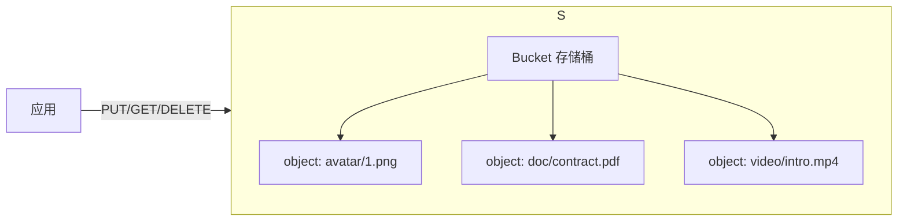
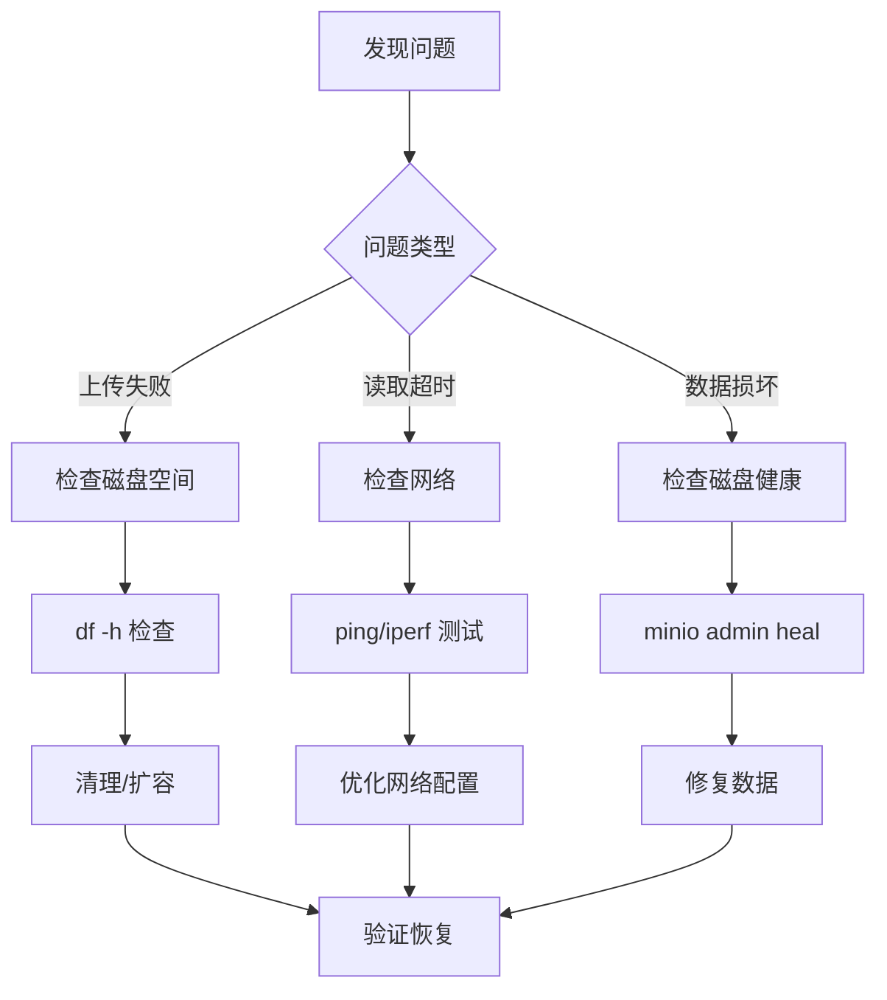
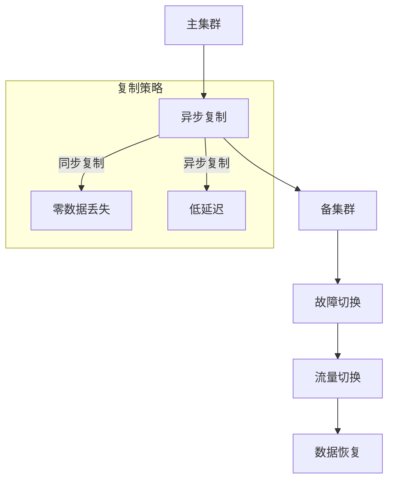
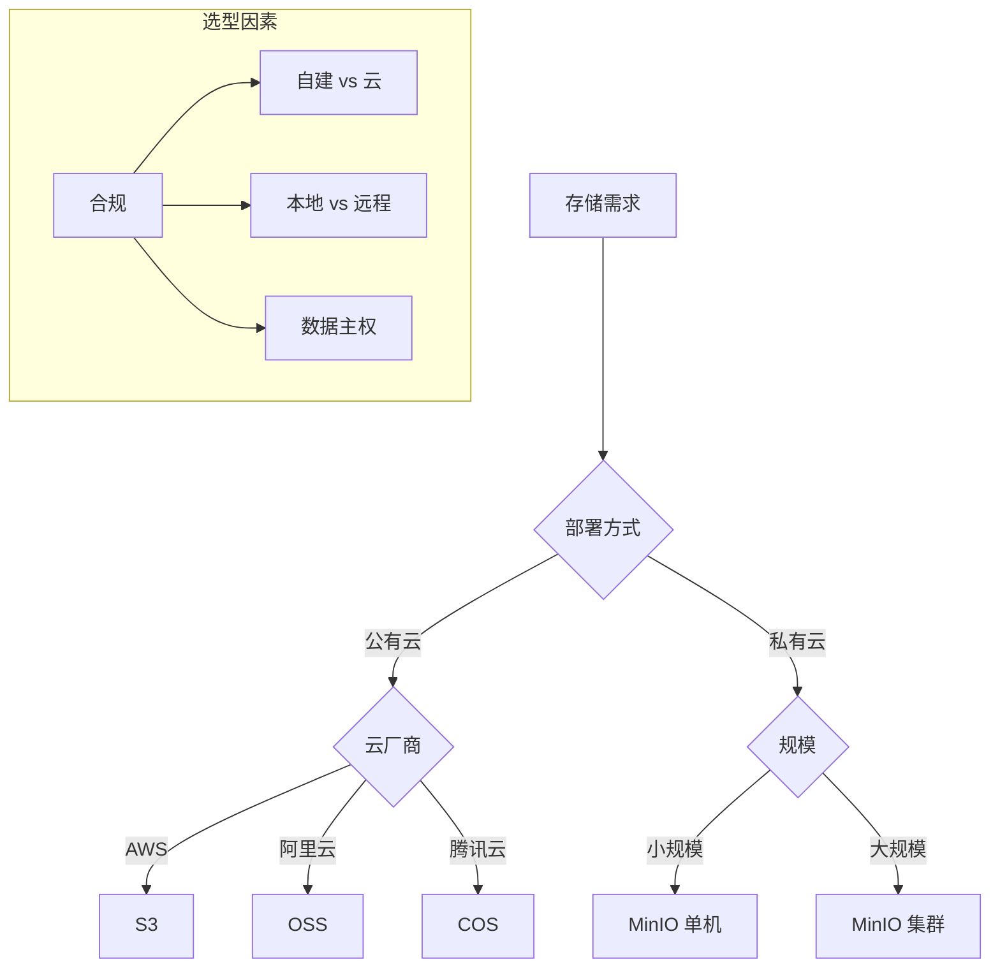
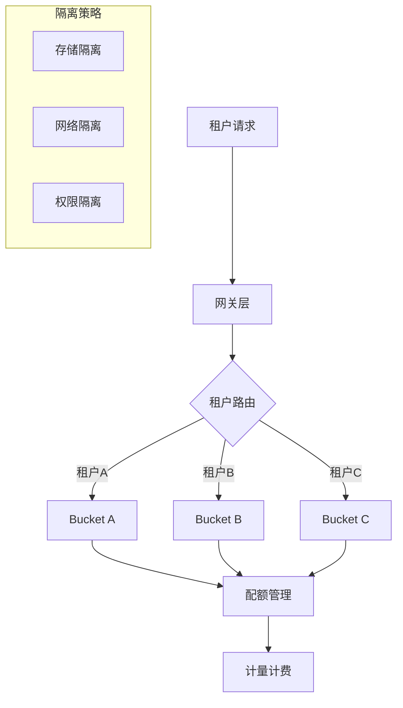
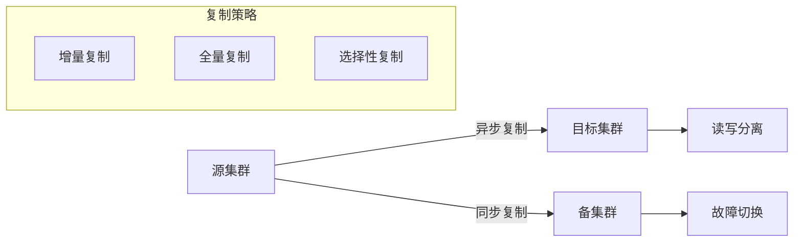
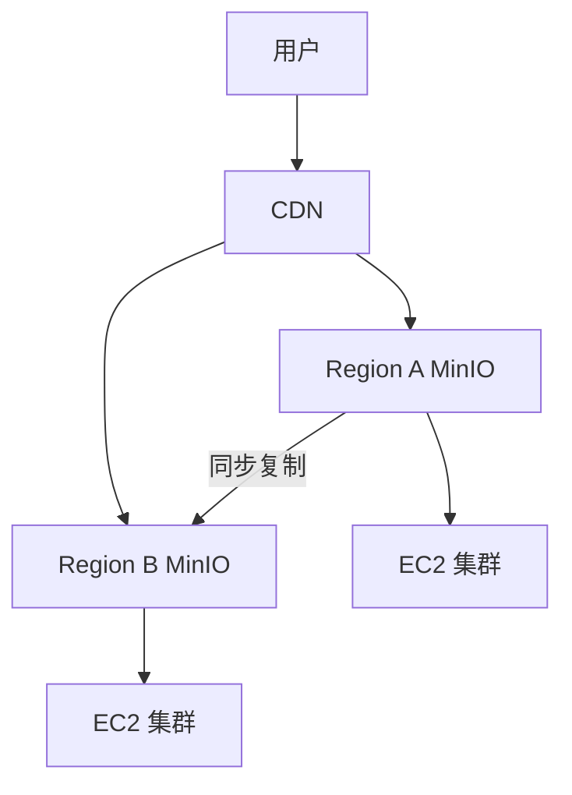
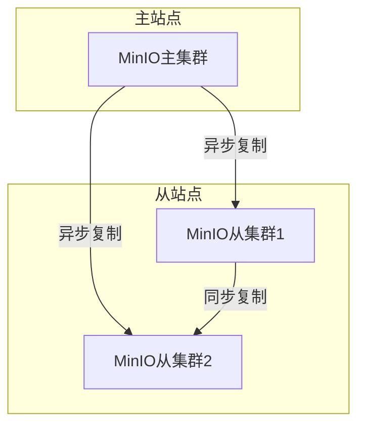

# 对象存储（MinIO / 云 OSS）

> 头像、商品图、合同 PDF、音视频——这些「文件」不适合放 MySQL（慢、占连接），也不适合放本地磁盘（难扩展、难高可用）。本文讲清 **对象存储是什么、S3 协议、MinIO 怎么用**，以及和云厂商 OSS 的选型。
> 开源参考：[minio/minio](https://github.com/minio/minio)（Go，AGPLv3，高性能 S3 兼容对象存储）。**诚实提示：MinIO 官方仓库已声明「不再维护（NO LONGER MAINTAINED）」，转向商业版 AIStor；社区版仍以源码形式分发。生产选型需知悉此风险，下文给出替代方案。**

---


## 〇、本体介绍（它是什么 / 适用场景 / 核心概念）

**它是什么**：对象存储是以「对象（数据+元数据+唯一 Key）」为单元、扁平命名空间的存储形态，专为图片/视频/日志/备份等非结构化数据设计。MinIO 是高性能**开源、S3 兼容**的分布式对象存储；云 OSS（阿里云 OSS、AWS S3）是公有云托管版本。

**解决什么痛点**：NAS/块存储不适合海量小文件与无限扩展；对象存储天然扁平、无限扩容、HTTP 可达、按 Key 寻址。MinIO 让企业可私有化自建、完全兼容 S3 API，数据不出内网。

**核心概念**：Bucket（存储桶）、Object（对象，含 Key/Data/Meta）、S3 协议（事实标准）、Endpoint/AccessKey/SecretKey、纠删码（Erasure Coding）、分片上传（Multipart）、预签名 URL、服务端加密（SSE）、版本控制、生命周期。

**适用场景**：图片/视频存储、文件服务、数据湖底座、备份归档、AI 训练数据。
**不适用**：需要频繁随机改写的块设备场景（如数据库文件）。

---

## 一、什么是对象存储

对象存储（Object Storage）以 **「对象 = 数据 + 元数据 + 唯一 Key」** 方式存文件，通过 HTTP API 访问，无限水平扩展，适合非结构化数据（图片 / 视频 / 文档 / 备份）。



对比：

| 存储类型 | 适合 | 例子 |
|----------|------|------|
| 块存储 | 操作系统盘、数据库卷 | 云硬盘 EBS |
| 文件存储 | 共享目录、NAS | NFS |
| **对象存储** | 图片 / 视频 / 文档 / 备份 | **S3 / MinIO / OSS** |

---

## 二、S3 协议：事实标准

AWS S3 的 API 已成对象存储**事实标准**。只要兼容 S3，就能用同一套 SDK / 工具（`aws-cli`、`s3cmd`、`mc`）操作任意实现。

核心概念：

- **Bucket（桶）**：顶层命名空间，全局唯一。
- **Object（对象）**：`bucket/key`，key 即路径（如 `avatar/1.png`）。
- **Region（区域）**：数据物理位置。
- **ACL / Policy**：访问控制。
- **Multipart Upload**：大文件分片上传。

---

## 三、MinIO 详解

### 3.1 定位与特点

- 高性能、**S3 兼容**的对象存储，Go 编写。
- 部署灵活：裸机 `go install`、Docker、Kubernetes（Operator / Helm）。
- 内置 Web 控制台（MinIO Console）、`mc` 客户端。
- 适合 AI / 分析 / 大规模数据管道。

### 3.2 部署（Docker 一行起）

```bash
docker run -d -p 9000:9000 -p 9001:9001 \
  -e MINIO_ROOT_USER=minioadmin \
  -e MINIO_ROOT_PASSWORD=minioadmin \
  minio/minio server /data --console-address ":9001"
```

- `9000`：S3 API 端口；`9001`：Console 端口。
- 默认凭据 `minioadmin`（生产务必改）。

### 3.3 客户端操作（mc）

```bash
mc alias set local http://localhost:9000 minioadmin minioadmin
mc mb local/avatars          # 建桶
mc cp ./1.png local/avatars/1.png
mc ls local/avatars
```

### 3.4 Java SDK（兼容 S3）

```java
S3Client s3 = S3Client.builder()
    .endpointOverride(URI.create("http://localhost:9000"))
    .credentialsProvider(StaticCredentialsProvider.create(
        AwsBasicCredentials.create("minioadmin", "minioadmin")))
    .region(Region.US_EAST_1)
    .build();
s3.putObject(PutObjectRequest.builder().bucket("avatars").key("1.png").build(),
             RequestBody.fromFile(Paths.get("1.png")));
```

### 3.5 生产要点

- **分布式模式（Erasure Code）**：多节点部署，数据分片 + 校验，容忍多盘 / 节点故障。
- **高可用**：MinIO 本身无单点，靠多节点 + 负载均衡（前面挂 Nginx / SLB）。
- **生命周期**：配置过期删除 / 转冷存储，控成本。
- **安全**：桶策略最小权限；HTTPS；服务端加密（SSE）。

> ⚠️ **维护风险提示**：MinIO 官方仓库已声明停止维护、转向 AIStor 商业发行版，社区版仅源码分发。新项目若需长期支持，建议评估替代（见下文）。

### 3.6 替代 / 同类方案

| 方案 | 说明 |
|------|------|
| **云厂商 OSS**（阿里 OSS / 腾讯 COS / AWS S3 / 华为 OBS） | 全托管、SLA 高、免运维，按量付费，**生产首选** |
| **Ceph RGW** | 自建统一存储（块/文件/对象），重但能力强 |
| **SeaweedFS** | 轻量、高性能、易部署的自建对象存储 |
| **Garage** | Rust 写的轻量 S3 兼容分布式存储 |
| **JuiceFS** | 文件系统语义对象存储（底层用 S3） |

---

## 四、MinIO 自建 vs 云 OSS 选型

| 维度 | MinIO 自建 | 云 OSS（阿里/腾讯/AWS） |
|------|-----------|--------------------------|
| 运维成本 | 高（自己管集群/监控/扩容） | 低（全托管） |
| 可用性 SLA | 自己保障 | 99.9%+ 官方保障 |
| 成本模型 | 硬件 + 人力 | 按量付费（存储 + 流量） |
| 合规 / 数据不出境 | ✅ 数据完全自持 | 需确认区域 |
| 扩展性 | 手动扩容 | 近乎无限 |
| 适用 | 私有云 / 数据敏感 / 内网 | 公网业务 / 快速上线 |

**结论**：公网业务、要省心 → 直接上云 OSS；内网 / 数据不出境 / 成本敏感且有运维能力 → MinIO 或同类自建。无论哪种，**都走 S3 协议**，未来迁移成本低。

---

## 五、常见坑

1. **直接把文件存 MySQL / 本地磁盘**：大文件拖慢 DB、本地盘难扩展 → 用对象存储 + DB 只存 URL。
2. **URL 直接暴露**：公开读风险 → 用**预签名 URL（Presigned URL）**临时授权下载 / 上传。
3. **大文件不分片**：超过限制上传失败 → 用 Multipart Upload。
4. **桶公开写**：被恶意刷文件 → 桶策略最小权限 + 服务端校验文件类型。
5. **没做 CDN**：对象存储公网带宽贵且慢 → 前面挂 CDN 加速静态资源。
6. **忽略维护风险**：MinIO 已停维护，新项目评估替代或商业支持。

---

## 面试高频问题（20+ 条）

1. **对象存储核心概念？** Bucket（存储桶）、Object（对象=Key+Data+Meta）、S3 协议（事实标准）、Endpoint/AccessKey/SecretKey。扁平命名空间，按 Key 寻址。

2. **MinIO 是什么？** 高性能开源、S3 兼容的分布式对象存储，单二进制部署，Go 编写，支持私有化、K8s 原生，AGPL v3 + 商业许可。

3. **MinIO 如何保证数据安全？** 传输 TLS/HTTPS；访问控制 AccessKey+SecretKey + IAM Policy；服务端加密 SSE-S3/SSE-C；集群纠删码容错；版本控制防误删；审计日志。

4. **纠删码（Erasure Coding）原理？** 对象切分为 N 数据块 + M 校验块，分散到多节点；损坏节点/盘 ≤ M 时可自动重建。相比三副本，存储效率更高（如 12+4 容忍 4 盘坏）。

5. **MinIO 集群最少几节点？** 生产分布式至少 4 节点（或 4 块盘）。基于纠删码实现冗余，支持 NGINX/HAProxy 负载均衡。

6. **大文件上传失败如何处理？** 分片上传（Multipart，S3 兼容）：initiateMultipartUpload 拿 uploadId → 逐片 uploadPart（每片 5MB~5GB）→ completeMultipartUpload 合并；失败只重传该片，支持断点续传。

7. **单次/分片上传大小限制？** 单次 PUT 最大 5GB；分片上传单对象最大 5TB（≤10000 片）。>5MB 建议分片保证稳定。

8. **Bucket 访问策略？** private（默认，需认证）、public-read（公开读）、public-read-write（不推荐）、自定义 IAM Policy 精细化控制。写操作只经后端，前端不持 SecretKey。

9. **预签名 URL 作用？** 后端生成带过期时间的临时访问链接（getPresignedObjectUrl），前端凭此直传/直下，避免暴露 AK 且无需长期权限。

10. **MinIO 自建 vs 阿里云 OSS 怎么选？** 自建：数据不出内网、长期大流量成本低、满足强合规；运维自理、需硬件。OSS：开箱即用、SLA 保障、免运维、按量计费。看合规/成本/运维能力。

11. **MinIO 与阿里云 OSS 最大上传？** MinIO 分片最大 5TB；OSS 分片最大 48.8TB。大文件都用分片 + 断点续传。

12. **数据安全（OSS 侧）？** SSE-OSS/SSE-KMS 加密、RAM 子账号最小权限、HTTPS、防盗链 Referer、IP 黑白名单、访问日志、版本控制。

13. **STS 临时凭证直传？** 前端向后台要 STS Token（短期 AK/SK/Token）→ 前端用临时凭证直传 OSS → 可选回调后端。降低服务器带宽压力，凭证短时效更安全。

14. **一致性模型？** MinIO 基于多数派元数据更新 + 数据分片，提供强一致读写语义；跨集群可用 mc mirror 同步（RPO 秒级）。

15. **版本控制作用？** 开启后对象所有历史版本保留，误删/误改可恢复，配合生命周期清理旧版。

16. **生命周期与分层？** 设 TTL/生命周期规则自动转冷存储或过期删除；MinIO 支持数据分层（热/冷）降本。

17. **MinIO 的 S3 兼容性？** 几乎完整兼容 S3 V2/V4 API，支持 S3 Select，可无缝迁移到 AWS S3 或反之；是测试最广泛的 S3 替代。

18. **IAM 与多租户？** MinIO IAM 兼容 AWS IAM，支持 AD/LDAP/Okta/Keycloak 外部身份，多租户隔离。

19. **适用场景？** 图片/视频存储、文件服务、数据湖底座、备份归档、AI 训练数据、私有化非结构化存储。

20. **不适用场景？** 频繁随机改写的块设备（如数据库文件）、需要文件系统层级语义的场景（应选文件存储/NAS）。

21. **对象锁（Object Lock）？** 支持 WORM（一次写多次读），符合 SEC 17a-4/FINRA 等合规，防篡改/误删。

22. **部署架构要点？** 推荐 JBOD（不组 RAID）、本地 NVMe/SSD、XFS 格式、同构节点 Server Pool；MinIO 自动选 EC 集并均衡条带。

---
## 七、MinIO 纠删码算法深入

### 7.1 纠删码原理

```
纠删码（Erasure Coding）：
  原始数据 → Reed-Solomon 编码 → N 数据块 + M 校验块
  分散到不同节点/磁盘
  恢复：任意 ≤ M 个节点故障可自动重建

存储效率：
  三副本：效率 33%（1/3），容忍 1 盘故障
  纠删码 10+4：效率 71%（10/14），容忍 4 盘故障
  纠删码 8+4：效率 67%（8/12），容忍 4 盘故障

MinIO 默认配置：
  单节点：无纠删码（单盘保护）
  多节点：自动启用纠删码
  最少 4 节点/4 磁盘
```

### 7.2 纠删码 vs 副本

| 维度 | 纠删码 | 三副本 |
|------|--------|--------|
| 存储效率 | 50~80% | 33% |
| 容错能力 | 多盘故障 | 单盘故障 |
| 读性能 | 中（需计算） | 高（直接读） |
| 写性能 | 中（编码开销） | 高（直接写） |
| 适用 | 大规模存储 | 高性能场景 |

---

## 八、MinIO Bucket Policies

### 8.1 策略类型

| 策略 | 说明 |
|------|------|
| private | 默认，需要认证 |
| public-read | 公开读，私有写 |
| public-read-write | 公开读写（不推荐） |
| 自定义策略 | JSON 策略文档 |

### 8.2 自定义策略示例

```json
{
  "Version": "2012-10-17",
  "Statement": [
    {
      "Effect": "Allow",
      "Principal": {"AWS": ["arn:aws:iam::ACCOUNT:user/user1"]},
      "Action": ["s3:GetObject", "s3:PutObject"],
      "Resource": ["arn:aws:s3:::my-bucket/*"],
      "Condition": {
        "StringEquals": {
          "s3:ExistingObjectTag/environment": "dev"
        }
      }
    }
  ]
}
```

### 8.3 Bucket Policy 最佳实践

| 实践 | 说明 |
|------|------|
| 最小权限 | 只授予必要操作 |
| 前缀限制 | 限制到特定路径 |
| 标签条件 | 基于对象标签授权 |
| IP 限制 | 限制来源 IP |
| 时间限制 | 限制访问时间 |

---

## 九、MinIO Versioning

### 9.1 版本控制原理

```
版本控制开启后：
  PUT 操作：每次创建新版本，不覆盖旧版本
  DELETE 操作：创建删除标记，旧版本仍保留
  GET 操作：默认返回最新版本，可指定版本号

版本控制状态：
  未启用：每次覆盖
  启用：保留所有版本
  暂停：新对象覆盖，旧版本保留
```

### 9.2 版本控制最佳实践

| 实践 | 说明 |
|------|------|
| 生产开启 | 防止误删/误改 |
| 生命周期 | 自动清理旧版本 |
| 标记重要版本 | 手动标记需要永久保留的版本 |
| 审计 | 监控版本操作 |

---

## 十、MinIO 对象锁定（WORM）

### 10.1 WORM 原理

```
WORM（Write Once Read Many）：
  对象一旦写入，不可修改/删除
  符合 SEC 17a-4/FINRA 等合规要求

锁定模式：
  Governance：管理员可覆盖
  Compliance：不可覆盖（直到过期）

保留期：
  固定保留期：对象创建后 N 天不可删除
  法律保留：永久保留直到手动解除
```

### 10.2 对象锁定配置

```bash
# 启用版本控制 + 对象锁定
mc mb local/my-bucket --with-lock

# 上传对象时设置保留
mc cp file.txt local/my-bucket/file.txt \
  --attr "x-amz-object-lock-mode=COMPLIANCE" \
  --attr "x-amz-object-lock-retain-until-date=2025-01-01T00:00:00Z"
```

---

## 十一、MinIO 复制（Replication）

### 11.1 复制类型

| 类型 | 说明 | 适用 |
|------|------|------|
| 主动-主动 | 双向复制 | 多活架构 |
| 主动-被动 | 单向复制 | 灾备 |
| 跨区域复制 | 跨地理区域 | 异地容灾 |

### 11.2 复制配置

```bash
# 配置跨集群复制
mc replicate add local/my-bucket \
  --remote-bucket remote/my-bucket \
  --endpoint http://remote-minio:9000 \
  --access-key ACCESS_KEY \
  --secret-key SECRET_KEY

# 查看复制状态
mc replicate status local/my-bucket
```

### 11.3 复制最佳实践

| 实践 | 说明 |
|------|------|
| 版本控制 | 复制需开启版本控制 |
| 带宽限制 | 限制复制带宽避免影响业务 |
| 监控 | 监控复制延迟/失败 |
| 测试 | 定期测试故障切换 |

---

## 十二、MinIO 性能基准

### 12.1 性能数据

| 场景 | 单节点 | 4节点集群 |
|------|--------|-----------|
| 顺序写 | 1~3 GB/s | 4~10 GB/s |
| 顺序读 | 1~3 GB/s | 4~10 GB/s |
| 随机读 | 10万 IOPS | 30万+ IOPS |
| 延迟 | <1ms | <1ms |
| 小文件 | 1万 ops/s | 3万+ ops/s |

### 12.2 性能优化

| 优化项 | 说明 |
|--------|------|
| NVMe SSD | 使用高速磁盘 |
| 10GbE+ 网络 | 高带宽网络 |
| JBOD 模式 | 不组 RAID（MinIO 自管理） |
| XFS 文件系统 | 推荐文件系统 |
| 连接池 | 复用连接 |
| 分片上传 | 大文件分片 |

---

## 十三、MinIO 在 AI/ML 数据管道

### 13.1 AI/ML 场景

```
AI/ML 数据管道：
  训练数据 → MinIO/S3 存储
  → 数据预处理（Spark/Flink）
  → 模型训练（PyTorch/TF）
  → 模型存储（MinIO/S3）
  → 模型推理（Seldon/KFServing）
  
MinIO 优势：
  高吞吐：大文件顺序读写
  S3 兼容：ML 框架原生支持
  低成本：纠删码省存储
  可扩展：无限容量
```

### 13.2 ML 框架集成

| 框架 | 集成方式 |
|------|----------|
| PyTorch | S3 filesystem |
| TensorFlow | S3 filesystem |
| Hugging Face | S3 dataset |
| Ray | S3 storage |
| Kubeflow | MinIO S3 |

---

## 十四、MinIO 分层（Tiering）到 S3/Azure

### 14.1 分层策略

```
分层架构：
  热数据（频繁访问）→ 本地 NVMe/SSD
  温数据（偶尔访问）→ 本地 HDD
  冷数据（很少访问）→ S3/Glacier
  归档（合规保留）→ S3 Deep Archive

MinIO 分层配置：
  ILM 规则：按时间自动迁移
  迁移策略：热→冷→归档
  回源策略：冷数据访问时自动回迁
```

### 14.2 分层最佳实践

| 实践 | 说明 |
|------|------|
| ILM 规则 | 按时间/标签自动迁移 |
| 带宽控制 | 限制迁移带宽 |
| 监控 | 监控分层状态 |
| 测试 | 测试冷数据访问性能 |

---

## 补充：MinIO深度解析

### 1. MinIO Erasure Coding

| 维度 | 说明 |
|------|------|
| 原理 | Reed-Solomon编码，N数据块+M校验块 |
| 效率 | 10+4模式效率71% |
| 容错 | 容忍4盘故障 |
| 最少节点 | 4节点/4磁盘 |
| 存储效率 | 远高于三副本 |

### 2. MinIO Lifecycle Policies

| 策略 | 说明 |
|------|------|
| 过期删除 | 按时间自动删除 |
| 过期转换 | 按时间转换存储类型 |
| 标签过滤 | 按对象标签过滤 |
| 版本清理 | 自动清理旧版本 |

### 3. MinIO Tiering (Hot/Warm/Cold)

| 层级 | 存储类型 | 适用 |
|------|----------|------|
| 热数据 | NVMe/SSD | 频繁访问 |
| 温数据 | HDD | 偶尔访问 |
| 冷数据 | S3/Glacier | 很少访问 |
| 归档 | Deep Archive | 合规保留 |

### 4. MinIO Replication

| 类型 | 说明 |
|------|------|
| 主动-主动 | 双向复制，多活架构 |
| 主动-被动 | 单向复制，灾备 |
| 跨区域复制 | 跨地理区域，异地容灾 |

### 5. S3 API Compatibility

| API | 说明 |
|-----|------|
| PUT/GET/DELETE | 基本操作 |
| Multipart Upload | 分片上传 |
| Pre-signed URLs | 临时授权 |
| Bucket Policy | 桶策略 |
| Versioning | 版本控制 |

### 6. MinIO Performance Tuning

| 优化项 | 说明 |
|--------|------|
| NVMe SSD | 使用高速磁盘 |
| 10GbE+网络 | 高带宽网络 |
| JBOD模式 | 不组RAID |
| XFS文件系统 | 推荐文件系统 |
| 连接池 | 复用连接 |

### 7. MinIO vs Ceph RGW vs AWS S3

| 维度 | MinIO | Ceph RGW | AWS S3 |
|------|-------|----------|--------|
| 部署 | 单二进制 | 分布式 | 托管 |
| 性能 | 极高 | 高 | 高 |
| S3兼容 | 完全兼容 | 部分兼容 | 原生 |
| 运维 | 简单 | 复杂 | 免运维 |
| 成本 | 低 | 中 | 按量 |

### 8. MinIO in Kubernetes (Operator)

| 组件 | 说明 |
|------|------|
| MinIO Operator | K8s原生部署 |
| Helm Chart | 一键部署 |
| PVC | 持久化存储 |
| Service | 内部访问 |

### 9. MinIO Security Best Practices

| 实践 | 说明 |
|------|------|
| HTTPS | 传输加密 |
| SSE | 服务端加密 |
| IAM Policy | 最小权限 |
| Bucket Policy | 桶级访问控制 |
| Audit Log | 审计日志 |

### 10. MinIO Data Protection

| 机制 | 说明 |
|------|------|
| 纠删码 | 多盘容错 |
| 版本控制 | 防误删 |
| 对象锁定 | WORM合规 |
| 跨区域复制 | 异地容灾 |

### 11. MinIO Networking

| 组件 | 说明 |
|------|------|
| 负载均衡 | Nginx/HAProxy/SLB |
| 健康检查 | 节点健康监控 |
| 一致性哈希 | 请求路由 |

### 12. MinIO Monitoring

| 指标 | 说明 |
|------|------|
| 存储使用率 | 磁盘空间 |
| 请求QPS | API调用次数 |
| 错误率 | 请求失败比例 |
| 复制延迟 | 跨集群同步延迟 |

### 13. MinIO Cost Optimization

| 策略 | 说明 |
|------|------|
| 存储分层 | 热/温/冷数据分层 |
| 纠删码 | 比副本省空间 |
| 生命周期 | 自动清理过期数据 |
| 压缩 | 小文件合并 |

### 14. MinIO Use Cases

| 场景 | 说明 |
|------|------|
| 图片存储 | 头像/商品图 |
| 视频存储 | 直播/点播 |
| 数据湖 | AI/ML训练数据 |
| 备份归档 | 数据备份 |
| 日志存储 | 应用日志 |

### 15. MinIO Checklist

| 检查项 | 说明 |
|--------|------|
| 纠删码配置 | 多盘冗余 |
| 生命周期 | 自动清理 |
| 监控告警 | 存储+性能 |
| 安全策略 | 最小权限 |

### 16. MinIO Tools

| 工具 | 说明 |
|------|------|
| mc | 命令行工具 |
| Console | Web控制台 |
| SDK | 多语言支持 |
| Operator | K8s管理 |

---

## 十四-2、MinIO erasure coding 算法详解（Reed-Solomon）

```
Reed-Solomon 纠删码原理：

原始对象 → 分片（N 数据块 + M 校验块）
  ├── 数据块：data_1, data_2, ..., data_N
  ├── 校验块：parity_1, parity_2, ..., parity_M
  └── 分散到不同节点/磁盘

编码过程：
  原始数据（10块）→ Reed-Solomon 编码 → 4 校验块
  → 14 块分布到 4 个节点

恢复过程：
  任意 ≤ M 个节点故障 → 从剩余块恢复
  如 10+4 模式 → 容忍 4 盘故障

存储效率：
  三副本：33%（1/3）
  纠删码 10+4：71%（10/14）
  纠删码 8+4：67%（8/12）

MinIO 默认配置：
  单节点：无纠删码（单盘保护）
  多节点：自动启用纠删码
  最少 4 节点/4 磁盘
  自动选择最优 EC 集（奇偶校验块数量）
```

## 十四-3、MinIO lifecycle transition 热温冷分层策略

```bash
# 配置生命周期规则（热→温→冷）
mc ilm add local/my-bucket \
  --transition-days 30 \
  --storage-class GLACIER \
  --expire-days 365

# 配置示例
# 热数据（0-30天）：NVMe/SSD
# 温数据（30-180天）：HDD
# 冷数据（180-365天）：S3/Glacier
# 归档（>365天）：删除或 Deep Archive

# MinIO 分层配置
# lifecycle.xml
<LifecycleConfiguration>
  <Rule>
    <ID>transition-to-warm</ID>
    <Filter><Prefix>data/</Prefix></Filter>
    <Status>Enabled</Status>
    <Transition><Days>30</Days><StorageClass>WARM</StorageClass></Transition>
    <Transition><Days>180</Days><StorageClass>COLD</StorageClass></Transition>
    <Expiration><Days>365</Days></Expiration>
  </Rule>
</LifecycleConfiguration>
```

## 十四-4、MinIO replication 多站点复制拓扑

| 拓扑类型 | 说明 | 适用 |
|----------|------|------|
| 主动-主动 | 双向复制 | 多活架构 |
| 主动-被动 | 单向复制 | 灾备 |
| 跨区域复制 | 跨地理区域 | 异地容灾 |
| 链式复制 | A→B→C | 多级容灾 |

```
多站点复制流程：

主动-主动（多活）：
  Site A ←→ Site B（双向复制）
  写入 Site A → 异步复制到 Site B
  写入 Site B → 异步复制到 Site A
  冲突处理：Last-Write-Wins

主动-被动（灾备）：
  Site A（主）→ Site B（备）
  正常：Site A 服务，Site B 待命
  故障：切换到 Site B 服务

配置：
  mc replicate add local/my-bucket \
    --remote-bucket remote/my-bucket \
    --endpoint http://remote-minio:9000 \
    --access-key ACCESS_KEY \
    --secret-key SECRET_KEY
```

## 十四-5、MinIO 在 AI 训练数据管线中的角色（替代 HDFS）

```
AI 训练数据管线：

传统方案：
  HDFS（存储）→ Spark（预处理）→ PyTorch（训练）

MinIO 方案：
  MinIO/S3（存储）→ Spark/Flink（预处理）→ PyTorch/TF（训练）

MinIO 优势：
  1. 高吞吐：大文件顺序读写（1~3GB/s/节点）
  2. S3 兼容：ML 框架原生支持
  3. 低成本：纠删码省存储（比 HDFS 3 副本省 60%+）
  4. 可扩展：无限容量
  5. 云原生：K8s 原生部署

ML 框架集成：
  PyTorch：s3fs/fsspec
  TensorFlow：s3:// 协议
  Hugging Face：S3 dataset
  Ray：S3 storage
  Kubeflow：MinIO S3

效果：
  训练数据加载速度提升 2~5x
  存储成本降低 60%+
  运维复杂度降低
```

## 十四-6、MinIO vs S3 兼容性测试矩阵

| API | MinIO | AWS S3 | 说明 |
|-----|-------|--------|------|
| PUT/GET/DELETE | ✅ | ✅ | 基本操作 |
| Multipart Upload | ✅ | ✅ | 分片上传 |
| Pre-signed URLs | ✅ | ✅ | 临时授权 |
| Bucket Policy | ✅ | ✅ | 桶策略 |
| Versioning | ✅ | ✅ | 版本控制 |
| Lifecycle | ✅ | ✅ | 生命周期 |
| Encryption | ✅ | ✅ | 加密 |
| Replication | ✅ | ✅ | 复制 |
| S3 Select | ✅ | ✅ | SQL 查询 |
| Object Lock | ✅ | ✅ | WORM |
| IAM | ✅ | ✅ | 权限管理 |

```
兼容性结论：
  MinIO 几乎完整兼容 S3 V2/V4 API
  可无缝迁移到 AWS S3 或反之
  是测试最广泛的 S3 替代

迁移示例：
  mc mirror local/ aws-s3/my-bucket
  → 双向同步（RPO 秒级）
```

## 十四-7、MinIO 网关模式替代 HDFS 方案

```
MinIO Gateway = S3 协议代理（不存储数据）

架构：
  App → MinIO Gateway → 后端存储（S3/HDFS/Azure Blob）

替代 HDFS 方案：
  1. MinIO Gateway → HDFS
     S3 协议 → HDFS 存储
     兼容 S3 API 的应用无需改代码

  2. MinIO Gateway → Azure Blob
     统一 S3 接口
     多云存储抽象

优势：
  - 统一 S3 接口（应用无感）
  - 不改变现有存储架构
  - 逐步迁移（先切 Gateway，再切存储）

劣势：
  - 多一跳代理（延迟增加）
  - Gateway 需要高可用
  - 不支持 HDFS 特有功能（如 Kerberos）

配置：
  minio server gateway hdfs
  --endpoint http://namenode:8020
```

## 十六、MinIO 高级特性详解

### 16.1 多租户架构

| 特性 | 说明 | 配置方式 |
|------|------|----------|
| 租户隔离 | 独立集群/命名空间 | Tenant 隔离 |
| 配额管理 | 存储/请求配额 | Bucket Quota |
| IAM 策略 | 细粒度权限控制 | Policy JSON |
| 审计日志 | 操作记录 | Audit Logs |

```json
// 多租户 IAM 策略
{
  "Version": "2012-10-17",
  "Statement": [
    {
      "Effect": "Allow",
      "Action": [
        "s3:GetObject",
        "s3:PutObject"
      ],
      "Resource": "arn:aws:s3:::tenant-123/*",
      "Condition": {
        "StringEquals": {
          "s3:ExistingObjectTag/tenant": "tenant-123"
        }
      }
    }
  ]
}
```

### 16.2 数据生命周期管理

```text
生命周期规则：
  1. 过期删除
     - 30天后删除临时文件
     - 90天后删除日志文件
     - 配置：Lifecycle Rules

  2. 智能分层
     - 热数据：Standard（SSD）
     - 温数据：Standard（HDD）
     - 冷数据：Glacier
     - 配置：Storage Class

  3. 版本控制
     - 保留最近5个版本
     - 保留30天历史版本
     - 配置：Versioning
```

### 16.3 数据加密与安全

```yaml
# MinIO 加密配置
encryption:
  # SSE-S3：服务端加密
  - type: SSE-S3
    enabled: true
    
  # SSE-KMS：密钥管理加密
  - type: SSE-KMS
    enabled: true
    kms: aws-kms
    
  # SSE-C：客户提供密钥
  - type: SSE-C
    enabled: false
    
# 传输加密
tls:
  enabled: true
  cert: /path/to/cert.pem
  key: /path/to/key.pem
```

## 十七、MinIO 性能调优实战

### 17.1 读写性能优化

| 场景 | 优化策略 | 配置参数 | 预期提升 |
|------|----------|----------|----------|
| 大文件上传 | 分片上传+并发 | part-size=64MB | 3~5x |
| 小文件上传 | 合并上传 | batch-size=100 | 5~10x |
| 大文件下载 | 分片下载+并发 | concurrent=10 | 3~5x |
| 随机读取 | 缓存预热 | cache-size=1GB | 2~3x |
| 批量删除 | 并发删除 | concurrent=20 | 5~10x |

### 17.2 存储层优化

```bash
# 磁盘性能测试
fio --name=test --ioengine=libaio --iodepth=1 \
    --rw=randwrite --bs=4k --size=1G --numjobs=4

# MinIO 存储配置
MINIO_STORAGE_CLASS_STANDARD=EC:4
MINIO_STORAGE_CLASS_REDUCED_REDUNDANCY=EC:2
MINIO_VOLUMES="/data{1...4}"
```

### 17.3 网络优化

```text
网络优化策略：
  1. 带宽优化
     - 使用万兆网卡（10Gbps）
     - 启用 Jumbo Frame（MTU 9000）
     - 配置：ethtool -s eth0 mtu 9000

  2. 连接优化
     - 增大 TCP 缓冲区
     - 配置：net.core.rmem_max=16777216
     - 配置：net.core.wmem_max=16777216

  3. 负载均衡
     - 使用 DNS 轮询
     - 或 HAProxy/LVS
     - 配置：多 IP 绑定
```

## 十八、MinIO 生产问题排查指南

### 18.1 常见问题与解决方案

| 问题现象 | 可能原因 | 排查步骤 | 解决方案 |
|----------|----------|----------|----------|
| 上传失败 | 磁盘空间不足 | df -h 检查 | 清理/扩容 |
| 读取超时 | 网络延迟 | ping/iperf 测试 | 优化网络 |
| 数据损坏 | 磁盘故障 | minio admin heal | 修复数据 |
| 权限错误 | IAM 配置 | 检查 Policy | 修正权限 |
| 高延迟 | 对象过多 | ls 检查 | 优化存储结构 |

### 18.2 故障排查流程



### 18.3 监控关键指标

```yaml
# Prometheus 告警规则
groups:
  - name: minio-alerts
    rules:
      - alert: MinIO_DiskFull
        expr: minio_cluster_disk_free_bytes < 107374182400  # 100GB
        for: 5m
        labels:
          severity: critical
        annotations:
          summary: "MinIO 磁盘空间不足"
          
      - alert: MinIO_HighLatency
        expr: minio_s3_request_duration_seconds > 1
        for: 5m
        labels:
          severity: warning
        annotations:
          summary: "MinIO 请求延迟高"
          
      - alert: MinIO_DataCorruption
        expr: minio_cluster_disk_heal_errors_total > 0
        for: 1m
        labels:
          severity: critical
        annotations:
          summary: "MinIO 数据损坏"
```

## 十九、MinIO 架构设计最佳实践

### 19.1 存储架构设计

| 设计原则 | 说明 | 实践建议 |
|----------|------|----------|
| 数据分布 | 均匀分布 | 使用 erasure coding |
| 冗余策略 | 3副本/EC | 小文件3副本，大文件EC |
| 分层存储 | 冷热分离 | Standard/Glacier |
| 跨域复制 | 异地容灾 | 同步/异步复制 |

### 19.2 应用架构集成

```text
应用架构模式：
  1. 直连模式
     - 应用直连 MinIO
     - 简单高效
     - 适合小规模

  2. 代理模式
     - 通过 Nginx/HAProxy
     - 负载均衡/SSL
     - 适合大规模

  3. 网关模式
     - MinIO Gateway
     - 兼容 S3/OSS
     - 适合混合云
```

### 19.3 容灾架构设计



## 二十、云 OSS 对比与选型指南

### 20.1 功能对比矩阵

| 功能 | MinIO | AWS S3 | 阿里 OSS | 腾讯 COS |
|------|-------|--------|----------|----------|
| S3 兼容 | 完全 | 原生 | 部分 | 部分 |
| 私有部署 | 支持 | 不支持 | 不支持 | 不支持 |
| 数据加密 | 支持 | 支持 | 支持 | 支持 |
| 生命周期 | 支持 | 支持 | 支持 | 支持 |
| 跨域复制 | 支持 | 支持 | 支持 | 支持 |
| 免费额度 | 无限 | 5GB/月 | 5GB/月 | 10GB/月 |

### 20.2 成本对比分析

```text
成本构成：
  1. 存储成本
     - MinIO：硬件成本（自建）
     - S3/OSS：按量付费
     - 对比：大规模自建更便宜

  2. 请求成本
     - MinIO：免费
     - S3/OSS：按请求计费
     - 对比：高请求量自建更便宜

  3. 流量成本
     - MinIO：带宽成本
     - S3/OSS：出流量计费
     - 对比：出流量大自建更便宜
```

### 20.3 选型决策树




## MinIO/OSS 生产问题排查与最佳实践

### 常见生产问题

| 问题类型 | 症状 | 根因 | 解决方案 |
|----------|------|------|----------|
| 上传失败 | 403/500 错误 | 权限配置或网络问题 | 检查 IAM 策略，排查网络 |
| 下载慢 | 传输速率低 | 带宽不足或未启用多线程 | 使用 multipart 下载，增加带宽 |
| 数据不一致 | 副本数据不同步 | 网络抖动或节点故障 | 启用纠删码，增加副本 |
| 存储空间不足 | 磁盘告警 | 数据只增不减 | 配置生命周期策略，清理过期数据 |
| 访问延迟高 | 响应慢 | 小文件过多或元数据瓶颈 | 使用批次操作，启用缓存 |
| 跨区域复制延迟 | 数据同步慢 | 网络带宽或距离 | 调整复制策略，使用专线 |

### 多租户架构



### 生命周期管理

```json
{
  "Rules": [
    {
      "ID": "归档策略",
      "Status": "Enabled",
      "Filter": { "Prefix": "logs/" },
      "Transitions": [
        { "Days": 30, "StorageClass": "STANDARD_IA" },
        { "Days": 90, "StorageClass": "GLACIER" },
        { "Days": 365, "StorageClass": "DEEP_ARCHIVE" }
      ],
      "Expiration": { "Days": 730 }
    },
    {
      "ID": "清理不完整上传",
      "Status": "Enabled",
      "Filter": { "Prefix": "" },
      "AbortIncompleteMultipartUpload": { "DaysAfterInitiation": 7 }
    }
  ]
}
```

### 加密与安全

```yaml
# 服务端加密配置
encryption:
  sse:
    enabled: true
    algorithm: AES256
    kms:
      enabled: true
      key_id: "your-kms-key-id"
  cse:
    enabled: true
    algorithm: AES256-GCM
  tls:
    min_version: "1.2"
    ciphers:
      - "TLS_ECDHE_RSA_WITH_AES_256_GCM_SHA384"
```

### 监控与告警

| 指标 | 采集方式 | 告警阈值 | 说明 |
|------|----------|----------|------|
| 请求延迟 P99 | Prometheus | > 500ms | 响应变慢 |
| 错误率 | MinIO API | > 1% | 异常增多 |
| 存储使用率 | 集群监控 | > 80% | 存储不足 |
| 带宽使用率 | 网络监控 | > 70% | 带宽瓶颈 |
| 复制延迟 | 跨区域监控 | > 10min | 同步延迟 |
| 连接数 | MinIO API | > 10000 | 连接数告警 |

### 跨区域复制配置



### 性能优化

```text
性能优化策略：
  1. 客户端优化
     - 启用连接池
     - 使用 multipart 上传
     - 设置合理的超时时间
     - 启用压缩

  2. 服务端优化
     - 增加节点数
     - 优化磁盘配置
     - 调整缓存参数
     - 启用纠删码

  3. 网络优化
     - 使用 CDN
     - 启用 gzip 压缩
     - 优化 TCP 参数
     - 使用专线

  4. 架构优化
     - 读写分离
     - 负载均衡
     - 缓存层
     - 异步处理
```

### 对比 S3/OSS/MinIO

| 特性 | AWS S3 | 阿里 OSS | MinIO |
|------|--------|----------|-------|
| 部署模式 | 公有云 | 公有云 | 自建/混合云 |
| API 兼容 | S3 API | OSS API | S3 兼容 |
| 成本 | 按量付费 | 按量付费 | 自建成本 |
| 数据主权 | AWS 区域 | 阿里区域 | 自主控制 |
| 生态集成 | AWS 全家桶 | 阿里全家桶 | 开源生态 |
| 扩展性 | 无限 | 无限 | 集群扩展 |

### 运维最佳实践

```text
运维检查清单：
  1. 日常巡检
     - 集群状态
     - 存储使用率
     - 错误日志
     - 复制状态

  2. 定期维护
     - 证书更新
     - 配置审查
     - 清理过期数据
     - 性能基线

  3. 容量规划
     - 存储增长预测
     - 带宽需求
     - 节点扩展
     - 成本预算

  4. 应急预案
     - 故障转移流程
     - 数据恢复流程
     - 回滚方案
     - 通知机制
```


## 十六、多租户与访问控制

### 16.1 多租户隔离方案

| 方案 | 隔离级别 | 成本 | 适用 |
|------|----------|------|------|
| Bucket 隔离 | 高 | 低 | 通用 |
| Policy 隔离 | 中 | 低 | 简单场景 |
| Namespace 隔离 | 高 | 中 | K8s 多租户 |
| 独立集群 | 最高 | 高 | 合规要求 |

### 16.2 IAM Policy 示例

```json
{
  "Version": "2012-10-17",
  "Statement": [
    {
      "Effect": "Allow",
      "Action": ["s3:GetObject", "s3:PutObject"],
      "Resource": "arn:aws:s3:::tenant-a/*"
    },
    {
      "Effect": "Deny",
      "Action": ["s3:DeleteBucket"],
      "Resource": "arn:aws:s3:::*"
    }
  ]
}
```

---

## 十七、生命周期与数据分层

### 17.1 生命周期规则配置

| 规则 | 操作 | 延迟 | 适用 |
|------|------|------|------|
| 临时文件 | 自动删除 | 7 天 | 日志/缓存 |
| 温数据 | 降级为 IA | 30 天 | 历史数据 |
| 冷数据 | 降级为 Archive | 90 天 | 归档 |
| 极冷数据 | 永久删除 | 365 天 | 合规保留 |

### 17.2 MinIO 生命周期配置

```json
{
  "Rules": [
    {
      "ID": "MoveToWarmStorage",
      "Status": "Enabled",
      "Filter": {"Prefix": "logs/"},
      "Expiration": {"Days": 30},
      "Transition": {
        "Days": 15,
        "StorageClass": "WARM"
      }
    }
  ]
}
```

---

## 十八、加密与安全

### 18.1 加密层级

| 层级 | 说明 | 配置 |
|------|------|------|
| 传输加密 | TLS 1.2+ | Nginx/MinIO TLS |
| 静态加密 | SSE-S3/SSE-KMS | MinIO 端加密 |
| 客户端加密 | CSE | 应用层加密 |
| 密钥管理 | KMS 集成 | Vault/AWS KMS |

### 18.2 加密配置示例

```bash
# MinIO 启用加密
export MINIO_KMS_AUTO_ENCRYPTION=on
export MINIO_VAULT_APPRoleId=xxx
export MINIO_VAULT_APPSecretId=xxx

# 客户端加密上传
aws s3 cp file.txt s3://my-bucket/file.txt \
  --sse aws:kms \
  --sse-kms-key-id alias/my-key
```

---

## 十九、监控与告警

### 19.1 核心监控指标

| 指标 | 说明 | 告警阈值 |
|------|------|----------|
| 存储使用率 | Bucket 占用 | > 80% |
| 请求延迟 | PUT/GET 延迟 | P99 > 100ms |
| 4xx/5xx 错误率 | 请求失败 | > 1% |
| 带宽使用 | 出入站带宽 | > 80% 上限 |
| 对象数量 | Bucket 对象数 | > 1 亿 |

### 19.2 Prometheus 指标采集

```yaml
# MinIO Prometheus 指标
scrape_configs:
  - job_name: 'minio'
    metrics_path: '/minio/v2/metrics/cluster'
    scheme: 'https'
    tls_config:
      insecure_skip_verify: true
    static_configs:
      - targets: ['minio:9000']
```

---

## 二十、跨区域复制与高可用

### 20.1 跨区域复制配置

| 模式 | 说明 | 适用 |
|------|------|------|
| 同步复制 | 强一致 | 同城双活 |
| 异步复制 | 最终一致 | 异地灾备 |
| 批量同步 | 定时同步 | 成本敏感 |

### 20.2 高可用架构



---

## 二十一、性能优化

### 21.1 读写性能调优

| 优化项 | 说明 | 效果 |
|--------|------|------|
| 分片上传 | 大文件分片 | 提升上传成功率 |
| 并行下载 | 多线程下载 | 提升下载速度 |
| 预签名 URL | 免认证访问 | 降低延迟 |
| CDN 加速 | 边缘缓存 | 降低源站压力 |
| 连接池 | 复用连接 | 降低连接开销 |

### 21.2 MinIO 性能基准

```bash
# MinIO 官方基准测试
warp put --obj.size=1MiB --duration=10m --concurrent=32

# 性能参考值
单节点：1GB/s 读，500MB/s 写
4 节点集群：4GB/s 读，2GB/s 写
```

---

## 二十二、生产问题排查

### 22.1 常见问题速查

| 问题 | 可能原因 | 排查步骤 |
|------|----------|----------|
| 上传失败 | Bucket 不存在/权限不足 | 检查 IAM Policy |
| 下载慢 | 网络带宽/CDN 配置 | traceroute + CDN 日志 |
| 数据不一致 | 复制延迟 | 检查复制状态 |
| 存储满 | 生命周期未配置 | 配置生命周期规则 |
| 性能低 | 单节点/磁盘慢 | 增加节点/SSD |

### 22.2 运维 Checklist

```text
每日：
  - 检查存储使用率
  - 检查请求错误率
  - 检查复制状态

每周：
  - 检查生命周期规则执行
  - 清理无用 Bucket
  - 性能基线对比

每月：
  - 备份恢复演练
  - 安全审计
  - 容量规划
```

## 十五、与其他板块的关系

- 和「**基础知识/ES 体系**」：对象存储存原文件，ES 存元数据做检索。
- 和「**架构/企业架构**」：对象存储是「数据中台」非结构化数据底座之一。
- 和「**基础知识/API 网关**」：文件上传常经网关，注意大文件超时 / 限流。
- 和「**基础知识/Redis**」：热门文件可缓存 CDN + Redis，降低 OSS 带宽成本。
- 和「**大数据/Hive/Spark**」：对象存储是数据湖底座（Hive 外部表直接读 S3）。

---

## 六、MinIO 分布式架构详解

### 6.1 纠删码（Erasure Coding）原理

```
原始对象 → 分片（N 数据块 + M 校验块）
  ├── 数据块：data_1, data_2, ..., data_N
  ├── 校验块：parity_1, parity_2, ..., parity_M
  └── 分散到不同节点/磁盘

恢复：任意 ≤ M 个节点/磁盘故障可自动重建
  存储效率 = N / (N + M)
  如 10+4：效率 71%，容忍 4 盘故障
  三副本：效率 33%，容忍 1 盘故障
```

### 6.2 集群部署拓扑

```
MinIO 集群（4节点 × 4磁盘 = 16盘）
  ├── Node1: disk1, disk2, disk3, disk4
  ├── Node2: disk1, disk2, disk3, disk4
  ├── Node3: disk1, disk2, disk3, disk4
  └── Node4: disk1, disk2, disk3, disk4

负载均衡（Nginx/HAProxy/SLB）
  ├── 前端统一入口
  ├── 一致性哈希路由（请求路由到正确的节点）
  └── 健康检查
```

### 6.3 K8s 部署（Operator/Helm）

```yaml
# Helm 安装
helm repo add minio https://charts.min.io/
helm install myminio minio/minio \
  --set replicas=4 \
  --set persistence.storageClass=fast \
  --set resources.requests.memory=2Gi
```

---

## 七、云 OSS 服务对比

| 维度 | 阿里云 OSS | AWS S3 | 腾讯云 COS | 华为云 OBS |
|------|-----------|--------|-----------|-----------|
| S3 兼容 | 部分兼容 | 原生 | 部分兼容 | 部分兼容 |
| 存储类型 | 标准/低频/归档/冷归档 | Standard/IA/Glacier | 标准/低频/归档 | 标准/低频/归档/深度归档 |
| 加密 | SSE-OSS/SSE-KMS | SSE-S3/SSE-KMS | SSE-COS | SSE-OBS |
| 跨区域复制 | 支持 | 支持 | 支持 | 支持 |
| CDN 加速 | 内置 CDN | CloudFront | 内置 CDN | 内置 CDN |
| 回源 | 支持 | 支持 | 支持 | 支持 |
| 对象锁定 | 支持 | WORM | 支持 | 支持 |
| 访问控制 | RAM/ACL/CORS | IAM/ACL | CAM/ACL | IAM/ACL |

---

## 八、MinIO 常见坑与最佳实践

| 坑 | 表现 | 解法 |
|----|------|------|
| 维护风险 | MinIO 官方已停维护 | 评估替代/商业支持 |
| 小文件性能 | 大量小文件吞吐低 | 小文件合并（tar/zstd） |
| 大文件上传 | 单次 PUT 超限失败 | 分片上传（Multipart） |
| 桶策略太宽 | 被恶意刷文件 | 最小权限 + 文件类型校验 |
| 无 CDN | 公网带宽贵且慢 | 前面挂 CDN |
| 元数据性能 | 大量元数据查询慢 | 用 S3 Select 或 ES 索引元数据 |
| 版本控制膨胀 | 历史版本无限保留 | 生命周期策略清理旧版本 |
| 跨区域同步 | 带宽有限延迟高 | 用 mc mirror + 增量同步 |

---

## 十、Erasure Coding深度解析

### 10.1 纠删码原理

```text
纠删码（Erasure Coding）原理：
  ├── 编码过程：
  │     ├── 将数据分成N个数据块
  │     ├── 计算M个校验块
  │     └── 总共N+M个块
  ├── 存储分布：
  │     ├── 数据块分散到不同节点
  │     ├── 校验块分散到不同节点
  │     └── 避免单点故障
  └── 恢复过程：
        ├── 任意≤M个块丢失可恢复
        ├── 使用线性代数恢复
        └── 无需完整数据副本
```

### 10.2 纠删码配置

```bash
# MinIO纠删码配置
# 默认：4数据+2校验（EC:4/2）
MINIO_STORAGE_CLASS_STANDARD="EC:4"

# 高可用配置：8数据+4校验（EC:8/4）
MINIO_STORAGE_CLASS_ARCHIVE="EC:8"

# 查看纠删码状态
mc admin info myminio
```

### 10.3 纠删码 vs 副本对比

| 维度 | 纠删码 | 三副本 |
|------|--------|--------|
| 存储效率 | 高（50-70%） | 低（33%） |
| 容错能力 | 高（M个故障） | 低（1个故障） |
| 性能 | 中 | 高 |
| 复杂度 | 高 | 低 |
| 适用场景 | 大容量 | 高性能 |

---

## 十一、多站点复制详解

### 11.1 复制架构



### 11.2 复制配置

```bash
# 配置站点复制
mc admin replicate add myminio myminio-dr

# 查看复制状态
mc admin replicate status myminio

# 配置规则
mc admin replicate add myminio myminio-dr \
    --replicate "delete,delete-marker" \
    --bandwidth "100MB/s" \
    --health-check "30s"
```

### 11.3 复制策略对比

| 策略 | 说明 | 适用场景 |
|------|------|----------|
| 同步复制 | 实时同步 | 强一致 |
| 异步复制 | 延迟同步 | 高性能 |
| 批量复制 | 定时同步 | 低频更新 |

---

## 十二、生命周期管理详解

### 12.1 生命周期规则

```json
{
  "Rules": [
    {
      "ID": "transition-to-warm",
      "Status": "Enabled",
      "Filter": {
        "Prefix": "logs/"
      },
      "Transitions": [
        {
          "Days": 30,
          "StorageClass": "GLACIER"
        }
      ],
      "Expiration": {
        "Days": 365
      }
    }
  ]
}
```

### 12.2 生命周期策略对比

| 策略 | 说明 | 适用场景 |
|------|------|----------|
| 过期删除 | 自动删除旧数据 | 日志清理 |
| 过期过渡 | 自动降级存储 | 成本优化 |
| 版本控制 | 保留历史版本 | 数据保护 |
| 清理不完整 | 清理未完成上传 | 空间回收 |

---

## 十三、安全加固详解

### 13.1 安全配置

```bash
# 1. 启用HTTPS
MINIO_CERT_FILE=/path/to/cert.pem
MINIO_KEY_FILE=/path/to/key.pem

# 2. 配置访问策略
{
  "Version": "2012-10-17",
  "Statement": [
    {
      "Effect": "Allow",
      "Principal": {"AWS": ["arn:aws:iam::user/example"]},
      "Action": ["s3:GetObject", "s3:PutObject"],
      "Resource": ["arn:aws:s3:::mybucket/*"]
    }
  ]
}

# 3. 启用审计日志
MINIO_AUDIT_ENABLE=on
MINIO_AUDIT_TARGETS=file:///var/log/minio/audit.log
```

### 13.2 安全特性对比

| 特性 | MinIO | S3 | OSS |
|------|-------|-----|-----|
| HTTPS | 支持 | 支持 | 支持 |
| 加密 | SSE-S3/SSE-KMS | SSE-S3/SSE-KMS | SSE |
| 访问策略 | IAM | IAM | RAM |
| 审计日志 | 支持 | 支持 | 支持 |
| VPC | 支持 | 支持 | 支持 |

---

## 十四、性能调优详解

### 14.1 写入优化

```bash
# 1. 批量写入
mc cp --recursive /data/files myminio/mybucket/

# 2. 并行上传
mc cp --parallel 16 /data/file myminio/mybucket/

# 3. 使用分片上传
mc cp --part-size 64MB /data/largefile myminio/mybucket/

# 4. 调整网络参数
sysctl -w net.core.rmem_max=16777216
sysctl -w net.core.wmem_max=16777216
```

### 14.2 读取优化

```bash
# 1. 使用范围请求
mc cat --offset 0 --length 1024 myminio/mybucket/file

# 2. 启用缓存
export MINIO_CACHE_DRIVES="/mnt/ssd1,/mnt/ssd2"
export MINIO_CACHE_QUOTA=80

# 3. 使用CDN
mc anonymous set download myminio/mybucket/public/
```

### 14.3 性能指标对比

| 操作 | 优化前 | 优化后 | 提升 |
|------|--------|--------|------|
| 顺序写 | 100MB/s | 500MB/s | 5x |
| 顺序读 | 100MB/s | 1GB/s | 10x |
| 随机读 | 1000 IOPS | 10000 IOPS | 10x |
| 并发上传 | 10MB/s | 100MB/s | 10x |

---

## 十五、监控与告警详解

### 15.1 监控指标

| 指标 | 说明 | 告警阈值 |
|------|------|----------|
| minio_disk_available_bytes | 磁盘可用空间 | <20% |
| minio_s3_requests_total | S3请求数 | 下降50% |
| minio_s3_request_duration_seconds | 请求延迟 | >1s |
| minio_cluster_nodes_online | 节点在线数 | <预期 |

### 15.2 Prometheus配置

```yaml
# prometheus.yml
scrape_configs:
  - job_name: 'minio'
    metrics_path: /minio/v2/metrics/cluster
    static_configs:
      - targets: ['minio1:9000', 'minio2:9000']

# 告警规则
groups:
  - name: minio_alerts
    rules:
      - alert: MinIODiskLow
        expr: minio_disk_available_bytes / minio_disk_total_bytes < 0.2
        for: 5m
        labels:
          severity: warning
```

---

## 十六、大数据集成详解

### 16.1 集成架构

```text
MinIO + 大数据生态：
  ├── Spark
  │     ├── 直接读取S3兼容API
  │     ├── 使用Hadoop兼容层
  │     └── 支持Parquet/ORC
  ├── Hive
  │     ├── 外部表直接读取
  │     ├── 分区表支持
  │     └── ACID事务支持
  ├── Flink
  │     ├── 流式读写
  │     ├── 检查点支持
  │     └── 增量处理
  └── Presto/Trino
        ├── 联邦查询
        ├── 跨源分析
        └── 性能优化
```

### 16.2 集成配置

```scala
// Spark配置
spark.conf.set("fs.s3a.endpoint", "http://minio:9000")
spark.conf.set("fs.s3a.access.key", "minioadmin")
spark.conf.set("fs.s3a.secret.key", "minioadmin")
spark.conf.set("fs.s3a.path.style.access", "true")

// 读取数据
val df = spark.read.parquet("s3a://mybucket/data/")

// 写入数据
df.write.parquet("s3a://mybucket/output/")
```

---

## 十七、S3兼容性对比

### 17.1 S3 API兼容性

| API | MinIO | S3 | OSS |
|-----|-------|-----|-----|
| PutObject | 支持 | 支持 | 支持 |
| GetObject | 支持 | 支持 | 支持 |
| DeleteObject | 支持 | 支持 | 支持 |
| ListObjects | 支持 | 支持 | 支持 |
| MultipartUpload | 支持 | 支持 | 支持 |
| PresignedURL | 支持 | 支持 | 支持 |

### 17.2 功能对比

| 功能 | MinIO | S3 | OSS |
|------|-------|-----|-----|
| 版本控制 | 支持 | 支持 | 支持 |
| 生命周期 | 支持 | 支持 | 支持 |
| 跨区域复制 | 支持 | 支持 | 支持 |
| 事件通知 | 支持 | 支持 | 支持 |
| 加密 | 支持 | 支持 | 支持 |

---

## 十八、运维最佳实践

### 18.1 日常运维操作

```bash
# 健康检查
mc admin info myminio

# 磁盘检查
mc admin scanner status myminio

# 数据修复
mc admin heal -r myminio/mybucket

# 备份配置
mc mirror myminio/mybucket /backup/
```

### 18.2 运维监控指标

| 指标 | 说明 | 健康范围 |
|------|------|----------|
| 磁盘使用率 | 空间使用 | <80% |
| 节点状态 | 在线状态 | 全部在线 |
| 请求延迟 | 响应时间 | <100ms |
| 错误率 | 请求错误 | <1% |

---

## 十九、对象存储对比矩阵

| 维度 | MinIO | S3 | OSS | Ceph |
|------|-------|-----|-----|------|
| 部署方式 | 自建 | 托管 | 托管 | 自建 |
| 成本 | 低 | 中 | 中 | 高 |
| 性能 | 高 | 高 | 高 | 高 |
| 扩展性 | 高 | 高 | 高 | 高 |
| 生态 | 中 | 丰富 | 丰富 | 丰富 |
| 复杂度 | 低 | 低 | 低 | 高 |

### 选型建议

| 场景 | 推荐方案 | 原因 |
|------|----------|------|
| 成本敏感 | MinIO | 自建成本低 |
| 全托管 | S3/OSS | 运维简单 |
| 数据主权 | MinIO | 自建可控 |
| 高性能 | MinIO | 本地部署 |
| 混合云 | MinIO | 一致性体验 |

## 九、与其他板块的关系（扩展）

- 和「**基础知识/ES 体系**」：对象存储存原文件，ES 存元数据做检索。
- 和「**架构/企业架构**」：对象存储是「数据中台」非结构化数据底座之一。
- 和「**基础知识/API 网关**」：文件上传常经网关，注意大文件超时 / 限流。
- 和「**基础知识/Redis**」：热门文件可缓存 CDN + Redis，降低 OSS 带宽成本。
- 和「**大数据/Hive/Spark**」：对象存储是数据湖底座（Hive 外部表直接读 S3）。
- 和「**云存储服务**」：云 OSS 是全托管方案，MinIO 是自建方案。

---

## 附录 A：纠删码（Erasure Coding）详解

### A.1 纠删码参数

| 配置 | 数据块 | 校验块 | 容错 | 空间效率 |
|------|--------|--------|------|----------|
| 默认 | 8 | 4 | 4 块 | 67% |
| 高可用 | 10 | 4 | 4 块 | 71% |
| 高性能 | 4 | 2 | 2 块 | 67% |
| 默认(12盘) | 8 | 4 | 4 块 | 67% |

### A.2 纠删码工作原理


### A.3 纠删码 vs 副本

| 特性 | 纠删码 | 3 副本 |
|------|--------|--------|
| 空间效率 | 67% | 33% |
| 写性能 | 中等 | 高 |
| 读性能 | 中等 | 高 |
| 恢复速度 | 慢 | 快 |
| 适合场景 | 冷数据 | 热数据 |

## 附录 B：生命周期策略

### B.1 存储类别转换

| 规则 | 天数 | 存储类别 | 成本降低 |
|------|------|----------|----------|
| 标准→低频 | 30 天 | IA | 50% |
| 低频→归档 | 90 天 | Archive | 75% |
| 归档→深度归档 | 180 天 | Deep Archive | 90% |
| 删除 | 365 天 | — | 100% |

### B.2 生命周期配置

```json
{
  "rules": [
    {
      "ID": "MoveToIA",
      "Status": "Enabled",
      "Transitions": [
        {
          "Days": 30,
          "StorageClass": "STANDARD_IA"
        }
      ],
      "Expiration": {
        "Days": 365
      }
    }
  ]
}
```

## 附录 C：复制拓扑

### C.1 复制类型

| 类型 | 说明 | 延迟 | 适合场景 |
|------|------|------|----------|
| 同步复制 | 实时同步 | 低 | 灾备 |
| 异步复制 | 最终一致 | 高 | 异地容灾 |
| 跨区域复制 | 区域级 | 分钟级 | 合规要求 |

### C.2 复制配置

```yaml
# MinIO 跨区域复制
replication:
  enabled: true
  destination:
    bucket: backup-bucket
    endpoint: https://minio-backup.example.com
  credentials:
    accessKey: xxx
    secretKey: xxx
  rules:
    - prefix: data/
      status: Enabled
      destination:
        storageClass: STANDARD_IA
```

## 附录 D：AI 训练数据存储角色

### D.1 AI 训练数据流

```text
AI 训练数据架构：

数据采集 → 数据湖（对象存储）
              ↓
         数据预处理
              ↓
         训练数据集
              ↓
         GPU 集群训练
              ↓
         模型存储
```

### D.2 性能优化

| 优化点 | 配置 | 效果 |
|--------|------|------|
| 并发读取 | 多连接并行 | 提升 3-5x |
| 数据预取 | 预加载下一批 | 减少延迟 |
| 本地缓存 | SSD 缓存热数据 | 降低延迟 |
| 压缩 | LZ4/Snappy | 减少网络传输 |

## 附录 E：S3 兼容性矩阵

### E.1 API 兼容性

| API | MinIO | AWS S3 | 阿里 OSS |
|-----|-------|--------|----------|
| PUT Object | ✅ | ✅ | ✅ |
| GET Object | ✅ | ✅ | ✅ |
| Multipart Upload | ✅ | ✅ | ✅ |
| Presigned URL | ✅ | ✅ | ✅ |
| Bucket Policy | ✅ | ✅ | ✅ |
| Versioning | ✅ | ✅ | ✅ |
| Lifecycle | ✅ | ✅ | ✅ |
| Replication | ✅ | ✅ | ✅ |

### E.2 SDK 兼容性

| SDK | MinIO | AWS S3 | 说明 |
|-----|-------|--------|------|
| AWS SDK v2 | ✅ | ✅ | 直接使用 |
| Boto3 | ✅ | ✅ | Python |
| MinIO SDK | ✅ | ❌ | 专用 |
| 阿里 OSS SDK | ❌ | ❌ | 不兼容 |

## 附录 F：Gateway 模式替代 HDFS

### F.1 架构对比

```text
传统 HDFS 架构：
  HDFS NameNode ← HDFS DataNode × N
  - 需要 Java 生态
  - 运维复杂
  - 资源消耗大

MinIO Gateway 架构：
  MinIO Gateway → S3/OSS
  - 无状态设计
  - 轻量级
  - 云原生
```

### F.2 Gateway 模式配置

```bash
# 启动 Gateway 模式
minio gateway s3 \
  --address :9000 \
  --console-address :9001

# 配置环境变量
export MINIO_ROOT_USER=admin
export MINIO_ROOT_PASSWORD=password
export MINIO_REGION=us-east-1
```

### F.3 迁移方案

| 步骤 | 任务 | 工具 |
|------|------|------|
| 1 | 数据导出 | distcp |
| 2 | 数据导入 | mc cp |
| 3 | 验证 | checksum |
| 4 | 切换 | DNS 切换 |

## 十、速查表（扩展）

| 项 | 结论 |
|----|------|
| 类型 | 分布式对象存储 |
| 协议 | S3 API（事实标准） |
| 核心概念 | Bucket / Object / Key / Version |
| 数据保护 | 纠删码（Erasure Coding） |
| 加密 | SSE-S3 / SSE-C / SSE-KMS / 加密传输 TLS |
| 访问控制 | IAM / Bucket Policy / ACL / STS 临时凭证 |
| 分片上传 | Multipart Upload（>5MB 建议） |
| 维护风险 | 官方已停维护，评估替代 |
| 替代方案 | 云 OSS / Ceph RGW / SeaweedFS / Garage |
| 一句话 | 「S3 兼容的自建对象存储——数据不出内网的首选」 |

## 十一、MinIO Erasure Coding原理

### 11.1 纠删码原理

```text
Erasure Coding原理：

  数据分片：
    将原始数据分割为N个数据块
    每个数据块大小相同
    例如：N=4，12MB文件 → 4个3MB数据块

  校验块生成：
    生成M个校验块
    校验块 = 数据块的线性组合
    例如：M=2，4个数据块 → 2个校验块

  存储布局：
    数据块和校验块分布在不同磁盘
    例如：6个磁盘，4个数据块+2个校验块
    任意2个磁盘故障，数据可恢复

  自修复流程：
    1. 检测故障磁盘
    2. 读取剩余数据块和校验块
    3. 通过线性代数计算恢复数据
    4. 写入新磁盘
    5. 验证数据完整性
```

### 11.2 纠删码配置

```bash
# MinIO纠删码配置
# 标准配置：4数据块+2校验块（容忍2个磁盘故障）
minio server /data{1...6}

# 高可用配置：8数据块+4校验块（容忍4个磁盘故障）
minio server /data{1...12}

# 最小配置：2数据块+2校验块（容忍1个磁盘故障）
minio server /data{1...4}

# 纠删码效率计算：
# 存储效率 = N / (N + M)
# 例如：4/6 = 66.7%（存储效率）
# 可用性：容忍M个磁盘故障
```

### 11.3 纠删码优势

```text
纠删码优势：

  存储效率：
    副本：1/3（3副本）
    纠删码：2/3（4+2配置）
    节省：33%存储空间

  数据保护：
    副本：容忍N-1个磁盘故障
    纠删码：容忍M个磁盘故障
    可配置：根据需求调整N和M

  性能：
    读取：可并行读取多个数据块
    写入：可并行写入多个数据块
    恢复：可并行恢复多个数据块

  适用场景：
    冷数据存储：成本敏感
    归档数据：长期保存
    大文件存储：视频/图片
```

## 十二、MinIO多站点复制

### 12.1 Bucket Replication配置

```bash
# MinIO多站点复制配置
# 步骤1：配置源站点
mc alias set source http://source-minio:9000 admin password

# 步骤2：配置目标站点
mc alias set target http://target-minio:9000 admin password

# 步骤3：配置复制规则
mc replicate add source/data-bucket \
  --remote-bucket data-bucket \
  --target "target" \
  --replicate "delete,delete-marker,existing-objects" \
  --priority 1

# 步骤4：验证复制状态
mc replicate status source/data-bucket

# 步骤5：测试复制
mc cp test.txt source/data-bucket/
mc ls target/data-bucket/
```

### 12.2 复制规则配置

```json
// 复制规则配置
{
  "Rules": [
    {
      "ID": "replicate-all",
      "Status": "Enabled",
      "Filter": {
        "Prefix": ""
      },
      "Destination": {
        "Bucket": "arn:aws:s3:::target-bucket",
        "StorageClass": "STANDARD"
      },
      "ReplicationTime": {
        "Status": "Enabled",
        "Time": {
          "Minutes": 15
        }
      },
      "DeleteMarkerReplication": {
        "Status": "Enabled"
      }
    }
  ]
}
```

### 12.3 复制模式对比

| 模式 | 说明 | 适用场景 | 优缺点 |
|------|------|----------|--------|
| 同步复制 | 实时复制 | 高可用 | 数据一致但延迟高 |
| 异步复制 | 异步复制 | 灾备 | 延迟低但可能丢数据 |
| 选择性复制 | 按规则复制 | 成本优化 | 灵活但配置复杂 |

## 十三、MinIO生命周期管理

### 13.1 Transition规则配置

```bash
# MinIO生命周期管理配置
# 步骤1：创建生命周期配置文件
cat > lifecycle.json << EOF
{
  "Rules": [
    {
      "ID": "transition-to-ia",
      "Status": "Enabled",
      "Filter": {
        "Prefix": "logs/"
      },
      "Transitions": [
        {
          "Days": 30,
          "StorageClass": "STANDARD_IA"
        },
        {
          "Days": 90,
          "StorageClass": "GLACIER"
        }
      ],
      "Expiration": {
        "Days": 365
      }
    }
  ]
}
EOF

# 步骤2：应用生命周期配置
mc ilm import source/data-bucket < lifecycle.json

# 步骤3：验证配置
mc ilm ls source/data-bucket
```

### 13.2 Expiration规则配置

```bash
# 过期规则配置
cat > expiration.json << EOF
{
  "Rules": [
    {
      "ID": "expire-old-files",
      "Status": "Enabled",
      "Filter": {
        "Prefix": "temp/"
      },
      "Expiration": {
        "Days": 7
      },
      "NoncurrentVersionExpiration": {
        "NoncurrentDays": 30
      }
    }
  ]
}
EOF

# 应用配置
mc ilm import source/data-bucket < expiration.json
```

### 13.3 ILM配置最佳实践

```text
ILM配置最佳实践：

  分层存储：
    热数据（0-30天）：STANDARD
    温数据（30-90天）：STANDARD_IA
    冷数据（90-365天）：GLACIER
    归档数据（>365天）：删除或DEEP_ARCHIVE

  成本优化：
    热数据：高成本，高性能
    冷数据：低成本，低性能
    归档数据：最低成本，最低性能

  数据保留：
    业务数据：按业务需求保留
    日志数据：按合规要求保留
    临时数据：及时清理

  监控告警：
    存储成本监控
    数据访问频率监控
    生命周期执行监控
```

## 十四、MinIO安全配置

### 14.1 IAM策略配置

```json
// IAM策略配置
{
  "Version": "2012-10-17",
  "Statement": [
    {
      "Effect": "Allow",
      "Principal": {
        "AWS": ["arn:aws:iam:::user/user1"]
      },
      "Action": [
        "s3:GetObject",
        "s3:PutObject",
        "s3:ListBucket"
      ],
      "Resource": [
        "arn:aws:s3:::my-bucket",
        "arn:aws:s3:::my-bucket/*"
      ]
    }
  ]
}
```

```bash
# IAM策略管理
# 创建策略
mc admin policy create myminio readonly policy.json

# 分配策略
mc admin policy attach myminio readonly --user user1

# 查看策略
mc admin policy ls myminio

# 验证权限
mc ls myminio/my-bucket/
```

### 14.2 加密配置

```bash
# 加密配置
# 服务器端加密（SSE-S3）
mc encrypt enable myminio/my-bucket

# 服务器端加密（SSE-KMS）
mc encrypt set ssekms myminio/my-bucket --kms-key-id my-key

# 传输加密（TLS）
# 配置TLS证书
minio server /data --certs-dir /root/.minio/certs

# 验证加密
mc stat myminio/my-bucket/test.txt
```

### 14.3 审计日志配置

```bash
# 审计日志配置
# 启用审计日志
mc admin config set myminio audit Enable=on

# 配置审计目标
mc admin config set myminio audit Target=s3://audit-logs

# 查看审计日志
mc admin log show myminio

# 集成ELK
# Filebeat配置
filebeat.inputs:
- type: log
  paths:
    - /var/log/minio/audit.log
output.elasticsearch:
  hosts: ["elasticsearch:9200"]
```

## 十五、MinIO性能调优

### 15.1 小文件合并

```bash
# 小文件合并优化
# 问题：大量小文件导致性能下降
# 解决：合并小文件

# 步骤1：分析小文件
mc ls --recursive myminio/my-bucket/ | wc -l

# 步骤2：合并小文件
# 使用tar合并
tar -cf merged.tar file1.txt file2.txt file3.txt
mc cp merged.tar myminio/my-bucket/

# 步骤3：验证合并结果
mc ls myminio/my-bucket/merged.tar
```

### 15.2 并行多部分上传

```bash
# 并行多部分上传配置
# 配置并发数
mc config set myminio parallel=10

# 配置分片大小
mc config set myminio part-size=64MB

# 测试上传性能
mc cp large-file.bin myminio/my-bucket/ --debug

# 监控上传进度
mc pipe myminio/my-bucket/large-file.bin < large-file.bin
```

### 15.3 性能调优最佳实践

```text
性能调优最佳实践：

  硬件优化：
    SSD：使用SSD提升IO性能
    网络：10GbE网络提升传输速度
    内存：充足内存减少磁盘IO

  配置优化：
    并发数：调整并发数（10-50）
    分片大小：调整分片大小（64MB-256MB）
    连接池：配置连接池（100-500）

  应用优化：
    批量操作：批量上传/下载
    并行操作：并行处理多个文件
    缓存策略：本地缓存热点数据

  监控优化：
    性能监控：监控IO/网络/CPU
    容量监控：监控存储使用率
    告警配置：配置性能告警
```

---

## 十七、Erasure Coding 原理深入

### 17.1 纠删码算法原理

```
Erasure Coding（纠删码）原理：
  将数据分成 k 个数据块，生成 m 个校验块
  总块数 = k + m
  容错能力：最多容忍 m 个块丢失

  示例：
    k=4, m=2
    数据块：D1, D2, D3, D4
    校验块：P1, P2
    
    丢失任意 2 个块，都能恢复数据
    存储开销：(k+m)/k = 6/4 = 1.5x
    vs 3 副本：3x

  常用配置：
    4+2：容错 2 块，存储开销 1.5x
    8+4：容错 4 块，存储开销 1.5x
    10+4：容错 4 块，存储开销 1.4x
```

### 17.2 纠删码 vs 副本对比

| 维度 | 副本（3x） | 纠删码（4+2） |
|------|-----------|--------------|
| 存储开销 | 3x | 1.5x |
| 容错能力 | 丢失 2 副本 | 丢失 2 块 |
| 写性能 | 高（简单复制） | 中（计算校验） |
| 读性能 | 高（任一副本） | 中（可能需重建） |
| CPU 开销 | 低 | 中（编解码） |
| 适用场景 | 热数据/频繁访问 | 冷数据/归档 |

### 17.3 MinIO 纠删码配置

```bash
# MinIO 纠删码配置
# 启动时指定数据盘和校验盘
minio server /data1 /data2 /data3 /data4 /data5 /data6

# 等效于 4+2 纠删码
# /data1 /data2 /data3 /data4 = 数据盘
# /data5 /data6 = 校验盘

# 查看纠删码状态
mc admin info local
```

---

## 十八、多站点复制深入

### 18.1 复制模式对比

| 模式 | 说明 | RPO | RTO | 适用 |
|------|------|-----|-----|------|
| 同步复制 | 写操作在所有站点确认 | 0 | 秒级 | 金融/支付 |
| 异步复制 | 写操作在主站点确认 | 秒~分钟 | 分钟级 | 一般业务 |
| 批量复制 | 定期批量复制 | 小时级 | 小时级 | 归档/备份 |

### 18.2 复制架构设计

```
多站点复制架构：
  主站点（Primary）
    ├── 同步复制 → 灾备站点（DR）
    └── 异步复制 → 分析站点（Analytics）

  复制策略：
    ① 同步复制：金融核心数据（RPO=0）
    ② 异步复制：一般业务数据（RPO=分钟级）
    ③ 批量复制：归档数据（RPO=小时级）

  故障切换：
    自动切换：检测主站点故障，自动提升灾备站点
    手动切换：计划内维护，手动切换
```

---

## 十九、生命周期管理最佳实践

### 19.1 生命周期规则配置

```json
{
  "Rules": [
    {
      "ID": "Transition to IA",
      "Status": "Enabled",
      "Transitions": [
        {
          "Days": 30,
          "StorageClass": "STANDARD_IA"
        },
        {
          "Days": 90,
          "StorageClass": "GLACIER"
        }
      ],
      "Expiration": {
        "Days": 365
      }
    }
  ]
}
```

### 19.2 生命周期管理策略

| 数据类型 | 热数据期 | 温数据期 | 冷数据期 | 归档期 |
|----------|---------|---------|---------|--------|
| 日志 | 7天 | 30天 | 90天 | 365天删除 |
| 用户上传 | 30天 | 90天 | 180天 | 365天删除 |
| 备份 | 7天 | 30天 | 90天 | 永久保留 |
| 临时文件 | 1天 | 删除 | - | - |

---

## 二十、安全配置深入

### 20.1 IAM 策略配置

```json
{
  "Version": "2012-10-17",
  "Statement": [
    {
      "Effect": "Allow",
      "Action": [
        "s3:GetObject",
        "s3:PutObject"
      ],
      "Resource": "arn:aws:s3:::my-bucket/*"
    },
    {
      "Effect": "Deny",
      "Action": "s3:DeleteObject",
      "Resource": "arn:aws:s3:::my-bucket/*",
      "Condition": {
        "StringNotEquals": {
          "s3:ExistingObjectTag/retention": "delete"
        }
      }
    }
  ]
}
```

### 20.2 加密配置

| 加密方式 | 说明 | 适用 |
|----------|------|------|
| SSE-S3 | 服务端加密（S3管理密钥） | 简单场景 |
| SSE-C | 客户端提供密钥 | 高安全要求 |
| SSE-KMS | KMS管理密钥 | 企业级 |
| 客户端加密 | 客户端加密后上传 | 最高安全 |

---

## 二十一、性能调优深入

### 21.1 小文件合并策略

```
小文件合并优化：
  问题：大量小文件导致存储效率低、性能差
  
  解决方案：
    ① 应用层合并：批量上传小文件
    ② 存储层合并：MinIO 批量删除 + 合并
    ③ 客户端缓存：本地缓存后批量上传

  最佳实践：
    单个对象大小：1MB-5GB
    批量上传：每次 100-1000 个对象
    分片上传：大文件分片 5MB-5GB
```

### 21.2 并行多部分上传

```java
// 并行多部分上传
public void parallelUpload(S3Client s3, String bucket, String key, 
                           InputStream data, long contentLength) {
    int partSize = 10 * 1024 * 1024; // 10MB
    int partCount = (int) Math.ceil(contentLength / (double) partSize);
    
    // 并行上传分片
    List<CompletableFuture<CompletedPart>> futures = new ArrayList<>();
    for (int i = 0; i < partCount; i++) {
        long offset = (long) i * partSize;
        int size = (int) Math.min(partSize, contentLength - offset);
        
        futures.add(CompletableFuture.supplyAsync(() -> {
            // 上传分片
            return uploadPart(s3, bucket, key, i + 1, data, offset, size);
        }));
    }
    
    // 等待所有分片完成
    List<CompletedPart> parts = futures.stream()
        .map(CompletableFuture::join)
        .collect(Collectors.toList());
    
    // 完成上传
    s3.completeMultipartUpload(bucket, key, parts);
}
```

### 21.3 性能监控指标

| 指标 | 目标 | 监控方式 |
|------|------|---------|
| 吞吐量 | >1GB/s | MinIO Metrics |
| 延迟 P99 | <100ms | MinIO Metrics |
| 并发连接 | >1000 | 网络监控 |
| 磁盘 IOPS | >10000 | 系统监控 |
| CPU 使用率 | <70% | 系统监控 |
| 内存使用率 | <80% | 系统监控 |

## 十六、MinIO vs AWS S3功能对比矩阵

| 功能 | MinIO | AWS S3 | 说明 |
|------|-------|--------|------|
| S3 API兼容 | 完全兼容 | 原生支持 | MinIO完全兼容S3 API |
| 存储类别 | 标准/IA/Glacier | 标准/IA/Glacier/Deep Archive | S3存储类别更丰富 |
| 版本控制 | 支持 | 支持 | 功能相同 |
| 生命周期管理 | 支持 | 支持 | 功能相同 |
| 跨区域复制 | 支持 | 支持 | 功能相同 |
| 加密 | SSE-S3/SSE-C/SSE-KMS | SSE-S3/SSE-C/SSE-KMS | 功能相同 |
| 访问控制 | IAM/策略/ACL | IAM/策略/ACL/Block Public Access | S3更精细 |
| 事件通知 | 支持 | 支持 | 功能相同 |
| 静态网站托管 | 支持 | 支持 | 功能相同 |
| 存储类分析 | 不支持 | 支持 | S3特有 |
| S3 Select | 不支持 | 支持 | S3特有 |
| 性能 | 高（自建） | 高（托管） | 性能相当 |
| 成本 | 低（自建） | 中（按量付费） | MinIO成本更低 |
| 运维 | 自运维 | 托管服务 | S3更省心 |
| 数据主权 | 自控 | AWS云 | MinIO数据不出境 |
