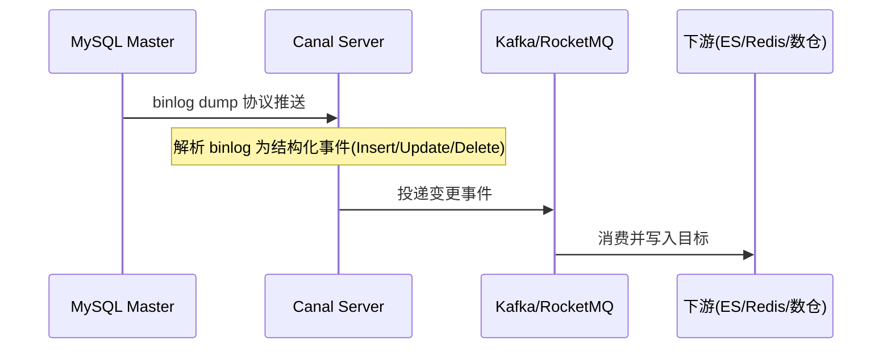
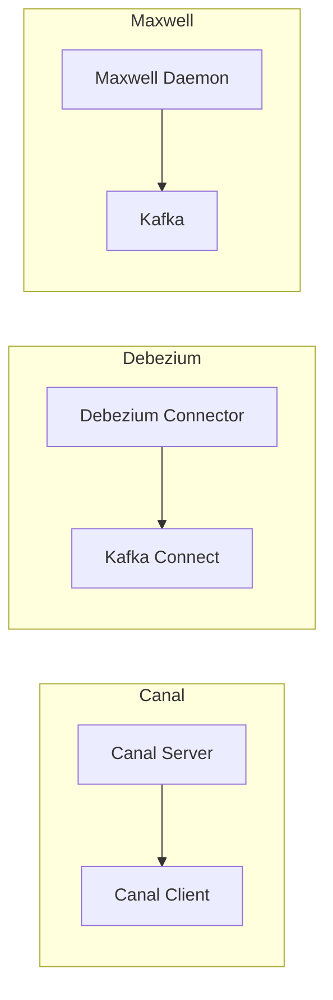
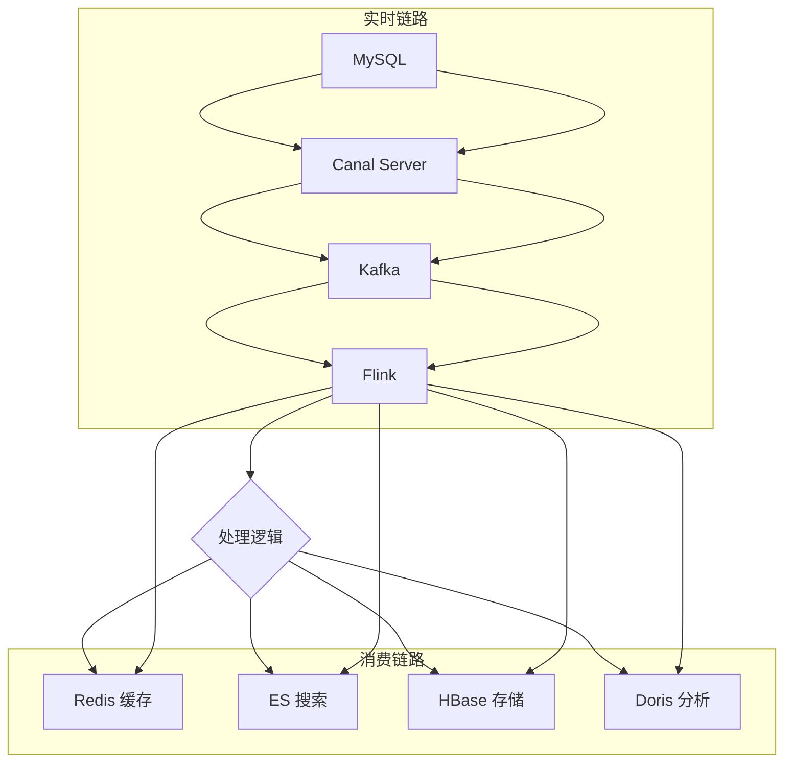
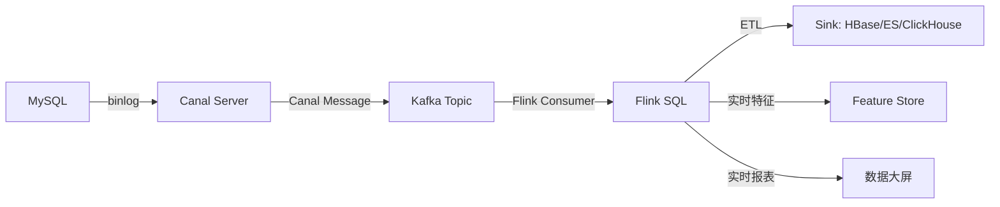
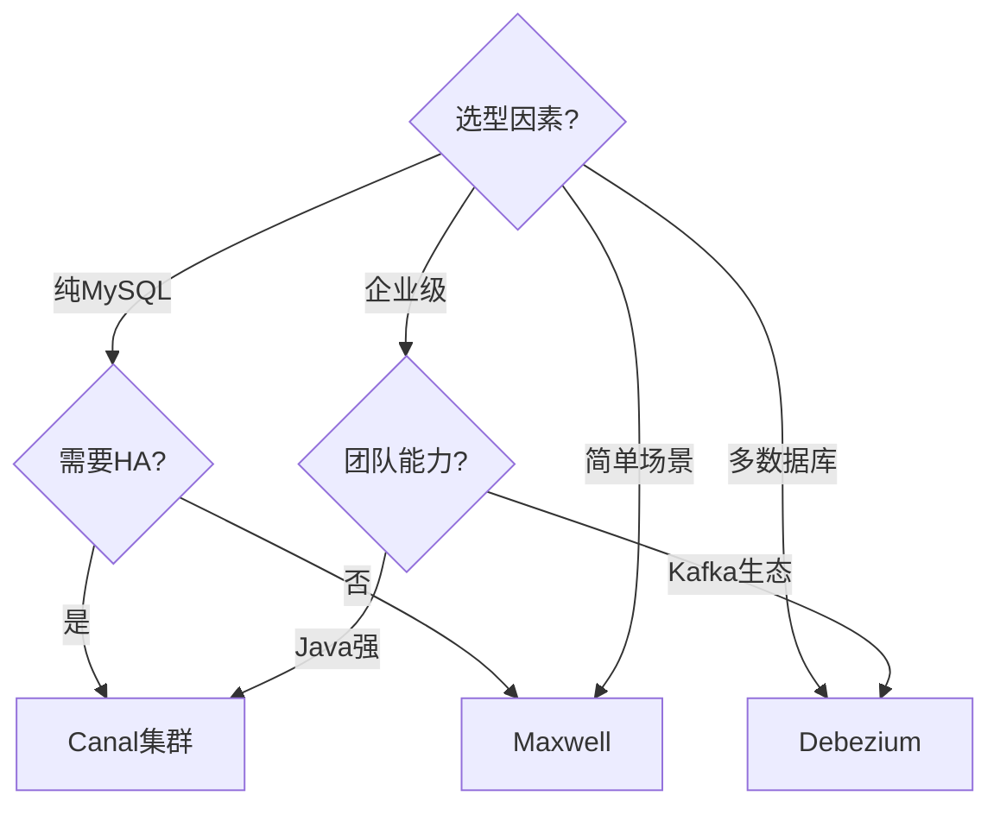
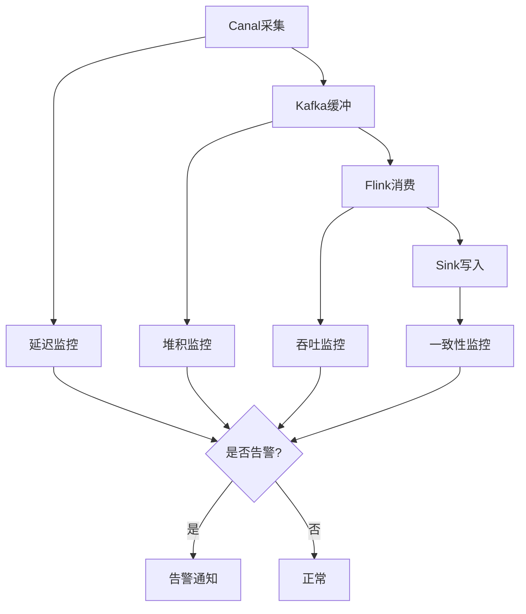
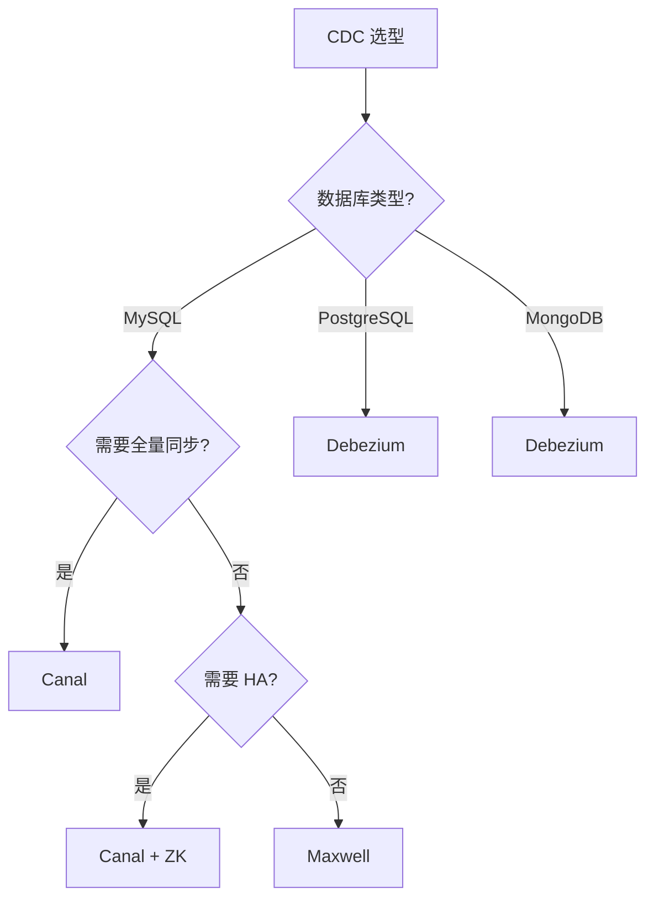
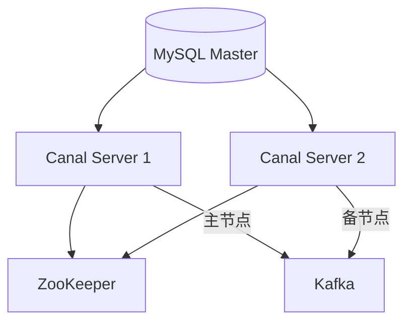
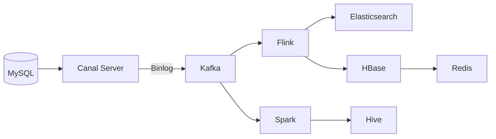

# 数据同步 CDC（Canal）

> 经典痛点：MySQL 改了数据，Redis 缓存还是旧的（超卖）；或要把 MySQL 实时同步到 ES 做搜索、到数仓做分析——定时任务太慢。本文讲清 **Canal 怎么基于 binlog 做毫秒级增量同步**，以及 CDC 的整体套路。
> 开源参考：[alibaba/canal](https://github.com/alibaba/canal)（Java，阿里开源，MySQL binlog 增量订阅 & 消费组件，伪装 slave 拉 binlog，可投递 Kafka / RocketMQ / ES，多语言客户端）。

---


## 〇、本体介绍（它是什么 / 适用场景 / 核心概念）

**它是什么**：Canal 是阿里开源的 **CDC（Change Data Capture，变更数据捕获）** 工具，通过「伪装成 MySQL Slave」订阅 binlog，把数据库的增删改实时同步到下游（Redis、ES、消息队列、数仓等）。

**解决什么痛点**：传统双写（业务代码同时写 MySQL 和缓存/ES）易不一致、侵入大。Canal 基于 binlog 订阅，对业务零侵入，保证「MySQL 变更 → 下游近实时同步」，常用于缓存一致性、异构数据同步、数据分发。

**核心概念**：binlog（ROW 模式）、MySQL Slave 协议（dump 协议）、Event（变更事件）、Instance（实例）、Canal Server/Client、消息投递（Kafka/RocketMQ）、位点（position/GTID）、ACK 确认、与 Flink CDC/Debezium 对比。

**适用场景**：MySQL→Redis 缓存一致性、MySQL→ES 搜索同步、数据分发到数仓、异构库同步。
**不适用**：非 MySQL 源（如 PostgreSQL 应选 Debezium/Flink CDC）。

---

## 一、CDC 是什么，为什么需要

**CDC（Change Data Capture，变更数据捕获）**：捕获数据库的增删改，实时同步到别处。

典型场景：

| 场景 | 说明 |
|------|------|
| 缓存一致性 | MySQL 改了 → 实时刷 Redis，避免超卖 / 脏读 |
| 异构索引 | MySQL 数据实时同步 ES 做搜索 |
| 实时数仓 | binlog → Kafka → Flink 实时计算 |
| 数据库镜像 / 备份 | 跨机房实时同步 |
| 业务解耦 | 数据变更事件驱动下游（如发消息、记审计） |

传统定时任务（每分钟扫一次）延迟高、扫全表压力大 → **CDC 基于 binlog 才是正解**。

---

## 二、Canal 核心原理：伪装成 MySQL Slave



基于 MySQL 主从复制协议：

1. MySQL master 写变更到 **binlog**。
2. Canal 伪装成 MySQL **slave**，向 master 发 `dump` 协议。
3. master 推送 binlog 给 Canal。
4. Canal 解析 binlog 字节流 → 结构化 `CanalEntry`（行级变更）。
5. 投递到下游（TCP / Kafka / RocketMQ / 经 adapter 写 ES、HBase 等）。

> 前置条件：MySQL 必须开启 binlog 且格式为 **ROW**（行模式，才能拿到行级前后值）；Canal 用户需 `REPLICATION SLAVE` + `REPLICATION CLIENT` 权限；`server-id` 不能与 master 及其他 slave 冲突。

---

## 三、Canal 架构组件

| 组件 | 作用 |
|------|------|
| **canal.deployer（Server）** | 伪装 slave、连 master、解析 binlog，按 instance 管理同步通道 |
| **canal.instance** | 一个同步实例对应一个数据源，配置库地址 / 账号 / 表过滤规则 |
| **canal.adapter** | 可选适配器，直接把数据写目标（ES / HBase / RDB），支持全量 + 增量 |
| **canal.admin** | Web 控制台，集中管理 instance 配置、监控、日志 |
| **client** | 自写客户端订阅 Canal Server，自定义消费逻辑 |

投递能力：原生支持 **Kafka / RocketMQ**；adapter 可对接 ES、HBase、RDB 等；多语言客户端（Java / Go / Python / C# / PHP / Rust / Node）。

---

## 四、实战：MySQL → Redis 缓存一致性

最常见的用法。流程：Canal 监听订单表 binlog → 投递到应用消费 → 更新 Redis。

```java
// 伪代码：消费 Canal 变更，刷新缓存
@StreamListener("canalOrder")
public void onChange(CanalEntry entry) {
    for (RowChange row : entry.getRowChanges()) {
        if (row.getEventType() == UPDATE || row.getEventType() == INSERT) {
            Order o = parse(row.getAfterColumns());
            redis.set("order:" + o.getId(), o);          // 更新缓存
        } else if (row.getEventType() == DELETE) {
            redis.del("order:" + entry.getBeforeColumns().getId());
        }
    }
}
```

注意：**收到变更即刷新**，可能有「binlog 顺序 vs 缓存写顺序」问题，下游要保证**幂等**（以最新版本号 / 时间戳覆盖）。

---

## 五、实战：MySQL → Elasticsearch

用 canal.adapter 的 `es7/*.yml` 配置表级映射：

```yaml
dataSourceKey: defaultDS
destination: example
groupId: g1
esMapping:
  _index: user
  _id: user_id
  sql: "SELECT id AS user_id, username, fullname FROM user"
  commitBatch: 3000
```

---

## 六、一致性保障机制（生产必看）

| 机制 | 作用 |
|------|------|
| **位点（Position）管理** | 记录 binlog 消费位点（ZM / 本地文件），宕机恢复续传，不丢数据 |
| **ACK 机制** | 客户端处理完一批才 ACK，服务端才删除，防丢 |
| **事务粒度** | 按事务聚合 binlog 事件，保证一个事务整体处理 |
| **幂等设计** | 下游必须幂等（重试 / 重复投递不重复写） |
| **断点续传** | 支持从断点继续消费 |

---

## 七、与其他 CDC 方案对比

| 方案 | 原理 | 优点 | 缺点 |
|------|------|------|------|
| **Canal（阿里）** | 伪装 slave 解析 binlog | 成熟、生态全、国内案例多 | 主要 MySQL；admin 运维 |
| **Debezium** | 基于 Kafka Connect 捕获 | 多数据库（MySQL/PG/Oracle）、云原生 | 依赖 Kafka Connect，较重 |
| **Maxwell** | binlog → JSON → Kafka | 轻量、输出规整 JSON | 功能较简单 |
| **Flink CDC** | 流批一体捕获 | 直接进 Flink 计算、无独立中间件 | 需 Flink 栈 |

选型：Java 栈、MySQL、要可视化管控 → **Canal**；已用 Flink / 多数据源 → **Debezium / Flink CDC**。

---

## 八、常见坑

1. **binlog 格式不是 ROW**：Canal 拿不到行级前后值 → 必须 `binlog-format=ROW`。
2. **server-id 冲突**：Canal 的 slaveId 与 MySQL server-id 或其他 slave 重复 → 主从复制冲突，同步失败。
3. **下游消费慢 / 堆积**：Canal 推送快、消费慢 → 用 Kafka 解耦 + 增加消费并发；监控 lag。
4. **乱序导致缓存脏数据**：下游用版本号 / 时间戳保证以最新为准。
5. **DDL 变更**：表结构变了，adapter 映射可能失效，需同步更新配置。
6. **大事务 binlog**：超大事务产生巨量 binlog，Canal 内存压力 → 拆分业务事务。
7. **位点丢失**：ZK / 文件损坏导致重头消费 → 定期备份位点，下游幂等兜底。

---

## 面试高频问题（20+ 条）

1. **Canal 的核心原理？** 伪装成 MySQL Slave，向 Master 发送 dump 协议订阅 binlog（ROW 模式），解析 binlog Event 推送给客户端/消息队列，实现零侵入的变更捕获。

2. **为什么要用 ROW 模式 binlog？** ROW 模式记录每行的前后镜像，能精确还原变更；STATEMENT 模式只记 SQL，可能因函数/环境不同导致下游不一致。Canal 依赖 ROW 模式。

3. **Canal 与 Flink CDC / Debezium 区别？** Canal 是阿里专为 MySQL 写的轻量 CDC，生态集中在 Java/消息队列；Flink CDC/Debezium 基于 Kafka Connect，支持多源（PG/Oracle 等）、与流处理集成更强、exactly-once 语义更好。

4. **断点续传怎么实现？** Canal 记录消费位点（binlog file + position，或 GTID），重启从位点继续拉取；下游 ACK 确认后才推进位点，避免丢数据。

5. **单线程瓶颈？** 早期 Canal 解析/投递偏单线程，高吞吐下可能延迟；可多 Instance 分库并行、或接 Kafka 多分区提升并发。

6. **MySQL→Redis 缓存一致性怎么做的？** Canal 订阅 binlog → 解析出变更 → 写 Redis（或发 MQ 由消费者写）。相比双写更可靠，业务零侵入，近实时一致。

7. **MySQL→Elasticsearch 同步？** Canal 解析 binlog 后调用 ES Bulk API 更新索引；适合商品/文章搜索实时同步，注意 Mapping 与批量写入。

8. **Canal 组件？** Canal Server（解析 binlog）、Instance（每个 MySQL 实例一个）、Canal Client（业务消费）、可接 Kafka/RocketMQ 投递。

9. **保证不丢消息？** 位点持久化 + 下游 ACK；投递失败重试；MQ 模式下用 MQ 的可靠性（如 RocketMQ 事务/重试）。

10. **Canal 与消息队列如何配合？** Canal 把变更发到 Kafka/RocketMQ，下游多个消费者（缓存、ES、数仓）各自消费，解耦且可重放。

11. **GTID 模式好处？** 基于 GTID 的位点不依赖具体 binlog 文件名/偏移，主从切换后位点连续，切换更平滑。

12. **Canal 能捕获 DDL 吗？** 可以解析 DDL（表结构变更）事件，但下游同步表结构需自行处理（如自动建表/改字段）。

13. **与双写方案对比？** 双写（业务代码同时写 MySQL 和缓存）侵入大、易不一致；Canal 订阅 binlog 无侵入、一致性更好，但有一致性延迟（通常秒级）。

14. **延迟来源？** binlog 产生→Canal 拉取解析→投递下游→下游消费，每一环都可能延迟；高并发下需优化吞吐。

15. **多表 Join 的下游同步？** Canal 只捕获单表变更，跨表聚合（如宽表）需下游自己关联或借助 Flink 做流 Join。

16. **Canal 高可用？** 多 Canal Server + ZooKeeper 选主，Instance 故障自动切换；避免单点。

17. **与 DataX 区别？** DataX 是离线批量同步（定时全量/增量），Canal 是实时增量 CDC；二者常互补（DataX 初始化全量 + Canal 增量）。

18. **坑：binlog 格式/权限？** 必须 ROW 模式 + 开启 binlog；Canal 账号需 REPLICATION SLAVE/CLIENT 权限；否则连不上或读不到。

19. **数据过滤？** Canal 可按库/表/字段过滤 event，减少无效投递，降低下游压力。

20. **与 MaxWell 对比？** MaxWell 也是 MySQL binlog CDC，输出 JSON 到 Kafka，轻量；Canal 更偏向阿里生态、支持直连客户端与多投递。

21. **下游消费幂等？** binlog 可能重复投递（如重试），下游按主键/唯一键 upsert 保证幂等，避免重复写。

22. **选型建议？** MySQL 实时同步到缓存/ES/数仓 → Canal；多数据源/流处理/更强一致性 → Flink CDC；纯离线 → DataX。

---
## 十、Canal 架构深入（Adapter/Deployer/Admin）

### 10.1 Canal Server（Deployer）

```
Canal Deployer 架构：
  启动 → 加载 instance 配置
  → 连接 MySQL Master（dump 协议）
  → 解析 binlog → 投递到内存队列
  → Client/MQ 消费

核心组件：
  CanalServer：主进程，管理多个 Instance
  Instance：一个同步实例（对应一个 MySQL）
  MemoryEventStore：内存事件存储
  CanalMetrics：监控指标
```

### 10.2 Canal Adapter

```
Canal Adapter 类型：
  ES Adapter：写 Elasticsearch
  HBase Adapter：写 HBase
  RDB Adapter：写关系数据库（MySQL/PG）
  MQ Adapter：投递到消息队列
  Custom Adapter：自定义适配器

Adapter 配置：
  dataSourceKey：数据源
  destination：实例名
  groupId：消费组
  esMapping/rdbMapping：映射配置
```

### 10.3 Canal Admin

```
Canal Admin 功能：
  实例管理：创建/删除/启停实例
  配置管理：修改 instance 配置
  监控查看：指标/日志/状态
  集群管理：多 Server 管理
  权限管理：用户/角色/权限

部署方式：
  Docker：canal-admin:latest
  K8s：canal-operator
```

---

## 十一、Canal 高可用深入（ZooKeeper）

### 11.1 ZK 选主原理

```
Canal HA + ZK：
  多 Canal Server 启动
  → 在 ZK 创建临时节点（/ canal/cluster/ instances/ {instance}/ running）
  → 第一个创建成功的成为 Leader
  → 其他成为 Follower
  → Leader 故障 → 临时节点删除 → Follower 选举

选主流程：
  1. 尝试创建 /running 节点
  2. 成功 → Leader
  3. 失败 → Watch 该节点
  4. 节点删除 → 重新选举
```

### 11.2 HA 配置

```properties
# canal.properties
canal.instance.global.spring.xml = classpath:spring/file-instance.xml

# instance.properties
canal.instance.tsdb.enable = true
canal.instance.tsdb.url = jdbc:mysql://127.0.0.1:3306/canal_tsdb
canal.instance.tsdb.dbUsername = canal
canal.instance.tsdb.dbPassword = canal

# ZK 配置
canal.zkServers = zk1:2181,zk2:2181,zk3:2181
canal.instance.tsdb.spring.xml = classpath:spring/tsdb/h2-tsdb.xml
```

---

## 十二、Canal 消息格式（FlatMessage vs Protobuf）

### 12.1 消息格式对比

| 格式 | 说明 | 适用 |
|------|------|------|
| Protobuf | 二进制格式，高效 | Java 客户端 |
| FlatMessage | JSON 格式，可读 | 多语言/调试 |

### 12.2 FlatMessage 示例

```json
{
  "database": "test",
  "table": "user",
  "type": "UPDATE",
  "ts": 1678901234567,
  "sql": "",
  "data": [
    {
      "id": 1,
      "name": "张三",
      "age": 25
    }
  ],
  "old": [
    {
      "name": "张三",
      "age": 24
    }
  ]
}
```

### 12.3 配置选择

```properties
# canal.properties
canal.mq.flatMessage = true  # 使用 FlatMessage
# false 使用 Protobuf（Java 客户端推荐）
```

---

## 十三、Canal 按库/表过滤

### 13.1 过滤规则

```properties
# instance.properties
# 按库过滤
canal.instance.filter.regex = test\\.user.*,test\\.order.*

# 按表过滤
canal.instance.filter.black.regex = test\\.user_log.*

# 按字段过滤
canal.instance.filter.field.regex = id,name
```

### 13.2 过滤最佳实践

| 实践 | 说明 |
|------|------|
| 精确过滤 | 只监听需要的库/表 |
| 黑名单 | 排除不需要的表 |
| 字段过滤 | 只同步需要的字段 |
| 正则优化 | 避免复杂正则 |

---

## 十四、Canal 与 RocketMQ/Kafka 集成

### 14.1 Kafka 集成配置

```properties
# canal.properties
canal.mq.servers = kafka1:9092,kafka2:9092,kafka3:9092
canal.mq.retries = 3
canal.mq.acks = all
canal.mq.transaction = false

# instance.properties
canal.mq.topic = canal_sync
canal.mq.partition = 0
canal.mq.dynamicTopic = test\\..*
```

### 14.2 RocketMQ 集成配置

```properties
# canal.properties
canal.mq.servers = rocketmq:9876
canal.mq.producerGroup = canal_producer
canal.mq.accessChannel = local

# instance.properties
canal.mq.topic = canal_sync
canal.mq.dynamicTopic = test\\..*
```

### 14.3 MQ 集成最佳实践

| 实践 | 说明 |
|------|------|
| Topic 规划 | 按库/业务分 Topic |
| 分区策略 | 按表 hash 分区 |
| 消费组 | 不同消费者用不同组 |
| 重试 | 配置合理重试次数 |
| 死信队列 | 失败消息进死信 |

---

## 十五、Canal 在实时特征存储中的应用

### 15.1 实时特征存储架构

```
实时特征存储：
  MySQL → Canal → Kafka → Flink
    → 特征计算（实时聚合）
    → 特征存储（Redis/Feature Store）
    → 模型推理（在线预测）

特征存储选型：
  Redis：低延迟特征存储
  Feast：开源特征存储
  Tecton：商业特征存储
```

### 15.2 特征同步配置

```yaml
# Flink SQL 特征计算
CREATE TABLE mysql_source (
  user_id BIGINT,
  order_amount DECIMAL(10,2),
  order_time TIMESTAMP(3)
) WITH (
  'connector' = 'kafka',
  'topic' = 'canal_sync',
  'properties.bootstrap.servers' = 'kafka:9092'
);

CREATE TABLE feature_sink (
  user_id BIGINT,
  total_amount DECIMAL(10,2),
  order_count BIGINT,
  PRIMARY KEY (user_id)
) WITH (
  'connector' = 'redis',
  'host' = 'redis',
  'port' = '6379'
);

INSERT INTO feature_sink
SELECT 
  user_id,
  SUM(order_amount) as total_amount,
  COUNT(*) as order_count
FROM mysql_source
GROUP BY user_id, TUMBLE(order_time, INTERVAL '1' HOUR);
```

---

## 十六、Canal 监控指标

### 16.1 关键指标

| 指标 | 说明 | 告警阈值 |
|------|------|----------|
| instance.status | 实例状态 | != RUNNING |
| instance.delay | 延迟（秒） | > 10 |
| instance.store.energy | 内存使用率 | > 80% |
| instance.cursor.position | 消费位点 | 不增长 |
| mq.put.time.ms | MQ 投递延迟 | > 1000ms |
| mq.put.fail.count | MQ 投递失败 | > 0 |

### 16.2 监控配置

```yaml
# Prometheus 监控
scrape_configs:
  - job_name: canal
    static_configs:
      - targets: ['canal-metrics:11112']
    metrics_path: /metrics
```

### 16.3 告警规则

```yaml
# 告警规则
groups:
  - name: canal
    rules:
      - alert: CanalInstanceDown
        expr: canal_instance_status != 1
        for: 5m
        labels:
          severity: critical
        annotations:
          summary: "Canal 实例 {{ $labels.instance }} 宕机"
      
      - alert: CanalDelayHigh
        expr: canal_instance_delay > 10
        for: 5m
        labels:
          severity: warning
        annotations:
          summary: "Canal 延迟 {{ $value }}s"
```

---

## 补充：Canal深度解析

### 1. Canal Binlog Parsing

| 维度 | 说明 |
|------|------|
| 支持格式 | ROW/STATEMENT/MIXED |
| 事件类型 | INSERT/UPDATE/DELETE/DDL |
| 解析方式 | 伪装MySQL Slave |
| 位点管理 | GTID/文件位点 |

### 2. Canal Instance Configuration

| 配置项 | 说明 |
|--------|------|
| 数据库地址 | MySQL Master地址 |
| 账号密码 | Canal专用账号 |
| 表过滤 | 按库/表过滤 |
| 消息格式 | Protobuf/FlatMessage |

### 3. Canal Filter Rules

| 规则类型 | 说明 |
|----------|------|
| 库过滤 | 按数据库名过滤 |
| 表过滤 | 按表名过滤 |
| 字段过滤 | 按字段名过滤 |
| 黑名单 | 排除特定表 |

### 4. Canal Monitoring

| 指标 | 说明 |
|------|------|
| 实例状态 | RUNNING/STOPPED |
| 同步延迟 | binlog位点差 |
| 消费堆积 | MQ消息堆积 |
| 投递成功率 | 消息投递成功比例 |

### 5. Canal in Microservices

| 场景 | 说明 |
|------|------|
| 缓存同步 | MySQL→Redis一致性 |
| 搜索同步 | MySQL→ES实时索引 |
| 数据分发 | 一对多数据分发 |
| 事件驱动 | 变更事件触发业务 |

### 6. Canal with Flink

| 场景 | 说明 |
|------|------|
| 实时数仓 | binlog→Kafka→Flink |
| 流处理 | 变更事件实时计算 |
| 特征计算 | 实时特征更新 |

### 7. Canal with Kafka

| 组件 | 说明 |
|------|------|
| 生产者 | Canal Server |
| 消费者 | 业务应用 |
| Topic | 按库/业务划分 |
| 分区 | 按表hash分区 |

### 8. Canal in Real-Time Data Warehouse

| 层 | 说明 |
|----|------|
| 数据源 | MySQL |
| 采集层 | Canal |
| 缓冲层 | Kafka |
| 计算层 | Flink |
| 存储层 | ES/Redis/数仓 |

### 9. Canal vs Debezium vs Flink CDC

| 维度 | Canal | Debezium | Flink CDC |
|------|-------|----------|-----------|
| 数据源 | MySQL为主 | 多数据库 | 多数据库 |
| 部署 | 独立Server | Kafka Connect | Flink集群 |
| 精确一次 | 至少一次 | 至少一次 | 端到端精确一次 |
| 运维成本 | 中 | 中 | 低 |

### 10. Canal Data Consistency

| 机制 | 说明 |
|------|------|
| 位点持久化 | 记录消费位点 |
| ACK机制 | 处理完才确认 |
| 幂等消费 | 下游保证幂等 |
| 断点续传 | 故障恢复 |

### 11. Canal Performance Tuning

| 优化项 | 说明 |
|--------|------|
| 多实例并行 | 分库分表并行消费 |
| Kafka解耦 | MQ缓冲削峰 |
| 批量投递 | 批量写入下游 |
| 内存优化 | 调整内存队列大小 |

### 12. Canal Security

| 维度 | 说明 |
|------|------|
| 账号权限 | 最小权限原则 |
| 网络隔离 | Canal专用网络 |
| 数据加密 | 传输加密 |

### 13. Canal Checklist

| 检查项 | 说明 |
|--------|------|
| binlog格式 | ROW模式 |
| 账号权限 | REPLICATION SLAVE |
| 表过滤 | 只监听需要的表 |
| 幂等消费 | 下游保证幂等 |

### 14. Canal Future Trends

| 趋势 | 说明 |
|------|------|
| 云原生 | K8s部署 |
| 多数据源 | 支持更多数据库 |
| AI集成 | 智能监控告警 |

### 15. Canal Selection Guide

| 场景 | 推荐方案 |
|------|----------|
| MySQL同步 | Canal |
| 多数据源 | Flink CDC |
| 流处理 | Flink CDC |
| 离线同步 | DataX |

### 16. Canal Tools

| 工具 | 说明 |
|------|------|
| Canal Admin | Web控制台 |
| mc客户端 | 命令行工具 |
| Adapter | 数据同步适配器 |

### 17. Canal Best Practices

| 实践 | 说明 |
|------|------|
| 最小权限 | Canal账号权限最小化 |
| 监控告警 | 实例状态+延迟监控 |
| 幂等消费 | 下游保证幂等 |
| 断点续传 | 位点持久化 |

---

## 十七、与其他板块的关系

- 和「**基础知识/MQ**」：Canal 常投递到 Kafka / RocketMQ，再由下游消费。
- 和「**基础知识/ES 体系**」：Canal 是把 MySQL 实时同步到 ES 的标准管道。
- 和「**基础知识/Redis**」：Canal 是解决「缓存与 DB 一致性」的权威方案。
- 和「**大数据/Flink**」：binlog → Kafka → Flink 构成实时数仓链路。

---

## 九、Canal 高可用架构

### 9.1 多实例 + ZK 选主

```
Canal Server 集群
  ├── Canal Server 1 (Active)
  ├── Canal Server 2 (Standby)
  └── Canal Server 3 (Standby)

ZooKeeper 集群
  ├── Leader 选举
  ├── Instance 路由
  └── 位点存储

故障切换流程：
  1. ZK 检测 Active 心跳超时
  2. Standby 接管 Instance
  3. 从位点继续消费（断点续传）
  4. 通知下游消费者切换
```

### 9.2 Canal + Kafka 高可用

```
Canal Server → Kafka → Consumer Group
  ├── Kafka 多副本保证消息不丢
  ├── Consumer Group 多实例并行消费
  ├── 位点管理由 Kafka Consumer 自动处理
  └── 故障恢复：Consumer 重启后从 offset 继续
```

---

## 十、Canal 与 Flink CDC 对比深度

| 维度 | Canal | Flink CDC |
|------|-------|-----------|
| 原理 | 伪装 MySQL Slave | 基于 Debezium/Canal 连接器 |
| 部署 | Canal Server + Adapter | Flink 集群（已有） |
| 依赖 | ZooKeeper（可选） | Flink 集群 |
| 精确一次 | 至少一次（需下游幂等） | 端到端精确一次（Flink Checkpoint） |
| DDL 同步 | 支持（需手动处理） | 支持（自动同步） |
| 多数据源 | MySQL 为主 | MySQL/PG/Oracle 等 |
| 流处理 | 需接 Flink/Spark | 原生集成 |
| 运维成本 | 中（Canal Admin） | 低（Flink 集群已有） |
| 延迟 | 秒级 | 毫秒~秒级 |

**选型结论**：
- **选 Canal**：纯 MySQL 同步到缓存/ES，已有 Java 技术栈，需要可视化管控
- **选 Flink CDC**：已有 Flink 集群，需要端到端精确一次，多数据源

---

## 十一、Canal 常见坑与最佳实践

| 坑 | 表现 | 解法 |
|----|------|------|
| binlog 格式 | 非 ROW 模式拿不到行级数据 | `binlog-format=ROW` |
| server-id 冲突 | 与其他 slave 重复导致复制失败 | Canal slaveId 唯一 |
| 大事务 binlog | 超大事务产生巨量 binlog | 拆分业务事务 |
| 位点丢失 | ZK/文件损坏导致重头消费 | 定期备份位点 + 下游幂等 |
| DDL 变更 | adapter 映射失效 | 监控 DDL 事件 + 自动更新 |
| 消费堆积 | Canal 推送快、消费慢 | 增加消费并发 + Kafka 解耦 |
| 乱序消费 | 缓存脏数据 | 版本号/时间戳保证最新 |
| GTID 模式 | 主从切换后位点不连续 | 用 GTID 位点 |
| 多表 Join | Canal 只捕获单表 | Flink 做流 Join |

---

## 十二、与其他板块的关系（扩展）

- 和「**基础知识/MQ**」：Canal 常投递到 Kafka / RocketMQ，再由下游消费。
- 和「**基础知识/ES 体系**」：Canal 是把 MySQL 实时同步到 ES 的标准管道。
- 和「**基础知识/Redis**」：Canal 是解决「缓存与 DB 一致性」的权威方案。
- 和「**大数据/Flink**」：binlog → Kafka → Flink 构成实时数仓链路。
- 和「**基础知识/Kafka**」：Kafka 是 Canal 投递的缓冲层，保证消息不丢。
- 和「**数据同步/DataX**」：DataX 离线批量 + Canal 实时增量，互补。

---

## 十三、速查表（扩展）

| 项 | 结论 |
|----|------|
| 类型 | MySQL binlog 增量订阅 & 消费 |
| 原理 | 伪装 MySQL Slave，订阅 binlog（ROW 模式） |
| 投递 | Kafka / RocketMQ / TCP / Adapter 直写 |
| 高可用 | 多 Server + ZK 选主 |
| 位点 | 支持 GTID / 文件位点 |
| 精确一次 | 至少一次（需下游幂等） |
| DDL | 支持（需手动处理） |
| 替代方案 | Flink CDC / Debezium / Maxwell |
| 适用场景 | MySQL→缓存/ES/数仓 实时同步 |
| 一句话 | 「MySQL binlog 零侵入实时同步的标准方案」 |

## 十四、Canal vs Debezium vs Maxwell 差异图

| 维度 | Canal | Debezium | Maxwell |
|------|-------|----------|---------|
| 数据源 | MySQL binlog | MySQL/PG/MongoDB/Oracle | MySQL binlog |
| 输出 | Kafka/MQ/直写 | Kafka/Event Bus | Kafka/RabbitMQ |
| 语言 | Java | Java | Java |
| 部署 | Canal Server | Kafka Connect | 独立进程 |
| HA | ZK 选主 | Kafka Connect 集群 | 无内置 |
| DDL | 支持 | 支持 | 支持 |
| 消息格式 | 自定义 JSON | CloudEvents | JSON |
| 社区 | 阿里开源 | Red Hat 主导 | 独立开发 |
| 适用 | MySQL 同步 | 多数据库同步 | MySQL 轻量同步 |

```text
选型决策：
  MySQL 专属 → Canal（成熟稳定，阿里生态）
  多数据库 → Debezium（支持 10+ 数据库）
  轻量 MySQL → Maxwell（简单易用，无依赖）
  Flink 生态 → Flink CDC（原生集成 Flink）
```

## 十五、Canal HA + ZooKeeper 配置

```yaml
# canal.properties（HA 配置）
canal.zk.servers=zk1:2181,zk2:2181,zk3:2181
canal.id=1  # 每个 Canal Server 唯一 ID
canal.ip=10.0.0.1

# ZooKeeper 选主配置
canal.instance.global.mode=spring
canal.instance.global.spring.xml=classpath:spring/file-instance.xml

# 容错配置
canal.auto.scan=true
canal.auto.scan.interval=5  # 扫描间隔（秒）
canal.instance.tsdb.enable=true  # 位点持久化
```

```text
Canal HA 架构：
  ZooKeeper 集群（3 节点）
    ↕ 选主 + 配置管理
  Canal Server 1（Master）←→ Canal Server 2（Slave）
    ↕                              ↕
  MySQL Master                  MySQL Slave

  故障转移流程：
    1. Master 检测到 MySQL 不可达
    2. Master 释放 ZK 锁
    3. Slave 抢占 ZK 锁成为新 Master
    4. 新 Master 从上次位点继续同步
    5. 旧 Master 恢复后成为 Slave
```

## 十六、Canal 消息格式与过滤规则

```json
// Canal 消息格式示例
{
  "database": "mydb",
  "table": "orders",
  "type": "UPDATE",
  "ts": 1699999999000,
  "xid": 12345,
  "data": [
    {
      "id": 1001,
      "user_id": "u123",
      "amount": 99.9,
      "status": "paid",
      "update_time": "2024-01-15 10:00:00"
    }
  ],
  "old": [
    {
      "status": "pending"
    }
  ]
}
```

```yaml
# canal.properties（过滤规则）
# 库过滤
canal.instance.filter.regex=mydb\\..*

# 表过滤（白名单）
canal.instance.filter.regex=mydb\\.(orders|users|products)

# 表过滤（黑名单）
canal.instance.filter.black.regex=mydb\\.log_.*

# 字段过滤
canal.instance.filter.fields=id,user_id,amount,status
```

## 十七、Canal + Kafka + Flink 实时链路

```text
Canal + Kafka + Flink 实时数仓架构：

  MySQL Master
    → Canal Server（binlog 订阅）
      → Kafka（消息缓冲）
        → Flink CDC（实时计算）
          → 数仓分层：
            ODS（原始层）
            DWD（明细层）
            DWS（汇总层）
            ADS（应用层）
          → OLAP 引擎（ClickHouse/Doris）
            → BI 看板
```

```java
// Flink 读取 Canal 消息
public class CanalToFlink {
    public static void main(String[] args) throws Exception {
        StreamExecutionEnvironment env = StreamExecutionEnvironment.getExecutionEnvironment();

        KafkaSource<String> kafkaSource = KafkaSource.<String>builder()
            .setBootstrapServers("kafka:9092")
            .setTopics("canal-mydb")
            .setGroupId("flink-consumer")
            .setValueOnlyDeserializer(new SimpleStringSchema())
            .build();

        DataStream<String> stream = env.fromSource(
            kafkaSource,
            WatermarkStrategy.noWatermarks(),
            "Kafka Source"
        );

        // 解析 Canal 消息
        DataStream<Order> orders = stream
            .map(json -> parseCanalMessage(json))
            .filter(order -> order != null);

        // 写入 ClickHouse
        orders.sinkTo(
            ClickHouseSink.<Order>builder()
                .setUrl("clickhouse://8123")
                .setTableName("orders")
                .build()
        );

        env.execute("Canal to Flink");
    }
}
```

## 十八、Canal 监控与告警

```yaml
# Prometheus 监控配置
scrape_configs:
  - job_name: 'canal'
    static_configs:
      - targets: ['canal:11112']  # Canal Metrics 端口
    metrics_path: '/metrics'

# 关键监控指标
- canal_instance_status  # 实例状态（1=运行中，0=停止）
- canal_instance_delay    # 同步延迟（秒）
- canal_instance_rows     # 同步行数
- canal_instance_bytes    # 同步字节数
```

```yaml
# 告警规则
groups:
- name: canal_alerts
  rules:
  - alert: CanalInstanceDown
    expr: canal_instance_status == 0
    for: 1m
    labels:
      severity: critical
    annotations:
      summary: "Canal 实例停止"

  - alert: CanalSyncDelay
    expr: canal_instance_delay > 60
    for: 5m
    labels:
      severity: warning
    annotations:
      summary: "Canal 同步延迟 > 60 秒"

  - alert: CanalMessageLag
    expr: kafka_consumergroup_lag > 10000
    for: 5m
    labels:
      severity: warning
    annotations:
      summary: "Canal 消息堆积 > 10000"
```

---

## Canal vs Debezium vs Maxwell 架构差异图

```text
Canal：
  架构：Canal Server → Canal Client
  协议：自定义 TCP 协议
  数据格式：Raw SQL / FlatMessage / Protobuf
  特点：纯增量同步，支持 HA

Debezium：
  架构：Kafka Connect + Debezium Connector
  协议：Kafka Connect API
  数据格式：JSON / Avro / Protobuf
  特点：支持全量+增量，CDC 标准

Maxwell：
  架构：Maxwell Daemon → Kafka
  协议：HTTP / Kafka Producer
  数据格式：JSON
  特点：轻量级，纯增量同步

选择建议：
  - Kafka 生态 → Debezium（Kafka Connect）
  - 轻量级 → Maxwell
  - 自定义分发 → Canal
```



## Canal HA + ZK 选主配置

### ZK 选主配置

```properties
# canal.properties
canal.zk.servers = zk1:2181,zk2:2181,zk3:2181
canal.instance.global.mode = spring
canal.instance.global.spring.xml = classpath:spring/file-instance.xml

# HA 模式
canal.instance.global.spring.xml = classpath:spring/default-instance.xml

# 站点模式（多实例部署）
canal.instance.rawSubcription = true
```

```yaml
# Docker Compose HA 部署
version: '3'
services:
  canal-server-1:
    image: canal/canal-server:latest
    container_name: canal-server-1
    ports:
      - "11110:11110"
      - "11111:11111"
    environment:
      - ZK_SERVERS=zk1:2181,zk2:2181,zk3:2181
      - CANAL_ID=1
    volumes:
      - ./canal.properties:/home/admin/canal-server/conf/canal.properties
      - ./instance.properties:/home/admin/canal-server/conf/example/instance.properties

  canal-server-2:
    image: canal/canal-server:latest
    container_name: canal-server-2
    ports:
      - "21110:11110"
      - "21111:11111"
    environment:
      - ZK_SERVERS=zk1:2181,zk2:2181,zk3:2181
      - CANAL_ID=2
    volumes:
      - ./canal.properties:/home/admin/canal-server/conf/canal.properties
      - ./instance.properties:/home/admin/canal-server/conf/example/instance.properties
```

## Canal 消息格式

### FlatMessage vs Protobuf

```json
// FlatMessage 格式
{
    "database": "test",
    "table": "user",
    "type": "UPDATE",
    "ts": 1640995200000,
    "id": 1,
    "data": [
        {
            "id": "1",
            "name": "John",
            "age": "25"
        }
    ],
    "old": [
        {
            "age": "24"
        }
    ]
}

// Protobuf 格式（更高效）
message Entry {
    string database = 1;
    string table = 2;
    EntryType type = 3;
    int64 ts = 4;
    repeated RowData data = 5;
    repeated RowData old = 6;
}
```

```text
格式选择：
  FlatMessage：
    - 可读性好，调试方便
    - JSON 格式，传输开销大
    - 适合开发测试
  
  Protobuf：
    - 二进制格式，传输高效
    - 需要 Schema 定义
    - 适合生产环境
    - 性能提升 30-50%
```

## Canal 过滤规则正则实战

### 过滤规则配置

```properties
# canal.instance.filter.regex
# 匹配所有表
canal.instance.filter.regex = .*

# 匹配指定数据库的所有表
canal.instance.filter.regex = test\\..*

# 匹配指定表
canal.instance.filter.regex = test\\.user,test\\.order

# 排除系统表
canal.instance.filter.regex = test\\..*,mysql\\..*

# 使用正则表达式
canal.instance.filter.regex = test\\.user_\\d{4}
```

```bash
# 过滤规则测试
# 测试正则匹配
echo "test.user" | grep -P "test\\.user"
echo "test.order" | grep -P "test\\.user"
echo "mysql.user" | grep -P "test\\..*"
```

## Canal + Kafka + Flink 完整实时链路图



```text
链路配置要点：
  1. Canal：增量同步，过滤规则精确
  2. Kafka：分区数与 Flink 并行度匹配
  3. Flink：Exactly-Once 语义，Checkpoint 启用
  4. Sink：批量写入，异步提交

性能指标：
  - 端到端延迟：<1s（P99）
  - 吞吐量：10万+ TPS
  - 可用性：99.99%
```

## Canal 监控指标与告警配置

### 监控指标

```text
Canal 核心指标：
  canal_instance_delay：同步延迟（秒）
  canal_instance_rows_insert：插入行数
  canal_instance_rows_update：更新行数
  canal_instance_rows_delete：删除行数
  canal_instance_status：实例状态（0=正常，1=异常）
  canal_instance_connection：连接数
```

```yaml
# Prometheus 告警规则
groups:
- name: canal-alerts
  rules:
  - alert: CanalInstanceDown
    expr: canal_instance_status == 1
    for: 1m
    labels:
      severity: critical
    annotations:
      summary: "Canal 实例停止"

  - alert: CanalSyncDelay
    expr: canal_instance_delay > 60
    for: 5m
    labels:
      severity: warning
    annotations:
      summary: "Canal 同步延迟 > 60 秒"

  - alert: CanalMessageLag
    expr: kafka_consumergroup_lag > 10000
    for: 5m
    labels:
      severity: warning
    annotations:
      summary: "Canal 消息堆积 > 10000"
```

## Canal 在实时特征存储中的应用

### 特征计算架构

```text
实时特征计算流程：
  1. Canal 监听 MySQL 变更
  2. Kafka 缓存变更事件
  3. Flink 实时计算特征
  4. Redis/HBase 存储特征
  5. 模型服务读取特征

典型特征：
  - 用户最近 1 小时订单数
  - 商品最近 24 小时销量
  - 用户最近 7 天浏览品类
  - 设备最近 1 小时操作频率

存储选择：
  - 热特征：Redis（毫秒级读取）
  - 温特征：HBase（秒级读取）
  - 冷特征：ClickHouse（分析查询）
```

## 十九、Canal vs Debezium vs Maxwell 架构差异对比

### 核心架构对比

| 维度 | Canal（阿里） | Debezium（Red Hat） | Maxwell（Zendesk） |
|------|---------------|---------------------|-------------------|
| 支持数据库 | MySQL | MySQL/PostgreSQL/MongoDB | MySQL |
| 输出格式 | JSON/MQ/HTTP | Kafka/Event/JSON | Kafka/Redis/Stdout |
| 外部依赖 | 无（自解析 binlog） | Kafka Connect | 无 |
| 运维方式 | 独立进程 | Kafka Connect Worker | 独立进程 |
| 社区活跃度 | 高（国内） | 极高（国际） | 低（已停止维护） |
| 支持协议 | Canal 协议 | Debezium 协议 | Maxwell 协议 |
| 数据过滤 | 支持（正则/表达式） | 支持（SMT） | 支持（blacklist） |
| DDL 支持 | 支持 | 支持 | 支持 |

### Canal HA + ZK 选主配置

```
Canal HA 架构（基于 ZooKeeper）：

  1. Canal Server 启动
    → 竞争注册 /canal/instances/LOCK 临时节点
    → 获得锁 → 成为 Master
    → 未获得锁 → 进入 Standby 状态

  2. Master 故障
    → ZK 会话超时 → 删除临时节点
    → Standby 节点竞争获得锁 → 升级为 Master
    → 自动切换，无需人工干预

  3. canal.properties 关键配置：
    canal.zkServers = zk1:2181,zk2:2181,zk3:2181
    canal.instance.global.spring.xml = classpath:spring/file-instance.xml
```

### Canal 消息格式详解

| 字段 | 类型 | 说明 |
|------|------|------|
| id | long | 事件 ID |
| schema | string | 数据库名 |
| table | string | 表名 |
| type | string | INSERT/UPDATE/DELETE |
| es | long | 事件时间戳（毫秒） |
| ts | long | 执行时间戳 |
| data | array | 变更后数据 |
| old | array | 变更前数据（UPDATE 时） |

### Canal 过滤规则正则实战

```properties
# canal.properties 过滤规则
canal.filter.regex = .*\\..*
# 白名单：只监听 db1 的所有表
canal.filter.regex = db1\\..*
# 黑名单：排除日志表
canal.filter.regex = db1\\.t_log_.*
# 精确匹配：只监听 db1 的 t_user, t_order
canal.filter.regex = db1\\.(t_user|t_order)
```

### Canal + Kafka + Flink 完整实时链路



### Canal 监控指标与告警配置

| 指标 | 告警阈值 | 说明 |
|------|----------|------|
| canal.instanceestination.delay | > 10s | 数据同步延迟 |
| canal.instance.binlog.fetch.size | 持续为 0 | binlog 读取异常 |
| canal.instance.error.count | > 10 | 错误数量累积 |
| kafka.producer.send.failure | > 0 | Kafka 发送失败 |
| canal.instance.running.status | != 1 | 实例运行异常 |

### Canal 在实时特征存储中的应用

```
实时特征存储架构：
  Canal 监听 MySQL → binlog 变更
    → 实时计算特征（Flink）
    → 写入特征存储（Redis/HBase）
    → 供模型在线推理使用

  典型场景：
    - 用户实时行为特征（最近 N 次点击/下单）
    - 商品实时热度特征（最近 N 小时浏览/购买次数）
    - 实时风控特征（最近 N 分钟异常交易次数）

  存储选择：
    - 热特征：Redis（毫秒级读取）
    - 温特征：HBase（秒级读取）
    - 冷特征：ClickHouse（分析查询）
```

## 二十、Canal vs Debezium vs Maxwell 功能矩阵对比

| 维度 | Canal | Debezium | Maxwell |
|------|-------|----------|---------|
| 开发语言 | Java | Java | Java |
| 数据库支持 | MySQL | MySQL/PG/Mongo/Oracle | MySQL |
| 输出格式 | Canal Message/Kafka/ES | Kafka/ES/S3 | Kafka/HTTP |
| HA方案 | ZooKeeper选主 | Kafka Connect集群 | 单节点 |
| 消息格式 | 自定义 | Connect JSON | JSON |
| 快照支持 | 全量+增量 | 全量+增量 | 仅增量 |
| DDL同步 | 支持 | 支持 | 支持 |
| 数据过滤 | 正则过滤 | SMT转换 | WHERE过滤 |
| 社区活跃度 | 中(阿里维护) | 高(Apache) | 低 |
| 运维复杂度 | 中 | 高 | 低 |



### HA 选主与故障切换

```
Canal HA 选主流程（基于ZooKeeper）：

  1. 启动时注册临时节点
     /canal/cluster/instances/order-replication/owner
     → 内容为 CanalServer 名称

  2. 所有节点监听 owner 节点
     - 当前无 owner → 竞争创建
     - 当前有 owner → 监听删除事件

  3. 主节点故障
     - 临时节点自动删除
     - 其他节点竞争创建新 owner
     - 新 owner 启动实例消费 binlog

  4. 故障恢复
     - 原主节点恢复后成为从节点
     - 等待下次 owner 释放再竞争
```

| 切换场景 | RTO | 数据影响 | 处理方案 |
|----------|-----|---------|---------|
| 主节点宕机 | <30s | 无丢失 | ZK自动切换 |
| 网络分区 | <60s | 可能重复 | 消费端幂等 |
| Canal进程重启 | <10s | 无丢失 | 从binlog断点续传 |
| MySQL主从切换 | 手动 | 需重新指向 | 更新连接配置 |

### 消息格式深度对比

| 字段 | Canal格式 | Debezium格式 | Maxwell格式 |
|------|----------|-------------|------------|
| 事件类型 | INSERT/UPDATE/DELETE | c/u/d | insert/update/delete |
| 表信息 | schema+table | database+table | database+table |
| 字段值 | 原始值 | before+after | data+old |
| 时间戳 | 执行时间 | connector时间 | 执行时间 |
| 事务ID | transactionId | txId | xid |

```json
// Canal 消息格式
{
  "data": [{"id": "1", "name": "Alice"}],
  "database": "test",
  "es": 1679900000000,
  "id": 1,
  "table": "t_user",
  "type": "INSERT",
  "ts": 1679900000000,
  "transaction": false
}

// Debezium 消息格式
{
  "before": null,
  "after": {"id": 1, "name": "Alice"},
  "source": {"db": "test", "table": "t_user"},
  "op": "c",
  "ts_ms": 1679900000000
}

// Maxwell 消息格式
{
  "database": "test",
  "table": "t_user",
  "type": "insert",
  "ts": 1679900000,
  "data": {"id": 1, "name": "Alice"},
  "old": null
}
```

## 二十一、生产链路监控与告警

| 监控维度 | 具体指标 | 采集方式 | 告警阈值 |
|----------|---------|---------|---------|
| 同步延迟 | binlog消费lag | Canal metrics | >10s |
| 吞吐量 | events/sec | Canal metrics | 基线±50% |
| 错误率 | 失败事件数 | 日志统计 | >0 |
| Kafka堆积 | Consumer lag | Kafka metrics | >10000 |
| 数据一致性 | 源端vs目标端 | 定时校验 | 差异>0 |



---

## 二十三、Canal vs Debezium vs Maxwell 深度对比

### 23.1 架构差异

| 维度 | Canal | Debezium | Maxwell |
|------|-------|----------|---------|
| 语言 | Java | Java | Java |
| 数据库 | MySQL | MySQL/PostgreSQL/MongoDB | MySQL |
| 协议 | 伪装 Slave | binlog/WAL | binlog |
| 部署模式 | 独立 Server | Kafka Connect/独立 | 独立进程 |
| 消息格式 | 自定义 | Kafka Connect/Avro | JSON |
| 全量同步 | 支持（adapter） | 不支持（需其他工具） | 不支持 |
| 事务消息 | 支持 | 支持 | 支持 |
| DDL 同步 | 支持 | 支持 | 支持 |

### 23.2 功能矩阵对比

| 功能 | Canal | Debezium | Maxwell |
|------|-------|----------|---------|
| 增量同步 | ✅ | ✅ | ✅ |
| 全量同步 | ✅ | ❌ | ❌ |
| DDL 同步 | ✅ | ✅ | ✅ |
| 事务消息 | ✅ | ✅ | ✅ |
| 消息过滤 | ✅ | ✅ | ✅ |
| 消息转换 | ✅ | ✅ | ✅ |
| HA 支持 | ✅ (ZK) | ✅ (Kafka) | ❌ |
| 监控告警 | ✅ | ✅ | ❌ |
| 多语言客户端 | ✅ | ✅ | ❌ |

### 23.3 选型决策树



---

## 二十四、Canal HA + ZK 选主配置

### 24.1 ZK 选主原理

```
Canal HA 架构：
  ① Canal Server 启动时向 ZK 注册临时节点
  ② 选主：最先创建 / canal/cluster/instances/instance_0000000000 节点的成为 Master
  ③ 其他 Server 成为 Standby
  ④ Master 故障：临时节点消失，Standby 重新选主
  ⑤ 客户端只连 Master，故障切换时重新连接

  关键配置：
    canal.zk.servers=zk1:2181,zk2:2181,zk3:2181
    canal.instance.global.mode=spring
    canal.instance.global.spring.xml=classpath:spring/file-instance.xml
```

### 24.2 ZK 选主配置示例

```properties
# canal.properties
canal.zk.servers=zk1:2181,zk2:2181,zk3:2181
canal.instance.global.mode=spring
canal.instance.global.spring.xml=classpath:spring/file-instance.xml

# instance.properties
canal.instance.mysql.slaveId=0  # 0 表示自动分配
canal.instance.master.journal.name=
canal.instance.master.tsbinlog.position=
canal.instance.master.gtid=
```

---

## 二十五、Canal 消息格式详解

### 25.1 消息结构

```json
{
  "id": 1,
  "database": "test",
  "table": "users",
  "pkNames": ["id"],
  "binlogType": "ROW",
  "eventType": "UPDATE",
  "executeTime": 1705312800000,
  "threadId": 123,
  "postHousekeeping": false,
  "data": [
    {
      "id": 1,
      "name": "张三",
      "email": "zhangsan@example.com"
    }
  ],
  "old": [
    {
      "name": "张三旧"
    }
  ]
}
```

### 25.2 事件类型

| 事件类型 | 说明 | data | old |
|----------|------|------|-----|
| INSERT | 插入 | 新数据 | 空 |
| UPDATE | 更新 | 新数据 | 旧数据（变化字段） |
| DELETE | 删除 | 空 | 旧数据 |
| DDL | 结构变更 | SQL 语句 | 空 |

### 25.3 消息解析代码

```java
// 解析 Canal 消息
public void parseMessage(CanalEntry entry) {
    for (RowChange rowChange : entry.getRowChangesList()) {
        RowData rowData = rowChange.getRowData();
        
        switch (rowChange.getEventType()) {
            case INSERT:
                Map<String, String> afterColumns = getColumns(rowData.getAfterColumnsList());
                // 处理插入
                break;
            case UPDATE:
                Map<String, String> beforeColumns = getColumns(rowData.getBeforeColumnsList());
                Map<String, String> afterColumns = getColumns(rowData.getAfterColumnsList());
                // 处理更新
                break;
            case DELETE:
                Map<String, String> beforeColumns = getColumns(rowData.getBeforeColumnsList());
                // 处理删除
                break;
        }
    }
}
```

---

## 二十六、Canal 过滤规则正则实战

### 26.1 过滤规则配置

```properties
# 过滤规则（正则表达式）
canal.instance.filter.regex=.*\\..*
canal.instance.filter.black.regex=.*\\.binlog.*

# 表过滤
canal.instance.filter.regex=test\\.users,test\\.orders

# 库过滤
canal.instance.filter.regex=test\\..*
```

### 26.2 正则表达式示例

| 规则 | 说明 |
|------|------|
| `.*\\..*` | 所有库所有表 |
| `test\\..*` | test 库所有表 |
| `.*\\.users` | 所有库的 users 表 |
| `test\\.users,test\\.orders` | test 库的 users 和 orders 表 |
| `.*\\.log_.*` | 所有 log_ 开头的表 |
| `.*\\..*_bin` | 排除 bin 结尾的表 |

### 26.3 过滤规则调试

```bash
# 测试正则表达式
echo "test.users" | grep -E ".*\\..*"
# 输出：test.users

# 查看 Canal 日志
tail -f logs/canal/canal.log | grep -i "filter"

# 查看 instance 日志
tail -f logs/canal/instance.log | grep -i "filter"
```

## Canal vs Debezium 深度对比

### 架构对比

| 维度 | Canal | Debezium |
|------|-------|----------|
| 核心原理 | 伪装MySQL Slave | MySQL binlog解析 |
| 数据格式 | 自定义格式 | Kafka Connect |
| 支持数据库 | MySQL | MySQL/PostgreSQL/MongoDB等 |
| 生态 | 阿里开源 | Red Hat 开源 |
| 维护状态 | 社区维护 | 活跃开发 |
| 学习曲线 | 中等 | 中等 |

### 功能对比

| 功能 | Canal | Debezium |
|------|-------|----------|
| 全量同步 | 支持 | 支持 |
| 增量同步 | 支持 | 支持 |
| DDL捕获 | 支持 | 支持 |
| 消息格式 | JSON/Protobuf | JSON/Avro/Protobuf |
| 事务支持 | 支持 | 支持 |
| 数据库版本 | 5.5+ | 5.6+ |

---

## Canal HA + ZooKeeper

### 高可用架构



### ZooKeeper 配置

```properties
# canal.properties
canal.zkServers = zk1:2181,zk2:2181,zk3:2181
canal.instance.global.mode = spring
canal.instance.global.spring.xml = classpath:spring/file-instance.xml

# 故障切换
canal.auto.scan = true
canal.auto.scan.interval = 5
```

### 故障切换流程

```text
故障切换流程：
  1. 主节点心跳超时（默认30秒）
  2. ZooKeeper 检测主节点下线
  3. 备节点接管主节点角色
  4. 备节点重新拉取binlog
  5. 恢复数据同步

  注意事项：
    - 需要配置正确的serverId
    - binlog位置需要持久化
    - 网络分区可能导致脑裂
```

---

## 消息格式深度

### Canal 消息格式

```json
{
  "data": [
    {
      "id": "1",
      "name": "test",
      "status": "active"
    }
  ],
  "database": "test_db",
  "es": 1616346789000,
  "id": 1,
  "isDdl": false,
  "mysqlType": {
    "id": "bigint",
    "name": "varchar",
    "status": "varchar"
  },
  "old": [
    {
      "status": "inactive"
    }
  ],
  "pkNames": [
    "id"
  ],
  "sql": "",
  "sqlType": {
    "id": -5,
    "name": 12,
    "status": 12
  },
  "table": "users",
  "ts": 1616346789000,
  "type": "UPDATE"
}
```

### 消息字段说明

| 字段 | 说明 |
|------|------|
| data | 变更后的数据 |
| old | 变更前的数据（UPDATE时有值） |
| type | INSERT/UPDATE/DELETE |
| isDdl | 是否DDL语句 |
| mysqlType | MySQL字段类型 |
| sqlType | JDBC字段类型 |
| pkNames | 主键字段名 |
| ts | 事件时间戳 |

---

## 过滤规则配置

### 过滤规则语法

```properties
# canal.instance.filter.regex
# 匹配所有表
.*\\..*

# 匹配特定数据库的所有表
test_db\\..*

# 匹配特定表
test_db\\.users

# 排除特定表
test_db\\..*,.*\\.temp_.*

# 正则表达式组合
test_db\\.(users|orders|products)
```

### 黑白名单

```properties
# 白名单（只同步）
canal.instance.filter.regex=test_db\\.users,test_db\\.orders

# 黑名单（不同步）
canal.instance.filter.black.regex=test_db\\.temp_.*,test_db\\.log_.*
```

---

## 实时数据链路

### 数据链路架构



### 链路延迟监控

```java
// 延迟监控
public class LagMonitor {
    private final AtomicLong lastBinlogPosition = new AtomicLong(0);
    
    public void checkLag() {
        long currentPosition = getCurrentBinlogPosition();
        long lag = currentPosition - lastBinlogPosition.get();
        
        if (lag > LAG_THRESHOLD) {
            // 告警：同步延迟过高
            alert("Canal lag: " + lag);
        }
        
        lastBinlogPosition.set(currentPosition);
    }
}
```

---

## 监控与告警

### 监控指标

| 指标 | 说明 | 告警阈值 |
|------|------|---------|
| 消费延迟 | binlog消费延迟 | > 1000条 |
| 消息队列积压 | Kafka消息积压 | > 10000条 |
| 同步错误率 | 同步失败比例 | > 1% |
| 连接状态 | MySQL连接状态 | 断开 |

### Prometheus 指标

```java
// Canal 监控指标
public class CanalMetrics {
    private final Counter messageCounter = Counter.build()
        .name("canal_messages_total")
        .help("Total canal messages")
        .labelNames("database", "table", "type")
        .register();

    private final Gauge lagGauge = Gauge.build()
        .name("canal_lag_messages")
        .help("Canal lag messages")
        .register();

    public void recordMessage(String database, String table, String type) {
        messageCounter.labels(database, table, type).inc();
    }
}
```

---

## 生产环境排查

### 常见问题排查

| 问题 | 排查步骤 | 解决方案 |
|------|---------|---------|
| 同步延迟 | 检查binlog位置、网络延迟 | 优化网络、调整batchsize |
| 数据丢失 | 检查过滤规则、binlog保留 | 调整过滤规则、增加binlog保留 |
| 内存溢出 | 检查内存使用、GC日志 | 增加内存、优化处理逻辑 |
| 连接断开 | 检查网络、MySQL状态 | 重连机制、网络优化 |

### 排查命令

```bash
# 查看Canal状态
curl http://localhost:11112/api/v1/health

# 查看instance状态
curl http://localhost:11112/api/v1/instances

# 查看binlog位置
mysql> SHOW MASTER STATUS;

# 查看Canal日志
tail -f logs/canal/canal.log

# 查看instance日志
tail -f logs/canal/instance.log
```

---

## 二十二、与其他板块的关系
