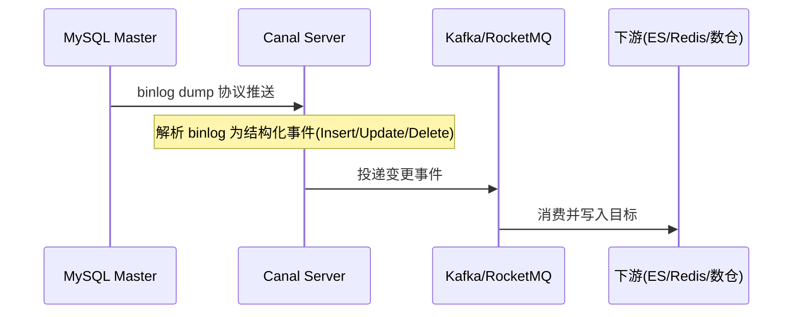

# 数据同步 CDC（Canal）

> 经典痛点：MySQL 改了数据，Redis 缓存还是旧的（超卖）；或要把 MySQL 实时同步到 ES 做搜索、到数仓做分析——定时任务太慢。本文讲清 **Canal 怎么基于 binlog 做毫秒级增量同步**，以及 CDC 的整体套路。
> 开源参考：[alibaba/canal](https://github.com/alibaba/canal)（Java，阿里开源，MySQL binlog 增量订阅 & 消费组件，伪装 slave 拉 binlog，可投递 Kafka / RocketMQ / ES，多语言客户端）。

---

## 一、CDC 是什么，为什么需要

**CDC（Change Data Capture，变更数据捕获）**：捕获数据库的增删改，实时同步到别处。

典型场景：

| 场景 | 说明 |
|------|------|
| 缓存一致性 | MySQL 改了 → 实时刷 Redis，避免超卖 / 脏读 |
| 异构索引 | MySQL 数据实时同步 ES 做搜索 |
| 实时数仓 | binlog → Kafka → Flink 实时计算 |
| 数据库镜像 / 备份 | 跨机房实时同步 |
| 业务解耦 | 数据变更事件驱动下游（如发消息、记审计） |

传统定时任务（每分钟扫一次）延迟高、扫全表压力大 → **CDC 基于 binlog 才是正解**。

---

## 二、Canal 核心原理：伪装成 MySQL Slave



基于 MySQL 主从复制协议：

1. MySQL master 写变更到 **binlog**。
2. Canal 伪装成 MySQL **slave**，向 master 发 `dump` 协议。
3. master 推送 binlog 给 Canal。
4. Canal 解析 binlog 字节流 → 结构化 `CanalEntry`（行级变更）。
5. 投递到下游（TCP / Kafka / RocketMQ / 经 adapter 写 ES、HBase 等）。

> 前置条件：MySQL 必须开启 binlog 且格式为 **ROW**（行模式，才能拿到行级前后值）；Canal 用户需 `REPLICATION SLAVE` + `REPLICATION CLIENT` 权限；`server-id` 不能与 master 及其他 slave 冲突。

---

## 三、Canal 架构组件

| 组件 | 作用 |
|------|------|
| **canal.deployer（Server）** | 伪装 slave、连 master、解析 binlog，按 instance 管理同步通道 |
| **canal.instance** | 一个同步实例对应一个数据源，配置库地址 / 账号 / 表过滤规则 |
| **canal.adapter** | 可选适配器，直接把数据写目标（ES / HBase / RDB），支持全量 + 增量 |
| **canal.admin** | Web 控制台，集中管理 instance 配置、监控、日志 |
| **client** | 自写客户端订阅 Canal Server，自定义消费逻辑 |

投递能力：原生支持 **Kafka / RocketMQ**；adapter 可对接 ES、HBase、RDB 等；多语言客户端（Java / Go / Python / C# / PHP / Rust / Node）。

---

## 四、实战：MySQL → Redis 缓存一致性

最常见的用法。流程：Canal 监听订单表 binlog → 投递到应用消费 → 更新 Redis。

```java
// 伪代码：消费 Canal 变更，刷新缓存
@StreamListener("canalOrder")
public void onChange(CanalEntry entry) {
    for (RowChange row : entry.getRowChanges()) {
        if (row.getEventType() == UPDATE || row.getEventType() == INSERT) {
            Order o = parse(row.getAfterColumns());
            redis.set("order:" + o.getId(), o);          // 更新缓存
        } else if (row.getEventType() == DELETE) {
            redis.del("order:" + entry.getBeforeColumns().getId());
        }
    }
}
```

注意：**收到变更即刷新**，可能有「binlog 顺序 vs 缓存写顺序」问题，下游要保证**幂等**（以最新版本号 / 时间戳覆盖）。

---

## 五、实战：MySQL → Elasticsearch

用 canal.adapter 的 `es7/*.yml` 配置表级映射：

```yaml
dataSourceKey: defaultDS
destination: example
groupId: g1
esMapping:
  _index: user
  _id: user_id
  sql: "SELECT id AS user_id, username, fullname FROM user"
  commitBatch: 3000
```

---

## 六、一致性保障机制（生产必看）

| 机制 | 作用 |
|------|------|
| **位点（Position）管理** | 记录 binlog 消费位点（ZM / 本地文件），宕机恢复续传，不丢数据 |
| **ACK 机制** | 客户端处理完一批才 ACK，服务端才删除，防丢 |
| **事务粒度** | 按事务聚合 binlog 事件，保证一个事务整体处理 |
| **幂等设计** | 下游必须幂等（重试 / 重复投递不重复写） |
| **断点续传** | 支持从断点继续消费 |

---

## 七、与其他 CDC 方案对比

| 方案 | 原理 | 优点 | 缺点 |
|------|------|------|------|
| **Canal（阿里）** | 伪装 slave 解析 binlog | 成熟、生态全、国内案例多 | 主要 MySQL；admin 运维 |
| **Debezium** | 基于 Kafka Connect 捕获 | 多数据库（MySQL/PG/Oracle）、云原生 | 依赖 Kafka Connect，较重 |
| **Maxwell** | binlog → JSON → Kafka | 轻量、输出规整 JSON | 功能较简单 |
| **Flink CDC** | 流批一体捕获 | 直接进 Flink 计算、无独立中间件 | 需 Flink 栈 |

选型：Java 栈、MySQL、要可视化管控 → **Canal**；已用 Flink / 多数据源 → **Debezium / Flink CDC**。

---

## 八、常见坑

1. **binlog 格式不是 ROW**：Canal 拿不到行级前后值 → 必须 `binlog-format=ROW`。
2. **server-id 冲突**：Canal 的 slaveId 与 MySQL server-id 或其他 slave 重复 → 主从复制冲突，同步失败。
3. **下游消费慢 / 堆积**：Canal 推送快、消费慢 → 用 Kafka 解耦 + 增加消费并发；监控 lag。
4. **乱序导致缓存脏数据**：下游用版本号 / 时间戳保证以最新为准。
5. **DDL 变更**：表结构变了，adapter 映射可能失效，需同步更新配置。
6. **大事务 binlog**：超大事务产生巨量 binlog，Canal 内存压力 → 拆分业务事务。
7. **位点丢失**：ZK / 文件损坏导致重头消费 → 定期备份位点，下游幂等兜底。

---

## 九、面试高频速查

- **Canal 原理？** 伪装 MySQL slave，发 dump 协议拉 binlog，解析为结构化事件投递下游。
- **为什么要求 binlog ROW 格式？** 只有 ROW 模式才有行级前后镜像，能精确还原变更。
- **和定时任务同步比？** Canal 毫秒级、无侵入、不扫全表；定时任务延迟高、压力大。
- **缓存一致性怎么保证？** binlog 变更即刷缓存 + 下游幂等 + 版本号防乱序。
- **Canal vs Debezium？** Canal 偏 MySQL/国内生态；Debezium 多数据库、Kafka 原生。
- **和 MQ 事务消息区别？** Canal 是「数据层」CDC（捕获 DB 变更）；事务消息是「业务层」主动发（见 MQ 篇）。

---

## 十、与其他板块的关系

- 和「**基础知识/MQ**」：Canal 常投递到 Kafka / RocketMQ，再由下游消费。
- 和「**基础知识/ES 体系**」：Canal 是把 MySQL 实时同步到 ES 的标准管道。
- 和「**基础知识/Redis**」：Canal 是解决「缓存与 DB 一致性」的权威方案。
- 和「**大数据/Flink**」：binlog → Kafka → Flink 构成实时数仓链路。
