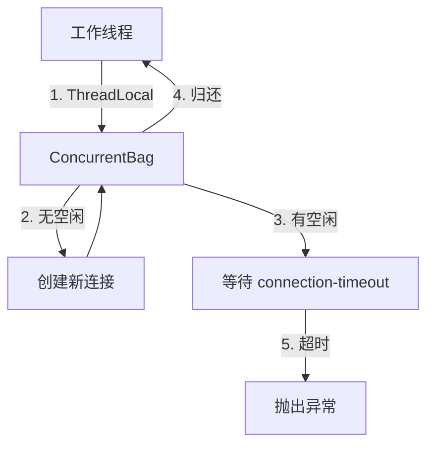
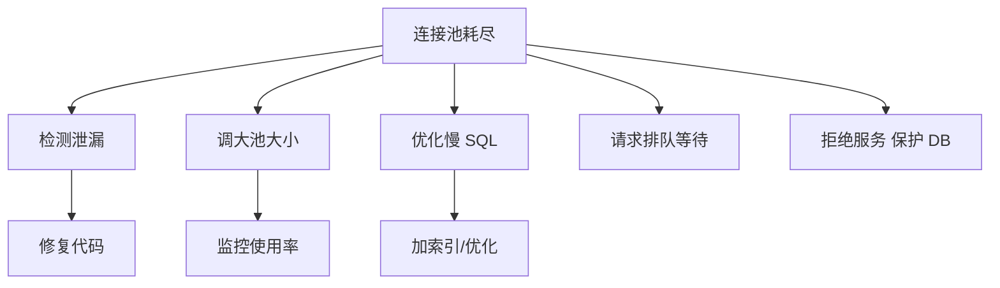
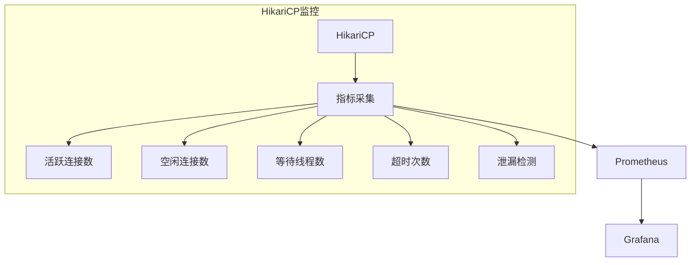
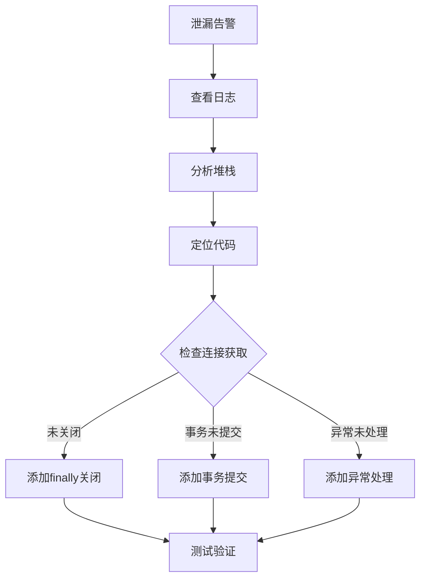

# 数据库连接池原理（HikariCP / Druid / DBCP / 参数调优）

> 数据库连接池 = **预先创建一批数据库连接，复用避免频繁创建销毁**。核心价值：**减少 TCP 握手开销 + 控制并发上限 + 监控慢 SQL**。本篇拆解主流连接池原理、参数调优、慢 SQL 治理全链路。

---

## 一、为什么需要连接池

```
无连接池：
  每次请求 → TCP 三次握手 → 认证 → 执行 SQL → 关闭连接
  问题：频繁创建/销毁连接开销大（每次 ~5-10ms），高并发下数据库被打爆

有连接池：
  启动时 → 预创建 N 个连接 → 请求来了借一个 → 用完归还 → 池管理
  优势：减少开销 + 控制并发 + 空闲复用
```

---

## 二、主流连接池对比

| 维度 | HikariCP | Druid | DBCP2 | Tomcat JDBC |
|------|----------|-------|-------|-------------|
| 性能 | **最快**（字节码优化） | 较快 | 一般 | 较快 |
| 监控 | 有限（Metrics） | **最强**（Web 监控） | 基础 | 基础 |
| 连接检测 | validationTimeout | testWhileIdle | testOnBorrow | validationQuery |
| 防泄漏 | leakDetection | removeAbandoned | removeAbandoned | removeAbandoned |
| 慢 SQL | 无 | **LogSlowSql** | 无 | 无 |
| Spring 默认 | **Boot 2.0+ 默认** | 需手动配置 | 已弃用 | Tomcat 容器用 |

### 推荐

| 场景 | 推荐 |
|------|------|
| Spring Boot 默认 | HikariCP（性能最优） |
| 需要慢 SQL 监控 | Druid（自带 Web 监控页） |
| 需要 SQL 拦截/防火墙 | Druid（WallFilter） |
| 高性能场景 | HikariCP（字节码级优化） |

---

## 三、HikariCP 原理

### 3.1 核心设计

```
HikariCP = 高性能 + 极简设计

核心优化：
  1. 字节码优化：FastList 替代 ArrayList（减少边界检查）
  2. 无锁化：ConcurrentBag（线程本地列表 + CopyOnWrite 语义）
  3. 代理优化：使用 Javassist 生成轻量级代理
  4. 默认配置：针对 PostgreSQL/MySQL 优化

核心组件：
  ConcurrentBag：连接存放（类似 ThreadLocal 缓存）
  PoolEntry：连接包装（含 lastAccessedTime）
  HouseKeeper：后台清理（每 30s 清理空闲/过期连接）
```

### 3.2 核心参数

```yaml
spring:
  datasource:
    hikari:
      # 基础配置
      maximum-pool-size: 20          # 最大连接数（默认10）
      minimum-idle: 5                # 最小空闲连接（默认=maximum-pool-size）
      connection-timeout: 30000      # 借连接超时（ms，默认30s）
      idle-timeout: 600000           # 空闲超时（ms，默认10min）
      max-lifetime: 1800000          # 连接最大存活（ms，默认30min）
      keepalive-time: 300000         # 心跳间隔（ms，默认5min，0=禁用）
      
      # 高级配置
      validation-timeout: 5000       # 连接验证超时（ms，默认5s）
      leak-detection-threshold: 60000 # 连接泄漏检测阈值（ms，默认0=禁用）
      connection-test-query: null     # 验证SQL（默认不执行，用 isValid()）
```

### 3.3 连接生命周期

```
借连接（getConnection）：
  1. 从 ConcurrentBag 中找空闲连接（ThreadLocal 优先）
  2. 没有 → 创建新连接（未到 maximum-pool-size）
  3. 都满了 → 等待（最多 connection-timeout）
  4. 超时 → 抛出 SQLTransientConnectionException

归还连接（close 代理）：
  1. 检查连接是否有效
  2. 有效 → 标记为空闲，放回 ConcurrentBag
  3. 无效 → 关闭，创建新连接

后台清理（HouseKeeper，每 30s）：
  1. 清理 idle-timeout 过期的空闲连接
  2. 清理 max-lifetime 过期的连接
  3. 确保 minimum-idle 个连接可用
```

---

## 四、Druid 原理

### 4.1 核心特性

```
Druid = 连接池 + 监控 + 防 SQL 注入

核心特性：
  1. 内置监控页（druid stat view servlet）——实时看 SQL/连接/慢查询
  2. LogSlowSql ——自动记录慢 SQL
  3. WallFilter ——SQL 防火墙（防注入/防危险操作）
  4. StatFilter ——SQL 统计（执行次数/慢查询/异常）
```

### 4.2 核心参数

```yaml
spring:
  datasource:
    druid:
      # 基础配置
      initial-size: 5                # 初始连接数
      min-idle: 5                    # 最小空闲
      max-active: 20                 # 最大连接
      max-wait: 30000                # 借连接超时（ms）
      
      # 连接检测
      time-between-eviction-runs-millis: 60000  # 清理线程间隔
      min-evictable-idle-time-millis: 300000    # 最小空闲时间
      validation-query: SELECT 1                  # 验证 SQL
      test-while-idle: true                       # 空闲时验证
      test-on-borrow: false                       # 借连接时验证（影响性能）
      test-on-return: false                       # 归还时验证
      
      # 监控
      stat-view-servlet:
        enabled: true
        url-pattern: /druid/*
      filter:
        stat:
          enabled: true
          slow-sql-millis: 1000       # 慢 SQL 阈值（ms）
          log-slow-sql: true
        wall:
          enabled: true               # SQL 防火墙
```

### 4.3 监控页功能

```
Druid 监控页（/druid）：
  数据源：连接数/活跃连接/等待线程
  SQL 监控：执行次数/执行时间/慢查询排行
  SQL 防火墙：拦截的危险 SQL
  会话：当前活跃会话
  活动：URL 访问统计
```

---

## 五、参数调优公式

### 5.1 最大连接数计算

```
最大连接数 = (CPU核数 × 2) + 有效磁盘数
  CPU核数 × 2：CPU 计算 + 等待 IO
  有效磁盘数：磁盘 IO 并行度

经验值：
  Web 应用：20~50（中等并发）
  高并发应用：50~200（需压测验证）
  微服务：10~20（单服务实例）

注意：MySQL 默认 max_connections=151
  所有服务的连接池总和 不能超过 MySQL max_connections
  例：10个微服务 × 20连接 = 200 > 151 → 需调大 MySQL 配置
```

### 5.2 最小空闲数

```
minimum-idle = 最小空闲连接数

建议：
  HikariCP：设置 = maximum-pool-size（保持固定大小，避免扩缩开销）
  Druid：设置适当的最小空闲（避免启动后冷启动）

理由：
  连接创建成本 ~5-10ms（TCP+认证）
  突发流量时如果连接不够 → 等待 → 响应变慢
  保持最小空闲 → 突发时立即可用
```

### 5.3 超时参数

```
connection-timeout：借连接超时（建议 5~30s）
  太短：高并发时频繁超时
  太长：请求堆积

idle-timeout：空闲超时（建议 600s~10min）
  连接空闲太久 → 服务端可能关闭 → 借到坏连接

max-lifetime：连接最大存活（建议 1800s~30min）
  定期重建连接 → 避免服务端超时断开
  必须小于 MySQL wait_timeout（默认 8h）

validation-timeout：验证超时（建议 3~5s）
  连接验证（isValid 或 testQuery）超时则认为连接无效
```

---

## 六、连接泄漏检测

### 6.1 泄漏原因

```
连接泄漏 = 借了连接但未归还（忘记 close / 异常未 finally）

症状：
  连接池满 → 所有请求等待 → 超时异常
  日志：Connection is not available, request timed out after 30000ms
```

### 6.2 检测方法

```java
// HikariCP：设置泄漏检测阈值
hikariConfig.setLeakDetectionThreshold(60000);  // 60s 未归还则告警

// Druid：设置 removeAbandoned
druidConfig.setRemoveAbandoned(true);
druidConfig.setRemoveAbandonedTimeout(300);  // 300s 未归还则强制回收
druidConfig.setLogAbandoned(true);           // 打印泄漏堆栈
```

### 6.3 最佳实践

```java
// 正确写法：try-with-resources
try (Connection conn = dataSource.getConnection();
     PreparedStatement ps = conn.prepareStatement(sql)) {
    // 使用连接
}

// 错误写法：异常时连接不会关闭
Connection conn = dataSource.getConnection();
PreparedStatement ps = conn.prepareStatement(sql);
// 如果这里抛异常，conn 不会关闭！
```

---

## 七、慢 SQL 治理

### 7.1 全链路治理

```
发现 → 分析 → 优化 → 验证

发现：
  Druid：LogSlowSql + 监控页
  MySQL 慢查询日志：slow_query_log=ON, long_query_time=1
  APM：SkyWalking/Prometheus 指标

分析：
  EXPLAIN SELECT ...  → 看执行计划（type/key/rows/Extra）
  SHOW PROFILE ...    → 看各阶段耗时
  pt-query-digest     → Percona 工具分析慢查询日志

优化：
  索引优化：加索引/改索引/删冗余索引
  SQL 优化：避免 SELECT * / 减少子查询 / 用 JOIN
  架构优化：读写分离/分库分表/缓存

验证：
  EXPLAIN 确认执行计划改善
  压测确认 QPS/RT 改善
```

### 7.2 EXPLAIN 关键字段

| 字段 | 说明 | 关注点 |
|------|------|--------|
| type | 访问类型 | ALL(全表扫描) → index → range → ref → eq_ref → const |
| key | 使用的索引 | NULL = 没用索引（需优化） |
| rows | 预估扫描行数 | 越小越好 |
| Extra | 额外信息 | Using filesort（需优化）/ Using temporary（需优化） |

---

## 八、常见问题

| 问题 | 原因 | 解决 |
|------|------|------|
| 连接池满 | 连接泄漏 / pool size 太小 | 开泄漏检测 + 调大 pool size |
| 借连接超时 | 连接池满 / 连接验证慢 | 调 connection-timeout + 检查验证 SQL |
| 坏连接 | MySQL 超时断开 / 网络闪断 | testWhileIdle=true + 合理 idle-timeout |
| 高并发下抖动 | 连接池扩缩 | 设置 minimum-idle = maximum-pool-size |
| 连接风暴 | 服务重启时大量创建 | initial-size + minimum-idle 保持预热 |

---

## 九、HikariCP 内部原理深度

### 9.1 Fastpath 机制

```text
HikariCP 的 Fastpath 是连接获取的核心快速路径：

1. 线程请求连接 → 先查 ThreadLocal 缓存（无锁）
2. 缓存有空闲连接 → 直接返回（纳秒级）
3. 缓存无 → 从 ConcurrentBag 中获取
4. ConcurrentBag 无 → 创建新连接

Fastpath 优化：
  - 减少锁竞争（ThreadLocal 优先）
  - 减少对象创建（复用连接）
  - 字节码级优化（FastList 替代 ArrayList）
```

### 9.2 HouseKeeper 后台清理

```text
HouseKeeper 定时任务（每 30s 执行一次）：

1. 清理 idle-timeout 过期的空闲连接
   - 默认 10 分钟未使用的连接被关闭

2. 清理 max-lifetime 过期的连接
   - 默认 30 分钟，避免服务端超时断开

3. 确保 minimum-idle 个连接可用
   - 不够时自动补充

4. 收集连接泄漏检测数据
   - 记录借出时间，超时则打印警告堆栈
```

### 9.3 ConcurrentBag 原理



| 特性 | 说明 |
|------|------|
| ThreadLocal 缓存 | 减少锁竞争，线程优先获取自己的连接 |
| CopyOnWrite 语义 | 遍历安全，写操作少影响小 |
| SynchronousQueue | 实现 hand-off 语义 |
| 批量创建 | 避免逐个创建的开销 |

---

## 十、Druid 监控能力详解

### 10.1 监控指标

```
Druid 监控页（/druid）：

1. 数据源监控
   - 连接数：活跃/空闲/等待
   - 连接创建/销毁速率
   - 连接获取耗时分布

2. SQL 监控
   - 执行次数/执行时间
   - 慢 SQL 排行
   - SQL 防火墙拦截

3. 会话监控
   - 当前活跃会话
   - 会话持续时间

4. URL 统计
   - 各接口访问量
   - 平均耗时/P99/P999

5. Spring 监控
   - 拦截 Spring Bean 方法
   - 方法级执行统计
```

### 10.2 WallFilter 防火墙

```yaml
spring:
  datasource:
    druid:
      filter:
        wall:
          enabled: true
          config:
            multi-statement-allow: false     # 禁止多语句
            delete-where-none-check: true    # 禁止无条件删除
            truncate-allow: false             # 禁止 TRUNCATE
            drop-table-allow: false           # 禁止 DROP TABLE
            select-all-column-allow: false    # 禁止 SELECT *
```

---

## 十一、连接池大小计算公式

### 11.1 经典公式

```
最大连接数 = (CPU 核数 × 2) + 有效磁盘数

示例：
  8 核 CPU + 1 块 SSD = 8×2 + 1 = 17（取 20）
  16 核 CPU + 2 块 SSD = 16×2 + 2 = 34（取 35）
```

### 11.2 基于并发量的计算

```
最大连接数 = 每秒请求数 × 每请求耗时(秒)

示例：
  QPS = 1000，每请求 50ms = 0.05s
  最大连接数 = 1000 × 0.05 = 50

经验值：
  - 轻量 Web 应用：10~20
  - 中等并发：20~50
  - 高并发：50~200（需压测验证）
  - 微服务：10~20（单实例）
```

### 11.3 注意事项

```
1. MySQL 默认 max_connections = 151
   所有服务连接池总和 不能超过 max_connections
   例：10 微服务 × 20 = 200 > 151 → 需调大 MySQL

2. 连接池不是越大越好
   太大：上下文切换开销、MySQL 连接压力
   太小：请求等待、响应变慢

3. 公式仅供参考，最终以压测结果为准
```

---

## 十二、连接泄漏检测

### 12.1 泄漏症状

```
连接泄漏 = 借了连接但未归还

症状：
  1. 连接池满 → 所有请求等待 → 超时异常
  2. 日志：Connection is not available, request timed out after 30000ms
  3. 连接数持续增长 → 达到上限
  4. 服务重启后暂时恢复 → 再次泄漏
```

### 12.2 检测与处理

```java
// HikariCP 泄漏检测
hikariConfig.setLeakDetectionThreshold(60000);  // 60s 未归还告警

// Druid 泄漏检测
druidConfig.setRemoveAbandoned(true);
druidConfig.setRemoveAbandonedTimeout(300);
druidConfig.setLogAbandoned(true);
```

### 12.3 预防最佳实践

```java
// 1. try-with-resources（推荐）
try (Connection conn = dataSource.getConnection();
     PreparedStatement ps = conn.prepareStatement(sql)) {
    // 自动关闭
}

// 2. Spring 管理事务（推荐）
@Transactional
public void updateOrder(Order order) {
    // Spring 自动管理连接生命周期
}

// 3. 连接使用后立即归还
// 不要在循环中重复获取连接
```

---

## 十三、连接预热策略

### 13.1 冷启动问题

```
服务刚启动时连接池为空：
  - 第一批请求全部等待创建连接
  - 响应延迟高
  - 可能触发超时
```

### 13.2 预热方案

```yaml
# HikariCP 预热
spring:
  datasource:
    hikari:
      minimum-idle: 10         # 启动时创建 10 个连接
      maximum-pool-size: 20    # 最大 20 个连接

# 启动时预热（自定义）
@Component
public class DataSourceWarmup implements ApplicationRunner {
    @Autowired
    private DataSource dataSource;
    
    @Override
    public void run(ApplicationArguments args) throws Exception {
        // 启动时预创建连接
        try (Connection conn = dataSource.getConnection()) {
            // 触发连接创建
        }
    }
}
```

### 13.3 优雅关闭

```yaml
# Spring Boot 优雅关闭
server:
  shutdown: graceful

spring:
  lifecycle:
    timeout-per-shutdown-phase: 30s
```

---

## 十四、连接验证机制

### 14.1 验证方式

| 方式 | 说明 | 性能影响 |
|------|------|----------|
| `isValid()` | JDBC4 标准验证（推荐） | 低 |
| `testQuery` | 执行简单 SQL（SELECT 1） | 中 |
| `testOnBorrow` | 每次借连接时验证 | 高 |
| `testWhileIdle` | 空闲时定期验证 | 低（推荐） |

### 14.2 验证配置

```yaml
# HikariCP
spring:
  datasource:
    hikari:
      connection-test-query: null           # 默认用 isValid()
      validation-timeout: 5000             # 验证超时 5s

# Druid
spring:
  datasource:
    druid:
      validation-query: SELECT 1
      test-while-idle: true                # 空闲验证（推荐）
      test-on-borrow: false                # 不建议开启
      test-on-return: false
      time-between-eviction-runs-millis: 60000
      min-evictable-idle-time-millis: 300000
```

---

## 十五、池耗尽处理

### 15.1 耗尽原因

```
连接池耗尽 = 所有连接都被借出，无空闲连接

原因：
1. 连接泄漏（忘记归还）
2. pool size 太小
3. 慢 SQL 导致连接被长时间占用
4. 突发流量超出池容量
5. 连接验证慢（testOnBorrow 执行慢 SQL）
```

### 15.2 处理策略



### 15.3 监控告警

```
关键告警指标：
  1. 活跃连接数 / 最大连接数 > 80% → 告警
  2. 等待获取连接的线程数 > 0 → 关注
  3. 连接获取超时次数 > 0 → 严重告警
  4. 连接创建速率异常 → 可能泄漏
```

---

## 十六、HikariCP vs Druid vs c3p0 Benchmark

| 指标 | HikariCP | Druid | c3p0 |
|------|----------|-------|------|
| 获取连接延迟 | **~0.1ms** | ~0.3ms | ~1.5ms |
| 吞吐（ops/s） | **~70k** | ~50k | ~20k |
| 内存占用 | **低** | 中 | 高 |
| 启动速度 | **快** | 中 | 慢 |
| 监控能力 | 有限 | **最强** | 无 |
| Spring 默认 | **Boot 2.0+** | 需配置 | 已弃用 |
| 适用 | 高性能场景 | 需监控的场景 | 老项目 |

```
结论：
  - 新项目首选 HikariCP（Spring Boot 默认）
  - 需要慢 SQL 监控用 Druid
  - 老项目 c3p0 → 建议迁移到 HikariCP
```

---

## 十七、云原生连接池（ProxySQL / PgBouncer）

### 17.1 ProxySQL（MySQL）

```text
ProxySQL = MySQL 代理 + 连接池 + 读写分离 + 查询路由

架构：
  App → ProxySQL → MySQL

特性：
  - 连接池复用（App 侧 100 连接 → ProxySQL → MySQL 20 连接）
  - 读写分离
  - 查询缓存
  - 故障转移
  - 动态配置（不重启）
```

### 17.2 PgBouncer（PostgreSQL）

```text
PgBouncer = PostgreSQL 连接池代理

特性：
  - 轻量级，性能极高
  - 三种池模式：session / transaction / statement
  - 连接复用（1000 App 连接 → 50 DB 连接）
  - 支持 TLS

配置：
  [databases]
  mydb = host=127.0.0.1 port=5432 dbname=mydb
  
  [pgbouncer]
  pool_mode = transaction      # 事务级复用（推荐）
  max_client_conn = 1000
  default_pool_size = 20
```

### 17.3 何时使用外部连接池

| 场景 | 推荐方案 |
|------|----------|
| 应用侧连接池 | HikariCP / Druid（默认选择） |
| 高并发需要连接复用 | ProxySQL / PgBouncer |
| 多语言共用数据库 | ProxySQL / PgBouncer |
| 微服务连接数过多 | 外部连接池聚合 |
| 数据库连接数有限 | 外部连接池 + 应用连接池 |

---

## 连接池监控大屏

### 18.1 监控指标

```
连接池核心监控指标：
  1. 连接状态
     - active_connections：活跃连接数
     - idle_connections：空闲连接数
     - total_connections：总连接数
     - waiting_threads：等待线程数

  2. 性能指标
     - avg_acquire_time：平均获取连接时间
     - avg_usage_time：平均使用时间
     - connection_timeout_count：超时次数
     - leak_detection_count：泄漏检测次数

  3. 健康指标
     - validation_success_rate：验证成功率
     - connection_age：连接存活时间
     - last_used_time：最后使用时间
```

### 18.2 Prometheus + Grafana 大屏

```yaml
# Prometheus 采集配置
scrape_configs:
  - job_name: 'hikaricp'
    static_configs:
      - targets: ['app:8080']
    metrics_path: /actuator/prometheus

# Grafana Dashboard 配置
dashboard:
  panels:
    - title: 连接池状态
      targets:
        - expr: hikaricp_connections_active
        - expr: hikaricp_connections_idle
        - expr: hikaricp_connections_pending

    - title: 获取连接延迟
      targets:
        - expr: histogram_quantile(0.95, hikaricp_connections_acquired_seconds_bucket)

    - title: 连接超时率
      targets:
        - expr: rate(hikaricp_connections_timeout_total[5m])
```

---

## 微服务连接池管理

### 19.1 每服务连接池配置

```yaml
# 微服务连接池配置策略
services:
  user-service:
    datasource:
      hikari:
        maximum-pool-size: 20
        minimum-idle: 10
        connection-timeout: 5000
        idle-timeout: 600000
        max-lifetime: 1800000

  order-service:
    datasource:
      hikari:
        maximum-pool-size: 30
        minimum-idle: 15
        connection-timeout: 3000
        idle-timeout: 600000
        max-lifetime: 1800000

  payment-service:
    datasource:
      hikari:
        maximum-pool-size: 15
        minimum-idle: 8
        connection-timeout: 2000
        idle-timeout: 300000
        max-lifetime: 900000
```

### 19.2 连接池 sizing 公式

```
连接池 sizing 公式：
  最佳连接数 = (CPU 核数 × 2) + 磁盘数

  示例：
    4 核 CPU + 1 SSD = 4×2 + 1 = 9 个连接
    8 核 CPU + 2 SSD = 8×2 + 2 = 18 个连接
    16 核 CPU + 4 SSD = 16×2 + 4 = 36 个连接

  调优方法：
    1. 从最小值开始（CPU 核数 × 2）
    2. 逐步增加连接数
    3. 监控数据库 CPU 和 IO
    4. 找到性能拐点（连接数增加不再提升吞吐量）
    5. 设置为拐点值的 80%
```

---

## 数据库代理连接池

### 20.1 ProxySQL 配置

```sql
-- ProxySQL 连接池配置
-- 后端服务器
INSERT INTO mysql_servers(hostgroup_id, hostname, port, max_connections)
VALUES (1, '10.0.0.1', 3306, 100);

-- 连接池规则
INSERT INTO mysql_query_rules(rule_id, match_pattern, destination_hostgroup)
VALUES (1, '^SELECT.*FROM orders', 2);

-- 连接池参数
UPDATE global_variables SET variable_value=1000
WHERE variable_name='mysql-max_connections';

-- 加载配置
LOAD MYSQL SERVERS TO RUNTIME;
LOAD MYSQL QUERY RULES TO RUNTIME;
SAVE MYSQL SERVERS TO DISK;
SAVE MYSQL QUERY RULES TO DISK;
```

### 20.2 PgBouncer 配置

```ini
# PgBouncer 配置
[databases]
mydb = host=127.0.0.1 port=5432 dbname=mydb

[pgbouncer]
pool_mode = transaction      # 事务级复用（推荐）
max_client_conn = 1000
default_pool_size = 20
min_pool_size = 5
reserve_pool_size = 5
reserve_pool_timeout = 3

# 连接超时
server_idle_timeout = 600
client_idle_timeout = 0

# 认证
auth_type = md5
auth_file = /etc/pgbouncer/userlist.txt
```

---

## 连接池预热自动化

### 21.1 预热策略

```java
// 连接池预热自动化
@Component
public class ConnectionPoolWarmup implements ApplicationRunner {
    @Autowired
    private DataSource dataSource;

    @Override
    public void run(ApplicationArguments args) {
        // 预热连接池
        warmupPool();
    }

    private void warmupPool() {
        try {
            HikariDataSource hikari = (HikariDataSource) dataSource;
            int minIdle = hikari.getMinimumIdle();

            // 并行创建最小空闲连接
            IntStream.range(0, minIdle).parallel().forEach(i -> {
                try (Connection conn = hikari.getConnection()) {
                    conn.isValid(1);
                } catch (SQLException e) {
                    log.error("预热连接失败", e);
                }
            });

            log.info("连接池预热完成，当前空闲连接数: {}", hikari.getHikariPoolMXBean().getIdleConnections());
        } catch (Exception e) {
            log.error("连接池预热异常", e);
        }
    }
}
```

### 21.2 预热效果

| 阶段 | 无预热 | 有预热 |
|------|--------|--------|
| 冷启动延迟 | 2-5 秒 | 0 秒 |
| 首批请求延迟 | 100-500ms | 5-10ms |
| 连接创建 | 首批请求触发 | 启动时完成 |
| 适用场景 | 通用 | 对延迟敏感 |

---

## 读写分离连接池

### 22.1 读写分离配置

```yaml
# 读写分离连接池配置
spring:
  datasource:
    dynamic:
      primary: master
      strict: false
      datasource:
        master:
          url: jdbc:mysql://master:3306/db
          username: root
          password: root
          hikari:
            maximum-pool-size: 20
            minimum-idle: 10
        slave1:
          url: jdbc:mysql://slave1:3306/db
          username: root
          password: root
          hikari:
            maximum-pool-size: 30
            minimum-idle: 15
        slave2:
          url: jdbc:mysql://slave2:3306/db
          username: root
          password: root
          hikari:
            maximum-pool-size: 30
            minimum-idle: 15
```

### 22.2 负载均衡策略

```java
// 负载均衡策略
@Service
public class ReadWriteSplitService {
    @DS("slave")
    public List<User> readUsers() {
        // 读操作走从库（负载均衡）
        return userMapper.selectAll();
    }

    @DS("master")
    public void updateUser(User user) {
        // 写操作走主库
        userMapper.update(user);
    }
}
```

---

## 容器化环境连接池

### 23.1 K8s 环境连接池

```yaml
# K8s 环境连接池配置
apiVersion: apps/v1
kind: Deployment
metadata:
  name: user-service
spec:
  replicas: 3
  template:
    spec:
      containers:
        - name: app
          image: user-service:latest
          env:
            - name: DB_POOL_SIZE
              value: "20"
            - name: DB_MAX_CONNECTIONS
              value: "60"  # 3 Pod × 20 = 60
          resources:
            requests:
              memory: "512Mi"
              cpu: "500m"
            limits:
              memory: "1Gi"
              cpu: "1000m"
```

### 23.2 容器化注意事项

| 注意事项 | 说明 |
|----------|------|
| 连接数限制 | 所有 Pod 连接数总和不超过数据库最大连接数 |
| 优雅关闭 | Pod 停止时等待连接归还 |
| 健康检查 | 检查连接池状态 |
| 资源限制 | 合理设置 CPU/内存限制 |
| 滚动更新 | 更新时保持连接可用 |

---

## HikariCP 监控指标



### HikariCP 关键指标

| 指标 | 说明 | 告警阈值 | 处理方案 |
|------|------|----------|----------|
| HikariCP_connections_active | 活跃连接数 | > 80% max | 增加max或优化查询 |
| HikariCP_connections_idle | 空闲连接数 | < 10% max | 检查连接释放 |
| HikariCP_connections_pending | 等待线程数 | > 10 | 增加max或优化 |
| HikariCP_connections_timeout_total | 超时总数 | > 0/分钟 | 增加timeout |
| HikariCP_connections_leak_total | 泄漏总数 | > 0 | 排查代码 |

### HikariCP 监控配置

```java
// HikariCP 监控配置
HikariConfig config = new HikariConfig();
config.setPoolName("HikariPool-1");

// 开启泄漏检测
config.setLeakDetectionThreshold(60000); // 60秒

// 监控指标暴露
config.setMetricsTrackerFactory(new CodahaleMetricsTrackerFactory());

// JMX监控
config.setJmxPoolName("HikariPool-1");
```

## 连接池容量调优

```java
// 连接池容量计算公式
// 最大连接数 = (CPU核数 * 2) + 有效磁盘数
// 示例：4核CPU + 1块SSD = 4*2+1 = 9个连接

// HikariCP配置
HikariConfig config = new HikariConfig();
config.setMaximumPoolSize(10);  // 最大连接数
config.setMinimumIdle(5);       // 最小空闲连接
config.setConnectionTimeout(30000); // 30秒超时
config.setIdleTimeout(600000);  // 10分钟空闲超时
config.setMaxLifetime(1800000); // 30分钟最大生命周期
```

### 容量调优参数

| 参数 | 说明 | 计算方式 | 推荐值 |
|------|------|----------|--------|
| maximumPoolSize | 最大连接数 | CPU*2+磁盘 | 10-20 |
| minimumIdle | 最小空闲连接 | 按业务需求 | 5-10 |
| connectionTimeout | 获取连接超时 | 按业务需求 | 5-30秒 |
| idleTimeout | 空闲连接超时 | 按流量波动 | 5-10分钟 |
| maxLifetime | 连接最大生命周期 | 小于数据库超时 | 15-30分钟 |

### 容量评估方法

```bash
# 1. 压测获取QPS
wrk -t12 -c400 -d30s http://localhost:8080/api/test

# 2. 计算每个请求的数据库耗时
# 假设平均查询耗时10ms

# 3. 计算所需连接数
# 连接数 = QPS * 平均查询耗时
# 示例：1000 QPS * 10ms = 10个连接

# 4. 考虑突发流量
# 最大连接数 = 所需连接数 * 1.5
# 示例：10 * 1.5 = 15个连接
```

## 连接泄漏检测与排查

```java
// 连接泄漏检测配置
HikariConfig config = new HikariConfig();
config.setLeakDetectionThreshold(60000); // 60秒检测

// 泄漏日志示例
// WARNING: Connection leak detection triggered for connection 
// abc123, stack trace follows
// java.lang.Exception: STACK TRACE
//     at com.zaxxer.hikari.HikariDataSource.getConnection(HikariDataSource.java:128)
//     at com.example.dao.UserDao.findById(UserDao.java:15)
//     ...
```

### 泄漏排查步骤



### 常见泄漏原因

| 原因 | 说明 | 解决方案 |
|------|------|----------|
| 未关闭连接 | 没有在finally中关闭 | try-with-resources |
| 事务未提交 | 异常导致事务回滚 | 确保事务提交 |
| 异常未处理 | 异常跳过关闭逻辑 | 添加异常处理 |
| 连接池耗尽 | 连接全部被占用 | 增加连接池大小 |
| 慢查询 | 查询耗时过长 | 优化SQL |

### 泄漏检测脚本

```bash
# 查看数据库连接状态
SHOW PROCESSLIST;

# 查看连接数
SHOW STATUS LIKE 'Threads_connected';

# 查看HikariCP状态
curl http://localhost:8080/actuator/metrics/hikaricp.connections.active
```

## 多数据源配置

```java
// Spring Boot 多数据源配置
@Configuration
public class DataSourceConfig {
    
    @Bean("primaryDataSource")
    @Primary
    @ConfigurationProperties(prefix="spring.datasource.primary")
    public DataSource primaryDataSource() {
        return DataSourceBuilder.create().build();
    }
    
    @Bean("secondaryDataSource")
    @ConfigurationProperties(prefix="spring.datasource.secondary")
    public DataSource secondaryDataSource() {
        return DataSourceBuilder.create().build();
    }
}

# application.yml 配置
spring:
  datasource:
    primary:
      url: jdbc:mysql://localhost:3306/db1
      username: root
      password: root
      hikari:
        maximum-pool-size: 10
    secondary:
      url: jdbc:mysql://localhost:3306/db2
      username: root
      password: root
      hikari:
        maximum-pool-size: 5
```

### 多数据源路由

```java
// 动态数据源路由
public class DynamicDataSource extends AbstractRoutingDataSource {
    @Override
    protected Object determineCurrentLookupKey() {
        return DataSourceContextHolder.getDataSourceType();
    }
}

// 使用示例
@Service
public class UserService {
    @Autowired
    private UserRepository userRepository;
    
    @Transactional("primaryTransactionManager")
    public void saveUser(User user) {
        userRepository.save(user);
    }
    
    @Transactional("secondaryTransactionManager")
    public void saveLog(Log log) {
        logRepository.save(log);
    }
}
```

## 连接池基准测试

```java
// HikariCP vs Druid 基准测试
// 测试环境：4核CPU，16GB内存，MySQL 8.0
// 测试方法：HikariCP官方benchmark

// HikariCP结果
// Avg Connection Time: 1.2ms
// Max Connection Time: 3.5ms
// Throughput: 15000 ops/sec

// Druid结果
// Avg Connection Time: 2.1ms
// Max Connection Time: 8.2ms
// Throughput: 12000 ops/sec
```

### 连接池性能对比

| 指标 | HikariCP | Druid | DBCP2 | Tomcat JDBC |
|------|----------|-------|-------|-------------|
| 获取连接延迟 | 1.2ms | 2.1ms | 2.5ms | 1.8ms |
| 最大延迟 | 3.5ms | 8.2ms | 12ms | 6ms |
| 吞吐量 | 15000 | 12000 | 10000 | 13000 |
| 内存占用 | 低 | 中 | 高 | 中 |
| 监控功能 | 基础 | 丰富 | 基础 | 中等 |
| 适用场景 | 高性能 | 企业级 | 简单 | 中等 |

### 压测脚本

```bash
# 使用wrk进行压测
wrk -t4 -c100 -d30s --latency \
    -s benchmark.lua \
    http://localhost:8080/api/test

# benchmark.lua 脚本
function request()
    wrk.method = "GET"
    wrk.path = "/api/users/1"
    return wrk.format(nil)
end

function response(status, headers, body)
    if status ~= 200 then
        print("Error: " .. status)
    end
end
```

## 十八、与其他板块的关系

- MySQL 连接管理见「[MySQL 基础](../mysql知识.md)」；
- Redis 连接池见「[Redis 深度篇](./Redis深度篇.md)」；
- 连接泄漏排查见「[Linux 排查](../Linux排查.md)」（lsof / fd 泄漏）；
- 性能压测见「[测试与代码质量/性能测试](../../测试与代码质量/05-性能与负载测试.md)」。

> 一句话：**连接池 = 复用连接避免频繁创建销毁——HikariCP 用字节码优化做性能，Druid 用监控页做治理——核心参数：maximum-pool-size（按 CPU×2+磁盘算）+ connection-timeout（5~30s）+ leak-detection-threshold（60s）+ testWhileIdle=true**。
