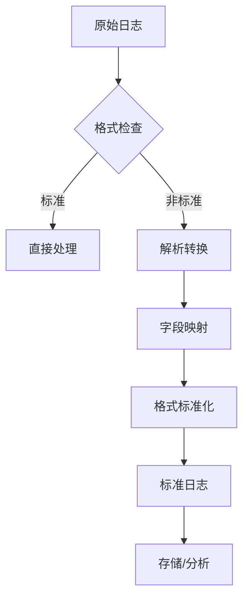
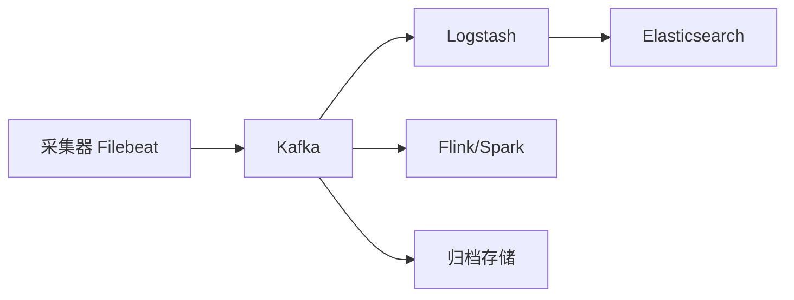
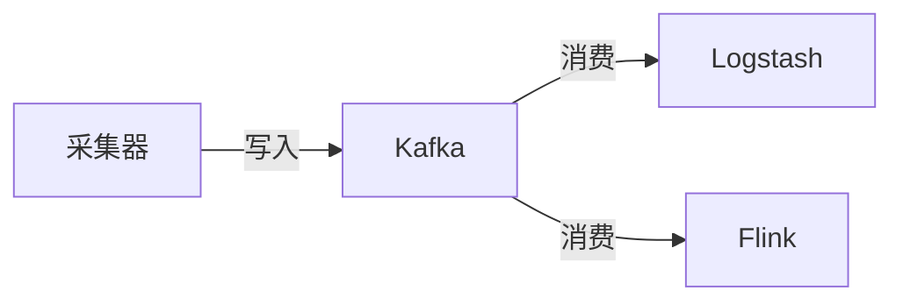
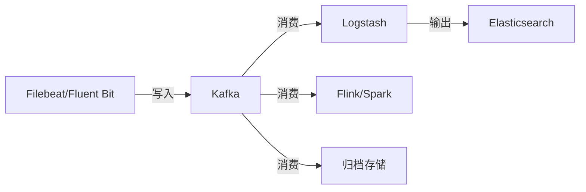
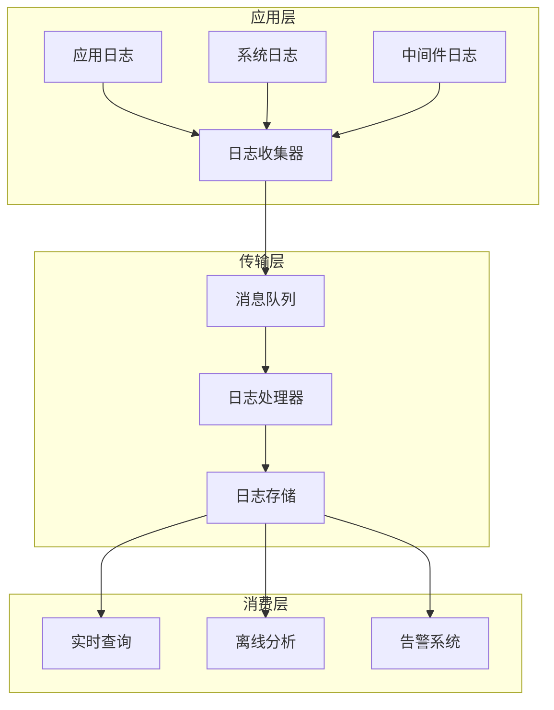
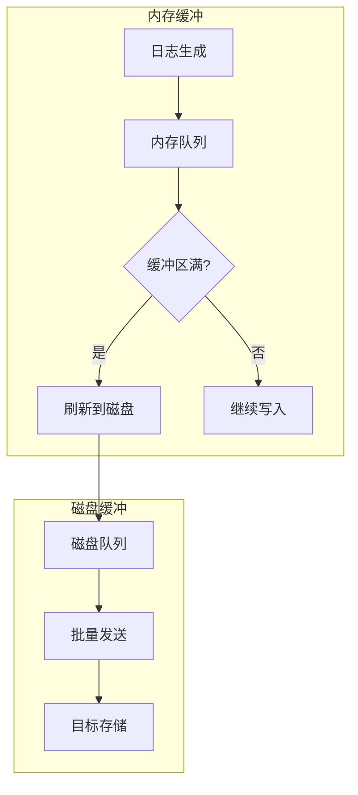
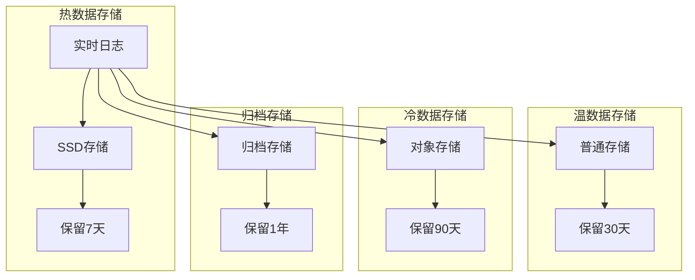
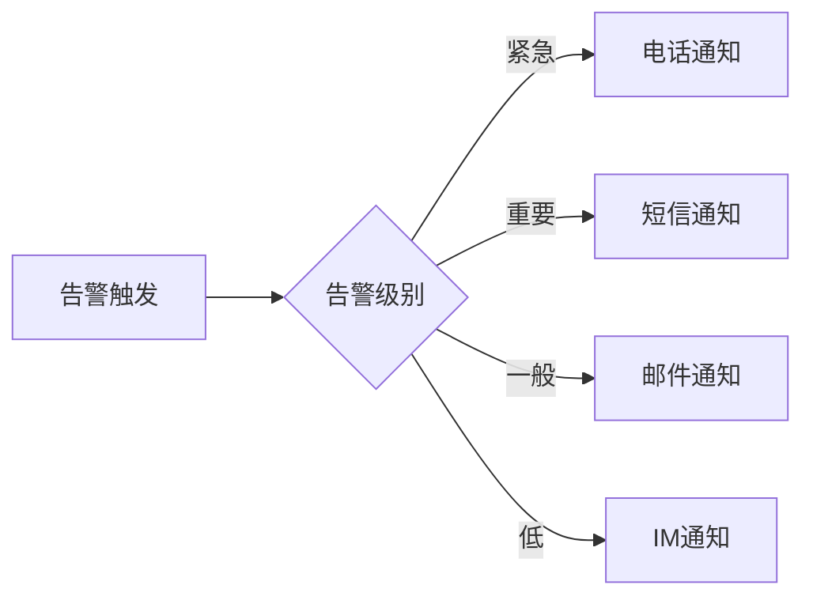
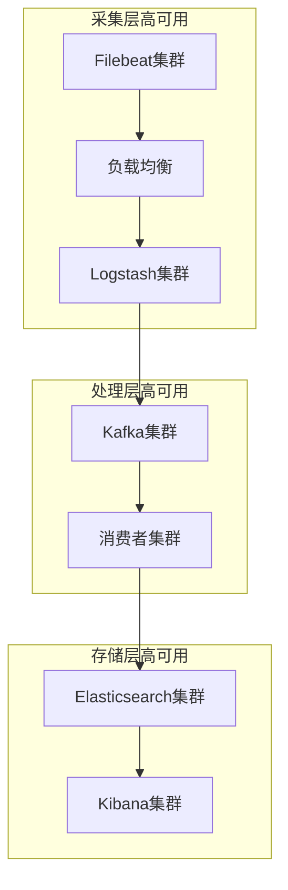
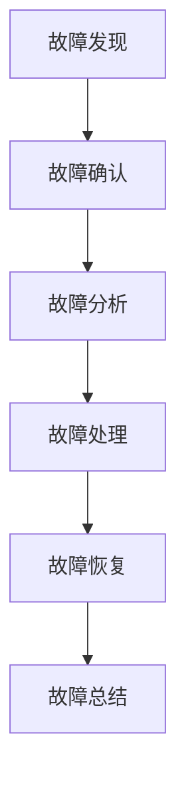

# 日志采集与传输深入（采集器实现 / K8s 日志 / 性能基准 / 数据治理 / 备份恢复）

> 日志采集是**可观测性链路的第一公里**。本篇深入拆解：采集器实现原理、K8s 动态环境采集、性能基准、日志数据治理、备份与恢复。

---

## 一、要解决的问题

| 痛点 | 说明 |
|------|------|
| 日志分散 | 日志在每台机器/每个容器，排障要逐台翻 |
| 格式不一 | 各应用日志格式不同，需要统一解析清洗 |
| 性能损耗 | 采集器不能影响业务（低资源占用） |
| 丢失风险 | 日志量大时不能丢（缓冲/重试） |
| K8s 动态环境 | Pod 销毁前日志要采集走（生命周期感知） |

> 核心认知：**日志管道 = 采集（轻量 Agent）→ 传输（缓冲/背压）→ 解析（结构化）→ 输出（多目的地）**——采集器轻、处理器重，职责分离。

---

## 二、核心原理

### 2.1 日志管道架构

```
应用（stdout/文件日志）
  └── 采集器（Filebeat/Fluent Bit，每主机一个，轻量）
        ├── 读取（tail 文件/容器 stdout/K8s 元数据）
        ├── 解析（多行合并/时间戳/结构化）
        └── 发送（直接到 ES/Loki，或到 Kafka/Logstash）

Logstash（可选中央处理，重管道）
  ├── input：Beats/Kafka/HTTP
  ├── filter：grok 正则/JSON/GeoIP/脱敏/聚合（最强大）
  └── output：ES/Loki/Kafka/云日志
```

**推荐架构（两层）**：**轻量采集（Filebeat/Fluent Bit）→ 消息缓冲（Kafka）→ 重量处理（Logstash）→ 存储（ES）**。

### 2.2 核心机制

| 机制 | 说明 |
|------|------|
| 文件跟踪 | 记录 offset（registry），崩溃续读不重不漏 |
| 多行合并 | Java 异常栈（多行日志合成一条） |
| 背压 | 下游慢 → 本地缓冲（磁盘队列）防丢失 |
| 解析 | grok 正则/JSON/CSV 解析成结构化字段 |
| 脱敏 | 手机号/身份证正则脱敏（合规） |
| 多目的地 | 同一日志发 ES + Kafka + 归档 |

### 2.3 采集器实现原理（以 Filebeat 为例）

```
Harvester（收割器）：
  每文件一个 Harvester
  打开文件 → 读取新内容（tail -f）
  记录 offset 到 registry（崩溃恢复）

Prospector（探查器）：
  扫描目录 → 发现新文件 → 启动 Harvester
  支持 glob 模式（*.log）

Pipeline（管道）：
  Harvester → queue（内存/磁盘）→ 输出
  背压：输出慢 → queue 积压 → 停止读取

关键技术：
  文件轮转（rename/delete 处理）
  多行合并（multiline pattern）
  registry（持久化 offset，防重复/防丢失）
```

---

## 三、K8s 环境采集

### 3.1 日志流向

```
Pod stdout → 容器运行时（docker/containerd）→ 节点日志目录
  → DaemonSet 部署采集器（每节点一个）
  → 自动注入 K8s 元数据（namespace/pod/container/labels）→ 标签检索
```

### 3.2 两种采集模式

| 模式 | 原理 | 优点 | 缺点 |
|------|------|------|------|
| 节点级（DaemonSet） | 每节点采集 `/var/log/containers` | 简单、覆盖全 | 与节点绑定 |
| Sidecar | 每 Pod 一个采集容器 | 隔离、可定制 | 资源开销大 |

**选型关注点**：默认节点级（DaemonSet）；特殊应用（日志格式特殊/多路输出）用 Sidecar。

### 3.3 关键处理

```
K8s 元数据注入：
  namespace / pod / container / labels
  → 检索维度（按服务/环境/版本过滤）

日志截断问题：
  Pod 删除 → 日志目录可能被清 → 采集器必须及时 flush
  → terminateGracePeriod 设置 + 采集器及时读取

多行日志：
  容器内 Java 异常栈 → 多行合并（时间戳开头）

资源限制：
  DaemonSet 采集器默认 50~100MB 内存足够
  CPU 限制（防止影响业务）
```

---

## 四、主流采集器对比

| 维度 | Filebeat | Logstash | Fluent Bit | Fluentd | Vector |
|------|----------|----------|------------|---------|--------|
| 语言 | Go | JRuby | C | Ruby | Rust |
| 资源占用 | 极低 | 高（JVM） | 最低 | 中 | 极低 |
| 解析能力 | 中 | 最强（grok 生态） | 中 | 强（插件多） | 强 |
| 吞吐 | 高 | 中 | 最高 | 中 | 高 |
| 部署形态 | 轻量采集 | 中央处理 | 轻量采集 | 中量 | 轻/中 |
| 生态 | ELK 原生 | ELK 原生 | 云原生（CNCF） | 广泛 | 新兴 |
| 适用 | ELK 链路采集 | 中央管道处理 | 云原生/K8s/边缘 | 插件复杂管道 | 高性能新项目 |

**选型关注点**：
- ELK 生态 → **Filebeat 采集 + Logstash 处理**（经典组合）；
- 云原生/K8s/资源敏感 → **Fluent Bit**（CNCF 毕业）；
- 复杂解析/聚合 → **Logstash**（grok 最强）；
- 新项目高性能 → **Vector**（Rust，一站替代）。

---

## 五、性能基准与调优

### 5.1 吞吐参考

```
单实例吞吐（参考值）：
  Filebeat：~10 万条/秒（简单解析）
  Fluent Bit：~20 万条/秒（C 语言）
  Logstash：~2~5 万条/秒（grok 复杂解析）
  Vector：~20 万条/秒（Rust）

瓶颈点：
  磁盘读取（IO 吞吐）
  正则解析（CPU）
  网络输出（带宽）
```

### 5.2 调优参数

| 参数 | 说明 | 建议 |
|------|------|------|
| Filebeat queue | 队列大小 | disk 模式（防内存爆） |
| Logstash workers | worker 数 | CPU 核数 |
| pipeline.batch.size | 批量大小 | 125~500 |
| Fluent Bit Mem_Buf_Limit | 内存缓冲 | 5~10MB/输出 |
| 压缩 | 传输压缩（gzip） | 带宽减 60%+ |

### 5.3 性能优化顺序

```
1. 日志先结构化（JSON）→ 免 grok 解析（性能提升 10 倍）
2. 解析放采集端轻量做，重处理放 Logstash
3. 加 Kafka 缓冲层（防 Logstash 崩溃丢日志）
4. 传输压缩
5. 监控管道积压
```

---

## 六、日志数据治理

### 6.1 生命周期管理

```
热（近 7 天）：ES 热节点（SSD）
温（7~30 天）：ES 温节点（HDD）
冷（30 天~1 年）：对象存储（S3/OSS）
归档（> 1 年）：归档存储（低频）

实现：
  ILM（Index Lifecycle Management）自动流转
  索引按天/月滚动
```

### 6.2 容量管理

```
估算：
  每天日志量 = 应用数 × 实例数 × 日志速率 × 保留天数
  例：100 服务 × 10 实例 × 1MB/s × 7 天 ≈ 60TB

控制：
  日志级别规范（生产 INFO 为主）
  采样（Debug 场景按需开启）
  裁剪（超长日志截断）
  压缩（ES 索引压缩）
```

### 6.3 敏感信息治理

```
脱敏位置：
  应用层（推荐，源头）
  采集器（filter 层）
  存储层（查询时脱敏）

脱敏规则：
  手机号：138****1234
  身份证：110***********1234
  密钥/Token：[REDACTED]

审计：
  谁检索了敏感字段（审计日志）
  敏感字段访问告警
```

---

## 七、备份与恢复

```
备份策略：
  ES 快照（Snapshot Repository → S3）
  每天全量 + 每小时增量

恢复场景：
  误删索引 → 从快照恢复
  集群故障 → 快照重建
  审计需求 → 归档日志检索

验证：
  定期测试恢复（完整性校验）
  快照监控（成功率/大小）
```

---

## 八、常见坑

| 坑 | 说明 | 对策 |
|----|------|------|
| 丢日志 | 采集器磁盘缓冲满直接丢 | 加大队列 + 告警 |
| 重复采集 | Filebeat 多实例同目录 | 单实例采集 + 排除已采文件 |
| K8s 日志截断 | Pod 删除时日志未采完 | terminateGracePeriod + 及时 flush |
| grok 性能 | 正则太复杂拖垮管道 | 先结构化 JSON 日志 |
| 时间字段 | 采集时间 ≠ 产生时间 | 日志带应用时间戳 |
| 时钟偏差 | 跨节点时间不一致 | NTP 同步 |

---

## 九、选型速查

| 需求 | 首选 | 备选 |
|------|------|------|
| ELK 生态 | Filebeat + Logstash | — |
| 云原生/K8s 轻量 | Fluent Bit | Promtail（Loki） |
| 大流量缓冲 | Fluent Bit → Kafka → Logstash | — |
| 复杂解析 | Logstash（grok） | Fluentd |
| 新项目高性能 | Vector | Fluent Bit |
| 云上托管 | 云日志 Agent | — |

---

## 采集器深度对比

### Fluentd vs Fluent Bit vs Filebeat vs Vector

| 维度 | Fluentd | Fluent Bit | Filebeat | Vector |
|------|---------|------------|----------|--------|
| 语言 | C + Ruby | C | Go | Rust |
| 内存占用 | ~50MB | ~1MB | ~30MB | ~10MB |
| 吞吐 | ~5K events/s | ~20K events/s | ~10K events/s | ~20K events/s |
| 插件数 | 500+ | 100+ | 50+ | 100+ |
| 多路输出 | 支持 | 支持 | 支持 | 支持 |
| 缓冲 | 内存/文件 | 内存/文件 | 文件 | 内存/磁盘 |
| CNCF 状态 | 毕业 | 毕业 | — | — |
| 子进程 | 支持 | 不支持 | 不支持 | 不支持 |
| 适用 | 通用日志管道 | 资源受限/K8s | ELK 生态 | 高性能新项目 |

### Fluentd 插件架构

```ruby
# Fluentd 配置示例
<source>
  @type tail
  path /var/log/app/*.log
  pos_file /var/log/fluentd/app.log.pos
  tag app.*
  <parse>
    @type json
    time_key time
    time_format %Y-%m-%dT%H:%M:%S.%NZ
  </parse>
</source>

<filter app.**>
  @type record_transformer
  <record>
    hostname "#{Socket.gethostname}"
    env "#{ENV['APP_ENV']}"
  </record>
</filter>

<match app.**>
  @type elasticsearch
  host elasticsearch.example.com
  port 9200
  index_name app-logs
  <buffer>
    @type file
    path /var/log/fluentd/buffer
    flush_interval 5s
    retry_max_interval 30s
    chunk_limit_size 2MB
    total_limit_size 512MB
  </buffer>
</match>
```

---

## 日志解析（Grok 模式）

### Grok 常用模式

| 模式 | 说明 | 示例 |
|------|------|------|
| `%{IP:client_ip}` | IP 地址 | 192.168.1.100 |
| `%{TIMESTAMP_ISO8601:timestamp}` | 时间戳 | 2024-01-15T10:30:00.123Z |
| `%{LOGLEVEL:level}` | 日志级别 | INFO/WARN/ERROR |
| `%{WORD:method}` | 单词 | GET/POST |
| `%{URIPATHPARAM:request}` | URI 路径 | /api/users?id=1 |
| `%{NUMBER:duration}` | 数字 | 123.456 |
| `%{GREEDYDATA:message}` | 贪婪匹配 | 任意内容 |

### Grok 解析示例

```
# Nginx 访问日志
# 原始日志：
192.168.1.100 - - [15/Jan/2024:10:30:00 +0800] "GET /api/users?id=1 HTTP/1.1" 200 1234 "-" "Mozilla/5.0"

# Grok 模式：
%{IP:client_ip} - - \[%{HTTPDATE:timestamp}\] "%{WORD:method} %{URIPATHPARAM:request} HTTP/%{NUMBER:http_version}" %{NUMBER:status:int} %{NUMBER:bytes:int} "%{GREEDYDATA:referrer}" "%{GREEDYDATA:user_agent}"

# 解析结果：
{
  "client_ip": "192.168.1.100",
  "timestamp": "15/Jan/2024:10:30:00 +0800",
  "method": "GET",
  "request": "/api/users?id=1",
  "status": 200,
  "bytes": 1234,
  "referrer": "-",
  "user_agent": "Mozilla/5.0"
}
```

### 多行日志合并

```yaml
# Filebeat 多行配置
filebeat.inputs:
- type: log
  multiline.pattern: '^\d{4}-\d{2}-\d{2}'
  multiline.negate: true
  multiline.match: after
  multiline.flush_pattern: '^\d{4}-\d{2}-\d{2}'

# Fluent Bit 多行配置
[FILTER]
    Name multiline
    Match *
    multiline.key_content log
    multiline.pattern ^\d{4}-\d{2}-\d{2}
    multiline.flush_after_linebreak true
```

---

## 日志路由与过滤

### 路由策略

| 策略 | 说明 | 实现 |
|------|------|------|
| 基于标签 | 按日志标签路由 | Tag 匹配 |
| 基于字段 | 按日志字段值路由 | 字段过滤 |
| 基于正则 | 正则匹配路由 | Grok/Regex |
| 基于内容 | 关键词匹配 | 包含/排除 |

### 路由配置示例

```yaml
# Fluentd 路由配置
<filter app.**>
  @type rewrite_tag_filter
  <rule>
    key level
    pattern /^ERROR$/
    tag app.error
  </rule>
  <rule>
    key level
    pattern /^WARN$/
    tag app.warn
  </rule>
  <rule>
    key level
    pattern /^INFO$/
    tag app.info
  </rule>
</filter>

# Vector 路由配置
[transforms.route]
  type = "route"
  inputs = ["input"]
  [transforms.route.route]
    error = '.level == "ERROR"'
    warn = '.level == "WARN"'
    info = '.level == "INFO"'
```

---

## 日志缓冲策略

### 缓冲类型对比

| 类型 | 说明 | 优点 | 缺点 |
|------|------|------|------|
| 内存缓冲 | 数据存内存 | 速度快 | 丢数据风险 |
| 文件缓冲 | 数据存磁盘 | 不丢数据 | 速度慢 |
| 混合缓冲 | 内存+磁盘 | 平衡 | 实现复杂 |

### 缓冲配置

```yaml
# Fluentd 缓冲配置
<buffer>
  @type file
  path /var/log/fluentd/buffer
  flush_mode interval
  flush_interval 5s
  retry_type exponential_backoff
  retry_max_interval 30s
  retry_forever true
  chunk_limit_size 2MB
  total_limit_size 512MB
  overflow_action block
</buffer>

# Filebeat 缓冲配置
queue.mem:
  events: 4096
  flush.min_events: 512
  flush.timeout: 5s
queue.disk:
  max_size: 10GB
```

---

## 日志格式标准化

### CEF（Common Event Format）

```
CEF:0|Vendor|Product|Version|SignatureID|Name|Severity|Extension

示例：
CEF:0|MyCompany|MyApp|1.0|APP-001|Login Failed|5|src=192.168.1.100 user=admin reason=invalid_password
```

### LEEF（Log Event Extended Format）

```
LEEF:2.0|Vendor|Product|Version|EventID|Extension

示例：
LEEF:2.0|MyCompany|MyApp|1.0|LOGIN_FAILED|src=192.168.1.100 dst=10.0.0.1 user=admin reason=invalid_password
```

### 结构化日志最佳实践

```json
{
  "timestamp": "2024-01-15T10:30:00.123Z",
  "level": "ERROR",
  "service": "user-service",
  "trace_id": "abc123def456",
  "span_id": "span789",
  "user_id": "user_12345",
  "method": "POST",
  "path": "/api/users",
  "status": 500,
  "duration_ms": 1234,
  "error": {
    "type": "NullPointerException",
    "message": "User not found",
    "stack_trace": "..."
  },
  "message": "User creation failed"
}
```

---

## 日志传输可靠性

### TCP vs UDP vs HTTP

| 协议 | 可靠性 | 性能 | 适用 |
|------|--------|------|------|
| TCP | 可靠（重传） | 中 | 日志传输（推荐） |
| UDP | 不可靠（丢包） | 高 | 高吞吐低延迟 |
| HTTP | 可靠 | 中 | 云日志服务 |
| Syslog | 可靠（TCP） | 中 | 传统日志 |

### 可靠性保障机制

```
可靠性保障：
  ① 重试机制：指数退避 + 抖动
  ② 背压控制：下游慢 → 本地缓冲
  ③ 磁盘持久化：缓冲落盘（防内存丢失）
  ④ ACK 确认：接收方确认后才删除
  ⑤ 监控告警：缓冲积压/丢弃告警
```

---

## K8s 日志采集（DaemonSet）

### DaemonSet 部署配置

```yaml
apiVersion: apps/v1
kind: DaemonSet
metadata:
  name: fluent-bit
spec:
  selector:
    matchLabels:
      app: fluent-bit
  template:
    metadata:
      labels:
        app: fluent-bit
    spec:
      serviceAccountName: fluent-bit
      containers:
      - name: fluent-bit
        image: fluent/fluent-bit:latest
        resources:
          limits:
            memory: 128Mi
            cpu: 100m
          requests:
            memory: 64Mi
            cpu: 50m
        volumeMounts:
        - name: varlog
          mountPath: /var/log
        - name: containers
          mountPath: /var/lib/docker/containers
          readOnly: true
      volumes:
      - name: varlog
        hostPath:
          path: /var/log
      - name: containers
        hostPath:
          path: /var/lib/docker/containers
      tolerations:
      - operator: Exists
```

### K8s 元数据注入

```yaml
# Fluent Bit K8s 元数据过滤
[FILTER]
    Name kubernetes
    Match *
    Kube_URL https://kubernetes.default.svc:443
    Kube_CA_File /var/run/secrets/kubernetes.io/serviceaccount/ca.crt
    Kube_Token_File /var/run/secrets/kubernetes.io/serviceaccount/token
    Kube_Tag_Prefix kube.var.log.containers.
    Merge_Log On
    Merge_Log_Key log_processed
```

---

## 日志告警与监控

### 日志告警规则

| 规则 | 说明 | 阈值 |
|------|------|------|
| 错误率告警 | ERROR 日志占比 | >5% |
| 频率告警 | 某类日志频率突增 | >10x 基线 |
| 关键词告警 | 包含敏感关键词 | OutOfMemory/Timeout |
| 缺失告警 | 某服务无日志 | 5分钟无日志 |

### 日志告警实现

```yaml
# Loki 告警规则
groups:
- name: log-alerts
  rules:
  - alert: HighErrorRate
    expr: |
      sum(rate({job="app"} |= "ERROR" [5m])) 
      / sum(rate({job="app"} [5m])) > 0.05
    for: 5m
    labels:
      severity: warning
    annotations:
      summary: "High error rate detected"
      
  - alert: NoLogsReceived
    expr: |
      sum(rate({job="app"} [5m])) == 0
    for: 5m
    labels:
      severity: critical
    annotations:
      summary: "No logs received from app"
```

---

## 日志保留策略

### 保留策略配置

| 策略 | 说明 | 适用 |
|------|------|------|
| 按时间 | 保留 N 天 | 通用 |
| 按大小 | 保留 N GB | 存储有限 |
| 按重要性 | ERROR 保留更久 | 合规要求 |
| 按采样 | Debug 日志采样保留 | 调试需要 |

### ILM（索引生命周期管理）

```yaml
# ES ILM 配置
PUT _ilm/policy/log-lifecycle
{
  "policy": {
    "phases": {
      "hot": {
        "actions": {
          "rollover": {
            "max_size": "50GB",
            "max_age": "1d"
          }
        }
      },
      "warm": {
        "min_age": "7d",
        "actions": {
          "shrink": {
            "number_of_shards": 1
          },
          "forcemerge": {
            "max_num_segments": 1
          }
        }
      },
      "cold": {
        "min_age": "30d",
        "actions": {
          "freeze": {}
        }
      },
      "delete": {
        "min_age": "90d",
        "actions": {
          "delete": {}
        }
      }
    }
  }
}
```

---

## 日志存储后端对比

| 维度 | Elasticsearch | Loki | ClickHouse |
|------|---------------|------|------------|
| 定位 | 全文搜索引擎 | 日志聚合系统 | 列式分析数据库 |
| 索引 | 全文索引 | 标签索引 | 列式索引 |
| 查询 | KQL/Lucene | LogQL | SQL |
| 存储 | 倒排索引 | 压缩块 | 列式压缩 |
| 资源消耗 | 高（内存+CPU） | 低（对象存储） | 中 |
| 适用 | 全文搜索/日志 | 日志聚合 | 日志分析 |
| 成本 | 高 | 低 | 中 |

---

## 九-2、Grok 常用 pattern 模式速查表

| 模式 | 说明 | 示例 |
|------|------|------|
| `%{IP:client_ip}` | IP 地址 | 192.168.1.100 |
| `%{TIMESTAMP_ISO8601:ts}` | 时间戳 | 2024-01-15T10:30:00.123Z |
| `%{LOGLEVEL:level}` | 日志级别 | INFO/WARN/ERROR |
| `%{WORD:method}` | 单词 | GET/POST |
| `%{URIPATHPARAM:request}` | URI 路径 | /api/users?id=1 |
| `%{NUMBER:duration}` | 数字 | 123.456 |
| `%{GREEDYDATA:msg}` | 贪婪匹配 | 任意内容 |
| `%{HTTPDATE:access_time}` | HTTP 时间 | 15/Jan/2024:10:30:00 +0800 |
| `%{QS:referrer}` | 引号字符串 | "Mozilla/5.0" |
| `%{IPORHOST:server}` | IP 或主机名 | example.com |

```
组合 Grok 模式（Nginx 访问日志）：
  %{IPORHOST:client_ip} - %{USER:ident} \[%{HTTPDATE:access_time}\]
  \"%{WORD:method} %{URIPATHPARAM:request} HTTP/%{NUMBER:http_version}\"
  %{NUMBER:status:int} %{NUMBER:bytes:int} \"%{QS:referrer}\"
  \"%{GREEDYDATA:user_agent}\"

解析结果：
  client_ip: "192.168.1.100"
  method: "GET"
  request: "/api/users?id=1"
  status: 200
  bytes: 1234
```

## 九-3、Fluent Bit 内存优化（Mem_Buf_Limit/Storage）

```ini
# Fluent Bit 内存优化配置

[SERVICE]
    Flush 5
    Daemon Off
    Log_Level info
    Parsers_File parsers.conf
    Mem_Buf_Limit 50MB        # 内存缓冲上限
    storage.sync normal       # 同步模式
    storage.checksum off
    storage.max_chunks_up 128 # 最大内存 chunks

[INPUT]
    Name tail
    Path /var/log/app/*.log
    Mem_Buf_Limit 10MB        # 输入缓冲
    Rotate_Wait 30
    storage.type filesystem   # 磁盘缓冲

[FILTER]
    Name kubernetes
    Match kube.*
    Merge_Log On

[OUTPUT]
    Name es
    Match *
    Host elasticsearch
    Port 9200
    Buffer_Size 32KB          # 输出缓冲
    Mem_Buf_Limit 20MB        # 输出内存限制

关键参数：
  Mem_Buf_Limit：内存缓冲上限（超出则阻塞）
  storage.type：filesystem=磁盘缓冲（防内存丢失）
  storage.max_chunks_up：最大内存 chunks 数
```

## 九-4、Filebeat registry 原理与恢复机制

```
Filebeat Registry = 记录每个文件的读取 offset

文件位置：
  data/registry/filebeat/

文件结构：
  log.json：记录每个文件的 inode + offset
  meta.json：记录元数据

恢复机制：
  1. Filebeat 启动时读取 registry
  2. 找到上次读取的 offset
  3. 从 offset 处继续读取（不重不漏）

崩溃恢复场景：
  正常关闭：offset 精确保存
  异常关闭：最后一次 flush 前的数据可能重复
  解决：下游系统幂等（如 ES 的 _id 去重）

监控指标：
  filebeat.registry.log.offset：当前 offset
  filebeat.registry.log.size：registry 文件大小

常见问题：
  registry 文件损坏 → 重新采集（可能重复）
  文件被删除 → registry 清理条目
  多实例同目录 → offset 冲突（单实例采集）
```

## 九-5、Vector 插件开发入门

```
Vector 插件开发（Rust）：

1. 定义 Source 插件
   #[async_trait]
   impl SourceConfig for MySourceConfig {
       async fn build(&self, ...) -> Result<Source> {
           // 实现数据采集逻辑
       }
   }

2. 定义 Transform 插件
   #[async_trait]
   impl TransformConfig for MyTransformConfig {
       async fn build(&self, ...) -> Result<Transform> {
           // 实现数据转换逻辑
       }
   }

3. 定义 Sink 插件
   #[async_trait]
   impl SinkConfig for MySinkConfig {
       async fn build(&self, ...) -> Result<Sink> {
           // 实现数据输出逻辑
       }
   }

4. 编译打包
   cargo build --release
   → 生成 vector 二进制（内置插件）

5. 配置使用
   [sources.my_source]
   type = "my_source"
   
   [sinks.my_sink]
   type = "my_sink"
```

## 九-6、日志格式标准化（JSON vs CEF vs LEEF）

| 格式 | 说明 | 适用 |
|------|------|------|
| JSON | 结构化，易解析 | 应用日志（推荐） |
| CEF | Common Event Format | 安全设备日志 |
| LEEF | Log Event Extended Format | IBM QRadar |

```
JSON 日志格式（推荐）：
{
  "timestamp": "2024-01-15T10:30:00.123Z",
  "level": "ERROR",
  "service": "user-service",
  "trace_id": "abc123def456",
  "user_id": "user_12345",
  "method": "POST",
  "path": "/api/users",
  "status": 500,
  "duration_ms": 1234,
  "error": {
    "type": "NullPointerException",
    "message": "User not found"
  }
}

CEF 格式：
CEF:0|MyCompany|MyApp|1.0|APP-001|Login Failed|5|src=192.168.1.100 user=admin reason=invalid_password

LEEF 格式：
LEEF:2.0|MyCompany|MyApp|1.0|LOGIN_FAILED|src=192.168.1.100 dst=10.0.0.1 user=admin
```

## 九-7、日志传输可靠性保障（TCP vs UDP vs Kafka 缓冲）

| 协议 | 可靠性 | 性能 | 适用 |
|------|--------|------|------|
| TCP | 可靠（重传） | 中 | 日志传输（推荐） |
| UDP | 不可靠（丢包） | 高 | 高吞吐低延迟 |
| HTTP | 可靠 | 中 | 云日志服务 |
| Kafka | 可靠（持久化） | 高 | 大流量缓冲 |

```
可靠性保障机制：

1. 重试机制
   指数退避 + 抖动
   最大重试次数
   重试间隔递增

2. 背压控制
   下游慢 → 本地缓冲（磁盘队列）
   缓冲满 → 阻塞/丢弃策略

3. 磁盘持久化
   缓冲落盘（防内存丢失）
   Filebeat：data/registry/file.json
   Fluent Bit：storage.type filesystem

4. ACK 确认
   接收方确认后才删除
   未确认 → 重试

5. 监控告警
   缓冲积压告警
   丢弃告警
   延迟告警

推荐架构：
  轻量采集（Filebeat/Fluent Bit）
  → Kafka 缓冲（削峰+持久化）
  → 重量处理（Logstash）
  → 存储（ES/Loki）
```

## 附录 A：Grok 模式速查

### A.1 常用 Grok 模式

| 模式 | 说明 | 示例 |
|------|------|------|
| `%{IP:client_ip}` | IP 地址 | 192.168.1.100 |
| `%{TIMESTAMP_ISO8601:timestamp}` | 时间戳 | 2024-01-01T12:00:00.000Z |
| `%{NUMBER:duration}` | 数字 | 123.45 |
| `%{WORD:method}` | 单词 | GET |
| `%{DATA:message}` | 任意数据 | any string |
| `%{GREEDYDATA:log}` | 贪婪匹配 | full log line |

### A.2 综合日志解析

```ruby
# Nginx 访问日志
%{IPORHOST:remote_addr} - %{USER:remote_user} \[%{HTTPDATE:time_local}\] "%{WORD:method} %{URIPATHPARAM:request} HTTP/%{NUMBER:http_version}" %{NUMBER:status} %{NUMBER:body_bytes_sent} "%{DATA:http_referer}" "%{DATA:http_user_agent}" "%{DATA:x_forwarded_for}"

# Java 异常日志
%{TIMESTAMP_ISO8601:timestamp} %{LOGLEVEL:level} \[%{DATA:thread}\] %{DATA:logger} - %{GREEDYDATA:message}
```

### A.3 Grok 调试技巧

```text
调试流程：

1. 在线测试：
   https://grokdebugger.com/

2. 测试步骤：
   a. 输入原始日志
   b. 编写 Grok 模式
   c. 测试匹配结果
   d. 验证字段提取

3. 常见问题：
   - 模式不匹配：检查特殊字符转义
   - 字段为空：确认字段名拼写
   - 性能差：避免过度贪婪匹配
```

## 附录 B：Fluent Bit 内存调优

### B.1 内存使用分析

| 组件 | 默认内存 | 优化后 | 说明 |
|------|----------|--------|------|
| 输入缓冲 | 16KB | 64KB | 每个输入 |
| 解析缓冲 | 32KB | 128KB | 每个解析 |
| 输出缓冲 | 96KB | 256KB | 每个输出 |
| 总进程 | 8MB | 16-32MB | 取决于配置 |

### B.2 调优配置

```ini
# fluent-bit.conf
[SERVICE]
    Flush        5
    Daemon       Off
    Log_Level    warning
    Parsers_File parsers.conf
    HTTP_Server  On
    HTTP_Listen  0.0.0.0
    HTTP_Port    2020
    Mem_Buf_Limit 16MB
    Skip_Long_Lines On
    DB_File /var/log/flb_kafka.db

[INPUT]
    Name tail
    Path /var/log/containers/*.log
    Mem_Buf_Limit 5MB
    Skip_Long_Lines On
    Refresh_Interval 10
```

### B.3 内存监控

```bash
# 查看 Fluent Bit 内存使用
curl -s http://localhost:2020/api/v1/mem | jq .

# 监控指标
fluentbit_input_memory_bytes
fluentbit_output_memory_bytes
fluentbit_storage_memory_bytes
```

## 附录 C：Filebeat Registry 管理

### C.1 Registry 结构

```json
{
  "registry": {
    "log": {
      "filebeat::log::files": [
        {
          "source": "/var/log/app.log",
          "offset": 123456,
          "timestamp": "2024-01-01T12:00:00Z",
          "ttl": "72h"
        }
      ]
    },
    "meta": {
      "version": "8.12.0"
    }
  }
}
```

### C.2 Registry 问题排查

| 问题 | 原因 | 解决方案 |
|------|------|----------|
| 重复采集 | Registry 损坏 | 删除 Registry 重启 |
| 丢失日志 | Registry 被清理 | 检查路径配置 |
| 写入失败 | 权限问题 | 检查目录权限 |
| 内存增长 | Registry 过大 | 清理过期记录 |

### C.3 Registry 清理

```bash
# 停止 Filebeat
systemctl stop filebeat

# 备份 Registry
cp /var/lib/filebeat/registry /var/lib/filebeat/registry.bak

# 清理 Registry
rm /var/lib/filebeat/registry/filebeat/log.json

# 重启 Filebeat
systemctl start filebeat
```

## 附录 D：Vector 插件开发

### D.1 插件架构

```text
Vector 插件架构：

Source → Transform → Sink

每个插件实现：
  - config(): 配置解析
  - build(): 构建实例
  - run(): 主循环
  - shutdown(): 优雅关闭
```

### D.2 自定义 Transform 示例

```rust
use vector::config::{Config, Configurable};
use vector::event::Event;
use vector::transforms::{Transform, TransformConfig};

#[derive(Configurable, Clone)]
struct MyTransformConfig {
    field: String,
    value: String,
}

#[async_trait::async_trait]
impl TransformConfig for MyTransformConfig {
    async fn build(&self, _context: &Context) -> crate::Result<Box<dyn Transform>> {
        Ok(Box::new(MyTransform {
            field: self.field.clone(),
            value: self.value.clone(),
        }))
    }
}

struct MyTransform {
    field: String,
    value: String,
}

impl Transform for MyTransform {
    fn transform(&mut self, mut event: Event) -> Option<Event> {
        event.as_mut_log().insert(&self.field, &self.value);
        Some(event)
    }
}
```

### D.3 插件测试

```toml
# 测试配置
[transforms.my_transform]
type = "my_transform"
inputs = ["input"]
field = "new_field"
value = "new_value"

[[tests]]
name = "basic_test"

[[tests.inputs]]
insert_at = "input"
type = "log"
log.message = "test message"

[[tests.outputs]]
extract_from = "my_transform"
log.new_field = "new_value"
```

## 附录 E：日志格式标准化

### E.1 统一日志格式

```json
{
  "timestamp": "2024-01-01T12:00:00.000Z",
  "level": "INFO",
  "service": "order-service",
  "trace_id": "abc123",
  "span_id": "def456",
  "message": "Order created successfully",
  "context": {
    "user_id": "1001",
    "order_id": "ORD-2024-001"
  }
}
```

### E.2 日志字段规范

| 字段 | 类型 | 必填 | 说明 |
|------|------|------|------|
| timestamp | ISO8601 | ✅ | 事件时间 |
| level | ENUM | ✅ | INFO/WARN/ERROR |
| service | STRING | ✅ | 服务名 |
| message | STRING | ✅ | 日志消息 |
| trace_id | STRING | ❌ | 链路追踪 ID |
| span_id | STRING | ❌ | 跨度 ID |
| user_id | STRING | ❌ | 用户 ID |
| request_id | STRING | ❌ | 请求 ID |

### E.3 日志标准化流程



## 附录 F：日志传输可靠性

### F.1 传输保障对比

| 机制 | 说明 | 适合场景 |
|------|------|----------|
| At-Least-Once | 至少一次 | 日志采集 |
| At-Most-Once | 最多一次 | 指标上报 |
| Exactly-Once | 精确一次 | 金融审计 |

### F.2 可靠性配置

```yaml
# Filebeat 可靠性配置
filebeat.inputs:
  - type: log
    paths:
      - /var/log/app.log
    close_renamed: true
    close_removed: true
    clean_inactive: 72h
    clean_removed: true
    scan_frequency: 10s

# 输出配置
output.elasticsearch:
  hosts: ["http://elasticsearch:9200"]
  bulk_max_size: 5000
  worker: 4
  compression_level: 1
  timeout: 30s
  retries: 3
```

### F.3 数据完整性验证

```text
验证流程：

1. 日志计数对比：
   - 源端日志条数
   - 目标端日志条数
   - 差异 < 0.1%

2. 时间戳验证：
   - 检查日志时间戳范围
   - 验证无未来/过去时间

3. 内容抽样：
   - 随机抽取日志
   - 对比原始内容

4. 告警配置：
   - 采集延迟告警
   - 丢失率告警
```

## Filebeat Kubernetes 配置

### Filebeat DaemonSet 配置

```yaml
apiVersion: apps/v1
kind: DaemonSet
metadata:
  name: filebeat
spec:
  selector:
    matchLabels:
      app: filebeat
  template:
    metadata:
      labels:
        app: filebeat
    spec:
      serviceAccountName: filebeat
      containers:
      - name: filebeat
        image: docker.elastic.co/beats/filebeat:8.12.0
        args: ["-c", "/etc/filebeat.yml", "-e"]
        resources:
          limits:
            memory: 200Mi
            cpu: 500m
          requests:
            memory: 100Mi
            cpu: 100m
        volumeMounts:
        - name: config
          mountPath: /etc/filebeat.yml
          subPath: filebeat.yml
        - name: data
          mountPath: /usr/share/filebeat/data
        - name: varlog
          mountPath: /var/log
          readOnly: true
        - name: containers
          mountPath: /var/lib/docker/containers
          readOnly: true
      volumes:
      - name: config
        configMap:
          name: filebeat-config
      - name: data
        emptyDir: {}
      - name: varlog
        hostPath:
          path: /var/log
      - name: containers
        hostPath:
          path: /var/lib/docker/containers
```

### Filebeat Registry 管理

```
Registry 原理：
  记录每个文件的读取 offset（inode + offset）
  位置：data/registry/filebeat/

恢复机制：
  1. 启动时读取 registry
  2. 找到上次读取的 offset
  3. 从 offset 处继续读取（不重不漏）

常见问题：
  Registry 文件损坏 → 删除重启（可能重复采集）
  文件被删除 → registry 清理条目
  多实例同目录 → offset 冲突（需单实例采集）
```

## Flume 拦截器与负载均衡

### Flume 拦截器选择

| 拦截器 | 功能 | 适用场景 |
|--------|------|----------|
| Timestamp | 添加时间戳 | 时间排序 |
| Host | 添加主机名 | 来源标识 |
| Static | 添加静态字段 | 环境标识 |
| Regex | 正则提取字段 | 日志解析 |
| Search Replace | 搜索替换 | 脱敏处理 |
| Mask | 字段遮罩 | 敏感信息 |

### Flume 负载均衡

```
Flume 负载均衡配置：
  1. 轮询（Round Robin）：均匀分配
  2. 随机（Random）：随机分配
  3. 自定义权重：按权重分配

选择器：
  Replicating：复制到所有 Channel
  Multiplexing：按条件路由到不同 Channel
  Custom：自定义路由逻辑
```

## Logstash Filter 插件

### 核心 Filter 插件

| 插件 | 功能 | 示例 |
|------|------|------|
| grok | 正则解析 | 解析 Nginx 日志 |
| mutate | 字段操作 | 添加/删除/重命名字段 |
| geoip | IP 地理位置 | 解析 IP 对应城市 |
| useragent | UA 解析 | 解析浏览器/OS |
| date | 时间解析 | 统一时间格式 |
| ruby | 自定义逻辑 | 复杂转换 |
| json | JSON 解析 | 结构化日志 |

### Logstash Bulk API 配置

```ruby
# Logstash 输出到 ES 的 Bulk API 配置
output {
  elasticsearch {
    hosts => ["http://elasticsearch:9200"]
    index => "logs-%{+YYYY.MM.dd}"
    flush_size => 5000        # 批量大小
    idle_flush_time => 1      # 空闲刷新时间
    workers => 4              # 并发线程
  }
}
```

## Agent 对比（Filebeat vs Fluent Bit vs Fluentd）

| 维度 | Filebeat | Fluent Bit | Fluentd |
|------|----------|------------|---------|
| 语言 | Go | C | C + Ruby |
| 内存占用 | ~30MB | ~1MB | ~50MB |
| 吞吐 | ~10K events/s | ~20K events/s | ~5K events/s |
| 插件数 | 50+ | 100+ | 500+ |
| CNCF 状态 | — | 毕业 | 毕业 |
| 适用 | ELK 生态 | K8s/边缘 | 通用管道 |

## Kafka 缓冲层

### Kafka 缓冲架构



### Kafka 缓冲配置

```yaml
# Filebeat → Kafka 配置
output.kafka:
  hosts: ["kafka1:9092", "kafka2:9092"]
  topic: "logs-%{[agent.version]}"
  partition.round_robin:
    reachable_only: true
  required_acks: 1
  compression: gzip
  max_message_bytes: 1000000
```

## 架构选型（DaemonSet/Sidecar/集中式）

### 架构对比

| 架构 | 部署方式 | 优点 | 缺点 | 适用 |
|------|----------|------|------|------|
| DaemonSet | 每节点一个采集器 | 简单、资源省 | 与节点绑定 | 通用 |
| Sidecar | 每 Pod 一个采集容器 | 隔离、可定制 | 资源开销大 | 特殊日志 |
| 集中式 | 独立采集集群 | 管理统一 | 单点风险 | 大规模 |

### 选型决策

```
选型决策树：
  K8s 环境？
    ├─ 是 → DaemonSet（默认）
    │    └─ 特殊日志格式？→ Sidecar
    └─ 否 → 集中式（大规模）/ Agent（小规模）
```

## Filebeat Kubernetes 配置

### DaemonSet 部署模式

```yaml
apiVersion: apps/v1
kind: DaemonSet
metadata:
  name: filebeat
spec:
  selector:
    matchLabels:
      app: filebeat
  template:
    metadata:
      labels:
        app: filebeat
    spec:
      containers:
      - name: filebeat
        image: docker.elastic.co/beats/filebeat:8.10.0
        volumeMounts:
        - name: varlog
          mountPath: /var/log
        - name: containers
          mountPath: /var/lib/docker/containers
          readOnly: true
      volumes:
      - name: varlog
        hostPath:
          path: /var/log
      - name: containers
        hostPath:
          path: /var/lib/docker/containers
```

### 多行日志处理

```yaml
# Filebeat 多行配置
filebeat.inputs:
- type: container
  paths:
  - '/var/log/containers/*.log'
  multiline.pattern: '^[0-9]{4}-[0-9]{2}-[0-9]{2}'
  multiline.negate: true
  multiline.match: after
  multiline.max_lines: 500
```

### K8s 元数据过滤

```yaml
# 添加 K8s 元数据
processors:
- add_kubernetes_metadata:
    host: ${NODE_NAME}
    matchers:
    - logs_path:
        logs_path: "/var/log/containers/"
```

## Flume 拦截器与负载均衡

### 拦截器配置

```properties
# Flume 拦截器
a1.sources.s1.interceptors = i1 i2
a1.sources.s1.interceptors.i1.type = timestamp
a1.sources.s1.interceptors.i2.type = host
a1.sources.s1.interceptors.i2.host = agent
```

### 负载均衡配置

```properties
# Flume 负载均衡
a1.sinks.k1.selector.type = loadBalance
a1.sinks.k1.selector.roundRobin
a1.sinks.k1.backoff = true
```

## Logstash Filter 插件

### 常用 Filter 配置

```ruby
# Logstash Grok 解析
filter {
  grok {
    match => { "message" => "%{COMBINEDAPACHELOG}" }
  }
  date {
    match => [ "timestamp", "dd/MMM/yyyy:HH:mm:ss Z" ]
  }
  geoip {
    source => "clientip"
  }
  mutate {
    remove_field => [ "message" ]
  }
}
```

### 输出到 ES 的 Bulk API 配置

```ruby
# Logstash 输出配置
output {
  elasticsearch {
    hosts => ["http://es1:9200", "http://es2:9200"]
    index => "logs-%{+YYYY.MM.dd}"
    manage_template => true
    template_name => "logs"
    bulk_max_size => 5000
  }
}
```

## Agent 对比（Filebeat vs Fluent Bit vs Fluentd）

| 维度 | Filebeat | Fluent Bit | Fluentd |
|------|----------|------------|---------|
| 语言 | Go | C | Ruby+C |
| 内存占用 | 中 | 低 | 高 |
| 插件生态 | 丰富 | 中 | 极丰富 |
| K8s 支持 | 优秀 | 优秀 | 良好 |
| 适用 | ELK生态 | 资源受限 | 通用 |

## Kafka 缓冲层

### 为什么需要 Kafka 缓冲



| 优势 | 说明 |
|------|------|
| 解耦 | 采集与消费解耦 |
| 削峰 | 突发流量缓冲 |
| 多消费者 | 同一日志多系统消费 |
| 可靠性 | 持久化保证不丢 |

### Filebeat → Kafka 配置

```yaml
# Filebeat 输出到 Kafka
output.kafka:
  hosts: ["kafka1:9092", "kafka2:9092"]
  topic: 'logs-%{[agent.version]}'
  partition.round_robin:
    reachable_only: true
  required_acks: 1
  compression: gzip
```

## 架构选型（DaemonSet/Sidecar/集中式）

| 架构 | 部署方式 | 优点 | 缺点 | 适用 |
|------|----------|------|------|------|
| DaemonSet | 每节点一个采集器 | 简单、资源省 | 与节点绑定 | 通用 |
| Sidecar | 每 Pod 一个采集容器 | 隔离、可定制 | 资源开销大 | 特殊日志 |
| 集中式 | 独立采集集群 | 管理统一 | 单点风险 | 大规模 |

### 选型决策

```
选型决策树：
  K8s 环境？
    ├─ 是 → DaemonSet（默认）
    │    └─ 特殊日志格式？→ Sidecar
    └─ 否 → 集中式（大规模）/ Agent（小规模）
```

## Filebeat深度配置（Kubernetes/Registry/Processors）

### Filebeat Kubernetes配置

```yaml
apiVersion: apps/v1
kind: DaemonSet
metadata:
  name: filebeat
spec:
  selector:
    matchLabels:
      app: filebeat
  template:
    spec:
      serviceAccountName: filebeat
      containers:
      - name: filebeat
        image: docker.elastic.co/beats/filebeat:8.12.0
        args: ["-c", "/etc/filebeat.yml", "-e"]
        resources:
          limits:
            memory: 200Mi
            cpu: 500m
        volumeMounts:
        - name: varlog
          mountPath: /var/log
          readOnly: true
        - name: containers
          mountPath: /var/lib/docker/containers
          readOnly: true
      volumes:
      - name: varlog
        hostPath:
          path: /var/log
      - name: containers
        hostPath:
          path: /var/lib/docker/containers
```

### Registry管理

```
Registry = 记录每个文件的读取offset（inode + offset）

恢复机制：
  1. 启动时读取registry
  2. 找到上次读取的offset
  3. 从offset处继续读取（不重不漏）

常见问题：
  Registry损坏 → 删除重启（可能重复）
  文件被删除 → registry清理条目
  多实例同目录 → offset冲突（单实例采集）
```

### Processors处理链

```yaml
# Filebeat processors配置
processors:
- add_kubernetes_metadata:
    host: ${NODE_NAME}
    matchers:
    - logs_path:
        logs_path: "/var/log/containers/"
- add_cloud_metadata: ~
- add_host_metadata: ~
- decode_json_fields:
    fields: ["message"]
    target: "json"
    overwrite_keys: true
- drop_fields:
    fields: ["agent.ephemeral_id", "agent.id"]
- drop_event:
    when:
      regexp:
        message: "^$"
```

## Flume Channel对比与拦截器

### Channel类型对比

| Channel | 存储 | 吞吐 | 可靠性 | 适用场景 |
|---------|------|------|--------|----------|
| Memory | 内存 | 最高 | 低（宕机丢失） | 测试/非关键数据 |
| File | 磁盘 | 中 | 高（持久化） | 生产环境（推荐） |
| JDBC | 数据库 | 低 | 最高 | 事务要求高 |
| Kafka | Kafka | 高 | 高 | 大规模/多消费者 |

### Flume拦截器

| 拦截器 | 功能 | 适用场景 |
|--------|------|----------|
| Timestamp | 添加时间戳 | 时间排序 |
| Host | 添加主机名 | 来源标识 |
| Static | 添加静态字段 | 环境标识 |
| Regex | 正则提取字段 | 日志解析 |
| Search Replace | 搜索替换 | 脱敏处理 |
| Mask | 字段遮罩 | 敏感信息 |

## Logstash Filter插件与性能调优

### 核心Filter插件

| 插件 | 功能 | 示例 |
|------|------|------|
| grok | 正则解析 | 解析Nginx日志 |
| mutate | 字段操作 | 添加/删除/重命名字段 |
| geoip | IP地理位置 | 解析IP对应城市 |
| useragent | UA解析 | 解析浏览器/OS |
| date | 时间解析 | 统一时间格式 |
| json | JSON解析 | 结构化日志 |

### Logstash Bulk API配置

```ruby
output {
  elasticsearch {
    hosts => ["http://es:9200"]
    index => "logs-%{+YYYY.MM.dd}"
    flush_size => 5000
    idle_flush_time => 1
    workers => 4
  }
}
```

### Logstash性能调优

| 参数 | 默认值 | 建议值 | 说明 |
|------|--------|--------|------|
| pipeline.workers | CPU核数 | CPU核数 | 工作线程数 |
| pipeline.batch.size | 125 | 500 | 批量大小 |
| pipeline.batch.delay | 5ms | 50ms | 批量等待时间 |
| queue.type | memory | persisted | 持久化队列 |
| queue.max_bytes | 1GB | 10GB | 队列最大容量 |

## Agent对比矩阵

| 维度 | Filebeat | Fluent Bit | Fluentd | Vector |
|------|----------|------------|---------|--------|
| 语言 | Go | C | Ruby+C | Rust |
| 内存占用 | ~30MB | ~1MB | ~50MB | ~10MB |
| 吞吐 | ~10K/s | ~20K/s | ~5K/s | ~20K/s |
| 插件数 | 50+ | 100+ | 500+ | 100+ |
| CNCF状态 | — | 毕业 | 毕业 | — |
| 适用 | ELK生态 | K8s/边缘 | 通用管道 | 高性能新项目 |

## Kafka缓冲层架构



| 优势 | 说明 |
|------|------|
| 解耦 | 采集与消费解耦 |
| 削峰 | 突发流量缓冲 |
| 多消费者 | 同一日志多系统消费 |
| 可靠性 | 持久化保证不丢 |

## 架构选型（DaemonSet/Sidecar/集中式）

| 架构 | 部署方式 | 优点 | 缺点 | 适用 |
|------|----------|------|------|------|
| DaemonSet | 每节点一个 | 简单、资源省 | 与节点绑定 | 通用 |
| Sidecar | 每Pod一个 | 隔离、可定制 | 资源开销大 | 特殊日志 |
| 集中式 | 独立集群 | 管理统一 | 单点风险 | 大规模 |

## 日志采集监控（延迟/积压/错误率）

| 监控指标 | 说明 | 告警阈值 |
|----------|------|----------|
| 采集延迟 | 日志从产生到可查询 | > 30s |
| 积压量 | Kafka topic积压消息数 | > 10000 |
| 采集成功率 | 成功采集比例 | < 99.9% |
| 丢弃率 | 丢弃日志比例 | > 0.1% |
| 内存使用 | Agent内存使用 | > 80% |

## 日志格式化（JSON统一/字段标准化）

### 统一日志格式

```json
{
  "timestamp": "2024-01-15T10:30:00.123Z",
  "level": "ERROR",
  "service": "user-service",
  "trace_id": "abc123def456",
  "span_id": "span789",
  "user_id": "user_12345",
  "method": "POST",
  "path": "/api/users",
  "status": 500,
  "duration_ms": 1234,
  "error": {
    "type": "NullPointerException",
    "message": "User not found"
  }
}
```

## 日志存储（ES/S3/OSS/归档策略）

### ILM生命周期管理

```yaml
# ES ILM配置
PUT _ilm/policy/log-lifecycle
{
  "policy": {
    "phases": {
      "hot": {
        "actions": {
          "rollover": { "max_size": "50GB", "max_age": "1d" }
        }
      },
      "warm": {
        "min_age": "7d",
        "actions": {
          "shrink": { "number_of_shards": 1 },
          "forcemerge": { "max_num_segments": 1 }
        }
      },
      "cold": {
        "min_age": "30d",
        "actions": { "freeze": {} }
      },
      "delete": {
        "min_age": "90d",
        "actions": { "delete": {} }
      }
    }
  }
}
```

## 日志告警（异常模式检测/关键词告警）

```yaml
# Loki告警规则
groups:
- name: log-alerts
  rules:
  - alert: HighErrorRate
    expr: |
      sum(rate({job="app"} |= "ERROR" [5m]))
      / sum(rate({job="app"} [5m])) > 0.05
    for: 5m
    labels:
      severity: warning

  - alert: KeywordAlert
    expr: |
      {job="app"} |= "OutOfMemory" or |= "Timeout"
    for: 1m
    labels:
      severity: critical

  - alert: NoLogsReceived
    expr: |
      sum(rate({job="app"} [5m])) == 0
    for: 5m
    labels:
      severity: critical
```

## 日志采集最佳实践

### 日志采集架构选型

| 架构 | 说明 | 优点 | 缺点 | 适用场景 |
|------|------|------|------|----------|
| DaemonSet | 每节点一个Agent | 简单、资源占用低 | 无法采集容器内日志 | K8s环境 |
| Sidecar | 每Pod一个Agent | 隔离性好 | 资源开销大 | 多租户环境 |
| 集中式 | 远程采集 | 灵活 | 网络开销大 | 非容器环境 |

### 日志格式标准化

```json
{
  "timestamp": "2025-01-15T10:00:00.000Z",
  "level": "INFO",
  "service": "order-service",
  "trace_id": "abc123",
  "span_id": "def456",
  "message": "Order created successfully",
  "user_id": "user-001",
  "order_id": "order-001",
  "amount": 99.99,
  "duration_ms": 150
}
```

### 日志脱敏策略

| 敏感字段 | 脱敏方式 | 示例 |
|----------|----------|------|
| 手机号 | 保留前3后4 | 138****1234 |
| 身份证 | 保留前6后4 | 110101****1234 |
| 银行卡 | 保留后4 | ************1234 |
| 邮箱 | 保留首字母 | z****@example.com |
| 密码 | 完全替换 | ****** |

---

---

## 十、日志采集架构设计

### 10.1 日志采集层次架构



### 10.2 日志采集模式对比

| 模式 | 说明 | 优势 | 劣势 | 适用场景 |
|------|------|------|------|---------|
| **Push模式** | 应用主动推送日志 | 实时性高 | 可能丢失 | 实时监控 |
| **Pull模式** | 采集器主动拉取日志 | 可靠性高 | 实时性低 | 离线分析 |
| **Agent模式** | 在每台机器部署Agent | 灵活性高 | 资源消耗 | 分布式环境 |
| **Sidecar模式** | 在容器边车收集日志 | 隔离性好 | 资源消耗 | Kubernetes |

### 10.3 日志采集工具对比

| 工具 | 架构 | 优势 | 劣势 | 适用场景 |
|------|------|------|------|---------|
| **Filebeat** | 轻量级 | 资源消耗低 | 功能简单 | 简单场景 |
| **Fluentd** | 插件丰富 | 功能强大 | 配置复杂 | 多数据源 |
| **Logstash** | 功能强大 | 过滤能力强 | 资源消耗高 | 复杂处理 |
| **Fluent Bit** | 超轻量 | 性能极高 | 功能较少 | 边缘计算 |

---

## 十一、日志传输协议

### 11.1 传输协议对比

```text
TCP协议：
  优势：可靠传输、顺序保证
  劣势：连接开销、可能阻塞
  适用：重要日志、需要确认

UDP协议：
  优势：无连接、传输快
  劣势：可能丢失、无顺序
  适用：大量日志、允许丢失

HTTP协议：
  优势：通用性强、易于调试
  劣势：开销大、效率低
  适用：跨网络、需要防火墙穿透

Syslog协议：
  优势：标准化、广泛支持
  劣势：功能有限、安全性差
  传统系统、设备日志
```

### 11.2 协议配置示例

```yaml
# TCP传输配置
input:
  tcp:
    port: 5044
    codec: json
    ssl: true
    ssl_certificate: /path/to/cert.pem
    ssl_key: /path/to/key.pem

# UDP传输配置
input:
  udp:
    port: 514
    codec: json
    buffer_size: 1024

# HTTP传输配置
input:
  http:
    port: 8080
    codec: json
    ssl: true
```

---

## 十二、日志缓冲与批处理

### 12.1 缓冲策略



### 12.2 批处理配置

```yaml
# Filebeat批处理配置
filebeat.inputs:
  - type: log
    paths:
      - /var/log/*.log
    bulk_max_size: 2048
    flush_interval: 5s
    flush_min_events: 100

# Logstash批处理配置
input {
  beats {
    port => 5044
  }
}

filter {
  # 过滤和转换
}

output {
  elasticsearch {
    hosts => ["localhost:9200"]
    index => "logs-%{+YYYY.MM.dd}"
    flush_size => 1000
    idle_flush_time => 5s
  }
}
```

### 12.3 批处理参数优化

| 参数 | 说明 | 推荐值 | 影响 |
|------|------|--------|------|
| **bulk_max_size** | 批次最大大小 | 2048 | 内存使用 |
| **flush_interval** | 刷新间隔 | 5s | 实时性 |
| **flush_min_events** | 最小刷新事件数 | 100 | 批次大小 |
| **queue_size** | 队列大小 | 1000 | 背压处理 |

---

## 十三、日志过滤与转换

### 13.1 过滤规则配置

```ruby
# Logstash过滤配置
filter {
  # 解析JSON格式
  json {
    source => "message"
    target => "parsed"
  }
  
  # 字段提取
  grok {
    match => { "message" => "%{COMBINEDAPACHELOG}" }
  }
  
  # 字段删除
  mutate {
    remove_field => ["host", "timestamp"]
  }
  
  # 字段重命名
  mutate {
    rename => { "message" => "log_message" }
  }
}
```

### 13.2 数据转换示例

```json
{
  "原始日志": {
    "timestamp": "2024-01-15T10:30:00Z",
    "level": "INFO",
    "message": "User login successful",
    "user_id": "user-001",
    "ip_address": "192.168.1.100"
  },
  "转换后": {
    "timestamp": "2024-01-15T10:30:00Z",
    "level": "INFO",
    "message": "User login successful",
    "user_id": "user-001",
    "ip_address": "192.168.1.100",
    "date": "2024-01-15",
    "hour": 10,
    "geo_location": {
      "country": "中国",
      "city": "北京"
    }
  }
}
```

---

## 十四、日志存储策略

### 14.1 存储架构设计



### 14.2 存储格式选择

| 格式 | 压缩率 | 查询性能 | 写入性能 | 适用场景 |
|------|--------|---------|---------|---------|
| **JSON** | 低 | 中 | 高 | 调试、开发 |
| **CSV** | 中 | 中 | 高 | 简单日志 |
| **Parquet** | 高 | 高 | 中 | 分析查询 |
| **ORC** | 高 | 高 | 中 | Hive查询 |
| **Avro** | 高 | 中 | 高 | 流处理 |

### 14.3 分区策略

```bash
# 按时间分区
logs/
├── 2024/
│   ├── 01/
│   │   ├── 15/
│   │   │   ├── app.log
│   │   │   └── system.log

# 按应用分区
logs/
├── app1/
│   ├── 2024-01-15.log
│   └── 2024-01-16.log
├── app2/
│   ├── 2024-01-15.log
│   └── 2024-01-16.log
```

---

## 十五、日志告警机制

### 15.1 告警规则设计

```yaml
# 告警规则配置
groups:
  - name: application-logs
    rules:
      - alert: HighErrorRate
        expr: rate(error_total[5m]) > 0.1
        for: 2m
        labels:
          severity: critical
        annotations:
          summary: "错误率过高"
          description: "错误率超过10%"
          
      - alert: LogVolumeHigh
        expr: rate(log_total[5m]) > 1000
        for: 5m
        labels:
          severity: warning
        annotations:
          summary: "日志量异常"
          description: "日志量超过正常水平"
```

### 15.2 告警通知渠道



### 15.3 告警抑制策略

```text
# 抑制规则
- 相同告警10分钟内不重复发送
- 相同应用1小时内最多发送5次告警
- 非工作时间只发送紧急告警
- 维护期间抑制所有告警

# 告警升级
- 5分钟未确认：升级到上级
- 15分钟未处理：升级到经理
- 30分钟未解决：升级到总监
```

---

## 十六、日志分析与可视化

### 16.1 分析维度

```text
时间维度：
  - 趋势分析：日志量随时间变化
  - 周期分析：日志量的周期性规律
  - 异常检测：日志量的异常波动

空间维度：
  - 应用维度：不同应用的日志量
  - 服务器维度：不同服务器的日志量
  - 地域维度：不同地域的日志量

内容维度：
  - 级别分布：不同日志级别的分布
  - 关键字分析：常见关键字统计
  - 错误分析：错误类型和频率
```

### 16.2 可视化仪表板

```yaml
# Grafana仪表板配置
panels:
  - title: 日志量趋势
    type: graph
    targets:
      - expr: rate(log_total[5m])
        legendFormat: "{{app}}"
        
  - title: 错误率
    type: stat
    targets:
      - expr: rate(error_total[5m]) / rate(log_total[5m])
        
  - title: 日志级别分布
    type: piechart
    targets:
      - expr: sum by (level) (log_total)
```

---

## 十七、日志安全与合规

### 17.1 安全要求

```text
数据安全：
  - 日志传输加密
  - 日志存储加密
  - 访问权限控制
  - 审计日志记录

隐私保护：
  - 敏感信息脱敏
  - 个人信息保护
  - 数据最小化
  - 保留期限管理

合规要求：
  - 日志保留期限
  - 审计追踪能力
  - 数据删除权
  - 跨境传输限制
```

### 17.2 脱敏规则配置

```yaml
# 脱敏规则
rules:
  - name: phone
    pattern: '1[3-9]\d{9}'
    replacement: '138****1234'
    
  - name: id_card
    pattern: '\d{18}'
    replacement: '110101****1234'
    
  - name: email
    pattern: '\w+@\w+\.\w+'
    replacement: 'z****@example.com'
    
  - name: bank_card
    pattern: '\d{16}'
    replacement: '************1234'
```

---

## 十八、日志系统高可用

### 18.1 高可用架构



### 18.2 容错机制

```text
故障检测：
  - 心跳检测
  - 超时检测
  - 异常检测

故障恢复：
  - 自动重启
  - 故障转移
  - 数据恢复

数据保护：
  - 数据复制
  - 备份恢复
  - 纠删码
```

---

## 十九、日志系统性能优化

### 19.1 性能指标

| 指标 | 说明 | 目标值 |
|------|------|--------|
| **吞吐量** | 每秒处理日志量 | >10000条/秒 |
| **延迟** | 日志从生成到可查询 | <5秒 |
| **可靠性** | 日志不丢失 | >99.9% |
| **可用性** | 系统可用时间 | >99.99% |

### 19.2 优化策略

```text
采集优化：
  - 批量采集
  - 异步写入
  - 缓冲优化

传输优化：
  - 压缩传输
  - 连接复用
  - 负载均衡

处理优化：
  - 并行处理
  - 内存优化
  - 索引优化

存储优化：
  - 分区策略
  - 压缩存储
  - 冷热分离
```

---

## 二十、日志系统监控

### 20.1 监控指标

```yaml
# 监控指标配置
metrics:
  - name: log_ingestion_rate
    type: gauge
    help: "日志摄入速率"
    
  - name: log_processing_latency
    type: histogram
    help: "日志处理延迟"
    
  - name: log_error_rate
    type: counter
    help: "日志处理错误率"
    
  - name: log_storage_size
    type: gauge
    help: "日志存储大小"
```

### 20.2 健康检查

```bash
# 检查Filebeat状态
filebeat test config
filebeat test output

# 检查Logstash状态
curl -XGET 'localhost:9600/_node/stats'

# 检查Elasticsearch状态
curl -XGET 'localhost:9200/_cluster/health'
```

---

## 二十一、日志系统运维

### 21.1 日常运维任务

```text
每日任务：
  - 检查系统状态
  - 清理过期日志
  - 监控存储空间
  - 检查告警

每周任务：
  - 性能分析
  - 容量规划
  - 配置优化
  - 安全检查

每月任务：
  - 架构评估
  - 工具升级
  - 文档更新
  - 灾难恢复测试
```

### 21.2 故障处理流程



---

## 二十二、与其他板块的关系

- 日志存储检索见「[ELK 日志体系](./ELK日志体系.md)」；
- 轻量日志存储见「[Loki](./Loki.md)」；
- 可观测性标准见「[OpenTelemetry](./OpenTelemetry.md)」；
- 云上日志见「[云上可观测性体系](./云上可观测性体系.md)」；
- 日志规范见「[SRE与稳定性工程/06-日志与告警规则库](../../SRE与稳定性工程/06-日志与告警规则库.md)」。

> 一句话：**日志链路 = 轻采集（Filebeat/Fluent Bit）+ 缓冲（Kafka）+ 重处理（Logstash）+ 存储（ES/Loki）——关键机制：offset 续读不重不漏、K8s 元数据注入、ILM 生命周期管理、敏感信息脱敏、管道积压告警**。

---

## 十一、日志采集性能优化

### 11.1 性能指标

| 指标 | 目标值 | 说明 |
|------|--------|------|
| 吞吐量 | 10MB/s+ | 单节点采集能力 |
| 延迟 | < 1s | 从写入到可查询 |
| 资源占用 | < 5% CPU | 采集器资源开销 |
| 可靠性 | 99.99% | 不丢日志 |

### 11.2 优化策略

```bash
# 1. 批量发送
bulk_max_size: 5000
bulk_timeout: "5s"

# 2. 多线程采集
harvester_buffer_size: 65536
maxprocs: 4

# 3. 压缩传输
compression: gzip
compression_level: 3

# 4. 本地缓存
queue.mem.events: 4096
queue.mem.flush.min_events: 1024
```

---

## 十二、日志格式标准化

### 12.1 日志格式规范

| 字段 | 类型 | 说明 | 必填 |
|------|------|------|------|
| timestamp | ISO8601 | 日志时间 | 是 |
| level | String | 日志级别 | 是 |
| logger | String | 日志名称 | 是 |
| message | String | 日志内容 | 是 |
| traceId | String | 链路ID | 推荐 |
| spanId | String | 跨度ID | 推荐 |
| thread | String | 线程名 | 推荐 |
| exception | String | 异常栈 | 可选 |

### 12.2 结构化日志示例

```json
{
  "timestamp": "2025-01-01T12:00:00.000Z",
  "level": "ERROR",
  "logger": "com.example.service.UserService",
  "message": "用户登录失败",
  "traceId": "abc123def456",
  "spanId": "span789",
  "thread": "http-nio-8080-exec-1",
  "exception": "java.lang.NullPointerException: ...",
  "extra": {
    "userId": "12345",
    "ip": "192.168.1.100"
  }
}
```

---

## 十三、日志安全与合规

### 13.1 安全机制

| 机制 | 说明 | 实现方式 |
|------|------|----------|
| 脱敏 | 敏感数据脱敏 | 正则替换/分类脱敏 |
| 加密 | 日志传输加密 | TLS/SSL |
| 访问控制 | 日志访问权限 | RBAC |
| 审计 | 日志操作审计 | 审计日志 |
| 保留 | 日志保留策略 | ILM/生命周期 |

### 13.2 脱敏规则

```yaml
# 日志脱敏配置
processors:
  - replace:
      pattern: "password=\\w+"
      replacement: "password=***"
  - replace:
      pattern: "\\d{11}"
      replacement: "***手机号***"
  - replace:
      pattern: "\\d{18}"
      replacement: "***身份证***"
```

---

## 十四、日志监控与告警

### 14.1 监控指标

| 指标 | 说明 | 告警阈值 |
|------|------|----------|
| 日志量 | 每分钟日志条数 | 异常波动 |
| 错误率 | ERROR 日志比例 | > 5% |
| 采集延迟 | 日志从产生到可查询 | > 30s |
| 采集成功率 | 成功采集比例 | < 99.9% |
| 存储使用 | 存储空间使用率 | > 80% |

### 14.2 告警规则

```yaml
# Prometheus 告警规则
groups:
  - name: log-alerts
    rules:
      - alert: LogErrorRateHigh
        expr: sum(rate(log_entries_total{level="error"}[5m])) / sum(rate(log_entries_total[5m])) > 0.05
        for: 5m
        labels:
          severity: warning
        annotations:
          summary: "日志错误率过高"
          
      - alert: LogCollectionLag
        expr: log_collection_lag_seconds > 30
        for: 5m
        labels:
          severity: critical
        annotations:
          summary: "日志采集延迟过高"
```

---

## 十五、日志治理

### 15.1 日志治理框架

```
日志治理框架：
  1. 日志规范：统一格式、级别、存储
  2. 日志采集：可靠、高效、低侵入
  3. 日志存储：分级、分层、压缩
  4. 日志分析：实时、离线、智能
  5. 日志安全：脱敏、加密、审计
  6. 日志生命周期：创建、存储、归档、删除
```

### 15.2 日志质量评估

| 维度 | 指标 | 目标值 |
|------|------|--------|
| 完整性 | 日志完整率 | > 99.9% |
| 及时性 | 采集延迟 | < 30s |
| 准确性 | 日志准确率 | > 99% |
| 可用性 | 日志可查询率 | > 99.9% |
| 安全性 | 脱敏覆盖率 | > 95% |
