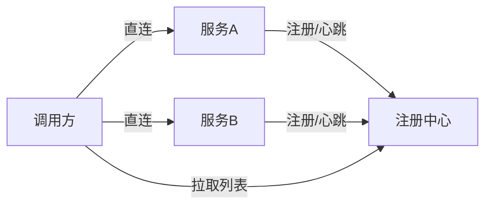

# 注册中心与配置中心

> 微服务几十个，IP 天天变，配置散落各处——这就是注册中心（服务发现）和配置中心（动态配置）要解决的。本文讲清 **Nacos / Eureka / Consul / ZooKeeper / Apollo** 怎么选，以及它们和「源码系列」里 Nacos 源码篇的分工（本篇偏选型与科普，源码篇偏实现）。
> 开源参考：[alibaba/nacos](https://github.com/alibaba/nacos)（注册 + 配置一体，Java，阿里开源，国内微服务事实标准）、[apollo-config/apollo](https://github.com/apollo-config/apollo)（携程，配置中心标杆）。

---


## 〇、本体介绍（它是什么 / 适用场景 / 核心概念）

**它是什么**：注册中心解决「服务怎么互相发现」（服务注册+心跳+发现），配置中心解决「配置怎么统一管理动态下发」（不改代码改配置、灰度发布）。Nacos 可同时托管二者，是 Spring Cloud Alibaba 默认方案。

**解决什么痛点**：没有注册中心时，服务地址写死在配置文件，扩缩容/故障要手动改；没有配置中心时，改一个超时参数要重新发版。二者是微服务「动态发现+动态配置」的基础设施。

**核心概念**：服务注册/发现、心跳/健康检查、CAP 取向（CP vs AP）、Nacos（Distro 协议 AP / Raft CP 双模式）、Eureka（AP）、ZooKeeper/Consul（CP）、长轮询配置推送、保护阈值、客户端快照、动态配置监听。

**适用场景**：微服务架构的服务发现与统一配置管理。
**不适用**：单体应用（无必要引入）。

---

## 一、两个概念先分清

| 组件 | 解决什么 | 核心能力 |
|------|----------|----------|
| **注册中心（服务发现）** | 服务 IP 动态变化，调用方怎么找到对方 | 服务注册 / 发现、健康检查、负载均衡 |
| **配置中心** | 配置散落、改配置要发版、多环境管理难 | 配置集中管理、动态推送、多环境 / 灰度、版本回滚 |

有的组件两者都做（**Nacos**），有的只做其一（Eureka 只注册、Apollo 只配置）。

---

## 二、注册中心主流方案



| 方案 | 一致性协议 | 特点 | 现状 |
|------|-----------|------|------|
| **Nacos** | Distro（AP）+ Raft（CP，可切换） | 注册 + 配置一体，国内主流，Spring Cloud Alibaba 默认 | 活跃，首选 |
| **Eureka** | AP（最终一致） | Netflix 出品，Spring Cloud 经典，自我保护机制 | **已停止维护**，老项目遗留 |
| **Consul** | Raft（CP） | 多数据中心、健康检查强、HashiCorp | 活跃，多 DC 场景 |
| **ZooKeeper** | ZAB（CP） | 强一致，Hadoop/大数据生态，Elastic-Job 依赖 | 老牌，CP 强一致 |
| **etcd** | Raft（CP） | K8s 背书，云原生 | 活跃，K8s 生态 |

### CAP 取向差异（重要）

- **AP（如 Eureka / Nacos Distro）**：网络分区时仍可用，牺牲强一致 → 适合「可用性优先」的业务服务发现。
- **CP（如 ZooKeeper / Consul / Nacos Raft）**：强一致，但网络分区可能不可用 → 适合「一致性优先」的协调场景。

> 经验：**服务发现用 AP 更合适**（宁可拿到旧列表也要能调），强一致协调用 CP。

---

## 三、配置中心主流方案

| 方案 | 特点 | 适用 |
|------|------|------|
| **Nacos** | 配置 + 注册一体，动态推送，简单 | 已有 Nacos 注册中心的团队 |
| **Apollo（携程）** | 配置管理标杆：多环境、灰度发布、权限、审计、回滚，UI 强大 | 配置治理要求高的企业 |
| **Spring Cloud Config** | Git 存配置，简单，但无 UI、推送弱 | 轻量、Git 流 |
| **Consul / etcd KV** | 通用 KV，需自建 UI | 已有 Consul/etcd |

---

## 四、Nacos 一站搞定（最常用）

Nacos 同时是注册中心和配置中心，Spring Cloud Alibaba 默认：

```yaml
# 注册发现
spring:
  cloud:
    nacos:
      discovery:
        server-addr: 127.0.0.1:8848
# 配置中心
        config:
          server-addr: 127.0.0.1:8848
          file-extension: yaml
```

- **注册**：服务启动时注册自身 + 心跳；调用方从 Nacos 拉服务列表做负载均衡。
- **配置**：`@RefreshScope` + `bootstrap.yml` 指定 dataId；改配置 Nacos 推送，应用热更新不重启。
- **健康检查**：临时实例用心跳，永久实例用服务端探测。
- **一致性**：默认 AP（Distro）；重要场景可切 CP（Raft）。

---

## 五、选型决策

| 你的场景 | 推荐 |
|----------|------|
| Java 微服务、要一站式 | **Nacos**（注册 + 配置） |
| 配置治理要求极高（权限/灰度/审计） | **Apollo** |
| 多数据中心、K8s 之外 | **Consul** |
| 云原生 / K8s 内部 | **etcd / K8s Service** |
| 老 Spring Cloud 项目 | Eureka（但建议迁 Nacos） |

> 注意：**Nacos 注册 + Apollo 配置** 也是常见组合（注册要轻快、配置要治理严）。

---

## 六、常见坑

1. **Nacos 数据结构混淆**：namespace（环境隔离）/ group（分组）/ dataId（配置项）三层要规划清楚。
2. **AP 模式拿到已下线实例**：客户端要有重试 + 健康检查剔除，避免调死节点。
3. **配置热更新不生效**：忘了 `@RefreshScope` 或 `bootstrap.yml` 配置不对。
4. **Nacos 单点**：生产要集群（至少 3 节点）+ 外置 MySQL，否则注册中心挂全站瘫痪。
5. **配置明文敏感信息**：数据库密码等进配置中心要加密（Nacos 支持配置加密插件）。
6. **Eureka 已停更**：新项目别再选，迁移到 Nacos。

---

## 面试高频问题（20+ 条）

1. **注册中心 vs 配置中心？** 注册中心管「服务发现」（注册/心跳/发现），配置中心管「配置管理」（统一配置、动态下发、灰度）。Nacos 可同时托管二者。

2. **主流注册中心 CAP 取向？** Nacos（可 AP/CP 切换）、Eureka（AP，优先可用）、ZooKeeper/Consul（CP，优先一致）。CAP 取舍决定故障时的行为。

3. **Nacos 的 Distro 与 Raft 协议？** 临时实例（服务发现）用 Distro（AP，最终一致，去中心化）；持久实例/配置用 Raft（CP，强一致，选主）。Nacos 双协议兼顾可用与一致。

4. **Eureka 为什么是 AP？** Eureka 设计优先保证注册中心可用性，节点间异步复制，网络分区时各节点仍可注册/发现，牺牲强一致，避免注册中心挂掉导致全站不可用。

5. **ZooKeeper 作为注册中心的取舍？** ZK 基于 ZAB（类 Paxos），CP 强一致；但节点宕机选主期间不可用，且客户端需维护会话，复杂。更适合强一致配置协调。

6. **保护阈值（Protection Threshold）？** Nacos 健康实例比例低于阈值时，为保护可用性，把不健康实例也返回给调用方，避免「健康实例被冲垮→雪崩」。是 AP 侧的自我保护。

7. **长轮询配置推送？** 客户端发长轮询请求（如 30s），服务端有变更才立即返回，否则挂起到超时；相比心跳轮询省资源，配置变更秒级生效。

8. **客户端本地快照？** 配置中心不可用时，客户端用本地缓存的快照兜底，保证应用仍能启动/运行，避免强依赖中心。

9. **Nacos vs Eureka vs Consul 怎么选？** 国内 Spring Cloud Alibaba 栈首选 Nacos（功能全、AP/CP 双模、配置中心一体）；纯服务发现轻量可选 Eureka；多数据中心/健康检查强可选 Consul。

10. **服务健康检查方式？** 客户端心跳（Eureka/Nacos 临时实例）、服务端主动探测（TCP/HTTP，Consul）、或 ZK 临时节点会话。

11. **注册中心挂了会怎样？** AP 型（Eureka/Nacos 临时）客户端用缓存继续调用，短暂不可用可接受；CP 型（ZK）选主期间不可注册/发现。

12. **动态配置下发流程？** 后台改配置 → 配置中心存库+通知 → 客户端长轮询感知 → 拉取新配置 → 应用热更新（@RefreshScope 等），无需发版。

13. **配置灰度发布？** 配置中心支持按 IP/分组/版本灰度推送，先小流量验证再全量，降低配置错误爆炸半径。

14. **Nacos 集群部署？** Nacos 集群需奇数节点（Raft 选主），外层接负载均衡；持久化用内嵌 Derby 或外置 MySQL（生产用 MySQL 保证配置不丢）。

15. **服务发现与负载均衡关系？** 注册中心提供实例列表，客户端/网关据此做负载均衡（轮询/随机/一致性哈希）；结合熔断（Sentinel）防故障扩散。

16. **注册中心与网关配合？** 网关从注册中心动态获取服务实例做路由，服务扩缩容自动感知，无需改网关配置。

17. **Consul 的特点？** 多数据中心原生支持、健康检查强、KV 存储做配置、CP 一致；但国内生态不如 Nacos。

18. **临时实例 vs 持久实例（Nacos）？** 临时实例靠心跳保活，宕机自动剔除（Distro/AP）；持久实例注册信息落库、不因心跳失联轻易删（Raft/CP），适合需强一致保留的元数据。

19. **配置加密？** 敏感配置（密码/密钥）在配置中心加密存储，客户端解密或使用 KMS，避免明文落库/传输。

20. **注册中心的 DNS 方案（如 CoreDNS）？** 云原生下也可用 DNS（CoreDNS/Kubernetes Service）做服务发现，但功能不如 Nacos/Eureka 丰富（无细粒度健康/元数据）。

21. **服务注销（优雅下线）？** 应用停机前主动调注销接口或发心跳停止，注册中心摘除实例，避免流量打到已停实例。

22. **注册中心选型结论？** 国内微服务默认 Nacos（注册+配置一体化、AP/CP 双模）；强一致配置协调可选 ZK/Consul；轻量纯发现可选 Eureka。

---
## 八、与其他板块的关系

- 和「**源码系列/Nacos**」：本篇讲选型与用法，源码篇讲 Nacos 注册 / 配置的实现原理（Distro / Raft / 长轮询推送）。
- 和「**基础知识/API 网关**」：网关从注册中心做服务发现（`lb://`）。
- 和「**基础知识/分布式事务 Seata**」：Seata 的 TC 注册发现常用 Nacos。
- 和「**架构/系统架构**」：注册 / 配置中心是微服务架构「基础设施层」核心。

---

## 九、注册中心生产配置清单

### 9.1 Nacos 集群部署

```properties
# nacos 集群配置
nacos.inetutils.ip-address=192.168.1.10
server.port=8848

# 外置 MySQL
spring.datasource.platform=mysql
db.num=1
db.url.0=jdbc:mysql://127.0.0.1:3306/nacos?characterEncoding=utf8
db.user=nacos
db.password=nacos
```

### 9.2 健康检查配置

| 实例类型 | 检查方式 | 适用场景 |
|----------|----------|----------|
| 临时实例 | 客户端心跳（默认5s） | 业务服务 |
| 永久实例 | 服务端 TCP/HTTP 探测 | 中间件/数据库 |

### 9.3 监控指标

```
Nacos 关键指标：
  服务注册数/发现数
  心跳成功/失败数
  配置推送成功/失败数
  长轮询连接数
  集群节点状态
```

### 9.4 常见问题排查

| 问题 | 原因 | 解决 |
|------|------|------|
| 注册失败 | 网络不通/端口错 | 检查 8848/9848/9849 端口 |
| 配置不生效 | @RefreshScope 缺失 | 加注解 |
| 集群不同步 | MySQL 数据不一致 | 检查 MySQL 主从 |
| 心跳超时 | 客户端压力大 | 调整心跳间隔 |

---

## 十、配置中心最佳实践

| 实践 | 说明 |
|------|------|
| 命名规范 | namespace/group/dataId 三级统一命名 |
| 灰度发布 | 按 IP/分组灰度推送配置 |
| 敏感加密 | 密码/密钥加密存储 |
| 版本管理 | 配置变更历史 + 回滚 |
| 权限控制 | 按 namespace 控制读写权限 |
| 监控告警 | 配置推送失败 → 告警 |

---

## 十一、Nacos 常用运维命令

```bash
# 查看服务列表
curl http://127.0.0.1:8848/nacos/v1/ns/service/list?pageNo=1&pageSize=10

# 查看实例列表
curl http://127.0.0.1:8848/nacos/v1/ns/instance/list?serviceName=xxx

# 发布配置
curl -X POST "http://127.0.0.1:8848/nacos/v1/cs/configs?dataId=xxx&group=xxx&content=xxx"

# 获取配置
curl "http://127.0.0.1:8848/nacos/v1/cs/configs?dataId=xxx&group=xxx"

# 查看集群状态
curl http://127.0.0.1:8848/nacos/v1/ns/catalog/services

# 查看配置监听
curl http://127.0.0.1:8848/nacos/v1/cs/configs/listener?dataId=xxx&group=xxx
```

---

## 十二、注册中心性能对比

| 指标 | Nacos | Eureka | Consul | ZooKeeper |
|------|-------|--------|--------|-----------|
| 注册延迟 | 毫秒级 | 秒级 | 秒级 | 毫秒级 |
| 发现延迟 | 毫秒级 | 秒级（30s 轮询） | 秒级 | 毫秒级 |
| 心跳间隔 | 5s | 30s | 10s | 会话超时 |
| 容量（服务数） | 10 万+ | 10 万+ | 10 万+ | 10 万+ |
| 集群规模 | 9 节点 | 5 节点 | 5 节点 | 7 节点 |

---

## 十三、配置中心功能对比

| 功能 | Nacos | Apollo | Spring Cloud Config |
|------|-------|--------|---------------------|
| 配置推送 | 长轮询 | 长轮询 | Webhook |
| 灰度发布 | ✅ | ✅ | ❌ |
| 版本回滚 | ✅ | ✅ | Git 回滚 |
| 权限控制 | ✅ | ✅（细粒度） | ❌ |
| 审计日志 | ✅ | ✅ | ❌ |
| 多环境 | Namespace | Cluster/Env | Profile |
| 配置加密 | 插件 | ❌ | ❌ |

---

## 十四、注册中心高可用架构

```
Nacos 集群（3 节点+）：
  Nacos-1 ←→ Nacos-2 ←→ Nacos-3
     ↓           ↓           ↓
  MySQL（主从/集群）

客户端：
  服务 → Nacos Client → 任意节点（自动路由）
  配置 → Nacos Client → 长轮询 → 任意节点

负载均衡：
  SLB/CLB → Nacos 集群（Round Robin）
```
