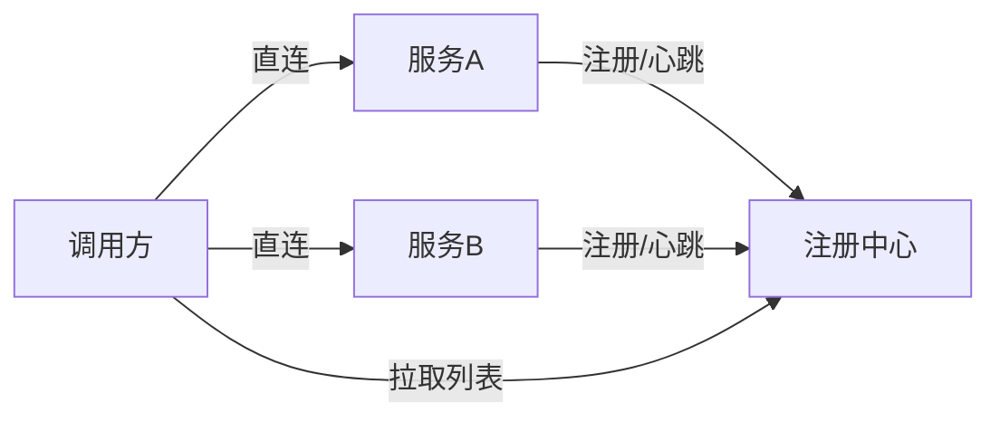

# 注册中心与配置中心

> 微服务几十个，IP 天天变，配置散落各处——这就是注册中心（服务发现）和配置中心（动态配置）要解决的。本文讲清 **Nacos / Eureka / Consul / ZooKeeper / Apollo** 怎么选，以及它们和「源码系列」里 Nacos 源码篇的分工（本篇偏选型与科普，源码篇偏实现）。
> 开源参考：[alibaba/nacos](https://github.com/alibaba/nacos)（注册 + 配置一体，Java，阿里开源，国内微服务事实标准）、[apollo-config/apollo](https://github.com/apollo-config/apollo)（携程，配置中心标杆）。

---

## 一、两个概念先分清

| 组件 | 解决什么 | 核心能力 |
|------|----------|----------|
| **注册中心（服务发现）** | 服务 IP 动态变化，调用方怎么找到对方 | 服务注册 / 发现、健康检查、负载均衡 |
| **配置中心** | 配置散落、改配置要发版、多环境管理难 | 配置集中管理、动态推送、多环境 / 灰度、版本回滚 |

有的组件两者都做（**Nacos**），有的只做其一（Eureka 只注册、Apollo 只配置）。

---

## 二、注册中心主流方案



| 方案 | 一致性协议 | 特点 | 现状 |
|------|-----------|------|------|
| **Nacos** | Distro（AP）+ Raft（CP，可切换） | 注册 + 配置一体，国内主流，Spring Cloud Alibaba 默认 | 活跃，首选 |
| **Eureka** | AP（最终一致） | Netflix 出品，Spring Cloud 经典，自我保护机制 | **已停止维护**，老项目遗留 |
| **Consul** | Raft（CP） | 多数据中心、健康检查强、HashiCorp | 活跃，多 DC 场景 |
| **ZooKeeper** | ZAB（CP） | 强一致，Hadoop/大数据生态，Elastic-Job 依赖 | 老牌，CP 强一致 |
| **etcd** | Raft（CP） | K8s 背书，云原生 | 活跃，K8s 生态 |

### CAP 取向差异（重要）

- **AP（如 Eureka / Nacos Distro）**：网络分区时仍可用，牺牲强一致 → 适合「可用性优先」的业务服务发现。
- **CP（如 ZooKeeper / Consul / Nacos Raft）**：强一致，但网络分区可能不可用 → 适合「一致性优先」的协调场景。

> 经验：**服务发现用 AP 更合适**（宁可拿到旧列表也要能调），强一致协调用 CP。

---

## 三、配置中心主流方案

| 方案 | 特点 | 适用 |
|------|------|------|
| **Nacos** | 配置 + 注册一体，动态推送，简单 | 已有 Nacos 注册中心的团队 |
| **Apollo（携程）** | 配置管理标杆：多环境、灰度发布、权限、审计、回滚，UI 强大 | 配置治理要求高的企业 |
| **Spring Cloud Config** | Git 存配置，简单，但无 UI、推送弱 | 轻量、Git 流 |
| **Consul / etcd KV** | 通用 KV，需自建 UI | 已有 Consul/etcd |

---

## 四、Nacos 一站搞定（最常用）

Nacos 同时是注册中心和配置中心，Spring Cloud Alibaba 默认：

```yaml
# 注册发现
spring:
  cloud:
    nacos:
      discovery:
        server-addr: 127.0.0.1:8848
# 配置中心
        config:
          server-addr: 127.0.0.1:8848
          file-extension: yaml
```

- **注册**：服务启动时注册自身 + 心跳；调用方从 Nacos 拉服务列表做负载均衡。
- **配置**：`@RefreshScope` + `bootstrap.yml` 指定 dataId；改配置 Nacos 推送，应用热更新不重启。
- **健康检查**：临时实例用心跳，永久实例用服务端探测。
- **一致性**：默认 AP（Distro）；重要场景可切 CP（Raft）。

---

## 五、选型决策

| 你的场景 | 推荐 |
|----------|------|
| Java 微服务、要一站式 | **Nacos**（注册 + 配置） |
| 配置治理要求极高（权限/灰度/审计） | **Apollo** |
| 多数据中心、K8s 之外 | **Consul** |
| 云原生 / K8s 内部 | **etcd / K8s Service** |
| 老 Spring Cloud 项目 | Eureka（但建议迁 Nacos） |

> 注意：**Nacos 注册 + Apollo 配置** 也是常见组合（注册要轻快、配置要治理严）。

---

## 六、常见坑

1. **Nacos 数据结构混淆**：namespace（环境隔离）/ group（分组）/ dataId（配置项）三层要规划清楚。
2. **AP 模式拿到已下线实例**：客户端要有重试 + 健康检查剔除，避免调死节点。
3. **配置热更新不生效**：忘了 `@RefreshScope` 或 `bootstrap.yml` 配置不对。
4. **Nacos 单点**：生产要集群（至少 3 节点）+ 外置 MySQL，否则注册中心挂全站瘫痪。
5. **配置明文敏感信息**：数据库密码等进配置中心要加密（Nacos 支持配置加密插件）。
6. **Eureka 已停更**：新项目别再选，迁移到 Nacos。

---

## 七、面试高频速查

- **注册中心解决什么？** 服务动态 IP 下的服务发现、健康检查、负载均衡。
- **CAP 怎么选？** 服务发现偏 AP（可用优先），强一致协调偏 CP。
- **Nacos vs Eureka？** Nacos 注册 + 配置一体、活跃、AP/CP 可切；Eureka 已停更。
- **Nacos vs Apollo？** Nacos 一站式轻量；Apollo 配置治理强（灰度/审计/权限）。
- **配置热更新原理？** 配置中心推送变更 → 客户端监听 → 刷新 `@RefreshScope` Bean。
- **和 ZooKeeper 关系？** ZK 是 CP 强一致协调（大数据/老 Dubbo），Nacos 更云原生轻量。

---

## 八、与其他板块的关系

- 和「**源码系列/Nacos**」：本篇讲选型与用法，源码篇讲 Nacos 注册 / 配置的实现原理（Distro / Raft / 长轮询推送）。
- 和「**基础知识/API 网关**」：网关从注册中心做服务发现（`lb://`）。
- 和「**基础知识/分布式事务 Seata**」：Seata 的 TC 注册发现常用 Nacos。
- 和「**架构/系统架构**」：注册 / 配置中心是微服务架构「基础设施层」核心。
