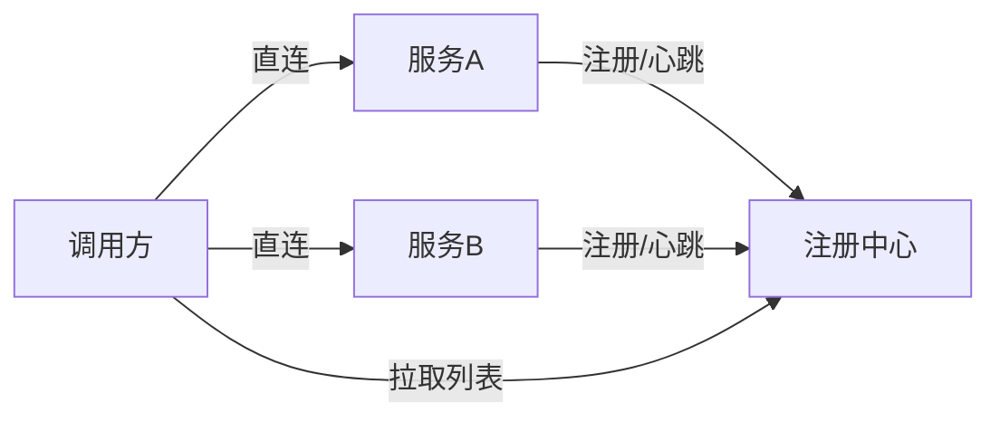
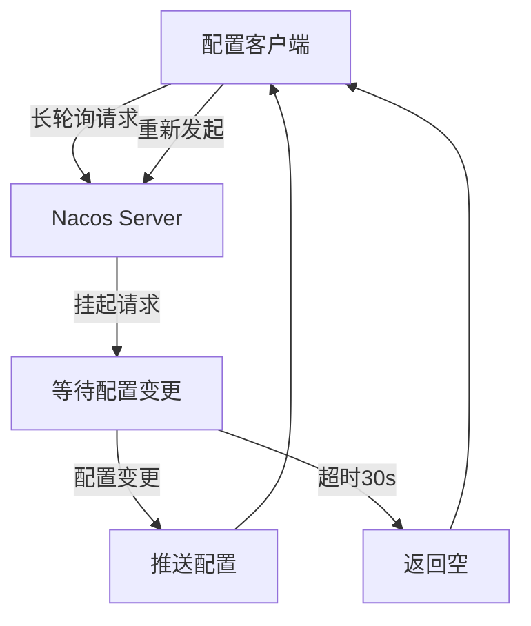
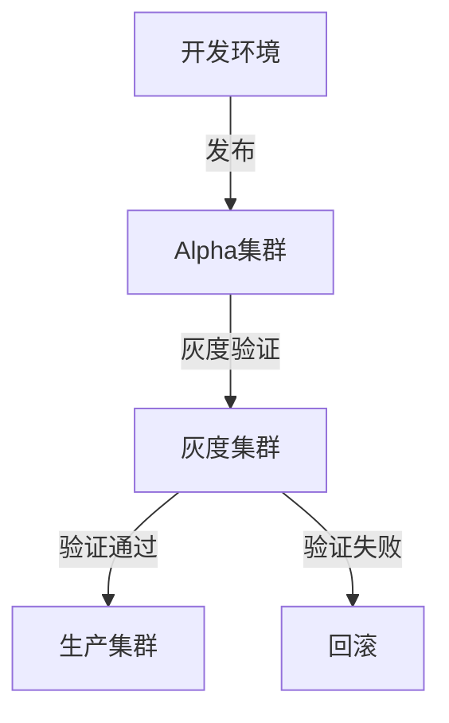
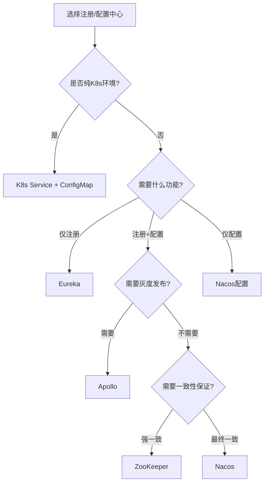
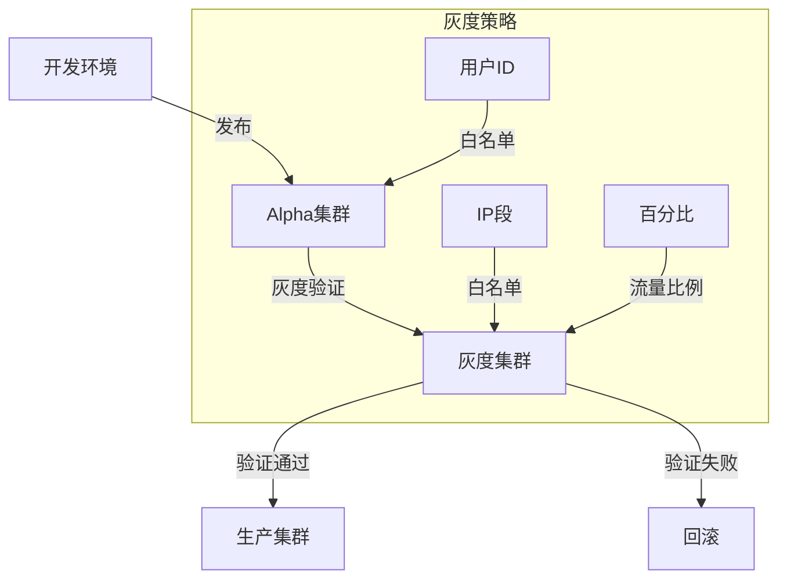
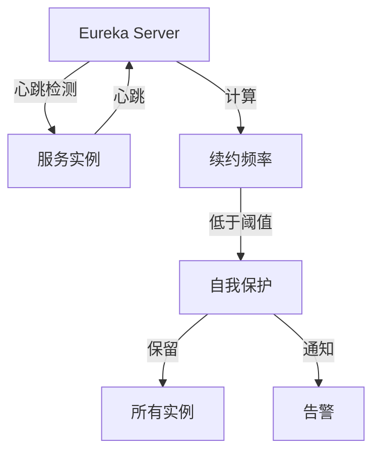
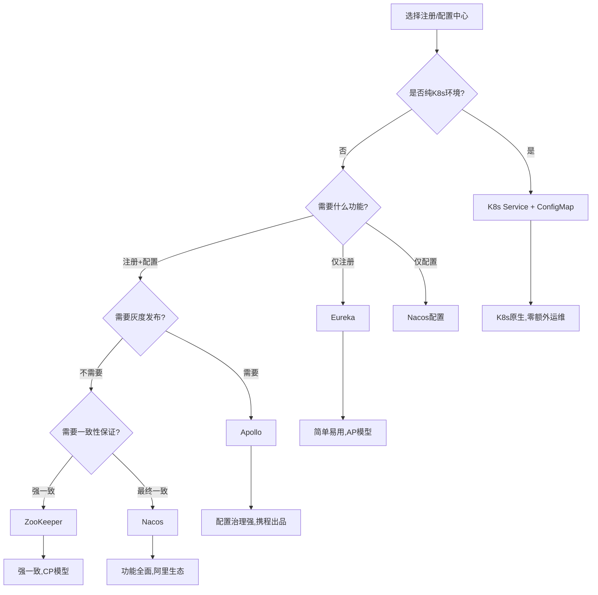
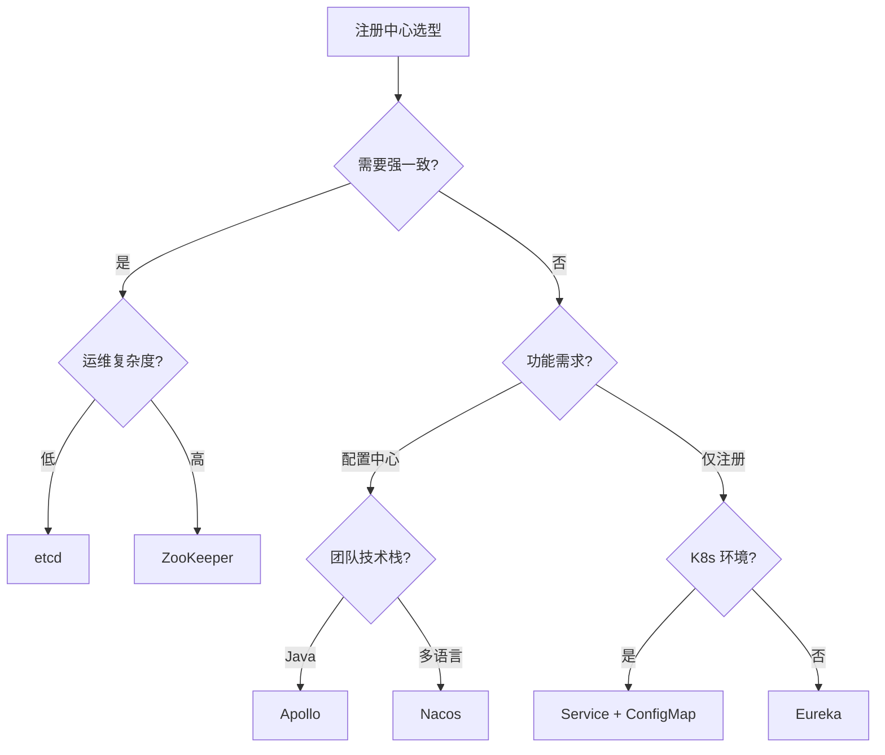
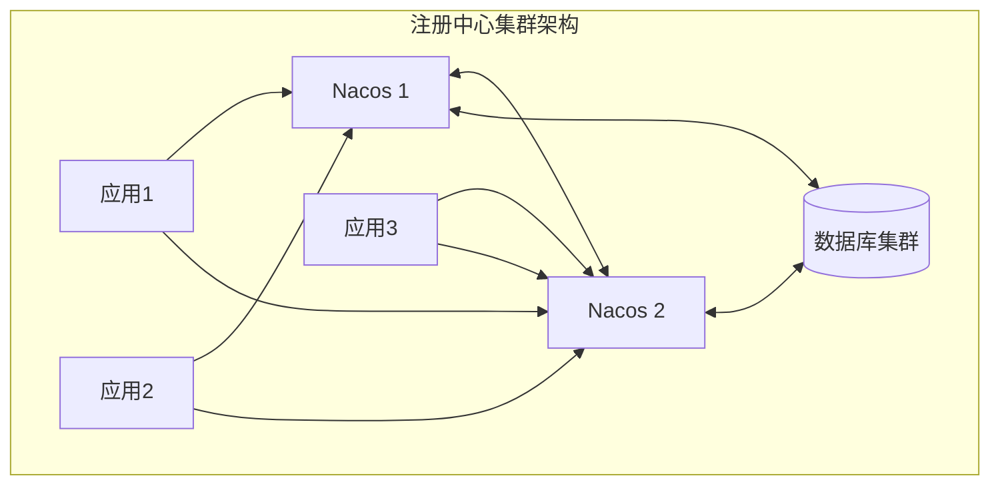

# 注册中心与配置中心

> 微服务几十个，IP 天天变，配置散落各处——这就是注册中心（服务发现）和配置中心（动态配置）要解决的。本文讲清 **Nacos / Eureka / Consul / ZooKeeper / Apollo** 怎么选，以及它们和「源码系列」里 Nacos 源码篇的分工（本篇偏选型与科普，源码篇偏实现）。
> 开源参考：[alibaba/nacos](https://github.com/alibaba/nacos)（注册 + 配置一体，Java，阿里开源，国内微服务事实标准）、[apollo-config/apollo](https://github.com/apollo-config/apollo)（携程，配置中心标杆）。

---


## 〇、本体介绍（它是什么 / 适用场景 / 核心概念）

**它是什么**：注册中心解决「服务怎么互相发现」（服务注册+心跳+发现），配置中心解决「配置怎么统一管理动态下发」（不改代码改配置、灰度发布）。Nacos 可同时托管二者，是 Spring Cloud Alibaba 默认方案。

**解决什么痛点**：没有注册中心时，服务地址写死在配置文件，扩缩容/故障要手动改；没有配置中心时，改一个超时参数要重新发版。二者是微服务「动态发现+动态配置」的基础设施。

**核心概念**：服务注册/发现、心跳/健康检查、CAP 取向（CP vs AP）、Nacos（Distro 协议 AP / Raft CP 双模式）、Eureka（AP）、ZooKeeper/Consul（CP）、长轮询配置推送、保护阈值、客户端快照、动态配置监听。

**适用场景**：微服务架构的服务发现与统一配置管理。
**不适用**：单体应用（无必要引入）。

---

## 一、两个概念先分清

| 组件 | 解决什么 | 核心能力 |
|------|----------|----------|
| **注册中心（服务发现）** | 服务 IP 动态变化，调用方怎么找到对方 | 服务注册 / 发现、健康检查、负载均衡 |
| **配置中心** | 配置散落、改配置要发版、多环境管理难 | 配置集中管理、动态推送、多环境 / 灰度、版本回滚 |

有的组件两者都做（**Nacos**），有的只做其一（Eureka 只注册、Apollo 只配置）。

---

## 二、注册中心主流方案



| 方案 | 一致性协议 | 特点 | 现状 |
|------|-----------|------|------|
| **Nacos** | Distro（AP）+ Raft（CP，可切换） | 注册 + 配置一体，国内主流，Spring Cloud Alibaba 默认 | 活跃，首选 |
| **Eureka** | AP（最终一致） | Netflix 出品，Spring Cloud 经典，自我保护机制 | **已停止维护**，老项目遗留 |
| **Consul** | Raft（CP） | 多数据中心、健康检查强、HashiCorp | 活跃，多 DC 场景 |
| **ZooKeeper** | ZAB（CP） | 强一致，Hadoop/大数据生态，Elastic-Job 依赖 | 老牌，CP 强一致 |
| **etcd** | Raft（CP） | K8s 背书，云原生 | 活跃，K8s 生态 |

### CAP 取向差异（重要）

- **AP（如 Eureka / Nacos Distro）**：网络分区时仍可用，牺牲强一致 → 适合「可用性优先」的业务服务发现。
- **CP（如 ZooKeeper / Consul / Nacos Raft）**：强一致，但网络分区可能不可用 → 适合「一致性优先」的协调场景。

> 经验：**服务发现用 AP 更合适**（宁可拿到旧列表也要能调），强一致协调用 CP。

---

## 三、配置中心主流方案

| 方案 | 特点 | 适用 |
|------|------|------|
| **Nacos** | 配置 + 注册一体，动态推送，简单 | 已有 Nacos 注册中心的团队 |
| **Apollo（携程）** | 配置管理标杆：多环境、灰度发布、权限、审计、回滚，UI 强大 | 配置治理要求高的企业 |
| **Spring Cloud Config** | Git 存配置，简单，但无 UI、推送弱 | 轻量、Git 流 |
| **Consul / etcd KV** | 通用 KV，需自建 UI | 已有 Consul/etcd |

---

## 四、Nacos 一站搞定（最常用）

Nacos 同时是注册中心和配置中心，Spring Cloud Alibaba 默认：

```yaml
# 注册发现
spring:
  cloud:
    nacos:
      discovery:
        server-addr: 127.0.0.1:8848
# 配置中心
        config:
          server-addr: 127.0.0.1:8848
          file-extension: yaml
```

- **注册**：服务启动时注册自身 + 心跳；调用方从 Nacos 拉服务列表做负载均衡。
- **配置**：`@RefreshScope` + `bootstrap.yml` 指定 dataId；改配置 Nacos 推送，应用热更新不重启。
- **健康检查**：临时实例用心跳，永久实例用服务端探测。
- **一致性**：默认 AP（Distro）；重要场景可切 CP（Raft）。

---

## 五、选型决策

| 你的场景 | 推荐 |
|----------|------|
| Java 微服务、要一站式 | **Nacos**（注册 + 配置） |
| 配置治理要求极高（权限/灰度/审计） | **Apollo** |
| 多数据中心、K8s 之外 | **Consul** |
| 云原生 / K8s 内部 | **etcd / K8s Service** |
| 老 Spring Cloud 项目 | Eureka（但建议迁 Nacos） |

> 注意：**Nacos 注册 + Apollo 配置** 也是常见组合（注册要轻快、配置要治理严）。

---

## 六、常见坑

1. **Nacos 数据结构混淆**：namespace（环境隔离）/ group（分组）/ dataId（配置项）三层要规划清楚。
2. **AP 模式拿到已下线实例**：客户端要有重试 + 健康检查剔除，避免调死节点。
3. **配置热更新不生效**：忘了 `@RefreshScope` 或 `bootstrap.yml` 配置不对。
4. **Nacos 单点**：生产要集群（至少 3 节点）+ 外置 MySQL，否则注册中心挂全站瘫痪。
5. **配置明文敏感信息**：数据库密码等进配置中心要加密（Nacos 支持配置加密插件）。
6. **Eureka 已停更**：新项目别再选，迁移到 Nacos。

---

## 面试高频问题（20+ 条）

1. **注册中心 vs 配置中心？** 注册中心管「服务发现」（注册/心跳/发现），配置中心管「配置管理」（统一配置、动态下发、灰度）。Nacos 可同时托管二者。

2. **主流注册中心 CAP 取向？** Nacos（可 AP/CP 切换）、Eureka（AP，优先可用）、ZooKeeper/Consul（CP，优先一致）。CAP 取舍决定故障时的行为。

3. **Nacos 的 Distro 与 Raft 协议？** 临时实例（服务发现）用 Distro（AP，最终一致，去中心化）；持久实例/配置用 Raft（CP，强一致，选主）。Nacos 双协议兼顾可用与一致。

4. **Eureka 为什么是 AP？** Eureka 设计优先保证注册中心可用性，节点间异步复制，网络分区时各节点仍可注册/发现，牺牲强一致，避免注册中心挂掉导致全站不可用。

5. **ZooKeeper 作为注册中心的取舍？** ZK 基于 ZAB（类 Paxos），CP 强一致；但节点宕机选主期间不可用，且客户端需维护会话，复杂。更适合强一致配置协调。

6. **保护阈值（Protection Threshold）？** Nacos 健康实例比例低于阈值时，为保护可用性，把不健康实例也返回给调用方，避免「健康实例被冲垮→雪崩」。是 AP 侧的自我保护。

7. **长轮询配置推送？** 客户端发长轮询请求（如 30s），服务端有变更才立即返回，否则挂起到超时；相比心跳轮询省资源，配置变更秒级生效。

8. **客户端本地快照？** 配置中心不可用时，客户端用本地缓存的快照兜底，保证应用仍能启动/运行，避免强依赖中心。

9. **Nacos vs Eureka vs Consul 怎么选？** 国内 Spring Cloud Alibaba 栈首选 Nacos（功能全、AP/CP 双模、配置中心一体）；纯服务发现轻量可选 Eureka；多数据中心/健康检查强可选 Consul。

10. **服务健康检查方式？** 客户端心跳（Eureka/Nacos 临时实例）、服务端主动探测（TCP/HTTP，Consul）、或 ZK 临时节点会话。

11. **注册中心挂了会怎样？** AP 型（Eureka/Nacos 临时）客户端用缓存继续调用，短暂不可用可接受；CP 型（ZK）选主期间不可注册/发现。

12. **动态配置下发流程？** 后台改配置 → 配置中心存库+通知 → 客户端长轮询感知 → 拉取新配置 → 应用热更新（@RefreshScope 等），无需发版。

13. **配置灰度发布？** 配置中心支持按 IP/分组/版本灰度推送，先小流量验证再全量，降低配置错误爆炸半径。

14. **Nacos 集群部署？** Nacos 集群需奇数节点（Raft 选主），外层接负载均衡；持久化用内嵌 Derby 或外置 MySQL（生产用 MySQL 保证配置不丢）。

15. **服务发现与负载均衡关系？** 注册中心提供实例列表，客户端/网关据此做负载均衡（轮询/随机/一致性哈希）；结合熔断（Sentinel）防故障扩散。

16. **注册中心与网关配合？** 网关从注册中心动态获取服务实例做路由，服务扩缩容自动感知，无需改网关配置。

17. **Consul 的特点？** 多数据中心原生支持、健康检查强、KV 存储做配置、CP 一致；但国内生态不如 Nacos。

18. **临时实例 vs 持久实例（Nacos）？** 临时实例靠心跳保活，宕机自动剔除（Distro/AP）；持久实例注册信息落库、不因心跳失联轻易删（Raft/CP），适合需强一致保留的元数据。

19. **配置加密？** 敏感配置（密码/密钥）在配置中心加密存储，客户端解密或使用 KMS，避免明文落库/传输。

20. **注册中心的 DNS 方案（如 CoreDNS）？** 云原生下也可用 DNS（CoreDNS/Kubernetes Service）做服务发现，但功能不如 Nacos/Eureka 丰富（无细粒度健康/元数据）。

21. **服务注销（优雅下线）？** 应用停机前主动调注销接口或发心跳停止，注册中心摘除实例，避免流量打到已停实例。

22. **注册中心选型结论？** 国内微服务默认 Nacos（注册+配置一体化、AP/CP 双模）；强一致配置协调可选 ZK/Consul；轻量纯发现可选 Eureka。

---
## 八、Nacos 2.x Push/Pull 模型

### 8.1 推送模型

```
Nacos 配置推送：
  客户端 → 长轮询连接（30s 超时）
  → 服务端有变更 → 立即返回
  → 客户端拉取新配置
  → 无变更 → 挂起到超时

推送流程：
  1. 客户端发起长轮询（/nacos/v1/cs/configs/listener）
  2. 服务端 hold 住请求（最多 30s）
  3. 配置变更 → 立即返回变更的 dataId/group
  4. 客户端拉取新配置（/nacos/v1/cs/configs）
  5. 应用热更新（@RefreshScope）
```

### 8.2 Pull 模型

```
Nacos 服务发现 Pull：
  客户端 → 定时拉取服务列表（10s 间隔）
  → 缓存到本地
  → 调用时使用本地缓存
  → 定时更新

Pull vs Push：
  Pull：客户端主动拉取（简单，有延迟）
  Push：服务端主动推送（实时，复杂）
  Nacos 2.x：配置用长轮询（Pull 变种），发现用推送（Distro 协议）
```

### 8.3 Nacos 2.x 协议

| 协议 | 用途 | 模型 |
|------|------|------|
| gRPC | 服务注册/发现 | 长连接推送 |
| HTTP | 配置管理 | 长轮询 Pull |
| Distro | 临时实例同步 | AP 最终一致 |
| Raft | 持久实例/配置 | CP 强一致 |

---

## 九、Nacos 配置加密（AES/RSA）

### 9.1 配置加密原理

```
Nacos 配置加密流程：
  1. 应用配置加密后的密文到 Nacos
  2. 客户端拉取密文
  3. 客户端解密（本地密钥/KMS）
  4. 应用使用明文

加密方式：
  AES：对称加密，性能高
  RSA：非对称加密，安全性高
  KMS：云密钥管理服务
```

### 9.2 加密配置示例

```java
// 自定义加密解密器
public class MyCryptoConfigService implements CryptoConfigService {
    @Override
    public String decrypt(String cipherText) {
        // 使用 AES 解密
        return AESUtil.decrypt(cipherText, secretKey);
    }
    
    @Override
    public String encrypt(String plainText) {
        // 使用 AES 加密
        return AESUtil.encrypt(plainText, secretKey);
    }
}
```

### 9.3 加密最佳实践

| 实践 | 说明 |
|------|------|
| KMS 集成 | 敏感配置用 KMS 加密 |
| 密钥管理 | 密钥不落库，用环境变量 |
| 审计 | 记录加密操作 |
| 轮换 | 定期轮换密钥 |

---

## 十、Nacos 灰度发布

### 10.1 灰度发布原理

```
Nacos 灰度发布：
  1. 配置中心保存灰度规则（IP/标签/版本）
  2. 客户端拉取配置时，服务端根据规则返回灰度配置
  3. 部分客户端收到灰度配置
  4. 验证通过后全量发布

灰度规则：
  按 IP：指定 IP 列表
  按标签：客户端标签匹配
  按版本：指定应用版本
  按百分比：随机比例
```

### 10.2 灰度发布配置

```yaml
# Nacos 灰度规则
灰度规则:
  dataId: my-config
  group: DEFAULT_GROUP
  灰度IP:
    - 192.168.1.100
    - 192.168.1.101
  灰度标签:
    - env=canary
  灰度版本:
    - 1.0.0-canary
```

### 10.3 灰度发布最佳实践

| 实践 | 说明 |
|------|------|
| 小流量验证 | 先灰度 5~10% 流量 |
| 监控告警 | 灰度期间密切监控 |
| 快速回滚 | 问题立即全量回滚 |
| 灰度指标 | 错误率/延迟/业务指标 |

---

## 十一、Consul Connect 服务网格

### 11.1 Consul Connect 架构

```
Consul Connect：
  每个服务部署 Envoy Sidecar
  → Consul 控制面下发路由/安全配置
  → mTLS 服务间认证
  → 流量管理（权重/超时/重试）

核心能力：
  mTLS：自动双向认证
  流量管理：路由/权重/超时
  可观测：链路追踪/指标
  安全：授权策略
```

### 11.2 Consul Connect 配置

```hcl
# service-defaults.hcl
kind = "service-defaults"
name = "web"
Protocol = "http"
MeshGateway {
  Mode = "none"
}

# service-router.hcl
kind = "service-router"
name = "web"
Routes = [
  {
    Destination = {
      Service = "web-v2"
    }
    Match {
      HTTP {
        PathPrefix = "/v2"
      }
    }
  }
]
```

---

## 十二、Consul KV Store 模式

### 12.1 KV 存储使用

```bash
# 写入 KV
consul kv put config/db/host "10.0.1.100"
consul kv put config/db/port "3306"

# 读取 KV
consul kv get config/db/host

# 递归读取
consul kv get -recurse config/

# Watch 监听变化
consul watch -type=keyprefix -prefix=config/ /scripts/handler.sh
```

### 12.2 KV 存储最佳实践

| 实践 | 说明 |
|------|------|
| 层级设计 | 用 / 分隔层级 |
| 环境隔离 | 不同环境不同前缀 |
| 版本控制 | 保存历史版本 |
| 监控 | Watch 变更通知 |

---

## 十三、etcd Key 版本化与 Watch

### 13.1 Key 版本化

```
etcd Key 版本化：
  每次写入创建新版本（revision）
  支持历史版本查询
  支持按版本 Watch

版本类型：
  CreateRevision：创建版本
  ModRevision：修改版本
  Version：修改次数
```

### 13.2 Watch 机制

```go
// etcd Watch 示例
ctx := context.Background()
watchChan := client.Watch(ctx, "/config/", clientv3.WithPrefix())
for resp := range watchChan {
    for _, ev := range resp.Events {
        switch ev.Type {
        case clientv3.EventTypePut:
            fmt.Printf("PUT: %s = %s\n", ev.Kv.Key, ev.Kv.Value)
        case clientv3.EventTypeDelete:
            fmt.Printf("DELETE: %s\n", ev.Kv.Key)
        }
    }
}
```

### 13.3 etcd vs ZooKeeper 对比

| 维度 | etcd | ZooKeeper |
|------|------|-----------|
| 协议 | Raft | ZAB |
| API | gRPC | 自定义协议 |
| Watch | 原生支持 | 需要 Curator |
| 性能 | 高 | 中 |
| 适用 | K8s/云原生 | 大数据/遗留系统 |

---

## 十四、ZooKeeper 临时节点

### 14.1 临时节点原理

```
ZooKeeper 临时节点：
  客户端创建节点 → 绑定 Session
  Session 断开 → 节点自动删除
  Session 保活 → 节点持续存在

用途：
  服务注册：服务启动创建临时节点
  分布式锁：临时顺序节点实现锁
  Leader 选举：临时节点选主
  配置管理：Watch 临时节点变化
```

### 14.2 临时节点 vs 持久节点

| 维度 | 临时节点 | 持久节点 |
|------|----------|----------|
| 生命周期 | 绑定 Session | 永久存在 |
| 自动删除 | Session 断开自动删 | 手动删除 |
| 适用 | 服务注册/锁 | 配置/元数据 |
| 可用性 | Session 超时后不可用 | 持续可用 |

---

## 十五、配置中心在 Kubernetes（ConfigMap）

### 15.1 K8s ConfigMap

```yaml
apiVersion: v1
kind: ConfigMap
metadata:
  name: app-config
data:
  application.yml: |
    server:
      port: 8080
    spring:
      datasource:
        url: jdbc:mysql://db:3306/mydb
        username: root
        password: ${DB_PASSWORD}
```

### 15.2 ConfigMap vs 配置中心

| 维度 | K8s ConfigMap | Nacos/Apollo |
|------|---------------|--------------|
| 动态更新 | 需重启/滚动更新 | 热更新 |
| 版本管理 | K8s 历史版本 | 配置中心版本 |
| 灰度发布 | 不支持 | 支持 |
| 权限控制 | K8s RBAC | 配置中心权限 |
| 适用 | K8s 原生配置 | 微服务动态配置 |

### 15.3 ConfigMap + 配置中心集成

```
最佳实践：
  静态配置 → K8s ConfigMap
  动态配置 → Nacos/Apollo
  敏感配置 → Secret + KMS

集成方式：
  应用启动时：
    1. 读取 ConfigMap（静态配置）
    2. 连接 Nacos/Apollo（动态配置）
    3. 动态配置覆盖静态配置
```

---

## 补充：注册中心与配置中心深度解析

### 1. Nacos Cluster Deployment

| 节点数 | 说明 |
|--------|------|
| 3节点 | 最小集群 |
| 5节点 | 推荐生产 |
| 7节点 | 大规模集群 |
| 奇数节点 | Raft选主需要 |

### 2. Nacos Security

| 维度 | 说明 |
|------|------|
| 认证 | 用户名密码 |
| 鉴权 | RBAC权限控制 |
| 网络 | 专用网络隔离 |
| 加密 | 配置加密插件 |

### 3. Nacos Multi-Tenancy

| 维度 | 说明 |
|------|------|
| Namespace | 环境隔离 |
| Group | 业务分组 |
| dataId | 配置项 |
| 权限 | 按namespace控制 |

### 4. Nacos Performance Tuning

| 优化项 | 说明 |
|--------|------|
| 心跳间隔 | 调整心跳频率 |
| 拉取间隔 | 调整服务列表拉取间隔 |
| 内存配置 | 调整JVM内存 |
| 连接池 | 数据库连接池优化 |

### 5. Nacos Monitoring

| 指标 | 说明 |
|------|------|
| 服务注册数 | 已注册服务数量 |
| 心跳成功率 | 心跳成功比例 |
| 配置推送成功率 | 配置推送成功比例 |
| 长轮询连接数 | 当前长轮询连接数 |

### 6. Nacos with Spring Cloud

| 组件 | 说明 |
|------|------|
| 服务发现 | @EnableDiscoveryClient |
| 配置中心 | @RefreshScope |
| 负载均衡 | Spring Cloud LoadBalancer |
| 熔断 | Sentinel |

### 7. Nacos with Dubbo

| 组件 | 说明 |
|------|------|
| 服务注册 | Dubbo服务注册到Nacos |
| 服务发现 | 从Nacos发现Dubbo服务 |
| 配置管理 | Dubbo配置从Nacos获取 |

### 8. Nacos in Production

| 实践 | 说明 |
|------|------|
| 集群部署 | 至少3节点 |
| 外置MySQL | 生产用MySQL |
| 负载均衡 | 前端SLB |
| 监控告警 | Prometheus+Grafana |

### 9. Apollo vs Nacos Comparison

| 维度 | Apollo | Nacos |
|------|--------|-------|
| 定位 | 配置中心 | 注册+配置一体 |
| 灰度发布 | 强 | 支持 |
| 权限控制 | 细粒度 | 中等 |
| 审计日志 | 强 | 支持 |
| 学习成本 | 中 | 低 |

### 10. etcd as Configuration Center

| 维度 | 说明 |
|------|------|
| Watch机制 | 原生支持 |
| 版本化 | 历史版本查询 |
| 事务 | 支持事务操作 |
| 适用 | K8s/云原生 |

### 11. ZooKeeper as Configuration Center

| 维度 | 说明 |
|------|------|
| 临时节点 | Session绑定 |
| Watch | 需要Curator |
| 强一致 | ZAB协议 |
| 适用 | 大数据/遗留系统 |

### 12. Service Mesh and Configuration Center

| 方案 | 说明 |
|------|------|
| Istio | 配置通过CRD下发 |
| Consul Connect | KV存储配置 |
| Nacos | 传统微服务配置 |

### 13. Nacos Checklist

| 检查项 | 说明 |
|--------|------|
| 集群部署 | 至少3节点 |
| 外置MySQL | 生产用MySQL |
| 监控告警 | 服务+配置监控 |
| 权限控制 | 最小权限 |

### 14. Nacos Tools

| 工具 | 说明 |
|------|------|
| Nacos Console | Web控制台 |
| Nacos SDK | 多语言SDK |
| Nacos Admin | 管理API |

### 15. Nacos Future Trends

| 趋势 | 说明 |
|------|------|
| 云原生 | K8s集成 |
| 多协议 | 支持更多协议 |
| AI集成 | 智能运维 |

### 16. Nacos Selection Guide

| 场景 | 推荐方案 |
|------|----------|
| 注册+配置 | Nacos |
| 纯配置 | Apollo |
| 多数据中心 | Consul |
| K8s原生 | etcd |

### 17. Nacos Best Practices

| 实践 | 说明 |
|------|------|
| 命名规范 | 统一命名规则 |
| 灰度发布 | 先灰度再全量 |
| 监控告警 | 完善监控体系 |

---

## Nacos 长轮询实现原理

### 长轮询核心流程



```java
// Nacos 长轮询配置
Properties props = new Properties();
props.put("serverAddr", "localhost:8848");
props.put("namespace", "dev");
ConfigService configService = NacosFactory.createConfigService(props);

// 监听配置变更
configService.addListener("app.properties", "DEFAULT_GROUP", 
    new Listener() {
        @Override
        public void receiveConfigInfo(String configInfo) {
            System.out.println("配置变更: " + configInfo);
        }
        
        @Override
        public Executor getExecutor() {
            return null;
        }
    });
```

### 长轮询 vs 短轮询 vs WebSocket

| 方案 | 延迟 | 服务器压力 | 实时性 | 适用场景 |
|------|------|------------|--------|----------|
| 短轮询 | 高(秒级) | 高 | 差 | 简单场景 |
| 长轮询 | 低(毫秒级) | 低 | 好 | 配置中心 |
| WebSocket | 极低 | 中 | 极好 | 实时通信 |
| gRPC流 | 极低 | 低 | 极好 | 微服务通信 |

## Apollo 灰度发布机制

### 灰度发布架构



| 灰度策略 | 说明 | 适用场景 |
|----------|------|----------|
| 按用户ID | 白名单指定用户 | 内部测试/种子用户 |
| 按IP段 | 指定服务器IP | 特定机房/环境 |
| 按百分比 | 随机比例放量 | 渐进式验证 |
| 按标签 | 自定义元数据 | 版本/环境标识 |

### 灰度发布流程

| 步骤 | 操作 | 说明 |
|------|------|------|
| 1 | 创建灰度规则 | 设置灰度条件 |
| 2 | 推送灰度配置 | 只对灰度用户生效 |
| 3 | 监控指标 | 观察错误率/延迟 |
| 4 | 灰度扩大 | 逐步增加灰度比例 |
| 5 | 全量发布 | 灰度验证通过后全量 |
| 6 | 回滚 | 出现问题时快速回滚 |

## Eureka 自我保护机制

### 触发条件与行为

```text
正常状态：
  Eureka Server 每分钟收到心跳 ≥ 阈值
  → 正常剔除不可用实例

自我保护状态：
  Eureka Server 每分钟收到心跳 < 阈值
  → 保留所有实例（避免误剔除）
  → 输出告警日志
  → 等待网络恢复
```

| 参数 | 默认值 | 说明 |
|------|--------|------|
| 续约频率阈值 | 85% | 实际续约/预期续约 |
| 最小实例数 | 0 | 保护的最小实例数 |
| 续约窗口 | 15分钟 | 统计时间窗口 |
| 剔除间隔 | 60秒 | 检查频率 |

```yaml
eureka:
  server:
    enable-self-preservation: true
    renewal-percent-threshold: 0.85
    eviction-interval-timer-in-ms: 60000
```

## ZooKeeper Watcher 机制

### 一次性语义

```text
ZooKeeper Watcher 流程：
  1. 客户端注册 Watcher（getData/exists/getChildren）
  2. 服务端保存 Watcher 到 WatchManager
  3. 数据变更时，服务端触发 Watcher
  4. 发送 Watcher 事件通知客户端
  5. 客户端收到通知后，重新注册 Watcher（一次性）

一次性语义：
  Watcher 触发后自动删除
  需要重新注册才能继续监听
  目的：减少服务端压力
```

| 事件 | 触发条件 | 适用场景 |
|------|----------|----------|
| NodeCreated | 节点创建 | 监听配置项创建 |
| NodeDeleted | 节点删除 | 监听服务下线 |
| NodeDataChanged | 数据变更 | 监听配置更新 |
| NodeChildrenChanged | 子节点变更 | 监听服务列表 |

### Watcher 使用示例

```java
// ZooKeeper Watcher 示例
ZooKeeper zk = new ZooKeeper("localhost:2181", 3000, event -> {
    System.out.println("事件类型: " + event.getType());
    System.out.println("路径: " + event.getPath());
});

// 注册Watcher
zk.getData("/config", event -> {
    System.out.println("数据变更: " + new String(zk.getData("/config", false, null)));
}, null);
```

## 配置中心设计模式

### 推拉结合模式

```text
配置中心推拉结合：
  推（Push）：
    ├── 长轮询（Nacos）
    ├── WebSocket（Apollo）
    └── gRPC 流式推送

  拉（Pull）：
    ├── 定时轮询（默认 30s）
    ├── 启动时拉取
    └── 手动刷新

  最佳实践：
    ├── 启动时拉取完整配置
    ├── 长轮询监听变更
    ├── 定时轮询兜底
    └── 手动刷新支持
```

### 版本号管理

```text
配置版本号：
  递增版本号：每次变更+1
  时间戳版本号：变更时间
  MD5 版本号：配置内容哈希

版本号作用：
  1. 增量同步：只同步版本号更高的配置
  2. 冲突检测：检测配置冲突
  3. 审计追踪：记录配置变更历史
```

## 选型决策树



| 维度 | Eureka | Nacos | Apollo | ZooKeeper |
|------|--------|-------|--------|-----------|
| 一致性 | AP | CP+AP | AP | CP |
| 配置支持 | 弱 | 强 | 强 | 弱 |
| 灰度发布 | 无 | 有 | 有 | 无 |
| 运维复杂度 | 低 | 中 | 高 | 中 |
| 适用场景 | 简单微服务 | 阿里生态 | 大规模配置 | 强一致 |

> **推荐方案**：中小企业用 Nacos（注册+配置一体），大型企业用 Apollo（配置治理强），金融场景用 ZooKeeper（强一致）。

## 十六、与其他板块的关系

- 和「**源码系列/Nacos**」：本篇讲选型与用法，源码篇讲 Nacos 注册 / 配置的实现原理（Distro / Raft / 长轮询推送）。
- 和「**基础知识/API 网关**」：网关从注册中心做服务发现（`lb://`）。
- 和「**基础知识/分布式事务 Seata**」：Seata 的 TC 注册发现常用 Nacos。
- 和「**架构/系统架构**」：注册 / 配置中心是微服务架构「基础设施层」核心。

---

## 九、注册中心生产配置清单

### 9.1 Nacos 集群部署

```properties
# nacos 集群配置
nacos.inetutils.ip-address=192.168.1.10
server.port=8848

# 外置 MySQL
spring.datasource.platform=mysql
db.num=1
db.url.0=jdbc:mysql://127.0.0.1:3306/nacos?characterEncoding=utf8
db.user=nacos
db.password=nacos
```

### 9.2 健康检查配置

| 实例类型 | 检查方式 | 适用场景 |
|----------|----------|----------|
| 临时实例 | 客户端心跳（默认5s） | 业务服务 |
| 永久实例 | 服务端 TCP/HTTP 探测 | 中间件/数据库 |

### 9.3 监控指标

```
Nacos 关键指标：
  服务注册数/发现数
  心跳成功/失败数
  配置推送成功/失败数
  长轮询连接数
  集群节点状态
```

### 9.4 常见问题排查

| 问题 | 原因 | 解决 |
|------|------|------|
| 注册失败 | 网络不通/端口错 | 检查 8848/9848/9849 端口 |
| 配置不生效 | @RefreshScope 缺失 | 加注解 |
| 集群不同步 | MySQL 数据不一致 | 检查 MySQL 主从 |
| 心跳超时 | 客户端压力大 | 调整心跳间隔 |

---

## 十、配置中心最佳实践

| 实践 | 说明 |
|------|------|
| 命名规范 | namespace/group/dataId 三级统一命名 |
| 灰度发布 | 按 IP/分组灰度推送配置 |
| 敏感加密 | 密码/密钥加密存储 |
| 版本管理 | 配置变更历史 + 回滚 |
| 权限控制 | 按 namespace 控制读写权限 |
| 监控告警 | 配置推送失败 → 告警 |

---

## 十一、Nacos 常用运维命令

```bash
# 查看服务列表
curl http://127.0.0.1:8848/nacos/v1/ns/service/list?pageNo=1&pageSize=10

# 查看实例列表
curl http://127.0.0.1:8848/nacos/v1/ns/instance/list?serviceName=xxx

# 发布配置
curl -X POST "http://127.0.0.1:8848/nacos/v1/cs/configs?dataId=xxx&group=xxx&content=xxx"

# 获取配置
curl "http://127.0.0.1:8848/nacos/v1/cs/configs?dataId=xxx&group=xxx"

# 查看集群状态
curl http://127.0.0.1:8848/nacos/v1/ns/catalog/services

# 查看配置监听
curl http://127.0.0.1:8848/nacos/v1/cs/configs/listener?dataId=xxx&group=xxx
```

---

## 十二、注册中心性能对比

| 指标 | Nacos | Eureka | Consul | ZooKeeper |
|------|-------|--------|--------|-----------|
| 注册延迟 | 毫秒级 | 秒级 | 秒级 | 毫秒级 |
| 发现延迟 | 毫秒级 | 秒级（30s 轮询） | 秒级 | 毫秒级 |
| 心跳间隔 | 5s | 30s | 10s | 会话超时 |
| 容量（服务数） | 10 万+ | 10 万+ | 10 万+ | 10 万+ |
| 集群规模 | 9 节点 | 5 节点 | 5 节点 | 7 节点 |

---

## 十三、配置中心功能对比

| 功能 | Nacos | Apollo | Spring Cloud Config |
|------|-------|--------|---------------------|
| 配置推送 | 长轮询 | 长轮询 | Webhook |
| 灰度发布 | ✅ | ✅ | ❌ |
| 版本回滚 | ✅ | ✅ | Git 回滚 |
| 权限控制 | ✅ | ✅（细粒度） | ❌ |
| 审计日志 | ✅ | ✅ | ❌ |
| 多环境 | Namespace | Cluster/Env | Profile |
| 配置加密 | 插件 | ❌ | ❌ |

---

## 十四、注册中心高可用架构

```
Nacos 集群（3 节点+）：
  Nacos-1 ←→ Nacos-2 ←→ Nacos-3
     ↓           ↓           ↓
  MySQL（主从/集群）

客户端：
  服务 → Nacos Client → 任意节点（自动路由）
  配置 → Nacos Client → 长轮询 → 任意节点

负载均衡：
  SLB/CLB → Nacos 集群（Round Robin）
```

## 十五、Nacos 2.x 长轮询 + gRPC 双模式

### 15.1 Nacos 2.x 架构

```text
Nacos 2.x 核心变化：

  通信模型：
    1.x：HTTP 长轮询（配置推送）+ HTTP API（服务发现）
    2.x：gRPC 长连接（配置推送 + 服务发现）

  配置推送：
    1.x：客户端长轮询（30 秒超时）
    2.x：gRPC 流式推送（实时推送）

  服务发现：
    1.x：HTTP 心跳（5 秒间隔）
    2.x：gRPC 心跳（15 秒间隔）

  性能提升：
    配置推送延迟：秒级 → 毫秒级
    服务发现延迟：秒级 → 毫秒级
    连接数：HTTP → gRPC（减少连接数）
```

### 15.2 配置灰度发布

```yaml
# Nacos 灰度发布配置
# 1. 创建灰度配置
POST /nacos/v1/cs/configs
{
  "dataId": "application.yml",
  "group": "DEFAULT_GROUP",
  "content": "feature.enabled: true",
  "type": "yaml",
  "gray": true,
  "grayRule": "ip in ['10.0.0.1', '10.0.0.2']"
}

# 2. 灰度规则（按 IP/标签/百分比）
grayRule: "ip in ['10.0.0.1', '10.0.0.2']"  # 指定 IP
grayRule: "metadata.env == 'gray'"  # 按标签
grayRule: "percentage(20)"  # 20% 流量
```

```text
灰度发布流程：
  1. 创建灰度配置（仅灰度节点生效）
  2. 灰度节点验证（功能+性能）
  3. 全量发布（所有节点生效）
  4. 回滚机制（发现问题立即回滚）

灰度策略：
  1. 按 IP：指定测试节点
  2. 按标签：按元数据路由
  3. 按百分比：渐进式发布
```

## 十六、Nacos 集群部署配置

```bash
# Nacos 集群部署（3 节点）
# 1. 配置 cluster.conf
echo "10.0.0.1:8848" > conf/cluster.conf
echo "10.0.0.2:8848" >> conf/cluster.conf
echo "10.0.0.3:8848" >> conf/cluster.conf

# 2. 配置 application.properties
spring.datasource.platform=mysql
db.num=1
db.url.0=jdbc:mysql://mysql:3306/nacos?characterEncoding=utf8
db.user=nacos
db.password=nacos

# 3. 启动集群
./bin/startup.sh -m cluster
```

```text
Nacos 集群架构：
  客户端 → Nginx（负载均衡）→ Nacos-1/2/3
    ↕ 数据同步（Raft 协议）
  MySQL（主从/集群）

  Nginx 配置：
    upstream nacos {
      server 10.0.0.1:8848;
      server 10.0.0.2:8848;
      server 10.0.0.3:8848;
    }
    server {
      listen 8848;
      location / {
        proxy_pass http://nacos;
      }
    }
```

## 十七、Consul Connect mTLS 安全

```yaml
# Consul Connect 配置
services:
  - name: web
    connect:
      sidecar_service:
        proxy:
          upstreams:
            - destination_name: api
              local_bind_port: 8080

# intentions（服务间访问控制）
intentions:
  - source: web
    destination: api
    action: allow
  - source: web
    destination: db
    action: deny
```

```text
Consul Connect mTLS：
  1. 自动签发证书（Consul CA）
  2. Sidecar 代理注入（Envoy）
  3. 服务间自动加密（mTLS）
  4. intentions 访问控制（白名单）
```

## 十八、配置加密实践

```bash
# Nacos 配置加密（Jasypt）
# 1. 加密配置项
java -cp jasypt-1.9.3.jar org.jasypt.intf.cli.JasyptPBEStringEncryptionCLI \
  input="db_password" password="master_key" algorithm=PBEWithMD5AndDES

# 2. 加密后的配置
spring:
  datasource:
    password: ENC(encrypted_value)

# 3. 解密配置（应用启动时）
jasypt:
  encryptor:
    password: ${JASYPT_PASSWORD}
```

```text
配置加密三层：
  1. 存储加密：数据库/配置中心加密存储
  2. 传输加密：TLS 加密传输
  3. 使用加密：应用运行时解密（Jasypt）
```

## 十九、注册中心性能对比（更新版）

| 指标 | Nacos | Consul | etcd | ZooKeeper |
|------|-------|--------|------|-----------|
| 注册延迟 | 毫秒级 | 秒级 | 毫秒级 | 毫秒级 |
| 发现延迟 | 毫秒级 | 秒级 | 毫秒级 | 毫秒级 |
| 心跳间隔 | 5s | 10s | 30s | 会话超时 |
| 容量（服务数） | 10 万+ | 10 万+ | 10 万+ | 10 万+ |
| 集群规模 | 9 节点 | 5 节点 | 7 节点 | 7 节点 |
| 配置推送 | gRPC | HTTP 长轮询 | Watch | Watch |
| 多数据中心 | 支持 | 原生支持 | 不支持 | 不支持 |

```text
选型建议：
  服务发现 + 配置中心 → Nacos（一站式）
  服务网格 + 多数据中心 → Consul
  K8s 原生 → etcd（K8s 内置）
  ZooKeeper 生态 → ZooKeeper
```

## 二十、K8s 替代方案（CoreDNS + etcd）

```yaml
# K8s 原生服务发现
# 1. Service 资源（替代注册中心）
apiVersion: v1
kind: Service
metadata:
  name: my-service
spec:
  selector:
    app: my-app
  ports:
    - port: 80
      targetPort: 8080

# 2. Headless Service（自定义发现）
apiVersion: v1
kind: Service
metadata:
  name: my-headless-service
spec:
  clusterIP: None
  selector:
    app: my-app

# 3. ExternalName（外部服务映射）
apiVersion: v1
kind: Service
metadata:
  name: external-db
spec:
  type: ExternalName
  externalName: db.example.com
```

```text
K8s 原生服务发现 vs 注册中心：

| 维度 | K8s 原生 | 注册中心 |
|------|---------|---------|
| 部署 | K8s 内置 | 需额外部署 |
| 配置 | Service YAML | API/配置文件 |
| 健康检查 | Probe | 心跳 |
| 负载均衡 | Kube-proxy/Ingress | 客户端负载 |
| 配置管理 | ConfigMap/Secret | 配置中心 |
| 适用 | K8s 环境 | 混合环境 |
```

## Nacos 长轮询实现原理


### 长轮询 vs 短轮询 vs WebSocket

| 方案 | 延迟 | 服务器压力 | 实时性 | 适用场景 |
|------|------|------------|--------|----------|
| 短轮询 | 高(秒级) | 高 | 差 | 简单场景 |
| 长轮询 | 低(毫秒级) | 低 | 好 | 配置中心 |
| WebSocket | 极低 | 中 | 极好 | 实时通信 |
| gRPC流 | 极低 | 低 | 极好 | 微服务通信 |

### Nacos 长轮询配置

```java
// Nacos 长轮询配置
Properties props = new Properties();
props.put("serverAddr", "localhost:8848");
props.put("namespace", "dev");
ConfigService configService = NacosFactory.createConfigService(props);

// 监听配置变更
configService.addListener("app.properties", "DEFAULT_GROUP", 
    new Listener() {
        @Override
        public void receiveConfigInfo(String configInfo) {
            // 配置变更回调
            System.out.println("配置变更: " + configInfo);
        }
        
        @Override
        public Executor getExecutor() {
            return null;
        }
    });
```

## Apollo 灰度发布机制



### Apollo 灰度配置示例

```yaml
# Apollo 灰度发布配置
{
  "灰度开关": true,
  "灰度用户列表": ["user1", "user2", "user3"],
  "灰度IP列表": ["192.168.1.0/24"],
  "灰度比例": 10,
  "原值": "old_value",
  "灰度值": "new_value"
}
```

### 灰度发布流程

| 步骤 | 操作 | 说明 |
|------|------|------|
| 1 | 创建灰度规则 | 设置灰度条件 |
| 2 | 推送灰度配置 | 只对灰度用户生效 |
| 3 | 监控指标 | 观察错误率/延迟 |
| 4 | 灰度扩大 | 逐步增加灰度比例 |
| 5 | 全量发布 | 灰度验证通过后全量 |
| 6 | 回滚 | 出现问题时快速回滚 |

## Eureka 自我保护机制



### 自我保护触发条件

| 参数 | 默认值 | 说明 |
|------|--------|------|
| 续约频率阈值 | 85% | 实际续约/预期续约 |
| 最小实例数 | 0 | 保护的最小实例数 |
| 续约窗口 | 15分钟 | 统计时间窗口 |
| 检查间隔 | 30秒 | 检查频率 |

### 自我保护行为

```
正常状态：
  Eureka Server 每分钟收到心跳 ≥ 阈值
  → 正常剔除不可用实例

自我保护状态：
  Eureka Server 每分钟收到心跳 < 阈值
  → 保留所有实例（避免误剔除）
  → 输出告警日志
  → 等待网络恢复
```

### 自我保护配置

```yaml
# Eureka Server 配置
eureka:
  server:
    enable-self-preservation: true  # 开启自我保护
    renewal-percent-threshold: 0.85 # 续约阈值
    renewal-min-interval-in-seconds: 30 # 最小续约间隔
    peer-eureka-nodes-update-interval-ms: 600000 # 节点更新间隔
```

## ZooKeeper Watcher 机制

```java
// ZooKeeper Watcher 示例
ZooKeeper zk = new ZooKeeper("localhost:2181", 3000, event -> {
    System.out.println("事件类型: " + event.getType());
    System.out.println("路径: " + event.getPath());
    System.out.println("状态: " + event.getState());
});

// 注册Watcher
zk.getData("/config", event -> {
    System.out.println("数据变更: " + new String(zk.getData("/config", false, null)));
}, null);
```

### Watcher 事件类型

| 事件 | 触发条件 | 适用场景 |
|------|----------|----------|
| NodeCreated | 节点创建 | 监听配置项创建 |
| NodeDeleted | 节点删除 | 监听服务下线 |
| NodeDataChanged | 数据变更 | 监听配置更新 |
| NodeChildrenChanged | 子节点变更 | 监听服务列表 |

### Watcher 特点

```
一次性：Watcher 触发后自动移除
    → 需要重新注册Watcher

有序性：事件按ZAB协议保证有序
    → 先发生的事件先通知

轻量级：事件只包含状态信息
    → 不包含数据内容
```

## 选型决策树



### 选型对比表

| 维度 | Eureka | Nacos | Apollo | ZooKeeper |
|------|--------|-------|--------|-----------|
| 模型 | AP | CP+AP | AP | CP |
| 配置支持 | 弱 | 强 | 强 | 弱 |
| 灰度发布 | 无 | 有 | 有 | 无 |
| 运维复杂度 | 低 | 中 | 高 | 中 |
| 社区活跃度 | 低 | 高 | 中 | 高 |
| 适用场景 | 简单微服务 | 阿里生态 | 大规模配置 | 强一致场景 |

### 推荐方案

```
中小企业：Nacos（注册+配置一体，简单）
大型企业：Apollo（配置治理强，灰度完善）
金融场景：ZooKeeper（强一致，CP模型）
K8s原生：Service + ConfigMap（零运维）
遗留系统：Eureka（简单迁移）
```

## 二十一、Nacos 配置监听长轮询原理（LongPolling/Delay 机制）

### 长轮询原理

```
Nacos 长轮询流程：
  1. 客户端发送长轮询请求（默认 30s 超时）
  2. 服务端收到请求后挂起（不立即返回）
  3. 配置变更时，服务端立即返回结果
  4. 超时无变更，返回空结果
  5. 客户端收到结果后，立即发起下一次长轮询

优势：
  实时性高：配置变更立即推送
  带宽节省：无变更时不传输数据
  服务端压力小：不需要频繁轮询
```

### Delay 机制

```java
// Nacos 配置监听
configService.addListener("dataId", "group", new Listener() {
    @Override
    public void receiveConfigInfo(String configInfo) {
        // 配置变更回调
        System.out.println("配置变更：" + configInfo);
    }
    
    @Override
    public Executor getExecutor() {
        return null;  // 使用默认线程池
    }
});
```

## 二十二、Apollo 灰度发布实现

### 灰度发布架构

```
Apollo 灰度发布流程：
  1. 创建灰度分支（基于主分支）
  2. 修改灰度配置
  3. 指定灰度实例（IP/标签）
  4. 灰度实例读取灰度配置
  5. 验证通过后，灰度配置合并到主分支
  6. 所有实例生效

灰度规则：
  按 IP：指定灰度实例的 IP 地址
  按标签：使用自定义标签（如 version=canary）
  按比例：按实例比例灰度
```

### 灰度发布配置

```yaml
# Apollo 灰度配置
apollo:
  gray:
    enabled: true
    rules:
      - type: ip
        values: ["10.0.0.1", "10.0.0.2"]
      - type: label
        key: version
        values: ["canary"]
```

## 二十三、Eureka 自我保护机制（renew threshold/eviction）

### 自我保护机制

```
Eureka 自我保护：
  触发条件：15 分钟内心跳失败比例 < 85%
  行为：不再剔除实例（保护注册信息）
  目的：防止网络分区时误删健康实例

renew threshold（续期阈值）：
  计算公式：实例数 × (60 / 心跳间隔) × 0.85
  动态调整：每分钟更新一次

eviction（剔除机制）：
  超时时间：90 秒（默认）
  剔除间隔：60 秒（默认）
  剔除数量：1（每轮剔除一个）
```

### 自我保护配置

```yaml
# Eureka 自我保护配置
eureka:
  server:
    enable-self-preservation: true  # 开启自我保护
    renewal-percent-threshold: 0.85  # 续期阈值
    eviction-interval-timer-in-ms: 60000  # 剔除间隔
```

## 二十四、ZooKeeper Watcher 原理与一次性语义

### Watcher 机制

```
ZooKeeper Watcher 流程：
  1. 客户端注册 Watcher（getData/exists/getChildren）
  2. 服务端保存 Watcher 到 WatchManager
  3. 数据变更时，服务端触发 Watcher
  4. 发送 Watcher 事件通知客户端
  5. 客户端收到通知后，重新注册 Watcher（一次性）

一次性语义：
  Watcher 触发后自动删除
  需要重新注册才能继续监听
  目的：减少服务端压力
```

### Watcher 使用示例

```java
// 注册 Watcher
Stat stat = zooKeeper.exists("/myNode", event -> {
    System.out.println("节点变更：" + event.getType());
    // 重新注册 Watcher
    try {
        zooKeeper.exists("/myNode", this);
    } catch (Exception e) {
        e.printStackTrace();
    }
});
```

## 二十五、注册中心选型决策树（CP/AP/一致性级别/运维成本）

### 选型决策树



### 选型对比表

| 维度 | Eureka | Nacos | Apollo | ZooKeeper | etcd |
|------|--------|-------|--------|-----------|------|
| 一致性 | AP | CP+AP | AP | CP | CP |
| 配置支持 | 弱 | 强 | 强 | 弱 | 弱 |
| 灰度发布 | 无 | 有 | 有 | 无 | 无 |
| 运维复杂度 | 低 | 中 | 高 | 中 | 中 |
| 适用场景 | 简单微服务 | 阿里生态 | 大规模配置 | 强一致 | K8s 生态 |

## 二十六、配置中心设计模式（推拉结合/版本号/灰度发布）

### 推拉结合模式

```
配置中心推拉结合：
  推（Push）：
    ├── 长轮询（Nacos）
    ├── WebSocket（Apollo）
    └── gRPC 流式推送

  拉（Pull）：
    ├── 定时轮询（默认 30s）
    ├── 启动时拉取
    └── 手动刷新

  最佳实践：
    ├── 启动时拉取完整配置
    ├── 长轮询监听变更
    ├── 定时轮询兜底
    └── 手动刷新支持
```

### 版本号管理

```
配置版本号：
  递增版本号：每次变更+1
  时间戳版本号：变更时间
  MD5 版本号：配置内容哈希

版本号作用：
  1. 增量同步：只同步版本号更高的配置
  2. 冲突检测：检测配置冲突
  3. 审计追踪：记录配置变更历史
```

## Nacos 长轮询机制深度解析

### 长轮询实现原理

```java
// Nacos 客户端长轮询
public class ClientServerProxy {
    public void listenConfig(String dataId, String group) {
        // 长轮询请求，默认超时 30 秒
        String url = "/nacos/v1/cs/configs/listener";
        Map<String, String> params = new HashMap<>();
        params.put("dataId", dataId);
        params.put("group", group);
        params.put("longPullingTimeout", "30000");
        
        // 长连接等待配置变更
        // 服务端收到请求后挂起，直到配置变更或超时
        HttpResult result = httpClient.post(url, params);
        
        // 收到响应后立即发起下一次长轮询
        if (result.getConfigMd5() != currentMd5) {
            // 配置变更，拉取新配置
            String newConfig = pullConfig(dataId, group);
            notifyListeners(newConfig);
        }
        
        // 立即发起下一次长轮询
        listenConfig(dataId, group);
    }
}
```

### 长轮询 vs 短轮询

| 维度 | 长轮询 | 短轮询 |
|------|--------|--------|
| 实时性 | 秒级 | 分钟级 |
| 服务端压力 | 低（挂起等待） | 高（频繁请求） |
| 网络开销 | 低 | 高 |
| 实现复杂度 | 中 | 低 |
| 适用场景 | 配置中心 | 实时性要求低 |

---

## Apollo 灰度发布策略

### 灰度发布流程

```text
Apollo 灰度发布步骤：
  1. 创建灰度环境
     - 选择部分实例作为灰度节点
     - 标记灰度实例标签

  2. 发布灰度配置
     - 修改配置，选择"灰度发布"
     - 仅灰度节点生效
     - 观察灰度节点行为

  3. 扩大灰度范围
     - 逐步扩大灰度节点比例
     - 监控关键指标

  4. 全量发布
     - 确认灰度无问题
     - 全量发布到所有节点

  5. 灰度结束
     - 移除灰度标记
     - 恢复正常发布模式
```

### 灰度规则配置

```json
// Apollo 灰度规则
{
  "grayRules": [
    {
      "clientAppId": "user-service",
      "clientIpList": ["10.0.1.1", "10.0.1.2"],
      "rules": [
        {
          "key": "feature.new-checkout",
          "value": "true"
        }
      ]
    }
  ]
}
```

---

## Eureka 自我保护机制

### 自我保护触发条件

```text
Eureka 自我保护触发条件：
  1. 心跳失败比例 < 85%（默认）
  2. 10 分钟内心跳续约失败
  3. 保护期内不剔除实例

  进入自我保护模式后：
    - 不再剔除任何实例
    - 保护注册表信息
    - 等待网络恢复

  退出自我保护模式：
    - 心跳续约成功率恢复
    - 自动退出保护模式
```

### 自我保护配置

```yaml
# Eureka Server 配置
eureka:
  server:
    enable-self-preservation: true
    renewal-percent-threshold: 0.85
    renewal-interval-timer-in-ms: 30000
    eviction-interval-timer-in-ms: 60000
```

---

## ZooKeeper Watcher 机制

### Watcher 类型

| 类型 | 说明 | 触发条件 |
|------|------|---------|
| DataWatch | 数据变更 | 数据写入/更新 |
| ChildWatch | 子节点变更 | 子节点增加/删除 |
| PersistWatch | 持久监听 | 注册后一直有效 |
| RecursiveWatch | 递归监听 | 监听子树 |

### Watcher 实现

```java
// ZooKeeper Watcher 注册
zk.getData("/config", event -> {
    if (event.getType() == Watcher.Event.EventType.NodeDataChanged) {
        // 配置变更，重新拉取配置
        byte[] data = zk.getData("/config", false, null);
        String config = new String(data);
        refreshConfig(config);
    }
}, null);

// 注意：Watcher 是一次性的，需要重新注册
// 持久监听需要在每次触发后重新注册
```

---

## 选型决策树

### 注册中心选型

```text
注册中心选型：
  1. 是否需要配置管理？
     - 是 → Nacos / Apollo
     - 否 → Eureka / Consul

  2. 是否需要强一致性？
     - 是 → ZooKeeper / etcd
     - 否 → Eureka / Nacos

  3. 是否需要健康检查？
     - 是 → Consul / Nacos
     - 否 → Eureka

  4. 语言偏好？
     - Java → Nacos / Dubbo
     - 多语言 → Consul / etcd
```

### 配置中心选型

| 维度 | Nacos | Apollo | Spring Cloud Config |
|------|-------|--------|---------------------|
| 配置格式 | 多种 | 多种 | 多种 |
| 灰度发布 | 支持 | 支持 | 不支持 |
| 版本管理 | 支持 | 支持 | 支持(Git) |
| 权限控制 | 简单 | 细粒度 | Git控制 |
| 长轮询 | 支持 | 支持 | 不支持 |
| 运维复杂度 | 低 | 中 | 高 |

---

## 配置加密与安全

### 配置加密方案

```yaml
# Apollo 配置加密
apollo:
  bootstrap:
    enabled: true
    eagerLoad: true
  encryption:
    enabled: true
    key: "my-secret-key"

# 加密后的配置
spring:
  datasource:
    password: "ENC(加密后的密文)"
```

### 配置安全最佳实践

| 实践 | 说明 |
|------|------|
| 敏感配置加密 | 密码、密钥等加密存储 |
| 访问权限控制 | 按角色控制配置读写权限 |
| 变更审计 | 记录所有配置变更操作 |
| 定期轮换 | 定期轮换加密密钥 |
| 环境隔离 | 开发/测试/生产环境配置隔离 |

---

## 注册中心与配置中心生产部署与运维最佳实践

### 部署架构选型

| 架构模式 | 适用场景 | 节点数 | 说明 |
|----------|---------|--------|------|
| 单机模式 | 开发测试 | 1 | 所有组件合一 |
| 集群模式 | 生产环境 | 3+ | 高可用 |
| 多机房模式 | 多机房 | 多集群 | 跨机房 |
| 云原生模式 | K8s | Operator部署 | 弹性伸缩 |



### 资源规划公式

| 资源类型 | 计算公式 | 推荐值 |
|----------|---------|--------|
| 注册中心CPU | 服务数 × 0.1 | 4-8核 |
| 注册中心内存 | 服务数 × 1MB | 8-16GB |
| 数据库连接 | 注册中心数 × 20 | 100+ |
| 配置存储 | 配置数 × 1KB | 按需 |
| 网络带宽 | 服务数 × 心跳频率 | 按需 |

### 监控告警配置

```yaml
# Prometheus 告警规则
groups:
  - name: registry-alerts
    rules:
      - alert: RegistryHighCPU
        expr: registry_cpu_usage > 0.8
        for: 10m
        labels:
          severity: warning
        annotations:
          summary: "注册中心CPU使用率过高"

      - alert: RegistryHighMemory
        expr: registry_memory_usage > 0.8
        for: 10m
        labels:
          severity: warning
        annotations:
          summary: "注册中心内存使用率过高"

      - alert: RegistryHighConnections
        expr: registry_connections > 10000
        for: 5m
        labels:
          severity: warning
        annotations:
          summary: "注册中心连接数过高"

      - alert: RegistryDown
        expr: up{job="registry"} == 0
        for: 1m
        labels:
          severity: critical
        annotations:
          summary: "注册中心宕机"
```

### 容灾备份策略

| 备份内容 | 备份方式 | 频率 | 保留期 |
|----------|---------|------|--------|
| 服务注册信息 | 数据库快照 | 每日 | 30天 |
| 配置数据 | 数据库备份 | 每日 | 30天 |
| 配置文件 | Git版本控制 | 每次变更 | 永久 |
| 监控数据 | Prometheus | 15天 | 15天 |

### 故障恢复演练

| 演练场景 | 演练步骤 | 预期结果 | RTO |
|----------|---------|----------|-----|
| 注册中心宕机 | 停止注册中心 | 服务发现降级 | <1min |
| 数据库故障 | 模拟数据库故障 | 配置读取降级 | <5min |
| 网络分区 | 模拟网络隔离 | 服务注册失败 | <5min |
| 配置推送失败 | 模拟推送失败 | 本地配置生效 | <1min |

### 多租户资源隔离

```yaml
# 租户级配置
tenants:
  - name: "tenant-a"
    registry:
      namespace: "tenant-a"
      group: "DEFAULT_GROUP"
      config:
        namespace: "tenant-a"
        group: "DEFAULT_GROUP"

  - name: "tenant-b"
    registry:
      namespace: "tenant-b"
      group: "DEFAULT_GROUP"
      config:
        namespace: "tenant-b"
        group: "DEFAULT_GROUP"
```

### 与微服务生态集成

```yaml
# Spring Cloud配置
spring:
  cloud:
    nacos:
      discovery:
        server-addr: nacos:8848
        namespace: dev
        group: DEFAULT_GROUP
        metadata:
          version: 1.0
          env: dev
      config:
        server-addr: nacos:8848
        namespace: dev
        group: DEFAULT_GROUP
        file-extension: yaml
        shared-configs:
          - data-id: common.yaml
            group: DEFAULT_GROUP
            refresh: true
```

## 二十七、与其他板块的关系
