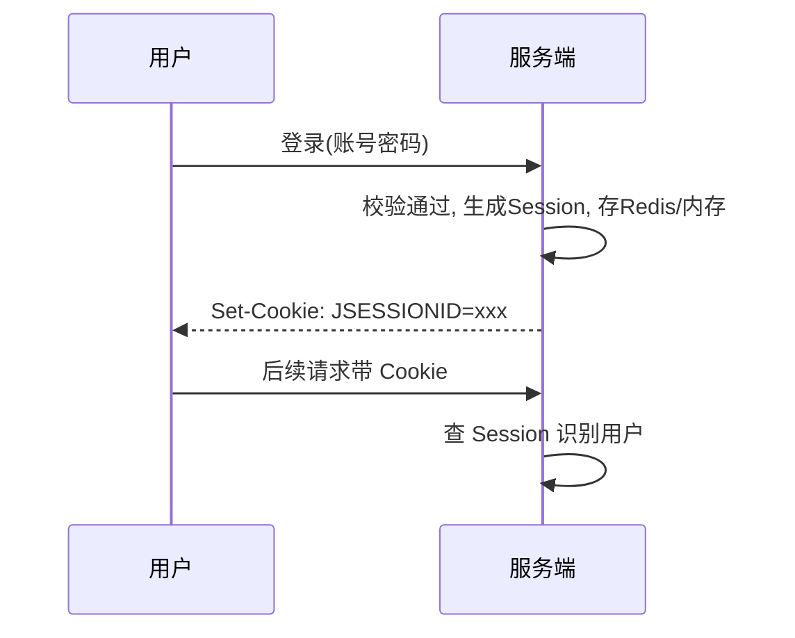
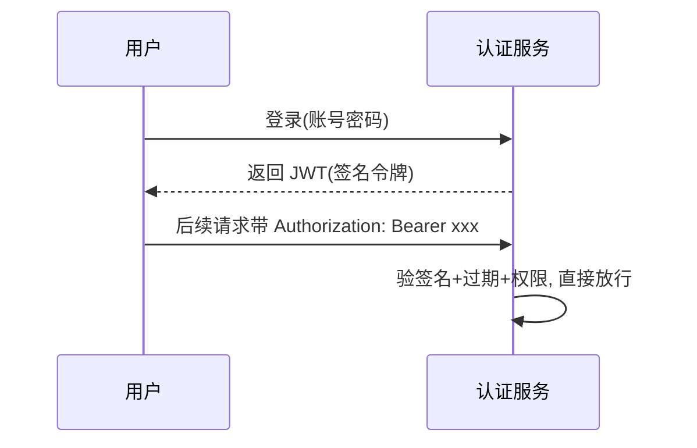
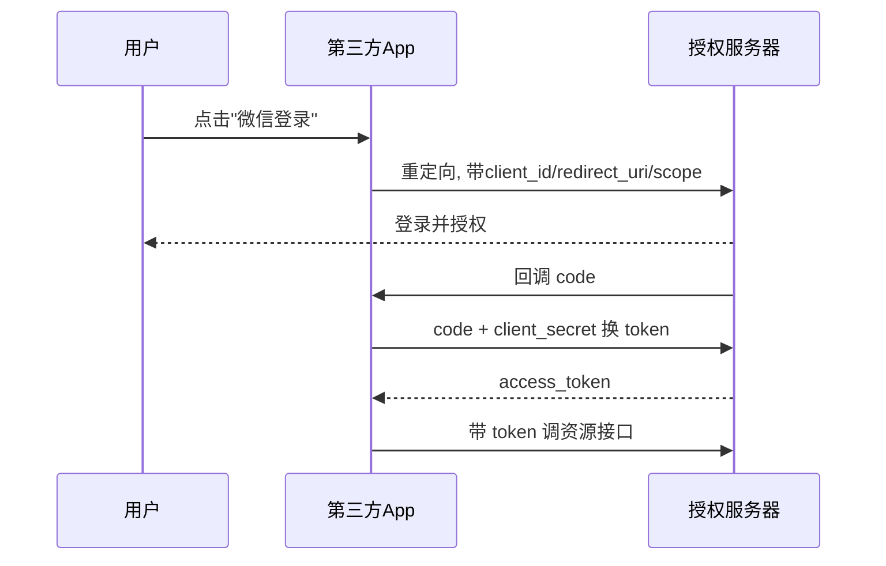

# 认证授权（JWT / OAuth2）

> 用户登录后，系统怎么知道「你是谁、能干什么」？本文讲清 **认证（Authentication）与授权（Authorization）的区别**、**Session vs JWT**、**OAuth2 四种授权模式**，以及生产怎么落地。
> 标准参考：JWT（[RFC 7519](https://datatracker.ietf.org/doc/html/rfc7519)）、OAuth 2.0（[RFC 6749](https://datatracker.ietf.org/doc/html/rfc6749)）；开源实现：[spring-projects/spring-security](https://github.com/spring-projects/spring-security)（Java 安全框架）、[keycloak/keycloak](https://github.com/keycloak/keycloak)（Identity and Access Management）。

---


## 〇、本体介绍（它是什么 / 适用场景 / 核心概念）

**它是什么**：认证（Authentication，你是谁）与授权（Authorization，你能干什么）是系统安全的两道门。JWT 是**无状态令牌标准**（RFC 7519），OAuth2 是**授权框架**（RFC 6749），OpenID Connect（OIDC）在 OAuth2 之上补「身份认证」。

**解决什么痛点**：Session-Cookie 方案服务端要存会话、跨域/多端扩展难、微服务下需共享会话。JWT 把用户信息签名进令牌，服务端无需存储即可校验；OAuth2 解决「第三方代授权访问」（如用微信登录），避免把密码交给第三方。

**核心概念**：JWT（Header/Payload/Signature 三段 Base64）、Access Token、Refresh Token、OAuth2 四种授权模式（授权码/PKCE/客户端凭证/隐式已弃用）、OIDC ID Token、Scope、PKCE、JWKS、算法混淆攻击（HS256/RS256）。

**适用场景**：微服务/API 鉴权、多端（Web/App）统一身份、第三方登录（SSO）、前后端分离。
**不适用**：需即时吊销且容忍不了短过期+黑名单的极高安全场景。

---

## 一、认证 vs 授权（一字之差）

| 概念 | 英文 | 回答 | 例子 |
|------|------|------|------|
| **认证** | Authentication | 你是谁？ | 登录、验证码、指纹 |
| **授权** | Authorization | 你能做什么？ | 角色权限、能否删数据 |

> 先认证（确认身份），再授权（判定权限）。Spring Security 里 `Authentication`（是谁）和 `Authorization`（能访问啥）是两回事。

---

## 二、Session-Cookie 方案（传统）



- ✅ 服务端可控、可随时踢人（删 Session）、安全。
- ❌ 服务端要存 Session（分布式要集中存 Redis）、跨域麻烦、移动端不友好。

---

## 三、JWT 方案（无状态）

### 3.1 结构（三段 base64）

`header.payload.signature`

- **Header**：算法（HS256/RS256）、类型。
- **Payload**：Claims（sub、exp、role、自定义）。
- **Signature**：用密钥对前两段签名，防篡改。

```json
// payload 示例
{"sub":"1001","name":"xuyu","role":"ADMIN","exp":1761897600}
```

### 3.2 流程



- ✅ **无状态**：服务端不存会话，JWT 自带身份信息，适合分布式 / 移动端 / 跨域。
- ❌ **无法主动失效**：令牌到期前一直有效，除非加黑名单（又变有状态）。
- ❌ 载荷可被 base64 解码（**别放敏感信息**），只靠签名防篡改不防泄露。

### 3.3 关键实践

- **短过期 + 刷新令牌（Refresh Token）**：access_token 短（如 15min），refresh_token 长（如 7d）存服务端可吊销；access 过期用 refresh 换新的。
- **签名算法选 RS256（非对称）**：公钥验签、私钥签名，公钥可公开分发（网关验签无需私钥）。
- **HTTPS 必选**：Bearer Token 明文传输，必须 TLS。
- **黑名单 / 吊销**：退出登录 / 封号时，把 jti 放进 Redis 黑名单至过期。
- **防重放**：加 `jti` + `nonce` + 时间戳。

---

## 四、OAuth2（授权框架，不是认证）

OAuth2 解决「**第三方应用如何获得用户授权去访问资源**」，典型：用微信登录某 App。

### 4.1 四种授权模式

| 模式 | 适用 | 说明 |
|------|------|------|
| **授权码（Authorization Code）** | 有后端的 Web 应用（最常用、最安全） | 先拿 code 再换 token，token 不暴露给浏览器 |
| **授权码 + PKCE** | 公共客户端（SPA / 移动端） | 无 client_secret，用 code_verifier 防拦截 |
| **隐式（Implicit）** | 老式 SPA（**已不推荐**） | 直接返回 token，易泄露 |
| **密码（Password）** | 高度信任的第一方应用 | 用户把账号密码给客户端（不推荐第三方） |
| **客户端凭证（Client Credentials）** | 服务到服务（机器对机器） | 无用户，用 client 凭证拿 token |

### 4.2 授权码模式流程



> **OpenID Connect（OIDC）** = OAuth2 + 身份认证层（在 token 外多给 `id_token`），解决「认证」问题。用微信 / Google 登录实际是 OIDC。

---

## 五、Spring Security 落地

```java
@Configuration
@EnableWebSecurity
public class SecurityConfig {
    @Bean
    public SecurityFilterChain chain(HttpSecurity http) throws Exception {
        return http
            .csrf(csrf -> csrf.disable())
            .authorizeHttpRequests(a -> a
                .requestMatchers("/public/**").permitAll()
                .requestMatchers("/admin/**").hasRole("ADMIN")
                .anyRequest().authenticated())
            .oauth2ResourceServer(o -> o.jwt(Customizer.withDefaults())) // 验 JWT
            .sessionManagement(s -> s.sessionCreationPolicy(STATELESS))
            .build();
    }
}
```

- **资源服务器（Resource Server）**：只验 JWT（RS256 公钥），不登录。
- **授权服务器（Authorization Server）**：发 token，可用 Spring Authorization Server 或 Keycloak。
- **方法级授权**：`@PreAuthorize("hasRole('ADMIN')")`。

---

## 六、Keycloak（企业级 IAM）

- 开源身份与访问管理，开箱即用的授权服务器（OIDC / OAuth2 / SAML）。
- 提供用户管理、SSO、社交登录、LDAP 集成、细粒度授权。
- 适合不想自己造授权服务器的团队：部署 Keycloak，应用只做资源服务器验 token。

---

## 七、常见坑

1. **JWT 放敏感信息**：payload 仅 base64，任何人可解码 → 只放非敏感 claims。
2. **token 永久有效**：不设 exp 或过长 → 泄露即永久沦陷，必须短过期 + 刷新。
3. **用 HS256 但密钥弱**：HS256 对称，密钥泄露全完蛋 → 高安全用 RS256。
4. **退出登录没吊销**：JWT 无状态，退出只是前端删 token，后端仍认 → 加黑名单或短过期。
5. **OAuth2 用 Implicit / 密码模式**：已不推荐，用授权码 + PKCE。
6. **HTTP 传 token**：必须 HTTPS，否则被抓包。
7. **权限写死**：用 RBAC（角色）或 ABAC（属性），别在代码里硬判断。

---

## 面试高频问题（20+ 条）

1. **认证 vs 授权？** 认证（Authentication）确认你是谁（登录）；授权（Authorization）确认你能干什么（权限）。OAuth2 是授权框架，OIDC 在其上加身份认证。

2. **JWT 三段结构？** Header（算法/类型）、Payload（claims：sub/exp/iat 等）、Signature（前两段 Base64URL + 密钥签名）。三段用点连接，自包含、可校验。

3. **JWT vs Session-Cookie？** Session 有状态（服务端存会话，可即时吊销，扩展需共享存储）；JWT 无状态（令牌自带信息，易横向扩展，但过期前难即时吊销）。微服务/多端选 JWT，传统单体可选 Session。

4. **为什么不应把 JWT 存 localStorage？** localStorage 可被 JS 读，XSS 直接偷令牌；应存 HttpOnly + Secure + SameSite Cookie（防 XSS 读取、防 CSRF），或存内存。

5. **Access Token 与 Refresh Token 分工？** Access Token 短效（5-15 分钟）用于访问 API；Refresh Token 长效（数天~数周）用于换发新 Access Token，减少频繁登录。

6. **Refresh Token 轮换（Rotation）？** 每次用 Refresh Token 换发新令牌时，旧 Refresh Token 立即作废；若被盗用，合法用户下次刷新会检测到复用并吊销全部令牌，缩小危害窗口。

7. **OAuth2 四种授权模式？** 授权码（最安全，有后端 Web 应用）、授权码+PKCE（SPA/移动端，无 client_secret）、客户端凭证（服务间 M2M，无用户）、隐式与密码模式已弃用。

8. **PKCE 是什么，为什么重要？** Proof Key for Code Exchange：公开客户端（SPA/App）无法安全存 client_secret，PKCE 用 code_verifier+challenge 防授权码拦截。现推荐所有流都加 PKCE。

9. **OAuth2 与 OIDC 区别？** OAuth2 回答「能访问什么」（授权）；OIDC 加 ID Token（JWT）回答「用户是谁」（认证）。仅凭 OAuth2 不知用户身份，OIDC 才补充身份。

10. **ID Token 能发给 API 吗？** 不能。ID Token 的 aud 是客户端应用，用于客户端验证用户身份；API 访问应用 Access Token。混用有安全风险。

11. **HS256 vs RS256 区别？** HS256 对称（一个 secret 签名+验签），适合单服务；RS256 非对称（私钥签、公钥验），微服务中仅认证服务器持私钥，其他服务用公钥验，更安全解耦。

12. **算法混淆攻击（Algorithm Confusion）？** RS256 环境下攻击者把 alg 改成 HS256，用公开的公钥当 HS256 密钥伪造签名。防御：服务端固定允许算法，不信任令牌里的 alg。

13. **如何实现令牌吊销？** JWT 无状态难即时吊销：① 黑名单（Redis 存已吊销 jti）；② 短过期 + 吊销 Refresh Token；③ 令牌版本号（用户级 token_version，不匹配即拒）。方案②最实用。

14. **JWT 过期时间设置建议？** Access Token 短（15m 内），Refresh Token 长（7d 内）；避免 30d 长过期 Access Token（被盗危害大）。

15. **CORS 与 OAuth2 关系？** SPA 请求 token 端点需 CORS（auth server 允许该 Origin）；授权码流 token 交换在后端，无 CORS 问题；前端 PKCE 直连需 CORS。

16. **密码如何安全存储？** 用 bcrypt/Argon2（自带加盐，work factor≥12），绝不明文；校验用恒定时间比较防时序攻击。

17. **Client Credentials 何时用？** 服务间通信（M2M）、批处理、cron，无用户上下文，无 Refresh Token，过期直接重请。

18. **令牌存储最佳实践（前端）？** 拆分：Access 存内存 + Refresh 存 HttpOnly/Secure/SameSite Cookie；或 Access+Refresh 都存 HttpOnly Cookie（加 CSRF 防护）。

19. **OAuth2 不是认证！** OAuth2 本身是授权，单独用无法确定用户身份；需要身份认证请用 OIDC（拿 ID Token）。

20. **SAML vs OIDC？** SAML 老牌企业 SSO（XML，老 SaaS）；OIDC 新（JSON/JWT，移动/SPA/微服务友好）。新项目优先 OIDC。

21. **DPoP（证明持有）？** RFC 9449：即使令牌被盗，攻击者因无客户端私钥签名也无法用；Access Token 与 DPoP Proof 一起提交，确保仅持有者可用。

22. **令牌被盗（secret 泄露）应急？** 立即轮换签名密钥并部署，现有令牌全部失效迫使用户重登；长期用 RS256 分离公私钥，泄露公钥无碍。

---
## 九、与其他板块的关系

- 和「**基础知识/API 网关**」：网关常做统一 JWT 校验（`JwtAuthFilter`）。
- 和「**基础知识/注册中心与配置中心**」：Keycloak / 授权服务器可注册到 Nacos。
- 和「**架构/系统架构**」：认证授权是「安全层」，属横切关注点。
- 和「**基础知识/中间件**」其他篇：各中间件自身的鉴权（如 MinIO 预签名、Kong JWT 插件）都基于此原理。
