# 认证授权：JWT 与 OAuth2 体系

> **核心认知**：认证（Authentication）回答"你是谁"，授权（Authorization）回答"你能做什么"。JWT 解决的是分布式环境下的无状态身份凭证传递问题，OAuth2 解决的是第三方应用对用户资源的安全委托访问问题。二者常配合使用，但职责完全不同。

## 要解决的问题

| 问题 | 传统方案的痛点 | JWT/OAuth2 的解法 |
|------|---------------|-------------------|
| 分布式会话共享 | Session 依赖服务端存储，无法跨节点 | JWT 无状态令牌，服务端无需存储 |
| 跨服务单点登录 | Session 同步复杂，耦合度高 | JWT + OAuth2 实现中心化认证 |
| 第三方授权访问 | 用户需将密码交给第三方，风险极高 | OAuth2 委托授权，令牌限定范围 |
| 微服务间认证 | 内部调用缺乏统一凭证 | JWT 内部传播 + JWT 声明携带权限 |
| 前后端分离 | Cookie-based Session 不便跨域 | 无状态 Token 方案天然支持跨域 |
| API 速率限制 | 无法按用户/应用区分限流 | OAuth2 scope 配合限流策略 |

## 认证 vs 授权：核心区别

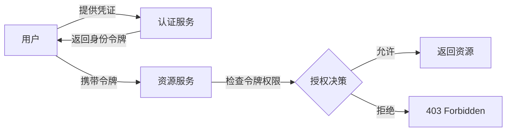

- **认证（Authentication）**：验证用户身份 → 签发令牌
- **授权（Authorization）**：检查令牌中的权限声明 → 决定是否放行
- 认证是授权的前提，授权是认证的延伸

## JWT 详解

### JWT 结构

```
Header.Payload.Signature

Header (Base64URL):
{
  "alg": "RS256",
  "typ": "JWT",
  "kid": "key-id-123"
}

Payload (Base64URL):
{
  "sub": "user-001",
  "iss": "auth.example.com",
  "aud": "api.example.com",
  "exp": 1700000000,
  "iat": 1699996400,
  "scope": "read write",
  "roles": ["admin", "editor"],
  "org_id": "org-42"
}

Signature:
RSASHA256(
  base64UrlEncode(header) + "." + base64UrlEncode(payload),
  privateKey
)
```

### JWT 三部分职责

| 部分 | 内容 | 作用 |
|------|------|------|
| Header | 算法、令牌类型、密钥 ID | 指定验证方式 |
| Payload | 声明（claims） | 携带身份和权限信息 |
| Signature | 数字签名 | 防篡改，验证令牌完整性 |

### 常用 Claims

| Claim | 全称 | 用途 |
|-------|------|------|
| `sub` | Subject | 用户唯一标识 |
| `iss` | Issuer | 签发者（认证服务地址） |
| `aud` | Audience | 受众（令牌预期使用者） |
| `exp` | Expiration Time | 过期时间 |
| `nbf` | Not Before | 生效时间 |
| `iat` | Issued At | 签发时间 |
| `jti` | JWT ID | 令牌唯一标识（防重放） |
| `scope` | Scope | 权限范围 |

### JWT 签名算法对比

| 算法 | 类型 | 速度 | 安全性 | 适用场景 |
|------|------|------|--------|----------|
| HS256 | 对称 | 快 | 中 | 内部服务、简单场景 |
| RS256 | 非对称 | 中 | 高 | 公开 API、跨组织 |
| ES256 | 非对称 | 快 | 高 | 移动端、IoT |
| PS256 | 非对称 | 慢 | 最高 | 高安全合规场景 |

### JWT 安全考量

| 风险 | 描述 | 防御措施 |
|------|------|----------|
| 算法混淆攻击 | 将 RS256 改为 HS256，用公钥签名 | 服务端严格指定验证算法 |
| 令牌泄露 | JWT 被盗用 | 短有效期 + HTTPS + 刷新令牌 |
| 声明注入 | 在 payload 中注入恶意 claims | 服务端校验所有声明，不信任客户端 |
| 密钥泄露 | 私钥被盗，可伪造任意令牌 | HSM 存储 + 定期轮转 + 短期密钥 |

## OAuth2 详解

### 四种授权模式

| 模式 | 流程 | 适用场景 | 安全性 |
|------|------|----------|--------|
| 授权码模式 | 前端获取 code → 后端换 token | Web 应用（最推荐） | 高 |
| 隐式模式 | 直接返回 token（跳过 code） | 单页应用 SPA | 中 |
| 密码模式 | 用户直接提供账号密码 | 受信任的自有应用 | 低 |
| 客户端凭证 | 应用以自身身份获取 token | 服务间调用 | 高 |

### 授权码模式完整流程

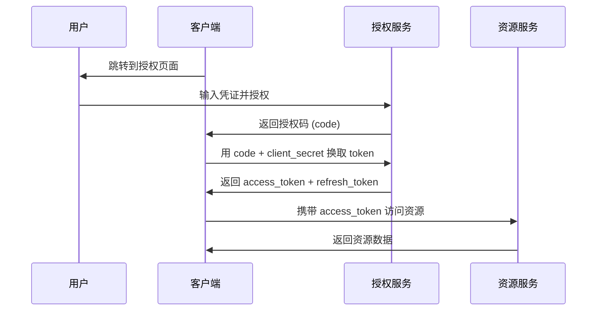

### Token 类型

| Token 类型 | 用途 | 特点 |
|------------|------|------|
| Access Token | 访问资源的凭证 | 短期有效，如 15 分钟 |
| Refresh Token | 刷新 Access Token | 长期有效，如 30 天 |
| ID Token | 用户身份信息（OIDC） | 仅用于身份验证 |
| JWT Token | 自包含的令牌 | 无需查后端，服务端可直接验证 |

### OAuth2 Scope 设计

```
# 读写分离的 scope 设计
scope:
  - user:read      # 读取用户信息
  - user:write     # 修改用户信息
  - order:read     # 读取订单
  - order:write    # 创建/修改订单
  - admin:manage   # 管理后台权限
```

## JWT + OAuth2 组合模式

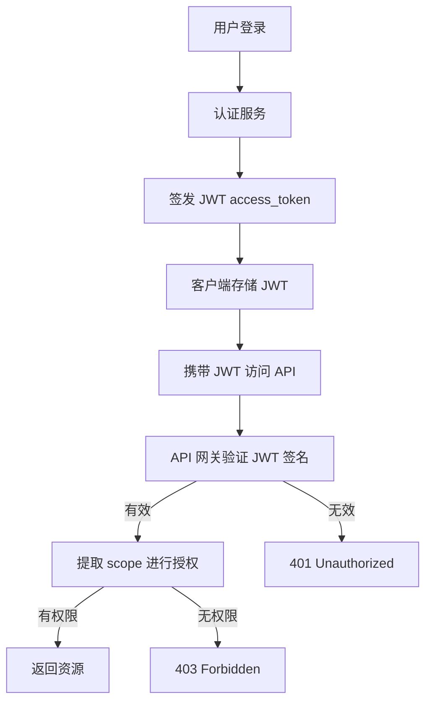

### 为什么用 JWT 作为 OAuth2 的 Access Token？

| 优势 | 说明 |
|------|------|
| 无状态验证 | 资源服务无需查询授权服务 |
| 自包含信息 | JWT payload 携带用户信息和权限 |
| 跨服务传播 | Token 可在多个微服务间传递 |
| 减少网络开销 | 避免每次请求都去认证服务验证 |

## 实现要点

### JWT 签发与验证

```python
# Python + PyJWT 示例
import jwt
from datetime import datetime, timedelta

# 签发 JWT
def create_token(user_id, scope):
    payload = {
        "sub": user_id,
        "iss": "auth.example.com",
        "scope": scope,
        "iat": datetime.utcnow(),
        "exp": datetime.utcnow() + timedelta(minutes=15),
        "jti": str(uuid.uuid4())
    }
    return jwt.encode(payload, private_key, algorithm="RS256")

# 验证 JWT
def verify_token(token):
    try:
        payload = jwt.decode(
            token, public_key,
            algorithms=["RS256"],
            audience="api.example.com",
            issuer="auth.example.com"
        )
        return payload
    except jwt.ExpiredSignatureError:
        raise AuthError("Token expired")
    except jwt.InvalidTokenError:
        raise AuthError("Invalid token")
```

### 刷新令牌机制

```
Access Token 生命周期（15分钟）：
  ├─ 过期前：正常使用
  └─ 过期后：用 Refresh Token 获取新的 Access Token

Refresh Token 安全策略：
  ├─ 旋转（Rotation）：每次刷新生成新的 refresh_token
  ├─ 重用检测：旧 refresh_token 被使用 → 全部吊销
  └─ 绑定：绑定到特定 client_id 和 IP
```

### 令牌吊销

| 方案 | 适用场景 | 延迟 |
|------|----------|------|
| 黑名单（Redis） | 需要即时吊销 | 低 |
| 缩短有效期 | JWT 自然过期 | 高 |
| Token Revocation Endpoint | OAuth2 标准方案 | 中 |
| 密钥轮转 | 吊销所有旧令牌 | 高（但彻底） |

## 常见安全陷阱

| 陷阱 | 后果 | 正确做法 |
|------|------|----------|
| JWT 存储在 localStorage | XSS 攻击可窃取 | HttpOnly Cookie 或安全存储 |
| 不验证 issuer/audience | Token 可被跨服务滥用 | 严格校验 iss/aud |
| 使用弱密钥或共享密钥 | 密钥被暴力破解 | 使用 RSA/ECDSA 非对称加密 |
| 不设置过期时间 | 被盗令牌永远有效 | 设置合理 exp + nbf |
| 在 payload 存敏感数据 | Base64 可被解码 | 仅存非敏感声明 |
| 不验证签名算法 | 算法混淆攻击 | 白名单指定允许算法 |

## OIDC（OpenID Connect）

### OIDC 是什么

OIDC 是建立在 OAuth2 之上的身份层，它在 OAuth2 的 access_token 基础上增加了 **ID Token**，使 OAuth2 从"授权框架"升级为"认证+授权"协议。

```
OAuth2 = 授权框架（你能访问什么）
OIDC = OAuth2 + 身份认证（你是谁 + 你能访问什么）
```

### OIDC 核心流程

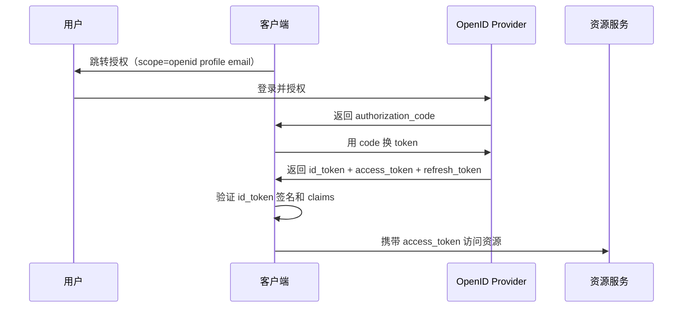

### ID Token 结构

```json
{
  "iss": "https://auth.example.com",
  "sub": "user-001",
  "aud": "client-app-123",
  "exp": 1700000000,
  "iat": 1699996400,
  "nonce": "n-0S6_WzA2Mj",
  "name": "张三",
  "email": "zhangsan@example.com",
  "picture": "https://example.com/avatar.jpg",
  "email_verified": true
}
```

### OIDC vs OAuth2 对比

| 维度 | OAuth2 | OIDC |
|------|--------|------|
| 核心目标 | 资源授权 | 身份认证 + 资源授权 |
| Token | access_token | id_token + access_token |
| 标准 Scope | 自定义 | openid, profile, email, address, phone |
| 用户信息 | 无标准接口 | /userinfo 端点 |
| 发现文档 | 无 | /.well-known/openid-configuration |
| 客户端注册 | 手动 | 支持动态注册 |

### OIDC Discovery 文档

```
GET /.well-known/openid-configuration

{
  "issuer": "https://auth.example.com",
  "authorization_endpoint": "https://auth.example.com/authorize",
  "token_endpoint": "https://auth.example.com/token",
  "userinfo_endpoint": "https://auth.example.com/userinfo",
  "jwks_uri": "https://auth.example.com/.well-known/jwks.json",
  "supported_signing_alg_values": ["RS256", "ES256"],
  "response_types_supported": ["code", "id_token", "token"],
  "grant_types_supported": ["authorization_code", "refresh_token"],
  "subject_types_supported": ["public"],
  "id_token_signing_alg_values_supported": ["RS256", "ES256"]
}
```

## JWT Token 存储最佳实践

### 存储方案对比

| 方案 | 安全性 | 易用性 | XSS 防护 | CSRF 防护 | 适用场景 |
|------|--------|--------|----------|----------|----------|
| HttpOnly Cookie | 高 | 中 | 防护（JS 不可读） | 需额外防护 | Web 应用（推荐） |
| localStorage | 低 | 高 | 无防护 | 天然免疫 | 原型/内部工具 |
| sessionStorage | 中 | 高 | 无防护 | 天然免疫 | 单标签页场景 |
| 内存（变量） | 高 | 低 | 防护 | 天然免疫 | SPA（推荐） |
| Secure Storage | 高 | 中 | 防护 | 天然免疫 | 移动端 |
| Service Worker | 高 | 中 | 防护 | 天然免疫 | PWA |

### HttpOnly Cookie + CSRF Token 组合

```
服务端设置：
  Set-Cookie: access_token=xxx; HttpOnly; Secure; SameSite=Lax; Path=/

客户端请求：
  Cookie: access_token=xxx
  X-CSRF-Token: csrf-token-value    ← CSRF 防护

优点：
  ├── JS 无法读取 Cookie（防 XSS 窃取）
  ├── 浏览器自动携带（方便）
  └── SameSite + CSRF Token 双重防 CSRF

缺点：
  ├── 需要 CSRF 防护机制
  └── 跨域场景需要额外配置（CORS + credentials）
```

### SPA 内存存储模式

```javascript
// 推荐的 SPA Token 管理
class TokenManager {
  #accessToken = null;    // 私有变量，内存中
  #refreshToken = null;

  setTokens(access, refresh) {
    this.#accessToken = access;
    this.#refreshToken = refresh;
  }

  getAccessToken() {
    return this.#accessToken;
  }

  async getValidToken() {
    if (this.isTokenExpired(this.#accessToken)) {
      await this.refreshTokens();
    }
    return this.#accessToken;
  }

  clear() {
    this.#accessToken = null;
    this.#refreshToken = null;
  }
}

// 优点：XSS 无法直接读取
// 缺点：刷新页面后丢失，需要重新认证或结合 refresh_token 机制
```

## Refresh Token 轮转机制

### 轮转流程

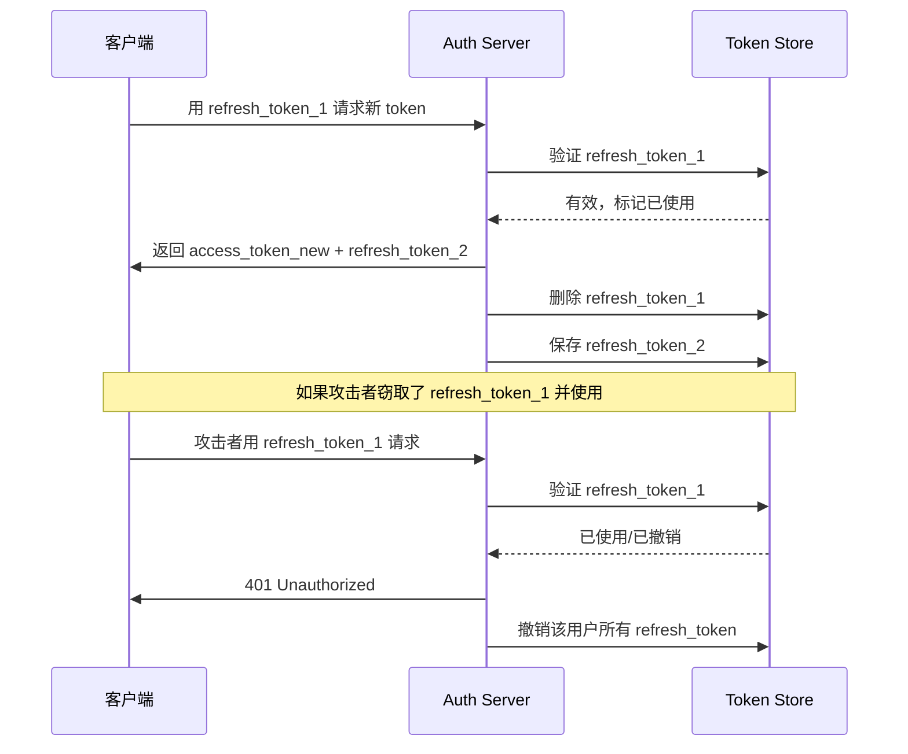

### Token 轮转策略配置

```yaml
token_rotation:
  access_token:
    ttl: 900          # 15 分钟
    algorithm: RS256

  refresh_token:
    ttl: 2592000      # 30 天
    rotation: true     # 每次使用后轮转
    reuse_interval: 10 # 10 秒内的重用视为正常（网络重试）
    maxReuse: 0        # 禁止重用
    maxLifetime: 7776000  # 90 天最大生命周期

  revocation:
    on_reuse: all     # 重用时撤销该用户所有 token
    on_password_change: all
    on_logout: current  # 登出时只撤销当前 token
```

### Refresh Token 轮转实现

```python
def refresh_access_token(old_refresh_token):
    # 1. 查找并验证 refresh token
    stored = db.get_refresh_token(old_refresh_token)
    if not stored or stored.expired:
        raise Unauthorized("Invalid refresh token")

    # 2. 检测重用（可能被攻击者窃取）
    if not stored.is_within_reuse_interval():
        if stored.used:
            # 重用检测：撤销该用户所有 token
            db.revoke_all_tokens(stored.user_id)
            raise Unauthorized("Token reuse detected")
        raise Unauthorized("Token already used")

    # 3. 标记旧 token 已使用
    stored.mark_used()

    # 4. 生成新 token 对
    new_access = create_access_token(stored.user_id)
    new_refresh = create_refresh_token(stored.user_id)

    # 5. 保存新 refresh token
    db.save_refresh_token(new_refresh)

    return new_access, new_refresh
```

## OAuth2 Device Flow（IoT 流程）

### 适用场景

IoT 设备（如智能电视、CLI 工具）无法展示完整登录页面，需要用户在另一个设备上完成授权。

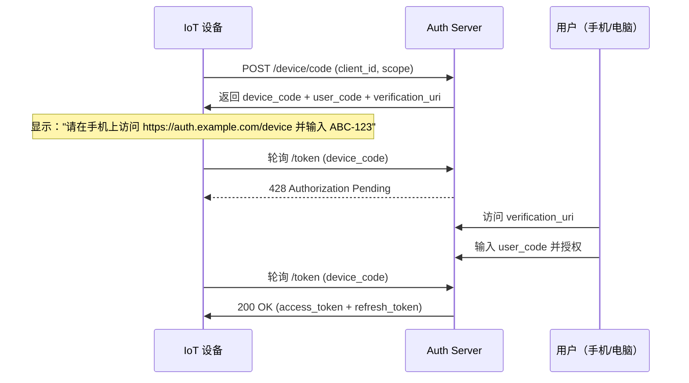

### Device Flow 请求/响应

```http
# 设备请求 device code
POST /oauth/device/code
Content-Type: application/x-www-form-urlencoded

client_id=app-123&scope=read profile

# 响应
{
  "device_code": "GmRhmhcxhwAzkoEqiMEg_DnyEysNkuNh",
  "user_code": "WDJB-MJHT",
  "verification_uri": "https://auth.example.com/device",
  "verification_uri_complete": "https://auth.example.com/device?user_code=WDJB-MJHT",
  "expires_in": 600,
  "interval": 5
}
```

### 轮询实现要点

```
设备端轮询策略：
  ├── 起始间隔：使用返回的 interval（通常 5s）
  ├── 指数退避：超过 5 分钟后每次增加 1s
  ├── 最大间隔：30s
  ├── 超时处理：expires_in 到期后停止轮询
  └── 错误处理：
      ├── 428 → 继续轮询
      ├── 400 → 设备码过期，重新获取
      ├── 401 → 用户拒绝，提示重新操作
      └── 403 → client_id 无效
```

## PKCE（Proof Key for Code Exchange）

### 问题背景

传统授权码模式中，client_secret 存储在客户端（SPA/移动端）不安全。PKCE 通过动态密钥解决了这个问题。

```
传统授权码模式：
  Client → code + client_secret → AS → token
  问题：SPA/移动端无法安全存储 client_secret

PKCE 模式：
  Client → code + code_verifier → AS → token
  优势：无需 client_secret，通过密码学证明身份
```

### PKCE 流程

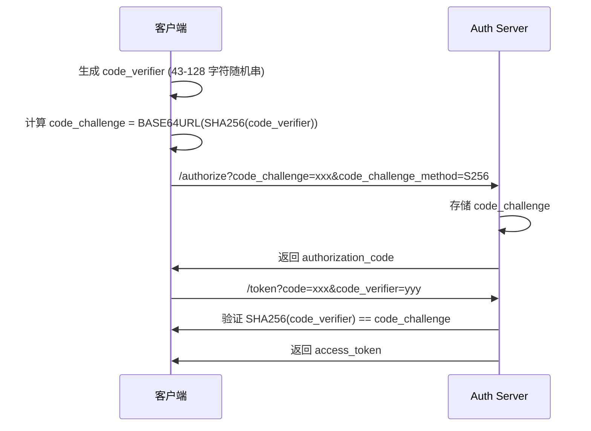

### PKCE 实现代码

```javascript
// 生成 PKCE 参数
function generatePKCE() {
  // code_verifier: 43-128 字符的 [A-Z] / [a-z] / [0-9] / "-" / "." / "_" / "~"
  const array = new Uint8Array(32);
  crypto.getRandomValues(array);
  const codeVerifier = base64urlEncode(array); // 43 字符

  // code_challenge: BASE64URL(SHA256(code_verifier))
  const encoder = new TextEncoder();
  const data = encoder.encode(codeVerifier);
  const digest = await crypto.subtle.digest('SHA-256', data);
  const codeChallenge = base64urlEncode(new Uint8Array(digest));

  return { codeVerifier, codeChallenge };
}

// 授权请求
const { codeVerifier, codeChallenge } = await generatePKCE();
window.location = `https://auth.example.com/authorize?
  response_type=code&
  client_id=app-123&
  redirect_uri=https://myapp.com/callback&
  code_challenge=${codeChallenge}&
  code_challenge_method=S256`;

// Token 交换
const tokenResponse = await fetch('/token', {
  method: 'POST',
  body: new URLSearchParams({
    grant_type: 'authorization_code',
    code: authorizationCode,
    redirect_uri: 'https://myapp.com/callback',
    code_verifier: codeVerifier
  })
});
```

### code_challenge_method 对比

| 方法 | 算法 | 安全性 | 性能 |
|------|------|--------|------|
| plain | 无哈希 | 低（需 TLS） | 快 |
| S256 | SHA-256 | 高 | 快（推荐） |

## Token Introspection Endpoint

### 作用

资源服务器通过 Introspection 端点验证 access_token 的有效性，适用于 opaque token（非 JWT）或需要即时吊销检查的场景。

### 请求/响应

```http
# 请求
POST /oauth/introspect
Content-Type: application/x-www-form-urlencoded
Authorization: Basic base64(client_id:client_secret)

token=2YotnFZFEjr1zCsicMWpAA&token_type_hint=access_token

# 响应（有效 token）
{
  "active": true,
  "scope": "read write",
  "client_id": "app-123",
  "username": "zhangsan",
  "token_type": "Bearer",
  "exp": 1700000000,
  "iat": 1699996400,
  "sub": "user-001",
  "aud": "api.example.com",
  "iss": "https://auth.example.com"
}

# 响应（无效/过期 token）
{
  "active": false
}
```

### Introspection vs JWT 自验证

| 维度 | Introspection | JWT 自验证 |
|------|--------------|-----------|
| 网络开销 | 每次请求需调用 AS | 无网络开销 |
| 实时性 | 实时（可即时吊销） | 延迟到 token 过期 |
| 依赖 | 强依赖 AS 可用性 | 无外部依赖 |
| 适用场景 | 高安全要求、opaque token | 高性能、分布式场景 |

## JWT 密钥轮转策略

### 轮转原因

- 私钥泄露时能最小化影响范围
- 满足合规要求（定期轮转密钥）
- 降低长期密钥被破解的风险

### 密钥轮转流程

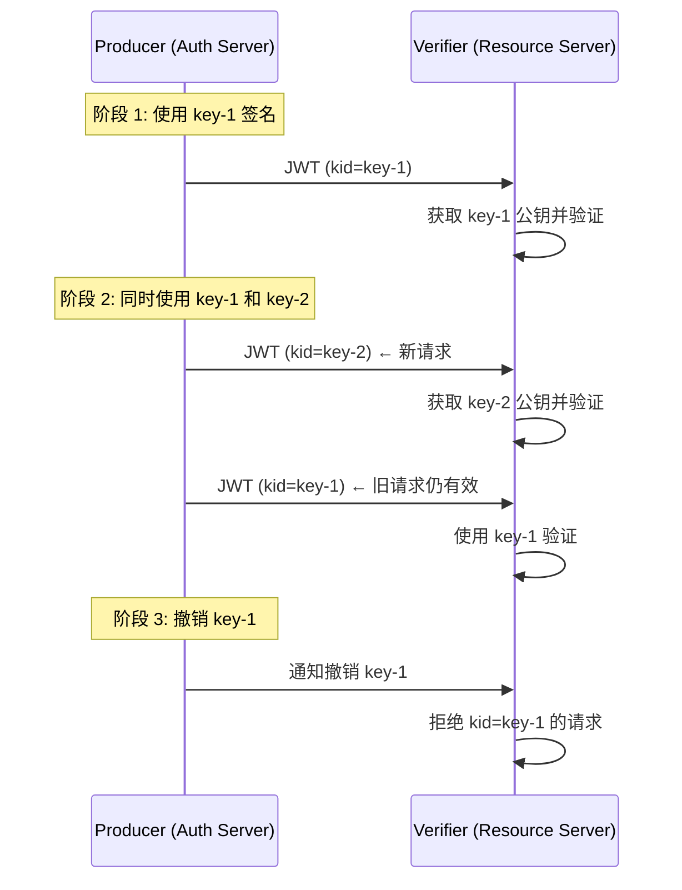

### JWKS（JSON Web Key Set）管理

```json
// GET /.well-known/jwks.json
{
  "keys": [
    {
      "kty": "RSA",
      "kid": "key-2",
      "use": "sig",
      "alg": "RS256",
      "n": "0vx7agoebGcQSuu...",
      "e": "AQAB"
    },
    {
      "kty": "RSA",
      "kid": "key-1",
      "use": "sig",
      "alg": "RS256",
      "n": "yK5mFz7..."
      // 旧密钥，仍保留用于验证旧 token
    }
  ]
}
```

### 密钥轮转最佳实践

```
轮转策略：
  ├── 轮转周期：90 天（或根据安全要求调整）
  ├── 并存期：至少 2 个密钥同时有效
  │   ├── 新密钥用于签名新 token
  │   └── 旧密钥用于验证未过期的旧 token
  ├── 撤销期：密钥过期后保留 24h 验证
  └── 自动化：使用 Vault/AWS KMS 管理密钥生命周期

实现步骤：
  1. 生成新密钥对
  2. 将公钥发布到 JWKS 端点
  3. 切换签名到新密钥（kid 在 JWT header 中标识）
  4. 等待所有旧 token 过期
  5. 从 JWKS 中移除旧密钥
```

## OAuth2 常见漏洞与防御

### 漏洞清单

| 漏洞 | 攻击方式 | 防御措施 |
|------|----------|----------|
| 授权码注入 | 窃取授权码在自己的会话中使用 | PKCE + state 参数 |
| 开放重定向 | 授权服务跳转到恶意 URL | 严格校验 redirect_uri |
| Token 泄露 | 日志/URL/Referer 泄露 token | Bearer token 不放 URL 参数 |
| CSRF 攻击 | 伪造授权请求绑定受害者账户 | state 参数 + 客户端会话绑定 |
| 混淆代理攻击 | 伪造 token 响应 | 严格校验 issuer + audience |
| 资源服务器混淆 | 用 A 服务的 token 访问 B 服务 | token 绑定 audience claim |

### 安全检查清单

```
OAuth2 实现安全审计清单：
  ├── [ ] 所有请求携带 state 参数并验证
  ├── [ ] redirect_uri 严格匹配（不允许通配）
  ├── [ ] access_token 使用 Bearer 方式传递
  ├── [ ] refresh_token 绑定到 client_id
  ├── [ ] PKCE 强制用于公开客户端
  ├── [ ] JWT 验证 iss / aud / exp / nbf
  ├── [ ] TLS 强制（HSTS + 证书固定）
  ├── [ ] Token 端点限流
  ├── [ ] 错误信息不泄露内部细节
  └── [ ] 定期轮转密钥和 client_secret
```

## Spring Security 实现 OAuth2 + JWT

### 配置示例

```java
@Configuration
@EnableAuthorizationServer
public class AuthServerConfig extends AuthorizationServerConfigurerAdapter {

    @Override
    public void configure(ClientDetailsServiceConfigurer clients) throws Exception {
        clients.inMemory()
            .withClient("web-app")
            .authorizedGrantTypes("authorization_code", "refresh_token")
            .scopes("read", "write")
            .redirectUris("https://myapp.com/callback")
            .and()
            .withClient("iot-device")
            .authorizedGrantTypes("device_code")
            .scopes("read")
            .autoApprove(true);
    }

    @Override
    public void configure(AuthorizationServerEndpointsConfigurer endpoints) {
        endpoints
            .tokenStore(jwtTokenStore())
            .accessTokenConverter(jwtAccessTokenConverter())
            .reuseRefreshTokens(false);  // refresh token 轮转
    }

    @Bean
    public JwtAccessTokenConverter jwtAccessTokenConverter() {
        JwtAccessTokenConverter converter = new JwtAccessTokenConverter();
        converter.setSigningKey(privateKey);
        converter.setVerifierKey(publicKey);
        return converter;
    }
}
```

### 资源服务器配置

```java
@Configuration
@EnableResourceServer
public class ResourceServerConfig extends ResourceServerConfigurerAdapter {

    @Override
    public void configure(HttpSecurity http) throws Exception {
        http.authorizeRequests()
            .antMatchers("/api/public/**").permitAll()
            .antMatchers("/api/admin/**").hasAuthority("ROLE_ADMIN")
            .anyRequest().authenticated()
            .and()
            .cors().and().csrf().disable();
    }

    @Override
    public void configure(ResourceServerSecurityConfigurer resources) {
        resources.tokenStore(jwtTokenStore());
    }
}
```

### 自定义 JWT Claims

```java
@Component
public class CustomTokenEnhancer implements TokenEnhancer {

    @Override
    public OAuth2AccessToken enhance(OAuth2AccessToken accessToken,
                                      OAuth2Authentication authentication) {
        User user = (User) authentication.getPrincipal();
        Map<String, Object> additionalInfo = new HashMap<>();
        additionalInfo.put("org_id", user.getOrgId());
        additionalInfo.put("roles", user.getRoles());
        ((DefaultOAuth2AccessToken) accessToken)
            .setAdditionalInformation(additionalInfo);
        return accessToken;
    }
}
```

## OAuth2 真实攻击向量与代码级防御

### CSRF 攻击：伪造授权请求

```
攻击场景：
  1. 攻击者构造恶意授权链接：
     https://auth.example.com/authorize?
       response_type=code&
       client_id=victim-app&
       redirect_uri=https://attacker.com/callback&
       state=attacker-controlled-state
  2. 用户点击链接 → 授权成功 → code 发送到攻击者服务器
  3. 攻击者用 code 换取 token

防御措施（代码级）：
  服务端生成不可预测的 state 参数，绑定到用户 session
  用户回调时验证 state 是否与 session 中存储的一致
  state 有效期设为 5 分钟，防止长期暴露
```

### Redirect URI 操纵攻击

```
攻击手法：
  ├── 注册时提交：https://app.example.com/callback
  ├── 攻击时提交：https://app.example.com/callback?next=https://evil.com
  ├── 部分实现只验证前缀 → 被绕过
  └── 利用 open redirect 漏洞获取 code

防御代码（严格匹配）：
  def validate_redirect_uri(uri, registered_uri):
      parsed = urlparse(uri)
      registered = urlparse(registered_uri)
      # 严格匹配 scheme + host + port + path（不允许查询参数）
      return (parsed.scheme == registered.scheme
              and parsed.hostname == registered.hostname
              and parsed.port == registered.port
              and parsed.path.rstrip('/') == registered.path.rstrip('/'))
```

### Token 泄露场景

```
泄露途径：
  ├── URL 参数泄露（Referer header 暴露 token）
  ├── 日志记录（access.log 记录 Authorization header）
  ├── 浏览器历史记录（token 在 URL 中）
  ├── 中间人攻击（未使用 HTTPS）
  └── XSS 窃取（localStorage 中的 token）

防御策略：
  1. Token 绝不放 URL 参数（始终用 Authorization header）
  2. 服务端 Access Log 脱敏（mask Authorization header）
  3. CSP 头防止 XSS（Content-Security-Policy）
  4. HTTPS 强制 + HSTS
  5. Token 短有效期（15分钟）+ Refresh Token 轮转
```

### 混淆代理攻击（Confused Deputy）

```
攻击原理：
  攻击者将 A 服务的 token 发送给 B 服务
  B 服务误以为是自己的 token，用它调用 A 服务
  A 服务验证 token 有效 → 攻击者借 B 服务之手调用 A

防御：
  ├── JWT 中携带 audience (aud) claim
  ├── 资源服务严格验证 aud 是否匹配自身标识
  ├── Token 绑定（Token Binding）或 DPoP
  └── mTLS 客户端证书绑定
```

## JWT 微服务间 Token 传播模式

### Token Propagation 模式

```
模式 1：Token 透传（Passthrough）
  Client → Gateway → Service A → Service B
  传递方式：原始 JWT 原封不动传递
  优点：简单、无状态
  缺点：token 膨胀（claims 累积）、下游可看到上游的所有信息

模式 2：Token 交换（Token Exchange, RFC 8693）
  Client → Gateway → Service A → Auth Server → Service B
  传递方式：Service A 用自己的 token 换取适合 Service B 的 token
  优点：最小权限、token 精简
  缺点：额外网络开销

模式 3：Token 派生（Token Derivation）
  Client → Gateway → Service A → Service B
  传递方式：Service A 用 JWT 签发一个受限的子 token
  优点：无需调用 Auth Server、可自定义 claims
  缺点：下游需信任上游的签名
```

### Token Exchange RFC 8693 实现

```python
# 服务间 Token Exchange
def exchange_token(original_token, target_service):
    """RFC 8693 Token Exchange"""
    response = requests.post(
        "https://auth.example.com/oauth/token",
        data={
            "grant_type": "urn:ietf:params:oauth:grant-type:token-exchange",
            "subject_token": original_token,
            "subject_token_type": "urn:ietf:params:oauth:token-type:access_token",
            "audience": target_service,  # 目标服务标识
            "scope": "read:data write:data",  # 最小权限
        },
        headers={"Authorization": f"Bearer {service_token}"}
    )
    return response.json()["access_token"]

# 使用派生 token 调用下游
new_token = exchange_token(current_token, "payment-service")
downstream_call(headers={"Authorization": f"Bearer {new_token}"})
```

## OAuth2 移动端实现

### AppAuth 推荐架构

```
iOS/Android OAuth2 流程：
  1. 使用系统浏览器（SFSafariViewController / Chrome Custom Tabs）
  2. 通过 Deep Link / Claimed HTTPS URI 回调
  3. Authorization Code + PKCE 交换 token
  4. Token 存储在 Secure Storage（Keychain / KeyStore）

Deep Link 配置：
  iOS: myapp://callback
  Android: myapp://callback

Claimed HTTPS URI（更安全）：
  https://app.example.com/.well-known/apple-app-site-association
  https://app.example.com/.well-known/assetlinks.json
```

### 移动端安全存储

```kotlin
// Android KeyStore 示例
val keyStore = KeyStore.getInstance("AndroidKeyStore")
keyStore.load(null)

val entry = KeyStore.SecretKeyEntry(secretKey)
keyStore.setEntry("oauth_token", entry,
    KeyStoreProtectionParameter("password"))

// 存储 token
val encryptedData = cipher.doFinal(token.toByteArray())
sharedPrefs.edit().putString("token", Base64.encodeToString(encryptedData)).apply()
```

## Single Logout (SLO) 模式

### OIDC Single Logout 流程

```
SLO 步骤：
  1. 用户在 App A 登出
  2. App A 调用 OP 的 end_session_endpoint
  3. OP 向所有已知的客户端发送 Logout Notification
  4. 各客户端清除本地 session 和 token
  5. OP 清除自己的 session

实现方式：
  ├── 前端通道（Front-channel）：通过 iframe 通知各 RP
  │   优点：简单
  │   缺点：依赖浏览器、可能被拦截
  ├── 后端通道（Back-channel）：OP 直接调用 RP 的 logout URI
  │   优点：可靠、可审计
  │   缺点：RP 必须在线
  └── RP-Initiated Logout：RP 主动发起 logout
      调用 OP 的 end_session_endpoint
      携带 id_token_hint 用于 OP 识别用户
```

### Back-channel Logout 代码

```python
# 接收 OP 的 logout 通知
@app.post("/backchannel-logout")
def backchannel_logout(request):
    # 验证 JWT 签名（OP 的签名）
    logout_token = verify_logout_token(request.body, op_public_key)

    # 验证 iss 和 aud
    assert logout_token["iss"] == OP_ISSUER
    assert logout_token["aud"] == CLIENT_ID

    # 获取 sid (Session ID) 或 sub (Subject)
    sid = logout_token.get("sid")
    sub = logout_token.get("sub")

    # 清除该用户的所有本地 session
    if sid:
        db.delete_session_by_sid(sid)
    elif sub:
        db.delete_all_sessions_for_user(sub)

    return {"status": "ok"}
```

## Token Exchange RFC 8693 详解

### 使用场景

```
场景 1：跨服务委托
  API Gateway 收到用户 token → 换成内部服务 token → 调用下游

场景 2：权限降级
  管理员 token → 换成普通用户 token → 调用普通 API

场景 3：跨域访问
  Service A 的 token → 换成 Service B 可识别的 token

场景 4：Impersonation（模拟）
  管理员 impersonate 普通用户 → 以用户身份调用服务
```

### 完整请求/响应

```http
POST /oauth/token HTTP/1.1
Content-Type: application/x-www-form-urlencoded

grant_type=urn:ietf:params:oauth:grant-type:token-exchange
&subject_token=eyJhbGciOiJSUzI1NiJ9...
&subject_token_type=urn:ietf:params:oauth:token-type:access_token
&audience=payment-service
&requested_token_type=urn:ietf:params:oauth:token-type:access_token
&scope=payment:read payment:write
&actor_token=eyJhbGciOiJSUzI1NiJ9...
&actor_token_type=urn:ietf:params:oauth:token-type:access_token

# 响应
{
  "access_token": "eyJhbGciOiJSUzI1NiJ9...",
  "issued_token_type": "urn:ietf:params:oauth:token-type:access_token",
  "token_type": "Bearer",
  "expires_in": 300,
  "scope": "payment:read payment:write"
}
```

## Keycloak vs Auth0 vs 自建方案对比

### 功能对比

| 功能 | Keycloak | Auth0 | 自建 |
|------|----------|-------|------|
| 部署方式 | 自托管 / Kubernetes | SaaS | 自托管 |
| 成本 | 免费开源 | 按 MAU 计费 | 开发成本高 |
| OIDC/SAML | 完整支持 | 完整支持 | 需自行实现 |
| Multi-Tenancy | 支持 | 支持 | 需自行实现 |
| User Federation | LDAP/AD 集成 | 企业连接器 | 需自行开发 |
| 自定义主题 | 支持 | 有限支持 | 完全自定义 |
| 审计日志 | 内置 | 内置 | 需自行实现 |
| 高可用 | 集群部署 | 内置 | 需自行实现 |
| 维护成本 | 中等 | 低 | 高 |

### 选型决策

```
选型路径：
  ├── 预算充足 + 快速上线 → Auth0
  ├── 需要私有化部署 → Keycloak
  ├── 有特殊安全合规要求 → 自建 + HSM
  ├── 团队有能力维护 → Keycloak（推荐）
  └── 超大规模 + 定制需求 → 自建核心 + Keycloak 组件
```

## OAuth2 真实攻击向量与防御

### CSRF 攻击

```
攻击场景：
  攻击者诱导用户访问恶意页面，该页面自动发起 OAuth2 授权请求
  将攻击者的账号绑定到受害者会话

防御：state 参数 + PKCE
  1. 生成随机 state 值，存储在用户 Session
  2. 授权请求携带 state
  3. 回调时验证 state 是否匹配
  4. state 不匹配 → 拒绝授权
```

```python
# CSRF 防御实现
def generate_oauth_state():
    state = secrets.token_urlsafe(32)
    session["oauth_state"] = state
    return state

def verify_oauth_state(callback_state):
    expected = session.pop("oauth_state", None)
    if not expected or expected != callback_state:
        raise SecurityError("CSRF detected: state mismatch")
```

### Redirect URI 操纵攻击

```
攻击手法：
  ├── 字符串比较绕过：https://app.com/callback vs https://app.com/callback/../
  ├── 子路径注册：注册 https://app.com/callback → 访问 https://app.com/callback/malicious
  ├── 协议降级：https://app.com → http://app.com
  ├── 端口操纵：https://app.com:443 vs https://app.com:8443
  └── 大小写混淆：https://App.com vs https://app.com

防御：
  ├── 严格字符串匹配（不使用 URI 解析）
  ├── 精确匹配 path（不允许子路径）
  ├── 强制 HTTPS
  ├── 禁止通配符
  └── 仅允许已注册的 redirect_uri
```

### Token 泄露场景

```
泄露途径：
  ├── URL 参数泄露：token 放在 URL 中 → 浏览器历史、Referer Header、服务器日志
  ├── 日志泄露：access_token 被打印到应用日志
  ├── 浏览器存储：localStorage 被 XSS 读取
  ├── 网络嗅探：非 HTTPS 传输
  ├── 第三方脚本：页面中的第三方 JS 读取 token
  └── 服务器端：token 被反序列化到日志/监控系统

防御措施：
  ├── 永远使用 Bearer Token（Header 传递）
  ├── 浏览器端内存存储（不落盘）
  ├── 服务端日志脱敏
  ├── HTTPS 强制（HSTS）
  ├── CSP 策略限制第三方脚本
  └── Token 有效期 ≤ 15 分钟
```

## JWT 微服务间 Token 传播模式

### Token Propagation 架构

```
模式 1：Token 透传（推荐）
  客户端 → API 网关 → 微服务 A → 微服务 B
  全程使用同一个 access_token

  优点：简单、无状态
  缺点：token 可能包含过多信息

模式 2：Token 交换（RFC 8693）
  客户端 → 网关 → 微服务 A → Token Exchange → 新 token → 微服务 B
  微服务 A 用原始 token 换取限定 scope 的新 token

  优点：最小权限原则
  缺点：多一次网络调用

模式 3：内部证书（Service-to-Service）
  微服务间使用 mTLS 证书认证，不依赖用户 token
  网关注入 X-User-Id Header，下游信任该 Header

  优点：性能最高
  缺点：需要 PKI 基础设施
```

### Service Account Token 模式

```yaml
# 服务间调用认证配置
service_auth:
  mode: "jwt"
  issuer: "internal-auth-service"
  audience: "order-service"
  claims:
    service_name: "inventory-service"
    permissions: ["order:read", "inventory:write"]
  token_ttl: 300  # 5 分钟短期 token
```

## Token Exchange（RFC 8693）

### 场景与用途

```
Token Exchange 典型场景：
  ├── 委托访问：用户 A 授权服务 B 代表其访问服务 C
  ├── 跨域认证：从 IdP A 获取 token 用于 IdP B 的服务
  ├── 降级权限：将宽泛 token 换取限定 scope 的 token
  └── 协议转换：将 SAML token 转换为 OAuth2 token

请求格式：
  POST /token
  grant_type=urn:ietf:params:oauth:grant-type:token-exchange
  &subject_token=原始token
  &subject_token_type=urn:ietf:params:oauth:token-type:access_token
  &audience=目标服务
  &scope=read

响应：
  {
    "access_token": "新token",
    "issued_token_type": "urn:ietf:params:oauth:token-type:access_token",
    "token_type": "Bearer",
    "expires_in": 300
  }
```

## OAuth2 移动端实现

### AppAuth 模式（iOS/Android 推荐）

```
iOS AppAuth 流程：
  1. App 调用 ASWebAuthenticationSession
  2. 系统浏览器打开授权页面
  3. 用户登录授权
  4. 系统浏览器通过 Universal Link / Custom Scheme 回调 App
  5. App 接收 authorization_code
  6. App 后端用 code 换取 token

安全要点：
  ├── 使用 Claimed HTTPS URI（通用链接）
  │   iOS: apple-app-site-association
  │   Android: assetlinks.json
  ├── 不使用自定义 scheme（容易被劫持）
  ├── PKCE 必须（移动端无 client_secret）
  └── 证书绑定（Certificate Pinning）
```

### Deep Link 安全配置

```
# iOS Universal Link 配置
# apple-app-site-association
{
  "applinks": {
    "apps": [],
    "details": [
      {
        "appID": "TEAM_ID.com.example.myapp",
        "paths": ["/oauth/callback"]
      }
    ]
  }
}

# Android Asset Links 配置
# .well-known/assetlinks.json
[{
  "relation": ["delegate_permission/common.handle_all_urls"],
  "target": {
    "namespace": "android_app",
    "package_name": "com.example.myapp",
    "sha256_cert_fingerprints": ["AA:BB:CC:..."]
  }
}]
```

## 单点登出（SLO）模式

### OIDC Single Logout 流程

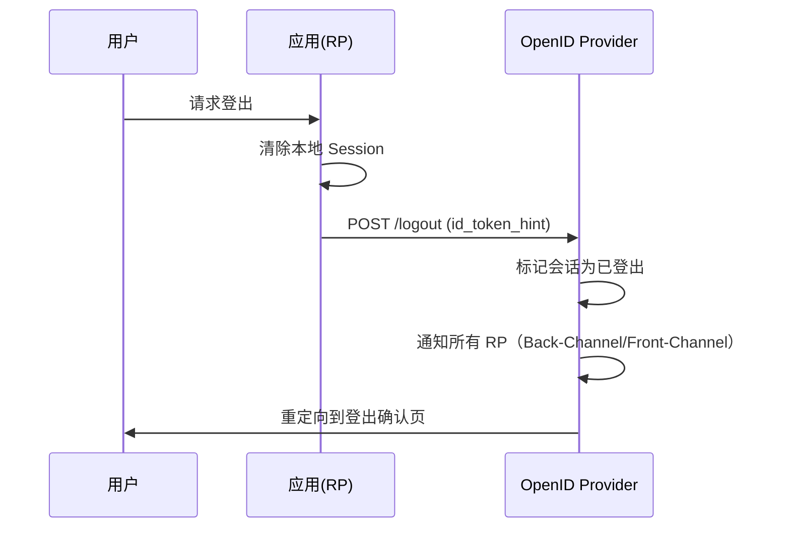

### SLO 实现方式

```
Front-Channel Logout：
  OP 向每个 RP 的 logout_uri 发送 iframe
  RP 清除 Session
  缺点：依赖浏览器，不可靠

Back-Channel Logout（推荐）：
  OP 直接调用 RP 的后端 logout_endpoint
  RP 验证 logout_token 后清除 Session
  优点：可靠、不依赖浏览器

Session Management：
  OP 定期检查 RP 的 Session 状态
  使用 check_session_iframe 嵌入
  RP 可检测 OP 会话是否过期
```

## Keycloak vs Auth0 vs 自建方案

### 功能对比

| 维度 | Keycloak | Auth0 | 自建（Spring Security） |
|------|----------|-------|------------------------|
| 部署方式 | 自托管 | SaaS | 自托管 |
| 成本 | 免费（开源） | 按 MAU 计费 | 开发成本高 |
| 协议支持 | OIDC/SAML/CAS | OIDC/SAML | 需自行实现 |
| 用户管理 | 完整 | 完整 | 需自行开发 |
| 多租户 | 支持 | 支持 | 需自行开发 |
| 高可用 | 集群部署 | 内置 | 需自行设计 |
| 自定义主题 | 支持 | 有限 | 完全自定义 |
| 运维复杂度 | 中 | 低 | 高 |
| 适用规模 | 中大型 | 中小型 | 小型/定制需求 |

### 选型决策

```
选型路径：
  ├── 团队 < 5 人 + 预算有限？
  │   └── Keycloak（免费、功能完整）
  ├── 快速上线 + 不想运维？
  │   └── Auth0（SaaS、分钟级集成）
  ├── 有强烈定制需求？
  │   └── 自建（Spring Security + OAuth2）
  ├── 企业合规要求数据不出境？
  │   └── Keycloak（自托管）
  └── 微服务数量 < 5？
      └── 简单 JWT 验证即可（无需完整 IdP）
```

## JWT 在微服务网关与服务端的验证分工

### 网关统一验证 vs 服务端独立验证

```
架构模式 1：API 网关统一验证（推荐）
  客户端 → API 网关（验证 JWT 签名 + 过期 + aud）
              ↓ 提取用户信息，注入 Header
           微服务 A → 微服务 B → 微服务 C
           （内部服务信任网关注入的 Header，不再验证 JWT）

架构模式 2：每个服务独立验证
  客户端 → 微服务 A（验证 JWT）→ 微服务 B（验证 JWT）→ 微服务 C
  问题：每个服务都要持有公钥，轮转复杂；JWT 验证开销×N

架构模式 3：混合模式（网关 + 关键服务双重验证）
  客户端 → 网关（验证 JWT）→ 支付服务（再次验证 JWT + 检查 scope）
  适用：金融级场景，关键操作需二次确认
```

| 模式 | 优点 | 缺点 | 适用场景 |
|------|------|------|----------|
| 网关统一验证 | 简单、低延迟、集中管理 | 网关成为信任根，需高可用 | 大部分微服务架构 |
| 服务独立验证 | 去中心化、无单点 | 密钥管理复杂、性能开销 | 零信任架构 |
| 混合模式 | 安全性高、关键操作二次确认 | 实现复杂 | 金融支付场景 |

### 网关注入 Header 规范

```yaml
# 网关验证 JWT 后注入的标准 Header
X-User-Id: "user-001"
X-User-Email: "zhangsan@example.com"
X-User-Roles: "admin,editor"
X-User-Scope: "read,write"
X-Request-Id: "req-abc-123"
X-Forwarded-For: "192.168.1.100"

# 下游服务从 Header 读取用户信息（不再验证 JWT）
# 注意：下游必须信任网关，不暴露公网直接访问
```

### 网关验证实现代码

```python
# API 网关 JWT 验证中间件
import jwt
from fastapi import FastAPI, Request, HTTPException

app = FastAPI()

async def verify_jwt_middleware(request: Request, call_next):
    # 白名单路径跳过验证
    if request.url.path in ["/health", "/auth/login", "/auth/register"]:
        return await call_next(request)

    token = request.headers.get("Authorization", "").replace("Bearer ", "")
    if not token:
        raise HTTPException(status_code=401, detail="Missing token")

    try:
        payload = jwt.decode(token, public_key, algorithms=["RS256"])
    except jwt.ExpiredSignatureError:
        raise HTTPException(status_code=401, detail="Token expired")
    except jwt.InvalidTokenError:
        raise HTTPException(status_code=401, detail="Invalid token")

    # 注入用户信息到请求头，下游服务直接读取
    request.state.user_id = payload["sub"]
    request.state.roles = payload.get("roles", [])
    request.state.scope = payload.get("scope", "")

    response = await call_next(request)
    response.headers["X-User-Id"] = payload["sub"]
    return response
```

## OAuth2 BFF（Backend for Frontend）模式

### BFF 架构设计

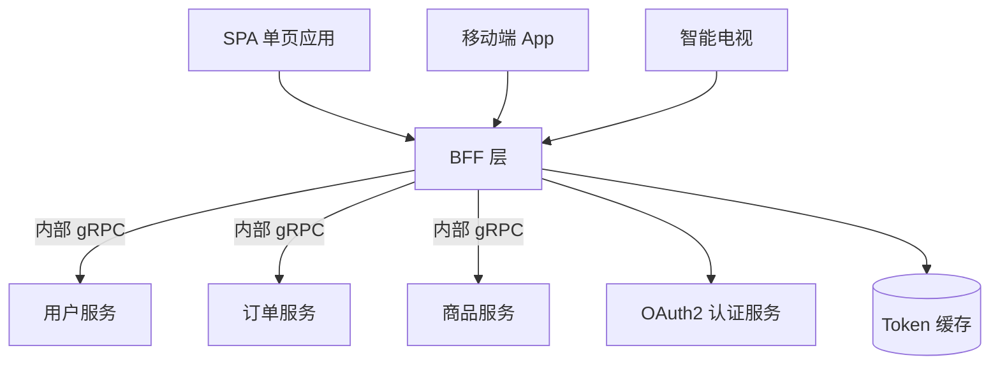

### BFF 的 OAuth2 处理

```
BFF 模式的 OAuth2 流程：
  1. 前端重定向到 OAuth2 授权页
  2. 用户授权后回调到 BFF（不是前端）
  3. BFF 用 code + client_secret 换取 token
  4. BFF 存储 token（HttpOnly Cookie 或服务端 Session）
  5. BFF 代理前端请求，附加 token 访问下游服务
  6. 下游服务只需验证 BFF 传来的内部 token

优势：
  ├── 前端不接触 access_token（XSS 防护）
  ├── BFF 可聚合多个下游服务（减少前端请求）
  ├── 不同前端（Web/APP/TV）各自 BFF，定制逻辑
  └── client_secret 安全存储在 BFF（不在前端）
```

### BFF 实现代码

```javascript
// Node.js BFF 层 OAuth2 处理
const express = require('express');
const axios = require('axios');
const jwt = require('jsonwebtoken');

const app = express();

// 1. 登录：重定向到 OAuth2 授权页
app.get('/auth/login', (req, res) => {
  const authUrl = `https://auth.example.com/authorize?
    response_type=code&
    client_id=${CLIENT_ID}&
    redirect_uri=${encodeURIComponent('https://bff.example.com/auth/callback')}&
    scope=read write&
    state=${generateState()}`;
  res.redirect(authUrl);
});

// 2. 回调：用 code 换 token，存入 HttpOnly Cookie
app.get('/auth/callback', async (req, res) => {
  const { code, state } = req.query;
  if (!verifyState(state)) return res.status(403).send('CSRF detected');

  const tokenResponse = await axios.post('https://auth.example.com/token', {
    grant_type: 'authorization_code',
    code,
    redirect_uri: 'https://bff.example.com/auth/callback',
    client_id: CLIENT_ID,
    client_secret: CLIENT_SECRET  // 安全存储在 BFF
  });

  // token 存入 HttpOnly Cookie，前端不可读
  res.cookie('access_token', tokenResponse.data.access_token, {
    httpOnly: true,
    secure: true,
    sameSite: 'strict',
    maxAge: 900000  // 15 分钟
  });
  res.cookie('refresh_token', tokenResponse.data.refresh_token, {
    httpOnly: true,
    secure: true,
    sameSite: 'strict',
    maxAge: 2592000000  // 30 天
  });
  res.redirect('/dashboard');
});

// 3. 代理 API 请求
app.get('/api/user', async (req, res) => {
  const token = req.cookies.access_token;
  const response = await axios.get('https://user-service/api/me', {
    headers: { Authorization: `Bearer ${token}` }
  });
  res.json(response.data);
});
```

## OAuth2 SPA + Refresh Token 轮转

### SPA 安全 Token 管理

```
SPA Token 安全存储方案对比：
  ├── 内存变量（推荐）
  │   ├── 优点：XSS 无法直接读取
  │   ├── 缺点：刷新页面丢失，需重新认证
  │   └── 适用：安全性要求高的 SPA
  ├── HttpOnly Cookie（推荐）
  │   ├── 优点：JS 不可读，浏览器自动携带
  │   ├── 缺点：需要 CSRF 防护
  │   └── 适用：Web 应用
  ├── Service Worker
  │   ├── 优点：独立于页面上下文
  │   ├── 缺点：实现复杂
  │   └── 适用：PWA 应用
  └── localStorage（不推荐）
      ├── 优点：简单
      ├── 缺点：XSS 可直接读取
      └── 适用：原型/内部工具
```

### SPA + Refresh Token 轮转实现

```javascript
// SPA 安全 Token 管理器
class SecureTokenManager {
  #accessToken = null;
  #refreshEndpoint = '/auth/refresh';
  #isRefreshing = false;
  #failedQueue = [];

  // 拦截 401 自动刷新
  setupInterceptors(axiosInstance) {
    axiosInstance.interceptors.response.use(
      response => response,
      async error => {
        const originalRequest = error.config;
        if (error.response?.status === 401 && !originalRequest._retry) {
          if (this.#isRefreshing) {
            return new Promise((resolve, reject) => {
              this.#failedQueue.push({ resolve, reject });
            }).then(token => {
              originalRequest.headers.Authorization = `Bearer ${token}`;
              return axiosInstance(originalRequest);
            });
          }

          originalRequest._retry = true;
          this.#isRefreshing = true;

          try {
            const newToken = await this.#refreshToken();
            this.#failedQueue.forEach(p => p.resolve(newToken));
            originalRequest.headers.Authorization = `Bearer ${newToken}`;
            return axiosInstance(originalRequest);
          } catch (e) {
            this.#failedQueue.forEach(p => p.reject(e));
            this.#clearTokens();
            window.location.href = '/login';
          } finally {
            this.#isRefreshing = false;
            this.#failedQueue = [];
          }
        }
        return Promise.reject(error);
      }
    );
  }

  async #refreshToken() {
    const response = await fetch(this.#refreshEndpoint, {
      method: 'POST',
      credentials: 'include'  // 携带 HttpOnly refresh_token cookie
    });
    const { access_token } = await response.json();
    this.#accessToken = access_token;  // 存内存
    return access_token;
  }
}
```

## OIDC Claims 深入解析

### 标准 Claims 详解

| Claim | 类型 | 必须 | 说明 | 使用场景 |
|-------|------|------|------|----------|
| `sub` | string | 是 | 用户唯一标识（不可变） | 跨服务用户关联 |
| `iss` | string | 是 | 签发者 URL | 防混淆代理攻击 |
| `aud` | string/array | 是 | 目标受众（client_id） | 防 token 滥用 |
| `exp` | number | 是 | 过期时间（Unix 时间戳） | token 过期检查 |
| `iat` | number | 是 | 签发时间 | token 新旧判断 |
| `nbf` | number | 否 | 生效时间 | 延迟生效 token |
| `jti` | string | 否 | token 唯一 ID | 防重放攻击 |
| `nonce` | string | 否 | 防重放随机串 | ID Token 校验 |
| `at_hash` | string | 否 | access_token 哈希 | 隐式模式防泄露 |
| `auth_time` | number | 否 | 最近认证时间 | 强制重新认证 |

### 自定义 Claims 设计

```json
{
  "sub": "user-001",
  "iss": "https://auth.example.com",
  "aud": "api.example.com",
  "exp": 1700000000,
  "iat": 1699996400,
  "jti": "token-abc-123",
  "nonce": "n-0S6_WzA2Mj",
  "auth_time": 1699996400,
  "email": "zhangsan@example.com",
  "email_verified": true,
  "name": "张三",
  "org_id": "org-42",
  "roles": ["admin", "editor"],
  "permissions": ["user:read", "order:write"],
  "tenant_id": "tenant-001",
  "amr": ["pwd", "mfa"],
  "azp": "client-app-123"
}

# Claims 使用规范：
# sub：用户唯一标识，不可变（用于跨服务关联）
# org_id / tenant_id：多租户标识（不要用 user_id 做多租户）
# roles / permissions：RBAC/ABAC 权限声明
# amr：认证方法引用（pwd=密码，mfa=多因素）
# azp：授权客户端（哪个 app 持有此 token）
```

### Claims 验证最佳实践

```python
# 服务端 Claims 验证
def validate_claims(payload, expected_audience, expected_issuer):
    # 1. 验证必须存在的 claims
    required = ['sub', 'iss', 'aud', 'exp', 'iat']
    for claim in required:
        if claim not in payload:
            raise InvalidTokenError(f"Missing claim: {claim}")

    # 2. 验证 issuer
    if payload['iss'] != expected_issuer:
        raise InvalidTokenError("Invalid issuer")

    # 3. 验证 audience（支持字符串或数组）
    aud = payload['aud']
    if isinstance(aud, str):
        aud = [aud]
    if expected_audience not in aud:
        raise InvalidTokenError("Invalid audience")

    # 4. 验证时间相关 claims
    now = time.time()
    if payload.get('nbf') and now < payload['nbf']:
        raise InvalidTokenError("Token not yet valid")
    if payload.get('exp') and now > payload['exp']:
        raise InvalidTokenError("Token expired")
    if payload.get('iat') and now < payload['iat']:
        raise InvalidTokenError("Token issued in future")

    # 5. 验证 auth_time（如果要求近期认证）
    max_age = 3600  # 1 小时内必须认证过
    if 'auth_time' in payload:
        if now - payload['auth_time'] > max_age:
            raise InvalidTokenError("Re-authentication required")

    return True
```

## JWT结构深度解析

### JWT标准结构

```text
JWT由三部分组成（Header.Payload.Signature）：

Header（头部）：
  {
    "alg": "RS256",        // 签名算法
    "typ": "JWT",          // 令牌类型
    "kid": "key-id"        // 密钥ID（可选）
  }

Payload（载荷）：
  {
    "sub": "1234567890",   // 主题（用户ID）
    "name": "张三",        // 用户名
    "iss": "auth-server",  // 签发者
    "aud": "api-server",   // 接收方
    "exp": 1609459200,     // 过期时间
    "iat": 1609455600,     // 签发时间
    "jti": "unique-id",    // 令牌唯一ID
    "scope": "read write"  // 作用域
  }

Signature（签名）：
  RS256(base64(header) + "." + base64(payload), private_key)
```

### JWT安全风险

| 风险类型 | 攻击方式 | 防御措施 |
|----------|----------|----------|
| none算法攻击 | 篆改alg为none | 服务端强制指定算法 |
| 密钥泄露 | 私钥被窃取 | 定期轮转密钥 |
| 中间人攻击 | 未使用HTTPS | 强制HTTPS |
| 重放攻击 | 令牌被重用 | 短有效期+刷新机制 |
| 过期绕过 | 忽略exp验证 | 服务端严格验证 |

### none算法攻击防御

```python
# 防御none算法攻击
import jwt

def safe_decode(token, public_key):
    # 强制指定算法，不信任header中的alg
    try:
        payload = jwt.decode(
            token,
            public_key,
            algorithms=["RS256"],  # 只接受RS256
            options={
                "verify_exp": True,
                "verify_iss": True,
                "verify_aud": True
            }
        )
        return payload
    except jwt.InvalidSignatureError:
        raise ValueError("签名验证失败")
    except jwt.ExpiredSignatureError:
        raise ValueError("令牌已过期")
```

### JWT密钥管理

```yaml
# 密钥管理策略
jwt_key_management:
  # 密钥生成
  key_generation:
    algorithm: "RS256"
    key_size: 2048
    rotation_period: "90d"
  
  # 密钥存储
  key_storage:
    type: "vault"  # HashiCorp Vault
    path: "secret/jwt"
    auto_rotate: true
  
  # 密钥分发
  key_distribution:
    jwks_endpoint: "/.well-known/jwks.json"
    cache_ttl: "1h"
```

---

## OAuth2授权流程详解

### OAuth2四种授权模式

| 模式 | 流程 | 适用场景 | 安全性 |
|------|------|----------|--------|
| 授权码模式 | 授权码+令牌交换 | Web应用 | 高 |
| 隐式模式 | 直接返回令牌 | 单页应用 | 中 |
| 密码模式 | 用户名密码换令牌 | 自建应用 | 中 |
| 客户端模式 | 客户端凭证换令牌 | 服务间调用 | 高 |

### 授权码模式详解

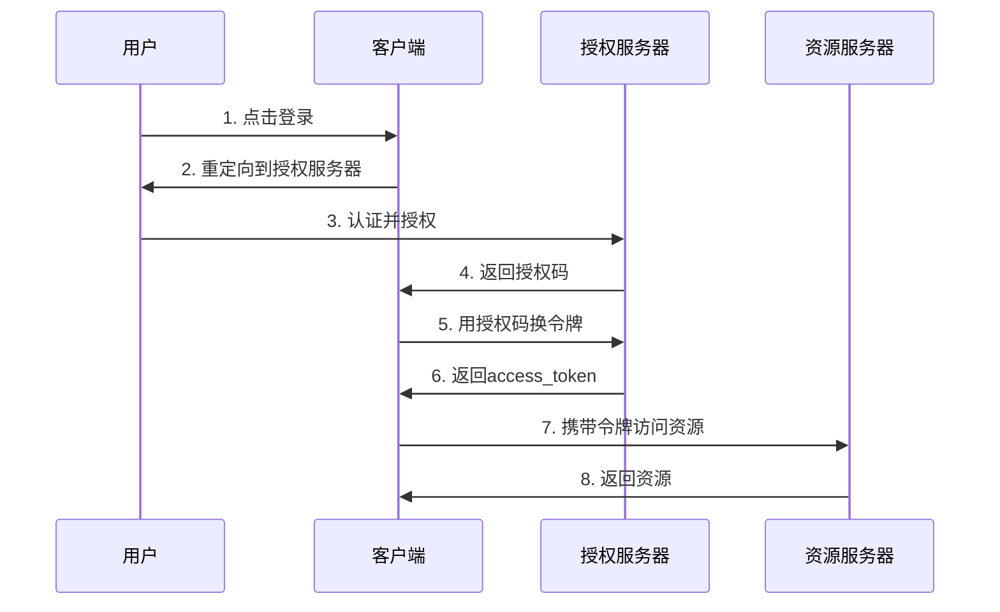

### PKCE增强安全

```python
# PKCE流程实现
import hashlib
import base64
import secrets

def generate_pkce():
    # 生成code_verifier
    code_verifier = secrets.token_urlsafe(32)
    
    # 生成code_challenge
    code_challenge = base64.urlsafe_b64encode(
        hashlib.sha256(code_verifier.encode()).digest()
    ).decode().rstrip('=')
    
    return code_verifier, code_challenge

# 授权请求
def get_auth_url(auth_endpoint, client_id, redirect_uri, code_challenge):
    params = {
        "response_type": "code",
        "client_id": client_id,
        "redirect_uri": redirect_uri,
        "code_challenge": code_challenge,
        "code_challenge_method": "S256",
        "scope": "openid profile"
    }
    return f"{auth_endpoint}?{urlencode(params)}"
```

---

## RBAC权限模型

### RBAC架构

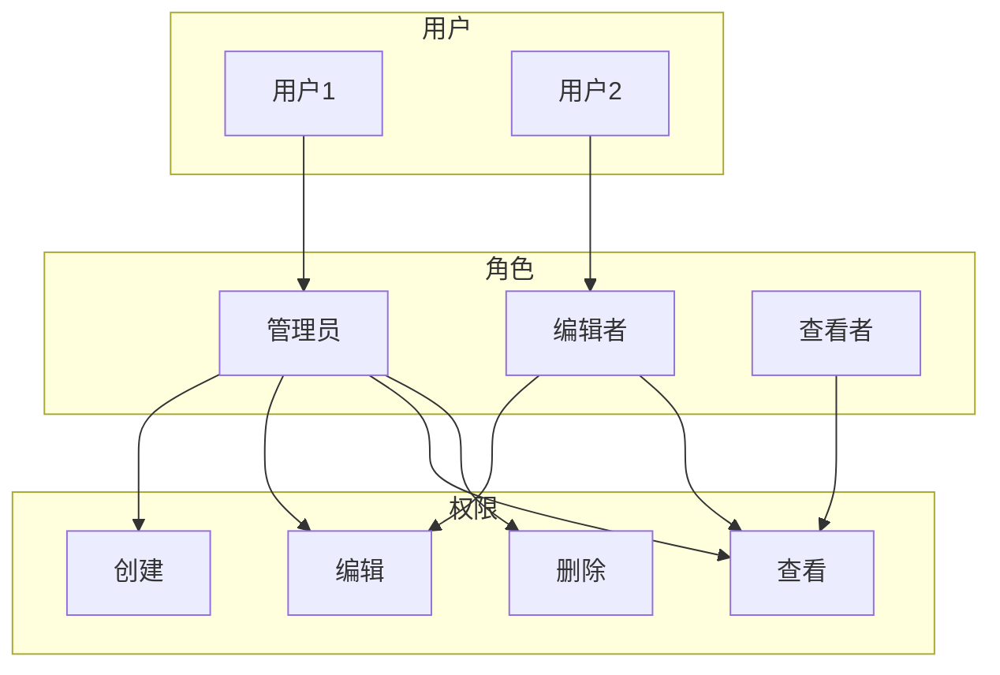

### RBAC实现示例

```python
# RBAC权限检查
from functools import wraps

class RBAC:
    def __init__(self):
        self.roles = {
            "admin": ["create", "read", "update", "delete"],
            "editor": ["read", "update"],
            "viewer": ["read"]
        }
    
    def check_permission(self, user_role, permission):
        return permission in self.roles.get(user_role, [])

def require_permission(permission):
    def decorator(func):
        @wraps(func)
        def wrapper(*args, **kwargs):
            user_role = get_current_user_role()
            if not rbac.check_permission(user_role, permission):
                raise PermissionError("权限不足")
            return func(*args, **kwargs)
        return wrapper
    return decorator

@require_permission("delete")
def delete_user(user_id):
    # 删除用户逻辑
    pass
```

---

## 令牌管理策略

### 令牌生命周期

```text
令牌生命周期：
  1. 颁发：用户认证成功后颁发
  2. 使用：携带令牌访问资源
  3. 刷新：access_token过期时用refresh_token刷新
  4. 吊销：用户登出或安全事件时吊销
  5. 过期：令牌超过有效期自动失效
```

### 令牌刷新策略

```python
# 令牌刷新逻辑
class TokenRefreshService:
    def __init__(self, auth_server):
        self.auth_server = auth_server
    
    def refresh_token(self, refresh_token):
        # 检查refresh_token是否有效
        if self.is_token_expired(refresh_token):
            raise TokenExpired("refresh_token已过期")
        
        # 请求新的access_token
        response = self.auth_server.post("/token", {
            "grant_type": "refresh_token",
            "refresh_token": refresh_token
        })
        
        # 返回新令牌
        return {
            "access_token": response["access_token"],
            "refresh_token": response["refresh_token"],
            "expires_in": response["expires_in"]
        }
```

### 令牌吊销实现

```python
# Token吊销服务
class TokenRevocationService:
    def __init__(self, redis_client):
        self.redis = redis_client
    
    def revoke_token(self, token, reason="user_logout"):
        # 计算令牌哈希
        token_hash = hashlib.sha256(token.encode()).hexdigest()
        
        # 存储吊销记录
        self.redis.setex(
            f"revoked_token:{token_hash}",
            86400 * 7,  # 7天过期
            json.dumps({
                "revoked_at": datetime.utcnow().isoformat(),
                "reason": reason
            })
        )
    
    def is_token_revoked(self, token):
        token_hash = hashlib.sha256(token.encode()).hexdigest()
        return self.redis.exists(f"revoked_token:{token_hash}")
```

---

## OAuth2安全实践

### CSRF防护

```python
# State参数防护CSRF
import secrets

def generate_state():
    return secrets.token_urlsafe(32)

def verify_state(request_state, session_state):
    if request_state != session_state:
        raise CSRFError("State验证失败，可能遭受CSRF攻击")
    return True

# 授权请求
def get_auth_url_with_state(auth_endpoint, client_id, redirect_uri):
    state = generate_state()
    session["oauth_state"] = state
    
    params = {
        "response_type": "code",
        "client_id": client_id,
        "redirect_uri": redirect_uri,
        "state": state
    }
    return f"{auth_endpoint}?{urlencode(params)}"
```

### Redirect URI安全

```text
Redirect URI安全检查：
  1. 严格匹配：必须完全匹配注册的URI
  2. 禁止通配符：生产环境不使用通配符
  3. HTTPS强制：必须使用HTTPS
  4. 路径限制：限制重定向路径
```

---

## JWT vs Session对比

### 认证方式对比

| 维度 | JWT | Session |
|------|-----|---------|
| 存储位置 | 客户端 | 服务端 |
| 无状态 | 是 | 否 |
| 扩展性 | 高 | 低 |
| 安全性 | 中 | 高 |
| 跨域 | 支持 | 不支持 |
| 性能 | 高 | 中 |

### 选型建议

```text
选型建议：
  微服务架构 → JWT
  单体应用 → Session
  跨域场景 → JWT
  高安全要求 → Session
  分布式系统 → JWT
```

---

## 安全最佳实践

### 安全检查清单

| 检查项 | 说明 | 优先级 |
|--------|------|--------|
| HTTPS | 强制使用HTTPS | 高 |
| 密钥安全 | 密钥加密存储 | 高 |
| 令牌有效期 | 设置合理过期时间 | 高 |
| 刷新令牌 | 实现安全的刷新机制 | 中 |
| 审计日志 | 记录认证操作 | 中 |
| 速率限制 | 限制认证尝试次数 | 中 |

### 安全配置示例

```yaml
# 安全配置
security:
  jwt:
    # 令牌配置
    access-token-expiry: 900      # 15分钟
    refresh-token-expiry: 604800  # 7天
    issuer: "auth.example.com"
    audience: "api.example.com"
    
    # 签名配置
    algorithm: "RS256"
    key-rotation-period: "90d"
    
    # 安全配置
    require-https: true
    validate-claims: true
  
  oauth2:
    # PKCE配置
    pkce-required: true
    
    # State配置
    state-required: true
    
    # Redirect URI配置
    allowed-redirect-uris:
      - "https://app.example.com/callback"
```

---

## 生产问题排查

### 常见问题

| 问题 | 原因 | 解决方案 |
|------|------|----------|
| 令牌验证失败 | 密钥不匹配 | 检查密钥配置 |
| 刷新失败 | refresh_token过期 | 重新登录 |
| 跨域失败 | CORS配置错误 | 配置CORS |
| 性能问题 | 令牌验证开销 | 使用短缓存 |

### 监控指标

| 指标 | 说明 | 告警阈值 |
|------|------|----------|
| 认证成功率 | 认证成功比例 | <99% |
| 令牌刷新率 | 刷新令牌使用比例 | >50% |
| 认证延迟 | 认证操作耗时 | >500ms |
| 安全事件 | 异常认证尝试 | >10次/分钟 |

---

## Token 吊销策略深入

### 吊销策略对比

| 策略 | 实现 | 实时性 | 性能影响 | 适用场景 |
|------|------|--------|----------|----------|
| 黑名单（Redis） | 吊销时写入 Redis，验证时查 Redis | 秒级 | 每次验证多一次 Redis 查询 | 高安全要求场景 |
| Token 版本号 | 用户下线时递增版本号，JWT 携带版本 | 秒级 | 无额外查询（版本在 JWT 中） | 通用场景（推荐） |
| 密钥轮转 | 轮转签名密钥，旧 token 自然失效 | 分钟~小时 | 无额外查询 | 定期安全轮转 |
| 短有效期 + 无刷新 | token 5 分钟有效，无 refresh token | 5 分钟 | 无 | 临时授权场景 |
| Introspection | 每次验证调用 AS 的 introspect 端点 | 实时 | 每次验证一次网络调用 | opaque token 场景 |

### Token 版本号实现

```python
# 基于版本号的 Token 吊销
class TokenRevocationService:
    def __init__(self, redis_client):
        self.redis = redis_client

    def get_user_token_version(self, user_id):
        """获取用户当前 token 版本"""
        version = self.redis.get(f"token_version:{user_id}")
        return int(version) if version else 0

    def revoke_all_tokens(self, user_id):
        """吊销用户所有 token（递增版本号）"""
        self.redis.incr(f"token_version:{user_id}")
        # 设置过期时间（与 token 最大有效期一致）
        self.redis.expire(f"token_version:{user_id}", 86400 * 30)

    def create_token_with_version(self, user_id, scope):
        """创建带版本号的 token"""
        version = self.get_user_token_version(user_id)
        payload = {
            "sub": user_id,
            "scope": scope,
            "token_version": version,  # 嵌入版本号
            "exp": datetime.utcnow() + timedelta(minutes=15),
            "iat": datetime.utcnow(),
            "jti": str(uuid.uuid4())
        }
        return jwt.encode(payload, private_key, algorithm="RS256")

    def verify_token_version(self, token):
        """验证 token 版本是否有效"""
        payload = jwt.decode(token, public_key, algorithms=["RS256"])
        current_version = self.get_user_token_version(payload["sub"])
        if payload.get("token_version", 0) < current_version:
            raise TokenRevoked("Token has been revoked")
        return payload
```

### 密钥轮转与吊销联动

```
密钥轮转 + Token 吊销联合策略：
  1. 密钥轮转周期：90 天
  2. 旧密钥保留期：与最长 token 有效期一致（24h）
  3. 安全事件触发：立即轮转 + 递增所有用户 token 版本号

密钥轮转 SOP：
  1. 生成新密钥对（kid: key-N+1）
  2. 将新公钥发布到 JWKS 端点
  3. 签名切换到新密钥（新 token 用 key-N+1）
  4. 保留旧密钥验证旧 token（24h 内）
  5. 24h 后从 JWKS 移除旧密钥
  6. 安全事件：额外递增所有用户的 token 版本号
```

## JWT 在 GraphQL 中的应用

### GraphQL + JWT 架构

```mermaid
graph TD
    Client[GraphQL 客户端] -->|JWT| Gateway[API Gateway]
    Gateway -->|验证 JWT| AuthSvc[认证服务]
    Gateway -->|注入用户信息| GraphQL[GraphQL Server]
    GraphQL -->|@auth 指令| Directive[权限指令]
    GraphQL --> UserSvc[用户服务]
    GraphQL --> OrderSvc[订单服务]
```

### GraphQL 授权指令

```graphql
# 定义 @auth 指令
directive @auth(requires: Role = USER) on FIELD_DEFINITION

enum Role {
  ADMIN
  EDITOR
  USER
}

type Query {
  # 仅管理员可访问
  allUsers: [User!]! @auth(requires: ADMIN)
  
  # 已认证用户可访问
  me: User @auth(requires: USER)
  
  # 公开接口
  publicInfo: String
}

type Mutation {
  # 编辑者或管理员可操作
  createPost(title: String!, content: String!): Post! @auth(requires: EDITOR)
  
  # 仅管理员可操作
  deleteUser(id: ID!): Boolean! @auth(requires: ADMIN)
}
```

### GraphQL JWT 实现

```javascript
// GraphQL Server JWT 中间件
const { ApolloServer } = require('@apollo/server');
const jwt = require('jsonwebtoken');

const server = new ApolloServer({
  typeDefs,
  resolvers,
  context: ({ req }) => {
    const token = req.headers.authorization?.replace('Bearer ', '');
    let user = null;

    if (token) {
      try {
        user = jwt.verify(token, public_key, { algorithms: ['RS256'] });
      } catch (e) {
        // token 无效，user 保持 null
      }
    }

    return { user };
  },
});

// @auth 指令实现
const authDirectiveTransformer = (schema) => {
  return mapSchema(schema, {
    [MapperKind.OBJECT_FIELD]: (fieldConfig) => {
      const auth = fieldConfig.astNode?.directives?.find(d => d.name.value === 'auth');
      if (auth) {
        const requiredRole = auth.arguments?.find(a => a.name.value === 'requires')?.value.value;
        const originalResolve = fieldConfig.resolve;
        fieldConfig.resolve = (parent, args, context, info) => {
          if (!context.user) throw new AuthenticationError('Not authenticated');
          if (requiredRole && !context.user.roles?.includes(requiredRole)) {
            throw new ForbiddenError('Insufficient permissions');
          }
          return originalResolve(parent, args, context, info);
        };
      }
      return fieldConfig;
    },
  });
};
```

## OAuth2 Device Authorization Grant 详解

### Device Flow 完整规范

```
RFC 8628 Device Authorization Grant 完整流程：

设备端（如智能音箱、CLI 工具）：
  1. POST /oauth/device/code
     ├── client_id: 设备应用 ID
     ├── scope: 请求的权限范围
     └── response_type: device_code

  2. 服务端返回：
     ├── device_code: 设备码（设备轮询用）
     ├── user_code: 用户码（用户输入用，如 WDJB-MJHT）
     ├── verification_uri: 用户输入码的 URL
     ├── verification_uri_complete: 带预填码的 URL（可选）
     ├── expires_in: 设备码有效期（如 600 秒）
     └── interval: 轮询间隔（如 5 秒）

  3. 设备显示用户码，用户在其他设备上访问 verification_uri

  4. 设备轮询 POST /token
     ├── grant_type: urn:ietf:params:oauth:grant-type:device_code
     ├── device_code: 设备码
     └── client_id: 设备应用 ID

  5. 响应状态：
     ├── 200 → token（用户已授权）
     ├── 428 → Authorization Pending（继续轮询）
     ├── 400 → expired_token（设备码过期）
     ├── 401 → access_denied（用户拒绝）
     └── 403 → invalid_client（client_id 无效）
```

### Device Flow 安全考量

| 风险 | 描述 | 防御措施 |
|------|------|----------|
| 用户码猜测 | 攻击者尝试猜解用户码 | 用户码长度 ≥ 8 位，包含字母数字 |
| 设备码泄露 | 设备码被第三方截获 | 绑定 client_id + IP，HTTPS 传输 |
| 拒绝服务 | 攻击者大量请求 device_code | 限流 + 设备码有效期短 |
| 重放攻击 | 旧设备码被重用 | 一次性使用，用后即废 |
| 社会工程 | 用户被诱导输入码到恶意设备 | 显示设备信息，用户确认后授权 |

## PKCE 实现细节深入

### PKCE 安全原理

```
PKCE 安全证明：

没有 PKCE：
  攻击者截获 authorization_code → 直接用 code 换 token
  → token 被盗

有 PKCE：
  客户端生成 code_verifier（随机串）
  客户端计算 code_challenge = SHA256(code_verifier)
  授权请求携带 code_challenge
  token 交换时携带 code_verifier
  服务端验证 SHA256(code_verifier) == code_challenge
  
  攻击者截获 code，但没有 code_verifier → 无法换 token
  攻击者截获 code_challenge，但无法反推 code_verifier（SHA256 单向）
```

### PKCE 高级用法

```javascript
// PKCE + JWT 客户端认证
async function exchangeTokenWithPKCE(code, codeVerifier, clientAssertion) {
  const response = await fetch('https://auth.example.com/token', {
    method: 'POST',
    headers: { 'Content-Type': 'application/x-www-form-urlencoded' },
    body: new URLSearchParams({
      grant_type: 'authorization_code',
      code: code,
      redirect_uri: 'https://myapp.com/callback',
      code_verifier: codeVerifier,
      client_assertion_type: 'urn:ietf:params:oauth:client-assertion-type:jwt-bearer',
      client_assertion: clientAssertion  // JWT 客户端认证
    })
  });
  return response.json();
}

// 生成 JWT 客户端断言
function createClientAssertion(clientId, tokenEndpoint) {
  const now = Math.floor(Date.now() / 1000);
  const payload = {
    iss: clientId,
    sub: clientId,
    aud: tokenEndpoint,
    jti: crypto.randomUUID(),
    exp: now + 300,
    iat: now
  };
  return jwt.sign(payload, privateKey, { algorithm: 'RS256' });
}
```

### PKCE vs Client Secret 对比

| 维度 | PKCE | Client Secret |
|------|------|---------------|
| 安全模型 | 动态密钥（每次请求不同） | 静态密钥（长期有效） |
| 存储位置 | 客户端内存（不落盘） | 服务端安全存储 |
| 泄露影响 | 单次请求泄露 | 长期可被滥用 |
| 适用客户端 | SPA/移动端/CLI | 后端服务/机密客户端 |
| 是否需要 TLS | 强烈建议 | 必须 |
| 规范要求 | OAuth 2.1 强制公开客户端使用 | 机密客户端可选 |

## 二十五、JWT安全深度

### 25.1 JWT攻击向量

| 攻击类型 | 原理 | 防御措施 |
|----------|------|----------|
| 密钥泄露 | 签名密钥被获取 | 密钥轮换、硬件存储 |
| 算法降级 | 修改header中的alg | 强制指定算法 |
| None算法 | 设置alg为none | 禁用none算法 |
| 注入攻击 | Payload中注入字段 | 输入验证 |
| 重放攻击 | 复用有效Token | 短过期时间+刷新Token |

### 25.2 安全配置示例

```java
// JWT安全配置
@Configuration
public class JwtSecurityConfig {
    
    @Bean
    public JwtDecoder jwtDecoder() {
        NimbusJwtDecoder decoder = NimbusJwtDecoder
            .withJwkSetUri("https://auth.example.com/.well-known/jwks.json")
            .build();
        
        // 强制验证签名算法
        decoder.setJwtValidator(JwtValidators.createDefaultWithIssuer(
            "https://auth.example.com"
        ));
        
        return decoder;
    }
    
    @Bean
    public SecurityFilterChain filterChain(HttpSecurity http) throws Exception {
        http
            .oauth2ResourceServer(oauth2 -> oauth2
                .jwt(jwt -> jwt
                    .decoder(jwtDecoder())
                    .jwtAuthenticationConverter(jwtAuthConverter())
                )
            )
            .sessionManagement(session -> session
                .sessionCreationPolicy(SessionCreationPolicy.STATELESS)
            );
        return http.build();
    }
}
```

### 25.3 Token刷新策略

| 策略 | 说明 | 安全性 | 用户体验 |
|------|------|--------|----------|
| 固定过期 | Token固定时间过期 | 中 | 差 |
| 滑动过期 | 使用时延长过期 | 中 | 好 |
| 刷新Token | 短Access+长Refresh | 高 | 好 |
| 双Token | Access+Refresh分离 | 高 | 中 |

---

## 二十六、OAuth2高级模式

### 26.1 PKCE（Proof Key for Code Exchange）

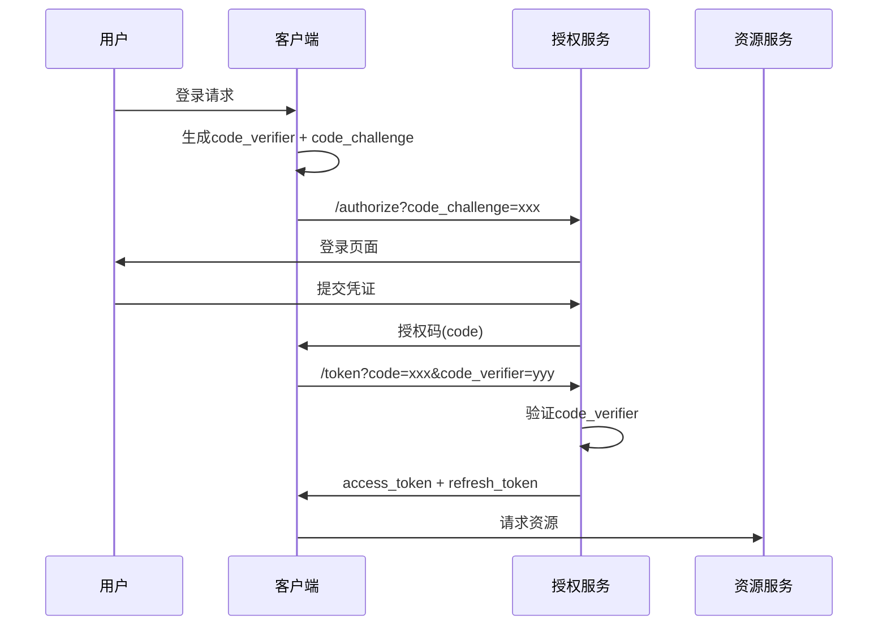

### 26.2 授权服务器配置

```yaml
# Spring Authorization Server 配置
spring:
  security:
    oauth2:
      authorizationserver:
        issuer: https://auth.example.com
        authorization-endpoint: /oauth2/authorize
        token-endpoint: /oauth2/token
        jwk-set-uri: https://auth.example.com/.well-known/jwks.json
        supported-scopes:
          - openid
          - profile
          - email
          - api.read
          - api.write
        registered-clients:
          - client-id: web-app
            client-secret: ${CLIENT_SECRET}
            authorization-grant-types:
              - authorization_code
              - refresh_token
            redirect-uris:
              - https://app.example.com/callback
            scopes:
              - openid
              - profile
            client-settings:
              require-authorization-consent: true
```

---

## 与其他板块的关系

| 关联板块 | 关系描述 |
|----------|----------|
| **微服务架构** | JWT 是微服务间认证的事实标准，OAuth2 提供统一授权框架 |
| **API 网关** | 网关统一验证 JWT，将用户信息透传给下游服务 |
| **零信任安全** | JWT + OAuth2 是零信任架构中身份验证的核心组件 |
| **SSO 单点登录** | OAuth2/OIDC 是实现跨域 SSO 的主流方案 |
| **RBAC/ABAC** | JWT 的 scope/roles 声明驱动权限控制模型 |

## 一句话总结

JWT 是分布式环境下的无状态身份令牌，OAuth2 是第三方资源委托访问的安全框架；前者解决"如何证明你是谁"，后者解决"你有权访问什么资源"，二者配合构成现代微服务认证授权的基石。

---

## 参考资料

- [JWT 官方规范 RFC 7519](https://datatracker.ietf.org/doc/html/rfc7519)
- [OAuth 2.0 规范 RFC 6749](https://datatracker.ietf.org/doc/html/rfc6749)
- [OpenID Connect 规范](https://openid.net/specs/openid-connect-core-1_0.html)
- [OWASP JWT 安全指南](https://cheatsheetseries.owasp.org/cheatsheets/JSON_Web_Token_for_Java_Cheat_Sheet.html)
- [Auth0 JWT 文档](https://auth0.com/docs/secure/tokens/json-web-tokens)
