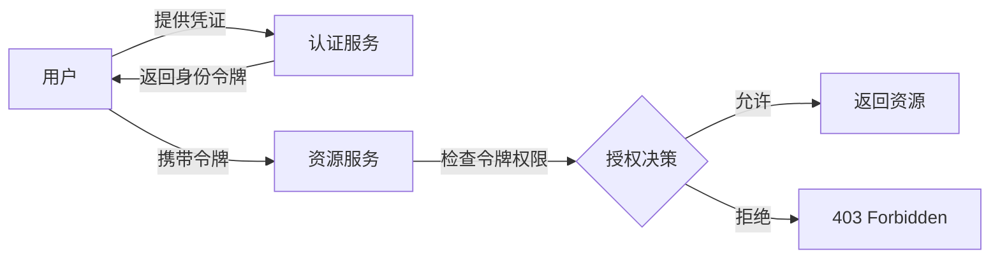
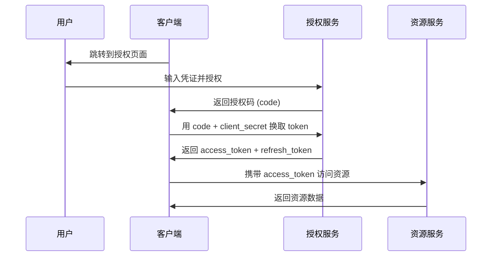
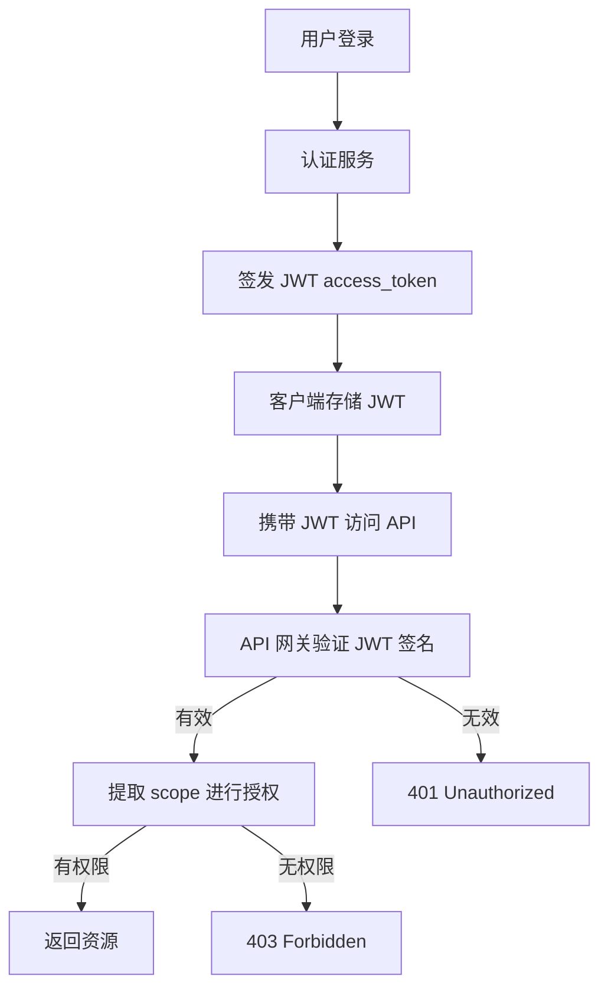
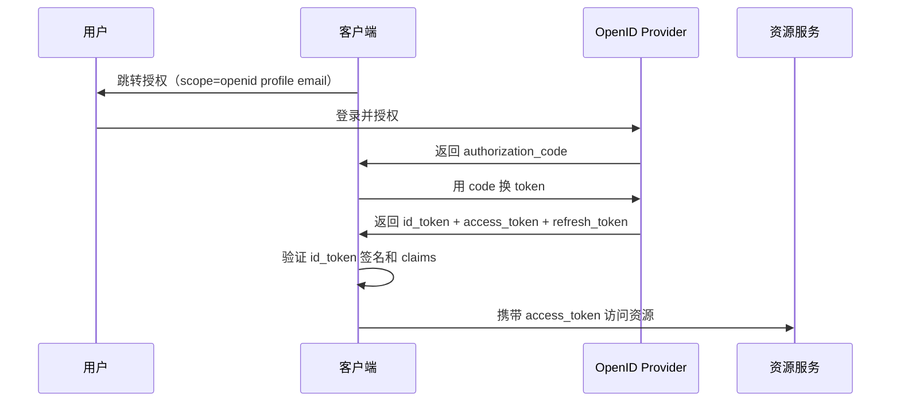
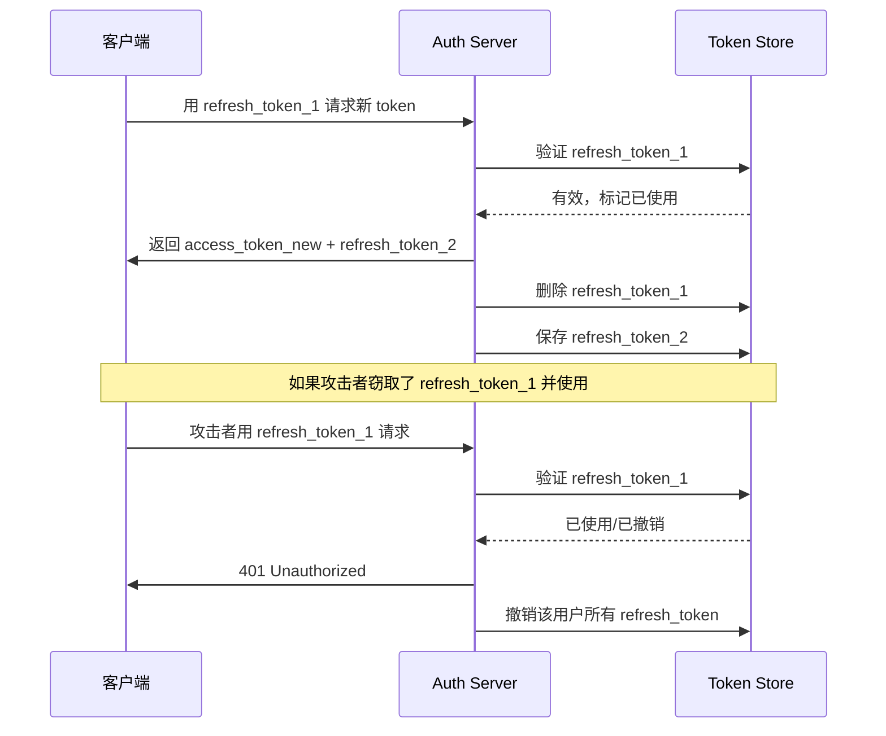
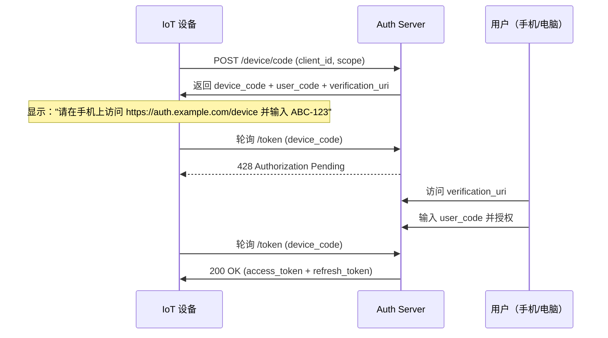
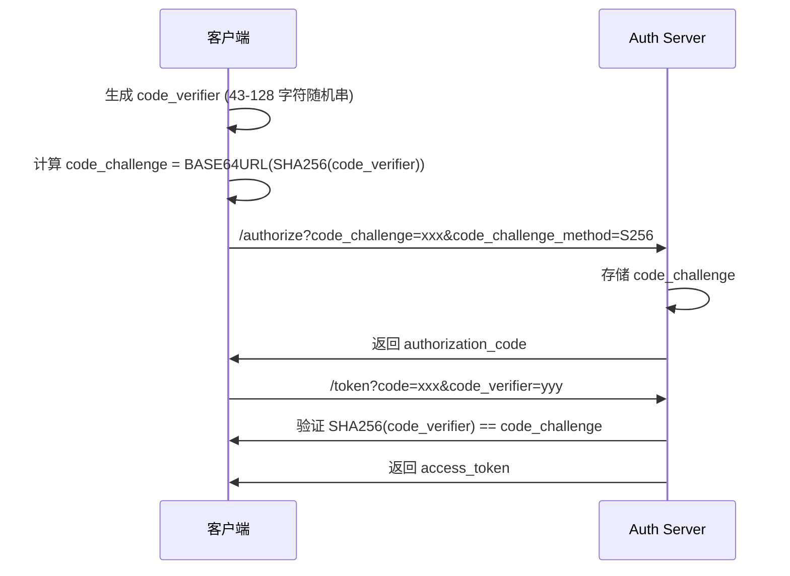
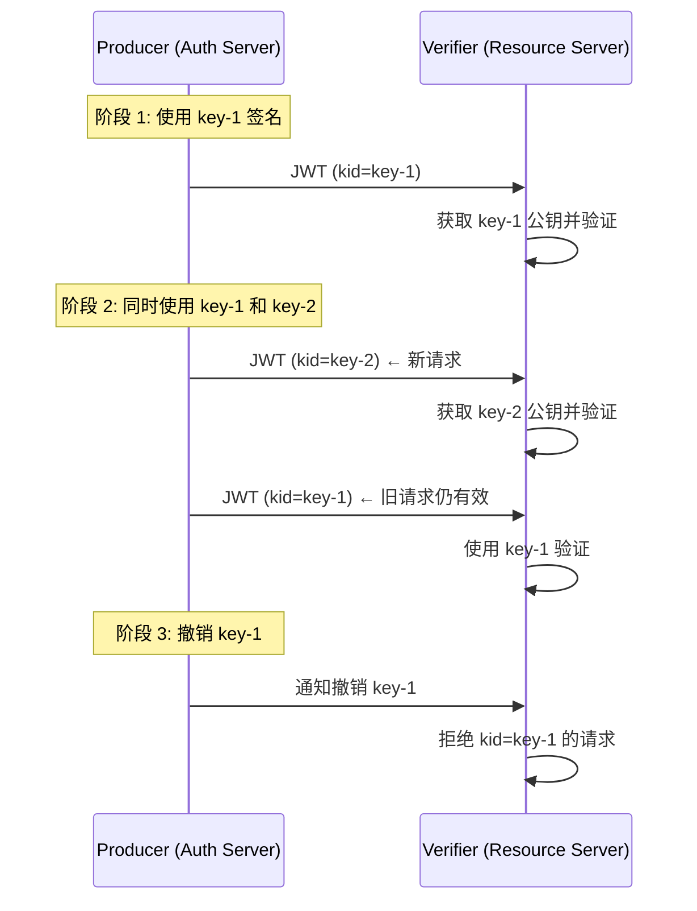

# 认证授权：JWT 与 OAuth2 体系

> **核心认知**：认证（Authentication）回答"你是谁"，授权（Authorization）回答"你能做什么"。JWT 解决的是分布式环境下的无状态身份凭证传递问题，OAuth2 解决的是第三方应用对用户资源的安全委托访问问题。二者常配合使用，但职责完全不同。

## 要解决的问题

| 问题 | 传统方案的痛点 | JWT/OAuth2 的解法 |
|------|---------------|-------------------|
| 分布式会话共享 | Session 依赖服务端存储，无法跨节点 | JWT 无状态令牌，服务端无需存储 |
| 跨服务单点登录 | Session 同步复杂，耦合度高 | JWT + OAuth2 实现中心化认证 |
| 第三方授权访问 | 用户需将密码交给第三方，风险极高 | OAuth2 委托授权，令牌限定范围 |
| 微服务间认证 | 内部调用缺乏统一凭证 | JWT 内部传播 + JWT 声明携带权限 |
| 前后端分离 | Cookie-based Session 不便跨域 | 无状态 Token 方案天然支持跨域 |
| API 速率限制 | 无法按用户/应用区分限流 | OAuth2 scope 配合限流策略 |

## 认证 vs 授权：核心区别



- **认证（Authentication）**：验证用户身份 → 签发令牌
- **授权（Authorization）**：检查令牌中的权限声明 → 决定是否放行
- 认证是授权的前提，授权是认证的延伸

## JWT 详解

### JWT 结构

```
Header.Payload.Signature

Header (Base64URL):
{
  "alg": "RS256",
  "typ": "JWT",
  "kid": "key-id-123"
}

Payload (Base64URL):
{
  "sub": "user-001",
  "iss": "auth.example.com",
  "aud": "api.example.com",
  "exp": 1700000000,
  "iat": 1699996400,
  "scope": "read write",
  "roles": ["admin", "editor"],
  "org_id": "org-42"
}

Signature:
RSASHA256(
  base64UrlEncode(header) + "." + base64UrlEncode(payload),
  privateKey
)
```

### JWT 三部分职责

| 部分 | 内容 | 作用 |
|------|------|------|
| Header | 算法、令牌类型、密钥 ID | 指定验证方式 |
| Payload | 声明（claims） | 携带身份和权限信息 |
| Signature | 数字签名 | 防篡改，验证令牌完整性 |

### 常用 Claims

| Claim | 全称 | 用途 |
|-------|------|------|
| `sub` | Subject | 用户唯一标识 |
| `iss` | Issuer | 签发者（认证服务地址） |
| `aud` | Audience | 受众（令牌预期使用者） |
| `exp` | Expiration Time | 过期时间 |
| `nbf` | Not Before | 生效时间 |
| `iat` | Issued At | 签发时间 |
| `jti` | JWT ID | 令牌唯一标识（防重放） |
| `scope` | Scope | 权限范围 |

### JWT 签名算法对比

| 算法 | 类型 | 速度 | 安全性 | 适用场景 |
|------|------|------|--------|----------|
| HS256 | 对称 | 快 | 中 | 内部服务、简单场景 |
| RS256 | 非对称 | 中 | 高 | 公开 API、跨组织 |
| ES256 | 非对称 | 快 | 高 | 移动端、IoT |
| PS256 | 非对称 | 慢 | 最高 | 高安全合规场景 |

### JWT 安全考量

| 风险 | 描述 | 防御措施 |
|------|------|----------|
| 算法混淆攻击 | 将 RS256 改为 HS256，用公钥签名 | 服务端严格指定验证算法 |
| 令牌泄露 | JWT 被盗用 | 短有效期 + HTTPS + 刷新令牌 |
| 声明注入 | 在 payload 中注入恶意 claims | 服务端校验所有声明，不信任客户端 |
| 密钥泄露 | 私钥被盗，可伪造任意令牌 | HSM 存储 + 定期轮转 + 短期密钥 |

## OAuth2 详解

### 四种授权模式

| 模式 | 流程 | 适用场景 | 安全性 |
|------|------|----------|--------|
| 授权码模式 | 前端获取 code → 后端换 token | Web 应用（最推荐） | 高 |
| 隐式模式 | 直接返回 token（跳过 code） | 单页应用 SPA | 中 |
| 密码模式 | 用户直接提供账号密码 | 受信任的自有应用 | 低 |
| 客户端凭证 | 应用以自身身份获取 token | 服务间调用 | 高 |

### 授权码模式完整流程



### Token 类型

| Token 类型 | 用途 | 特点 |
|------------|------|------|
| Access Token | 访问资源的凭证 | 短期有效，如 15 分钟 |
| Refresh Token | 刷新 Access Token | 长期有效，如 30 天 |
| ID Token | 用户身份信息（OIDC） | 仅用于身份验证 |
| JWT Token | 自包含的令牌 | 无需查后端，服务端可直接验证 |

### OAuth2 Scope 设计

```
# 读写分离的 scope 设计
scope:
  - user:read      # 读取用户信息
  - user:write     # 修改用户信息
  - order:read     # 读取订单
  - order:write    # 创建/修改订单
  - admin:manage   # 管理后台权限
```

## JWT + OAuth2 组合模式



### 为什么用 JWT 作为 OAuth2 的 Access Token？

| 优势 | 说明 |
|------|------|
| 无状态验证 | 资源服务无需查询授权服务 |
| 自包含信息 | JWT payload 携带用户信息和权限 |
| 跨服务传播 | Token 可在多个微服务间传递 |
| 减少网络开销 | 避免每次请求都去认证服务验证 |

## 实现要点

### JWT 签发与验证

```python
# Python + PyJWT 示例
import jwt
from datetime import datetime, timedelta

# 签发 JWT
def create_token(user_id, scope):
    payload = {
        "sub": user_id,
        "iss": "auth.example.com",
        "scope": scope,
        "iat": datetime.utcnow(),
        "exp": datetime.utcnow() + timedelta(minutes=15),
        "jti": str(uuid.uuid4())
    }
    return jwt.encode(payload, private_key, algorithm="RS256")

# 验证 JWT
def verify_token(token):
    try:
        payload = jwt.decode(
            token, public_key,
            algorithms=["RS256"],
            audience="api.example.com",
            issuer="auth.example.com"
        )
        return payload
    except jwt.ExpiredSignatureError:
        raise AuthError("Token expired")
    except jwt.InvalidTokenError:
        raise AuthError("Invalid token")
```

### 刷新令牌机制

```
Access Token 生命周期（15分钟）：
  ├─ 过期前：正常使用
  └─ 过期后：用 Refresh Token 获取新的 Access Token

Refresh Token 安全策略：
  ├─ 旋转（Rotation）：每次刷新生成新的 refresh_token
  ├─ 重用检测：旧 refresh_token 被使用 → 全部吊销
  └─ 绑定：绑定到特定 client_id 和 IP
```

### 令牌吊销

| 方案 | 适用场景 | 延迟 |
|------|----------|------|
| 黑名单（Redis） | 需要即时吊销 | 低 |
| 缩短有效期 | JWT 自然过期 | 高 |
| Token Revocation Endpoint | OAuth2 标准方案 | 中 |
| 密钥轮转 | 吊销所有旧令牌 | 高（但彻底） |

## 常见安全陷阱

| 陷阱 | 后果 | 正确做法 |
|------|------|----------|
| JWT 存储在 localStorage | XSS 攻击可窃取 | HttpOnly Cookie 或安全存储 |
| 不验证 issuer/audience | Token 可被跨服务滥用 | 严格校验 iss/aud |
| 使用弱密钥或共享密钥 | 密钥被暴力破解 | 使用 RSA/ECDSA 非对称加密 |
| 不设置过期时间 | 被盗令牌永远有效 | 设置合理 exp + nbf |
| 在 payload 存敏感数据 | Base64 可被解码 | 仅存非敏感声明 |
| 不验证签名算法 | 算法混淆攻击 | 白名单指定允许算法 |

## OIDC（OpenID Connect）

### OIDC 是什么

OIDC 是建立在 OAuth2 之上的身份层，它在 OAuth2 的 access_token 基础上增加了 **ID Token**，使 OAuth2 从"授权框架"升级为"认证+授权"协议。

```
OAuth2 = 授权框架（你能访问什么）
OIDC = OAuth2 + 身份认证（你是谁 + 你能访问什么）
```

### OIDC 核心流程



### ID Token 结构

```json
{
  "iss": "https://auth.example.com",
  "sub": "user-001",
  "aud": "client-app-123",
  "exp": 1700000000,
  "iat": 1699996400,
  "nonce": "n-0S6_WzA2Mj",
  "name": "张三",
  "email": "zhangsan@example.com",
  "picture": "https://example.com/avatar.jpg",
  "email_verified": true
}
```

### OIDC vs OAuth2 对比

| 维度 | OAuth2 | OIDC |
|------|--------|------|
| 核心目标 | 资源授权 | 身份认证 + 资源授权 |
| Token | access_token | id_token + access_token |
| 标准 Scope | 自定义 | openid, profile, email, address, phone |
| 用户信息 | 无标准接口 | /userinfo 端点 |
| 发现文档 | 无 | /.well-known/openid-configuration |
| 客户端注册 | 手动 | 支持动态注册 |

### OIDC Discovery 文档

```
GET /.well-known/openid-configuration

{
  "issuer": "https://auth.example.com",
  "authorization_endpoint": "https://auth.example.com/authorize",
  "token_endpoint": "https://auth.example.com/token",
  "userinfo_endpoint": "https://auth.example.com/userinfo",
  "jwks_uri": "https://auth.example.com/.well-known/jwks.json",
  "supported_signing_alg_values": ["RS256", "ES256"],
  "response_types_supported": ["code", "id_token", "token"],
  "grant_types_supported": ["authorization_code", "refresh_token"],
  "subject_types_supported": ["public"],
  "id_token_signing_alg_values_supported": ["RS256", "ES256"]
}
```

## JWT Token 存储最佳实践

### 存储方案对比

| 方案 | 安全性 | 易用性 | XSS 防护 | CSRF 防护 | 适用场景 |
|------|--------|--------|----------|----------|----------|
| HttpOnly Cookie | 高 | 中 | 防护（JS 不可读） | 需额外防护 | Web 应用（推荐） |
| localStorage | 低 | 高 | 无防护 | 天然免疫 | 原型/内部工具 |
| sessionStorage | 中 | 高 | 无防护 | 天然免疫 | 单标签页场景 |
| 内存（变量） | 高 | 低 | 防护 | 天然免疫 | SPA（推荐） |
| Secure Storage | 高 | 中 | 防护 | 天然免疫 | 移动端 |
| Service Worker | 高 | 中 | 防护 | 天然免疫 | PWA |

### HttpOnly Cookie + CSRF Token 组合

```
服务端设置：
  Set-Cookie: access_token=xxx; HttpOnly; Secure; SameSite=Lax; Path=/

客户端请求：
  Cookie: access_token=xxx
  X-CSRF-Token: csrf-token-value    ← CSRF 防护

优点：
  ├── JS 无法读取 Cookie（防 XSS 窃取）
  ├── 浏览器自动携带（方便）
  └── SameSite + CSRF Token 双重防 CSRF

缺点：
  ├── 需要 CSRF 防护机制
  └── 跨域场景需要额外配置（CORS + credentials）
```

### SPA 内存存储模式

```javascript
// 推荐的 SPA Token 管理
class TokenManager {
  #accessToken = null;    // 私有变量，内存中
  #refreshToken = null;

  setTokens(access, refresh) {
    this.#accessToken = access;
    this.#refreshToken = refresh;
  }

  getAccessToken() {
    return this.#accessToken;
  }

  async getValidToken() {
    if (this.isTokenExpired(this.#accessToken)) {
      await this.refreshTokens();
    }
    return this.#accessToken;
  }

  clear() {
    this.#accessToken = null;
    this.#refreshToken = null;
  }
}

// 优点：XSS 无法直接读取
// 缺点：刷新页面后丢失，需要重新认证或结合 refresh_token 机制
```

## Refresh Token 轮转机制

### 轮转流程



### Token 轮转策略配置

```yaml
token_rotation:
  access_token:
    ttl: 900          # 15 分钟
    algorithm: RS256

  refresh_token:
    ttl: 2592000      # 30 天
    rotation: true     # 每次使用后轮转
    reuse_interval: 10 # 10 秒内的重用视为正常（网络重试）
    maxReuse: 0        # 禁止重用
    maxLifetime: 7776000  # 90 天最大生命周期

  revocation:
    on_reuse: all     # 重用时撤销该用户所有 token
    on_password_change: all
    on_logout: current  # 登出时只撤销当前 token
```

### Refresh Token 轮转实现

```python
def refresh_access_token(old_refresh_token):
    # 1. 查找并验证 refresh token
    stored = db.get_refresh_token(old_refresh_token)
    if not stored or stored.expired:
        raise Unauthorized("Invalid refresh token")

    # 2. 检测重用（可能被攻击者窃取）
    if not stored.is_within_reuse_interval():
        if stored.used:
            # 重用检测：撤销该用户所有 token
            db.revoke_all_tokens(stored.user_id)
            raise Unauthorized("Token reuse detected")
        raise Unauthorized("Token already used")

    # 3. 标记旧 token 已使用
    stored.mark_used()

    # 4. 生成新 token 对
    new_access = create_access_token(stored.user_id)
    new_refresh = create_refresh_token(stored.user_id)

    # 5. 保存新 refresh token
    db.save_refresh_token(new_refresh)

    return new_access, new_refresh
```

## OAuth2 Device Flow（IoT 流程）

### 适用场景

IoT 设备（如智能电视、CLI 工具）无法展示完整登录页面，需要用户在另一个设备上完成授权。



### Device Flow 请求/响应

```http
# 设备请求 device code
POST /oauth/device/code
Content-Type: application/x-www-form-urlencoded

client_id=app-123&scope=read profile

# 响应
{
  "device_code": "GmRhmhcxhwAzkoEqiMEg_DnyEysNkuNh",
  "user_code": "WDJB-MJHT",
  "verification_uri": "https://auth.example.com/device",
  "verification_uri_complete": "https://auth.example.com/device?user_code=WDJB-MJHT",
  "expires_in": 600,
  "interval": 5
}
```

### 轮询实现要点

```
设备端轮询策略：
  ├── 起始间隔：使用返回的 interval（通常 5s）
  ├── 指数退避：超过 5 分钟后每次增加 1s
  ├── 最大间隔：30s
  ├── 超时处理：expires_in 到期后停止轮询
  └── 错误处理：
      ├── 428 → 继续轮询
      ├── 400 → 设备码过期，重新获取
      ├── 401 → 用户拒绝，提示重新操作
      └── 403 → client_id 无效
```

## PKCE（Proof Key for Code Exchange）

### 问题背景

传统授权码模式中，client_secret 存储在客户端（SPA/移动端）不安全。PKCE 通过动态密钥解决了这个问题。

```
传统授权码模式：
  Client → code + client_secret → AS → token
  问题：SPA/移动端无法安全存储 client_secret

PKCE 模式：
  Client → code + code_verifier → AS → token
  优势：无需 client_secret，通过密码学证明身份
```

### PKCE 流程



### PKCE 实现代码

```javascript
// 生成 PKCE 参数
function generatePKCE() {
  // code_verifier: 43-128 字符的 [A-Z] / [a-z] / [0-9] / "-" / "." / "_" / "~"
  const array = new Uint8Array(32);
  crypto.getRandomValues(array);
  const codeVerifier = base64urlEncode(array); // 43 字符

  // code_challenge: BASE64URL(SHA256(code_verifier))
  const encoder = new TextEncoder();
  const data = encoder.encode(codeVerifier);
  const digest = await crypto.subtle.digest('SHA-256', data);
  const codeChallenge = base64urlEncode(new Uint8Array(digest));

  return { codeVerifier, codeChallenge };
}

// 授权请求
const { codeVerifier, codeChallenge } = await generatePKCE();
window.location = `https://auth.example.com/authorize?
  response_type=code&
  client_id=app-123&
  redirect_uri=https://myapp.com/callback&
  code_challenge=${codeChallenge}&
  code_challenge_method=S256`;

// Token 交换
const tokenResponse = await fetch('/token', {
  method: 'POST',
  body: new URLSearchParams({
    grant_type: 'authorization_code',
    code: authorizationCode,
    redirect_uri: 'https://myapp.com/callback',
    code_verifier: codeVerifier
  })
});
```

### code_challenge_method 对比

| 方法 | 算法 | 安全性 | 性能 |
|------|------|--------|------|
| plain | 无哈希 | 低（需 TLS） | 快 |
| S256 | SHA-256 | 高 | 快（推荐） |

## Token Introspection Endpoint

### 作用

资源服务器通过 Introspection 端点验证 access_token 的有效性，适用于 opaque token（非 JWT）或需要即时吊销检查的场景。

### 请求/响应

```http
# 请求
POST /oauth/introspect
Content-Type: application/x-www-form-urlencoded
Authorization: Basic base64(client_id:client_secret)

token=2YotnFZFEjr1zCsicMWpAA&token_type_hint=access_token

# 响应（有效 token）
{
  "active": true,
  "scope": "read write",
  "client_id": "app-123",
  "username": "zhangsan",
  "token_type": "Bearer",
  "exp": 1700000000,
  "iat": 1699996400,
  "sub": "user-001",
  "aud": "api.example.com",
  "iss": "https://auth.example.com"
}

# 响应（无效/过期 token）
{
  "active": false
}
```

### Introspection vs JWT 自验证

| 维度 | Introspection | JWT 自验证 |
|------|--------------|-----------|
| 网络开销 | 每次请求需调用 AS | 无网络开销 |
| 实时性 | 实时（可即时吊销） | 延迟到 token 过期 |
| 依赖 | 强依赖 AS 可用性 | 无外部依赖 |
| 适用场景 | 高安全要求、opaque token | 高性能、分布式场景 |

## JWT 密钥轮转策略

### 轮转原因

- 私钥泄露时能最小化影响范围
- 满足合规要求（定期轮转密钥）
- 降低长期密钥被破解的风险

### 密钥轮转流程



### JWKS（JSON Web Key Set）管理

```json
// GET /.well-known/jwks.json
{
  "keys": [
    {
      "kty": "RSA",
      "kid": "key-2",
      "use": "sig",
      "alg": "RS256",
      "n": "0vx7agoebGcQSuu...",
      "e": "AQAB"
    },
    {
      "kty": "RSA",
      "kid": "key-1",
      "use": "sig",
      "alg": "RS256",
      "n": "yK5mFz7..."
      // 旧密钥，仍保留用于验证旧 token
    }
  ]
}
```

### 密钥轮转最佳实践

```
轮转策略：
  ├── 轮转周期：90 天（或根据安全要求调整）
  ├── 并存期：至少 2 个密钥同时有效
  │   ├── 新密钥用于签名新 token
  │   └── 旧密钥用于验证未过期的旧 token
  ├── 撤销期：密钥过期后保留 24h 验证
  └── 自动化：使用 Vault/AWS KMS 管理密钥生命周期

实现步骤：
  1. 生成新密钥对
  2. 将公钥发布到 JWKS 端点
  3. 切换签名到新密钥（kid 在 JWT header 中标识）
  4. 等待所有旧 token 过期
  5. 从 JWKS 中移除旧密钥
```

## OAuth2 常见漏洞与防御

### 漏洞清单

| 漏洞 | 攻击方式 | 防御措施 |
|------|----------|----------|
| 授权码注入 | 窃取授权码在自己的会话中使用 | PKCE + state 参数 |
| 开放重定向 | 授权服务跳转到恶意 URL | 严格校验 redirect_uri |
| Token 泄露 | 日志/URL/Referer 泄露 token | Bearer token 不放 URL 参数 |
| CSRF 攻击 | 伪造授权请求绑定受害者账户 | state 参数 + 客户端会话绑定 |
| 混淆代理攻击 | 伪造 token 响应 | 严格校验 issuer + audience |
| 资源服务器混淆 | 用 A 服务的 token 访问 B 服务 | token 绑定 audience claim |

### 安全检查清单

```
OAuth2 实现安全审计清单：
  ├── [ ] 所有请求携带 state 参数并验证
  ├── [ ] redirect_uri 严格匹配（不允许通配）
  ├── [ ] access_token 使用 Bearer 方式传递
  ├── [ ] refresh_token 绑定到 client_id
  ├── [ ] PKCE 强制用于公开客户端
  ├── [ ] JWT 验证 iss / aud / exp / nbf
  ├── [ ] TLS 强制（HSTS + 证书固定）
  ├── [ ] Token 端点限流
  ├── [ ] 错误信息不泄露内部细节
  └── [ ] 定期轮转密钥和 client_secret
```

## Spring Security 实现 OAuth2 + JWT

### 配置示例

```java
@Configuration
@EnableAuthorizationServer
public class AuthServerConfig extends AuthorizationServerConfigurerAdapter {

    @Override
    public void configure(ClientDetailsServiceConfigurer clients) throws Exception {
        clients.inMemory()
            .withClient("web-app")
            .authorizedGrantTypes("authorization_code", "refresh_token")
            .scopes("read", "write")
            .redirectUris("https://myapp.com/callback")
            .and()
            .withClient("iot-device")
            .authorizedGrantTypes("device_code")
            .scopes("read")
            .autoApprove(true);
    }

    @Override
    public void configure(AuthorizationServerEndpointsConfigurer endpoints) {
        endpoints
            .tokenStore(jwtTokenStore())
            .accessTokenConverter(jwtAccessTokenConverter())
            .reuseRefreshTokens(false);  // refresh token 轮转
    }

    @Bean
    public JwtAccessTokenConverter jwtAccessTokenConverter() {
        JwtAccessTokenConverter converter = new JwtAccessTokenConverter();
        converter.setSigningKey(privateKey);
        converter.setVerifierKey(publicKey);
        return converter;
    }
}
```

### 资源服务器配置

```java
@Configuration
@EnableResourceServer
public class ResourceServerConfig extends ResourceServerConfigurerAdapter {

    @Override
    public void configure(HttpSecurity http) throws Exception {
        http.authorizeRequests()
            .antMatchers("/api/public/**").permitAll()
            .antMatchers("/api/admin/**").hasAuthority("ROLE_ADMIN")
            .anyRequest().authenticated()
            .and()
            .cors().and().csrf().disable();
    }

    @Override
    public void configure(ResourceServerSecurityConfigurer resources) {
        resources.tokenStore(jwtTokenStore());
    }
}
```

### 自定义 JWT Claims

```java
@Component
public class CustomTokenEnhancer implements TokenEnhancer {

    @Override
    public OAuth2AccessToken enhance(OAuth2AccessToken accessToken,
                                      OAuth2Authentication authentication) {
        User user = (User) authentication.getPrincipal();
        Map<String, Object> additionalInfo = new HashMap<>();
        additionalInfo.put("org_id", user.getOrgId());
        additionalInfo.put("roles", user.getRoles());
        ((DefaultOAuth2AccessToken) accessToken)
            .setAdditionalInformation(additionalInfo);
        return accessToken;
    }
}
```

## 与其他板块的关系

| 关联板块 | 关系描述 |
|----------|----------|
| **微服务架构** | JWT 是微服务间认证的事实标准，OAuth2 提供统一授权框架 |
| **API 网关** | 网关统一验证 JWT，将用户信息透传给下游服务 |
| **零信任安全** | JWT + OAuth2 是零信任架构中身份验证的核心组件 |
| **SSO 单点登录** | OAuth2/OIDC 是实现跨域 SSO 的主流方案 |
| **RBAC/ABAC** | JWT 的 scope/roles 声明驱动权限控制模型 |

## 一句话总结

JWT 是分布式环境下的无状态身份令牌，OAuth2 是第三方资源委托访问的安全框架；前者解决"如何证明你是谁"，后者解决"你有权访问什么资源"，二者配合构成现代微服务认证授权的基石。

---

## 参考资料

- [JWT 官方规范 RFC 7519](https://datatracker.ietf.org/doc/html/rfc7519)
- [OAuth 2.0 规范 RFC 6749](https://datatracker.ietf.org/doc/html/rfc6749)
- [OpenID Connect 规范](https://openid.net/specs/openid-connect-core-1_0.html)
- [OWASP JWT 安全指南](https://cheatsheetseries.owasp.org/cheatsheets/JSON_Web_Token_for_Java_Cheat_Sheet.html)
- [Auth0 JWT 文档](https://auth0.com/docs/secure/tokens/json-web-tokens)
