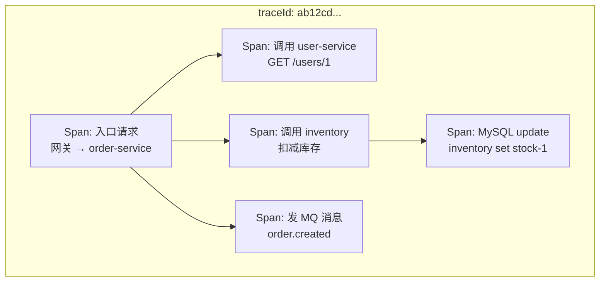
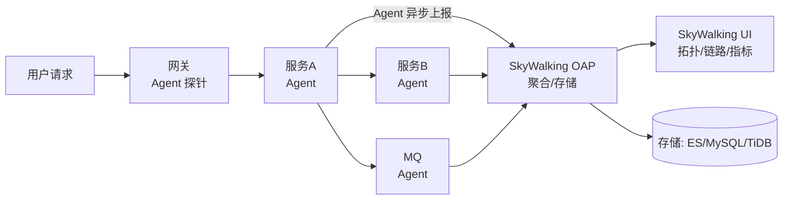
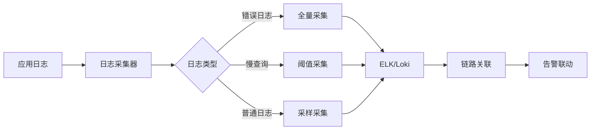
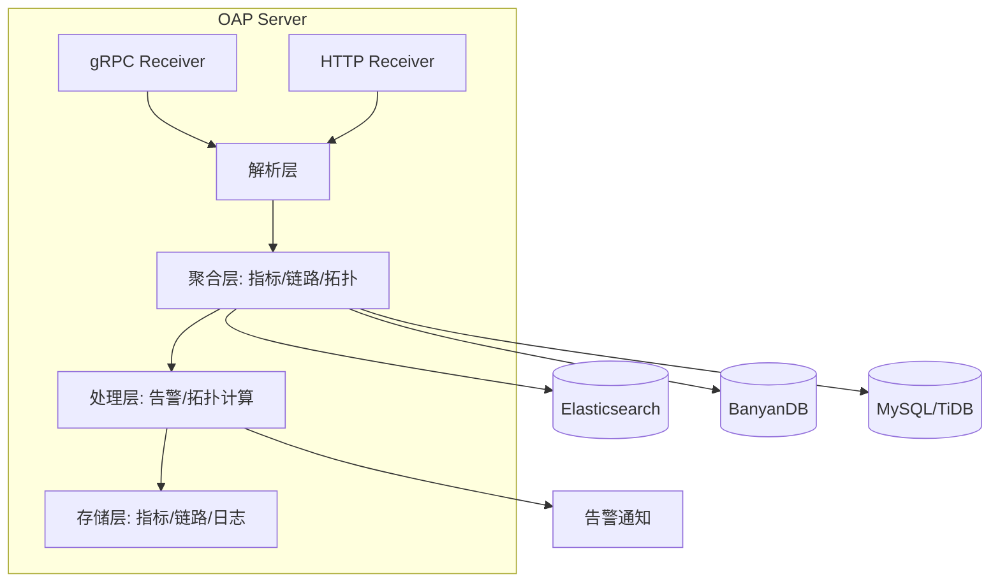
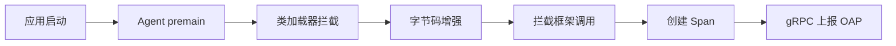

# 链路追踪与 APM（SkyWalking / Jaeger / Zipkin）

> 「请求到底慢在哪一跳？」——微服务排障的灵魂拷问，靠链路追踪回答。本文讲透 Trace/Span/SpanContext 模型、采样与透传、SkyWalking 落地（国内 Java 主流）、与 OpenTelemetry 的关系。
> 开源参考：[apache/skywalking](https://github.com/apache/skywalking)（Apache 2.0，国内 APM 事实标准）、[jaegertracing/jaeger](https://github.com/jaegertracing/jaeger)（CNCF，OpenTelemetry 官方后端）、[openzipkin/zipkin](https://github.com/openzipkin/zipkin)（Twitter 出品，老牌）。

---

## 〇、本体介绍（它是什么 / 适用场景 / 核心概念）

**它是什么**：链路追踪（Distributed Tracing）记录**一次请求在分布式系统中的完整调用路径与每跳耗时**，配上 APM（应用性能监控）能力（拓扑、指标、告警、剖析），回答「慢在哪、挂在哪、依赖谁」。

**解决什么痛点**：微服务一次请求可能穿 5~20 个服务，只靠日志无法还原「路径」与「各跳耗时」；链路追踪给每个请求一个全局 traceId，把散落的调用按树形串联，一眼定位瓶颈与故障点。

**核心概念**：Trace（整条调用链）、Span（一次调用单元，含父子关系）、SpanContext（traceId/spanId 透传）、采样（Sampling）、上下文透传（HTTP Header / MQ 属性）、拓扑图、SkyWalking Agent（字节码注入探针）。

**适用场景**：微服务性能瓶颈定位、故障根因分析、依赖拓扑梳理、SLA 保障、容量评估。
**不适用**：单机单体应用（无跨进程调用，意义不大）；已用商业云 APM 且覆盖全链路的中小团队（可先不自建）。

---

## 一、核心模型：Trace / Span



| 概念 | 说明 |
|------|------|
| **Trace** | 一次完整请求的所有 Span 组成的树，唯一 **traceId** 标识 |
| **Span** | 一次调用单元：服务名、操作名、开始/结束时间、标签（tag）、日志（log）、状态 |
| **parent/child** | Span 的父子关系构成调用树（含 **spanId / parentSpanId**） |
| **SpanContext** | 跨进程传递的上下文（traceId + spanId + 采样标记） |
| **采样** | 不采样 100%（成本），按比例/头部采样保留典型数据 |

### 数据流（SkyWalking 为例）



### 探针原理（SkyWalking Agent 为什么不用改代码）

- **字节码注入（Java Agent）**：`-javaagent:skywalking-agent.jar` 启动，通过 instrument 动态增强框架字节码（HTTP/RPC/MQ/JDBC 客户端），自动采集 Span——**对业务代码零侵入**。
- 同类：Jaeger/Zipkin 通常需要代码埋点或框架集成（也有 agent 方案），OTel Java Agent 同原理。

---

## 二、上下文透传（链路跨服务串起来的核心）

一次调用从一个进程传到下一个进程，必须把 SpanContext 带过去：

| 通道 | 透传方式 |
|------|----------|
| HTTP | Header：`sw8`（SkyWalking）/ `traceparent`（W3C Trace Context）/ `uber-trace-id`（Jaeger） |
| MQ 消息 | 消息属性/Header 携带 traceId，消费者还原上下文并开新 Span |
| gRPC | metadata 透传（W3C traceparent） |
| 线程池 | 手动传递上下文（TraceContext 快照 → 新线程恢复） |
| 日志 | 打点输出 traceId，与链路/日志联动排障 |

> 坑：**线程池/异步调用不自动透传上下文**——`@Async`、CompletableFuture、MQ 消费者里丢了 traceId，链路断成碎片；需显式传递（SkyWalking 的 ContextCarrier / OTel 的 context 传播）。

---

## 三、采样策略（成本与覆盖的平衡）

| 策略 | 说明 |
|------|------|
| 固定比例 | 如 10%：简单但高峰期样本少 |
| 头部采样（Head-based） | 入口决定是否采样，整链一致（推荐，配链路完整） |
| 尾部采样（Tail-based） | 按结果（如错误/慢请求）事后补齐，覆盖关键样本，成本高 |
| 自适应采样 | 按流量动态调比例（开源里少，商业 APM 多） |

- 生产建议：**默认 10%~30% 头部采样** + 「错误/慢请求强制采样」，保证排障样本不丢。

---

## 四、SkyWalking vs Jaeger vs Zipkin 对比

| 维度 | SkyWalking | Jaeger | Zipkin |
|------|-----------|--------|--------|
| 出身 | 中国开源（Apache） | CNCF / Uber | Twitter |
| 采集方式 | **Java Agent 字节码注入（零侵入）** | SDK 埋点/OTel | SDK 埋点 |
| 语言生态 | Java 最强（也支持多语言） | Go/多语言（OTel） | Java/多语言 |
| 附带能力 | 拓扑/指标/告警/日志关联（APM 全家桶） | 纯链路 + 服务图 | 纯链路 |
| 存储 | ES/MySQL/TiDB | 多后端（ES/Cassandra） | ES/Cassandra |
| OTel 兼容 | 兼容（作为后端/前端） | 原生对接 OTel | 原生对接 OTel |
| 选型 | **国内 Java 微服务首选** | 云原生/多语言 + OTel 生态 | 老项目存量 |

---

## 五、与 OpenTelemetry 的关系（重要认知）

- **OpenTelemetry（OTel）** 是**标准与 SDK**：统一采集口径（API + SDK + 导出器），不提供存储与 UI。
- **SkyWalking/Jaeger/Zipkin 是「后端」**：接收 trace 数据存储展示。
- 现代姿势：应用装 **OTel SDK/Agent** 采集 → 导出到 SkyWalking/Jaeger/云厂商后端；或直接用 SkyWalking Agent（国内 Java 零侵入最省事）。
- **OTel 关键概念**：Resource（服务元数据）、SpanProcessor、Exporter（OTLP/gRPC）、Propagator（W3C traceparent）；标准化的意义是「一套埋点，换后端不换代码」。

---

## 六、生产实践与避坑

### 6.1 落地清单

1. 网关/入口配置采样率（头部采样 + 错误强制采样）。
2. 所有服务统一装 Agent/SDK，版本一致（避免协议不兼容）。
3. **日志打 traceId**：与 ELK 联动，链路里跳日志、日志里回链路。
4. MQ/异步/线程池透传上下文（最容易断链的点）。
5. 存储规划：链路数据量大，按天/小时索引 + 保留期（如 7~30 天）；采样率控制总量。
6. 告警联动：慢 Span（如 p99 > 500ms）与错误 Span 触发告警。

### 6.2 常见坑

1. **链路断在异步**：`@Async`/线程池/消息消费没透传上下文 → 链路碎片化。
2. **采样不一致**：入口采样但下游强制全采/入口全采下游低采 → 链路不完整、排障缺数据。
3. **Agent 版本混乱**：与 OAP 不兼容 → 数据上报失败，升级要全链路同步。
4. **存储爆炸**：未按天索引 + 未设保留期 + 采样率过高 → ES 撑爆（见「ELK日志体系」的容量治理）。
5. **只装了链路没联动日志/指标**：单看链路树能定位「哪跳慢」，但要结合日志（为什么慢）与指标（是否整体趋势）。
6. **开发环境不采样**：链路数据缺失导致「上线前没验证过链路完整性」；测试环境至少开 100% 采样跑冒烟。
7. **网关层没接入**：从网关开始的 trace 最完整；只接部分服务会丢「第一跳」。

### 6.3 用链路定位慢请求的 SOP

1. 入口找 traceId（日志/抓包/入口大盘）。
2. 链路树里看各 Span 耗时：**哪个服务、哪个操作慢**（跨服务红色 Span）。
3. 点进慢 Span 看 tag/log：慢 SQL？下游超时？线程池排队？
4. 跳日志（traceId 关联）看应用侧细节；对照指标大盘确认是否普遍。
5. 对症：索引/缓存/扩容/限流/降级（见「场景设计/稳定性三板斧」）。

---

## 面试高频问题（20+ 条）

1. **链路追踪是什么？** 给每次请求生成全局 traceId，记录跨服务的调用路径与每跳耗时（Span 树），用于定位性能瓶颈与故障根因。

2. **Trace 和 Span 的关系？** Trace = 一次请求的全部 Span 树；Span = 一次调用单元（含 parentSpanId 形成父子结构）；spanId/traceId 标识。

3. **上下文怎么跨服务传递？** HTTP Header（sw8/traceparent）、MQ 消息属性、gRPC metadata；接收端还原 SpanContext 并创建子 Span。

4. **SkyWalking Agent 原理？** Java Agent 字节码注入（instrument），动态增强 HTTP/MQ/JDBC 框架字节码，自动采集——业务代码零侵入。

5. **为什么要采样？** 全量采样成本高（上报/存储/查询）；头部采样 10~30% + 错误/慢请求强制采样，保证样本有效且成本可控。

6. **头部采样和尾部采样区别？** 头部：入口决定整链是否采样（一致性好、简单）；尾部：按结果事后补齐关键样本（成本高、覆盖精准）。

7. **SkyWalking、Jaeger、Zipkin 区别？** SkyWalking：Java 零侵入 + APM 全家桶（拓扑/告警），国内主流；Jaeger：CNCF，多语言 OTel 原生；Zipkin：老牌轻量。

8. **OpenTelemetry 和 SkyWalking 什么关系？** OTel 是采集标准（API/SDK/导出器），SkyWalking/Jaeger 是可对接的后端；现代做法：OTel 埋点 + SkyWalking/Jaeger 存储展示。

9. **链路在 MQ 场景怎么串？** 生产端把 SpanContext 放入消息属性，消费端取出还原上下文再建 Span；断了链就查不到「消息下游为什么慢」。

10. **异步/线程池为什么断链？** 线程切换上下文丢失；需显式传递（ContextCarrier 快照 + 恢复），`@Async` 与 CompletableFuture 是重灾区。

11. **怎么用链路定位慢请求？** 链路树看各 Span 耗时找最慢一跳 → 看该 Span 的 tag/log（慢 SQL/下游超时）→ 日志/指标联动 → 对症优化。

12. **链路数据量太大怎么办？** 采样率控制 + 按天索引 + 保留期（7~30 天）+ 存储后端水平扩展（ES 分片）。

13. **跨语言怎么追踪？** 统一协议（W3C traceparent / OTLP）+ 各语言 SDK/Agent；SkyWalking 也支持多语言探针。

14. **链路和日志怎么联动？** 日志输出 traceId，链路 UI 可以「跳转到该 trace 的日志」，排障从链路找慢点、从日志找原因。

15. **全链路追踪还有什么用？** 拓扑依赖梳理（谁调谁）、容量评估、SLA 验证、混沌演练观测（故障注入看链路表现）。

16. **网关必须接入吗？** 必须：入口 Span 决定整条 trace 完整性；网关不接入则「第一跳」缺失，外部流量来源看不清。

17. **Span 里通常记录什么？** 服务/操作名、时间戳与耗时、状态（OK/ERROR）、tag（SQL/URL/参数摘要）、日志事件、异常堆栈。

18. **采样率怎么定？** 流量大默认 10~30% 头部采样；错误与慢 Span 强制采样（不管比例）；低流量系统可 100% 或接近。

19. **SkyWalking 存储用什么？** ES 最常用（链路+指标索引）、MySQL/TiDB 可作轻量后端；存储规划按天索引 + 保留期。

20. **自己实现链路追踪可行吗？** 可行（traceId 透传 + 埋点 + 上报 + 存储展示），但工程量大（采样/时序/UI/告警）；生产直接用 SkyWalking/Jaeger + OTel 更划算。

21. **链路追踪和 APM 什么关系？** APM 包含链路 + 指标 + 拓扑 + 告警 + 剖析；链路是 APM 的核心组件；SkyWalking 就是「带链路的 APM」。

22. **线上「请求慢」怎么从链路下手？** 取 traceId → 看链路树最慢 Span（服务/操作）→ 看该 Span tag（SQL/下游）→ 结合日志与指标确认根因 → 修复后对比优化前后 p99。

---

## 八、SkyWalking 高级特性与生产实践

### 8.1 OAP 集群高级部署

```yaml
# OAP 集群高级配置（Kubernetes）
apiVersion: apps/v1
kind: Deployment
metadata:
  name: skywalking-oap
  namespace: skywalking
spec:
  replicas: 3
  strategy:
    type: RollingUpdate
    rollingUpdate:
      maxSurge: 1
      maxUnavailable: 0
  selector:
    matchLabels:
      app: skywalking-oap
  template:
    metadata:
      labels:
        app: skywalking-oap
    spec:
      containers:
      - name: oap
        image: apache/skywalking-oap-server:10.0.0
        ports:
        - containerPort: 11800  # gRPC
        - containerPort: 12800  # HTTP
        env:
        - name: SW_CLUSTER
          value: "kubernetes"
        - name: SW_STORAGE
          value: "elasticsearch"
        - name: SW_STORAGE_ES_CLUSTER_NODES
          value: "elasticsearch:9200"
        - name: SW_STORAGE_ES_INDEX_SHARDS_NUMBER
          value: "2"
        - name: SW_STORAGE_ES_INDEX_REPLICAS_NUMBER
          value: "1"
        - name: SW_RETENTION
          value: "30"
        resources:
          limits:
            memory: "2Gi"
            cpu: "1000m"
          requests:
            memory: "1Gi"
            cpu: "500m"
        readinessProbe:
          httpGet:
            path: /healthcheck
            port: 12800
          initialDelaySeconds: 30
          periodSeconds: 10
        livenessProbe:
          httpGet:
            path: /healthcheck
            port: 12800
          initialDelaySeconds: 30
          periodSeconds: 30
```

| 集群模式 | 说明 | 适用场景 |
|----------|------|----------|
| Standalone | 单节点 | 开发/测试 |
| Mixed | 混合模式（接收+处理） | 中小规模 |
| Receiver/Aggregator | 分离模式 | 大规模生产 |
| Kubernetes | Operator管理 | 云原生环境 |

### 8.2 Trace 分析指标深度

```java
// 自定义Trace指标收集
public class CustomTraceMetrics {
    private final MeterRegistry registry;
    
    public void recordTraceMetrics(Trace trace) {
        // 1. 基础指标
        registry.timer("trace.duration", 
            "service", trace.getServiceName(),
            "endpoint", trace.getEndpoint())
            .record(trace.getDuration(), TimeUnit.MILLISECONDS);
        
        // 2. Span级指标
        trace.getSpans().forEach(span -> {
            registry.timer("span.duration",
                "service", span.getServiceName(),
                "operation", span.getOperationName(),
                "status", span.getStatus())
                .record(span.getDuration(), TimeUnit.MILLISECONDS);
            
            // 3. 错误率统计
            if (span.getStatus() == SpanStatus.ERROR) {
                registry.counter("span.errors",
                    "service", span.getServiceName(),
                    "operation", span.getOperationName())
                    .increment();
            }
        });
        
        // 4. 拓扑指标
        trace.getServiceCalls().forEach(call -> {
            registry.timer("service.call.duration",
                "source", call.getSource(),
                "target", call.getTarget())
                .record(call.getDuration(), TimeUnit.MILLISECONDS);
        });
    }
}
```

| 指标维度 | 指标名称 | 说明 | 告警阈值 |
|----------|----------|------|----------|
| 服务级 | service_resp_time | 服务响应时间 | P99 > 1s |
| 服务级 | service_sla | 服务可用性 | < 99% |
| 端点级 | endpoint_resp_time | 端点响应时间 | P99 > 2s |
| 实例级 | instance_jvm_gc_time | GC时间 | > 1s |
| 拓扑级 | service_call_duration | 服务调用延迟 | P99 > 500ms |

### 8.3 告警规则高级配置

```yaml
# 高级告警规则配置
rules:
  # 多条件联合告警
  - name: service_anomaly_rule
    metrics-name: service_resp_time
    op: ">"
    threshold: 1000
    period: 5
    count: 3
    message: "服务 {name} 响应时间异常"
    
  # 基于基线的动态阈值
  - name: service_baseline_rule
    metrics-name: service_resp_time
    op: ">"
    threshold: 1.5  # 超过基线1.5倍
    period: 10
    count: 2
    message: "服务 {name} 响应时间超过基线"
    
  # 多指标关联告警
  - name: service_degradation_rule
    condition: "service_resp_time > 1000 AND service_sla < 95"
    period: 5
    count: 2
    message: "服务 {name} 出现性能降级"
    
  # 告警升级策略
  escalation:
    - level: warning
      threshold: 1000
      duration: 5m
      notify: ["dingtalk-webhook"]
    - level: critical
      threshold: 2000
      duration: 2m
      notify: ["dingtalk-webhook", "phone-call"]
```

| 告警级别 | 条件 | 通知方式 | 响应时间 |
|----------|------|----------|----------|
| Info | P99 > 500ms | 邮件 | 24h |
| Warning | P99 > 1s | 钉钉/企微 | 4h |
| Critical | P99 > 2s | 电话/短信 | 1h |
| Fatal | SLA < 90% | 全渠道 | 15min |

### 8.4 日志关联高级实践

```yaml
# 日志-链路-指标三支柱联动配置
logging:
  pattern: "%d{yyyy-MM-dd HH:mm:ss.SSS} [%thread] [%X{SW_CTX:-}] [%X{traceId:-}] %msg%n"
  
# ELK集成配置
elk:
  host: elasticsearch:9200
  index: skywalking-logs-%{+YYYY.MM.dd}
  fields:
    - traceId: "%X{traceId}"
    - spanId: "%X{spanId}"
    - service: "${spring.application.name}"
    - endpoint: "%X{endpoint}"
    
# 日志采样策略
sampling:
  # 错误日志全量采集
  error:
    enabled: true
    level: ERROR
  # 慢查询日志采集
  slow_query:
    enabled: true
    threshold: 1000ms
  # 采样率
  rate: 0.1  # 10%采样
```



### 8.5 Istio 集成高级配置

```yaml
# Istio + SkyWalking 高级集成
apiVersion: networking.istio.io/v1alpha3
kind: EnvoyFilter
metadata:
  name: skywalking-tracing
  namespace: istio-system
spec:
  workloadSelector:
    labels:
      app: myapp
  configPatches:
  - applyTo: HTTP_FILTER
    match:
      context: SIDECAR_INBOUND
      listener:
        filterChain:
          filter:
            name: envoy.filters.network.http_connection_manager
    patch:
      operation: INSERT
      value:
        name: envoy.filters.http.skywalking
        typed_config:
          "@type": type.googleapis.com/udpa.type.v1.TypedStruct
          type_url: type.googleapis.com/envoy.extensions.filters.http.skywalking.v3.SkyWalking
          value:
            provider:
              cluster: skywalking-oap
              timeout: 5s
              grpc:
                envoy_grpc:
                  cluster_name: skywalking-oap
                initial_metadata:
                - key: sw_service_name
                  value: myapp
```

| 集成模式 | 说明 | 优缺点 |
|----------|------|--------|
| Sidecar注入 | 每个Pod注入Agent | 性能开销，但隔离性好 |
| 集中式Agent | DaemonSet部署Agent | 性能好，但资源竞争 |
| Envoy Filter | 通过Envoy扩展 | 灵活，但配置复杂 |
| 原生SDK | 应用内集成 | 控制精细，但侵入性高 |

### 8.6 Agent 性能开销深度分析

```java
// Agent性能监控
public class AgentPerformanceMonitor {
    private final MeterRegistry registry;
    private final AtomicLong cpuUsage = new AtomicLong();
    private final AtomicLong memoryUsage = new AtomicLong();
    
    @Scheduled(fixedRate = 1000)
    public void collectMetrics() {
        // 1. CPU使用率
        double cpu = ManagementFactory.getThreadMXBean()
            .getThreadCpuTime(Thread.currentThread().getId()) / 1e9;
        registry.gauge("agent.cpu.usage", cpu);
        
        // 2. 内存使用
        long memory = ManagementFactory.getMemoryMXBean()
            .getHeapMemoryUsage().getUsed() / 1024 / 1024;
        registry.gauge("agent.memory.usage_mb", memory);
        
        // 3. 线程数
        int threads = Thread.activeCount();
        registry.gauge("agent.thread.count", threads);
        
        // 4. GC压力
        long gcTime = 0;
        for (GarbageCollectorMXBean gc : ManagementFactory.getGarbageCollectorMXBeans()) {
            gcTime += gc.getCollectionTime();
        }
        registry.gauge("agent.gc.time_ms", gcTime);
    }
}
```

| 性能指标 | 开销范围 | 优化建议 |
|----------|----------|----------|
| CPU | 1~5% | 异步上报，批量发送 |
| 内存 | 50~200MB | 调整缓冲区大小 |
| 网络 | <1%带宽 | 采样率调整，压缩传输 |
| 启动时间 | 100~300ms | 预编译Agent |
| GC | 轻微 | 减少对象分配 |

### 8.7 生产故障排查手册

| 故障现象 | 可能原因 | 排查步骤 | 解决方案 |
|----------|----------|----------|----------|
| 链路断在异步 | 上下文未传递 | 检查@Async/线程池 | 显式传递Context |
| 数据上报失败 | Agent版本不兼容 | 检查Agent与OAP版本 | 统一版本 |
| 存储爆炸 | 采样率过高 | 检查采样配置 | 降低采样率+保留期 |
| 拓扑图缺失 | 服务未接入 | 检查Agent注入 | 确保所有服务接入 |
| 告警不触发 | 规则配置错误 | 检查告警规则 | 验证规则语法 |
| 性能下降 | Agent开销过大 | 性能剖析 | 优化Agent配置 |

> 核心原则：**监控先行，采样适中，存储可控，告警精准，故障可追溯**。

## 七、与其他板块的关系

- 和「**基础知识/中间件/ELK日志体系**」：链路 + 日志双剑合璧（traceId 关联），排障黄金组合。
- 和「**云原生/可观测性**」：可观测性三支柱中，链路由 SkyWalking/Jaeger/OTel 承载，与 Prometheus（指标）、Loki/ELK（日志）并列。
- 和「**基础知识/网络协议深挖**」：RPC/gRPC 调用的 context 透传是链路的跨进程载体。
- 和「**SRE与稳定性工程/06-日志与告警规则库**」：告警模板里「慢 Span / 错误 Span」是 SLO 看护的重要手段。
- 和「**场景设计/问题定位**」「**SRE与稳定性工程/04-On-call与事故管理**」：链路是事故定位的「第一视角」。

---

## 八、速查表

| 项 | 结论 |
|----|------|
| 核心模型 | Trace（整链）+ Span（每跳）+ SpanContext（透传） |
| 探针方式 | SkyWalking Java Agent 字节码注入（零侵入）/ OTel SDK |
| 透传通道 | HTTP Header / MQ 属性 / gRPC metadata（W3C traceparent） |
| 采样 | 头部采样为主 + 错误/慢请求强制采样 |
| 国内主流 | SkyWalking（拓扑/指标/告警全家桶） |
| 标准 | OpenTelemetry（采集标准）+ Jaeger/SkyWalking（后端） |
| 许可证 | Apache 2.0（三家） |
| 一句话 | 「微服务排障第一视角」——慢在哪一跳、坏在哪一环，一目了然 |

---

## 九、SkyWalking 部署与配置

### 9.1 OAP Server 部署

```bash
# Docker 部署
docker run -d -p 11800:11800 -p 12800:12800 -p 1234:1234 \
  -e SW_STORAGE=elasticsearch \
  -e SW_STORAGE_ES_CLUSTER_NODES=es:9200 \
  apache/skywalking-oap-server

# 关键配置
# 存储：ES / MySQL / TiDB / H2（测试）
# 指标：天级别聚合 → 存储空间可控
# 链路：按天索引 + 保留期（7~30 天）
```

### 9.2 Agent 接入

```bash
# Java Agent
java -javaagent:/path/to/skywalking-agent.jar \
  -Dskywalking.agent.service_name=user-service \
  -Dskywalking.collector.backend_service=oap:11800 \
  -jar app.jar

# 关键配置
# agent.service_name: 服务名（唯一标识）
# collector.backend_service: OAP 地址
# logging.level: 日志级别（调试时开 DEBUG）
```

### 9.3 告警配置

```yaml
# alarm-rules.yml
rules:
  - name: service_resp_time_rule
    metrics_name: service_resp_time
    op: ">"
    threshold: 1000  # P99 > 1000ms
    period: 10       # 10 分钟窗口
    count: 3         # 连续 3 次触发
    
  - name: service_sla_rule
    metrics_name: service_sla
    op: "<"
    threshold: 99    # SLA < 99%
    period: 10
    count: 3
```

---

## 十、SkyWalking 常见坑与最佳实践

| 坑 | 表现 | 解法 |
|----|------|------|
| Agent 版本不兼容 | 数据上报失败 | Agent 与 OAP 版本匹配 |
| 链路断在异步 | @Async/线程池断链 | 显式传递 ContextCarrier |
| 采样率不一致 | 链路不完整 | 统一配置采样率 |
| ES 存储爆炸 | 磁盘满 | 按天索引 + ILM + 保留期 |
| 慢查询拖垮 OAP | 聚合查询超时 | 优化查询 + 限制聚合范围 |
| 日志没打 traceId | 链路与日志脱节 | 统一输出 traceId |

---

## 十、SkyWalking OAP 集群部署

### 10.1 集群架构

```
SkyWalking OAP 集群（3 节点+）：
  ├── OAP-1 (Leader) ←→ OAP-2 (Follower) ←→ OAP-3 (Follower)
  │       ↕                    ↕                    ↕
  │   ES Cluster (3 节点+，Hot/Warm/Cold 分层)
  │
  ├── Agent → 任意 OAP 节点（负载均衡）
  └── UI → 任意 OAP 节点

集群模式：
  Standalone：单节点（测试）
  Cluster：多节点 + 共享存储（生产）
  部署方式：Kubernetes Operator / Helm / Docker Compose
```

### 10.2 集群部署配置

```yaml
# docker-compose-cluster.yml
version: '3.8'
services:
  oap-1:
    image: apache/skywalking-oap-server:9.7.0
    environment:
      SW_CLUSTER: zk
      SW_CLUSTER_ZK_HOST_PORT: zookeeper:2181
      SW_STORAGE: elasticsearch
      SW_STORAGE_ES_CLUSTER_NODES: es-1:9200,es-2:9200,es-3:9200
      SW_STORAGE_ES_INDEX_SHARDS_NUMBER: 2
      SW_STORAGE_ES_INDEX_REPLICAS_NUMBER: 1
      SW_RETENTION: 30
    ports: ["11800:11800", "12800:12800"]

  zookeeper:
    image: zookeeper:3.8
    ports: ["2181:2181"]
```

### 10.3 BanyanDB 存储（SkyWalking 原生存储）

| 特性 | BanyanDB | Elasticsearch |
|------|----------|---------------|
| 性能 | 写入更快（时序优化） | 通用但开销大 |
| 资源占用 | 低（Go 实现） | 高（JVM + Lucene） |
| 运维复杂度 | 低（单二进制） | 高（集群/分片/ILM） |
| 适用场景 | SkyWalking 原生存储 | 通用日志/链路 |
| 压缩率 | 高（列式存储） | 中 |

```bash
# BanyanDB 部署
docker run -d -p 8300:8300 -p 8400:8400 -p 8500:8500 \
  -v /data/banyandb:/data \
  apache/skywalking-banyandb

# OAP 配置 BanyanDB
SW_STORAGE=banyandb
SW_STORAGE_BANYANDB_HOST=banyandb
SW_STORAGE_BANYANDB_GRPC_PORT=8300
```

---

## 十一、SkyWalking 链路分析实战

### 11.1 链路树分析

```
Trace 分析维度：
  1. 耗时分析：找出最慢 Span（瓶颈服务）
  2. 拓扑分析：服务间依赖关系
  3. 错误分析：异常 Span 分布
  4. JVM 分析：GC/线程/内存

操作路径：
  SkyWalking UI → 链路追踪 → 输入 traceId
  → 查看 Span 树 → 点击慢 Span 查看详情
  → Tag 分析（SQL/HTTP URL/参数）
  → 日志关联（traceId 跳转）
```

### 11.2 慢链路定位 SOP

| 步骤 | 操作 | 工具 |
|------|------|------|
| 1. 发现 | 告警触发（P99 > 阈值） | Alertmanager |
| 2. 定位 | 按 traceId 查链路树 | SkyWalking UI |
| 3. 分析 | 找最慢 Span + tag/log | Span 详情 |
| 4. 关联 | traceId 查日志 | ELK/Loki |
| 5. 优化 | 缓存/索引/扩容 | 业务代码 |
| 6. 验证 | 对比优化前后 p99 | SkyWalking 指标 |

---

## 十二、SkyWalking 日志关联

### 12.1 日志与链路集成

```yaml
# log4j2 配置输出 traceId
pattern: "%d{yyyy-MM-dd HH:mm:ss.SSS} [%t] [%X{tid}] %msg%n"
# tid = SkyWalking propagation context

# Logback 配置
<encoder>
  <pattern>%d{HH:mm:ss.SSS} [%thread] [%X{SW_CTX:-}] %msg%n</pattern>
</encoder>
```

### 12.2 日志采集方式

| 方式 | 说明 | 适用 |
|------|------|------|
| 文件采集 | SkyWalking Agent 读取日志文件 | 传统部署 |
| gRPC 上报 | Agent 直接 gRPC 发送日志 | 推荐 |
| Kafka 投递 | 日志 → Kafka → OAP | 高吞吐 |
| ELK 集成 | 日志进 ES，链路关联 traceId | 已有 ELK |

### 12.3 日志-链路-指标三合一

```
三支柱联动：
  指标（Prometheus）：告警触发（P99 > 1s）
    ↓ 触发
  链路（SkyWalking）：定位慢 Span（order-service → MySQL）
    ↓ 关联
  日志（ELK/Loki）：traceId 查具体异常堆栈

排障黄金路径：
  告警 → 链路定位 → 日志查因 → 指标验证
```

---

## 十三、SkyWalking 指标聚合

### 13.1 指标类型

| 指标 | 说明 | 存储周期 |
|------|------|----------|
| Service Metrics | 服务级指标（SLA/RT/成功率） | 天/周/月 |
| Endpoint Metrics | 端点级指标（每个 API 的 RT） | 天/周 |
| Instance Metrics | 实例级指标（JVM/GC/线程） | 天 |
| Database Metrics | 数据库指标（SQL RT/慢查询） | 天 |

### 13.2 聚合规则

```yaml
# 指标聚合配置
metricAgg:
  # 天级别聚合（原始数据 → 天级汇总）
  day:
    - service_resp_time
    - service_sla
    - service_cpm
  # 周/月聚合（天级 → 周/月）
  week:
    - service_resp_time
  month:
    - service_resp_time

# 保留策略
retention:
  day: 30      # 天级数据保留 30 天
  week: 90     # 周级保留 90 天
  month: 365   # 月级保留 1 年
```

---

## 十四、SkyWalking 告警规则详解

### 14.1 内置告警规则

```yaml
# alarm-rules.yml 完整示例
rules:
  # 服务响应时间
  - name: service_resp_time_rule
    metrics-name: service_resp_time
    op: ">"
    threshold: 1000
    period: 10
    count: 3
    silence-period: 5
    message: 服务 {name} 平均响应时间超过 1000ms

  # 服务 SLA
  - name: service_sla_rule
    metrics-name: service_sla
    op: "<"
    threshold: 99
    period: 10
    count: 3
    message: 服务 {name} SLA 低于 99%

  # 服务成功率
  - name: service_success_rate_rule
    metrics-name: service_sla
    op: "<"
    threshold: 95
    period: 5
    count: 2
    message: 服务 {name} 成功率低于 95%

  # 慢端点
  - name: endpoint_resp_time_rule
    metrics-name: endpoint_avg
    op: ">"
    threshold: 2000
    period: 10
    count: 3
    message: 端点 {name} 平均响应时间超过 2000ms

  # JVM GC
  - name: jvm_gc_rule
    metrics-name: jvm_gc_time
    op: ">"
    threshold: 1000
    period: 10
    count: 3
    message: 服务 {name} GC 时间超过 1000ms
```

### 14.2 自定义告警规则

```yaml
# 自定义业务指标告警
rules:
  # 订单量异常
  - name: order_count_anomaly
    metrics-name: custom_order_count
    op: "<"
    threshold: 100
    period: 5
    count: 3
    message: 订单量异常偏低

  # 错误率
  - name: error_rate_rule
    metrics-name: service_sla
    op: "<"
    threshold: 90
    period: 5
    count: 2
    webhook: http://alert-service/webhook
    message: 错误率超过 10%
```

### 14.3 告警通知集成

| 通知方式 | 配置 | 适用 |
|----------|------|------|
| Webhook | HTTP POST 到自定义服务 | 集成钉钉/企微/飞书 |
| 邮件 | SMTP 配置 | 传统通知 |
| Slack | Slack Webhook | 国际团队 |
| 企微机器人 | 企微 Webhook URL | 国内团队 |

---

## 十五、SkyWalking 在 Istio 中的集成

### 15.1 Istio + SkyWalking 架构

```
Istio + SkyWalking：
  Envoy Sidecar → 生成 Trace 数据
  → 通过 SkyWalking OAP Collector 采集
  → OAP 解析为 Span
  → 存储 + UI 展示

配置：
  Istio MeshConfig：
    defaultConfig:
      tracing:
        sampling: 10.0  # 10% 采样
      zipkin:
        address: skywalking-oap:11800
```

### 15.2 与 Jaeger 在 Istio 中的对比

| 维度 | SkyWalking | Jaeger |
|------|-----------|--------|
| 集成方式 | OAP Collector 接收 Envoy 数据 | Jaeger Agent/Collector |
| 功能 | APM 全家桶（拓扑/指标/告警） | 纯链路追踪 |
| 性能 | 中等 | 轻量 |
| 国内生态 | 强 | 一般 |

---

## 十六、SkyWalking Agent 性能开销

### 16.1 开销分析

| 开销类型 | 说明 | 典型值 |
|----------|------|--------|
| CPU | 字节码注入 + 数据采集 | 1~3% |
| 内存 | Agent 运行时 + 缓冲区 | 50~200MB |
| 网络 | Trace 数据上报 | <1% 带宽 |
| GC | Agent 增加的 GC 压力 | 可忽略 |
| 启动时间 | Agent 初始化 | 100~300ms |

### 16.2 优化建议

| 优化项 | 说明 |
|--------|------|
| 采样率调整 | 降低采样率减少数据量 |
| 异步上报 | Agent 异步批量上报 |
| 采样策略 | 头部采样 + 错误强制采样 |
| Buffer 调优 | 调整 buffer size 平衡延迟与吞吐 |
| 禁用不需要的插件 | 关闭未使用的框架插件 |

---

## SkyWalking OAP 集群部署

### 单机 / 集群 / 存储选型

```
OAP 部署模式：

单机模式（开发）：
  一个 OAP 进程
  H2 内存数据库
  适用：开发/测试

集群模式（生产）：
  2+ OAP 节点
  选举 Leader（ZK/etcd）
  数据分片（Sharding）

存储选型：
  Elasticsearch：最成熟（推荐）
  MySQL/PostgreSQL：小规模
  BanyanDB：SkyWalking 原生存储（推荐新项目）

集群配置：
  # application.yml
  cluster:
    selector: ${SW_CLUSTER:standalone}
    zookeeper:
      nameSpace: /skywalking
      hostPort: zookeeper:2181
      enableSniffer: true

  storage:
    selector: ${SW_STORAGE:h2}
    elasticsearch:
      nameSw: ${SW_STORAGE_ES_CLUSTER_NAME:elasticsearch}
      clusterNodes: ${SW_STORAGE_ES_CLUSTER_NODES:localhost:9200}
```

## SkyWalking 告警配置

### 告警规则 / 通知渠道 / SLO 联动

```yaml
# 告警规则配置
# alarm-settings.yml
rules:
  service_resp_time_rule:
    metrics-name: service_resp_time
    op: '>='
    threshold: 1000
    period: 5
    count: 3
    silence-period: 10
    message: Service {name} response time is too high

  service_sla_rule:
    metrics-name: service_sla
    op: '<'
    threshold: 99
    period: 5
    count: 2
    message: Service {name} SLA is too low

  endpoint_resp_time_rule:
    metrics-name: endpoint_resp_time
    op: '>='
    threshold: 2000
    period: 5
    count: 3
    message: Endpoint {name} response time is too high

# 通知渠道
webhooks:
  - url: http://alertmanager:9093/api/v1/alerts
  - url: http://dingtalk-webhook:8080/send
```

| 告警规则 | 指标 | 阈值 | 说明 |
|----------|------|------|------|
| service_resp_time | 服务响应时间 | > 1s | 慢服务 |
| service_sla | 服务可用性 | < 99% | 可用性下降 |
| endpoint_resp_time | 端点响应时间 | > 2s | 慢端点 |
| service_instance_resp_time | 实例响应时间 | > 1s | 慢实例 |

## SkyWalking 日志关联

### traceId 注入 / 日志格式 / ELK 集成

```
日志关联配置：

1. Logback 配置
  <encoder>
    <pattern>%d{yyyy-MM-dd HH:mm:ss.SSS} [%thread] %-5level %logger{36} - [%tid] - %msg%n</pattern>
  </encoder>

  %tid → traceId（SkyWalking Agent 自动注入）

2. Log4j2 配置
  <PatternLayout pattern="%d{yyyy-MM-dd HH:mm:ss.SSS} [%t] %-5level %logger{36} - [%X{tid}] - %msg%n"/>

  %X{tid} → traceId（MDC 注入）

3. ELK 集成
  日志中包含 traceId
  Kibana 中按 traceId 搜索
  与 SkyWalking UI 关联（点击 traceId 跳转）
```

## SkyWalking Istio 集成

### Mesh 探针 / Sidecar 采集

```
Istio 集成：

1. 安装 SkyWalking OAP（支持 Istio）
  helm install skywalking skywalking/skywalking \
    --set oap.replicas=2 \
    --set oap.env.SW_ENVOY_METRIC_ALS_HOST=istio-telemetry \
    --set oap.env.SW_ENVOY_METRIC_ALS_PORT=18090

2. 配置 Istio Telemetry
  apiVersion: telemetry.istio.io/v1alpha1
  kind: Telemetry
  metadata:
    name: skywalking
  spec:
    accessLogging:
      - providers:
          - name: skywalking

3. 效果：
  Istio Sidecar 自动上报指标到 SkyWalking
  服务拓扑自动发现
  流量指标自动采集
```

## SkyWalking Agent 开销

### CPU / 内存 / 延迟影响

| 指标 | 开销 | 说明 |
|------|------|------|
| CPU | < 1% | 异步上报（不影响业务线程） |
| 内存 | 50-200MB | 取决于类数量 |
| 延迟 | < 1ms | 字节码增强（同步方法） |
| GC | 轻微 | Agent 对象分配 |

```
Agent 开销优化：
  1. 按需加载插件
    agent.config: plugin.mount=plugins/,activations/

  2. 采样率调整
    agent.config: agent.sample_n_per_3_secs=10
    → 每 3 秒采样 10 个请求

  3. 禁用不需要的插件
    agent.config: plugin.woocommerce.disabled=true

  4. 预编译 Agent
    使用 SkyWalking Agent 预构建镜像
    → 减少运行时字节码增强开销
```

- 和「**基础知识/中间件/ELK日志体系**」：链路 + 日志双剑合璧（traceId 关联），排障黄金组合。
- 和「**云原生/可观测性**」：可观测性三支柱中，链路由 SkyWalking/Jaeger/OTel 承载，与 Prometheus（指标）、Loki/ELK（日志）并列。
- 和「**基础知识/网络协议深挖**」：RPC/gRPC 调用的 context 透传是链路的跨进程载体。
- 和「**SRE与稳定性工程/06-日志与告警规则库**」：告警模板里「慢 Span / 错误 Span」是 SLO 看护的重要手段。
- 和「**场景设计/问题定位**」「**SRE与稳定性工程/04-On-call与事故管理**」：链路是事故定位的「第一视角」。
- 和「**OpenTelemetry**」：OTel 是标准，SkyWalking 是后端，可对接。

---

## 十三、SkyWalking OAP 架构深入

### 13.1 OAP Server 组件



| 组件 | 职责 | 说明 |
|------|------|------|
| gRPC Receiver | 接收 Agent 上报的 Trace/Metric/Log | 默认端口 11800 |
| HTTP Receiver | 接收 UI/API 查询 | 默认端口 12800 |
| Aggregation Layer | 聚合指标（分钟/小时/天级） | 指标按时间窗口聚合 |
| Topology Discovery | 自动发现服务拓扑 | 基于 Trace 数据推导 |
| Alarm Module | 规则匹配触发告警 | 支持 Webhook/钉钉/企微 |

### 13.2 OAP 存储后端对比

| 存储 | 指标 | 链路 | 适用场景 |
|------|------|------|----------|
| Elasticsearch | ✅ | ✅ | 生产首选（水平扩展） |
| BanyanDB | ✅ | ✅ | SkyWalking 原生存储（轻量） |
| MySQL/TiDB | ✅ | ✅ | 轻量部署/小规模 |
| H2 | ✅ | ✅ | 测试/单机 |
| PostgreSQL | ✅ | ✅ | 替代 MySQL |

## 十四、SkyWalking Java Agent 深入

### 14.1 Agent 插桩原理



| 插桩框架 | 说明 |
|----------|------|
| HTTP Client | 拦截 OkHttp/Apache HttpClient/RestTemplate |
| RPC | 拦截 gRPC/Dubbo/Spring Cloud |
| MQ | 拦截 Kafka/RabbitMQ/RocketMQ |
| DB | 拦截 JDBC/Redis/MongoDB |
| Spring | 拦截 Spring MVC/Cloud Gateway |

### 14.2 Agent 配置优化

```properties
# agent.config 关键配置
agent.service_name=${SW_AGENT_NAME:payment-service}
agent.sample_n_per_3_secs=10           # 每3秒采样10条
agent.ignore_suffix=.jpg,.css,.js      # 忽略静态资源
agent.tracing.ignore_path=/health,/metrics  # 忽略健康检查

# 性能调优
agent.span_limit_per_segment=300       # 单 Segment 最大 Span 数
agent.is_open_debugging=true           # 调试模式（生产关闭）
agent.metric.flush_interval=15         # 指标上报间隔（秒）

# 采样策略
agent.sample_n_per_3_secs=10           # 按比例采样
agent.force_sample=true                # 强制采样（测试环境）
```

## 十五、SkyWalking Trace/Span/Segment 模型

### 15.1 数据结构关系

```
Segment（段）：一个服务内的一次请求处理
  └── Span（跨度）：Segment 内的一个操作单元
       └── Tags：键值对标注（如 http.url、db.statement）
       └── Logs：事件日志（如异常堆栈）
       └── Refs：跨 Segment 引用（Trace Segment Ref）

Trace = 多个 Segment 通过 Trace Segment Ref 串联
```

### 15.2 Span 类型

| Span 类型 | 说明 | 示例 |
|-----------|------|------|
| Entry Span | 入口（被调用） | HTTP 请求入口、gRPC 服务端 |
| Local Span | 本地调用 | 方法内部调用 |
| Exit Span | 出口（主动调用） | HTTP 客户端、DB 查询 |

```java
// Agent 自动创建的 Span 示例
Segment: payment-service
  EntrySpan: POST /api/pay (320ms)
    ExitSpan: MySQL SELECT * FROM orders (150ms)
    LocalSpan: calculateTax (30ms)
    ExitSpan: Kafka send to topic:payment-complete (10ms)
```

## 十六、SkyWalking 拓扑图原理

### 16.1 拓扑发现

```
拓扑图基于 Trace 数据自动构建：
  1. Agent 上报 Span 数据（含 service name、endpoint）
  2. OAP 从 Span 中提取 service 间调用关系
  3. 聚合生成拓扑边（source → dest，含 QPS/延迟/错误率）
  4. UI 展示服务拓扑图（力导向布局）
```

### 16.2 拓扑图价值

| 价值 | 说明 |
|------|------|
| 依赖梳理 | 自动发现服务间依赖，无需人工文档 |
| 影响分析 | 服务故障时快速定位影响范围 |
| 容量规划 | 基于 QPS 趋势规划扩容 |
| 架构治理 | 发现循环依赖、不必要的调用链 |

## 十七、SkyWalking 告警规则深入

### 17.1 内置告警规则

```yaml
# 默认告警规则（alarm-settings.yml）
rules:
  service_resp_time_rule:
    metrics-name: service_resp_time
    op: ">"
    threshold: 1000            # P99 > 1000ms
    period: 10                 # 10分钟窗口
    count: 3                   # 连续3次
    silence-period: 5          # 告警静默5分钟
    message: 服务{0}响应时间超过阈值，当前值{1}ms

  service_sla_rule:
    metrics-name: service_sla
    op: "<"
    threshold: 99              # SLA < 99%
    period: 10
    count: 3

  service_p99_rule:
    metrics-name: service_p99
    op: ">"
    threshold: 500             # P99 > 500ms
    period: 5
    count: 2

  endpoint_resp_time_rule:
    metrics-name: endpoint_avg
    op: ">"
    threshold: 500
    period: 10
    count: 3
```

### 17.2 自定义告警规则

```yaml
# 自定义：错误率告警
rules:
  service_error_rate_rule:
    metrics-name: service_cpm
    op: ">"
    threshold: 10              # 每分钟错误数 > 10
    period: 5
    count: 2

# Webhook 通知
webhooks:
  - name: dingtalk-webhook
    url: https://oapi.dingtalk.com/robot/send?access_token=xxx
    type: Json
```

## 十八、SkyWalking vs Jaeger vs Zipkin 深度对比

| 维度 | SkyWalking | Jaeger | Zipkin |
|------|-----------|--------|--------|
| 采集方式 | **Java Agent 字节码注入（零侵入）** | SDK 埋点/OTel Agent | SDK 埋点 |
| 语言支持 | Java 最强 + 多语言 Agent | 多语言（OTel） | 多语言 |
| 附带能力 | 拓扑/指标/告警/日志关联/剖析 | 纯链路 + 服务图 | 纯链路 |
| 存储后端 | ES/BanyanDB/MySQL/TiDB | ES/Cassandra/内存 | ES/Cassandra/内存 |
| 采样策略 | 按比例/按秒数/强制采样 | 按概率/自适应 | 按比例 |
| 告警 | ✅ 内置规则引擎 | ❌ 需外部集成 | ❌ 需外部集成 |
| 性能剖析 | ✅ 火焰图/线程 Dump | ❌ | ❌ |
| 社区活跃度 | 高（国内为主） | 高（CNCF 毕业） | 中（维护模式） |
| 选型建议 | **国内 Java 微服务首选** | 云原生/多语言 + OTel 生态 | 老项目存量 |

## 十九、SkyWalking 在 Kubernetes 中部署

### 19.1 Operator 部署方式

```yaml
# SkyWalking Kubernetes Operator
apiVersion: operator.skywalking.apache.org/v1alpha1
kind: SkyWalkingOperator
metadata:
  name: skywalking-operator
spec:
  image:
    oap: apache/skywalking-oap-server:10.0.0
    ui: apache/skywalking-ui:10.0.0
---
apiVersion: operator.skywalking.apache.org/v1alpha1
kind: SkyWalking
metadata:
  name: skywalking-cluster
spec:
  oap:
    replicas: 3
    storage:
      selector:
        name: elasticsearch
  ui:
    replicas: 2
  satellite:
    replicas: 3
```

### 19.2 Agent Sidecar 注入

```yaml
# 自动注入 Agent（通过 MutatingWebhook）
apiVersion: apps/v1
kind: Deployment
metadata:
  name: payment-service
  annotations:
    sidecar.istio.io/inject: "true"
spec:
  template:
    metadata:
      annotations:
        sidecar.skywalking.apache.org/agent.service_name: "payment"
```

## 二十、SkyWalking 存储后端深入

### 20.1 ES 索引规划

| 索引 | 数据类型 | 保留期 | 分片策略 |
|------|----------|--------|----------|
| skywalking_metrics_* | 指标（分钟级） | 7天 | 按天 |
| skywalking_topologies_* | 拓扑数据 | 7天 | 按天 |
| skywalking_records_* | 链路记录 | 3天 | 按天 |
| skywalking_logs_* | 日志 | 7天 | 按天 |

### 20.2 ES 容量估算

```
估算公式：
  每秒 Span 数 × 每 Span 平均大小 × 保留天数 × 副本

示例：
  1000 Span/s × 2KB × 7天 × 3副本
  = 1000 × 2KB × 604800s × 3
  ≈ 3.5 TB（原始数据）
  索引开销 × 1.5 ≈ 5.25 TB 存储
```

> **口诀**：ES 存储规划 = Span 吞吐 × 大小 × 保留期 × 副本 × 1.5；索引按天创建，配合 ILM 生命周期管理。

## 二十一、SkyWalking 存储后端配置

```yaml
# application.yml 存储配置
storage:
  selector: ${SW_STORAGE:elasticsearch}
  elasticsearch:
    clusterNodes: ${SW_STORAGE_ES_CLUSTER_NODES:localhost:9200}
    protocol: ${SW_STORAGE_ES_PROTOCOL:http}
    indexShardsNumber: ${SW_STORAGE_ES_INDEX_SHARDS_NUMBER:2}
    indexReplicasNumber: ${SW_STORAGE_ES_INDEX_REPLICAS_NUMBER:1}
    bulkActions: ${SW_STORAGE_ES_BULK_ACTIONS:1000}
    flushInterval: ${SW_STORAGE_ES_FLUSH_INTERVAL:10s}
    resultWindowMaxSize: ${SW_STORAGE_ES_RESULT_WINDOW_MAX_SIZE:10000}
    metadataQueryMaxSize: ${SW_STORAGE_ES_METADATA_QUERY_MAX_SIZE:5000}
    segmentFileMaxSize: ${SW_STORAGE_ES_SEGMENT_FILE_MAX_SIZE:50}
```

## 二十二、速查表（扩展）

| 项 | 结论 |
|----|------|
| 核心模型 | Trace（整链）+ Span（每跳）+ SpanContext（透传） |
| 探针方式 | SkyWalking Java Agent 字节码注入（零侵入）/ OTel SDK |

## SkyWalking OAP 集群部署

```
OAP 集群架构：

  ┌─────────────────────────────────────────────┐
  │              Load Balancer (Nginx/HAProxy)   │
  └───────────────────┬─────────────────────────┘
                      │
    ┌─────────────────┼─────────────────┐
    ↓                 ↓                 ↓
  OAP Node 1      OAP Node 2      OAP Node 3
  (Standalone)    (Standalone)    (Standalone)
    │                 │                 │
    └─────────────────┼─────────────────┘
                      │
              Storage (ES/MySQL/H2)

  工作模式：
    ├── Standalone：单节点开发
    ├── Mixed：混合模式（接收 + 处理）
    ├── Receiver：仅接收 Agent 数据
    └── Aggregator：仅聚合查询

  集群部署：
    ├── 同一命名空间 / 集群
    ├── 共享存储后端
    └── 负载均衡 Agent 连接
```

```yaml
# OAP 集群配置
SW_CLUSTER=standalone  # 或 zookeeper / kubernetes
SW_STORAGE=elasticsearch
SW_STORAGE_ES_CLUSTER_NODES=es1:9200,es2:9200,es3:9200

# Kubernetes 部署
apiVersion: apps/v1
kind: Deployment
metadata:
  name: skywalking-oap
spec:
  replicas: 3
  selector:
    matchLabels:
      app: skywalking-oap
  template:
    spec:
      containers:
        - name: oap
          image: apache/skywalking-oap-server:9.7.0
          env:
            - name: SW_CLUSTER
              value: "kubernetes"
            - name: SW_STORAGE
              value: "elasticsearch"
```

## SkyWalking 告警规则配置

```yaml
# alarm-settings.yml
rules:
  service_resp_time_rule:
    metrics-name: service_resp_time
    op: ">"
    threshold: 1000
    period: 5
    count: 3
    message: "服务 {name} 响应时间超过 1s"

  service_error_rate_rule:
    metrics-name: service_sla
    op: "<"
    threshold: 95
    period: 5
    count: 3
    message: "服务 {name} SLA 低于 95%"

  instance_cpu_rule:
    metrics-name: service_instance_cpu_usage
    op: ">"
    threshold: 80
    period: 5
    count: 3
    message: "实例 {name} CPU 使用率超过 80%"

  endpoint_resp_time_rule:
    metrics-name: endpoint_avg
    op: ">"
    threshold: 2000
    period: 5
    count: 3
    message: "接口 {name} 平均响应时间超过 2s"

  alarm_webhook:
    - http://alert-service:8080/api/alert
  alarm-email:
    - to: admin@example.com
```

| 告警指标 | 阈值 | 持续时间 | 说明 |
|----------|------|----------|------|
| service_resp_time | > 1000ms | 5min | 服务响应时间 |
| service_sla | < 95% | 5min | 服务可用性 |
| instance_cpu | > 80% | 5min | 实例 CPU |
| endpoint_avg | > 2000ms | 5min | 接口延迟 |
| service_cpm | < 10 | 5min | 调用量异常 |

## SkyWalking Trace 分析实战

```
Trace 分析流程：

  1. 定位慢调用链
     ├── 进入 Trace 页面
     ├── 按响应时间排序
     └── 找到最慢的 Trace ID

  2. 分析 Span 瀑布图
     ├── 查看每个 Span 耗时
     ├── 标记红色 Span（异常/慢）
     └── 分析调用层级

  3. 定位瓶颈
     ├── 网络延迟：Span 间 gap 大
     ├── 应用逻辑：Span 自身耗时长
     ├── 数据库：SQL Span 耗时长
     └── 外部调用：HTTP Span 耗时长

  4. 优化建议
     ├── SQL 优化（添加索引）
     ├── 缓存热点数据
     ├── 异步化非关键路径
     └── 连接池调优
```

```
# API 查找慢 Trace
curl -X POST "http://oap:12800/api/query" \
  -H "Content-Type: application/json" \
  -d '{
    "query": "query { generalServiceEndpointMetrics(duration: {start: \"2024-01-01 10:00\", end: \"2024-01-01 11:00\", step: MINUTE}, condition: {name: \"/api/orders\", normal: true}) { normal { avg { value } } } }"
  }'

# 导出 Trace
curl -X GET "http://skywalking:8080/api/traces/{traceId}"
```

## SkyWalking 与 Istio/Envoy 集成

```
Service Mesh 集成架构：

  Istio/Envoy Sidecar
       │
       ├── 遥测数据（access log）
       │     └── SkyWalking OAP Receiver
       │
       ├── 指标数据（metrics）
       │     └── SkyWalking OAP Metrics
       │
       └── 链路数据（trace）
             └── SkyWalking OAP Trace

  配置步骤：
    1. 部署 OAP + SkyWalking UI
    2. Istio 配置 telemetry
    3. Envoy 访问日志格式化
    4. OAP 接收遥测数据
```

```yaml
# Istio telemetry 配置
apiVersion: telemetry.istio.io/v1alpha1
kind: Telemetry
metadata:
  name: skywalking
  namespace: istio-system
spec:
  tracing:
    - providers:
        - name: skywalking
      randomSamplingPercentage: 100
  metrics:
    - providers:
        - name: prometheus
```

## SkyWalking Agent 性能开销

| 指标 | 开销 | 说明 |
|------|------|------|
| CPU 增加 | 2-5% | 正常业务影响 |
| 内存增加 | 50-200MB | Agent + 缓冲区 |
| 延迟增加 | < 1ms | 本地缓冲区 |
| 网络带宽 | < 1% | 采样数据 |

```
Agent 性能优化：

  1. 采样率调整
     agent.sample_n_per_3_secs=10  # 每 3 秒采样 10 条

  2. 缓冲区大小
     agent.span_limit_per_segment=300  # 每段最大 Span 数

  3. 异步上报
     agent.span_asynchronous_send=true

  4. 日志级别
     agent.logging.level=INFO  # 避免 DEBUG
```
| 透传通道 | HTTP Header / MQ 属性 / gRPC metadata（W3C traceparent） |
| 采样 | 头部采样为主 + 错误/慢请求强制采样 |
| 国内主流 | SkyWalking（拓扑/指标/告警全家桶） |
| 标准 | OpenTelemetry（采集标准）+ Jaeger/SkyWalking（后端） |
| 部署 | OAP Server + Agent + ES/MySQL 存储 |
| 告警 | 按指标阈值触发（P99/SLA/错误率） |
| K8s 部署 | SkyWalking Operator + Sidecar 自动注入 |
| 存储 | ES（生产首选）/ BanyanDB（原生）/ MySQL（轻量） |
| 许可证 | Apache 2.0（三家） |
| 一句话 | 「微服务排障第一视角」——慢在哪一跳、坏在哪一环，一目了然 |

---

## 二十、链路追踪性能优化

### 20.1 采样策略

| 采样策略 | 说明 | 适用场景 |
|----------|------|----------|
| 固定比例采样 | 按固定比例采样 | 一般场景 |
| 自适应采样 | 根据流量动态调整 | 高流量场景 |
| 尾部采样 | 请求结束后决定是否采样 | 需要完整链路 |
| 强制采样 | 特定请求强制采样 | 问题排查 |

### 20.2 采样配置

```yaml
# SkyWalking 采样配置
agent:
  # 固定比例采样
  sample_n_per_3_secs: 10  # 每3秒采样10条
  
  # 自适应采样
  sample_per_path: -1  # 不限制
  
  # 强制采样
  force_sample_error: true  # 错误请求强制采样
  force_sample_slow: true   # 慢请求强制采样
  slow_threshold_millis: 5000  # 慢请求阈值
```

---

## 二十一、链路追踪数据模型

### 21.1 核心概念

| 概念 | 说明 | 示例 |
|------|------|------|
| Trace | 一次完整请求链路 | 用户下单流程 |
| Segment | 单个服务内的调用链 | 订单服务处理 |
| Span | 一次具体操作 | 数据库查询 |
| Tag | 错误日志/业务标记 | error=true |
| Log | 事件日志 | 异常堆栈 |

### 21.2 数据模型

```json
{
  "traceId": "abc123def456",
  "segmentId": "segment789",
  "spanId": 0,
  "parentSpanId": -1,
  "operationName": "/api/user/login",
  "startTime": 1704067200000,
  "endTime": 1704067201000,
  "duration": 1000,
  "tags": {
    "http.method": "POST",
    "http.url": "/api/user/login",
    "http.status_code": 200
  },
  "logs": [
    {
      "timestamp": 1704067200500,
      "event": "error",
      "stack": "java.lang.NullPointerException..."
    }
  ]
}
```

---

## 二十二、与其他板块的关系

- 可观测性三支柱见「[云上可观测性体系](./云上可观测性体系.md)」；
- 日志采集见「[日志采集与传输](./日志采集与传输.md)」；
- 指标监控见「[Prometheus](../时序库/Prometheus.md)」；
- 微服务网关见「[Spring Cloud Gateway](./SpringCloudGateway.md)」；
- 服务网格见「[Istio](../../云原生/ServiceMesh.md)」。
